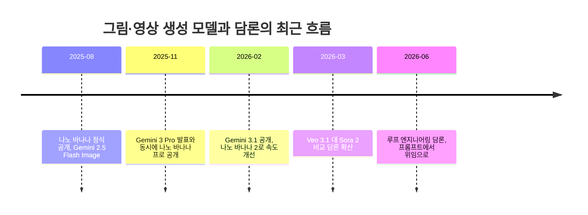
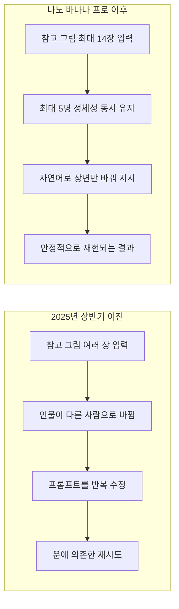
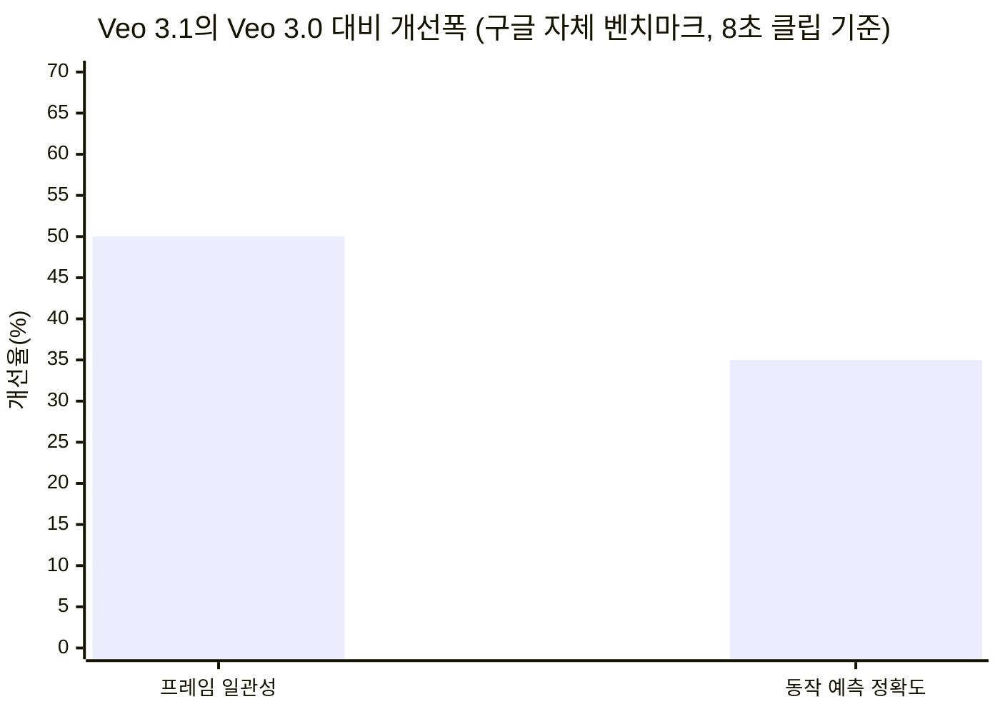
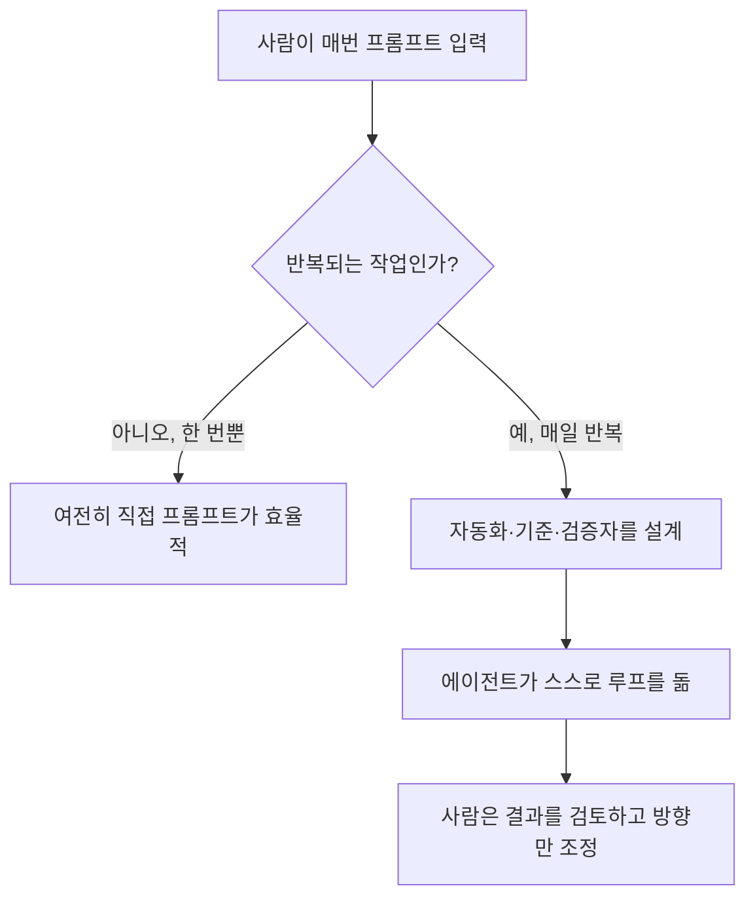
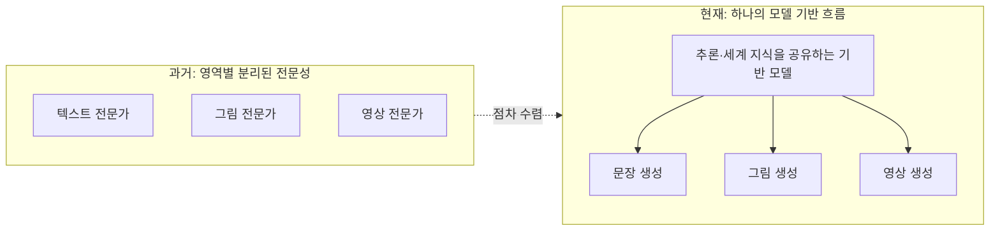

### 멀티모달 AI 수렴과 판단력 중심 전환에 대한 검증된 해설

---

## 목차

1. 들어가며: 한 사람의 경험에서 시작된 질문
2. 그림 생성 기술은 실제로 얼마나 좋아졌는가
3. 영상 생성의 현재: 좋아졌지만 아직 완벽하지 않은 지점
4. 프롬프트 엔지니어링이라는 기술이 메워온 것
5. "루프 엔지니어링": 프롬프트에서 위임으로 넘어가는 담론
6. 텍스트·그림·영상의 경계가 낮아지는 이유
7. 경계가 낮아진 자리에 남는 것: 기획력과 판단력
8. 콘텐츠 산업 전체의 재편: '잘 만드는 경쟁'에서 '생태계 경쟁'으로
9. 원문의 통찰과 검증된 사실을 함께 놓고 보면
10. 맺으며: 남은 질문들

---

## 1. 들어가며: 한 사람의 경험에서 시작된 질문

> 
> https://www.facebook.com/share/p/1GQ6Vtarum/
> 
> 일관성 있는 이미지 한 장을 만들려고 수없이 매달린 적이 있습니다.
> 
> 같은 인물, 같은 톤을 유지하려고 프롬프트를 고치고 또 고쳤습니다. 그 시절 저는 이미지 생성에 가장 많은 시간을 쏟았고, 관련된 책도 두 권 썼습니다. 영상 쪽도 마찬가지였습니다. AI 영상이 나오기 시작하자 거기에도 시간과 비용을 들였습니다.
> 
> 지난 몇 년 동안 AI의 흐름은 텍스트, 이미지, 영상으로 이어지는 멀티모달(Multimodal)이 이끌었습니다. 저는 이 변화가 콘텐츠 산업 전체를 다시 짤 거라고 봤습니다. 그리고 그 한복판에서, 영역마다 따로 쌓아야 할 전문성이 있다고 생각했습니다.
> 
> 그런데 어느 시점부터 그 전제가 흔들리기 시작했습니다.
> 
> 이미지도 영상도, 예전만큼 공을 들이지 않아도 원하는 결과가 나왔습니다. 프롬프트를 정교하게 설계하지 않아도 쓸 만한 이미지가 나오고, 일관성도 어느 정도 유지됩니다. 영상도 같은 방향으로 가고 있습니다.
> 
> 여기서 한 가지를 다시 보게 되었습니다. 그동안 일관성 있는 이미지를 만들려고 들인 노력은, 정말 사용자에게 필요한 노하우였을까요.
> 
> 아니었습니다. 모델이 제대로 만들어내지 못했기 때문에, 그 빈틈을 사람이 메우려고 애쓴 것이었습니다. 프롬프트 엔지니어링(Prompt Engineering)이라 부르던 기술의 상당 부분도 여기에 해당합니다. 도구의 한계를 사람의 숙련으로 보완하던 단계였습니다. 모델이 좋아지면서 그 숙련의 가치도 함께 낮아졌습니다.
> 
> 그리고 이건 이미지나 영상만의 이야기가 아니었습니다.
> 
> AI 전반이 같은 길을 지나고 있습니다. 글을 쓰고, 자료를 정리하고, 업무를 자동화하는 영역마다 비슷한 일이 반복됩니다. 초기에는 도구를 잘 다루는 사람이 앞섰습니다. 프롬프트를 잘 쓰고, 모델의 버릇을 파악하고, 결과를 손보는 감각이 곧 경쟁력이었습니다. 그 감각은 대부분 모델이 아직 서툴렀기 때문에 필요했던 것입니다. 모델이 그 서투름을 스스로 메우기 시작하면서, 다루는 기술의 격차는 줄어들고 있습니다.
> 
> 지금은 질문이 달라졌습니다.
> 
> 정교한 프롬프트 대신, 잘 학습된 모델을 에이전트(Agent)로 세워 작업을 맡기는 쪽이 더 나은 결과를 냅니다. 이미지 한 장, 문장 한 줄을 사람이 직접 손보는 대신, 맥락과 기준을 설계하고 나머지를 위임하는 방식입니다.
> 
> 여기서 초기의 예상이 어긋났습니다. 저는 텍스트 전문가, 이미지 전문가, 영상 전문가가 각자의 영역에서 따로 깊어질 거라고 봤습니다. 실제로는 반대로 가고 있습니다. AI가 각 영역의 만드는 기술을 비슷한 수준으로 끌어올리면서, 영역 사이의 경계가 낮아지고 있습니다. 텍스트와 이미지와 영상이 분리된 전문 분야가 아니라, 하나의 작업 흐름에서 이어지는 단계로 묶이고 있습니다.
> 
> 경계가 낮아진 자리에서 남는 것은 다른 종류의 능력입니다.
> 
> 무엇을 만들지 정하는 판단, 왜 그것이 필요한지 설명하는 기획, 텍스트에서 이미지로 이미지에서 영상으로 이어지는 흐름을 하나로 묶는 설계입니다. AI 시대의 무게중심이 도구를 다루는 기술에서, 도구를 무엇에 쓸지 아는 판단으로 옮겨가고 있습니다.
> 
> 프롬프트를 잘 쓰는 사람이 앞서던 시기는 지나가는 중입니다. 이제는 무엇을 만들 것인지, 그것을 어떤 맥락에서 쓸 것인지 아는 사람이 앞섭니다.
> 
> 도구를 익히느라 보낸 시간이 아깝지는 않습니다. 다만 그 시간이 남긴 것은 기술 자체가 아니라, AI가 어디까지 사람을 대신하고 어디서 사람의 판단이 필요한지를 가르는 감각이었습니다.
> 

공유해주신 글은 개인적인 경험담으로 시작합니다. 일관성 있는 인물 그림 한 장을 만들기 위해 프롬프트를 수없이 고쳐 쓰던 시절이 있었고, 그 과정에서 관련 서적을 두 권 집필할 만큼 깊이 파고들었다는 이야기입니다. 영상 생성이 등장했을 때도 같은 방식으로 시간과 비용을 쏟았다고 밝히고 있습니다.

이 경험을 바탕으로 글쓴이는 하나의 전제가 흔들리고 있다는 관찰을 제시합니다. 지난 몇 년간 AI의 흐름을 이끌어온 것이 텍스트, 그림, 영상으로 이어지는 멀티모달 확장이었고, 처음에는 각 영역마다 별도로 쌓아야 할 전문성이 있을 것이라 예상했지만, 실제로는 모델 자체의 성능이 좋아지면서 그 전문성의 상당 부분이 무의미해지고 있다는 것입니다. 정교한 프롬프트를 설계하는 숙련도보다, 잘 학습된 모델을 에이전트로 세워 맥락과 기준만 던져주고 나머지를 위임하는 방식이 더 나은 결과를 낸다는 판단으로 이어집니다.

이 문서는 이 관찰이 개인적인 인상에 그치는 것인지, 아니면 실제 기술 지표와 업계 담론으로도 뒷받침되는 것인지를 최신 자료로 확인하고, 그 위에서 어떤 능력이 남고 어떤 능력이 옅어지는지를 정리합니다.

---

## 2. 그림 생성 기술은 실제로 얼마나 좋아졌는가

일관성 문제는 실제로 최근까지 그림 생성 모델의 고질적인 약점이었습니다. 나무위키의 나노 바나나 문서는 초기 모델의 한계를 구체적으로 설명하는데, 서로 다른 인물이 담긴 참고 그림 여러 장을 올리고 함께 있는 장면을 요청하면 십중팔구 전혀 다른 인물로 바뀌어 나오는 경향이 있었다고 기록하고 있습니다<cite index="2-1">이는 두 개 이상의 기존 그림을 완벽하게 복제할 수 없어 외모와 의상, 분위기만 비슷하게 새로 만드는 방식이었기 때문입니다.</cite>

이 문제는 2025년 8월 말 구글이 Gemini 2.5 Flash 기반의 나노 바나나(공식명 2.5 Flash Image)를 정식 공개하면서 처음 크게 개선되었고<cite index="45-1">2025년 11월 18일 Gemini 3.0 Pro가 공개된 지 이틀 만에 구글은 그 추론 능력을 그림 생성에 적용한 나노 바나나 프로, 공식명 Gemini 3 Pro Image를 발표했습니다.</cite> 구글 딥마인드의 공식 소개 글에 따르면, 이 모델은 복잡한 구도 속에서도 여러 인물이 포함된 최대 14장의 참고 그림에 걸쳐 일관성을 유지할 수 있고, 최대 5명의 인물에 대해 각각의 정체성과 외형적 특징을 그대로 지킬 수 있다고 설명합니다. 스케치를 실제 제품처럼 바꾸거나 설계도를 실사 수준의 입체 구조로 구현하는 것도 가능해졌다고 밝히고 있습니다.

특히 눈에 띄는 변화는 텍스트 렌더링입니다. 그동안 그림 생성 AI를 다뤄본 사람이라면 누구나 겪었던 문제, 즉 문구를 넣으면 철자가 깨져서 나오는 현상이 나노 바나나 프로에서는 크게 해소되었다는 평가가 여러 매체에서 반복적으로 확인됩니다. 한글, 영어, 일본어, 중국어 등 여러 언어의 문구를 정확하게 그림 안에 배치할 수 있게 되었다는 점도 실무적으로는 상당히 큰 의미를 가집니다.

2026년 2월 19일에는 Gemini 3.1이 공개되며 나노 바나나 2가 뒤를 이었습니다. 나노 바나나 2는 정밀도보다 속도에 초점을 맞춘 모델로, 한 이랜서 블로그의 정리에 따르면 나노 바나나 프로 대비 생성 속도가 약 2~3배 빨라졌고, 여전히 최대 14장의 참고 그림과 5명의 인물 일관성을 유지하는 기능은 그대로 가져갔습니다. 사실적인 사진 스타일과 표정 표현의 폭이 넓어졌다는 점도 이 시기의 특징으로 꼽힙니다.

물론 완전히 흠 없는 상태는 아닙니다. 얼굴을 클로즈업했을 때 미세하게 부자연스러운 표현이 남아 있다는 지적이 나무위키를 비롯한 여러 사용 후기에서 공통적으로 나타나며, 검열 기준이 점차 강화되고 있다는 점, 그리고 디즈니 등 지식재산권 보유 기업들이 저작권 침해 소지를 지적하며 중단을 요구한 사례가 있었다는 점도 함께 언급해 둘 필요가 있습니다. 다만 순수하게 기술적인 측면, 즉 같은 인물을 여러 장면에서 얼마나 안정적으로 유지하는가라는 기준으로 보면, 원문 글쓴이가 프롬프트를 수없이 고쳐 쓰며 씨름했던 문제 자체가 모델 층위에서 상당 부분 해소되었다는 진단은 현재 자료로 뒷받침됩니다.

---

## 3. 영상 생성의 현재: 좋아졌지만 아직 완벽하지 않은 지점

영상 쪽은 그림보다 한 걸음 더딘 상태입니다. 2026년 현재 가장 많이 비교되는 두 축은 오픈AI의 Sora 2와 구글의 Veo 3.1인데, 두 모델을 나란히 테스트한 자료들을 보면 강점이 서로 다르게 나뉩니다. Veo 3.1은 4K 해상도와 공간 음향, 여러 참고 그림을 활용한 인물 일관성 유지 기능에서 앞서고, Sora 2는 영상 길이와 물리적 사실성, 인물의 감정 표현에서 강점을 보인다는 평가가 반복됩니다.

구글이 공개한 내부 벤치마크에 따르면 Veo 3.1은 8초 분량 클립을 기준으로 이전 버전인 Veo 3.0 대비 프레임 간 일관성이 40~60퍼센트 향상되었고, 물리 시뮬레이션 테스트에서 동작 예측 정확도가 약 35퍼센트 높아졌다고 밝히고 있습니다. 이는 구글이 직접 공개한 수치이므로 제3자 기관의 독립 검증 결과는 아니라는 점을 밝혀둡니다.

다만 한계도 뚜렷합니다. Sora 2 실전 활용을 다룬 한 가이드는 클립이 길어질수록 인물의 생김새가 흔들리는 경향이 있어 4~6초 분량이 가장 안정적이며, 긴 이야기를 만들 때는 한 편의 긴 클립보다 짧은 클립을 여러 개 만들어 이어 붙이는 방식을 권장하고 있습니다. 또 다른 비교 자료는 Sora 2가 여러 샷에 걸친 일관성, 즉 장면이 바뀌어도 같은 인물임을 유지하는 능력에서 상대적으로 약하다는 점을 지적하며, 15초를 넘는 클립에서는 미세한 변형이 종종 나타난다고 설명합니다. 나무위키의 소라 문서 역시 일반 모델에서 장면이 뭉개지는 현상이 주기적으로 나타난다고 기록하고 있어, 이 부분은 여러 출처에서 공통적으로 확인되는 한계로 볼 수 있습니다.

정리하면, 영상 생성은 짧은 단일 컷 안에서의 사실감과 음성 동기화 측면에서는 상당한 수준에 도달했지만, 여러 장면에 걸쳐 같은 인물을 안정적으로 유지하는 일, 그리고 긴 호흡의 서사를 한 번에 만드는 일에서는 여전히 사람이 클립을 나누고 다시 이어 붙이는 개입이 필요한 상태입니다. 그림 쪽의 일관성 문제가 상당 부분 해소된 것과 비교하면, 영상은 아직 같은 궤도의 중간 지점에 있다고 보는 편이 정확합니다.

---

## 4. 프롬프트 엔지니어링이라는 기술이 메워온 것

원문 글쓴이는 프롬프트 엔지니어링을 "도구의 한계를 사람의 숙련으로 보완하던 단계"라고 정리합니다. 이 관점은 현재의 업계 논의와 상당 부분 겹칩니다.

프롬프트 엔지니어링을 다룬 나무위키 문서는 이 기술이 각 모델의 특성과 특화 전략을 파악해 원하는 출력을 안정적으로 얻어내는 능력이라고 정의하면서, 동시에 토큰 사용량을 절감하거나 기본 모델로도 상위 모델에 준하는 결과를 뽑아내는 최적화 수단으로도 쓰인다고 설명합니다. 다시 말해 프롬프트 엔지니어링은 모델이 원래 할 수 있는 일을 사람이 더 적은 자원으로, 더 안정적으로 끌어내기 위한 기술이었다는 뜻입니다. 모델 자체가 맥락을 더 잘 이해하고 세계 지식을 더 정확하게 다루게 되면, 그 간극을 메우던 기술의 필요성은 자연히 줄어들 수밖에 없습니다.

흥미로운 점은 2026년 상반기 들어 프롬프트 엔지니어링 자격증 시장을 다룬 한 매체가 현재 시점에도 공인된 표준 시험이나 인증 기관은 존재하지 않는다고 지적하면서, 시중의 모든 관련 과정은 수료증에 가깝다고 정리한 부분입니다. 즉 프롬프트를 잘 쓰는 능력은 표준화된 자격으로 자리잡기도 전에, 모델의 발전 속도에 밀려 그 가치의 성격 자체가 바뀌고 있는 셈입니다.

---

## 5. "루프 엔지니어링": 프롬프트에서 위임으로 넘어가는 담론

원문의 핵심 주장, 즉 정교한 프롬프트보다 에이전트에게 맥락과 기준을 주고 위임하는 방식이 낫다는 관찰은 최근 개발자 커뮤니티에서 실제로 이름이 붙은 담론과 정확히 맞닿아 있습니다.

한 정리 글에 따르면 2026년 6월 7일, 문서 도구 개발사 PSPDFKit과 Nutrient의 창업자인 피터 스타인버거가 SNS에 코딩 에이전트에게 더 이상 직접 프롬프트를 치지 말고, 에이전트에게 프롬프트해 주는 루프 자체를 설계하라는 취지의 글을 올렸고, 이 글이 약 220만 회의 조회수를 기록하며 담론에 불을 붙였습니다. 비슷한 시기 구글의 저명한 엔지니어 애디 오스마니가 자신의 블로그에서 이 흐름을 "루프 엔지니어링"이라는 이름으로 구조화했습니다.

루프 엔지니어링을 정리한 다른 자료는 이를 사람이 매번 프롬프트를 입력하는 자리를, 그 일을 대신 반복해주는 시스템으로 대체하는 설계 작업이라고 한 줄로 정의합니다. 여기서 다루는 대상은 한 번 묻고 끝나는 질문이 아니라, 매일 아침 이슈를 확인하는 일이나 실패한 빌드를 요약하는 일처럼 반복되는 작업입니다. 이 구분을 놓치면 에이전트를 그저 "똑똑한 채팅창" 수준으로만 쓰게 된다는 지적도 함께 담겨 있습니다.

다만 이 자료는 동시에 중요한 단서를 답니다. 프롬프트 자체가 흐리면 루프도 그 흐린 일을 빠르게 반복할 뿐이라는 것입니다. 즉 프롬프트를 다루는 능력 자체가 완전히 사라진다기보다는, 한 번의 결과물을 다듬는 단발성 작업에서 반복 가능한 운영 구조를 설계하는 작업으로 무게중심이 옮겨가고 있다고 보는 편이 더 정확합니다. 이는 원문 글쓴이가 말한 "위임"의 실체에 좀 더 구체적인 윤곽을 더해주는 자료입니다.

---

## 6. 텍스트·그림·영상의 경계가 낮아지는 이유

원문 글쓴이가 짚은 또 다른 지점은 텍스트, 그림, 영상 전문가가 각자 따로 깊어질 것이라는 초기 예상이 빗나갔다는 관찰입니다. 실제로는 세 영역을 관통하는 하나의 흐름으로 묶이고 있다는 것인데, 이 부분도 현재 담론에서 폭넓게 확인됩니다.

한 지역 매체의 연재 기사는 2026년 이후에는 텍스트 AI와 멀티모달 AI를 구분할 필요조차 없어질 것이라는 전망이 업계에서 지배적이라고 전합니다. 실제로 지금의 대형 모델들은 애초에 하나의 모델이 문장과 그림, 영상 이해를 함께 처리하도록 설계되고 있습니다. 나노 바나나 프로가 Gemini 3 Pro라는 언어·추론 모델을 기반으로 그림 생성 기능을 얹은 구조라는 점, 그리고 Veo 3.1이 같은 계열의 오디오·영상 이해 능력을 공유한다는 점이 그 실례입니다. 그림 생성을 별도의 전문 도구로 익히던 시절과 달리, 지금은 대화 하나를 이어가는 과정에서 자연스럽게 그림이 나오고, 그 그림을 참고해 영상으로 확장하는 흐름이 하나의 인터페이스 안에서 이어집니다.

이 변화의 실무적 의미는, 그림을 잘 만드는 사람과 영상을 잘 만드는 사람과 글을 잘 쓰는 사람이 서로 다른 도구 체계를 익혀야 했던 과거와 달리, 지금은 하나의 대화형 인터페이스 안에서 세 가지 결과물을 순차적으로 요청하는 것이 가능해졌다는 점입니다. 도구를 넘나드는 데 필요했던 학습 비용이 크게 줄어든 셈입니다.

---

## 7. 경계가 낮아진 자리에 남는 것: 기획력과 판단력

도구를 다루는 기술의 격차가 줄어들면 무엇이 남을까요. 원문 글쓴이는 무엇을 만들지 정하는 판단, 왜 그것이 필요한지 설명하는 기획, 그리고 각 단계를 하나로 묶는 설계라고 답합니다.

이 답은 최근 여러 자료에서 반복적으로 확인되는 진단과 일치합니다. 한 콘텐츠 산업 기획 기사는 손기술 자체가 경쟁력이던 시대에서 이제는 세계관과 감정선, 커뮤니티 흐름까지 설계할 수 있는 능력이 더 중요해지고 있다고 짚으며, 살아남는 창작자는 단순 제작자가 아니라 세계관을 운영하고 콘텐츠를 지속 확장할 수 있는 이른바 "디렉터형 창작자"일 가능성이 크다는 한 교육자의 견해를 인용합니다. 같은 기사는 과거에는 손기술과 숙련도가 가장 중요한 경쟁력이었다면, 지금은 무엇을 왜 만들어야 하는지 설명하고 방향성을 설계하는 능력이 더 중요해지고 있다고 요약합니다.

개발 영역을 다룬 다른 자료도 비슷한 결론에 도달합니다. 자동화 도구와 코딩 에이전트의 발전으로 단순 구현 능력의 중요성이 점차 줄어들고 있으며, 이제는 얼마나 많은 산출물을 만들어내느냐보다 어떤 방향으로 나아갈지 결정하는 판단력과 무엇을 새롭게 만들어낼지 고민하는 창의성이 생산성을 좌우한다는 설명입니다. 이 자료는 판단력 역시 전문가의 지식과 경험이 담긴 데이터나 에이전트 스킬을 통해 어느 정도 보완할 수 있다고 덧붙이는데, 이는 판단력조차 완전히 개인의 타고난 감각에만 의존하지는 않는다는 점을 시사합니다.

이 지점에서 한 가지 실용적인 질문이 남습니다. "판단력이 중요해진다"는 진단은 이제 거의 상투어에 가까울 만큼 여러 곳에서 반복되고 있지만, 정작 그 판단력을 어떻게 훈련하고 검증할 것인가에 대한 구체적인 방법론은 아직 자료마다 제각각입니다. harness나 루프의 설계, 즉 사람이 세운 기준과 검증 구조 자체가 좋은 판단력을 대신 나타내는 결과물이라는 관점도 있고, 이는 도구 하나를 다루는 손재주보다는 작업 전체의 구조를 설계하는 엔지니어링에 가깝습니다. 결국 "판단력"이라는 말이 가리키는 것이 막연한 감각이 아니라, 검증 가능한 기준을 미리 세우고 결과를 점검하는 구체적인 작업 방식이라는 점은 짚어둘 필요가 있습니다.

---

## 8. 콘텐츠 산업 전체의 재편: '잘 만드는 경쟁'에서 '생태계 경쟁'으로

이 변화는 개인의 역량 문제에 그치지 않고 산업 구조 자체를 흔들고 있습니다. 앞서 인용한 콘텐츠 산업 기사는 이 변화가 단순히 제작 도구 하나가 늘어난 수준이 아니라 콘텐츠 산업 전체의 가치사슬이 재편되는 흐름에 가깝다고 진단합니다. 콘텐츠 자체의 희소성은 낮아지는 대신, 유통 구조와 팬덤 운영, 관계 설계의 중요성이 빠르게 커지고 있다는 것입니다.

같은 기사는 한 제작사 대표의 발언을 인용해 AI로 인해 콘텐츠 단가가 크게 내려간 현실을 지적하고, 전직 정부 관료의 특강 내용을 빌려 앞으로의 경쟁은 개별 작품이 아니라 생태계 설계 능력에서 갈린다는 전망을 전합니다. 결국 남는 것은 취향과 관계, 팬덤이며, 누가 더 강한 커뮤니티를 만들고 더 오래 머물게 하며 더 많은 데이터를 축적하느냐가 핵심 경쟁력이 된다는 분석입니다. 콘텐츠 산업이 대량으로 찍어내는 "공장"보다는 사람들이 계속 돌아오는 이유를 설계하는 "도시"를 닮아가고 있다는 비유도 이 기사에 담겨 있습니다.

이 진단을 원문 글쓴이의 경험과 나란히 놓아보면, 개인이 겪은 변화, 즉 도구를 다루는 숙련이 판단과 기획으로 무게중심을 옮기는 흐름이 산업 층위에서는 제작 경쟁에서 생태계 경쟁으로 옮겨가는 흐름과 같은 뿌리에서 나온 두 가지 표현이라는 점을 알 수 있습니다.

---

## 9. 원문의 통찰과 검증된 사실을 함께 놓고 보면

지금까지 확인한 자료를 원문의 주장과 하나씩 맞춰보면 다음과 같이 정리할 수 있습니다.

그림 생성에서 일관성 문제가 크게 해소되었다는 주장은 나노 바나나 프로와 나노 바나나 2의 실제 기능과 여러 사용 후기로 뒷받침됩니다. 최대 14장의 참고 그림과 5명의 인물 정체성을 유지하는 기능, 그리고 텍스트 렌더링 문제의 해소는 원문이 말한 "예전만큼 공을 들이지 않아도 원하는 결과가 나온다"는 체감과 정확히 맞아떨어집니다.

영상 생성이 같은 방향으로 가고 있다는 주장은 방향성 자체는 맞지만, 그림만큼 완결된 상태는 아닙니다. 짧은 클립의 사실감과 음성 동기화는 상당히 발전했지만, 여러 장면에 걸친 인물 일관성과 긴 서사 구성에서는 여전히 사람이 클립을 나누고 이어 붙이는 개입이 필요합니다. 이 부분은 원문에서 다소 단순화된 지점이라고 볼 수 있습니다.

프롬프트 엔지니어링의 가치가 낮아지고 위임 중심의 작업 방식이 부상하고 있다는 주장은 2026년 6월의 루프 엔지니어링 담론으로 상당히 구체적으로 확인됩니다. 다만 이 담론은 프롬프트를 다루는 능력이 완전히 무의미해진다기보다, 반복 가능한 운영 구조를 설계하는 능력으로 형태를 바꾸고 있다는 점을 강조한다는 차이가 있습니다.

텍스트·그림·영상의 경계가 낮아지고 있다는 주장은 최신 모델들이 하나의 추론 기반 위에 여러 형태의 출력을 얹는 방식으로 설계되고 있다는 점, 그리고 업계에서 텍스트 AI와 멀티모달 AI를 구분할 필요가 없어질 것이라는 전망이 나온다는 점에서 뒷받침됩니다.

남는 것이 기획력과 판단력이라는 결론은 콘텐츠 산업과 개발 산업 양쪽에서 공통적으로 등장하는 진단과 일치합니다. 다만 이 "판단력"이라는 말이 다소 막연하게 쓰이는 경향이 있다는 점, 그리고 그 판단력조차 기준을 미리 설계하고 검증하는 구체적인 작업으로 다시 세분화되고 있다는 점은 원문에 없는 보충 설명으로 덧붙일 만합니다.

---

## 10. 맺으며: 남은 질문들

원문의 마지막 문장은 도구를 익히느라 보낸 시간이 남긴 것은 기술 자체가 아니라, AI가 어디까지 사람을 대신하고 어디서 사람의 판단이 필요한지를 가르는 감각이었다는 성찰로 끝납니다. 이는 AI 도구가 초반에는 인상적인 결과를 빠르게 내놓다가도 나머지 지점에서 맥락을 놓치거나 유지보수성을 간과하는 등, 완결되지 않은 부분을 사람이 메워야 한다는 오래된 문제의식과도 맞닿아 있습니다. 도구가 아무리 좋아져도, 그 결과물을 실제로 쓸 수 있는 형태로 완성시키고 여러 요소를 연결하는 역할은 당분간 사람의 몫으로 남아 있다는 것이 지금까지 확인한 자료들의 공통된 결론입니다.

다만 이 결론에는 아직 열린 질문이 남습니다. 그림에서 시작된 일관성 문제 해소가 영상, 나아가 긴 호흡의 서사 콘텐츠까지 얼마나 빠르게 번질 것인지는 지금 시점에서 단정하기 어렵습니다. 또한 루프 엔지니어링이라는 용어 자체가 2026년 6월 초에 갑작스럽게 확산된 신생 용어라는 점에서, 이것이 앞으로도 계속 쓰일 표준 용어로 자리잡을지, 아니면 얼마 지나지 않아 또 다른 이름으로 바뀔 하나의 유행어에 그칠지도 지켜볼 부분입니다. 원문 글쓴이가 도달한 감각, 즉 도구의 숙련보다 무엇을 어디에 쓸지 아는 판단이 중요해진다는 방향성 자체는 여러 독립된 자료로 확인되지만, 그 판단력을 구체적으로 어떻게 기르고 검증할 것인가는 앞으로도 계속 채워나가야 할 질문으로 남아 있습니다.

---

## 참고 자료

1. 나노 바나나 - 나무위키, https://namu.wiki/w/나노 바나나
2. 나노 바나나 프로를 소개합니다 - Google 공식 블로그(한국어), https://blog.google/intl/ko-kr/company-news/technology/nano-banana-pro/
3. Google rolling out Gemini 3-powered 'Nano Banana Pro' - 9to5Google, https://9to5google.com/2025/11/20/gemini-3-nano-banana-pro/
4. 나노 바나나 2 사용법 - 이랜서 블로그, https://www.elancer.co.kr/blog/detail/990
5. Gemini(인공지능 모델) - 나무위키, https://namu.wiki/w/Gemini(인공지능 모델)
6. Sora 2 서비스 종료: 2026년 최고의 대안, Veo 3.1 - Veo Video Blog, https://veo-video.org/ko/blog/sora2-shutdown-veo31-alternative
7. Veo 3.1 vs Sora 2: 2026년 AI 비디오 생성기 최종 비교 - Veo Video Blog, https://veo-video.org/ko/blog/veo31-vs-sora2
8. Sora 2 완전 정복: 2026년을 위한 실전 AI 영상 가이드, https://pxz.ai/ko/blog/sora-2-mastery-a-real-world-ai-video-guide-for-2026
9. Sora - 나무위키, https://namu.wiki/w/Sora
10. 루프 엔지니어링이란? AI 에이전트 운영 설계 트렌드 정리(2026) - BirdSpring, https://birdspring.com/loop-engineering-facts-2026
11. 루프 엔지니어링, 프롬프트보다 운영 설계가 중요한 이유 2026 - techtaek, https://techtaek.com/
12. 프롬프트 엔지니어링 - 나무위키, https://namu.wiki/w/프롬프트 엔지니어링
13. 프롬프트 엔지니어링 자격증 2026 - FindSkill.ai, https://findskill.ai/ko/blog/프롬프트-엔지니어링-자격증-2026/
14. 텍스트·이미지·음성·영상을 넘나든다 '멀티모달 AI의 시대' - 경북매일, https://www.kbmaeil.com/article/20260314500016
15. [VS기획] '잘 만드는' 시대 끝났다…콘텐츠 산업, '생태계 전쟁' 본격화 됐다 - 벤처스퀘어, https://www.venturesquare.net/1084800
16. AI시대, 이제 생산성은 '판단력과 창의성'에 달려있다 - 클로브 블로그, https://clobe.ai/blog/judgement-creativity-ai

> 원문으로 공유된 페이스북 게시물(https://www.facebook.com/share/p/1GQ6Vtarum/)은 크롤러 접근이 차단되어 있어, 대화창에 인용된 본문 텍스트를 1차 자료로 삼아 정리했습니다.
