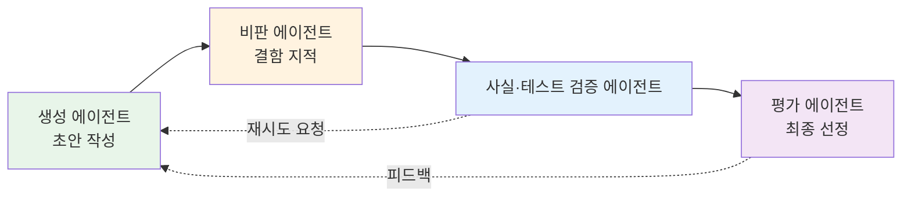
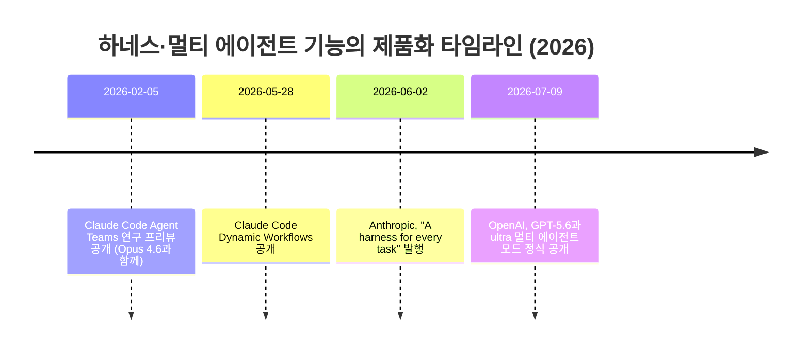
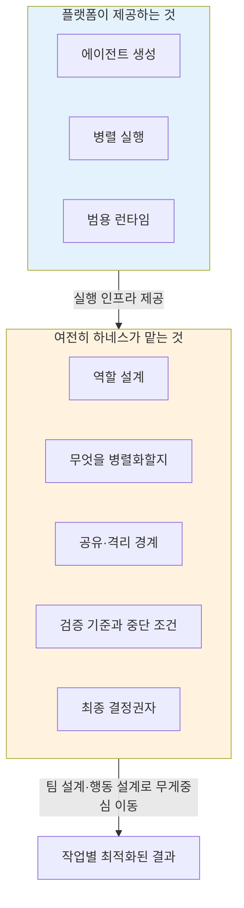

## 목차

0. [들어가며](#0-들어가며)
1. [revfactory/harness는 무엇을 만드는 도구인가](#1-revfactoryharness는-무엇을-만드는-도구인가)
2. [하네스 개념의 재정의: 코드가 아니라 경계와 피드백](#2-하네스-개념의-재정의-코드가-아니라-경계와-피드백)
3. [왜 여러 에이전트를 띄우는 것만으로는 부족한가](#3-왜-여러-에이전트를-띄우는-것만으로는-부족한가)
4. [품질 향상의 증거와 아직 남은 한계](#4-품질-향상의-증거와-아직-남은-한계)
5. [예상보다 빠르게 진행된 제품 흡수 — 타임라인 검증](#5-예상보다-빠르게-진행된-제품-흡수--타임라인-검증)
6. [흡수된 이후에도 하네스가 사라지지 않는 이유](#6-흡수된-이후에도-하네스가-사라지지-않는-이유)
7. [앞으로 연구해야 할 것: 에이전트 그 자체](#7-앞으로-연구해야-할-것-에이전트-그-자체)
8. [댓글로 이어진 두 가지 논의](#8-댓글로-이어진-두-가지-논의)
9. [종합 정리](#9-종합-정리)
10. [참고 자료](#10-참고-자료)

---

## 0. 들어가며

> 
> https://www.facebook.com/share/p/18Zka7q3Br/
> 
> "하네스의 핵심이 결국 멀티에이전트였다"  정말 동의합니다. 오늘 발행한 제 에세이와도 연결이 되구요. 특히 5, 6번 항목에 제일 동의하는데, 오케스트레이션이 플랫폼에 흡수될수록 하네스의 무게중심이 실행 인프라에서 팀 설계, 행동 설계, 평가로 옮겨간다는 관찰이 정확하다고 봅니다. 제 오늘 에세이와 지난 주말 실험도 이 주제였어요.
> 
> 한 가지만 더 이야기하면, 저는 그 "흡수 이후 남는 층"이 생각보다 더 근본적일 수 있다고 생각해요. 요즘 서로 다른 회사의 CLI(Claude, Codex, Gemini, Grok)를 한 프로젝트에 붙여서 중앙 지휘 없이 게시판 하나와 규칙 몇 개로만 협업시키는 실험을 하는데, 흥미로운 건 역할과 축적된 맥락이 특정 브레인이 아니라 현장에 남는다는 원칙을 지키는 것이 매우 중요하다고 생각해요. 회사에서 사람이 바뀌어도 직책과 조직의 지식은 남는 것과 비슷한데, 그러면 브레인은 갈아끼우는 것이 되고, 하네스는 그 위에 얹히는 지속적인 substrate가 됩니다.
> 
> "분산, 비용, 복구가능성, 추적가능성, 인간개입 빈도까지 측정”에는 완전 공감합니다. 이 관련 모니터 도구도 만들어서 측정하고 있는데, 단일 성적표 때문에 숨겨지는 것이 많죠. 그 밖에도 팀 적합도, 통합 지점(seam)의 버그 등도 진짜 중요한 신호라고 보고 세션마다 모니터링하고 기록하는 중입니다. 이런 실험이 더 필요하다는 말씀에 전적으로 동의하고, 이 글 참고해서 제 플랫폼을 더 업그레이드 해봐야겠습니다. 사실 프론티어 모델 하나에 의존하는 접근이 맞는지에 대한 근본적인 회의가 있는데, 그 때문에라도 하네스는 중요하다고 봅니다.
> 

원문은 revfactory라는 개발자가 자신이 만든 오픈소스 도구 revfactory/harness를 회고하면서, 그 프로젝트를 통해 얻은 결론 하나를 정리한 글입니다. 결론을 한 문장으로 요약하면, 하네스라는 것을 겉보기에는 에이전트와 스킬을 자동 생성해주는 설정 도구로 만들었지만, 실제로 그 프로젝트가 다루고 있던 진짜 문제는 여러 에이전트를 어떻게 역할별로 나누고, 서로 검증하게 하고, 실패해도 다시 시도하게 만들 것인가라는 멀티 에이전트 설계의 문제였다는 것입니다.

이 문서는 원문의 여섯 개 절을 순서대로 따라가면서, 각 절에서 언급된 사실 관계—날짜, 수치, 제품명—를 최신 자료로 하나씩 대조해 확인한 결과를 함께 담았습니다. 검증 결과를 먼저 요약하면, 원문에 등장하는 날짜와 수치, 제품명은 모두 실제 공개된 자료와 일치했습니다. 다만 자체 A/B 실험 수치(49.5점에서 79.3점으로 상승)는 저자 본인이 15개 과제를 대상으로 직접 측정한 결과이며, 저장소 자체에도 "제3자의 반복 검증이 아직 이루어지지 않았다"는 점이 공식적으로 명시되어 있다는 사실을 함께 확인했습니다. 이 부분은 아래 4장에서 다시 짚겠습니다.

---

## 1. revfactory/harness는 무엇을 만드는 도구인가

revfactory/harness는 2026년 3월 말 공개된 Claude Code용 플러그인으로, 검색 시점 기준 GitHub에서 8,309개의 별을 받은 상태였습니다. 원문의 "8,300개 이상"이라는 표현과 정확히 일치합니다[1]. 사용자가 "하네스 구성해줘" 혹은 영어로 "build a harness for this project"라고 요청하면, 이 플러그인은 여섯 단계를 거쳐 프로젝트에 맞는 에이전트 팀과 스킬 세트를 자동으로 생성합니다. 도메인 분석, 팀 아키텍처 설계, 에이전트 정의 파일 생성, 스킬 생성, 오케스트레이션 연결, 그리고 검증 및 테스트라는 여섯 단계입니다[2].

이 도구가 선택할 수 있는 협업 구조는 파이프라인, 팬아웃/팬인, 전문가 풀, 생성자-검토자, 감독자, 계층적 위임의 여섯 가지이며, 원문에 나열된 패턴 이름과 정확히 일치합니다[3]. 흥미로운 점은 revfactory 저장소가 스스로를 "L3 메타 팩토리 레이어"에 속한 도구로 규정하고 있다는 사실입니다. 즉 하네스 그 자체를 만드는 것이 아니라, 다른 하네스들을 만들어내는 상위 계층의 도구로 스스로를 위치시킨 것입니다. 같은 계층에는 결정론적 런타임 설정을 만들어주는 Archon이라는 이웃 도구가 있고, harness는 그중에서도 "팀 아키텍처 팩토리" 역할을 맡는다고 설명되어 있습니다[4]. 이 구도는 저자가 하네스라는 개념을 코드 몇 줄이 아니라 하나의 방법론 계층으로 다루고 있음을 보여줍니다.

관련 저장소로는 15개 소프트웨어 엔지니어링 과제에 대한 통제 실험을 담은 revfactory/claude-code-harness, 10개 도메인에 걸쳐 100개의 완성형 하네스를 제공하는 revfactory/harness-100(총 1,808개의 마크다운 파일로 구성)이 있으며, Claude Code 전용이라는 한계에 대응해 Codex용으로 이식된 SaehwanPark/meta-harness라는 별도 프로젝트도 이미 공개되어 있는 것으로 확인됩니다[5][6].

---

## 2. 하네스 개념의 재정의: 코드가 아니라 경계와 피드백

원문은 하네스를 흔히 모델 바깥에 존재하는 고정된 실행 코드로 이해하는 통념에서 출발합니다. Anthropic 역시 에이전트 하네스를, 모델을 실제로 작동하는 에이전트로 바꾸어주는 주변 구조 — 실행 루프, 도구, 컨텍스트 관리, 가드레일을 포함하는 소프트웨어적 스캐폴딩 — 으로 정의해 왔습니다.

그러나 저자는 하네스의 범위를 코드에 한정하지 않았습니다. 역할과 책임, 사용 가능한 도구, 컨텍스트의 범위, 작업 전달 방식, 실패 시 행동, 검증 기준과 종료 조건까지도 에이전트의 행동을 둘러싸는 하네스의 일부로 보았습니다. 그리고 모델이 발전할수록 고정 코드가 담당하던 판단의 일부를 에이전트 스스로 맡게 되면서, 하네스의 성격 자체가 "모든 행동을 미리 지정하는 시스템"에서 "에이전트가 올바른 결정을 내리도록 경계와 피드백을 설계하는 시스템"으로 이동한다는 것이 이 절의 핵심 주장입니다.

이 관점은 이후 5장에서 다룰 Anthropic의 실제 행보와도 맞물립니다. 2026년 6월 공개된 Anthropic의 후속 아티클에서, Claude Code 팀은 정확히 같은 문제의식을 다음과 같이 표현했습니다. 기본 Claude Code 하네스는 하나의 컨텍스트 창 안에서 계획과 실행을 동시에 수행해야 하는데, 작업이 길어지고 병렬적이며 구조화되고 대립적인 성격을 띨수록 이 방식이 무너지기 시작한다는 것입니다. 구체적으로는 복잡한 작업 중 일부만 처리하고 끝났다고 선언해버리는 "에이전트의 게으름", 자신의 결과물을 검증할 때 스스로에게 관대해지는 "자기 선호 편향", 여러 턴을 거치며 원래 목표에서 조금씩 멀어지는 "목표 이탈"이라는 세 가지 실패 양상이 그것입니다[7][8]. 원문이 말한 "고정 코드 중심에서 경계와 피드백 설계로"라는 이동은, 몇 달 뒤 Anthropic이 공식적으로 이름 붙인 세 가지 실패 양상에 대한 대응과 사실상 같은 문제를 가리키고 있었던 셈입니다.

---

## 3. 왜 여러 에이전트를 띄우는 것만으로는 부족한가

원문의 두 번째 절은 멀티 에이전트의 가치가 단순히 모델 인스턴스를 여러 개 실행하는 데서 나오지 않는다고 못박습니다. 핵심은 각 에이전트가 서로 다른 역할과 독립적인 컨텍스트를 가지고 문제를 바라보게 만드는 것입니다. 한 에이전트는 결과물을 만들고, 다른 에이전트는 비판하며, 또 다른 에이전트는 사실이나 테스트 결과를 검증하는 식의 역할 분리가 있어야 비로소 협업의 가치가 생긴다는 것입니다.

아래는 원문이 설명한 생성-비판-검증-평가의 순환 구조를 도식화한 것입니다.

원문은 이 구조가 단일 에이전트에서 자주 발생하는 자기 확신, 목표 이탈, 중간 단계 누락을 줄이는 데 도움이 된다고 설명하면서, 근거로 Anthropic이 공개한 Dynamic Workflows의 대표 패턴들을 인용합니다. 팬아웃 후 결과를 종합하는 방식, 여러 에이전트가 서로의 결과를 대립적으로 검증하는 방식, 생성한 뒤 걸러내는 방식, 토너먼트 방식, 완료될 때까지 반복하는 방식이 그것입니다. 실제로 2026년 6월 Anthropic이 공개한 문서를 확인한 결과, 이 다섯 가지 패턴의 이름과 설명이 원문의 서술과 정확히 대응하는 것을 확인했습니다. 분류 에이전트로 작업 유형을 나눈 뒤 다른 에이전트나 행동으로 라우팅하는 "분류 후 실행", 작업을 잘게 쪼개 각각 에이전트를 붙이고 결과를 종합하는 "팬아웃 후 종합", 발견 사항마다 반박을 전담하는 별도 에이전트를 붙이는 "대립적 검증", 폭넓게 아이디어를 만든 뒤 기준에 따라 걸러내는 "생성 후 필터링" 등이 실제 Anthropic 문서에 그대로 등장합니다[7][9].

장기 실행 작업에서 중요한 것이 에이전트의 의지만이 아니라는 원문의 지적 역시 실제 사례로 뒷받침됩니다. Anthropic의 세이프가드 팀 연구자 Nicholas Carlini가 진행한 실험에서는, 16개의 Claude 에이전트에게 리눅스 커널을 컴파일할 수 있는 Rust 기반 C 컴파일러를 처음부터 작성하도록 맡겼습니다. 사람의 실시간 개입 없이 약 2,000회의 Claude Code 세션과 약 2만 달러의 API 비용을 거쳐, x86과 ARM, RISC-V 아키텍처에서 리눅스 6.9를 빌드할 수 있는 10만 줄 규모의 컴파일러가 만들어졌습니다[10]. 연구자 본인이 밝힌 소감에 따르면, 이 실험에서 가장 많은 노력이 들어간 부분은 병렬 실행 그 자체가 아니라 에이전트가 스스로 방향을 잃지 않도록 만드는 테스트 환경, 컨텍스트 창을 오염시키지 않는 로그 설계, 진행 상황을 기록하는 문서 체계였습니다. 다만 연구자 본인도 이 실험이 진짜로 작업이 끝났다고 안심할 수 있는 수준은 아니며, 사람이 결과물을 직접 검증하지 않은 채 배포하는 것에 대한 우려를 함께 밝히고 있다는 점도 확인됩니다[10].

---

## 4. 품질 향상의 증거와 아직 남은 한계

원문에서 저자는 자신이 만든 하네스를 적용했을 때 15개 소프트웨어 엔지니어링 과제에서 평균 품질 점수가 49.5점에서 79.3점으로 상승했고, 결과 분산이 32퍼센트 줄었다고 밝힙니다. 이 수치를 저장소 문서와 대조한 결과, revfactory/claude-code-harness 저장소는 "기본 난이도에서 23.8점, 고급 난이도에서 29.6점, 전문가 난이도에서 36.2점 상승"이라는 난이도별 수치를 공개하고 있었고, 원문의 49.5→79.3이라는 수치는 이 난이도별 결과의 평균값에 해당하는 것으로 보입니다[11]. 중요한 것은, 저장소 자체가 이 실험을 "저자 본인이 측정한 n=15 결과이며, 제3자의 반복 검증이 아직 이루어지지 않았다"는 문구를 모든 인용 문장에 함께 붙여야 한다는 원칙을 공식적으로 명시하고 있다는 점입니다[4]. 원문에서 저자 스스로 "표본이 15개로 작고 직접 측정한 결과라서 아직 제3자의 반복 검증이 필요하다"고 밝힌 것은, 이 공식 문서화 방침과 정확히 같은 태도입니다. 다시 말해 이 수치는 과장되거나 검증되지 않은 채 제시된 것이 아니라, 처음부터 한계를 명시한 자체 실험 결과로 이해하는 것이 정확합니다.

외부 검증의 근거로 원문이 인용한 것은 Anthropic의 리서치 시스템 관련 엔지니어링 글입니다. Anthropic은 자사의 내부 평가에서, Opus 4를 단독으로 사용했을 때보다 Opus 4를 리드 에이전트로 두고 Sonnet 4를 서브에이전트로 배치한 멀티 에이전트 구조가 90.2퍼센트 더 높은 성능을 보였다고 공개했습니다. 특히 여러 방향을 동시에 탐색해야 하는 광범위 탐색형 질의에서 그 차이가 두드러졌다고 설명합니다[12]. 다만 같은 문서는 멀티 에이전트 시스템이 일반 채팅 대비 약 15배 많은 토큰을 사용한다는 점, 그리고 모든 에이전트가 같은 컨텍스트를 공유해야 하거나 에이전트 간 의존성이 높은 작업에는 이 구조가 적합하지 않다는 점을 명시적으로 밝히고 있습니다[12]. 원문이 인용한 두 수치(90.2퍼센트, 15배)는 모두 정확했습니다.

이 대목에서 저자가 던지는 질문 — "멀티 에이전트를 사용할 것인가?"가 아니라 "이 작업의 가치가 병렬화와 협업에 드는 비용을 정당화하는가?" — 는 Anthropic이 실제로 밝힌 한계(모든 상태를 공유해야 하는 작업이나 상호 의존성이 높은 작업에는 부적합)와 정확히 같은 결을 가진 질문입니다.

---

## 5. 예상보다 빠르게 진행된 제품 흡수 — 타임라인 검증

원문의 네 번째 절은 revfactory/harness가 다루던 문제의식이 머지않아 Anthropic이나 OpenAI의 기본 기능으로 흡수될 것이라는 예측이 실제로 얼마나 빨리 현실화되었는지를 짚습니다. 아래 타임라인은 원문에 언급된 네 개의 사건과 그 날짜를 실제 공개 자료로 하나씩 대조한 결과입니다.

첫째, Claude Code의 Agent Teams는 실제로 2026년 2월 5일, Opus 4.6과 함께 연구 프리뷰 형태로 공개되었습니다[13][14]. 한 세션이 팀 리드 역할을 맡고, 여러 팀원 에이전트가 각자의 컨텍스트 창과 Git worktree를 가진 채 병렬로 작업하며, 우편함 방식의 메시지 시스템으로 서로 직접 소통한다는 구조입니다. 이는 원문이 말한 "여러 에이전트가 서로 다른 컨텍스트를 가지고 협력한다"는 원칙이 실제 제품 기능으로 구현된 첫 사례로 볼 수 있습니다.

둘째, 2026년 5월 28일 Anthropic은 Dynamic Workflows를 공개했습니다. 이는 하나의 세션에서 Claude가 스스로 자바스크립트 오케스트레이션 스크립트를 작성해 수십에서 수백 개의 서브에이전트를 백그라운드에서 실행하고, 세션이 중단되어도 저장된 진행 상황에서 이어받을 수 있게 하는 기능입니다[8][9]. 실제 활용 사례로 Anthropic이 언급한 것은 개발자 Jarred Sumner가 Bun 프로젝트를 Zig에서 Rust로 이식한 작업으로, 약 75만 줄 규모의 러스트 코드를 첫 커밋부터 병합까지 11일 만에 완료했고, 기존 테스트 스위트의 99.8퍼센트를 통과시켰다고 공개되어 있습니다[9].

셋째, 2026년 6월 2일 Anthropic은 "A harness for every task"라는 제목의 후속 아티클을 발행했습니다. 제목이 원문에서 인용한 표현과 정확히 일치하며, 실제로 이 글은 Claude가 작업에 맞는 멀티 에이전트 하네스를 즉석에서 작성하고 오케스트레이션할 수 있다고 설명합니다. 사용자는 워크플로를 직접 요청하거나, ultracode라는 트리거 키워드 혹은 효과 수준 설정을 통해 Claude가 필요할 때 스스로 워크플로를 만들도록 할 수 있습니다[7][8].

넷째, 2026년 7월 9일 OpenAI는 GPT-5.6 패밀리(Sol, Terra, Luna)를 정식 공개하면서 ultra라는 멀티 에이전트 가속 모드를 함께 선보였습니다. ultra는 기본적으로 네 개의 에이전트를 병렬로 조정하며, 벤치마크 상황에서는 16개까지 확장한 결과도 함께 공개되었습니다. OpenAI는 BrowseComp, SEC-Bench Pro, Terminal-Bench 2.1이라는 세 가지 평가에서 단일 에이전트 대비 더 높은 점수와 더 짧은 완료 시간을 보였다고 밝혔으며, Responses API에도 여러 서브에이전트를 병렬 실행하고 결과를 종합하는 멀티 에이전트 기능이 베타로 추가되었습니다[15][16][17]. 원문에 언급된 벤치마크 이름과 날짜, "네 개의 에이전트"라는 설명은 모두 정확했습니다.

정리하면, 원문에서 언급된 네 사건의 날짜와 세부 내용은 검증 결과 모두 실제 공개 자료와 일치했습니다. 원문이 강조하듯, 이 네 사건이 revfactory/harness라는 하나의 프로젝트가 옳았다는 증거는 아닙니다. 다만 작업 분해, 병렬 실행, 전문화, 반복 검증이라는 같은 방향의 아이디어가 여러 독립적인 연구와 제품에서 동시에 관찰되고 있다는 신호로는 볼 수 있습니다.

---

## 6. 흡수된 이후에도 하네스가 사라지지 않는 이유

원문의 다섯 번째 절은 플랫폼이 멀티 에이전트 기능을 기본으로 제공하면 별도의 하네스가 필요 없어지는 것처럼 보일 수 있지만, 실제로는 그 반대라고 주장합니다. 플랫폼이 제공하는 것은 에이전트를 생성하고 병렬로 실행하는 범용 능력이지만, 어떤 역할을 만들지, 무엇을 병렬화할지, 어떤 정보를 공유하거나 격리할지, 누가 최종 결정을 내릴지, 어떤 기준으로 검증하고 언제 중단할지는 여전히 작업과 도메인에 따라 달라진다는 것입니다.

이 관점은 실제로 Anthropic이 2026년 6월 문서에서 밝힌 태도와도 겹칩니다. Anthropic은 정적 워크플로가 모든 예외 상황을 처리해야 하기 때문에 보통 더 범용적으로 설계될 수밖에 없다고 인정하면서도, Claude Opus 4.8과 결합된 동적 워크플로는 매번 상황에 맞춘 맞춤형 하네스를 작성할 수 있을 만큼 충분히 똑똑해졌다고 설명합니다[8]. 다만 동적 워크플로 역시 일반 세션보다 훨씬 많은 토큰을 소비하며, 복잡하고 가치가 높은 작업에 적합하다는 점을 함께 명시하고 있어[16], 정적 구조와 동적 구조가 서로를 완전히 대체하기보다는 상황에 따라 선택되는 관계에 있다는 원문의 주장과 부합합니다.

---

## 7. 앞으로 연구해야 할 것: 에이전트 그 자체

원문의 여섯 번째 절은 지금이 멀티 에이전트가 널리 쓰이기 시작하는 극초기 단계이며, 앞으로 필요한 것은 오케스트레이션 인프라 경쟁이 아니라 에이전트 자체에 대한 연구라고 주장합니다. 에이전트의 역할을 어느 수준까지 구체화해야 하는지, 행동의 자유와 통제의 경계를 어디에 둘 것인지, 에이전트 간 통신과 공유 상태, 충돌 해결, 실패 전파, 비용 예산과 종료 조건을 어떻게 설계할 것인지가 앞으로의 과제라는 것입니다.

평가 방법에 대한 지적도 눈여겨볼 대목입니다. 최종 결과의 성공 여부만 보는 평가를 넘어, 품질뿐 아니라 결과의 분산, 비용, 지연 시간, 복구 가능성, 추적 가능성, 인간 개입의 빈도까지 함께 측정해야 한다는 주장입니다. 이는 실제로 Anthropic이 C 컴파일러 실험 및 Dynamic Workflows 관련 문서에서 반복적으로 강조한 지점과 일치합니다. 예컨대 Dynamic Workflows 공식 문서는 검증 에이전트가 어떤 주장을 확인할 수 없을 때 이를 "반박된 것"으로 처리하지 않고 "검증 불가"로 별도 표시하도록 최근 버전에서 수정되었다고 밝히고 있는데[9], 이는 원문이 말하는 "불안정한 경로를 거친 시스템과 반복 가능하고 설명 가능한 시스템은 동일한 품질이 아니다"라는 문제의식과 정확히 맞닿아 있습니다.

---

## 8. 댓글로 이어진 두 가지 논의

원문 아래에는 두 개의 댓글이 달려 있었고, 각각 원문의 논지를 확장하는 관점을 제시합니다.

첫 번째 댓글을 남긴 사람은 원문의 5번과 6번 항목, 즉 오케스트레이션이 플랫폼에 흡수될수록 하네스의 무게중심이 실행 인프라에서 팀 설계와 행동 설계, 평가로 옮겨간다는 관찰에 동의를 표하면서, 자신의 실험 하나를 소개합니다. 서로 다른 회사의 CLI 도구(Claude, Codex, Gemini, Grok)를 하나의 프로젝트에 붙여 중앙의 지휘자 없이 게시판 하나와 몇 가지 규칙만으로 협업시키는 실험입니다. 이 댓글 작성자가 강조한 원칙은, 역할과 그동안 축적된 맥락이 특정 모델(브레인)이 아니라 작업 현장에 남아야 한다는 것입니다. 회사에서 담당자가 바뀌어도 직책과 조직의 지식은 남는 것과 같은 이치로, 이 원칙을 지키면 브레인(모델)은 언제든 교체 가능한 부품이 되고 하네스는 그 위에 지속적으로 얹히는 substrate, 즉 기반 구조가 된다는 것입니다. 이는 이 댓글 작성자 본인의 실험과 의견이며, 외부에서 별도로 검증할 수 있는 공개된 벤치마크나 발표 자료는 아니라는 점을 밝혀 둡니다.

두 번째 댓글은 축하 인사와 함께, 원문의 4번 항목에서 다룬 "프론티어 모델이 하네스를 흡수할 것"이라는 전망에 대해 한 가지 질문을 던집니다. 도메인에 특화된 하네스는 모델이 다룰 수 없다는 시각이 많지만, 결국 모델이 사람과의 대화나 검색을 통해 도메인 지식을 습득한 뒤 스스로 하네스를 만들어내는 시점이 아주 가까운 미래에 오지 않겠느냐는 질문입니다.

이 질문에 대해서는 이미 관찰 가능한 근거가 일부 존재합니다. 앞서 5장에서 확인했듯 Anthropic의 Dynamic Workflows는 이미 Claude가 작업 설명을 읽고 스스로 오케스트레이션 스크립트를 작성하는 방식으로 작동하며, Anthropic 스스로도 이를 "Claude가 사용자의 용도에 맞춰 완벽하게 재단된 하네스를 작성할 만큼 충분히 똑똑해졌다"고 설명하고 있습니다[8]. 다만 이것이 도메인 지식 자체를 모델이 대화나 검색을 통해 축적해 하네스에 반영한다는 의미인지, 아니면 정해진 몇 가지 오케스트레이션 패턴 중 하나를 상황에 맞게 골라 조립하는 수준인지는 별개의 문제입니다. 현재 공개된 자료를 기준으로 보면 Dynamic Workflows는 후자, 즉 팬아웃-종합, 대립적 검증, 분류 후 실행, 생성 후 필터링, 토너먼트, 완료까지 반복이라는 정해진 여섯 가지 패턴을 상황에 맞게 조합하는 수준에 가깝고, 도메인 지식 자체를 처음부터 새로 학습해 완전히 새로운 하네스 구조를 창안하는 단계라는 근거는 검색된 자료에서 확인되지 않았습니다. 따라서 이 두 번째 댓글의 질문은 현재로서는 아직 답이 나오지 않은, 열려 있는 질문으로 보는 것이 정확합니다.

---

## 9. 종합 정리

원문 전체를 관통하는 주장을 정리하면 다음과 같습니다. 하네스라는 개념은 원래 에이전트를 감싸는 코드나 설정 파일의 형태가 아니라, 에이전트가 오랫동안 방향을 잃지 않고 일하고, 서로 다른 관점에서 협력하며, 자신의 결과를 반복해서 의심하고 검증하게 만드는 구조 그 자체였습니다. revfactory/harness라는 프로젝트는 처음에는 하네스 파일을 자동 생성하는 도구처럼 보였지만, 저자 본인이 회고하듯 그 프로젝트의 진짜 관심사는 처음부터 작업 분해와 행동 제어, 협력 구조와 상호 검증에 있었습니다.

이 문제의식은 저자 혼자만의 것이 아니라, 실제로 2026년 한 해 동안 Anthropic과 OpenAI 양쪽에서 거의 동시에 제품 기능으로 구현되었다는 것이 이번 검증을 통해 확인된 사실입니다. 다만 그렇다고 해서 하네스 설계라는 작업 자체가 사라지는 것은 아니며, 오히려 플랫폼이 실행 인프라를 표준화할수록 사람이 설계해야 할 부분은 역할 정의, 검증 기준, 평가 방식 쪽으로 옮겨간다는 것이 원문과 댓글들이 공통으로 도달한 결론입니다. 프론티어 모델이 도메인 특화 하네스까지 스스로 만들어낼 수 있을지는, 지금까지 공개된 자료를 기준으로는 아직 열려 있는 질문으로 남아 있습니다.

---

## 10. 참고 자료

[1] SkillsLLM, "harness - AI Agents on GitHub (8.2k★)" — https://skillsllm.com/skill/harness

[2] Harness 공식 소개 페이지 — https://revfactory.github.io/harness/

[3] GitHub, revfactory/harness README — https://github.com/revfactory/harness/blob/main/README.md

[4] GitHub, revfactory/harness README (FAQ 및 논문 인용 포함) — https://github.com/revfactory/harness

[5] GitHub, revfactory/harness-100 — https://github.com/revfactory/harness-100

[6] GitHub, revfactory/claude-code-harness — https://github.com/revfactory/claude-code-harness

[7] Anthropic, "A harness for every task: dynamic workflows in Claude Code" — https://claude.com/blog/a-harness-for-every-task-dynamic-workflows-in-claude-code

[8] InfoQ, "Anthropic Explains How Claude Builds Its Own Execution Harnesses" — https://www.infoq.com/news/2026/06/claude-code-harnesses/

[9] Claude Code Docs, "Orchestrate subagents at scale with dynamic workflows" — https://code.claude.com/docs/en/workflows

[10] Anthropic Engineering, "Building a C compiler with a team of parallel Claudes" (Nicholas Carlini) — https://www.anthropic.com/engineering/building-c-compiler

[11] GitHub, revfactory/claude-code-harness README (실험 설계 및 수치) — https://github.com/revfactory/claude-code-harness

[12] Anthropic Engineering, "How we built our multi-agent research system" — https://www.anthropic.com/engineering/multi-agent-research-system

[13] X(Twitter), Claude 공식 계정, Agent Teams 공개 발표 (2026-02-05) — https://x.com/claudeai/status/2019467383191011698

[14] Claude Code Docs, "Orchestrate teams of Claude Code sessions" — https://code.claude.com/docs/en/agent-teams

[15] OpenAI, "GPT-5.6: Frontier intelligence that scales with your ambition" — https://openai.com/index/gpt-5-6/

[16] Digital Applied, "GPT-5.6 Goes Public: GA Pricing, Ultra Mode and Access" — https://www.digitalapplied.com/blog/gpt-5-6-sol-terra-luna-public-ga

[17] OpenAI Release Notes — https://openai.com/products/release-notes/

---

*이 문서는 원문(Facebook 게시글 및 첨부 이미지)과 두 개의 댓글, 그리고 2026년 7월 15일 기준 최신 공개 자료를 대조하여 작성되었습니다. 원문 저자 본인이 명시한 실험(A/B 테스트 수치)은 저자 스스로 한계를 밝힌 자체 측정 결과이며, 그 외 인용된 날짜·수치·제품명은 모두 별도의 공개 출처로 교차 확인되었습니다.*
