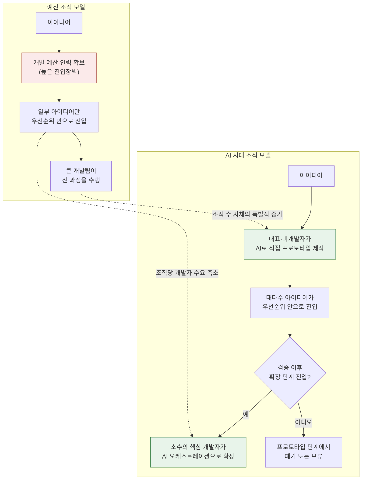

> 
> https://www.threads.com/@dev._pill/post/Da0mxpiAWBU
> 
> Fable 5를 보면서 오히려 생각이 바뀌었다.
> 
> 예전에는 앱은 커녕 웹사이트 하나 만드는 일조차 스타트업에서 늘 우선순위 뒤로 밀렸다. 비용도 크고 개발자가 필요했기 때문이다.
> 
> 그런데 이제는 대표가 직접 AI로 프로토타입을 만든다. 만들 수 있게 되니 비즈니스 자체가 우선순위 안으로 들어온 것이다.
> 
> 물론 운영·확장 단계에 가면 비개발자 혼자 감당할 수는 없다.
> 
> 그래서 나는 ‘AI가 개발자를 대체한다’보다 ‘모든 조직이 소프트웨어 조직이 된다’에 가깝다고 본다.
> 
> 조직마다 필요한 개발자 수는 줄어들 수 있다. 대신 개발자가 필요한 조직의 수는 폭발적으로 늘어난다.
> 
> 앞으로는 큰 개발팀보다, AI를 활용해 전체 개발 리소스를 관리하는 소수의 핵심 개발자가 더 중요해질 것 같다.
> 

## 목차

1. 들어가며
2. 원문이 말하는 것
3. 배경 지식: Claude Fable 5는 무엇이고 왜 최근 이렇게 시끄러웠나
4. 관찰 1 — "대표가 직접 프로토타입을 만든다"는 것의 실증적 근거
5. 관찰 2 — 진입장벽이 무너지면 비즈니스 우선순위 자체가 바뀐다
6. 관찰 3 — 운영·확장 단계의 벽: 바이브 코딩의 한계
7. 핵심 재해석 — "대체"가 아니라 "확산"이라는 프레임
8. 조직 구조의 변화: 큰 개발팀에서 소수의 오케스트레이션 인력으로
9. 종합 판단: 어디까지가 확인된 사실이고 어디부터가 추론인가
10. 참고자료

---

## 1. 들어가며

JinYong님이 공유한 Threads 게시글(@dev._pill, 2026년)은 Claude Fable 5를 지켜보면서 저자의 생각이 바뀌었다는 개인적 관찰에서 출발합니다. 이 문서는 그 게시글이 던지는 세 가지 관찰과 하나의 결론을 하나씩 뜯어보면서, 각 주장이 현재(2026년 7월 기준) 공개된 데이터와 업계 보도로 얼마나 뒷받침되는지, 그리고 어디서부터는 저자 개인의 해석과 예측인지를 구분해서 정리한 것입니다. 막연한 추측을 피하기 위해 관련 통계와 최신 보도를 직접 검색해 확인했고, 확인이 안 되는 부분은 "저자의 의견" 또는 "업계에서 논의되는 예측"이라고 명시했습니다.

## 2. 원문이 말하는 것

게시글의 논리 흐름을 정리하면 다음과 같습니다.

- 과거에는 웹사이트나 앱을 만드는 일 자체가 스타트업 내부에서 늘 후순위였다. 비용이 크고 개발자가 있어야만 가능한 일이었기 때문이다.
- 지금은 대표(창업자)가 AI를 이용해 직접 프로토타입을 만들 수 있게 되면서, "만들 수 있다"는 사실 자체가 그 비즈니스를 조직의 우선순위 안으로 끌어올린다.
- 다만 운영과 확장(scale) 단계에 들어가면 비개발자 혼자서는 감당할 수 없다는 단서를 단다.
- 이로부터 저자는 "AI가 개발자를 대체한다"는 프레임보다 "모든 조직이 소프트웨어 조직이 된다"는 프레임이 더 정확하다고 결론짓는다.
- 조직당 필요한 개발자 수는 줄어들 수 있지만, 개발자가 필요한 조직의 총 수는 폭발적으로 늘어난다는 것이 핵심 주장이다.
- 그 결과 큰 개발팀보다, AI를 활용해 전체 개발 리소스를 오케스트레이션하는 소수의 핵심 개발자가 더 중요해질 것이라는 전망으로 마무리된다.

이 논리는 크게 세 개의 경험적 관찰(만들 수 있게 됨 → 우선순위 진입 → 확장 단계의 한계)과 하나의 구조적 결론(대체가 아니라 확산, 그리고 팀 구조의 재편)으로 나눌 수 있습니다. 아래에서 순서대로 검증합니다.

## 3. 배경 지식: Claude Fable 5는 무엇이고 왜 최근 이렇게 시끄러웠나

저자가 관찰의 계기로 삼은 Fable 5는 2026년 6월 9일 Anthropic이 공개한 모델로, Opus 등급보다 한 단계 위인 새로운 Mythos 등급의 첫 공개 모델입니다. Mythos 5와 동일한 기반 모델을 공유하지만, Fable 5는 일반 사용자를 위해 더 강한 안전장치를 추가로 적용한 버전이고, Mythos 5는 소수의 신뢰된 파트너(Project Glasswing)에게만 제한적으로 제공되는 버전입니다.

그런데 출시 사흘 뒤인 6월 12일, 미국 상무부가 두 모델에 수출통제 조치를 적용하면서 상황이 급변했습니다. 국적과 무관하게 접근을 제한해야 하는 상황이 발생했고, 이 조치가 즉시 발효된 데다 실시간으로 사용자 국적을 확인할 방법이 없었기 때문에 Anthropic은 모든 사용자에 대해 두 모델의 접근을 일시 중단했습니다. 이 조치의 발단은 아마존 연구진이 Fable의 사이버보안 관련 안전장치를 우회하는 방법(일종의 탈옥, jailbreak)을 발견했다고 보고한 위협 인텔리전스 리포트였으며, 구체적으로는 이 탈옥 기법이 모델로 하여금 여러 소프트웨어 취약점을 식별하게 만들었고, 한 사례에서는 실제로 해당 취약점을 악용하는 방식을 보여주는 코드를 생성하게 만들었습니다.

이후 약 2주간의 논의를 거쳐 6월 30일 자로 수출통제가 해제되었고, 다음날인 7월 1일부터 Claude Platform, Claude.ai, Claude Code, Claude Cowork 등 전 세계 사용자에게 Fable 5가 다시 제공되기 시작했습니다. 상무장관 Howard Lutnick은 자신의 소셜미디어 계정을 통해 지난 2주간 Anthropic과 긴밀히 협력해 Fable 5를 미국 정부 차원에서 검토·승인했으며 이를 통해 미국의 AI 리더십을 강화하겠다는 취지의 발언을 남겼습니다. Mythos 5는 6월 26일 정부 승인을 거쳐 핵심 인프라를 운영·방어하는 일부 미국 기관에 한해 먼저 복원되었습니다.

이 사건 전개에서 주목할 점은, 저자가 게시글을 쓴 시점이 정확히 언제인지는 알 수 없지만 최소한 6월 9일 출시부터 7월 1일 전면 재개까지의 시기, 즉 Fable 5가 "가장 지능적인 모델"이라는 평가를 받으며 개발자와 창업자 커뮤니티에서 화제가 된 직후의 흐름 속에 있다는 점입니다. 이 배경 자체가 저자의 핵심 주장을 직접 증명하지는 않지만, "지금 이 시점에 왜 이런 생각을 하게 됐는가"에 대한 맥락을 제공합니다.

## 4. 관찰 1 — "대표가 직접 프로토타입을 만든다"는 것의 실증적 근거

저자의 첫 번째 관찰, 즉 비개발자인 창업자·대표가 AI로 직접 프로토타입을 만드는 현상은 2026년 상반기 여러 업계 데이터로 뒷받침됩니다.

바이브 코딩(vibe coding, Andrej Karpathy가 명명한 용어로 자연어로 원하는 기능을 설명하면 AI가 코드를 생성하는 개발 방식) 사용자 구성을 보면, 한 업계 분석은 바이브 코딩 사용자의 63퍼센트가 개발자가 아닌 제품 관리자, 마케팅 담당자, 창업자, 디자이너로 구성되어 있다고 집계했습니다. 또 다른 분석은 Lovable의 빌드 이코노미 리포트를 인용해 AI 도구로 무언가를 만드는 사람 5명 중 4명이 기술 배경이 없고, 엔지니어는 전체 사용자의 약 6퍼센트에 불과하며 가장 큰 그룹은 창업자(45.7퍼센트)라고 밝혔습니다.

경제적 효과를 보여주는 사례도 있습니다. J.P. 모건 사례로 인용된 자료에 따르면, 50만 달러였던 개발 대행사 견적이 초기 검증용으로는 1,000달러짜리 바이브 코딩 프로토타입으로 대체된 사례가 있고, 속도 측면에서도 Blink 사의 분석은 바이브 코딩으로 만든 MVP가 전통적 개발 방식보다 시장 출시까지의 시간이 73퍼센트 더 빨랐다고 보고했습니다. 창업자 대상 설문에서도 비슷한 흐름이 확인되는데, 2025년 초기 창업자 800명 대상 설문에서 AI 도구로 직접 MVP를 만든 창업자는 아이디어에서 첫 사용자 확보까지 중앙값 11일이 걸린 반면, 개발자를 고용한 창업자는 73일이 걸렸고, 전자는 첫 투자 유치 시점에 지분을 평균 18퍼센트포인트 더 많이 보유하고 있었습니다.

이 데이터를 종합하면, "대표가 직접 프로토타입을 만든다"는 저자의 관찰은 단순한 일화가 아니라 2025~2026년 사이 실제로 관측되는 구조적 흐름이라고 볼 수 있습니다. 다만 이 수치들 상당수가 바이브 코딩 도구 업체나 이들의 파트너 매체가 발행한 보고서에서 나온 것이라는 점은 감안해야 합니다. 즉 수치의 방향성(비개발자 비중 증가, 속도 향상)은 여러 독립적 출처에서 일관되게 나타나지만, 정확한 퍼센트 값 자체는 업계 마케팅 자료의 성격이 있어 다소 낙관적으로 잡혔을 가능성을 열어두는 것이 합리적입니다.

## 5. 관찰 2 — 진입장벽이 무너지면 비즈니스 우선순위 자체가 바뀐다

저자의 두 번째 주장, 즉 "만들 수 있게 되니 비즈니스 자체가 우선순위 안으로 들어온다"는 것은 스타트업 생태계 안에서의 자원 배분 문제로 볼 수 있습니다. 예전에는 어떤 아이디어를 검증하려면 개발 인력을 확보하거나 외주를 줘야 했고, 이는 상당한 초기 자본과 시간을 요구했습니다. 이 비용이 사라지면, 이전이라면 시도조차 되지 않았을 아이디어들이 검증 단계까지 도달할 수 있게 됩니다.

이를 뒷받침하는 수치로는 소프트웨어 제품을 만드는 데 필요한 비용이 대략 20만 달러 수준에서 약 5천 달러 수준으로 낮아졌다는 추산이 있고, 실제 스타트업 생태계 안에서의 채택 규모를 보여주는 지표로는 2025년 겨울 Y Combinator 기수 스타트업의 25퍼센트가 코드베이스의 95퍼센트 이상을 AI가 생성한 것으로 집계된 사례가 있습니다. 시장 전체로 보면 바이브 코딩 시장 자체가 1년 사이 47억 달러 규모로 성장했고 2027년까지 123억 달러 규모로 성장할 것으로 전망됩니다.

이 관찰은 소위 "소프트웨어가 세상을 집어삼킨다"(Marc Andreessen, 2011)는 오래된 테제의 2026년판 갱신이라고 볼 수 있습니다. 과거의 테제가 "모든 산업이 소프트웨어 기업의 위협을 받는다"는 방향이었다면, 지금 이 게시글이 말하는 것은 "모든 조직이 스스로 소프트웨어를 만들 수 있는 능력을 갖추게 된다"는 좀 더 미시적이고 실행 가능한(actionable) 버전입니다. 컨설팅 업계 전망에서도 비슷한 관점이 확인되는데, 2026년에는 에이전틱 AI 시대에 소프트웨어 기업이 된다는 것이 무엇을 의미하는지가 좀 더 명확해질 것으로 보이며, 소프트웨어를 만드는 일이 그 어느 때보다 빠르고 저렴해지면서 주요 기업들은 단순히 제품에 AI 기능을 추가하는 수준을 넘어 AI를 중심에 둔 엔지니어링과 제품 설계로 이동하고 있다는 분석이 나옵니다. 같은 자료에서 Gartner는 2025년 기준 5퍼센트 미만이었던 태스크 특화 AI 에이전트 통합 기업용 애플리케이션 비중이 2026년 말까지 40퍼센트에 이를 것으로 전망했습니다. 이는 소프트웨어를 다루는 조직의 수와 깊이가 동시에 늘어난다는 저자의 직관과 방향이 일치합니다.

## 6. 관찰 3 — 운영·확장 단계의 벽: 바이브 코딩의 한계

저자가 스스로 단서를 붙인 부분, 즉 "운영·확장 단계에 가면 비개발자 혼자 감당할 수 없다"는 관찰도 업계 데이터로 뒷받침됩니다. 이는 저자 주장의 논리적 완결성을 위해서도 중요한 부분입니다.

품질과 보안 측면에서 나온 데이터를 보면, CodeRabbit이 오픈소스 풀 리퀘스트 470건을 분석한 결과 AI가 생성한 코드는 사람이 작성한 코드보다 중대한 결함이 약 1.7배 많고 보안 취약점은 최대 2.74배까지 더 많이 발생하는 것으로 나타났습니다. 실제 배포 사례에서도 Lovable로 제작된 앱 1,645개를 스캔한 보안 연구 결과, 그중 약 10퍼센트가 인터넷상 누구에게나 사용자 데이터를 노출시킬 수 있는 치명적 결함을 안은 채 서비스되고 있었다는 점도 확인됩니다. 이런 흐름을 두고 한 분석은 비개발자가 AI 도구로 만든 MVP를 팀 확장이나 신규 기능 개발을 위해 가져올 경우, 그 내부를 열어보면 실질적인 기술적 기반 없이 아마추어 개발자가 AI로 이어붙인 여러 해결책의 집합인 경우가 많다고 지적합니다.

즉 바이브 코딩은 "검증 가능한 프로토타입을 만드는 단계"에서는 이전에 없던 속도와 접근성을 제공하지만, "다수의 사용자, 규제 데이터, 복잡한 아키텍처 결정이 필요한 단계"로 넘어가면 여전히 숙련된 엔지니어링 판단이 필요하다는 것이 여러 출처에서 일관되게 나타나는 결론입니다. 저자가 이 지점에서 "혼자 감당할 수는 없다"고 단서를 단 것은 과장이 아니라, 현재 업계에서 광범위하게 관찰되는 패턴과 일치합니다.

## 7. 핵심 재해석 — "대체"가 아니라 "확산"이라는 프레임

저자가 도달한 결론, 즉 "AI가 개발자를 대체한다"보다 "모든 조직이 소프트웨어 조직이 된다"는 프레임이 더 정확하다는 주장은 최근 업계 논의와 상당히 일치하는 방향입니다.

2026년 7월 발표된 한 업계 칼럼은 이 지점을 정면으로 다루면서, AI가 없애고 있는 것은 소프트웨어 엔지니어링 자체가 아니라 레버리지가 낮은 엔지니어링 작업이며, 이 둘을 혼동하는 기업들은 머신 속도로 막대한 기술 부채를 쌓아가고 있다고 지적합니다. 같은 글은 AI 산출물은 기본적으로 신뢰할 수 없는 것으로 다뤄야 하며, 검증과 맥락, 그리고 시스템이 원래 무엇을 하도록 되어 있는지, 생성된 코드가 조용히 다른 일을 하고 있지는 않은지를 이해하는 사람이 필요하다고 강조하며, 엔지니어의 역할이 "코드 생산자"에서 "엔지니어링 오케스트레이터"로 이동했다고 표현합니다.

이 재해석에서 중요한 것은, 저자의 "대체 대 확산" 프레임이 실은 두 가지 서로 다른 축을 동시에 말하고 있다는 점입니다. 하나는 수요의 축(소프트웨어를 필요로 하는 조직의 수가 늘어난다)이고, 다른 하나는 공급의 축(한 조직 안에서 필요한 개발자의 수는 줄어들 수 있다)입니다. 두 축을 분리해서 보면, 이는 "총 개발자 수요가 줄어든다"는 주장이 아니라 "개발자 수요가 조직당 밀도는 낮아지되 조직의 총 수 증가로 인해 분산된다"는 주장에 가깝습니다. 이는 검증 가능한 데이터(YC 스타트업의 AI 코드 비중, 시장 성장률)와 논리적으로 정합적이지만, "총량이 늘어난다 vs 줄어든다"는 질문에 대한 최종 답은 아직 업계에서도 합의된 사실이 아니라 진행 중인 논쟁이라는 점을 밝혀둘 필요가 있습니다.

## 8. 조직 구조의 변화: 큰 개발팀에서 소수의 오케스트레이션 인력으로

저자가 마지막에 제시하는 전망, 즉 "큰 개발팀보다 AI를 활용해 전체 개발 리소스를 관리하는 소수의 핵심 개발자가 더 중요해진다"는 부분은 2026년 업계에서 실제로 관측되고 있는 팀 구성 변화와 상당히 정확하게 겹칩니다.

같은 업계 칼럼은 실제로 목격되는 팀 구조 변화를 다음과 같이 정리합니다. 주니어 개발자를 훈련시키던 반복적 코딩 작업이 빠르게 사라지면서 주니어 개발자 수는 줄어드는 반면, 아키텍처 판단과 리스크 평가, 통합 감독처럼 AI에게 프롬프트로 시킬 수 없는 의사결정 역량을 가진 시니어 엔지니어의 중요성은 커지고 있습니다. 또한 AI는 실질적인 생산성 승수로 작용해, AI 주도 개발(AIDD) 방식을 쓰는 5명 규모의 팀이 3년 전 15명이 만들던 산출물을 낼 수 있다는 관찰과 함께, AI 워크플로 아키텍트나 AI 거버넌스 리드처럼 2년 전에는 거의 존재하지 않았던 새로운 역할이 생겨나고 있다고 지적합니다.

이는 정확히 저자가 말하는 "소수의 핵심 개발자가 전체 개발 리소스를 관리한다"는 그림과 겹칩니다. 다만 이 칼럼의 저자(소프트웨어 개발 대행사 창업자)는 한 가지 중요한 단서를 덧붙입니다. 즉 이런 팀 구조 변화는 조직이 헤드카운트 축소 자체를 목표로 삼을 때가 아니라, 유지보수성·확장성·거버넌스·전달 속도를 동시에 최적화하려 할 때 나타나는 결과라는 것입니다. 헤드카운트 축소를 직접 목표로 삼는 조직은 데모에서는 그럴듯해 보이지만 프로덕션에서 무너지는 시스템을 만들게 된다는 경고도 함께 제시되고 있습니다.

아래는 이 변화를 하나의 흐름으로 정리한 다이어그램입니다.

이 다이어그램에서 점선으로 표시한 두 개의 화살표가 저자 주장의 핵심입니다. 조직 하나하나가 필요로 하는 개발자 수는 줄어들 수 있지만(왼쪽 위 B3에서 오른쪽 A5로 이어지는 관계), 애초에 소프트웨어를 시도하는 조직의 총 수 자체가 늘어나기 때문에(왼쪽 아래 B4에서 오른쪽 A2로 이어지는 관계) 개발자에 대한 사회 전체의 수요는 단순히 줄어드는 것이 아니라 분산되고 재배치된다는 논리입니다.

## 9. 종합 판단: 어디까지가 확인된 사실이고 어디부터가 추론인가

이 문서에서 다룬 내용을 사실 확인 수준별로 나누어 정리하면 다음과 같습니다.

**검증 가능한 사실로 확인된 부분**
- Claude Fable 5·Mythos 5의 출시(6월 9일), 아마존 발견 탈옥 이슈로 인한 수출통제 적용(6월 12일), 통제 해제와 재개(6월 30일~7월 1일)라는 사건 전개 자체.
- 바이브 코딩 사용자 중 비개발자 비중이 상당히 높다는 점(여러 독립 출처가 60퍼센트대 또는 그 이상으로 보고).
- 2025년 Y Combinator 기수 스타트업 중 상당수가 코드베이스 대부분을 AI로 생성했다는 점.
- AI 생성 코드가 사람이 작성한 코드보다 결함·보안 취약점 비율이 높다는 점, 그리고 실제 배포된 앱 일부에서 치명적 보안 결함이 발견된 사례.
- 업계에서 "팀 규모는 줄고 시니어·오케스트레이션 역할의 비중이 커진다"는 흐름이 여러 실무자에 의해 독립적으로 보고되고 있다는 점.

**저자(혹은 업계 논평가)의 해석·전망으로 봐야 할 부분**
- "개발자가 필요한 조직의 수가 폭발적으로 늘어난다"는 부분은 방향성은 여러 지표(시장 규모 성장, 기업용 AI 에이전트 통합 비율 증가)로 뒷받침되지만, "폭발적"이라는 표현이 가리키는 구체적인 배율이나 "총 개발자 수요가 순증가 하는지 순감소 하는지"는 아직 산업 전체 차원에서 합의된 정량적 결론이 없는 영역입니다.
- "큰 개발팀보다 소수의 핵심 개발자가 더 중요해진다"는 전망은 현재 여러 실무자의 관찰과 방향이 일치하지만, 이는 아직 광범위한 정량적 조사보다는 사례 기반 관찰(anecdotal but convergent)에 가깝습니다.

요약하면, 저자의 세 가지 경험적 관찰(만들 수 있게 됨, 우선순위 진입, 확장 단계의 한계)은 2026년 상반기 시점의 데이터로 상당히 잘 뒷받침되며, "대체가 아니라 확산"이라는 재해석 역시 같은 시기 업계 논평가들이 독립적으로 도달하고 있는 결론과 방향이 일치합니다. 다만 마지막 문장의 "폭발적으로 늘어난다"는 표현과 조직 구조에 대한 최종 전망은 현재 시점에서는 검증된 사실이라기보다 설득력 있는 근거를 갖춘 추론으로 분류하는 것이 정확합니다.

## 10. 참고자료

- Anthropic, "Redeploying Claude Fable 5", https://www.anthropic.com/news/redeploying-fable-5
- CyberScoop, "US lifting export control restrictions on Anthropic's Mythos, Fable", https://cyberscoop.com/us-lifting-export-control-restrictions-anthropic-mythos-fable/
- CoinDesk, "Anthropic restores AI models Fable, Mythos after the U.S. lifts export controls", https://www.coindesk.com/tech/2026/07/01/anthropic-restores-ai-models-fable-mythos-after-the-u-s-lifts-export-controls
- Al Jazeera, "US lifts restrictions on Anthropic's powerful AI models Fable and Mythos", https://www.aljazeera.com/economy/2026/7/1/us-lifts-restrictions-on-powerful-ai-models-fable-mythos-anthropic-says
- CNBC, "Anthropic says Trump admin has lifted export controls on Claude Fable 5 and Mythos 5", https://www.cnbc.com/2026/06/30/anthropic-says-trump-admin-has-lifted-export-controls-on-claude-fable-5-and-mythos-5.html
- GovConWire, "Anthropic Restores Access to Claude Fable 5, Mythos 5 After Export Control Lift", https://www.govconwire.com/articles/anthropic-fable-5-mythos-5-access-restored
- Forbes Technology Council (Oleg Lola), "AI Won't Replace Software Developers In 2026, But Developers Using AI Might Replace Everyone Else", https://www.forbes.com/councils/forbestechcouncil/2026/07/08/ai-wont-replace-software-developers-in-2026-but-developers-using-ai-might-replace-everyone-else/
- Deloitte Insights, "Software industry outlook", https://www.deloitte.com/us/en/insights/industry/technology/technology-media-telecom-outlooks/software-industry-outlook.htm
- Keyhole Software, "Vibe Coding Trends 2026: Adoption, Productivity, and Code Quality Data", https://keyholesoftware.com/vibe-coding-trends-2026/
- 13Labs / subhrajyotimahato.com, "Vibe Coding Statistics 2026", https://subhrajyotimahato.com/blog/vibe-coding-statistics/
- Museum of Vibe Coding, "Vibe Coding for Startups and Founders", https://museumofvibecoding.org/vibe-coding-for-startups-and-founders-building-commercial-products-unbiased-research-2026/
- Vibe Coder Blog, "Vibe Coding as a Competitive Advantage for Non Tech Founders", https://blog.vibecoder.me/vibe-coding-competitive-advantage-non-tech-founders
- 8allocate, "Scale Your Vibe Coded MVP in 2026", https://8allocate.com/blog/your-ai-built-mvp-just-got-funded-now-how-to-scale-a-vibe-coded-mvp/
- Evrone, "Vibe Coding Helped You Build an MVP. But Can You Scale It Into a Real Product?", https://evrone.com/blog/vibecoding-in-2026
- OPC Community, "Vibe Coding in 2026: The $4.7B Trend That's Letting Non-Coders Ship Real Products", https://www.opc.community/blog/vibe-coding-guide-for-solo-founders-2026
- 원문: Threads @dev._pill, https://www.threads.com/@dev._pill/post/Da0mxpiAWBU (JinYong님 제공)

---

작성일자: 2026-07-16
