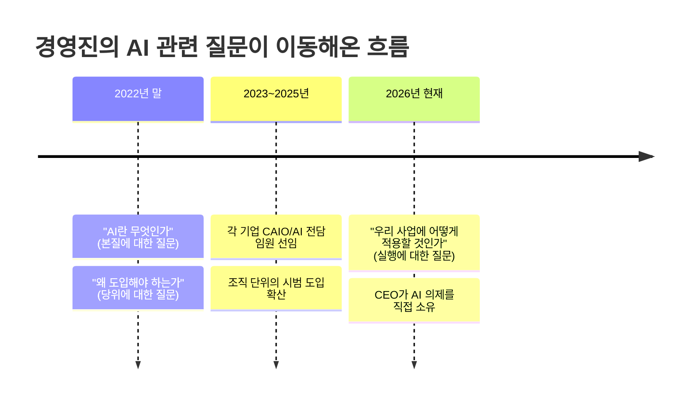
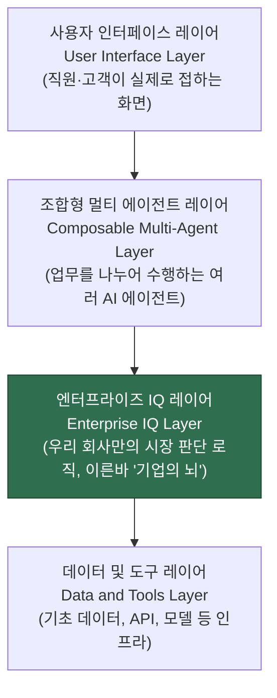
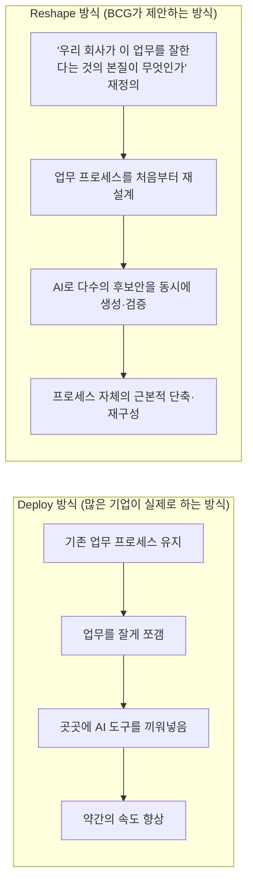
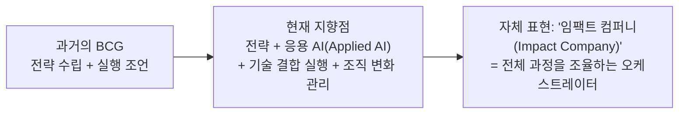
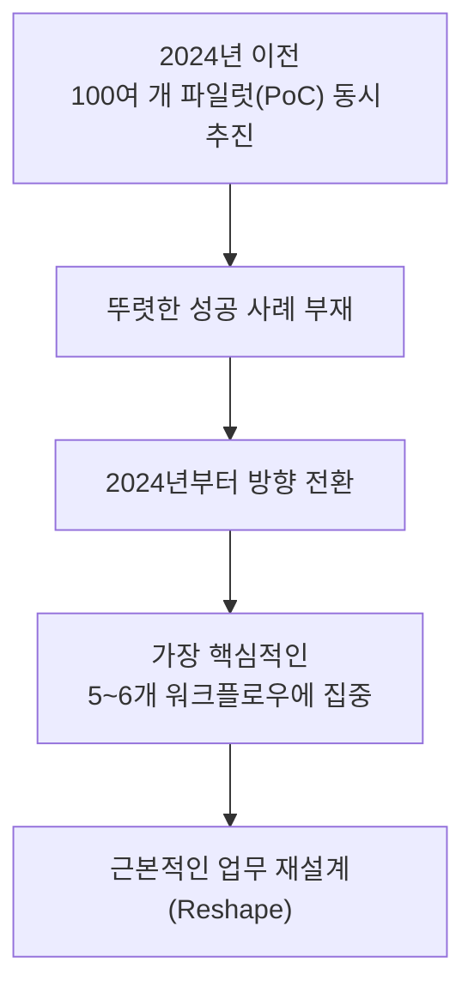
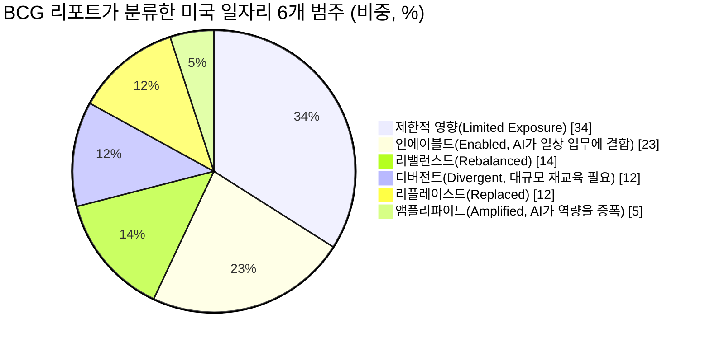
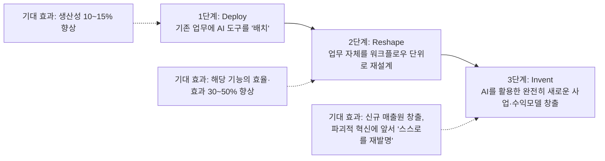

## 이 문서에 대하여

이 문서는 유튜브 채널 **EO Korea**가 2026년 7월 13일 공개한 다큐멘터리 영상 「AI는 수단입니다. 진짜 경쟁력은 '기업의 뇌(Enterprise IQ)'에 있습니다 | BCG 다큐멘터리」의 내용을 원문 대본(자막 스크립트)과 영상 속 화면 정보, 그리고 공개된 2차 자료를 교차 검증하여 강의·브리핑용으로 정리한 해설 자료다. 영상에는 보스턴컨설팅그룹(BCG) 코리아의 파트너 4인이 등장한다.

- **장진석** MD 파트너 — AI·디지털 부문 및 BCG 코리아 BCG X 리드
- **이중훈** MD 파트너 — AI·디지털 부문(BCG X 소속), 전 팔란티어 코리아·골드만삭스·마이크로소프트 출신
- **박영호** MD 파트너 — 금융 산업 및 BCG 코리아 피플체어(People Chair)
- **송지연** MD 파트너 — 소비재·유통 산업 및 아시아태평양 MSP(마케팅·세일즈·프라이싱) 분야 리드

네 사람의 발언은 영상 안에서 서로 교차하며 하나의 이야기를 이루기 때문에, 이 문서에서는 발화자를 구분하기보다 논지의 흐름을 따라 챕터별로 재구성했다. 영상 자체에 담긴 통계나 인용(골드만삭스 사례, BCG 리포트 제목 등)은 별도로 웹 검색을 통해 사실관계를 확인했으며, 확인 결과와 출처는 문서 맨 뒤 '사실 확인 노트'에 정리해 두었다. 확인이 되지 않거나 발화자 개인의 주관적 견해로 판단되는 부분은 추측을 더하지 않고 "영상에서 이렇게 말했다"는 형태로만 남겼다.

---

## 목차

1. AI 시대, 경영 환경에서 무엇이 달라졌는가
2. 화두의 이동: '무엇을(What)·왜(Why)'에서 '어떻게(How)'로
3. CDO에서 CAIO로, 그리고 다시 CEO로 — 리더십 무게중심의 이동
4. 네 개의 레이어: AI 시대 기업 경쟁력의 새로운 구조
5. Deploy와 Reshape — 왜 대부분의 AI 투자가 성과로 이어지지 않는가
6. 엔터프라이즈 IQ(Enterprise IQ)라는 개념
7. BCG는 지금 무엇으로 변하고 있는가 — '임팩트 컴퍼니'
8. AI 트랜스포메이션이 실패하는 진짜 이유 — 골드만삭스 사례
9. AI 시대에 필요한 인재상의 변화
10. BCG의 「AI Will Reshape More Jobs Than It Replaces」 리포트
11. 한국 기업에게 지금은 기회인가
12. 결론 — "AI 시대에 앞서 있는 사람은 없다"
13. 시청자들은 어떻게 받아들였는가
14. 용어 정리
15. 사실 확인 노트
16. 참고 자료
17. [부록] 'Deploy'란 정확히 무엇인가
18. [별첨] AI 도입 속도 및 현황 — 중국 vs 한국 vs 일본

---

## 1. AI 시대, 경영 환경에서 무엇이 달라졌는가

영상은 최근 1~2년 사이 기업들의 AI에 대한 태도가 완전히 바뀌었다는 진단에서 출발한다. 파트너들은 공통적으로 "AI 시대에 진짜로 앞서 있는 기업은 없다"고 말한다. 기술 자체가 워낙 새롭고 빠르게 바뀌고 있어서, 특정 기업이 남들보다 몇 년씩 앞서 있다고 말하기 어렵다는 뜻이다. 다만 그 안에서도 격차는 이미 벌어지고 있는데, 그 격차를 가르는 기준은 "AI를 얼마나 열심히 쓰느냐"가 아니라 "AI를 올바른 지점에 얼마나 잘 적용해서 실제 성과를 냈느냐"라는 단 하나의 질문이라는 것이 파트너들의 진단이다.

특히 눈에 띄는 지적은, "우리 회사는 AI를 열심히 하고 있다", "우리는 굉장히 적극적으로 움직이고 있다"는 인식 자체가 일종의 착시일 수 있다는 경고다. 실제로 조직 구조나 일하는 방식은 그대로 둔 채 AI 도구만 얹어 놓고 "우리는 변화하고 있다"고 믿는 현상을 다큐멘터리는 여러 차례 지적한다.

## 2. 화두의 이동: '무엇을·왜'에서 '어떻게'로

파트너들이 짚는 가장 뚜렷한 변화는 경영진의 질문 자체가 달라졌다는 점이다. 2022년 말 생성형 AI가 막 화제가 되기 시작하던 시점에는 경영진의 질문이 주로 "AI란 대체 무엇인가", "우리 사업에 AI를 왜 도입해야 하는가"라는, 기술의 본질과 도입 이유에 관한 것이었다. 그런데 지금은 거의 모든 경영진이 '무엇을·왜'를 묻지 않는다. 대신 압도적으로 많이 나오는 질문은 "어떻게(How)" — 즉 우리 회사의 사업 환경에 AI를 구체적으로 어떻게 적용해야 하느냐는 실행 관점의 질문이라는 것이다.

이 변화는 아래처럼 하나의 흐름으로 요약할 수 있다.

## 3. CDO에서 CAIO로, 그리고 다시 CEO로 — 리더십 무게중심의 이동

파트너들은 이 변화를 과거 스마트폰이 등장했던 시기와 비교한다. 아이폰이 등장하고 '모바일'이 경영의 화두가 되었을 때, 많은 기업이 최고디지털책임자(CDO, Chief Digital Officer)라는 임원급 자리를 새로 만들어 그 사람을 앞세워 변화를 추진했다. 지난 2~3년간의 AI 물결도 처음에는 똑같은 패턴을 그렸다고 한다. 기업들이 AI를 총괄하는 임원(최고AI책임자, CAIO 등)을 새로 임명하고 그 한 사람에게 변화를 맡기는 방식이었다.

그런데 최근 들어 이 패턴이 빠르게 바뀌고 있다는 것이 파트너들의 관찰이다. "AI 전담 임원 한 명이 회사 전체의 AI 전환을 이끌 수 있는가"에 대해 회의적인 시각이 늘면서, 오히려 CEO가 "우리 회사가 지금 설정해야 할 가장 중요한 의제는 AI다. 그러니 내가 직접 이끌겠다"고 선언하는 흐름으로 이동하고 있다는 것이다. CEO가 AI를 직접 소유하고 투자를 주도하는 기업과, AI를 중간 정도의 우선순위로 두는 기업, 그리고 AI를 우선순위에 두지 않는 기업 사이에서 실제 경영 성과의 격차가 매우 크게 벌어지고 있다는 것이 이 영상의 핵심 메시지 중 하나다.

## 4. 네 개의 레이어: AI 시대 기업 경쟁력의 새로운 구조

영상 중반부에는 AI 시대의 경영 환경을 설명하는 하나의 구조도가 등장한다. 위에서부터 아래 순서로 '사용자 인터페이스 레이어(User Interface Layer)', '조합형 멀티 에이전트 레이어(Composable Multi-Agent Layer)', '엔터프라이즈 IQ 레이어(Enterprise IQ Layer)', '데이터 및 도구 레이어(Data and Tools Layer)'라는 네 층으로 쌓인 구조다. 이 그림이 전달하려는 메시지는 명확하다. 자사만의 시장에서 승리하는 방식을 결정하는 것은 맨 위에 보이는 화려한 인터페이스나 에이전트가 아니라, 그 아래 숨어 있는 '엔터프라이즈 IQ' 레이어라는 것이다.

이 구조를 사람의 몸에 비유하자면, 에이전트는 '손과 발'이고, 사용자 인터페이스는 '겉으로 드러나는 행동'이며, 데이터와 도구는 몸을 움직이는 '근육과 신경'에 해당한다. 그런데 손과 발이 아무리 빠르고 정교해도, 그것을 지휘하는 '뇌'가 우리 회사만의 시장 승리 논리를 담고 있지 않다면 결국 방향을 잃는다는 것이 이 그림이 말하려는 바다.

## 5. Deploy와 Reshape — 왜 대부분의 AI 투자가 성과로 이어지지 않는가

영상에서 가장 자주 반복되는 대비는 '디플로이(Deploy)'와 '리셰이프(Reshape)'라는 두 가지 접근법이다. 파트너들은 "AI 트랜스포메이션"이라는 표현 자체에 방점이 잘못 찍히는 경우가 많다고 지적한다. 강조점이 '트랜스포메이션(변화)'이 아니라 'AI(기술)'에 쏠려서, 기업들이 기술 도입 자체에 매몰된다는 것이다.

- **디플로이(Deploy) 접근**: 기존에 일하던 방식은 그대로 둔 채, 그 안의 개별 업무를 잘게 쪼개서 곳곳에 AI를 끼워 넣어 속도만 조금 높이는 방식. 예를 들어 신제품 기획처럼 보통 6개월에서 1년이 걸리는 프로세스를 그대로 둔 채 AI로 일부 단계만 조금 빠르게 처리하는 식이다.
- **리셰이프(Reshape) 접근**: 아예 업무 프로세스 자체를 처음부터 다시 설계하는 방식. 신제품 기획을 예로 들면, AI의 도움을 받아 시장을 읽고 기회 영역을 찾아내며, 하나의 아이디어가 아니라 수십 개의 후보 콘셉트를 빠르게 만들어낸 뒤 그중 성공 확률이 가장 높은 것으로 압축한다. 이렇게 하면 6개월~1년 걸리던 과정을 한두 달로 단축할 수 있고, 하나의 콘셉트에 반년을 거는 대신 여러 후보로 시작해 검증하며 좁혀나갈 수 있다는 것이다.

파트너들은 실제 현장에서 여전히 많은 기업이 '디플로이' 수준에 머물러 있고, 그래서 의미 있는 성과를 빠르게 내지 못하는 경우를 자주 목격한다고 말한다.

## 6. 엔터프라이즈 IQ(Enterprise IQ)라는 개념

디플로이와 리셰이프를 가르는 핵심에는 '엔터프라이즈 IQ'라는 개념이 있다. 파트너들은 이를 "결국 두뇌"라고 표현한다. 즉 AI를 도입해서 얻어야 할 진짜 가치는 "더 빠른 손을 만드는 것"도 "더 많은 손발을 만드는 것"도 아니라, 그 손발이 우리 회사가 우리 시장에서 이기는 방식(로직)을 체화한 두뇌와 함께 설계되어 있는지 여부라는 것이다. 이 엔터프라이즈 IQ를 얼마나 잘 구축하느냐가 결국 AI 트랜스포메이션의 성패를 가른다고 강조한다.

여기서 파트너들이 특히 강조하는 지점은, 이 부분만큼은 외부에서 사올 수 없다는 것이다. 오픈AI가 만들어줄 수 있는 것도 아니고, 팔란티어가 만들어줄 수 있는 것도 아니며, 오직 자기 사업의 논리를 아는 회사 스스로만 만들 수 있다는 것이 파트너들의 반복된 주장이다. 그래서 신제품 기획을 예로 들 때도, 출발점은 "어디에 AI를 쓸 수 있을까"가 아니라 "애초에 좋은 신제품 기획이라는 것이 무엇에 달려 있는가"를 다시 묻는 데서 시작해야 한다고 말한다.

> 참고: '엔터프라이즈 IQ'라는 표현은 이 영상에서 BCG 코리아 파트너가 자신들의 용어로 소개한 개념이다. 웹 검색으로 확인한 결과 BCG 글로벌 차원에서 공식적으로 발간한 보고서나 프레임워크 명칭으로 별도 확인되지는 않았다. 따라서 이 용어는 'BCG 코리아 팀이 이 다큐멘터리에서 설명을 위해 사용한 표현'으로 이해하는 것이 정확하다.

## 7. BCG는 지금 무엇으로 변하고 있는가 — '임팩트 컴퍼니'

파트너들은 최근 전 세계 BCG 파트너들이 모여 컨설팅 비즈니스의 미래를 논의했던 자리를 언급하며, 그 자리에서 느낀 두 가지 상반된 감정을 소개한다. 하나는 AI 덕분에 컨설팅 산업의 기회가 오히려 넓어지고 있다는 기대감이고, 다른 하나는 컨설팅이라는 업 자체가 AI에 의해 축소되거나 사라질 수 있다는 불안감이다. 이 두 감정이 여전히 공존한다는 것을 파트너들은 솔직하게 인정한다.

그 위에서 BCG가 스스로를 재정의하는 방향은 이렇다. 과거의 BCG는 전략을 잘 짜고 실행 방향을 조언하는 회사였다면, 지금은 그 전략을 실제로 구현하는 데 필요한 기술 요소까지 결합해서 실질적인 결과물(임팩트)을 만들어내는 회사로 스스로를 바꾸고 있다는 것이다. 그래서 내부적으로는 스스로를 '컨설팅 회사'보다 '임팩트 컴퍼니(impact company)' 혹은 '임팩트 코어(impact core)'라고 부른다고 말한다. 한 문장으로는 "전체 과정을 조율하는 오케스트레이터(orchestrator)로 진화하고 있다"고 표현한다.

이 방향에 맞춰 BCG는 전략과 응용 AI(Applied AI)라는 두 축으로 조직을 재편하고 있다고 설명한다. 여기서 '응용 AI'란 AI라는 기술 자체, 혹은 AI가 만드는 변화 그 자체를 다루는 것이 아니라, AI가 실제로 기업에 적용되었을 때 어떤 변화를 만들어내는지에 초점을 맞춘 개념이라는 점을 강조한다. 인력 구성 측면에서도 AI 엔지니어, 데이터 과학자, 그리고 고객 현장에 직접 상주하며 문제를 해결하는 '포워드 디플로이드 엔지니어(Forward-Deployed Engineer, FDE)'를 확충해, 급성장하는 엔터프라이즈 소프트웨어 기업들과 견줄 수 있는 조직을 만들고 있다고 설명한다.

## 8. AI 트랜스포메이션이 실패하는 진짜 이유 — 골드만삭스 사례

영상은 실패 사례로 골드만삭스를 언급한다. 골드만삭스 CEO 데이비드 솔로몬이 밝힌 내용이라며, 2024년 이전까지 골드만삭스가 회사 전체 차원의 AI 트랜스포메이션을 추진한 방식은 100개가 넘는 각기 다른 파일럿(PoC, Proof of Concept) 프로젝트를 동시에 돌리며 다양한 시도를 해보는 것이었다고 소개한다. 그 과정에서 뚜렷한 성공 사례를 만들어내지 못했다는 것을 스스로 인정했고, 2024년부터는 회사의 근본적인 업무 중 가장 중요한 대여섯 개의 핵심 워크플로우를 AI로 근본적으로 바꾸는 방향으로 전략을 크게 선회했다는 것이 영상 속 설명이다.

이 지점에서 파트너들이 강조하는 메시지는, AI 트랜스포메이션에서 가장 어려운 부분은 AI 기술 자체나 데이터·인프라가 아니라, 그것을 이끌어야 하는 조직과 사람, 그리고 변화 관리라는 점이다. 파트너 중 한 명은 이 어려움의 비중을 수치로 표현하며 "사람에 관한 어려움이 전체의 70%"라고 말한다. BCG가 AI 전략과 플랫폼을 설계하고 구축하는 것을 넘어, 현장에서 실제로 사람들이 어떻게 변화하는지를 함께 만들어가는 데 컨설팅 역량을 집중하고 있다고 설명하는 이유도 여기에 있다.

> 사실 확인: 이 설명은 영상 속 BCG 코리아 파트너가 전달한 내용이다. 골드만삭스가 실제로 2026년 현재 진행 중인 대규모 AI 전환 프로그램의 이름은 'One GS 3.0'이며, 공개된 데이비드 솔로몬 CEO의 발언들을 종합하면 온보딩·KYC(고객확인) 등 6개의 핵심 프로세스를 AI로 재설계하는 것을 골자로 하고 있다는 점, 그리고 이를 통해 인력을 줄이기보다는 같은 인력으로 훨씬 많은 업무량을 처리할 수 있는 '역량 확장'을 목표로 한다고 밝힌 점은 여러 매체 보도로 확인된다. 다만 "100개의 파일럿을 돌리다 실패를 인정했다"는 구체적인 문장이 솔로몬 CEO의 공개 발언 원문에서 그대로 확인되지는 않았다. 이는 BCG 파트너의 요약·해석으로 이해하는 것이 정확하다.

## 9. AI 시대에 필요한 인재상의 변화

파트너들은 최근 기업들이 "좋은 질문을 던질 줄 아는 사람"을 원한다는 이야기를 자주 듣는다고 말한다. AI 시대에는 프롬프트만 잘 짜면 웬만한 문제는 풀 수 있다는 통념이 있지만, 사실 BCG는 1993년 설립 초기부터 호기심을 가지고 좋은 질문을 던지는 사람을 원해 왔다고 말한다. 문제를 잘 정의하고, 잘 풀고, 잘 전달하는 능력은 AI가 점점 더 잘하게 되는 영역이기 때문에, 오히려 그 다음 단계 — 잘 정리된 문제 해결책을 가지고 공감과 신뢰를 바탕으로 사람을 설득하고, 실제로 함께 실현해내는 역량 — 이 더 중요해진다는 것이 파트너들의 진단이다.

이 맥락에서 등장하는 표현이 '통합적 빌더-싱커(integrated builder-thinker)'다. 스스로 무언가를 만들 줄 알고, 생각할 줄 알며, 그 과정에서 AI를 포함한 여러 도구를 능숙하게 다루는 종합적인 인재상을 뜻한다. 파트너들은 고객이 기대하는 결과물의 수준도 점점 더 명확한 '성과' 쪽으로 이동하고 있으며, 처음부터 끝까지 결과를 만들어낼 수 있는 컨설턴트가 훨씬 더 큰 가치를 제공하게 될 것이라고 전망한다.

## 10. BCG의 「AI Will Reshape More Jobs Than It Replaces」 리포트

영상 후반부에는 BCG가 발간한 보고서 「AI Will Reshape More Jobs Than It Replaces(AI는 일자리를 없애기보다 더 많이 바꿔놓을 것이다)」가 등장한다. 이 보고서는 2026년 4월 3일 BCG 헨더슨 인스티튜트가 그렉 에머슨(Greg Emerson), 매튜 크롭(Matthew Kropp) 등 8인의 공동 저자 이름으로 발간한 실제 보고서로, 웹 검색을 통해 원문 내용을 확인할 수 있었다.

핵심 메시지는 파트너들의 설명과 일치한다. AI가 일자리를 '없앤다'는 뜻이 아니라, 수많은 업무의 조합 자체가 AI에 의해 새롭게 재편된다는 것이다. 보고서는 미국 노동시장의 약 1,500개 직무·1억 6,500만 개 일자리 데이터를 분석해, 앞으로 2~3년 안에 미국 내 일자리의 50~55%가 AI에 의해 '리셰이프(재편)'될 것이라고 추정한다. 이는 일자리 자체는 유지되지만 일하는 방식과 기대되는 산출물이 근본적으로 달라진다는 뜻이다. 반면 완전히 대체되어 사라질 가능성이 있는 일자리의 비중은 향후 5년 안에 10~15%(약 1,600만~2,500만 개) 수준으로 추정하고 있다.

보고서는 일자리를 영향의 성격에 따라 여섯 가지 범주로 나눈다.

이 보고서가 강조하는 실무적 메시지는, 인력 전략을 자동화의 '다음 단계'로 취급해서는 안 되며 애초에 회사 전략 안에 함께 설계되어야 한다는 것, 그리고 필요 이상으로 인력을 먼저 줄이는 기업은 오히려 생산성 저하와 조직 지식 손실, 인재 이탈이라는 역풍을 맞을 수 있다는 경고다. 영상 속 파트너들의 발언 — "일자리가 사라진다는 뜻이 아니라 일하는 방식이 재편된다는 뜻"이라는 설명 — 은 이 보고서의 실제 결론과 정확히 일치한다.

## 11. 한국 기업에게 지금은 기회인가

파트너들은 AI 도입 속도와 관련해 회사의 규모나 매출과는 크게 상관이 없다고 말한다. 오히려 거대한 레거시 시스템을 가진 대기업이 AI 트랜스포메이션에서 더 늦게 움직이는 경우가 많고, 반대로 중소·중견기업이 훨씬 더 앞서 나가는 사례를 자주 목격한다고 설명한다.

특히 아시아, 그중에서도 한국 기업들의 AI에 대한 관심과 추진력이 현장에서 볼 때 유독 두드러진다고 말한다. 그 배경으로 파트너들은, 생성형 AI의 등장이 오랫동안 서구권이 만들어온 게임의 룰을 구조적으로 뒤집을 기회로 여겨지고 있다는 해석을 내놓는다. 예를 들어 소비재 기업의 경우 전통적으로는 마케팅에 막대한 자본을 투입할 수 있는 서구 대기업과 경쟁하기 어려웠지만, AI를 활용해 훨씬 적은 비용으로 고효율 마케팅을 할 수 있다면 디지털 마케팅 영역에서는 오히려 앞설 수 있다는 기대가 있다는 것이다. 자동차, 조선, 화장품, 식품처럼 대규모 운영이 필요한 산업에서 한국이 강점을 갖고 있다는 점, 그리고 한국인 특유의 보수적이면서도 변화가 시작되면 빠르게 움직이는 성향이 AI 시대에 유리하게 작용할 수 있다는 관찰도 함께 제시된다.

다만 미국이 파운데이션 모델과 핵심 AI 기술에서는 분명히 앞서 있지만, 그것을 실제 현장에 적용하는 역량에서도 앞서 있는지는 아직 확실하지 않다는 점도 짚는다. BCG가 강조하는 '전략과 응용 AI'라는 축에서 보면, 아시아·한국 기업들이 이 변화를 훨씬 더 열린 태도로 받아들이고 다양한 방식으로 실험하고 있다는 점에서, 한국 기업이 자신만의 경쟁 우위를 재정의하는 성공 사례가 다른 어느 지역보다 먼저, 더 강하게 나올 가능성이 높다고 파트너들은 전망한다.

## 12. 결론 — "AI 시대에 앞서 있는 사람은 없다"

영상은 파트너들이 고객사를 만날 때 자주 하는 말로 마무리된다. 해외의 앞선 사례를 궁금해하는 마음은 이해하지만, 그 프레임에서 벗어나길 권한다는 것이다. AI 시대에는 정말로 앞서 있는 사람이 없으며, 있을 수도 없다는 것이 반복되는 메시지다. 기술이 워낙 새롭고, 모두가 함께 답을 찾아가는 과정에 있기 때문에, "내가 최초의 사례가 되겠다"는 마음가짐으로 접근하는 것이 오히려 현실적인 전략이라는 조언이다.

파트너들은 이런 불확실성 속에서 BCG조차 모든 문제를 해결하는 '마법 지팡이'를 갖고 있지 않다고 솔직하게 말한다. 다만 지금 기업들에게 제안하는 것은 명확하다. 지금 당장 첫걸음을 떼어야 하며, 설령 그 결과가 실패의 경험이라 하더라도 그것을 축적하며 앞으로 나아가야 한다는 것이다. 동시에, "우리는 AI를 열심히 하고 있다"는 인식이 실제 변화 없이 기술만 얹어놓은 상태에서 나온 착시일 수 있다는 점을 다시 한번 경계해야 한다고 강조한다. 시간이 지나 "1년 넘게 AI에 상당한 돈을 썼는데, 자세히 보니 실제로 바뀐 것이 뭔지 모르겠다"는 목소리가 이미 나오고 있다는 것이다.

그래서 기업 리더에게 필요한 것은, 수십 년간 유지해온 일하는 방식을 AI 시대에 맞게 다시 설계하는 방향으로 초점을 옮기는 것이며, 최고경영진이 "수년에 걸친 구조적 변화를 추진하겠다"는 결단을 내리고 그 과정의 여러 어려움을 감수하며 밀어붙이는 것만이 성공을 담보할 수 있는 유일한 방법이라고 파트너들은 말한다. 마지막으로 "AI가 일자리를 모두 앗아갈 것"이라는 두려움에 대해서는, 컨설팅업 자체가 사라지는 대신 시대에 맞춰 더 빠르게 변화하고 있는 것처럼, 지나친 불안을 가질 필요는 없다는 입장을 밝힌다. 다만 그 누구도 확실한 정답을 갖고 있지 않은 지금, 끊임없이 배우는 자세를 내면화하는 것이 가장 중요한 행동 원칙이라고 강조하며 영상은 마무리된다.

---

## 13. 시청자들은 어떻게 받아들였는가

영상에 달린 다수의 댓글을 살펴보면 반응은 크게 세 갈래로 나뉜다.

**공감과 지지를 표한 반응**은 "AI 시대에 앞서 있는 사람은 없다"는 메시지가 오히려 위안이 되었다는 의견, '엔터프라이즈 IQ'라는 개념이 인상 깊었다는 의견, 그리고 "AI를 쓰는 것과 실제 성과를 내는 것은 다르다"는 지적이 현업에서도 체감된다는 의견이 많았다. "AI Transformation의 방점은 AI가 아니라 Transformation에 있다"는 메시지에 깊이 공감한다는 댓글도 다수 눈에 띄었다.

**비판적이거나 냉소적인 반응**도 상당수 있었다. 컨설팅 회사가 결국 팔란티어와 같은 실행형 AI 기업을 벤치마킹하려는 것을 세련되게 포장한 것 아니냐는 의견, 당연한 이야기를 전문적인 용어로 포장하고 있을 뿐이라는 지적, 실제 현업에서는 이미 컨설팅보다 AI 도구를 직접 활용하는 것이 더 효율적이라는 경험담 등이 있었다. 대기업에서 컨설팅을 여러 차례 받아본 경험이 있다는 한 시청자는 컨설팅 결과물을 기업이 전적으로 신뢰하고 따르는 경우가 많지 않다는 현실적인 회의감을 남기기도 했다.

**중립적이거나 사례를 더 알고 싶어 하는 반응**으로는, "성과가 극명하게 갈렸다"는 사례를 정량적으로 더 자세히 알고 싶다는 요청, AI가 만들어내는 문제(이른바 'AI 슬롭')를 현장에서 메우는 사람들에 대한 보상 논의가 빠져 있다는 지적, 컨설팅 업계 출신이 현업으로 이직한 뒤 느낀 경험을 공유하며 "컨설팅 펌은 5~20m 앞을, 현업은 5m 앞을 내다보는 정도의 차이가 있다"는 균형 잡힌 시각을 제시한 댓글도 있었다.

이처럼 시청자 반응 자체가 영상이 다루는 주제 — AI를 도입하는 것과 AI로 실제 성과를내는 것은 다른 문제라는 것 — 를 다시 한번 확인시켜주는 흥미로운 지점이라고 할 수 있다.

---

## 14. 용어 정리

| 용어 | 설명 |
|---|---|
| AX (AI Transformation) | AI를 활용한 기업의 사업·조직 전환. 단순 도구 도입이 아니라 일하는 방식 자체의 변화를 의미 |
| Deploy(디플로이) | 기존 프로세스를 유지한 채 AI 도구를 부분적으로 끼워 넣는 접근 |
| Reshape(리셰이프) | 업무 프로세스 자체를 AI 시대에 맞게 처음부터 다시 설계하는 접근 |
| Enterprise IQ(엔터프라이즈 IQ) | 이 영상에서 BCG 코리아 파트너가 소개한 개념으로, 회사 고유의 시장 판단 로직을 AI 시스템에 내재화한 '기업의 두뇌'를 뜻함 |
| CAIO (Chief AI Officer) | 최고AI책임자. 기업 내 AI 전략과 도입을 총괄하는 임원급 직책 |
| CDO (Chief Digital Officer) | 최고디지털책임자. 과거 모바일·플랫폼 전환기에 등장한 임원급 직책 |
| FDE (Forward-Deployed Engineer) | 고객 현장에 직접 상주하며 AI·데이터 솔루션을 구축하는 엔지니어 |
| BCG X | BCG의 AI 기반 비즈니스 혁신 및 실행 조직. 전략뿐 아니라 실제 기술 구현까지 담당 |
| PoC (Proof of Concept) | 개념 검증. 신기술을 소규모로 시범 적용해보는 파일럿 프로젝트 |
| 임팩트 컴퍼니(Impact Company) | BCG가 스스로를 재정의하며 사용하는 표현으로, 전략 자문을 넘어 실질적 성과(임팩트) 창출까지 책임지는 회사라는 의미 |
| 오케스트레이터(Orchestrator) | 여러 요소(전략·기술·조직 변화)를 조율하며 전체 과정을 이끄는 주체 |
| 통합적 빌더-싱커(Integrated Builder-Thinker) | 생각하는 능력과 직접 만드는 능력, AI 도구 활용 능력을 모두 갖춘 인재상 |
| 리셰이프드 잡(Reshaped Job) | BCG 리포트에서 일자리 자체는 유지되지만 일하는 방식과 요구되는 산출물이 근본적으로 바뀌는 직무를 지칭하는 표현 |

---

## 15. 사실 확인 노트

이 문서를 작성하며 검증한 내용을 출처 성격별로 구분해 정리한다.

**1차 자료로 확인된 내용**
- 영상 제목, 게시일(2026년 7월 13일), 채널(EO Korea), 등장 파트너 4인의 이름과 직함·경력 정보는 영상 자막에 직접 표기되어 있어 1차 자료로 확인된다.
- BCG가 2026년 4월 3일 발간한 보고서 「AI Will Reshape More Jobs Than It Replaces」의 저자진(그렉 에머슨 외 7인), 핵심 수치(향후 2~3년간 미국 일자리의 50~55% 재편, 5년 내 10~15% 대체 가능성, 6개 직무 범주와 각 비중)는 BCG 헨더슨 인스티튜트 원문과 BCG 공식 홈페이지 게재본을 직접 확인했다.
- BCG의 2025년 글로벌 매출(144억 달러, 전년 135억 달러 대비 7% 성장)과 AI·기술 관련 서비스가 전체 매출의 40% 이상을 차지하며 AI 서비스 매출이 전년 대비 25% 성장했다는 내용은 2026년 4월 23일 BCG의 공식 보도자료로 확인했다. 이를 원화로 환산하면 대략 총매출 20조 원, AI 관련 매출 약 5조 원 수준으로, 영상 소개 문구에 등장한 "연매출 21조 원 중 5조 원을 AI로 만들어낸다"는 표현과 대체로 부합한다(다만 이는 BCG 코리아 한 지사가 아니라 BCG 글로벌 전체 실적으로 보인다).
- 영상에서 "Deploy"와 "Reshape"로 대비해 설명한 내용은 즉흥적인 비유가 아니라, BCG가 2023년부터 공식적으로 사용해온 'Deploy-Reshape-Invent(DRI)' 3단계 AI 가치 창출 프레임워크와 정확히 일치한다. BCG 공식 발간물(2024년 「CEO's Guide to Maximizing Value Potential from AI」, 2025~2026년 다수의 BCG 산업별 리포트)에서 이 프레임워크의 정의와 각 단계별 기대 효과(Deploy 단계의 생산성 10~15% 향상, Reshape 단계의 효율·효과 30~50% 향상 등)를 직접 확인했다. 자세한 내용은 뒤에 이어지는 [부록]에 별도로 정리했다.
- 이중훈 파트너의 팔란티어 코리아 출신 이력은 2026년 1월 20일 다수의 국내 언론(연합뉴스, 파이낸셜뉴스, 헤럴드경제, 아시아경제, 디지털투데이 등)을 통해 BCG 코리아의 공식 인사 발표로도 확인된다. 다만 골드만삭스·마이크로소프트 경력은 영상 자막에서만 확인되며, 별도의 언론 보도로는 교차 확인되지 않았다.

**2차 보도로 뒷받침되는 내용**
- 골드만삭스가 'One GS 3.0'이라는 이름으로 온보딩·KYC 등 6개 핵심 프로세스를 AI로 재설계하고 있다는 점, CEO 데이비드 솔로몬이 이를 인력 감축이 아닌 역량 확장의 수단으로 설명했다는 점은 Fortune, 창업 관련 매체 등 여러 2차 보도로 확인된다. 다만 영상에서 언급한 "2024년 이전 100여 개 PoC를 동시에 추진하다 실패를 인정했다"는 구체적 서술은 솔로몬 CEO의 공개 발언 원문에서 그대로 확인되지 않았으며, BCG 파트너의 해석·요약으로 보는 것이 정확하다.
- 생성형 AI 파일럿 프로젝트의 95%가 뚜렷한 재무적 성과를 내지 못하고 있다는 통념(이른바 'AI 성공률 5%')은 MIT 미디어랩 NANDA 이니셔티브가 2025년 발표한 「The GenAI Divide: State of AI in Business 2025」 보고서에서 나온 수치다. 이는 BCG의 보고서가 아니라 별도의 독립적인 연구 기관의 결과이며, 영상 소개 문구의 "AX 성공률 단 5%의 시대"라는 표현과 맥락이 일치한다.

**분석적 재구성 또는 확인이 어려운 내용**
- '엔터프라이즈 IQ(Enterprise IQ)'라는 용어는 BCG 글로벌 차원의 공식 발간물에서 동일한 명칭으로 별도 확인되지 않았다. 이 영상에서 BCG 코리아 파트너가 설명을 위해 소개한 개념으로 이해하는 것이 정확하다.
- "사람 관련 어려움이 전체의 70%"라는 수치, 그리고 한국·아시아 기업의 AI 도입 열의가 특히 두드러진다는 서술은 파트너 개인의 현장 경험에 기반한 정성적 진단으로, 별도의 정량적 통계로 뒷받침되지는 않는다. 이는 저자(BCG 파트너)의 주관적 평가로 남겨둔다.

---

## 16. 참고 자료

- EO Korea, 「AI는 수단입니다. 진짜 경쟁력은 '기업의 뇌(Enterprise IQ)'에 있습니다 | BCG 다큐멘터리」, 2026.7.13, https://www.youtube.com/watch?v=N-hWdhKJmdU
- BCG Henderson Institute, "AI Will Reshape More Jobs Than It Replaces", 2026.4.3, https://bcghendersoninstitute.com/ai-will-reshape-more-jobs-than-it-replaces/
- BCG, "AI Will Reshape More Jobs Than It Replaces", https://www.bcg.com/publications/2026/ai-will-reshape-more-jobs-than-it-replaces
- BCG, "BCG Reports $14.4 Billion in Revenue, Marking 22nd Consecutive Year of Growth", 2026.4.23, https://www.bcg.com/press/23april2026-bcg-revenue-22nd-consecutive-year-growth
- 연합뉴스, "BCG 코리아, 팔란티어 출신 이중훈 MD파트너 영입", 2026.1.20
- 파이낸셜뉴스, "BCG코리아, '팔란티어 출신' 이중훈 MD파트너 영입", 2026.1.20, https://www.fnnews.com/news/202601201000391806
- 디지털투데이, "BCG 코리아, AI 실행 역량 강화 인사", 2026.1.20, https://www.digitaltoday.co.kr/news/articleView.html?idxno=622384
- Fortune, "No 'job apocalypse': Goldman Sachs CEO denies the AI hiring nightmare is real", 2026.1.23, https://fortune.com/2026/01/23/no-job-apocalypse-goldman-sachs-ceo-david-solomon-ai-hiring-nightmare/
- MIT Project NANDA, "The GenAI Divide: State of AI in Business 2025", 2025.7 (Fortune 등 다수 매체 재인용)
- BCG, "CEO's Guide to Maximizing Value Potential from AI in 2024", https://www.bcg.com/assets/2024/executive-perspectives-ceos-guide-to-maximizing-value-from-ai-3july.pdf
- BCG, "AI @ Scale — Deploy, Reshape, Invent(DRI) 프레임워크 소개", https://www.bcg.com/capabilities/artificial-intelligence
- BCG, "Inside the AI-First Private Equity Firm", 2026.4.24, https://www.bcg.com/publications/2026/inside-the-ai-first-private-equity-firm
- BCG, "The Leader's Guide to Transforming with AI", 2025.7.14, https://www.bcg.com/featured-insights/the-leaders-guide-to-transforming-with-ai
- VentureBeat, "Moving beyond AI agent hype: The execution gap that's holding enterprises back" (매튜 크롭 BCG CTO 인터뷰), 2025.9.19

---

## 17. [부록] 'Deploy'란 정확히 무엇인가

본문 5장에서 다룬 '디플로이(Deploy)'라는 표현은 영상 속 파트너들이 그 자리에서 즉흥적으로 만든 비유가 아니다. 웹 검색으로 확인한 결과, 이는 BCG가 2023년부터 공식적으로 발전시켜온 **'Deploy-Reshape-Invent(DRI)'** 라는 AI 가치 창출 3단계 프레임워크의 첫 번째 단계를 가리키는 용어다. BCG는 이 프레임워크를 "수백 건의 AI 트랜스포메이션 프로젝트에서 사용해온 핵심 프레임워크"라고 소개하고 있으며, 2024년 「CEO's Guide to Maximizing Value Potential from AI」를 비롯해 2025~2026년에 발간된 여러 산업별 보고서(사모펀드, 소비재·유통 등)에서 반복적으로 등장한다. 이 부록에서는 이 개념을 조금 더 깊이 있게 풀어본다.

### 17.1 세 단계 프레임워크 속에서 Deploy의 위치

BCG의 DRI 프레임워크는 기업이 AI로 가치를 만들어내는 방식을 세 단계로 구분한다. Deploy는 그중 가장 초기 단계이며, Reshape와 Invent로 갈수록 더 근본적인 변화와 더 큰 가치를 요구한다.

### 17.2 Deploy의 정의

BCG의 공식 설명을 그대로 옮기면, Deploy 단계란 "조직이 일하는 방식에 대해서는 아무것도 바꾸지 않은 채, 직원들에게 AI 도구 사용권(라이선스)을 나눠주는 것"을 뜻한다. 즉 다음과 같은 특징을 갖는다.

- **기성 도구(off-the-shelf tools) 중심**: 처음부터 새로 만드는 것이 아니라, 이미 시장에 나와 있는 챗봇·코파일럿·생성형 AI 서비스를 그대로 가져다 쓴다.
- **조직·프로세스는 그대로 둔다**: 부서 구조, 결재 라인, 업무 순서, 책임 소재 등 기존의 일하는 방식은 손대지 않는다.
- **개인 단위의 생산성 향상이 목적**: 이 도구를 쓰는 개별 직원이 조금 더 빠르게, 조금 더 편하게 일하도록 돕는 데 초점이 맞춰져 있다.
- **도입 장벽이 낮다**: 별도의 조직 개편이나 대규모 투자 없이 비교적 빠르게 시작할 수 있어서, 대부분의 기업이 AI 여정의 첫걸음으로 선택하는 단계다.

### 17.3 Deploy가 실제로 만들어내는 것과 만들어내지 못하는 것

BCG의 자료들을 종합하면 Deploy 단계의 가치와 한계는 다음과 같이 정리된다.

| 구분 | 내용 |
|---|---|
| 만들어내는 것 | 전 직원 생산성의 약 10~15% 향상, 직원 만족도 개선, 조직 내 AI에 대한 관심과 기대감 확산, AI 도입 초기 단계의 '성공 체험' 제공 |
| 만들어내지 못하는 것 | 손익(P&L)에 측정 가능한 수준의 재무적 영향, 업무 프로세스 자체의 구조적 개선, 경쟁사가 쉽게 따라 하기 어려운 차별화된 경쟁우위 |

BCG가 2026년 사모펀드 업계를 다룬 보고서에서 밝힌 표현을 옮기면, Deploy는 "회사 운영 방식에 대해서는 아무것도 바꾸지 않은 채 직원들에게 AI 도구 라이선스를 나눠주는 것"이며, 현재 대부분의 사모펀드 포트폴리오 기업들이 하고 있는 일이 바로 이것이라고 지적한다. 그러면서도 "Deploy 자체를 하는 것은 가치가 있다"고 인정한다. 일부 직원의 생산성은 실제로 높아지기 때문이다. 다만 "그것만으로는 측정 가능하고 의미 있는 가치를 만들어내는 경우가 드물다(rarely creates measurable and meaningful value)"는 것이 BCG의 결론이다.

### 17.4 왜 이렇게 많은 기업이 Deploy 단계에 머무르는가

Deploy가 매력적인 이유는 명확하다. 도입이 쉽고, 빠르고, 눈에 보이는 변화(직원들이 새 도구를 쓰기 시작했다는 것)를 즉시 보여줄 수 있기 때문이다. 반면 Reshape 단계로 넘어가려면 업무 프로세스 재설계, 조직 구조 변경, 일부 직무의 역할 재정의, 데이터·거버넌스 정비처럼 훨씬 크고 오래 걸리는 변화가 필요하다. 이 때문에 많은 조직이 Deploy 단계에서 성과를 냈다는 착시를 느끼며 멈춰서게 된다는 것이 본문 5장·12장에서 다룬 "우리는 AI를 열심히 하고 있다는 착시"라는 지적과 정확히 맞닿아 있는 지점이다.

같은 맥락에서 BCG는 조직의 AI 성숙도(maturity)와 DRI 단계를 연결지어 설명한다. 아직 데이터·거버넌스·조직 역량이 충분히 갖춰지지 않은 낮은 성숙도의 조직이 곧바로 Reshape 단계의 변화를 시도하면 실패할 가능성이 크고, 반대로 이미 충분한 역량을 갖춘 성숙한 조직이 계속 Deploy 단계에만 머물러 있다면 만들어낼 수 있었던 가치의 상당 부분을 놓치고 있는 셈이라는 것이다. 즉 Deploy는 '틀린 선택'이 아니라 '그 자체로 끝나서는 안 되는 출발점'으로 이해하는 것이 정확하다.

### 17.5 본문 5장의 신제품 기획 사례와 연결해서 보기

본문 5장에서 소개한 신제품 기획 사례를 이 프레임워크에 대입해보면 다음과 같다.

- **Deploy 방식**: 6개월~1년이 걸리는 기존 신제품 기획 프로세스는 그대로 두고, 그 안의 개별 업무(시장 조사 자료 요약, 보고서 초안 작성 등)에만 생성형 AI 도구를 부분적으로 사용해 속도를 조금 높인다. 프로세스의 뼈대와 순서, 의사결정 구조는 바뀌지 않는다.
- **Reshape 방식**: 애초에 "좋은 신제품 기획이란 무엇에 달려 있는가"라는 질문부터 다시 던지고, AI로 시장 인사이트 도출과 다수의 콘셉트 동시 생성·검증을 프로세스의 중심에 두어, 6개월~1년짜리 프로세스를 한두 달짜리 프로세스로 재구성한다.

같은 업무를 다루더라도 Deploy는 "기존 틀 안에서 조금 더 빠르게"이고, Reshape는 "틀 자체를 다시 짜는 것"이라는 차이가 이 사례를 통해 분명해진다.

### 17.6 스스로 점검해보기: 우리 조직은 지금 어느 단계에 있는가

BCG의 설명을 토대로, 우리 조직의 AI 활용이 Deploy 단계에 머물러 있는지 스스로 점검해볼 수 있는 질문들을 정리하면 다음과 같다.

1. 우리는 AI 도구를 '나눠주는 것'까지만 하고 있는가, 아니면 그 도구를 쓰기 전과 후에 업무 프로세스 자체가 달라졌는가?
2. AI 도입 이후 개인의 체감 생산성은 올랐지만, 회사 전체의 손익계산서에서 그 효과를 숫자로 짚어낼 수 있는가?
3. AI를 도입하면서 조직도, 역할 정의, 의사결정 권한 중 하나라도 실제로 바뀐 것이 있는가?
4. 지금 하고 있는 AI 프로젝트가 '경쟁사도 같은 도구를 사면 똑같이 따라 할 수 있는 것'은 아닌가?

네 질문 중 다수에 "아니다" 또는 "잘 모르겠다"고 답하게 된다면, 그 조직은 본문에서 다룬 것처럼 여전히 Deploy 단계에 머물러 있을 가능성이 높다는 것이 BCG와 이 다큐멘터리가 공통적으로 전달하는 메시지다.

---

## 18. [별첨] AI 도입 속도 및 현황 — 중국 vs 한국 vs 일본

본문 11장에서 다룬 "한국을 비롯한 아시아 기업들의 AI 도입 열의가 특히 두드러진다"는 파트너들의 관찰을 검증하기 위해, 중국·한국·일본 세 나라의 최근(2025~2026년) 기업 AI 도입 관련 공개 조사 결과를 웹 검색으로 확인해 정리했다.

> **읽기 전 유의사항**: 아래 수치들은 조사 기관·조사 시점·표본 크기·질문 방식이 서로 다른 개별 설문조사에서 가져온 것이다. 예를 들어 "생성형 AI를 쓴다"는 질문에 대해 어떤 조사는 '전 직원 사용 여부'를, 어떤 조사는 '한 부서 이상에서의 사용 여부'를 묻는 등 정의가 다르다. 따라서 아래 수치는 세 나라를 완벽히 동일한 잣대로 줄 세운 순위표가 아니라, 각국의 대략적인 온도차를 보여주는 참고 자료로 읽는 것이 정확하다.

### 18.1 한눈에 보는 핵심 지표 비교

| 구분 | 중국 | 한국 | 일본 |
|---|---|---|---|
| 기업의 생성형 AI 도입률(최신 조사 기준) | 약 90%가 AI를 최소 한 업무 영역에 도입(무사용 응답 10.16%) | 55.7%가 이미 사용 중(전사 22.4%+일부 부서 33.2%), 2026년 85%+ 전망 | 34.6%가 "많이/어느 정도" 사용 중(2026년 3월 조사) — 다른 조사(2025년 중반)에서는 전사+일부부서 합산 43.4% |
| 조사 출처 | 중국기업가조사시스템, 「중국기업가 인공지능 응용조사보고서(2025)」, 128개사 대상 | 메가존클라우드·파운드리(구 IDG), 국내 AI·IT 담당자 749명 대상, 2025.8 | 요미우리신문·데이코쿠데이터뱅크, 전국 2만3,349개사 대상(응답 1만312개사), 2026.3 / 야노경제연구소, 496개사 대상, 2025 |
| 대기업 vs 중소기업 격차 | 대형 IT·제조 대기업이 자체 파운데이션 모델 개발까지 주도, 격차 뚜렷 | 대기업 전사 활용률(35.1%)이 중소·중견기업의 2배 이상 | 중소기업의 약 70%가 여전히 팩스로 주문을 받을 만큼 디지털 전환 자체가 지연, 대기업과의 격차가 상대적으로 더 큼 |
| 정부의 정책 성격 | 국가 주도형: '인공지능+' 행동(2025.8, 국무원), 2027년까지 6대 핵심 분야에 AI 심층 융합 목표 | 균형 규제형: 「AI 기본법」 2024.12 국회 통과, 2026.1.22 시행. EU식 '고위험' 대신 '고영향' 개념 채택 | 혁신 우선형: 「AI 관련 기술의 연구개발 및 활용 촉진에 관한 법률」 2025.5 제정, 2025.9 시행. 규제보다 진흥에 방점 |
| 글로벌 지표상 위치(스탠퍼드 AI 인덱스 2026 기준) | AI 모델 발표 건수 세계 2위(30건), 특허 출원·논문 인용 세계 1위권 | 종합순위 세계 4위, 인구 대비 AI 특허 밀도 세계 1위(인구 10만 명당 14.31건), AI 도입률 증가폭 세계 1위(+4.8%p) | 글로벌 AI 활력지수 9위권(2025년 기준), 최근 국가 차원의 '세계 최고 AI 친화국' 전략 추진 중 |

### 18.2 국가별 상세 내용

**중국**
「중국기업가 인공지능 응용조사보고서(2025)」에 따르면 조사 대상 128개 기업(제조업·IT·문화엔터테인먼트·금융 등) 중 AI를 전혀 쓰지 않는다고 답한 기업은 10.16%에 불과했다. 즉 나머지 약 90%는 이미 경영의 최소 한 영역에 AI를 결합한 상태라는 뜻이다. 가장 많이 쓰이는 용도는 데이터 분석·의사결정 지원이었고, 기술 혁신·제품 개발(49.22%), 고객서비스·운영(46.09%)이 뒤를 이었다. 도입 방식은 공개 API 호출(41.41%), 자체·주문형 모델 구축(34.38%), 사무 소프트웨어 내장 기능 활용(30.47%), 오픈소스 모델 배포(18.75%) 순으로 다양했다. 중국 정부는 2025년 8월 국무원 차원에서 '인공지능+' 행동 방안을 발표해 2027년까지 제조업·시장유통·차세대 스마트단말 등 핵심 분야에 대규모 언어모델을 심층적으로 결합하겠다는 목표를 제시했다.

**한국**
메가존클라우드가 파운드리(구 IDG)와 공동으로 국내 AI·IT 담당자 749명을 대상으로 실시한 조사(2025년 8월)에 따르면, 국내 기업의 55.7%가 이미 생성형 AI를 전사적으로(22.4%) 또는 일부 부서에서(33.2%) 활용 중이며, 구현 중이거나 1~2년 내 도입 계획이 있는 기업까지 합치면 2026년에는 85%를 넘어설 것으로 전망됐다. 다만 대기업의 전사적 활용률(35.1%)이 중소·중견기업보다 2배 이상 높아, 기업 규모에 따른 격차는 뚜렷하게 남아 있다. 산업별로는 IT·통신/방송 분야가 37.5%로 가장 높은 도입률을 보였다. 정부 차원에서는 2024년 12월 26일 「인공지능 발전과 신뢰 기반 조성 등에 관한 기본법」이 국회를 통과해 2026년 1월 22일부터 시행되고 있으며, 이는 EU AI법에 이어 세계 두 번째로 포괄적인 AI 규제법으로 평가된다.

**일본**
요미우리신문과 데이코쿠데이터뱅크가 2026년 3월 전국 2만3,349개 기업을 대상으로 실시한 조사(응답 1만312개사, 응답률 44.2%)에서는 34.6%의 기업이 생성형 AI를 "많이" 또는 "어느 정도" 사용하고 있다고 답했으며, 14.2%는 아직 쓰지 않지만 도입을 검토 중이라고 답했다. 이보다 앞서 야노경제연구소가 2025년 실시한 별도 조사(496개사 대상)에서는 전사 활용(11.3%)과 일부 부서 활용(32%)을 합쳐 43.4%가 생성형 AI를 쓰고 있다고 집계되어, 조사 시점과 방식에 따라 30%대 중반에서 40%대 중반 사이의 수치가 나타난다. 일본은 중소기업 10곳 중 7곳이 여전히 팩스로 주문을 받을 정도로 기초적인 디지털 전환 자체가 지연되어 있다는 지적이 있으며, 스탠퍼드대의 2025년 글로벌 AI 활력지수에서도 미국·중국·인도·한국·영국·싱가포르 등에 이어 9위권에 머물렀다. 다만 정부 차원에서는 2025년 5월 「AI 관련 기술의 연구개발 및 활용 촉진에 관한 법률」을 제정(같은 해 9월 시행)해 EU식 규제 중심이 아닌 혁신·진흥 중심의 접근을 취하고 있으며, 라쿠텐과 같은 기업이 자국어에 특화된 언어모델 투자로 모범 사례로 꼽히는 등 최근 들어 전열을 정비하려는 움직임이 나타나고 있다.

### 18.3 세 나라를 관통하는 공통점

- 세 나라 모두 '기업 전체가 AI를 쓰는지'를 물으면 긍정 응답이 절반 이상으로 나오지만, '전사적으로, 깊이 있게 쓰는지'를 물으면 응답률이 급격히 낮아지는 패턴이 공통적으로 나타난다. 이는 본문 5장·17장에서 다룬 Deploy 단계에 머무르는 기업이 세 나라 모두에서 다수라는 뜻으로 해석할 수 있다.
- 세 나라 모두 대기업과 중소기업 사이의 도입 격차가 뚜렷하다. 다만 그 이유는 다르다. 중국은 대형 플랫폼 기업들이 자체 파운데이션 모델까지 개발할 자원이 있다는 점에서, 한국은 대기업의 전사 시스템 통합 여력이 크다는 점에서, 일본은 중소기업의 기초 디지털 인프라 자체가 아직 미비하다는 점에서 격차의 성격이 조금씩 다르다.
- 세 나라 모두 정부가 AI 도입을 국가적 의제로 다루고 있지만, 접근 방식은 다르다. 중국은 국가 주도의 하향식 산업 정책, 한국은 규제와 진흥의 균형을 취하는 법제화, 일본은 규제보다 진흥을 우선하는 법제화라는 서로 다른 색깔을 보인다.

### 18.4 참고 자료 (이 별첨 전용)

- 北京商报, 「中国企业家人工智能应用调研报告（2025）」 전문 게재, https://m.bjnews.com.cn/detail/1753782186129556.html
- CIO Korea, "2026년 국내 기업 85%가 생성형 AI 도입…10곳 중 8곳 예산 확대", 2025.8.26, https://www.cio.com/article/4045735/
- The Yomiuri Shimbun / Teikoku Databank(Asia News Network 재인용), "More than 30% of Japanese firms report using generative AI in business operations: survey", 2026.5.3, https://asianews.network/more-than-30-of-japanese-firms-report-using-generative-ai-in-business-operations-survey/
- Yano Research Institute, "Generative AI Adoption Accelerated, Use of AI Agent Still Niche", 2025, https://www.yanoresearch.com/en/press-release/show/press_id/3991
- Stanford HAI, "The 2026 AI Index Report", 2026.4.13, https://hai.stanford.edu/ai-index/2026-ai-index-report
- 국회도서관 국가전략포털, "Artificial Intelligence Index Report 2026" 요약, https://nsp.nanet.go.kr/plan/subject/detail.do?nationalPlanControlNo=PLAN0000062343
- 이코노미조선, "일본은 차세대 AI 리더가 될 수 있을까", 2026.1.19, https://economychosun.com/site/data/html_dir/2026/01/16/2026011600032.html
- Microsoft AI Economy Institute, "AI Diffusion Report: A Widening Digital Divide" 한국어 보도자료, 2026.1.12, https://news.microsoft.com/source/asia/2026/01/12/global-ai-adoption-in-2025/?lang=ko
