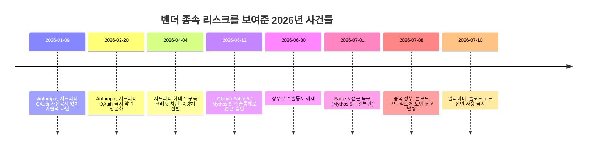
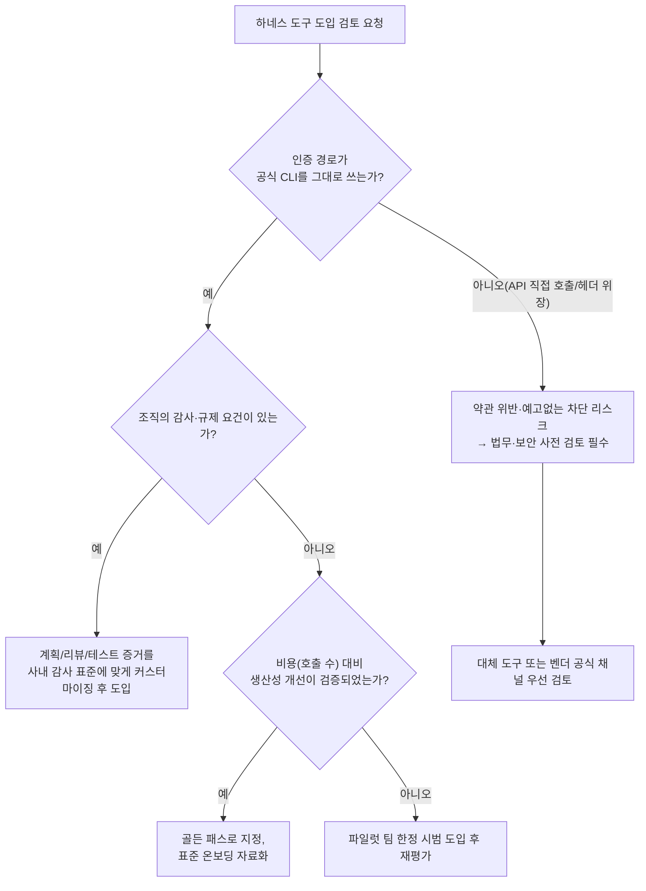

**— Superpowers·가재코드·Oh-my-codex는 정말 "개인 취향"의 문제인가 —**

- 작성일: 2026년 7월 11일
- 성격: 이전 문서([「코딩 하네스 논쟁: GPT-5.6·Fable 시대에도 '보조 레이어'가 필요한가」](https://k82022603.github.io/posts/%EC%BD%94%EB%94%A9-%ED%95%98%EB%84%A4%EC%8A%A4-%EB%85%BC%EC%9F%81-gpt-5.6-fable-%EC%8B%9C%EB%8C%80%EC%97%90%EB%8F%84-%EB%B3%B4%EC%A1%B0-%EB%A0%88%EC%9D%B4%EC%96%B4%EA%B0%80-%ED%95%84%EC%9A%94%ED%95%9C%EA%B0%80/))의 후속편. 같은 소재를 개인 바이브코더가 아닌 **대기업 AX(AI Transformation) 추진 조직**의 시선으로 다시 읽습니다.

---

## 1. 왜 관점을 바꿔서 다시 봐야 하는가

이전 문서에서 정리한 Threads 논쟁은 본질적으로 "나 혼자 코딩할 때 이 도구가 아직 필요한가"를 묻는 질문이었습니다. 댓글들도 전부 개인의 생산성 체감("쌩으로 해도 잘 된다", "테스트 과정이 헤비하다")을 근거로 삼았습니다.

그런데 이 질문을 대기업 AX 조직(사내 AI 전환을 기획·표준화·거버넌스하는 조직, 흔히 AX추진단·AX전략실·DX본부 산하 AI팀 등으로 불립니다)에 그대로 가져가면, 질문 자체가 성립하지 않는 지점이 많습니다. 개인 개발자에게는 "필요하냐 아니냐"가 전부지만, 조직에는 그 위에 최소 여섯 개의 층위가 더 얹힙니다: 거버넌스·컴플라이언스, 공급망·보안, 비용 구조, 표준화, 감사가능성, 벤더 종속 리스크입니다.

이 문서는 바로 이 여섯 개 층위를 하나씩 짚습니다. 특히 이 문서를 작성하는 시점(2026년 7월)에 실제로 벌어진 두 개의 사건— Anthropic의 서드파티 도구 OAuth 사용 금지 정책, 그리고 알리바바의 클로드 코드 전면 사용 금지 — 이 AX 관점에서 왜 이 논쟁의 무게중심을 완전히 바꾸는지를 중심으로 다룹니다.

> **용어 정리**: AX(AI Transformation)는 DX(Digital Transformation)의 연장선에서 국내 대기업들이 쓰는 표현으로, AI를 개별 도구 도입 수준이 아니라 조직의 업무 프로세스·인력 운영·거버넌스 체계 전반에 결합시키는 전사적 전환을 가리킵니다. 이 문서에서 "AX 관점"은 특정 회사의 공식 방법론이 아니라, 국내 대기업들이 AI 도구를 조직 차원에서 검토할 때 공통적으로 거치는 절차(보안 검토, 법무 검토, 예산 통제, 표준화)를 일반화해 서술한 것입니다.

---

## 2. 이전 논쟁 리마인드 (짧게)

원문 Threads 게시물은 "GPT-5.6, Fable 같은 무지막지한 모델이 나왔는데 Superpowers·가재코드·Oh-my-codex 같은 코딩 보조 레이어가 여전히 의미가 있는가"를 물었습니다. Superpowers(Claude Code용 TDD·브레인스토밍 방법론 플러그인), 가재코드(Gajae-Code, Yeachan-Heo가 만든 독립 외부 하네스), Oh-my-codex(Codex CLI용 멀티 에이전트 오케스트레이션)는 모두 "기반 코딩 에이전트 위에 구조화된 워크플로우를 얹는" 도구라는 공통점이 있습니다. 댓글창은 대략 "모델이 좋아져서 이제 필요 없다"와 "기획·복잡한 작업에서는 여전히 유효하다"로 갈렸습니다. (자세한 내용과 각 도구의 정의는 이전 문서를 참고하십시오.)

이 논쟁을 관통하는 개인 차원의 축은 "모델의 원천 능력이 얼마나 올라왔는가" 대 "작업의 복잡도"였습니다. 지금부터는 여기에 조직 차원의 축들을 겹쳐 보겠습니다.

---

## 3. 대기업 AX 관점에서 새로 부각되는 여섯 개의 축

### 3.1 거버넌스·컴플라이언스: "그 도구, 약관 위반 아닌가?"

개인 개발자에게 Superpowers나 Gajae-Code, Oh-my-codex를 설치하는 것은 `npm install` 한 줄의 문제입니다. 그런데 이 도구들이 내부적으로 어떤 인증 경로를 쓰는지는 조직 입장에서 전혀 다른 무게를 갖습니다.

2026년 1월 9일, Anthropic은 사전 공지 없이 서버 단에서 구독(Free/Pro/Max) OAuth 토큰이 공식 Claude Code CLI 외부에서 작동하지 못하도록 기술적으로 차단했습니다. OpenCode(당시 GitHub 스타 10만 7천 개를 넘긴 인기 도구), Cline, RooCode 등 HTTP 헤더를 위장해 공식 CLI인 것처럼 접근하던 도구들이 일제히 멈췄습니다. 2월 20일에는 이를 약관에 명문화했습니다: "Free, Pro, Max 구독으로 발급된 OAuth 토큰은 Claude Code와 claude.ai 전용이며, 다른 어떤 제품·도구·서비스에서 사용하는 것도 소비자 서비스 약관 위반"이라고 못박았고, 심지어 Anthropic 자체 Agent SDK도 예외가 아니라고 명시했습니다. 4월 4일부터는 이를 과금 체계로도 집행해, 서드파티 하네스가 구독 계정에 연결되어 있으면 구독 크레딧이 아니라 별도의 종량제 "Extra Usage"에서 차감되도록 전환했습니다. 이 조치로 활성 OpenClaw 인스턴스 13만 5천 개 이상이 영향을 받았습니다.

이것이 대기업 AX 조직에게 의미하는 바는 명확합니다. 개인 개발자가 회사 지급 Claude 구독 계정으로 서드파티 하네스를 돌리고 있었다면, 이는 (1) 회사가 인지하지 못한 상태에서 서비스 약관을 위반하고 있었을 가능성이 있고, (2) 어느 날 갑자기 예고 없이 끊길 수 있으며, (3) 끊기는 순간 예산에 없던 종량제 청구가 발생할 수 있다는 뜻입니다. 실제로 이 조치는 사전 공지 없이 기술적으로 먼저 차단되고, 6주 뒤에야 문서화되는 순서로 진행되었습니다. "오늘 허용된 사용 방식이 내일도 허용된다는 보장은 없다"는 점이 이 사건의 핵심 교훈입니다.

다만 여기서 실무적으로 구분해야 할 지점이 있습니다. Superpowers는 Claude Code의 공식 플러그인 마켓플레이스를 통해 설치되어 Claude Code 내부 세션을 그대로 쓰는 방식이고, 가재코드(Gajae-Code)도 README에서 스스로 "숨겨진 플러그인이 아니라 외부 실행기"라고 강조하며 공식 CLI 옆에서 별도로 실행되는 구조를 표방합니다. 즉 이 두 도구가 OpenClaw나 구형 OpenCode처럼 헤더를 위장해 API를 직접 두드리는 방식인지, 아니면 공식 CLI를 그대로 호출해 우회하지 않는 방식인지는 도구마다 다르고, 이 문서 작성 시점에 모든 하네스의 내부 인증 흐름을 하나하나 검증한 자료는 확인하지 못했습니다. **바로 이 지점이 AX 조직이 개인 판단에 맡기지 않고 직접 확인해야 할 부분입니다.** "이 도구가 인증을 어떻게 처리하는가"는 보안팀이 도구별로 개별 심사해야 할 항목이지, 사내 공지나 커뮤니티 후기로 대신할 수 있는 질문이 아닙니다.

### 3.2 공급망·보안 리스크: 알리바바가 클로드 코드 자체를 금지한 이유

여기서 중요한 반전이 있습니다. 지금까지의 논의는 "서드파티 하네스가 위험하고 공식 벤더 도구는 안전하다"는 전제를 깔고 있었는데, 2026년 7월의 실제 사례는 이 전제를 무너뜨립니다.

2026년 6월 30일, 한 레딧 이용자가 클로드 코드를 역공학해 숨겨진 추적 코드를 발견했다고 공개했습니다. 소프트웨어 개발자 블로그(thereallo.dev)를 통해서도 클로드 코드 로컬 설치판에서 유니코드 문자를 이용한 이른바 "프롬프트 스테가노그래피" 방식의 추적 코드가 확인되었습니다. 기술 문서에 따르면 클로드 코드는 2026년 4월 2일 배포된 버전 2.1.91부터 6월 29일 버전 2.1.196까지, 사용자의 프록시 설정이나 시스템 시간대가 특정 목록(알리바바, 바이두, 바이트댄스, 문샷AI 등 중국 기업·클라우드 리전과 연관된 목록)과 일치하는지 조용히 확인하고, 일치할 경우 명시적인 원격 측정 신호 대신 시스템 프롬프트의 날짜 형식과 문장부호를 미세하게 바꿔 감지 여부를 인코딩해온 것으로 알려졌습니다.

Anthropic 측(타릭 시히파르)은 이 기능이 2026년 3월부터 시작된 실험으로, 무단 리셀러 계정 남용과 모델 증류(distillation)를 막기 위한 부정사용 방지 장치였다고 해명했습니다. 실제로 Anthropic은 6월 10일 미국 상원 은행위원회에 보낸 서한에서, 알리바바의 큐원(Qwen) 연구소와 연관된 운영자들이 약 2만 5천 개의 부정 계정으로 4월 22일부터 6월 5일 사이 클로드와 2,880만 건이 넘는 상호작용을 만들어 자사 모델 학습에 활용하려 했다고 주장한 바 있습니다.

의도가 무엇이었든, 결과는 대기업 AX 조직이 반드시 알아야 할 사건입니다.

- **알리바바는 2026년 7월 10일부터 사내 전 직원의 클로드 코드 사용을 전면 금지**하고, 클로드·오퍼스·페이블 등 Anthropic 모델 시리즈를 전부 삭제하도록 지시했습니다. 클로드 코드는 고위험 소프트웨어 목록에 추가되었고, 대체 도구로 알리바바 자체 개발 도구 "쿼더(Qoder)"를 지정했습니다.
- **중국 정부(공업정보화부 산하 국가취약점데이터베이스)도 2026년 7월 8일 클로드 코드에 대해 공식 백도어 보안 경고를 발령**했습니다. 해당 버전이 사용자 동의 없이 위치·신원 정보를 외부로 전송할 수 있다는 이유였습니다.
- Anthropic은 문제가 된 위치 추적 코드를 다음 릴리스에서 전면 롤백하겠다고 밝혔습니다.

이 사건이 AX 관점에서 중요한 이유는, "공식 벤더가 만든 도구니까 안전하다"는 가정 자체가 성립하지 않는다는 것을 실증했기 때문입니다. Superpowers·가재코드·Oh-my-codex 같은 서드파티 하네스가 검토 없이 도입되면 위험한 것은 맞지만, 그렇다고 벤더 공식 도구를 무검토로 통과시켜도 된다는 뜻은 아닙니다. 오히려 이번 사건은 **AI 코딩 도구 전체— 벤더 공식 제품이든 커뮤니티 하네스든— 를 하나의 공급망 리스크 범주로 놓고, 도입 전 보안 검토와 지속적인 버전 모니터링을 관행화해야 한다**는 결론으로 이어집니다.

### 3.3 비용 구조(TCO): 하네스는 "공짜로 더 잘 써지는 것"이 아니다

개인 개발자 관점에서는 하네스가 "같은 구독료로 더 좋은 결과를 뽑아내는 트릭"처럼 느껴질 수 있습니다. 하지만 에이전틱 워크플로우의 경제학은 프롬프트 길이가 아니라 **에이전트 수와 실행 강도(effort level)** 에 의해 결정됩니다. Superpowers의 서브에이전트 기반 2단계 리뷰, 가재코드의 team 모드(병렬 tmux 워커), Oh-my-codex의 팀 모드(다중 Codex 워커)는 모두 하나의 요청을 여러 번의 모델 호출로 쪼개는 구조입니다. 개인이 한 번 "엔터"를 치면, 내부적으로는 브레인스토밍 호출, 계획 호출, 여러 서브에이전트 실행 호출, 리뷰 호출이 연쇄적으로 발생합니다.

개인 구독 요금제(월 20~200달러 정액)에서는 이 비용 구조가 잘 드러나지 않았습니다. 정액제이기 때문입니다. 그런데 앞서 3.1에서 다룬 Anthropic의 서드파티 도구 정책 변화로, 이제 서드파티 하네스를 통한 사용은 구독 정액이 아니라 종량제(Extra Usage) 또는 별도 API 키 과금으로 넘어가고 있습니다. 즉 "구독으로 무제한처럼 쓰던" 시절의 경제성 계산은 더 이상 유효하지 않습니다.

이것이 대기업 규모로 넘어가면 훨씬 첨예해집니다. 개발자 한 명이 하네스를 켜고 밤새 자율 루프를 돌리는 것과, 수백 명의 엔지니어가 각자 취향에 맞는 하네스를 설치해 조직 전체에서 서브에이전트 호출이 기하급수적으로 늘어나는 것은 완전히 다른 예산 문제입니다. 실제로 2025년 말 유행했던 "자율 루프를 밤새 돌려 테스트가 통과할 때까지 반복시키는" 기법이 하루 수백만 토큰을 소모한 사례가 서드파티 도구 단속의 직접적인 배경 중 하나로 지목되기도 했습니다. AX 조직이 하네스 도입을 검토할 때는 "이 도구가 결과물의 품질을 얼마나 높이는가"뿐 아니라 **"이 도구가 요청 1건당 평균 몇 회의 모델 호출을 발생시키는가"** 를 반드시 예산 모델에 넣어야 합니다.

### 3.4 표준화 vs 개인화: 취향의 다양성이 조직에는 부채가 된다

이전 문서에서 확인했듯, 이 생태계에는 최소 6~7개의 유사한 하네스 도구(Superpowers, 가재코드, Oh-my-codex, OmO, LazyCodex, Oh My Claude Code, claw-code 계열)가 동시에 활발히 개발되고 있습니다. 개인 개발자에게는 이 다양성이 "내 스타일에 맞는 도구를 고를 자유"이지만, 조직에는 다른 의미를 갖습니다.

- **코드 리뷰 문화의 파편화**: 어떤 팀원은 Superpowers의 레드-그린-리팩터 강제 방식으로 커밋하고, 다른 팀원은 가재코드의 deep-interview→ralplan→ultragoal 방식으로 커밋하면, PR에 남는 계획 문서·테스트 증거·커밋 단위의 형식이 팀마다 달라집니다. 리뷰어가 매번 "이 팀은 어떤 방식으로 작업했는지"부터 파악해야 하는 비용이 생깁니다.
- **온보딩 비용**: 신규 입사자가 배워야 할 것이 "회사 표준 워크플로우" 하나가 아니라 "우리 팀 선임이 좋아하는 하네스 N개"가 되면, 온보딩 문서와 교육 자료가 도구 수만큼 늘어납니다.
- **지원·유지보수 책임 소재**: 사내 플랫폼팀(DevEx팀)이 지원해야 할 대상이 명확하지 않습니다. Superpowers에 문제가 생기면 사내 누가 책임지고 obra 저장소의 이슈를 트래킹합니까? 가재코드에 문제가 생기면 Yeachan-Heo 개인 저장소의 대응 속도에 조직의 생산성이 달려 있게 됩니다. 이는 흔히 "버스 팩터(bus factor) 리스크"라 불리는, 소수의 개인 유지보수자에게 조직의 핵심 워크플로우가 종속되는 상황입니다.

AX 조직의 일반적인 대응은 "개인의 자유"와 "조직의 표준" 사이에서 하나를 표준 골든 패스로 지정하고 — 그것이 벤더 공식 기능이든, 사내에서 포크·감사한 오픈소스 도구든 — 나머지는 예외 승인 절차를 거치도록 하는 것입니다. 이는 도구의 우열을 가리자는 것이 아니라, "조직이 감당할 수 있는 다양성의 폭"을 관리하자는 것입니다.

### 3.5 감사가능성·규제 대응: 개인에게는 부담인 것이 조직에는 자산이다

여기서 흥미로운 역전이 하나 있습니다. 원문 Threads 댓글에서 원 작성자는 가재코드의 "테스트 과정이 너무 헤비하다"며 이탈 의사를 밝혔습니다. 개인 생산성 관점에서는 합리적인 불만입니다. 그런데 금융·의료·공공 부문처럼 규제가 엄격한 산업에 속한 대기업이라면, 바로 이 "무거운 검증 절차"가 오히려 요구사항이 됩니다.

- 감사 담당자나 규제기관은 "이 코드 변경이 왜, 어떤 근거로, 누구의 승인 하에 이루어졌는가"를 사후에 재구성할 수 있어야 합니다.
- Superpowers의 계획 문서·2단계 리뷰 기록, 가재코드의 ultragoal 증거 추적, Oh-my-codex의 plan→PRD→exec→verify→fix 단계별 산출물은 모두 이런 재구성에 쓸 수 있는 감사 트레일 후보입니다.
- 반대로 "쌩(raw)"으로 모델에게 바로 코드를 시키는 방식은, 결과물의 품질은 높을 수 있어도 "그 결과물이 어떤 계획과 검증을 거쳐 나왔는가"를 증명할 자료가 남지 않습니다.

즉 "모델이 좋아졌으니 하네스가 필요 없다"는 개인 차원의 결론이, 감사·컴플라이언스 요건이 있는 조직에는 그대로 적용되지 않습니다. 다만 이 경우에도 조직이 커뮤니티 하네스를 그대로 가져다 쓰는 것이 아니라, **감사 요건에 맞게 산출물 포맷·보관 기간·접근 권한을 사내 표준에 맞게 커스터마이징**하는 절차가 별도로 필요합니다. 오픈소스 도구가 기본으로 제공하는 로그 포맷이 회사의 감사 요건을 자동으로 만족시켜주지는 않습니다.

### 3.6 벤더 종속 리스크: 한 회사에 다 걸지 말라는 신호가 반복되고 있다

이 문서와 이전 문서를 관통하는 시기(2026년 6월~7월) 동안 실제로 벌어진 사건들을 순서대로 나열하면, 이례적으로 짧은 기간에 벤더 종속의 위험성을 보여주는 사례가 반복되었습니다.

이 타임라인이 AX 조직에 주는 메시지는 단순합니다. 규제 환경(수출 통제), 상업적 분쟁(모델 증류를 둘러싼 국가 간 AI 경쟁), 보안 이슈(추적 코드 발견) 중 어느 것이 계기가 되든, **단일 벤더·단일 모델·단일 도구에 조직의 핵심 개발 워크플로우를 전부 의존시키는 구조는 단기간에 반복적으로 흔들릴 수 있습니다.** 이는 Anthropic이 유독 불안정하다는 뜻이 아니라, 프런티어 AI 모델 산업 자체가 지정학·규제·상업적 갈등이 겹치는 초기 단계에 있다는 뜻에 가깝습니다.

이 축을 하네스 논쟁과 연결하면, "가재코드나 오마이코덱스가 있으면 GPT면에서든 Claude 진영에서든 갈아탈 때 workflow가 최소한 비슷하게 유지된다"는 점에서, **모델 벤더 중립적인 하네스 계층을 하나 확보해 두는 것 자체가 조직의 벤더 리스크를 낮추는 수단**이 될 수 있습니다. 실제로 Superpowers는 Claude Code 외에도 Codex, Cursor, OpenCode 등 다수의 하네스에서 동작하도록 설계되어 있고, 가재코드도 "Claude Code, Codex CLI, OpenCode 옆에서" 동작한다고 명시합니다. 이는 하네스 계층을 잘 고르면, 특정 모델 벤더의 정책 변화(구독 정책 변경, 수출 통제, 국가별 접근 제한)로부터 조직의 워크플로우 연속성을 어느 정도 분리할 수 있다는 뜻이기도 합니다.

---

## 4. 개인 생산성 논쟁 vs 대기업 AX 논쟁: 무엇이 다른가

| 축 | 개인 바이브코더 관점 | 대기업 AX 관점 |
|---|---|---|
| 판단 기준 | 체감 생산성, 결과물 품질 | 거버넌스, 보안, 비용, 감사가능성, 벤더 리스크 |
| "모델이 좋아졌다"의 의미 | 하네스가 불필요해질 수 있다는 신호 | 판단 기준 중 하나일 뿐, 결론을 바꾸지 않는 요소가 더 많음 |
| 도구 선택 주체 | 개인 취향 | 조직 표준(골든 패스) + 예외 승인 절차 |
| 무거운 검증 절차 | 비효율(이탈 요인) | 감사·규제 대응 자산일 수 있음 |
| 인증 방식 | 신경 쓰지 않음(구독으로 되면 그만) | 약관 위반·예고 없는 차단 리스크를 반드시 사전 확인 |
| 공식 벤더 도구 | 상대적으로 안전하다고 가정 | 공식 도구도 동일한 보안 심사 대상(알리바바 사례 참고) |
| 실패의 파급력 | 개인의 시간 손실 | 예산 초과, 감사 실패, 서비스 연속성 리스크로 확산 |

---

## 5. 대기업 AX 담당자를 위한 체크리스트 (제안)

> 아래는 특정 기관이 발표한 공식 프레임워크가 아니라, 이 문서의 분석을 바탕으로 정리한 제안입니다. 조직의 산업·규제 환경에 따라 가감이 필요합니다.

1. **인증 경로 확인**: 검토 중인 하네스가 공식 CLI를 그대로 호출하는지, 아니면 API 헤더를 위장하거나 구독 OAuth 토큰을 직접 사용하는지 확인합니다. 후자라면 예고 없는 차단·약관 위반 리스크를 예산·일정에 반영합니다.
2. **공급망 심사 대상 확장**: 서드파티 하네스뿐 아니라 벤더 공식 도구도 정기 보안 심사 대상에 포함합니다. 버전 업데이트 시 릴리스 노트와 커뮤니티 보안 리포트를 모니터링하는 프로세스를 둡니다.
3. **비용 모델링**: 하네스별 "요청 1건당 평균 모델 호출 수"를 파악하고, 종량제 기준으로 예산을 재계산합니다. 정액 구독 시절의 관행적 사용량 추정치를 그대로 쓰지 않습니다.
4. **골든 패스 지정**: 조직 표준 하네스(또는 하네스 없음)를 하나 지정하고, 다른 도구 사용은 예외 승인 절차를 거치게 합니다. 표준 선택 시 벤더 중립성(여러 모델·CLI에서 동작하는지)을 가점 요소로 검토합니다.
5. **감사 요건 매핑**: 산업별 규제 요건(금융 감독 규정, 개인정보보호법 등)에 맞춰, 하네스가 남기는 계획·리뷰·테스트 증거의 보관 형식과 기간을 사내 표준에 맞게 재정의합니다.
6. **벤더 다각화 대비**: 특정 모델 벤더의 정책 변화, 수출 통제, 국가별 접근 제한 발생 시 대체 경로(다른 벤더 모델로 전환)를 실행할 수 있도록, 하네스 계층과 모델 계층을 최대한 분리해 설계합니다.

---

## 6. 용어집 (이 문서 추가분)

- **AX(AI Transformation)**: DX의 연장선에서, AI를 조직의 업무 프로세스·인력 운영·거버넌스 체계 전반에 결합시키는 전사적 전환. 특정 회사의 고유 방법론이 아니라 업계에서 통용되는 일반 용어입니다.
- **TCO(Total Cost of Ownership)**: 도구 도입 시 라이선스 비용뿐 아니라 운영·유지보수·교육·리스크 대응까지 포함한 총소유비용.
- **버스 팩터(Bus Factor)**: 프로젝트가 소수(극단적으로는 1명)의 유지보수자에게 의존해, 그 사람이 이탈하면 프로젝트 전체가 위태로워지는 정도를 가리키는 리스크 지표.
- **골든 패스(Golden Path)**: 조직이 공식적으로 지원·권장하는 표준 워크플로우 또는 도구 조합. 그 외의 선택은 예외 승인을 거치게 하는 것이 일반적입니다.
- **섀도우 IT(Shadow IT)**: 조직의 공식 승인·관리 절차를 거치지 않고 구성원이 개별적으로 도입해 사용하는 도구·서비스. 이 문서의 맥락에서는 "섀도우 AI 하네스"로 확장해 적용할 수 있습니다.
- **증류(Distillation)**: 한 AI 모델의 출력을 대량으로 수집해 다른(대개 더 저렴한) 모델을 훈련시킴으로써 유사한 성능을 훨씬 낮은 비용으로 재현하는 기법. 이 문서에서는 Anthropic이 알리바바 측에 제기한 의혹의 맥락에서 다뤘습니다.

---

## 7. 팩트체크 노트

- **1차/복수 매체로 확인됨**: Anthropic의 서드파티 OAuth 차단 타임라인(2026-01-09 기술적 차단 → 02-20 약관 명문화 → 04-04 과금 전환), 알리바바의 클로드 코드 전면 금지(2026-07-10 발효, 로이터·차이신 등 복수 매체 보도), 중국 정부의 백도어 보안 경고(2026-07-08, MIIT 산하 NVDB).
- **당사자 해명(제3자 검증 진행 중)**: 클로드 코드의 추적 코드가 "부정 계정·증류 방지 목적"이었다는 Anthropic 측 설명, 알리바바가 2만 5천 개 부정 계정으로 증류를 시도했다는 Anthropic 측 주장. 양측 모두 상대방 주장에 대한 완전한 반박이나 독립된 제3자 감사 결과는 이 문서 작성 시점 기준 확인되지 않았습니다.
- **로이터 보도의 단일 소스 한계**: 알리바바의 금지 조치 관련 초기 보도 중 일부는 익명의 단일 소식통에 근거했다고 명시되어 있으며, 알리바바의 공식 확인은 초기 보도 시점에는 없었습니다. 이후 중국 매체(차이신, 즈둥시)의 내부 관계자 인용 보도로 조치 시행이 재확인되었습니다.
- **이 문서의 체크리스트(5장)와 비교표(4장)**: 특정 기관·컨설팅사의 공식 프레임워크가 아니라, 이 문서 작성 과정에서의 분석적 종합입니다. 실제 조직 적용 시에는 해당 조직의 법무·보안·컴플라이언스 부서 검토가 필요합니다.
- **하네스별 인증 경로의 상세 기술 검증**: Superpowers·가재코드·Oh-my-codex가 실제로 OAuth 토큰을 직접 사용하는지, 공식 CLI만 호출하는지에 대한 코드 레벨 감사 결과는 이 문서 조사 범위에서 확인하지 못했습니다. 3.1절에서 언급했듯 이는 AX 조직이 도구별로 직접 확인해야 할 항목으로 남겨둡니다.

---

## 8. 참고자료

- 박재홍의 실리콘밸리, "Anthropic, 구독 인증의 서드파티 사용을 공식 금지하다" — https://wikidocs.net/blog/@jaehong/8009/
- 박재홍의 실리콘밸리, "Anthropic, 4월 4일부터 Claude 구독으로 OpenClaw 등 서드파티 하네스 사용 시 별도 과금 시행" — https://wikidocs.net/blog/@jaehong/10634/
- openclaw.rocks, "Anthropic Banned Third-Party Tools. Here's What It Means." — https://openclaw.rocks/blog/anthropic-oauth-ban
- 빌트아이, "앤트로픽, Claude 구독권으로 OpenClaw 등 서드파티 툴 사용 차단, 보상은?" — https://builtai.org/anthropic-claude-subscription-openclaw-tools/
- 위키트리, "알리바바, 7월10일 클로드 코드 전면 금지…백도어 의혹 정면충돌" — https://www.wikitree.co.kr/articles/1144678
- 디지털투데이, "알리바바, 7월 10일부터 클로드 코드 사용 금지" — https://www.digitaltoday.co.kr/news/articleView.html?idxno=681406
- AI타임스, "알리바바, 직원 '클로드 코드' 사용 금지...'중국 사용자 비밀 추적' 여파" — https://www.aitimes.com/news/articleView.html?idxno=212423
- 디지털포커스, "알리바바, 백도어 의혹에 클로드 코드 사내 사용 금지" — https://www.digitalfocus.news/news/articleView.html?idxno=21967
- 서울경제, "中 알리바바 클로드 코드 금지령...앤스로픽 '우리가 사용금지'" — https://www.sedaily.com/article/20063676
- 위키트리, "중국, 접속 금지한 클로드 코드에 백도어 경고...앤트로픽 '원래 못 쓰는 제품'" — https://www.wikitree.co.kr/articles/1145476
- (이전 문서) "코딩 하네스 논쟁: GPT-5.6·Fable 시대에도 '보조 레이어'가 필요한가" — Superpowers·가재코드·Oh-my-codex 개별 도구 설명 및 원문 Threads 논쟁 정리

---

*이 문서는 AI바이브코딩기초클래스 교육 자료로, 이전 문서(개인 생산성 관점의 하네스 논쟁 정리)의 후속편으로 작성되었습니다. 5장의 체크리스트와 4장의 비교표는 이 문서 작성 과정에서의 분석적 종합이며, 특정 기관의 공식 프레임워크가 아님을 다시 한 번 밝힙니다. Anthropic-알리바바 간 분쟁, 서드파티 도구 정책은 이 문서 작성 이후에도 계속 변화할 가능성이 높으므로, 실제 조직 의사결정에 활용할 경우 반드시 최신 공지를 재확인하시길 권합니다.*
