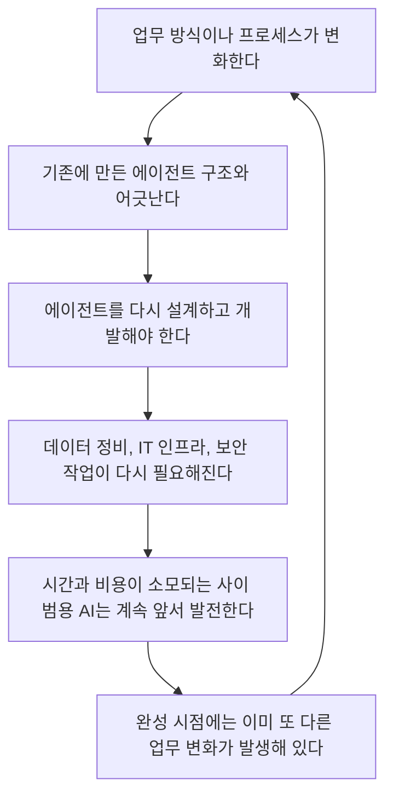
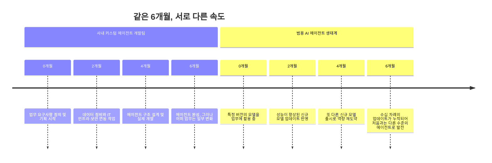
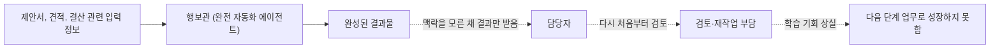
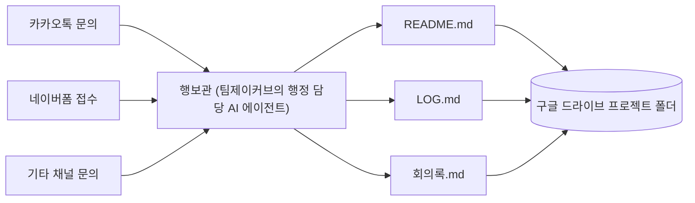
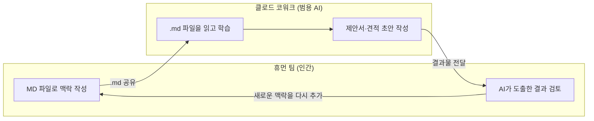
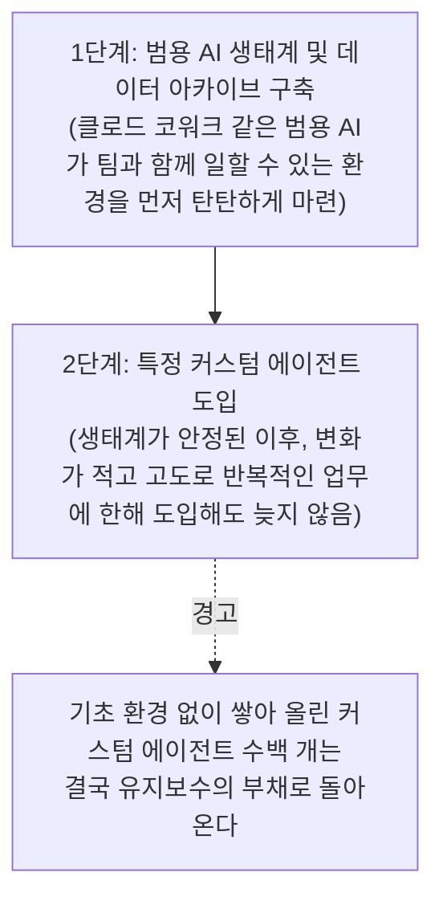

## 이 글이 다루는 내용

이 문서는 유튜브 채널 **퇴근길AI**(운영사: 팀제이커브·teamjcurve.com)가 2026년 7월 9일 공개한 영상 **"사내 AI 에이전트 만들면 생기는 문제들이 있습니다"** 의 내용을 상세하게 풀어 정리한 것이다. 이 채널은 대기업 임직원을 대상으로 AX(AI Transformation) 교육과 컨설팅을 진행하는 팀의 실무 경험을 바탕으로 콘텐츠를 제작하고 있으며, 해당 영상 역시 발표자가 수천 명 규모의 임직원 교육 현장에서 반복적으로 마주한 문제의식과, 발표자가 속한 팀이 직접 자체 에이전트를 만들었다가 겪은 시행착오를 함께 다루고 있다.

핵심 주장은 단순하다. **"우리 회사만의 커스텀 AI 에이전트를 만들자"는 접근이, 실제로는 과거 DX(디지털 전환) 시대의 무거운 SI(시스템 통합) 프로젝트를 AI라는 옷만 바꿔 입고 반복하는 결과로 이어지기 쉽다**는 것이다. 그 대신 발표자는 클로드 코드(Claude Code)나 클로드 코워크(Claude Cowork) 같은 범용 AI 에이전트를 조직에 "온보딩"시키는 방향을 제안한다. 아래에서는 이 주장이 어떤 논리 구조로 전개되는지, 그리고 그 논리가 실제 업계 논의와 어떻게 맞닿아 있는지를 차례로 살펴본다.

---

## 1. 문제의 출발점: 왜 커스텀 에이전트는 자꾸 SI 프로젝트처럼 되어버리는가

발표자는 임원 교육과 AX 컨설팅 현장에서 반복적으로 부딪히는 세 가지 구조적 문제를 제시한다. 이 세 가지는 서로 독립적인 문제가 아니라, 하나의 흐름 속에서 서로를 강화하는 악순환에 가깝다.

**첫 번째 문제는 유지보수 주체의 불명확함이다.** 개인이든 팀이든 일단 에이전트를 하나 만들어 놓으면, 그 에이전트는 특정 시점의 업무 구조를 기준으로 설계된 고정된 구조물이 된다. 그런데 실제 조직의 업무는 계속 변한다. 문제는 이미 짜여진 에이전트의 구조 자체가 그 변화를 따라가지 못한다는 데 있다. 결국 업무가 바뀔 때마다 에이전트를 다시 뜯어고쳐야 하는 상황이 반복되고, 발표자는 이 반복되는 개편 작업이 본질적으로 예전의 SI 프로젝트—즉 특정 요구사항에 맞춰 시스템을 구축한 뒤 요구사항이 바뀔 때마다 다시 개발자를 투입해 고쳐야 했던 방식—와 다를 바 없다고 지적한다.

**두 번째 문제는 커스텀 에이전트를 만들기 위한 전제조건 자체가 무겁다는 점이다.** 제대로 작동하는 커스텀 에이전트를 만들려면 데이터를 정비하고, IT 인프라를 연결하고, 보안 체계까지 함께 손봐야 한다. 그런데 이 작업은 AI 전환(AX) 이전에 이미 존재했던 디지털 전환(DX)의 오래된 과제이기도 하다. 조직 안에 암묵적으로만 존재하던 지식을 문서화된 형식지로 바꾸고, 흩어진 데이터를 라벨링하고 정리하는 이 준비 과정 자체가 상당한 시간과 비용을 요구한다. 이는 이 영상만의 독특한 주장이 아니라, 국내 AI 도입 관련 논의에서도 자주 등장하는 지적이다. 예를 들어 제조 운영 AI 플랫폼을 다루는 한 업계 블로그는 2025년 말 구글 클라우드와 Replit이 한 컨퍼런스에서 "AI 에이전트를 다루는 도구가 아직 준비되지 않았다"고 공개적으로 인정한 사례를 소개하며, 실제 기업 환경은 수십 년간 쌓인 서로 다른 시스템과 지저분한 데이터로 이루어져 있어 에이전트를 실전에 배치하는 과정에서 예상치 못한 오류가 속출한다고 짚은 바 있다.

**세 번째 문제가 가장 결정적인데, 바로 기술 발전 속도의 역설이다.** 커스텀 에이전트를 완성하는 데 6개월이 걸린다고 가정해보자. 그 6개월 동안 클로드 코드와 같은 범용 AI 에이전트는 훨씬 더 빠른 속도로 발전한다. 발표자는 클로드 코드의 릴리즈 노트만 살펴봐도 하루에 수십 건의 업데이트가 올라오고 새로운 모델이 대략 두 달 주기로 나온다고 언급하는데, 이는 발표자가 실무에서 체감한 경험적 관찰이지 앤트로픽이 공식적으로 못박은 출시 주기는 아니라는 점을 짚어둘 필요가 있다. 다만 방향성 자체는 업계에서 폭넓게 공유되는 인식이다. 즉, 6개월 뒤 어렵게 완성한 커스텀 에이전트가 세상에 나오는 순간, 이미 범용 AI 에이전트의 성능은 그보다 훨씬 앞서 있을 가능성이 크다는 것이다.

이 세 가지 문제를 하나로 묶으면, 다음과 같은 악순환 구조로 정리할 수 있다.

발표자는 이 흐름을 두고 "이게 SI랑 도대체 차이점이 무엇일까"라는 질문을 던진다. 즉, 이름만 'AI 에이전트'로 바뀌었을 뿐 실질적으로는 요구사항 변경마다 재개발이 필요한 과거의 시스템 구축 방식이 반복되고 있다는 문제의식이다.

---

## 2. 기술 발전 속도를 시간축으로 놓고 비교하면

같은 6개월이라는 시간 동안 사내에서 커스텀 에이전트를 만드는 팀과, 범용 AI 에이전트 생태계 전체에서 각각 어떤 일이 벌어지는지를 나란히 놓아보면 발표자가 말하려는 격차가 더 분명해진다. 아래는 발표자가 언급한 흐름을 시간순으로 재구성한 것이다.

이 비교가 시사하는 바는, 커스텀 에이전트를 만드는 일 자체가 무가치하다는 것이 아니라 **완성 시점의 기준선이 계속 뒤로 밀려난다**는 데 있다. 범용 AI 에이전트가 매일, 매주 단위로 조금씩 더 똑똑해지는 상황에서 특정 시점의 스냅샷으로 고정된 커스텀 에이전트는 태생적으로 그 발전 속도를 따라잡기 어렵다는 것이 발표자의 핵심 논지다.

---

## 3. 실전 시행착오: "완벽한 자동화"를 시도했다가 부딪힌 벽

이 영상에서 특히 눈에 띄는 부분은, 발표자가 속한 팀(팀제이커브)이 직접 겪은 실패 경험을 솔직하게 공유한다는 점이다. 팀은 한때 **행보관**이라는 이름의 커스텀 에이전트를 통해 제안서 작성부터 견적, 결산까지 업무 전 과정을 완전히 자동화하려고 시도했다.

결과물 자체는 완벽하게 나왔다. 문제는 그 결과물을 받아본 실무자가 왜 이런 결과가 나왔는지 맥락을 이해하지 못했다는 데 있었다. 결국 담당자는 그 결과를 다시 처음부터 검토해야 했고, 이는 자동화를 도입한 원래의 목적—업무 부담을 줄이는 것—을 무력화시키는 결과로 이어졌다. 더 근본적인 문제는 따로 있었다. 사람과 AI가 함께 일하면서 사람이 성장하고 새로운 통찰을 얻어야 그다음 수준의 업무로 나아갈 수 있는데, 업무를 통째로 자동화해버리는 순간 그런 학습 구조 자체가 무너져버린 것이다. 자동화가 완벽해질수록 오히려 인간이 다음 단계로 성장할 수 있는 학습 기회가 사라지는 역설이 발생한 셈이다.

이 경험을 계기로 팀은 방향을 완전히 전환한다. **"AI가 인간의 일을 대신 처리하는 구조"에서 "AI와 인간이 함께 고민하고 함께 학습하는 구조"로 초점을 옮긴 것이다.**

---

## 4. 방향 전환: 행보관의 새로운 역할과 AI-인간 공동 학습 루프

방향을 바꾼 뒤 행보관의 역할은 단 하나로 재정의되었다. **인간과 클로드 사이의 중개자.** 완전한 자동화 기계가 아니라, 사람과 범용 AI 에이전트가 원활하게 협업할 수 있도록 정보를 정리해서 넘겨주는 역할로 축소한 것이다.

구체적인 작동 방식은 이렇다. 세일즈 리드가 카카오톡이나 네이버폼 같은 다양한 채널을 통해 들어오면, 행보관이 이 흩어진 내용을 요약해 메신저로 전달한다. 동시에 클로드 코워크가 이 내용을 이해할 수 있도록 구글 드라이브의 폴더 구조 안에 리드미(README.md), 로그(LOG.md), 회의록(회의록.md) 같은 형태의 MD 파일로 프로젝트 맥락을 정리해 둔다.

이렇게 정리된 MD 파일 구조 위에서 팀원들이 클로드 코워크를 연결하면, 팀원과 범용 AI가 같은 문서를 매개로 제안서를 함께 작성하고 견적서를 함께 검토하는 협업 프로세스가 만들어진다. 여기서 발표자가 강조하는 핵심은, **AI 에이전트가 이해할 수 있는 형식과 사람이 이해할 수 있는 형식을 굳이 분리하지 않고 하나의 형식(MD 파일)으로 통일했다는 점**이다. 이 통일된 형식 덕분에 팀원이 작성한 내용을 클로드가 다시 읽고, 클로드가 작성한 내용을 팀원이 다시 읽고, 심지어 다른 팀원이 작업한 내용까지 클로드가 빠르게 학습해서 참여할 수 있는 순환 구조가 만들어진다.

발표자는 이 반복이 쌓일수록 개인 한 명에게만 머물러 있던 암묵지가 사라지고, 팀 전체의 지적 자산으로 영구히 축적된다고 설명한다. 즉 이 팀이 도달한 결론은 "거대한 커스텀 에이전트를 하나 완성하는 것"이 아니라, **"팀원과 범용 AI가 함께 학습할 수 있는 루프, 그리고 그 루프가 원활히 돌아갈 수 있는 환경을 먼저 만드는 것"** 이었다.

---

## 5. 패러다임의 전환: "도구를 도입한다"가 아니라 "지능을 임대한다"

여기서 발표자는 조금 더 근본적인 개념 정리를 시도한다. 흔히 "AI 에이전트를 도입한다"고 말할 때, 우리는 은연중에 이것을 과거의 소프트웨어 도입—예를 들어 엑셀을 도입하는 것—과 비슷한 일로 여긴다. 하지만 발표자는 이 둘의 성격이 근본적으로 다르다고 강조한다.

| 구분 | 과거: 소프트웨어 도입 (예: 엑셀) | 현재: 지능 온보딩 (범용 AI, 클로드) |
|---|---|---|
| 성격 | 정적(Static) | 동적(Dynamic) |
| 판단 능력 | 스스로 추론하거나 판단하지 않음 | 스스로 맥락을 파악하고 추론함 |
| 작동 방식 | 인간이 미리 짜놓은 규칙과 매크로대로만 수행 | 매일 업데이트되며 스스로 더 똑똑해짐 |
| 비유 | 도구를 사서 쓰는 것 | 지능을 구독하는 것 |

엑셀의 함수와 매크로는 한 번 짜놓으면 그 로직 안에서만 움직인다. 반면 클로드 같은 범용 에이전트는 스스로 추론하고 판단하며, 무엇보다 매일 조금씩 더 똑똑해진다. 발표자는 이 차이를 "우리가 하는 것은 소프트웨어를 도입하는 게 아니라, 지능을 임대해서 구독하는 것"이라는 문장으로 요약한다.

이 개념을 조직 운영의 언어로 옮기면 다음과 같은 비유가 된다. **매일 아침 IQ 200짜리 천재가 우리 회사의 신입사원으로 채용된다고 생각해보자.** 그런데 이 천재는 우리 회사에 대한 맥락을 전혀 모른다. 우리 팀이 어떻게 일하는지, 우리 고객이 누구인지, 지난주에 어떤 결정이 내려졌는지 아무것도 모르는 상태다. 아무리 지능이 뛰어나도 이 천재가 우리 조직에서 곧바로 일을 잘해낼 수 있을 리 없다.

발표자가 이 비유를 통해 전달하려는 메시지는 명확하다. **커스텀 에이전트를 하나 뚝딱 만들어서 던져주는 것이 중요한 게 아니라, 범용 AI 에이전트라는 이 천재가 실제로 일할 수 있는 환경—온보딩 매뉴얼, 조직도, 업무 프로세스, 과거 의사결정의 맥락—을 정리해서 알려주는 일이 훨씬 중요하다는 것이다.** 그래서 발표자는 조직의 리더들에게 "우리도 OOO 에이전트를 만들자"는 접근보다는, "매일 발전하는 이 지능을 우리 조직에 어떻게 온보딩시키고 어떻게 활용할 수 있을까, 범용 AI 에이전트가 일을 잘할 수 있는 환경을 어떻게 구축할까"를 먼저 고민해야 한다고 제안한다.

---

## 6. 그렇다면 커스텀 에이전트는 언제 필요한가

이 영상이 커스텀 에이전트 자체를 전면 부정하는 것은 아니다. 발표자는 커스텀 에이전트가 필요한 경우를 분명히 남겨둔다. **산업 안에서 변화가 크지 않고, 반복적으로 계속 발생하는 업무**라면 커스텀 에이전트로 처리해도 무방하다는 것이다.

다만 여기서도 경고가 뒤따른다. 만약 이런 커스텀 에이전트를 계속 만들기만 한다면, 그 수가 적게는 10개, 많게는 100개, 1000개에 이르렀을 때 과연 누가 그 모든 것을 유지보수할 것인가라는 질문이 남는다. 그 유지보수마저 다시 AI 에이전트에게 맡길 것인지, 그리고 그런 판단을 맡길 만큼 데이터가 충분히 준비되어 있는지를 먼저 따져봐야 한다는 것이다. 발표자가 제시하는 순서는 다음과 같다.

즉, 순서를 바꿔서 커스텀 에이전트부터 먼저 잔뜩 쌓아 올리면 그 자체가 새로운 부채가 되지만, 범용 AI가 일할 수 있는 데이터와 환경을 먼저 갖춰두면 이후에 정말 필요한 지점에서 커스텀 에이전트를 만들 때도 훨씬 수월해진다는 논리다.

---

## 7. 발표자가 리더들에게 던지는 질문

영상의 마지막에서 발표자는 "1인 1 에이전트"라는 최근의 유행을 정면으로 짚는다. 많은 조직에서 구성원 각자가 자신만의 에이전트를 만들자는 분위기가 확산되고 있는데, 그 에이전트는 과연 누가 관리할 것인지, 그리고 그 에이전트가 실제로 어느 정도의 비즈니스 임팩트를 갖고 있는지에 대한 고민은 상대적으로 부족하다는 것이다. 발표자가 제안하는 순서는 다음과 같이 요약된다.

- 먼저 클로드 코워크 같은 범용 AI 에이전트를 조직에서 직접 써본다.
- 그 범용 에이전트가 조직 안에서 일을 잘할 수 있는 환경(맥락 문서, 온보딩 자료, 데이터 아카이브)을 먼저 만든다.
- 이 기반이 갖춰진 상태에서 정말 필요한 영역에 한해 커스텀 에이전트를 만들면, 데이터와 환경이 이미 준비되어 있기 때문에 훨씬 원활하게 진행된다.

---

## 8. 조금 더 넓게 보면: 업계에서도 반복되는 논의

이 영상이 다루는 "범용 AI를 먼저 쓸 것인가, 커스텀 에이전트를 먼저 만들 것인가"라는 질문은 이 채널만의 독창적인 화두는 아니다. 비슷한 시기 국내 기업 현장에서도 유사한 긴장이 여러 각도에서 확인된다.

한 예로 SKT의 역량육성팀 담당자들은 언론 인터뷰에서, 프롬프트를 잘 쓰는 것과 실제로 작동하는 에이전트를 만드는 일은 전혀 다른 차원의 작업이라고 짚었다. 업무 흐름을 잘게 쪼개고 어디를 자동화할지 재설계하는 단계를 넘지 못하면 결국 "똑똑한 챗봇" 수준에 머무른다는 것이다. 이들은 또한 개인이 혼자 만든 에이전트를 조직 전체로 확장하려면 데이터셋 정비 같은 기술적 작업이 별도로 필요하며, 실제 업무에 쓰이는 보안 환경에서는 시연 환경과 달리 기존 시스템·데이터와의 연동이 개인 차원에서 뚫기 어려운 과제라고 밝혔다. 이는 이 영상이 짚은 "DX라는 거대한 장벽" 문제의식과 상당 부분 겹친다.

반면 정반대의 성공 사례도 존재한다는 점은 균형 있게 짚어둘 필요가 있다. 예를 들어 원티드랩의 한 비개발자 총무 담당자는 사내 AI 플랫폼을 활용해 스스로 대화형 자산관리 에이전트를 만든 사례를 공개했는데, 이 사례에서 담당자가 강조한 지점은 범용 AI(예: 제미나이)는 단순한 사실만 알려주는 반면, 회사 내부 규정(예: 노트북 3년 주기 교체 규정)을 학습시킨 자체 에이전트는 규정에 기반한 판단과 제안까지 할 수 있었다는 차이였다. 이는 "내부 정책이나 도메인 특유의 판단 기준을 담아야 하는 업무"에서는 오히려 가벼운 형태의 커스텀 에이전트가 분명한 가치를 만들어낼 수 있다는 사실을 보여준다. 다만 이 사례 역시 변화가 크지 않고 반복적인 업무(자산 관리, 도서 대여 현황 확인)에 집중되어 있다는 점에서, 이 영상이 예외로 남겨둔 "산업 내 변화가 적고 고도로 반복적인 업무"의 범주와 크게 어긋나지 않는다.

한편 AI 에이전트 도입을 다루는 다른 업계 자료들은, 데모 환경에서는 완벽하게 작동하던 에이전트가 실제 현장에 배포되는 순간 온갖 예외 상황과 레거시 시스템 충돌에 부딪히는 현상을 "toy example(장난감 예제)의 함정"이라는 표현으로 짚기도 한다. 이 자료들이 공통적으로 제시하는 해법 역시, 처음부터 모든 업무를 자동화하려 하기보다 좁은 범위에서 시작해 신중하게 범위를 넓혀가고 철저한 감독 체계를 갖추라는 것으로, 이 영상이 강조하는 "완전 자동화보다 공동 학습 루프" 원칙과 방향성이 크게 다르지 않다.

---

## 9. 참고로 짚어볼 만한 배경 지식: 왜 "장시간 실행되는 에이전트 설계"가 화두인가

영상에서 발표자가 인용하는 앤트로픽 블로그 내용은, 장시간 실행되는 코딩 에이전트를 설계할 때 단순한 반복 구조만으로는 한계가 있다는 것을 다루는 글로 추정된다. 앤트로픽은 실제로 자사의 엔지니어링 블로그를 통해, 초기화 에이전트가 제품 사양을 작업 목록으로 쪼개고 코딩 에이전트가 기능을 하나씩 구현해나가는 방식의 실험을 소개하면서, 개발자 커뮤니티에서는 이와 비슷한 통찰을 "랄프 위검(Ralph Wiggum)" 기법이라는 이름으로 부르고 있다고 언급한 바 있다.

이 기법은 2025년 중반 소프트웨어 엔지니어 제프리 헌틀리(Geoffrey Huntley)가 처음 제안한 방식으로, 원리는 매우 단순하다. AI 에이전트에게 동일한 지시를 담은 프롬프트를 반복해서 넣어주면서, 정해진 완료 조건(테스트 통과, 린트 통과 등 외부 검증 기준)을 만족할 때까지 스스로 작업을 종료하지 못하게 막는 방식이다. 이 아이디어가 널리 확산되자 앤트로픽은 2025년 12월 클로드 코드에 이 기법을 공식 플러그인 형태로 통합하기도 했다.

다만 앤트로픽 블로그는 이 방식이 비교적 단순한 작업에서는 효과적이지만, 더 복잡한 작업으로 갈수록 시간이 지날수록 에이전트가 궤도를 벗어나는 현상이 여전히 남아 있다고 지적한다. 그 원인으로는 두 가지 실패 유형을 꼽는데, 하나는 컨텍스트 창(모델이 한 번에 참고할 수 있는 정보의 범위)이 채워지면서 모델이 긴 작업에서 일관성을 잃는 현상이고, 다른 하나는 일부 모델이 컨텍스트 한도에 가까워졌다고 판단하는 순간 작업을 서둘러 마무리하려는 이른바 "컨텍스트 불안(context anxiety)" 현상이다. 이 대목은 이 영상이 짚은 문제의식—즉 정적인 구조로 짜인 에이전트가 변화하는 실제 업무 앞에서 한계를 드러낸다는 지적—과 기술적으로 맞닿아 있는 지점이라 할 수 있다.

---

## 10. 정리

이 영상이 전달하려는 메시지를 한 문장으로 압축하면 다음과 같다. **"완성된 커스텀 에이전트를 던져주는 방식"보다, "매일 더 똑똑해지는 범용 AI 에이전트가 조직 안에서 맥락을 이해하며 일할 수 있는 환경—온보딩 자료, 데이터 아카이브, 협업 루프—을 먼저 만드는 방식"이 더 지속 가능하다는 것이다.**

이 결론에 도달하기까지의 논리를 다시 정리하면 다음과 같다.

1. 커스텀 에이전트는 업무가 변할 때마다 재설계가 필요해, 과거 SI 프로젝트의 유지보수 부담을 그대로 반복하기 쉽다.
2. 데이터 정비, IT 인프라, 보안까지 손봐야 하는 준비 과정(DX의 장벽) 자체가 이미 상당한 시간과 비용을 요구한다.
3. 범용 AI 에이전트의 발전 속도가 워낙 빨라, 몇 달에 걸쳐 완성한 커스텀 에이전트는 완성되는 순간 이미 뒤처져 있을 가능성이 크다.
4. 완전 자동화는 결과물의 맥락을 이해하지 못하게 만들고, 인간이 다음 단계로 성장할 학습 기회를 오히려 빼앗을 수 있다.
5. 그 대안은 사람이 작성한 맥락 문서를 AI가 읽고, AI가 만든 결과물을 사람이 다시 검토하며 맥락을 더하는 공동 학습 루프를 만드는 것이다.
6. 다만 변화가 적고 반복성이 높은 업무 영역에 한해서는, 범용 AI 생태계라는 기초가 갖춰진 이후에 커스텀 에이전트를 도입해도 늦지 않다.

물론 이는 하나의 팀이 자신들의 실무 경험을 바탕으로 도달한 관점이며, 앞서 살펴본 것처럼 내부 정책이나 도메인 판단 기준을 반드시 담아야 하는 업무에서는 가벼운 형태의 커스텀 에이전트가 분명한 가치를 내는 경우도 실제로 보고되고 있다. 결국 두 접근이 상충한다기보다는, "먼저 범용 AI가 일할 수 있는 기반을 다지고, 그 위에서 정말 필요한 영역에 한해 선택적으로 커스텀 에이전트를 얹는다"는 순서의 문제로 이해하는 편이 이 영상의 취지에 가장 가깝다.

---

## 참고 자료

- 퇴근길AI, "사내 AI 에이전트 만들면 생기는 문제들이 있습니다", 유튜브, 2026년 7월 9일 게시 (https://www.youtube.com/watch?v=Gqc-DmR-m_E)
- Anthropic, "Harness design for long-running application development", Anthropic Engineering Blog (https://www.anthropic.com/engineering/harness-design-long-running-apps)
- Anthropic, claude-code 저장소 내 ralph-wiggum 플러그인 문서 (https://github.com/anthropics/claude-code/blob/main/plugins/ralph-wiggum/README.md)
- dfinite AI 블로그, "'2025년은 AI 에이전트의 해', 과연 실제로는 어땠을까요?" (https://blog.dfinite.ai/ai-agent-implementation-challenges)
- 세계일보, "아무나 'AI 에이전트' 만든다는데, 그다음은요? [나인O'Clock]" (https://segye.com/newsView/20260626511917)
- 원티드 블로그, "비개발자 총무는 어떻게 사내 AI 에이전트를 만들었을까?" (https://blog.wantedlab.com/library/behind/people-ai-agent)

---

*작성일: 2026년 7월 16일*
