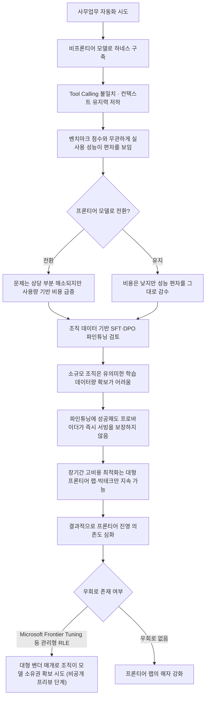

## 1. 들어가며

> 
> https://www.threads.com/@unohee/post/Dazs7taE77A
> 
> 일반 사무업무에 AI를 도입하는 경우 LLM 성능 벤치마크를 믿기가 상당히 어렵다. 특히나 새로운 업무 루브릭에 맞춰서 하네스를 짜려고 하거나 하면 tool calling 일관성에서 너무 다른 모습을 보이고 아무리 벤치마크를 여러종 돌려도 에이전트 성능이 사용자 컴퓨터에서 이리저리 튀는걸 너무 많이 보게 됨. 단순하게는 컨텍스트 유지력이 떨어져서 기본 몇만 토큰 넣고 시작만해도 word salad를 뱉어버리는 경우가 있을거고 (DeepseekV4 같은 경우) 아니면 아무리 prompt template을 맞춰서 넣어도 있는 도구도 있는지 모르고 여러번 되물어야 작동하는 경우도 생긴다. 재밌는건 거의 대부분 프론티어 계열 모델로 올리는 순간 그런 문제들이 줄어든다는것. 하지만 프론티어 모델을 사용량 기반으로 호출했을때 일반 사무업무 효율 대비 가격에서 너무 말이 안되는 가격대에 토큰이 팔린다는것이 문제고. 결국에는 non-frontier 모델 쓰면서 조금 애매한 성능을 감수해야하게 됨.
> 
> 궁극적으로 이 문제를 제대로 해결하려면 도구 호출이나 여러 방면에서 flaky하게 튀는 데이터를 가지고 조직 환경에 맞춰서 SFT를 하던 DPO를 하던가 해서 다시 파인튜닝하는 수밖에 없는데, 당연히 소규모 조직 (20인 이하)에서 나오는 데이터만으로 파인튜닝을 돌릴만큼의 데이터를 만들어내는건 어렵다. 게다가 그렇게 파인튜닝했다 하더라도 메인 프로바이더들이 그 모델을 바로 서빙해주는건 아닌데다 모델 최적화는 또 별개로 따라오는 문제이고. 그렇다고 직원들 일 좀 편하게 하겠다고 시작했다가 어떤 결과가 나올지도 모르는데 덥석 AI 클러스터를 도입하기도 어려운 것이니, 별로 시도할만한 대상조차 되기 어려움. 결국 그런 작업을 장시간에 걸쳐서 수행할 수 있는건 다시 프론티어 모델 보유 회사들이고, 곧 이게 다시 그들의 해자가 되는 구조
> 

이 문서는 스레드(Threads) 이용자 @unohee가 올린 게시글을 바탕으로 작성되었다. 해당 게시글은 일반 사무업무에 AI를 도입하려는 조직이 실제로 마주치는 세 가지 문제 — 벤치마크와 실전 성능의 괴리, 프론티어·비프론티어 모델 사이의 비용 딜레마, 그리고 파인튜닝으로도 해결되지 않는 구조적 한계 — 를 다루고 있다. 참고로 해당 스레드 게시글은 자동 접근을 차단하는 정책 때문에 직접 열람이 불가능해, 이용자가 제공한 본문 텍스트를 그대로 근거로 삼았고, 그 안의 각 주장은 2026년 7월 중순 시점까지 확인 가능한 공개 자료로 별도 검증했다. 검증 결과 사실관계가 갈리거나 아직 공식 확인이 안 된 부분은 본문에서 그때그때 표시했다.

게시글의 논지를 요약하면 다음과 같다. 사무업무용 에이전트 하네스를 짜는 실무자는 비프론티어(non-frontier) 모델로 작업할 때 tool calling 일관성이 벤치마크 점수와 무관하게 튀는 경험을 자주 한다. 이 문제는 프론티어 모델로 갈아타는 순간 상당 부분 해소되지만, 사용량 기반 과금 구조에서 프론티어 모델 토큰 단가는 일반 사무업무의 효율 대비 지나치게 비싸다. 근본적으로 해결하려면 조직 데이터로 SFT나 DPO 같은 파인튜닝을 해야 하지만, 20인 이하 소규모 조직은 유의미한 파인튜닝 데이터를 만들어내기 어렵고, 설령 만들었다 해도 주요 프로바이더가 그 모델을 바로 서빙해주지 않는다는 별개의 문제가 남는다. 결과적으로 이런 장기간의 최적화 작업을 실제로 수행할 수 있는 주체는 다시 프론티어 모델 보유 기업들뿐이고, 이것이 그들의 새로운 해자(moat)가 된다는 것이 게시글의 결론이다.

아래에서는 이 네 가지 주장을 하나씩 짚어보고, 각각에 대해 최근 몇 주 사이 나온 데이터와 업계 동향으로 사실관계를 대조해본다.

## 2. 첫 번째 문제: 벤치마크와 실전 성능은 왜 이렇게 다른가

게시글이 지적하는 현상 — 벤치마크를 여러 번 돌려도 실제 사용자 환경에서는 에이전트 성능이 들쭉날쭉하다는 것 — 은 개별 실무자의 인상비평이 아니라 최근 여러 업계 리포트가 공통적으로 짚는 현상이다.

2026년 4월 발표된 한 벤치마크 방법론 리포트는 엔터프라이즈 에이전트 시스템에서 실험실 벤치마크 점수와 실제 배포 성능 사이에 37%의 격차가 존재한다고 밝혔다. 같은 리포트에 따르면 동일한 작업을 8번 반복 실행했을 때 성공률이 첫 회 60%에서 여덟 번째 반복에서는 25%까지 떨어지는 경우가 확인됐다. 이는 "단발성 정답률"이 아니라 "반복 실행 시의 일관성(pass^k)"을 따로 측정해야 한다는 문제의식과 맞닿아 있으며, 실제로 2026년 상반기 이후 나온 에이전트 평가 가이드들은 하나같이 golden trajectory(정답 궤적) 방식의 반복 측정을 권장하고 있다.

같은 맥락에서 τ-bench(Sierra Research) 계열 벤치마크에서도 GPT-4o 기준 소매(retail) 시나리오에서는 약 61%의 성공률을 보였지만 항공(airline) 시나리오에서는 약 35%로 떨어졌고, 8회 반복 실행 시 일관성은 약 25% 수준까지 하락한 사례가 보고됐다. 에이전트가 스스로 통제할 수 없는 외부 도구·사용자와 조율해야 하는 상황으로 옮겨갈수록 최상위권 모델조차 최대 25포인트까지 성공률이 떨어진다는 결과도 함께 제시됐다.

기업 환경에 특화된 맥락(조직 고유의 절차, 메모리)을 에이전트에 제공했을 때는 상황이 달라진다는 관찰도 있다. 자동화 솔루션 업체 Automation Anywhere가 2026년 5월 공개한 자체 벤치마크에서는 조직 맥락 정보를 부여하는 것만으로 궤적 정확도가 20~47포인트, 목표 달성률이 최대 32포인트 개선되고 복잡한 워크플로우에서 tool-call 실패율이 20% 줄었다고 밝혔다. 이는 게시글이 지적한 "하네스를 짜는 순간 문제가 두드러진다"는 경험과도 상당 부분 부합한다. 즉 모델 자체의 문제라기보다 모델이 처한 컨텍스트·하네스 설계의 문제가 성능 편차를 상당 부분 설명한다는 것이다.

벤치마크 자체의 신뢰도 문제도 별도로 지적된다. MMLU·MMLU-Pro 같은 전통적 벤치마크는 상위권에서 사실상 포화 상태이고, 사전학습 데이터에 벤치마크 문항이 그대로 섞여 들어가는 오염(contamination) 문제, 그리고 채점 과정의 주석 오류율이 50%를 넘는다는 지적도 나온다. 여기에 더해 비슷한 정확도를 내는 모델 사이에서도 비용이 최대 50배까지 차이가 난다는 조사 결과는, "벤치마크 1위"라는 타이틀이 실무 도입 시의 총소유비용(TCO)과는 별개 지표라는 점을 보여준다. 결국 벤치마크는 "이 모델이 얼마나 똑똑한가"를 보여줄 뿐, "우리 조직의 특정 워크플로우에서 얼마나 일관되게 작동하는가"는 별도로 검증해야 한다는 결론으로 수렴한다.

## 3. 두 번째 문제: 비프론티어 모델의 한계, 특히 DeepSeek V4 사례

게시글은 비프론티어 모델의 구체적 문제 사례로 DeepSeek V4를 들며, 기본 몇만 토큰만 넣어도 컨텍스트 유지력이 떨어져 "워드 샐러드"를 뱉는 경우가 있다고 언급했다. 다만 이 구체적 증상(컨텍스트 초반부터의 붕괴)을 뒷받침하는 공개된 3자 검증 자료는 확인되지 않았으며, 이는 실무자 개인의 하네스 환경에서 관찰된 경험으로 보는 것이 정확하다. 대신 DeepSeek V4의 공식 출시 이력과 스펙은 비교적 분명하게 확인된다.

DeepSeek V4는 애초 2026년 2월 출시가 점쳐졌으나 여러 차례 연기됐고, 3월 9일에는 200억 파라미터급 경량 사전 공개판인 V4-Lite가 먼저 나왔다. 이후 4월 24일 V4-Pro(1.6조 총 파라미터, 490억 활성 파라미터)와 V4-Flash 두 프리뷰 버전이 오픈 가중치·API·기술 리포트와 함께 동시에 공개됐으며, 이때 1M 토큰 컨텍스트와 최대 38.4만 토큰 출력이 공식 문서화됐다. DeepSeek는 이 4월 출시를 "프리뷰"로 못박았고, 실사용 피드백을 반영해 정식판을 준비하겠다고 밝혔다.

그리고 2026년 7월 15일, DeepSeek는 V4 정식판을 전면 가동하며 V4 Pro(플래그십 산업판)와 V4 Flash(경량 배치판) 상용 API를 동시에 공개했다. 이번 정식 출시에서 업계의 이목을 끈 것은 모델 성능보다 요금 체계였다. DeepSeek는 기존의 "균일 고정 단가" 방식을 깨고 피크·오프피크 시간대별 차등 요금제를 처음 도입했는데, 오프피크 기본 요금은 5월 22일 조정된 통합 요금과 동일하게 유지하되 평일 핵심 업무 시간대에는 할증을 적용해 유휴 시간대로 워크로드를 유도하는 방식이다. 실제로 7월 초 보도에서는 피크 시간대 요금이 기존 대비 약 2배까지 오른다고 예고된 바 있어, "딥시크는 무조건 저렴하다"는 그동안의 공식이 처음으로 흔들리는 시점이라는 평가가 나온다. 기술적으로는 네이티브 128K 컨텍스트(최대 1M 토큰까지 확장), 칩 RTL 설계를 포함한 산업 코드 생성 등이 3대 업그레이드로 제시됐다.

정리하면, DeepSeek V4는 "무조건 싸고 성능도 나쁘지 않은 대안"이라는 인식과 달리 정식판에서는 시간대에 따라 프론티어 모델과의 가격 격차가 줄어들 수 있는 구조로 바뀌었다. 이는 게시글의 결론 — 비프론티어 모델이 저렴하다는 전제 자체가 고정된 것이 아니라는 점 — 을 오히려 보강하는 최신 사례로 볼 수 있다.

## 4. 세 번째 문제: 프론티어 모델은 실제로 얼마나 비싼가

게시글은 프론티어 모델을 사용량 기반으로 쓸 때 일반 사무업무 효율 대비 "말이 안 되는 가격대"라고 표현했다. 이를 가늠할 수 있는 최근 사례가 마침 이 시기에 두 건 있었다.

첫째는 OpenAI의 GPT-5.6 시리즈다. OpenAI는 2026년 6월 26일 Sol(플래그십)·Terra(균형형)·Luna(경량형) 세 등급으로 구성된 GPT-5.6을 제한적 프리뷰로 먼저 공개했는데, 이 프리뷰는 미국 정부의 사전 승인을 받은 약 20개 기업에만 열려 있었다. 이후 7월 9일 정식 출시(GA)로 전환됐다. 3자 집계 자료에 따르면 Sol은 백만 토큰당 입력 5달러·출력 30달러, Terra는 입력 2.5달러·출력 15달러, Luna는 입력 1달러·출력 6달러 수준으로 안내되고 있다. OpenAI는 Sol이 이전 세대 대비 코딩 작업에서 토큰 효율이 54% 개선됐다고 밝혔지만, 동시에 Sol과 Terra·Luna 세 등급 모두 사이버보안·생물학 위험 영역에서 "고위험" 등급으로 분류돼 있어, 성능이 오를수록 안전성 검토·접근 제한도 같이 강화되는 흐름을 보여준다.

둘째는 Anthropic의 Claude Fable 5·Mythos 5 사례다. 두 모델은 2026년 6월 9일 출시됐으나 사흘 뒤인 6월 12일 미 상무부의 수출통제 조치로 접근이 전면 중단됐고, 6월 30일 해당 통제가 해제되면서 7월 1일부로 접근이 복구됐다. GPT-5.6 역시 6월 말 정부 승인을 받은 일부 기업에만 프리뷰가 열렸다가 7월에야 전면 공개로 전환된 것과 같은 맥락으로, 2026년 하반기 들어 프론티어급 모델은 성능·가격 문제 이전에 "언제, 누구에게 열리는가" 자체가 불확실해지는 정책 리스크를 새롭게 안게 됐다. 사무 자동화를 프론티어 모델에 의존해 설계한 조직이라면 이런 접근성 변동 자체가 별도의 운영 리스크가 된다는 뜻이기도 하다.

이 두 사례를 종합하면 게시글의 지적처럼 프론티어 모델은 단순 토큰 단가만 높은 것이 아니라, 접근 자체가 불안정해질 수 있는 구조적 리스크까지 얹혀 있다. 반대로 3절에서 본 DeepSeek V4처럼 "저렴한 대안"으로 꼽히던 모델도 요금 구조가 복잡해지는 추세여서, 조직 입장에서는 어느 쪽을 택하든 총비용을 예측하기가 점점 어려워지고 있는 것이 현재 상황에 가깝다.

## 5. 네 번째 문제: 소규모 조직 파인튜닝의 현실적 장벽

게시글의 핵심 주장 중 하나는 "20인 이하 소규모 조직이 SFT나 DPO를 돌릴 만큼의 데이터를 스스로 만들어내기 어렵다"는 것이다. 이는 파인튜닝 실무 자료들이 공통으로 짚는 전제와 일치한다.

일반적으로 SFT(지도 미세조정)는 스타일·포맷·도메인 어휘를 원하는 방향으로 정렬하는 가장 기본적이고 접근성 높은 방법으로 꼽히고, DPO(직접 선호 최적화)는 그보다 한 단계 더 나아가 "같은 정답이 여러 개일 때 어떤 답이 더 나은가"를 학습시키는 데 쓰인다. 문제는 이 두 방법 모두 유의미한 품질 개선을 내려면 도메인에 특화된 대량의 정제된 데이터가 필요하다는 점인데, 7B급 모델의 풀 파인튜닝만 해도 80~100GB 이상의 GPU 메모리(A100 80GB 또는 H100급)가 요구되고, 배치 크기·시퀀스 길이·옵티마이저 설정에 따라 결과가 ±30%까지 흔들릴 수 있다는 실무 가이드도 있다. 즉 GPU 인프라와 별개로 데이터 정제·하이퍼파라미터 튜닝에 상당한 ML 전문성이 필요하다는 뜻이며, 이는 20인 이하 조직이 일상 업무를 병행하며 감당하기엔 분명한 진입 장벽이다.

더 근본적인 문제는 게시글이 지적한 대로 "파인튜닝에 성공해도 주요 프로바이더가 그 모델을 곧바로 서빙해주는 것은 아니다"라는 부분이다. 상용 프론티어 모델(예: OpenAI, Anthropic, Google의 폐쇄형 모델)은 애초에 가중치가 공개되지 않기 때문에 고객이 직접 파인튜닝한 결과물을 자체 인프라에 올려 서빙할 수 없고, 프로바이더가 제공하는 파인튜닝 API를 통해서만 제한적으로 커스터마이징이 가능하다. 오픈 가중치 모델(Llama, Qwen, Gemma, DeepSeek 등)을 쓰더라도 LLaMA Factory 같은 오픈소스 프레임워크로 학습 자체는 할 수 있지만, 결과물을 실제 서비스 트래픽에 안정적으로 얹는 배포·최적화·모니터링은 또 별개의 엔지니어링 과제로 남는다. 소규모 팀이 자체 GPU 인프라를 상시 운영하며 이 전 과정을 감당하기는 현실적으로 쉽지 않다는 것이 다수 실무 가이드의 공통된 결론이다.

## 6. 해자(moat) 담론에 대한 최신 반론: "프론티어=해자" 공식은 이미 흔들리고 있다

게시글은 이 모든 문제의 귀결로 "장시간에 걸친 최적화 작업을 수행할 수 있는 것은 결국 프론티어 모델 보유 기업들이며, 이것이 그들의 해자가 된다"고 결론 내린다. 다만 이 결론이 2026년 하반기 현재도 그대로 유효한지는 최근 두 가지 움직임을 함께 봐야 균형 잡힌 판단이 가능하다.

첫 번째는 Microsoft가 2026년 6월 2일 Build 2026에서 발표한 "Frontier Tuning"이다. 이는 게시글이 지적한 문제 구조를 정면으로 겨냥한 서비스로, 핵심은 "고객이 소유하는 강화학습 환경(Reinforcement Learning Environment, RLE)"이다. 관리형 RLE 안에서 조직의 실제 워크플로우, 도구 사용 로그, 평가 신호를 학습 데이터로 삼아 Microsoft의 자체 모델(MAI 계열)을 지속적으로 튜닝하되, 그 결과물인 모델과 학습에 쓰인 데이터는 고객의 컴플라이언스 경계 안에 남고 소유권도 고객에게 있다는 것이 Microsoft의 설명이다. Microsoft는 이 방식으로 튜닝한 Excel 전용 모델이 GPT-5.4와 동등한 성능을 내면서도 최대 10배 비용 효율적이었다고 밝혔고, 한 내부 배포 사례에서는 작업 완료율이 13%에서 87%로 뛰었다는 수치도 제시했다. 이 서비스는 현재 비공개 프리뷰 단계로, Microsoft Copilot Studio와 Microsoft Foundry를 통해 순차 공개될 예정이다.

이 발표를 분석한 여러 산업 논평은 "지난 1~2년간 업계가 전제해온 것과 달리, 앞으로의 지속 가능한 경쟁 우위는 프론티어 모델 자체가 아니라 하네스(orchestration layer)와 그 하네스에서 나오는 데이터를 다시 모델 학습에 먹이는 폐루프(closed loop)에 있다"는 이른바 '하네스 이론(Harness Theory)'을 근거로 든다. Microsoft는 4억 명의 M365 사용자, 1억 명의 GitHub 개발자, Azure·Fabric 인프라라는 기존 자산을 활용해 이 폐루프를 프론티어 랩보다 저렴하게, 그리고 이미 업무 환경에 내장된 상태로 제공하려 한다는 것이 해당 분석의 핵심이다. 이는 게시글이 전제한 "소규모 조직은 결코 파인튜닝 인프라를 감당할 수 없다"는 명제에, 적어도 대형 SaaS 벤더의 관리형 서비스를 매개로 하면 우회로가 생길 수 있음을 시사한다. 다만 이 서비스는 2026년 7월 현재 비공개 프리뷰 단계이며, 20인 이하 소규모 조직이 실제로 이용 가능한 범위와 비용은 아직 공개되지 않았다는 점은 분명히 짚어둘 필요가 있다.

두 번째는 정반대 방향의 경고다. 데이터 분석 기업 Palantir의 CEO Alex Karp는 2026년 7월 1일 한 방송 인터뷰에서, 프론티어 AI 랩들이 자사 모델을 판매하는 과정에서 고객사의 고유 데이터와 경쟁우위를 조용히 흡수하고 있다고 주장했다. Palantir는 2026년 1분기 매출이 전년 대비 85% 성장했고 미국 상업 부문 매출은 133% 늘었다는 실적을 근거로, 가치가 "원천 모델"이 아니라 그 위에 놓이는 거버넌스·주권(sovereignty) 계층에 축적되고 있다는 주장을 뒷받침했다. 이 주장은 게시글의 우려와 방향은 다르지만 문제의식은 일치한다. 즉 "조직이 자체적으로 방어할 수단을 갖추지 못하면 프론티어 랩에 종속된다"는 우려 자체는 여러 진영에서 공통적으로 제기되고 있으며, 다만 그 해법으로 어떤 쪽(자체 파인튜닝 인프라 구축 vs. Microsoft류 관리형 서비스 이용 vs. Palantir류 거버넌스 계층 도입)을 택할지가 갈릴 뿐이다.

한편, 이 논쟁의 배경에는 실제 도입 성과가 아직 저조하다는 냉정한 수치도 있다. MIT Project NANDA 조사에 따르면 기업 생성형 AI 파일럿 프로젝트의 95%가 손익(P&L)에 측정 가능한 영향을 주지 못한 것으로 나타났고, 이 수치는 Microsoft가 25억 달러 규모의 전담 배포 조직(Frontier Company)을 신설하며 직접 인용한 근거이기도 하다. 즉 "모델을 잘 고르는 것"만으로는 부족하고, 워크플로우 설계·거버넌스·지속적 개선 역량이 실제 성과를 가르는 변수로 부상하고 있다는 것이 2026년 하반기 업계의 대체적인 진단이다.

## 7. 전체 논리 흐름 정리

게시글이 제시한 문제의 인과 구조를 도식화하면 다음과 같다.

## 8. 정리하며

게시글이 짚은 세 가지 실무적 관찰 — 벤치마크와 실전 성능의 괴리, 비프론티어 모델의 불안정성과 프론티어 모델의 높은 사용량 비용 사이의 딜레마, 소규모 조직이 파인튜닝으로 이를 근본 해결하기 어려운 구조 — 는 2026년 7월 현재 시점의 공개 자료로도 상당 부분 뒷받침된다. 특히 벤치마크-실전 성능 격차(37%, pass^k 하락)와 반복 실행 시 신뢰도 저하는 여러 독립적인 리포트에서 일관되게 확인되는 현상이고, DeepSeek V4의 정식 출시(2026년 7월 15일)와 피크·오프피크 차등 요금 도입, Claude Fable 5·Mythos 5의 수출통제로 인한 접근 중단·복구(6월 9일 출시 → 6월 12일 중단 → 7월 1일 복구), GPT-5.6의 정부 승인 기반 제한적 프리뷰(6월 26일) 후 정식 출시(7월 9일) 전환 사례는 모두 "프론티어 모델을 쓰는 것 자체가 안정적인 해법은 아니다"라는 점을 보여준다.

다만 게시글의 최종 결론 — 해자가 프론티어 랩에게 고정적으로 귀속된다는 전망 — 은 2026년 6월 이후 나온 Microsoft Frontier Tuning 같은 대안 모델의 등장으로 적어도 이론적으로는 도전받고 있다. 관리형 RLE를 통해 조직이 자체 인프라 없이도 자사 워크플로우 데이터를 학습에 반영하고 그 결과물의 소유권을 유지하는 방식이 실제로 20인 이하 소규모 조직까지 확장될 수 있을지는 아직 검증되지 않았고, 현재는 비공개 프리뷰 단계라는 한계가 있다. 동시에 Palantir CEO의 발언처럼 "프론티어 랩이 고객 가치를 흡수하고 있다"는 반대 방향의 경고도 나오고 있어, 이 문제는 어느 한쪽으로 결론이 난 상태라기보다 2026년 하반기 내내 업계의 핵심 쟁점으로 계속 다뤄질 가능성이 높다.

---

작성일: 2026년 7월 16일
