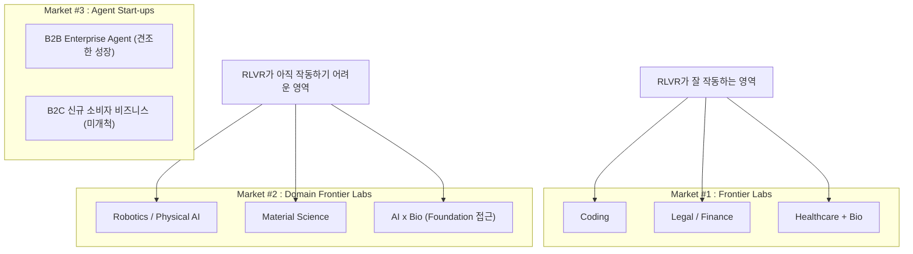

- **원본:** AI 프론티어 Korea, EP.102 "Lessons from San Francisco: Everyone's Gone Crazy" (2026.07.06 공개, 2026.06.28 녹화)
- **출연:** 노정석(Chester Roh), 최승준 (Seungjoon Choi), 신규 호스트 박종현(Jonghyun Park, 채널 sudoremove)
- **원본 링크:** https://www.youtube.com/watch?v=SSIGI9mm0DU

---

## 목차

1. [이 문서에 대하여](#1-이-문서에-대하여)
2. [방송 개요: 3주 만의 복귀와 새 호스트 합류](#2-방송-개요-3주-만의-복귀와-새-호스트-합류)
3. [출장의 세 가지 목적](#3-출장의-세-가지-목적)
4. [핵심 프레임워크: Time Gap × Domain Gap, 그리고 Market #1/#2/#3](#4-핵심-프레임워크-time-gap--domain-gap-그리고-market-123)
5. [Market #1 — Frontier Labs: post-train 데이터 전쟁과 벤치마크 맥싱](#5-market-1--frontier-labs-post-train-데이터-전쟁과-벤치마크-맥싱)
6. [RL은 어디까지 깊어지는가: RLVR과 AGI 논쟁](#6-rl은-어디까지-깊어지는가-rlvr과-agi-논쟁)
7. [Noam Brown과 test-time compute: 벤치마크 측정법 자체를 바꾸자는 제안](#7-noam-brown과-test-time-compute-벤치마크-측정법-자체를-바꾸자는-제안)
8. [Market #2 — AI x Bio: 두다나의 회의론과 파운데이션 접근의 충돌](#8-market-2--ai-x-bio-두다나의-회의론과-파운데이션-접근의-충돌)
9. [Market #3 — 에이전트 스타트업과 실리콘밸리 창업 신(scene)](#9-market-3--에이전트-스타트업과-실리콘밸리-창업-신scene)
10. [밸류에이션과 임금의 자릿수: "0이 하나 더 붙는다"](#10-밸류에이션과-임금의-자릿수-0이-하나-더-붙는다)
11. [벤처캐피털의 세대교체와 한국 반도체 생태계에 대한 관심](#11-벤처캐피털의-세대교체와-한국-반도체-생태계에-대한-관심)
12. [ICML 2026 Seoul 위크 활용법](#12-icml-2026-seoul-위크-활용법)
13. [AI 프론티어 채널 개편: 더 가볍게, 더 빠르게](#13-ai-프론티어-채널-개편-더-가볍게-더-빠르게)
14. [팩트체크 부록 — 검증된 사실과 방송 내 미검증 발언의 구분](#14-팩트체크-부록--검증된-사실과-방송-내-미검증-발언의-구분)
15. [참고자료](#15-참고자료)

---

## 1. 이 문서에 대하여

이 문서는 AI 프론티어 코리아 채널의 EP.102 "Lessons from San Francisco: Everyone's Gone Crazy" 방송 내용을 서술형으로 정리한 것입니다. 이 에피소드는 체스터 로가 3주간의 실리콘밸리 출장(Hayes Valley 체류)을 마치고 돌아와 그 기간 동안 만난 프론티어 랩 관계자, 스타트업 창업자, 벤처캐피털 투자자들로부터 들은 내용을 정리해 전달하는 형식으로, 원래 예정되어 있던 승준 최와의 2인 진행 체제에 사운드리무브(sudoremove) 채널을 운영하는 박종현이 정식 호스트로 합류한 첫 녹화이기도 합니다.

방송 내용 중 상당 부분은 체스터 로 개인이 현지에서 사람들과 나눈 대화, 그리고 "확인은 하지 못했지만 정황상 그럴 것"이라고 스스로 밝힌 추론들로 구성되어 있습니다. 이 문서는 그런 개인적 인상과 추론을 그대로 옮기되, 방송에서 언급된 구체적 사실관계(기업 인수, 인물 이동, 모델 출시, 학회 일정 등)에 대해서는 2026년 7월 16일 기준 최신 자료를 검색해 교차 확인했습니다. 확인 결과와 방송 발언 사이에 시점 차이나 수치 차이가 있는 경우, 본문 중간 또는 14장 팩트체크 부록에 별도로 표시해 두었습니다. 검증이 불가능한 사견, 소문, 개인 추정은 "체스터 로의 개인적 인상" 또는 "미확인 소식통에 따른 발언"이라고 명시했습니다.

---

## 2. 방송 개요: 3주 만의 복귀와 새 호스트 합류

녹화일은 2026년 6월 28일 일요일 저녁으로, 체스터 로는 3주가 넘는 기간 미국에 체류하느라 승준 최와 시간대가 맞지 않아 녹화가 밀렸다고 설명하며 방송을 시작합니다. 체스터 로는 이번 출장에서 만난 사람들과의 대화를 통해 AI 프론티어 채널이 앞으로 나아가야 할 방향에 대한 생각을 정리해 왔다고 말하는데, 핵심은 "무겁게 잘 정제해서 내놓기보다는 가볍고 빠르게, 조금 부정확하더라도 자주" 콘텐츠를 내보내는 쪽으로 채널을 재편하겠다는 것입니다. 이 재편 방향은 방송 말미(13장)에서 다시 다뤄집니다.

이번 에피소드부터 박종현이 정식 호스트로 합류합니다. 박종현은 개인 채널 sudoremove를 운영하며 기술적으로 깊이 파고드는 라이브 세션으로 알려진 인물로, 체스터 로는 그가 "채널의 젊음을 담당하는" 역할과 함께 기술적으로 취약한 부분을 보완해줄 것이라고 소개합니다. 박종현 본인은 스스로를 주로 질문자 역할을 맡을 사람으로 소개하며 합류 소감을 밝힙니다.

체스터 로는 출장 기간 동안 파운더 커뮤니티가 몰려 산다는 헤이즈 밸리(Hayes Valley)에서 CEO 매튜 김(Matthew Kim)과 함께 지냈으며, 숙소 근처 공원에서 아침저녁으로 샌프란시스코 시내를 내려다보며 일출과 일몰을 본 경험이 인상 깊었다고 회고합니다.

---

## 3. 출장의 세 가지 목적

체스터 로는 이번 출장의 목적을 세 가지로 정리합니다.

**첫째, 프론티어 랩(Frontier Lab)의 분위기 확인(Vibe Check)과 그곳 출신들이 세운 이른바 "네오랩(NeoLab)" 탐방.** 프론티어 랩에서 나온 뛰어난 인재들이 새로 차린 회사들을 직접 만나 시장이 어떤 흐름으로 움직이는지 감을 잡고 싶었다고 말합니다.

**둘째, 미국 스타트업 신(scene)을 직접 관찰하는 것.** 한국에서는 Y Combinator 포트폴리오 기업들의 소식을 간접적으로만 접하는데, 현지에서 직접 창업자와 투자자를 만나 시장이 형성되는 과정을 보고 싶었다고 설명합니다.

**셋째, AI와 생물학(Biology)의 접점을 확인하는 것으로, 체스터 로 스스로 이번 출장의 가장 큰 목적이었다고 밝힙니다.** 대기업과 학교가 이 분야에 어떤 방식으로 접근하고 있는지, 그리고 한국에는 아직 존재하지 않는 이 영역의 기업들이 미국에는 다수 있다는 점을 언급하며, 인맥을 통해 이들을 만나 대략적인 방향성과 어려움, 흥미로운 지점들에 대해 들었다고 말합니다.

이 목적을 정리한 슬라이드(방송 4분 29초경)에는 "Frontier Lab / Neo Lab Vibe Check", "Start-up Scene 살펴보기", "AI x Biology에서 만나보고 싶었던 회사들 만나보기"라는 세 항목과 함께, 소중한 시간을 내주고 정보를 공유해준 이들에게 감사를 표하는 문구가 담겨 있었습니다.

이 대목에서 체스터 로는 실리콘밸리의 정보 교환 문화에 대해서도 언급합니다. 현지 인사들이 한국의 반도체 생태계나 한국에서 AI가 어떻게 논의되고 있는지에 대해 큰 관심을 보였고, 자신이 "줄 수 있는 선물"로서 그런 한국 관련 정보를 제공하며 관계를 맺었다는 것입니다. 이는 검증할 수 없는 체스터 로 개인의 경험담으로, 사실관계라기보다는 실리콘밸리 네트워킹 문화에 대한 인상 서술로 받아들이는 것이 적절합니다.

이 파트에서 체스터 로는 swyx(스와익스, Latent Space 팟캐스트 진행자)와의 만남을 특별히 언급합니다. AI 프론티어가 준비 중인 "AI Engineer Summit 서울" 편에 대해 swyx와 일정 등을 논의했다고 밝히는데, 이는 아직 공식 발표되지 않은 체스터 로 측의 자체 기획 단계로 보이며, 본 문서 작성 시점(2026년 7월)에 이 행사에 대한 별도의 공식 공지는 확인되지 않았습니다. 참고로 검색 과정에서 "AI Summit Seoul & Expo"라는 전혀 다른 주최 측(DMK Global 등)이 2026년 8월 19~21일 COEX에서 개최하는 별도 행사가 확인되었는데, 이는 swyx의 AI Engineer 콘퍼런스 시리즈와는 무관한 별개의 행사이므로 혼동하지 않아야 합니다.

---

## 4. 핵심 프레임워크: Time Gap × Domain Gap, 그리고 Market #1/#2/#3

AI 프론티어가 반복적으로 사용해 온 분석 틀은 "Time Gap"과 "Domain Gap"이라는 두 축입니다. 2025년 하반기 시점에는 이 두 축이 넓게 펼쳐져 있었습니다. 시간 축에서는 가장 앞선 프론티어 랩들, 그 뒤를 바짝 쫓는 "Runaways' Alliance"(추격자 연합), 이제 막 시작한 이들, 그리고 뒤처진 이들까지 스펙트럼이 넓게 벌어져 있었고, 도메인 축에서도 코딩·법률·금융·과학·로보틱스·컨슈머 등 영역별로 격차가 존재하는 것으로 보였습니다.

2026년 3월경에는 이 Domain Gap과 Time Gap이 한꺼번에 좁혀지는 듯한 느낌이었다고 체스터 로는 회고합니다. 그런데 2026년 6월 현재 시점에서 체감하는 바는 조금 다릅니다. Domain Gap이 좁혀졌다기보다는, 거의 모든 것이 프론티어 랩의 프론티어 모델 안으로 흡수되고 있다는 인상입니다. 마치 프론티어 모델이 다루지 못하는 도메인을 찾아내는 것 자체가 새로운 사업 기회가 된 것처럼, 코딩·법률·금융·일반 과학·로보틱스·컨슈머 영역까지 거의 모든 것이 프론티어 랩 안으로 압축되고 있다는 것입니다.

체스터 로는 이 시기에 모델 자체에 대한 이야기가 줄어들었다고 말하면서도, GPT-5.6이 곧 출시될 예정이고(녹화 시점 기준), Claude 쪽은 Opus 4.8과 Mythos 5로 넘어가면서 모델들이 또 한 번 도약하고 있다는 언급을 합니다. 이 발언이 나온 2026년 6월 28일은 실제로 Claude Fable 5·Mythos 5의 미국 상무부 수출통제 조치(6월 12일 시행)가 이미 해제(6월 30일 해제, 7월 1일 서비스 재개)를 향해 가던 시점과 겹칩니다. 이 사안의 정확한 경위는 14장 팩트체크 부록에서 별도로 정리합니다.

체스터 로는 시장을 세 개 층위로 나누어 봅니다.

- **Market #1 — Frontier Labs 자체.** OpenAI, Anthropic, Google DeepMind, xAI 등 최전선의 모델 개발사들입니다.
- **Market #2 — Domain Frontier Labs.** RLVR(검증 가능한 보상을 활용한 강화학습)이 잘 작동하지 않는 도메인에서, Frontier Lab과 유사한 방식(파운데이션 모델 접근)을 재현하고 있는 회사들입니다. 로보틱스(Physical AI)를 시작으로 생물학, 화학, 물리학 등 이른바 "AI for Science" 영역의 기업들이 여기 해당합니다.
- **Market #3 — Agent Start-ups.** B2B 엔터프라이즈 수요는 견조하게 성장 중이며, B2C 쪽 즉 AI가 만들어내는 새로운 소비자 비즈니스는 아직 시작도 하지 않았다는 것이 대부분 시장 참여자들의 견해라고 체스터 로는 전합니다.

방송에서 공유된 슬라이드에는 이 구조가 "남겨진 자들 — 이제 막 출발한 자들 — 도망자들 — Frontier-Labs"라는 시간 축과, "Not-Even-Addressed-Yet Market(아직 다뤄지지도 않은 시장) — Agent Start-ups — Quasi Frontier Labs — Frontier Labs"라는 도메인 축으로 표현되어 있었고, Frontier Labs 칸 안에는 Coding, Legal, Healthcare+Bio가, 그 아래 Domain Frontier Labs 칸에는 Robotics, Material Science 등이 함께 표시되어 있었습니다.

이 구조를 다이어그램으로 정리하면 다음과 같습니다.

체스터 로가 정리한 요약 슬라이드에 따르면, Market #1은 "인공일반지능(AGI)을 창조한 뒤 그 AGI가 모든 문제를 풀게 한다"는 논리, 즉 "가장 일반적인 것이 가장 구체적인 것이다(The most general one is the most specific one)"라는 관점으로 이해할 수 있습니다. 이를 Compute·Data·Algorithm이라는 세 축으로 바라볼 때, 지금 가장 큰 비중을 차지하는 것은 post-train 단계, 그중에서도 RLVR이며, 칩과 컴퓨트 효율을 위한 소프트웨어 오케스트레이션은 모두의 관심사이고, post-train용 최고급 데이터셋은 여전히 계속 만들어지고 있는 중이라는 것입니다. 반면 알고리즘은 프론티어 랩 내부에 감춰져 있지만 Compute나 Data에 비해서는 확실히 하위의 요소로 취급된다는 것이 체스터 로의 관찰입니다.

Market #2는 명확하게 RLVR이 작동하지 않는 도메인에서 Frontier Lab의 접근 방식을 그대로 재현하고 있는 흐름이며, Physical AI를 시작으로 생물학·화학·물리학 등 AI for Science 영역의 회사들이 생겨나고 있다고 정리됩니다.

---

## 5. Market #1 — Frontier Labs: post-train 데이터 전쟁과 벤치마크 맥싱

### 5.1 OpenAI가 직접 하려는 영역: 코딩, 법률, 바이오

체스터 로는 업계의 한 소식통(신원은 밝히지 않음)으로부터 들었다며, OpenAI가 코딩·법률·바이오는 "우리가 직접 한다"고 선을 긋고, 그 외 영역은 스타트업과 협업하는 쪽으로 방향을 잡았다는 이야기를 전합니다. OpenAI가 그런 태도라면 Anthropic도 비슷한 전략을 취하고 있을 것이라는 것이 체스터 로의 추정이며, Google은 아직 그렇게 날카로운 전략보다는 "항공모함 전략"(모든 것을 다 하는 넓은 전략)을 취하는 것처럼 보인다고 평가합니다. 이 발언은 익명 소식통 기반의 미검증 개인 전언이라는 점을 분명히 해둡니다.

로보틱스(Physical AI)나 바이오·헬스케어, 최근 크게 늘어난 장수(longevity) 스타트업, AI 기반 암 치료제 스타트업들은 이와는 다른 방식으로 움직이는 것 같다고 체스터 로는 관찰합니다. 즉, 앞서 언급한 "Quasi Frontier Labs"(코딩 쪽에서 프론티어 랩과 유사한 위상을 가진 회사들)는 결국 프론티어 랩에 흡수되는 흐름으로 보이지만, 로보틱스나 바이오처럼 RLVR이 통하지 않는 영역은 다른 궤적을 그린다는 것입니다.

### 5.2 도메인을 고르는 기준: RLVR이 돌아가는 곳

박종현이 "프론티어 랩이 직접 하려는 도메인과 다른 곳에 맡기는 도메인을 나누는 기준이 무엇인가"라고 묻자, 체스터 로는 두 가지를 꼽습니다.

첫째는 프론티어 랩이 지금 가장 공을 들이고 있는 post-train 영역에서, 금융·법률·컴퓨터 사용 에이전트·QA 등에 대한 방대한 데이터셋을 만들고 있다는 점입니다. 코딩은 말할 것도 없고, 또 다른 소식통(역시 익명)으로부터 들었다며, 프론티어 랩들이 아직 GitHub에 업로드되지 않은 "잠들어 있는" 고품질의 사람이 직접 작성한 소스코드를 돈을 주고 사들이고 있다고 전합니다. 금융 분야에서도 일반 금융이 아니라 IB(투자은행) 회계, 그 안에서도 주식·채권·선물 등으로 세분화된 각 영역마다 엄청난 데이터셋을 만들고 있으며, 매우 높은 몸값의 전문가들을 고용해 데이터를 만들고 내부적으로 RLVR을 돌린다는 것입니다. 시장이 충분히 크고, 데이터 작업과 post-train 작업을 스스로 잘 해낼 수 있어 프론티어 모델이 압도적인 성능 우위를 가질 수 있는 영역들이 바로 직접 하려는 영역이라는 설명입니다.

둘째는, 프론티어 랩이 직접 하겠다고 하는 도메인들은 대체로 디지털 콘텐츠 안에서 모든 것이 완결되는, 즉 검증(verification)이 가능한 영역이라는 점입니다. 반대로 디지털 도메인을 살짝만 벗어나도 검증기(verifier)를 만드는 순간 스케일 문제에 바로 부딪히기 때문에, 그런 영역은 직접 손대고 싶어하지 않는 것 같다는 것이 체스터 로의 해석입니다.

박종현은 이 기준이 로보틱스에도 그대로 적용된다고 맞장구칩니다. 로보틱스는 시장 규모가 커서 프론티어 랩들이 탐낼 만하지만, LLM과 거리가 멀어 post-train만으로는 어렵고 pretraining 단계부터 다시 손대야 할 부분이 많다는 점에서 법률이나 헬스케어보다 더 멀리 있는 영역이라는 데 두 사람 모두 동의합니다.

### 5.3 데이터셋 비즈니스와 벤치마크 맥싱

체스터 로는 이런 흐름 속에서 데이터셋 생성 기업들이 여전히 매우 잘 되고 있다고 말합니다. 한 섹터가 새로 생겨나면, 그 섹터의 전문가들만 갖고 있던 암묵지(tacit knowledge)를 RLVR용 연습문제로 추출하는 작업이 이루어지고, 일정량의 데이터셋이 만들어지면 프론티어 랩들이 상대적으로 가볍게(그러나 매우 비싼 값에) 사들인다는 것입니다. 박종현은 이를 수학 문제와 정답 데이터셋을 예로 들어 재확인하는데, 체스터 로는 이 해석이 맞다고 답합니다.

post-train 파이프라인의 또 다른 축은 학습 인프라 자체입니다. 강화학습은 추론을 한 번 완주해야 보상을 줄 수 있다는 점에서 pretraining과 다르며, 어떤 추론은 빨리 끝나고 어떤 추론은 매우 오래 걸리기 때문에, 이를 얼마나 길게 혹은 짧게 돌려야 하는지에 대한 고민이 크다고 체스터 로는 전합니다. 이를 이른바 MFO(Model FLOPs utilization으로 추정되는 표현으로, 방송에서는 구체적으로 풀어 설명되지는 않았습니다)로 관리하며 컴퓨트를 최적으로 소비하는 방법을 찾는 데 상당한 노력이 들어가고 있다는 것입니다.

특히 흥미로운 대목은 "벤치마크 맥싱(benchmark maxing)"에 대한 묘사입니다. vLLM 같은 추론 시스템을 최하위 레벨까지 손봐서 최적화하는 것은 물론이고, 벤치마크를 돌리다가 성능이 좋은 지점에서 나쁜 지점으로 넘어가면 체크포인트를 되돌려 그 실행을 폐기하고 다시 좋은 체크포인트에서 시작하는 식의, 매우 지저분한 형태의 엔지니어링 최적화 루프가 돌아가고 있다는 것입니다. 이 과정에서 엄청난 수의 엔지니어들이 갈려나가고 있다는 것이 체스터 로가 여러 곳에서 공통적으로 들었다는 뉘앙스이며, 특정 랩에 국한된 이야기가 아니라고 강조합니다. 이 부분 역시 익명 소식통에 기반한 체스터 로의 전언으로, 구체적 수치나 사례로 독립 검증되지는 않았습니다.

---

## 6. RL은 어디까지 깊어지는가: RLVR과 AGI 논쟁

RL(강화학습)에 대한 논의가 시작된 지 2년이 넘었는데, 그동안 일관된 흐름은 RL이 계속 더 깊어지고 있다는 것이며, 이 흐름이 어디까지 갈지는 아직 알 수 없지만 적어도 끝이 보이지는 않는다는 것이 체스터 로의 관찰입니다. 모델에게 더 많은 강화학습을 시킬수록 성능이 계속 좋아진다는 점을, 지난 6개월간 프론티어 랩들이 발표한 모델들을 지켜보며 확인해 왔다는 것입니다.

이 대목에서 승준 최는 최근 프론티어 랩들이 "일반(general)"이라는 단어를 예전만큼 자주 쓰지 않는다는 인상을 받았다고 말합니다. Google DeepMind는 여전히 AGI를 이야기하지만, 지금의 체제는 RLVR로 돌아가는 체제이고, 이것이 반드시 "일반적"인 것은 아닐 수 있다는 개인적 생각을 밝힙니다. 즉 RLVR로 돌파구를 만들 수 있는 영역에서만 성능이 좋아지고 있는 것이지, 이것이 곧 일반 지능의 향상은 아닐 수 있다는 지적입니다. 체스터 로는 이 지적에 동의하면서도, "AGI의 정의를 누가 내릴 수 있겠는가"라며 AGI라는 단어 자체가 받아들이는 사람에 따라 다르게 해석될 수 있다는 점을 짚습니다.

### 6.1 정형원의 "2025년은 연구 진보가 없었다"는 발언

체스터 로는 알고리즘 연구가 여전히 매우 활발하게 이루어지고 있지만, 알고리즘을 직접 연구하는 사람들조차 이 부분에 대해 그리 대단한 이야기를 하지 않는다고 말하며, Meta의 정형원(Hyung Won Chung) 박사가 2025년은 연구 측면에서 거의 진보가 없었던 해였다고 개인적으로 평가했다는 이야기를 전합니다.

여기서 정형원 박사가 누구인지는 공개된 자료로 확인할 수 있습니다. 그는 MIT에서 박사학위를 받은 뒤 Google Brain을 거쳐 2023년 초 OpenAI에 합류해 o1-preview(2024년 9월), o1(2024년 12월), Deep Research(2025년 2월) 개발에 핵심적으로 기여했고, 2025년 7월 Jason Wei와 함께 Meta의 Superintelligence Labs로 이적한 것으로 다수의 매체(AJU Press, TechTimes 등)에 보도되어 있습니다. 다만 방송에서 인용된 "2025년은 연구 진보가 없었다"는 구체적인 발언 자체는 체스터 로가 개인적으로 대화 중 들었다고 전하는 내용으로, 정형원 박사 본인이 공개 매체에서 이런 취지의 발언을 했다는 것을 독립적으로 확인할 수 있는 공개 자료는 이번 검색 과정에서 찾지 못했습니다. 따라서 이 발언은 "체스터 로가 전하는 사적 대화 내용"으로 분류하는 것이 정확합니다.

박종현은 여기서 "알고리즘"이 트랜스포머 내부의 어텐션 방식을 바꾸는 것(MLA 등)과 같은 것을 가리키는지 확인하고, 체스터 로는 DeepSeek 계열에서 메모리를 줄이는 식의 알고리즘 혁신들에 대해서도 정형원 박사에게 직접 물어봤다고 말합니다. 그런데 정형원 박사는 "다들 그런 건 다 한다"는 취지로 답했고, 체스터 로는 더 캐묻지 않았다고 합니다. 박종현은 이를 두고, 지능을 늘리는 돌파구라기보다는 효율을 높이는 작업으로 취급하는 것 같다고 해석합니다.

체스터 로는 정형원 박사가 특정 알고리즘의 좋고 나쁨보다는 문제를 보는 관점 자체가 완전히 다른 것 같았다고 덧붙입니다. 이른바 "The Bitter Lesson"(리처드 서튼의 유명한 에세이로, 결국 스케일을 늘리는 범용적인 방법이 인간이 설계한 정교한 방법을 이긴다는 주장)의 느낌으로, 정형원 박사는 여전히 스케일을 더 끌어올리는 쪽에서 할 수 있는 일이 있다고 보는 것 같다는 것이 체스터 로의 인상입니다.

---

## 7. Noam Brown과 test-time compute: 벤치마크 측정법 자체를 바꾸자는 제안

체스터 로는 최근 Noam Brown(OpenAI 소속, o1 개발의 핵심 인물)이 test-time compute(추론 시점 연산량)에 대해 많은 이야기를 하고 있다고 언급합니다. 지금 모델 성능을 평가할 때 흔히 단일 스칼라 점수를 써서 "벤치마크가 3점 올랐다"는 식으로 말하는데, 이는 부정확하다는 것입니다. GPT-5.4와 GPT-5.5를 같은 벤치마크에서 비교해도, GPT-5.5는 훨씬 적은 추론 토큰만으로 최적점에 도달한다는 것입니다. 따라서 앞으로 벤치마크의 기준은 추론 토큰의 예산을 고정해두고 이른 시점에서 비교하는 방식이 되어야 한다는 것이 Noam Brown의 주장이라고 체스터 로는 전합니다. 이는 모델의 test-time compute를 계속 늘리면 성능이 알려진 한계 없이 계속 올라갈 가능성이 있다는 것을 암시한다고 체스터 로는 해석합니다.

이 발언은 실제로 공개된 자료로 상당히 구체적으로 확인됩니다. Noam Brown은 2026년 6월 9일 X(트위터)에 "Implications of Large-Scale Test-Time Compute"라는 글을 올려, LLM이 더 유능해질수록 벤치마크 성능은 점점 더 test-time compute의 함수가 되고 있으며, 현재 모델들의 성능 상한이 어디인지 사실은 잘 모르고 있다는 취지의 주장을 폈습니다. 그는 o1 이후 2년이 지났지만 여전히 각 랩이 스칼라 점수만 발표하고, 안전성 조직들은 스캐폴딩을 통해 100배의 추론을 투입했을 때 모델이 더 잘 해내는 것을 보고 놀라며, 책임있는 스케일링 정책(RSP)들도 추론 예산을 임계치 판단에 반영하지 않고 있다고 비판했습니다. 또한 같은 토큰 예산으로 비교하면 GPT-5.5가 GPT-5.4를 능가한다는 취지의 언급도 있었습니다. 이후 2026년 7월 3일 서울에서 열린 Global AI Frontier Symposium에서도 그는 유사한 취지로, 단일 점수 대신 비용·토큰·시간을 x축으로 하고 성능을 y축으로 하는 "성능 곡선" 방식으로 평가를 전환해야 한다고 주장했다고 보도되었습니다. 다만 이 서울 심포지엄 발언 자체는 2차 매체(BigGo Finance 등)의 보도로, 1차 소스인 OpenAI나 Noam Brown 본인의 공식 채널에서 직접 확인되지는 않았다는 점을 밝혀둡니다.

승준 최는 이 대목에서 최근 발표된 GPT-5.6이 시스템 카드가 아니라 블로그에서, Cerebras 위에서 초당 750토�큰(TPS)의 속도를 낸다고 언급했던 것을 떠올립니다. 이는 실제로 확인되는 사실입니다. OpenAI는 2026년 6월 26일 GPT-5.6 계열(Sol·Terra·Luna)을 프리뷰 형태로 공개했고, 그중 최상위 모델인 Sol이 Cerebras의 웨이퍼 스케일 칩 위에서 최대 초당 750토큰의 추론 속도를 낼 수 있다고 발표했습니다. Cerebras와 OpenAI는 2026년 1월 750메가와트 규모의 초저지연 추론 전용 컴퓨트를 배치하는 다년 계약을 맺은 바 있으며, GPT-5.6 Sol의 정식 서비스는 2026년 7월 9~10일경 시작된 것으로 다수 매체에서 보도되었습니다. 참고로 이 750TPS라는 수치와 750메가와트라는 계약 규모의 숫자가 겹치는 것은 우연으로 보이며, 모델이 정확히 몇 개의 웨이퍼에 걸쳐 서비스되는지(70~100개 추정) 등 세부 아키텍처는 OpenAI가 공식적으로 확인하지 않은 외부 추정치임을 여러 매체가 명시하고 있습니다.

체스터 로는 이어서, 지난주(전전 에피소드)에도 다뤘던 "OpenAI 모델이 에르되시(Erdős) 문제를 풀었다"는 사례를 다시 언급합니다. 그 문제를 푼 모델은 랩 내부의 희귀하고 훨씬 뛰어난 별도 모델이 아니라, 우리가 쓰는 것과 같은 GPT-5.5에 막대한 test-time compute를 투입해 얻은 결과였다고 한 연구자로부터 들었다고 전합니다. 이 부분은 검색을 통해 확인했을 때 모델 버전에 약간의 오차가 있습니다. 공개적으로 확인되는 사실은, 2026년 4월 13일 GPT-5.4 Pro가 1968년 제기된 에르되시 문제 #1196(원시집합에 관한 문제)을 약 80분 만에 풀고 30분 만에 LaTeX 논문으로 정리했으며, 이 결과에 대해 수학자 테렌스 타오(Terence Tao)가 정수론의 해부학과 마르코프 과정 이론 사이의 새로운 연결고리를 보여주는 의미 있는 기여라고 평가했다는 것입니다. 즉 방송에서 언급된 모델은 GPT-5.5가 아니라 GPT-5.4 Pro일 가능성이 높습니다(같은 GPT-5 세대의 다른 버전이므로 취지 자체—"막대한 test-time compute를 투입한 결과"라는 설명—는 유효하다고 볼 수 있지만, 정확한 모델명은 혼동이 있었던 것으로 보입니다).

박종현은 이 대목에서 지능의 관점으로 흥미로운 해석을 덧붙입니다. 조합론 문제를 풀 때 무식하게 모든 경우의 수를 세는 방식(brute-force)으로도 풀 수 있지만, 직관적이고 논리적으로 더 효율적으로 풀 수도 있다는 것이며, 더 적은 토큰으로 문제를 풀어낸다는 사실 자체가 더 높은 지능을 보여주는 신호로 볼 수도 있다는 것입니다. 체스터 로는 이것이 정확히 Noam Brown이 말하고자 하는 바라고 화답합니다. 승준 최는 이 대목에서 농담 삼아 "그래서 사람들이 Fable 5를 그리워하는 것"이라고 덧붙이는데, 이는 같은 성능이라면 더 적은 토큰과 더 빠른 응답으로 도달하는 모델에 대한 선호를 가리키는 말장난입니다.

체스터 로는 xAI 관련 에피소드도 짧게 소개합니다. 일론 머스크가 모든 팀 미팅에 직접 참여해, 매니저가 아니라 실무 담당자에게 직접 질문을 던진다는 것입니다. 이런 방식을 즐기는 사람에게는 큰 도전이자 재미겠지만, 어떤 사람에게는 매우 스트레스로 다가와 xAI를 떠나는 사람도 많다고 들었다고 전합니다. 이 역시 익명 전언으로, 독립적으로 검증되지는 않았습니다.

---

## 8. Market #2 — AI x Bio: 두다나의 회의론과 파운데이션 접근의 충돌

체스터 로가 이번 출장에서 가장 관심을 갖고 살펴본 영역이 바로 AI와 생물학의 접점입니다.

### 8.1 제니퍼 두다나의 발언

방송 하루 전(즉 6월 하순), 노벨상을 받은 제니퍼 두다나(Jennifer Doudna) 교수가 블룸버그의 에밀리 창(Emily Chang)과의 인터뷰에서, 챗봇은 문서를 요약할 뿐이며 인간이 해내는 혁신을 해낼 수는 없다는 취지로 말했다고 체스터 로는 전합니다. 이는 실제로 확인되는 사실입니다. 두다나 교수는 크리스퍼-카스9(CRISPR-Cas9) 유전자가위 개발로 2020년 노벨화학상을 받은 UC버클리 교수로, 2026년 6월 하순 블룸버그의 "The Circuit with Emily Chang"에 출연해, AI가 아직 신약 개발에서 진정한 혁신을 만들어내고 있다고 보기는 어렵다는 취지의 발언을 했습니다. 그는 생물학은 매우 방대한 분야이며 챗봇이 답을 준다고 해서 실제로 새로운 물질을 찾고 연구를 해낼 수 있는 것은 아니라는 회의적인 입장을 밝혔습니다. 다만 방송에서 체스터 로가 언급한 "2024년 노벨상 수상"이라는 표현은 정확히는 2020년 노벨화학상 수상이 맞습니다(두다나 교수는 에마뉘엘 샤르팡티에와 공동 수상).

### 8.2 생물학의 "CNN 시대"와 파운데이션 접근의 부상

체스터 로는 이번 Market #2 도메인, 그중에서도 바이오를 예로 들어 흥미로운 관찰을 전합니다. 두다나 교수처럼 대학이나 전통적인 대형 연구기관에 몸담은 사람들의 접근 방식과, 전통적으로 생물학을 하지 않았지만 AI 실무 경험을 가진 소프트웨어 엔지니어들의 접근 방식이 완전히 다르게 느껴졌다는 것입니다. 두다나 교수 같은 이들은 생물학이 워낙 방대한 분야라 챗봇이 이렇게 저렇게 답을 준다고 신물질을 찾고 연구를 할 수 있는 것은 불가능하다고 보는 것 같다고 체스터 로는 말합니다.

이 때문에 대형 제약회사들이 구축하는 파이프라인을 보면, 마치 BERT·트랜스포머·GPT가 등장하기 이전, 즉 2015~2017년의 컨볼루션 신경망(CNN) 시대와 비슷하다고 체스터 로는 비유합니다. 당시에는 문제마다 네트워크 아키텍처가 완전히 달랐고, 데이터셋도 학습 방식도 전부 달랐습니다. 그런데 BERT·트랜스포머·언어모델로 넘어가면서, 방대한 일반 데이터를 모아 트랜스포머에 학습시키고 손실(loss)이 내려가면 그 일반적인 능력이 구체적인 문제들을 풀어낸다는 "파운데이션 모델" 접근이 등장했습니다. 체스터 로는 이번에 생물학에서 정확히 이런 패러다임 전환의 초입을 목격했다고 말합니다. 전통적인 생물학 연구실은 각 문제마다 파이프라인이 전부 다르고 "이 문제는 이렇게밖에 풀 수 없다"고 여기는 반면, 소프트웨어 쪽 사람들은 트랜스포머 기반의 파운데이션 모델 접근을 취하며 데이터셋 양을 늘리고 평가 설계를 잘 해서 문제를 풀어낸다는 것입니다. 그런데 전통 연구실 쪽은 이 두 번째 그룹의 방법론을 아예 인정하지 않거나("그렇게 해서는 안 풀린다"), 혹은 그들이 정확히 무엇을 하고 있는지조차 모르는 것 같았다는 것이 체스터 로의 관찰입니다.

### 8.3 OpenCRISPR: 이미 그 도메인에서 일어난 AI의 혁신

체스터 로는 두다나 교수의 회의적인 발언과 대비되는 사례로 OpenCRISPR를 언급합니다. 두다나 교수 본인이 발견한 카스9(Cas9) 단백질과 동일한 역할을 하는 다른 단백질을 AI가 찾아낸 것이 OpenCRISPR이며, 지난해 몇 개의 후보 물질을 더 찾아냈다고 말합니다.

이는 실제로 확인되는 사실입니다. 단백질 설계 스타트업 Profluent Bio는 2024년 4월 OpenCRISPR-1을 공개했는데, 이는 23만8,917개의 Cas9 계열 단백질 데이터로 학습한 언어모델을 이용해 자연에 존재하지 않는 완전히 새로운 Cas9 유사 단백질을 설계한 것입니다. 이 단백질은 기존 SpCas9 대비 표적 부위에서는 비슷하거나 약간 높은 편집 효율(약 55.7% 대 48.3%)을 보이면서도, 표적 이탈(off-target) 편집은 95% 줄어드는(약 0.32% 대 6.1%) 결과를 냈고, 자연에 존재하는 어떤 단백질과도 400여 개의 돌연변이 차이가 날 만큼 완전히 새로운 서열이었습니다. 이 연구 결과는 2025년 학술지 Nature에도 게재되었습니다. 다만 체스터 로가 언급한 "지난해 여러 후보 물질을 더 찾아냈다"는 부분은 OpenCRISPR-1 발표(2024년) 이후의 후속 성과를 가리키는 것으로 보이나, 이번 검색에서 그 구체적인 후속 발표 내역까지는 확인하지 못했습니다.

### 8.4 존 점퍼의 Anthropic 이적

승준 최는 또 하나의 상징적인 사건으로, 알파폴드(AlphaFold)로 노벨상을 받은 존 점퍼(John Jumper)가 Google DeepMind를 떠나 Anthropic으로 이적한 사실을 언급합니다. 체스터 로는 이를 어떻게 해석해야 할지 아직 확신이 서지 않는다고 답하면서도, 최근 Anthropic으로 많은 사람이 이직하는 추세이고, Anthropic의 주가가 좋아지고 있어 지금 합류하면 상당한 스톡옵션을 받을 수 있다는 상업적 유인도 크게 작용하는 것 같다고 말합니다.

이 이적 자체는 확실히 확인되는 사실입니다. 존 점퍼는 2026년 6월 19일 자신의 X 계정에 거의 9년간 몸담았던 Google DeepMind를 떠나 Anthropic에 합류한다고 발표했습니다. 그는 알파폴드 개발팀을 이끌었던 인물로, 2024년 노벨화학상을 데미스 하사비스(Demis Hassabis)와 공동 수상했습니다(참고로 알파폴드 관련 노벨상은 2024년이 맞으며, 앞서 언급한 두다나 교수의 크리스퍼 노벨상 2020년과는 별개의 사안입니다). 이 발표 직전에는 Gemini 모델을 공동 이끌던 노암 셰이저(Noam Shazeer)가 OpenAI로 이적한다는 소식도 있었고, 두 이적 소식이 겹치면서 알파벳(Google 모회사) 주가가 2026년 6월 22일 하루 만에 약 7% 하락, 약 2,500억 달러의 시가총액이 증발했다고 블룸버그 등이 보도했습니다. 다만 존 점퍼가 Anthropic에서 정확히 어떤 직책이나 팀을 맡는지는 본인도 회사도 공식적으로 밝히지 않았으며, "AI for Science" 관련 업무를 맡을 것이라는 정도만 확인 가능한 사실이라는 점을 다수의 매체가 명시하고 있습니다. 승준 최는 이 대목에서 Google DeepMind는 알파폴드 같은 전문화된 모델을 만들지만 Anthropic은 오직 LLM(코딩 모델)만 만들어 왔다는 점에서, 이 이적이 Anthropic이 과학 영역으로 확장하려는 의도를 보여주는 것 아니냐는 추측을 제시합니다.

### 8.5 도메인 전문가를 설득할 것인가, 뛰어넘을 것인가

박종현은 이 대목에서 중요한 질문을 던집니다. AI의 잠재력을 믿는 우리 같은 사람들과 달리, 여전히 AI에 잠재력이 없다고 보는 도메인 전문가들이 있는데, 그 간극을 활용하는 것이 사업 기회라면, 그 전문가들을 설득해서 함께 일할 것인가, 아니면 정반대로 그들을 뛰어넘을 것인가라는 질문입니다.

체스터 로는 자신이 몇 가지 현상만 보고 지나치게 일반화하는 경향이 있다는 점을 인정하면서도, 도메인 전문가들이 AI를 깊이 배우고 지금 벌어지고 있는 스케일의 의미를 이해하지 않는 한, AI가 그 모든 것을 해낼 것이라고 믿기는 어려울 것 같다고 말합니다. 그가 만난, 명함만 봐도 화려한 인물들조차 AI가 눈앞에서 직접 해내는 것을 보여줘도 믿지 않을 것 같다는 인상을 받았다고 전합니다. 그래서 도메인 전문가를 설득해서 함께 일하기보다는, AI 소프트웨어 엔지니어가 그 도메인을 직접 배우는 편이 더 빠를 수 있다는 것이 체스터 로의 결론입니다. 과거 화장품 사업을 운영한 경험에 빗대어, 치료제나 제약, 장수(longevity) 관련 약물 같은 분야에서도 비전문가 출발점에서 시작한 회사가 승리할 수 있다는 것이 그의 견해입니다. 이 부분은 어디까지나 체스터 로 개인의 의견이며, 데이터로 뒷받침된 주장이라기보다는 사업적 직관에 가깝다는 점을 밝혀둡니다.

### 8.6 코덱스로 사흘 만에 만든 개인 게놈 파이프라인

체스터 로는 이 주제를 자신의 실제 경험(dogfooding, 자기 제품·방식을 직접 써보는 것)으로 뒷받침합니다. 출장을 떠나기 전 혈액을 채취해 매크로젠(Macrogen)에 보내 롱리드(long-read) 게놈 시퀀싱을 받았고, 그 유전자 정보와 건강 기록을 모두 결합한 전체 파이프라인을 만들었다고 말합니다. 이해하지 못하는 부분이 많지만 자신이 이해할 수 있는 용어로 학습 자료를 만들어주는 방식으로 활용하고 있으며, 과거였다면 하나의 회사가 될 만한 이 파이프라인 전체를 Codex가 약 사흘 만에 만들어줬다고 전합니다. 이는 체스터 로 개인의 경험담으로, 구체적인 파이프라인의 내용이나 정확성에 대해서는 외부에서 검증할 수 있는 자료가 아닙니다.

---

## 9. Market #3 — 에이전트 스타트업과 실리콘밸리 창업 신(scene)

체스터 로는 실리콘밸리의 스타트업 신을 두고 "다들 미쳐 돌아가고 있다(everyone's gone crazy)"는 표현을 씁니다. 이는 이 에피소드의 부제이기도 합니다.

### 9.1 20대 초반 창업자들의 시대

체스터 로에 따르면, 스타트업을 창업하는 이들의 나이가 20대 초반인 경우가 흔하며, 20대 후반이나 30대 초반이면 이미 "꽤 나이 든" 편으로 여겨진다고 합니다. 병역 의무가 없는 미국에서는 대학을 졸업하고 1년 정도 인턴을 한 뒤 Y Combinator에 들어가면 22~23세 정도가 되는데, 최근 Y Combinator가 선발하는 회사들은 훨씬 더 어려지고 있다는 것입니다. 많은 대학생들의 꿈이 Y Combinator 같은 곳에 들어가 합법적으로 학교를 그만두는 것이거나, 그렇지 않으면 학교를 그저 학점과 졸업장을 위한 곳으로만 취급한다는 이야기도 전합니다. 심지어 고등학교만 졸업하고 바로 회사에 들어가 커리어를 시작하는 사례도 꽤 있으며, 좋은 회사에서 좋은 커리어를 쌓는 것이 대학 학위와 동등하게 여겨지는 경향이 늘고 있다고 말합니다. 이런 흐름은 한국에도 일부 존재하며, 이미 특정 CEO와 함께 일하는 고등학생들이 있다는 사실도 언급됩니다. 이 부분은 체스터 로가 현지에서 직접 목격하고 전해들은 인상으로, 통계적으로 검증된 수치가 아니라는 점에 유의해야 합니다.

### 9.2 두 부류의 창업자: 드리머와 AI 에이전트 비즈니스

체스터 로는 창업자들을 크게 두 부류로 나눕니다.

첫 번째는 "네오랩(NeoLab)을 꿈꾸는 드리머(Dreamer)"들입니다. 현재의 트랜스포머 모델이 틀렸다거나, 얀 르쿤(Yann LeCun)이 말하는 세계모델(world model)에도 문제가 있다며 완전히 새로운 모델을 제안하는 부류입니다. 이들은 대체로 17세에 유명 대학에 입학해 20세가 된 시점에 이미 Google DeepMind에서 일한 경력을 가진 이들로, 예컨대 6명의 직원과 함께 자신이 CEO를 맡고 예전 지도교수를 직원으로 채용하는 식의 회사를 차리며, Sequoia와 a16z를 비롯한 유명 투자사들이 앞다투어 투자하려 한다는 것입니다. 이런 회사들의 시드 단계 밸류에이션은 3억5,700만 달러 수준에 이르고, 투자 규모는 7,100만 달러에 달한다고 체스터 로는 전합니다.

두 번째는 AI 에이전트 비즈니스를 하는 부류로, 이 스펙트럼은 매우 넓습니다. 아직 이 시장 자체가 완전히 열리지 않았고, B2B SaaS를 AI 네이티브 애플리케이션으로 바꾸는 회사들이 많은데, 매출이 없어도 밸류에이션 기대치는 매우 높다고 합니다. 그 근거로 체스터 로가 들려주는 논리는 이렇습니다. Meta에서 약 570만 달러(원화 환산)를 받던 친구, Anthropic에서 비슷한 수준을 받던 친구, ByteDance에서 비슷한 수준을 받던 친구, 이렇게 세 사람이 모여 창업하면 세 사람의 연봉만 합쳐도 약 1,710만 달러이니 회사 밸류에이션이 7,140만 달러 정도는 되어야 하는 것 아니냐는 논리이며, 유명 기업 출신들 사이에서는 이런 논리가 어느 정도 받아들여지고 있다는 것입니다.

---

## 10. 밸류에이션과 임금의 자릿수: "0이 하나 더 붙는다"

체스터 로는 이 대목에서 구체적인 밸류에이션 수준을 언급합니다. Y Combinator 배치에 들어가 프리시드나 시드 투자를 받은 회사들의 경우, 연환산매출(ARR) 기준 약 210만~290만 달러 수준에 도달하면 회사 밸류에이션이 약 3억 달러 수준으로 취급된다는 것입니다. 한국 기준과 비교하면 2~3배가 아니라 "끝자리에 0이 하나 더 붙는" 수준이라고 체스터 로는 표현합니다.

### 10.1 실리콘밸리의 급여 수준

체스터 로는 실리콘밸리의 임금 수준에 대해서도 상세히 전합니다. 평범한 스타트업의 괜찮은 엔지니어라면 20만~30만 달러 정도의 연봉을 받으며, 생활비와 세금을 고려해 한국 기준으로 절반 정도를 깎아도 한국과 비슷한 수준이 된다고 말합니다. 반면 자금이 풍부한 스타트업, 앞서 말한 "드리머형" 창업 멤버, 혹은 Google·Meta·Thinking Machines 등에서 일하던 우수 엔지니어의 경우 총보상이 500만 달러 수준에 이르기도 하는데, 이 중 기본급은 약 57만~71만 달러 정도이고 나머지는 스톡옵션과 스톡 그랜트로 지급된다는 것입니다. 세금(최대 50~60% 수준)을 제하고도 실수령액은 약 210만~290만 달러 수준이 된다고 체스터 로는 전합니다. 이 수치들은 체스터 로가 현지에서 직접 들은 개인적 사례들을 일반화한 것으로, 공식 급여 통계로 확인된 것은 아닙니다.

### 10.2 밸류에이션은 어떻게 회수되는가: 애퀴하이어

박종현은 이런 자금 흐름의 규모가 잘 와닿지 않는다며, 투자자 입장에서 그 정도의 밸류에이션을 회수할 수 있다는 확신이 있어야 투자할 텐데, 어떻게 그것이 가능한지 궁금하다고 묻습니다. 체스터 로는 자신도 궁금해서 창업자에게 직접 엑싯(exit) 계획과, 잘 안 된 회사들 중 매각된 사례가 있는지 물어봤다고 답합니다. 공개적으로 드러나지는 않지만, 대기업들도 AI 관련 뭔가를 해야 하는 처지이다 보니 상당수의 경우 회사 전체를 애퀴하이어(acqui-hire, 인재 확보 목적의 인수) 형태로 인수하며, 그때 형성된 밸류에이션에서 투자자들도 수익을 낸다는 것입니다. 이런 수준의 밸류에이션 형성에는 일종의 업계 컨센서스가 있는 것 같다고 체스터 로는 말하면서도, 이것이 거품인지 아닌지에 대해서는 자신도 의문을 갖고 있다고 덧붙입니다. 이 부분 역시 체스터 로 개인이 전하는 정성적 인상으로, 특정 인수 사례가 구체적으로 적시되지는 않았습니다.

### 10.3 Y Combinator: 200개 팀, 1분 데모데이

체스터 로는 Y Combinator 졸업생이 거리에 넘쳐날 정도로 많다고 말하며, 한 배치(batch)에서 거의 200개 팀을 선발하다 보니 데모데이 발표 시간이 1분이며 하루 만에 끝난다고 전합니다. 그 짧은 시간에 회사를 소개하려면 미리 성과를 만들어놔야 하고, 투자자들도 사전에 회사들을 다 조사한 뒤 투자할 곳을 정한다는 것입니다. 예전과 달리 지금은 Y Combinator에 들어갔다는 사실 자체가 "정말 좋은 회사"라는 의미라기보다는 "대학 졸업장을 하나 받은 것" 정도의 의미로 받아들여진다고 체스터 로는 표현합니다.

박종현은 최근 한 다리 건너 아는 사람 중 Y Combinator 배치에 들어간 대학생과 인터뷰할 기회가 있었다며, 그들이 아이템을 자주 피벗(pivot)한다고 전합니다. Y Combinator도 피벗을 나쁘게 보지 않고, 빠르게 여러 아이템을 시도하며 사용자 평가 지표를 본다는 것입니다. 결국 중요한 것은 아이템이 아니라 "사람"을 사는 것이라는 인상을 받았다고 박종현은 말합니다. 체스터 로는 이에 동의하며, 어느 정도 괜찮은 사람이면 Y Combinator가 일단 표시를 해두는 것 같다고 덧붙입니다. South Park Commons를 비롯해 Y Combinator와 비슷한 역할을 하려는 몇몇 그룹도 있다고 전합니다.

승준 최가 결국 이 모든 것이 "유망한 새싹에 투자하는" 게임 아니냐고 묻자, 체스터 로는 일반화하기는 어렵지만, 결국 아이템보다 사람을 고르는 게임이라는 것이 벤처캐피털 업계의 불편한 진실이라고 답합니다. 나이가 어리고, 똑똑하고, 실행력이 괜찮은 사람일수록 승률이 훨씬 높다는 지표가 있었을 것이고, 그래서 전체적인 흐름이 그쪽으로 옮겨갔을 것이라는 추정입니다. 다만 이것이 반드시 Y Combinator 때문이라고 단정할 수는 없다고 선을 긋습니다.

---

## 11. 벤처캐피털의 세대교체와 한국 반도체 생태계에 대한 관심

체스터 로는 벤처캐피털 투자자들 역시 매우 젊어지고 있다고 전합니다. 20대 초반의 투자자도 많고, DeepMind나 Anthropic 출신들이 벤처캐피털 쪽에서도 젊은 펀드를 세우는 사례가 늘고 있다는 것입니다. Sequoia 같은 유명 펌에서 경험을 쌓은 이들이 나와서 새로운 벤처캐피털을 세우는 흐름도 활발하다고 말합니다.

체스터 로가 표본 삼아 만난 벤처캐피털들은 주로 데이터센터, 칩, 그리고 모델을 오케스트레이션하는 인프라 소프트웨어(추론이나 학습을 오케스트레이션하는 영역)에 관심이 집중되어 있었습니다. 이들은 데이터센터가 앞으로 더 많이 지어져야 하고 칩은 당분간 공급 부족일 것이라고 판단하는 것 같았고, 그런 것을 가능하게 할 대안을 제시하는 회사들에 훨씬 많은 기회가 있다고 보는 것 같았다고 전합니다.

이 대목에서 승준 최가 "칩"이 메모리인지 컴퓨트인지 묻자 체스터 로는 "둘 다"라고 답하며, 이 영역에서 한국에 대한 관심이 매우 컸다고 말합니다. 삼성전자와 SK하이닉스가 있다 보니, 그곳 출신들이 나와 창업한 좋은 반도체 회사가 있는지에 대한 질문을 많이 받았다고 전합니다. 박종현은 대기업이 하는 데이터센터·칩 영역에 벤처캐피털이 왜 관심을 갖는지 의아해하며, 그런 문제를 풀려는 작은 회사들의 풀(pool) 자체가 작지 않겠냐고 되묻습니다. 체스터 로는 정확한 표본이 없어 규모를 단정할 수는 없지만, 에이전트 스타트업 등에 비하면 확실히 작을 것 같다고 답하면서도, 이 영역이 이미 NVIDIA나 삼성·SK하이닉스가 끝내놓은 시장이라는 통념과 달리, 현지에서 느낀 분위기는 오히려 이제 막 시작이라는 시각이 더 지배적이었다고 전합니다. 밸류에이션도 매우 크고, OpenAI와 가장 적극적으로 협업하는 것으로 보인다고 덧붙입니다. 이 섹션 전반의 관찰은 체스터 로가 만난 소수 표본에 기반한 정성적 인상이며, 통계적 대표성을 갖는 조사 결과가 아니라는 점을 다시 한 번 밝혀둡니다.

---

## 12. ICML 2026 Seoul 위크 활용법

체스터 로는 2026년 7월 4일부터 ICML 위크가 시작된다고 전하며, 실제 메인 콘퍼런스는 6일부터이고 월·화·수요일이 정점이 될 것이라고 예상합니다. 확인 결과, ICML 2026(제43회 International Conference on Machine Learning)은 서울 COEX에서 2026년 7월 6일부터 11일까지 열리는 것으로 공식 확정되어 있으며, 7월 6일은 엑스포·튜토리얼 데이, 7월 7~9일이 메인 콘퍼런스, 7월 10~11일이 워크숍 일정입니다. 즉 체스터 로가 언급한 "7월 4일부터"는 공식 학회 일정이 아니라, 그 전후로 서울에서 열리는 다양한 비공식 밋업·파티들이 시작되는 시점을 가리키는 것으로 보입니다. 실제로 체스터 로가 슬라이드에서 소개한 행사들, 즉 7월 4일 오후 12시 Sionic AI 주최의 "ICML Night - Instruct.KR X Exa AI Search Technology Meetup"과 7월 5일 오후 4시 Hashed(신규 오피스)의 "ICML 2026 Seoul: Opening Reception" 등은 공식 ICML 일정이 아니라 서울의 스타트업·투자 커뮤니티가 자체적으로 여는 주변 행사(satellite-style 밋업)에 해당합니다. 참고로 ICML 공식 홈페이지는 "ICML satellite"라는 명칭을 쓰는 어떤 행사도 공식적으로 조직·후원·제휴하지 않는다는 점을 별도로 공지하고 있어, 이런 밋업들은 어디까지나 독립적으로 운영되는 커뮤니티 행사로 이해하는 것이 정확합니다.

체스터 로는 이 기간 동안 많은 파티가 열리며, 초청제로 운영되어 등록을 해도 참석이 불가능한 경우도 있고 자유롭게 갈 수 있는 곳도 있다고 설명합니다. 자신은 7월 4일 Sionic AI 행사와 7월 5일 Hashed 행사 두 곳에 참석할 계획이라고 밝히며, 이런 자리에서 한국뿐 아니라 전 세계의 최전선 인사들과 대화하고 자신의 회사나 사업을 투자자들에게 소개할 수도 있다고 조언합니다. Luma에서 "ICML Seoul"을 검색하면 7월 4일부터 10일경까지 많은 행사가 뜬다며, 관심 있는 행사에 등록해볼 것을 권합니다. 또한 이런 행사들의 등록 과정에서 LinkedIn이나 Twitter 핸들, 소셜 로그인을 요구하는 경우가 많은데, 그런 이력이 부족하면 초청 자체를 받지 못하는 경우도 있어, 글로벌 무대에서 활동하려면 평소 LinkedIn이나 Twitter 계정을 어느 정도 관리해두는 것이 좋다고 조언합니다.

---

## 13. AI 프론티어 채널 개편: 더 가볍게, 더 빠르게

체스터 로는 방송 말미에 채널 개편 방향을 설명합니다. 앞서 밝힌 대로, 무겁게 다듬기보다는 가볍고 빠르게 콘텐츠를 만드는 방향으로 가겠다는 것이 핵심입니다. 이 방향은 승준 최와 함께 계속해왔던 주간 메인 에피소드에 이제 박종현이 새로운 호스트로 합류해, 게스트 한 명 혹은 세 명이 함께하는 기존 포맷을 유지하는 한편, 매우 다양한 서브 채널(sub-channel)을 훨씬 가벼운 형태로 운영하겠다는 계획으로 구체화됩니다.

체스터 로는 이번 출장을 마무리하며 AI 프론티어 채널이 맡아야 할 역할에 대해 고민했다고 말합니다. "가장 한국적인 것이 가장 글로벌한 것"이라는 생각을 갖고 있으며, 칩과 인프라 같은 영역이 있지만, AI가 만들어내는 소비자 서비스는 아직 열리지도 않은 시장이라고 봅니다. 만약 그 영역에서 어떤 주요 서비스가 등장한다면, 그 씨앗은 먼저 한국에서 보일 것이라는 것이 체스터 로의 생각입니다. 다만 그 씨앗이 한국 안에서만 자라고 한국 안에서만 경쟁한다면, 한국인들은 워낙 똑똑해서 좋은 서비스가 나오면 서로 엄청나게 베끼고, 서로 치고받는 사이에 다 함께 소진되어버린다는 것입니다. 그 과정에서 타이밍을 잃고, 그 잃어버린 타이밍 동안 미국에서 동일한 회사가 나와 훨씬 큰 규모로 성공하는 사례를 너무 많이 봐왔다고 말합니다. 그래서 자신이 20대 초반 창업자가 아니라 이제는 그런 창업자들을 도와야 하는 위치에 있다고 보고, 한국의 좋은 스타트업들을 글로벌 시장에 훨씬 더 많이 소개해야겠다고 생각했다는 것입니다.

이런 문제의식의 실행 방안으로, 한 달에 한 번 정도 "Monthly AI Demo Day"를 만들어 한국의 비즈니스와 기술을 글로벌 시장에 오직 영어로만 소개하는 자리를 만들겠다고 밝힙니다. 발표 시간은 1분이 아니라 10분 단위로 하고, 하루에 여러 회사가 발표하는 형식이 될 것이며, 온라인이 아니라 오프라인 행사로 진행할 계획입니다. 처음에는 가볍게 시작해서 반응을 보겠다고 말합니다. 이 데모데이들을 계속 이어가면서, 내년의 "AI Engineer Summit 서울" 편과 "AI Engineer Conference"의 일종의 사전 단계(primer)로 만들어가고 싶다는 구상도 함께 밝힙니다.

이 밖에도 슬라이드에서는 "AI x Bio", "Silicon Valley 특파원", "Prompt Session" 등의 서브 채널 계획이 언급되었습니다. Silicon Valley 특파원 역할은 CEO 민석(Minseok)이 맡을 예정이며, 체스터 로가 만난 흥미로운 Y Combinator 출신 인물들 상당수가 민석의 친구였다는 사실도 언급됩니다. 실제로 이번 출장에서 한국 네트워크를 넘어서는 인맥에 접근할 수 있었던 것은 민석 덕분이었다고 감사를 표합니다. 승준 최 역시 함께 활동하는 실무자들과의 세션을 시도해볼 수 있다는 계획이 공유됩니다.

방송은 박종현의 첫 3인 녹화 소감으로 마무리됩니다. 박종현은 평소 청취자이자 한 번 게스트로 출연한 경험이 있는 입장에서, 오늘 특히 흥미로운 이야기를 많이 들었다고 소감을 밝히며, 체스터 로가 맡게 될 실리콘밸리 특파원 역할을 가장 기대한다고 말합니다. 자신도 샌프란시스코를 동경해왔기에 직접 가봐야겠다는 생각이 들었다고 덧붙입니다. 체스터 로는 박종현 정도의 실력이면 가서도 충분히 경쟁력이 있을 것이라고 화답하며, 동시에 한국에서 활동하는 이른바 "AI 네이티브 고수"들의 가치가 매우 높다는 것, 그리고 한국에도 정말 뛰어난 사람들이 많다는 것을 다시 확인하고 돌아왔다고 마무리합니다.

---

## 14. 팩트체크 부록 — 검증된 사실과 방송 내 미검증 발언의 구분

아래는 방송에서 언급된 주요 사실관계에 대해 2026년 7월 16일 기준으로 웹 검색을 통해 교차 확인한 결과를 정리한 표입니다.

| 방송 내 발언 | 검증 결과 | 비고 |
|---|---|---|
| Cursor가 xAI에 인수됨 | **확인됨.** 정확히는 SpaceX(xAI를 2026년 2월 합병, 5월 6일 합병 완료)가 2026년 6월 16일 Cursor의 모회사 Anysphere를 600억 달러 규모의 전액 주식 거래로 인수한다고 발표. 거래는 2026년 3분기 완료 예정 | 앞서 2026년 4월 SpaceX가 600억 달러에 인수하거나 1,000억 달러 미만인 100억 달러 규모의 파트너십 중 하나를 선택할 수 있는 옵션을 확보한 바 있음 |
| Cognition이 코딩 에이전트 시장에서 4위, 매출이 10억 달러에 근접 | **부분 확인됨, 수치는 다소 차이.** 2026년 5월 27일 기준 Cognition(Devin 개발사)은 260억 달러 밸류에이션으로 10억 달러 이상을 조달했으며, 연환산매출(run-rate revenue)은 약 4억9,200만 달러로 보도됨. 회사 측은 연내 10억 달러 돌파를 목표로 한다고 밝힘 | "4위"라는 시장점유율 순위는 이번 검색으로 독립 확인되지 않음. 체스터 로 개인 전언으로 분류 |
| 존 점퍼가 Google DeepMind를 떠나 Anthropic으로 이적 | **확인됨.** 2026년 6월 19일 X를 통해 본인이 직접 발표. 알파폴드 개발을 이끈 인물로 2024년 노벨화학상 공동 수상자 | 구체적 직책·시작일은 미공개 |
| GPT-5.6이 Cerebras에서 초당 750토큰 속도를 냄 | **확인됨.** 2026년 6월 26일 GPT-5.6 계열(Sol/Terra/Luna) 프리뷰 공개, 최상위 모델 Sol이 Cerebras 웨이퍼 스케일 칩에서 최대 750TPS 달성한다고 발표. 정식 서비스는 7월 9~10일경 시작 | 70~100개 웨이퍼 등 세부 아키텍처는 비공식 외부 추정치 |
| OpenAI 모델이 test-time compute로 에르되시 문제를 풂 | **확인됨(모델 버전은 GPT-5.5가 아니라 GPT-5.4 Pro로 보임).** 2026년 4월 13일 GPT-5.4 Pro가 에르되시 문제 #1196을 약 80분 만에 해결, 테렌스 타오가 의미 있는 수학적 기여로 평가 | 방송에서 언급된 "GPT-5.5"라는 모델명은 부정확할 가능성이 있음 |
| Noam Brown이 test-time compute 기준으로 벤치마크를 다시 봐야 한다고 주장 | **확인됨.** 2026년 6월 9일 X에 "Implications of Large-Scale Test-Time Compute" 게시. 동일 토큰 예산에서 GPT-5.5가 GPT-5.4를 능가한다는 취지 언급 | 2026년 7월 3일 서울 심포지엄 발언은 2차 매체 보도 기준 |
| 제니퍼 두다나가 블룸버그에서 AI는 요약만 할 뿐 혁신은 못한다고 발언 | **확인됨.** 2026년 6월 하순 블룸버그 "The Circuit with Emily Chang" 인터뷰 | 방송에서 언급된 "2024년 노벨상"은 정확히는 2020년 노벨화학상(크리스퍼-Cas9) |
| OpenCRISPR가 두다나의 Cas9과 같은 역할을 하는 단백질을 AI로 찾아냄 | **확인됨.** Profluent Bio가 2024년 4월 OpenCRISPR-1 공개, 2025년 Nature 게재 | "지난해 여러 후보를 추가로 찾음"이라는 후속 성과는 이번 검색에서 별도 확인되지 않음 |
| Claude가 Opus 4.8과 Mythos 5로 넘어감, 미국 정부의 수출통제 조치 | **확인됨.** Fable 5·Mythos 5는 2026년 6월 9일 출시, 6월 12일 미국 상무부의 수출통제 지시로 전 세계 접근이 중단되었다가, 6월 30일 통제 해제, 7월 1일부터 서비스 재개 | Anthropic 공식 발표(anthropic.com/news/fable-mythos-access, /news/redeploying-fable-5) 기준 |
| ICML이 7월 4일부터 서울에서 시작됨 | **일부 수정 필요.** ICML 2026 공식 일정은 7월 6~11일(COEX), 메인 콘퍼런스는 7~9일. 7월 4~5일 행사는 공식 학회가 아닌 커뮤니티 주최 사전 밋업 | ICML 공식 사이트는 "ICML satellite" 명칭의 비공식 행사에 대해 공식 제휴가 아니라고 별도 공지 |
| 정형원(Hyung Won Chung) 박사가 "2025년은 연구 진보가 없었다"고 발언 | **인물 신원은 확인됨(OpenAI o1 핵심 기여자, 2025년 7월 Meta Superintelligence Labs로 이적), 발언 자체는 미확인.** | 체스터 로가 전하는 사적 대화 내용으로 분류 |
| swyx와 "AI Engineer Summit 서울" 편을 논의 중 | **미확인(체스터 로 측 자체 기획 단계).** 검색 과정에서 발견된 "AI Summit Seoul & Expo"(2026년 8월 19~21일, DMK Global 주최)는 별개의 무관한 행사 | 공식 발표 시점까지는 계획 단계로 간주 |
| xAI에서 일론 머스크가 실무자에게 직접 질문, 스트레스로 퇴사자 다수 | **검증 불가(익명 전언).** | 체스터 로 개인 전언 |
| 실리콘밸리 스타트업 밸류에이션·임금 구체 수치(ARR 210만~290만 달러=밸류 3억 달러, 총보상 500만 달러 등) | **검증 불가(개인 표본 기반 정성적 인상).** | 통계적 대표성 없음 |

---

## 15. 참고자료

- AI 프론티어 코리아, EP.102 "Lessons from San Francisco: Everyone's Gone Crazy" (2026.07.06) — https://www.youtube.com/watch?v=SSIGI9mm0DU
- TechCrunch, "SpaceX to acquire Cursor for $60B in stock" (2026.06.16) — https://techcrunch.com/2026/06/16/spacex-to-acquire-cursor-for-60b-in-stock-days-after-blockbuster-ipo/
- CNBC, "SpaceX to acquire the AI coding startup Cursor for $60 billion" (2026.06.16)
- Techzine Global, "SpaceX acquires Cursor for $60 billion"
- TechCrunch, "AI coding startup Cognition raises $1B at $25B pre-money valuation" (2026.05.27) — https://techcrunch.com/2026/05/27/ai-coding-startup-cognition-raises-1b-at-25b-pre-money-valuation/
- The Decoder, "AI coding agent Devin maker Cognition more than doubles its valuation to $26 billion" (2026.05.27)
- TechCrunch, "Nobel laureate John Jumper is leaving DeepMind for rival Anthropic" (2026.06.20) — https://techcrunch.com/2026/06/20/nobel-laureate-john-jumper-is-leaving-deepmind-for-rival-anthropic/
- Bloomberg, "Nobel Winner John Jumper to Leave Google DeepMind for Anthropic" (2026.06.19)
- CNBC, "John Jumper to leave Google DeepMind for Anthropic" (2026.06.19)
- KuCoin News, "OpenAI Unveils GPT-5.6 Sol with 750 Tokens/s Speed on Cerebras Hardware"
- Cryptobriefing, "OpenAI's GPT-5.6 achieves inference breakthrough powered by Cerebras wafer-scale compute"
- The Decoder, "OpenAI's GPT-5.4 Pro reportedly solves a longstanding open Erdős math problem in under two hours" (2026.04.15)
- Scientific American, "Amateur armed with ChatGPT 'vibe maths' a 60-year-old problem" (2026.04.28)
- Digg / X, Noam Brown(@polynoamial), "Implications of Large-Scale Test-Time Compute" (2026.06.09)
- BigGo Finance, "OpenAI VP: Judging AI by Scores Alone Creates an Illusion" (Noam Brown 서울 심포지엄 발언 보도)
- Bloomberg, "Crispr Pioneer Doudna Questions AI's Role in Medical Innovation" (2026.06.24) — https://www.bloomberg.com/news/articles/2026-06-24/biotech-visionary-is-skeptical-about-ai-s-impact-on-medical-innovation
- Profluent Bio, "Editing the Human Genome with AI" (OpenCRISPR-1 공식 소개) — https://www.profluent.bio/media/editing-the-human-genome-with-ai
- GitHub, Profluent-AI/OpenCRISPR — https://github.com/Profluent-AI/OpenCRISPR
- Anthropic, "Statement on the US government directive to suspend access to Fable 5 and Mythos 5" (2026.06.12) — https://www.anthropic.com/news/fable-mythos-access
- Anthropic, "Redeploying Claude Fable 5" (2026.06.30) — https://www.anthropic.com/news/redeploying-fable-5
- CNBC, "Anthropic says Trump admin has lifted export controls on Claude Fable 5 and Mythos 5" (2026.06.30)
- ICML 2026 공식 사이트 — https://icml.cc/ , https://icml.cc/Conferences/2026
- AJU Press, "Prominent Korean AI researcher departs OpenAI to join Meta" (2025.07.18)
- IQ.wiki, "Hyung Won Chung" 프로필

---

**작성일자: 2026-07-16**
