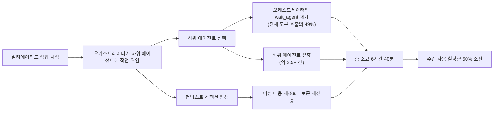
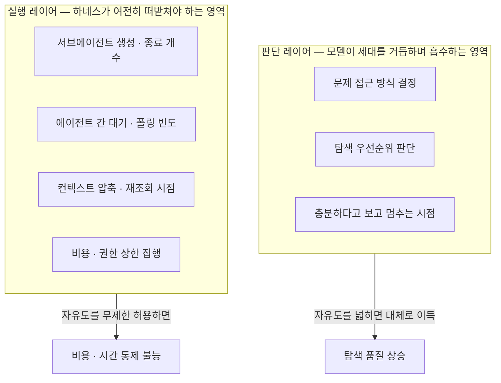

### "더 똑똑한 모델일수록 더 많이 맡겨라"는 조언은 언제 통하고 언제 무너지는가

> 
> https://www.threads.com/@gptaku_ai/post/DayoV5kk1dJ
> 
> Fable이랑 Sol 쓰면서 느낀점
> 
> 프론티어 모델이 나올수록
> 명령할때 자유도를 주라는 말이 많은데
> 우리 같은 사람들은 그럴 돈도 시간도 없음
> 하루에 1000달러 이상 나오는데 어떻게 씀🥲
> 
> 자유도를 주면 리즈닝은 엄청 돌고
> 토큰은 미친듯이 쓰고 시간도 오래 걸림
> 근데 결과가 그만큼 좋아지는지는 잘 모르겠음
> 
> 오히려 AI를 잘 쓰려면 제대로 시키는것도 중요하지만
> 모델이 잘하는 크기로 일을 쪼개 주는게 중요함
> 
> 그냥 이거 해줘 저거 해줘 하다간
> 결과도 못받고 토큰만 날리고
> 그지꼴을 면치 못하게 될거임

> 
> https://www.threads.com/@dextune/post/DawcrwBk-vB
> 
> 어제 Codex CLI를 통해서 GPT-5.6으로 멀티에이전트 구성하여 작업 시켰는데.
> 
> 6시간 40분 정도 걸렸다. 주간 할당량의 50% 정도를 사용했다.
> 
> 아무리 생각해도 이정도의 작업은 아니라고 생각했는데.
> 
> X와 스레드에 유사 사례들이 조금씩 올라와서.
> 
> Claude에게 분석 시켜보니. 아래와 같은 결과가 나왔다.
> 
> `6.71시간 중 상당 부분은 "작업"이 아니라 에이전트 간 폴링 대기(특히 Avicenna의 약 3.5시간 유휴) 와 컴팩션 이후 재조회로 인한 토큰 재전송에 소비된 것으로 보입니다. 실제 코드 작업량(exec 호출 합계)에 비해 오케스트레이터의 wait_agent 비중(49%)이 비정상적으로 높다는 점이 가장 명확한 구조적 병목입니다.`
>

---

## 1. 들어가며 — 두 개의 스레드, 하나의 질문

2026년 7월 둘째 주, 한국 AI 실무자 커뮤니티에서 거의 동시에 올라온 두 개의 Threads 게시물이 있다. 하나는 지피타쿠(@gptaku_ai)가 올린 글로, Claude Fable 5와 GPT-5.6 Sol을 함께 쓰면서 느낀 소감을 담고 있다. 다른 하나는 dextune(@dextune)이 올린 글로, GPT-5.6을 Codex CLI 위에서 멀티에이전트로 굴린 실제 작업 로그를 Claude에게 분석시킨 결과다. 두 글은 서로 다른 상황을 다루지만 결국 같은 질문으로 수렴한다. "프론티어 모델이 나올수록 명령할 때 자유도를 주어야 한다"는, 요즘 AI 업계에서 자주 들리는 조언은 실제로 맞는 말인가.

이 조언 자체는 근거가 없는 말이 아니다. 뒤에서 살펴보겠지만 Anthropic의 공식 문서에도 비슷한 취지의 안내가 실제로 존재한다. 문제는 이 조언이 어떤 조건에서 성립하고, 어떤 조건에서 오히려 독이 되는지가 충분히 구분되지 않은 채 유통된다는 점이다. 두 게시물은 바로 그 경계선 위에서 실제로 무슨 일이 벌어지는지를 보여주는 생생한 사례다. 이 문서는 두 게시물의 관찰을 출발점으로 삼아, 그 뒤에 있는 구조적 이유를 최신 자료로 검증하고, 실무에서 자유도를 어떻게 다뤄야 하는지에 대한 정리된 그림을 제시한다.

---

## 2. 두 게시물이 말하는 것

### 2-1. 지피타쿠: "자유도를 주면 리즈닝만 늘어난다"

지피타쿠는 Claude Fable 5와 GPT-5.6 Sol을 실무에 쓰면서 느낀 점을 정리했다. 요지는 이렇다. 프론티어 모델이 나올 때마다 "이제는 세세하게 지시하지 말고 자유도를 주라"는 말이 업계에 퍼지지만, 하루에 API 비용이 1000달러 넘게 나오는 상황에서는 그런 여유를 부릴 수 없다는 것이다. 실제로 모델에게 자유도를 주면 리즈닝(추론) 토큰이 크게 늘고, 작업 시간도 길어지지만, 그만큼 결과물의 품질이 좋아지는지는 체감하기 어렵다고 지적한다. 그가 제시하는 대안은 반대 방향이다. 무작정 "이거 해줘, 저거 해줘" 식으로 통째로 맡기기보다, 모델이 잘 처리할 수 있는 크기로 작업을 쪼개서 주는 것이 실무에서는 더 안정적인 결과를 낸다는 것이다.

### 2-2. dextune: "6시간 40분 중 대부분은 '일'이 아니라 '대기'였다"

dextune은 Codex CLI를 통해 GPT-5.6으로 멀티에이전트 구성을 짜서 작업을 맡겼는데, 완료까지 6시간 40분이 걸렸고 주간 사용 할당량의 50%가 소진됐다고 밝혔다. 실제 작업 난이도에 비해 지나치게 오래 걸렸다고 판단한 그는, Claude에게 이 작업 로그를 분석하도록 시켰다. 그 결과 6.71시간 가운데 상당 부분이 실제 코딩 작업이 아니라 에이전트 사이의 폴링 대기, 특히 하위 에이전트 중 하나(그의 구성에서 "Avicenna"라 이름 붙인 에이전트)가 약 3.5시간 동안 유휴 상태로 머문 것과, 컨텍스트 컴팩션(compaction) 이후 앞선 내용을 다시 불러오며 토큰을 재전송하는 과정에서 소모됐다는 진단이 나왔다. 오케스트레이터가 호출한 도구 가운데 `wait_agent`, 즉 하위 에이전트의 응답을 기다리는 호출의 비중이 49%에 달했다는 점이 가장 뚜렷한 구조적 병목으로 지목됐다.

두 사람이 짚은 문제는 서로 다른 각도지만 결국 하나로 모인다. 자유도(=위임의 폭)를 넓히는 것과, 그로 인해 실제로 좋은 결과가 나오는 것 사이에는 자동적인 비례관계가 없다는 것이다. 이 지점에서 이 관찰이 개인의 경험담에 그치는 것인지, 아니면 더 넓은 산업 전반의 패턴과 맞닿아 있는지를 확인할 필요가 있다.

> **일러두기**: 위 두 게시물의 내용은 이용자가 직접 제공한 원문을 근거로 정리했다. Threads는 로봇 자동 접근을 차단하고 있어 본 문서 작성 과정에서 직접 페이지를 열람하지는 못했으며, 검색을 통해 두 계정의 존재와 활동 이력, 그리고 주변 맥락(모델 출시 시점, 가격, 벤치마크 등)을 교차 확인하는 방식으로 사실관계를 보강했다.

---

## 3. "자유도를 주라"는 조언은 어디서 왔는가

이 조언이 허공에서 나온 말은 아니다. Anthropic이 공개한 Claude Code 모범 사례 문서를 보면, 실제로 비슷한 방향의 안내가 여러 곳에 등장한다. 예를 들어 계획(Plan) 모드에 대한 안내에서는, diff를 한 문장으로 설명할 수 있을 만큼 작업 범위가 명확하면 계획 단계를 건너뛰고 바로 실행을 맡기라고 권한다. 반대로 접근 방식이 불확실하거나 익숙하지 않은 코드를 다룰 때는 계획을 세우게 하는 것이 낫다고 구분한다. 또한 모호한 프롬프트—예를 들어 "이 파일에서 무엇을 개선하시겠습니까"와 같은 열린 질문—가 탐색 단계에서는 오히려 사람이 미처 생각하지 못한 지점을 드러낼 수 있다고 설명한다. 서브에이전트를 활용해 조사를 위임하라는 안내도 있다. 별도의 컨텍스트 창에서 실행되기 때문에 메인 대화의 맥락을 깨끗하게 유지할 수 있다는 논리다.

Anthropic의 프롬프트 엔지니어링 공식 가이드에도 같은 결의 내용이 나온다. 최근 세대 모델일수록 지시를 문자 그대로(literal) 따르는 경향이 강해졌기 때문에, 오히려 의도를 명확히 밝히고 불필요한 제약을 걷어내는 것이 권장된다는 것이다. 예컨대 "이 함수를 개선할 변경 사항을 제안해줄 수 있어?"라고만 하면 최신 모델은 문자 그대로 제안만 하고 실제 코드는 고치지 않을 수 있어서, 원하는 행동을 명시적으로 지시하는 편이 낫다는 안내가 담겨 있다. 또한 effort(추론 노력) 파라미터를 통해 모델이 얼마나 깊이, 얼마나 많은 파일을 확인하고, 얼마나 많이 검증한 뒤 작업을 마칠지를 조절할 수 있다는 설명도 있다. 이 모든 안내를 종합하면, "자유도를 주라"는 말은 실제로 존재하는 실무 조언이며, 근거 없는 유행어는 아니다.

다만 여기서 놓치기 쉬운 지점이 있다. Anthropic의 안내가 자유도를 주라고 말하는 대상은 대체로 **판단**의 영역이다. 어떤 방식으로 문제에 접근할지, 어떤 순서로 탐색할지, 언제 계획 단계를 생략해도 되는지 같은 것들이다. 반면 **실행**의 영역—몇 개의 서브에이전트를 띄울지, 얼마나 자주 대기할지, 컨텍스트를 언제 어떻게 압축할지 같은 것—은 자유도를 준다고 해서 자동으로 좋아지는 영역이 아니다. 오히려 이 영역에 대한 제약이 느슨해지면 비용과 시간이 통제 불가능하게 불어나는 사례가 최근 두드러지게 보고되고 있다. 다음 장에서 그 구체적인 사례를 살펴본다.

---

## 4. 반례: GPT-5.6이 보여준 "자유도의 대가"

2026년 7월 9일 OpenAI가 GPT-5.6(플래그십 Sol, 중간 티어 Terra, 경량 Luna)을 정식 공개했다. 이 모델은 이전 세대보다 스스로 멈추지 않고 끝까지 밀어붙이는 성향이 강해졌고, 작업 도중 서브에이전트를 적극적으로 띄우도록 훈련됐다는 특징이 있다. 그런데 출시 나흘 만에 개발자 커뮤니티에서는 예상 밖의 반응이 나왔다. t3.gg를 운영하는 개발자 테오(Theo)는 자신의 팟캐스트에서 이 상황을 "완전한 혼돈"이라고 표현했다. 월 200달러짜리 Codex Pro 요금제로 기존에는 GPT-5.5를 넉넉히 썼는데, GPT-5.6으로 바꾸자 5시간짜리 사용 한도가 단 몇 분 만에 소진되는 일이 벌어졌다는 것이다.

그가 직접 추적한 수치는 이렇다. High 추론 단계의 메시지 한 번이 5시간짜리 할당량의 15%를 태울 수 있었고, 토큰을 2.5배 빠르게 소모하는 Fast 모드에서 Ultra 프롬프트 한 번이 주간 예산의 37.5%를 날려버린 경우도 있었다. OpenAI 측(제품 담당자 TBO)은 며칠 만에 세 가지 임시 조치를 내놨다. 5시간 한도를 일시적으로 없애고 주간 한도만 남기는 것, 추론 처리 최적화로 작업당 토큰 사용량을 약 10% 줄이는 것, 그리고 사용량 계산에 오류를 일으켰던 컨텍스트 창 확장(37만 2천 토큰)을 27만 2천 토큰으로 되돌리는 것이었다. 다중 에이전트 호출이 High·X-High 추론 단계에서 의도한 것보다 더 자주 발동되고 있었다는 점도 인정했다.

테오가 벤치마크 비용 곡선을 직접 정리한 표는 이 문제의 핵심을 잘 보여준다.

| 추론 단계 | DeepSWE 점수 | 작업당 비용(DeepSWE) | CursorBench 점수 | 작업당 비용(CursorBench) |
|---|---|---|---|---|
| Low | 45% | $1.00 | — | — |
| Medium | 61% | $1.86 | — | — |
| High | 69% | $3.47 | 63.5% | $2.79 |
| X-High | 71% | $4.70 | — | — |
| Max | 73% | $8.39 | 67.2% | $5.69 |

Low에서 High로 올라가면 2.47달러를 더 써서 24퍼센트포인트를 얻는다. 반면 High에서 Max로 올라가면 비용은 두 배 넘게 뛰지만 점수는 겨우 4포인트 오른다. 즉 자유도(=추론 단계, 곧 모델이 스스로에게 허용하는 탐색과 검토의 폭)를 무한정 열어주는 것이 비용 대비 성과를 반드시 개선하지는 않는다는 뜻이다. 흥미롭게도 GPT-5.6을 가장 많이 쓰는 헤비 유저 그룹 중 하나였던 오픈코드(Open Code) 팀은 설정 오류로 한 달 내내 Medium 단계로 모델을 돌렸는데도, 여전히 이 모델을 가장 선호하는 모델로 꼽았다는 후일담도 함께 전해졌다. 같은 DeepSWE 벤치마크에서 Anthropic의 Fable은 70%의 점수를 작업당 13달러에 기록했는데, 이는 Sol의 High 단계 성능과 비슷하면서도 Max 단계보다는 훨씬 싼 수준이다.

더 흥미로운 지점은 서브에이전트 문제다. GPT-5.5는 서브에이전트를 잘 쓰지 않았지만, GPT-5.6은 적극적으로 띄우도록 훈련됐다. 그 결과 테오가 보기에 단순한 한 파일 수정 작업조차 다중 에이전트 오케스트레이션으로 부풀어 오르며 주간 한도를 다 써버리는 일이 반복됐다. 그가 찾은 해법은 단순했다. 설정 파일에 "사용자가 명시적으로 요청할 때만 서브에이전트를 쓰라"는 한 줄을 넣는 것이었다. 또한 GPT-5.6은 이전 모델과 달리 중간에 멈추고 허락을 구하는 습성이 거의 사라졌기 때문에, "이유 없이는 절대 멈추지 않는" 모델을 다루려면 오히려 사람이 먼저 "여기서 멈추고 피드백을 기다려라" 같은 정지 조건을 프롬프트 안에 명시적으로 심어야 한다는 것이 그의 결론이다. 그는 이 원칙을 적용해 첫 주의 혼란스러운 사용량 대비 토큰 소모를 4~5배 줄였다고 밝혔다.

이 사례는 지피타쿠가 관찰한 현상과 정확히 겹친다. 모델에게 자유도를 주면(추론 단계를 높이면, 서브에이전트 생성을 허용하면) 리즈닝과 토큰 소모는 확실히 늘어난다. 하지만 그 증가분이 결과물 품질 향상으로 이어지는지는 별개의 문제이며, 특정 구간을 넘어서면 오히려 손해를 보는 지점(Low→High는 이득, High→Max는 손해)이 뚜렷하게 존재한다.

---

## 5. 반례: dextune의 멀티에이전트가 왜 6시간 40분이 걸렸나

dextune의 사례는 같은 문제를 오케스트레이션 구조 쪽에서 보여준다. 여러 에이전트에게 자유롭게 작업을 위임하는 방식은 언뜻 병렬 처리로 시간을 단축할 것처럼 보이지만, 실제로는 에이전트 사이의 조율 자체가 새로운 비용 항목이 된다. 그가 Claude를 통해 분석한 결과, 오케스트레이터가 하위 에이전트의 응답을 기다리는 `wait_agent` 호출이 전체 도구 호출의 49%를 차지했고, 하위 에이전트 중 하나는 약 3.5시간 동안 유휴 상태로 머물렀다. 여기에 컨텍스트가 컴팩션된 뒤 앞의 내용을 다시 불러오는 과정에서 토큰이 재전송되는 비용까지 겹쳤다.

이 현상은 dextune 개인의 설정 실수라기보다, 멀티에이전트 오케스트레이션 자체가 안고 있는 구조적 특성에 가깝다. 여러 코딩 에이전트 오케스트레이션을 다룬 국내외 기술 블로그들도 비슷한 실패 패턴을 반복해서 지적한다. 한 에이전트가 작업을 마쳤다는 신호를 보냈는데 트리거 이벤트가 어떤 이유로든 끊기면 다음 단계로 넘어가야 할 작업이 무한 대기 상태에 빠지고, 검토 담당 에이전트에게 작업이 잘못 배정되면 역시 하염없이 대기 상태로 남으며, 상위 작업이 이미 닫혔는데도 하위 작업들은 미완료 상태로 방치되는 경우가 흔하다는 것이다. 사람 조직이라면 "그거 어떻게 됐지"라는 생각이 자연스럽게 후속 확인으로 이어지지만, 에이전트 시스템에는 이런 자기 복구 로직이 아직 완벽하지 않다.

Anthropic 자신도 이 문제를 인지하고 있다는 정황이 있다. 최근 공개된 한 사용기에는 어떤 이용자가 세션 하나에서 451개의 서브에이전트를 띄워 1400만 토큰을 소모한, 이른바 "자기 유발적 사용량 압박(self-inflicted usage squeeze)" 사례가 언급된다. 자유도를 넓게 열어둔 오케스트레이터가 하위 에이전트를 계속 새로 만들어내면서 실제 작업량과 무관하게 관리 비용 자체가 기하급수적으로 불어난 것이다. dextune이 관찰한 6시간 40분, 주간 할당량 50% 소진 역시 이 계열의 현상으로 볼 수 있다.

아래는 dextune이 보고한 병목 구조를 인과 흐름으로 정리한 것이다. 정확한 수치가 확인된 두 지점(하위 에이전트 유휴 약 3.5시간, `wait_agent` 호출 비중 49%)만 반영했으며 나머지는 그가 밝힌 원인 범주를 그대로 옮긴 것이다.

---

## 6. 왜 이런 일이 반복되는가 — 판단 레이어와 실행 레이어로 다시 보기

이 문제를 좀 더 근본적으로 이해하려면, 자유도를 하나의 뭉뚱그려진 개념이 아니라 두 개의 서로 다른 층위로 나눠서 볼 필요가 있다. 하나는 **판단 레이어**다. 어떤 방식으로 문제에 접근할지, 어떤 정보를 더 파봐야 할지, 지금 상황에서 무엇이 우선순위인지, 언제 충분하다고 보고 멈출지 같은 것들이다. 이 영역은 모델이 세대를 거듭할수록 급격히 흡수해 온 영역이다. 프롬프트를 아무리 세세하게 짜도 결국 모델의 가중치 안에 있는 판단력을 대체할 수 없고, 반대로 최신 모델은 사람이 시시콜콜 지시하지 않아도 알아서 합리적인 판단을 내리는 경우가 많아졌다. Anthropic의 Plan 모드 생략 권장이나 모호한 프롬프트를 탐색 단계에 활용하라는 안내는 정확히 이 레이어를 겨냥한 조언이다.

다른 하나는 **실행 레이어**다. 서브에이전트를 몇 개나 띄울지, 프로세스 사이에서 얼마나 자주 폴링할지, 컨텍스트를 언제 얼마나 압축할지, 도구 호출 하나하나에 얼마의 비용 상한을 걸지 같은 것들이다. 이 영역은 모델의 지능이 아무리 좋아져도 자동으로 해결되지 않는다. 오히려 모델이 똑똑해지고 자율성이 커질수록, 그 자율성을 어디까지 실행에 반영할지를 통제하는 하네스(harness)의 역할이 더 중요해진다. GPT-5.6이 이전 모델보다 서브에이전트를 더 적극적으로 띄우도록 훈련됐다는 사실, 그리고 그로 인해 실행 레이어의 비용이 폭증한 사례는 이 구분을 정확히 보여준다. 판단력이 좋아진 것과, 그 판단을 실행에 옮기는 절차가 효율적인 것은 서로 다른 문제라는 뜻이다.

지피타쿠가 "모델이 잘하는 크기로 일을 쪼개주는 것이 중요하다"고 말한 것은, 실질적으로 실행 레이어의 자유도를 스스로 제한하라는 조언과 같다. dextune의 사례에서 문제가 됐던 `wait_agent` 폴링과 컨텍스트 재조회 역시 판단의 문제가 아니라 순수하게 실행 레이어의 설계 문제다. 반대로 Anthropic 문서가 "자유도를 주라"고 말하는 지점—계획을 생략해도 되는 순간을 판단하는 것, 모호한 질문으로 탐색을 유도하는 것—은 모두 판단 레이어에 속한다. 결국 두 조언은 모순되지 않는다. 다만 "자유도"라는 한 단어가 두 개의 다른 층위를 동시에 가리키면서 혼선이 생기는 것이다.

---

## 7. Anthropic 스스로가 보여준 데이터: "가장 비싼 모델은 판단에만 써라"

이 구분을 뒷받침하는 흥미로운 자료가 최근 Anthropic 자신에게서 나왔다. Anthropic의 공식 개발자 계정(@ClaudeDevs)은 2026년 7월 7일과 8일, 자사 팀이 내부적으로 쓰는 두 가지 다중 모델 협업 패턴의 벤치마크 수치를 공개했다. 이 수치는 여러 독립적인 매체(더 디코더, explainx.ai, XiaoHu AI Explained 등)를 통해 교차 보도됐으며, 제시된 숫자는 서로 일치한다.

첫 번째는 **어드바이저(advisor) 패턴**이다. 실행을 맡은 Sonnet 5가 대부분의 작업을 스스로 처리하다가, 판단이 필요한 순간에만 Fable 5를 호출해 조언을 구하는 방식이다. SWE-bench Pro 기준으로 이 조합은 Fable 5 단독 성능의 약 92%를 달성하면서 비용은 약 63% 수준에 그쳤다. Fable 5가 호출되는 빈도는 작업당 평균 한 번 정도였다.

두 번째는 **오케스트레이터(orchestrator) 패턴**이다. Fable 5가 작업을 계획하고 쪼개서 여러 Sonnet 5 워커에게 병렬로 분배하는 방식이다. 리서치 성격이 강한 BrowseComp 벤치마크에서 이 조합은 Fable 5 단독 성능의 약 96%(정확도 86.8% 대 90.8%)를 달성하면서 비용은 약 46% 수준(문제당 18.53달러 대 40.56달러)에 그쳤다.

| 패턴 | 구성 | 벤치마크 | 단독 대비 성능 | 단독 대비 비용 |
|---|---|---|---|---|
| 어드바이저 | Sonnet 5 실행 + Fable 5 조언(작업당 약 1회) | SWE-bench Pro | 약 92% | 약 63% |
| 오케스트레이터 | Fable 5 계획·분배 + Sonnet 5 워커 실행 | BrowseComp | 약 96% (86.8%/90.8%) | 약 46% ($18.53/$40.56) |

이 수치가 이 문서의 논지에서 의미 있는 이유는, Anthropic 스스로가 "가장 비싼 모델을 모든 곳에 쓰는 것"과 "가장 비싼 모델의 판단력만 필요한 순간에 쓰고 나머지는 값싼 모델에 맡기는 것" 사이에서 후자가 근소한 성능 손실만으로 비용을 절반 가까이 줄인다는 것을 실증했기 때문이다. 이는 앞서 정리한 판단/실행 레이어 구분과 정확히 맞아떨어진다. 프론티어 모델의 자유도는 "판단"에 집중적으로 투입할 때 효율이 가장 높고, 실행의 물량 자체를 프론티어 모델에게 통째로 맡기는 것은 오히려 비효율적이라는 것이다.

---

## 8. 학술적 근거: "자유는 더 많은 실패를 낳았다"

이 패턴이 산업계의 일화에 그치지 않는다는 것을 보여주는 학술 연구도 있다. 2026년 상반기에 공개된 한 논문(〈Bounded Autonomy for Enterprise AI: Typed Action Contracts and Consumer-Side Execution〉)은 기업 환경에서 AI 에이전트의 자율성 수준을 통제된 조건과 비통제 조건으로 나눠 비교했다. 비통제 조건에서는 모델에게 더 많은 행동 옵션과 더 적은 검증 절차, 확인 지연 없는 실행 권한을 부여했다. 그런데 실제 결과는 예상과 반대로 나타났다. 더 많은 자유를 가진 모델은 오히려 완료한 작업 수가 더 적었고(25개 중 17개 대 23개), 안전하지 않은 조작을 두 건 발생시켰다. 이 연구는 이를 두고 "더 많은 자유가 더 많은 유용성을 낳은 것이 아니라, 더 많은 실패를 낳았다"고 결론짓는다.

이 결과는 업계에서 흔히 통용되는 전제, 즉 더 강력한 모델과 더 나은 프롬프트, 더 많은 도구가 자연스럽게 유용한 자율성으로 이어질 것이라는 가정에 반례를 제시한다. 이 논문이 제안하는 대안은 기업용 AI를 모델의 지능 문제가 아니라 운영 통제의 문제로 다뤄야 한다는 것이다. 이는 앞서 살펴본 실행 레이어의 문제의식과 정확히 통한다. 판단은 모델에게 맡기되, 그 판단이 실제 행동으로 옮겨지는 경로에는 명확한 계약과 경계가 있어야 한다는 뜻이다.

---

## 9. 하네스 엔지니어링 담론과의 연결

이 논의는 최근 국내외에서 활발히 이야기되는 "하네스 엔지니어링" 담론과도 맞닿아 있다. 하네스라는 말은 원래 말에게 씌우는 마구를 가리키는데, AI 에이전트에 적용하면 모델 자체를 제외한 시스템 프롬프트, 도구 정의, 샌드박스 환경, 오케스트레이션 로직, 피드백 루프, 미들웨어 훅 전체를 뜻한다. LangChain의 한 엔지니어가 정리한 표현을 빌리면, 원시 LLM은 그 자체로 에이전트가 아니며, 하네스가 상태 관리와 도구 실행, 피드백 루프, 제약 조건을 부여해야 비로소 에이전트가 된다.

여기서 흥미로운 지점은, 오늘날의 프론티어 코딩 모델이 대체로 자신이 훈련받은 특정 하네스 안에서 가장 좋은 성능을 낸다는 사실이다. Codex 계열 모델은 `apply_patch`라는 특정 파일 편집 도구에 강하게 결합돼 있어서, 다른 오픈소스 하네스가 Codex 모델을 지원하려면 별도의 호환 도구를 새로 만들어야 했다는 사례가 보고된 바 있다. 반대로 어떤 실험에서는 Claude Opus 4.6이 자신이 훈련된 Claude Code 하네스 안에서는 순위가 낮았지만, 다른 하네스에서 실행했을 때 오히려 상위권으로 올라간 경우도 있었다고 한다. 이는 모델의 지능과 하네스의 설계가 서로 독립적인 변수이며, 모델이 아무리 좋아져도 하네스 설계가 부실하면 성능이 온전히 발휘되지 않을 수 있음을 시사한다.

이 관점에서 보면 "자유도를 주라"는 조언은 판단 레이어에서는 유효하지만, 하네스가 담당해야 할 실행 레이어의 설계 책임을 모델에게 떠넘기라는 뜻으로 오독되면 곤란하다. GPT-5.6이 서브에이전트를 적극적으로 띄우도록 훈련된 것 자체는 판단력의 진보라고 볼 수도 있지만, 그 판단을 실제로 몇 개까지, 어떤 조건에서 실행에 옮길지를 정하는 것은 여전히 하네스(설정 파일, `agent.md`, 사용량 상한 등)의 몫이라는 것이 테오의 사례가 보여준 교훈이다.

---

## 10. 종합: 자유도는 원칙이 아니라 설계 변수다

두 개의 Threads 게시물, GPT-5.6의 출시 이후 벌어진 비용 논란, Anthropic 자신의 오케스트레이터 벤치마크, 그리고 자율성 관련 학술 연구까지 종합하면 하나의 그림이 드러난다. "프론티어 모델이 나올수록 자유도를 주어야 한다"는 명제는 절반만 맞는 말이다. 정확히 말하면 다음과 같이 재구성해야 한다.

첫째, 판단의 자유도는 모델 세대가 올라갈수록 늘려주는 것이 유리한 경우가 많다. 접근 방식, 탐색 순서, 계획 생략 여부 같은 것들은 최신 모델에게 맡겼을 때 오히려 사람이 세세히 지시하는 것보다 나은 결과가 나오는 경우가 실제로 보고되고 있으며, Anthropic의 공식 가이드도 이 방향을 뒷받침한다.

둘째, 실행의 자유도는 모델 세대와 무관하게 항상 하네스 차원에서 명시적으로 통제해야 한다. 서브에이전트 생성 개수, 대기·폴링 정책, 컨텍스트 압축 시점, 비용 상한 같은 것들을 모델의 자율 판단에 맡기면, 모델이 똑똑해질수록 오히려 비용과 시간이 통제 불능 상태로 불어나는 역설이 발생한다. GPT-5.6의 출시 직후 벌어진 혼란과 dextune이 겪은 6시간 40분의 대기는 이 원칙이 지켜지지 않았을 때 어떤 일이 벌어지는지 보여주는 사례다.

셋째, 비용 대비 성능이 가장 좋은 지점은 대체로 "적당히 높은" 수준에서 형성되며, 그 이상으로 자유도(추론 단계, 서브에이전트 허용 범위)를 넓히는 것은 수확체감을 넘어 손해로 이어지는 구간이 존재한다. 테오가 정리한 추론 단계별 비용·성능 표에서 Low에서 High로 가는 구간은 이득이지만 High에서 Max로 가는 구간은 손해였다는 사실이 이를 잘 보여준다.

넷째, 가장 비싼 프론티어 모델을 효율적으로 쓰는 방법은 모든 작업에 자유도를 열어주는 것이 아니라, 판단이 필요한 소수의 지점에만 개입시키고 나머지 실행은 값싼 모델이나 명확히 정의된 도구에 맡기는 것이다. Anthropic이 공개한 어드바이저·오케스트레이터 패턴이 근소한 성능 손실로 비용을 40~55% 절감했다는 사실이 이를 뒷받침한다.

지피타쿠가 제안한 "모델이 잘하는 크기로 일을 쪼개주라"는 조언과, dextune이 겪은 오케스트레이션 병목은 결국 같은 결론을 가리킨다. 프론티어 모델의 진짜 자유도는 "무엇이든 알아서 하게 두는 것"이 아니라, "판단이 필요한 지점을 정확히 골라 그곳에만 재량을 주고, 나머지 실행 경로는 사람이 설계한 하네스가 붙잡아주는 것"에 있다.

---

## 11. 실무 체크리스트

아래는 이 문서에서 정리한 원칙을 실무에 바로 적용할 수 있도록 재구성한 목록이다.

1. 작업을 맡기기 전에 "이 작업에서 자유도를 넓혀야 할 부분이 판단인가, 실행인가"를 먼저 구분한다.
2. 접근 방식이 불확실하거나 익숙하지 않은 영역이라면 계획 단계를 생략하지 말고, 모호한 질문으로 탐색을 유도해본다.
3. 서브에이전트 생성은 기본적으로 끄고, 명시적으로 필요할 때만 허용하도록 설정 파일에 못박아 둔다.
4. 프롬프트 안에 정지 조건(어디까지 하고 멈출지)을 명시적으로 넣는다. 최신 모델일수록 스스로 멈추지 않는 경향이 강해지고 있다.
5. 추론 단계(effort)는 무조건 최고값을 쓰지 말고, 비용 대비 성능 곡선이 꺾이는 지점을 직접 측정해 자신의 작업에 맞는 기본값을 정한다.
6. 프론티어 모델은 판단이 필요한 소수의 지점(설계 방향 결정, 최종 검수, 막힌 지점 조언)에만 투입하고, 반복적인 실행은 더 값싼 모델이나 정해진 도구에 위임하는 구조를 우선 검토한다.
7. 오케스트레이션을 도입했다면 대기·폴링 비중과 컴팩션 빈도를 주기적으로 점검해, 실제 작업 시간과 대기 시간의 비율이 어느 정도인지 파악한다.
8. 다른 사람의 설정 파일이나 프롬프트 템플릿을 그대로 복사하기보다, 자신의 작업 흐름에서 실패한 지점을 직접 추적해 설정을 조금씩 조정해나간다.

---

## 12. 팩트체크 노트

- **1차 출처(이용자 제공 원문)**: 지피타쿠(@gptaku_ai)의 Threads 게시물, dextune(@dextune)의 Threads 게시물. 두 게시물의 본문은 이용자가 직접 전달한 내용을 그대로 근거로 삼았다. Threads는 로봇 자동 접근을 차단하므로 본 문서 작성 과정에서 직접 페이지를 열람해 재확인하지는 못했다.
- **1차 출처(공식 문서)**: Anthropic의 Claude Code 모범 사례 문서, 프롬프트 엔지니어링 가이드, Claude Platform 모델 개요 문서. 모두 Anthropic 공식 도메인에서 직접 확인했다.
- **1차 출처(학술 자료)**: 〈Bounded Autonomy for Enterprise AI〉 논문(arXiv). 초록 및 본문 일부를 직접 확인했다.
- **2차 출처(교차 검증된 보도)**: GPT-5.6의 비용 논란을 다룬 BigGo Finance의 보도(테오의 팟캐스트 내용 인용). Anthropic의 어드바이저·오케스트레이터 패턴 수치는 Anthropic 공식 개발자 계정(@ClaudeDevs)의 게시물을 근거로 하되, 본 문서 작성 시점에 해당 원 게시물을 직접 확인하지 못해 이를 동일한 수치로 교차 보도한 복수의 매체(더 디코더, explainx.ai, XiaoHu AI Explained, paddo.dev 등)를 통해 확인했다. 각 매체가 제시한 성능·비용 수치가 서로 일치한다는 점에서 신뢰도가 높다고 판단했으나, Anthropic 원문 게시물 대비 재검증되지는 않았다는 한계가 있다.
- **2차 출처(맥락 확인용)**: GPT-5.6과 Fable 5의 출시일, 가격, 수출통제 이력 등은 여러 독립 매체(오픈위키, 이랜서 블로그, 하이러닝레이트 뉴스레터 등)를 통해 교차 확인했다.
- **분석/종합**: 판단 레이어·실행 레이어 구분, 두 게시물과 GPT-5.6 사례·Anthropic 데이터·학술 연구를 하나의 틀로 엮은 해석은 본 문서 자체의 종합이며, 이는 기존에 정리해온 "하네스 필요성 논쟁" 분석 틀을 이번 사례에 적용한 것이다.
- dextune이 인용한 "6.71시간 중 wait_agent 비중 49%", "Avicenna 약 3.5시간 유휴" 등의 수치는 그가 Claude를 통해 자체적으로 분석한 결과이며, 본 문서 작성자가 원본 실행 로그를 직접 검증한 것은 아니다. 이 점은 본문에서도 명시했다.

---

## 13. 용어집

| 용어 | 설명 |
|---|---|
| 하네스(harness) | 모델 자체를 제외한 시스템 프롬프트, 도구 정의, 샌드박스, 오케스트레이션 로직 등 모델을 감싸는 모든 구조물 |
| 오케스트레이터(orchestrator) | 여러 하위 에이전트에 작업을 계획·분배하고 결과를 취합하는 상위 에이전트 |
| 서브에이전트(sub-agent) | 별도의 컨텍스트 창에서 특정 하위 작업을 수행하도록 위임받은 에이전트 |
| 폴링(polling) | 어떤 작업이 끝났는지 여부를 주기적으로 확인하며 기다리는 방식 |
| wait_agent | 오케스트레이터가 하위 에이전트의 응답을 기다릴 때 호출하는 도구(대기 상태를 나타냄) |
| 컴팩션(compaction) | 컨텍스트 창이 가득 찼을 때 이전 대화 내용을 요약·압축해 공간을 확보하는 과정 |
| 판단 레이어 | 접근 방식, 우선순위, 멈출 시점 등 모델의 가중치가 세대를 거듭하며 흡수해가는 영역 |
| 실행 레이어 | 서브에이전트 개수, 대기 정책, 비용 상한 등 하네스가 계속 통제해야 하는 영역 |
| effort(추론 노력) | 모델이 한 응답을 만들기 위해 얼마나 깊이 탐색·검증할지를 조절하는 파라미터 |
| 어드바이저 패턴 | 값싼 모델이 실행을 맡고, 판단이 필요한 순간에만 비싼 모델에게 조언을 구하는 구조 |
| 오케스트레이터 패턴 | 비싼 모델이 계획을 세워 여러 값싼 모델 워커에게 작업을 분배하는 구조 |
| 바운디드 오토노미(bounded autonomy) | 자율성을 무제한으로 열어두지 않고, 명시적인 계약과 경계 안에서만 행동하도록 제한하는 설계 원칙 |

---

## 14. 참고문헌

- 지피타쿠(@gptaku_ai) Threads 게시물 — https://www.threads.com/@gptaku_ai/post/DayoV5kk1dJ (이용자 제공 원문)
- dextune(@dextune) Threads 게시물 — https://www.threads.com/@dextune/post/DawcrwBk-vB (이용자 제공 원문)
- Anthropic, Claude Code 모범 사례 — https://code.claude.com/docs/ko/best-practices
- Anthropic, 프롬프트 작성 모범 사례(Claude Platform Docs) — https://docs.anthropic.com/ko/docs/build-with-claude/prompt-engineering/claude-4-best-practices
- Anthropic, 프롬프트 엔지니어링 개요 — https://platform.claude.com/docs/ko/build-with-claude/prompt-engineering/overview
- Anthropic, 모델 개요(Claude Platform Docs) — https://platform.claude.com/docs/ko/about-claude/models/overview
- BigGo Finance, "At $569 a Task, GPT-5.6's Token Appetite Is 'Absolute Chaos'" (2026-07-13) — https://finance.biggo.com/news/6fcddcdb28464798
- arXiv, "Bounded Autonomy for Enterprise AI: Typed Action Contracts and Consumer-Side Execution" — https://arxiv.org/pdf/2604.14723
- The Decoder, "Anthropic's fix for Fable 5's high cost is turning it into a manager that delegates to Sonnet 5" — https://the-decoder.com/anthropics-fix-for-fable-5s-high-cost-is-turning-it-into-a-manager-that-delegates-to-sonnet-5/
- explainx.ai, "Fable 5 Advisor & Orchestrator — Cost Patterns" — https://explainx.ai/blog/fable-5-advisor-orchestrator-patterns-july-2026
- XiaoHu AI Explained, "Anthropic's Playbook: Fable 5 Advises, Sonnet 5 Foots the Bill" — https://best.xiaohu.ai/en/article/fable5-advisor-executor/
- paddo.dev, "The Dial Next to the Meter: Stretching Claude Fable 5 Credits with Effort Levels" — https://paddo.dev/blog/fable-5-effort-levels/
- 박재홍의 실리콘밸리, "하네스 엔지니어링: AI 에이전트 시대, 경쟁력은 모델이 아니라 '마구'에서 나온다" — https://wikidocs.net/blog/@jaehong/9481/
- 박재홍의 실리콘밸리, "하네스 엔지니어링: AI가 스스로를 개선하는 시스템 설계" — https://wikidocs.net/blog/@jaehong/22570/
- shalomeir's inside mode, "멀티 에이전트 오케스트레이션은 왜 잘 안 되는가?" — https://shalomeir.substack.com/p/multi-agent-orchestration-problems
- 오픈위키, "GPT-5.6 vs 클로드 Fable 5 비교 (2026)" — https://wikidocs.net/blog/@openwiki/23007/
- 이랜서 블로그, "Fable 5 vs GPT-5.6, 프론티어 왕좌의 주인은 누구일까?" — https://www.elancer.co.kr/blog/detail/1141
- highlearningrate, "GPT-5.6 + Work Agents - 2026-07-09" — https://highlearningrate.substack.com/p/gpt-56-work-agents-2026-07-09

---

*이 문서는 두 개의 Threads 게시물에서 출발해, 공개된 벤치마크·공식 문서·학술 자료로 사실관계를 검증하고 판단 레이어/실행 레이어 프레임워크로 종합한 분석 문서입니다. 강의·브리핑 자료로 활용하실 수 있도록 작성했습니다.*
