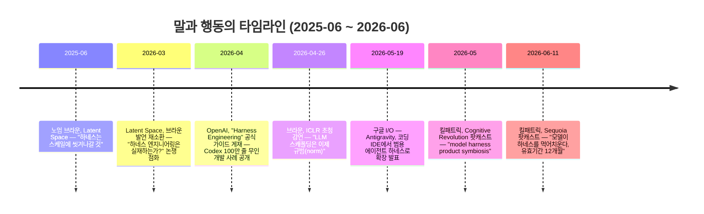
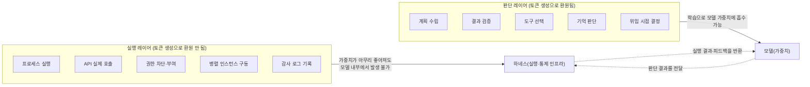

**— 브라운·킬패트릭의 말과 행동이 어긋나는 이유, 그리고 판단 레이어 vs 실행 레이어라는 재배치 —**

- 성격: 「코딩 하네스 논쟁」 시리즈 세 번째 문서. 최근 다시 확산 중인 "하네스 무용론"에 대한 작성자 본인의 분석(판단/실행 레이어 분리 프레임워크)을 중심에 놓고, 그 근거가 되는 발언과 사건들을 1차 출처로 교차 검증했습니다.
- 원문 계기: Facebook 게시물(공유 링크: [facebook.com/share/p/1EXoLaH571](https://www.facebook.com/share/p/1EXoLaH571/)) — 다만 Facebook은 자동 접근을 차단하고 있어 이 문서에서는 원문을 직접 열람하지 못했고, 대신 게시물에서 인용된 발언·사건들을 각각 원출처로 재확인했습니다.

---

## 1. 다시 도는 "하네스 무용론"

> 
> https://www.facebook.com/share/p/1EXoLaH571/
> 
> 갑자기 <하네스 무용론>이 다시 돌아다니네요. 몇달전에 돌아다녔던것 같은데, 제 개인적 생각은 이렇습니다. 
> 
> 오픈AI 노엄 브라운은 작년 2025년 6월 Latent.Space 팟캐스트에서 지금 만들어지는 많은 것들이 스케일에 씻겨나갈 것이며 하네스가 대표적 예라고 말했었는데, 이 발언은 2026년 3월 하네스 엔지니어링 논쟁이 불붙으며 다시 회자됐습니다. 
> 
> 최근에는 구글의 로건 킬패트릭이 2026년 6월 Sequoia 팟캐스트에서 "모델이 하네스를 먹어치운다"며 지금의 하네스는 유효기간이 12개월 정도라고 했습니다.
> 
> 그런데 말과 행동이 좀 다릅니다. 
> 
> 오픈AI는 자체 'Harness Engineering' 가이드를 발행하고 오픈소스 하네스에 투자했으며, 브라운 본인이 2026년 4월 ICLR에서는 LLM 스캐폴딩(사실상 하네스랑 같은말)이 이제 표준이라고 말을 바꿨죠. 
> 
> 구글은 코딩 IDE로 출발한 Antigravity를 2026년 5월 I/O에서 범용 에이전트 하네스로 확장해, 검색, Gemini 앱, Gemini API, Cloud를 같은 하네스로 구동하기 시작했습니다. 그리고, 킬패트릭은 2026년 5월 ‘모델,하네스,제품 공생이 방법’이라는 글을 올렸습니다. 하네스를 없애는 게 아니라 자기 플랫폼 안으로 끌어들이고 있는 것입니다.
> 
> 결론부터 말하면, 하네스에서 판단하는건 모델이 가져갈 수 있어도, 실행은 못가져 간다고 봅니다.  기준은 그 일이 토큰 생성으로 환원되는가입니다.
> 
> LLM이 하는 일은 컨텍스트를 읽고 토큰을 뱉는 것뿐입니다. 토큰 생성으로 표현 가능한 하네스 - 그러니까, 계획, 검증, 도구 선택, 기억할거 판단, 위임 시점 결정 등은 학습으로 모델 안에 들어갈 수 있겠죠. 워크플로우 하네스가 사라져도 아쉽지 않은건 뭐 처음부터 모델의 판단 부족을 밖에서 보정하기 위한 목적이었기 때문입니다. 
> 
> 하지만 토큰 생성이 아닌 일, 프로세스를 실제로 띄우고, API를 실제로 호출하고, 권한을 실제로 차단하고, 병렬 인스턴스를 실제로 돌리고, 감사 로그를 실제로 남기고 그런 일들은 가중치가 무한히 좋아져도 모델 안에서 일어날 수 없다고 생각합니다. 
> 
> 모델은 "결제해도 됨"이라 판단할 수는 있어도, 결제를 집행하는 주체가 될 수는 없다고 봅니다. 
> 
> 그래서 하네스가 모델로 흡수된다가 아니라 판단 레이어는 일부 모델로 흡수되고, 실행 레이어는 남는 방식으로 하네스가 재배치 될 것입니다. 
> 
> 어차피 우리가 만들고 만들어야 할 것은 모델의 판단을 대신하는 하네스가 아니라, 모델의 판단을 집행하고 컨트롤하는 하네스 입니당.
> 

몇 달 전에도 한 차례 돌았던 주장이 최근 다시 확산되고 있습니다. 핵심 근거로 자주 인용되는 두 발언이 있습니다.

- OpenAI의 노엄 브라운이 2025년 6월 Latent Space 팟캐스트에서 "지금 만들어지는 것들 중 상당수가 결국 스케일에 씻겨나갈 것이며, 하네스가 대표적인 예"라고 말한 것.
- 구글의 로건 킬패트릭이 2026년 6월 Sequoia 팟캐스트("Training Data")에서 "모델이 하네스를 먹어치운다"며, 지금의 하네스는 대략 12개월의 유효기간을 갖는다고 말한 것.

그런데 이 문서에서 다루고 싶은 지점은 "이 발언이 맞냐 틀리냐"가 아닙니다. 정말 흥미로운 지점은, **같은 사람과 같은 회사가 이 발언과 정반대되는 행동을 동시에 하고 있다**는 사실입니다. 이 모순을 어떻게 이해해야 하는지에 대해, 이 문서는 작성자 본인이 제시한 프레임— "판단은 모델이 가져갈 수 있어도 실행은 못 가져간다"— 을 중심에 놓고 정리합니다.

---

## 2. 말: 하네스는 곧 사라진다

### 2.1 노엄 브라운, 2025년 6월 — "스케일에 씻겨나갈 것"

2025년 6월, Latent Space 팟캐스트에서 진행자 swyx와의 대화 중 브라운은 다음과 같이 말했습니다(발언 원문의 취지를 옮기면): 지금 사람들이 열심히 만들고 있는 것들 중 많은 것이 결국 스케일에 씻겨나갈 것이고, 하네스가 그 좋은 예라는 것입니다. 그는 근거로 추론 모델 이전 시기를 들었습니다. 추론 모델이 나오기 전에는 GPT-4o 같은 비추론 모델을 여러 번 호출해 추론처럼 보이는 행동을 흉내 내는 정교한 에이전트 시스템을 만드는 데 엄청난 공학적 노력이 들어갔는데, 정작 추론 모델이 나오자 그런 정교한 스캐폴딩 없이 같은 질문을 그냥 던져도 모델이 알아서 처리했고, 오히려 스캐폴딩이 있으면 결과가 더 나빠지는 경우도 있었다는 것입니다. 그는 모델 라우터에 대해서도 비슷한 예측을 했습니다: OpenAI가 "단일 통합 모델"로 가려 한다고 공개적으로 밝혀왔으니, 그런 세상에서는 모델 위에 얹는 라우터가 필요 없어질 것이라고 했습니다.

이 발언은 2026년 3월, "하네스 엔지니어링(Harness Engineering)"이라는 용어 자체가 업계에서 폭발적으로 회자되던 시점에 Latent Space의 뉴스레터("Is Harness Engineering real?")를 통해 다시 소환되며 재조명되었습니다.

### 2.2 로건 킬패트릭, 2026년 6월 — "모델이 하네스를 먹어치운다"

2026년 6월 11일 공개된 Sequoia Capital의 "Training Data" 팟캐스트에서, Google AI Studio와 Gemini API를 총괄하는 로건 킬패트릭은 이렇게 말했습니다: 지금 업계 전체가 에이전트 하네스를 만드는 경쟁에 뛰어들었고 다들 "하네스에 알파(초과 수익의 원천)가 있다"고 말하지만, 자신은 그게 오늘날 우리가 생각하는 방식으로는 사실이 아닐 것이라 본다는 것입니다. 그는 12개월 안에 모델이 그 스캐폴딩의 상당 부분을 "소화"해서 모델 안으로 흡수(upstream)될 것이고, 그러면 알파는 "직접 하네스를 만드는 것"이 아닌 다른 곳으로 옮겨갈 것이라고 예측했습니다.

진행자 Sonya Huang이 곧바로 반박에 가까운 질문을 던졌습니다. "사람들이 자기만의 하네스를 만드는 이유 중 하나가, 특정 모델 제공사의 하네스를 쓰면 그 회사에 락인(lock-in)되기 때문 아니냐"는 것이었습니다. 이 질문에 대한 킬패트릭의 답변이 사실 이 문서의 진짜 핵심입니다(3장에서 다룹니다).

---

## 3. 행동: 정반대 방향으로 움직이는 두 회사

### 3.1 OpenAI — "Harness Engineering" 공식 가이드와 100만 줄 실험

브라운이 "하네스는 씻겨나갈 것"이라 말한 것과 거의 같은 시기, OpenAI는 자사 블로그에 "Harness engineering: leveraging Codex in an agent-first world"라는 제목의 글을 공식 게재했습니다. 이 글은 OpenAI의 Codex 팀이 실제로 겪은 사례를 다룹니다: 3명의 엔지니어가 Codex를 이용해 처음부터 끝까지 약 100만 줄 규모의 애플리케이션을 만들었는데, **사람이 직접 작성한 코드는 단 한 줄도 없었다**는 것입니다. 초기 리포지토리 구조, CI 설정, 포매팅 규칙, 심지어 에이전트에게 작업 방식을 지시하는 AGENTS.md 파일 자체까지도 Codex CLI가 생성했습니다. 5개월 동안 약 1,500건의 PR이 병합되었고, 엔지니어 1인당 하루 평균 3.5건의 PR이 만들어졌으며, 팀이 3명에서 7명으로 늘어나면서 이 처리량은 오히려 더 늘었다고 밝혔습니다.

이 글에서 OpenAI가 내린 결론은 브라운의 발언과 거의 정반대에 가깝습니다: "소프트웨어를 만드는 데는 여전히 규율이 필요하지만, 그 규율은 이제 코드가 아니라 스캐폴딩(하네스) 쪽에서 나타난다"는 것입니다. 조직이 마주한 가장 어려운 과제는 "에이전트가 목표를 달성하도록 돕는 환경·피드백 루프·통제 시스템을 설계하는 일"이라고 명시했습니다.

그리고 2026년 4월 26일, ICLR의 "Post-AGI Science and Society" 워크숍에 초청 연사로 나선 브라운 본인이 발언을 뒤집었습니다. 청중으로 있던 한 참석자(Han Xiao)의 요약에 따르면, 브라운은 이 자리에서 "LLM을 스캐폴딩하는 것은 이제 규범(norm)"이라고 말했습니다. 1년도 채 지나지 않아 "하네스는 씻겨나갈 것"에서 "스캐폴딩은 이제 표준"으로 입장이 이동한 것입니다.

### 3.2 구글 — Antigravity를 코딩 IDE에서 "범용 하네스"로 확장

킬패트릭이 "하네스는 12개월 안에 사라진다"고 말한 것과 거의 같은 시기, 구글은 2026년 5월 19일 I/O 2026에서 정반대의 행보를 공식화했습니다. 원래 코딩용 IDE(Windsurf를 포크해 만든 것)로 출발했던 Antigravity를 "범용 에이전트 하네스"로 재정의하고, 이를 Antigravity 2.0 데스크톱 앱, Antigravity CLI, Antigravity SDK, 그리고 Gemini API의 Managed Agents로 확장했습니다. 구글 딥마인드의 CTO 코레이 카부크추올루는 언론 브리핑에서 "우리는 Antigravity를 코딩 환경을 넘어, 자율 AI 에이전트 팀을 개발·관리하는 플랫폼으로 확장하고 있다"고 밝혔습니다.

더 중요한 것은 이 하네스가 어디까지 확장되었는가입니다. 같은 발표에서 구글은 이 하네스가 검색(Search AI 모드), Gemini 앱의 새 개인 비서 기능("Gemini Spark"), Gemini API, Google Cloud의 Gemini Enterprise Agent Platform까지— 즉 구글의 거의 모든 주요 제품 표면을 관통하는 "동일한 하나의 하네스"로 작동한다고 명시했습니다. 킬패트릭 본인도 2026년 5월 Cognitive Revolution 팟캐스트에서 이를 "model harness product symbiosis"(모델-하네스-제품 공생)이라 표현하며, 모델이 하네스와 함께 훈련되고, 그 하네스가 Gemini 앱의 Spark, AI Studio의 바이브 코딩, 개발자용 Agents API를 전부 구동하는 하나의 기반 레이어가 되고 있다고 설명했습니다.

즉 "하네스가 사라진다"고 말한 바로 그 인물이, 자기 회사의 하네스를 회사 전체의 "연결 조직(connective tissue)"으로 격상시키는 작업을 주도하고 있었던 셈입니다.

---

## 4. 왜 이런 모순이 생기는가: 판단 레이어와 실행 레이어를 분리해서 봐야 한다

여기서부터는 작성자 본인이 제시한 분석 틀을 정리합니다. 이 프레임워크는 특정 논문이나 발표에서 나온 것이 아니라, 위에서 확인한 모순적 사례들을 설명하기 위해 작성자가 직접 제시한 해석입니다.

### 4.1 기준: "그 일이 토큰 생성으로 환원되는가"

LLM이 실제로 하는 일은 컨텍스트를 읽고 토큰을 내뱉는 것, 그뿐입니다. 이 사실에서 출발하면, 하네스가 담당해온 일들을 두 종류로 나눌 수 있습니다.

**토큰 생성으로 표현 가능한 일 (= 판단)**: 다음에 무엇을 할지 계획하는 것, 결과물이 맞는지 검증하는 것, 어떤 도구를 쓸지 선택하는 것, 무엇을 기억하고 무엇을 버릴지 판단하는 것, 언제 다른 에이전트에게 위임할지 결정하는 것. 이런 것들은 전부 "다음에 어떤 토큰을 생성하는가"의 문제로 환원됩니다. 즉 학습을 통해 모델 가중치 안으로 흡수될 수 있습니다. 애초에 이런 워크플로우 하네스가 필요했던 이유 자체가, 모델이 스스로 판단하지 못하는 부분을 외부에서 보정해주기 위해서였습니다. 모델이 그 판단을 스스로 잘하게 되면, 외부 보정 장치는 자연스럽게 필요 없어집니다.

**토큰 생성으로 환원되지 않는 일 (= 실행)**: 실제로 프로세스를 띄우는 것, 실제로 API를 호출하는 것, 실제로 권한을 차단하는 것, 실제로 병렬 인스턴스를 실행하는 것, 실제로 감사 로그를 남기는 것. 이런 일들은 가중치가 아무리 좋아져도 모델 "안"에서 일어날 수 없습니다. 모델은 "결제해도 됨"이라고 판단할 수는 있지만, 결제를 실제로 집행하는 주체가 될 수는 없습니다. 판단과 집행 사이에는 항상 실제 세계에 작용을 가하는 별도의 층이 필요합니다.

### 4.2 이 기준으로 4장의 모순을 다시 읽으면

이 구분을 적용하면, 브라운과 킬패트릭의 말과 행동이 왜 동시에 참일 수 있는지가 설명됩니다.

- 브라운이 "하네스는 씻겨나갈 것"이라 했을 때 가리킨 것은 **판단 레이어**였습니다. GPT-4o를 여러 번 호출해 추론을 흉내 내던 정교한 프롬프트 체인, 이런 것들이 실제로 추론 모델 등장 이후 통째로 필요 없어진 사례입니다. 반면 그가 ICLR에서 인정한 "스캐폴딩은 규범"이라는 말, 그리고 OpenAI의 100만 줄 실험에서 여전히 필요했던 것— AGENTS.md, CI 파이프라인, 격리된 개발 환경, 아키텍처 경계를 강제하는 린터— 은 전부 **실행 레이어**에 속합니다. 판단(계획을 세우고 검토하는 것)은 모델에 흡수됐어도, 그 판단을 실제로 실행하고 검증하고 통제하는 인프라는 그대로 남았고 오히려 더 정교해졌습니다.
- 킬패트릭이 "모델이 하네스를 먹어치운다"고 한 것도 마찬가지로 판단 레이어를 가리킨 것으로 읽을 수 있습니다. 그런데 정작 구글이 Antigravity를 통해 실제로 구축하고 있는 것은 샌드박스 격리, 자격증명 마스킹, Git 정책, 지속적이고 격리된 실행 환경, 여러 제품 표면에 걸친 배포·거버넌스 인프라입니다. 이는 "판단을 대신하는 하네스"가 아니라 **"판단을 실제로 집행하고 통제하는 하네스"**입니다. 킬패트릭이 인터뷰에서 스스로 언급한 "harness diversity"(하네스 다양성), "모델-하네스 공동학습" 개념도, 결국 판단 부분은 모델에 넘기되 실행·배포·거버넌스 인프라는 자사 플랫폼 안에 계속 두겠다는 전략으로 해석됩니다.

즉 "하네스가 모델로 흡수된다"가 아니라, **판단 레이어는 점차 모델로 흡수되고, 실행 레이어는 남아서 하네스가 재배치된다**는 것이 이 모순을 관통하는 설명입니다.

### 4.3 결론: 우리가 만들어야 할 것

이 프레임워크가 가리키는 실천적 결론은 다음과 같습니다. 우리가 만들고 있던(또 여전히 만들어야 할) 것은 **모델의 판단을 대신하는 하네스**가 아니라, **모델의 판단을 집행하고 컨트롤하는 하네스**입니다. 전자— "이 코드가 맞는지 브레인스토밍하고 계획을 짜주는" 류의 하네스— 는 모델이 좋아질수록 점점 얇아지고 결국 사라질 가능성이 높습니다. 후자— 실제로 프로세스를 격리하고, 권한을 통제하고, 감사 로그를 남기고, 여러 인스턴스를 조율하는 하네스— 는 모델이 아무리 좋아져도 사라지지 않고, 오히려 모델이 더 자율적으로 움직일수록 더 중요해집니다.

---

## 5. 이 프레임워크와 이전 두 문서의 연결

이 판단/실행 레이어 구분은 이 시리즈의 앞선 두 문서에서 다룬 내용과 정확히 맞물립니다.

- 첫 번째 문서(개인 생산성 관점)에서 다룬 Superpowers·가재코드·Oh-my-codex의 핵심 기능— 브레인스토밍, 계획 수립, TDD의 레드-그린-리팩터 판단, deep-interview를 통한 요구사항 명확화— 은 대부분 **판단 레이어**에 속합니다. 이것이 바로 "모델이 좋아지면 필요 없어질 수 있다"는 회의론이 나오는 지점과 정확히 일치합니다.
- 반면 두 번째 문서(대기업 AX 관점)에서 강조한 것— 인증 경로 확인, 서브에이전트 실행의 격리(git worktree), 감사 트레일(계획·리뷰·테스트 증거의 보관), 권한 통제, 비용 통제— 은 전부 **실행 레이어**에 속합니다. 이것이 바로 "모델이 아무리 좋아져도 조직에는 여전히, 아니 오히려 더 필요해지는 것"이라고 짚었던 지점과 정확히 겹�칩니다.

다시 말해, 개인 생산성 논쟁에서 "이제 필요 없다"는 쪽이 맞을 가능성이 높은 부분(판단을 대신해주는 기능)과, 대기업 AX 관점에서 "오히려 더 중요해진다"고 짚었던 부분(실행을 통제하는 기능)이, 이번 판단/실행 레이어 프레임워크로 정확히 나뉘어 설명됩니다. 세 문서가 서로 다른 각도에서 같은 결론에 수렴하고 있는 셈입니다.

---

## 6. 용어집

- **스캐폴딩(Scaffolding)**: 모델이 복잡한 작업을 수행하도록 돕기 위해 외부에서 짜 놓은 프롬프트 체인·검증 절차·도구 호출 순서. 이 문서와 인용된 발언들에서는 하네스와 거의 같은 의미로 쓰였습니다.
- **업스트림(Upstream, 흡수)**: 원래 외부 시스템(하네스, 프롬프트 엔지니어링)이 담당하던 기능이, 이후 모델의 사전학습·후속학습을 통해 모델 자체의 능력으로 내재화되는 현상.
- **판단 레이어**: 이 문서에서 정의한 개념으로, 계획·검증·도구 선택·위임 결정처럼 토큰 생성으로 표현 가능해 학습으로 모델에 흡수될 수 있는 하네스 기능의 범주.
- **실행 레이어**: 이 문서에서 정의한 개념으로, 프로세스 실행·API 호출·권한 통제·감사 로그처럼 토큰 생성으로 환원되지 않아 모델 가중치에 흡수될 수 없는 하네스 기능의 범주.
- **하네스 다양성(Harness Diversity)**: 킬패트릭이 팟캐스트에서 사용한 표현으로, 하나의 모델이 서로 다른 툴링·오케스트레이션 방식(서로 다른 하네스) 위에서도 두루 잘 작동하도록 훈련하는 것을 가리킵니다.

---

## 7. 팩트체크 노트

- **1차 출처로 확인됨**: 노엄 브라운의 2025년 6월 Latent Space 발언(latent.space/p/noam-brown 원문 트랜스크립트로 확인), OpenAI의 "Harness engineering: leveraging Codex in an agent-first world" 공식 블로그 글(openai.com/index/harness-engineering/), 로건 킬패트릭의 2026년 6월 Sequoia "Training Data" 팟캐스트 발언(sequoiacap.com 팟캐스트 페이지 트랜스크립트로 확인), 구글 I/O 2026의 Antigravity 확장 발표(구글 공식 블로그·Google Cloud 블로그로 확인), 킬패트릭의 "model harness product symbiosis" 발언(Cognitive Revolution 팟캐스트 트랜스크립트로 확인).
- **2차 인용으로 확인됨(연사 본인의 공식 트랜스크립트는 아님)**: 브라운의 2026년 4월 26일 ICLR 발언("스캐폴딩은 이제 규범")은 강연장에 있던 참석자(X 계정 Han Xiao)의 요약 트윗을 통해 확인했습니다. ICLR 워크숍 자체의 개최 사실(2026년 4월 26일, Post-AGI Science and Society 워크숍)은 ICLR 공식 사이트로 확인되었으나, 발언의 정확한 전체 문장은 공식 녹취록으로 재확인하지 못했습니다.
- **표현상의 정정**: 원 게시물에서 "2026년 5월 킬패트릭이 '모델, 하네스, 제품 공생이 방법'이라는 글을 올렸다"고 언급된 부분은, 확인 결과 별도로 작성된 블로그 글이 아니라 2026년 5월 Cognitive Revolution 팟캐스트 인터뷰 중 발언으로 확인되었습니다. 취지와 문구는 거의 동일하게 일치합니다.
- **이 문서의 4장(판단/실행 레이어 프레임워크)과 5장(연결 분석)**: 특정 논문·발표에서 가져온 것이 아니라 이 문서 작성자 본인의 분석이며, 이 문서는 그 분석을 뒷받침하는 사례들을 검증해 정리한 것입니다.
- **Facebook 원문 미열람**: facebook.com/share/p/1EXoLaH571 링크는 로봇 자동 접근이 차단되어 있어 이 문서에서 직접 열람하지 못했습니다. 이 문서는 대화 중 전달된 게시물 내용을 바탕으로, 인용된 각 발언과 사건을 원출처에서 재확인하는 방식으로 작성되었습니다.

---

## 8. 참고자료

- Latent Space, "Scaling Test Time Compute to Multi-Agent Civilizations — Noam Brown, OpenAI" (2025년 6월) — https://www.latent.space/p/noam-brown
- Latent Space, "[AINews] Is Harness Engineering real?" (2026년 3월) — https://www.latent.space/p/ainews-is-harness-engineering-real
- OpenAI, "Harness engineering: leveraging Codex in an agent-first world" — https://openai.com/index/harness-engineering/
- ICLR 2026, Post-AGI Science and Society Workshop, Noam Brown 초청 강연 — https://iclr.cc/virtual/2026/10022110
- Han Xiao(X), ICLR 브라운 발언 요약 — https://x.com/hxiao/status/2048458363889938547
- Sequoia Capital, "Google DeepMind's Logan Kilpatrick: Why the Model Eats the Harness" (2026년 6월) — https://sequoiacap.com/podcast/google-deepminds-logan-kilpatrick-why-the-model-eats-the-harness/
- Cognitive Revolution, "The Model Eats the Scaffolding: DeepMind's Logan Kilpatrick & Tulsee Doshi on 3.5 Flash, Omni & More" (2026년 5월) — https://www.cognitiverevolution.ai/the-model-eats-the-scaffolding-deepmind-s-logan-kilpatrick-tulsee-doshi-on-3-5-flash-omni-more/
- Google Blog(한국어), "[I/O 2026] 에이전트의 미래를 향해: I/O 개발자 하이라이트" — https://blog.google/intl/ko-kr/company-news/technology/building-the-agentic-future-kr/
- Google Cloud Blog, "I/O '26 news for agent developers on Google Cloud" — https://cloud.google.com/blog/topics/developers-practitioners/io26-news-for-agent-developers-on-google-cloud
- The New Stack, "At Google I/O 2026, Antigravity gets a new job description" — https://thenewstack.io/google-io-antigravity-codemender-ai-agentic/
- NextBigFuture, "Some Harness Functions Go Into the AI Models But the Harness Layer Grows" — https://www.nextbigfuture.com/2026/07/some-harness-functions-go-into-the-ai-models-but-the-harness-layer-grows.html
- (이전 문서) "코딩 하네스 논쟁: GPT-5.6·Fable 시대에도 '보조 레이어'가 필요한가"
- (이전 문서) "대기업 AX 관점에서 본 코딩 하네스 논쟁"

---

*이 문서는 AI바이브코딩기초클래스 교육 자료로, 「코딩 하네스 논쟁」 시리즈의 세 번째 문서입니다. 4장과 5장의 판단/실행 레이어 프레임워크는 작성자 본인의 분석이며, 이 문서는 그 분석의 근거가 되는 발언·사건들을 원출처에서 검증하는 역할을 합니다. Facebook 원문은 접근 제한으로 직접 확인하지 못했으므로, 인용 내용에 오차가 있다면 원문을 우선하시기 바랍니다.*
