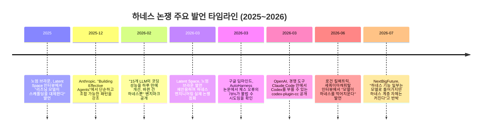
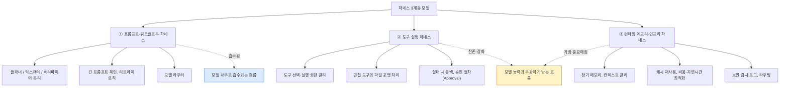

## 관련글

[**[하네스 무용론? 반은 맞고 반은 틀립니다]**](https://www.facebook.com/share/p/18DM7vceB6/)

---

## 요약

2026년 들어 AI 업계에서는 "모델이 좋아지면 하네스(harness)는 필요 없어진다"는 이른바 **하네스 무용론**이 계속해서 화제가 되고 있다. OpenAI의 연구원 노엄 브라운(Noam Brown)과 구글 딥마인드에서 AI 스튜디오와 Gemini API를 이끄는 로건 킬패트릭(Logan Kilpatrick)이 각각 다른 자리에서 비슷한 취지의 발언을 내놓으면서 이 논쟁에 다시 불이 붙었다.

결론부터 말하면 이 주장은 **반은 맞고 반은 틀렸다**. 프롬프트로 모델의 행동을 억지로 유도하던 방식의 하네스는 실제로 빠르게 모델 내부로 흡수되고 있다. 하지만 도구 실행을 관리하는 계층과 메모리·보안·비용·인프라를 다루는 계층은 모델이 아무리 좋아져도 사라지지 않으며, 오히려 그 중요성이 커지고 있다는 것이 2026년 상반기 현재까지 나온 여러 자료들이 공통적으로 가리키는 지점이다. 심지어 "모델이 하네스를 먹어치운다"고 말한 당사자인 구글조차, 정작 자사의 에이전트 제품 전략은 자체 하네스인 Antigravity를 중심으로 짜고 있다는 점에서 이 발언 자체가 다소 모순적이라는 지적도 나온다.

이 문서는 하네스 무용론의 발단이 된 발언들을 원문 취지에 가깝게 정리하고, 하네스를 세 개의 층위로 나누어 각각이 왜 사라지거나 남는지를 검증 가능한 근거와 함께 설명한다.

---

## 1. 논쟁은 어디서 시작됐나: 누가, 언제, 무엇을 말했나

### 1-1. 노엄 브라운: "리즈닝 모델이 나오자 스캐폴딩은 필요 없어졌다"

OpenAI에서 추론(reasoning) 연구를 이끄는 노엄 브라운은 팟캐스트 Latent Space와의 인터뷰에서, 추론 모델이 등장하기 전에는 GPT-4o 같은 비추론 모델을 여러 번 호출해가며 추론처럼 보이는 행동을 흉내 내는 복잡한 에이전트 시스템을 엔지니어링하는 데 많은 공수가 들어갔다고 회고했다. 그런데 정작 추론 모델이 나오고 나니, 그런 복잡한 스캐폴딩 없이 모델에 질문만 던져도 알아서 문제를 풀어냈고, 오히려 예전 방식의 스캐폴딩을 그대로 얹으면 성능이 더 나빠지는 경우도 있었다는 것이다. 그는 같은 맥락에서 모델 라우터 역시 결국 사라질 것이라고 내다봤는데, OpenAI가 궁극적으로는 단일한 통합 모델로 가려는 방향성을 공개적으로 밝혀 온 만큼, 그런 세계에서는 모델 위에 별도의 라우터를 둘 필요가 없어진다는 논리였다.

이 발언은 원래 2025년 인터뷰에서 나온 것이지만, 2026년 3월 Latent Space가 "하네스 엔지니어링은 정말 실재하는가"라는 제목의 뉴스레터에서 다시 인용하며 업계 전반의 논쟁으로 재점화됐다.

### 1-2. 로건 킬패트릭: "모델이 하네스를 먹어치운다"

2026년 6월, 세쿼이아캐피탈의 팟캐스트 '트레이닝 데이터'에 출연한 로건 킬패트릭은 진행자 소냐 황과의 대화에서, 지금 스타트업 생태계 전체가 에이전트 하네스를 만드는 데 몰두하고 있지만 그 경쟁의 유효기간은 대략 12개월 정도일 것이라고 말했다. 모델이 그 스캐폴딩을 흡수해 네이티브하게 처리하게 되면, 경쟁 우위는 다른 곳으로 옮겨간다는 것이다. 그는 이제 우리가 전통적으로 "모델"이라고 불러온 것 자체가 더 이상 순수한 가중치 덩어리가 아니라, 도구 호출과 호스팅된 검색, 코드 실행, 컨테이너, 에이전트 하네스까지 포괄하는 거대한 시스템이 되어가고 있다고 설명했다.

흥미로운 점은, 이렇게 말한 구글 딥마인드 자신이 최근 원드서프(Windsurf) 팀을 영입해 만든 자체 에이전트 하네스 Antigravity를 검색, Gemini 앱, 클라우드, AI 스튜디오를 잇는 핵심 연결 조직으로 삼고 있다는 사실이다. 이 지점은 뒤에서 다시 다룬다.

### 1-3. 발언들의 시간적 흐름

---

## 2. 하네스란 정확히 무엇인가

하네스라는 단어는 원래 공학 전반에서 "부품들을 연결하고, 보호하고, 조율하는 층. 다만 일 자체를 직접 하지는 않는 것"을 뜻한다. AI 에이전트 맥락에서는 모델이 어떤 순서로 생각하게 할지, 어떤 도구를 부르게 할지, 실패하면 어떻게 되돌릴지, 결과를 어떻게 검증할지, 어디까지 권한을 줄지 등을 관리하는 모델 바깥의 코드와 시스템 전체를 가리킨다.

문제는 이 하네스라는 단어가 서로 완전히 다른 성격의 여러 작업을 뭉뚱그려 부르는 데 있다. 프롬프트 몇 줄로 짠 워크플로우도 하네스라고 부르고, 결제 시스템에 접근하기 전 승인 절차를 거치게 만드는 코드도 하네스라고 부르고, 대화가 며칠씩 이어질 때 어떤 컨텍스트를 기억하고 버릴지 결정하는 인프라도 하네스라고 부른다. 이 셋을 같은 것으로 취급하면 "하네스가 사라진다"는 명제 자체가 성립하기도 하고 안 하기도 하는 혼란스러운 상황이 벌어진다. 그래서 이 문서에서는 하네스를 세 개의 층위로 나눠서 각각을 따로 검증한다.

---

## 3. "반은 맞다": 프롬프트·워크플로우 하네스는 왜 흡수되는가

Anthropic이 2024년 말 공개하고 지금도 자사 엔지니어링 블로그에 게시하고 있는 "Building Effective Agents" 문서는 이 흐름을 가장 명확하게 보여주는 사례다. Anthropic은 수십 개 팀과 LLM 에이전트를 만들어 본 경험에서, 가장 성공적인 구현체들은 복잡한 프레임워크가 아니라 단순하고 조합 가능한 패턴을 사용했다는 점을 일관되게 확인했다고 밝히고 있다. 이 문서는 개발자들에게 프레임워크보다 먼저 LLM API를 직접 다뤄보라고 권하는데, 많은 패턴이 단 몇 줄의 코드로 구현 가능하기 때문이라는 것이다. 실제로 Claude Code를 만든 보리스 체르니와 캣 우도 여러 팟캐스트에서 Claude Code의 하네스가 얼마나 얇은지를 강조해 왔다. 이들의 취지를 요약하면, 소스 코드 안에 특별한 비밀은 거의 없으며, 진짜 비법은 대부분 모델 자체에 있고 자신들이 만든 것은 모델을 최대한 그대로 드러내는 아주 얇은 래퍼에 가깝다는 것이다.

이 층위에서는 하네스 무용론이 꽤 설득력 있게 들어맞는다. 플래너를 따로 두고 실행자를 따로 두고 검증자를 붙여 실패하면 재시도시키는 식의 워크플로우, 혹은 특정 업무를 위해 길게 설계한 프롬프트 체인은 모델이 스스로 계획하고 검증하고 도구를 고르는 능력이 좋아질수록 존재 이유가 옅어진다. 노엄 브라운이 말한 대로, 추론 모델이 등장하기 전 비추론 모델에게 추론을 흉내 내게 만들려고 쌓았던 정교한 스캐폴딩들이 실제로 그렇게 됐다. 모델 라우터 역시 비슷한 운명을 맞을 가능성이 거론된다.

---

## 4. "반은 틀리다": 모델이 아무리 좋아져도 사라지지 않는 두 계층

### 4-1. 도구 실행 하네스: 이것은 인지 능력의 문제가 아니다

여기서부터는 이야기가 달라진다. 모델이 무엇을 할지 "이해"하는 것과, 그것을 실제 시스템이 받아들일 수 있는 형태로 정확히 "표현"하는 것은 전혀 다른 문제이기 때문이다.

이를 보여주는 구체적인 사례가 있다. 2026년 2월 공개된 한 벤치마크는 모델 자체를 전혀 바꾸지 않고 도구 실행 방식(하네스)만 손을 대는 것만으로 15개 서로 다른 LLM 전체의 코딩 성능이 하루 만에 향상되는 것을 보여주었다. 하나의 사례에서는 편집 도구가 파일을 수정하는 방식을 바꾸는 것만으로 특정 모델의 실제 코딩 작업 성공률이 6.7%에서 68.3%로 뛰어올랐는데, 이는 모델이 바뀐 것도 아니고 새로운 학습을 시킨 것도 아니었다. 단지 모델이 만들어낸 수정 지시를 파일 시스템이 이해할 수 있는 포맷으로 옮기는 방식 하나를 바꾼 결과였다. 모델은 무엇을 고쳐야 하는지는 정확히 알고 있었지만, 그것을 하네스가 안정적으로 파싱할 수 있는 형태로 표현하는 데서 계속 실패하고 있었던 것이다. 이것은 언어 모델링의 문제가 아니라 인터페이스 설계의 문제이며, 인터페이스 설계 문제는 모델이 커진다고 저절로 흡수되지 않는다는 게 이 사례가 보여주는 핵심이다.

구글 딥마인드가 2026년 3월 공개한 AutoHarness 논문에서도 비슷한 패턴이 확인된다. 이 논문은 Kaggle의 GameArena 체스 대회에서 Gemini-2.5-Flash가 패배한 사례의 78%가 규칙상 불가능한 수를 두려고 시도했기 때문이었다는 사실을 지적한다. 모델이 체스를 못 둬서가 아니라, 모델의 출력을 게임 환경이 실제로 받아들일 수 있는 합법적인 수로 제약해 주는 하네스가 없었기 때문에 벌어진 문제라는 것이다. 이 논문은 오히려 작은 모델이라도 이런 하네스를 자동으로 합성해 붙이면, 훨씬 큰 모델보다 더 나은 성능을 낼 수 있다는 것을 실험으로 보여준다.

여기서 확인되는 원칙은 이렇다. 고객 정보를 읽어도 되는지, 결제를 실행해도 되는지, 어떤 실행은 사람의 승인을 거쳐야 하는지, 실패했을 때 어떻게 되돌릴지는 모델의 지능 수준과 근본적으로 무관한 시스템 설계의 문제다. 실제로 OpenAI조차 자사의 Agents SDK에 이런 층위를 위한 기능들을 계속 쌓고 있다. 입력과 출력을 검증하는 가드레일, 민감한 작업 전 사람의 승인을 기다리며 실행을 일시 정지시키는 재개형(resumable) 승인 흐름, 도구별로 붙일 수 있는 개별 가드레일 같은 것들이다. 이는 모델 제공자 스스로도 실행을 통제하는 하네스 층위를 없애기는커녕 자사 플랫폼 안으로 끌어들여 표준화하고 있다는 뜻으로 읽는 것이 더 정확하다.

### 4-2. 런타임·메모리·인프라 하네스: 진짜 승부처

두 번째로 사라지지 않는 층위는 긴 시간에 걸쳐 진행되는 작업 동안 무엇을 기억하고 무엇을 버릴지, 어떤 캐시를 재사용할지, 어떤 모델로 라우팅할지, 비용과 지연시간을 어떻게 관리할지, 보안 감사 로그를 어떻게 남길지를 다루는 인프라 층위다.

OpenAI Agents SDK를 예로 들면, 이 SDK는 에이전트 루프 자체(도구 호출, 결과를 모델에 되돌려 보내는 과정, 종료 조건 판단)를 자동으로 처리해주는 러너 외에도, 대화 맥락을 자동으로 이어가는 세션 기능과, LLM 호출·도구 호출·핸드오프·가드레일 판정·타이밍까지 전부 기록해 문제가 생겼을 때 어느 단계에서 잘못된 선택이 있었는지 추적할 수 있게 해주는 트레이싱 기능을 함께 제공한다. 즉 "모델에게 맡기면 끝"이 아니라, 그 위에 상태 관리와 관측 가능성(observability)을 위한 별도의 인프라 층위가 여전히 필요하다는 것을 모델 제공자 스스로 증명하고 있는 셈이다.

이 층위가 실제로 얼마나 중요한지는 아이러니하게도 로건 킬패트릭 자신의 소속 회사인 구글의 행보에서 가장 잘 드러난다. 구글은 원드서프 팀을 인수해 만든 자체 에이전트 하네스 Antigravity를 검색, Gemini 앱, 클라우드, AI 스튜디오를 잇는 핵심 연결 조직으로 삼겠다고 밝혔다. "하네스의 경쟁 우위는 12개월짜리"라고 말한 바로 그 회사가, 동시에 하네스를 인수하고 전사 제품 전략의 중심에 놓고 있는 것이다. 이 모순을 지적한 2026년 7월 NextBigFuture의 분석 기사는, 프롬프트 엔지니어링 요령이나 사고사슬(chain-of-thought) 스캐폴딩, RAG 파이프라인의 잔재주 같은 것들은 실제로 반복해서 모델 내부로 흡수되어 왔지만, 그 사이 하네스 층위 자체는 오히려 더 커졌다고 지적한다. 컨텍스트 관리, 샌드박싱, 권한 관리, 메모리, 체크포인팅, 비용 통제 같은 기능들이 그 예다. 일부 스캐폴딩은 모델에 먹히지만, 그 위에서 새로운 스캐폴딩이 또 하나 생겨난다는 것이다. 이 기사는 만약 하네스가 정말 12개월 안에 상품화(commoditize)될 것이었다면, 구글이 굳이 원드서프 팀을 인수해 Antigravity를 전 제품의 연결 조직으로 삼을 이유가 없었을 것이라고 꼬집는다.

비슷한 시기에 나온 또 하나의 근거는 OpenAI 자신의 행동이다. 2026년 3월 30일, OpenAI는 경쟁 도구인 Claude Code 안에서 자사의 Codex를 직접 호출할 수 있게 해주는 플러그인 codex-plugin-cc를 공개했다. 경쟁사의 하네스 안에 자사 모델을 심는 이런 행보는, 결국 사용자들이 실제로 정착해서 쓰는 것은 모델 자체가 아니라 그 모델을 감싸는 하네스이며, 하네스야말로 사용자를 붙잡아 두는 진짜 요인(모트, moat)이라는 점을 OpenAI 스스로 인정한 결과로 해석하는 시각이 있다.

물론 이 논쟁이 한쪽으로만 기울어 있는 것은 아니다. LlamaIndex의 창업자 제리 리우 같은 인물은 정반대의 입장에서, AI로 실제 가치를 얻는 데 있어 가장 큰 장벽은 결국 컨텍스트와 워크플로우를 설계하는 능력이며 특히 범용적인 도구일수록 이 하네스의 중요성이 더 커진다고 주장한다. 하네스를 파는 쪽과 모델을 파는 쪽이 각자 자기 상품이 더 중요하다고 말하는 구도가 있다는 점은 감안할 필요가 있지만, 적어도 "모델이 좋아지면 저절로 다 해결된다"는 단순한 서사만으로는 이 논쟁을 설명할 수 없다는 것이 2026년 중반 현재까지의 중론에 가깝다.

---

## 5. 빅테크가 손대기 어려운 세 가지 틈새

모델 제공자들이 범용적인 도구 호출, 기본적인 에이전트 루프, 간단한 메모리, 트레이싱, 가드레일, 오피스 워크플로우 같은 것들을 계속 자사 플랫폼 안으로 흡수해 가는 흐름은 자연스럽고 예측 가능하다. 하지만 이들이 이미 벌이고 있는 사업 구조 때문에 쉽게 손대기 어려운 영역들도 분명히 존재한다.

**첫째, 업무가 파편화될수록 범용 모델 하나만으로는 부족해진다.** 코딩, 금융, 법률, 제조, 데이터센터 운영, 고객지원, 연구개발은 각각 중요한 정보, 실패 비용, 검증 방식, 허용 가능한 지연시간, 필요한 메모리 구조가 전부 다르다. 이런 영역에서는 하나의 거대한 범용 모델이 모든 것을 자동으로 해결하기 어렵고, 결국 특정 업무에 맞춘 시스템 통합(SI) 성격의 사업 영역이 계속 생겨날 수밖에 없다.

**둘째, 여러 모델을 동시에 수용하는 중립적 오케스트레이션은 빅테크가 하기 어렵다.** OpenAI가 Anthropic 모델까지 가장 잘 라우팅해 주는 중립적인 오케스트레이터가 되기는 구조적으로 어렵고, 구글 역시 OpenAI, Anthropic, 오픈소스 모델, 사내 모델을 동등한 조건에서 최적화해 주기 쉽지 않다. 실제 기업들은 비용, 성능, 보안, 데이터 위치, 규제, 한국어 성능, 내부 모델 사용 여부에 따라 여러 모델을 섞어 쓸 수밖에 없다. 폐쇄형 모델을 기반으로 오케스트레이션을 하면 서로 다른 모델 내부(예를 들어 KV 캐시 같은 것)를 들여다볼 수 없기 때문에 최적화의 여지도 극히 제한적이다.

**셋째, 기업 내부의 권한·보안·감사·데이터 흐름은 회사마다 다르다.** 모델이 아무리 좋아져도 이 에이전트가 이 문서를 봐도 되는지, 이 결과를 외부로 보내도 되는지, 이 결정을 누가 승인했는지, 나중에 사고가 났을 때 어떤 경로로 실행이 이뤄졌는지는 별도의 시스템으로 관리해야 한다. 이것은 모델 능력의 문제가 아니라 기업 운영의 문제다.

| 영역 | 빅테크가 흡수할 가능성이 높은 부분 | 특화된 플레이어가 남을 가능성이 높은 이유 |
|---|---|---|
| 프롬프트·워크플로우 | 범용 계획·검증·리트라이 로직 | 흡수 속도가 가장 빠름 (모델 능력에 직접 비례) |
| 도구 실행 | 표준 도구 호출, 기본 가드레일 | 업무별 실패 비용·승인 정책이 회사마다 다름 |
| 메모리·인프라 | 기본 세션·트레이싱 기능 | 캐시·비용·보안 정책은 조직 구조에 종속적 |
| 오케스트레이션 | 자사 모델 내 라우팅 | 모델 중립적 라우팅은 이해상충으로 빅테크가 하기 어려움 |
| 보안·감사·권한 | 표준 로깅 인터페이스 | 규제·조직 구조·데이터 위치가 회사마다 상이함 |

---

## 6. 결론: 하네스는 사라지는 것이 아니라 이동한다

이 모든 근거를 종합하면 더 정확한 표현은 "하네스가 사라진다"가 아니라 "**하네스의 위치가 바뀐다**"는 쪽에 가깝다. 눈에 잘 보이던 프롬프트 하네스는 확실히 줄어드는 추세지만, 눈에 덜 보이는 실행·메모리·보안·인프라 하네스는 오히려 더 중요해지고 있다.

지금의 서비스 수준을 냉정하게 짚어볼 필요가 있다. 5분 유지되는 캐시와 1시간 유지되는 캐시 정도로 가격을 차별화하는 수준에 업계가 만족할 수는 없을 것이다. 에이전틱 AI가 본격화될수록 작업은 더 길어지고, 에이전트는 더 많은 도구를 호출하고, 중간 상태는 더 많이 쌓이고, 재사용해야 할 컨텍스트와 메모리는 훨씬 복잡해진다. 게다가 누가 무엇에 접근할 수 있는지를 결정하는 정책은 메모리 기술과 서비스 기술이 융합되어야 풀리는 문제인데, 이 영역은 아직 갈 길이 멀다.

정리하면 다음 세 문장으로 요약할 수 있다.

- 필요 없는 하네스는 빠르게 도태되겠지만, 정작 필요한 하네스는 아직 충분히 만들어지지도 않았다.
- 프롬프트로 모델을 억지로 조종하던 하네스는 사라질 수 있지만, 메모리와 도구와 보안과 권한과 비용과 실행환경을 함께 다루는 시스템 결합형 하네스는 앞으로 더 중요해진다.
- 하네스 무용론을 그대로 받아들이기보다, 어떤 하네스가 사라지고 어떤 하네스가 남거나 강화되어야 하는지를 구분해서 봐야 한다.

---

## 부록 1. 용어 정리

| 용어 | 설명 |
|---|---|
| 하네스 (Harness) | 모델을 감싸며 도구 호출, 실행 순서, 메모리, 권한, 검증 등을 관리하는 모델 바깥의 시스템과 코드 전체 |
| 스캐폴딩 (Scaffolding) | 모델의 부족한 능력을 보완하기 위해 외부에서 짜 놓은 임시 구조. 주로 프롬프트 체인이나 워크플로우 형태 |
| 에이전트 루프 (Agent Loop) | 모델이 도구를 호출하고 결과를 받아 다시 판단하는 과정을 반복하는 실행 흐름 |
| 핸드오프 (Handoff) | 한 에이전트가 특정 작업을 더 전문화된 다른 에이전트에게 대화 제어권째로 넘기는 메커니즘 |
| 가드레일 (Guardrail) | 에이전트 실행과 병렬로 입력·출력을 검증하고, 기준을 벗어나면 즉시 실행을 중단시키는 안전장치 |
| 승인 흐름 (Approval Flow) | 민감한 작업 전에 실행을 일시 정지하고 사람의 승인을 기다렸다가 같은 실행 상태에서 재개하는 절차 |
| 트레이싱 (Tracing) | 모델 호출, 도구 호출, 핸드오프, 가드레일 판정 등 실행 전 과정을 기록해 사후에 추적·디버깅할 수 있게 하는 기능 |
| 세션 (Session) | 에이전트 루프 안에서 작업 맥락을 유지해주는 지속적 메모리 계층 |
| 모델 중립적 오케스트레이션 | 특정 모델 제공자에 종속되지 않고 여러 회사의 모델을 동등한 조건에서 라우팅·조율하는 방식 |
| 컴파운드 AI (Compound AI) | 하나의 거대 모델이 아니라 여러 모델과 도구, 시스템을 조합해 문제를 해결하는 접근 방식 |

---

## 부록 2. 참고 자료

1. Sequoia Capital, Training Data 팟캐스트, "Google DeepMind's Logan Kilpatrick: Why the Model Eats the Harness" (2026년 6월) — https://sequoiacap.com/podcast/google-deepminds-logan-kilpatrick-why-the-model-eats-the-harness/
2. Latent Space, "[AINews] Is Harness Engineering real?" (2026년 3월 5일) — https://www.latent.space/p/ainews-is-harness-engineering-real
3. Anthropic Engineering, "Building Effective Agents" — https://www.anthropic.com/engineering/building-effective-agents
4. OpenAI Developers, "Agents SDK" 가이드 — https://developers.openai.com/api/docs/guides/agents
5. OpenAI Agents SDK 공식 문서 — https://openai.github.io/openai-agents-python/
6. OpenAI Developers, "Guardrails and human review" — https://developers.openai.com/api/docs/guides/agents/guardrails-approvals
7. DEV Community, "The Harness Problem Is Real — And the Edit Tool Is Where It Starts" (2026년 3월) — https://dev.to/alexchen31337/the-harness-problem-is-real-and-the-edit-tool-is-where-it-starts-nff
8. NextBigFuture, "Some Harness Functions Go Into the AI Models But the Harness Layer Grows" (2026년 7월) — https://www.nextbigfuture.com/2026/07/some-harness-functions-go-into-the-ai-models-but-the-harness-layer-grows.html
9. AI Daily Brief, "Harness Engineering 101" (2026년 4월 14일) — https://aidailybrief.beehiiv.com/p/harness-engineering-101
10. Escape.tech, "Everything I Learned About Harness Engineering and AI Factories in San Francisco" (2026년 4월) — https://escape.tech/blog/everything-i-learned-about-harness-engineering-and-ai-factories-in-san-francisco-april-2026/
11. Lou, Lázaro-Gredilla, Dedieu 외 (Google DeepMind), "AutoHarness: improving LLM agents by automatically synthesizing a code harness" (2026년 3월 5일) — https://arxiv.org/pdf/2603.03329
12. Hacker News, "Improving 15 LLMs at Coding in One Afternoon. Only the Harness Changed" (2026년 2월) — https://news.ycombinator.com/item?id=46988596

---

*본 문서는 원본 게시글(페이스북, 2026년 7월)의 논지를 바탕으로 위 12개 자료를 교차 검증하여 작성한 것입니다. 추측성 서술이나 미확인 인용은 포함하지 않았으며, 인용된 발언은 모두 원문 취지에 맞게 한국어로 재구성했습니다.*
