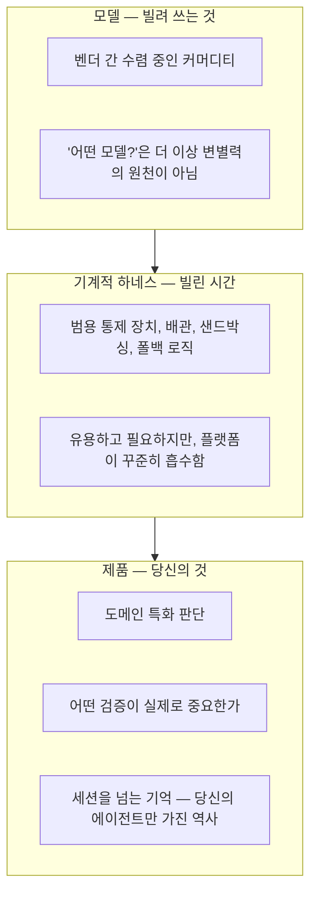
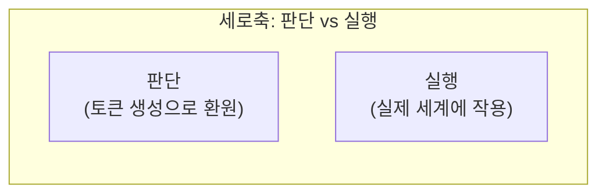

**— 정지훈의 "The Harness Is the Product" 에세이와 판단/실행 레이어 프레임워크는 어떻게 만나는가 —**

- 성격: 「코딩 하네스 논쟁」 시리즈 네 번째 문서. 벤처캐피털리스트 정지훈(Jihoon Jeong)이 발행한 에세이 "The Harness Is the Product"와, 이를 소개한 작성자 본인의 Facebook 코멘트를 검증하고, 세 번째 문서에서 정리한 판단/실행 레이어 프레임워크와 교차 비교합니다.
- 원문: Jihoon Jeong, "The Harness Is the Product," Medium (2026년 7월) — https://medium.com/@hiconcep/the-harness-is-the-product-96a3414f187e
- 저자 소개: 정지훈은 Asia2G Capital의 창립 파트너이며, AI·벤처캐피털·아시아 기술 산업 전환을 주제로 글을 씁니다. 이 글은 그가 진행 중인 "AI Engineering" 에세이 시리즈의 두 번째 편으로, 5~6편까지 이어질 예정이라고 밝혔습니다.

---

## 1. 왜 이 에세이가 지금 중요한가

> 
> https://www.facebook.com/share/p/1GxgVcABuC/
> 
> 지난 달 구글의 로건 킬패트릭이 세콰이어의 팟캐스트에서 "모델이 하네스를 먹어치운다"고 했습니다. 그 때는 그러려니 했는데, 이번 주 오픈AI의 노엄 브라운까지 "차세대 모델이 지금의 하네스 대부분을 쓸모없게 만들 것"이라 하면서 이게 기사화가 많이 되었네요. 
> 
> 아주 일리가 없는 이야기는 아니지만, 절반 정도만 동의합니다. 이유는 제가 직접 엄청나게 만들고 경험하면서 느낀 것이 너무 많거든요.
> 
> 올해 여러 프로젝트들을 하고 있는데, 그 중에서 환경 자체를 개선하고자 재미난 시도를 정말 많이 시도하고 있습니다. 여러 코딩 에이전트를 묶어 작업을 배분하는 오케스트레이션 레이어의 경우 비용 상한, 도구 제한, 폴백, 검증 등의 제어 장치를 만들어 넣어놓고, 그걸 이용해서 직접 나만의 터미널처럼 쓰기도 했습니다 (agent-grid 라고 부릅니다). 그런데, 그 터미널 자체의 업데이트는 이제 중단을 하고, 외부 공개도 계획했다가 안하기로 했습니다. 이유는 Claude 4.8 이 나오면서부터 사실 상 제가 넣었던 기능들이 플랫폼의 네이티브 기능으로 포함되는 것을 보니, 내가 파던 해자가 해자가 아닌 것 같은거죠. 이거 내가 굳이 할 필요가 없겠다 싶은 마음이 드니까, 다른 거나 하자~ 이렇게 되는거죠.
> 
> 그런 측면에서 하네스가 그런 식으로 될 것이라는 측면의 일부 진단은 동의하는 부분이 있습니다. 그런데 그들의 말과 행동은 매우 다르지요? 오픈AI는 세계에서 가장 성공한 오픈소스 하네스의 창시자를 영입했죠. 곧 쓸모없어질 것을 사들이는 회사가 있을까요? 구글은 자사 제품 전략의 중심에 자체 하네스를 놓고, 모델을 하네스와 함께 학습시키기까지 합니다. 해석하면 "모델이 하네스를 먹는다"의 진짜 뜻을 다시 해석하면, "우리 하네스가 너의 하네스를 먹는다." 고 해야할 겁니다. 하네스 자체에 대한 부정론이라 보기 어렵습니다.
> 
> 그리고 비용 문제도 미래에 중요하게 다뤄질 겁니다. 모든 걸 프론티어 모델의 최대 호출로 처리하는 건 선택 가능한 가장 비싼 아키텍처입니다. 물론 그렇게 쓰는 사람들도 많겠지만, 토큰의 가격이 올라가고 토큰을 많이 써야 한다면 이야기가 달라지겠죠? Langchain은 모델을 고정한 채 하네스만 바꿔서 벤치마크 30위권 밖에서 5위로 올라가게 만든 바 있는데, 이는 엄청난 추론 예산을 절감시킬 수 있는 부분입니다.
> 
> 결국 질문은 "하네스를 만들 것인가"가 아니라 "하네스의 어느 부분이 진짜 내 것으로 만들 수 있는가"입니다. 모델은 앞으로도 계속 빌려쓰게 될 것이고, 기계적인 중간 하네스 계층은 시한부로만 존재하게 될 겁니다. 흡수되지 않을 부분을 꼽는다면 도메인에 대한 판단, 그리고 내 에이전트만의 기억과 거기에서 파생되는 specialty가 되겠죠? AI Engineering 시리즈 에세이의 두 번쨰 글입니다. 원래 며칠 뒤에 발행하려고 했는데, 오늘 갑자기 하네스 논쟁이 뜨거워지길래 조금 일찍 발행합니다. 언제나처럼 영문 발행이지만, 관심있는 분들은 더 자세히 읽어보시겠지요. 이 시리즈 Part 5 / 6 정도까지 갈 예정입니다. 링크는 댓글에 ...

이전 문서(세 번째 문서, ["하네스 무용론, 이번엔 '판단과 실행을 분리하라'로 답한다"](https://k82022603.github.io/posts/%ED%95%98%EB%84%A4%EC%8A%A4-%EB%AC%B4%EC%9A%A9%EB%A1%A0,-%EC%9D%B4%EB%B2%88%EC%97%94-%ED%8C%90%EB%8B%A8%EA%B3%BC-%EC%8B%A4%ED%96%89%EC%9D%84-%EB%B6%84%EB%A6%AC%ED%95%98%EB%9D%BC%EB%A1%9C-%EB%8B%B5%ED%95%9C%EB%8B%A4/))에서 이미 다뤘듯, 최근 노엄 브라운과 로건 킬패트릭의 발언이 "하네스는 곧 사라진다"는 취지로 널리 회자되었습니다. 정지훈의 이번 에세이는 바로 이 두 발언— 특히 브라운이 최근 The Information과의 인터뷰에서 "몇 달 안에 나올 차세대 모델이 지금 하네스 대부분을 쓸모없게 만들 것"이라 말했다고 전해지는 것과, 킬패트릭의 "모델이 하네스를 먹어치운다"는 발언—을 정면으로 다루면서, "절반만 동의한다"는 입장을 취합니다. 그리고 그 근거로 (1) 검증 가능한 벤치마크 수치, (2) 저자 본인이 직접 하네스를 만들고 플랫폼에 흡수당한 경험, (3) 라이벌 두 회사의 실제 행동을 제시합니다.

이 논지는 세 번째 문서에서 정리한 "판단은 모델로 흡수되지만 실행은 남는다"는 프레임워크와 독립적으로 매우 유사한 결론에 도달하는데, 자르는 방식은 다릅니다. 이 문서는 두 프레임워크를 나란히 놓고 어디서 겹치고 어디서 다른지를 짚습니다.

---

## 2. 에세이 요약: 하네스는 왜 "해자"가 아닌가

### 2.1 출발점: 검증 가능한 벤치마크 두 건

에세이는 자신의 실험실 결과 하나(작은 모델이 셸 하나만 바꿔서 특정 계획 과제를 0%에서 100% 통과로 바꾼 사례)를 소개하되, 그것만으로 논지를 세우지 않겠다며 곧바로 제3자가 공개 발표한 벤치마크로 넘어갑니다.

- **LangChain의 Terminal-Bench 2.0 사례**: LangChain은 2026년 초, 자사 코딩 에이전트(deepagents-cli)를 89개의 실제 커맨드라인 과제로 구성된 벤치마크 Terminal-Bench 2.0에서 Top 30위 밖 수준(52.8%)에서 Top 5(66.5%)로 끌어올렸습니다. 이 과정에서 기반 모델(GPT-5.2-Codex)은 전혀 바꾸지 않았습니다. 바뀐 것은 시스템 프롬프트, 도구 구성, 그리고 미들웨어— 즉 하네스뿐이었습니다. LangChain 자신들의 공식 블로그 글에 따르면, 이 개선은 자기검증 루프, 루프 감지 미들웨어(같은 실수를 반복하는 "죽음의 루프" 탐지), 그리고 트레이스(실행 기록) 기반 실패 패턴 분석을 통해 이루어졌습니다.
- **Stanford IRIS Lab의 후속 결과**: 이 결과가 나오고 몇 주 뒤, 스탠퍼드 IRIS 연구실은 "Meta-Harness"라는 자동 하네스 진화 시스템을 고정된 모델(Claude Opus 4.6)과 결합해 같은 벤치마크에서 76.4%를 기록했습니다. 이는 사람이 손으로 설계한 모든 하네스를 능가하는 결과였습니다.

정지훈은 이 두 사례를 나란히 놓고, "같은 가중치인데 순위가 서른 계단 차이"라는 사실이 자신의 실험실 결과가 이상치가 아니라 벤치마크 규모에서도 재현되는 현상임을 보여준다고 말합니다.

### 2.2 하네스의 다섯 가지 일

에세이는 하네스가 실제로 하는 일을 다섯 가지로 분해합니다.

1. **컨텍스트 관리**: 매 턴 모델에게 무엇을 보여줄지 결정하는 일. 에이전트 입장에서는 컨텍스트에 없는 것은 존재하지 않는 것과 같다는 원칙이 핵심입니다.
2. **도구 오케스트레이션**: 어떤 도구를 언제 쓸 수 있게 할지, 그 출력이 어떻게 다시 흘러들어가는지 설계하는 일.
3. **메모리 관리**: 한 턴 안의 초 단위 기억부터 몇 달짜리 프로젝트의 기억까지, 서로 다른 시간 척도를 다루는 일. 에세이는 여기서 이미 "세션 단위로 설계된 하네스는 긴 시간축의 기억을 다룰 자연스러운 자리가 없다"는 문제를 짚어둡니다.
4. **권한 통제**: 에이전트가 사람 없이 혼자 할 수 있는 일과, 사람의 손이 스위치에 있어야 하는 일을 가르는 안전장치.
5. **관측가능성(Observability)**: 에이전트가 실제로 무엇을 했는지 추적·기록하는 일. 나머지 네 가지를 개선하려면 이게 전제 조건이라는 점도 짚습니다.

### 2.3 "해자(moat)"라는 표현이 틀린 이유: 저자 본인의 경험

여기서부터가 에세이의 개인적 파트입니다. 정지훈은 올해 여러 코딩 에이전트(주요 터미널 CLI들)를 묶어 작업을 배분하는 오케스트레이션 레이어를 직접 만들었다고 밝힙니다. 이 레이어에는 실행당 비용 상한, 도구 접근 제한, 승인 없이 진행하는 모드, 과부하 시 다른 에이전트로 전환하는 폴백, 결과를 다음 단계로 넘기기 전 검증하는 절차— 즉 앞서 말한 다섯 가지 일 중 상당 부분—를 손수 구현해 넣었습니다.

그런데 몇 달에 걸쳐, 그가 직접 짠 이 통제 장치들이 플랫폼 쪽에 하나씩 흡수되는 것을 지켜봐야 했습니다. 그가 워커 레이어에 넣었던 비용 상한은 에이전트 자체의 네이티브 예산 통제 기능이 되었고, 도구 제한은 일급 시민 수준의 "허용 도구" 플래그가 되었으며, 승인 없는 실행은 그냥 설정으로 켤 수 있는 모드가 되었고, 과부하 시 다른 모델로 넘어가는 폴백은 설정 옵션으로 출시되었습니다. 그리고 그가 조립하고 있던 전체 자율 제어 구조— 에이전트를 실행하고, 결과를 확인하고, 목표를 향해 계속 나아가는 것— 자체가 그가 감싸고 있던 도구들 안에 네이티브 목표·루프 명령으로 탑재되기 시작했습니다.

그는 이 경험에서 "harness is moat"를 대체할 문장을 얻었다고 말합니다: **플랫폼이 곧 흡수할 것을 만들지 말라.** 하네스 공학의 상당 부분— 아마 그 기계적인 중간 부분 대부분— 은 플랫폼의 로드맵과 벌이는 경주이고, 플랫폼이 더 빠르다는 것입니다. 누구에게나 도움이 될 만큼 일반적인 것이라면, 플랫폼이 그것을 출시할 만큼도 일반적이라는 뜻입니다.

### 2.4 "말을 보지 말고 행동을 보라": 재해석된 "모델이 하네스를 먹는다"

에세이 후반부는 이 문서 시리즈의 세 번째 문서와 거의 같은 결을 다룹니다. 노엄 브라운이 The Information과의 인터뷰에서 차세대 모델이 지금 하네스 대부분을 쓸모없게 만들 것이라 말했고, 킬패트릭도 Sequoia 팟캐스트에서 비슷한 취지로 "모델이 하네스를 먹어치운다"고 말했다는 것을 언급합니다.

정지훈은 이 발언들이 "기계적인 중간 부분"에 대해서는 맞다고 인정합니다. 그러나 말이 아니라 행동을 보라고 주장합니다. **OpenAI는 세계에서 가장 성공한 오픈소스 하네스의 창시자를 자사로 영입했습니다.** (2026년 2월 Peter Steinberger가 OpenAI 합류를 발표한 사건을 가리키는 것으로 보이며, 그가 만든 OpenClaw(옛 Clawdbot)는 2026년 3월 기준 50개 이상의 통합을 지원하는, 가장 인기 있는 서드파티 AI 에이전트 프레임워크 중 하나로 꼽혔던 프로젝트입니다.) 곧 쓸모없어질 것을 회사가 사들이지는 않는다는 것이 그의 논리입니다. 한편 구글은 자사 제품 전략의 중심에 자체 하네스(Antigravity)를 놓고, 모델을 그 하네스와 함께 공동 학습시키고 있습니다. 그는 이를 이렇게 재해석합니다: "모델이 하네스를 먹는다"의 진짜 뜻은 **"우리 하네스가 너의 하네스를 먹는다"** 라는 것입니다. 이는 하네스에 대한 허무주의가 아니라 하네스의 통합(consolidation)이라는 것이 그의 결론입니다.

그는 여기에 경제적 논거도 덧붙입니다. 모든 작업을 최대 성능의 프론티어 모델 호출로 처리하는 것은 선택 가능한 아키텍처 중 가장 비쌉니다. LangChain의 벤치마크 개선도 "더 큰 모델을 사라"가 아니라 "고정된 모델을 하네스로 훨씬 낫게 만든" 사례였습니다. 비용 상한, 캐싱, 쉬운 작업을 작은 모델로 보내는 라우팅, 계속 진행하기 전 검증하는 절차— 이런 것들은 전부 하네스의 일이며, 프론티어 추론이 사실상 공짜가 되지 않는 한 누군가는 이 일을 해야 한다는 것입니다.

### 2.5 결론: 제품은 판단과 기억이다

에세이의 최종 결론은 이렇습니다. 하네스는 해자가 아니라 **제품**입니다. 다만 하네스 전체가 제품인 것이 아니라, 플랫폼이 흉내 낼 수 없는— 당신에게 고유한 부분만 그렇습니다. 똑같은 모델과 똑같은 플랫폼 기본 기능을 받아도 두 팀은 서로 다른 에이전트를 만들어낼 것이고, 그 차이는 플랫폼이 설정 플래그 하나로 넣어줄 수 없는 것들— 당신의 도메인에 맞게 컨텍스트를 구성하는 방식, 당신의 작업에서 실제로 중요한 검증이 무엇인지, 어떤 범용 가드레일도 담아내지 못하는 "당신의 에이전트가 하지 말아야 할 일에 대한 판단"— 에서 나온다는 것입니다.

그리고 다섯 가지 일 중 유독 하나— **메모리**— 만이 이 재배치에서 예외라고 짚습니다. 나머지 넷(컨텍스트, 도구, 권한, 관측가능성)은 전부 세션 안에서 일어나는 일이라 일반적이고, 그래서 플랫폼에 흡수되고 있습니다. 반면 메모리는 세션을 가로질러 누적되어야 하고, 당신의 에이전트가 쌓아온 특정한 역사의 기록이기 때문에 본질적으로 당신만의 것입니다. 플랫폼이 플래그 하나로 건네줄 수 있는 범용 인프라가 아니라는 것입니다. 그리고 아이러니하게도, 지금의 세션 중심 하네스가 가장 서투르게 다루고 있는 부분이 바로 이 메모리라고 지적하며, 이 문제는 시리즈의 다음 편에서 다루겠다고 예고합니다.

---

## 3. 두 프레임워크 교차 비교: 판단/실행 vs 다섯 가지 기능

세 번째 문서에서 정리한 프레임— "토큰 생성으로 환원되는 판단은 모델로 흡수되고, 실제 세계에 작용을 가하는 실행은 하네스에 남는다"—과 이 에세이의 프레임— "세션 안에 갇혀 있어 일반적인 네 가지 기능은 흡수되고, 세션을 넘어서는 메모리는 남는다"—은 서로 다른 축으로 문제를 자릅니다. 그런데 결론은 상당 부분 겹칩니다. 이 겹침과 차이를 표로 정리하면 다음과 같습니다.

| | 판단/실행 레이어 프레임 (세 번째 문서) | 다섯 가지 기능 프레임 (이 에세이) |
|---|---|---|
| 분류 기준 | 토큰 생성으로 환원되는가 | 세션 안에 갇혀 일반적인가, 세션을 가로지르는가 |
| 흡수되는 것 | 판단(계획, 검증, 도구 선택, 위임 결정) | 컨텍스트, 도구, 권한, 관측가능성 |
| 남는 것 | 실행(프로세스 구동, API 호출, 권한 집행, 감사 로그) | 메모리(세션을 넘는 누적된 기억) |
| "남는 것"의 성격 | 실제 세계에 물리적으로 작용을 가하는 행위 그 자체 | 시간을 가로질러 누적되는 상태, 그리고 그로부터 파생되는 도메인 판단 |
| 겹치는 지점 | 권한 집행·감사 로그는 실행이자 동시에 "세션을 넘어 남아야 하는 기록"이기도 함 | 메모리를 "저장하는 행위"는 실행이고, "무엇을 기억할지 판단하는 것"은 판단에 가까움 |

여기서 흥미로운 지점은 두 프레임이 완벽히 겹치지 않는다는 것입니다. 에세이가 말하는 "권한 통제"와 "관측가능성"은 판단/실행 프레임에서 보면 명백히 **실행**에 속합니다(권한을 실제로 차단하는 것, 로그를 실제로 남기는 것은 토큰 생성으로 환원되지 않습니다). 그런데 에세이는 이 둘을 "세션 안에 갇혀 있어 일반적이므로 흡수된다"는 쪽에 넣습니다. 즉 에세이의 주장을 판단/실행 프레임으로 다시 읽으면 이렇게 됩니다: **실행 레이어 안에서도, 일반적이고 표준화 가능한 실행(권한 플래그, 표준 로깅 포맷)은 플랫폼이 흡수하지만, 조직·개인마다 다른 실행 판단(무엇을 왜 차단할지, 무엇을 왜 기록해야 하는지에 대한 도메인 특화 결정)은 남는다.**

다시 말해, "판단이냐 실행이냐"만으로는 설명이 완전하지 않고, 여기에 **"그 실행/판단이 얼마나 일반적인가, 아니면 당신의 맥락에 고유한가"** 라는 두 번째 축이 필요합니다. 이 두 축을 겹쳐 보면 다음과 같은 2x2가 나옵니다.

| | 일반적(범용) | 고유함(도메인 특화) |
|---|---|---|
| **판단** | 흡수됨 — 브레인스토밍, 계획 수립, 일반적 코드 리뷰 판단 | 남음 — "우리 도메인에서 무엇이 진짜 검증인가"에 대한 판단 |
| **실행** | 흡수됨 — 표준 비용 캡, 표준 allowed-tools 플래그, 표준 폴백 설정 | 남음 — 조직 고유의 권한 정책 집행, 규제 대응 감사 로그 설계, 세션을 넘는 메모리 저장·관리 |

이 2x2로 보면, "왼쪽 열(일반적인 것)은 모두 흡수되고, 오른쪽 열(고유한 것)은 판단이든 실행이든 남는다"는 것이 두 프레임을 통합하는 더 정확한 결론이 됩니다. 세 번째 문서와 이 에세이 둘 다 "무엇이 남는가"에 대해 궁극적으로는 같은 곳— 도메인에 고유한 판단, 그리고 그 판단이 누적되어 남긴 기억과 실행 기록— 을 가리키고 있었던 셈입니다.

---

## 4. 작성자님의 Facebook 코멘트: 실전에서 확인한 사례

작성자님은 이 에세이를 소개하며 본인의 실제 경험을 덧붙였습니다. 올해 여러 코딩 에이전트를 묶어 작업을 배분하는 오케스트레이션 레이어("agent-grid"라 명명)를 직접 만들어, 비용 상한·도구 제한·폴백·검증 같은 제어 장치를 넣고 개인 터미널처럼 사용해왔다고 밝혔습니다. 그런데 Claude 4.8이 나오면서 자신이 넣었던 기능들이 플랫폼의 네이티브 기능으로 편입되는 것을 보고, 이 도구의 업데이트를 중단하고 외부 공개 계획도 접었다고 합니다. "내가 파던 해자가 해자가 아니었다"는 판단이었다는 것입니다.

이는 에세이 저자 본인이 겪은 경험— 워커 레이어에 손수 넣었던 통제 장치들이 하나씩 플랫폼 네이티브 기능으로 흡수되는 것을 지켜본 것— 과 정확히 같은 패턴입니다. 서로 다른 두 사람이 2026년 상반기 동안, 서로 다른 프로젝트에서, 같은 현상을 독립적으로 겪었다는 점이 이 논지에 무게를 더합니다. 작성자님은 여기서 한 걸음 더 나아가 이렇게 정리했습니다: 이제 질문은 "하네스를 만들 것인가"가 아니라 "하네스의 어느 부분이 진짜 내 것이 될 수 있는가"이며, 모델은 앞으로도 계속 빌려 쓰게 될 것이고 기계적인 중간 하네스 계층은 시한부로만 존재할 것이되, 흡수되지 않을 부분은 도메인에 대한 판단과 에이전트만의 기억이라는 것입니다. 이는 에세이의 결론과 정확히 같은 지점에 도달한 것이며, 동시에 세 번째 문서의 판단/실행 프레임과도 맞닿아 있습니다.

---

## 5. 용어집 (이 문서 추가분)

- **하네스 다섯 기능(Five Jobs of a Harness)**: 이 에세이가 제시한 분해— 컨텍스트 관리, 도구 오케스트레이션, 메모리 관리, 권한 통제, 관측가능성.
- **Meta-Harness**: Stanford IRIS Lab이 만든, 고정된 모델 위에서 하네스 자체를 자동으로 진화시키는 시스템.
- **트레이스(Trace)**: 에이전트의 실행 과정을 기록한 로그로, 실패 패턴을 찾아 하네스를 개선하는 데 쓰이는 원자재. LangChain이 자사 벤치마크 개선의 핵심 도구로 언급했습니다.
- **일반성(Genericity)**: 이 문서에서 통합적으로 사용한 개념으로, 어떤 기능이 얼마나 많은 사용자·조직에 공통으로 적용 가능한지를 가리킵니다. 일반적일수록 플랫폼이 네이티브 기능으로 흡수할 유인이 커집니다.

---

## 6. 팩트체크 노트

- **1차/복수 매체로 확인됨**: LangChain의 Terminal-Bench 2.0 성과(52.8%→66.5%, Top 30 밖→Top 5, 모델 GPT-5.2-Codex 고정)는 LangChain 공식 블로그(langchain.com/blog/improving-deep-agents-with-harness-engineering)와 다수의 독립 매체 보도로 교차 확인했습니다. Stanford IRIS Lab의 Meta-Harness가 같은 벤치마크에서 76.4%를 기록했다는 내용도 복수의 독립 매체(Medium, ZenML 등)에서 일관되게 확인됩니다.
- **정황상 신뢰도 높으나 원문 직접 확인은 못함**: 노엄 브라운이 The Information과의 인터뷰에서 "차세대 모델이 몇 달 안에 지금 하네스 대부분을 쓸모없게 만들 것"이라 말했다는 내용은, The Information이 구독제 매체라 이 문서 작성 과정에서 원문을 직접 열람하지 못했습니다. 다만 이는 브라운이 2025년 6월 Latent Space에서 밝힌 입장과 방향이 일치하고, 정지훈의 에세이가 이를 인용하고 있어 신빙성은 있다고 판단하되, 정확한 인용문 자체는 검증하지 못했음을 밝혀둡니다.
- **OpenAI의 Peter Steinberger 영입**: 이전 문서(두 번째 문서, 대기업 AX 관점)의 조사 과정에서 이미 확인한 사실로, 2026년 2월 14일 Peter Steinberger가 OpenAI 합류를 발표했고, 그가 만든 OpenClaw(옛 Clawdbot)는 2026년 3월 기준 50개 이상의 통합을 지원하는 인기 서드파티 에이전트 프레임워크였습니다. 정지훈의 에세이가 "세계에서 가장 성공한 오픈소스 하네스의 창시자"라고 표현한 인물이 이 사람을 가리키는 것으로 추정되나, 에세이 본문에 이름이 명시되지는 않아 이는 이 문서의 추정입니다.
- **3장의 2x2 통합 프레임**: 특정 논문이나 발표에서 가져온 것이 아니라, 이 문서에서 두 프레임(판단/실행, 다섯 기능)을 교차 비교하며 도출한 분석적 종합입니다.
- **작성자님의 "agent-grid" 프로젝트**: 개인 프로젝트로, 외부 검증 가능한 공개 자료가 없어 이 문서에서는 작성자님이 공유하신 내용을 그대로 정리했습니다.

---

## 7. 참고자료

- Jihoon Jeong, "The Harness Is the Product," Medium — https://medium.com/@hiconcep/the-harness-is-the-product-96a3414f187e
- LangChain, "Improving Deep Agents with harness engineering" — https://www.langchain.com/blog/improving-deep-agents-with-harness-engineering
- Rick Hightower, "LangChain's Harness Engineering: From Top 30 to Top 5 on Terminal Bench 2.0" — https://medium.com/@richardhightower/langchains-harness-engineering-from-top-30-to-top-5-on-terminal-bench-2-0-8895dbab4932
- Ewan Mak, "The Agent Harness: Why 70% of Your AI Agent's Performance Lives Outside the Model" (Stanford IRIS Lab Meta-Harness 76.4% 언급) — https://medium.com/@tentenco/the-agent-harness-why-70-of-your-ai-agents-performance-lives-outside-the-model-5093cfe03df1
- ZenML LLMOps Database, "Harness Engineering for Agentic Coding Systems" — https://www.zenml.io/llmops-database/harness-engineering-for-agentic-coding-systems
- (이전 문서) "하네스 무용론, 이번엔 '판단과 실행을 분리하라'로 답한다" — 이 시리즈 세 번째 문서, 판단/실행 레이어 프레임워크와 OpenAI·Google의 실제 행동 검증
- (이전 문서) "대기업 AX 관점에서 본 코딩 하네스 논쟁" — Peter Steinberger·OpenClaw·서드파티 도구 정책 관련 배경

---

*이 문서는 AI바이브코딩기초클래스 교육 자료로, 「코딩 하네스 논쟁」 시리즈의 네 번째 문서입니다. 정지훈님의 에세이는 원문 표현을 그대로 옮기지 않고 취지를 요약·재구성했으며, 원문의 정확한 뉘앙스가 필요하다면 위 링크의 원문을 직접 참고하시기 바랍니다. 3장의 2x2 통합 프레임은 이 문서 작성 과정에서의 분석적 종합입니다.*
