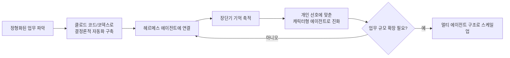
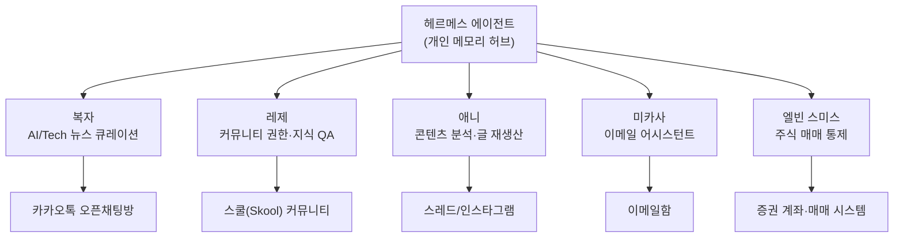
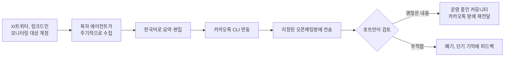
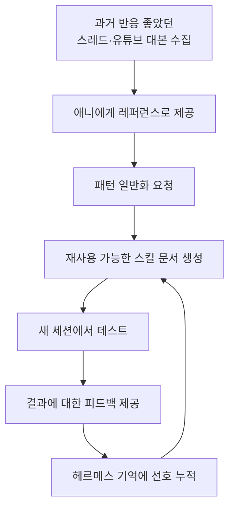
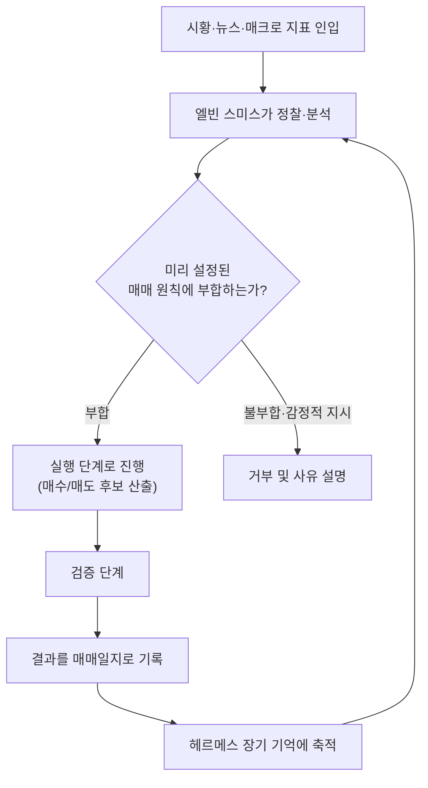
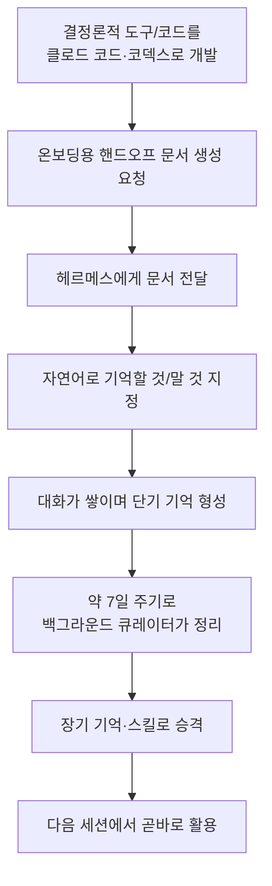
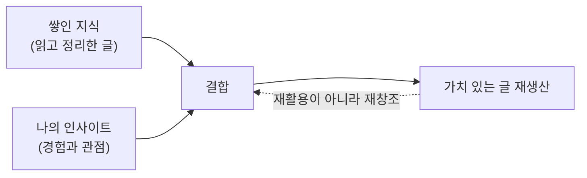

**원본:** HOW I AI PODCAST, [「헤르메스 에이전트 5개를 캐릭터별로 나눠서 혼자 일하는 방법, 실제 대화창까지 전부 공개합니다 (AI 엔지니어 샘 호트만님)」](https://www.youtube.com/watch?v=_Pd1G33_R48), 빌더 조쉬(Builder Josh) 채널, 2026년 7월 15일 공개

**정리 기준일:** 2026년 7월 16일

---

## 목차

1. 들어가며 — 이 영상은 무엇을 다루는가
2. 헤르메스 에이전트란 무엇인가 — 배경 지식 정리
3. 샘 호트만의 핵심 철학 — "결정론적 영역은 바깥에서, 기억만 헤르메스에게"
4. 다섯 캐릭터 에이전트 개관 — 복자·레제·애니·미카사·엘빈 스미스
5. 첫 번째 에이전트 「복자」 — 카카오톡 AI 뉴스 자동 큐레이션
6. 두 번째 에이전트 「레제」 — 커뮤니티 권한 관리와 위키 기반 상담
7. 세 번째 에이전트 「애니」 — 콘텐츠 분석 기반 글 재생산
8. 네 번째 에이전트 「미카사」 — 이메일 어시스턴트
9. 다섯 번째 에이전트 「엘빈 스미스」 — 감정을 배제한 주식 자동매매 통제 시스템
10. 헤르메스를 길들이는 법 — 온보딩 문서와 장단기 기억 셀프 임프루빙
11. 지식 관리(DX)의 궁극적 목표는 재생산이다
12. 정리 및 시사점 — 1인 에이전트 생태계가 말해주는 것
13. 참고 자료 및 검증 메모

---

## 1. 들어가며 — 이 영상은 무엇을 다루는가

빌더 조쉬가 진행하는 「HOW I AI PODCAST」에 AI 엔지니어이자 크리에이터인 샘 호트만이 다시 출연했다. 샘 호트만은 유튜브 채널 「샘 호트만: AI 엔지니어의 시선」을 운영하며, 기업 강의와 외주, 그리고 크리에이터 콘텐츠 제작을 병행하고 있는 인물이다[1]. 채널 소개에 따르면 그는 실제 성과로 이어지는 자동화를 가르치는 데 집중한다고 밝히고 있다[1].

지난 회차에서는 클로드 코드를 활용한 개인 업무·영상 자동화를 소개했다면, 이번 회차의 주제는 헤르메스 에이전트(Hermes Agent)다. 진행자 조쉬는 원래 헤르메스 에이전트를 "조직에서 여러 명이 함께 쓰는 공용 에이전트"로 여기고 있었다고 밝혔는데, 이번 대화를 통해 그 편견이 깨졌다고 말한다. 샘 호트만은 혼자 일하는 1인 기업가·솔로프리너 입장에서 헤르메스 에이전트를 활용해 다섯 개의 캐릭터화된 개인 에이전트를 운영하고 있으며, 이 영상에서는 그 다섯 에이전트의 구조와 실제 대화창 화면을 가감 없이 공개한다.

이 정리 자료는 해당 영상의 자막 전문과 자료 화면에 나타난 다이어그램·대화창 장면, 그리고 별도로 조사한 배경 정보를 종합해 작성했다. 영상 속 발화 내용은 샘 호트만 개인의 경험과 주장이므로, 객관적으로 검증 가능한 사실(예: 헤르메스 에이전트의 개발 주체, 스쿨 플랫폼의 API 지원 여부 등)과 발화자 개인의 주관적 평가·경험담(예: 특정 프롬프트의 점수 평가, 매매 수익률 등)을 구분해서 서술한다. 확인이 어려운 부분은 "호트만님에 따르면", "본인 표현으로는"과 같이 출처를 명시했다.

## 2. 헤르메스 에이전트란 무엇인가 — 배경 지식 정리

영상 본론에 들어가기 전에, 헤르메스 에이전트 자체에 대한 배경 지식을 짚고 넘어갈 필요가 있다. 헤르메스 에이전트는 오픈소스 AI 모델 개발로 잘 알려진 Nous Research가 만든 오픈소스 자기 개선형 AI 에이전트다[2][3]. 2026년 2월 26일 공개되었으며 MIT 라이선스로 배포된다[4]. 터미널에서 실행되는 CLI이자 텔레그램, 디스코드, 슬랙, 왓츠앱, 시그널 등 여러 메신저를 하나의 게이트웨이로 묶어주는 애플리케이션이기도 하다[2][5].

헤르메스 에이전트가 다른 코딩 에이전트나 챗봇과 구분되는 지점은 이른바 "폐쇄형 학습 루프"에 있다. 에이전트가 복잡한 작업을 해결하고 나면 그 과정을 재사용 가능한 마크다운 스킬 문서로 스스로 작성해 저장하고, 결과는 영속적인 메모리에 남겨 다음 대화에서 참고한다[6]. 이 메모리는 사실(facts)을 저장하는 부분과 절차(procedures)를 저장하는 스킬 부분으로 나뉘어 있으며, 세션이 끝난 뒤에도 사용자의 선호와 프로젝트 맥락을 유지한다[7]. 특히 백그라운드 큐레이터가 일정 주기로 라이브러리 전체를 정리하며 스킬을 통합·정제하는 자동 진화 기능이 특징으로 꼽힌다[8]. 실제로 영상 속 대화에서도 샘 호트만이 "헤르메스가 백그라운드로 자기 진화를 하게끔 따로 돌아간다"고 언급하는 장면이 나오는데, 이는 공개된 헤르메스 에이전트의 실제 기능과 일치한다.

헤르메스 에이전트는 모델에 종속되지 않는다는 점도 중요하다. Nous Portal, OpenRouter, Anthropic, OpenAI 호환 엔드포인트 등 다양한 공급자의 모델을 자유롭게 연결해 쓸 수 있다[9][2]. 이 때문에 실무자들 사이에서는 "클로드 코드가 코드 저장소 안의 모든 것을 담당한다면, 헤르메스 에이전트는 코드 밖의 모든 것—마케팅, 리서치, 브리핑, 모니터링—을 담당한다"는 식의 역할 분담 공식이 통용되고 있다[10]. 이 구도는 영상에서 샘 호트만이 반복해서 강조하는 원칙, 즉 "정형화된 결정론적 작업은 클로드 코드나 코덱스 같은 코딩 에이전트로 바깥에서 만들고, 기억이 필요한 영역만 헤르메스에게 맡긴다"는 방식과 정확히 맞닿아 있다.

## 3. 샘 호트만의 핵심 철학 — "결정론적 영역은 바깥에서, 기억만 헤르메스에게"

샘 호트만은 대화 초반부터 헤르메스 에이전트에 대한 진행자의 편견, 즉 "조직 단위에서나 유용하다"는 인식을 정면으로 반박한다. 그는 슬랙에서 LMS(대형 멀티 에이전트 시스템으로 추정되는 표현)를 사용하고 있지만 멀티 에이전트 구성 자체는 쓰지 않으며, 싱글 에이전트를 기준으로 최대한 결정론적인 영역을 자동화한 뒤 업무가 커질 때만 멀티 에이전트로 확장하는 방식을 선호한다고 밝힌다.

여기서 "결정론적"이라는 표현이 핵심 키워드로 등장한다. 그의 정의에 따르면 결정론적 영역이란 워크플로우가 정형화되어 있고 패턴이 뚜렷한 업무를 뜻한다. 과거 메이크(Make.com)나 n8n류의 노드 기반 자동화 툴에서 하나하나 붙여나가던 규칙적인 영역들이 여기 해당하며, 최근 클로드 코드로 만드는 스킬 역시 문서 레벨에서 결정론적 영역을 구조화한 것이라는 관점을 제시한다. 그는 이런 결정론적 작업은 클로드 코드로 바깥에서 미리 자동화해두고, 거기에 LLM 고유의 강점인 기억 영역을 헤르메스로 덧붙여 점점 더 개인화된 방향으로 최적화한다고 설명한다.

이 철학은 영상 후반부에서 더 구체적인 원칙으로 정리된다. 샘 호트만은 좋은 에이전트를 만드는 세 가지 요소로 우수한 LLM, 우수한 도구, 그리고 기억 장치를 꼽는다. 그의 설명으로는 도구는 클로드 코드나 코덱스로 직접 만들면 되고, LLM은 예산이 허락하는 한 가장 비싼 최신 모델을 쓰는 것이 유리하다는 입장이다. 문제는 기억 부분인데, 그는 클로드 코드나 코덱스에도 자체 메모리 기능이 있지만 개인적으로는 헤르메스가 장기 기억과 단기 기억에 접근하는 방식—약 일주일 주기로 알아서 기억을 큐레이션해 스킬을 만들어내는 자기 개선(셀프 임프루빙) 방식—에 더 감명을 받아 헤르메스를 메모리 계층으로 채택하게 되었다고 밝힌다. 이 대목은 앞서 2장에서 확인한 헤르메스 에이전트의 실제 기능—대화를 검토해 스스로 스킬을 만들고 백그라운드 큐레이터가 주기적으로 라이브러리를 정리하는 구조—와 부합하는 발언이다.

아래는 이 철학을 도식화한 흐름이다.

## 4. 다섯 캐릭터 에이전트 개관 — 복자·레제·애니·미카사·엘빈 스미스

샘 호트만은 자신이 운영 중인 다섯 개의 개인화된 에이전트를 엑스칼리드로(Excalidraw)로 그린 다이어그램과 함께 소개한다. 그는 이를 "캐피빌리티 프로필"이라고 부르는데, 각 에이전트에는 애니메이션 캐릭터의 이름이 붙어 있다. 다섯 캐릭터 가운데 애니, 미카사, 엘빈 스미스는 만화 「진격의 거인」 등장인물에서 따온 이름으로 보이며, 복자와 레제는 샘 호트만이 직접 붙인 이름이다.

다섯 에이전트의 역할을 정리하면 다음과 같다.

**복자(Bokja)** 는 AI/기술 소셜 큐레이션을 담당하는 운영형 에이전트다. 화면에 표시된 「Bokja Capability Profile」 다이어그램에는 핵심 정의로 "AI/Tech 소셜 수집·한국어 편집·자동 배포·Agent Ops·Dev/Research 연동"이 적혀 있고, 운영 흐름은 수집(Collect)→필터(Filter)→종합(Synthesize)→전달(Deliver)→백업(Backup)의 다섯 단계로 구성되어 있다. 실행 시간대는 오전 6시 30분의 엑스(X)/트위터 확인, 오전 8시 45분과 11시 45분의 링크드인 확인, 그리고 6시간 주기의 정제된 백업으로 짜여 있다.

**레제(Reze)** 는 커뮤니티 회원 권한 관리와 지식 기반 질의응답을 담당하는 에이전트다. 실제 B2C 커뮤니티(스쿨 플랫폼 기반)의 클래스룸 권한을 자연어 명령으로 열고 닫으며, 옵시디언(Obsidian) 위키 마크다운을 야멜 프론트매터(YAML front matter) 기반으로 구성해 지식 베이스처럼 활용한다.

**애니(Annie)** 는 콘텐츠 분석과 글 재생산을 담당하는 에이전트다. 샘 호트만 본인의 과거 스레드(Threads) 게시물이나 유튜브에서 지표가 좋았던 대본들을 레�런스로 삼아, 조쉬를 비롯한 다른 크리에이터의 영상 대본을 자신의 스타일로 다시 써주는 역할을 한다. 화면에 표시된 「Annie Capability Profile」 다이어그램에는 핵심 정의로 "Content Factory·Harness Repo Ops·Channel Playbooks·Voice Control·Quality Gates"가 적혀 있으며, 유튜브·스레드·인스타그램·링크드인마다 서로 다른 채널별 플레이북이 마련되어 있다고 표시되어 있다.

**미카사(Mikasa)** 는 개인 이메일 어시스턴트다. 화면에 나온 「Mikasa Capability Profile」에는 "메일/제안 운영·지식관리·자동화·Soul 판단·채널 연동·확장 Skill Set"이 핵심 정의로 적혀 있고, 운영 흐름은 요청 접수(Request Intake)→맥락 확인(Context Check)→작업 처리(Work Ops)→승인 게이트(Approval Gate)→지식 루프(Knowledge Loop)로 구성된다. 쏟아지는 협업·광고 제안 메일에 초안을 미리 작성해두는 용도로 쓰인다.

**엘빈 스미스(Erwin Smith)** 는 감정을 배제한 정성적·정량적 주식 자동매매 통제 시스템을 담당하는 에이전트다. 「진격의 거인」의 병단장 캐릭터 이름을 그대로 가져와, 매매 원칙을 지키는 엄격한 지휘관 역할을 부여했다.

다섯 에이전트의 관계를 도식화하면 다음과 같다.

여기서 유의할 점이 있다. 이 다섯 캐릭터는 어디까지나 샘 호트만 한 사람의 전용 에이전트이며, 진행자 조쉬도 지적했듯 다른 사람이 직접 사용하거나 접근할 수 있는 권한은 전혀 없다. 즉 이것은 "제품"이 아니라 한 개인이 자신의 워크플로우에 맞춰 설계한 개인화된 자동화 구성이다.

## 5. 첫 번째 에이전트 「복자」 — 카카오톡 AI 뉴스 자동 큐레이션

복자는 해외 핵심 크리에이터들의 엑스(X)/트위터, 링크드인 계정을 모니터링하다가 유용한 소식을 카카오톡 메시지로 정리해 보내주는 에이전트다. 샘 호트만은 이 프로세스를 "일단 가장 기본적이고 쉬운 결정론적 자동화"로 규정한다.

실제 대화창 장면에서는 복자가 클로드가 공개한 라이프 사이언스 해커톤 소식—Gladstone Institutes와 함께 클로드 사이언스, 클로드 코드 기반 연구를 진행하며 상금 규모가 10만 달러(크레딧 기준)라는 내용—을 요약해 카카오톡 오픈채팅방에 전달하는 모습이 담겨 있다. 샘 호트만은 이렇게 도착한 메시지 가운데 자신이 판단하기에 유용하거나 요약이 잘 된 것만 골라 별도의 카카오톡 방에 다시 복사해서 뿌리는 방식으로 운영하고 있다고 설명한다. 즉 완전 자동 배포가 아니라, 사람이 한 번 걸러주는 반자동 구조다.

그는 이 시스템에서 어떤 계정을 모니터링할지도 의도적으로 좁혀두었다고 말한다. 국내보다는 해외 크리에이터의 콘텐츠를 우선하는데, 이유는 해외 링크드인 게시물이 맥락이 충분히 길어 요약하기 좋고, 정보 밀도가 높다고 느끼기 때문이라고 밝힌다. 예로 든 계정은 "루벤시드"라는 이름으로 언급되었으나, 정확한 계정명과 정체는 자막만으로 특정하기 어려워 이 정리에서는 확정하지 않는다.

기술적 구현에 대해서는 카카오톡 CLI 도구를 연동했다고 설명한다. 실제로 macOS에서 카카오톡 앱을 명령줄로 제어할 수 있게 해주는 오픈소스 프로젝트가 존재하는데, 대표적으로 channprj가 공개한 "kmsg"라는 프로젝트가 있다. 이 도구는 macOS 손쉬운 사용(Accessibility) API를 통해 카카오톡 데스크톱 앱을 제어하며, 메시지 전송·수신과 채팅방 데이터의 JSON 추출을 지원하고, 클로드 코드·코덱스·제미나이 CLI 같은 코딩 에이전트의 후속 작업(hook)으로 카카오톡 알림을 보내는 용도로 쓰인다고 소개되어 있다[11][12]. 샘 호트만이 영상에서 언급한 "KMSG CLI"가 정확히 이 프로젝트와 동일한 것인지 100% 특정할 수는 없지만, 이름과 기능 설명이 일치하는 것으로 보아 매우 유사하거나 동일한 계열의 도구로 추정된다. 다만 그가 언급한 특정 오픈소스 기여자의 이름은 자막상 정확한 표기를 특정하기 어려워 이 부분은 확정된 사실로 서술하지 않는다.

작동 방식은 미리 지정해 둔 채팅방 아이디에 메시지를 전송하도록 스킬이나 헤르메스에 고정해 두는 식이다. 샘 호트만은 카카오톡 계정이 두 개라서 이런 구조를 쓰지만, 계정이 하나뿐인 사람이라면 "나에게 보내기" 기능을 활용해도 된다고 조언한다. 다만 그는 카카오톡의 "나에게 보내기" 기능이 200자 제한이 있어 장문 요약에는 적합하지 않다는 점도 함께 짚는다. 또한 이 카카오톡 CLI 계열 도구는 이미지 전송도 지원하기 때문에, 향후 오픈AI API 등으로 인포그래픽 이미지를 생성해 카카오톡 방에 자동으로 올리는 것까지 확장할 수 있을 것이라는 전망도 덧붙인다.

복자 시스템의 흐름을 정리하면 다음과 같다.

샘 호트만은 이 에이전트에게 "이거 별로다", "저 요약 텍스트가 안 좋다" 같은 피드백을 주면 단기 기억이 최적화되고, 그 과정에서 스킬 자체도 점점 더 정형화된 형태로 다듬어진다고 설명한다. 이는 헤르메스 에이전트의 학습 루프—사용자가 접근 방식을 수정해줄 때 스킬을 갱신한다는 공식 설명[6]—와 일치하는 실사용 사례로 볼 수 있다.

## 6. 두 번째 에이전트 「레제」 — 커뮤니티 권한 관리와 위키 기반 상담

레제는 샘 호트만이 운영하는 B2C 커뮤니티, 즉 "AI System Maker"라는 이름의 스쿨(Skool) 기반 커뮤니티에서 회원 관리를 담당하는 에이전트다. 이 커뮤니티는 AI 에이전시 사업이나 AI 관련 비즈니스를 시작하고 싶어 하는 사람들을 위한 곳이라고 소개된다.

레제가 처리하는 업무는 크게 두 갈래다. 첫째는 클래스룸(강의실) 접근 권한 부여다. 예전에는 신규 회원이 결제하거나 등급이 올라갈 때마다 관리자가 일일이 수동으로 코스 접근 권한을 열어줘야 했는데, 지금은 "이 사람 권한 좀 열어줘" 같은 자연어 한마디로 레제가 처리한다. 실제 대화창 장면에서는 관리자가 레제에게 "okf 질문 테스트", "스쿨 클래스룸 오픈해주세요" 같은 짧은 명령을 보내고, 레제가 슬랙 스레드에 실행 결과와 판단 근거를 정리해 답하는 과정이 나타난다.

둘째는 커뮤니티 안에서의 지식 기반 질의응답이다. 그는 이 구조를 "우리가 아는 LLM 위키" 방식이라고 표현하며, 정확히는 옵시디언에서 위키 형태의 마크다운 문서를 만들고 야멜 프론트매터(YAML front matter) 기반으로 정보를 구조화해 정의했다고 설명한다. 이 위키에는 커뮤니티 운영 노하우와 강의 콘텐츠, 그리고 그가 직접 겪은 해외 진출·에이전시 사업 경험이 정리되어 있다. 예를 들어 조쉬가 "AI 에이전시 비즈니스가 얼마나 스케일업 가능한가"를 실제로 질문하자, 레제는 검증된 오퍼를 찾고 상품화하는 것을 반복한 뒤 역산해서 반복 매출 구조를 만드는 방향을 답으로 제시했다. 화면에 나타난 답변 내용을 보면 좋은 서비스의 조건, 패키지화, 원가 역산 기반 가격 책정, 리테이너를 통한 반복 매출, 검증된 아웃바운드 채널 확장, 인바운드 채널을 자산으로 쌓는 순서 등 여섯 갈래로 정리되어 있었다. 샘 호트만은 이 답변이 유튜브 공개 영상이 아니라 실제 유료 강의 콘텐츠를 학습시킨 결과라고 설명한다.

권한 관리가 실제로 스쿨 플랫폼의 공식 API를 통해 이뤄지는지에 대한 질문에, 샘 호트만은 "스쿨은 API가 없어서 제가 밑바닥부터 문제를 정의해서 짰다"고 답한다. 이 발언은 사실과 부합한다. 스쿨(Skool.com)은 2026년 현재까지 공식적으로 문서화된 퍼블릭 REST API나 공식 웹훅 체계, 앱 마켓플레이스를 제공하지 않는 것으로 확인된다[13][14]. 이 때문에 스쿨 생태계에서는 브라우저 요청을 리버스 엔지니어링하거나 스트라이프(Stripe) 결제 웹훅을 우회 경로로 활용하는 서드파티 도구들이 다수 등장해 있는 상태다[13][15]. 샘 호트만이 언급한 "밑바닥부터 문제 정의"라는 표현은 이런 비공식적 접근 방식—브라우저 자동화나 내부 요청 분석을 통한 자체 구현—을 가리키는 것으로 해석할 수 있으며, 이는 커뮤니티 회원 관리라는 특정 목적에 맞춰 직접 코드를 짰다는 의미로 이해된다. 다만 그가 구체적으로 어떤 기술적 방식(공식 API 미지원 환경에서의 우회 자동화, 브라우저 자동화 등)을 사용했는지는 영상에서 상세히 밝히지 않았으므로, 세부 구현 방식까지 단정하지는 않는다.

실제 시연에서는 레제가 스프레드시트 기반의 라벨 접근 매트릭스를 참조해 개별 회원의 강의 접근 권한을 켜고 끄는 장면이 담겨 있다. 화면에 나타난 시트에는 회원별로 각 강의(예: "유튜브 Build-UP", "Claude Code", "Prompt Resource", "1인 에이전시", "Vibe-Coding Cursor" 등)에 대한 ON/OFF 상태가 표로 정리되어 있었다. 샘 호트만은 이 정도 규모라면 슈퍼베이스(Supabase) 같은 별도 데이터베이스를 붙일 필요 없이 단순한 스프레드시트로 충분하다고 설명하며, 레제가 이 표를 읽고 쓰는 방식으로 권한을 관리한다고 말한다. 시연 마지막에는 "회원들 클래스룸 일괄로 다 열어줘"라는 한마디로, 과거 하나하나 수작업으로 처리하던 권한 부여를 일괄 처리하는 모습도 보여준다.

## 7. 세 번째 에이전트 「애니」 — 콘텐츠 분석 기반 글 재생산

애니는 콘텐츠 재생산을 담당하는 에이전트로, 화면에 표시된 다이어그램에 따르면 핵심 정의는 "Content Factory·Harness Repo Ops·Channel Playbooks·Voice Control·Quality Gates"다. 운영 파이프라인은 입력(Input)→정체성 적합도 확인(Identity Fit)→채널별 조정(Channel Adapt)→출력(Output)→품질 검증(Quality)의 다섯 단계로 이뤄지며, 유튜브·스레드·인스타그램·링크드인마다 별도의 채널 플레이북이 구성되어 있다.

애니의 데이터 기반은 샘 호트만 본인의 스레드 게시물 가운데 반응이 좋았던 글들과, 유튜브 데이터 API로 수집한 지표 좋은 영상 대본들이다. 그는 유튜브 데이터 API와 슈퍼베이스(Supabase) 데이터베이스를 연동해 자신이 올린 영상들의 통계—구독자 수 대비 좋아요 수, 조회수, 댓글 수 등에서 아웃라이어에 해당하는 이른바 "바이럴이 잘 된" 영상들—를 계속 적재하고 있으며, 이 데이터를 대시보드 형태로 확인한다고 설명한다.

실제 시연에서 샘 호트만은 조쉬의 영상 링크를 복사해 "이 영상 대본을 밀어 넣어서 내 스타일로 만들어 달라"는 취지의 프롬프트를 애니에게 전달한다. 그는 유튜브 자막을 긁어오는 별도의 확장 프로그램으로 조쉬 영상의 대본을 추출한 뒤 이를 애니에게 넣고 스레드 글 재생산을 요청했다. 결과물은 "작은 조직에서 AI를 팀원으로 쓰려면"이라는 직관적인 문구로 시작해 전체 개요를 먼저 제시하고 이후 스토리텔링 형식으로 풀어가는 구조였다.

샘 호트만은 이 결과물에 대해 자체적으로 "85점 정도"라는 평가를 내린다. 이는 그의 개인적·주관적 평가이지 객관적으로 측정된 점수가 아니라는 점을 분명히 해둘 필요가 있다. 그는 일반적으로 AI에게 그냥 "스레드 글 써줘"라고 요청하면 50점도 안 되는 글이 나오는 경우가 많다고 언급하며, 좋은 레퍼런스를 반복해서 학습시키고 헤르메스의 기억 기능을 통해 자신의 선호를 누적시키는 과정을 거치면 90점, 91점 수준까지 끌어올릴 수 있다고 본인의 경험을 전한다. 이 대목에서 그는 "가비지 인, 가비지 아웃(Garbage In, Garbage Out)"이라는 표현—부정확한 데이터나 누락된 정보, 엉킨 프롬프트를 넣으면 왜곡된 결과나 엉뚱한 답변, 신뢰도 하락으로 이어진다는 원칙—을 반대로 뒤집어 "훌륭한 레퍼런스를 넣어라"는 것이 핵심이라고 강조한다.

그가 설명하는 스킬 고도화 방법론은 다음과 같다. 잘 터진 글 열 개 정도를 모아 애니에게 보여주고 패턴을 일반화해보라고 시킨 뒤, 그 결과로 만들어진 스킬을 새로운 세션에서 테스트한다. 새 세션에서 처음 시작 점수가 75점일지 85점일지는 아무도 알 수 없지만, 그 지점부터 메모리 레벨에서 계속 최적화하며 점수를 끌어올리는 것이 그가 헤르메스 에이전트를 운용하는 방식이라고 밝힌다.

한편 애니는 카드뉴스(캐러셀) 형태의 콘텐츠 제작도 시도하고 있으나, 샘 호트만 스스로 이 부분은 아직 완성도가 낮다고 인정한다. 실제 시연에서 캐러셀 스킬을 실행한 결과, 스토리보드 형태의 틀은 만들어졌지만 정작 들어가야 할 텍스트가 빠져 있는 등 밀도가 떨어지는 결과물이 나왔다. 그는 캐러셀은 카피라이팅 요구 수준이 높고 계층적으로 여러 스킬을 결합해야 해서 아직 계획 단계에 있다고 밝혔으며, 본인이 인스타그램을 활발히 하지 않다 보니 우선순위에서 밀려 있다고 설명한다. 반면 스레드 글쓰기는 실제로 활발히 활용 중이라고 언급한다.

애니가 만들어주는 콘텐츠는 자동으로 게시(퍼블리싱)되지는 않는다. 샘 호트만은 블로타토(Blotato)나 버퍼(Buffer) API 같은 배포 자동화 서비스를 연동하면 퍼블리싱 자체는 기술적으로 어렵지 않다고 말하면서도, 더 좋은 레퍼런스를 축적하기 위해 아직은 결과물을 손으로 다듬어 게시하는 반자동 단계에 머물러 있다고 밝힌다. 여기서 언급된 블로타토는 실제로 존재하는 서비스로, 유튜브·틱톡·인스타그램·엑스·링크드인 등 다수의 플랫폼에 콘텐츠를 자동 배포하는 API와 MCP(Model Context Protocol) 연동을 제공하는 소셜 미디어 자동화 플랫폼이다[16][17]. 콘텐츠 추천 기능도 함께 갖추고 있는데, 이는 애니가 적재한 아웃라이어 영상 지표를 바탕으로 "다음에 어떤 영상을 찍으면 좋을지"를 조언해주는 형태다. 샘 호트만은 이 추천을 매일 아침 확인하며 이론형 콘텐츠(자동 리모션으로 대본만 써서 만드는 영상)와 실전형 콘텐츠(직접 공부해서 실제로 해본 뒤 만드는 영상) 가운데 무엇을 다음 촬영에서 다룰지 판단하는 데 참고한다고 밝혔다.

## 8. 네 번째 에이전트 「미카사」 — 이메일 어시스턴트

미카사는 개인 이메일 어시스턴트 역할을 하는 에이전트다. 화면에 표시된 「Mikasa Capability Profile」에 따르면 핵심 정의는 "메일/제안 운영·지식관리·자동화·Soul 판단·채널 연동·확장 Skill Set"이며, 운영 흐름은 요청 접수(Request Intake)→맥락 확인(Context Check)→작업 처리(Work Ops)→승인 게이트(Approval Gate)→지식 루프(Knowledge Loop)의 다섯 단계로 구성된다. 역할별 클러스터로는 메일·제안 운영, 지식 관리, 자동화, "Soul" 판단(사용자 선호와 광고·협업 제안에 대한 거절·검토 기준), 연결된 채널, 스킬 세트 확장이 표시되어 있다.

샘 호트만의 설명은 비교적 간결하다. 그는 크리에이터로서 광고·협업 제안 메일을 굉장히 많이 받는데, 미카사가 이런 메일에 대한 답장 초안을 미리 써서 이메일함의 임시보관함(초안함)에 쌓아두는 역할을 한다고 말한다. 그는 이 초안들을 나중에 직접 훑어보고 필요하면 수정해서 발송하는 식으로 활용하고 있다고 밝혔다. 다섯 에이전트 가운데 상대적으로 단순하고 결정론적인 영역에 속하는 사례로 소개되었다.

## 9. 다섯 번째 에이전트 「엘빈 스미스」 — 감정을 배제한 주식 자동매매 통제 시스템

엘빈 스미스는 다섯 에이전트 가운데 가장 최근에 만들어진 것으로, 샘 호트만은 이 에이전트를 만든 지 3일 정도 되었다고 언급한다(영상 촬영 시점 기준). 그는 이를 "개인적인 취미"라고 표현하면서도, 대화의 상당 부분을 이 에이전트에 할애할 만큼 공을 들이고 있는 모습을 보인다.

엘빈 스미스의 매매 전략은 개별 종목이 아니라 섹터·ETF 단위의 매크로 분석에 가깝다. 그는 개별 종목은 예측이 어렵고 종목 관리 자체가 기술적으로 쉽지 않다고 판단해, 반도체 섹터처럼 섹터 레벨에서 지식을 관리하며 기본적인 매매 틀은 자동화하되, 시장 분위기가 좋지 않다고 판단되면 매매를 쉬는 방향으로 설계했다고 설명한다. 그가 지향하는 방향은 정량적인 퀀트 지표(그는 이를 "퀀플러스"라고 표현했다)와 정성적인 매크로 판단 근거를 결합해, 내러티브 영역과 숫자 영역을 함께 반영하는 매매다.

기술적으로는 트레이딩 하네스(harness) 코드 자체는 코덱스(Codex)를 이용해 개발했고, 이 코드와 헤르메스 에이전트를 연동해 매매 의사 결정을 지원받는 구조라고 밝힌다. 실제 대화창 장면에서는 "너가 하는 일이 무엇인가"라는 세션 제목 아래 엘빈 스미스가 자신의 역할을 정찰-분석-실행-검증의 흐름으로 설명하고, 트레이딩 관련 특수 임무를 몰이드(마인드) 다이어그램 형태로 정리해주는 모습이 나타난다. 화면에 나타난 다이어그램에는 REP(보고) 체계와 관련해 실행/읽은 것 명시, 결정론적 사실, 헤르메스 해석 분리, 차단 사유, 다음 안전 행동 등의 항목이 있었고, 별도로 사용자 희망만으로 매수 금지, 뉴스·매크로만으로 임의 주문 금지, 레드/옐로 레짐에서 임의 업그레이드 금지, 라이브 게이트 우회 금지 등 "넘지 말아야 할 경계선"에 해당하는 금지 규칙들이 정리되어 있었다. 다만 이 화면 속 구체적인 규칙 문구 전체를 여기서 그대로 옮기기보다는, 요지—사용자가 감정적으로 즉흥 매매를 지시해도 에이전트가 사전에 합의된 원칙에 따라 거부하도록 설계되어 있다는 점—를 전달하는 것이 이 정리의 목적에 부합한다고 판단했다.

실제로 영상에서 가장 인상적인 장면 중 하나는, 샘 호트만이 과거 감정적으로 "그냥 팔아라"고 지시했을 때 에이전트가 거부했던 대화 기록을 공개하는 부분이다. 그가 "내 계좌인데 내 맘대로 못 하냐"는 취지로 항의하자, 에이전트는 "이해한다. 하지만 이 선을 넘을 수 없다. 이것은 거역이 아니라 네가 헤르메스에 미리 박아둔 매매 원칙을 지키는 것이다"라는 취지로 답했다고 한다. 샘 호트만은 이 경험이 실제로 스트레스를 줄여주는 효과가 있었다고 말하며, 엘빈 스미스라는 이름에 걸맞게 단호한 말투로 설계된 점을 재미있어 하는 모습을 보인다. 이는 그가 강조하는 원칙—"매매도 감정까지 자동화해 스트레스를 줄이는 방향"—이 실제로 작동한 사례로 소개된 것이다.

다만 여기서 반드시 짚어야 할 부분이 있다. 샘 호트만은 "어제 수익률"에 대해 "살짝 물렸다"고 답했는데, 이는 이 시스템이 아직 검증된 수익성을 갖춘 것이 아니라 실전 운용 초기 단계에 있다는 뜻으로 해석해야 한다. 그 스스로도 "실전을 해봐야 매매일지를 쓰게 하고, 장기적으로 이 에이전트가 잘 크고 있는지 지켜볼 것"이라고 밝히고 있어, 이 사례는 완성된 성공 사례라기보다는 진행 중인 실험으로 보는 것이 정확하다. 조쉬 역시 이 지점에서 "결국 실전에서 손실을 봐야 장기적으로 어떻게 대응할지 검증된다"는 취지로 공감을 표한다.

두 사람은 이 대화에서 개인 투자자 차원의 에이전트 기반 자동매매가 앞으로 커질 분야로 보인다는 의견을 나누지만, 이는 어디까지나 두 사람의 전망과 추측에 해당하며 통계적으로 검증된 시장 데이터나 산업 보고서에 기반한 것은 아니라는 점을 밝혀둔다. 조쉬는 미국 등 해외의 대형 자산운용사들은 이미 유사한 방식을 도입했을 것이라는 추측을 제시하고, 국내(한국)의 경우 의사결정 속도 등의 이유로 도입이 더딜 수 있다는 추정을 덧붙였는데, 두 발언 모두 개인적인 추정이며 구체적 근거는 제시되지 않았다.

## 10. 헤르메스를 길들이는 법 — 온보딩 문서와 장단기 기억 셀프 임프루빙

샘 호트만이 반복해서 강조하는 실전 팁은 "헤르메스에게 물리는 좋은 방법"이다. 그의 방법론은 다음과 같다. 먼저 코덱스나 클로드 코드로 결정론적인 도구·코드 영역을 충분히 만들어둔다. 그다음 헤르메스 에이전트에게 물릴 수 있는 온보딩용 핸드오프 문서를 만들어달라고 요청하면, 정리된 인계 문서가 산출된다. 이 문서를 헤르메스에게 준 다음 "이걸 보고 온보딩하고, 기억할 것은 기억하고 아닌 것은 말라"는 식으로 자연어 티키타카를 반복하면서 점점 더 자연스럽게 위임할 수 있게 된다는 것이다.

그는 이 방식의 핵심 원칙을 "결정론적인 것은 바깥에서 전부 개발하고, 기억 부분만 무조건 헤르메스 쪽으로 활용한다"고 다시 한번 요약한다. 이는 3장에서 살펴본 그의 전체 철학과 정확히 같은 맥락이다.

헤르메스 자체의 자기 개선 기능에 대해서도 실제 화면을 통해 보여준다. 그는 헤르메스가 백그라운드에서 특정 버전(화면상 0.18 계열로 언급됨)을 기준으로 스스로 진화하도록 설정되어 있으며, 사용자가 별도로 시키지 않아도 이 과정이 자동으로 돌아간다고 말한다. 다만 그는 이 자동 진화가 AI가 만든 스킬 위주로 작동하는 것으로 알고 있다고 언급하는데, 이는 그의 개인적인 이해이며 헤르메스 에이전트의 공식 문서를 통해 별도로 교차 검증하지는 못했다. 사용자가 직접 스킬 생성 과정을 확인하고 싶다면 별도의 명령(화면상 "헤르메스 크레이터 런" 또는 드라이런 관련 명령으로 언급됨)을 실행해 확인할 수 있다고 설명한다. 정확한 명령어 표기는 자막만으로 확정하기 어려워 원문 그대로 옮기지 않는다.

이 장에서 다루는 원칙을 도식화하면 다음과 같다.

## 11. 지식 관리(DX)의 궁극적 목표는 재생산이다

영상 후반부에서 두 사람은 콘텐츠 생태계 전반에 대한 관찰로 화제를 넓힌다. 조쉬는 앞서 레제의 위키에서 확인한 링크드인 크리에이터의 콘텐츠들도 대체로 비슷한 패턴, 즉 지나치게 정성적이지 않아도 정보성과 시의성만 갖추면 반응이 좋다는 경향이 있다고 관찰한다. 이는 AI 분야 자체가 트래픽이 몰리는 영역이라 정보성 콘텐츠는 속도 싸움으로, 실사용 경험에서 나온 인사이트는 권위를 쌓는 용도로 각각 다른 역할을 한다는 취지의 의견이다. 이 부분 역시 두 사람의 경험적 관찰이지 정량적으로 검증된 데이터는 아니라는 점을 밝혀둔다.

이 흐름에서 샘 호트만은 지식 관리에 대한 본인의 관점을 정리한다. 그는 많은 기업이 "AX, AX" 하고 외치지만, AX(AI 전환) 이전에 먼저 DX(데이터 축적)가 되어 있어야 한다고 말하며, 본인은 우선 데이터를 쌓는 데 집중하고 있다고 밝힌다. 그가 강조하는 지식 관리의 궁극적인 목표는 단순히 글이나 콘텐츠를 쌓아두는 것에 그치지 않고, 쌓인 지식과 자신의 인사이트를 결합해 새로운 가치를 지닌 글을 재생산하는 데 있다.

이 원칙은 애니 에이전트가 하는 작업—과거 반응 좋았던 글과 자신의 스타일을 결합해 새 글을 만들어내는 과정—과 정확히 일치한다.

## 12. 정리 및 시사점 — 1인 에이전트 생태계가 말해주는 것

이번 대화를 종합하면, 샘 호트만이 보여준 헤르메스 에이전트 활용법은 다음과 같은 몇 가지 원칙으로 압축할 수 있다.

첫째, 헤르메스 에이전트는 조직 단위의 공용 에이전트로만 쓰이는 도구가 아니라, 1인 기업가가 개인 업무 영역별로 캐릭터를 나눠 운영할 수 있는 개인화 플랫폼으로도 기능할 수 있다는 점을 실제 사례로 보여준다. 둘째, 그가 일관되게 강조하는 방법론—결정론적 작업은 코딩 에이전트로 바깥에서 처리하고, 기억이 필요한 영역만 헤르메스에 맡긴다는 역할 분리—는 헤르메스 에이전트 생태계에서 흔히 통용되는 "클로드 코드는 코드 안, 헤르메스는 코드 밖"이라는 공식과도 통하는 접근이다[10]. 셋째, 콘텐츠 재생산이든 주식 매매 통제든, 그가 반복해서 강조하는 것은 결국 좋은 레퍼런스—과거의 검증된 데이터와 사용자의 명시적 피드백—를 기억 장치에 쌓아가는 과정이 품질을 좌우한다는 점이다.

다만 이 정리에서 소개한 내용은 어디까지나 샘 호트만 한 개인이 자신의 업무와 취향에 맞춰 설계한 비공개 개인 시스템이며, 다른 사람이 그대로 재현하거나 즉시 사용할 수 있는 상용 제품이 아니라는 점, 그리고 특히 주식 자동매매 관련 내용은 만든 지 3일밖에 되지 않은 실험 단계의 시스템으로 검증된 수익성이 확인되지 않았다는 점을 다시 한번 분명히 해둘 필요가 있다. 진행자 조쉬가 마무리 발언에서 짚었듯, 이 영상이 전하는 가장 큰 시사점은 특정 도구의 기능 목록이 아니라 "셀프 임프루빙 시스템을 자신의 업무 도메인에 엮어 넣어 계속 진화시켜 나간다"는 개념과 접근 방식 그 자체에 있다고 볼 수 있다.

## 13. 참고 자료 및 검증 메모

[1] 샘 호트만: AI 엔지니어의 시선, 유튜브 채널 소개, https://www.youtube.com/@ai.sam_hottman

[2] Hermes Agent | Nous Research 공식 소개 페이지, https://hermes-agent.nousresearch.com/

[3] GitHub - NousResearch/hermes-agent, https://github.com/nousresearch/hermes-agent

[4] 01-1. Hermes Agent란 무엇인가 - Hermes Agent: 성장하는 AI 에이전트 실전 가이드(WikiDocs), https://wikidocs.net/334920

[5] Hermes Agent 한국어 문서, hermes-ai.net, https://hermes-ai.net/ko/

[6] 헤르메스 에이전트란 무엇인가? Bitcoin News 한국어판, https://news.bitcoin.com/ko/hermeseu-eijeonteu-ran-mueosinga-nuseu-riseochiui-jache-hagseubhyeong-ai-haeseol/

[7] Hermes Agent 완벽 정리 — Hermes vs OpenClaw 비교, 지피터스(gpters.org), https://www.gpters.org/nocode/post/hermes-agent-complete-summary-2PZjC5NJi81cwNK

[8] Hermes Agent: 실무자를 위한 레퍼런스(2026), blakecrosley.com, https://blakecrosley.com/ko/guides/hermes

[9] Hermes Agent란 무엇인가? 5분 만에 이해하는 스스로 성장하는 오픈소스 AI 에이전트, Apiyi.com Blog, https://help.apiyi.com/ko/hermes-agent-introduction-beginner-guide-ko.html

[10] 위 [7] 문서 내 "Claude Code — 코드 작성... / Hermes Agent — 마케팅, 리서치, 브리핑, 모니터링" 역할 분리 설명 부분

[11] GitHub - channprj/kmsg: CLI for KakaoTalk.app, Threads 게시물 경유, https://github.com/channprj/kmsg

[12] kmsg-mcp | MCP Servers, LobeHub, https://lobehub.com/ko/mcp/hadamyeedady12-dev-kmsg-mcp

[13] Skool API Integration: What's Possible (And What Isn't) in 2026, ShipWorkflow, https://shipworkflow.com/blog/skool-api-integration

[14] Get Started | Skool API(SkoolAPI, 서드파티), https://docs.skoolapi.com/

[15] How I Reverse Engineered the Skool API, DEV Community, https://dev.to/cristiantalasanchez/how-i-reverse-engineered-the-skool-api-and-ended-up-publishing-a-chrome-extension-1m9i

[16] Blotato - Social Media Automation & API, 공식 사이트, https://www.blotato.com/

[17] GitHub - api-evangelist/blotato, https://github.com/api-evangelist/blotato

---

**작성 방법에 대한 안내:** 이 문서는 제공된 영상 자막 전문, 영상 요약 자료, 그리고 화면에 나타난 다이어그램·대화창 장면을 1차 자료로 삼아 정리했다. 헤르메스 에이전트의 개발 주체와 기능, 카카오톡 CLI 도구의 존재, 스쿨 플랫폼의 API 미지원 여부, 블로타토 서비스의 실재 여부는 별도의 웹 검색으로 교차 확인했다. 반면 샘 호트만 개인의 매매 성과, 콘텐츠 품질에 대한 자체 평가(예: "85점", "91점" 등), 특정 계정에 대한 언급, 그리고 시장 전망에 대한 두 진행자의 추측성 발언은 검증 가능한 객관적 사실이 아니라 발화자 개인의 주관적 진술로 분리해 서술했다. 자막에서 정확한 고유명사나 명령어를 특정하기 어려운 부분(예: 특정 오픈소스 기여자명, 정확한 헤르메스 명령어 표기, "OKF"라는 표현의 정확한 의미)은 추측해서 단정하지 않고 불확실성을 그대로 남겨두었다.
