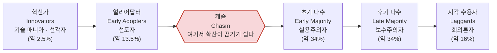
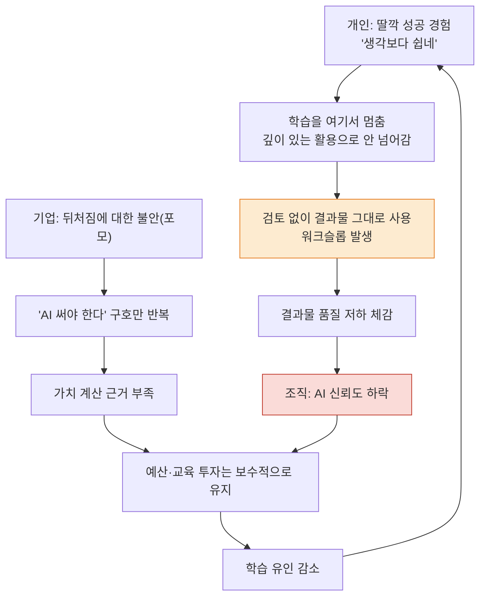
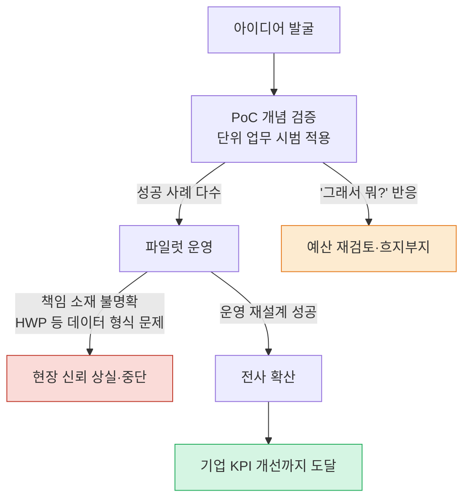

### 어느 Threads 대화의 전체 맥락과 사실관계 점검

---

## 목차

1. 들어가며 — 이 글이 다루는 것
2. 원문 스레드의 전체 흐름
3. 함께 올라온 그림이 뜻하는 것 — 혁신확산이론과 캐즘이론
4. 온도차의 세 층위 — 개인, 기업, 시장
5. "PoC 함정"이라는 현실 — AX가 유독 어려운 이유
6. 팩트체크 하나 — 일본 대기업의 AI 수당 제도
7. 팩트체크 둘 — 한국의 AI 사용률은 지금 어디쯤인가
8. 팩트체크 셋 — 글로벌 CEO들이 실제로 보고하는 AI 투자 성과
9. "AI 슬롭"이라는 현상 — 왜 결과물의 질이 오히려 떨어지는가
10. "페이블 얘기하면 오덕 취급받는다"는 말이 가리키는 것
11. 종합 정리 — 이 스레드가 말하려던 것과 남는 질문

---

## 1. 들어가며 — 이 글이 다루는 것

```
https://www.threads.com/@darkest_alex/post/Da1XPoVEklP

AI 온도차를 보면 참 희한해.

스레드를 보면 절정고수들이 하늘을 날아댕기고,

회사들도
"AI 써야한다!!!" 이러고,
"딸깍으로 다 되는거 아님??"
이러는 사람들이 판치는데,

정작 진지하게
"그쵸?! 참 재밌고 쉽죠?! 우리 이제 제대로 써볼까요?!" 하면,
예산문제니,
작업하는데 시간이 없다느니 하면서,
회피하고 더 안배울라고 함.

심지어 작업물 퀄리티는 더 떨어짐.
AI돌려서 읽어보지도 않고 걍 던짐. 글도 디자인도 슬롭 한가득.
그럴거면 내가 프롬프트 치지 왜 사람한테 맡겨(...)

회사는 그냥 포모 땜에 하고는 싶은데, 이게 어느 정도의 가치를 가지는지 모르니, 본격적인 투자는 하기 싫은 것 같고.

개인은 프롬프트 입력하고 가벼운거 만들어보는 수준에서 "딸깍 개쉽죠?" 하고,
거기서 아는척하고 더 안배우고 싶어하는 것 같음.

회사와 개인 모두 저 정도로 만족하고 멈추는 것 같음.

AI땜에 사람들은 '딸깍 쉽죠?'하고 폰 하고 있고,
회사는 예산을 더 쓰고,
결과물은 퀄리티가 떨어지는 요상한 사태가 벌어지는 것 같음.

```


이 문서가 다루는 원본은 Threads 이용자 darkest_alex가 올린 게시물과, 그 아래 달린 여러 답글들로 이어진 하나의 대화 뭉치이다. 주제를 한 문장으로 요약하면 "AI를 대하는 온도차"다. 스레드나 SNS에서는 AI를 능숙하게 다루는 사람들이 활발히 목소리를 내고 있는데, 정작 회사와 주변 사람들의 실제 체감 수준은 그와 크게 다르다는 괴리감을 원 게시자가 토로했고, 이에 여러 사람이 각자의 회사 경험과 산업 현장의 이야기를 덧붙이며 대화가 확장되는 구조다.

함께 첨부된 그림은 특정 통계 자료가 아니라, 신제품이나 신기술이 사회에 퍼져나가는 속도를 다섯 단계로 나눈 고전적인 이론 다이어그램이다. 이 그림 자체는 이번 대화를 위해 새로 만들어진 것이 아니라 경영학·커뮤니케이션학에서 오래전부터 쓰여 온 표준 도식이며, 스레드의 원 게시자도 이를 인용해 "지금의 AI 시장은 혁신확산이론곡선에서 초기수용 단계"라는 자신의 진단을 뒷받침하는 데 사용했다.

아래에서는 이 대화의 흐름을 순서대로 짚어보고, 대화 중에 언급된 구체적인 사실 — 일본 기업의 AI 수당 제도, 한국의 AI 사용률 순위, 기업들의 AI 투자 성과 — 을 실제 자료로 하나씩 확인한다. 대화 참여자 개개인의 의견과 감상은 어디까지나 그 사람의 주관적 평가이므로, 이 글에서는 "이러이러하다고 말했다"는 식으로 발언으로 표시하고, 외부 자료로 확인 가능한 사실과는 분명히 구분해서 서술한다.

---

## 2. 원문 스레드의 전체 흐름

대화는 원 게시자의 관찰에서 출발한다. 그는 스레드 안에서는 이른바 "AI 절정고수"들이 화려한 성과를 뽐내고, 기업들도 겉으로는 "AI를 써야 한다"는 구호를 외치지만, 막상 진지하게 "이제 제대로 배워서 써보자"고 제안하면 예산과 시간 부족을 이유로 회피하는 이중적인 태도를 지적한다. 더 나아가 그는 실제 작업물의 품질이 오히려 떨어지고 있다고 주장한다. AI가 생성한 결과물을 사람이 다시 읽어보지도 않은 채 그대로 넘기는 경우가 늘면서, 글과 디자인 모두 부실한 산출물, 이른바 "슬롭"으로 가득해졌다는 것이다. 그는 이런 상황이라면 차라리 자신이 직접 프롬프트를 치는 편이 낫지, 왜 굳이 사람에게 그 작업을 맡기냐는 반문을 던진다.

이어서 그는 기업과 개인의 태도를 각각 진단한다. 기업은 뒤처지는 것에 대한 불안감, 이른바 포모(FOMO) 때문에 AI를 도입하고는 싶어 하지만 그 가치를 명확히 계산하지 못해 본격적인 투자는 주저한다는 것이다. 개인 역시 프롬프트를 입력해서 가벼운 결과물을 뽑아보는 수준에서 "이거 되게 쉽네"라는 감상에 머물고, 거기서 더 배우려 하지 않는다고 짚는다. 결과적으로 그는 회사와 개인 모두가 얕은 수준에서 만족하며 멈춰서는 현상을 "이상한 사태"라고 표현한다.

원 게시자는 자신의 주변에는 에이전트를 직접 다루고 업무 체계에 AI를 편입시킨, 이른바 "적극적 사용자"가 자신과 자신이 속한 회사의 CTO 두 사람뿐이라고 밝히며, 그래서 스레드를 통해 다른 활발한 사용자들의 사례를 간접적으로 접하고 있다고 말한다. 그는 지금의 AI 시장을 혁신확산이론 곡선에서 "초기수용" 단계로 진단하며, 벌써 사용자 간 양극화가 뚜렷하고 신기술이 거의 매주 쏟아지는 상황이라고 요약한다.

댓글로 이어지는 대화에서는 여러 사람이 자신의 경험을 보탠다. 한 사람은 AI를 잘 쓰느냐 못 쓰느냐보다, AI를 제대로 통제하고 결과를 검토하며 능동적으로 업무에 임하는 태도가 더 중요하다고 강조한다. 프롬프트만 던져놓고 검토도 없이 "AI가 이렇게 됐다는데요"라며 결과를 그대로 가져오는 사람들이야말로 문제라는 것이다. 다른 참여자는 이런 상황이 오히려 새로운 기회일 수 있다며, AI를 진짜 잘 다루는 스타트업이 관성에 젖은 대기업을 앞지르는 사례가 나와야 한다는 기대를 밝힌다.

기업 현장의 실무 언어에 대한 냉소도 이어진다. 한 참여자는 PoC(개념 검증)와 ROI(투자 대비 수익) 같은 용어가 계속 오가고, 해외 SaaS 제품군을 검토하고 전환 비용까지 계산하면서도 정작 부서별 AI 계정 하나를 공용으로 돌려쓰라는 식의 모순적인 지시가 함께 내려온다고 지적한다. 이 대목에서 일본의 한 기업 사례가 언급되는데, "AI를 적극 활용하면 수당을 추가로 지급한다"는 최근 기사를 인용하며, 그 정도의 파격적인 유인이 있다면 다들 자기 돈을 들여서라도 AI를 배우려 할 것이라는 부러움 섞인 감상을 남긴다. 이에 대한 답글에서는 "AX 교육을 하자면서, AX 도입을 하자면서, 정작 API 비용 100~200달러가 더 나온다고 검토만 하다가 흐지부지된다"는 냉소가 이어진다.

조직 내 위치에 따른 온도차도 드러난다. 한 참여자는 스레드를 보면 자신이 하찮게 느껴지는데 정작 회사나 주변은 평온하다며, "페이블" 같은 최신 AI 모델 이야기를 꺼내면 무슨 소리냐는 반응이 돌아온다고 토로한다. 이에 대해 다른 참여자는 파레토의 법칙을 인용하며, 아무리 좋은 책이라도 모든 사람이 읽지는 않듯, 원래 다수는 신기술을 얕게만 쓰는 것이 자연스러운 현상이라고 다독인다.

AX(AI 전환)를 실제로 담당해 본 한 참여자는 더 구조적인 진단을 내놓는다. 어설프게 도입해봤자 "그래서 뭐?"라는 반응만 돌아오는 경우가 많고, 구독료와 API 비용이 실제 지출로 잡히는 상황에서, 성과를 증명하지 못한 대부분의 기업은 거품이 꺼지듯 AI 열기에서 조용히 물러날 것이라고 전망한다. 그는 과거 단순 자동화 중심의 DX(디지털 전환)도 제대로 풀어내기 어려웠는데, AX는 그보다 훨씬 더 어려운 과제라고 말한다. 그의 표현을 빌리면 AX는 "AI라는 탈을 쓴 종합적인 기업 문제 해결 활동"에 가까우며, DX 기반이 갖춰지지 않은 회사는 애초에 시도하기 어렵다는 것이다. 생각 없이 접근하면 기껏해야 챗봇을 활용한 개인 효율성 향상 수준에서 그치고, 기업 전체의 핵심성과지표(KPI) 개선까지 이어지기는 어렵다는 진단이다.

한편 중소규모 기업에 몸담은 한 참여자는 조금 다른 결의 이야기를 전한다. 자신이 속한 회사는 AI에 별다른 관심이 없으며, AI가 기존 사업 영역에 큰 영향을 주지 않는 업종 특성상 굳이 도입할 필요성을 느끼지 못한다는 것이다. 예전 방식 그대로 업무를 진행해도 큰 문제가 없고, 업무에 AI를 실제로 접목하려면 어느 정도 전문성을 갖춘 인력이 있어야 하는데 그런 인력이 없는 것이 현실이라고 말한다. 다만 일부 특출난 개인이 자발적으로 AI를 업무에 들여오고는 있지만, 그로 인한 이득이 뚜렷하지 않다면 이런 시도조차 결국 헛수고로 끝날 수 있다는 우려도 함께 전한다.

대화의 끝자락에서는 한 참여자가 스스로를 낮추며 질문을 던진다. "딸깍으로는 안 된다"는 것은 알겠지만, 무엇을 배우고 싶은지는 많은데 정작 무엇이 되고 안 되는지조차 구분이 안 되고, 배우려 해도 이해가 잘 안 되어 결과물의 질도 그저 그렇다면 어디서부터 시작해야 하느냐는 질문이다. 그는 스스로를 "이렇게 개똥멍청이인 줄 몰랐다"고 자조하며 대화를 맺는다.

---

## 3. 함께 올라온 그림이 뜻하는 것 — 혁신확산이론과 캐즘이론

원 게시자가 자신의 논지를 뒷받침하기 위해 첨부한 그림은 특정 기관의 통계 그래프가 아니라, 커뮤니케이션 학자 에버렛 로저스(Everett Rogers)가 1962년에 제시한 혁신확산이론(Diffusion of Innovations)의 표준 도식이다. 이 이론은 원래 아이오와 주립대에서 병충해에 강한 옥수수 씨앗이 농부들 사이에 퍼지는 속도를 연구하는 과정에서 발견된 패턴을, 로저스가 모든 종류의 신기술 확산에 적용할 수 있는 일반 이론으로 발전시킨 것이다.[19]

이 이론은 신기술을 받아들이는 시점에 따라 사람들을 다섯 개 집단으로 나눈다. 가장 먼저 위험을 감수하고 신기술에 뛰어드는 혁신가(Innovators), 그 뒤를 이어 신중하되 빠르게 움직이며 주변에서 의견 리더 역할을 하는 얼리어답터(Early Adopters), 실제 효과와 신뢰성이 검증된 뒤에야 움직이는 실용주의자 성향의 초기 다수(Early Majority), 신기술이 표준으로 자리잡은 뒤에야 받아들이는 보수적인 후기 다수(Late Majority), 그리고 가장 마지막까지 신기술을 받아들이지 않거나 아예 받아들이지 않는 회의적인 지각 수용자(Laggards)다.[19][20]

첨부된 그림에는 이 다섯 단계에 마케팅 전략가 제프리 무어(Geoffrey Moore)가 저서 『캐즘 마케팅(Crossing the Chasm)』에서 제시한 용어들이 함께 병기되어 있다. 무어는 얼리어답터와 초기 다수 사이에 좀처럼 건너기 힘든 균열, 즉 "캐즘(Chasm)"이 존재한다고 보았다. 기술 애호가들에게는 열광적인 반응을 얻은 제품이라도, 실질적 효용과 검증된 사례를 요구하는 실용주의자 다수 집단으로 넘어가는 순간 채택이 뚝 끊기는 경우가 많다는 것이다. 이런 맥락에서 초기 다수는 "실용주의자", 후기 다수는 "보수주의자", 지각 수용자는 "회의론자"로 다시 불리기도 한다.

원 게시자가 이 그림을 인용한 이유는 명확하다. 그는 지금의 생성형 AI 시장을 이 곡선에서 아직 "초기수용" 단계, 즉 혁신가와 얼리어답터가 앞서가고 있을 뿐 실용주의자 다수 집단으로는 아직 본격적으로 건너가지 못한 국면으로 진단하고 있는 것이다. 스레드에서 활발하게 목소리를 내는 사람들은 이 곡선의 맨 왼쪽, 소수의 혁신가·얼리어답터 집단이고, 회사와 주변에서 마주치는 무관심하거나 회의적인 반응은 아직 캐즘을 넘지 못한 다수 대중의 자연스러운 위치라는 것이 이 그림이 전달하려는 메시지로 읽힌다. 다만 이는 원 게시자 본인의 해석이자 진단이며, 실제로 생성형 AI 확산이 정확히 이 곡선의 어느 지점에 있는지를 계량적으로 측정한 공인된 지표가 함께 제시된 것은 아니라는 점은 분명히 해둘 필요가 있다.



*(괄호 안 비율은 로저스가 제시한 정규분포 기반의 이론적 구성비이며, 실제 생성형 AI 채택자 비율을 측정한 통계가 아니라 이론 모형의 예시값이다.)*

---

## 4. 온도차의 세 층위 — 개인, 기업, 시장

스레드 전체를 관통하는 문제의식은 결국 "온도차가 왜 이렇게 벌어지는가"로 모인다. 대화를 따라가 보면 이 온도차는 한 가지 원인이 아니라 개인, 기업, 시장이라는 세 층위에서 각기 다른 방식으로 만들어지고, 서로를 강화하는 구조로 얽혀 있는 것으로 보인다.

개인 층위에서는 최초의 성공 경험이 오히려 학습을 멈추게 만드는 역설이 나타난다. 프롬프트 하나로 그럴듯한 결과물을 뽑아내는 경험은 강렬해서, "이거 참 쉽네"라는 인상을 남기지만 동시에 거기서 더 파고들 필요를 느끼지 못하게 만든다. 원 게시자가 지적한 "프롬프트 한번 띡 치고 안 된다고 가져오는" 태도는 이런 얕은 학습이 낳는 전형적인 결과다.

기업 층위에서는 불안과 계산 부재가 함께 작동한다. 뒤처질지 모른다는 불안 때문에 AI 도입을 표방하지만, 그 투자가 실제로 얼마의 가치를 만들어내는지 계산할 방법이 마땅치 않다 보니 본격적인 투자로는 좀처럼 이어지지 않는다. 그 결과 조직은 "AI를 써야 한다"는 구호와 "예산 문제로 배울 시간이 없다"는 회피가 동시에 존재하는 모순적인 상태에 머문다.

시장 전체로 보면, 이런 개인과 기업의 정체는 다시 사회적 압력으로 되돌아온다. 검토 없이 쏟아지는 저품질 산출물은 AI에 대한 신뢰를 깎아먹고, 신뢰가 떨어지면 조직은 더 소극적으로 예산을 집행하며, 그 결과 학습에 투자할 유인은 더욱 줄어든다. 아래의 도식은 이 세 층위가 어떻게 서로를 강화하며 정체 상태를 유지하는지를 정리한 것이다. 이는 스레드에 담긴 여러 발언들을 종합해 이 문서가 재구성한 흐름이며, 특정 논문이나 보고서에서 가져온 모형은 아니라는 점을 밝혀둔다.



---

## 5. "PoC 함정"이라는 현실 — AX가 유독 어려운 이유

스레드 참여자 중 AX 업무를 실제로 담당해 본 사람이 짚은 "AX는 AI 탈을 쓴 종합적 기업 문제해결 활동"이라는 진단은, 실제 컨설팅 업계의 최근 분석과도 상당 부분 맞닿아 있다.

액센추어의 엄진 전무는 지난 4월 서울에서 열린 삼성SDS 인더스트리 데이 발표에서, 단위 업무 중심의 AI 시범 적용에 머무는 이른바 "PoC 함정" 때문에 AI 전환(AX)이 대부분 실패로 끝난다고 진단했다. 그는 진정한 의미의 변혁을 이룬 제조 기업은 거의 없으며, 액센추어 고객 설문에서 응답 기업의 약 80퍼센트가 AI 프로젝트의 투자 대비 성과에 만족하지 못했다고 답했다는 결과를 함께 전했다.[5]

이런 현상을 다룬 또 다른 분석 보고서는 "PoC는 스냅샷이지만 실증은 사계절"이라는 표현으로 이 문제를 압축한다. 한 시점에서의 테스트 성공이 계절과 설비, 환경이 계속 바뀌는 실제 운영 현장을 보장해주지는 않는다는 뜻이다. 개념검증 단계에서는 문제가 없지만 실제 운영 단계로 넘어가면 책임 소재가 불명확해져 현장의 신뢰를 얻지 못한 채 사장되는 경우가 반복된다는 것이 이 보고서의 진단이다. 특히 한국 기업 환경에는 고유한 걸림돌도 있다는 지적이 나온다. 한 지식·사무 분야 기업의 엔지니어는 현장에서 AI가 실제로 막히는 지점은 글을 못 써서가 아니라, 회사 문서가 한글과컴퓨터의 HWP 형식으로 들어오는 순간부터라고 지적했다. 이 경우 프로젝트의 절반은 콘텐츠 생성이 아니라 파일 형식을 읽어내는 입력 처리 작업으로 소모되며, 이를 초기에 고려한 파싱 체계를 설계하지 않으면 운영 비용이 계속 늘어난다는 것이다.[6]

이 문제는 한국 기업만의 특수한 사정은 아니다. 국내 중견기업의 AI 성숙도를 다룬 최근 리서치는, 한국 기업의 AI 도입 속도가 전 세계 평균의 일곱 배에 이를 만큼 빠른데도 정작 조직 전체의 AI 활용 성숙도는 여전히 낮은 수준에 머물러 있다고 지적하며, "도입은 빠른데 조직 전체로 퍼지지 못하는" 괴리를 짚는다. 이 리서치가 제시한 조직 성숙도 수치는 특정 민간 리서치가 자체 산출한 값으로, 공인 통계 기관의 발표는 아니라는 점을 밝혀둔다.[7]

정리하면, 스레드 속 참여자의 "AX는 도입 여부의 문제가 아니라 조직 전체를 다시 설계하는 문제"라는 직관적 진단은, 실제 컨설팅 업계에서도 반복적으로 지적되는 현상과 상당히 일치한다. PoC 단계에서 소규모로 성공을 거둔 뒤, 그 성공을 전사 차원의 운영으로 확장하는 두 번째 관문에서 대부분의 시도가 좌초한다는 것이다.



---

## 6. 팩트체크 하나 — 일본 대기업의 AI 수당 제도

스레드 안에서 한 참여자가 부러움 섞인 어조로 언급한 "일본 AX 관련 기사, AI 적극 활용 시 수당 추가 지급"이라는 사례는 실제로 존재하는 최근 보도였다. 니혼게이자이신문은 지난 7월 12일, 혼다를 비롯한 일본 대기업들이 생성형 AI를 업무에 능숙하게 활용하는 직원에게 추가 수당을 지급하고 있다고 보도했다. 혼다는 생성형 AI 등을 업무에 능숙하게 활용하는 직원에게 등급별로 월 최대 15만 엔, 우리 돈으로 약 139만 원의 특별 수당을 지급하고 있다.[2]

혼다는 임직원의 AI 활용 능력을 총 세 단계로 평가해 수당을 차등 지급하는 방식을 쓰고 있으며, 현재 최고 등급 판정을 받아 매달 15만 엔을 추가로 받는 직원은 10명, 전체 수혜 직원은 280명에 이른다.[2] 등급은 필기시험과 면담, 그리고 실제 업무 성과를 종합해 결정되며, 연구소를 포함한 일본 국내 전체 직원 약 4만 5천 명이 이 제도의 적용 대상이다.[3] 혼다는 이 제도를 빠르게 정착시켜 수혜 대상을 향후 수년 내 1천 명 규모까지 확대할 계획이라고 밝혔다.[2]

보도들은 이러한 움직임의 배경으로, 일본 기업들이 해외 주요국에 비해 AI의 실제 업무 활용에서 뒤처져 있다는 위기감을 꼽는다. 일본 기업들은 해외에 비해 AI 업무 활용이 뒤처진 상황을 극복하기 위해 이런 보상 제도를 활성화하고 있다는 것이다.[1][4] 혼다 외에도 여러 일본 대기업이 AI 활용 능력을 인사평가와 승진 심사에 반영하는 제도를 잇달아 도입하고 있는 것으로 전해진다.[3]

흥미로운 대목은 같은 보도에서 한국과의 비교도 함께 다뤄졌다는 점이다. 한국은 같은 조사에서 AI 사용률 37.1퍼센트를 기록해 세계 16위에 올랐으며, 일본과 마찬가지로 AI 자격 보유자를 채용과 승진 과정에서 우대하려는 움직임이 기업 사회에서 나타나고 있지만, 혼다처럼 별도의 수당을 지급하는 제도는 뚜렷하게 확인되지 않았다고 보도는 전한다.[4] 즉 스레드에서 언급된 일본의 사례는 과장이나 와전이 아니라 실제로 진행 중인 정책이며, 스레드 참여자가 느낀 부러움에는 근거가 있었던 셈이다.

---

## 7. 팩트체크 둘 — 한국의 AI 사용률은 지금 어디쯤인가

스레드 참여자들이 토로한 "우리 회사는 AI에 관심 없다"거나 "주변에 적극적으로 쓰는 사람이 없다"는 체감은 한국 사회 전체의 통계와는 다소 결이 다르다. 오히려 최근 발표된 국제 지표를 보면 한국은 생성형 AI 확산 속도 면에서 세계적으로 두드러지는 위치에 있다.

마이크로소프트 산하 싱크탱크인 AI 이코노미 인스티튜트가 지난 5월 발표한 「2026년 1분기 AI 확산 보고서」에 따르면, 한국의 생성형 AI 사용률은 37.1퍼센트로 집계됐으며, 이는 전 분기 대비 6.4퍼센트포인트 상승한 수치로 주요 국가 가운데 가장 높은 증가폭이었다.[8][10] 이 결과로 한국의 글로벌 순위는 18위에서 16위로 두 계단 올라섰다. 절대적인 사용률 순위 자체는 세계 최상위권은 아니지만, 상승 속도만 놓고 보면 세계에서 가장 가파른 나라로 꼽힌 것이다.[9]

보고서는 이 기간 동안 성장 속도가 가장 빨랐던 15개 경제권 가운데 12곳이 아시아에 속해 있었으며, 특히 한국과 태국, 일본이 이 성장을 주도했다고 평가했다.[10] 마이크로소프트 측은 한국을 "가장 뚜렷한 AI 확산 성공 사례"로 평가했으며, 지난해만 해도 한국은 세계 20위권 수준이었지만 반년 만에 순위가 크게 상승했다고 설명했다.[9] 세계 전체로 보면 생성형 AI 사용률이 30퍼센트를 넘는 국가는 전 분기 18개국에서 26개국으로 늘었고, 아랍에미리트가 70.1퍼센트로 세계 최초로 70퍼센트를 돌파해 1위를 차지했으며 미국은 31.3퍼센트로 21위에 그쳤다.[10]

다만 이 통계는 "일반 소비자 차원에서 생성형 AI 도구를 한 번이라도 사용해 본 인구의 비율"에 가까운 지표이며, 스레드에서 문제 삼은 "업무 체계에 AI를 편입시켰는가", "에이전트를 실제로 다뤄봤는가"와 같은 심화된 활용 수준을 측정하는 지표는 아니라는 점에 유의할 필요가 있다. 실제로 다른 조사에 따르면 한국인들이 가장 많이 사용하는 생성형 AI 플랫폼은 오픈AI의 챗GPT로 68.1퍼센트, 구글 제미나이가 13.8퍼센트로 뒤를 이었다는 결과가 있는데,[11] 이는 초심자 단계의 사용을 포함한 폭넓은 지표다. 즉 "AI를 한 번이라도 써본 사람의 비율"은 한국에서 빠르게 늘고 있지만, 스레드가 지적한 "업무를 깊이 있게 재설계할 만큼 능숙하게 다루는 사람의 비율"은 이와는 별개의 문제이며, 바로 이 지점에서 통계상의 확산 속도와 스레드 참여자들의 현장 체감이 어긋나고 있는 것으로 보인다.

---

## 8. 팩트체크 셋 — 글로벌 CEO들이 실제로 보고하는 AI 투자 성과

스레드에서 여러 참여자가 공통으로 지적한 "회사는 투자를 하고 싶어도 그 가치를 계산할 방법을 모른다"는 진단은 실제 경영자 대상 설문에서도 확인된다.

PwC가 지난 1월 발표한 제29차 글로벌 CEO 설문조사는 95개국 CEO 4,454명을 대상으로 진행됐다. 이 조사에 따르면 지난 12개월간 AI 도입을 통해 추가 매출을 창출했다고 답한 CEO는 약 3분의 1인 30퍼센트였고, 비용 측면에서는 26퍼센트가 AI로 비용이 줄었다고 답한 반면 22퍼센트는 오히려 비용이 늘었다고 답했다. 더 인상적인 수치는 그다음이다. 절반 이상인 56퍼센트는 매출 증가나 비용 절감 어느 쪽에서도 성과를 전혀 경험하지 못했으며, 매출 증가와 비용 절감을 동시에 달성한 CEO는 전체의 12퍼센트에 그쳤다. 한국의 경우는 이보다 약간 높은 14퍼센트로 나타났다.[12][13]

PwC 글로벌 의장 모하메드 칸데는 이 결과를 두고 "소수의 기업은 이미 AI를 측정 가능한 재무적 수익으로 전환하고 있지만, 다른 많은 기업은 여전히 시범 운영 단계를 벗어나는 데 어려움을 겪고 있으며, 이 격차는 신뢰도와 경쟁력의 차이로 나타나기 시작했다"고 진단했다.[14] 이 발언은 스레드 참여자가 말한 "PoC를 벗어나지 못하는 기업들"의 현실과 정확히 겹친다.

이 수치들이 시사하는 바는 분명하다. 스레드에서 어느 참여자가 토로한 "예산 문제니, 성과가 뭔지 모르니 투자를 꺼린다"는 진단은 막연한 불만이 아니라, 실제로 전 세계 대다수 기업 경영자들이 공유하고 있는 현실적인 딜레마라는 것이다. AI를 도입한 기업 대다수가 아직 이렇다 할 재무적 성과를 손에 쥐지 못한 상황에서, 회사가 대규모 예산 투입을 주저하는 태도를 무조건 "AI를 몰라서 그렇다"고만 보기는 어렵다는 뜻이기도 하다.

---

## 9. "AI 슬롭"이라는 현상 — 왜 결과물의 질이 오히려 떨어지는가

원 게시자가 지적한 "AI돌려서 읽어보지도 않고 걍 던짐. 글도 디자인도 슬롭 한가득"이라는 표현은 최근 국내외에서 함께 논의되고 있는 "워크슬롭(workslop)" 현상과 맞닿아 있다. 카카오벤처스가 정리한 분석에 따르면, 사람들은 AI가 유능한 대리인이 되어줄 것을 기대하며 기존에 없던 업무 영역까지 AI에 맡기지만, AI가 자신의 능력 범위를 벗어난 질문을 마주하면 그럴듯하지만 알맹이가 없는 답변, 즉 슬롭을 내놓게 된다. 이 분석은 이런 현상이 특정 산업의 데이터 부족 때문이 아니라, AI의 능력 경계를 고려하지 않고 설계된 워크플로우에서 발생한다고 짚는다.[15]

문제의 핵심은 결국 "누가 결과물을 검토하는가"에 있다. 2026년 프리랜서의 AI 활용 실태를 다룬 한 분석은 AI가 결과물의 첫 80퍼센트가량을 빠르게 만들어주는 만큼, 사람은 클라이언트의 맥락을 반영하고 최종 품질을 검수하는 역할에 집중해야 한다고 설명하면서, 가장 흔한 실패 사례로 AI가 만든 결과물을 검토 없이 그대로 넘기는 것을 꼽는다.[16] 다른 실무 가이드 역시 AI를 적용할 때 품질을 검토할 책임자를 정하지 않으면 결과가 그대로 흘러가 버린다고 지적하며, 문서의 사실 확인부터 고객 안내에 이르기까지 검토 책임이 반드시 남아야 한다고 강조한다.[17]

이는 원 게시자가 스레드에서 던진 반문, "그럴거면 내가 프롬프트 치지 왜 사람한테 맡겨"라는 지적과 정확히 같은 문제의식이다. AI가 초안의 상당 부분을 빠르게 만들어낼 수 있다는 사실이, 사람이 검토 책임에서 자유로워졌다는 뜻은 아니라는 것이다. 오히려 최근 논의들은 AI 활용 시대에 사람에게 요구되는 역할이 "직접 생산"에서 "의도 설정과 품질 기준, 최종 판단과 책임 소유"로 옮겨가고 있다고 진단한다.[18] 스레드 속 "검토도 안 하고 그냥 던지는" 태도에 대한 비판은, 바로 이 새로운 역할 분담이 현장에서 제대로 자리 잡지 못하고 있다는 신호로 읽을 수 있다.

---

## 10. "페이블 얘기하면 오덕 취급받는다"는 말이 가리키는 것

스레드의 한 참여자는 "페이블 이야기 하면 약간 그게 뭔데 이 오덕아 이런 느낌"이라는 표현으로 자신이 느끼는 소외감을 전한다. 이 발언이 정확히 어떤 대상을 가리키는지 스레드 본문만으로 단정할 수는 없지만, 시점과 맥락을 함께 놓고 보면 앤트로픽(Anthropic)이 2026년 6월 9일 공개한 최상위 모델 "Claude Fable 5"를 가리키는 것으로 보인다는 점은 짚어둘 만하다.

Fable 5는 소프트웨어 엔지니어링과 지식노동, 과학 연구 등 여러 벤치마크에서 당시까지 공개된 앤트로픽 모델 중 최고 성능을 기록하며 출시됐다. 그런데 출시 사흘 뒤인 6월 12일, 미국 정부의 수출통제 조치로 전 세계 사용자의 접근이 갑자기 차단되는 일이 벌어졌고, 이 통제는 6월 30일 해제되어 7월 1일부터 접근이 순차적으로 복구됐다. 이 소동은 국내 AI 커뮤니티에서 상당한 화제를 모았으며, 관련 소식을 다룬 국내 매체와 커뮤니티 글도 여럿 확인된다.[21][22]

만약 스레드 속 발언이 실제로 이 모델을 가리킨 것이라면, 이 장면은 이 문서가 앞서 짚은 "온도차"를 매우 압축적으로 보여주는 사례가 된다. AI를 적극적으로 따라가는 사람들 사이에서는 최상위 모델의 출시와 갑작스러운 접근 차단, 재개까지 이어지는 3주간의 소동이 실시간으로 화제가 됐던 반면, 같은 시기 회사 동료나 주변 사람들에게 이 이야기를 꺼내면 무슨 말인지 전혀 알아듣지 못하는 반응이 돌아왔다는 것이다. 이는 앞서 3장에서 살펴본 혁신확산곡선에서, 발화자 자신은 이미 혁신가·얼리어답터 구간에 서 있는데 주변 다수는 아직 그 존재조차 인지하지 못하는 캐즘의 한가운데에 머물러 있다는 사실을 그대로 보여주는 일화라고 할 수 있다.

다만 이 해석은 어디까지나 정황에 기반한 추정이며, 원문에 "페이블"이 정확히 무엇을 가리키는지에 대한 명시적 설명은 없다는 점을 다시 한번 밝혀둔다.

---

## 11. 종합 정리 — 이 스레드가 말하려던 것과 남는 질문

이 스레드를 관통하는 하나의 축은 "AI를 대하는 태도의 격차가 실력의 격차보다 더 크게 벌어지고 있다"는 문제의식이다. 원 게시자와 여러 참여자들이 공통적으로 짚은 것은, AI를 잘 쓰느냐 못 쓰느냐 자체보다, 결과를 검토하고 책임지며 능동적으로 업무 체계에 편입시키려는 태도의 유무가 훨씬 중요한 변수라는 점이었다.

이번에 확인한 외부 자료들은 이 스레드의 진단이 상당 부분 근거가 있음을 뒷받침한다. 액센추어 조사에서 드러난 PoC 함정과 80퍼센트에 이르는 ROI 미흡 응답, PwC 조사에서 나타난 56퍼센트의 "무성과" 기업 비율은 스레드가 지적한 "회사는 하고 싶어 해도 가치를 계산하지 못해 주저한다"는 진단과 정확히 맞아떨어진다. 반대로 일본 혼다의 AI 수당 사례는 확실한 유인 설계가 있을 때 조직 구성원의 학습 동기가 실제로 달라질 수 있음을 보여주는 대조군 역할을 한다. 그리고 워크슬롭 논의는 "검토 없는 산출물"이라는 원 게시자의 비판이 국내외에서 함께 다뤄지고 있는 실제 현상임을 확인시켜 준다.

동시에 통계로 확인한 한국의 AI 사용률 상승 속도는 스레드 참여자들이 체감하는 정체감과는 결이 다른 그림을 보여준다는 점도 짚어둘 필요가 있다. 이는 모순이라기보다는, "얕은 사용의 확산"과 "깊은 활용으로의 전환"이 서로 다른 속도로 진행되고 있다는 사실을 보여주는 것에 가깝다. 즉 AI를 한 번이라도 써 본 사람은 빠르게 늘고 있지만, 업무 체계 자체를 재설계할 만큼 능숙하게 다루는 사람의 비율은 그보다 훨씬 느리게 늘고 있다는 것이다. 이 스레드가 말하려던 "온도차"는 결국 이 두 속도 사이의 간극을 가리키는 것으로 볼 수 있다.

스레드는 뚜렷한 결론이나 해법을 제시하지는 않은 채 마무리된다. 마지막 참여자의 "어디로 가야 하냐"는 질문에 대해 스레드 안에서 명확한 답은 나오지 않았다. 다만 대화 전체를 관통하는 암묵적인 답은 있었다고 볼 수 있다. "제대로 배워가면서 치고 나가야 한다"는 한 참여자의 짧은 답변이 그것이다. 이 문서가 확인한 여러 외부 자료들 역시, 결국 이 문제의 해법이 더 화려한 모델이나 더 많은 예산이 아니라, 결과를 검토할 책임자를 명확히 두고 조직의 업무 흐름 자체를 다시 설계하는 데 있다는 방향을 가리키고 있다는 점에서, 스레드의 결론과 크게 다르지 않아 보인다.

---

## 참고 자료

1. 파이낸셜뉴스, "'AI 잘 쓰면 월 140만원 지급'…직원에게 'AI 수당' 주는 日 대기업", 2026.07.14 — https://www.fnnews.com/news/202607140714441895
2. 인사이트, "'AI 잘 쓰면 매달 139만원 더 준다'... 일본 대기업 파격 수당 바람", 2026.07.16 — https://www.insight.co.kr/news/563362
3. 아주경제, "AI 잘 쓰면 월 140만원 수당…日기업, 인사평가 기준 바꾼다", 2026.07.13 — https://www.ajunews.com/view/20260713115211436
4. 세계일보, "'AI 잘 쓰면 월 140만원 지급'…직원에게 'AI 수당' 주는 日 대기업", 2026.07.14 — https://segye.com/newsView/20260714504070
5. 디지털데일리, "액센추어 '제조 기업 80% AI 투자 ROI 미흡'", 2026.04.17 — https://www.ddaily.co.kr/page/view/2026041715294952158
6. 아주경제, "AX에 실패하는 기업들..."도입 넘어 운영 재설계가 필수"", 2026.05.11 — https://www.ajunews.com/view/20260511141644195
7. Project Research, "한국 기업 AX 2030 — PM 코치가 해석하는 PO·PM·PL의 2026 Quick Win과 2030 Capstone" — https://projectresearch.co.kr/korean-enterprise-ai-ax-strategy-2030/
8. Microsoft Source Asia, "마이크로소프트, 2026년 1분기 AI 확산 보고서 발표", 2026.05.12 — https://news.microsoft.com/source/asia/2026/05/12/the-state-of-global-ai-diffusion-in-2026/?lang=ko
9. 파이낸셜뉴스, "MS '韓, AI 활용도 확산속도 세계 최고…가장 확실한 성공 사례'", 2026.05.12 — https://www.fnnews.com/news/202605121451429454
10. 게트뉴스, "'한국 생성형 AI 사용률 37.1%...세계서 가장 가파른 성장세'", 2026.05.12 — https://www.getnews.co.kr/news/articleView.html?idxno=869946
11. 아시아경제, "[글로벌 AI 격전지 대한민국]② 잇따라 한국행…AI 외산 의존도 82%", 2026.06 — https://www.asiae.co.kr/article/2026061808250134684
12. PwC, "PwC 제29차 글로벌 CEO 설문조사" 공식 보고서 — https://www.pwc.com/kr/ko/insights/global-trends/pwc_29th-annual-global-ceo-survey_kr.pdf
13. PwC컨설팅, "PwC's 29th Global CEO Survey" — https://www.pwcconsulting.co.kr/ko/insights/ceo-survey-2026.html
14. 뉴스1(굿모닝베트남미디어 재게재), "CEO 매출 전망 신뢰도 5년 만에 최저치 기록... PwC 2026년 글로벌 CEO 설문조사" — https://www.news1.kr/partners/globalmarket/5919949
15. 카카오벤처스 블로그, "2025년의 키워드 'AI Slop'에 담긴 시그널", 2026.01.07 — https://www.kakao.vc/blog/ai-slop
16. 두들 블로그, "프리랜서 AI 활용법, 2026년 실전 도구와 전략 5가지", 2026.05.28 — https://www.duudle.io/blog/freelancer-ai-usage-2026
17. 센텐시파이 블로그, "2026년을 주도할 AI 선택 기준과 현실 업무 적용법" — https://sentencify.ai/blog/2026-ai
18. ai.kqwer.com, "제프리 힌튼 2026년 AI 일자리 경고: 한국 직장인 생존 가이드" — https://ai.kqwer.com/2026/06/ai-job-replacement-guide.html
19. 위키백과, "혁신의 전파" — https://ko.wikipedia.org/wiki/혁신의_전파
20. FasterCapital, "채택 패턴 탐색: 혁신 확산 이론에 대한 고찰" — https://fastercapital.com/ko/content/
21. 나무위키, "Claude Fable 5 · Mythos 5 서비스 중단 사건" — https://namu.wiki/w/Claude%20Fable%205%20·%20Mythos%205%20서비스%20중단%20사건
22. 오픈위키, "클로드 Fable 5 다시 열렸다: 7월 1일 전면 재개, 요금·무료 기간·달라진 점 총정리" — https://wikidocs.net/blog/@openwiki/21400/

*이 문서는 2026년 7월 17일 기준으로 조사한 공개 자료를 바탕으로 작성했습니다. 원문 스레드에 등장하는 개인들의 발언과 주관적 평가는 사실 확인의 대상이 아니라 "이렇게 말했다"는 발언 인용으로 처리했으며, 외부 자료로 확인 가능한 사실관계와는 구분해 서술했습니다.*
