- **작성 기준일: 2026년 7월 17일**
- **원문 게시 시각: 2026년 7월 17일 오전 10시 32분(한국 시각) / 2026년 7월 17일 오전 1시 32분(협정세계시)**
- **원문 링크: https://x.com/bcherny/status/2077929379661844559**
- **연결된 아티팩트 링크: https://claude.ai/code/artifact/bfdfaef9-bc62-4dfe-ba9e-c58a26c9accf**

---

## 1. 이 문서는 무엇에 관한 것인가

이 문서는 앤트로픽(Anthropic)에서 Claude Code를 만든 스태프 엔지니어 보리스 체르니(Boris Cherny)가 2026년 7월 17일에 자신의 X(옛 트위터) 계정에 올린 스레드와, 그 안에 첨부된 Claude 아티팩트(artifact) 하나를 원문 그대로 옮기지 않고 완전히 풀어서 서술형으로 설명하는 자료다. 체르니는 이 스레드에서 "여러 회사의 엔지니어들과 매일 대화를 나누는데, 늘 같은 이야기를 듣는다. 한 사람이 Claude로 산출량을 10배로 늘리고 있지만, 조직의 나머지 사람들은 따라오지 못하고 있다"는 관찰로 글을 시작한다. 그리고 자신이 여러 팀의 AI 도입 과정을 지켜보면서 반복적으로 목격한 패턴을 다섯 단계(0단계부터 4단계까지)로 정리한 표 형태의 아티팩트를 함께 공유했다.

이 게시물이 올라온 시점은 오늘(2026년 7월 17일)과 사실상 같은 날로, 매우 최근에 공개된 1차 자료다. 게시된 지 하루가 채 지나지 않은 시점에서 이미 조회수 40만 회, 좋아요 5천 건을 넘기며 개발자 커뮤니티에서 널리 공유되고 있다.

아래에서는 (1) 체르니가 누구인지, (2) 스레드 전체의 논지, (3) 표에 담긴 5단계 프레임워크의 내용을 각 단계별로 상세히 풀어서, (4) 표 안에 등장하는 제품·기능 용어들이 실제로 무엇을 가리키는지 검증한 내용과 함께, (5) 이 프레임워크가 시사하는 바를 순서대로 다룬다.

---

## 2. 작성자는 누구인가 — 보리스 체르니

보리스 체르니는 앤트로픽의 스태프 엔지니어(Staff Engineer)로, Claude Code를 만든 핵심 인물 중 한 명으로 알려져 있다. 그는 개발자 커뮤니티에서 자신의 실제 작업 방식(터미널과 브라우저에서 여러 개의 Claude Code 세션을 동시에 띄워 병렬로 작업하는 방식 등)을 공유해온 것으로 유명하며, 이번 스레드 역시 그런 성격의 연장선에 있다. 다만 이번 글은 개인의 작업 습관을 넘어, 여러 기업 엔지니어들과의 대화에서 관찰한 "조직 단위의 AI 도입 패턴"을 일반화한 프레임워크라는 점에서 이전 게시물들과 결이 다르다.

---

## 3. 스레드 전체의 논지

체르니의 스레드는 세 개의 트윗으로 이어지며, 전체 흐름은 다음과 같은 논리를 따른다.

첫 번째 트윗에서 그는 문제의식을 제시한다. 여러 회사를 관찰해보면 "한 명의 엔지니어가 Claude로 10배의 생산성을 내는 반면 조직 전체는 그 수준을 따라가지 못한다"는 현상이 공통적으로 나타난다는 것이다. 그는 이 격차의 원인이 재능이나 의지의 문제가 아니라, 팀이 밟아 나가는 "단계(step)"의 차이에 있다고 보고, 자신이 관찰한 4개의 반복되는 단계(실제 아티팩트에는 0단계까지 포함해 총 5단계)를 정리해 공유한다.

두 번째 트윗에서 그는 이 단계들 사이에 정해진 하나의 정답 경로는 없으며, 회사마다 상황이 다르다는 점을 분명히 한다. 그러면서 핵심 주장을 제시하는데, "각 단계에서 토큰(즉 더 많은 AI 사용량)을 쏟아붓는 것만으로는 다음 단계로 넘어갈 수 없다"는 것이다. 다음 단계로 가려면 그 단계에 특유한 병목(bottleneck)을 찾아 해체해야 하고, 동시에 그 단계에 맞는 새로운 안전장치(guardrail)를 갖춰야 한다는 논리다. 이는 "모델이 좋아지기만 하면 자동으로 조직의 생산성도 올라간다"는 통념에 대한 반박이기도 하다.

이어서 그는 실무적으로 이것이 무엇을 의미하는지 구체화한다. Claude가 스스로 자신의 작업을 처음부터 끝까지 검증할 수 있는 수단(테스트, 빌드, 린트, 보안 스캔 등)을 갖추게 하는 것, 권한 승인을 자동으로 처리하는 자동 모드(auto mode)를 켜는 것, 코드 리뷰와 보안 리뷰를 기본값으로 자동화하는 것, 그리고 여러 에이전트를 동시에 관리할 수 있는 인터페이스(CLI의 에이전트 뷰, 데스크톱 앱, iOS·Android 앱, Tag 등)를 쓰는 것이 여기에 해당한다고 설명한다. 더 높은 단계로 가려면 반복 실행 명령(`/loop`), 일괄 처리 명령(`/batch`), 동적 워크플로우(dynamic workflows), 그리고 서브에이전트를 위한 워크트리 격리(worktree isolation) 같은 기능이 필요하다고 덧붙인다. 그는 이것이 "단일 기능 하나"의 문제가 아니라, "적절한 기능들을 적절한 안전장치와 함께 사용해서, 팀이 결과물을 신뢰할 수 있는 방식으로 특정 부류의 업무 전체를 자동화하는 것"이라고 정리한다.

세 번째로 그는 "그래서 팀이 도입에 동의했다면, 어떻게 그 성과를 추적할 것인가"라는 질문을 던진다. 그는 사용량 대시보드 같은 지표는 "활동량"을 보여줄 뿐 "실제로 얻은 가치(return)"를 보여주지는 않는다고 지적하며, 더 나은 질문은 "이 일을 AI가 없었어도 어차피 엔지니어링 자원을 투입했을 일인가? 그렇다면 얼마나 투입했을 것이고, 사람이 직접 했다면 몇 시간이 들었을까?"라고 제안한다. 그리고 진짜 큰 보상은 유지보수와 버그 수정이 백그라운드에서 저절로 돌아가고, 팀이 새로운 것을 만드는 데에만 집중할 수 있게 될 때, 즉 이전에는 아예 고려 대상조차 아니었던 일들을 할 수 있게 될 때 온다고 말한다.

마지막으로 그는 앤트로픽 자체는 3단계에 있고 4단계를 향해 나아가고 있으며, 개인적으로는 이미 4단계에 도달했다고 밝히면서, 독자들에게 "당신의 팀은 지금 어느 단계에 있는가"를 묻는 것으로 스레드를 마무리한다.

---

## 4. 핵심 프레임워크: 0단계부터 4단계까지

아티팩트의 표는 각 단계마다 "단계 이름과 나의 역할", "에이전트(동시 실행 에이전트) 수", "실제 모습이 어떤지", "무엇이 병목인지", "각 단계에서 도움이 되는 제품", "안전장치(가드레일)", 그리고 "다음 단계로 넘어가는 방법"이라는 일곱 개의 항목으로 구성되어 있다. 아래에서는 이를 단계별로 서술형으로 풀어 설명한다.

### 4.1 0단계 — 게이트(Gated): 에이전트 0명

이 단계는 조직 안에 AI 에이전트가 사실상 존재하지 않는 상태다. 오래되었거나 가벼운·빠른 모델만 승인되어 있고, AI 게이트웨이와 자체 인증 체계를 거치면서 지연 시간이 누적되며, MCP(모델 컨텍스트 프로토콜) 사용에 대한 거버넌스도 없고, 내부 직원이 AI 도구에 접근하는 절차 자체가 막혀 있거나 지나치게 무겁다. Claude가 만들어낸 코드나 산출물을 호스팅할 IT 인프라나 승인 경로도 없어서, 결과물이 로컬 컴퓨터 안에만 존재하는 상태로 남는다.

이 단계의 병목은 기술이 아니라 조직의 의사결정 구조다. 레거시 보안·승인 프로세스가 여전히 작동하고 있고, 성과(outcome)보다는 토큰당 비용 억제에 초점이 맞춰져 있으며, 의사결정 테이블에 진짜 기술적 목소리가 부족한 것이 원인으로 지목된다. 이 단계에서 도움이 되는 것으로는 Claude.ai 채팅, SSO/SCIM과 역할 기반 접근 제어, 조직 단위 예산 상한, 기존 승인·IAM 체계 안에 배포하는 방식, 데이터 거버넌스 패키지 등이 제시된다. 0단계에서 1단계로 넘어가려면 경영진·구매 의사결정권자의 정렬과 걸림돌의 상부 보고, 그리고 Claude를 안전하게 도입하기 위한 프레임워크가 필요하다고 설명된다.

### 4.2 1단계 — 어시스티드(Assisted): 나 + 에이전트 한 쌍, 동시 에이전트 약 1개

한 명의 엔지니어와 하나의 에이전트가 짝을 이루는 단계다. 대부분의 작업이 감독하에 이루어지며, 빠른 짝 프로그래밍 파트너 역할을 한다. 한 번에 하나의 세션만 실행하고, 병합하기 전에 거의 모든 변경 사항을 직접 검토한다. 이 단계에서 얻는 이점은 예전에는 오후 시간 전체를 잡아먹던 작업이 회의와 회의 사이에 끝낼 수 있는 일이 되는 것이다.

이 단계의 병목은 사람의 주의력(attention)이다. 모델의 출력에 대한 신뢰도가 낮고 자가 검증 수단이 부족하기 때문에, 모든 응답과 코드 수정을 눈으로 확인해야 한다는 부담이 생기고, 그 결과 한시도 눈을 뗄 수 없게 된다. 작업 방식도 동기적이어서, 다음 일로 넘어가지 못하고 Claude가 작업하는 동안 계속 지켜보고 있어야 한다. 이 단계에서 쓰이는 제품으로는 데스크톱·CLI·IDE의 Claude Code, Claude Cowork, Claude Design, 앤트로픽 API·Bedrock·Vertex·Microsoft Foundry를 통한 사용, Claude Code 분석 대시보드와 분석 API, Claude Enterprise용 컴플라이언스 API, 편집 전에 의도를 검토하는 플랜 모드(plan mode), 1인당 지출 상한, 중앙에서 관리되는 모델·강도(effort) 설정, 중앙 관리 정책, 기존 SIEM·관측 스택으로의 OpenTelemetry 내보내기 등이 언급된다. 1단계에서 2단계로 넘어가려면 한 번에 하나 이상의 에이전트를 돌리는 것, 테스트·빌드·린트·실제 개발 환경에서의 엔드투엔드 테스트로 구성된, 스스로 신뢰할 수 있는 자가 검증 루프를 만드는 것, 권한 요청 프롬프트에 막히지 않도록 자동 모드를 쓰는 것, 그리고 코드 리뷰를 자동화하는 것이 필요하다고 설명된다.

### 4.3 2단계 — 패러렐(Parallel): 오케스트레이터, 동시 에이전트 약 10개

한 명의 엔지니어가 각자 별도의 워크트리(worktree)나 git 체크아웃 위에서 동시에 5~10개의 에이전트를 지휘하며 이 사이를 오간다. Claude는 사람이 보기 전에 테스트, 빌드, 린트, 보안 스캔 등 자기 작업을 스스로 점검한다. 자동 모드는 항상 켜져 있고, 자동화된 코드 리뷰와 보안 리뷰가 기본값으로 켜져 있다. 산출물이 곱절로 늘어나고, 사람은 키 입력 하나하나가 아니라 최종 diff를 검토하는 쪽으로 역할이 바뀌며, 밀려 있던 유지보수 작업의 백로그가 줄어들기 시작한다. 이 단계에서는 Claude가 코드 대부분을 작성한다. 이때 얻는 이점은 팀이 몇 주가 걸리던 백로그가 엔지니어 한 명의 오후 오케스트레이션 작업으로 줄어드는 것이다.

이 단계의 병목은 결과물을 검토하는 일 자체다. 손으로 코드를 작성하는 시간은 줄어드는 대신, 여섯 개의 병렬 작업 흐름을 확인하는 데 더 많은 시간이 들고, 동시에 여러 세션을 오가며 모델에게 프롬프트를 주고 방향을 잡아주는 일도 부담이 된다. 이 단계에서 쓰이는 제품으로는 자동 모드, 에이전트 뷰(Agent view), Claude Code Review, Claude Security Review, 모바일용 Claude Code와 데스크톱의 클라우드 실행, Claude Teams 또는 Claude Enterprise를 통한 사용, 단발성 작업을 위한 Claude Tag, CLI·데스크톱의 워크트리 격리, 휴대폰으로 에이전트를 모니터링하는 원격 제어 기능, 팀 사용량을 모니터링하는 분석 기능, 린트·자동 테스트·타입 체크로 이뤄지는 자동 코드 품질 관리, Claude 기반의 엔드투엔드 검증(Claude용 크롬 확장이나 iOS·Android 시뮬레이터 MCP 등을 이용), 그리고 사람이 하는 코드 병합·보안 검토(사람이 작성한 코드와 에이전트가 작성한 코드에 동일한 품질 기준 적용), settings.json에 안전한 bash·MCP 명령을 사전 승인해두는 것 등이 제시된다. 2단계에서 3단계로 넘어가려면 Claude가 코드, 위키, 논의 내용 등 컨텍스트를 스스로 끌어올 수 있는 통로를 마련하는 것, 다른 팀이 소유한 코드를 건드릴 수 있는 만큼 에이전시(agency)와 코드 리뷰 속도를 높이는 것, 작업을 루프(loop)와 루틴(routine) 단위로 쪼개는 것, 그리고 Claude가 스스로 다른 Claude를 실행하도록 만드는 것이 필요하다고 설명된다.

### 4.4 3단계 — 감독된 자율성(Supervised Autonomy): 매니저의 매니저, 조직 트리 구조, 동시 에이전트 약 100개

이 단계에서는 Claude가 거의 모든 코드를 작성한다. "코드를 읽어봤어?"라는 질문은 더 이상 의미가 없고, 대신 "모델에게 어떤 맥락(context)이 빠져 있었고, 다음번을 위해 이를 어떻게 해결할 것인가"라는 질문으로 바뀐다. 이 단계에서 얻는 이점은 Claude가 예전 같으면 사람이 수동으로 시작해야 했던 일을 스스로 앞서 처리한다는 점이다. 예전에는 누군가 시간을 내야만 진행되던 유지보수·정리 작업이 이제는 백그라운드에서 계속 돌아간다.

이 단계의 병목은 루프에 대한 신뢰와 팀의 의사결정 처리 속도다. 에이전트 트리가 너무 깊어져 일일이 지켜볼 수 없게 되며, 여기서 흔히 빠지는 함정은 그 루프가 충분히 신뢰를 얻기도 전에 에이전트 수부터 무작정 늘리는 것이다. 사용량이 늘어날수록 토큰이 효율적으로 쓰이고 있는지 확인하는 것도 중요해지는데, 이는 OTel이나 분석 도구를 통한 모니터링, 그리고 내부 사용 사례가 제품-시장 적합성(PMF)을 찾아가는 동안 실험을 장려하면서도 비용은 통제하는 조직 문화를 요구한다. 이 단계에서는 "이것이 엔지니어가 직접 했을 법한 일인가?"라는 질문을 스스로 던져보라고 제안한다. 이 단계에서 쓰이는 제품으로는 워크트리 격리를 갖춘 서브에이전트(병렬 에이전트들이 서로 충돌하지 않도록), 반복 작업을 분산 처리하는 `/loop`·`/batch`·routines·`/goal`, 동적 워크플로우, 채널이나 데이터 소스를 모니터링하다가 스스로 작업을 시작하는 Claude Tag, 자동 코드 리뷰, 자동 보안 리뷰, 에이전트 샌드박싱, 표준을 코드화하는 CLAUDE.md와 Skills, 팀의 사용 패턴에 맞춰 자동 모드 분류기를 조정하는 것, 모델 선택·어드바이저·LSP·CLAUDE.md를 지연 로딩되는 Skills로 잘게 나누는 방식의 토큰 사용 관리 등이 제시된다. 3단계에서 4단계로 넘어가려면 코드 마이그레이션, 퍼징(fuzzing), 기능 개발, 피드백 반영 같은 도메인 특화 사용 사례의 자동화를 대규모로 확장하는 것이 필요하다고 설명된다.

### 4.5 4단계 — AI-네이티브(AI-native): 의도로 조율하는 부사장, 동시 에이전트 약 1,000개 이상

루프가 완전히 닫혀 있고, 대부분의 에이전트를 Claude 스스로 실행시킨다. 수백에서 수천 개의 에이전트가 돌아가며, 사람은 의도(intent)로 방향을 잡고 예외적인 경우에만 개입해 확인한다. 이 단계에서 얻는 이점은 분기 전체가 걸리던 마이그레이션 작업이 시작만 걸어두고 나중에 확인하면 되는 워크플로우로 바뀌는 것이다.

이 단계의 병목은 규모에 맞게 작업을 식별하고 자동화하는 일, 그리고 각 작업 유형에 맞는 안전장치를 제대로 갖추는 일이다. 이 단계에서 쓰이는 제품으로는 에이전트를 프로그래밍 방식으로 만들고 예약할 수 있는 Claude Agent SDK, 대부분의 슬랙 채널에서 활동하며 게시물에 자동으로 응답하는 Claude Tag, 자동화를 위한 비용 관리 도구, 자동화를 위한 모델 선택 기능 등이 제시된다.

---

## 5. 단계 이동 흐름도

체르니가 제시한 다섯 단계와 각 단계 사이를 넘어가기 위해 필요한 조건을 화살표로 표현하면 다음과 같다.

```mermaid
flowchart LR
    S0["0단계: 게이트\n에이전트 0개\n에이전트 자체가 없음"]
    S1["1단계: 어시스티드\n에이전트 약 1개\n나 + 에이전트 한 쌍"]
    S2["2단계: 패러렐\n에이전트 약 10개\n오케스트레이터"]
    S3["3단계: 감독된 자율성\n에이전트 약 100개\n매니저의 매니저"]
    S4["4단계: AI-네이티브\n에이전트 1,000개 이상\n의도로 조율"]

    S0 -->|경영진 정렬 및\n안전한 도입 프레임워크 구축| S1
    S1 -->|다중 세션 동시 실행\n신뢰 가능한 자가 검증 루프\n자동 모드 도입\n코드 리뷰 자동화| S2
    S2 -->|Claude의 컨텍스트 접근권 확대\n에이전시·리뷰 속도 향상\n루프·루틴 단위 작업 분해\nClaude가 Claude를 실행| S3
    S3 -->|코드 마이그레이션, 퍼징,\n기능 개발, 피드백 반영 등\n도메인별 자동화의 대규모 확장| S4

    style S0 fill:#f5f5f5,stroke:#999
    style S1 fill:#fde9e0,stroke:#c96a4a
    style S2 fill:#fbd7c4,stroke:#c96a4a
    style S3 fill:#f7c3a3,stroke:#c96a4a
    style S4 fill:#f2a97e,stroke:#c96a4a
```

이 흐름도에서 중요한 점은, 화살표 위의 조건들이 전부 "기술 자체를 더 강력하게 만드는 것"이 아니라 "조직이 갖춰야 하는 신뢰 체계와 안전장치"에 관한 것이라는 사실이다. 체르니의 원문이 반복해서 강조하는 것처럼, 토큰을 더 많이 쓴다고 해서 화살표를 따라 자동으로 이동하지는 않는다.

---

## 6. 단계별 병목과 극복 방법 요약표

| 단계 | 동시 에이전트 수 | 사람의 역할 | 핵심 병목 | 다음 단계로 가는 핵심 조건 |
|---|---|---|---|---|
| 0: 게이트 | 0 | 접근 자체가 막힘 | 레거시 보안·승인 프로세스, 비용 중심 사고 | 경영진 정렬, 안전한 도입 프레임워크 |
| 1: 어시스티드 | 약 1 | 짝 프로그래머 | 사람의 주의력, 동기적 작업 방식 | 다중 세션, 자가 검증 루프, 자동 모드, 코드 리뷰 자동화 |
| 2: 패러렐 | 약 10 | 오케스트레이터 | 산출물 검토 부담, 다중 세션 조율 | 컨텍스트 접근권, 리뷰 속도, 루프·루틴화 |
| 3: 감독된 자율성 | 약 100 | 매니저의 매니저 | 루프에 대한 신뢰, 의사결정 처리 속도, 토큰 효율 | 도메인별 자동화의 대규모 확장 |
| 4: AI-네이티브 | 1,000+ | 의도로 조율 | 규모에 맞는 작업 식별과 안전장치 설계 | (체르니가 다음 단계를 별도로 제시하지 않음) |

---

## 7. 표에 등장하는 주요 제품·기능 용어 해설

아티팩트 표 안에는 여러 개의 Claude Code·앤트로픽 제품명과 기능명이 등장한다. 이 문서를 교육 자료로 쓸 경우 혼동이 없도록, 검색을 통해 실제로 확인 가능한 배경 정보를 함께 정리했다. 다만 이 절에서 다루는 것은 "그 기능이 실존하는가"에 대한 확인이며, 표 자체의 단계 구분이나 "몇 단계에 어떤 기능이 맞는가"라는 분류는 어디까지나 체르니 개인의 프레임워크임을 유의해야 한다.

| 용어 | 확인된 배경 설명 |
|---|---|
| **Claude Tag** | 2026년 6월 23일 앤트로픽이 출시한 기능으로, 슬랙 채널 안에 상주하며 `@Claude`로 호출해 작업을 맡길 수 있는 에이전트다. 채널 단위로 공유되는 "에이전트 아이덴티티(agent identity)" 개념을 도입해, 깃허브·데이터 웨어하우스 등 연결된 시스템에서 Claude가 자체 계정으로 활동하도록 설계되었다. 기존의 "Claude in Slack" 앱을 대체하는 성격의 제품이며, 앤트로픽은 자사 제품팀 코드의 상당 부분이 이미 내부용 Claude Tag를 통해 생성되고 있다고 밝힌 바 있다. |
| **Claude Design** | 2026년 4월 17일 앤트로픽 랩스(Anthropic Labs)가 출시한 시각 디자인 제품으로, 텍스트 프롬프트를 프로토타입·슬라이드·목업·랜딩페이지 등으로 변환해준다. Claude Pro·Max·Team·Enterprise 구독자에게 리서치 프리뷰 형태로 제공되며, 2026년 6월경 디자인 시스템 가져오기, Claude Code와의 코드 왕복(round-trip) 연동 등 기능이 보강되었다. |
| **Claude Cowork** | 개발자가 아닌 일반 지식노동자를 위한 에이전틱 데스크톱 앱으로, 이메일이나 문서 작업처럼 코딩 외의 업무를 위임할 수 있도록 설계된 제품이다. |
| **자동 모드(Auto mode)** | Claude Code에서 매 단계마다 사람이 권한을 승인하는 절차 없이도 작업을 진행할 수 있게 해주는 기능으로, 분류기(classifier)가 작업의 위험도를 판단해 자동 승인 여부를 결정하는 방식으로 동작한다. 예약 실행(scheduled tasks), 루틴(Routines), 반복 실행 루프(loop)와는 서로 다른 개념이며, 이 세 가지 스케줄링 기능 모두 자동 모드 위에서, 혹은 다른 권한 모드 위에서 함께 작동할 수 있다. |
| **`/loop`** | 정해진 조건이 충족될 때까지, 혹은 세션이 살아있는 동안 동일한 작업을 반복 실행하도록 만드는 Claude Code 명령이다. 배포 상태 확인, PR 모니터링, 백로그 처리 등에 쓰인다. |
| **`/batch`** | 대규모 리팩터링처럼 여러 작업 단위를 격리된 워크트리에 나누어 병렬 에이전트로 처리하도록 하는 명령으로 소개된다. |
| **동적 워크플로우(Dynamic Workflows)** | 작업을 여러 단위(예: 호출부, 실패한 테스트, 모듈)로 쪼갠 뒤 각 단위마다 별도의 서브에이전트를 워크트리 위에서 실행시키고, 다른 에이전트가 그 결과를 적대적으로(adversarially) 검토한 후 병합하는 방식의 오케스트레이션 기능이다. |
| **워크트리 격리(Worktree isolation)** | git의 워크트리 기능을 이용해, 여러 개의 병렬 에이전트가 같은 코드베이스를 동시에 건드리더라도 서로의 작업을 덮어쓰지 않도록 분리하는 방식이다. |
| **Claude Agent SDK** | 에이전트를 프로그래밍 방식으로 구축하고 예약 실행할 수 있게 해주는 개발자용 도구로 소개된다. |

---

## 8. 체르니가 강조하는 측정 방법 — "사용량"과 "실제 가치"의 구분

이 스레드에서 특히 되짚어볼 만한 부분은, 그가 AI 도입의 성과를 어떻게 측정해야 하는지에 대해 던진 질문이다. 그는 사용량 대시보드만으로는 "얼마나 많이 썼는가"만 알 수 있을 뿐, "그로부터 실제로 무엇을 얻었는가"는 알 수 없다고 지적한다. 대신 그가 제안하는 질문은 단순하다. "이 작업에 어차피 엔지니어링 자원을 투입했을 것인가? 그렇다면 사람이 직접 했을 때 얼마나 많은 시간과 비용이 들었을 것인가?" 이 차액이야말로 AI 도입의 진짜 수익(return)이라는 것이다. 그리고 그는 진짜 전환점은 유지보수와 버그 수정이 사람의 개입 없이 백그라운드에서 돌아가기 시작해, 팀이 새로운 것을 만드는 데만 집중할 수 있게 되는 순간, 즉 이전에는 아예 시도할 엄두조차 나지 않던 일들이 시야에 들어오기 시작하는 순간이라고 강조한다.

---

## 9. 시사점 — "하네스 논쟁"과 어떻게 연결되는가 (분석)

이 절은 원문에 담긴 사실이 아니라, 이 프레임워크를 판단 레이어·실행 레이어 구도로 다뤄온 기존 논의와 겹쳐 읽어본 분석적 해석임을 밝혀둔다.

체르니가 그리는 0~4단계는 결국 "모델의 판단 능력"이 아니라 "조직이 실행 계층에 만들어둔 신뢰 체계와 안전장치"가 병목이라는 이야기로 읽을 수 있다. 표의 각 단계마다 "무엇이 병목인가" 항목이 하나같이 검토 부담, 신뢰, 조직 문화, 승인 프로세스처럼 실행·거버넌스 영역에 속한다는 점, 그리고 "다음 단계로 가는 법" 항목이 하나같이 자가 검증 루프, 자동화된 리뷰, 워크트리 격리, 권한 관리처럼 실행 계층의 인프라를 가리킨다는 점은 눈여겨볼 만하다. 이는 "판단 레이어는 모델 가중치로 흡수되지만 실행 레이어(프로세스 생성, API 호출, 권한 집행, 감사 로그)는 구조적으로 환원되지 않는다"는 틀과 맞닿아 있다. 다시 말해 체르니의 프레임워크는, 모델의 판단력이 이미 상당한 수준에 도달했다고 전제한 뒤, 그 판단력을 조직 규모에서 실제로 신뢰하고 활용하기 위한 실행·거버넌스 계층을 어떻게 단계적으로 쌓아 올릴 것인가에 관한 이야기로 볼 수 있다. 다만 이는 체르니가 명시적으로 한 주장이 아니라, 두 프레임워크를 나란히 놓고 볼 때 발견되는 유사성이라는 점을 분명히 해둔다.

---

## 10. 팩트체크 노트 — 출처 구분

- **1차 출처(원문 그대로 확인됨):** 보리스 체르니의 X 스레드 본문(2026년 7월 17일 게시, 조회수 약 40만 회 시점 기준)과 그가 링크한 Claude 아티팩트의 표 전체 텍스트. 이 문서의 4장·5장·6장·8장 내용은 이 1차 자료를 그대로 풀어 쓴 것이다.
- **검색으로 별도 검증된 사실:** Claude Tag(2026년 6월 23일 출시), Claude Design(2026년 4월 17일 출시, 이후 6월 기능 보강), 보리스 체르니의 앤트로픽 내 역할(Claude Code를 만든 스태프 엔지니어)은 언론 보도 및 앤트로픽 공식 발표를 통해 별도로 확인했다.
- **검증하지 못한 부분:** 아티팩트에 등장하는 "Claude Code Review", "Claude Security Review", "Claude Code 분석 대시보드", "Compliance API" 등 세부 기능·제품명 각각이 현재 시점에 정확히 어떤 명칭과 형태로 제공되고 있는지는 이번 조사에서 개별적으로 전수 검증하지 않았다. 이 명칭들은 체르니의 아티팩트 원문에 등장한 표현을 그대로 옮긴 것이며, 앤트로픽의 공식 제품 문서(docs.claude.com, support.claude.com)를 통한 개별 확인이 필요하다.
- **원천적으로 사실 검증 대상이 아닌 부분:** 5단계 구분 자체, 각 단계의 "병목"과 "해결책" 서술, "앤트로픽은 3단계, 체르니 개인은 4단계"라는 자기 평가 등은 모두 체르니 개인의 관찰과 주관적 프레임워크이며, 검증 가능한 객관적 사실이 아니라 한 명의 실무자가 제시하는 견해로 다뤄야 한다.

---

## 11. 한국어 용어집

| 영문 표현 | 한국어 표준 표현 |
|---|---|
| Harness | 하네스 |
| Orchestration layer | 오케스트레이션 레이어 |
| Judgment layer / Execution layer | 판단 레이어 / 실행 레이어 |
| Guardrail | 안전장치(가드레일) |
| Bottleneck | 병목 |
| Auto mode | 자동 모드 |
| Agent view | 에이전트 뷰 |
| Worktree isolation | 워크트리 격리 |
| Plan mode | 플랜 모드 |
| Return (on investment) | 실제 가치(수익) |
| Agent identity | 에이전트 아이덴티티 |
| Scaffolding | 스캐폴딩 |

---

## 12. 참고자료

- Boris Cherny, X(트위터) 스레드, 2026년 7월 17일, https://x.com/bcherny/status/2077929379661844559
- Claude 아티팩트 "Steps of AI Adoption", https://claude.ai/code/artifact/bfdfaef9-bc62-4dfe-ba9e-c58a26c9accf (아티팩트 자체는 사용자 생성 콘텐츠이며 앤트로픽이 내용을 검증하지 않음)
- TechRepublic, "Anthropic Launches Claude Tag, Bringing AI Agents Into Slack", https://www.techrepublic.com/article/news-anthropic-claude-tag-ai-agent-slack/
- TechCrunch, "Anthropic's Claude Tag is learning your company, one Slack message at a time", 2026년 6월 23일, https://techcrunch.com/2026/06/23/anthropics-claude-tag-is-learning-your-company-one-slack-message-at-a-time/
- Anthropic 공식 뉴스, "Introducing Claude Design by Anthropic Labs", 2026년 4월 17일, https://www.anthropic.com/news/claude-design-anthropic-labs
- TechCrunch, "Anthropic launches Claude Design, a new product for creating quick visuals", 2026년 4월 17일, https://techcrunch.com/2026/04/17/anthropic-launches-claude-design-a-new-product-for-creating-quick-visuals/
- VentureBeat, "Anthropic ships major Claude Design overhaul with design system imports, code round-trips, and a fix for its token-burning problem", 2026년 6월 17일, https://venturebeat.com/technology/anthropic-ships-major-claude-design-overhaul-with-design-system-imports-code-round-trips-and-a-fix-for-its-token-burning-problem
