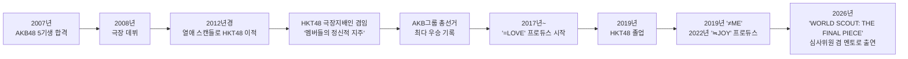
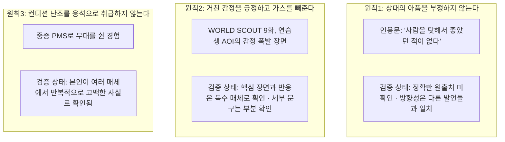

## 목차

1. 들어가며 — 이 게시물의 정체
2. 사시하라 리노는 실제로 누구인가
3. 첫 번째 원칙 검증 — "상대의 아픔을 절대 부정하지 않는다"
4. 두 번째 원칙 검증 — "거친 감정을 긍정하고 가스를 빼준다"
5. 세 번째 원칙 검증 — "컨디션 난조를 응석으로 취급하지 않는다"
6. 종합 평가 — 검증된 사실과 재구성된 해석 사이의 간극
7. 그럼에도 남는 실천적 시사점
8. 참고 자료

---

## 1. 들어가며 — 이 게시물의 정체

올려주신 [세 장의 슬라이드와 텍스트](https://x.com/kaigoyametai1/status/2077695779880546459)는 X(옛 트위터)와 스레드에서 활동하는 일본 계정 "ねこケア・メンタル弱者のミカタ"(고양이 케어·멘탈 약자의 편, 계정명 @kaigoyametai1)가 작성한 콘텐츠다. 이 계정의 자기소개를 확인해 보면, 운영자는 개호(요양보호) 업계에서 15년간 일하며 실비잔업 월 100시간, 불합리한 인간관계를 겪고 "멘탈 한계"에 도달했던 경험을 갖고 있고, 이후 멘탈 관련 서적을 100권 읽고 스스로 멘탈 관리법을 체득했다는 서사를 내세우며, 같은 고통을 겪는 직장인들에게 "멘탈을 무너뜨리지 않는 법"을 매일 콘텐츠로 발신하고 있다고 밝히고 있다[9]. 이 계정은 이번 사시하라 리노 편 외에도 호소야마 유야, 요시자와 료, 호소키 가즈코, "아노짱" 등 유명인의 실제 언행 한 토막을 소재로 삼아 "왜 이 사람은 멘탈이 무너지지 않는가"라는 동일한 포맷의 시리즈를 반복적으로 발행해 온 것이 확인된다[9]. 즉 이번 게시물은 학술 기관이나 심리학 연구자가 작성한 분석 리포트가 아니라, 개인 인플루언서가 자신의 콘텐츠 시리즈 공식에 맞춰 유명인의 일화를 소재로 삼아 심리학 용어를 덧입힌 자기계발형 게시물이라는 점을 먼저 분명히 해 둘 필요가 있다.

게시물의 구조 자체는 일관되어 있다. 먼저 "요즘 젊은이는 근성이 없다"는 식으로 타인의 고통을 자신의 잣대로 재단하다가 고립되어 스스로도 무너졌던 과거의 자기 자신을 고백하는 도입부를 배치하고, 이어서 사시하라 리노라는 실존 인물의 실제 발언과 방송 장면 세 가지를 근거로 삼아 "상대의 아픔을 부정하지 않는다", "거친 감정을 긍정하고 가스를 빼준다", "컨디션 난조를 응석으로 취급하지 않는다"는 세 가지 원칙을 도출한다. 그리고 각 원칙마다 심리적 안전성, 카타르시스 효과와 리프레이밍, 생리적 요인의 수용이라는 심리학·조직행동학 용어를 붙여 "이것은 사실 매우 논리적인 매니지먼트 시스템이었다"는 결론으로 이어간다. 아래에서는 이 세 가지 원칙이 딛고 있는 사실관계가 실제로 얼마나 검증되는지, 그리고 거기에 붙은 심리학 용어들이 학술적으로 얼마나 정확하게 쓰이고 있는지를 하나씩 짚어보려 한다.

---

## 2. 사시하라 리노는 실제로 누구인가

본론에 들어가기 전에, 게시물이 전제로 삼고 있는 인물 자체의 이력을 검증해 둘 필요가 있다. 사시하라 리노는 1992년 11월 21일 오이타현 출신으로, 2007년 AKB48 5기생 오디션에 합격해 2008년 3월 극장 무대에 데뷔했다[1][9]. 데뷔 초기에는 외모 평가에서 박한 평을 받았음에도 불구하고 이후 AKB48 그룹 총선거에서 여러 차례 정상에 올랐고, 소속 그룹 공식 프로필에는 "사상 최초, 전인미답의 3연패(통산 4회)"라는 기록으로 소개되어 있다[9]. 다만 이 우승 횟수는 매체에 따라 "2연패"로 표현되기도 하는 등 보도마다 다소 차이가 있어[3], 정확한 횟수는 공식 프로필 쪽 표기를 기준으로 삼는 것이 안전하다.

활동 중이던 2012년경 열애 스캔들이 주간지에 보도되면서, 당시 AKB48 그룹 총합 프로듀서였던 아키모토 야스시의 결정으로 자매 그룹인 HKT48로 전격 이적하게 된 일화도 확인된다[7]. 흥미로운 지점은 이 좌천성 이적이 오히려 그녀의 경력에서 중요한 전환점이 되었다는 사실이다. HKT48 이적 후 그녀는 같은 그룹의 극장지배인(劇場支配人)이라는 직책을 겸임하게 되는데, 그룹이 프로듀서 사시하라 리노를 소개하는 공식 페이지에는 이 시기의 그녀를 "많은 멤버의 정신적 지주가 되었다"고 명시적으로 서술하고 있다[1]. 즉 "후배의 마음을 돌보는 선배"라는 이미지는 이번 게시물이 처음 만들어낸 서사가 아니라, 소속사와 프로듀스 그룹 공식 채널이 오래전부터 그녀를 소개할 때 사용해 온 표현이라는 점에서 최소한 근거 없는 창작은 아니라고 볼 수 있다.

2019년 4월 HKT48을 졸업한 이후 그녀는 아이돌 그룹 프로듀서로서의 정체성을 본격화한다. 2017년부터 준비해 데뷔시킨 "=LOVE(이코라브)"를 시작으로, 2019년 "≠ME(노이미)", 2022년 "≒JOY(니아조이)"까지 세 개의 그룹을 잇달아 프로듀스했고, 이 세 그룹의 이름을 모두 수학 기호로 통일한 작명 방식은 업계에서 "세계관 설계력"으로 평가받기도 한다[6][8]. 2026년 현재는 여기에 더해 HYBE와 게펀 레코드(유니버설 뮤직그룹 산하)가 공동 기획한 글로벌 스카우트 프로젝트 "WORLD SCOUT: THE FINAL PIECE"에 스튜디오 캐스트(심사위원 겸 멘토)로 출연하며 활동 반경을 K-POP/글로벌 오디션 영역으로도 넓히고 있다[6][30]. 이 프로그램이 바로 게시물의 두 번째 원칙에서 근거로 제시된 "오디션 프로그램" 일화의 실제 출처다.

---

## 3. 첫 번째 원칙 검증 — "상대의 아픔을 절대 부정하지 않는다"

게시물의 첫 번째 슬라이드는 사시하라가 프로듀서로서 멤버나 스태프로부터 뜻밖의 불만을 들어도 절대 나무라지 않으며, 그 근거로 "사람을 탓해서 좋았던 적은 한 번도 없다", "혼났을 때의 아픔은 본인만이 안다"는 취지의 발언을 인용하고 있다. 이 두 문장을 정확히 언제 어떤 매체에서 사시하라 본인이 발화했는지를 원출처까지 추적해 보았으나, 여러 차례 검색을 시도한 결과로도 이 정확한 문구가 등장하는 1차 출처를 특정하지는 못했다. 이 부분은 검증 실패로 솔직히 밝혀둔다.

다만 방향성 자체는 그녀의 다른 공개 발언들과 상당히 일치한다. 예를 들어 잡지 안안(anan)과의 인터뷰에서 그녀는 "=LOVE"를 프로듀스하며 "업계 전체에서 가장 클린한 환경을 만들어주고 싶다"고 말했고, 멤버 각자에게 어떤 일을 하고 싶고 어떤 일을 꺼리는지 매번 직접 확인한 뒤 일을 배정한다고 밝힌 바 있다[8]. 또한 과거 예능 프로그램에서 후배 아이돌들과의 스킨십을 개그 소재로 삼았던 이른바 "사시하라스멘트" 관행에 대해서도, 2025년 방송인 SHELLY의 유튜브 채널에 출연해 "당시의 인식이 얕았다", "지금 정말 후회하고 있다"며 스스로의 과거 언행을 인정하고 사과한 사실도 확인된다[53][55][56]. 이런 사례들은 "타인을 일방적으로 탓하지 않고 자신의 잘못도 인정하는 태도"라는 게시물의 서술 방향과는 결이 맞지만, 어디까지나 정황 증거일 뿐 "怒られた痛みは本人にしかわからない"라는 구체적 인용문 자체를 뒷받침하는 확증은 아니라는 점을 분명히 해 둔다.

여기에 붙은 "심리적 안전성(psychological safety)"이라는 용어에 대해서도 짚어볼 필요가 있다. 이 개념은 하버드 경영대학원의 에이미 에드먼슨 교수가 1999년 정립한 조직행동학 이론으로, 팀 구성원이 실수를 인정하거나 반대 의견을 내는 등 대인관계상의 위험을 감수해도 처벌받지 않을 것이라는 팀 전체의 공유된 믿음을 가리킨다. 즉 원래 이 개념은 리더 한 사람이 부하의 불만을 판단하지 않고 들어준다는 일대일 차원의 태도보다 훨씬 넓은, 팀 구성원 전원이 공유하는 심리적 분위기를 가리키는 말이다. 게시물이 소개한 "상대의 말을 부정하지 않고 받아들인다"는 태도는 심리적 안전성을 구축하는 데 기여할 수 있는 요소 중 하나임은 분명하지만, 그 자체가 곧 심리적 안전성의 전체 정의는 아니다. 리더의 경청 태도 하나를 근거로 "심리적 안전성을 구축하는 최강의 접근법"이라고 단정하는 것은 학술 개념을 다소 단순화해서 가져다 쓴 표현이라고 보는 편이 정확하다.

---

## 4. 두 번째 원칙 검증 — "거친 감정을 긍정하고 가스를 빼준다"

두 번째 원칙은 세 원칙 중 가장 구체적으로 사실관계를 확인할 수 있었던 부분이다. 게시물이 언급하는 "오디션 프로그램에서 극한 상태에 몰린 연습생이 울면서 강한 말로 감정을 터뜨렸다"는 장면은 실제로 존재한다. HYBE와 게펀 레코드가 함께 제작해 2026년 2월부터 ABEMA에서 방영 중인 오디션 프로그램 "WORLD SCOUT: THE FINAL PIECE" 제9화에서, 최종 후보로 남은 연습생 중 한 명인 오타니 아오이(오이·19세, 방송상 활동명 AOI)가 추가 합류한 멤버에 대한 불만과 스트레스를 숨기지 않고 "괜찮을 리가 없잖아" 같은 격한 말투로 감정을 터뜨리는 장면이 실제로 방영되었다[32][34][38]. 이 장면을 본 사시하라는 이를 질책하는 대신 "근래 보기 드물게 본모습을 보여주고 있다"고 표현했고, 스튜디오에 함께 있던 LE SSERAFIM의 SAKURA 등도 여기에 호응하는 반응을 보였다는 점, 그리고 사시하라 본인이 "면담이 필요하다", "나쁜 방향으로 가고 있다"는 취지로 우려 섞인 진단을 내렸다는 점까지는 복수의 연예 매체 보도를 통해 명확히 확인된다[32][34].

다만 게시물에 등장하는 "1대1 면담으로 가스를 빼주고 싶다"는 정확한 문구까지는 확인이 부분적이라는 점도 함께 밝혀둔다. 매체 보도들이 공통으로 인용하는 표현은 "면담이 필요하다"는 진단이고, 여기에 "1대1"이나 "가스 빼기"라는 구체적 표현을 사시하라 본인이 방송에서 그대로 말했는지는 본 조사에서 확보한 기사 스니펫만으로는 단정하기 어렵다. 즉 이 원칙의 핵심 골격—실제로 이런 방송 장면이 있었고, 사시하라가 감정 폭발을 부정적으로 야단치는 대신 "본모습을 보여준 것"이라는 긍정적 언어로 반응했다는 것—은 사실로 확인되지만, 세부 문구는 게시물 작성자가 방송 전체 맥락을 보고 재구성했거나 요약했을 가능성을 열어두어야 한다.

이 장면에 붙은 "카타르시스 효과"와 "리프레이밍"이라는 두 개념에 대해서는 조금 더 비판적으로 짚어볼 필요가 있다. 리프레이밍, 즉 같은 사건을 다른 틀로 재해석하는 기법은 인지행동치료(CBT)에서 실제로 널리 쓰이는 정식 기법이고, "감정 폭발"을 "문제아의 신호"가 아니라 "본모습을 드러낸 신뢰의 신호"로 재해석한 사시하라의 반응은 이 기법의 적절한 적용 사례로 볼 수 있다. 반면 "카타르시스 효과"는 조금 더 신중하게 다뤄야 하는 개념이다. 감정을 안전한 곳에서 말로 쏟아내면 억눌린 스트레스가 정화된다는 통념은 아리스토텔레스의 연극론과 프로이트의 정신분석에서 비롯된 오래된 개념이지만, 현대 심리학 실험 연구, 특히 분노 표출과 관련된 여러 메타분석 연구에서는 오히려 감정을 그대로 쏟아내는 행위가 분노를 가라앉히기는커녕 강화하는 경우가 많다는 결과가 반복적으로 보고되어 왔다. 다시 말해 "가스를 빼면 무조건 편해진다"는 통념은 현재 심리학계에서 결코 정설로 합의된 이론이 아니라 오히려 논쟁적인 주제에 가깝다.

게시물이 언급한 "뇌의 편도체 흥분을 가라앉힌다"는 표현도 흥미로운 지점이다. 이 표현 자체는 완전히 허구는 아니다. 신경과학자 매튜 리버먼 등이 수행한 이른바 "정서 명명하기(affect labeling)" 연구에서는, 부정적 감정을 언어로 표현하는 행위가 실제로 편도체 활성도를 낮추고 전전두피질의 조절 기능을 활성화한다는 결과가 보고된 바 있다. 다만 이것은 엄밀히 말해 "억눌린 감정을 격하게 쏟아내는 카타르시스"라기보다는 "안전한 관계 속에서 자신의 감정 상태를 차분히 언어로 정리해 보는 행위"에 가까운 연구다. 게시물은 이 두 가지—고전적 카타르시스 이론과 현대의 정서 명명하기 연구—를 명확히 구분하지 않은 채 뭉뚱그려 "과학적으로 검증된 효과"라고 서술하고 있는데, 이는 독자에게 실제보다 더 확고한 과학적 합의가 존재하는 것처럼 보이게 만드는 다소 과장된 서술 방식이라고 봐야 한다.

---

## 5. 세 번째 원칙 검증 — "컨디션 난조를 응석으로 취급하지 않는다"

세 원칙 가운데 가장 명확하게 사실로 확인되는 부분이 바로 이 세 번째 원칙이다. 사시하라는 아이돌 활동 시절 월경전증후군(PMS)이 매우 심해 감정 기복이 크게 흔들리는 시기를 겪었고, 실제로 이를 이유로 무대 출연을 쉰 적이 있다고 여러 매체에서 반복적으로 밝혀왔다. 2024년 안안(anan) 인터뷰에서 그녀는 "옛날부터 생리통은 딱히 없었지만 PMS가 정말 심해서, 그 시기가 오면 감정 기복이 격해져 계속 울고 계속 화를 내는 느낌이었다. 그룹 재적 시절에는 이를 이유로 무대를 쉬게 해준 적도 있었다"고 직접 밝혔다[11]. 이 인터뷰에서 그녀는 당시에는 몸에 대한 지식이 없어 왜 감정이 불안정해지는지 몰라 불안했지만, PMS라는 증상의 존재를 알고 나서야 "그럼 어쩔 수 없지"라고 받아들일 수 있었고, 이후 시판 약과 피임약 복용을 통해 증상이 크게 완화되었다고 설명하고 있다[11]. 같은 취지의 고백은 2023년 12월 ABEMA 방송에서도 확인되며, 당시 그녀는 "전부의 감정이 리미터가 벗겨지는 것처럼 되어버린다", "죄송하다고 생각하면서도 날뛰게 된다"고 표현한 바 있다[12][13][14]. 즉 이 원칙의 사실적 근거는 창작이나 과장이 아니라 사시하라 본인이 수년에 걸쳐 여러 매체에서 스스로 공개해 온 개인사라는 점에서 세 원칙 가운데 가장 두텁게 검증된다.

이 사실에 붙은 "생리적 요인의 수용"이라는 프레이밍 자체는 무리가 없다. PMS는 배란 이후 황체호르몬 등의 급격한 변화로 인해 실제로 감정 조절에 영향을 줄 수 있다는 것이 부인과학에서 인정하는 생리적 현상이며, 이를 "근성 부족"이 아니라 신체적 요인으로 받아들이고 필요한 휴식을 제공하는 것은 산업보건 분야에서도 합리적인 접근으로 평가된다. 다만 게시물이 이 지점에서 "번아웃 증후군을 일으키는 최악의 매니지먼트"라거나 "가장 합리적인 지속가능성 전략"이라는 다소 단정적인 표현을 쓰고 있는데, 이는 특정 개인의 경험 하나로부터 조직 전체의 매니지먼트 원리를 일반화한 수사적 비약이라는 점은 짚어둘 필요가 있다. 한 사람의 PMS 경험과 그로부터 얻은 배려가, 조직 전체의 번아웃 예방 체계로 자동 확장되는 것은 아니기 때문이다.

---

## 6. 종합 평가 — 검증된 사실과 재구성된 해석 사이의 간극

세 가지 원칙을 놓고 정리하면, 이 게시물이 딛고 서 있는 사실적 지반의 두께는 원칙마다 다르다. 세 번째 원칙(PMS로 무대를 쉰 경험)은 사시하라 본인의 반복된 공개 발언으로 가장 두텁게 검증되고, 두 번째 원칙(오디션 프로그램에서의 리프레이밍)은 방송 장면 자체와 핵심 반응이 복수의 연예 매체 보도로 확인되지만 세부 문구는 부분적으로만 확인되며, 첫 번째 원칙(타인을 탓하지 않는다는 발언)은 방향성만 정황적으로 일치할 뿐 정확한 인용문의 원출처는 이번 조사로 확인하지 못했다. 세 원칙 모두에서 공통적으로 나타나는 패턴은, 실존 인물의 실제 언행이라는 사실적 뼈대 위에 심리학·조직행동학 용어라는 살을 입히는 방식으로 콘텐츠가 구성되어 있다는 점이다.

이 용어들의 학술적 정확도 또한 균일하지 않다. 리프레이밍과 심리적 안전성이라는 개념은 실제 학술 이론에 비교적 근접하게 적용된 반면, 카타르시스 효과는 현대 심리학에서 오히려 반박적 근거가 많은 논쟁적 개념임에도 마치 확립된 정설처럼 서술되어 있고, 편도체 언급 역시 고전적 카타르시스 이론과 최신 정서 명명하기 연구를 구분 없이 뒤섞어 실제보다 과학적으로 더 확고한 근거가 있는 것처럼 보이게 만드는 수사적 효과를 내고 있다. 요컨대 이 게시물은 "완전한 허구"도 아니고 "엄밀한 학술 분석"도 아닌, 실제 유명인의 일화를 소재 삼아 대중적으로 소비하기 좋은 심리학 용어를 덧입힌 자기계발형 콘텐츠라는 성격 규정이 가장 정확하다.

---

## 7. 그럼에도 남는 실천적 시사점

용어의 과장이나 인용의 불완전함과는 별개로, 이 게시물이 소개하는 세 가지 태도 자체—상대의 말을 곧바로 부정하지 않는 것, 감정 폭발을 문제 행동이 아니라 신호로 재해석해 안전한 자리에서 풀어내게 하는 것, 컨디션 난조를 근성 부족이 아니라 몸의 신호로 받아들이고 쉴 자리를 마련하는 것—은 조직 관리 실무에서 실제로 유효성이 인정되는 접근들이다. 다만 그 유효성의 근거는 "사시하라 리노가 그렇게 말했기 때문"이 아니라, 심리적 안전성이나 인지행동치료의 리프레이밍처럼 독립적으로 검증된 조직행동학·임상심리학 연구에 있다는 점을 구분해서 받아들이는 것이 이 게시물을 가장 건강하게 소비하는 방법이라고 할 수 있다.

---

## 8. 참고 자료

- [1] "PRODUCER" ＝LOVE 공식 사이트, https://equal-love.jp/feature/producer
- [2] 太田프로덕션 공식 프로필, https://www.ohtapro.co.jp/talent/sashihararino.html
- [3] "指原莉乃は「希代のプロデューサー」" 닛칸겐다이, https://www.nikkan-gendai.com/articles/view/geino/384814
- [6] "指原莉乃「人って何度でもチャレンジできる」" 오리콘/Yahoo뉴스, https://news.yahoo.co.jp/articles/14bac4a6acecb33d2ca4c717dea4a39316eb76a8
- [7] "無双し続ける《指原莉乃》異端から王道極めた凄み" 도요케이자이 온라인, https://toyokeizai.net/articles/-/924983
- [8] "指原莉乃「業界全体の中で一番クリーンな環境にしてあげたい」" anan, https://ananweb.jp/categories/entertainment/21570
- [9] X 계정 "ねこケア・メンタル弱者のミカタ" (@kaigoyametai1) 프로필 및 게시물, https://x.com/kaigoyametai1
- [11] "指原莉乃「数年後の自分に…」" Infoseek뉴스(anan 인터뷰 게재), https://news.infoseek.co.jp/article/anan_573554/
- [12][13][14] "指原莉乃がPMSの悩みを明かす" 라이브도어뉴스/ABEMA TIMES, https://news.livedoor.com/article/detail/19485524/ , https://times.abema.tv/articles/-/10107684
- [32][34] "指原莉乃、メンタル限界で荒れた練習生に「面談が必要」" 모델프레스/ABEMA TIMES, https://times.abema.tv/articles/-/10238952
- [38] 위 기사 본문 (ABEMA TIMES 원문 페이지)
- [53][55][56] "指原莉乃が語った「サシハラスメント」の後悔" 사이조 온라인/오리콘/라이브도어뉴스, https://cyzo.jp/geinou/post_383627/ , https://www.oricon.co.jp/news/2380736/full/

※ 이 문서는 2026년 7월 기준 공개된 일본어 매체 보도와 공식 프로필 자료를 교차 검증하여 작성되었으며, 원출처를 확정하지 못한 인용문은 본문에 그 사실을 명시해 두었다.
