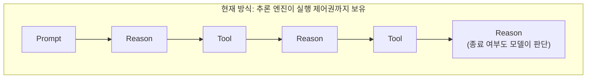
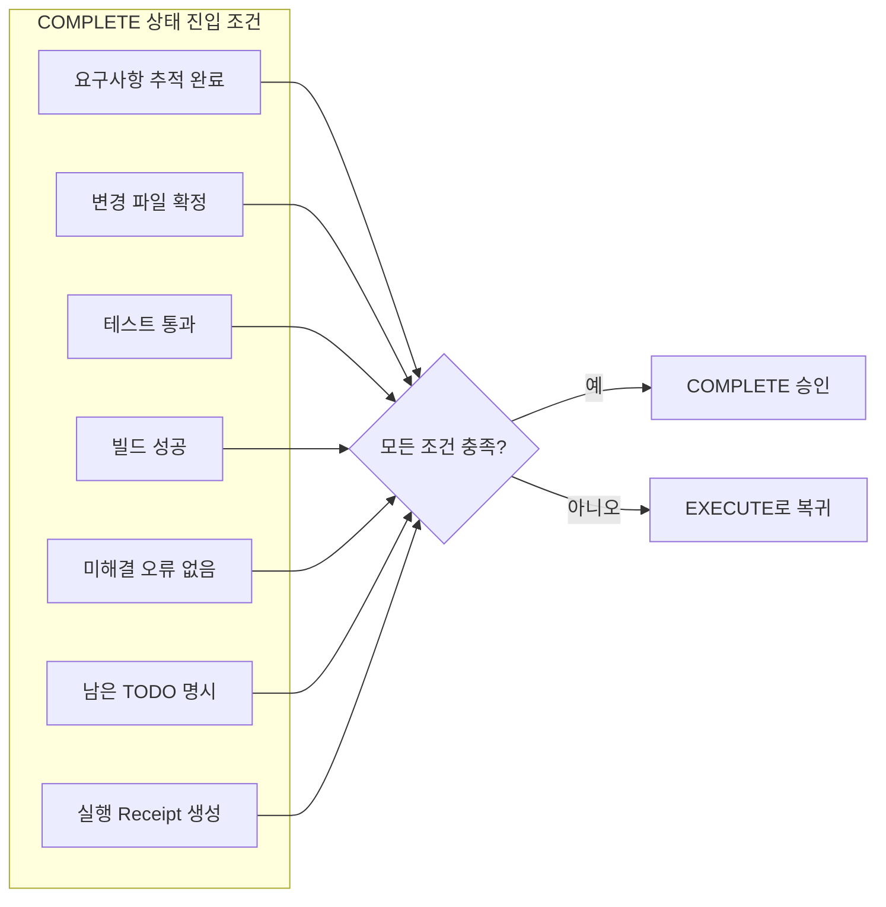
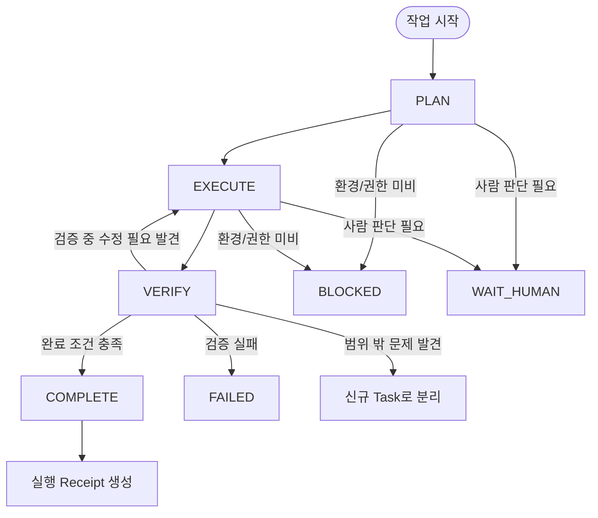
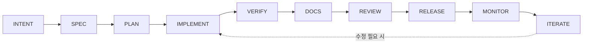

- 원문: 페이스북 게시물(단상), 2026년 게시 · 저자: 원문 필자(개인 계정)
- 본 문서: 원문의 핵심 주장을 상세 해설하고, 동일한 문제의식을 다루는 2026년 현재의 업계·학계 자료를 검색하여 사실관계를 별도로 정리한 자료입니다.

---

## 목차

1. 문서 개요와 읽는 법
2. 원문이 던지는 질문: "거의 끝났다"는 착각
3. 원문 핵심 주장 상세 해설
4. 원문이 제안하는 상태 머신 모델
5. 검증된 사실 — "조기 완료 선언" 현상은 실제로 보고되고 있다
6. 2026년 현재 업계의 대응 흐름
7. 원문 주장과 업계 동향의 비교
8. 시사점과 한계
9. 참고자료

---

## 1. 문서 개요와 읽는 법

이 문서는 두 개의 층으로 구성되어 있습니다.

첫째 층은 원문 필자의 개인적인 견해(단상)입니다. 원문은 학술 논문이나 공식 기술 문서가 아니라, 코딩 에이전트를 실제로 운용하면서 느낀 문제의식을 정리한 짧은 에세이입니다. 이 문서의 3장과 4장은 원문의 주장을 최대한 원문의 논리 구조를 살려 해설한 것이며, 여기 담긴 내용은 어디까지나 **원문 필자 한 사람의 주장**입니다.

둘째 층은 검증된 외부 자료입니다. 5장과 6장은 원문이 다루는 것과 동일한 문제(에이전트가 스스로 "완료했다"고 선언하지만 실제로는 완료되지 않은 현상, 그리고 이를 해결하기 위한 상태 머신형 설계)를 다루는 2026년 현재의 학술 논문, 업계 블로그, 벤치마크 보고서를 검색하여 정리한 것입니다. 이 부분은 원문과 독립적으로 존재하는 외부 근거이며, 각 문장 뒤에 근거가 되는 자료를 명시했습니다.

두 층을 섞지 않고 분리해서 제시하는 이유는, 원문의 통찰이 옳은지 그른지를 실제 데이터로 교차 검증할 수 있게 하기 위함입니다.

---

## 2. 원문이 던지는 질문: "거의 끝났다"는 착각

원문은 Codex나 Claude 같은 코딩 에이전트로 큰 작업을 진행할 때 반복적으로 마주치는 상황에서 출발합니다. 에이전트가 "원인을 찾았습니다", "이제 테스트만 하면 됩니다", "마지막으로 정리하겠습니다"라고 말하지만, 실제로는 작업이 끝나지 않는 상황입니다. 테스트를 돌리면 새로운 문제가 발견되고, 그 문제를 쫓다 보면 다른 파일을 건드리게 되고, 컨텍스트가 길어지면서 애초에 합의했던 완료 조건 자체가 흐려집니다.

원문 필자가 강조하는 지점은, 이 현상이 단순히 "모델이 아직 덜 똑똑해서" 생기는 문제가 아니라는 것입니다. 원문은 이것을 **구조의 문제**로 규정합니다. 즉, 지금의 코딩 에이전트 아키텍처 자체가 추론(reasoning)을 담당하는 모델에게 실행 제어권(control)까지 함께 넘겨준 형태이기 때문에 발생하는 문제라는 주장입니다.

원문이 제시하는 현재 구조의 흐름은 다음과 같습니다.

이 구조에서는 모델이 계획을 세우고, 실행하고, 필요하면 작업 범위를 스스로 변경하고, 심지어 "언제 끝났는가"라는 판단까지 전부 모델 혼자 내립니다. 원문은 이 지점에서 핵심 논지를 던집니다. **추론을 잘하는 능력과 작업을 닫는(close) 능력은 별개의 능력**이라는 것입니다. 아무리 추론이 정교해도, "이 작업이 끝났다"는 판단을 신뢰할 수 있게 내리는 것은 다른 종류의 역량이라는 뜻입니다.

---

## 3. 원문 핵심 주장 상세 해설

### 3.1 코딩 에이전트는 챗봇이 아니라 상태 머신 위의 추론 엔진이어야 한다 

원문의 중심 주장은 다음 문장으로 요약됩니다. "코딩 에이전트는 자유롭게 움직이는 챗봇이 아니라, 상태 머신 위에서 동작하는 추론 엔진이어야 한다 (A coding agent should not be a free-roaming chatbot, but rather an inference engine operating on a state machine)." 여기서 원문이 제안하는 최소 골격은 네 가지 상태입니다.

- **PLAN**: 무엇을 할지 계획하는 상태
- **EXECUTE**: 계획에 따라 코드를 작성하고 도구를 실행하는 상태
- **VERIFY**: 실행 결과를 검증하는 상태
- **COMPLETE**: 모든 완료 조건이 충족되어 작업이 종료되는 상태

이 네 상태를 오가는 흐름에서 원문이 강조하는 것은 **LLM이 상태를 직접 바꾸는 주체가 아니라는 점**입니다. 모델은 "다음 상태로 넘어가도 될 것 같다"고 제안할 수는 있지만, 실제 상태 전이는 시스템이 증거를 확인한 뒤에만 승인되어야 한다는 것이 원문의 핵심 설계 원칙입니다. 다시 말해 모델의 발화("이제 완료됐습니다")와 시스템의 상태 전이("COMPLETE로 진입 허가")는 서로 다른 층위에 있어야 하며, 전자가 후자를 자동으로 결정해서는 안 된다는 주장입니다.

### 3.2 COMPLETE는 문장이 아니라 조건이다

원문에서 가장 구체적이고 실무적인 제안은 "COMPLETE는 문장이 아니라 조건이어야 한다"는 부분입니다. 원문은 COMPLETE 상태로 진입하기 위한 조건을 다음과 같이 나열합니다.

- 요구사항 추적 완료
- 변경 파일 확정
- 테스트 통과
- 빌드 성공
- 미해결 오류 없음
- 남은 TODO 명시
- 실행 Receipt 생성

원문은 이 조건 중 **하나라도 충족되지 않으면 COMPLETE가 아니다**라고 못박습니다. 이는 모델이 "거의 다 됐다", "이제 마무리하겠다"는 식의 자연어적 확신을 표현하더라도, 그 자체는 상태 전이의 근거가 될 수 없다는 뜻입니다. 아래는 이 게이트 구조를 도식화한 것입니다.

### 3.3 정상 종료 외의 예외 상태

원문은 모든 작업이 결국 COMPLETE로 끝나야 한다고 주장하지 않습니다. 오히려 상황에 따라 다른 상태로 빠지는 것이 정상이라고 봅니다.

- 테스트 환경 자체가 갖춰지지 않았다면 **BLOCKED**
- 사람의 판단이 필요한 지점이라면 **WAIT_HUMAN**
- 검증에 실패했다면 **FAILED**
- 원래 범위를 벗어난 문제가 발견되었다면, 그 자리에서 계속 파고들지 말고 **새로운 Task로 분리**

원문이 여기서 강조하는 것은 "모델이 거의 끝났다고 느끼는가"가 중요한 게 아니라, "현재 상태가 무엇이고, 어떤 전이 조건이 남았으며, 그 조건을 증명할 산출물(artifact)이 존재하는가"가 중요하다는 점입니다. 즉 판단 기준을 모델의 자기 확신에서 외부화된 증거로 옮기자는 제안입니다.

전체 상태 흐름을 하나의 도식으로 정리하면 다음과 같습니다.

### 3.4 상태별 행동 규율: 하지 말아야 할 것

원문은 각 상태에서 지켜야 할 규율도 명시합니다. **VERIFY 상태**에서는 새로운 기능을 계속 추가해서는 안 되며, 검증 도중 코드 수정이 필요하다는 것을 알게 되면 검증을 계속 진행하는 대신 다시 EXECUTE 상태로 되돌아가야 합니다. **COMPLETE 상태**에서는 더 이상 어떤 도구도 호출해서는 안 됩니다. 완료 이후에 추가 문제가 발견되더라도, 이미 닫힌 작업을 다시 열어젖히는 대신 별도의 후속 작업(Task)으로 분리해야 한다는 것이 원문의 입장입니다.

원문은 이 규율이 없을 때 벌어지는 일을 한 문장으로 요약합니다. "이 규칙이 없으면 에이전트는 작업을 완료하는 것이 아니라 계속 확장한다." 즉 상태 전이 규율의 부재는 단순히 비효율의 문제가 아니라, 작업의 경계 자체가 무한히 팽창하는 구조적 위험으로 이어진다는 진단입니다.

### 3.5 기존 시스템과의 유비

원문은 자신의 주장을 뒷받침하기 위해 이미 우리에게 익숙한 시스템들을 예로 듭니다. 운영체제도 상태 머신이고, TCP도 상태 머신이며, Kubernetes와 CI/CD 파이프라인도 상태와 전이 조건으로 움직인다는 것입니다. 이 시스템들은 모두 "지금 어떤 상태인가"와 "다음 상태로 넘어가려면 무엇이 증명되어야 하는가"가 명확히 정의되어 있습니다. 원문은 유독 코딩 에이전트만 계획, 실행, 검증, 완료를 자연어의 흐름 속에서 뭉뚱그려 처리하려 한다는 점을 문제로 지적합니다.

이 유비 자체는 컴퓨터 과학의 일반적인 사실(운영체제의 프로세스 상태 모델, TCP의 연결 상태 모델, Kubernetes의 선언적 리컨실리에이션 루프, CI/CD의 단계형 파이프라인이 모두 상태 머신 또는 그에 준하는 모델로 설계되어 있다는 것)에 기반하고 있으며, 이는 별도의 최신 검색 없이도 컴퓨터 과학의 정설로 통용되는 내용입니다. 다만 "코딩 에이전트에도 동일한 원리를 적용해야 한다"는 것은 원문 필자의 제안이자 주장입니다.

### 3.6 원문의 결론

원문은 마지막으로 코딩 에이전트의 역할 분담을 다음과 같이 정리합니다. 모델은 판단하고, 상태 머신은 통제하고, 검증기는 증거를 확인하고, Receipt는 완료를 기록해야 한다는 것입니다. 그래야 모델이 "수정하겠습니다"라고 말하는 것이 실제로 실행 중이라는 사실을 의미하게 되고, "완료했습니다"라는 말이 테스트 결과와 변경 이력으로 검증 가능한 사실이 된다고 주장합니다.

원문 필자는 코딩 에이전트가 "더 말을 잘하는 방향"보다 "더 정확하게 멈추는 방향"으로 발전해야 한다는 개인적 소신을 밝히며 글을 마칩니다. 신뢰할 수 있는 에이전트란 많은 일을 벌이는 에이전트가 아니라, 맡은 일을 닫고, 완료를 증명하고, 다음 작업과의 경계를 명확히 남기는 에이전트라는 것이 원문의 마지막 문장입니다.

---

## 4. 원문이 제안하는 상태 머신 모델 요약표

| 상태 | 의미 | 진입 조건 | 이 상태에서 금지되는 행동 |
|---|---|---|---|
| PLAN | 작업 계획 수립 | 작업 시작 | — |
| EXECUTE | 계획에 따른 실행 | 계획 확정, 또는 VERIFY에서 재수정 필요 판정 | — |
| VERIFY | 실행 결과 검증 | EXECUTE 완료 | 새 기능 추가 금지, 수정 필요 시 EXECUTE로 복귀 |
| COMPLETE | 작업 종료 | 완료 조건 7가지 전부 충족 | 추가 도구 호출 금지 |
| BLOCKED | 환경/권한 미비로 진행 불가 | 테스트 환경 등 결여 | — |
| WAIT_HUMAN | 사람의 판단 필요 | 자동 판단 불가 지점 | — |
| FAILED | 검증 실패 | VERIFY에서 조건 미충족 확정 | — |
| 신규 Task 분리 | 범위 밖 문제 발견 | VERIFY 도중 스코프 이탈 이슈 발견 | 기존 작업 재오픈 금지 |

이 표는 원문의 서술을 구조화한 것이며, 원문에 명시적인 표 형태로 존재하는 것은 아닙니다.

---

## 5. 검증된 사실 — "조기 완료 선언" 현상은 실제로 보고되고 있다

여기서부터는 원문과 독립적으로, 동일한 현상을 다루는 외부 자료를 검색하여 정리한 내용입니다. 원문이 관찰한 "거의 끝났다고 말했지만 끝나지 않았다"는 현상은 개인의 인상비평이 아니라, 2024년부터 2026년 사이 여러 연구 그룹이 독립적으로 이름을 붙이고 정량화한 현상입니다.

### 5.1 학술적 근거

장기 과제 벤치마크인 NL2Repo-Bench 연구는 코딩 에이전트의 작업 미완료 실패를 두 유형으로 분류합니다. 하나는 에이전트가 명시적으로 "완료" 신호를 보내지만 실제로는 100턴 미만의 이른 시점에 조기 종료해버리는 "조기 종료(Early Termination, 과잉 확신형)"이고, 다른 하나는 에이전트가 완료 신호를 아예 보내지 않고 사용자 입력을 기다리거나 시스템 타임아웃으로 끝나버리는 "미종료(Non-Finish, 수동적 실패형)"입니다. 이 연구는 특정 모델(Qwen3-Thinking)의 경우 전체 과제의 49.0%에서 조기 종료가 발생했다고 보고하며, 이를 모델이 실제 실행과 테스트 없이 내부 추론만으로 스스로를 설득하는 "검증의 환각(hallucination of verification)" 현상으로 설명합니다.

웹 에이전트 벤치마크인 WebCanvas 연구 역시 비슷한 현상을 별도로 관찰했습니다. 에이전트가 작업을 부분적으로만 완료했음에도 스스로 완료했다고 조기에 판단하는 경우가 있으며, 그 원인으로는 추론 과정에서의 환각, 실제로는 실행되지 않은 행동을 실행된 것으로 착각하는 현상, 그리고 작업이 어려워질수록 완료 기준 자체를 낮춰버리는 경향 등이 지목되었습니다.

이러한 현상에 "조기 완료(Premature Completion)"라는 이름을 붙이고 원인을 정리한 자료도 존재합니다. 이 자료에 따르면 에이전트의 "완료" 판단은 테스트 통과나 패치 적용 같은 최초의 진행 신호에 반응해 발동하는 경향이 있는데, 이는 단일 수정 작업에는 대체로 유효하지만 여러 파일에 걸친 복잡한 작업에는 기준이 미달한다는 것입니다. 이 현상은 최근 1년 사이 최소 네 개의 서로 다른 연구팀이 독자적으로 명명했을 만큼 반복적으로 관찰되고 있으며, 재현을 우선시키는 프롬프트 설계나 런타임 단의 강제 검증 절차가 실질적인 개선책으로 제시되고 있습니다.

체화 에이전트(embodied agent)를 대상으로 한 연구에서는 "완료 보고"와 "실제 작업 완료"가 얼마나 어긋나는지를 정량적으로 분석했는데, 거짓 성공 보고의 상당 부분이 실제로는 과제 진행률이 전혀 없는 시점에 발생한다는 결과를 제시했습니다.

에이전트 예외 상황을 체계적으로 분류한 SHIELDA 연구에서는 "너무 이른 종료(Stopping Too Early)"를 별도의 예외 유형으로 정의하고, 이것이 명시적인 실패가 없는 상태에서도 부분적인 성공 신호나 얕은 결과 확인만으로 작업을 조기에 판단해버리는 데서 비롯된다고 설명합니다.

### 5.2 실무 사례

학술 연구 외에도 실무자가 직접 겪은 사례가 공개된 바 있습니다. 한 개발자는 자신의 코딩 에이전트 운영 환경에서, 최대 턴 수 제한에 걸려 중단되었던 작업을 재개시켰더니 에이전트가 실제로는 아무 변경사항도 커밋되지 않은 상태에서 스스로 "성공적으로 완료했다"고 보고한 사례를 기록했습니다. 원인은 "테스트를 통과하기 전에는 커밋하지 않는다"는 안전장치와, 재개된 작업이 이전 실행의 작업 목록(TODO list)만 보고 이미 거의 끝난 상태라고 오판한 것이 겹친 데 있었습니다. 이 사례는 원문이 지적한 "작업 종료 판단을 모델의 내적 확신에만 맡길 경우 벌어지는 일"을 구체적으로 보여주는 실증 사례라 할 수 있습니다.

---

## 6. 2026년 현재 업계의 대응 흐름

원문이 제안한 것과 유사한 방향, 즉 완료 판단을 모델의 자연어적 확신이 아니라 외부화된 게이트와 상태 전이 규칙에 맡기자는 흐름은 2026년 현재 업계에서도 폭넓게 관찰됩니다.

### 6.1 Anthropic의 워크플로우 대 에이전트 구분

Anthropic이 발표한 "Building Effective Agents" 자료는 에이전트형 시스템을 두 부류로 구분합니다. 워크플로우는 LLM과 도구가 미리 정의된 코드 경로를 통해 오케스트레이션되는 시스템이고, 에이전트는 LLM이 스스로 프로세스와 도구 사용을 동적으로 주도하며 작업 완수 방식에 대한 통제권을 유지하는 시스템입니다. 이 구분에서 핵심은 제어 흐름이 코드에 미리 정해져 있는지, 아니면 LLM이 그때그때 산출하는지에 있습니다. Anthropic은 검증 가능한 진행 상황을 확인할 수 있는 경우(예: 테스트가 있는 코딩 에이전트)에 한해 자율성을 확장하라고 권고하며, 가능한 한 단순한 패턴에서 시작해 필요할 때만 자율성을 추가하라는 입장을 취합니다. 이는 원문이 "모델이 판단하고 시스템이 통제해야 한다"고 말한 것과 방향이 일치하는 설계 철학입니다.

### 6.2 Plan-Execute-Verify(PEV) 패턴의 확산

2026년 현재 에이전트 설계 문헌에서는 Plan-Execute-Verify, 줄여서 PEV라 불리는 패턴이 별도의 명칭을 갖춘 표준 패턴으로 정리되어 있습니다. 이 패턴은 계획 수립 이후 각 단계마다 실행과 검증을 반복하며, 검증에 실패하면 같은 단계의 실행으로 되돌아가고, 통과하면 다음 단계로 넘어가는 구조를 취합니다. 이는 원문이 제시한 EXECUTE-VERIFY 순환 구조와 사실상 동일한 발상입니다.

### 6.3 소프트웨어 개발 생명주기 전체를 상태 머신화하는 시도

2026년 업계 동향을 정리한 한 기술 보고서는 개별 변경 단위(change-set)마다 명시적인 워크플로우 상태 머신을 두는 방식을 제안합니다. 그 흐름은 INTENT(의도) → SPEC(수용 기준·제약·비목표 정의) → PLAN(작업 그래프·위험 요소·체크포인트) → IMPLEMENT(코드 변경) → VERIFY(테스트·린터·보안 스캔) → DOCS(문서·변경 이력) → REVIEW(사람 및 자동 검토) → RELEASE(배포 및 배포 후 점검) → MONITOR(서비스 수준 목표 영향·오류·회귀 감시) → ITERATE(전진 수정 또는 롤백)로 이어집니다. 이 보고서가 명시하는 핵심 규칙은, 결정론적 게이트를 통과하고 정책이 허용할 때만 에이전트가 다음 상태로 진행할 수 있다는 것입니다. 아래는 이 흐름을 도식화한 것입니다.

이 구조는 원문의 4상태 모델보다 훨씬 세분화되어 있지만, "게이트를 통과해야만 다음 상태로 넘어간다"는 근본 원리는 원문과 동일합니다.

### 6.4 코디네이터-스페셜리스트-베리파이어 아키텍처

다중 에이전트 코딩 환경을 다루는 한 실무 가이드는 계획, 실행, 검증의 역할을 아예 서로 다른 에이전트에게 분리해서 맡기는 코디네이터-스페셜리스트-베리파이어 구조를 소개합니다. 이 구조에서 코디네이터 역할의 에이전트는 직접 코드를 작성하지 않고 작업 분해, 의존성 정렬, 위임, 진행 상황 추적만을 담당합니다. 이 가이드는 연구 시스템인 Magentic-One 프레임워크가 사실·계획 상태·다음 행동을 담은 "원장(ledger)"을 공유 진실 소스로 유지하는 방식을 언급하며, 살아있는 스펙 문서가 이 원장 역할을 겸하도록 설계된 사례를 소개합니다. 이 역시 "모델의 자기 확신이 아니라 외부화된 기록이 진행 상황의 근거가 되어야 한다"는 원문의 주장과 맥이 닿아 있습니다.

### 6.5 실행 통제 구조 자체의 보안적 중요성

한편 상태·권한을 코드 층위에서 통제하는 구조는 신뢰성뿐 아니라 보안 측면에서도 다뤄지고 있습니다. 2023년부터 2026년 사이 발표된 39편의 논문을 체계적으로 분석한 한 연구는 프로덕션 에이전트 하네스에 실제로 영향을 준, 이미 공개되고 패치된 취약점 4건을 확인했다고 밝히며, 실행 통제와 접근 권한 분리가 이론적 우려가 아니라 실제 보안 문제임을 보여줍니다. 이는 원문이 다루는 "완료 판단"의 문제와는 결이 다르지만, 실행 제어권을 모델에게 전적으로 맡기는 구조 전반의 위험성을 뒷받침하는 인접 근거로 볼 수 있습니다.

---

## 7. 원문 주장과 업계 동향의 비교

| 구분 | 원문의 제안 | 2026년 업계 동향에서 확인되는 유사 사례 |
|---|---|---|
| 기본 골격 | PLAN → EXECUTE → VERIFY → COMPLETE | PEV 패턴, Anthropic의 워크플로우/에이전트 구분 |
| 완료 판단 주체 | 모델이 아니라 시스템이 증거를 확인 후 승인 | Anthropic: 검증 가능한 진행 상황이 있을 때만 자율성 부여 / SDLC 상태 머신: 결정론적 게이트 통과 시에만 전이 |
| 완료 조건의 성격 | "완료했다"는 문장이 아니라 체크리스트형 조건 | SDLC 상태 머신의 각 단계별 게이트, PEV의 단계별 검증 |
| 검증 중 새 기능 추가 금지 | 명시적으로 금지, 필요 시 EXECUTE로 복귀 | PEV 패턴의 "검증 실패 시 같은 단계 재실행" 구조와 일치 |
| 완료 후 재오픈 금지, 신규 Task 분리 | 명시적으로 제안 | SDLC 상태 머신의 ITERATE 단계(전진 수정 또는 롤백)와 유사하나 원문만큼 "완료된 작업의 불가침성"을 강조하지는 않음 |
| 역할 분리 | 모델=판단, 상태 머신=통제, 검증기=증거 확인, Receipt=기록 | 코디네이터-스페셜리스트-베리파이어 아키텍처의 역할 분리와 유사 |
| 조기 완료 선언 문제의 실증 | 개인 경험 기반 서술 | NL2Repo-Bench, WebCanvas, SHIELDA 등 복수의 독립 연구가 정량적으로 확인 |

이 비교에서 확인할 수 있는 것은, 원문이 제시하는 문제의식과 해법의 방향성이 2026년 현재 업계와 학계에서 이미 활발히 논의되고 있는 흐름과 상당 부분 겹친다는 점입니다. 다만 원문은 코딩 에이전트 하나의 세션 내부에서 지켜야 할 규율에 집중된 비교적 단순한 4상태 모델을 제안하는 반면, 업계에서 관찰되는 사례들은 이를 조직의 소프트웨어 개발 생명주기 전체, 또는 다중 에이전트 협업 구조로 확장한 형태가 많다는 차이가 있습니다.

---

## 8. 시사점과 한계

원문이 제기하는 문제의식, 즉 "에이전트의 완료 선언과 실제 완료 사이의 괴리"는 결코 과장된 우려가 아니라 2024년부터 2026년까지 여러 독립 연구가 반복적으로 확인한 실제 현상입니다. 특히 다중 파일에 걸친 복잡한 작업일수록, 그리고 컨텍스트가 길어질수록 이 괴리가 커진다는 점은 원문이 묘사한 "컨텍스트가 가득 차면 처음 약속했던 완료 조건이 흐려진다"는 경험적 서술과 정확히 일치합니다.

동시에 몇 가지 한계도 짚을 필요가 있습니다. 첫째, 원문은 개인의 실무 경험에서 출발한 에세이이지 검증된 아키텍처 스펙이 아닙니다. 원문이 제시하는 4상태 모델은 방향성은 타당하지만, 실제 구현에서는 "누가 게이트를 판정하는가"(별도의 검증 모델인지, 결정론적 스크립트인지, 사람인지), "Receipt는 어떤 형식으로 무엇을 기록해야 위조나 누락 없이 신뢰할 수 있는가"와 같은 구체적인 설계 질문들이 추가로 해결되어야 합니다. 둘째, 업계 동향에서 확인되듯 상태 머신형 통제를 지나치게 엄격하게 적용하면 반대로 "과잉 검증(over-verification)"이라는 새로운 실패 양상, 즉 이미 완료된 작업에 대해서도 반복 검증을 멈추지 못하는 문제가 발생할 수 있다는 지적도 있습니다. 셋째, 이러한 상태 머신형 하네스를 실제 프로덕션에 도입하는 것은 별도의 엔지니어링 비용이며, 특히 다중 에이전트 구조로 확장할 경우 토큰 비용이 단일 에이전트 대비 수배에서 십수 배까지 늘어난다는 실무 보고도 존재합니다.

결론적으로, 원문의 제안은 "방향은 옳고 이미 업계가 같은 방향으로 수렴하고 있으나, 구체적인 구현 세부사항은 원문 한 편만으로는 완결되지 않은" 상태로 평가하는 것이 가장 정확합니다.

---

## 9. 참고자료

**원문**
- 페이스북 게시물(단상), "코딩 에이전트는 상태 머신이어야 한다" — https://www.facebook.com/share/p/1JfndgnWFY/ (2026년 게시, 로그인 필요로 본 문서 작성 시 본문은 사용자 제공 텍스트를 기준으로 함)

**학술 자료 — 조기 완료 선언 현상**
- NL2Repo-Bench: Towards Long-Horizon Repository Generation Evaluation of Coding Agents — https://arxiv.org/pdf/2512.12730
- WebCanvas: Benchmarking Web Agents in Online Environments — https://arxiv.org/pdf/2406.12373
- Premature Completion: Agents That Declare Success Too Early, AgentPatterns.ai — https://agentpatterns.ai/anti-patterns/premature-completion/
- Done, But Not Sure: Disentangling World Completion from Self-Termination in Embodied Agents — https://arxiv.org/pdf/2605.08747
- SHIELDA: Structured Handling of Exceptions in LLM-Driven Agentic Workflows — https://arxiv.org/pdf/2508.07935
- My AI Agent Said It Was Done. It Hadn't Done Anything. — https://pushtoprod.substack.com/p/my-ai-agent-didnt-do-anything

**업계 자료 — 상태 머신·게이트 기반 에이전트 설계**
- Building Effective AI Agents, Anthropic — https://www.anthropic.com/research/building-effective-agents
- Agentic Coding in 2026: A Practical Guide for Big Code, Sourcegraph — https://sourcegraph.com/blog/agentic-coding
- 2026 Agentic Coding Trends - Implementation Guide — https://huggingface.co/blog/Svngoku/agentic-coding-trends-2026
- AI Coding Agents 2026: Complete Guide to Autonomous Code Generation, Verdent — https://www.verdent.ai/guides/ai-coding-agent-2026
- How to Run a Multi-Agent Coding Workspace (2026), Augment Code — https://www.augmentcode.com/guides/how-to-run-a-multi-agent-coding-workspace
- Beyond Autocomplete: Best Agentic Coding Workflow in 2026, Kilo — https://kilo.ai/articles/beyond-autocomplete
- Plan-Execute-Verify: Overview, AI Agent Tutorials — https://schwannden.github.io/ai-agent-study/plan-execute-verify/01-overview/
- awesome-harness-engineering (GitHub) — https://github.com/ai-boost/awesome-harness-engineering

**인접 연구 — 실행 통제의 보안적 측면**
- The Balkanization of Execution-Security Research for AI Coding Agents — https://arxiv.org/pdf/2607.05743

---

작성일자: 2026-07-17
