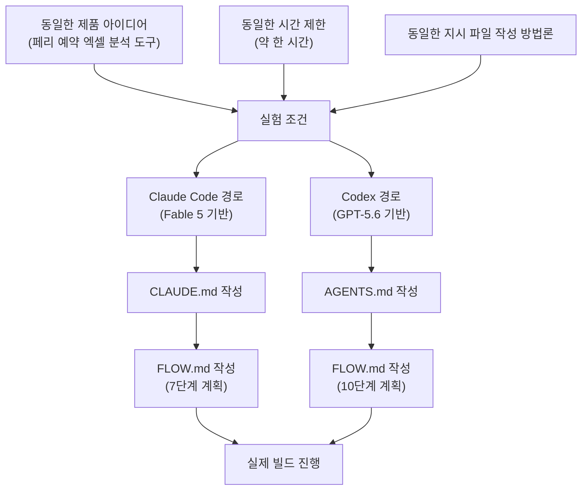
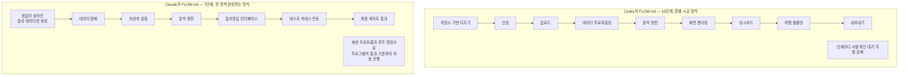
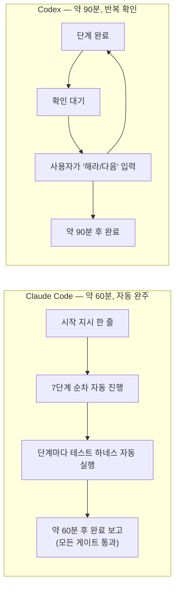
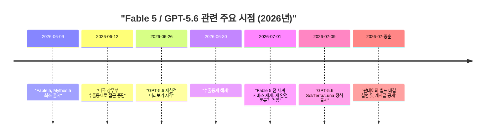

## 목차

1. 들어가며 — 이 글이 다루는 실험은 무엇인가
2. 실험은 어떻게 설계되었는가
3. 지시 파일에 담긴 두 가지 엔지니어링 철학
4. 빌드 순서를 정하는 계획 파일, 그리고 거기 숨어 있던 결정적 단서
5. 실제 빌드 한 시간 — 손을 뗀 클로드, 계속 되묻는 코덱스
6. 완성된 결과물을 뜯어보기
7. 저자가 스스로 밝힌 한계와 유보 사항
8. 저자의 최종 판정
9. 더 넓은 맥락에서 보기 — Fable 5와 GPT-5.6의 최근 상황
10. 정리하며

---

## 1. 들어가며 — 이 글이 다루는 실험은 무엇인가

이 문서는 데이터 과학자이자 머신러닝 연구자인 수밋 판데이(Sumit Pandey)가 2026년 7월 중순 자신이 운영하는 매체 Towards Deep Learning(Medium)에 게재한 글 ["I Gave Fable 5 and GPT-5.6 the Same Build Task, Results Were Shocking"](https://medium.com/towards-deep-learning/i-gave-fable-5-and-gpt-5-6-the-same-build-task-results-were-shocking-c39d7222991b)를 바탕으로 한다[1]. 판데이는 앤트로픽의 코딩 에이전트인 Claude Code를 Fable 5 위에서, 오픈AI의 코딩 에이전트인 Codex를 새로 나온 GPT-5.6 위에서 각각 돌려, 똑같은 제품 아이디어를 똑같은 시간 제약 안에서 만들도록 시켰다. 그가 이 실험을 시작한 이유는 흥미롭다. 그는 글의 도입부에서 "대부분의 코딩 에이전트 비교를 더 이상 신뢰하지 않는다"고 밝히면서, 흔한 비교 콘텐츠들이 단순한 프롬프트 하나를 던져놓고 어느 쪽 화면이 더 예뻐 보이는지로 승자를 정한다고 비판한다[1]. 그래서 그는 규칙을 훨씬 까다롭게 세웠다. 하나의 제품 아이디어, 약 한 시간이라는 시간 제한, 그리고 동일한 방법론으로 작성된 지시 파일에서 출발하는 두 에이전트라는 조건이다.

결과는 그의 표현대로 "한나절 만에 두 번 놀라게" 만들었다. 한쪽 에이전트는 사람의 개입 없이 혼자 끝까지 작업을 마쳤고 시간 제한도 지켰다. 다른 쪽 에이전트는 계속 허락을 구하느라 멈춰 섰고 시간도 절반 가까이 더 걸렸지만, 정작 완성된 결과물은 로그인 기능까지 갖춘, 그가 코딩 에이전트에게서 받아본 것 중 가장 완성도 높은 제품이었다. 이 문서는 그 실험의 설계, 두 에이전트가 스스로 작성한 지시 파일의 차이, 실제 빌드 과정에서 벌어진 일, 완성된 결과물의 차이, 그리고 저자가 직접 밝힌 한계점까지 순서대로 상세히 풀어 설명한다. 아울러 이 실험이 놓인 더 넓은 배경, 즉 실험 시점에 Fable 5와 GPT-5.6 각각이 처해 있던 상황도 별도로 검증해 덧붙였다.

한 가지 먼저 분명히 해 둘 점이 있다. 이 실험은 학술적으로 통제된 벤치마크가 아니라 한 명의 실무자가 하루 오후에 진행한 개인 실험이다. 저자 스스로도 글의 후반부에서 이 점을 여러 차례 강조하며 스코어보드의 수치를 과신하지 말라고 당부한다. 이 문서 역시 그 원칙을 따라, 확인된 사실과 저자 개인의 주관적 평가를 구분해서 서술한다.

---

## 2. 실험은 어떻게 설계되었는가

판데이가 세운 조건은 세 가지였다. 첫째, 제품 아이디어는 하나로 통일한다. 둘째, 빌드 시간은 약 한 시간으로 제한한다. 셋째, 두 에이전트 모두 같은 방법론으로 작성된 지시 파일에서 출발하게 한다[1].

제품 아이디어는 지저분한 페리(선박) 예약 엑셀 내보내기 파일을 분석하는 도구였다. 비즈니스 사용자가 엑셀 파일을 업로드하고 "3월에 매출이 왜 떨어졌지?"나 "어느 노선이 취소가 가장 많지?" 같은 질문을 평범한 말로 던지면, 도구가 실제 데이터 조회를 통해 답을 내놓아야 한다는 요구사항이었다. 여기서 핵심 규칙이 하나 있었는데, 모든 숫자는 반드시 실제 조회 결과에서 나와야 하며 언어모델이 추측으로 숫자를 만들어내서는 안 된다는 것이었다[1].

Claude Code는 Fable 5 위에서 작업했고, Codex는 새로 나온 GPT-5.6 위에서 작업했다. 두 에이전트 모두 판데이가 이전 글에서 소개한 방법론에 따라 두 종류의 마크다운 파일을 스스로 작성하는 것으로 시작했다. 하나는 지시 파일로, 클로드 쪽에서는 CLAUDE.md, 코덱스 쪽에서는 AGENTS.md라는 이름을 쓴다. 이 파일은 마치 내일 새로 합류하는 외주 개발자에게 건네는 온보딩 문서와 같다고 판데이는 비유한다. 제품이 무엇인지, 어떤 규칙이 타협 불가능한지를 설명하고, 코드를 한 줄도 쓰기 전에 '완료'가 무엇을 의미하는지를 정의한다[1]. 다른 하나는 FLOW.md라는 이름의 계획 파일로, 빌드 일정표 역할을 한다. 각 단계와 그 단계에서 나와야 할 산출물, 그리고 다음 단계로 넘어가기 위한 요건을 나열한다.

이렇게 설계함으로써 이 실험은 사실상 두 가지를 동시에 시험한 셈이 되었다. 하나는 각 모델이 제품을 어떻게 계획하는가이고, 다른 하나는 자신이 세운 계획을 얼마나 충실히 따르는가이다. AGENTS.md는 특정 회사의 사유 형식이 아니라 코딩 에이전트에게 지시를 내리기 위해 널리 쓰이는 개방형 포맷으로, 오픈AI의 공식 가이드에도 등장하고 별도의 agents.md 사이트에서도 공개적으로 설명되고 있다[5][6]. 즉 이번 실험에서 코덱스가 AGENTS.md를 쓴 것은 특별한 조치가 아니라 업계에서 통용되는 관례를 따른 것이다.

아래는 실험의 전체 구조를 도식으로 정리한 것이다.

---

## 3. 지시 파일에 담긴 두 가지 엔지니어링 철학

코드를 한 줄도 쓰기 전에, 두 에이전트가 작성한 지시 파일은 이미 서로 전혀 다른 엔지니어링 철학을 드러내고 있었다고 판데이는 말한다. 그는 이 비교가 실험 전체에서 가장 유용한 부분이었다고 평가한다[1].

코덱스의 지시 파일은 처음부터 완전한 SaaS 제품을 그리고 있었다. Next.js 프런트엔드, FastAPI 백엔드, PostgreSQL, 오브젝트 스토리지, 그리고 다중 테넌트 프라이버시 규칙까지 명시했다. 인증 섹션에서는 로그인과 테넌트 격리를 필수 요소로 다뤘고, 보안 규칙의 서술 방식은 감사(audit) 경험이 있는 사람이 쓴 것처럼 보였다고 판데이는 묘사한다[1].

반대로 클로드의 지시 파일은 정반대 접근을 택했다. 첫 페이지에서부터 그 목록 대부분을 금지했다. 범위 규정 섹션은 명확했다. 인증, 결제, 내보내기, 대시보드는 모두 제외 대상이라고 못 박았다. 만약 어떤 작업이 이 중 하나를 필요로 하는 것처럼 보이면, 에이전트는 작업을 멈추고 사용자에게 물어봐야 한다는 규칙이었다[1].

두 파일의 차이만큼이나 공통점도 중요하다고 판데이는 지적한다. 두 파일 모두 동일한 핵심 분석 규칙을 담고 있었는데, 다만 표현 방식이 달랐다. 클로드는 이를 여섯 단어로 요약했다. "언어모델은 절대 숫자를 직접 읽지 않는다." 코덱스는 조금 더 풀어서, 모델이 분석을 계획할 수는 있지만 절대 숫자적 진실의 출처가 되어서는 안 된다고 설명했다[1].

두 철학을 표로 정리하면 다음과 같다.

| 항목 | 클로드(Fable 5)의 CLAUDE.md | 코덱스(GPT-5.6)의 AGENTS.md |
|---|---|---|
| 제품 범위 | 인증, 결제, 내보내기, 대시보드를 명시적으로 제외 | 처음부터 완전한 다중 테넌트 SaaS를 목표로 설정 |
| 기술 스택 | 좁고 집중된 범위 (분석 엔진 중심) | Next.js, FastAPI, PostgreSQL, 오브젝트 스토리지까지 명시 |
| 보안·인증 | 필요 시 작업을 멈추고 사용자에게 확인 요청 | 로그인과 테넌트 격리를 필수 요소로 규정 |
| 숫자 처리 원칙 | "언어모델은 절대 숫자를 직접 읽지 않는다"라는 6단어 규칙 | 모델이 분석을 계획하되 숫자적 진실의 출처가 되어서는 안 된다는 원칙 |
| 전반적 인상 | 데모 마감을 지키려는 창업자의 태도 | 감사 이력이 있는 엔터프라이즈 아키텍트의 태도 |

판데이는 이 표를 두고 "어느 쪽 파일도 틀리지 않았다"고 평가한다. 둘 중 어느 것을 실제 인간 엔지니어링 팀에 초기 브리핑 문서로 건네도 무방할 정도로 완성도가 있었다는 것이다. 다만 그는 각 파일이 서로 다른 우선순위를 대변한다고 본다. 코덱스의 파일은 데모 마감을 지키려는 창업자의 태도에 가깝고, 클로드의 파일은 한 번 감사에서 곤욕을 치른 적이 있는 엔터프라이즈 아키텍트의 태도에 가깝다는 비유다[1].

---

## 4. 빌드 순서를 정하는 계획 파일, 그리고 거기 숨어 있던 결정적 단서

지시 파일보다도 계획 파일(FLOW.md)의 차이가 더 컸다고 판데이는 말한다. 그리고 그는 바로 이 계획 파일에서 이후 결과를 예측할 수 있는 첫 단서를 발견했다고 회고한다[1].

코덱스는 열 단계짜리 계획을 세웠다. 저장소 기반 다지기, 인증, 업로드, 데이터 프로파일링, 분석 엔진, 화면 렌더링, 대시보드, 여행 템플릿, 내보내기 기능까지 제품을 단계별로 처음부터 끝까지 커버하는 구성이었다[1].

클로드는 일곱 단계짜리 계획을 세웠는데, 좁은 한 영역을 깊이 파고드는 방식이었고 단계 순서 자체가 우선순위를 보여주었다. 첫 단계는 정답이 미리 정해진 지저분한 합성 데이터셋을 만드는 작업이었다. 2026년 3월 한 노선과 한 시장에서 발생한 매출 하락, 그리고 25개의 숨겨진 이상치라는 구체적인 정답을 심어 놓은 데이터셋이다. 이후의 모든 단계는 반드시 이 정확한 답을 찾아내야 한다는 조건이 걸려 있었다. 다시 말해 테스트가 모델 자신의 출력을 기준으로 채점되는 것이 아니라, 미리 알려진 사실을 기준으로 코드를 검증하는 구조였다[1].

판데이는 이 차이를 건축에 비유한다. 코덱스는 집을 층별로 통째로 지어 올라가는 방식이고, 클로드는 방 하나를 배관과 배선까지 완전히 끝내고 나서야 다음 방으로 넘어가는 방식이라는 것이다[1].

그리고 이 계획 파일들 안에는 두 모델의 작업 스타일을 예고하는 또 다른 결정적 단서가 숨어 있었다. 클로드의 계획 파일에는 자율성에 관한 규칙이 포함되어 있었다. 세션 진행 절차와, 프로그램적으로 정의된 통과 기준을 만족할 때까지 계속 작업을 이어가도록 하는 루프 명령 및 한도가 명시되어 있었다. 반면 코덱스의 계획 파일은 정반대였다. 작업 분류 단계, 기능별 워크플로 템플릿, 보안 체크리스트, 그리고 차이점(diff) 검토 절차가 있었는데, 이 각각이 사람의 입력을 기다리며 자연스럽게 멈추는 지점이 되었다[1].

즉 두 모델은 실제로 어떤 단계도 시작하기 전에 이미 자기 자신의 작업 방식을 스펙 안에 설계해 넣은 셈이었고, 이후 각자는 정확히 자신이 계획한 대로 행동했다. 판데이는 이 하나의 관찰이 올해 어떤 벤치마크 도표보다도 이런 도구를 선택하는 방식에 대한 자신의 생각을 더 많이 바꿔놓았다고 밝힌다[1].

---

## 5. 실제 빌드 한 시간 — 손을 뗀 클로드, 계속 되묻는 코덱스

판데이는 클로드 코드를 자동 모드로 켜고 계획 파일을 따라가라는 한 줄짜리 지시만 내린 뒤 키보드에서 손을 뗐다. 클로드는 두 지시 파일을 읽고, 일곱 단계를 순서대로 진행했으며, 자신이 세운 세션 프로토콜이 요구하는 대로 매 단계 사이마다 테스트 하네스를 실행했다. 착수 한 시간 후 완료를 보고했고, 상태 로그에 기록된 모든 단계 게이트가 통과(초록색) 상태였다[1].

GPT-5.6 위의 코덱스는 완전히 다른 리듬을 보였다. 에이전트는 자기 자신이 계획 파일에 만들어 넣은 확인 지점마다 정확히 멈춰 섰다. 한 단계를 끝내면 확인을 기다렸고, 그래서 판데이는 약 90분 동안 "해라"와 "다음"이라는 말을 마치 박자를 맞추듯 반복해서 입력해야 했다. 그는 이 경험을, 못 하나 박는 데도 서명된 허가서 없이는 움직이지 않으려는 유능한 시니어 엔지니어를 옆에서 돌보는 느낌이었다고 표현한다[1].

이 대목에서 판데이는 곧바로 중요한 유보 조건을 덧붙인다. 자율성 격차에는 함정이 있다는 것이다. 클로드는 계획 파일 안에 루프 규칙을 스스로 포함시켰고, 코덱스는 자기 계획 파일 안에 확인 지점을 스스로 추가했다. 코덱스가 계속 멈춰 선 것 중 일부는 모델 자체의 특성이라기보다 승인(approval) 설정 때문일 수 있으며, 이 설정을 바꾸면 격차가 상당히 줄어들 수 있다고 그는 명시적으로 밝힌다[1]. 즉 "코덱스가 더 많이 물어봤다"는 관찰은 사실이지만, 그 원인이 모델의 근본적인 성향인지 아니면 그날 사용된 도구의 기본 설정인지는 이 실험만으로 단정할 수 없다는 뜻이다.

---

## 6. 완성된 결과물을 뜯어보기

두 빌드가 끝난 뒤 판데이가 실제로 열어본 결과물은 이 글의 제목이 약속한 "충격"을 코덱스 쪽에서 안겨주었다. 코덱스는 자신의 스펙이 설명한 풀스택을 그대로 지어냈다. 실제로 동작하는 프런트엔드, 실제로 동작하는 백엔드, 그리고 애플리케이션 전체를 지키는 로그인 화면까지 갖춘 결과물이었다. 판데이는 이것이 그 세션을 시작할 때 상상할 수 있었던 것 중 가장 완성 제품에 가까운 결과였다고 평가하며, 자신은 이 코드를 한 줄도 쓰지 않았다고 강조한다[1].

첨부된 화면들은 이 코덱스 결과물의 실제 모습을 보여준다. 하나는 "당신의 데이터는 격리된 워크스페이스 안에서 시작됩니다"라는 문구와 함께, 조직명·이메일·비밀번호를 입력하는 워크스페이스 생성 및 로그인 화면이다. 그 아래에는 데이터 가져오기, 자연어로 질문하기, 로직 검증하기라는 세 가지 기능이 순서대로 소개되어 있다. 다른 하나는 실제로 로그인을 마친 뒤의 화면으로, "neurons"라는 워크스페이스에 판데이 본인의 이메일 계정으로 접속한 상태가 표시되고, CSV나 XLSX 파일을 끌어다 놓는 업로드 영역과 함께 "ferry-bookings-demo.csv"라는 예시 데이터셋이 "준비 완료" 상태로 등록되어 있으며, booking_id와 passenger_id 등 11개 열로 구성된 실제 예약 데이터 미리보기까지 나타난다. 이는 코덱스가 인증, 워크스페이스 격리, 파일 업로드, 데이터 미리보기까지 하나의 완결된 흐름으로 구현했음을 실물로 보여주는 근거다.

클로드 쪽 결과물은 의도적으로 더 단출했고, 판데이는 첫 클릭부터 모든 부분이 제대로 작동했다고 평가한다. 다만 코덱스의 세련된 마감과 비교하면 인터페이스 자체는 거칠고 기본적으로 보였다는 점도 함께 밝힌다. 지저분한 예시 파일을 업로드하면 적용된 모든 수정 사항을 나열하는 정제 보고서가 나타나고, 미리 정해둔 네 가지 핵심 질문을 던지면 근거가 되는 조회 쿼리를 함께 확인할 수 있는 정확한 답이 돌아온다는 것이 그의 설명이다. 그는 두 결과물 모두를 직접 수동으로 테스트해보며 버그를 찾으려 했지만 어느 쪽에서도 찾지 못했다고 밝히면서, 클로드 쪽의 투박한 외관은 미적인 문제일 뿐 기능상의 문제는 아니었다고 정리한다[1].

첨부된 클로드 쪽 결과물 화면은 "Ferry Analyst"라는 이름의 인터페이스로, "예약 내보내기 파일을 업로드하고, 평범한 말로 질문하고, 모든 숫자 뒤에 있는 정확한 조회 쿼리를 확인하라"는 설명 문구가 붙어 있다. dummy_bookings.xlsx 파일을 업로드한 상태에서 초록색 메시지로 "'dummy_bookings.xlsx'를 정제하는 과정에서 8개의 문제를 발견해 처리했으며, 4989행 중 4988행을 유지하고 1행을 각각의 사유와 함께 제외했다"는 정제 보고서가 표시되어 있고, 그 아래로 펼쳐볼 수 있는 상세 정제 보고서 항목이 있다. 화면 하단에는 "3월 2026년 노선별 매출 보기", "3월 2026년 매출이 왜 하락했는가", "2026년 1분기 시장별 노쇼율은 얼마인가", "이상 예약 찾기"라는 네 개의 추천 질문 버튼이 준비되어 있다.

다만 이 화면에서 한 가지 눈여겨볼 세부 사항이 있다. 화면 상단에 노란색 경고 문구로 "ANTHROPIC_API_KEY가 설정되지 않아 질문 기능이 비활성화되어 있다. 파일은 정상적으로 수집되었고 위의 정제 보고서는 완료된 상태다"라는 안내가 함께 표시되어 있다. 이는 이 특정 화면을 캡처한 시점에는 실제 질의응답 기능이 API 키 미설정으로 인해 실행되지 않았음을 뜻한다. 본문에서 판데이는 네 가지 핵심 질문에 대해 정확한 답을 받았다고 서술하지만, 첨부된 이 특정 화면 자체는 질의응답이 아니라 업로드와 정제 단계까지만 실행된 상태를 보여주고 있다는 점에서, 두 정보를 구분해서 이해할 필요가 있다. 즉 정제 파이프라인이 정상 작동했다는 것은 이 화면으로 확인되지만, 질의응답 결과 자체가 정확했다는 서술은 본문 텍스트에 근거한 것이며 이 특정 화면으로 직접 검증되지는 않는다.

---

## 7. 저자가 스스로 밝힌 한계와 유보 사항

판데이는 결론으로 넘어가기 전에 스스로 여러 개의 정직한 유보 조건을 명시한다. 이 부분은 이 실험을 어떻게 해석해야 하는지에 있어 본문의 다른 어떤 부분 못지않게 중요하다.

첫째, 각 에이전트는 자기 자신이 작성한 스펙을 따랐을 뿐이므로, 두 결과물 사이의 완성도 격차는 코딩 실력의 차이만큼이나 계획 단계에서의 야심 차이를 반영한다. 코덱스가 로그인 화면을 포함한 것은 스스로 그것을 1단계 근처에 배치하기로 결정했기 때문이고, 클로드가 그것을 생략한 것은 애초에 자신의 규칙에서 그것을 금지했기 때문이다[1].

둘째, 자율성 격차에도 같은 문제가 있다. 클로드는 스펙에 루프 규칙을 포함시켰고 코덱스는 자기 스펙에 확인 지점을 추가했다. 코덱스가 계속 멈춰 선 것 중 일부는 모델 자체보다 승인 설정 때문일 수 있으며, 그 설정을 바꾸면 격차가 크게 줄어들 수 있다[1].

셋째, "버그 0건"이라는 표현은 어디까지나 자신이 수동으로 테스트한 세션 동안 발견하지 못했다는 뜻일 뿐이다. 더 단출한 제품일수록 버그가 숨을 자리가 애초에 적다는 점도 함께 지적한다. 그는 두 코드베이스에 대한 제대로 된 제3자 감사가 자신의 오후 한나절 클릭 테스트보다 훨씬 나은 판단 기준이 될 것이라며, 자신은 그런 감사를 수행하지 않았다고 명시적으로 밝힌다[1].

넷째, 클로드 쪽에는 한 가지 추가적인 변수가 있다. Fable 5에는 일부 코딩 요청을 Opus 4.8로 대신 넘기는 안전 분류기가 포함되어 있으며, 앤트로픽 스스로도 이 대체 동작을 공개적으로 인정하고 있다. 따라서 판데이의 Fable 5 실행 세션 중 일부는 실제로는 다른 앤트로픽 모델을 사용했을 가능성이 있다는 것이다[1]. 이 부분은 다음 장에서 별도로 자세히 검증한다.

---

## 8. 저자의 최종 판정

판데이는 결론에서 완곡한 표현을 피하고 명확한 입장을 밝힌다. 순수한 능력 면에서는 GPT-5.6(Sol)이 상당한 격차로 승리했다는 것이다. 코덱스는 끊임없는 재촉을 필요로 했고, 실제로 90분 동안 "해라"를 반복해서 입력해야 했다고 그는 다시 한번 인정한다. 그러나 그 모델은 진짜 2단 구조의 제품을 계획했고, 작동하는 로그인 흐름을 만들었으며, 그가 찾아낼 수 있는 버그 없이 10단계짜리 빌드를 완주했다. 그는 이 차이가 단순히 비슷한 모델들 사이의 하네스(harness) 차이가 아니라, 소울(Sol)이 더 큰 복잡성을 다루면서도 그것을 파블(Fable) 5보다 더 오래 무너뜨리지 않고 유지했다는 의미라고 평가한다[1].

동시에 그는 클로드 코드의 한 시간짜리, 사람 손이 필요 없는 실행이 훨씬 말하기 쉬운 이야기라는 점도 인정한다. 그는 이 부분을 글의 초점으로 삼을 뻔했다고 고백한다. 하지만 그는 편안함이 능력과 같지 않다고 잘라 말한다. 파블 5는 자신의 스펙을 완벽하게 따랐지만, 진짜 문제는 그 스펙이 애초에 더 적은 것을 요구했다는 데 있다는 것이다. 인증, 결제, 대시보드를 첫 페이지에서부터 금지하는 모델은 절제를 보여주는 것이 아니라, 소울이 정면으로 부딪힌 더 어려운 도전들을 회피하고 있는 것이라고 그는 주장한다[1].

그는 다음 실험으로 두 에이전트의 지시 파일을 서로 맞바꿔서, 스펙이 더 이상 보호막이 되어주지 않을 때 파블 5가 10단계짜리 빌드를 감당할 수 있는지 확인해보겠다고 예고하며 글을 마친다. 그는 이 오후를 에이전트 비교라는 것 자체에 회의적인 채로 시작했지만, 끝날 무렵에는 클로드 코드의 한계에 대해 그 전보다 더 회의적인 상태가 되었다고 적는다[1].

---

## 9. 더 넓은 맥락에서 보기 — Fable 5와 GPT-5.6의 최근 상황

이 실험을 제대로 읽으려면 두 모델이 각각 어떤 상황에 놓여 있었는지를 알아야 한다. 이 장의 내용은 이번 실험 기사 자체가 아니라 별도의 검색을 통해 확인한 배경 정보다.

### GPT-5.6의 출시 시점

오픈AI는 2026년 6월 26일 소수의 신뢰받는 파트너를 대상으로 GPT-5.6 계열(Sol, Terra, Luna)의 제한적 미리보기를 시작했고, 이후 2026년 7월 9일에 ChatGPT, Codex, API 전반으로 정식 출시를 시작했다[8][9]. 즉 판데이가 이 실험을 진행하고 글을 게재한 시점(7월 중순)은 GPT-5.6이 정식 출시된 지 채 열흘이 되지 않은 시점이었다. 오픈AI는 이날 자사 발표를 통해 ChatGPT 앱을 개편해 기존 앱을 "ChatGPT Classic"으로, 코덱스 앱을 새로운 "ChatGPT" 앱으로 전환한다고도 밝혔다[8]. 이 실험에서 사용된 코덱스는 이 새로운 통합 흐름 속에서 GPT-5.6을 사용하고 있었던 것으로 보인다.

### Fable 5의 접근 중단과 재개, 그리고 새 안전 분류기

앤트로픽의 공식 발표에 따르면, Fable 5와 Mythos 5는 2026년 6월 9일 처음 출시되었으나 사흘 뒤인 6월 12일 미국 상무부의 수출통제 규정 준수를 위해 접근이 중단되었다. 이후 6월 30일 해당 수출통제가 해제되었고, 앤트로픽은 7월 1일부로 두 모델에 대한 접근을 다시 열었다[2][7]. 이 시점은 판데이가 실험에서 언급한 "Fable 5 안전 분류기가 일부 코딩 요청을 Opus 4.8로 대신 넘길 수 있다"는 유보 조건과 정확히 맞닿아 있다.

여러 외부 매체의 보도를 종합하면, 앤트로픽은 재개된 Fable 5에 새로운 사이버보안 분류기를 함께 적용했다. 이 분류기는 앞서 보고된 특정 탈옥(jailbreak) 기법을 99% 이상의 비율로 차단하도록 설계되었지만, 그 대가로 평범한 코딩·디버깅 작업까지 더 자주 걸러내는 부작용이 있다는 점을 앤트로픽 스스로 인정했다고 전해진다[10][11]. 분류기가 어떤 요청을 의심스럽다고 판단하면, 그 요청은 파블 5가 아니라 Opus 4.8로 조용히 대신 처리되며 사용자에게는 대체가 이루어졌다는 안내만 표시된다는 것이 여러 매체의 공통된 설명이다[10][11]. 한 매체는 이 안전 여유값이 "이전의 어떤 출시 때보다 훨씬 크게 설정되었다"는 앤트로픽의 발언을 인용하기도 했다[11].

이 배경을 알고 나면, 판데이의 유보 조건이 단순한 예의상의 면책 조항이 아니라 실제로 근거가 있는 우려였다는 점을 알 수 있다. 그가 "Fable 5" 실행이라고 부른 세션의 일부 구간은, 특히 인증이나 보안과 인접한 판단이 필요했던 순간에는, 실제로는 Opus 4.8이 대신 응답했을 가능성이 낮지 않다. 다만 이것이 실험 결과를 어느 방향으로 얼마나 왜곡했는지는 판데이 본인도, 이 문서도 확정적으로 말할 수 없다. 오히려 흥미로운 점은, 만약 실제로 일부 구간이 Opus 4.8로 넘어갔다면, 클로드 쪽의 "인증 기능을 아예 배제한다"는 소극적인 스펙 자체가 이런 대체 상황이 발생할 여지를 미리 줄여놓는 효과를 냈을 수 있다는 해석도 가능하다는 것이다. 이는 이 문서가 추가로 제기하는 해석이며, 원문 기사에는 없는 내용이므로 그렇게 구분해서 받아들일 필요가 있다.

아래는 이 배경 사건들을 시간 순으로 정리한 것이다.

이 타임라인에서 확인할 수 있듯, 이번 실험은 두 모델 모두 매우 최근에 새로운 버전이나 새로운 운영 조건 하에 놓인 직후에 진행되었다. GPT-5.6은 정식 출시 직후의 최신 모델이었고, Fable 5는 강화된 안전 분류기가 적용된 지 2주 남짓 지난 시점의 모델이었다. 이는 실험 결과를 "안정적으로 자리 잡은 두 모델의 비교"라기보다는 "두 모델 모두 각자의 방식으로 과도기에 있던 시점의 스냅샷"으로 이해하는 편이 더 정확하다는 것을 시사한다.

---

## 10. 정리하며

이 실험이 보여주는 것은 단순히 "어느 모델이 더 세다"는 결론이 아니다. 오히려 더 흥미로운 지점은, 두 에이전트가 코드를 한 줄도 쓰기 전에 자기 자신의 지시 파일과 계획 파일 안에 이미 자신의 작업 스타일을 설계해 넣었고, 이후 실제 빌드 과정에서 정확히 그 설계대로 움직였다는 관찰이다. 클로드는 스스로 범위를 좁히고 루프 규칙을 통해 자율적으로 완주하는 쪽을 선택했고, 코덱스는 스스로 범위를 넓히고 사람의 확인을 반복적으로 구하는 쪽을 선택했다. 결과적으로 코덱스 쪽이 더 완성도 높은 결과물을 냈지만, 그 완성도는 더 많은 사람의 개입과 더 긴 시간을 대가로 얻은 것이었다.

판데이 본인이 여러 차례 강조하듯, 이것은 한 명의 실무자가 하루 오후에 진행한 비공식 실험이며, 제3자 감사도, 통계적으로 유의미한 반복 시행도 거치지 않았다. 완성된 스코어보드 표에 담긴 구체적인 수치들은 원문 기사에 별도의 표 형태 그림으로만 제시되어 있고, 본문 텍스트 안에서 구체적인 숫자로 서술되지는 않았기 때문에 이 문서에서도 임의로 수치를 만들어 넣지 않았다. 따라서 이 실험의 가치는 "결정적인 벤치마크 결과"로서가 아니라, 코딩 에이전트에게 자율성과 범위를 어떻게 설계해서 맡기느냐에 따라 결과물의 성격이 얼마나 달라질 수 있는지를 보여주는 구체적이고 생생한 사례 연구로 받아들이는 편이 더 타당해 보인다. 아울러 이 실험이 진행된 시점에 Fable 5는 강화된 안전 분류기로 인해 일부 요청이 다른 모델로 대체될 수 있는 상태였고, GPT-5.6은 정식 출시 직후의 최신 모델이었다는 배경도 결과를 해석할 때 함께 감안할 필요가 있다.

---

## 참고자료

[1] Sumit Pandey, "I Gave Fable 5 and GPT-5.6 the Same Build Task, Results Were Shocking," *Towards Deep Learning* (Medium), 2026. https://medium.com/towards-deep-learning/i-gave-fable-5-and-gpt-5-6-the-same-build-task-results-were-shocking-c39d7222991b

[2] Anthropic, "Claude Fable 5 and Claude Mythos 5." https://www.anthropic.com/news/claude-fable-5-mythos-5

[3] Anthropic, Claude Code 공식 문서. https://docs.claude.com/en/docs/claude-code/overview

[4] OpenAI, GPT-5.6 관련 릴리스 노트. https://openai.com/products/release-notes/

[5] OpenAI Codex, "Custom instructions with AGENTS.md." https://developers.openai.com/codex/guides/agents-md

[6] AGENTS.md — 코딩 에이전트를 위한 개방형 지시 파일 포맷. https://agents.md/

[7] Anthropic, Fable 5 / Mythos 5 접근 재개 공식 발표. https://www.anthropic.com/news/fable-mythos-access

[8] 9to5Mac, "OpenAI unveils ChatGPT Work agent, GPT-5.6 models now available," 2026년 7월 9일. https://9to5mac.com/2026/07/09/openai-announcing-the-next-chapter-for-chatgpt-today-watch-here/

[9] explainx.ai, "GPT-5.6: Rolling Out July 9 — Sol, Terra, Luna." https://www.explainx.ai/blog/gpt-5-6-release-date-features-benchmarks-2026

[10] Wavect, "Fable Is Back. Here's How to Actually Code With It." https://wavect.io/blog/coding-with-claude-fable-5/

[11] Digital Applied, "Why Claude Just Got More Cautious About Your Code." https://www.digitalapplied.com/blog/claude-fable-5-safety-classifier-coding-tradeoffs-2026
