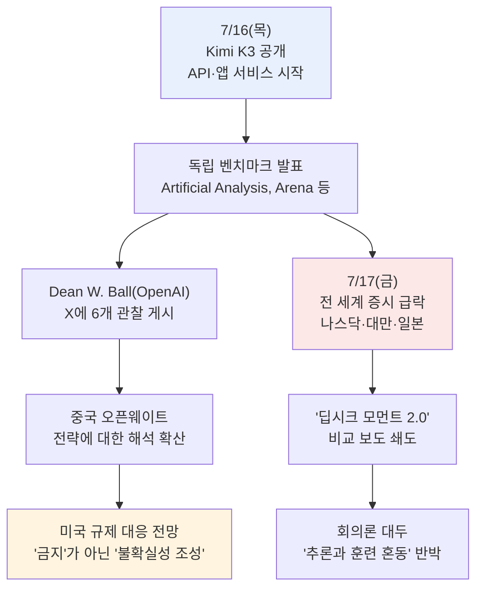
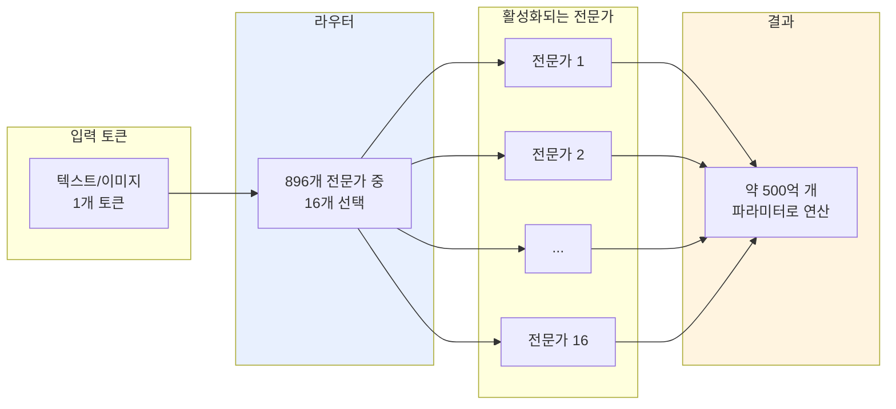
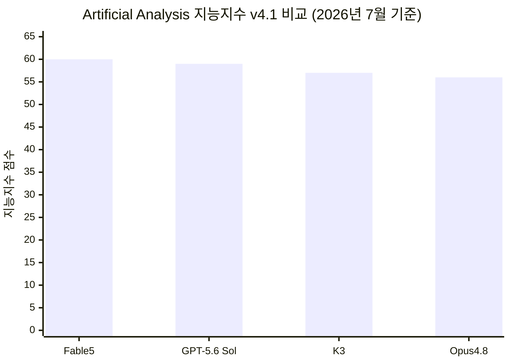
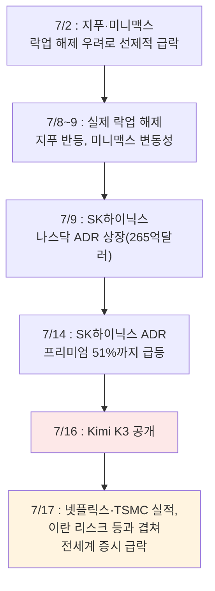

**작성 기준일: 2026년 7월 18일**

## 관련글

[**OpenAI 战略负责人 Dean W. Ball 称，Kimi K3 是一款很强的模型。**](https://x.com/0xlogicrw/status/2078329537532961092)

[**Some observations on Kimi**](https://x.com/deanwball/status/2078133895766114412)

[**Kimi发布K3模型，刚刚引发了全球股市震荡。周四，美国几乎所有AI概念股集体暴跌，周五，亚洲AI相关股票也遭到大规模抛售。**](https://x.com/gelunding/status/2078082819369091269)

---

## 목차

1. 사건 개관 — 사흘 동안 무슨 일이 있었나
2. Kimi K3는 어떤 모델인가
3. 실제 성능은 얼마나 강한가 — 독립 벤치마크 검증
4. Dean Ball의 여섯 가지 관찰 — OpenAI 전략 책임자는 왜 이 모델을 주목했나
5. 왜 중국은 이 정도로 강력한 모델을 공개했을까
6. 미국 정부의 다음 수순 — "금지"가 아니라 "불확실성"
7. 전 세계 증시가 흔들린 하루
8. 이 폭락은 정말 Kimi K3 때문이었나 — 겹쳐 있던 다른 변수들
9. 회의론자의 반박 — "추론과 훈련을 헷갈리지 마라"
10. 밸류에이션 전쟁 — 1조 달러 대 300억 달러
11. 확인된 것과 아직 불확실한 것 — 정리된 팩트체크
12. 마무리하며

---

## 1. 사건 개관 — 사흘 동안 무슨 일이 있었나

2026년 7월 16일 목요일, 중국 베이징의 AI 스타트업 문샷AI(Moonshot AI)가 신형 언어모델 Kimi K3를 공개했다. 이 모델은 킴닷컴(Kimi.com), 킴 워크, 킴 코드, 그리고 API를 통해 즉시 서비스에 들어갔으며, 완전한 오픈 웨이트(누구나 내려받아 실행할 수 있는 모델 가중치) 공개는 7월 27일로 예고됐다. 이 정도 규모의 모델이 오픈 웨이트로 공개되는 것은 이번이 처음이다[2].

파장은 즉각적이었다. 발표 다음 날인 7월 17일 금요일, 나스닥 지수는 1.4~1.5% 하락했고 S&P500은 1% 떨어졌으며, 다우존스 지수도 407포인트(0.77%) 하락 마감했다[18]. 더 크게 흔들린 곳은 아시아 시장이었다. 대만 가권지수는 6% 넘게 폭락했고 일본 니케이 지수도 4% 가까이 빠졌다[18]. 반도체 대장주들도 예외가 아니었다. 엔비디아 주가는 2% 넘게 떨어지며 시가총액이 한때 4조 8500억 달러까지 낮아져, 세계 1위 자리를 잠시 애플에 내주었다[18]. 대만의 TSMC는 분기 영업이익이 77% 급증했다는 호실적 발표에도 불구하고 주가가 7% 하락했고, 오픈AI의 대리 지표로 흔히 여겨지는 소프트뱅크 역시 9% 급락했다[17].

이 장면은 2025년 1월 딥시크(DeepSeek)의 R1 공개 당시 벌어졌던 "딥시크 쇼크"를 떠올리게 했다. 당시 저비용으로 개발되었다고 알려진 딥시크 모델이 미국 프론티어 모델과 맞먹는 성능을 보이면서, 프론티어 AI에는 프론티어급 지출이 필요하다는 전제가 하룻밤 사이에 흔들렸고 엔비디아는 단 하루 만에 시가총액 약 5900억 달러를 잃었다[20]. 이번에는 그 충격이 반도체 한 종목에 그치지 않고 업종 전반으로 번졌다는 점이 다르다.

이 사흘간의 흐름을 정리하면 다음과 같다.

이 문서는 이 사건을 세 층위로 나누어 살펴본다. 첫째는 Kimi K3라는 모델 자체의 기술적 실체, 둘째는 오픈AI 전략 책임자 딘 W. 볼(Dean W. Ball)이 제기한 지정학적·산업적 해석, 셋째는 이 발표가 촉발한 시장 반응과 그에 대한 반박이다. 첨부된 게시물 세 건 가운데 딘 볼의 발언은 오픈AI 소속 인사의 공개 발언이므로 비교적 신뢰도 높은 1차 발언으로 다루었고, 나머지 두 건(중국어 게시물)은 개인 논평·의견으로서 시장 데이터와 교차 검증하며 소개했다.

---

## 2. Kimi K3는 어떤 모델인가

문샷AI가 공개한 수치에 따르면 Kimi K3는 2.8조 개의 총 파라미터를 가진 초대형 언어모델로, 딥시크의 V4 프로(약 1.6조 개)보다 약 75% 더 크며, 이제까지 공개된 오픈 웨이트 모델 가운데 가장 크다[5]. 다만 이 거대한 파라미터 수가 실제 연산에 그대로 쓰이는 것은 아니다. Kimi K3는 혼합전문가(MoE) 구조를 채택해, 전체 896개의 전문가 신경망 가운데 토큰 하나를 처리할 때마다 16개만 활성화한다. 문샷은 이 기법을 '스테이블 레이턴트MoE(Stable LatentMoE)'라 부르며, 이렇게 실제로 연산에 관여하는 파라미터는 약 500억 개 수준이다[41]. 훈련 방식과 데이터 구성의 개선과 맞물려, 이 구조는 이전 세대 K2 대비 약 2.5배의 전반적인 스케일링 효율을 낸다고 문샷은 밝혔다[41].

이는 첨부된 게시물에서 언급된 "896개 전문가 중 16개만 활성화한다"는 서술과 정확히 일치하는 내용으로, 확인된 사실이다.

이 모델에는 두 가지 새로운 아키텍처 기법이 적용됐다. 하나는 '킴 델타 어텐션(Kimi Delta Attention, KDA)'으로, 백만 토큰급의 초장문 맥락에서 기존 어텐션 방식보다 최대 6.3배 빠른 디코딩을 가능케 하는 하이브리드 선형 어텐션 기법이다[42]. 다른 하나는 '어텐션 잔차(Attention Residuals, AttnRes)'로, 각 층이 임의의 이전 층에서 표현을 선택적으로 끌어올 수 있도록 하는 구조다. 이는 서로 다른 전문가가 서로 다른 깊이에서 활성화되는 MoE 구조에서 특히 효과적이다[4]. 이 두 기법 덕분에 문샷은 훈련 효율이 약 25% 개선되면서도 추가 비용은 2% 미만이라고 주장하고 있다.

그 밖의 주요 사양은 다음과 같다. 문맥 창(context window)은 104만 8576토큰, 즉 100만 토큰급이며 텍스트와 이미지를 함께 이해하는 네이티브 멀티모달 입력을 지원한다[46]. 추론(사고) 모드가 항상 켜져 있어 별도의 '추론 전용 버전'이 없다는 점도 이전 세대와 다르다. 문샷은 이를 '사고 모드(thinking mode)'라 부르며, 이 모델은 기본적으로 문제를 사고하며 푼다[2].

가격 정책도 눈여겨볼 대목이다. 공식 API 요금은 입력 토큰 100만 개당 3달러(캐시 적중 시 0.3달러), 출력 토큰 100만 개당 15달러로 책정되어 있다[44][45]. 이는 이전 세대인 K2.6보다 입력가는 약 5배, 출력가는 약 6배 오른 수준으로, 흔히 중국 오픈소스 모델에 기대되는 '초저가' 이미지와는 거리가 있다[44]. 이 가격은 앤트로픽의 클로드 소넷5와 거의 같은 수준이며, 클로드 오퍼스4.8보다는 저렴하지만 오픈AI GPT-5.6 솔보다는 출력 기준으로 절반 가까이 싸다는 평가가 나온다. 문샷은 K3를 중간급이 아니라 프론티어급 모델로 가격을 매기고 있는 셈이다[45]. 이는 딘 볼이 지적한 "이 모델이 정말 저렴하게 돌아가는지 확신할 수 없다"는 관찰과도 맞닿아 있는 지점이다.

또한 전체 가중치가 MXFP4라는 양자화 포맷으로 배포될 예정인데, 이 경우 2.8조 파라미터 전체를 저장하는 데 약 1.4테라바이트가 필요하다. 이는 FP16 방식으로 저장할 때 필요한 약 5.6테라바이트보다 훨씬 적은 용량으로, 다중 노드 GPU 클러스터(예: H100/B200 8기 규모의 노드 8~16개)를 갖춘 조직이라면 자체 호스팅이 현실적인 범위에 들어온다는 뜻이다[4].

---

## 3. 실제 성능은 얼마나 강한가 — 독립 벤치마크 검증

문샷의 자체 발표 수치를 그대로 믿을 수는 없으므로, 독립 평가기관인 아티피셜 애널리시스(Artificial Analysis)와 아레나(Arena/LMArena)의 검증 결과를 기준으로 삼는 것이 합리적이다.

아티피셜 애널리시스의 종합 지능 지수(Intelligence Index v4.1)에서 Kimi K3는 57점을 받아 전체 추적 모델 189개 가운데 4위에 올랐으며, 클로드 오퍼스4.8의 56점을 근소하게 앞섰다[24]. 이 지수에서 1위는 클로드 페이블5(약 59.9~60점), 2위는 GPT-5.6 솔(약 58.9~59점)이다[25].

여기서 짚고 넘어가야 할 대목이 있다. 첨부된 중국어 게시물 가운데 하나는 "Kimi K3가 아티피셜 애널리시스 지능지수에서 57점을 받아 앤트로픽 클로드 오퍼스4.8(56점) 및 오픈AI GPT-5.6 테라(55점)를 넘어섰다"고 서술했다. 그러나 검색으로 확인한 결과, 오퍼스4.8과의 근소한 우위(57 대 56)는 정확하지만, GPT-5.6 계열 모델의 실제 명칭은 'GPT-5.6 테라'가 아니라 'GPT-5.6 솔(Sol)'이며 그 점수도 55점이 아니라 약 58.9~59점으로, 오히려 K3보다 높다[25]. 즉 해당 게시물의 "GPT-5.6을 넘어섰다"는 서술은 사실과 다르며, 정정이 필요한 부분이다. K3가 앞선 것은 오퍼스4.8 한 모델뿐이고, 페이블5와 GPT-5.6 솔에게는 여전히 뒤처진다.

다만 개별 항목으로 들어가면 K3가 두드러지는 영역도 분명히 있다. 에이전트형 코딩 작업을 평가하는 GDPval-AA v2에서 K3는 엘로 1668점을 기록해, K2.6의 1190점보다 크게 개선됐고 GLM-5.2(1514점)와 GPT-5.5(1494점), 클로드 오퍼스4.8(1600점)을 앞질렀다. 다만 클로드 페이블5(1760점)에는 여전히 못 미쳤다[21]. 실사용 지식노동을 평가하는 비공개 벤치마크 AA-브리프케이스에서도 K3는 종합 엘로 1547점(K2.6보다 732점 상승)을 기록해, 클로드 페이블5 다음으로 두 번째로 높은 성적을 냈다[21].

한편 웹페이지 코딩을 겨루는 아레나의 프론트엔드 코드 아레나에서는 K3가 1679점으로 1위(K2.6보다 17계단 상승)를 차지했으며, 클로드 페이블5와의 일대일 대결에서 76%의 승률을 기록했다[24][43]. 다만 이는 프론트엔드 코딩이라는 좁은 영역에 국한된 결과이며, 일반 텍스트 대화 능력을 겨루는 아레나 종합 순위에서는 9위에 그쳤다[43].

가격 대비 성능 측면에서는 K3가 과제당 평균 0.94달러의 비용으로, GPT-5.6 솔(1.04달러)과 비슷하고 클로드 오퍼스4.8(1.80달러)의 절반 수준이며, 오픈 웨이트 경쟁 모델인 GLM-5.2(0.32달러)와 딥시크 V4 프로(0.04달러)보다는 비싸다는 평가가 나왔다[21]. 다만 앞서 살펴본 것처럼 K3의 정가는 결코 '초저가'가 아니며, 여기서 말하는 저렴함은 어디까지나 과제당 실사용 비용을 기준으로 한 상대적 비교임을 유의할 필요가 있다.

또한 독립 벤치마크 사이트를 운영하는 사이먼 윌리슨(Simon Willison)은 실제로 K3를 사용해본 결과 토큰 소모가 상당히 크다고 지적했다. 그가 테스트한 표준 프롬프트에서 K3는 답변 3417토큰을 만드는 데 추론 토큰 1만3241개를 소모했으며, 단순한 "hi"라는 인사말에도 86토큰이 잡혀 숨겨진 시스템 프롬프트가 존재할 가능성을 시사했다[14]. 이는 딘 볼이 언급한 "이 모델은 토큰을 매우 많이 먹는다"는 관찰과 정확히 일치하는 독립적 확인이다.

---

## 4. Dean Ball의 여섯 가지 관찰 — OpenAI 전략 책임자는 왜 이 모델을 주목했나

> [Dean W. Ball](https://x.com/deanwball/status/2078133895766114412)
> 
> Some observations on Kimi: 
> 
> 1. It's a very good model! I don't think its performance can be explained away by distillation or anything like that. In agentic coding sessions, it seems pretty much on par with the best public models of Q1 2026. In my fairly limited use, it also seemed very token hungry. It's not obvious to me that this model is actually that cheap to run. 
> 
> 2. I am personally surprised the Chinese state continues to allow the open sourcing of models this good, given potential risks. To be clear, I *myself* might be fine with models presenting this level of marginal risk being open weight, but I am surprised that China is fine with it. I suspect the reason they are is 75% explained by strategic blindness/lack of AGI-pilledness (the CCP is very Yann Lecun-y in its views of AI). The other 25% or so is their lack of compute for customer inference (making China's open-weight strategy an unintended byproduct of US export controls) and the normal Chinese strategy of aggressive exports. For the companies, as opposed to the government, the decision to open source is partially ideological and partially because they are behind, and they know that very few people would pay for sub-frontier models from China. 
>
> 3. Open-weight models are inherently decelerationist, and I'm continually surprised to see the so-called "accelerationists" so excited about open-weight models. I suspect the reason they are is that they know open-weight models are effectively ungovernable, and they simply like the overall cloak of ungovernability open-weight models create over the whole of AI. It's not a bad strategy; it reminds me of James Scott's recounting of the hill people in "the art of not being governed." Still, in the end, open-weight models deter further AI capex. 
> 
> 4. One probable outcome of an open-weight-model-dominant world is full AI communism, which is precisely what China proposes: rather than a market product, AI is a "public good" which will ultimately be provided by the state as a kind of "digital public infrastructure." This future strikes me as a dystopian hellscape, but I've never met an open-weight models advocate who doesn't ultimately concede this is where things end. You'd be surprised how many 'accelerationists' lobbied me, while I was in government, to support an eleven or twelve-figure federally funded data center so that startups could train models at a subsidy and then give them away for free. There was no other way for AI to progress, they said. Perhaps this is the logical end state of things. Nonetheless, I find myself surprised to see supposed accelerationists excited about such an outcome. I think many of them just don't know what they're doing. Many accelerationists do not view the creation and serving of frontier models as a legitimate business. 
> 
> 5. I would guess that the Trump Administration will at some point realize that their best strategy here would be to create large amounts of regulatory risk around the use of open-weight Chinese models. You don't need to "ban open source" (one of the dumber motifs of AI policy discussion). You just need to direct every agency to issue soft law that creates FUD. "A Federal Reserve Advisory Bulletin found that there may be backdoors in Chinese AI models." It needn't be that well justified. You just create enough regulatory risk that every regulated enterprise backs off. You probably don't want to create so much regulatory risk that you scare off the hyperscalers from serving Chinese models; this will just drive startups to sketchier providers. There's a happy middle ground here. I'd assume they will do some version of this. 
> 
> 6. It's probably true that open-weight models of this capability make the world a bit more dangerous, but not so much more that you'll really notice. At some point the models will be capable enough that you will notice. "A nonliving, invisible, dangerous, and infinitely self-replicating agent escaped from a Chinese lab," you say? Color me shocked.
> 

딘 W. 볼은 오픈AI의 전략 책임자(Head of Strategic Futures)이자 과거 미국 정부에서 AI 정책을 자문했던 인물이다[10]. 첨부된 게시물에 담긴 그의 X(트위터) 발언은 실제로 존재하는 원문과 대조했을 때 정확히 일치했으며, 이는 검색을 통해 원문 게시물로 재확인된 내용이다[11].

그의 관찰을 여섯 가지로 정리하면 다음과 같다.

첫째, 볼은 Kimi K3가 실제로 매우 뛰어난 모델이며 이 성능을 단순히 미국 모델을 '증류(distillation)'해서 베낀 결과로 치부할 수 없다고 밝혔다. 에이전트형 코딩 작업에서는 2026년 1분기 최고 수준의 공개 모델과 대등한 수준이라는 것이다. 다만 그는 실제 사용해본 결과 이 모델이 토큰을 매우 많이 소모하는 경향이 있어, 정말로 저렴하게 운용되는 모델인지는 확신이 서지 않는다고 덧붙였다.

둘째, 볼은 중국 정부가 이 정도로 뛰어난 모델을 계속 오픈소스로 공개하도록 허용한다는 점에 개인적으로 놀랐다고 밝혔다. 그는 이 정도 수준의 한계 위험(marginal risk)을 지닌 모델이 오픈 웨이트로 풀리는 것 자체에는 자신도 별문제가 없다고 보지만, 중국 당국이 이를 허용한다는 사실 자체가 의외라고 말했다. 그는 이 현상의 약 75%는 '전략적 무지', 즉 중국 공산당이 인공일반지능(AGI)의 잠재적 위험성에 대해 얀 르쿤(Yann LeCun, 오픈소스 AI를 적극 옹호해온 메타의 전 수석 과학자)과 비슷한 시각을 갖고 있어 첨단 AI의 위험을 심각하게 여기지 않기 때문이라고 추정했다. 나머지 25%는 미국의 첨단 반도체 수출 통제로 인해 중국이 전 세계 고객에게 추론 서비스를 제공할 연산 능력이 부족한 데다, 평소 중국이 취해온 공격적인 수출 전략이 맞물린 결과라는 것이다.

셋째, 볼은 오픈 웨이트 모델이 본질적으로 '탈가속적(decelerationist)' 성격을 띤다고 주장했다. 그는 이른바 '가속주의자'들이 오픈 웨이트 모델에 열광하는 현상을 계속 의아하게 여겨왔는데, 그 이유는 이들이 오픈 웨이트 모델은 사실상 통제 불가능하다는 점을 알고 있고, 바로 그 '통제 불가능성이라는 망토'를 좋아하기 때문일 것이라고 추정했다. 그럼에도 불구하고 궁극적으로 오픈 웨이트 모델은 추가적인 AI 설비투자(CAPEX)를 억제하는 효과를 낸다고 그는 지적했다.

넷째, 볼은 오픈 웨이트 모델이 지배하는 세계의 개연성 높은 결과 하나가 '완전한 AI 공산주의'라고 표현했다. 시장 상품이 아니라, 국가가 궁극적으로 제공하는 '디지털 공공 인프라' 형태의 '공공재'로서의 AI라는 것이다. 그는 이런 미래가 디스토피아적으로 느껴진다면서도, 자신이 만나본 오픈 웨이트 옹호론자 가운데 결국 이 결말에 동의하지 않는 사람은 없었다고 언급했다.

다섯째, 볼은 트럼프 행정부가 결국 중국산 오픈 웨이트 모델의 사용을 둘러싸고 대규모 규제 리스크를 조성하는 전략을 택할 것이라고 예측했다. 이 예측은 다음 장에서 별도로 자세히 다룬다.

여섯째, 볼은 이 정도 수준의 오픈 웨이트 모델이 세상을 조금 더 위험하게 만드는 것은 사실이지만 당장 체감할 정도는 아니라고 평가했다. 다만 언젠가 모델의 역량이 충분히 커지면 사람들이 그 위험을 확실히 체감하게 될 것이라는 경고도 덧붙였다.

---

## 5. 왜 중국은 이 정도로 강력한 모델을 공개했을까

첨부된 게시물이 다루는 핵심 질문은 단순히 "Kimi K3가 얼마나 강한가"가 아니라 "중국은 왜 이런 수준의 모델을 계속 공개하도록 놔두는가"라는 데 있다. 이는 딘 볼 발언의 정확한 요지이기도 하다.

볼의 논리 구조를 풀어보면 이렇다. 오픈 웨이트 모델이 충분히 강력해지면, 개발자들은 더 이상 폐쇄형 모델에 값비싼 API 비용을 지속적으로 지불할 필요가 없어진다. 그 결과 모델 개발사들의 이윤은 압박을 받고, 투자자들도 더 신중해지며, 미국 기업들이 수천억 달러를 들여 차세대 모델을 훈련할 유인 자체가 약해질 수 있다는 것이다. 오픈 웨이트는 기술 확산을 가속하는 대신, 프론티어 모델 훈련이라는 사업 자체의 수익성을 갉아먹을 수 있다. 그렇게 되면 모델 연구개발은 결국 다른 사업의 보조를 받거나 정부 자금에 의존하게 되며, AI는 전력망이나 도로처럼 공공 인프라의 성격을 띠게 될 수 있다는 것이 그의 우려다.

이 지점에서 볼은 중국이 이런 선택을 하는 이유를 두 갈래로 나누어 설명했다. 하나는 앞서 언급한 '전략적 무지'로, 첨단 AI가 지닌 잠재적 위험을 진지하게 받아들이지 않는 인식의 문제다. 다른 하나는 좀 더 현실적인 요인으로, 미국의 첨단 반도체 수출 통제 이후 중국이 전 세계 사용자에게 추론 서비스를 제공할 만한 연산 인프라를 충분히 갖추지 못했다는 점이다. API를 통해 전 세계 사용자를 독점적으로 확보하기 어려운 상황에서, 오히려 가중치를 공개해 개발자 생태계에 영향력을 확대하는 전략이 대안으로 떠올랐다는 논리다.

이 해석에는 유의할 점이 하나 있다. 이는 어디까지나 딘 볼 개인의 추정과 해석이며, 그 스스로도 "추정한다(suspect)"는 표현을 써서 확정적 사실이 아니라 자신의 판단임을 명시했다. 실제로 문샷AI를 비롯한 중국 AI 기업들의 오픈소스 전략에는 이념적 요인과 함께, 프론티어 모델 경쟁에서 뒤처진 후발주자로서 유료 고객을 확보하기 어렵다는 현실적 계산도 작용한다는 분석이 볼 자신의 발언 속에도 함께 담겨 있다.

---

## 6. 미국 정부의 다음 수순 — "금지"가 아니라 "불확실성"

볼이 제기한 다섯 번째 관찰, 즉 미국 정부의 향후 대응 예측은 특히 구체적이고 시사하는 바가 크다. 그는 트럼프 행정부가 중국산 오픈 웨이트 모델을 직접 '금지'하는 방식을 택하지는 않을 것이라고 봤다. 대신 각 규제 기관에 지시해 중국 모델에 대한 규제적 불확실성(FUD, fear·uncertainty·doubt)을 조성하도록 할 것이라는 예측이다. 예컨대 "연방준비제도의 자문 공고에서 중국 AI 모델에 백도어가 있을 수 있다는 사실이 발견됐다"는 식의 발표가 나올 수 있다는 것이다. 그는 이런 경고가 특별히 충분한 근거를 갖출 필요조차 없다고 지적했다. 충분한 불확실성만 만들어내면 은행 등 규제 산업권 기업들은 알아서 이를 회피하게 되고, 동시에 모든 개발자를 감독이 어려운 해외 서비스 제공업체로 몰아붙일 정도로 과도한 규제 리스크를 조성하지는 않는 '적당한 중간 지점'을 찾을 것이라는 게 그의 예측이다.

이 예측은 추측이지만, 전혀 근거 없는 이야기는 아니다. 실제로 이 발언이 나오기 불과 한 달 전인 2026년 6월, 미국 정부는 수출 통제를 이유로 앤트로픽의 클로드 페이블5와 미토스 모델에 대한 접근을 일시 중단시킨 바 있다. 이 조치는 6월 12일부터 시행되었다가 6월 30일 상무부가 관련 통제를 해제하면서 7월 1일 접근이 복원됐다[3]. 즉 자국 기업의 최상위 모델조차 수출 통제라는 규제 수단으로 일시적으로 시장에서 제외될 수 있다는 전례가 이미 존재하는 상황이며, 이는 볼이 예측한 '규제를 통한 리스크 조성'이 미국 AI 정책에서 낯설지 않은 도구임을 보여준다. 다만 이 사례는 중국 모델이 아니라 자국 모델에 대한 조치였고, 이유도 안보 우려에 따른 수출 통제였다는 점에서 볼이 예측한 시나리오(중국 모델에 대한 규제적 불확실성 조성)와는 성격이 다르다는 점은 분명히 해둘 필요가 있다.

실제로 이번 K3 발표를 두고 워싱턴 내부에서는 미국이 중국 오픈소스 모델을 사용해야 하는지, 미국 기업이 중국 측에 자사 모델 사용을 허용해야 하는지를 둘러싼 논쟁이 이미 벌어지고 있다는 보도도 나왔다[12]. 이는 볼이 예측한 규제적 긴장 관계가 이미 현실에서 형성되고 있음을 보여주는 정황이라 할 수 있다.

---

## 7. 전 세계 증시가 흔들린 하루

Kimi K3 공개 이후 시장의 반응은 규모와 속도 면에서 상당히 컸다. 미국 증시가 열리기도 전에 이미 선물시장에서부터 하락 압력이 감지됐다. S&P500을 추종하는 SPY 상장지수펀드는 장전 거래에서 0.76% 하락했고, 다우존스를 추종하는 DIA는 0.5% 가까이, 나스닥100을 추종하는 QQQ는 1.6% 넘게 급락했다[22]. 반도체 관련주의 낙폭이 특히 두드러졌다. 엔비디아, 마이크론, 브로드컴, 퀄컴은 장전 거래에서 각각 2% 넘게 하락했고, AMD와 인텔, 마벨 테크놀로지는 3% 넘게 빠졌다[22].

빅테크 기업들도 타격을 피하지 못했다. AI 모델 경쟁과 직접 관련된 아마존, 구글, 메타의 주가가 장전 거래에서 각각 최대 1.5%, 1.7% 하락했고, 오픈AI에 막대한 투자를 해온 마이크로소프트도 최대 1.8%까지 떨어졌다[22]. 특히 구글은 이미 전날인 목요일에도 4% 급락한 상태였는데, 이는 차세대 모델 제미나이3.5 프로의 출시가 코딩 성능 목표치를 충족하지 못해 지연되고 있다는 블룸버그 보도가 겹친 결과였다[10].

아시아 시장의 낙폭은 더 컸다. 대만 가권지수는 6% 넘게, 일본 니케이는 4% 하락 마감했으며, 한국 시장은 마침 이날이 공휴일이라 휴장이었다[18]. 홍콩에 상장된 중국 AI 기업 지푸(智谱, Z.ai)는 장중 한때 30% 가까이 폭락하기도 했다[17].

---

## 8. 이 폭락은 정말 Kimi K3 때문이었나 — 겹쳐 있던 다른 변수들

여러 언론과 분석가들은 이번 매도세를 오로지 Kimi K3 하나의 탓으로 돌리는 것은 과도하다고 지적한다. 7월 17일의 낙폭은 여러 악재가 동시에 겹친 결과였다는 것이다. 넷플릭스는 실적 발표 이후 9% 안팎 하락했고, 이 밖에도 지정학적 리스크(이란 관련 긴장), 위험 회피 심리, 금리 우려 등이 동시에 작용했다는 분석이 나온다. Kimi K3는 여러 방아쇠 가운데 하나였을 뿐, 이날의 하락은 다분히 여러 요인이 겹친 결과였다는 것이다[23].

첨부된 게런딩(格伦丁)의 게시물이 언급한 두 가지 부수적 요인, 즉 SK하이닉스의 미국 예탁증서(ADR) 프리미엄 과열과 지푸·미니맥스의 IPO 락업 해제 역시 실제로 확인되는 사실이다. SK하이닉스는 7월 9일 165달러에 가격을 책정하며 나스닥에 상장해 265억 달러 규모의 사상 최대 외국기업 ADR 공모를 완료했다[29]. 이후 서울 상장 주식 대비 프리미엄이 한때 51%까지 치솟았는데, 이는 최초 공모가 책정 당시의 격차(약 3%)와는 크게 대비되는 수준이었다[27]. 이후 이 프리미엄은 22~26% 선까지 점차 축소되는 흐름을 보였다[28]. 첨부 게시물이 언급한 "50%를 넘는 프리미엄이 강한 포모(FOMO) 심리를 유발했다"는 서술은 실제 시장 상황과 대체로 일치한다.

지푸(智谱AI)와 미니맥스의 IPO 전 락업 해제 역시 실제로 있었던 일이지만, 시점에 대해서는 약간의 보정이 필요하다. 두 회사의 첫 코너스톤 투자자 락업 해제는 7월 8일과 9일에 이뤄졌으며[30], 이는 Kimi K3 공개(7월 16일)보다 약 일주일가량 앞선 시점이다. 즉 게런딩의 게시물이 "지푸와 미니맥스의 IPO 전 락업 기간도 마침 막 끝났다"고 표현한 것은 대체로 시점상 타당하지만, 정확히는 K3 발표보다 약 일주일 전에 벌어진 일로, '동시 발생'이라기보다는 '단기간 내 연쇄적으로 겹친 사건들'로 이해하는 편이 더 정확하다. 두 회사의 주가 흐름 역시 단순하지 않았다. 락업 해제를 앞둔 7월 2일 무렵에는 매도 압력 우려로 지푸와 미니맥스 모두 먼저 급락하는 시기가 있었고[34], 정작 실제 락업 해제일(7월 8~9일)에는 코너스톤 투자자 상당수가 장기 보유를 약속하면서 오히려 지푸 주가가 반등하는 등[31][33], 락업 해제를 전후로 급락과 급등이 뒤섞인 변동성 장세가 이어졌다. 요컨대 게시물의 서술은 큰 방향은 맞지만, 세부 시점과 주가 방향성에는 다소 단순화가 있었다고 볼 수 있다.

정리하면, Kimi K3의 공개는 실제로 시장을 흔든 '방아쇠' 가운데 하나였던 것은 분명하지만, 그 하락폭 전체를 K3 단일 요인으로 설명하는 것은 과도한 단순화라는 지적이 다수 언론에서 공통적으로 나온다.

---

## 9. 회의론자의 반박 — "추론과 훈련을 헷갈리지 마라"

첨부된 게시물 가운데 케이(Kay)라는 필자의 글은 이번 시장 반응을 "가장 우스운 아마추어적 해석"이라고 강하게 비판하는 논조였다. 이는 검증 가능한 시장 데이터라기보다 한 개인의 의견이므로, 사실 여부를 판정하기보다는 그 논리 구조를 소개하는 방식으로 다루는 것이 적절하다.

이 필자의 핵심 주장은 추론(inference)과 훈련(training)을 구분하지 않고 성급하게 결론을 내리는 논평이 많다는 것이다. 모델 파라미터가 공개되어 있다고 해서 그것을 실제로 서비스로 운영하는 일이 공짜가 되는 것은 아니며, 파라미터는 GPU에 올려야 하고 키-값 캐시를 저장할 메모리가 필요하며 데이터를 옮기려면 고속 인터커넥트가 필요하다는 것이 그의 논지다. 오히려 모델이 저렴해지고 좋아질수록, 그리고 오픈소스화될수록 더 많은 사람이 그 모델을 쓰게 되어 전체 추론 수요 자체는 늘어날 수 있다는 시각이다. 이는 "저렴한 모델 등장 = AI 인프라 수요 감소"라는 단순한 등식에 대한 반박으로 볼 수 있다.

이 필자는 또한 Kimi가 좋은 모델을 훈련해냈다는 사실이 추론 토큰 소비량과 어떤 관계가 있는지 반문하면서, '증류' 가능성에 대해서도 판단을 유보한다고 밝혔다. 그러면서 그는 Kimi 스스로도 GPT-5.6이나 페이블5와는 여전히 격차가 있다고 인정하고 있다는 점, 그리고 현재 화제가 되는 벤치마크의 상당수가 프론트엔드 웹페이지 제작 순위표에 편중돼 있다는 점을 지적하며 더 폭넓은 생산성 실측이 필요하다고 주장했다. 아울러 그는 대규모 언어모델 하나를 곧 범용인공지능(AGI)의 종착점으로 여기는 주류 언론의 시각에도 동의하지 않는다고 밝히며, 온디바이스 AI나 물리적 AI, 세계모델 같은 다른 축의 발전 가능성을 함께 언급했다.

앞서 소개한 격렬한 시장 반응과 이 반박을 나란히 놓고 보면, 이번 사건은 "기술적 실체"와 "시장의 서사"가 항상 정확히 일치하지는 않는다는 점을 보여주는 사례로 읽을 수 있다. 실제로 시장에서는 2025년 1월 딥시크 쇼크 이후에도 미국 빅테크 기업들이 AI 자본 지출을 줄이지 않고 오히려 계속 늘려왔다는 선례를 언급하며 신중론을 펴는 시각도 다수 존재한다[24]. 다만 이러한 인프라 지출 확대가 이번에도 그대로 재현될지, 아니면 이번에는 정말 다른 결과로 이어질지는 아직 판단할 수 없는 열린 질문이다.

---

## 10. 밸류에이션 전쟁 — 1조 달러 대 300억 달러

첨부된 게런딩의 게시물이 제기한 첫 번째 질문, 즉 "오픈AI와 앤트로픽은 어떻게 1조 달러 규모의 몸값을 정당화할 수 있는가"라는 물음은 실제로 2026년 여름 현재 진행 중인 매우 현실적인 논쟁이다.

앤트로픽은 2026년 안에 거의 1조 달러에 가까운 기업가치로 상장하는 방안을 추진하고 있으며, 직전 사모 라운드에서는 약 9000억~9650억 달러 수준의 기업가치를 인정받았다[35][38]. 오픈AI 역시 2026년 하반기 또는 2027년 상장을 목표로 8520억~1조 달러 사이의 기업가치를 노리고 있다[36][39].

반면 이번 사건의 주인공인 문샷AI의 기업가치는 이보다 훨씬 작다. 블룸버그 보도에 따르면 문샷AI는 2026년 6월 새로운 자금 조달 협상에서 약 300억 달러의 기업가치를 목표로 하고 있었으며, 이는 2024년 말의 40억 달러 기업가치에서 거의 여덟 배 가까이 상승한 수치다[1]. 이후 진행 중인 라운드에서는 약 315억 달러까지 오른 것으로 전해진다[19]. 즉 오픈AI·앤트로픽과 문샷AI 사이에는 기업가치 면에서 약 30배 안팎의 격차가 존재하는 셈이다.

바로 이 격차가 게런딩 게시물이 제기한 질문의 핵심이다. Kimi K3가 아티피셜 애널리시스 지능지수에서 오퍼스4.8을 근소하게 앞서는 성적을 냈다는 사실(앞서 3장에서 확인했듯, GPT-5.6까지 넘어섰다는 서술은 정정이 필요하지만, 오퍼스4.8을 근소하게 앞선 것은 사실이다)은, "동급의 성능을 내는 모델을 가진 기업들의 기업가치가 왜 이렇게까지 벌어져야 하는가"라는 의문을 투자자들 사이에 불러일으켰다는 것이 이 게시물의 논지다. 이는 검증 가능한 사실이라기보다 시장 참여자들의 해석과 심리에 관한 서술이므로, 확정된 결론이 아니라 하나의 시각으로 다루는 것이 정확하다.

다만 이 비교에는 신중하게 봐야 할 지점들이 있다. 첫째, 오픈AI와 앤트로픽의 매출 규모는 문샷AI와 비교할 수 없을 정도로 크다. 앤트로픽은 연환산 매출이 2025년 말 90억 달러에서 2026년 5월 440억 달러로, 6개월도 안 되는 기간에 다섯 배 넘게 증가했다[38]. 이는 킴 챗봇의 연환산 매출이 4월 기준 2억 달러를 넘어선 수준이라는 문샷AI 규모와는 두 자릿수 차이가 난다[1]. 둘째, 벤치마크 점수 하나로 기업 전체의 사업 가치를 등치시키는 것 자체가 지나친 단순화라는 반론도 가능하다. 모델 성능 외에도 기업 고객 기반, 규제 신뢰도, 엔터프라이즈 세일즈 조직, 안전성 트랙 레코드 등 기업가치를 구성하는 다른 요소가 다수 존재하기 때문이다.

---

## 11. 확인된 것과 아직 불확실한 것 — 정리된 팩트체크

지금까지 다룬 내용 가운데 확인된 사실과, 여전히 판단을 유보해야 할 부분, 그리고 원문 게시물에서 정정이 필요했던 부분을 아래와 같이 정리한다.

**명확히 확인된 사실.** Kimi K3는 2026년 7월 16일 문샷AI가 공개한 2.8조 파라미터급 오픈 웨이트 모델이며, 896개 전문가 가운데 16개만 활성화하는 혼합전문가 구조를 쓴다는 점, 완전한 가중치 공개는 7월 27일로 예정되어 있다는 점, 아티피셜 애널리시스 지능지수에서 57점으로 4위(오퍼스4.8보다 근소하게 높고 페이블5·GPT-5.6 솔보다는 낮음)를 기록했다는 점, 발표 다음 날 전 세계 증시가 큰 폭으로 하락했다는 점, 딘 볼이 실제로 해당 발언을 게시했다는 점은 모두 복수의 독립적 출처로 재확인된 사실이다.

**정정이 필요했던 서술.** 첨부 게시물 중 하나가 언급한 "Kimi K3(57점)가 GPT-5.6 테라(55점)를 넘어섰다"는 서술은 사실과 다르다. 실제 명칭은 'GPT-5.6 솔'이며 점수도 약 59점으로, K3보다 오히려 높다. K3가 앞선 것은 클로드 오퍼스4.8(56점) 한 모델뿐이다.

**단순화되었거나 시점상 보정이 필요했던 서술.** 지푸·미니맥스의 IPO 전 락업 해제가 "K3 발표와 맞물렸다"는 서술은 대체로 방향은 맞지만, 실제 락업 해제는 K3 발표보다 약 일주일 앞선 7월 8~9일에 있었던 일이며, 두 회사의 주가는 락업 해제 전후로 급락과 급등을 오간 복잡한 흐름을 보였다.

**개인 견해로 다뤄야 할 부분.** 중국이 오픈 웨이트 전략을 택한 이유에 대한 딘 볼의 해석("75%는 전략적 무지, 25%는 연산 부족")은 그 자신도 명시했듯 확정된 사실이 아니라 개인적 추정이다. 미국 정부가 향후 규제적 불확실성을 조성할 것이라는 그의 예측 역시 아직 실현되지 않은 전망이며, 실제로 그렇게 될지는 지켜봐야 한다. 게런딩과 케이 두 필자의 시장 해석 역시 검증 가능한 사실 명제라기보다 각자의 투자자적 관점에서 나온 의견으로 다루는 것이 적절하다.

**아직 검증되지 않은 부분.** 문샷AI가 자체 발표한 벤치마크 수치 가운데 일부는 아직 독립적으로 완전히 재현되지 않았으며, 특히 완전한 오픈 웨이트가 아직 공개되지 않은 시점(7월 18일 현재, 공개 예정일인 7월 27일 이전)이라 커뮤니티 차원의 독립 검증도 진행되지 않은 상태다. 발표 시점에는 공개된 모델 카드나 라이선스 파일, 다운로드 가능한 가중치가 전혀 없었다는 점도 지적된 바 있다[1]. 즉 "세계 최대 오픈 웨이트 모델"이라는 타이틀은 현재로서는 예고된 계획이며, 실제 검증은 가중치가 공개되는 7월 27일 이후에나 본격화될 수 있다.

---

## 12. 마무리하며

이번 Kimi K3 사건은 두 개의 서로 다른 층위에서 동시에 읽어야 하는 사건이다. 하나는 기술적 층위로, 중국의 한 스타트업이 896개 전문가 가운데 16개만 활성화하는 정교한 희소 구조를 통해 2.8조 파라미터급 모델을 만들어내면서도 미국 최상위 프론티어 모델과의 격차를 상당히 좁혔다는 사실이다. 다른 하나는 서사적·심리적 층위로, 이 발표가 "AI 경쟁에서 대규모 자본 지출이 반드시 필요한가"라는, 이미 2025년 초 딥시크 사태 때 한 차례 제기됐던 질문을 다시 불러일으켰다는 점이다.

딘 볼의 발언이 특히 흥미로운 이유는, 그가 오픈AI 소속의 인물이면서도 경쟁 모델의 실력을 있는 그대로 인정하는 동시에, 그 배경에 깔린 지정학적 함의와 미국 정부의 향후 대응까지 예측하는 정책적 시각을 함께 제시했기 때문이다. 다만 그의 발언 중 상당 부분, 특히 중국의 동기에 대한 해석과 미국 정부의 향후 행보에 대한 예측은 검증된 사실이 아니라 한 전문가의 추론이라는 점을 분명히 인식할 필요가 있다.

시장의 반응 역시 마찬가지다. 7월 17일의 급락은 실재했고 그 규모도 상당했지만, 그 원인을 Kimi K3 하나로 단순화하기에는 같은 시기에 겹쳐 있던 다른 변수(SK하이닉스 ADR 프리미엄 조정, 지푸·미니맥스 락업 해제, 넷플릭스·TSMC 실적, 지정학적 리스크)가 너무 많았다. 결국 이번 사건이 남긴 가장 확실한 교훈은, 오픈 웨이트 모델의 성능이 프론티어급에 근접할수록 그것이 시장에 던지는 질문—"막대한 자본 지출을 통한 폐쇄형 프론티어 모델 개발이라는 사업 모델이 앞으로도 지속 가능한가"—은 점점 더 반복적으로, 그리고 점점 더 큰 목소리로 제기될 것이라는 점이다. 이 질문에 대한 답은 아직 어느 쪽으로도 확정되지 않았으며, 7월 27일로 예정된 Kimi K3의 완전한 가중치 공개와 그 이후의 독립 검증이 다음 판단의 중요한 근거가 될 것으로 보인다.

---

## 출처

- [1] MLQ News, "Moonshot AI Releases Kimi K3, a 2.8-Trillion-Parameter Open-Weight Model Rivaling Top U.S. Systems" (2026.7.17)
- [2] CodersEra, "Kimi K3: Moonshot AI's 2.8T Open-Weight Model — Release, Specs & Pricing" (2026.7.17)
- [3] Axios, "China's open-weight Kimi model stuns AI world with frontier-level results" (2026.7.16)
- [4] Hugging Face Blog(ResterChed), "Kimi K3 Model Overview: 2.8T Parameters, MXFP4 Quantization" (2026.7.17)
- [5] VentureBeat, "China's Moonshot AI releases Kimi K3, the largest open-source model ever" (2026.7.16)
- [6] (통합 — [3]에 포함)
- [7] Bloomberg, "Moonshot Unveils Kimi K3 AI Model, Narrowing Gap With US Rivals" (2026.7.17)
- [8] Eastern Herald, "China's Moonshot AI Launches Kimi K3, the World's First Open 2.8T AI Model" (2026.7.18)
- [9] Fortune, "Moonshot's Kimi K3 pushes Chinese AI into Fable-level territory" (2026.7.16)
- [10] the-decoder, "Just like Deepseek, China's Kimi K3 is forcing Western AI labs to question their compute advantage" (2026.7.17)
- [11] Dean W. Ball, X(트위터) 게시물, @deanwball (2026.7.17)
- [12] CNBC, "China's Moonshot AI unveils Kimi K3 that rivals OpenAI, Anthropic" (2026.7.17)
- [13] Latent.space, "[AINews] Kimi K3 2.8T-A50B: the largest open model ever released" (2026.7.17)
- [14] Simon Willison's Weblog, "Kimi K3, and what we can still learn from the pelican benchmark" (2026.7.16)
- [15] Forbes, "Chinese AI Startup Moonshot Unveils Kimi K3 Model" (2026.7.17)
- [16] Axios, "China just erased America's AI lead" (2026.7.17)
- [17] Fortune, "Markets experience new DeepSeek shock after MoonShot AI releases Kimi K3" (2026.7.17)
- [18] CNN Business, "Nasdaq, S&P 500 drop 1% after China's latest AI breakthrough rattles tech stocks" (2026.7.17)
- [19] CryptoBriefing, "Moonshot's Kimi K3 sends AI and semiconductor stocks into a tailspin" (2026.7.17)
- [20] Decrypt, "Kimi K3 Just Triggered DeepSeek Flashbacks for the Stock Market" (2026.7.17)
- [21] Artificial Analysis, X(트위터) 게시물 및 공식 아티클, "Kimi K3 achieves #3 in the Artificial Analysis Intelligence Index" (2026.7.17)
- [22] Stocktwits/TradingView, "What Is Kimi K3? The Chinese AI Model That Has Wall Street Talking" (2026.7.17)
- [23] The Next Web, "Kimi K3 spooked markets. The AI selloff was already loaded." (2026.7.17)
- [24] Techloy, "Kimi K3 Beats Claude Opus 4.8, But Not Fable 5 or GPT 5.6 Sol" (2026.7.17)
- [25] the-decoder, "Kimi's open model K3 nears GPT-5.6 Sol and Fable 5" (2026.7.17)
- [26] BigGo Finance, "SK Hynix ADR Trades at Over 50% Premium to Seoul Shares" (2026.7.16)
- [27] Bloomberg, "SK Hynix ADR Premium Surges Nearly 50% Over Korean Shares After US Debut" (2026.7.14)
- [28] TS2.tech, "SK hynix ADR Premium Drops to 22% Ahead of July 29 Conversion Test" (2026.7.17)
- [29] CryptoBriefing, "SK Hynix's US listing premium may be short-lived as 51% gap strains credibility" (2026.7.15)
- [30] BigGo Finance, "Hong Kong's Trillion-Dollar Lockup Expiry Wave Hits: Zhipu Defies Gravity" (2026.7.11)
- [31] Caixin Global, "Zhipu Shares Jump After Lockup Expiry as Investors Signal Support" (2026.7.9)
- [32] The Standard, "Chinese AI startups Zhipu, MiniMax face pressure as $50b lock-ups expire this week" (2026.7.6)
- [33] BigGo Finance, "China's AI Model Duo Defy Lockup Expiration with Surge" (2026.7.9)
- [34] BigGo Finance, "Billions in Lockup Expiry Looms: Zhipu Plunges 17%" (2026.7.2)
- [35] Briefs.co, "Anthropic Eyes 2026 IPO at Nearly $1 Trillion Value" (2026.7.16)
- [36] TechJournal, "SpaceX, OpenAI, and Anthropic IPOs: The $3.7 Trillion AI Wave Explained" (2026.6.15)
- [37] SmartAsset, "OpenAI Stock IPO: Valuation, Timeline and Investment Options" (2026.6월)
- [38] IG UK, "Anthropic IPO: Date, Valuation, Share Price & How to Invest" (2026.6.12)
- [39] Barchart, "OpenAI & Anthropic IPO: What's Confirmed, What's Still Speculation" (2026.7월)
- [40] Forbes, "OpenAI Vs Anthropic IPO: How They Compare And What We Know" (2026.7월)
- [41] Kimi API 공식 문서(platform.kimi.ai), "Kimi K3 Quickstart" (2026.7.18 확인)
- [42] MarkTechPost, "Moonshot AI Releases Kimi K3: A 2.8 Trillion Parameter Open MoE Model" (2026.7.16)
- [43] Awesome Agents, "Kimi K3" 모델 정보 페이지 (2026.7.17)
- [44] kie.ai, "Kimi K3 Pricing: $3/$15 per 1M Tokens" (2026.7.16)
- [45] The Pricer, "How Much Does Kimi K3 Cost?" (2026.7.17)
- [46] OpenRouter, "Kimi K3 - API Pricing & Benchmarks" (2026.7월)
- [47] Artificial Analysis, "Kimi K3 - Intelligence, Performance & Price Analysis" 모델 페이지 (2026.7.18 확인)