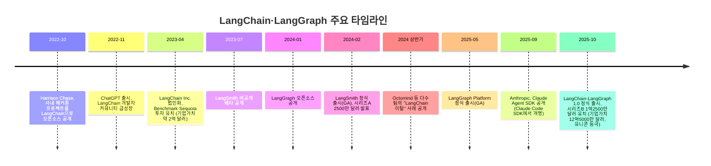
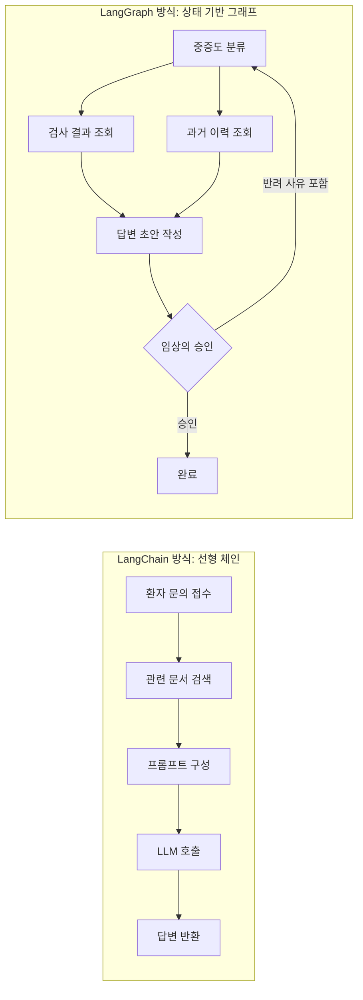
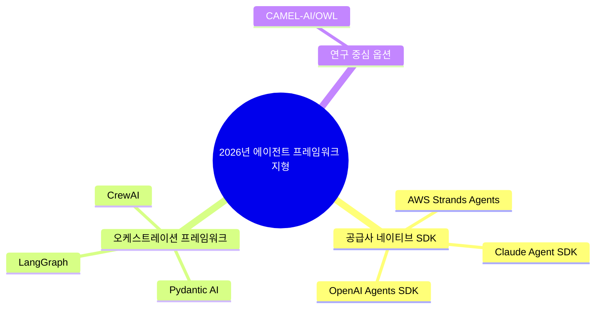

## 이 문서에 대하여

이 문서는 2026년 6월 6일 미디엄(Medium)에 게재된 Ankita Tripathi의 글 ["LangChain and LangGraph are DEAD? So what to USE!!"](https://medium.com/@writertripathi/langchain-and-langgraph-are-dead-so-what-to-use-4a6033621fce)를 기반으로, 글에서 다룬 사실관계를 하나하나 웹 검색으로 재확인하고, 원문 발행 이후에 나온 최신 정보를 추가로 보강해 재구성한 자료다. 원문은 개발자 커뮤니티에서 자주 등장하는 "LangChain은 죽었다"는 주장의 배경을 짚고, 2026년 시점에서 실제로 고려할 만한 AI 에이전트 프레임워크 7종을 소개하는 내용으로 구성돼 있다. 검증 과정에서 원문의 서술이 대체로 사실에 부합한다는 것을 확인했지만, 몇 가지 수치와 표현은 시점에 따라 달라지거나 과장된 부분이 있어 이를 본문 중간과 마지막 정정표에 명시했다.

---

## 1. 왜 "LangChain은 죽었다"는 말이 계속 나오는가

2023년 초 ChatGPT 열풍과 함께 등장한 LangChain은 한동안 LLM 애플리케이션 개발의 사실상 표준 도구로 통했다. 그런데 2025년 하반기부터 개발자 커뮤니티, 특히 X(구 트위터)에서는 "LangChain은 죽었다", "LangGraph는 비대해졌다"는 취지의 글이 반복적으로 올라오기 시작했다. 대안으로 거론되는 이름도 다양하다. Pydantic AI, CrewAI, Anthropic의 Claude Agent SDK, OpenAI의 Agents SDK, 혹은 아예 프레임워크 없이 "그냥 API를 직접 호출하라"는 주장까지 나온다.

흥미로운 지점은 이런 논쟁이 벌어지는 동안 정작 LangChain을 만든 회사는 전혀 다른 방향에서 몸집을 키웠다는 사실이다. 2025년 10월, LangChain Inc.는 IVP 주도로 1억2500만 달러를 유치하며 기업가치 12억5000만 달러의 유니콘이 됐다. 이 라운드에는 CapitalG(알파벳의 성장투자 부문), Sapphire Ventures와 함께 기존 투자자인 Sequoia, Benchmark, Amplify가 참여했고, ServiceNow Ventures, Workday Ventures, Cisco Investments, Datadog, Databricks 등 전략적 투자자도 이름을 올렸다. 이 소식은 프레임워크가 "죽었다"는 주장과는 정반대의 그림을 보여준다. 이 모순을 이해하려면 LangChain이 어떻게 시작됐고, 왜 LangGraph로 진화했으며, 지금 이 회사가 실제로 어디에서 돈을 벌고 있는지를 순서대로 짚어볼 필요가 있다.

---

## 2. LangChain은 어떻게 태어났는가

이야기는 2022년 가을로 거슬러 올라간다. 당시 하버드에서 통계와 컴퓨터공학을 전공한 해리슨 체이스(Harrison Chase)는 핀테크 스타트업 켄쇼(Kensho)를 거쳐, 머신러닝 모델의 테스트와 검증을 다루는 샌프란시스코의 스타트업 로버스트 인텔리전스(Robust Intelligence)에서 머신러닝 팀을 이끌고 있었다. 그는 2022년 말 회사를 떠날 준비를 하며 여러 AI 밋업에 참석했는데, 그 자리에서 개발자들이 언어모델을 다루며 공통적으로 부딪히는 문제, 즉 반복적으로 재발명되는 추상화 계층의 부재를 목격했다.

2022년 10월, 로버스트 인텔리전스 사내 해커톤에서 체이스는 노션(Notion)과 슬랙(Slack)의 내부 데이터를 자연어로 질의할 수 있는 봇을 만들었다. 이 프로젝트를 정리해 800줄 남짓한 파이썬 코드로 개인 깃허브 저장소에 올린 것이 LangChain의 시작이다. 첫 트윗은 10월 24일에 올라갔다. 공교롭게도 그로부터 한 달가량 뒤인 11월 30일 ChatGPT가 공개됐고, "AI를 넣은 앱을 만들고 싶다"는 개발자들이 대거 몰리면서 LangChain은 순식간에 커뮤니티의 표준 도구로 자리잡았다. 깃허브 스타 수는 2023년 2월 5000개에서 두 달 만인 4월 1만8000개로 뛰었다.

2023년 4월, LangChain은 벤치마크(Benchmark)로부터 1000만 달러 시드 투자를, 그 일주일 뒤 세쿼이아캐피털(Sequoia Capital)로부터 2000만 달러 시리즈A를 유치하며 정식 법인이 됐다. 이때 기업가치는 최소 2억 달러 수준으로 평가됐다.

---

## 3. LangChain이 실제로 해결한 문제 — "체인"이라는 개념

2023년 초 개발자들이 마주한 현실은 단순했다. LLM API를 호출하는 일 자체는 어렵지 않았지만, 쓸모 있는 애플리케이션을 만들려면 그 이상이 필요했다. 회사 내부 문서를 먼저 검색한 뒤 답변을 생성하는 RAG(검색증강생성) 파이프라인을 구축해야 했고, 사용자가 몇 마디 전에 한 말을 기억해야 했으며, 웹 검색·데이터베이스 조회·자체 지식 활용 중 무엇을 할지 판단해야 했다. 첫 답변이 부족하면 다른 방식으로 다시 시도하는 루프도 필요했고, 오늘은 OpenAI를 쓰다가 내일은 Anthropic으로 바꾸는 유연성도 요구됐다. 문제는 2023년 초 시점에 이런 기능이 모델 제공사의 API 자체에는 전혀 내장돼 있지 않았다는 점이다. OpenAI가 제공한 것은 그저 채팅 완성(chat completions) 엔드포인트뿐이었고, 나머지는 모두 개발자가 처음부터 직접 짜야 했다.

LangChain은 이 반복 작업을 "레고 블록"처럼 미리 만들어 제공하는 파이썬(이후 자바스크립트도 추가) 라이브러리였다. 이름 그대로 LLM을 활용하는 일련의 단계를 하나로 "연결(chain)"하는 것이 핵심 아이디어였다. 전형적인 체인은 사용자 입력을 받아 벡터 데이터베이스에서 관련 문서를 가져오고, 이를 프롬프트 템플릿에 채워 넣은 뒤 LLM에 전송하고, 결과를 파싱해 반환하는 식으로 구성됐다. LangChain은 이 각 단계마다 재사용 가능한 클래스와 함수를 제공했을 뿐 아니라, 벡터DB(피네콘, 위비에이트 등)나 LLM 제공사(OpenAI, Anthropic, Cohere, 로컬 모델 등), 문서 로더(PDF, 노션, 구글드라이브, 웹 스크래핑) 사이를 표준화된 어댑터로 오갈 수 있게 해줬다.

---

## 4. 균열의 시작 — 선형 구조의 한계

문제는 LangChain의 성공이 애초에 설계되지 않은 용도로 프레임워크를 끌고 갔다는 데 있었다. 2023년의 "PDF와 대화하기" 같은 애플리케이션에는 입력에서 출력까지 일직선으로 이어지는 "체인" 모델이 잘 맞았다. 그러나 2024년으로 접어들며 개발팀들은 훨씬 야심 찬 것을 만들기 시작했다. 몇 분씩 사고하고, 도구를 반복적으로 호출하고, 다른 에이전트에게 작업을 넘기고, 사람의 승인을 기다렸다가 이어서 실행하는 에이전트였다. 이런 요구는 단선적인 모델로는 표현하기 어려웠다.

이 시기 커뮤니티에 큰 반향을 일으킨 사례가 있다. 엔드투엔드 테스트를 자동으로 생성·수정하는 서비스를 만든 YC 소속 스타트업 옥토마인드(Octomind)가 2024년 중반 발표한 "우리가 더 이상 LangChain을 쓰지 않는 이유"라는 포스트다. 이 팀은 2023년 초부터 12개월 이상 LangChain을 프로덕션에 사용해왔는데, 요구사항이 복잡해지면서 문제가 불거졌다. 에이전트가 이미 파악한 정보를 바탕으로 사용할 수 있는 도구 목록을 동적으로 바꿔야 했지만, LangChain은 실행 중인 에이전트의 상태를 들여다보거나 수정할 방법을 제공하지 않았다. 결국 이들은 프레임워크에 맞춰 제품 자체를 단순화해야 했다. 옥토마인드 팀은 LangChain의 초기 설계자들을 부당하게 비판할 의도는 아니라고 밝히면서도, 빠르게 변하는 분야에서 오래 버틸 추상화를 설계하는 일이 얼마나 어려운지를 솔직하게 짚었다. 이후 2026년 초까지도 AWS 관련 매체나 여러 미디엄 게시물에서 비슷한 이탈 사례가 계속 보고되면서, 옥토마인드 사례는 하나의 상징적 이야기로 자리잡았다.

---

## 5. 체인에서 그래프로 — LangGraph의 탄생

체이스와 LangChain 팀도 이 한계를 인식하고 있었다. 답은 모델의 형태 자체를 바꾸는 것이었다. 2024년 1월 8일, LangChain의 오픈소스 동반 프로젝트로 LangGraph가 공개됐다. 이름의 변화가 곧 사고방식의 변화를 보여준다. 체인이 일직선이라면, 그래프는 반복(loop)하고 분기(branch)하고 조건을 걸 수 있는 노드와 엣지의 네트워크다.

LangGraph의 설계는 구글의 웹 그래프 처리 프레임워크였던 Pregel과 아파치 빔(Apache Beam)에서 영감을 받았다. 명시적인 순환 구조, 공유되는 상태 객체, 그리고 한 단계(superstep)의 모든 노드 쓰기가 다음 단계 시작 시점에 한꺼번에 반영되는 Pregel 스타일의 실행 루프를 갖췄다.

비유하자면 이렇다. LangChain에서 애플리케이션을 설계하는 방식은 요리 레시피에 가깝다. A 단계를 하고, B 단계를 하고, C 단계를 한 다음 결과를 반환한다. 반면 LangGraph에서는 애플리케이션을 지도처럼 그린다. 각 노드는 어떤 작업(대개 LLM 호출을 포함)을 수행하고, 엣지는 다음에 어느 노드로 갈지를 정하는 규칙이다. 화살표는 거꾸로도 향할 수 있어서, LLM의 출력이 만족스럽지 않으면 이전 노드로 되돌아갈 수 있다. 하나의 노드가 사용자의 요청 내용에 따라 여러 노드 중 하나로 작업을 분기시킬 수도 있고, 노드가 아예 실행을 멈추고 사람이 "승인" 버튼을 누르기를 기다릴 수도 있다.

헬스케어 앱의 고객지원 에이전트를 예로 들어보자. 사용자가 모호한 증상을 문의했다고 가정하면, 기존 LangChain 방식에서는 "이슈 분류 → 사용자 조회 → 최근 이력 조회 → 답변 생성 → 발송"이라는 순서로 흘러간다. 이 경우 분류가 틀렸더라도 체인은 멈추지 않고 이미 다음 단계로 넘어가버린다. LangGraph 방식으로 같은 문제를 모델링하면, "중증도 분류" 노드가 세 개의 전문 노드 중 하나로 작업을 라우팅하고, 각 전문 노드는 데이터를 가져와 답변 초안을 작성한 뒤 "승인" 노드로 넘겨 사람이 검토할 때까지 전체 실행을 멈춘다. 사람이 초안을 반려하면 반려 사유를 상태에 담아 다시 전문 노드로 돌아간다. 무엇이 잘못되든 이틀 뒤에 에이전트를 다시 열어 각 단계에서 정확히 어떤 일이 있었는지 확인하고, 원하는 지점부터 재개할 수 있다.

---

## 6. LangGraph는 실제로 어디에 쓰이는가

LangGraph가 주로 쓰이는 영역은 크게 네 가지로 정리할 수 있다.

첫째, 한 에이전트가 다른 에이전트에게 작업을 넘기는 멀티 에이전트 시스템이다. 조사 에이전트가 결과를 작성 에이전트에게 넘기고, 작성 에이전트의 초안을 비평 에이전트가 검토해 다시 돌려보내는 식이다.

둘째, 몇 초가 아니라 몇 분에서 몇 시간씩 이어지는 장시간 실행 에이전트다. 코딩 에이전트나 심층 리서치 제품들이 여기에 속한다. 다만 이 부분에서는 원문의 서술에 정정이 필요하다. 원문은 앤트로픽의 Claude Code, 코그니션(Cognition)의 데빈(Devin) 스타일 코딩 에이전트, OpenAI의 심층 리서치 제품이 모두 "LangGraph 스타일 아키텍처"를 쓴다고 설명했는데, 확인 결과 Claude Code는 LangGraph 위에 구축된 제품이 아니라 앤트로픽이 자체적으로 설계한 별도의 하네스(harness)를 사용한다. 다만 LangChain 팀이 2025년 하반기 공개한 오픈소스 프로젝트 Deep Agents는 Claude Code의 아키텍처(계획 수립 도구, 파일시스템 접근, 서브에이전트 생성, 컨텍스트 관리)를 LangGraph 위에서 재현한 제품이다. 즉 "LangGraph 스타일의 개념"이 여러 곳에서 독자적으로 재구현되고 있다는 원문의 취지 자체는 맞지만, Claude Code가 문자 그대로 LangGraph를 쓴다는 인상을 줄 수 있는 서술은 부정확하므로 구분해서 이해할 필요가 있다.

셋째, 사람이 개입해 승인하는 단계가 필수적인 영역이다. 의료·금융·법률처럼 규제가 강한 분야에서는 특정 조치를 AI가 사람의 승인 없이 취할 수 없도록 법적으로 요구되는 경우가 많은데, 이때 LangGraph의 일시정지·재개 기능이 유용하다.

넷째, 조건에 따라 에스컬레이션·재시도·분기가 필요한 고객지원 흐름, 그리고 작업을 계획하고 실행한 뒤 결과를 평가해 계속할지 전략을 바꿀지 판단해야 하는 리서치·분석 에이전트다.

이 시기 다른 모델 제공사들도 비슷한 개념의 자체 도구를 내놓았다. 앤트로픽은 네이티브 상태 관리, 도구 사용, 서브에이전트를 갖춘 Claude Agent SDK를 공개했고, OpenAI는 핸드오프와 가드레일을 내장한 Agents SDK를 선보였으며, AWS는 Strands를 오픈소스로 공개했다. 이 세 제품에 대해서는 다음 장에서 자세히 다룬다.

---

## 7. "죽었다"는 주장의 실체 — 유니콘이 된 진짜 이유

원문의 핵심 반전은 여기에 있다. 개발자 트위터에서 LangChain과 LangGraph를 성토하는 목소리가 커지는 동안, 정작 LangChain 회사는 2025년 10월 IVP 주도로 1억2500만 달러를 유치하며 기업가치 12억5000만 달러의 유니콘이 됐다. 이 라운드를 이끈 것은 LangChain도 LangGraph도 아니라, 두 프레임워크의 관측·평가(observability) 플랫폼인 LangSmith라는 것이 원문의 주장이다.

이 주장을 검증한 결과는 이렇다. LangSmith는 2023년 7월 비공개 베타로 처음 공개됐고, 2024년 2월 정식 출시(GA)와 함께 2500만 달러 규모의 시리즈A 유치 소식이 함께 발표됐다. LangSmith는 특정 프레임워크에 종속되지 않는다는 점이 특징으로, LangChain이나 LangGraph로 만들지 않은 애플리케이션도 추적·평가할 수 있다. 2025년 10월 펀딩 발표 당시 회사 측 공식 자료와 여러 매체 보도를 보면, LangSmith의 추적(trace) 처리량이 전년 대비 12배 성장했다는 수치가 강조됐고, 이는 상업적 수익을 발생시키는 유료 플랫폼이라는 점에서 오픈소스로 무료 배포되는 LangChain·LangGraph와는 성격이 다르다. 다만 같은 발표에서 회사는 LangChain 1.0과 LangGraph 1.0 정식 출시, 신규 기능인 Insights Agent, 노코드 에이전트 빌더 등도 함께 부각했기 때문에, "LangSmith가 유일한 원동력이었다"는 원문의 단정적 표현은 다소 단순화된 해석에 가깝다. 정확히 말하면, 이 라운드는 LangChain·LangGraph·LangSmith 세 제품 전체의 성장을 근거로 이뤄졌고, 그중 상업적으로 직접 매출을 내는 것은 LangSmith가 사실상 유일하다는 점에서 "실질적인 사업 동력"이라는 표현이 더 정확하다.

규모를 가늠할 수 있는 다른 수치들도 함께 짚어볼 만하다. 2025년 10월 펀딩 발표 시점에 회사는 LangChain·LangGraph 합산 월간 다운로드 9000만 회, 포춘 500대 기업의 약 35%가 자사 제품을 사용 중이라고 밝혔다. 깃허브 스타 수는 당시 11만8000개 수준이었고, 이후 2026년 6월 기준으로는 13만9000개를 넘어섰다는 조사 결과도 있다. LangGraph 단독 다운로드 수치는 출처마다 편차가 있는데, PyPI 다운로드 통계 서비스에서는 월 5800만 회, 다른 업계 분석 글에서는 3450만~3880만 회 수준으로 집계돼 시점과 집계 방식에 따라 상당한 차이를 보인다. 어느 쪽이든 LangGraph가 에이전트 오케스트레이션 프레임워크 중 설치 건수 기준으로는 선두권이라는 점은 여러 자료에서 일관되게 확인된다.

---

## 8. 2026년 현재 AI 에이전트 프레임워크 지형도

원문 저자는 지금 새 LLM 프로젝트를 시작한다면 실제로 고려할 프레임워크 7종을 세 카테고리로 나눠 소개했다. 검증 결과 이 분류 체계와 각 도구에 대한 설명은 대체로 정확했으며, 아래에서는 검증된 최신 수치를 반영해 다시 정리했다.

### 8.1 카테고리 1: 공급사 네이티브 SDK

모델 제공사들이 자사 SDK에 충분한 1차 도구 지원을 갖추면서, 많은 팀이 별도의 프레임워크 계층 없이 이 SDK만으로 상당 부분의 용도를 해결할 수 있게 됐다.

**Claude Agent SDK.** 앤트로픽이 자사의 코딩 에이전트 Claude Code에서 검증한 패턴을 뽑아내 만든 공식 에이전트 SDK다. 원래 이름은 Claude Code SDK였으나, 2025년 9월 29일 Claude Sonnet 4.5 발표와 함께 "Claude Agent SDK"로 개명됐다. 개명은 단순한 이름 변경이 아니라 서브에이전트, 라이프사이클 훅, Skills 시스템 등 실제 기능 확장을 동반했다. 도구 사용, MCP(Model Context Protocol), 컴퓨터 사용, 확장 사고(extended thinking), 컨텍스트 관리를 기본 지원한다. 파일을 읽고, 코드를 실행하고, 컴퓨터를 조작하는 등 실행 환경 안에서 오래 작동해야 하는 장기 실행 에이전트에 특히 강점이 있으며 MCP 연동이 네이티브라 도구를 붙이는 작업이 몇 줄의 코드로 끝난다. 반대로 앤트로픽 모델에 종속된다는 점, 그리고 단순 챗봇이나 단발성 애플리케이션에는 과한 선택이라는 점은 유의할 부분이다. 설치는 `pip install claude-agent-sdk` 한 줄로 시작할 수 있다.

**OpenAI Agents SDK.** 2024년 10월 OpenAI가 교육·실험용으로 내놓은 경량 프레임워크 Swarm의 프로덕션급 후속작으로, 2025년 3월 정식 출시됐다. Agents(지침과 도구를 가진 에이전트), Handoffs(에이전트 간 위임), Guardrails(입출력 검증) 세 가지를 핵심 프리미티브로 삼는 미니멀한 설계가 특징이며, 이후 Sessions(대화 기록 자동 관리)와 내장 트레이싱이 추가됐다. 여러 전문화된 에이전트가 서로 작업을 넘기는 멀티 에이전트 구조를 만들 때 가장 깔끔한 인체공학을 제공한다는 평가를 받는다. 다만 OpenAI 생태계에 최적화돼 있고, 트리 형태의 핸드오프 모델이 그래프처럼 유연한 구조를 원하는 팀에는 맞지 않을 수 있다. 참고로 2025년 10월 6일 OpenAI 데브데이에서는 이 SDK를 한층 확장한 AgentKit이 별도로 발표됐는데, 이는 원문 발행 시점에는 이미 나와 있었지만 원문에서는 다뤄지지 않은 내용이라 함께 언급해둔다. 설치는 `pip install openai-agents`로 시작한다.

**AWS Strands Agents.** AWS가 오픈소스로 공개한 에이전트 SDK로, 아마존 베드록(Bedrock)과 관리형 배포 계층인 AgentCore에 통합돼 있다. AWS 브랜드를 달고 있지만 실제로는 베드록뿐 아니라 앤트로픽, OpenAI, 올라마(Ollama), OpenAI 호환 엔드포인트까지 지원하는 모델 비종속적 설계를 갖췄다. AgentCore는 2025년 10월 정식 출시(GA)됐으며, 배포·확장·모니터링 같은 운영 영역을 대신 처리해준다. AWS 인프라를 이미 쓰고 있는 조직에는 적합하지만, 그렇지 않다면 이 프레임워크만을 위해 AWS 종속을 감수할 이유는 크지 않다는 게 솔직한 평가다. 설치는 `pip install strands-agents`.

### 8.2 카테고리 2: 오케스트레이션 프레임워크

단일 에이전트 루프로는 부족하고, 명시적인 상태 관리·분기 로직·사람 승인 게이트·여러 특화 에이전트 간 조율이 필요할 때 선택하는 계층이다.

**LangGraph.** 위에서 설명한 대로 그래프 기반 오케스트레이션 프레임워크로, 노드(작업)와 엣지(전이)로 에이전트를 모델링하고 상태를 체크포인트·조회·재개할 수 있다. 승인 전 실행을 멈추거나, 조건에 따라 라우팅하거나, 상태를 디스크에 저장해 몇 시간 뒤 재개해야 하는 애플리케이션에는 이 모델이 가장 자연스럽다. 우버, JP모건, 블랙록, 시스코, 링크드인, 클라나 등이 프로덕션에서 사용 중인 것으로 알려져 있다. 다만 단일 루프로 충분한 애플리케이션에는 과한 선택일 수 있고, 노드·엣지·상태 스키마 단위로 사고해야 하는 학습 곡선이 실재한다. 설치는 `pip install langgraph`.

**Pydantic AI.** 파이썬 개발자들에게 익숙한 타입 검증 라이브러리 Pydantic 팀이 만든 경량 타입 기반 에이전트 프레임워크로, 2024년 11월 공개됐다. "체인도 그래프도 없이, 타입이 있는 코드로 LLM을 호출한다"는 철학을 내세운다. 에이전트의 입출력을 타입이 있는 파이썬 객체로 정의하고 도구도 타입이 있는 함수로 선언하면, 나머지는 프레임워크가 처리한다. FastAPI가 웹 개발에 준 것과 같은 경험을 GenAI 개발에 주겠다는 목표로 설계됐다. 2025년 9월 1.0 안정 버전이 출시됐고, 2026년 4월 기준 깃허브 스타 1만6500개를 넘어섰다. 다만 그래프 형태의 명시적 상태 머신이나 휴먼 인 더 루프 분기가 필요하면 직접 위에 쌓아야 하고, 현재는 파이썬 전용이라 타입스크립트 중심 팀에는 맞지 않는다. 설치는 `pip install pydantic-ai`.

**CrewAI.** 연구원, 작성자, 비평가처럼 구체적인 "역할(role)"을 가진 에이전트로 팀을 구성하고 조율을 CrewAI가 대신 처리해주는 프레임워크다. 2023년 12월 첫 배포 이후 빠르게 성장해, 2026년 7월 기준 안정 버전은 1.14.x대(5월 28일 기준 1.14.6)이며 부속 도구 패키지인 crewai-tools는 1.15.2까지 나와 있다. 구글과 리눅스재단이 주도하는 에이전트 간 통신 표준인 A2A(Agent2Agent) 프로토콜을 정식 지원해, 다른 프레임워크로 만든 원격 에이전트에 작업을 위임하거나 스스로 A2A 서버 에이전트로 노출될 수 있다. 아이디어를 오후 한나절 만에 작동하는 데모로 만들 수 있는 가장 빠른 프로토타이핑 도구로 꼽히지만, 그 역할 기반 추상화가 실행 단계에서의 세밀한 제어를 제한하기도 해서, 프로덕션 단계에서 LangGraph나 저수준 SDK로 옮기는 팀도 있다. 설치는 `pip install crewai`.

### 8.3 카테고리 3: 연구 중심 옵션

**`Figure 1: Overview of WORKFORCE and OPTIMIZED WORKFORCE LEARNING.`**

**`Figure 2: Overview of the WORKFORCE framework. The system consists of a Planner Agent for task decomposition, a Coordinator Agent for orchestrating subtasks, and multiple specialized Worker Nodes equipped with domain-specific toolkits to execute assigned tasks.`**

**CAMEL-AI (와 OWL).** 사우디아라비아 KAUST 대학에서 시작된 학술 연구 프로젝트로, "정해진 역할을 가진 LLM 에이전트들이 서로 대화하면 어떤 일이 벌어지는가"라는 질문에서 출발했다. 지금은 최대 100만 개 에이전트 시뮬레이션까지 지원하는 프로덕션급 프레임워크로 성장했다. CAMEL 위에 구축된 실용 계층인 OWL은 범용 에이전트 벤치마크인 GAIA에서 오픈소스 프레임워크 중 1위를 기록했다. 검증 결과, 이 점수는 시점에 따라 갱신됐는데 2025년 3월 처음 1위에 오를 당시 58.18점이었고 이후 2025년 4월 69.09점까지 끌어올린 것으로 확인된다. 해당 연구는 2025년 9월 NeurIPS 2025에 정식 채택됐다. 대규모 합성 데이터 생성, 대규모 에이전트 시뮬레이션, 멀티 에이전트 연구, 크로스 환경 자동화가 필요할 때 강점을 보이며, Chain-of-Thought, Self-Instruct, Source2Synth 같은 검증기 기반 방법론을 함께 제공해 연구 워크플로에 가까운 결과물을 낸다. 다만 3주 안에 출시해야 하는 고객 대면 제품을 만드는 팀에는 적합하지 않은, 연구가 우선이고 프로덕션도 가능한 도구로 이해하는 편이 정확하다. 설치는 `pip install camel-ai`.

원문 저자는 이 밖에 AG2, Semantic Kernel, smolagents, Haystack, LlamaIndex는 의도적으로 제외했다고 밝혔는데, 이는 이들 도구가 나쁘다는 뜻이 아니라 각기 특정 니치(하이스택은 EU 규제 준수, 라마인덱스는 RAG 중심 애플리케이션, 시맨틱 커널은 닷넷 진영)에 집중돼 있거나 위 7개만큼의 채택 모멘텀을 아직 보여주지 못했기 때문이라는 설명이다.

---

## 9. 프레임워크 비교 요약표

| 프레임워크 | 개발 주체 | 최초 공개 | 2026년 현재 상태 | 가장 적합한 상황 |
|---|---|---|---|---|
| Claude Agent SDK | Anthropic | 2025년 9월(Claude Code SDK에서 개명) | 활발히 업데이트 중 | Claude 기반 장기 실행·컴퓨터 사용 에이전트 |
| OpenAI Agents SDK | OpenAI | 2025년 3월(Swarm의 후속) | v0.17대, AgentKit으로 추가 확장 | OpenAI 모델 중심 멀티 에이전트 핸드오프 |
| AWS Strands Agents | AWS | 2025년 상반기 공개, AgentCore는 2025년 10월 GA | 모델 비종속, AWS 통합 강화 중 | AWS 인프라 위에서 프레임워크 자유도 확보 |
| LangGraph | LangChain Inc. | 2024년 1월(1.0은 2025년 10월) | 설치 건수 기준 선두권, 대기업 다수 채택 | 상태 관리·휴먼 인 더 루프가 필요한 복잡한 에이전트 |
| Pydantic AI | Pydantic 팀 | 2024년 11월(1.0은 2025년 9월) | 빠르게 성장 중, 파이썬 전용 | 타입 안전성을 중시하는 프로덕션 코드 |
| CrewAI | CrewAI Inc. | 2023년 12월 | 1.14.x대, A2A 프로토콜 지원 | 역할 기반 멀티 에이전트 빠른 프로토타이핑 |
| CAMEL-AI / OWL | KAUST 출신 연구팀 | 2023년(OWL은 2025년) | GAIA 벤치마크 오픈소스 1위, NeurIPS 2025 채택 | 대규모 에이전트 시뮬레이션·합성 데이터 연구 |

---

## 10. 원문 대비 검증 및 정정 사항

아래는 원문의 서술 중 웹 검색으로 재확인한 결과 시점 특정이 필요했거나 표현을 다듬을 필요가 있었던 부분을 정리한 것이다. 대부분의 사실관계는 원문과 일치했다는 점을 먼저 밝혀둔다.

| 원문의 서술 | 검증 결과 |
|---|---|
| LangGraph가 "2024년 초 출시돼 2025년 10월 공개적으로 사용 가능해졌다" | 오픈소스 공개는 2024년 1월 8일이며, 이미 그때부터 누구나 설치해 쓸 수 있었다. 2025년 10월은 정확히는 "1.0 정식 안정 버전" 출시 시점이며, 그 사이 2025년 5월에는 관리형 배포 서비스인 LangGraph Platform이 별도로 GA됐다. |
| "LangSmith가 시리즈B의 유일한 동력이었다" | 회사의 공식 발표와 다수의 보도에서는 LangChain 1.0·LangGraph 1.0 출시, 신규 기능(Insights Agent, 노코드 빌더) 등이 함께 강조됐다. LangSmith가 유일하게 직접 매출을 내는 상업 제품이라는 점에서 "핵심 사업 동력"이라는 표현이 "유일한 동력"보다 정확하다. |
| "Claude Code, Devin, OpenAI 심층 리서치가 LangGraph 스타일 아키텍처를 쓴다" | Claude Code는 앤트로픽이 독자 설계한 하네스를 사용하며 LangGraph 위에 구축되지 않았다. 다만 LangChain의 오픈소스 프로젝트 Deep Agents는 Claude Code의 아키텍처를 LangGraph 위에서 재구현한 사례로 확인된다. |
| "LangGraph가 이미 월 4700만 다운로드를 넘었다" | 집계 시점과 방식에 따라 월 3450만~5800만 회로 편차가 있다. LangChain 공식 발표 기준으로는 LangChain·LangGraph를 합산해 월 9000만 회 수준이라는 수치가 제시된 바 있다. |
| "CrewAI가 버전 1.14까지 나왔고 A2A를 지원한다" | 2026년 7월 기준 안정 버전은 1.14.6(5월 28일)이며, A2A 클라이언트·서버 설정을 위한 공식 확장 패키지(`crewai[a2a]`)가 제공되고 있음을 확인했다. |
| "OWL이 GAIA에서 오픈소스 1위이며 NeurIPS 2025에 채택됐다" | 정확하다. 다만 점수는 2025년 3월 최초 1위 등극 당시 58.18점에서 2025년 4월 69.09점으로 갱신됐으며, NeurIPS 채택 발표는 2025년 9월에 이뤄졌다. |

---

## 11. 정리하며

결국 "LangChain과 LangGraph는 죽었다"는 주장은 절반만 맞는 이야기에 가깝다. 초기 LangChain의 지나치게 높은 수준의 추상화가 복잡한 에이전트 구축에 걸림돌이 됐다는 불만은 실제였고, 옥토마인드를 비롯한 여러 팀의 이탈 사례도 사실이다. 그러나 그 불만에 대한 회사 측의 대응이 바로 LangGraph였고, 이 프레임워크는 2026년 현재도 설치 건수 기준 선두권을 지키며 다수의 대기업 프로덕션 환경에서 쓰이고 있다. 동시에 회사는 관측·평가 플랫폼인 LangSmith를 통해 실질적인 매출 구조를 만들었고, 이를 발판으로 유니콘 지위에 올랐다.

한편 2026년 현재 개발자들의 선택지는 확실히 넓어졌다. 모델 제공사들이 자사 SDK에 충분한 에이전트 기능을 갖추면서, 프레임워크 없이 SDK만으로 시작하는 것이 새로운 기본값이 됐다. 그럼에도 불구하고 명시적인 상태 관리, 분기, 휴먼 인 더 루프가 필요한 복잡한 워크플로에서는 여전히 LangGraph 같은 오케스트레이션 계층이 필요하다. 결국 선택의 기준은 "어떤 프레임워크가 유행하는가"가 아니라, "내가 만들려는 에이전트가 실제로 어떤 제어 구조를 필요로 하는가"에 있다.

---

## 참고 자료

- Ankita Tripathi, "LangChain and LangGraph are DEAD? So what to USE!!", Medium, 2026년 6월 6일
- LangChain 공식 블로그, "LangChain raises $125M to build the platform for agent engineering", 2025년 10월
- LangChain Changelog, "LangGraph 1.0 is now generally available", 2025년 10월 29일
- Wikipedia, "LangChain" 항목
- AI Wiki, "LangGraph" 항목, 2026년 4월
- Octomind, "Why we no longer use LangChain for building our AI agents", 2024년
- SiliconANGLE, Dataconomy, Pulse2, TechBuzz 등 2025년 10월 LangChain 시리즈B 관련 보도
- Anthropic, "Building agents with the Claude Agent SDK", 2025년 9월 29일
- Sacra, "LangChain valuation, funding & news"
- camel-ai/owl GitHub 저장소 릴리스 노트
- CrewAI 공식 문서 및 PyPI 배포 이력
- AWS, "Amazon Bedrock AgentCore" 공식 페이지

---

작성일: 2026년 7월 18일
