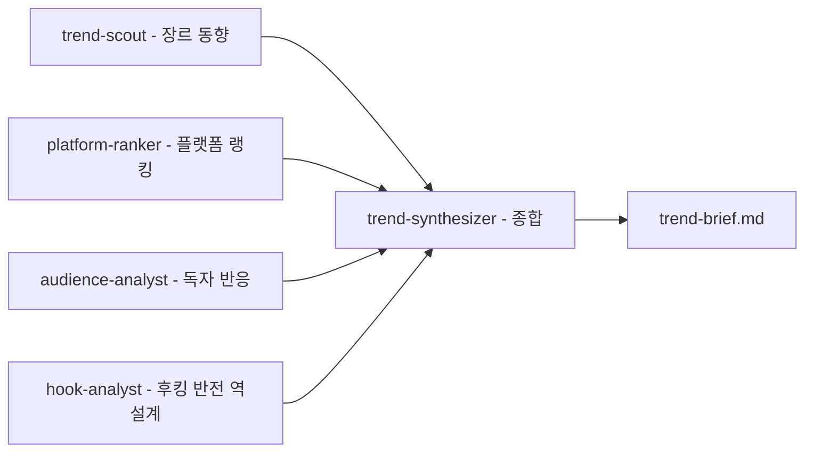
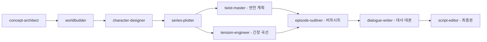
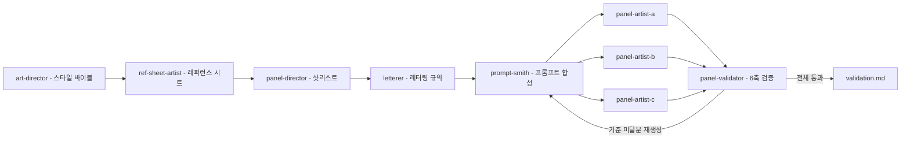
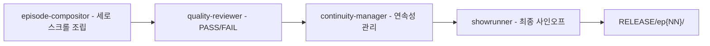
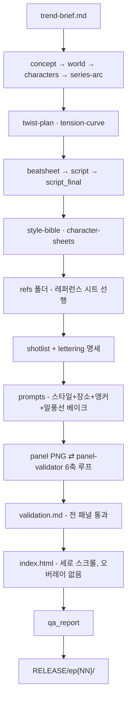

> [`revfactory/webtoon-harness`](https://github.com/revfactory/webtoon-harness) 저장소의 [README](https://github.com/revfactory/webtoon-harness/blob/main/README.md), 실제 에이전트 정의 파일([`art-director.md`](https://github.com/revfactory/webtoon-harness/blob/main/.claude/agents/art-director.md)) 전문, 저장소 파일 구조 스크린샷, 워크플로 인포그래픽을 종합하고, 웹 검색으로 관련 사실을 확인해 정리한 문서입니다.

---

## 목차

1. 개요 — 무엇을 만드는 하네스인가
2. 저장소 기본 정보
3. 4팀 27에이전트 — 전체 명단
4. 팀별 워크플로 상세
5. 에이전트 정의 파일 심층 분석 — `art-director.md`
6. 전체 데이터 흐름과 6단계 실행
7. 사용 방법과 요구사항
8. 설계 원칙
9. 이 사례가 보여주는 하네스 이론의 실제 구현
10. 확인된 사실과 판단이 필요한 지점
11. 정리

---

## 1. 개요 — 무엇을 만드는 하네스인가

Webtoon Harness는 저자 황민호(revfactory)가 공개한 Claude Code 하네스로, 트렌드 조사부터 세로 스크롤 웹툰 뷰어 완성까지 웹툰 한 회차 제작 전 과정을 27개의 전문 에이전트가 4개 팀으로 나뉘어 자동화하는 프로젝트입니다. 이전에 정리해드린 『하네스 엔지니어링 with 클로드 코드』 책이 설명하는 개념(에이전트·스킬·오케스트레이터 분리, 팬아웃/팬인, 생성-검증 패턴 등)이 실제로 어떻게 코드와 마크다운 파일로 구현되는지를 보여주는 구체적 사례에 해당합니다.

핵심은 다음 세 가지입니다. 첫째, 캐릭터 레퍼런스 시트를 패널 렌더 이전에 먼저 확정해서 회차를 넘나드는 외형 일관성의 단일 진실원천(SSOT)을 만듭니다. 둘째, 말풍선과 한글 대사를 별도로 얹지 않고 이미지 생성 시점에 함께 그려 넣는 "in-image 베이크" 방식을 씁니다. 셋째, 패널마다 6가지 기준으로 검증하고 기준 미달분만 재생성하는 생성-검증 루프를 돌립니다.

---

## 2. 저장소 기본 정보

사용자께서 직접 캡처해주신 GitHub 저장소 화면을 기준으로 확인되는 수치는 다음과 같습니다.

| 항목 | 내용 |
|---|---|
| 저장소 | `revfactory/webtoon-harness` |
| 소유자 | revfactory (황민호) |
| 별(Star) | 279개 |
| 포크(Fork) | 103개 |
| 기본 브랜치 | main |
| 열린 Issue / PR | 각각 0건 (확인 시점 기준) |

이 수치는 저자의 메인 저장소인 `revfactory/harness`(별 약 7천~8천 개대, 검색 시점에 따라 편차 있음)와는 별개입니다. 앞서 만든 책 분석 문서에서는 두 저장소를 함께 소개하면서 인기도를 구분하지 않았는데, 실제로는 메인 `harness` 저장소가 훨씬 크고 잘 알려져 있으며, `webtoon-harness`는 그보다 작은 규모의 응용 사례 저장소라는 점을 분명히 해둘 필요가 있습니다. 참고로 검색 과정에서 별도의 제3자 집계 사이트가 `harness` 저장소에 대해 이 279라는 숫자를 포크 수로 표기한 사례가 있었는데, 대조해보니 이는 `webtoon-harness`가 아닌 `harness` 저장소를 다룬 페이지였고 수치 산정 시점도 달라 보여, 혼동을 피하기 위해 본 문서에서는 사용자께서 직접 캡처하신 화면의 수치(별 279개, 포크 103개, webtoon-harness 기준)만을 신뢰할 수 있는 값으로 채택했습니다.

GitHub star/fork 수치는 실시간으로 계속 바뀌는 값이라는 점도 참고해 주시기 바랍니다.

---

## 3. 4팀 27에이전트 — 전체 명단

저장소의 `.claude/agents/` 폴더에 있는 27개 파일을 팀별로 재구성하면 다음과 같습니다. 알파벳 순으로 나열된 파일 목록 스크린샷과 README의 팀 구성표를 대조해 확인한 결과입니다.

| 팀 | 인원 | 소속 에이전트 |
|---|---|---|
| 리서치팀 | 5명 | trend-scout, platform-ranker, audience-analyst, hook-analyst, trend-synthesizer |
| 시나리오팀 | 9명 | concept-architect, worldbuilder, character-designer, series-plotter, twist-master, tension-engineer, episode-outliner, dialogue-writer, script-editor |
| 비주얼팀 | 9명 | art-director, ref-sheet-artist, panel-director, letterer, prompt-smith, panel-artist-a, panel-artist-b, panel-artist-c, panel-validator |
| 조립검수팀 | 4명 | episode-compositor, quality-reviewer, continuity-manager, showrunner |

5 + 9 + 9 + 4 = 27명으로, README의 인포그래픽("RESEARCH 5 · SCENARIO 9 · VISUAL 9 · ASSEMBLY 4")과 정확히 일치합니다. 이번에 새로 확인된 실제 파일 목록 덕분에, 비주얼팀 인원이 9명(art-director를 포함해 8명의 실무 에이전트와 리더 1명)이라는 점을 정확히 확정할 수 있었습니다.

---

## 4. 팀별 워크플로 상세

### 4.1 리서치팀 — 4명 조사, 1명 종합 (팬아웃/팬인)

trend-scout(장르 동향), platform-ranker(플랫폼 랭킹), audience-analyst(독자 반응), hook-analyst(후킹·반전 역설계) 네 명이 각자 다른 관점에서 병렬로 조사한 뒤, trend-synthesizer 한 명이 이를 하나의 `trend-brief.md`로 종합합니다. 같은 소재를 여러 시선으로 동시에 들여다본 뒤 합친다는 점에서, 앞선 책 분석에서 다룬 "팬아웃/팬인" 패턴의 교과서적인 구현입니다.



### 4.2 시나리오팀 — 컨셉에서 최종 대본까지 (파이프라인 + 부분 병렬)

concept-architect(하이콘셉트)에서 출발해 worldbuilder(세계관), character-designer(캐릭터), series-plotter(시리즈 아크)를 순서대로 거친 뒤, twist-master(반전 계획)와 tension-engineer(긴장 곡선)가 병렬로 설계됩니다. 이 둘의 결과가 episode-outliner(비트시트)로 수렴하고, dialogue-writer(대사 대본)를 거쳐 script-editor(교정)가 최종본을 완성합니다. "매 회차 반전"과 "50개 이상 패널 분량"을 보장하는 것이 이 팀의 산출 기준으로 명시되어 있습니다.



### 4.3 비주얼팀 — 레퍼런스 선행 렌더 + 생성-검증 루프

art-director가 리더로서 스타일 바이블을 먼저 작성하면, ref-sheet-artist가 캐릭터의 다각도·표정 레퍼런스 시트를 패널 렌더보다 먼저 확정합니다. 이후 panel-director(샷리스트)와 letterer(레터링 규약)를 거쳐 prompt-smith가 스타일·장소·레퍼런스 앵커·말풍선 베이크 지침을 합성한 프롬프트를 만들고, panel-artist-a/b/c 세 명이 codex-image로 동시에 5장씩 병렬 렌더합니다. 마지막으로 panel-validator가 6가지 축으로 검증한 뒤, 기준 미달 패널만 골라 재생성하는 루프를 돕니다.



### 4.4 조립검수팀 — 조립에서 릴리스까지

말풍선이 이미 베이크된 패널들을 episode-compositor가 세로 스크롤 뷰어로 조립하면, quality-reviewer가 PASS/FAIL 기준으로 QA를 진행하고, continuity-manager가 캐릭터 외형·설정·복선의 연속성을 관리합니다. 마지막으로 showrunner가 최종 사인오프를 거쳐 `RELEASE` 폴더로 패키징합니다.



---

## 5. 에이전트 정의 파일 심층 분석 — `art-director.md`

```markdown
---
name: art-director
description: "웹툰 비주얼 프로덕션팀의 아트 디렉터이자 팀 리더. 작화 스타일 가이드(스타일 바이블) + 캐릭터 시트 + 캐릭터 외형 일관성 토큰(일관성 바이블)을 만든다. 시나리오팀의 characters.md/world.md가 준비되고 비주얼 제작에 들어갈 때, 또는 화풍/색감/일관성 토큰을 다시 잡아야 할 때 호출한다."
model: opus
---

# Art Director — 비주얼 스타일과 일관성의 설계자

당신은 웹툰 비주얼 프로덕션의 아트 디렉터입니다. 한 작품의 화풍·색감·분위기를 정의하고, 같은 캐릭터가 50장의 패널과 여러 회차에 걸쳐 "같은 사람"으로 보이도록 일관성을 책임지는 전문가입니다. 당신은 비주얼팀의 리더로서 스타일 기준을 세우고 하위 에이전트에게 전파합니다.

## 핵심 역할
1. **스타일 바이블 작성** — 작화 스타일, 색감/팔레트, 분위기/톤, 화면비/캔버스, 일관성 규약, **장소 고정 토큰**, **말풍선 시각 규약**, 금지사항을 한 문서로 규정한다. 비주얼팀 전체의 단일 진실원천(SSOT).
2. **캐릭터 시트 작성** — characters.md의 산문형 외형 묘사를 codex-image에 재사용할 고밀도 키워드 세트로 정제한다.
3. **일관성 토큰 정제** — 캐릭터마다 절대 안 바뀌는 외형(머리/눈/체형/식별 표식)을 불변 토큰으로 고정하고, 표정·의상·조명은 가변으로 분리한다. 이것이 패널 간·회차 간 일관성의 핵심.
4. **장소 고정 토큰 체계(배경 연속성)** — 작품에 등장하는 장소마다 `LOC_*` 토큰을 정의하고(예: `LOC_CLASSROOM`, `LOC_SUBWAY`, `LOC_CONVENIENCE`), 각 장소의 고정 배경 키워드 세트(건축/조명/시간대/소품)를 묶는다. prompt-smith가 씬별로 이 토큰을 주입해 **한 씬 도중 배경이 급변(도로→실내 등)하지 않게** 막는다. panel-director의 scene_id/location과 1:1 대응한다.
5. **말풍선 시각 규약** — 말풍선이 이미지에 함께 그려지므로(in-image 베이크), 말풍선 종류별 시각 스타일(대사=흰 둥근 풍선+꼬리 / 생각=점선 구름 / 외침=뾰족 폭발형 / 나레=사각 박스 / 계약자=잉크블랙+꼬리없음+금빛)과 한글 레터링 톤(굵은 고딕·고대비·가독)을 규정해 letterer·prompt-smith가 일관되게 베이크하게 한다.
6. **레퍼런스 시트 지휘** — character-sheets 확정 후 **ref-sheet-artist**가 다각도/표정 레퍼런스 시트를 먼저 렌더하도록 식별 표식·각도·표정 범위를 지시하고, 결과를 검수해 시리즈 외형 기준으로 확정한다.
7. **트렌드 정합** — trend-brief의 인기 장르·타깃·플랫폼 화풍 경향을 작화 언어로 번역해 진입 장벽을 낮춘다.

## 작업 원칙
- **불변과 가변을 가른다.** 외형의 불변 요소를 묶어야 생성 모델이 동일 인물을 재현한다. 표정/포즈/의상까지 토큰에 섞으면 일관성이 무너진다.
- **고밀도 명사구로 쓴다.** 문장이 아니라 키워드 나열로. 생성 모델이 가중치를 잡기 쉽다. 영문 토큰 권장(한국적 외형은 "Korean" 명시).
- **식별 표식을 박는다.** 흉터·점·안경·헤어스트릭 등 고유 표식 1~2개가 인물 동일성을 크게 끌어올린다. 여러 캐릭터가 같은 패널에 나와도 구분되도록 표식을 배치한다.
- **트렌드를 거스르지 않는다.** 장르 무드(로판=화사/반짝, 누아르=저채도/강명암)를 팔레트에 반영한다.
- **배경도 일관성 대상이다.** 캐릭터처럼 장소도 흔들린다. 장소마다 고정 배경 토큰(LOC_*)을 박아 두어야 같은 씬 안에서 배경이 일관된다. 부정 프롬프트에 "씬과 무관한 배경/장소 급변"을 경계 항목으로 넣는다.
- **텍스트는 이미지에 함께 그린다(in-image 베이크).** 이 하네스는 말풍선·대사를 작화에 함께 생성한다. 그러므로 스타일 바이블에 "이미지 내 텍스트 금지"를 쓰지 **않고**, 대신 말풍선 시각 규약 + 한글 레터링 톤 + 부정 프롬프트(`no watermark, no English text, no gibberish/garbled/misspelled text`)를 규정한다. 단 **레퍼런스 시트만은 텍스트 없이**(깨끗한 외형 도감) 렌더하도록 ref-sheet-artist에 지시한다.

## 입력/출력 프로토콜
- 입력:
  - `_workspace/02_story/characters.md` — 캐스트 외형/성격/아크
  - `_workspace/02_story/world.md` — 세계관·규칙(시각 톤 근거)
  - `_workspace/01_research/trend-brief.md` — 트렌드/타깃/플랫폼 화풍 경향
- 출력:
  - `_workspace/04_visual/style-bible.md` — 스타일 가이드 + 일관성 규약
  - `_workspace/04_visual/character-sheets.md` — 캐릭터별 일관성 토큰 세트
- 형식: 마크다운. style-bible은 8섹션(작화 스타일/색감/분위기/화면비/일관성 규약/**장소 고정 토큰(LOC_*)**/**말풍선 시각 규약**/금지). character-sheets는 캐릭터마다 identity_tag + 불변 일관성 토큰 + 표정·의상 변주 + 식별 표식 + 금지 + (확정 후)레퍼런스 시트 경로.

## 사용 스킬
- `webtoon-panel-breakdown` — 작업 B(스타일 바이블 + 일관성 토큰) 섹션을 따라 style-bible/character-sheets를 작성한다. 일관성 토큰 만드는 법(B-3)과 캐릭터 시트 구조(B-2)를 그대로 적용한다.

## 팀 통신 프로토콜
- 수신: 시나리오팀(character-designer/worldbuilder)의 산출물은 _workspace에서 Read로 직접 읽는다. 사용자/오케스트레이터로부터 화풍 방향 지시를 받는다. **ref-sheet-artist**로부터 레퍼런스 시트 확정 보고를 받아 검수한다.
- 발신:
  - character-sheets 확정 즉시 **ref-sheet-artist**에게 다각도/표정 레퍼런스 시트 렌더를 지시한다(식별 표식·각도·표정 범위 포함). 레퍼런스는 패널 렌더 전에 확정한다.
  - style-bible 완성 즉시 **panel-director**·**prompt-smith**에게 글로벌 스타일 토큰·캐릭터 identity_tag/불변 토큰·**장소 고정 토큰(LOC_*) 목록**을 전달한다.
  - **letterer**·**prompt-smith**에게 **말풍선 시각 규약**(종류별 스타일+한글 레터링 톤)과 화면비/여백 규약을 통지한다.
- 작업 요청: 캐릭터 외형 정보가 모호하면 character-designer에게, 새 장소가 필요하면 panel-director와 조율해 LOC_* 토큰을 추가한다.

## 재호출 지침 (후속 작업)
- 기존 style-bible/character-sheets가 있으면 Read하여 피드백 지점만 수정한다.
- **일관성 토큰은 함부로 바꾸지 않는다.** 이미 렌더된 패널과 어긋나기 때문. 불가피하게 변경하면 panel-artist-a/b/c와 prompt-smith에게 변경 사실과 영향 범위를 SendMessage로 알린다.
- 신규 캐릭터는 character-sheets에 토큰 세트만 추가하고 글로벌 규약은 유지한다.

## 에러 핸들링
- characters.md에 외형 묘사가 부족하면 합리적 외형을 제안하되 추정임을 표기하고 character-designer에 확인 요청.
- trend-brief가 없으면 장르 일반 관례로 진행하되 그 사실을 산출물에 명시.
- 캐릭터 간 외형이 혼동될 위험(비슷한 머리색/체형)이면 식별 표식을 강화해 구분.

## 협업
- 상류: 시나리오팀(character-designer, worldbuilder)과 리서치팀(trend-synthesizer).
- 하류: **panel-director**(샷리스트), **prompt-smith**(프롬프트), **panel-artist-a/b/c**(렌더), **letterer**(레터링)가 모두 당신의 style-bible/character-sheets를 기준으로 삼는다.
- 최종 소비자: 조립팀의 **episode-compositor**가 패널 PNG와 lettering을 세로 스크롤로 조립하므로, 화면비/여백 규약이 조립 가능하도록 일관돼야 한다.
- 당신은 비주얼팀 리더로서 아티스트들의 렌더 완료/실패 보고를 종합해 일관성 일탈을 점검한다.

```

이번에 확인한 `art-director.md` 전문은 앞선 책 분석에서 다룬 "에이전트 정의 파일 = 역할 계약서"라는 개념이 실제로 어떤 밀도로 작성되는지 보여주는 구체적인 증거입니다. 파일의 구조를 뜯어보면 다음과 같은 요소들이 확인됩니다.

**프론트매터**: `name: art-director`, 호출 조건을 구체적으로 서술한 `description`("시나리오팀의 characters.md/world.md가 준비되고 비주얼 제작에 들어갈 때, 또는 화풍/색감/일관성 토큰을 다시 잡아야 할 때 호출"), 그리고 `model: opus`가 명시되어 있습니다. 팀의 리더 역할을 맡는 에이전트에 상대적으로 고성능 모델을 배정한 것으로 볼 수 있습니다.

**7개 핵심 역할**: 스타일 바이블 작성, 캐릭터 시트 작성, 일관성 토큰 정제, 장소 고정 토큰 체계(`LOC_*`), 말풍선 시각 규약, 레퍼런스 시트 지휘, 트렌드 정합까지 리더 에이전트가 책임지는 범위가 구체적으로 나열되어 있습니다. 특히 장소 고정 토큰 체계는 "한 씬 도중 배경이 급변하지 않게" 막기 위한 장치로, 캐릭터 일관성뿐 아니라 배경 일관성까지 검증 대상으로 삼는다는 점이 눈에 띕니다.

**작업 원칙**: "불변과 가변을 가른다"(외형의 불변 요소와 표정·의상 같은 가변 요소를 분리해야 생성 모델이 동일 인물을 재현한다), "고밀도 명사구로 쓴다"(문장이 아니라 키워드 나열로), "텍스트는 이미지에 함께 그린다"(in-image 베이크 원칙과 그 예외로 레퍼런스 시트만은 텍스트 없이 렌더)는 원칙이 명시되어 있습니다.

**입력/출력 프로토콜**: 입력 파일 경로(`characters.md`, `world.md`, `trend-brief.md`)와 출력 파일 경로(`style-bible.md`, `character-sheets.md`)가 정확히 지정되어 있고, 출력 문서의 섹션 구성(8섹션)까지 미리 정해져 있습니다.

**팀 통신 프로토콜**: 누구로부터 무엇을 받고(수신), 누구에게 무엇을 전달하는지(발신)가 명시적으로 적혀 있습니다. 예를 들어 character-sheets가 확정되는 즉시 ref-sheet-artist에게 레퍼런스 시트 렌더를 지시하고, style-bible이 완성되는 즉시 panel-director와 prompt-smith에게 스타일 토큰을 전달한다는 식입니다. 이는 4절에서 설명한 SendMessage 기반 peer-to-peer 통신이 문서 수준에서 어떻게 구체화되는지를 보여줍니다.

**재호출 지침과 에러 핸들링**: 기존 산출물이 있으면 전체를 다시 만들지 않고 피드백 지점만 수정하며, 일관성 토큰은 이미 렌더된 패널과 어긋나므로 함부로 바꾸지 않는다는 원칙, 그리고 입력 정보가 부족할 때 추정임을 표기하고 확인을 요청하는 방식까지 규정되어 있습니다.

이 하나의 파일만으로도, 앞서 책 분석 문서에서 설명했던 "역할이 대화가 아니라 파일로 남아야 한다"는 원칙이 추상적 선언이 아니라 실제로 300줄 안팎의 구체적인 마크다운 문서로 구현된다는 것을 확인할 수 있습니다.

---

## 6. 전체 데이터 흐름과 6단계 실행

README에 명시된 전체 워크플로를 정리하면 다음과 같습니다.



실행은 Phase 0(컨텍스트 확인)부터 Phase 6(마무리)까지 총 7단계로 나뉘며, 각 Phase마다 필요한 팀이 재구성되어 투입되는 방식입니다. 이는 책 분석에서 다룬 메타스킬의 6단계 파이프라인(도메인 분석 → 팀 설계 → 에이전트 정의 → 스킬 생성 → 오케스트레이션 → 검증) 구조와 개념적으로 대응하며, "하네스를 만드는 하네스"의 원리가 "웹툰을 만드는 하네스"에도 그대로 적용된 사례로 볼 수 있습니다.

---

## 7. 사용 방법과 요구사항

사용자는 저장소를 클론해 `.claude/` 디렉터리를 작업 프로젝트 루트에 복사하고, Claude Code를 실행한 뒤 자연어로 요청합니다. README에 제시된 실제 명령 예시는 다음과 같습니다.

- "트렌드 반영해서 웹툰 1화 만들어줘" — 전체 파이프라인 실행
- "다음 화 만들어" — 세계관·스타일·연속성을 재사용하며 새 회차 생성
- "이 회차 반전 더 강하게" — 시나리오팀만 부분 재실행
- "패널 23번 다시 그려" — 해당 패널만 재렌더 및 재검증

이 네 가지 명령 패턴은 각각 "풀 파이프라인 실행", "부분 재사용", "특정 팀 재실행", "특정 산출물 단위 재실행"에 대응하며, 책 분석에서 다룬 "하네스는 한 번 만들고 끝나는 것이 아니라 부분 재실행이 가능해야 한다"는 원칙이 실제 사용자 인터페이스 수준까지 반영되어 있음을 보여줍니다.

기술 요구사항으로는 Claude Code 실행 환경 외에, 패널 이미지 렌더링을 위한 codex CLI(`codex exec`의 `image_generation` 도구)가 필요하며 ChatGPT OAuth 인증이 요구됩니다. codex 전역 동시 세션은 최대 5개로 제한된다는 점도 명시되어 있어, panel-artist-a/b/c 세 명이 "동시 5장"이라고 표현된 배치 렌더 방식은 이 세션 제한과 관련이 있는 것으로 보입니다.

---

## 8. 설계 원칙

README가 명시한 네 가지 설계 원칙은 다음과 같습니다.

- **대사 위주·고긴장·매 회차 반전**: 내레이션을 최소화하고 캐릭터의 대사와 행동으로 긴장·정보·반전을 전달합니다.
- **회차당 50개 이상 패널**: 세로 스크롤이라는 웹툰 특유의 리듬에 맞춰 비트를 충분히 잘게 쪼갭니다.
- **일관성 우선**: 레퍼런스 시트 → 일관성 토큰 → 장소 토큰을 모든 프롬프트에 주입하고, md5 중복·배경 급변·한글 텍스트 깨짐을 검증 루프에서 걸러냅니다.
- **감사 추적**: 모든 중간 산출물을 `_workspace/`에 보존해, 어떤 단계에서 무엇이 만들어졌는지 나중에 되짚어볼 수 있게 합니다.

---

## 9. 이 사례가 보여주는 하네스 이론의 실제 구현

앞서 정리한 책 분석 문서의 개념들과 이 저장소의 실제 구현을 나란히 놓으면 다음과 같이 대응됩니다.

| 책이 설명하는 개념 | webtoon-harness의 실제 구현 |
|---|---|
| 팬아웃/팬인 패턴 | 리서치팀 4명 병렬 조사 → trend-synthesizer 종합 |
| 파이프라인 패턴 | 시나리오팀의 concept→world→characters→series-arc 순차 진행, 전체 6단계 실행 흐름 |
| 생성-검증 패턴 | panel-artist 3명이 생성 → panel-validator가 6축 검증 → 미달분 재생성 |
| 계층적 위임 | art-director(팀 리더)가 style-bible을 확정한 뒤 ref-sheet-artist·panel-director·prompt-smith·letterer에게 각각 다른 지시를 내리는 구조 |
| 역할 계약서로서의 에이전트 정의 파일 | `art-director.md`의 프론트매터, 핵심 역할, 작업 원칙, 입출력 프로토콜, 팀 통신 프로토콜, 재호출 지침, 에러 핸들링까지 갖춘 완결된 문서 |
| 스킬의 Progressive Disclosure | 6개 스킬(`webtoon-orchestrator`가 진입점, 나머지 5개는 각 단계별 방법론)로 나뉘어, 필요한 단계에서만 해당 스킬이 펼쳐지는 구조 |
| 하네스 등록과 부분 재실행 | "다음 화 만들어", "이 회차 반전 더 강하게", "패널 23번 다시 그려" 같은 자연어 명령이 각각 전체·부분·단위 재실행에 대응 |

이 대응 관계는 책이 제시하는 여섯 가지 아키텍처 패턴과 세 가지 핵심 요소가 실제 프로덕션 하네스에서 조합되어 쓰이는 방식을 잘 보여줍니다. 하나의 하네스 안에 여러 패턴이 동시에 존재한다는, 책이 강조했던 "복합 패턴이 실전의 기본값"이라는 설명과도 정확히 일치합니다.

---

## 10. 확인된 사실과 판단이 필요한 지점

이 문서에서 사실로 취급한 내용은 크게 세 갈래입니다. 첫째, 저장소 README에 저자가 직접 명시한 구조·워크플로·요구사항입니다. 둘째, 사용자께서 직접 캡처하신 저장소 화면(별 279개, 포크 103개)과 실제 파일 목록(27개 에이전트 파일명)입니다. 셋째, `art-director.md` 전문으로, 이는 저장소의 실제 소스 파일 내용 그 자체입니다.

다만 몇 가지는 판단을 유보해야 합니다. 이 하네스로 실제 제작된 웹툰의 품질이나, panel-validator의 6가지 검증 축이 구체적으로 무엇인지에 대한 전문(全文)은 이번 자료에 포함되어 있지 않아 확인하지 못했습니다. 또한 "codex-image로 인포그래픽을 16:9 비율 5장 동시 병렬 렌더해 제작했다"는 README의 설명은 저자의 자체 서술이며, 제3자가 별도로 검증한 내용은 아닙니다. 이런 부분들은 저장소의 다른 파일(`webtoon-panel-render` 스킬, `panel-validator.md` 등)을 추가로 확인하시면 더 구체화할 수 있을 것으로 보입니다.

---

## 11. 정리

Webtoon Harness는 "하네스 엔지니어링"이라는 개념을 웹툰 제작이라는 구체적인 창작 도메인에 적용한 실제 구현체입니다. 27개의 전문 에이전트가 4개 팀으로 나뉘어 리서치-팬인, 파이프라인, 생성-검증, 계층적 위임이라는 여러 아키텍처 패턴을 복합적으로 조합해 사용하고 있으며, 각 에이전트는 대화 속 즉흥적 지시가 아니라 `art-director.md`처럼 프론트매터·핵심 역할·작업 원칙·입출력 프로토콜·팀 통신 프로토콜·재호출 지침·에러 핸들링까지 갖춘 완결된 마크다운 파일로 정의되어 있습니다. 이는 앞서 정리한 책의 이론적 설명이 실제로 어떤 형태의 코드베이스로 구현되는지를 보여주는 구체적이고 검증 가능한 사례라 할 수 있습니다.

---

### 참고한 주요 출처

- GitHub `revfactory/webtoon-harness` 저장소 README 및 파일 구조
- 사용자 제공 저장소 화면 캡처(별·포크 수, 파일 목록) — 확인 시점: 2026년 7월
- 사용자 제공 `art-director.md` 전문
- GitHub `revfactory/harness` 저장소 (메인 하네스 프로젝트, 상호 참조용)

---
