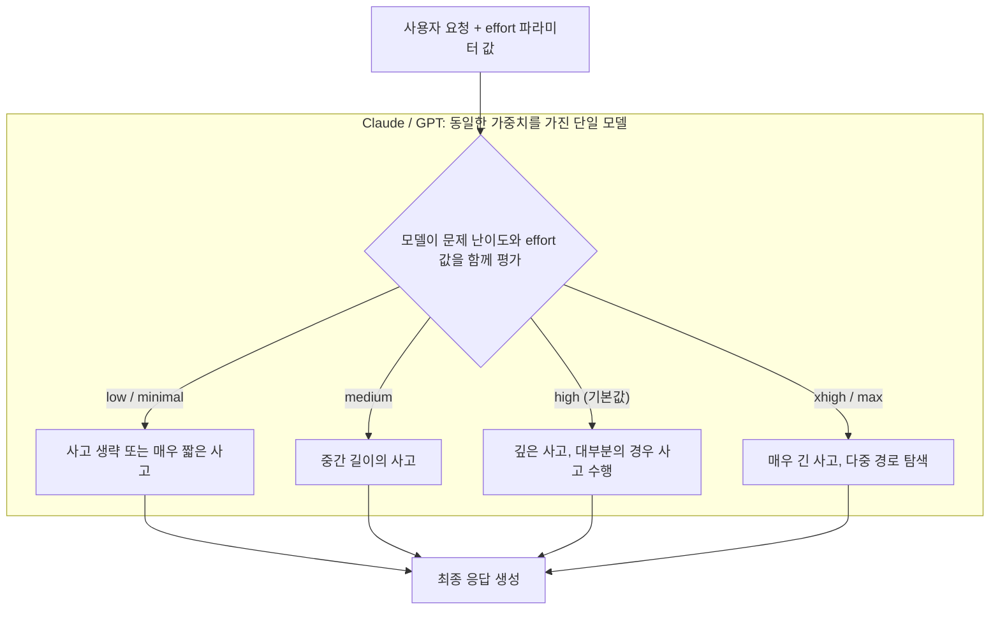
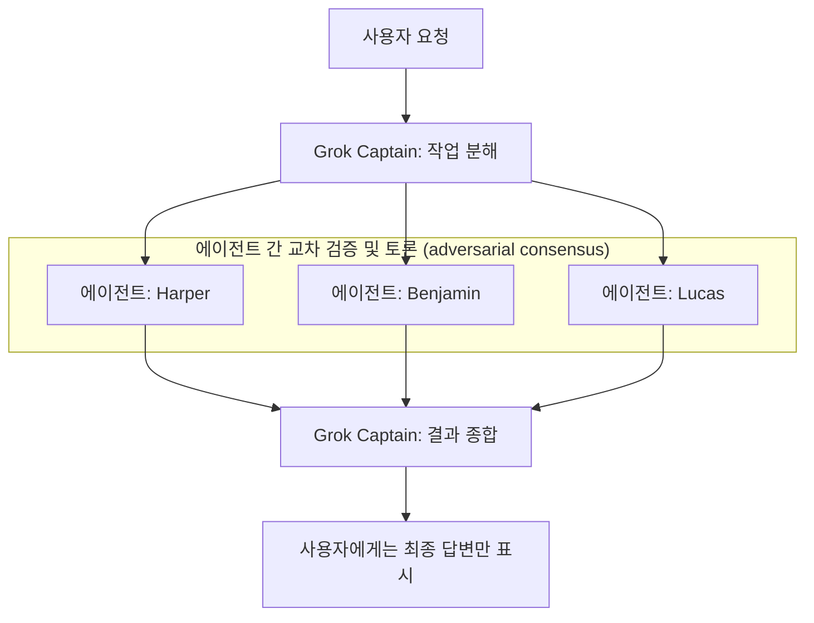
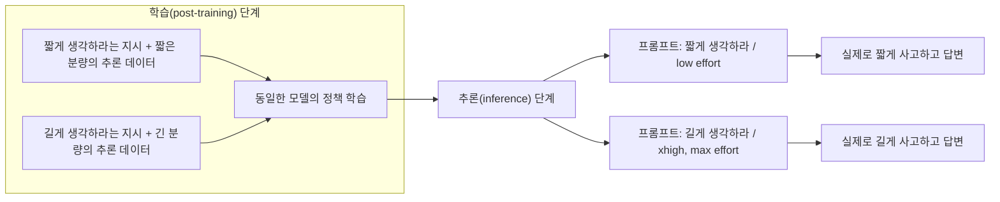

## 목차

1. 들어가며
2. 원본 스레드 대화 요약
3. 결론 먼저 — 세 가지 질문에 대한 답
4. Claude의 effort 파라미터: 공식 문서 기준 상세 설명
5. GPT의 reasoning.effort 파라미터: 공식 문서 기준 상세 설명
6. 질문 1의 답 — "시스템 프롬프트 몇 단어 차이"라는 설명은 맞는가
7. 질문 2의 답 — 그록처럼 "토론하는 모델"이 실제로 존재하는가
8. 질문 3의 답 — 인간은 안 되는데 왜 LLM은 "500단어로 생각해"가 통하는가
9. 별도 계층 — 매우 어려운 문제에서 쓰이는 하네스 수준의 best-of-N
10. 종합 비교표
11. 하네스 엔지니어링 관점에서의 시사점
12. 참고자료

---

## 1. 들어가며

> 
> https://www.threads.com/@osejin5629/post/Da7R-O1k6yr
> 
> 최근 클로드와 지피티의 모델을 쓰면서 가장 헷갈리는게 노력 (effort)부분이다.
> 
> 추론모드가 나왔던 대충 4o버전 때는 이해가 갔다.
> 
> 그런데 노력이 낮음부터 최대가 생기면서 무척 헷갈리게 됐다.
> 
> 모델이 동일한데 시스템프롬프트가 달라지는건지
> 
> 아니면 그록처럼 토론하는 모델이 생겨나는건지 작동 방식이 궁금하다.
> 
>> 
>> 인간에게는 생각을 저단계로해서 500단어정도로 생각하고 답변해. 
>> 
>> 고단계로해서 5000단어 정도 생각하고 답변하라는게 불가능하지만 언어모델은 잘하면 되나보군요.

이 문서는 Threads에서 오간 "노력(effort) 파라미터가 헷갈린다"는 대화를 계기로, Claude와 GPT의 effort/reasoning_effort 파라미터가 실제로 어떤 메커니즘으로 작동하는지, 그리고 Grok처럼 여러 에이전트가 토론하는 방식과는 어떻게 다른지를 각 회사의 공식 문서와 검증 가능한 자료를 근거로 정리한 것이다. 추측성 서술과 확인된 사실을 명확히 구분했고, 확인이 어려운 수치는 출처를 밝히고 "자체 발표" 혹은 "미검증"이라고 표시했다.

## 2. 원본 스레드 대화 요약

글쓴이는 Claude와 GPT를 쓰면서 가장 헷갈리는 부분이 "노력(effort)"이라는 개념이라고 말했다. 4o 시절 추론 모드가 처음 나왔을 때는 이해가 갔는데, 노력 단계가 낮음부터 최대까지 세분화되면서 오히려 헷갈리게 됐다는 것이다. 궁금한 점은 세 가지로 요약된다.

- 모델 가중치는 동일한데 시스템 프롬프트만 달라지는 방식인가
- 아니면 Grok처럼 여러 모델(에이전트)이 서로 토론하는 방식이 새로 생겨난 것인가
- 실제 작동 원리가 무엇인가

이에 대해 한 응답자가 자신이 1년 전 포스트트레이닝 팀에서 일했던 경험을 근거로 추측을 제시했다. 요지는 이렇다. 시스템 지시문(SI)에서 "think hard"와 "think extra hard"처럼 단어 몇 개만 바뀌는 것이며, 이 단어 차이에 따라 사고(thinking) 채널의 길이를 조절하도록 포스트트레이닝이 되어 있다는 것이다. 다만 IOI 메달 수준이나 매우 어려운 수학·과학 문제를 풀 때는 하네스 엔지니어링 접근을 쓰는 경우도 있다고 덧붙였다. 이는 N개의 답변을 만들어보고 그중 장점만 취합하는 방식이라고 설명했다.

이어진 대화에서 글쓴이는 "인간에게는 저단계로 500단어 정도 생각하고 답하라거나 고단계로 5000단어 정도 생각하고 답하라는 지시가 불가능한데, 언어모델은 그게 되는 것 같다"고 반문했고, 응답자는 이것이 순전히 어떤 데이터로 학습되었는지의 차이라고 답했다. 500단어로 생각하라는 지시와 함께 실제로 500단어 분량의 사고 과정으로 이루어진 데이터를 학습시키면, 이후 "500단어로 생각해"라는 문구를 봤을 때 모델이 그 정도 분량으로만 사고하게 된다는 설명이다.

이 답변은 개인의 경험에 기반한 추측이라는 점을 응답자 스스로 명시했다. 아래에서는 이 추측이 Anthropic과 OpenAI의 공식 문서, 그리고 학계 연구와 얼마나 일치하는지를 검증한다.

## 3. 결론 먼저 — 세 가지 질문에 대한 답

읽는 시간을 아끼고 싶은 경우를 위해 결론을 먼저 정리한다.

**질문 1 (시스템 프롬프트 차이인가)**: 대체로 맞다. Claude와 GPT의 effort 파라미터는 모델 가중치를 바꾸지 않는다. 동일한 모델에 "얼마나 사고할지"를 지시하는 신호를 추가로 주는 방식이며, 이 신호는 시스템 프롬프트에 문구를 넣는 것과 근본적으로 같은 층위에서 작동한다. 다만 실제 API 파라미터(`effort`, `reasoning.effort`)는 내부적으로 프롬프트 텍스트를 삽입하는 방식일 수도 있고, 별도의 제어 토큰이나 메타데이터로 처리될 수도 있어 정확한 구현 방식은 각 회사가 공개하지 않았다. "몇 단어 차이"라는 표현은 상당히 근접한 직관이지만, 사용자가 API의 `effort` 파라미터를 쓸 때는 프롬프트에 직접 문구를 넣는 것이 아니라 별도의 구조화된 파라미터를 넘기는 것이라는 차이가 있다.

**질문 2 (Grok처럼 토론하는 모델인가)**: 부분적으로 맞고 부분적으로 다르다. xAI의 Grok 4.20은 실제로 하나의 요청에 대해 여러 개의 에이전트 복제본이 병렬로 답을 만들고 서로의 결과를 교차 검증한 뒤 하나로 종합하는 구조를 채택했다. 이 경우 effort 수준(예: standard 모드는 4개 에이전트, heavy 모드는 16개 에이전트)이 실제로 참여하는 에이전트 수와 연결되어 있다는 보도가 있다. 반면 Claude와 GPT의 effort 파라미터는 이런 다중 에이전트 토론이 아니라, 단일 모델이 스스로 사고 분량을 조절하는 방식이다. 즉 "토론하는 모델"이라는 개념은 실재하지만, Claude·GPT의 effort와는 다른 회사의 다른 아키텍처에서 벌어지는 이야기다.

**질문 3 (인간은 안 되는데 LLM은 되는 이유)**: 응답자의 설명은 학계 연구 흐름과 일치한다. 인간은 "500단어만 생각하고 답하라"는 지시를 받아도 실제 사고 과정의 길이를 정밀하게 맞추기 어렵지만, 언어모델은 학습 단계에서 "목표 길이"와 "그 길이에 맞는 사고 데이터"를 짝지어 강화학습이나 지도학습으로 훈련시키면, 추론 시점에 그 목표 길이 지시를 받았을 때 실제로 그 분량에 맞춰 사고를 마치는 경향을 학습한다. 이는 "budget forcing", "length-controlled policy optimization(LCPO)" 같은 이름으로 학계에 보고된 기법들과 원리가 같다. 다만 실제 상용 모델(Claude, GPT)의 정확한 내부 훈련 방식은 공개되어 있지 않으므로, 이 설명은 "공개된 연구 기법과 일치하는 합리적 추정"이지 "확인된 사실"은 아니다.

---

## 4. Claude의 effort 파라미터: 공식 문서 기준 상세 설명

Anthropic의 공식 API 문서에 따르면 effort 파라미터는 Claude가 응답을 생성할 때 소비하는 토큰의 양을 조절하는 값이다. 응답의 충실도와 토큰 효율성 사이의 트레이드오프를 하나의 모델 안에서 조절할 수 있게 해준다. 별도의 베타 헤더 없이 지원되는 모델(Claude Fable 5, Claude Mythos 5, Claude Opus 4.8, Claude Opus 4.7, Claude Opus 4.6, Claude Sonnet 5, Claude Sonnet 4.6, Claude Opus 4.5)이라면 모두 이 파라미터를 쓸 수 있다.

### 4.1 effort는 사고(thinking)만이 아니라 전체 토큰에 영향을 준다

여기서 중요한 오해 하나를 짚어야 한다. effort는 단순히 "사고 시간"만 조절하는 게 아니라, 텍스트 응답과 설명, 도구 호출과 그 인자, 확장 사고(extended thinking) 전체를 아우르는 값이다. 이 때문에 effort를 낮추면 사고를 아예 생략할 뿐 아니라 도구 호출 횟수 자체가 줄어들고, 응답도 더 간결해진다. 반대로 effort가 높으면 도구 호출 전에 계획을 설명하거나 더 상세한 요약을 제공하는 경향이 생긴다. 이 설계의 장점은 두 가지다. 첫째, 확장 사고를 켜지 않아도 effort만으로 전체 토큰 지출을 조절할 수 있다는 점, 둘째, 도구 호출까지 포함한 전체 작업 흐름의 효율성을 하나의 값으로 통제할 수 있다는 점이다.

### 4.2 effort 단계와 각 단계의 의미

Anthropic 문서가 규정한 단계는 다음과 같다.

| 단계 | 설명 | 대표 용도 |
|---|---|---|
| `max` | 토큰 지출에 제약 없이 절대적으로 최고 성능을 추구 | 가장 깊은 추론과 철저한 분석이 필요한 작업 |
| `xhigh` | 장시간 작업을 위한 확장 능력 (Fable 5, Mythos 5, Opus 4.8, Opus 4.7, Sonnet 5에서 지원) | 30분 이상 이어지는 장기 에이전트·코딩 작업 |
| `high` (기본값) | 높은 능력. 파라미터를 생략한 것과 동일 | 복잡한 추론, 어려운 코딩 문제, 에이전트 작업 |
| `medium` | 균형 잡힌 접근, 중간 수준의 토큰 절약 | 속도·비용·성능의 균형이 필요한 에이전트 작업 |
| `low` | 가장 효율적, 상당한 토큰 절약과 약간의 성능 저하 | 서브에이전트처럼 속도와 저비용이 중요한 단순 작업 |

여기서 한 가지 확인된 사실이 흥미롭다. effort는 "엄격한 토큰 예산"이 아니라 "행동적 신호(behavioral signal)"라고 문서에 명시되어 있다. 즉 낮은 effort를 설정해도 문제가 충분히 어려우면 Claude는 여전히 사고를 하지만, 같은 문제에 대해 높은 effort일 때보다는 적게 사고한다. 이는 effort가 고정된 상한선이 아니라 "이 정도 선에서 마무리하라"는 방향성 지시에 가깝다는 뜻이다.

### 4.3 budget_tokens에서 effort로의 전환 — 역사적 맥락

Claude 3.7 Sonnet 시절 확장 사고 기능이 처음 나왔을 때는 `budget_tokens`라는 값으로 사고 토큰의 절대적 상한을 개발자가 직접 지정해야 했다. 그런데 Opus 4.6·Sonnet 4.6 세대부터 "적응형 사고(adaptive thinking)"가 도입되면서 이 방식이 바뀌기 시작했다. 적응형 사고에서는 Claude 스스로 요청의 복잡도를 평가해 사고 여부와 분량을 정하고, 개발자는 `budget_tokens` 같은 절대 수치 대신 `effort`라는 상대적 단계만 지정하면 된다. Opus 4.7과 Opus 4.8, Claude Sonnet 5부터는 수동 `budget_tokens` 지정 자체가 아예 지원되지 않고 400 오류로 거부되며, 적응형 사고와 effort 조합만 허용된다. Claude Fable 5와 Mythos 5는 적응형 사고가 항상 켜져 있어 끄는 것 자체가 불가능하다.

이 변화는 실무적으로 중요한 의미를 가진다. 과거에는 "이 문제는 8000토큰 정도 생각하게 하자"처럼 절대적인 토큰 수를 예측해서 설정해야 했지만, 이제는 "이 작업은 xhigh로 하자"처럼 상대적 방향만 주면 모델이 문제 난이도에 맞춰 스스로 분량을 조절한다. 다만 `max_tokens`는 여전히 사고와 응답을 합친 전체 출력의 하드 리밋으로 작동하므로, `xhigh`나 `max` effort를 쓸 때는 `max_tokens`를 충분히 크게 잡아야 한다는 점을 문서가 강조하고 있다.

### 4.4 사고 트리거링은 프롬프트로 튜닝 가능하다는 공식 언급

Anthropic 문서에는 적응형 사고의 트리거링 행동이 "프롬프트 가능(promptable)"하다는 대목이 명시적으로 있다. Claude가 너무 자주 혹은 너무 드물게 사고한다면 시스템 프롬프트에 안내 문구를 추가할 수 있다는 것이다. 사고를 억제하고 싶으면 지연시간이 늘어나므로 답이 명확히 좋아질 때만 사고를 쓰라는 취지의 문구를, 사고를 유도하고 싶으면 다단계 추론이 필요한 작업이니 신중히 생각한 뒤 답하라는 취지의 문구를 넣으라고 안내한다. 심지어 사용자 턴 단위로도 "신중히 생각한 뒤 답해줘"라는 문장을 덧붙이면 그 턴에서만 사고를 유도할 수 있고, 반대로 "고민하지 말고 바로 답해줘"라고 하면 그 턴의 사고를 억제할 수 있다고 안내되어 있다. 문서는 이런 문구 조정의 효과가 정확한 워딩에 민감할 수 있다고 덧붙인다.

이 대목이 원본 스레드의 "think hard vs think extra hard" 설명과 정확히 맞닿는 지점이다. 다만 Anthropic 문서가 말하는 것은 "사용자가 프롬프트에 넣을 수 있는 문구"이고, 실제 `effort` API 파라미터가 내부적으로 정확히 어떤 문자열이나 토큰으로 변환되어 모델에 전달되는지는 Anthropic이 공개하지 않았다. 즉 "몇 단어 차이"라는 설명은 겉으로 드러난 효과의 층위에서는 맞아떨어지지만, `effort` 파라미터 자체가 내부적으로 프롬프트 삽입 방식인지 아니면 별도의 학습된 제어 채널(예: 특수 토큰, 임베딩 조작)인지는 확인되지 않은 부분이다.

---

## 5. GPT의 reasoning.effort 파라미터: 공식 문서 기준 상세 설명

OpenAI API 문서에 따르면 `reasoning.effort`는 모델이 작업을 수행할 때 얼마나 사고할지를 안내하는 값이다. 지원되는 값은 모델에 따라 다르며 `none`, `minimal`, `low`, `medium`, `high`, `xhigh`를 포함한다. 낮은 effort는 속도와 낮은 토큰 사용을 우선하고, 높은 effort에서는 모델이 더 완전하게 사고해 품질 높은 응답을 만든다. 모델은 effort 단계 내에서도 적응적으로 동작해, 쉬운 작업에는 적은 토큰을 쓰고 어려운 작업에는 더 열심히 사고한다고 문서는 설명한다.

### 5.1 역사적 흐름 — o1부터 GPT-5.6까지

원본 스레드에서 글쓴이는 "4o 시절 추론 모드가 나왔을 때는 이해가 갔다"고 회고했는데, 이 부분은 약간의 시점 혼동이 있을 수 있어 정리가 필요하다. GPT-4o 자체는 추론 모델이 아니라 일반 멀티모달 모델이고, OpenAI의 추론 모델 계열은 2024년 9월 공개된 o1에서 시작되었다. 초기 o1은 사고 분량을 사용자가 세분화해서 조절하는 파라미터가 없었고, 2025년 1월 말 공개된 o3-mini에서 처음으로 `low`, `medium`, `high` 세 단계의 `reasoning_effort` 파라미터가 도입되었다. 이후 세대를 거치며 `minimal`, `none`, `xhigh`, `max` 등의 단계가 순차적으로 추가되었고, 커뮤니티 논의에 따르면 GPT-5.1 Codex Max 이후 모델부터 `xhigh`가 지원되기 시작했다.

가장 최근 세대인 GPT-5.6은 `reasoning.effort` 외에 `reasoning.mode`라는 별도의 축을 추가했다. 모드는 `standard`와 `pro` 두 가지이며, `pro` 모드는 지연시간과 토큰 사용을 더 감수하는 대신 모델이 더 많은 내부 작업을 거쳐 더 신뢰도 높은 단일 답변을 반환하도록 만든다. 문서는 reasoning mode와 reasoning effort가 서로 독립적인 축이라고 명시한다. 모드가 standard냐 pro냐를 정하고, 그 안에서 effort가 얼마나 사고할지를 정하는 구조다. effort를 생략하면 GPT-5.6은 두 모드 모두에서 `medium`을 기본값으로 쓴다.

### 5.2 최신 모델 가이드가 권고하는 사용법

OpenAI의 모델 가이드 문서는 실무적으로 이렇게 권고한다. 지연시간에 민감한 작업에는 `low`를, 균형 잡힌 기본값으로는 `medium`을 쓰고, 측정 가능한 품질 향상이 있을 때만 `high`나 `xhigh`로 올리라는 것이다. `max`는 품질이 무엇보다 중요한 가장 어려운 작업에만 예비로 남겨두라고 안내한다. 과거 GPT-5.5나 5.4에서 쓰던 effort 설정을 그대로 가져오되, 한 단계 낮춰서도 성능이 유지되는지 비교해보라는 마이그레이션 조언도 포함되어 있다.

흥미로운 점은 커뮤니티에서 수집된 실무 팁이다. 한 개발 가이드는 "높은 effort가 항상 기본값이어야 한다는 생각은 틀렸다"고 지적하며, 오히려 완료 규칙이나 검증 루프, 도구 지속성 규칙을 먼저 개선하는 편이 effort를 무작정 올리는 것보다 효과적이라고 조언한다. 이는 곧 이어질 하네스 엔지니어링 논의와 맞닿아 있다.

### 5.3 GPT reasoning_effort의 학술적 검증 사례

몇몇 arXiv 논문이 실제로 reasoning_effort 단계에 따른 성능 차이를 측정했다. 방사선학 벤치마크(RadLE) 연구에서는 GPT-5의 저·중·고 effort 사이의 정확도 차이가 매우 작았던 반면(25%, 25%, 26%), 응답 지연시간은 저효율에서 고효율로 갈수록 6배 이상 늘어난 것으로 보고되었다. 이는 effort를 무작정 높이는 것이 항상 품질 향상으로 이어지지는 않으며, 작업 종류에 따라 효과가 크게 다르다는 점을 보여주는 사례다. 반대로 시각적 심상 관련 연구에서는 effort가 낮을수록(`minimal`) 성능이 뚜렷하게 떨어지는 결과도 보고되어, 과제 유형에 따라 effort의 영향력이 상당히 갈린다는 점을 알 수 있다.

---

## 6. 질문 1의 답 — "시스템 프롬프트 몇 단어 차이"라는 설명은 맞는가

정리하면, 이 설명은 상당 부분 정확하다. 세 가지 근거를 들 수 있다.

첫째, Claude와 GPT 모두 effort 파라미터가 달라져도 모델 가중치 자체는 바뀌지 않는다. 같은 `claude-opus-4-8`, 같은 `gpt-5.6` 안에서 effort 값만 다르게 주는 것이며, 이는 별도로 훈련된 "저효율 모델"과 "고효율 모델"을 나눠 서빙하는 방식이 아니다.

둘째, Anthropic 문서는 실제로 시스템 프롬프트나 사용자 메시지에 특정 문구("신중히 생각한 뒤 답해줘" 등)를 넣는 것이 effort 조정과 유사한 효과를 낸다고 공식적으로 설명한다. 즉 "표면적인 작동 방식"의 관점에서는 스레드의 설명이 맞다.

셋째, 다만 실제 `effort` API 파라미터가 내부적으로 정확히 프롬프트 문자열 삽입으로 구현되어 있는지, 아니면 학습 단계에서부터 별도의 조건부 신호(conditioning signal)로 취급되어 온 것인지는 두 회사 모두 세부 구현을 공개하지 않았다. 학계에서 보고된 유사 기법들(아래 8장 참고)을 보면, 많은 경우 "목표 길이를 명시한 프롬프트 문구"와 "그에 맞는 학습 데이터"를 짝지어 학습시키는 방식을 쓰는데, 이는 결국 프롬프트 조작과 개념적으로 동일한 층위에 있다. 따라서 "시스템 프롬프트 몇 단어 차이"라는 설명은 정확한 구현 세부사항이라기보다, 작동 원리를 이해하기 위한 합리적이고 상당히 근접한 비유로 보는 것이 맞다.

---

## 7. 질문 2의 답 — 그록처럼 "토론하는 모델"이 실제로 존재하는가

이 질문에 대한 답은 "그렇다, 다만 Claude·GPT와는 다른 회사, 다른 아키텍처의 이야기"라는 것이다.

### 7.1 Grok 4.20의 멀티 에이전트 구조

2026년 2월 xAI가 공개한 Grok 4.20은 단일 모델의 사고 분량을 조절하는 방식이 아니라, 하나의 요청에 대해 여러 개의 특화된 에이전트가 동시에 답을 만들고 서로를 검증하는 구조를 채택했다고 여러 매체가 보도했다. 보도에 따르면 이 구조는 Grok(코디네이터), Harper, Benjamin, Lucas라는 네 개의 역할로 구성되며, 실제로는 약 3조 파라미터 규모의 동일한 MoE(전문가 혼합) 모델의 서로 다른 복제본이 서로 다른 시스템 프롬프트와 목표를 부여받아 동시에 실행되는 방식이라고 설명된다. 코디네이터 역할의 Grok이 질문을 하위 작업으로 분해해 각 에이전트에게 배분하고, 각 에이전트가 병렬로 분석한 뒤, 서로의 결론에 모순이나 허점이 없는지 교차 검증하는 "토론(debate)" 단계를 거쳐, 마지막으로 코디네이터가 이 결과들을 종합해 하나의 최종 답변으로 사용자에게 전달한다.

xAI는 이 내부 토론 메커니즘을 "적대적 합의(adversarial consensus)"라고 부르며, 이 구조 덕분에 환각(hallucination) 비율이 단일 모델 기준 약 12%에서 4.2% 수준으로, 약 65% 낮아졌다고 자체 발표했다. 다만 이 수치는 xAI 자체 발표이며, 독립 벤치마크 기관인 Artificial Analysis의 Omniscience 벤치마크는 Grok 4.20의 비환각률을 78% 수준으로 측정해 xAI가 자체 주장한 83%와는 차이가 있다는 점도 함께 보도되었다. 따라서 정확한 개선 폭은 제3자 검증이 더 필요한 미확인 영역으로 남아 있다.

### 7.2 effort와 에이전트 수의 연결

일부 개발자 가이드에 따르면 Grok의 API에서 `reasoning.effort`를 `low`나 `medium`으로 설정하면 4개 에이전트로 구성된 "standard 모드"가, `high`나 `xhigh`로 설정하면 16개 에이전트까지 확장되는 "heavy 모드"가 작동한다고 설명된다. 이는 xAI SDK에서 `agent_count`라는 파라미터로 직접 제어할 수도 있다고 한다. 이 부분은 Claude나 GPT의 effort 개념과 이름은 같지만 실제로 가리키는 대상이 다르다는 점을 명확히 보여준다. Claude·GPT에서 effort는 "한 모델이 얼마나 오래 생각하는가"를 조절하지만, Grok의 heavy 모드에서 effort는 "몇 개의 모델 복제본이 토론에 참여하는가"를 조절하는 셈이다.

### 7.3 Claude·GPT 방식과 Grok 방식의 근본적 차이

아래 다이어그램은 두 아키텍처의 차이를 보여준다.

두 구조의 차이를 한 문장으로 요약하면, Claude·GPT의 effort는 "한 사람이 얼마나 오래 고민하는가"를 조절하는 것이고, Grok의 heavy 모드는 "몇 명이 모여서 토론한 뒤 결론을 내는가"를 조절하는 것이다. 참고로 이런 다중 에이전트 토론(Multi-Agent Debate) 방식 자체는 Grok이 처음 고안한 개념이 아니라, LLM 앙상블 연구 분야에서 이미 여러 라운드에 걸쳐 에이전트들이 서로의 답을 반박·보완하며 정확도를 높이는 기법으로 학계에 보고되어 온 접근이다. Grok 4.20의 기여는 이를 사용자가 별도로 구성하지 않아도 되는 프로덕션 기본 아키텍처로 내재화했다는 점에 있다.

---

## 8. 질문 3의 답 — 인간은 안 되는데 왜 LLM은 "500단어로 생각해"가 통하는가

이 질문에 대한 응답자의 설명(어떤 데이터로 학습되었는지의 차이일 뿐이라는 설명)은 공개된 학술 연구 흐름과 상당히 일치한다.

### 8.1 budget forcing — 가장 단순한 형태의 길이 제어

2025년 초 발표된 s1 논문은 "budget forcing"이라는 단순한 기법을 제시했다. 이 방법은 모델이 사고를 너무 일찍 끝내려 하면 사고 종료 토큰 생성을 억제하고 "Wait" 같은 단어를 강제로 이어 붙여 사고를 계속하게 만들고, 반대로 사고가 정해진 한도를 넘으면 강제로 사고 종료 토큰을 삽입해 답변으로 넘어가게 만드는 방식이다. 이 논문은 단 1,000개의 잘 선별된 추론 데이터만으로도 이런 길이 제어가 가능한 추론 모델을 만들 수 있음을 보였다. 다만 후속 연구들은 budget forcing이 총 응답 길이를 정밀하게 통제하지는 못한다는 한계도 함께 보고했다. 사고 트레이스를 짧게 강제해도 최종 답변이 오히려 길어지는 경우가 관찰되었기 때문이다.

### 8.2 프롬프트에 목표 길이를 명시하고 그에 맞춰 보상하는 방식

이보다 발전된 접근으로 LCPO(Length-Controlled Policy Optimization) 같은 기법이 있다. 이 방식은 프롬프트 안에 "n토큰으로 생각하라"는 목표 길이 지시를 직접 포함시키고, 강화학습 보상 함수를 설계할 때 그 목표 길이를 지키는지 여부에 따라 페널티를 주는 방식이다. 이렇게 훈련된 모델은 실제로 추론 시점에 "n토큰으로 생각해"라는 지시를 받으면 그 분량에 맞춰 사고를 조절하는 능력을 학습하게 된다. 이는 원본 스레드에서 "500단어로 생각하라는 지시와 그 분량의 데이터를 학습시키면, 그 문구를 봤을 때 그 정도로만 사고하게 된다"고 설명한 내용과 원리적으로 정확히 일치한다.

이 밖에도 난이도에 따라 사고 길이를 스스로 조절하도록 훈련하는 DAST(Difficulty-Adaptive Slow-Thinking), 훈련 진행에 따라 토큰 예산을 점점 줄여가며 압박하는 동적 토큰 예산 기법 등 다양한 변형이 학계에 보고되어 있다. 공통점은 하나다. "목표 분량"이라는 조건을 학습 데이터나 보상 신호에 명시적으로 포함시키면, 모델이 추론 시점에 그 조건을 지키는 방향으로 행동을 조절하게 된다는 것이다.

### 8.3 인간과 LLM이 다른 이유에 대한 합리적 해석

인간이 "500단어만 생각하고 답하라"는 지시를 받아도 실제 사고 분량을 정밀하게 맞추기 어려운 이유는, 인간의 사고 과정 자체가 명시적인 언어 형태로 통제 가능한 대상이 아니기 때문이다. 우리는 "이 정도 분량으로 생각해야지"라고 다짐할 수는 있어도, 실제 신경계의 사고 과정이 그 다짐에 정확히 맞춰 길이가 조절되지는 않는다. 반면 언어모델의 "사고"는 그 자체가 텍스트 생성이라는 관측 가능하고 훈련 가능한 대상이다. 학습 단계에서 "이 길이의 지시 문구에는 이 길이의 사고 데이터"라는 짝을 대량으로 노출시키면, 모델은 통계적 패턴으로 그 대응 관계를 학습한다. 즉 인간에게는 불가능한 것이 LLM에는 가능한 이유는, LLM의 사고 과정 자체가 지도학습이나 강화학습의 직접적인 대상이 될 수 있는 텍스트라는 점 때문이다.

다만 다시 한번 강조할 부분은, 이는 공개된 연구 기법들과의 정합성에 기반한 합리적 추정이라는 것이다. Anthropic이나 OpenAI가 자사의 effort 파라미터를 정확히 이런 방식으로 구현했다고 공식적으로 밝힌 적은 없다. Anthropic 문서가 확인해주는 것은 "프롬프트 문구로 사고 트리거링을 조정할 수 있다"는 사실과 "effort가 사고를 포함한 전체 토큰 지출에 영향을 준다"는 사실까지이며, 그 내부 구현이 budget forcing인지 LCPO 계열인지 또 다른 독자적 기법인지는 비공개 영역이다.

---

## 9. 별도 계층 — 매우 어려운 문제에서 쓰이는 하네스 수준의 best-of-N

원본 스레드의 응답자는 IOI 메달권이나 매우 어려운 수학·과학 문제는 effort 파라미터 조정만으로 풀리는 것이 아니라 하네스 엔지니어링, 구체적으로는 N개의 답을 만들어보고 그중 장점만 취합하는 방식으로 접근한다고 언급했다. 이 부분도 실제 사례로 뒷받침된다.

2025년 IMO(국제수학올림피아드)에서 여러 연구팀이 시도한 방법론을 보면 이 구분이 명확히 드러난다. 모델에 구애받지 않는 한 검증·정제 파이프라인 연구는 Gemini 2.5 Pro, Grok-4, GPT-5라는 세 개의 서로 다른 최상위 모델에 각각 이 파이프라인을 적용했을 때 6문제 중 5문제(약 85.7%)를 정확히 풀어냈다고 보고했다. 이는 32개의 후보 답안 중 가장 나은 것 하나를 고르는 단순 최선 선택(best-of-32) 방식으로 얻은 기준 정확도(Gemini 31.6%, Grok-4 21.4%, GPT-5 38.1%)와 비교하면 상당한 차이다. 이 연구는 결론에서, 더 강력한 기반 모델을 만드는 것 못지않게 그 모델의 잠재력을 최대한 끌어내는 방법론을 설계하는 것이 중요하다고 강조했다.

한편 OpenAI는 2025년 7월 자사의 실험적 모델이 공식 IMO 규정(이틀에 걸친 4.5시간씩의 시험, 인터넷과 계산기 사용 불가)을 그대로 지키며 6문제 중 5문제를 완전히 풀어 금메달 수준의 점수(35/42)를 받았다고 발표했다. 이 발표에서는 문제당 하나의 최종 답만 제출했다고 설명되어 있어, 반드시 대규모 best-of-N 선택을 사용한 것은 아니라는 점도 함께 알려져 있다. 반면 구글 딥마인드는 2025년 Gemini Deep Think를 활용해 같은 기준으로 금메달 수준을 달성했다고 발표했는데, 전년도인 2024년에는 AlphaProof와 AlphaGeometry 2라는 두 개의 특화 시스템을 결합해 은메달 수준(28점)에 그쳤던 것과 비교된다.

이 사례들이 공통적으로 보여주는 것은, effort 파라미터가 "같은 모델이 얼마나 사고하는가"를 조절하는 것과 달리, best-of-N이나 검증·정제 파이프라인은 "같은 모델(또는 여러 모델)을 여러 번 돌려서 나온 결과들을 비교·검증·종합하는 상위 계층의 오케스트레이션"이라는 점이다. 이는 원본 스레드 응답자가 말한 "하네스 엔지니어링"이라는 표현과 정확히 부합한다. 즉 effort는 모델 자체에 내장된 조절 손잡이이고, best-of-N이나 검증 파이프라인은 모델 바깥에서 여러 번의 호출을 조율하는 별도의 시스템 계층이라는 차이가 있다.

---

## 10. 종합 비교표

| 구분 | Claude (effort) | GPT (reasoning.effort) | Grok 4.20 (heavy 모드) | 하네스 수준 best-of-N |
|---|---|---|---|---|
| 조절 대상 | 단일 모델의 사고·응답·도구 호출 전체 토큰 | 단일 모델의 사고(reasoning) 토큰 | 참여하는 에이전트 복제본의 수 | 동일 모델을 여러 번 호출해 나온 결과의 집합 |
| 모델 가중치 변화 여부 | 없음, 동일 가중치 | 없음, 동일 가중치 | 없음, 동일 백본의 서로 다른 시스템 프롬프트 | 없음, 동일 모델을 반복 호출 |
| 단계 구성 | low, medium, high(기본), xhigh, max | none/minimal, low, medium(기본), high, xhigh, max | standard(4 에이전트), heavy(16 에이전트) | 파이프라인 설계에 따라 다름(예: N=32 등) |
| 구조적 특징 | 적응형 사고 + 행동적 신호 | 적응형 사고 + standard/pro 모드 축 분리 | 병렬 생성 후 교차 검증(토론) 후 종합 | 다수 생성 후 검증·정제·선택 |
| 대표 근거 | Anthropic 공식 문서(2026) | OpenAI 공식 문서(2026) | xAI 발표 및 제3자 보도(일부 미검증) | IMO 2025 관련 논문 및 각사 발표 |

---

## 11. 하네스 엔지니어링 관점에서의 시사점

이 주제는 결국 "모델 성능은 모델 자체만이 아니라 그 모델을 감싸는 시스템 설계에 크게 좌우된다"는 원칙과 맞닿아 있다. effort 파라미터는 모델 내부에 학습을 통해 심어진 조절 손잡이이므로 API 호출 한 번으로 즉시 접근할 수 있는 가장 저렴한 형태의 제어다. 반면 Grok의 멀티 에이전트 토론이나 IMO 금메달급 파이프라인의 검증·정제 구조는 모델 바깥에서 여러 번의 호출과 판정 로직을 조율하는 오케스트레이션 계층이며, 설계와 운영 비용이 훨씬 크다.

실무적으로 중요한 시사점은, 이 두 계층이 서로 대체재가 아니라는 점이다. effort를 아무리 올려도 단일 모델의 단일 시도로는 풀리지 않는 문제가 있고, 이런 문제에는 다중 시도와 교차 검증이라는 별도의 하네스 계층이 필요하다. 반대로 이미 충분히 쉬운 작업에 무리하게 다중 에이전트 토론이나 best-of-N을 적용하면 지연시간과 비용만 늘어날 뿐 성능 향상은 미미하다는 점도 여러 연구에서 반복적으로 확인된다. OpenAI의 실무 가이드가 "effort를 무작정 올리기 전에 완료 규칙과 검증 루프부터 개선하라"고 조언하는 것도 같은 맥락이다. 결국 effort 파라미터의 선택은 저비용 손잡이 조정의 영역이고, 다중 에이전트나 best-of-N 파이프라인 설계는 고비용 하네스 엔지니어링의 영역이라는 층위 구분이, 이번 스레드의 혼란을 정리하는 핵심 축이라고 할 수 있다.

---

## 12. 참고자료

- Anthropic, "Effort", Claude Platform Docs, https://platform.claude.com/docs/en/build-with-claude/effort
- Anthropic, "Adaptive thinking", Claude Platform Docs, https://platform.claude.com/docs/en/build-with-claude/adaptive-thinking
- OpenAI, "Reasoning models", OpenAI API 문서, https://developers.openai.com/api/docs/guides/reasoning
- OpenAI, "Model guidance", OpenAI API 문서, https://developers.openai.com/api/docs/guides/latest-model
- OpenAI, "OpenAI o3-mini", https://openai.com/index/openai-o3-mini/
- Microsoft Learn, "Azure OpenAI reasoning models", https://learn.microsoft.com/en-us/azure/foundry/openai/how-to/reasoning
- NextBigFuture, "How the xAI Grok 4.20 Agents Work", https://www.nextbigfuture.com/2026/02/how-the-xai-grok-4-20-agents-work.html (2026-02-17)
- Vikas Sah, "Inside Grok 4.20: How Four Agents on One Backbone Beat Separate Models", Medium, https://engineeratheart.medium.com/inside-grok-4-20-how-four-agents-on-one-backbone-beat-separate-models-acefa425cb52 (2026-04-02)
- Verdent, "Grok 4.20 Multi-Agent System: How the 4 Agents Work", https://www.verdent.ai/guides/grok-4-20-multi-agent-system (2026-04-23)
- Tesorb, "Grok 4.20 Multi-Agent Explained", https://tesorb.com/grok-420-multi-agent-architecture-explained/ (2026-04-25)
- Natural20, "Grok 4.20: xAI's 4-Agent AI System Goes Live", https://natural20.com/coverage/grok-420-xai-four-agents-system-benchmarks-jailbreak (2026-02-18)
- Muennighoff et al., "s1: Simple test-time scaling" 관련 요약, https://x.com/rohanpaul_ai/status/1887302922230464708 (2025-02-06)
- arXiv, "A Survey of Efficient Reasoning for Large Reasoning Models", https://arxiv.org/pdf/2503.21614
- arXiv, "Making Small Language Models Efficient Reasoners", https://arxiv.org/pdf/2505.07961
- arXiv, "Winning Gold at IMO 2025 with a Model-Agnostic Verification-and-Refinement Pipeline", https://arxiv.org/abs/2507.15855
- OpenAI, "OpenAI's IMO Gold" 관련 분석, https://www.rohan-paul.com/p/openais-imo-gold-defining-moment (2025-07-20)
- Google DeepMind, "Advanced version of Gemini with Deep Think officially achieves gold-medal standard at the IMO", https://deepmind.google/blog/advanced-version-of-gemini-with-deep-think-officially-achieves-gold-medal-standard-at-the-international-mathematical-olympiad/ (2025-07-21)
- MathArena, "IMO Blogpost", https://matharena.ai/imo/
- RadLE 벤치마크 논문, https://arxiv.org/pdf/2509.25559
- "Artificial Phantasia" 논문, https://arxiv.org/pdf/2509.23108

---

작성일자: 2026-07-18
