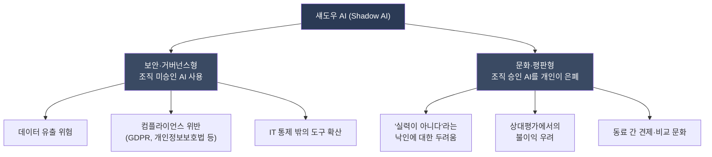
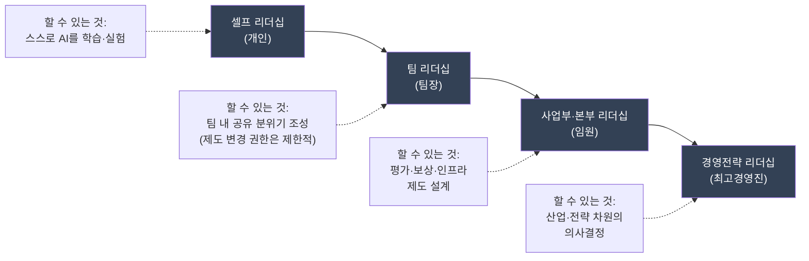
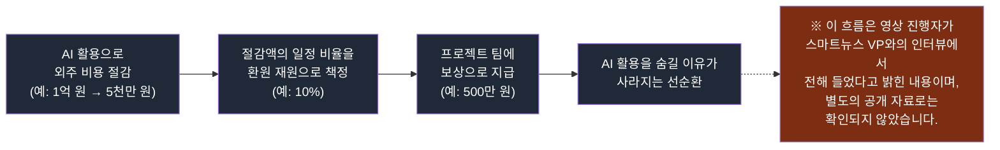

- 원 콘텐츠: 유튜브 채널 「퇴근길 AI」, ["AI 쓰라면서 왜 경영진도 숨길까? : 섀도우 AI(Shadow AI)"](https://www.youtube.com/watch?v=6w0bX3W4oJ0) (2026년 4월 24일 공개)
- 이 문서는 위 영상의 서사를 뼈대로 삼되, 영상 속 통계와 주장을 공개된 자료로 직접 대조·검증하고, 국내외 최신 데이터를 보강해 재구성한 해설 자료입니다. 검증되지 않았거나 진행자 개인의 해석에 해당하는 부분은 본문과 부록의 팩트체크 노트에서 명확히 구분해 표시했습니다.

---

## 1. 어느 HR 리더의 고백에서 시작된 이야기

영상은 한 장면에서 출발합니다. 어느 기업의 HR 리더가 씁쓸한 표정으로 "저희 회사에는 알트탭 문화가 있어요"라고 털어놓습니다. 무슨 뜻이냐고 물으니, 직원들이 AI를 쓰다가 옆자리에 누가 지나가면 재빠르게 창을 바꿔버린다는 것이었습니다.

이 장면이 흥미로운 이유는 단순합니다. 요즘 회사들은 공식적으로는 AI 사용을 적극 권장합니다. 전사 메일을 보내고, 라이선스를 구매해 나눠주고, 사내 교육을 열고, AX(AI Transformation) 과제까지 부여합니다. 그런데 정작 그 도구를 실제로 쓰고 있는 사람들은 그 사실을 드러내고 싶어 하지 않습니다. 자신의 결과물이 AI의 도움을 받았다는 사실이 알려지면, 마치 "실력이 아니라 남의 손을 빌린 것"처럼 보일까 봐 걱정하기 때문입니다. 특히 상대평가가 엄격한 조직일수록 이런 불안은 더 커집니다. "쟤는 AI로 한 거잖아"라는 한마디가 실제로 그 사람의 평가를 깎아내릴 수 있는 무기가 되기 때문입니다.

## 2. '알트+탭'이 상징하는 것 — 두려움의 정체

여기서 짚어야 할 것은, 이 행동이 단순한 게으름이나 부정행위의 문제가 아니라는 점입니다. 오히려 정반대에 가깝습니다. AI를 활용해 더 빠르고 효율적으로 일한 사람이, 그 성과를 숨기기 위해 오히려 일부러 천천히 일하는 척을 하는 역설적인 상황이 벌어집니다. 이는 "능력이 뛰어나서 생긴 여유 시간을 드러내면 오히려 손해를 본다"는 조직 내 암묵적 신호가 존재하기 때문입니다.

이런 정서는 한국만의 특수한 현상이 아닙니다. 해외에서도 이미 비슷한 흐름이 관찰되고 논의되고 있으며, 여기에는 '섀도우 AI(Shadow AI)'라는 이름이 붙어 있습니다.

## 3. 섀도우 AI란 무엇인가: 보안 용어에서 문화 현상으로

섀도우 AI라는 용어는 원래 정보보안 분야에서 시작되었습니다. IBM의 정의에 따르면 섀도우 AI는 IT 부서의 공식 승인이나 관리·감독 없이 임직원이나 사용자가 AI 도구나 애플리케이션을 사용하는 행위를 가리킵니다. 예를 들어 직원이 회사가 허락하지 않은 챗GPT 같은 생성형 AI 도구를 텍스트 편집이나 데이터 분석 같은 업무에 몰래 활용하는 경우가 대표적입니다. 이는 과거 '섀도우 IT'—회사 몰래 개인 드롭박스나 개인 메모 앱을 업무에 쓰던 관행—의 AI 버전이라고 볼 수 있습니다. 다만 섀도우 AI는 단순히 승인되지 않은 소프트웨어를 쓰는 것을 넘어, 입력된 데이터가 외부 모델의 학습에 활용될 수 있다는 점에서 데이터 유출과 컴플라이언스 측면의 위험이 한층 더 큽니다.

그런데 최근 이 용어의 의미가 조금 더 넓어지고 있습니다. 처음에는 "회사가 승인하지 않은 AI를 쓰는 것"만을 가리켰다면, 이제는 "회사가 이미 승인했음에도 개인이 그 사용 사실을 드러내지 않는 행위"까지 포함하는 방향으로 쓰임새가 확장되고 있는 것입니다. 즉 지금의 섀도우 AI는 크게 두 가지 얼굴을 갖습니다.

- **보안·거버넌스형**: 조직이 승인하지 않은 AI 도구를 직원이 임의로 사용하는 경우. 데이터 유출, 컴플라이언스 위반, IT 통제 밖의 위험이 핵심 쟁점입니다.
- **문화·평판형**: 조직이 이미 승인한 AI 도구인데도, 개인이 그 사용 사실을 동료나 상사에게 숨기는 경우. 평판 훼손에 대한 불안, 상대평가에서의 불이익 우려가 핵심 쟁점입니다.

두 얼굴 모두 2025년경부터 기업 리스크 논의에서 '떠오르는 위험(emerging risk)'으로 함께 묶여 다뤄지는 경향이 있습니다. 다만 한국의 최근 담론에서 유독 크게 부각되고 있는 쪽은 두 번째, 즉 문화·평판형 섀도우 AI라는 것이 영상의 핵심 관찰입니다.

## 4. 숫자로 보는 섀도우 AI: 해외의 데이터

해외에서는 이미 여러 기관이 이 현상을 정량적으로 조사하고 있습니다. 다만 조사 기관과 표본, 질문 방식이 저마다 달라 수치에 편차가 있으므로, 아래 표에서 출처를 구분해 정리했습니다.

| 조사/보고서 | 핵심 수치 | 시점 |
|---|---|---|
| 사이버뉴스(Cybernews) 설문 (미국 직장인 1,000명 이상) | 전체 응답자의 59%가 미승인 AI 도구 사용, 그중 경영진·시니어 매니저는 93%가 섀도우 AI 사용 | 2025년 하반기 보도 |
| 글로벌 조사(비즈니스 인사이더 보도 인용) | 직장인의 57%가 AI 사용 사실을 고용주에게 숨긴다고 응답 | 2025~2026년 반복 인용 |
| Okta 커미션 조사(국가별 비교) | 미국 67%, 호주 60%, 영국 55%, 캐나다 약 50%, 프랑스·독일 약 30%가 미승인 AI 도구 사용 | 2026년 5월 |
| TrustedTech 'Shadow AI in the Workplace' | 의사결정권자 65%가 섀도우 AI 사용, 일반 직원은 31% | 2026년 5월 |
| PagerDuty 2026 Shadow AI Survey (오피스 전문직 1,250명) | 39%가 "AI 사용 사실을 밝히기보다 조용히 쓰겠다"고 응답, 연매출 10억 달러 이상 대기업에서는 이 비율이 47%로 상승 | 2026년 6월 |
| BlackFog 조사 (2,000명, 500인 이상 기업) | 임원·C레벨의 69%, 임원급 바로 아래 디렉터의 66%가 직원의 미승인 AI 사용을 알면서도 눈감아 준다고 응답 | 2026년 1월 |

여러 조사에서 공통적으로 반복되는 패턴이 하나 있습니다. **직급이 높을수록 섀도우 AI 사용률도 함께 높아진다**는 것입니다. 일반 직원보다 임원과 시니어 매니저가 미승인·비공개 AI 사용에 더 적극적이라는 결과가 사이버뉴스, TrustedTech, BlackFog 등 서로 다른 조사에서 공통적으로 확인됩니다. 정책과 가이드라인을 만드는 사람들이 정작 그 가이드라인을 가장 적극적으로 우회하고 있는 셈입니다.

이 현상을 가리키는 표현 중 하나가 '5PM 고스트(5PM Ghost)'입니다. AI 덕분에 업무를 실제보다 훨씬 빨리 끝냈지만, 그 사실이 알려지면 상사의 기대치와 업무량이 더 높아질 것을 우려해 일부러 퇴근 시간까지 일하는 척 시간을 늘리며 성과를 숨기는 행동을 뜻합니다. 이런 은폐 행위 전반을 'Quiet AI-ing'이라고 부르기도 합니다.

## 5. 한국의 역설: 가장 많이 쓰지만, 가장 조용히 쓰는 나라

그렇다면 한국은 어떨까요. 이 질문에 답할 수 있는 가장 신뢰도 높은 공식 자료는 한국은행이 2025년 8월 발표한 'AI의 빠른 확산과 생산성 효과' 보고서(BOK 이슈노트)입니다. 이 보고서는 가계 조사를 바탕으로 국내 근로자의 생성형 AI 활용 실태를 분석했습니다.

핵심 수치는 다음과 같습니다.

- 생성형 AI를 한 번이라도 활용해 본 한국 근로자의 비중은 **63.5%**
- 업무 목적으로 한정해도 활용률은 **51.8%** 로, 이는 미국의 업무 활용률(26.5%)의 약 2배 수준
- 생성형 AI의 확산 속도는 과거 인터넷이 상용화 3년 후 도달했던 활용률(7.8%)에 비해 약 8배 빠름
- AI 사용자는 주당 평균 5~7시간을 생성형 AI에 사용(미국은 주당 0.5~2.2시간)
- 하루 1시간 이상 쓰는 '헤비 유저' 비중이 한국은 **78.6%** 인 반면 미국은 **31.8%**
- 생성형 AI 활용으로 근로자의 업무시간이 평균 3.8%(주 40시간 근무 기준 약 1.5시간) 단축되었고, 이로 인한 잠재적 생산성 향상 효과는 약 1.0%로 추정

즉 활용의 '양' 측면에서는 한국이 명백히 세계 최상위권입니다. 국내 다른 민간 조사들도 비슷한 방향을 가리킵니다. 예컨대 2026년 초 발표된 한 보고서는 한국 직장인의 AI 활용률을 61.5%로 집계하며 동아시아 1위, 미국의 약 2배 수준이라고 밝혔고, 나우앤서베이가 2026년 5월 실시한 'AI 시대 대한민국 직장인 리포트 2026'에서는 응답자의 74.3%가 주 1회 이상 AI를 업무에 활용한다고 답했습니다. 노션과 대학내일20대연구소가 공동 조사한 자료에서도 직장인 10명 중 6명(61.5%)이 이미 업무에 AI 도구를 쓰고 있다는 결과가 나왔습니다.

여기서 중요한 지점은, **한국 근로자가 AI를 얼마나 '숨기고' 있는지를 직접 측정한 공식 조사는 현재까지 국내에서 찾아보기 어렵다**는 사실입니다. 영상에서 "미국이 57%라면 더 경직되고 보수적인 한국은 그보다 더 많은 비율이 숨기고 있을 것"이라고 말하는 대목은, 실제 조사 수치에 근거한 주장이 아니라 진행자가 문화적 특성으로부터 이끌어낸 추론입니다. 이 추론 자체가 근거 없는 것은 아닙니다. 실제로 국내 트렌드 매체 IGM의 PRISM에 실린 2026년 5월 기고문은 EY 조사를 인용해 기업 내 AI 활동의 50% 이상이 공식 승인 없이 이뤄지고 있으며, 마이크로소프트 조사에서는 직원의 71%가 회사 승인 없이 AI 도구를 사용한 경험이 있다고 응답했다는 점을 짚으며 "문제는 쓰는가 안 쓰는가가 아니라, 조직이 이를 알고 있는가 모르고 있는가"라고 지적한 바 있습니다. 다만 이는 어디까지나 정황적 근거이지, "한국은 몇 %가 숨긴다"는 식의 직접적인 실측 데이터는 아니라는 점을 분명히 해 둘 필요가 있습니다.

요약하자면, 활용률에서는 한국이 세계 최상위권이라는 것은 한국은행이라는 신뢰도 높은 공적 기관의 통계로 뒷받침되는 사실입니다. 반면 "가장 많이 쓰지만 가장 잘 숨기는 나라"라는 표현은, 확인된 활용률 데이터와 조직문화에 대한 정성적 관찰을 결합한 해석적 진단으로 이해하는 것이 정확합니다.

## 6. 왜 유독 숨기게 되는가 — 상대평가와 견제 문화

영상은 이 현상의 배경으로 한국 기업 조직, 특히 제조업 기반 대기업 문화에 뿌리 깊은 상대평가 관행과 동료 간 견제 문화를 지목합니다. 조직의 규모가 커질수록 "내 동료가 잘하면 상대적으로 내가 밀리고, 내가 잘하면 동료가 밀린다"는 제로섬적 인식이 강해지는 경향이 있으며, 이런 구조 안에서는 AI를 잘 활용하는 것이 '능력'이 아니라 일종의 '반칙'처럼 받아들여지기 쉽다는 것이 영상의 진단입니다. 아무리 리더가 "우리 사업부의 미래를 위해 AI를 적극 쓰자"고 독려해도, 옆자리 동료가 지나가는 순간 반사적으로 알트탭이 눌리는 이유가 여기에 있다는 것입니다.

이 진단은 하나의 해석이자 현장 관찰에 기반한 분석이며, 정량적으로 인과관계를 증명한 학술 연구는 아닙니다. 다만 앞서 살펴본 해외 조사들에서도 "AI 사용 사실이 알려지면 게으르다, 능력이 부족하다는 평가를 받을까 봐 두렵다"는 응답이 반복적으로 나타난다는 점은, 이 문화적 설명이 한국에만 국한되지 않는 보편적 심리 기제를 건드리고 있음을 시사합니다.

## 7. 해법: '판을 깔아주는' 리더십

영상은 이 문제를 개인이나 팀장 한 사람의 노력으로 풀 수 있는 문제가 아니라고 잘라 말합니다. 평가 시스템, 인프라, 보상 체계처럼 조직 구조 차원의 변화가 필요하기 때문에, 팀장급 리더는 애초에 이를 바꿀 권한 자체를 갖고 있지 않은 경우가 많다는 것입니다. 이에 따라 리더십을 단계별로 구분해 각 단계가 할 수 있는 역할을 다르게 설정해야 한다는 관점을 제시합니다.

영상 속 진행자는 실제로 여러 기업 리더를 대상으로 교육을 진행하면서, 개인 차원의 '셀프 리더십'이나 팀 단위의 '팀 리더십'만으로는 알트탭 문화를 풀 수 없으며, 사업부·본부급 리더가 제도와 인프라, 보상 구조를 함께 고민해야 하고, 더 나아가 최고경영진 차원의 전략적 의사결정까지 필요하다는 점을 강조하고 있다고 언급합니다. 이는 진행자가 별도로 준비 중인 'AI 리더십 역량 모델링'이라는 프레임워크의 일부로 소개되며, 아직 공개된 완성된 모델은 아닙니다.

그러면서 리더가 부담 없이 시작할 수 있는 작은 실천으로, 주 1회 5분 정도 "이번 주에 AI로 이런 걸 해봤다"를 자랑하듯 공유하는 자리를 만들어보라고 제안합니다. 팀장이나 임원이 먼저 이런 자리에서 자신의 AI 활용 경험을 공개하면, 자연스럽게 '숨길 것이 없는' 분위기가 형성된다는 것입니다.

## 8. 실제 사례로 보는 문화 전환: 일본 스마트뉴스

영상에서 가장 인상 깊게 소개되는 사례는 일본의 뉴스 큐레이션 유니콘 기업 스마트뉴스(SmartNews)입니다. 스마트뉴스는 2012년 도쿄대 출신 스즈키 켄이 창업했으며, 2019년 시리즈E 투자 유치로 기업가치 11억 달러를 인정받아 유니콘 반열에 오른 회사입니다.

공개된 자료를 통해 확인할 수 있는 사실은, 스마트뉴스가 사내에 AI 활용을 서로 공유하는 문화를 실제로 운영하고 있다는 점입니다. 예컨대 2025년 9월 말에는 비개발 직군을 대상으로 한 "Work with AI Knowledge Share Event"라는 사내 행사를 열었고, 여기에 온라인 포함 196명의 직원이 참여했습니다. 이 행사는 현업 직원들이 AI를 '파트너'로 활용해 낸 성과를 서로 공유하는 자리로 소개되었으며, 스마트뉴스는 이를 "한 사람의 성공 사례를 다음 사람의 도전 에너지로 바꾸는 지식 공유 사이클"이라고 표현하고 있습니다. 이는 영상이 언급하는 "공유되면 숨길 것이 없어진다"는 접근과 궤를 같이합니다.

다만 영상에서 조금 더 구체적으로 소개되는 두 가지 요소—주 단위로 진행된다는 '쇼케이스' 행사의 명칭, 그리고 "AI로 외주 비용을 절반으로 줄이면 절감액의 일정 비율(예: 10%)을 프로젝트 팀에 보상으로 돌려준다"는 절감액 환원형 보상 모델—은 공개된 보도자료나 기업 블로그에서 별도로 확인되지 않았습니다. 이 내용은 영상 진행자가 스마트뉴스의 VP(부사장)를 직접 인터뷰한 과정에서 들었다고 밝힌 1차 증언이며, 이 문서를 작성하며 진행한 공개 자료 검색으로는 독립적으로 교차 검증되지 않았습니다. 따라서 이 부분은 "검증된 공개 사실"이 아니라 "인터뷰에 기반한 진행자의 1차 취재 내용"으로 구분해 이해할 필요가 있습니다.

그럼에도 이 사례가 시사하는 구조 자체는 참고할 만합니다. 영상 속 설명을 그대로 도식화하면 다음과 같은 흐름입니다.

영상 속 인터뷰에서 해당 스마트뉴스 임원은 "AI가 실제로 비용을 줄인다고 믿기 때문에, 평가·보상 시스템을 바꾸는 것부터 시작했다"는 취지로 말했다고 진행자는 전합니다. 이 발언 역시 진행자의 인터뷰 회고에 근거한 것으로, 별도의 공개 인터뷰 기사로 교차 확인되지는 않았습니다. 다만 진행자는 이 사례로부터 "라이선스를 100개 사주는 것보다, 사업부의 KPI나 보상 구조를 바꾸는 것이 AX 전환에 훨씬 더 큰 영향을 준다"는 결론을 이끌어내고 있으며, 이는 앞서 소개한 여러 조사에서 "승인된 도구를 제공하는 것만으로는 미승인 사용을 근본적으로 줄이기 어렵고, 평가·보상·신뢰의 구조 자체가 바뀌어야 한다"는 반복적인 지적과도 방향이 일치합니다.

## 9. 정리하며 — 라이선스보다 중요한 것

영상은 끝에서 진행자 스스로도 작은 조직을 이끌면서 AI로 처리한 결과물을 "내가 다 한 척" 했던 경험이 있다고 솔직하게 고백합니다. "내 실력이 아닌 것 같다", "상대방이 나를 낮게 평가할 것 같다"는 부끄러움은 특정 개인의 문제가 아니라, 지금 이 시기를 지나는 거의 모든 조직 구성원이 공유하는 감정에 가깝다는 것입니다.

이 문서를 정리하며 확인할 수 있는 것은 다음과 같습니다. 첫째, 섀도우 AI는 이제 단순한 보안 이슈를 넘어 조직문화 이슈로 그 의미가 확장되고 있으며, 이는 국내외 여러 최신 조사에서 공통적으로 관찰되는 흐름입니다. 둘째, 직급이 높을수록 미승인·비공개 AI 사용 비율이 더 높다는 점은 여러 독립적인 조사에서 반복적으로 확인되는, 비교적 신뢰도 높은 패턴입니다. 셋째, 한국은 AI 활용률 자체는 한국은행 통계로 뒷받침되는 세계 최상위권이지만, "얼마나 숨기고 있는가"에 대한 직접적인 국내 실측 데이터는 아직 부족하며, 이에 대한 진단은 상당 부분 정성적 추론에 의존하고 있습니다. 넷째, 이 문제의 해법은 개인의 의지나 팀장 한 사람의 리더십만으로는 구조적으로 풀리지 않으며, 평가·보상·인프라를 다룰 권한을 가진 상위 리더십 단계의 개입이 필요하다는 것이 영상과 여러 실무 사례가 공통적으로 가리키는 지점입니다.

---

## 부록 1. 한국어 용어 해설

| 용어 | 설명 |
|---|---|
| 섀도우 AI (Shadow AI) | 조직의 공식 승인·관리·감독 없이 임직원이 AI 도구를 사용하는 행위. 최근에는 승인된 도구라도 사용 사실을 숨기는 행위까지 포괄하는 방향으로 의미가 확장되고 있음 |
| 섀도우 IT (Shadow IT) | 섀도우 AI의 전신 격 개념으로, IT 부서의 승인 없이 개인이 클라우드 저장소, 메모 앱 등 비공식 소프트웨어를 업무에 사용하는 행위 |
| 5PM 고스트 (5PM Ghost) | AI로 업무를 빨리 끝냈음에도, 상사의 기대치 상승을 우려해 실제 퇴근 시간까지 일하는 척하며 성과를 숨기는 행동을 가리키는 신조어 |
| Quiet AI-ing | AI를 활용해 만든 결과물을 자신이 직접 한 것처럼 제시하며 AI 사용 사실을 드러내지 않는 행위 전반을 가리키는 표현 |
| 상대평가 문화 | 동료 간 성과를 비교해 순위를 매기는 평가 방식으로, 협업보다 견제 유인을 만들어낼 수 있다는 지적을 받는 조직문화 요소 |
| AX (AI Transformation) | 기업이 AI를 활용해 업무 프로세스와 사업 구조 전반을 전환하는 것을 가리키는 표현 |
| 절감액 환원 모델 | AI 도입으로 절감된 비용의 일정 비율을 해당 프로젝트나 팀에 보상으로 돌려주는 보상 설계 방식 |

## 부록 2. 팩트체크 노트 (출처 구분)

**공식·공개 통계로 확인된 내용 (1차·2차 자료 기반)**
- 한국은행 'AI의 빠른 확산과 생산성 효과'(2025년 8월 18일 공개) — 국내 근로자 생성형 AI 활용률 63.5%, 업무 목적 51.8%, 미국 대비 약 2배, 헤비 유저 비중 78.6% (한국) vs 31.8% (미국) 등
- IBM의 섀도우 AI 정의 — IBM Think 공식 페이지 기준
- 사이버뉴스(Cybernews) 설문 — 미승인 AI 도구 사용 59%, 경영진·시니어 매니저 93% — 미국 공인회계사협회(WICPA), Journal of Accountancy, Techstrong.ai, Cyber Unit 등 다수 매체가 동일 조사를 인용해 교차 확인됨
- '5PM 고스트' 개념 및 57% 수치 — Doolly 블로그 등에서 확인되나, 이는 사이버뉴스의 93%/59% 조사와는 별개의 글로벌 조사(비즈니스 인사이더 보도 인용)에서 나온 수치로, 두 통계를 하나의 조사 결과로 혼동하지 않도록 유의가 필요함
- Okta 커미션 조사(국가별 비교), TrustedTech, PagerDuty 2026, BlackFog 조사 — 각 매체(The Register, CIO, CSO Online, Help Net Security 등)를 통해 확인됨
- 스마트뉴스의 사내 AI 지식 공유 행사(2025년 9월, 196명 참여) — 스마트뉴스 공식 채용 블로그(careers.smartnews.com)를 통해 확인됨

**진행자의 해석·추론으로 분류해야 할 내용**
- "한국은 미국보다 더 많은 비율이 AI 사용을 숨기고 있을 것"이라는 진단 — 한국 근로자의 '은폐율'을 직접 측정한 공개 조사가 확인되지 않아, 이는 활용률 데이터와 조직문화적 특성을 결합한 추론에 해당함
- 상대평가·견제 문화가 알트탭 행동의 핵심 원인이라는 설명 — 현장 경험에 기반한 정성적 분석이며, 이를 정량적으로 입증한 별도의 학술 연구가 확인되지는 않음

**독립적으로 교차 검증되지 않은 내용 (진행자의 1차 인터뷰에 근거)**
- 스마트뉴스의 주간 AI 쇼케이스 행사명(영상 속 명칭)과 그 운영 방식
- "외주 비용 절감액의 일정 비율(예: 10%)을 프로젝트팀에 보상으로 환원한다"는 구체적인 보상 모델
- 스마트뉴스 VP의 발언("AI가 실제로 비용을 줄인다고 믿기 때문에 평가·보상 시스템부터 바꿨다")

이 세 항목은 진행자가 스마트뉴스 관계자를 직접 인터뷰해 얻은 내용이라고 영상에서 밝히고 있으나, 이 문서를 작성하며 진행한 공개 자료 검색 범위 내에서는 별도의 보도자료나 공식 발표로 확인되지 않았습니다. 사실이 아니라고 볼 근거도 없지만, 공개 검증이 되지 않았다는 점은 명확히 밝혀둡니다.

## 참고자료

- 한국은행, "AI의 빠른 확산과 생산성 효과: 가계조사를 바탕으로" (BOK 이슈노트, 2025.08.18) — https://nsp.nanet.go.kr/plan/subject/detail.do?nationalPlanControlNo=PLAN0000055133
- 뉴시스, "한국은행 '생성형AI 도입, 잠재생산성 증가 1% 기여'" (2025.08.18) — https://www.newsis.com/view/NISX20250818_0003293495
- 전자신문, "한국은행 '한국 직장인 절반이 생성형 AI로 일한다'..." (2025.08.22) — https://www.etnews.com/20250822000266
- IBM, "What is shadow AI?" — https://www.ibm.com/think/topics/shadow-ai
- Journal of Accountancy, "Lurking in the shadows: The costs of unapproved AI tools" (2025.11.12) — https://www.journalofaccountancy.com/news/2025/nov/lurking-in-the-shadows-the-costs-of-unapproved-ai-tools/
- Cybernews, "59% of employees hide AI use from their bosses" (2025.10.01) — https://cybernews.com/ai-news/ai-shadow-use-workplace-survey/
- Withum, "The Shadow AI Problem: Why 57% of Employees Hide Their AI Usage at Work" (2026.03.13) — https://www.withum.ai/resources/the-shadow-ai-problem-why-57-of-employees-hide-their-ai-usage-at-work/
- Doolly, "Why 57% Hide AI Use From Bosses (The 5 PM Ghost)" (2026.04.20) — https://www.doolly.com/blog/why-57-hide-ai-use-from-bosses-the-5-pm-ghost
- The Register, "Bosses blinded by confidence about shadow AI use by workers" (2026.05.27) — https://www.theregister.com/ai-ml/2026/05/27/bosses-blinded-by-confidence-about-shadow-ai-use-by-workers/5247275
- CIO, "Senior executives abuse shadow AI twice as much as regular employees do" — https://www.cio.com/article/4195782/senior-executives-abuse-shadow-ai-twice-as-much-as-regular-employees-do.html
- Help Net Security, "Turns out the C-suite loves shadow AI" (2026.05.25) — https://www.helpnetsecurity.com/2026/05/25/trustedtech-workplace-shadow-ai-use-report/
- PagerDuty, "Shadow AI Is Happening Within Your Organization" (2026 Shadow AI Survey) — https://www.pagerduty.com/blog/ai/shadow-ai-workplace-survey-2026/
- CIO, "Roughly half of employees are using unsanctioned AI tools..." (2026.01.30) — https://www.cio.com/article/4124760/roughly-half-of-employees-are-using-unsanctioned-ai-tools-and-enterprise-leaders-are-major-culprits.html
- IGM PRISM(브런치), "회사 몰래 쓰는 '섀도우 AI', 어떻게 관리할까?" (2026.05.13) — https://brunch.co.kr/@igmigm/548
- 나우앤서베이, "AI 시대 대한민국 직장인 리포트 2026" — https://www.nownsurvey.com/board/hotissue/view/wr_id/6083/ptype/all/stx/
- 테크월드, "한국 직장인 10중 6명, 업무시 AI 도구 적극 활용" (2026.02.02) — https://www.epnc.co.kr/news/articleView.html?idxno=328100
- 스마트뉴스, "사원 196명이 참가. 비엔지니어 대상 AI 활용술 'Work with AI Knowledge Share Event' 개최" — https://careers.smartnews.com/ja/blog/2420.html
- 전자신문, "日 뉴스 큐레이션 스타트업 '스마트뉴스', 유니콘 등극" (2019.08.05) — https://m.etnews.com/20190805000269
- 위키백과, "스마트뉴스" — https://ko.wikipedia.org/wiki/%EC%8A%A4%EB%A7%88%ED%8A%B8%EB%89%B4%EC%8A%A4
- 원 영상: 「퇴근길 AI」, "AI 쓰라면서 왜 경영진도 숨길까? : 섀도우 AI(Shadow AI)" — https://www.youtube.com/watch?v=6w0bX3W4oJ0
