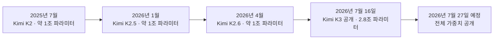
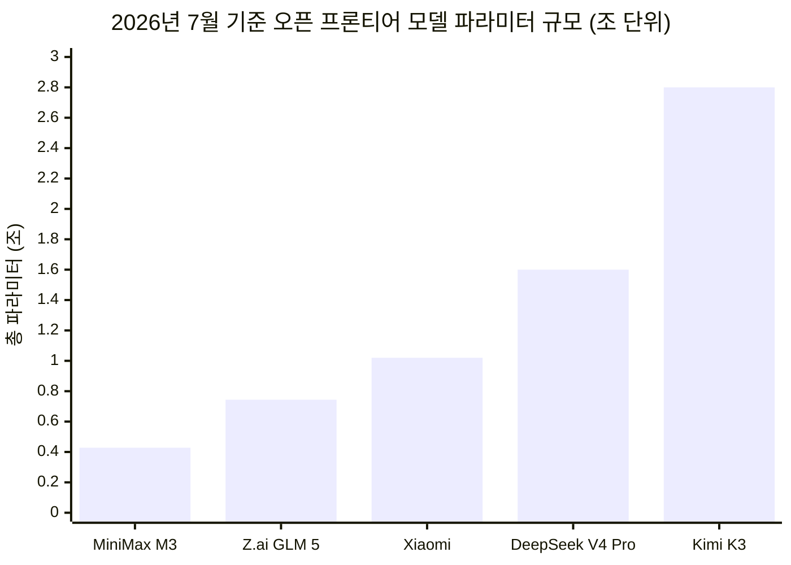
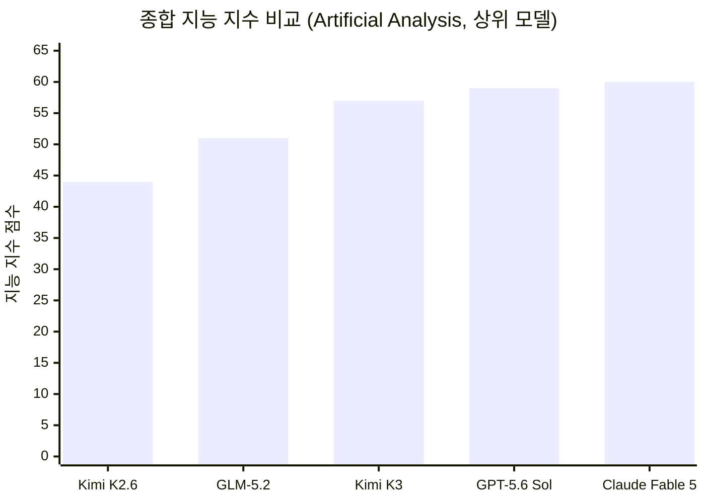
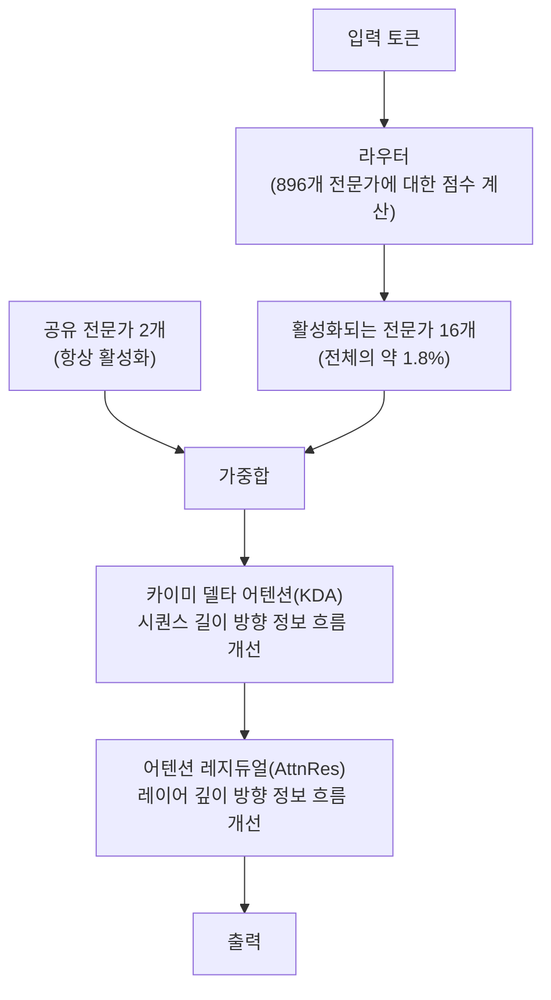

## 관련글

[**[ 중국 AI는 더 이상 싸구려 짝퉁이 아니다. 한국의 개인과 기업의 해결책은 다르다.]**](https://www.facebook.com/share/p/1EGn7TqHws/)

[**Kimi K3**](https://platform.kimi.ai/docs/guide/kimi-k3-quickstart)

[**코드 아레나에서 중국 Kimi-K3가 압도적인 1위를 차지했다.**](https://www.facebook.com/share/p/1QK9SamYPR/)

[**I've been using Kimi K3 for ~16 hours now.**](https://x.com/enzo_gte/status/2078102070482153717)

## 목차

0. 들어가며 — 이 문서의 성격과 출처에 대하여
1. 무엇이 출시되었나: 카이미 K3 개요와 타임라인
2. 코딩 벤치마크 성적표
3. 자율 에이전트 작업 성능
4. 프론트엔드 코드 아레나 1위 사건
5. 글쓰기와 전문 직무 벤치마크
6. 실무 능력 지표: 밸스 인덱스와 GDPval
7. 종합 지능 지수로 본 위치
8. 가격 정책과 비용 효율성
9. 아키텍처 해부: 2.8조 파라미터는 어떻게 가능했나
10. 실전 데모 1 — 게임과 인터랙티브 웹 애플리케이션
11. 실전 데모 2 — 과학 연구와 반도체 설계 (검증 필요 항목 포함)
12. 모션 그래픽과 영상 편집 능력
13. 카이미 워크(Kimi Work)와의 관계 — 혼동하기 쉬운 지점
14. 시장의 반응: 주가, 반도체, 그리고 두 번째 딥시크 모먼트
15. 지정학적 함의: 수출 통제와 사이버 리스크
16. 증류(distillation) 논란과 벤치마크에 대한 비판적 시각
17. 종합 정리와 앞으로 지켜볼 지점

---

## 0. 들어가며 — 이 문서의 성격과 출처에 대하여

이 문서는 유튜브 채널 TheAIGRID가 2026년 7월 17일에 게시한 영상 ["Kimi K3 Just Revealed The Worlds Most Powerful AI"](https://www.youtube.com/watch?v=DAKnynuGyy4)의 스크립트와 그 안에 포함된 여러 도표 자료를 출발점으로 삼아, 여기에 담긴 주장들을 블룸버그, 벤처비트, 포천, 액시오스, 톰스하드웨어, 테크크런치, 사이먼 윌리슨의 블로그, 아티피셜 애널리시스 공식 페이지 등 다수의 외부 소스로 교차 검증한 뒤 다시 정리한 자료이다. 원본 영상은 진행자 한 사람의 해석과 어조가 강하게 실려 있는 반응형 콘텐츠이기 때문에, 이 문서에서는 사실관계에 해당하는 부분은 별도의 독립 소스로 재확인했고, 확인이 되지 않거나 한 사람의 트윗 혹은 회사의 자체 발표에만 근거한 내용은 본문 곳곳에서 그 사실을 명시적으로 표시했다. 카이미 K3는 2026년 7월 16일에 발표된 지 아직 이틀밖에 지나지 않은 모델이며, 완전한 가중치 공개는 7월 27일로 예정되어 있어 지금 이 시점에 알려진 수치 상당수는 무선샷(Moonshot AI)이 직접 공개한 값이거나 API를 통해 외부 평가 기관이 측정한 값이다. 즉 아직 커뮤니티가 가중치를 직접 내려받아 재현 검증을 할 수 있는 단계는 아니라는 점을 먼저 밝혀둔다.

## 1. 무엇이 출시되었나: 카이미 K3 개요와 타임라인

2026년 7월 16일, 베이징에 본사를 둔 무선샷 AI가 새로운 대형언어모델 카이미 K3를 공개했다. 이 회사는 알리바바가 약 36퍼센트의 지분을 보유한 것으로 알려진 스타트업으로, 얀 즈린(Yang Zhilin)이 공동 창업했다.[1][6] 카이미 K3는 총 2.8조 개의 파라미터를 가진 모델로, 이는 오픈웨이트로 공개된 모델 가운데 세계 최초로 3조 파라미터급에 진입한 사례로 소개되고 있다. 다만 포천의 보도에서는 이 수치를 2.7조로 표기하기도 했는데, 대다수의 소스와 무선샷 자체 기술 블로그, 그리고 API 플랫폼 문서는 일관되게 2.8조라는 숫자를 제시하고 있어 이 문서에서는 2.8조를 기준으로 서술한다.[7][13][14]

이 모델의 공개 시점은 2026년 세계인공지능대회(WAIC)가 상하이에서 열리기 직전으로 맞춰졌으며, 이는 지난 18개월간 딥시크의 부상에 밀려 입지가 흔들렸던 무선샷의 반등이라는 평가를 받고 있다.[4] 카이미 K3는 100만 토큰 컨텍스트 윈도우, 네이티브 비전 이해 능력, 그리고 상시 활성화된 추론 모드("thinking mode")를 갖추고 있으며, OpenAI SDK와 호환되도록 설계되어 기존에 GPT나 클로드 생태계에서 개발하던 개발자들이 손쉽게 전환할 수 있게 만들어졌다.[4] 카이미 코드(Kimi Code) 플랫폼에는 모델 ID `k3`로 이미 등록되어 있으며, 일반 대화와 에이전트 작업을 위한 K3 Max, 그리고 대규모 병렬 처리를 위한 K3 Swarm Max라는 두 가지 변형으로 함께 출시되었다.[24][48] 무선샷은 전체 모델 가중치를 2026년 7월 27일까지 공개하겠다고 공식적으로 밝혔으며, 이는 수정된 MIT 라이선스 형태로 배포될 예정이다.[4][17]

아래 도표는 카이미 시리즈의 파라미터 규모가 어떻게 성장해왔는지를 보여준다.

같은 시기 다른 중국 오픈웨이트 랩들의 최신 플래그십 모델과 비교했을 때, 카이미 K3의 파라미터 규모는 두드러지게 크다. 딥시크의 V4 프로가 약 1.6조, 샤오미의 최신 모델이 약 1.02조, Z.ai(GLM 계열)가 약 7440억, 미니맥스가 약 4280억 수준으로 알려져 있는데, 카이미 K3는 이들을 모두 크게 앞지른다.[4]

## 2. 코딩 벤치마크 성적표

무선샷이 공개한 벤치마크 결과에서 가장 먼저 눈에 띄는 영역은 코딩이다. 딥에스더블유이(DeepSWE), 프론티어에스더블유이(FrontierSWE), 카이미 코드 벤치 2.0, 터미널 벤치 2.1, 프로그램 벤치, 에스더블유이 마라톤이라는 여섯 개의 까다로운 코딩 평가에서, 카이미 K3는 대체로 1위 혹은 2위 자리를 차지했다. 터미널 벤치 2.1에서는 88.3점을 기록해 88.8점의 지피티 5.6 솔(GPT-5.6 Sol)에 근소하게 뒤진 2위였고, 프로그램 벤치와 에스더블유이 마라톤에서는 각각 77.8점과 42.0점으로 1위를 차지했다. 프론티어에스더블유이에서는 81.2점으로 클로드 페이블 5(Fable 5)의 86.6점에 이어 2위, 카이미 코드 벤치 2.0 내부 평가에서도 72.9점으로 페이블 5의 76.9점에 이어 2위였다.[1] 이 여섯 개 벤치마크는 모두 사고 노력(thinking effort)을 맥스 혹은 엑스하이(xhigh) 수준으로 최대치로 설정한 상태에서 측정된 값이라는 점도 함께 밝혀두어야 한다.

다만 이 성적을 그대로 받아들이기 전에 몇 가지 유보 조건을 짚을 필요가 있다. 벤치마크 방법론을 다루는 분석 매체 벤치엘엠(BenchLM)은 카이미 K3의 코딩 관련 수치 대부분이 하네스(실행 환경) 종속적인 값이며, 널리 쓰이는 가중 에스더블유이벤치 프로(weighted SWE-bench Pro)나 라이브코드벤치(LiveCodeBench) 점수는 아직 공개되지 않았다는 점을 지적하며, 이 때문에 자사의 가중 리더보드에는 카이미 K3를 아직 순위에 포함시키지 않고 있다고 밝혔다.[9] 또한 프로그램 벤치를 만든 오피르 프레스(Ofir Press)는 무선샷이 완전히 작동하는 프로그램의 개수를 세는 대신 구현률(implementation percentage)을 평균 내는 방식을 사용했다며, 이는 자신이 권장하지 않는 집계 방식이라고 언급한 바 있다.[36] 즉 카이미 K3의 코딩 성적은 인상적이지만, 그 수치가 정확히 무엇을 측정한 것인지에 대해서는 아직 방법론적 논쟁이 진행 중이라는 점을 함께 이해할 필요가 있다.

## 3. 자율 에이전트 작업 성능

단순 코딩을 넘어선 다단계 에이전트 작업에서도 카이미 K3는 준수한 성적을 냈다. 여러 개의 도구를 연쇄적으로 호출하며 장시간 스스로 판단해야 하는 에이전트 벤치마크군에서, 카이미 K3는 대부분 최상위권 혹은 그 바로 아래에 위치했다. 아티피셜 애널리시스가 독립적으로 측정한 결과에 따르면 카이미 K3는 지능 지수(Intelligence Index) 57.11점, 코딩 지수 76.24점, 에이전틱 지수 50.07점을 기록했다.[65] 특히 인터넷을 돌아다니며 정보를 찾아내는 브라우즈컴프(BrowseComp) 평가에서는 문맥을 30만 토큰으로 압축한 상태에서 91.2퍼센트, 별도의 문맥 관리 없이 100만 토큰 전체를 그대로 사용한 상태에서도 90.4퍼센트를 기록해 이 항목에서는 클로드 페이블 5나 클로드 오퍼스(Opus) 4.8보다도 비용 대비 성능이 우수한 결과를 보였다.[9]

지디피밸(GDPval) v2라는, 실제 사무직 노동자가 수행하는 업무를 흉내 낸 평가에서는 엘로(Elo) 점수 1,668점을 받아 이전 모델인 K2.6의 1,190점에서 크게 뛰어올랐다. 이는 GLM-5.2의 1,514점, 지피티 5.5의 1,494점, 클로드 오퍼스 4.8의 1,600점을 넘어서는 결과지만, 클로드 페이블 5의 1,760점에는 아직 미치지 못한다.[37] 또한 자동화된 업무 흐름을 평가하는 오토메이션벤치-에이에이(AutomationBench-AA)에서는 53퍼센트로 1위를 기록했다.[37]

## 4. 프론트엔드 코드 아레나 1위 사건

이번 출시에서 가장 화제가 된 결과는 아레나(Arena.ai)가 운영하는 프론트엔드 코드 아레나 리더보드에서 카이미 K3가 1위를 차지했다는 소식이다. 이 리더보드는 사람들이 두 개의 익명화된 모델이 만든 결과물을 놓고 어느 쪽이 더 나은지 직접 투표하는 방식으로 운영되며, 프론트엔드 코딩 부문 전체 투표 수가 47만 건에 이를 정도로 규모가 크다.[41] 카이미 K3는 1,679점을 받아 클로드 페이블 5의 1,631점, 지피티 5.6 솔의 1,618점을 앞질렀고, 이는 전작인 카이미 K2.6이 18위(1,515점)에 머물러 있던 것에서 무려 17계단을 뛰어오른 결과다.[27][31]

머리 대 머리로 직접 비교했을 때의 승률(pairwise win rate)로 보면 그 격차가 더 뚜렷하게 드러난다. 아레나 공식 발표에 따르면 카이미 K3는 동일한 과제를 다른 모델과 겨루었을 때 평균 76퍼센트의 확률로 더 나은 결과물로 선택되었으며, 이는 클로드 페이블 5의 63퍼센트, 지피티 5.6 솔의 58퍼센트를 크게 웃도는 수치다. 참고로 50퍼센트는 이기고 지는 비율이 완전히 같을 때 나오는 기준선이다.[27][35]

카이미 K3는 브랜드·마케팅, 참조 기반 디자인, 데이터·분석, 소비자 제품, 시뮬레이션, 콘텐츠 제작 도구라는 일곱 개 세부 영역 가운데 여섯 개에서 1위를 차지했고, 오직 게이밍 영역에서만 클로드 페이블 5에 밀려 2위에 머물렀다.[27] 다만 벤치엘엠은 이 리더보드가 아직 카이미 K3 기준으로는 표본 수가 1,757건으로, 클로드 페이블 5의 2,505건이나 지피티 5.6 솔의 2,542건에 비해 적은 편이며, 신뢰구간이 코드 보드 기준 약 ±17점 정도로 넓게 잡혀 있어 아직 순위가 완전히 안정되었다고 단정하기는 이르다는 점도 함께 지적했다.[38][63] 실제로 종합 텍스트 아레나에서는 출시 첫날 9위(1,486점)로 나타났다가, 다음 날 확인했을 때는 6위(1,500점)로 다시 조정되는 등, 신생 모델의 초기 순위는 표본이 쌓이면서 계속 움직이고 있다는 점도 유의해야 한다.[38]

## 5. 글쓰기와 전문 직무 벤치마크

카이미 K3는 순수 코딩 영역을 벗어난 텍스트 작업에서도 눈에 띄는 성과를 냈다. AI 뉴스레터 Towards AI를 운영하는 루이프랑수아 부샤르(Louis-François Bouchard)가 공개한 비공식 내부 글쓰기 벤치마크에 따르면, 카이미 K3는 편집자적 문체를 평가하는 기준에서 엘로 2,840점을 받아 클로드 페이블 5(2,760점)를 근소하게 앞지르며 1위에 올랐다. 이는 전작인 카이미 K2.6이 21위에 머물렀던 것에서 크게 도약한 결과이며, 오픈웨이트 모델이 이 리더보드에서 1위를 차지한 것은 이번이 처음이라고 부샤르 본인도 밝혔다. 비용 측면에서는 대본 한 편당 약 0.25달러가 소요되어, 직전까지 1위였던 모델보다 약 다섯 배 저렴하다고 설명되었다.[43] 다만 이 결과는 대규모 공개 리더보드가 아니라 한 개인 연구자의 비공식적인 초기 평가 결과라는 점은 분명히 해둘 필요가 있다.

아레나의 종합 텍스트 리더보드에서도 카이미 K3는 38위였던 이전 모델에서 9위 수준까지 뛰어올랐으며, 창작 글쓰기·코딩·지시 사항 이행이라는 세 영역에서 상위 10위 안에 들었고, 물리·사회과학, 법률·행정, 의료·건강이라는 세 개의 직업군 세부 평가에서는 1위를 기록한 것으로 나타난다.[원본 영상 자료]

## 6. 실무 능력 지표: 밸스 인덱스와 GDPval

벤치마크가 실제 업무 현장에서의 쓸모를 얼마나 잘 반영하는지는 별개의 문제다. 이를 보완하기 위해 만들어진 지표 가운데 하나가 금융과 코딩 과제에 걸친 가중 성능을 측정하는 밸스 인덱스(Vals Index)다. 2026년 7월 16일 기준 이 지표에서 카이미 K3는 74.70퍼센트의 정확도로 2위에 올랐으며, 이는 1위인 클로드 페이블 5의 75.14퍼센트에 근소하게 못 미치는 수준이지만, 지피티 5.6 솔(73.12퍼센트), 클로드 오퍼스 4.8(70.36퍼센트), 클로드 소네트 5(68.61퍼센트)를 모두 앞선 결과다.[9] 특히 과제당 비용은 0.96달러로, 페이블 5의 5.16달러에 비해 대략 5분의 1 수준에 불과하다는 점이 함께 강조되고 있다.

지디피밸(GDPval)은 오픈AI 계열 연구에서 파생된 것으로 알려진 벤치마크로, AI 시스템이 실제 직장인이 수행하는 업무를 얼마나 잘 처리하는지를 측정한다. 이 지표에서도 카이미 K3는 지피티 5.6 솔에 이어 인간 기준선에 가까운 위치까지 도달했다고 평가되며, 이는 최대 추론 설정으로 구동되는 클로드 소네트 5, 클로드 오퍼스 4.8, 지피티 5.6 테라(Terra)를 모두 앞서는 결과로 해석된다.[원본 영상 자료]

## 7. 종합 지능 지수로 본 위치

아티피셜 애널리시스가 운영하는 종합 지능 지수(Artificial Analysis Intelligence Index)는 터미널 벤치, 휴머니티스 라스트 이그잼(Humanity's Last Exam), GPQA 다이아몬드 등 아홉 개의 서로 다른 평가를 종합한 지표다. 이 지수에서 카이미 K3는 57점을 받아 지피티 5.6 솔(59점)과 클로드 페이블 5(60점)에 이은 3위를 차지했으며, 클로드 오퍼스 4.8(56점)과 지피티 5.6 테라·5.5(각 55점)를 앞질렀다.[65] 벤치엘엠의 종합 공개 리더보드에서는 200개 모델 가운데 4위, 80.96점을 받은 것으로 집계된다.[41]

주목할 부분은 아티피셜 애널리시스가 함께 측정한 AA-옴니사이언스(AA-Omniscience) 지표다. 이 지표는 정답률뿐 아니라 환각(hallucination) 발생률도 함께 측정하는데, 카이미 K3는 K2.6 대비 정답률이 33퍼센트에서 46퍼센트로 상승했지만, 동시에 환각률도 39퍼센트에서 51퍼센트로 함께 상승한 것으로 나타났다. 이는 모델이 더 많은 질문에 답을 내놓게 되었지만, 그만큼 스스로 모른다고 인정하는 능력은 오히려 후퇴했다는 뜻으로 해석될 수 있다.[19][37] 이 수치는 카이미 K3의 실용성을 평가할 때 반드시 함께 고려해야 할 지점이다.

## 8. 가격 정책과 비용 효율성

성능만큼이나 화제가 된 부분이 가격이다. 카이미 K3의 API 요금은 입력 토큰 백만 개당 3달러, 출력 토큰 백만 개당 15달러이며, 캐시가 적중된 입력 토큰은 백만 개당 0.30달러로 책정되었다.[1][40] 이는 중국 AI 랩이 지금까지 책정한 가격 중 가장 높은 축에 속하지만, 그럼에도 클로드 페이블 5의 입력 10달러·출력 50달러에 비하면 여전히 크게 저렴한 수준이다.[38] 다만 전작인 카이미 K2.6의 요금이 입력 0.95달러·출력 4달러 수준이었다는 점을 감안하면, K3에서는 가격이 세 배가량 뛰었다는 점 또한 명확히 짚고 넘어갈 필요가 있다. 이를 두고 사이먼 윌리슨은 자신의 블로그에서 "값싼 중국 AI 시대의 종료를 알리는 신호"라는 취지로 언급하기도 했다.[37]

절대 가격보다 더 의미 있게 인용되는 지표는 과제당 비용 대비 지능 수준이다. 아티피셜 애널리시스의 집계에 따르면 카이미 K3는 지능 지수 과제 한 건당 평균 0.94달러의 비용이 들어, 지피티 5.6 솔(1.04달러)과 비슷한 수준이며, 클로드 오퍼스 4.8(1.80달러)의 약 절반, 클로드 페이블 5(폴백 포함 시 2.75달러)에 비해서는 훨씬 저렴하다.[65] 또한 카이미 K3는 K2.6 대비 동일 과제에서 출력 토큰을 21퍼센트 적게 사용하는 것으로 측정되어, 절대 단가 상승분의 일부를 토큰 효율화로 상쇄하고 있다는 점도 확인된다.[1][37]

카이미 코드 벤치 V2에서 비용 대비 점수를 그려보면, 카이미 K3는 저비용 구간에서 상당히 높은 점수를 달성하는 곡선을 그리는 반면, 클로드 오퍼스 4.8이나 클로드 페이블 5는 훨씬 높은 비용 구간에 위치한다는 것이 확인된다. 브라우즈컴프 과제에서도 비슷한 양상이 나타나, 카이미 K3는 5달러 미만의 비용으로 지피티 5.6 솔과 유사하거나 약간 낮은 점수를 기록하는 반면, 클로드 소네트 5나 클로드 오퍼스 4.8은 15달러에서 25달러 구간에서 비슷한 점수를 내고, 클로드 미토스 5(Mythos 5)는 100만에서 1,000만 토큰을 소모하며 20달러에서 27달러 구간에 위치한다.[원본 영상 자료]

## 9. 아키텍처 해부: 2.8조 파라미터는 어떻게 가능했나

2.8조 개의 파라미터를 가진 모델을 만들었다는 것 자체보다 더 중요한 것은, 이만큼 큰 모델을 실제로 쓸 수 있는 비용으로 서비스할 수 있게 만든 설계다. 카이미 K3는 혼합 전문가(Mixture of Experts, MoE) 구조를 채택하고 있으며, 전체 896개의 전문가 네트워크 가운데 토큰 하나당 단 16개만을 활성화한다. 이는 전체 전문가 풀의 약 1.8퍼센트에 불과한 수준으로, 지금까지 공개된 오픈웨이트 모델 가운데 가장 공격적인 희소성 비율에 속한다. 이 덕분에 실제 추론 시 활성화되는 파라미터 수는 총 2.8조 가운데 약 500억 개 수준으로 알려져 있다.[21][25]

이처럼 극단적인 희소성을 안정적으로 학습시키기 위해 무선샷은 스테이블 레이턴트모이(Stable LatentMoE)라는 프레임워크를 함께 도입했다. 이 프레임워크 안에는 라우터 점수의 분위수(quantile)를 기준으로 전문가 배정을 결정하는 퀀타일 밸런싱(Quantile Balancing) 기법이 포함되어 있는데, 이는 기존에 쓰이던 휴리스틱 방식의 균형 조정과 민감한 하이퍼파라미터 튜닝을 없애기 위한 장치다. 여기에 어텐션 헤드마다 독립적으로 최적화를 수행하는 퍼헤드 무온(Per-Head Muon), 활성화를 제어하는 시그모이드 탄젠트 유닛(SiTU), 어텐션의 선택성을 높이는 게이티드 엠엘에이(Gated MLA) 등의 기법이 함께 적용되었다.[20][23]

정보가 모델을 통과하는 두 가지 축, 즉 시퀀스 길이 축과 레이어 깊이 축 각각에 대해서도 새로운 장치가 도입되었다. 카이미 델타 어텐션(Kimi Delta Attention, KDA)은 선형 어텐션과 일반 어텐션을 결합한 하이브리드 방식으로, 무선샷은 이 기법이 100만 토큰급 문맥에서 최대 6.3배 빠른 디코딩 속도를 낸다고 밝혔다. 어텐션 레지듀얼(Attention Residuals, AttnRes)은 레이어를 거칠 때마다 정보를 균일하게 누적하는 대신, 깊이 방향으로 필요한 표현만을 선택적으로 다시 끌어오는 방식이며, 무선샷은 이 기법이 약 2퍼센트의 추가 연산 비용만으로 약 25퍼센트의 학습 효율 향상을 가져온다고 설명했다. 이 두 기법은 이미 2026년 상반기에 무선샷 팀이 공개 연구로 발표했던 내용이며, 이번 K3에 통합되어 실제 프로덕션 모델에 처음 적용된 사례다.[20][23]

무선샷은 이러한 구조적 개선들이 종합적으로 작용해 K2 대비 약 2.5배의 스케일링 효율 향상을 가져왔다고 주장한다. 이는 K3가 K2보다 단순히 2.5배 똑똑하다는 의미가 아니라, 동일한 양의 연산과 데이터를 투입했을 때 K3가 그것을 실제 성능으로 더 효율적으로 전환할 수 있다는 의미로 이해해야 한다. 다만 이 2.5배라는 수치는 어디까지나 무선샷이 자체적으로 제시한 지표이며, 아직 외부 기관의 독립적인 검증을 거치지 않았다는 점은 벤치엘엠을 비롯한 여러 분석가들이 공통적으로 지적하는 부분이다.[9]

기술적으로 한 가지 더 짚어둘 부분은 양자화다. 카이미 K3는 지도 미세조정(SFT) 단계부터 양자화를 염두에 둔 학습(quantization-aware training)을 적용해, MXFP4 가중치와 MXFP8 활성화 조합으로 폭넓은 하드웨어 호환성을 확보했다고 밝혀졌다. 다만 이만큼 큰 모델을 실제로 자체 서버에 구동하려면 최소 1.4테라바이트에 달하는 총 GPU 메모리가 필요하며, 현실적으로는 80기가바이트급 GPU 여덟 개를 갖춘 노드 여덟 대, 총 5.12테라바이트 규모의 클러스터가 있어야 KV 캐시와 활성화 값을 위한 여유 공간까지 확보할 수 있다는 분석도 나와 있다. 즉 개인이나 소규모 조직이 이 모델을 직접 자체 호스팅하기는 현실적으로 매우 어렵다.[24]

## 10. 실전 데모 1 — 게임과 인터랙티브 웹 애플리케이션

무선샷과 여러 사용자들은 카이미 K3가 실제로 무엇을 만들어낼 수 있는지를 보여주는 다양한 사례를 공개했다. 다만 아래 소개하는 사례들 대부분은 무선샷이 직접 공개한 홍보성 사례이거나, 트위터(엑스)에서 개별 사용자가 공유한 것으로, 표준화된 평가 절차를 거친 결과가 아니라는 점을 먼저 밝혀둔다.

크리스라는 사용자는 카이미 K3가 약 60만 토큰, 3.24달러의 API 비용만으로 CS:GO와 포탈을 결합한 형태의 게임을 세 번 만에 만들어냈다고 공유했으며, 동일한 토큰 사용량이 클로드 페이블 5로는 10.80달러, 지피티 5.6 솔로는 6달러가 들 것이라고 덧붙였다.[원본 트윗 인용, 개별 사용자 공유 사례] 무선샷 자체 사례로는, 3JS와 웹지피유(WebGPU)를 활용해 절차적으로 생성한 숲과 산악 지형, 목조 마을을 갖춘 3차원 오픈월드 탐험 게임이 소개되었으며, 이 경우 캐릭터와 말 모델 등 일부 3차원 에셋은 외부 생성 도구로 별도 제작한 것으로 명시되어 있다. 또 다른 사례에서는 실제로 작동하는 엠지비에이(mGBA) 웹어셈블리 코어를 통합한 3차원 게임보이 어드밴스 에뮬레이터를 만들어냈으며, 여기에는 재귀적 자기 개선(recursive self-improvement) 과정을 통해 인터페이스와 게임플레이를 반복적으로 다듬은 과정이 포함되었다고 소개되었다.

이 밖에도 사이버펑크 도시를 배경으로 한 웹 스윙 게임, 1930년대 타자기를 정교하게 재현한 242개의 개별 애니메이션 부품을 가진 웹 애플리케이션, 로마 콜로세움을 배경으로 한 복셀 아트 전투 게임, 커스텀 웹지피유 엔진으로 구현한 3차원 격투 게임, 무협풍 3차원 알피지, 여덟 개의 무기를 갖춘 4대4 에프피에스 아레나 등의 사례가 함께 공개되었다. 이 가운데 상당수는 헤드리스 크롬(headless Chrome)으로 스스로 화면을 캡처해 시각적 오류와 게임플레이 문제를 감지하고 수정하는 방식으로 최대 20라운드에 걸쳐 반복 개선되었다고 소개된다. 이러한 사례들은 카이미 K3가 텍스트와 시각 정보를 하나의 모델 안에서 함께 처리하는 네이티브 멀티모달 구조를 갖추고 있어, 코드를 작성하고 그 결과를 스스로 확인한 뒤 다시 수정하는 사람의 개발 과정과 유사한 피드백 루프를 반복할 수 있다는 점을 보여주기 위한 목적으로 공개된 것으로 보인다.

## 11. 실전 데모 2 — 과학 연구와 반도체 설계 (검증 필요 항목 포함)

무선샷이 공개한 사례 가운데 가장 파급력이 큰 것은 반도체 설계와 과학 연구 재현 사례다. 회사 측 설명에 따르면 카이미 K3는 24시간에서 48시간에 이르는 단일 자율 실행 세션 동안, 나노게이트(Nanogate) 45나노미터 라이브러리를 활용한 오픈소스 이디에이(EDA) 도구를 사용해 자기 자신의 아키텍처를 기반으로 한 소형 모델을 구동하기 위한 칩을 밀리미터 단위 정밀도로 설계, 최적화, 검증했다고 한다. 이는 어디까지나 무선샷이 개념 증명(proof of concept) 차원에서 공개한 자체 사례이며, 제3자 반도체 설계 전문가나 독립 기관에 의해 검증되었다는 근거는 현재까지 확인되지 않는다는 점을 분명히 해야 한다.

과학 연구 재현 사례로는, 카이미 K3가 압축성 항성(compact star)에 관한 계산 천체물리학 연구를 약 두 시간 만에 재현했다는 사례가 소개되었다. 이 과정에서 20편 이상의 논문을 검토하고 교차 검증했으며, 300개 이상의 상태 방정식(equation of state)을 평가하고, 발표된 공식들 사이의 불일치를 찾아냈으며, 3천 줄이 넘는 파이썬 코드를 생성하고 결과를 탐색할 수 있는 인터랙티브 대시보드를 만들어냈다고 소개된다. 회사 측은 이 작업이 숙련된 연구자가 수행할 경우 통상 1~2주가 걸릴 분량이라고 설명했다. 이 역시 무선샷 자체가 공개한 사례이며, 해당 연구자 커뮤니티에 의한 독립적인 재현 검증 결과는 아직 확인되지 않았다.

## 12. 모션 그래픽과 영상 편집 능력

카이미 K3의 또 다른 특징으로 소개된 것은 모션 그래픽과 영상 편집 능력이다. 이는 텍스트, 이미지, 영상을 하나의 모델 안에서 함께 처리하는 네이티브 멀티모달 구조 덕분이라고 설명되는데, 별도의 모델을 체인으로 연결하는 방식이 아니라 단일 모델 내에서 시각 정보를 이해하고 반영한다는 점이 강조되고 있다. 공개된 사례 중 하나는 카이미 K3가 자기 자신의 아키텍처를 설명하는, 유명 수학 교육 채널과 유사한 스타일의 모션 그래픽 설명 영상을 애니메이션 다이어그램과 전환 효과를 포함해 스스로 만들어낸 것이다. 다만 이 영상 제작 과정도 실제로는 코드를 작성해 영상을 생성하고, 그 결과물을 다시 시각적으로 확인한 뒤 수정하는 과정을 반복하는 방식이며, 무선샷이 공개한 이 티저 영상 제작 사례에서는 약 52개의 영상 클립과 음향 효과를 조합해 완성했다고 소개된다. 이 역시 회사가 공개한 시연 사례이며, 정량적인 벤치마크로 측정된 결과가 아니라는 점을 밝혀둔다.

## 13. 카이미 워크(Kimi Work)와의 관계 — 혼동하기 쉬운 지점

카이미 K3와 관련된 자료를 살펴보다 보면 "카이미 워크(Kimi Work)"라는 별도의 제품이 함께 언급되는 경우가 많아 혼동하기 쉽다. 카이미 워크는 무선샷이 2026년 6월에 공개한 데스크톱 에이전트 애플리케이션으로, 로컬 파일에 접근하고 실제 브라우저 세션을 직접 조작하며 최대 300개의 하위 에이전트를 병렬로 운용할 수 있는 것이 특징이다. 완성된 리서치 결과물을 파워포인트나 엑셀 형식으로 자동 변환해주는 기능도 갖추고 있다.[22][27][33] 42년간의 AI 반도체(ASIC) 산업을 다룬 인터랙티브 리서치 웹사이트, 핵융합 산업 리서치 보고서, 391개의 중력파 이벤트를 분석한 과학 리서치 시각화 등 방대한 리서치 결과물 사례들은 이러한 워크스페이스형 제품에서 생성된 것으로 소개되고 있다.

다만 여러 독립 소스를 확인한 결과, 카이미 워크는 지금까지 알려진 바로는 카이미 K2.6을 기반으로 구동되어 왔으며, 카이미 K3가 정식으로 카이미 워크에 통합되었는지에 대해서는 이 문서를 작성하는 시점 기준으로 명확한 공식 확인 자료를 찾지 못했다.[23][24][30][31] 즉 위에서 소개한 반도체 설계나 중력파 분석과 같은 초장시간 자율 작업 사례들은 영상 속에서 "카이미 K3 자체의 장기 에이전트 능력"으로 설명되고 있지만, 이 사례들에 실제로 사용된 백엔드 모델이 카이미 K3인지, 혹은 카이미 워크에서 통상적으로 쓰이는 K2.6 계열인지는 이 문서에서 명확히 구분해 확인할 수 없었다는 점을 정직하게 밝혀둔다. 카이미 워크와 K3의 정확한 통합 여부는 향후 공식 발표를 통해 확인이 필요한 부분이다.

## 14. 시장의 반응: 주가, 반도체, 그리고 두 번째 딥시크 모먼트

카이미 K3의 공개는 금융시장에도 즉각적인 파장을 일으켰다. 여러 매체가 이번 사태를 2025년 초 딥시크의 등장이 시장을 뒤흔들었던 "딥시크 모먼트"의 재현으로 묘사하고 있다.[62] 공개 다음 날인 7월 17일, 대만의 반도체 위탁생산업체 티에스엠씨(TSMC)는 분기 영업이익이 77퍼센트나 증가했다는 호실적을 발표했음에도 불구하고 주가가 7퍼센트 하락했으며, 오픈AI의 주요 투자자로 여겨지는 소프트뱅크의 주가는 9.0퍼센트 떨어졌다. 무선샷의 경쟁자로 꼽히는 중국 스타트업 Z.ai의 주가는 홍콩 증시에서 27퍼센트에서 30퍼센트에 이르는 급락을 겪었고, 또 다른 경쟁사인 미니맥스도 16퍼센트가량 하락했다. 미국 시장에서도 나스닥100 지수가 1퍼센트가량 밀렸고, 엔비디아 주가는 1.2퍼센트 하락하며 세계 시가총액 1위 자리를 애플에 잠시 내주었으며, 메타 주가는 2.4퍼센트 넘게 급락했다.[8][45][46][60][61]

흥미로운 것은 이러한 시장 반응에 대한 반론도 함께 제기되었다는 점이다. 한 분석은 카이미 K3의 가장 강력한 버전을 실제로 구동하려면 수백만 달러 규모의 엔비디아 GPU 클러스터가 필요하기 때문에, 오히려 이 사건이 엔비디아 주주에게는 나쁜 소식이 아니라는 시각을 제시했다.[57] 암호화폐 시장 역시 이번 사태에서 자유롭지 않았는데, 비트코인은 이제 반도체·AI 인프라 관련 심리와 함께 움직이는 자산으로 거래되는 경향이 강해지면서, 카이미 K3 발표 이후 비트코인을 포함한 주요 암호화폐 가격이 함께 하락하는 모습을 보였다.[63]

## 15. 지정학적 함의: 수출 통제와 사이버 리스크

이번 사건이 단순한 기업 간 경쟁을 넘어 정치적인 의미를 갖는 이유는, 미국의 반도체 및 AI 관련 수출 통제 정책이 전제하고 있던 가정, 즉 중국 AI 랩이 미국 프론티어 모델에 비해 6개월에서 12개월가량 뒤처져 있다는 통념이 이번 발표로 흔들렸기 때문이다.[6] 실제로 2026년 7월 14일 미국 하원 외교위원회에서는 켈리 영 김(Young Kim) 의원이 참석한 가운데 AI 군비 경쟁에서 나타난 수출 통제의 허점을 점검하는 청문회가 열렸으며, 카이미 K3의 등장은 지난 3년간 이어진 GPU 및 리소그래피 장비에 대한 통제 강화가 중국 랩이 프론티어에 도달하는 것을 막지 못했다는 반복적인 패턴을 다시 한번 보여주는 사례로 언급되었다.[1]

가장 민감하게 다뤄지는 지점은 사이버 보안 관련 위험성 평가다. 카이미 K3의 공식 발표 자료에는 사이버짐(CyberGym)이라는, 모델이 실제 소프트웨어 시스템의 취약점을 발견하고 공격할 수 있는 능력을 측정하는 표준 벤치마크 점수가 포함되어 있지 않다. 이 때문에 다수의 AI 연구자와 관찰자들이 영국 AI 안전 연구소(AISI)를 비롯한 독립 기관이 이 모델을 직접 평가해줄 것을 요청하고 있는 상황이다.[10][11][12] 일부 정책 분석가는 무선샷이 이 점수를 의도적으로 공개하지 않음으로써 특정 위험 임계치를 넘을 경우 촉발될 수 있는 수출 통제성 조치를 피하려 한 것 아니냐는 추측을 제기하기도 했으나, 이는 어디까지나 추측일 뿐 무선샷이 공식적으로 확인해준 사실은 아니다.

이와 관련해 참고할 만한 선행 자료로, 카이미 K2.5에 대해 진행된 한 독립 안전성 평가 논문은 해당 모델이 완전 자율적인 사이버 공격을 수행할 수 있는 수준은 아니라고 결론지으면서도, 오픈웨이트로 공개되어 중앙화된 감독 없이 로컬에서 구동될 수 있다는 특성 때문에 공격 계획 수립이나 반자동화된 공격 도구 제작을 노리는 위협 행위자들에게 의미 있는 위험을 배제할 수 없다고 평가한 바 있다.[13] 또한 영국 AISI의 별도 분석에 따르면, 오픈웨이트 모델들은 사이버 관련 과제에서 프론티어 모델보다 대략 4개월에서 7개월가량 뒤처져 있는 것으로 나타나는데, 이 분석에는 비교적 최근 모델인 GLM-5.2와 딥시크 V4 프로까지는 포함되어 있지만 카이미 K3는 아직 포함되어 있지 않다.[14] 한 정책 매체는 카이미 K3가 스스로 밝힌 바에 따르면 아직 진정한 프론티어 수준은 아니며, 따라서 클로드 미토스나 지피티 5.6 솔과 같은 수준의 위험한 사이버 능력을 갖추지는 않았을 가능성이 높다고 평가하면서도, 중국이 실제로 위험한 수준의 모델 능력에 도달하게 되면 지금과는 다른 태도, 즉 개방보다는 통제를 선택하는 쪽으로 정책을 바꿀 가능성이 있다고 전망했다.[14]

## 16. 증류(distillation) 논란과 벤치마크에 대한 비판적 시각

카이미 K3를 둘러싼 논쟁 가운데 가장 무거운 것은 이른바 "증류" 의혹이다. 앤트로픽은 2026년 2월, 딥시크·무선샷·미니맥스 세 개 중국 AI 랩이 총 1,600만 건이 넘는 대화를 약 2만 4천 개의 부정한 계정을 통해 클로드와 주고받았으며, 이는 앤트로픽의 서비스 약관과 중국 내 접근을 명시적으로 금지한 지역 제한 정책을 위반한 행위라고 공개적으로 주장한 바 있다. 앤트로픽에 따르면 무선샷은 단일한 계정 패턴을 사용한 딥시크와 달리, 여러 접근 경로에 걸쳐 계정 유형을 의도적으로 다양화하는 방식으로 수백 개의 부정 계정을 운용해 이를 조직적인 활동으로 탐지되기 어렵게 만들었다고 한다.[54][58] 이번 카이미 K3의 성능이 이 논란에서 언급된 모델들과 불과 몇 점 차이로 근접해 있다는 점에서, 톰스하드웨어를 비롯한 매체들은 이러한 증류 의혹과 이번 성능 도약 사이의 연관성을 조심스럽게 제기하고 있다.[54]

이와 관련해 한 가지 더 짚어야 할 사례가 있다. 웹씨에프테크(Wccftech)는 한 사용자가 트위터에 공유한 내용을 인용해, 카이미 K3가 최소한 한 번의 대화에서 스스로를 "앤트로픽이 만든 AI 어시스턴트 클로드"라고 지칭했다는 사례를 보도했다. 다만 이 매체 스스로도 이 정황이 "여전히 불확실한 추측의 영역에 머물러 있다"고 명시하고 있으며, 이는 한 개인 사용자의 트윗 한 건에 근거한 일화적 증거에 불과하다. 이러한 종류의 자기 정체성 오인 현상은 다른 모델을 학습 데이터의 일부로 사용했을 가능성을 시사할 수는 있지만, 그 자체가 증류를 확정적으로 증명하는 근거는 되지 못한다는 점을 분명히 해야 한다.[55] 무선샷 측에서 이 의혹에 대해 공식적으로 반박하거나 해명한 내용은 이 문서 작성 시점까지 확인되지 않았다.

성능에 대한 비판적 평가도 여럿 제기되었다. 한 사용자는 카이미 K3에게 실제 코드베이스에서 발생한 버그를 찾아 고치도록 요청했을 때, 모델이 문제를 정확히 짚어내지 못하고 존재하지 않는 원인을 지어내는 모습을 보였다고 전했다. 반면 같은 과제를 클로드 페이블 5와 중간 수준의 추론 설정을 적용한 지피티 5.6에게 맡겼을 때는 두 모델 모두 문제를 찾아내고 단 한 번의 시도로 수정에 성공했다고 한다. 이 사용자는 카이미 K3가 화제가 되고 있는 이유의 상당 부분이 시각적으로 화려한 UI 데모, HTML로 구현된 가짜 운영체제나 자동차 게임, 마인크래프트 클론과 같이 온라인에서 반복적으로 회자되는 특정 유형의 시각적 코딩 테스트에 최적화되어 있기 때문일 수 있다고 지적했다.[원본 영상 자료, 개별 사용자 트윗 기반] 이 역시 표준화된 절차를 거친 평가가 아니라 개인의 일회성 사용 경험이라는 점에서, 카이미 K3의 프론트엔드 코딩 강점과 실제 대규모 코드베이스에서의 문제 해결 능력 사이에는 아직 검증되지 않은 간극이 존재할 가능성을 시사하는 사례로 받아들이는 것이 합리적이다.

## 17. 종합 정리와 앞으로 지켜볼 지점

지금까지 살펴본 내용을 종합하면, 카이미 K3는 2026년 7월 16일을 기준으로 오픈웨이트 모델 가운데 지금까지 발표된 가장 큰 규모(2.8조 파라미터)의 모델이며, 코딩과 프론트엔드 개발, 장시간 에이전트 작업, 글쓰기 등 다양한 영역에서 클로드 페이블 5나 지피티 5.6 솔과 같은 최상위 폐쇄형 모델에 근접하거나 일부 영역에서는 이를 능가하는 성적을 낸 것은 다수의 독립 소스를 통해 비교적 명확하게 확인되는 사실이다. 특히 프론트엔드 코드 아레나 1위, 밸스 인덱스 2위, 종합 지능 지수 3위라는 결과는 여러 기관이 각기 다른 방법론으로 측정했음에도 일관되게 카이미 K3를 상위권에 위치시키고 있다는 점에서 신뢰도가 높은 편이다.

다만 이 문서를 마무리하며 균형을 위해 다시 한번 강조해야 할 유보 조건들이 있다. 첫째, 완전한 모델 가중치는 아직 공개되지 않았으며 2026년 7월 27일 공개가 예정되어 있을 뿐이므로, 지금까지의 모든 성능 수치는 무선샷의 API를 통한 측정값이거나 회사 자체 발표에 근거한 것이고, 커뮤니티에 의한 완전한 독립 재현은 아직 이루어지지 않았다. 둘째, 정답률이 오른 만큼 환각률도 함께 오른 것으로 나타나는 AA-옴니사이언스 지표는 카이미 K3가 실무에서 신뢰성 있게 쓰이기 위해서는 추가적인 검증이 필요하다는 점을 보여준다. 셋째, 사이버 관련 위험성을 측정하는 사이버짐 점수가 아직 공개되지 않아, 향후 독립 기관의 평가 결과에 따라 이 모델을 둘러싼 규제 논의의 방향이 달라질 가능성이 있다. 넷째, 앤트로픽이 제기한 증류 의혹은 아직 무선샷의 공식 반박이나 제3자의 확정적인 검증 없이 진행 중인 사안이다.

앞으로 지켜볼 만한 지점을 꼽자면, 우선 7월 27일로 예정된 전체 가중치 공개 이후 커뮤니티가 직접 재현했을 때 지금까지의 벤치마크 수치가 그대로 유지되는지, 둘째로 아직 공개되지 않은 사이버짐을 비롯한 안전성 평가 결과가 어떤 수치로 나오는지, 셋째로 아레나 종합 텍스트 리더보드처럼 아직 표본이 충분히 쌓이지 않은 지표들이 시간이 지나며 어떻게 안정되는지, 그리고 마지막으로 이번 사태에 대응해 오픈AI와 앤트로픽이 예고한 것으로 알려진 차세대 모델(지피티 6, 클로드 오퍼스 5 등)이 실제로 얼마나 빠르게 등장해 격차를 다시 벌리는지를 꼽을 수 있다. 이 문서에서 다룬 내용은 어디까지나 2026년 7월 18일 시점까지 확인 가능한 정보를 바탕으로 한 스냅샷이며, 이후 상황 전개에 따라 상당 부분이 갱신될 수 있다는 점을 마지막으로 밝혀둔다.

---

## 참고 자료 출처

- [1] MLQ News, "Moonshot AI Releases Kimi K3, a 2.8-Trillion-Parameter Open-Weight Model Rivaling Top U.S. Systems"
- [4] VentureBeat, "China's Moonshot AI releases Kimi K3, the largest open-source model ever, rivaling top U.S. systems"
- [6] Axios, "China just erased America's AI lead"
- [7] Fortune, "Moonshot's Kimi K3 pushes Chinese AI into Fable-level territory"
- [8] Fortune, "Markets experience new DeepSeek shock after MoonShot AI releases Kimi K3"
- [9] Augmented Mind (Substack), "Kimi K3: The Open-Source Model That Just Cracked the Frontier Moat"
- [10][11][12] Techmeme 및 관련 트위터 인용 모음, prinz(@deredleritt3r) 트윗
- [13] arXiv, "An Independent Safety Evaluation of Kimi K2.5"
- [14] Transformer News, "Open-source Kimi K3 is no reason for China panic"
- [17] Kimi API Platform, "Kimi K3 Quickstart" 공식 문서
- [19][20] Kimi 공식 기술 블로그, "Kimi K3 Tech Blog: Open Frontier Intelligence"
- [21] Hugging Face 블로그, "Kimi K3 Model Overview: 2.8T Parameters, MXFP4 Quantization"
- [22] Eigent.ai, "Kimi Work Review: Moonshot AI's Workspace"
- [23] Decrypt, "Moonshot AI's Kimi Work Brings 300 AI Agents to Your Desktop"
- [24] MarkTechPost, "Moonshot AI Releases Kimi K3: A 2.8 Trillion Parameter Open MoE Model"; "Moonshot AI Launches Kimi Work"
- [27] X(트위터) Arena.ai 공식 계정 발표
- [30][31] MarkTechPost, Lushbinary, "Kimi Work" 관련 보도
- [33] mysummit.school, "Kimi by Moonshot in 2026"
- [35] Decrypt, "China's Kimi K3 Is Out—And Beats Claude Fable and GPT 5.6 Sol on Key Benchmarks"
- [36] Simon Willison's Blog, "Kimi K3, and what we can still learn from the pelican benchmark"
- [37] the-decoder.com, "Kimi's open model K3 nears GPT-5.6 Sol and Fable 5 while signaling the end of super cheap Chinese AI"
- [38] BenchLM.ai, "Kimi K3's Official Benchmark Table"; "Kimi K3 Benchmarks, Pricing & Speed"
- [40] OpenRouter, "Kimi K3 - API Pricing & Benchmarks"
- [41] BeInCrypto, "Claude Fable 5 Slips to Second in AI Coding Leaderboard"
- [45][46] KuCoin, Cryptobriefing, "Moonshot AI's Kimi K3 Sparks Market Reaction in China's AI Sector"
- [48] kimi-k2.org, "Kimi K3 Status - Release Date, Official Updates and 2026 News"
- [54] Tom's Hardware, "China's 2.8-trillion-parameter Kimi K3 beats Claude Fable 5 in Frontend Code Arena benchmark"
- [55] Wccftech, "China's Kimi K3 Identifies Itself As Anthropic's Claude In At Least One Conversation"
- [57] Yahoo Finance, "Kimi K3 threatens AI business models"
- [58] dplooy.com, "Anthropic Exposes Chinese AI Distillation Attacks 2026"
- [60][61] Labellerr, KuCoin, "Kimi K3: World's First Open 2.8T Parameter AI Model"
- [62][63] Cryptobriefing, "Moonshot's Kimi K3 sends AI and semiconductor stocks into a tailspin"
- [65] Artificial Analysis, "Kimi K3 - Intelligence, Performance & Price Analysis" (artificialanalysis.ai/models/kimi-k3)

원본 1차 자료: TheAIGRID, "Kimi K3 Just Revealed The Worlds Most Powerful AI (Beats Fable 5 and GPT-5.6)", YouTube, 2026년 7월 17일 게시 (해당 영상 내 도표 자료는 Arena.ai, Artificial Analysis, Vals.ai의 원본 발표 자료를 재구성한 것으로, 이 문서에서는 위 원출처를 통해 교차 확인했다.)
