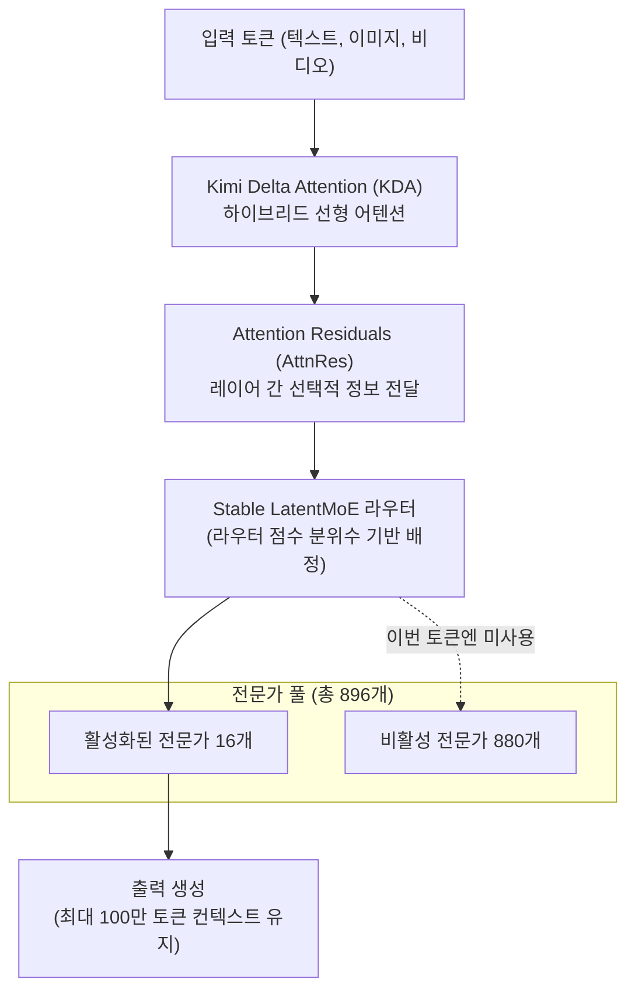
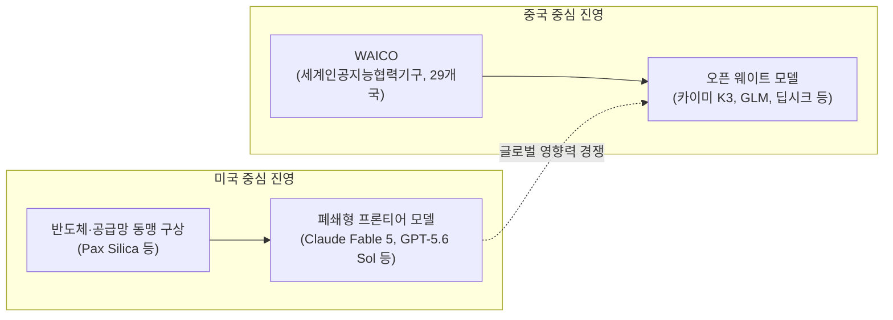

- **문서 작성일: 2026-07-18**
- **다루는 시점: 2026년 7월 16일~18일 (상하이 세계인공지능대회 전후)**

## 관련영상

[**Is This the Biggest AI Release of 2026? (China’s New DeepSeek Moment)**](https://www.youtube.com/watch?v=V0RsocRqjIU)

---

## 목차

1. 이 사건을 한 문장으로 요약하면
2. 카이미 K3란 무엇인가 — 모델 사양과 아키텍처
3. 벤치마크로 확인된 실제 성능
4. Moonshot이 공개한 자체 시연들 — 사실과 주장의 경계
5. 모델의 약점과 한계, 그리고 "오픈소스"라는 표현의 함정
6. 시장은 왜 이렇게 민감하게 반응했나
7. 배경이 되는 갈등: Anthropic의 증류(distillation) 의혹 제기
8. 시진핑의 상하이 연설과 WAICO — 새로운 세계 AI 질서 구상
9. 중국 내부의 경쟁 구도: 미니맥스, 지푸, 딥시크
10. 종합 평가 — 확인된 사실과 아직 지켜봐야 할 것
11. 참고 자료

---

## 1. 이 사건을 한 문장으로 요약하면

2026년 7월 16일, 중국 베이징에 본사를 둔 스타트업 Moonshot AI가 2.8조(2.8 trillion) 개 파라미터를 가진 오픈 웨이트 모델 "카이미 K3(Kimi K3)"를 공개했다. 이 모델은 지금까지 나온 오픈 웨이트 AI 모델 가운데 가장 큰 규모이며, 독립 평가 기관인 Artificial Analysis와 개발자 투표 기반 벤치마크인 Arena에서 앤트로픽의 Claude Opus 4.8을 넘어서고 일부 항목에서는 최상위권 폐쇄형 모델인 Claude Fable 5, GPT-5.6 Sol에도 근접하거나 특정 영역에서는 이를 앞서는 결과를 냈다. 이 발표는 시진핑 중국 국가주석이 상하이에서 열린 2026 세계인공지능대회(WAIC) 개막식에서 새로운 국제 AI 협력 기구(WAICO) 출범을 선언하고, 개방형 AI를 통한 새로운 국제 질서를 제안한 시점과 거의 동시에 이루어졌다. 이 문서는 카이미 K3의 실제 사양과 검증 가능한 벤치마크 결과, 시장의 반응, 그리고 이 사건을 둘러싼 지정학적 맥락을 최신 보도를 바탕으로 정리한 것이다.

---

## 2. 카이미 K3란 무엇인가 — 모델 사양과 아키텍처

### 2-1. 기본 사양

Moonshot AI는 카이미 K3를 2026년 7월 16일 카이미 웹사이트, 데스크톱 앱, 코딩 도구인 Kimi Code, 그리고 API를 통해 순차적으로 공개했다. 전작인 카이미 K2.6이 약 1조 개 파라미터였던 것과 비교하면 약 2.8배 커진 규모다. 회사 측은 이를 두고 "세계 최초의 오픈 3조급(3T-class) 모델"이라고 표현했는데, 이는 2.8조를 반올림한 표현이다.

핵심 사양을 정리하면 다음과 같다.

| 항목 | 내용 |
|---|---|
| 총 파라미터 수 | 약 2.8조 개 |
| 활성 전문가 수 | 896개 중 16개 (약 1.8%) |
| 컨텍스트 윈도우 | 최대 1,048,576토큰 (약 100만 토큰) |
| 멀티모달 지원 | 텍스트, 이미지, 비디오 네이티브 이해 |
| 가중치 형식 | MXFP4(가중치) / MXFP8(활성화) 저정밀도 양자화 |
| 추론 모드 | 출시 시점에는 "max"(최대 사고) 단일 모드만 제공, 저·고효율 모드는 추후 업데이트 예정 |
| 전체 가중치 공개 예정일 | 2026년 7월 27일 |

카이미 K3는 이전 세대 대비 21% 적은 출력 토큰으로 동등한 과제를 처리한다고 Moonshot은 밝혔으며, 학습 및 서빙 효율 면에서 K2 대비 약 2.5배의 스케일링 효율 개선을 달성했다고 주장하고 있다.

### 2-2. 새로운 아키텍처: Kimi Delta Attention과 Attention Residuals

카이미 K3는 두 가지 자체 개발 구조를 새로 도입했다.

- **Kimi Delta Attention(KDA)**: 하이브리드 선형 어텐션 메커니즘으로, 100만 토큰급의 초장문 컨텍스트에서 최대 6.3배 빠른 디코딩 속도를 낸다고 회사는 설명한다.
- **Attention Residuals(AttnRes)**: 기존의 잔차 연결(residual connection)을 대체하는 방식으로, 레이어(깊이) 방향으로 정보를 균일하게 누적하는 대신 필요한 표현만 선택적으로 끌어오는 구조다. 이를 통해 약 2% 미만의 추가 비용으로 약 25%의 학습 효율 향상을 얻었다고 밝혔다.

전문가 라우팅에는 "Stable LatentMoE"라는 방식이 쓰이는데, 라우터 점수의 분위수(quantile)를 기준으로 전문가 배정을 결정해 별도의 균형 조정 하이퍼파라미터 없이도 안정적인 라우팅이 가능하도록 설계됐다고 한다. 또한 어텐션 헤드를 독립적으로 최적화하는 "Per-Head Muon"이라는 옵티마이저 기법도 함께 적용됐다.

아래는 이 구조를 단순화한 흐름이다.

이 구조 덕분에 카이미 K3는 2.8조 개라는 총 파라미터 규모에도 불구하고 실제 한 번의 추론에서 활성화되는 파라미터 비중은 전체의 극히 일부에 그쳐, 추론 비용을 상대적으로 낮게 유지할 수 있다.

### 2-3. 가격 정책

카이미 K3의 API 가격은 다음과 같다. 이 가격은 컨텍스트 길이와 무관하게 동일하게 적용된다.

| 모델 | 입력(캐시 미스) | 입력(캐시 히트) | 출력(추론 토큰 포함) |
|---|---|---|---|
| Kimi K3 | 100만 토큰당 3달러 | 100만 토큰당 0.30달러 | 100만 토큰당 15달러 |
| Claude Fable 5 | 100만 토큰당 약 10달러 | — | 100만 토큰당 약 50달러 |
| GPT-5.6 Sol | 100만 토큰당 약 0.50달러 | — | 100만 토큰당 약 30달러 |

카이미 K3는 전작인 K2 계열(입력 100만 토큰당 0.60달러 수준)보다는 5배가량 비싸졌지만, 여전히 서구권 최상위 모델 대비로는 저렴한 가격대를 유지하고 있다. 다만 GPT-5.6 Sol과 비교하면 오히려 더 비싼 편이며, 이는 중국 AI 랩이 내놓은 모델 중 가장 높은 가격대라는 평가를 받는다. Artificial Analysis가 산정한 실제 작업당(per-task) 비용 기준으로는 카이미 K3가 0.94달러, GPT-5.6 Sol이 1.04달러, Claude Opus 4.8이 1.80달러로, 단순 토큰 단가보다는 작업당 비용에서 카이미 K3의 가격 경쟁력이 더 두드러진다.

---

## 3. 벤치마크로 확인된 실제 성능

### 3-1. Artificial Analysis Intelligence Index (v4.1)

독립 평가 기관 Artificial Analysis는 GDPval-AA v2, τ²-Banking, Terminal-Bench v2.1, SciCode, Humanity's Last Exam, GPQA Diamond, CritPt, AA-Omniscience, AA-LCR 등 9개 평가를 종합한 지수를 산출한다. 이 지수에서 카이미 K3는 57.1점을 받아 전체 모델 중 4위(사실상 모델 계열 기준으로는 3위)를 기록했다.

| 순위 | 모델 | 지수 점수 | 개발사 |
|---|---|---|---|
| 1 | Claude Fable 5 (Opus 4.8 폴백) | 약 59.9 | Anthropic |
| 2 | GPT-5.6 Sol | 약 58.9 | OpenAI |
| 3~4 | Kimi K3 | 약 57.1 | Moonshot AI |
| 4~5 | Claude Opus 4.8 | 약 56 | Anthropic |
| — | Grok 4.5 | 약 54 | xAI |
| — | Claude Sonnet 5 | 약 53 | Anthropic |
| — | GLM-5.2 | 약 51 | Z.ai |
| — | DeepSeek V4 Pro | 약 44 | DeepSeek |

주목할 점은, 아직 전체 가중치가 공개되지 않은 카이미 K3를 오픈 웨이트 모델로 분류할 경우, 공개 예정대로 가중치가 나오는 순간 GLM-5.2(51점), DeepSeek V4 Pro(44점) 등 기존 오픈 웨이트 모델을 큰 격차로 제치고 오픈 웨이트 부문 1위에 오르게 된다는 점이다. 다만 카이미 K3는 파라미터 규모(2.8조) 자체가 GLM-5.2(약 7,530억)나 DeepSeek V4 Pro(약 1.6조)보다 훨씬 커서, 단순히 동일 선상에서 비교하기는 어렵다는 지적도 있다.

전작 카이미 K2.6은 지난 4월 공개 당시 이전 버전의 지수 기준으로 54점을 받았는데, 이후 지수 자체가 개정되며 채점 기준이 달라졌기 때문에 두 세대를 지수 점수만으로 직접 비교하기는 조심스럽다.

세부 평가 중에서는 다음 결과들이 확인된다.

- **GDPval-AA v2** (실제 업무 과제를 인간 기준 1,000점에 맞춰 평가): 카이미 K3 1,668점으로, K2.6의 1,190점 대비 큰 폭으로 상승했다. GLM-5.2(1,514점), GPT-5.5(1,494점), Claude Opus 4.8(1,600점)을 앞섰으나 Claude Fable 5(1,760점)에는 못 미쳤다.
- **AA-Briefcase** (장시간 에이전틱 지식노동을 평가하는 비공개 벤치마크): 카이미 K3 1,547점으로 K2.6 대비 732점 상승했으며, Claude Fable 5에 이어 2위를 기록했다.
- **AutomationBench-AA** (Zapier의 에이전틱 SaaS 워크플로 평가를 재구현한 벤치마크): 카이미 K3가 53%의 성공률로 1위를 차지했다.

### 3-2. Arena 프런트엔드 코드 아레나(Code Arena | WebDev)

개발자들이 실제로 웹사이트나 인터페이스를 만들도록 요청한 뒤 결과물을 비교 투표하는 Arena의 프런트엔드 코드 리더보드에서, 카이미 K3는 공개 즉시 1위에 올랐다. 2026년 7월 16일 기준 순위는 다음과 같다(카이미 K3의 순위는 "Preliminary(잠정)" 표기가 붙어 있었다).

| 순위 | 모델 | 점수(Elo) | 개발사 |
|---|---|---|---|
| 1 | Kimi K3 (잠정) | 1,679 | Moonshot AI |
| 2 | Claude Fable 5 | 1,631 | Anthropic |
| 3 | GPT-5.6 Sol (codex-harness) | 1,618 | OpenAI |
| 4 | GLM-5.2 (max) | 1,587 | Z.ai |
| 5 | Claude Opus 4.8 (thinking) | 1,562 | Anthropic |
| 6 | Grok-4.5 | 1,558 | xAI |
| 13 | Claude Opus 4.8 | 1,534 | Anthropic |
| 14 | Seed-2.1-pro-preview | 1,534 | ByteDance |
| 15 | GLM-5.1 | 1,526 | Z.ai |
| 16 | Claude Sonnet 4-6 | 1,522 | Anthropic |
| 17 | Qwen3.7-max | 1,516 | Alibaba |
| 18 | Kimi K2.6 | 1,515 | Moonshot AI |
| 19 | Gemini-3.5-flash | 1,504 | Google |
| 20 | GPT-5.5-xhigh (codex-harness) | 1,504 | OpenAI |
| 21 | MiniMax-M3 | 1,493 | MiniMax |

전작인 카이미 K2.6이 같은 리더보드에서 18위(1,515점)였던 것과 비교하면, K3는 한 세대 만에 17계단을 뛰어올라 1위(1,679점)에 오른 셈이다. 세부적으로는 브랜드·마케팅, 참조 기반 디자인, 데이터·분석, 소비자 제품, 콘텐츠 제작 도구 등 7개 평가 영역 중 6개 영역에서 1위를 차지했고, 게임(Gaming) 영역에서만 Claude Fable 5에 뒤져 2위를 기록했다.

Arena의 최고경영자인 아나스타시오스 니콜라스 앙겔로풀로스는 자신의 X 계정에 이번 결과를 두고 "올해 가장 큰 릴리스일 수 있다(This may be the single biggest release of the year)"는 평가를 남기며, 이를 오픈소스 중국 모델이 미국 모델을 넘어선 순간이라고 표현했다. 다만 이는 어디까지나 개인 의견이며, Arena라는 하나의 플랫폼, 그중에서도 프런트엔드 코딩이라는 특정 영역의 결과에 기반한 발언이라는 점은 유의할 필요가 있다.

이와는 별개로, 코딩 특화 벤치마크인 BridgeBench에서도 카이미 K3가 8개 영역 중 7개에서 Claude Fable 5를 이겼고 Fable 5가 유일하게 앞선 영역은 속도(Speed)였다는 보도가 있다. 다만 이는 Arena의 프런트엔드 코드 리더보드와는 별개의 평가 체계이므로 혼동하지 않아야 한다.

### 3-3. 종합 평가

Moonshot 스스로도 카이미 K3가 전반적인 사용자 경험 측면에서는 Claude Fable 5와 GPT-5.6 Sol에 미치지 못한다는 점을 인정하고 있다. Artificial Analysis 역시 전체 지수에서는 카이미 K3가 3~4위에 해당하며, 1~2위인 Fable 5, GPT-5.6 Sol과의 격차가 2~3점 수준으로 좁혀졌다고 평가했다. 즉 카이미 K3는 "모든 영역에서 최고"인 모델이 아니라, "오픈 웨이트라는 조건 아래에서 최상위 폐쇄형 모델에 근접했고, 특정 코딩 영역에서는 이를 넘어선" 모델로 요약하는 것이 정확하다.

---

## 4. Moonshot이 공개한 자체 시연들 — 사실과 주장의 경계

Moonshot은 카이미 K3의 발표 과정에서 여러 시연 사례를 공개했다. 이 사례들은 회사 측이 직접 소개한 내용이며, 이 문서 작성 시점까지 제3자의 독립적인 재현이나 검증 결과는 확인되지 않았다는 점을 먼저 밝힌다.

- 브라우저 안에서 Three.js, WebGPU, GPU 컴퓨트를 활용해 3D 오픈월드 게임을 생성했고, 별도 도구를 동원해 게임 속 캐릭터(라이더와 말)를 만들었다고 소개했다.
- 중국의 창정(長征) 10호 로켓 시뮬레이션과 게임보이 어드밴스 에뮬레이터를 구현한 사례를 공개했다.
- 15시간에 걸쳐 GPU 커널 코드를 반복 개선하며 순전파·역전파 처리 시간을 283.6밀리초에서 114.4밀리초로 절반 이상 단축했다고 밝혔다. 이 과정에서 두 단계로 구성된 새로운 커널 알고리즘을 설계하고, 동일한 수치 연산 결과를 유지하면서 커널을 통합했다고 설명했다.
- "미니 트라이톤(Mini Triton)"이라는 소규모 GPU 컴파일러를 처음부터 직접 만들었고, 오픈소스 엔지니어링 도구만으로 48시간 만에 작동하는 칩 설계를 완료했다고 주장했다.
- 천체물리학 분석을 약 2시간 만에 재현했다고 밝혔는데, 이 과정에서 20편 이상의 논문을 검토하고 3,000줄 이상의 파이썬 코드를 작성했으며, 숙련된 연구팀이라면 통상 1~2주가 걸릴 작업이라고 설명했다.
- 56개의 클립을 편집해 자체 홍보 영상을 만드는 데도 모델을 활용했다고 밝혔다.

Moonshot은 이런 능력을 "비전 인 더 루프(vision in the loop)"라고 이름 붙였는데, 모델이 코드를 작성한 뒤 그 결과 화면을 스스로 보고, 잘못된 부분을 인지해 코드를 수정하고, 다시 확인하는 과정을 반복하는 방식을 의미한다. 이는 웹사이트, 게임, 디자인 도구, 애니메이션처럼 결과물의 시각적 완성도를 직접 확인해야 하는 작업에 유용하다는 것이 회사 측 설명이다.

이런 시연들은 카이미 K3가 장시간 자율적으로 작업을 수행하도록 설계됐다는 회사의 목표를 보여주는 사례이지만, 어디까지나 회사가 선정해 공개한 성공 사례라는 한계가 있다. 폭넓은 제3자 검증이 이루어지기 전까지는 "가능성을 보여주는 시연"과 "일반적으로 재현 가능한 성능"을 구분해서 받아들일 필요가 있다.

---

## 5. 모델의 약점과 한계, 그리고 "오픈소스"라는 표현의 함정

Moonshot 스스로 인정한 한계와 독립 매체가 보도한 문제점은 다음과 같다.

- **환각(hallucination) 문제**: 한 매체는 카이미 K3의 환각률이 51%에 달한다고 보도했다. 다른 분석에서는 정확도가 K2.6의 33%에서 약 46%로 올랐지만 동시에 환각률도 함께 상승했다고 전해, 정확도 향상과 환각 증가가 동시에 나타나는 경향이 지적됐다.
- **추론 이력 손실 시 성능 저하**: 에이전트 시스템이 모델의 전체 추론 과정(reasoning history)을 온전히 되돌려주지 못하는 경우 성능이 떨어질 수 있다고 회사는 밝혔다.
- **모호한 지시에 대한 임의 판단**: 지시가 불명확할 경우 모델이 스스로 판단해 결정을 내리는 경향이 있어, 엄격한 통제가 필요한 사용자는 매우 명확한 규칙을 설정해야 한다고 회사는 권고했다.
- **추론 토큰 소모량**: 초기 독립 테스트에서는 단순한 SVG 이미지 하나를 생성하는 데도 13,241개의 추론 토큰을 소모해 약 0.25달러의 비용이 들었다는 사례가 보고됐다. 출시 시점에 추론 강도가 "최대(max)" 단일 모드로 고정되어 있었던 점이 이런 비용 구조의 배경으로 지목된다.
- **평가 조건의 비일관성**: Moonshot이 공개한 자체 벤치마크는 KimiCode, Claude Code, Codex 등 서로 다른 하니스(harness) 환경에서 수집된 결과를 함께 제시했다는 지적이 있어, 동일한 조건에서 비교된 결과가 아니라는 점도 유의할 부분이다.

또한 "오픈소스"라는 표현 자체에 대해서도 신중한 접근이 필요하다. 여러 매체가 카이미 K3를 오픈소스 모델로 지칭하고 있지만, 이 문서 작성 시점(가중치 공개 예정일인 7월 27일 이전)까지는 실제 라이선스 조건을 명시한 파일이나 저장소가 공개되지 않은 상태였다는 지적이 있다. 전작인 카이미 K2 계열이 수정된 MIT 라이선스(Modified MIT License)로 공개된 전례가 있어 유사한 방식이 예상되지만, 정식 라이선스 문서가 나오기 전까지 "오픈소스"라는 단정적 표현은 예상에 근거한 것임을 분명히 해 둘 필요가 있다.

가중치가 공개되더라도 이를 직접 자체 호스팅해서 운용하는 일은 일반적인 의미의 "다운로드해서 노트북에서 돌리는" 수준과는 거리가 멀다. Moonshot은 서빙을 위해 최소 64개의 AI 가속기로 구성된 슈퍼노드급 인프라를 권장하고 있으며, 전작인 1조 파라미터급 카이미 K2.7 Code조차 INT4 양자화 기준으로 약 577GB의 VRAM이 필요했던 점을 고려하면, 2.8조 파라미터인 K3는 이보다 훨씬 많은 자원을 필요로 할 것으로 분석되고 있다. 결국 "가중치가 공개된다"는 것이 곧 "누구나 직접 돌릴 수 있다"는 의미는 아니며, 실제로는 이를 서비스로 제공하는 추론 인프라 업체들을 통해 접근하는 경우가 대다수를 차지할 가능성이 높다.

---

## 6. 시장은 왜 이렇게 민감하게 반응했나

카이미 K3 공개 당일(미국 동부시간 기준 7월 17일), 미국 증시와 아시아 증시 모두 하락했다. 확인된 수치는 다음과 같다.

- 나스닥 지수 1.4% 하락, S&P500 지수 1% 하락, 다우존스 지수 407포인트(0.77%) 하락.
- 엔비디아 주가는 이날 2% 이상 하락했으며, 한때 시가총액이 4조 8,500억 달러까지 내려가 애플에 시가총액 1위 자리를 다시 내주기도 했다.
- 대만 가권지수는 6% 넘게, 일본 니케이지수는 4% 하락 마감했다. 다만 한국 증시는 이날 국경일로 휴장이었다.
- 대만 TSMC는 분기 영업이익이 77% 증가했다는 실적 발표에도 불구하고 주가가 7% 하락했다.
- 소프트뱅크(오픈AI의 주요 투자자로 여겨지는 기업) 주가는 9% 하락했다.
- 메타 주가는 2.4% 넘게 하락했다.

이와 별개로, 카이미 K3 발표 시점은 6월 22일 이후 이어진 반도체 업종의 장기 조정 국면과 겹쳤다. 필라델피아 반도체 지수(SOX)는 이날 하루 최대 5.7% 급락했고, 6월 저점 대비로는 20% 넘게 떨어져 기술적 약세장(bear market) 진입 기준을 충족했다는 보도가 있다. 6월 22일 이후 전 세계 반도체 관련 종목의 시가총액이 약 3조 3천억 달러 증발했다는 분석도 나왔다. 다만 이 조정 국면은 넷플릭스와 TSMC의 부진한 실적 우려, 중동 정세 불안, 금리 우려 등 여러 요인이 겹친 "다인과적(multi-causal)" 성격이 강하며, 카이미 K3는 그 여러 촉매 중 하나로 지목된다는 점을 여러 매체가 함께 지적하고 있다.

투자자들 사이에서는 2025년 초 딥시크(DeepSeek)가 저비용·고성능 모델을 공개하며 촉발했던 이른바 "딥시크 모먼트"와의 유사성이 즉각 거론됐다. 다만 시장 참여자들의 시각은 엇갈린다. 데이비드 색스 백악관 AI·가상자산 정책 고문은 이번 결과를 "우려스럽다"고 평가하며, 그 원인을 데이터센터 신규 건설을 막는 규제나 프론티어 모델에 대한 사전 승인제 논의 같은 미국 내부 정책으로 돌렸다. 반면 애트레이즈 매니지먼트의 개빈 베이커 최고투자책임자는 카이미 K3가 추론 마진이 90%에 달하는 것으로 알려진 모델 개발사들에는 타격이 되겠지만, 그 밖의 거의 모든 기업에는 오히려 순이익이 될 수 있다는 시각을 내놓기도 했다.

중국 내 경쟁사들의 주가도 함께 흔들렸다. 지푸(Z.ai, GLM 시리즈 개발사) 주가는 홍콩 증시에서 크게 하락했는데, 보도에 따라 하락폭이 다르게 집계되어 있어(한 매체는 거의 30% 급락으로, 다른 자료는 이보다 낮은 수치로 보도) 정확한 단일 수치를 특정하기는 조심스럽다. 미니맥스(MiniMax) 주가 역시 하락세를 보였다는 보도가 있다.

한 애널리스트는 이번 급락을 완전히 새로운 충격이라기보다는 "예상 가능했던 추세의 연장선"으로 평가하기도 했다. 실제 가중치가 공개된 뒤 벤치마크 주장이 재현되는지 여부가, 이번 시장 반응이 과잉 반응이었는지 정당한 반응이었는지를 가를 다음 분수령이 될 것으로 보인다.

---

## 7. 배경이 되는 갈등: Anthropic의 증류(distillation) 의혹 제기

카이미 K3 발표를 이해하려면, 이보다 약 5개월 앞선 2026년 2월에 있었던 별도의 사건을 함께 짚어야 한다. 이는 카이미 K3와 같은 시점에 일어난 사건이 아니라, 이번 발표를 둘러싼 갈등의 배경이 되는 이전 사건이라는 점을 먼저 분명히 해 둔다.

2026년 2월 하순, Anthropic은 자사 블로그를 통해 딥시크(DeepSeek), Moonshot AI, 미니맥스(MiniMax) 세 곳의 중국 AI 연구소가 "산업적 규모(industrial-scale)"의 증류 공격을 벌였다고 공개적으로 밝혔다. Anthropic에 따르면 이 세 곳은 약 24,000개의 부정 생성 계정을 통해 Claude와 1,600만 건이 넘는 상호작용을 만들어냈으며, 이는 자사의 서비스 약관과 지역별 접근 제한을 위반한 것이라고 주장했다.

증류(distillation)는 더 약한 모델이 더 강한 모델의 출력을 학습해 성능을 끌어올리는, 업계에서 널리 쓰이는 정당한 기법이다. 프론티어 연구소들도 자사의 대형 모델을 활용해 더 작고 저렴한 버전을 만들 때 이 기법을 일상적으로 사용한다. Anthropic 역시 이 점을 인정하면서도, 경쟁사가 승인 없이 타사 모델의 능력을 빠르게 흡수하는 데 이 기법을 악용할 경우 문제가 된다고 주장했다.

Anthropic이 공개한 세부 내용에 따르면, 이 가운데 미니맥스가 1,300만 건이 넘는 상호작용으로 가장 큰 비중을 차지했고, Moonshot AI는 340만 건이 넘는 상호작용을 통해 에이전틱 추론, 도구 사용, 코딩, 데이터 분석, 컴퓨터 사용 에이전트 개발, 컴퓨터 비전 등을 집중적으로 겨냥했다고 설명했다. 일부 요청은 Claude의 추론 과정(chain-of-thought)을 단계별로 서술하도록 유도해, 그 추론 흔적 자체를 학습 데이터로 대량 수집하려 한 정황이 있었다고도 밝혔다. Anthropic은 요청 메타데이터를 공개된 프로필과 대조하는 방식으로 일부 계정을 Moonshot의 고위 직원들과 연결지을 수 있었다고 주장했다.

이 사건은 미·중 AI 경쟁이 기술 성능뿐 아니라 데이터·지적재산 문제로도 확장되고 있음을 보여주는 사례로 꼽힌다. 다만 이런 주장에 대해, 미국 AI 기업들 스스로도 공개 인터넷의 방대한 데이터를 학습에 활용해왔다는 점에서 "다른 회사가 자사 모델에서 배우는 것에 화를 내는 것은 이율배반적"이라는 비판도 함께 제기되고 있다. 카이미 K3의 전체 가중치가 예정대로 공개되면, 외부 연구자들이 처음으로 이 모델의 내부 구조와 토크나이저 중복도를 직접 들여다볼 수 있게 되는데, 이것이 증류 여부에 대한 논쟁을 완전히 종식시키지는 못하더라도 최소한 검증 가능한 근거를 일부 제공할 것으로 보인다.

---

## 8. 시진핑의 상하이 연설과 WAICO — 새로운 세계 AI 질서 구상

카이미 K3 발표 다음 날인 2026년 7월 17일, 시진핑 중국 국가주석은 상하이에서 열린 2026 세계인공지능대회(WAIC) 및 글로벌 AI 거버넌스 고위급회의 개막식에서 기조연설을 했다. 이는 2018년 WAIC가 시작된 이후 시 주석이 이 행사에 직접 참석해 연설한 첫 사례였다.

연설 전날인 7월 16일에는 29개국이 참여하는 세계인공지능협력기구(World Artificial Intelligence Cooperation Organization, WAICO)의 설립 협정이 체결됐다. 이 기구는 상하이에 본부를 두는 정부 간 국제기구로, 시 주석은 이를 "세계 AI 발전 역사에서 하나의 이정표"라고 표현했다. 그는 연설에서 AI 발전이 어느 한 국가의 "독주(solo performance)"가 되어서는 안 되며 국제 협력의 "교향곡(symphony)"이 되어야 한다고 강조했다.

시 주석은 앞으로 5년간 개발도상국에 5,000개의 AI 교육·연수 기회를 제공하겠다고 밝혔으며, 아세안(ASEAN), 아랍연맹, 아프리카연합, 라틴아메리카·카리브해국가공동체, 상하이협력기구, 브릭스(BRICS)와 함께 국제 AI 응용 협력센터를 구축하겠다고 발표했다. 또한 AI 기반 기상 경보 시스템인 "마주(MAZU)"를 30개국이 활용할 수 있도록 지원하겠다고도 언급했다.

동시에 그는 AI가 인간의 통제 아래 있어야 한다는 점도 강조하며, 조기 경보 체계와 비상 대응 계획, 그리고 자율 시스템이 인간의 감독을 벗어나는 상황에 대한 대비가 필요하다고 말했다. 즉 중국은 스스로를 개방적 AI 접근을 제공하는 국가인 동시에, 안전과 글로벌 표준 논의를 함께 주도하려는 국가로 자리매김하려는 모습을 보이고 있다.

이 발표들은 미국이 주도해온 반도체 공급망·핵심광물 협력 구상(이른바 "팍스 실리카", Pax Silica)에 대한 사실상의 대응 성격을 띠고 있다는 분석이 많다. 시 주석은 연설에서 미국을 직접 거명하지는 않았지만, 어느 한 국가가 자국의 안보 이익을 다른 나라의 이익보다 앞세워서는 안 된다고 경고하며 개방·협력·공유의 원칙을 촉구했다. 알자지라 등 외신은 이를 미국을 겨냥한 간접적인 메시지로 해석했다.

아래는 이 구도를 단순화한 그림이다.

이번 발표는 미·중 정부 간 AI 관련 대화가 논의되는 시점과도 맞물려 있다. 2026년 5월 있었던 트럼프-시진핑 정상회담을 계기로 양국은 AI 안전 분야에 대한 대화 채널을 원칙적으로 검토하기로 한 바 있으며, 이후 양측 외교 당국이 AI의 안전한 개발에 관한 논의를 시작하기로 합의했다고 밝힌 사실이 확인된다. 다만 그 대화가 구체적으로 언제, 어떤 형식으로 시작될지는 이 문서 작성 시점까지 명확히 확정되지 않은 상태다. 이런 배경 속에서 카이미 K3의 발표와 WAICO 출범이 겹친 시점은, 협상 테이블에 오르기 전 중국이 자국의 기술적 협상력을 대내외에 과시하려는 의도로 해석하는 시각도 있다.

세계AI대회에는 유엔 사무총장 안토니우 구테흐스, 카자흐스탄의 카심조마르트 토카예프 대통령, 태국의 아누틴 차른비라쿤 총리 등이 참석했으며, 행사는 7월 17일부터 20일까지 진행된다.

---

## 9. 중국 내부의 경쟁 구도: 미니맥스, 지푸, 딥시크

카이미 K3는 고립된 사건이 아니라, 중국 AI 업계 전반에서 진행 중인 초대형 모델 경쟁의 가장 최신 사례에 가깝다.

- **미니맥스(MiniMax)**: 로이터의 단독 보도에 따르면, 미니맥스는 2.7조 개 파라미터 규모의 모델을 개발 중이며 이르면 2026년 3분기 중 공개될 수 있다. 실현될 경우 이는 중국 기업이 내놓는 오픈 웨이트 모델 중 최대 규모이자, 세계에서 가장 큰 모델 중 하나가 될 가능성이 있다고 로이터는 전했다. 이 모델은 사내에서는 "M3 Pro"로 불리고 있으며 최종 명칭은 바뀔 수 있다고 알려졌다. 미니맥스는 또한 이달 안에 프론티어급 멀티모달 영상 생성 모델인 "H3"도 출시할 계획인 것으로 전해졌다. 미니맥스는 지난 1월 홍콩에서 약 6억 1,400만 달러 규모의 기업공개(IPO)를 진행했으며, 상하이 스타마켓 추가 상장도 계획 중인 것으로 보도됐다.
- **지푸(Z.ai, GLM 시리즈)**: GLM-5.2 모델이 최근 미국 최상위 폐쇄형 모델에 근접하는 성적을 내며 업계를 놀라게 했다는 평가를 받고 있다. 파라미터 규모는 약 7,530억 개 수준으로 카이미 K3보다는 작다.
- **딥시크(DeepSeek)**: V4 Pro 모델이 약 1.6조 개 파라미터 규모로, 메이투안의 LongCat-2.0(약 1.6조 개)과 함께 카이미 K3 이전까지 중국 최대급 모델 중 하나로 꼽혀 왔다.

Moonshot AI 자체도 알리바바, 텐센트, 메이투안의 투자를 받고 있으며, 최근 약 20억 달러 규모의 신규 투자 라운드를 통해 기업가치를 약 300억~315억 달러 수준으로 인정받으려 하고 있다는 보도가 있다. 이는 지난 5월 알리바바로부터 10억 달러를 투자받았을 당시의 기업가치(약 25억 달러)에서 크게 뛴 수치다. 이런 대형 투자 유치 시도는 카이미 K3의 성과를 대외적으로 부각시켜야 할 상업적 유인과도 맞물려 있다는 점을 감안할 필요가 있다.

이처럼 여러 중국 AI 연구소가 1조 개 파라미터 이상 규모의 모델을 앞다투어 내놓는 흐름은, 복잡한 다단계 작업을 사람의 개입 없이 자율적으로 수행하는 에이전틱 시스템을 구축하기 위해서는 이런 규모의 문턱이 중요하다는 업계 분석과 맞닿아 있다.

---

## 10. 종합 평가 — 확인된 사실과 아직 지켜봐야 할 것

**비교적 확실하게 확인된 사실**

- 카이미 K3는 2026년 7월 16일 공개된 2.8조 파라미터 규모의 Mixture-of-Experts 모델이며, 현재까지 나온 오픈 웨이트(예정) AI 모델 중 최대 규모다.
- Artificial Analysis Intelligence Index에서 57.1점을 받아 Claude Opus 4.8(약 56점)을 앞섰고, Claude Fable 5(약 59.9점), GPT-5.6 Sol(약 58.9점)에는 근소하게 못 미쳤다.
- Arena의 프런트엔드 코드 리더보드에서 1,679점으로 1위에 올라 Claude Fable 5(1,631점), GPT-5.6 Sol(1,618점)을 앞섰다. 다만 이 순위는 발표 시점에 "잠정(Preliminary)" 표기가 붙어 있었다.
- 발표 당일 미국 반도체·AI 관련 주식과 아시아 증시가 하락했으며, 이는 이미 진행 중이던 반도체 업종의 조정 국면과 겹쳐 나타난 다인과적 현상으로 평가된다.
- Anthropic은 2026년 2월, 딥시크·Moonshot·미니맥스 세 곳이 대규모 증류 공격을 벌였다고 공개 비판한 바 있다. 이는 카이미 K3 발표보다 약 5개월 앞선 별개의 사건이다.
- 시진핑 주석은 카이미 K3 발표 다음 날인 7월 17일 상하이에서 WAICO 출범을 알리고 개방형 AI에 기반한 국제 협력을 제안하는 연설을 했다.

**아직 검증이 더 필요하거나 논쟁의 여지가 있는 부분**

- 카이미 K3의 전체 가중치는 이 문서 작성 시점까지 공개되지 않았으며, 공식 라이선스 문서도 게시되지 않은 상태였다. 예정된 공개일(7월 27일) 이후 실제 조건을 확인할 필요가 있다.
- Moonshot이 공개한 3D 게임, 로켓 시뮬레이션, 칩 설계, 천체물리 분석 재현 등의 시연은 회사가 직접 선정해 공개한 사례로, 독립적인 제3자 재현 검증은 아직 확인되지 않았다.
- 환각률(최대 51% 보도)과 관련한 수치는 매체별로 표현이 다소 엇갈리며, 어떤 평가셋을 기준으로 한 수치인지 명확히 통일되어 있지 않다.
- 시장 하락폭 중 카이미 K3만의 순수한 기여분을 정확히 분리해내기는 어렵다. 여러 매체가 이번 조정이 다인과적이라는 점을 강조하고 있다.
- 카이미 K3가 실제로 "미국이 AI 경쟁에서 뒤처졌다"는 것을 의미하는지에 대해서는 전문가들 사이에서도 견해가 엇갈린다. 일부는 이번 결과를 지난해 딥시크 사례와 유사한 일시적 충격으로 보는 반면, 다른 이들은 중국 오픈 웨이트 모델이 이제 특정 영역에서는 명확히 프론티어급에 도달했다는 구조적 신호로 해석한다.

이런 점들을 종합하면, 카이미 K3는 오픈 웨이트 모델의 성능이 최상위 폐쇄형 모델과의 격차를 눈에 띄게 좁혔다는 것을 보여주는 구체적 사례임과 동시에, 그 구체적 의미와 파급력에 대해서는 가중치 공개 이후의 독립적 검증과 시간을 두고 판단해야 할 사안이라고 볼 수 있다.

---

## 11. 참고 자료

- Moonshot AI, "Moonshot AI Releases Kimi K3, a 2.8-Trillion-Parameter Open-Weight Model Rivaling Top U.S. Systems", MLQ News, 2026-07-17
- MarkTechPost, "Moonshot AI Releases Kimi K3: A 2.8 Trillion Parameter Open MoE Model With Kimi Delta Attention and 1M Context", 2026-07-16
- Winbuzzer, "Moonshot AI Unveils 2.8T-Parameter Kimi K3 AI Model", 2026-07-17
- VentureBeat, "China's Moonshot AI releases Kimi K3, the largest open-source model ever, rivaling top U.S. systems", 2026-07-16
- Tom's Hardware, "China's 2.8-trillion-parameter Kimi K3 beats Claude Fable 5 in Frontend Code Arena benchmark", 2026-07-17
- Simon Willison, "Kimi K3, and what we can still learn from the pelican benchmark", 2026-07-16
- BigGo Finance, "Moonshot Unveils 2.8 Trillion Parameter 'Kimi K3', Mounting a Direct Challenge to Anthropic", 2026-07-17
- Artificial Analysis, "Kimi K3 achieves #3 in the Artificial Analysis Intelligence Index, comparable to Opus 4.8 and GPT-5.5", 2026-07-17 (artificialanalysis.ai/articles)
- Officechai, "Kimi K3 Places Third, Right Behind Fable 5 And GPT 5.6 Sol On Artificial Analysis Intelligence Index", 2026-07-17
- Techloy, "Kimi K3 Beats Claude Opus 4.8, But Not Fable 5 or GPT 5.6 Sol", 2026-07-17
- The Decoder, "Kimi's open model K3 nears GPT-5.6 Sol and Fable 5 while signaling the end of super cheap Chinese AI", 2026-07-17
- SiliconANGLE, "China's Moonshot throws down the gauntlet with Kimi K3, the world's largest open-weights model", 2026-07-16
- Gizmodo, "China Just Dropped Another Bomb on America's Frontier AI Companies", 2026-07-17
- Decrypt, "China's Kimi K3 Is Out—And Beats Claude Fable and GPT 5.6 Sol on Key Benchmarks", 2026-07-17
- R&D World Online, "China's Kimi K3 comes close to Fable benchmarks at one-third the token price", 2026-07-17
- CryptoBriefing, "Moonshot's Kimi K3 sends AI and semiconductor stocks into a tailspin", 2026-07-17
- Fortune, "Markets experience new DeepSeek shock after MoonShot AI releases Kimi K3", 2026-07-17
- CNN Business, "Nasdaq, S&P 500 drop 1% after China's latest AI breakthrough rattles tech stocks", 2026-07-17
- Stocktwits, "What Is Kimi K3? The Chinese AI Model That Has Wall Street Talking", 2026-07-17
- HNGN, "Semiconductor Stocks Plunge Into Bear Market As China's New Kimi K3 AI Model Rattles Wall Street", 2026-07-17
- The Next Web, "Kimi K3 spooked markets. The AI selloff was already loaded.", 2026-07-17
- Benzinga, "David Sacks, Bill Ackman Sound the Alarm on China's Kimi K3 as Nvidia, Micron Slide", 2026-07-17
- Anthropic, "Detecting and preventing distillation attacks", anthropic.com/news, 2026-02
- CNBC, "Chinese AI companies 'distilled' Claude to improve own models, Anthropic says", 2026-02-24
- NBC News, "Chinese AI companies 'distilled' Claude to improve own models, Anthropic says", 2026-02
- VentureBeat, "Anthropic says DeepSeek, Moonshot and MiniMax used 24,000 fake accounts to...", 2026-02
- Xinhua, "Full text: Keynote speech by Chinese President Xi Jinping at opening ceremony of 2026 World AI Conference", 2026-07-17
- Xinhua, "Xinhua Headlines: Xi calls for equitable global AI governance, unveils new cooperation body", 2026-07-17
- Al Jazeera, "China's Xi Jinping launches new AI alliance: What is it?", 2026-07-17
- Reuters (via The Standard/TradingView), "China's MiniMax plans to launch giant 2.7 trillion parameter model", 2026-07-08
- The Information, "Exclusive: China's MiniMax Plans to Launch 2.7-Trillion Parameter Model", 2026-07
- Council on Foreign Relations, "At the Trump-Xi Summit, China Will Have the Upper Hand", 2026-07-14
- Digital Applied, "Kimi K3 Open Weights: A July 27 Readiness Checklist", 2026-07-17
- AIReiter, "Kimi K3 Open Weights: When They Drop and How to Run It", 2026-07-17
- 원본 영상: AI Revolution X, "Is This the Biggest AI Release of 2026? (China's New DeepSeek Moment)", YouTube, 2026-07-18 게시

---

*이 문서는 2026년 7월 18일 기준으로 확인 가능한 공개 보도를 바탕으로 작성되었습니다. 카이미 K3의 전체 가중치는 2026년 7월 27일 공개 예정이며, 공개 이후 성능·라이선스 조건에 대한 추가 검증이 필요합니다.*
