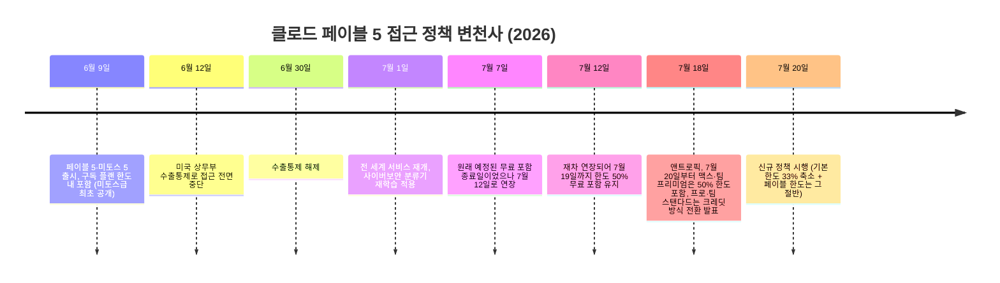

## 요약

2026년 7월 18일, 앤트로픽 공식 X 계정(@claudeai)은 클로드 페이블 5(Claude Fable 5)의 구독제 접근 정책을 다시 한 번 변경한다고 발표했다. 7월 20일부터 페이블 5는 맥스(Max)와 팀 프리미엄(Team Premium) 플랜에 정식으로 포함되지만, 사용 한도는 전체 한도의 50%로 제한된다. 프로(Pro)와 팀 스탠다드(Team Standard) 사용자는 사실상 구독 한도 내 접근을 잃고, 대신 100달러 상당의 일회성 사용 크레딧을 받은 뒤에는 API 요금(입력 100만 토큰당 10달러, 출력 100만 토큰당 50달러)을 지불해야 한다.

이번 발표는 페이블 5가 6월 9일 출시된 이후 약 6주 동안 겪은 세 번째 큰 정책 변경이며, 그 배경에는 오픈AI의 GPT-5.6 Sol이 벤치마크상 페이블 5에 근접한 성능을 3분의 1 수준의 비용으로 제공하기 시작했다는 경쟁 압박이 있는 것으로 다수 매체가 분석하고 있다. 아래에서는 이번 발표의 정확한 내용, 지금까지의 정책 변경 흐름, 그리고 이 발표를 전후로 커뮤니티(Threads)에서 나온 세 건의 반응을 사실관계와 함께 정리한다.

---

## 1. 7월 18일 발표, 정확히 무슨 내용인가

앤트로픽 공식 계정은 X를 통해 "7월 20일부터 클로드 페이블 5가 모든 맥스 및 팀 프리미엄 플랜에 포함되며, 한도의 50%로 제공된다"고 밝혔다. 이어 "프로 및 팀 스탠다드 사용자는 사용 크레딧을 통해 페이블에 계속 접근할 수 있으며, 일회성 100달러 크레딧을 받게 된다"고 덧붙였다. 앤트로픽은 페이블에 대한 수요를 예측하기 어려웠기 때문에 추가 용량을 확보하면서 단계적으로 구독 플랜에 접근을 확장해왔다고 설명했다.

여기서 짚어야 할 중요한 세부사항이 하나 있다. IT 매체 디코더(The Decoder)의 7월 18일 보도에 따르면, 같은 날부터 클로드의 일반 주간 사용 한도 자체도 33% 축소된다. 즉 7월 12일부터 적용되어 온 "주간 한도 50% 보너스" 프로모션이 종료되면서 기본 한도가 줄어들고, 페이블 5는 그렇게 줄어든 한도의 절반만 쓸 수 있게 되는 구조다. 다시 말해 단순히 "페이블 5 한도가 50%"라는 문구만 보면 실제 체감 축소 폭을 과소평가하기 쉽다. 프로와 팀 스탠다드 사용자는 사실상 구독 한도 안에서는 페이블 5에 접근할 수 없게 되며, 100달러 크레딧이 소진되면 API 종량제 요금으로 넘어가야 한다는 것이 디코더의 분석이다.

---

## 2. 왜 이렇게 자주 바뀌었나 — 6주간의 타임라인

페이블 5(그리고 상위 등급인 미토스 5)는 앤트로픽이 처음으로 일반에 공개한 "미토스(Mythos)급" 모델로, 2026년 6월 9일 출시됐다. 이후 정책이 여러 차례 뒤집힌 과정을 시간순으로 정리하면 다음과 같다.

이 흐름에서 확인할 수 있는 사실은 두 가지다. 첫째, 6월 12일부터 6월 30일까지 있었던 접근 중단은 페이블 5 자체의 성능이나 정책 문제가 아니라 미국 정부의 수출통제 조치 때문이었고, 이는 이후 해제되어 7월 1일 서비스가 재개됐다. 둘째, 7월 1일 재개 이후 예정됐던 "구독 한도 내 무료 포함" 종료 시점(7월 7일)은 두 차례(7월 12일, 7월 19일) 연기됐다가, 결국 완전한 무료 포함이 아니라 "맥스·팀 프리미엄은 축소된 한도로 유지, 프로·팀 스탠다드는 크레딧 전환"이라는 절충안으로 7월 20일부터 확정된 것이다.

기술 매체 사이먼 윌리슨(Simon Willison)의 블로그는 이 절충안의 배경에 대해, 애초 앤트로픽의 계획은 페이블 5를 구독 플랜에서 완전히 제외하고 API 종량제로만 제공하는 것이었으나, 오픈AI의 GPT-5.6 Sol(그리고 어느 정도는 중국의 키미 3.0)과의 경쟁 때문에 이 계획이 유지되기 어려워졌다고 분석했다. 매달 100~200달러를 내는 구독 플랜에 앤트로픽의 최상위 모델이 아예 포함되지 않는다면 그 구독의 매력이 떨어질 수밖에 없다는 논리다. 디코더 역시 같은 맥락에서, 오픈AI가 비슷한 성능을 3분의 1 비용으로 내놓은 GPT-5.6 Sol과, 중국발 가격 경쟁(키미 K3 등)이 이번 정책 완화의 실질적 배경이라고 짚었다.

---

## 3. 플랜별로 정리하면

| 플랜 | 7월 20일 이후 페이블 5 접근 | 비고 |
|---|---|---|
| 맥스(Max) / 팀 프리미엄(Team Premium) | 구독 한도 내 포함, 단 (축소된) 전체 한도의 50%까지만 | 기본 주간 한도 자체도 33% 축소 |
| 프로(Pro) / 팀 스탠다드(Team Standard) | 구독 한도 내 접근 사실상 종료 | 일회성 100달러 크레딧 지급 후 API 요금 적용 |
| API (종량제) | 처음부터 항상 전면 접근 가능 | 입력 100만 토큰당 10달러 / 출력 100만 토큰당 50달러 |

이 요금은 앤트로픽이 일반 공개 모델에 매긴 가격 중 가장 높은 수준이라는 평가가 나온다. 100달러 크레딧이 페이블 5의 실제 사용량 기준으로는 금방 소진될 수 있다는 지적도 여러 매체에서 공통적으로 제기됐다.

---

## 4. 경쟁 상대, GPT-5.6 Sol은 어떤 모델인가

이번 앤트로픽의 정책 완화를 이해하려면 오픈AI가 6월 26일 프리뷰로, 7월 9일 정식으로 출시한 GPT-5.6 계열 모델을 짚을 필요가 있다. GPT-5.6은 소울(Sol), 테라(Terra), 루나(Luna) 세 등급으로 구성되며, 이 중 최상위 모델인 소울이 페이블 5와 직접 비교되는 대상이다.

AI 벤치마크 전문기관 아티피셜 애널리시스(Artificial Analysis)에 따르면, 맥스(max) 추론 모드의 GPT-5.6 소울은 종합 지능 지수(Intelligence Index)에서 페이블 5보다 단 1점 낮은 59점을 기록하면서도, 비용은 약 3분의 1 수준인 과제당 1.04달러에 그쳤다. 코딩 에이전트 지수(Coding Agent Index)에서는 오히려 소울이 80점으로 페이블 5를 앞섰다. 오픈AI 자체 발표 역시 소울이 코딩 에이전트 지수에서 페이블 5보다 2.8점 높은 80점을 기록했고, 출력 토큰은 절반 이하, 소요 시간도 절반 이하, 비용은 약 3분의 1 낮다고 밝혔다.

코덱스(Codex) 환경에서 소울은 추론 강도에 따라 로우(Low)부터 미디엄(Medium), 하이(High), 엑스트라 하이(xhigh), 맥스(max), 울트라(Ultra)까지 여러 단계로 나뉜다. 이 가운데 xhigh는 "복잡한 디버깅과 리팩터링"에 권장되는 상위 단계로 안내되고 있으며, 실제로 여러 개발자들이 장시간에 걸친 저수준 백엔드 디버깅 작업에서 이 단계를 활용해 좋은 결과를 얻었다는 후기를 남기고 있다. 다만 이는 개별 사용자 경험 보고이며, 특정 단일 사례로 모델의 전반적 우열을 단정할 수는 없다는 점은 유의할 필요가 있다.

한편 오픈AI는 7월 12일, GPT-5.6 소울 출시 직후 트래픽이 이틀 만에 두 배로 폭증하자 코덱스와 챗지피티 워크(ChatGPT Work)의 플러스·프로·비즈니스 플랜에 적용되던 "5시간 롤링 사용 한도"를 일시적으로 완전히 제거했다. 오픈AI 코덱스 팀의 티보 소티오(Tibo Sottiaux)는 이 조치가 임시 조치이며 주간 한도는 그대로 유지된다고 밝혔다. 7월 18일 기준으로도 이 5시간 한도 제거 조치는 유지되고 있는 것으로 확인된다. 참고로 커뮤니티 게시글 중 일부는 이를 "5일 제한"으로 표현하기도 하는데, 공식 발표 및 복수 매체 보도를 종합하면 이는 "5시간(5-hour) 롤링 한도"를 가리키는 것으로 보이며, "5일"은 표현상의 오기로 판단된다.

아래는 두 모델을 둘러싼 확인된 사실을 표로 정리한 것이다.

| 항목 | 클로드 페이블 5 | GPT-5.6 소울(Sol, max) |
|---|---|---|
| 출시일 | 2026년 6월 9일 (7월 1일 재개) | 6월 26일 프리뷰, 7월 9일 정식 출시 |
| 등급 체계 | 미토스(Mythos)급 최초 공개 모델 | 소울 · 테라 · 루나 3단계 |
| 종합 지능 지수(AA Intelligence Index) | 60점 | 59점 (약 1점 낮음) |
| 코딩 에이전트 지수 | 페이블 5 대비 2.8점 낮음 | 80점으로 1위 |
| 과제당 비용 | 상대적으로 고비용 | 페이블 5의 약 3분의 1 |
| API 요금(크레딧 전환 후) | 입력 $10 / 출력 $50 (100만 토큰당) | 입력 $5 / 출력 $30 (100만 토큰당, 소울 기준) |
| 구독 한도 정책(7월 20일 기준) | 맥스·팀 프리미엄 50% 한도, 프로는 크레딧 전환 | 코덱스·챗지피티 워크 5시간 한도 일시 제거(주간 한도는 유지) |

이 표에서 볼 수 있듯 두 모델은 지능 지수 자체는 근소한 차이지만, 비용과 구독 한도 정책에서는 체감 격차가 크다는 것이 최근 커뮤니티 반응의 핵심 축이다.

---

## 5. 커뮤니티는 어떻게 받아들이고 있나 — Threads 게시글 세 건

이번 발표 전후로 국내 AI 실무자 커뮤니티인 Threads에서 나온 세 건의 반응은 서로 다른 각도에서 같은 문제를 짚고 있다.

**첫 번째 게시글([@billionnapkin](https://www.threads.com/@billionnapkin/post/Da6xrDnEU87))** 은 3개월간 풀리지 않던 백엔드 문제를 GPT-5.6 소울 xhigh 모드가 해결했다는 경험담이다. 작성자는 클로드 오푸스, 페이블, GPT-5.5까지 모두 시도했지만 실패했고, 여러 시스템이 얽힌 로직을 끝까지 추적해 기존 구조를 깨지 않고 수정해야 하는 난이도 높은 작업이었다고 설명한다. 다른 모델들은 그럴듯해 보이지만 실제 적용 시 부작용이 생기거나 핵심 원인을 놓쳤는데, GPT-5.6 소울 xhigh는 문제를 단계별로 쪼개고 코드 흐름을 끝까지 추적해 실제로 동작하는 해결책을 냈다는 것이다. 다만 작성자 스스로도 이 한 번의 경험만으로 모든 백엔드 작업에서 이 모델이 최고라고 단정할 수 없다는 점을 밝히고 있다. 이는 앞서 확인한 코덱스의 xhigh 추론 단계가 "어려운 디버깅과 리팩터링"에 권장된다는 공식 가이드와 방향이 일치하는 개인 사례로 볼 수 있다.

**두 번째 게시글([@woo.0.6]( https://www.threads.com/@woo.0.6/post/Da5Ypaik4Xn))** 은 두 가지 불만을 제기한다. 하나는 페이블 5의 보안 분류기가 지나치게 민감하게 동작해, 루트 권한 접근이나 시스템 로그 확인, 실행 중인 서비스 점검, 리눅스 계열 OS와의 라이브러리 호환성 확인처럼 시스템 저수준(low-level) 작업에 조금만 가까워져도 오푸스로 라우팅되며 막힌다는 것이다. 이는 실제로 사실에 부합한다. 앤트로픽은 페이블 5에 사이버보안·생물학/화학·증류(distillation) 세 영역을 감지하는 다층 분류기를 적용했으며, 이 분류기가 위험 신호를 감지하면 요청을 페이블 5 대신 오푸스 4.8로 조용히 전환해 응답하도록 설계했다. 특히 7월 1일 재배포 시점에 사이버보안 분류기가 재학습되면서, 특정 탈옥(jailbreak) 기법은 99% 이상 차단하게 됐지만 그 대가로 정상적인 코딩·디버깅 요청에 대한 오탐(false positive)률이 높아졌다는 점을 앤트로픽 스스로도 공식 재배포 공지에서 인정한 바 있다. 실제로 시스템 프로그래밍, 클라우드 인프라, 코드 리뷰, 보안 감사, 문서 처리 등 다섯 개 분야에서 최소 다섯 건의 독립적인 이슈 리포트가 재배포 후 2주 사이에 접수됐다는 보도도 있다. 이 게시글의 또 다른 불만은 사용량 한도 비교로, GPT의 "5시간 제한"이 없어진 반면 페이블 5는 전체 사용량의 50%로 제한된 데다 며칠 내 구독제에서 완전히 빠질 것이라는 우려까지 겹쳐 체감 격차가 크다는 것이다. 다만 이 게시글은 7월 18일 발표 이전, 즉 앤트로픽이 페이블 5를 구독 플랜에서 완전히 제외하려던 원래 계획이 알려졌던 시점에 작성된 것으로 보이며, 실제로는 앞서 정리한 대로 7월 20일부터 맥스·팀 프리미엄에는 완전 제외가 아닌 50% 한도로 유지되는 절충안이 확정됐다.

**세 번째 게시글([@yijongdae]( https://www.threads.com/@yijongdae/post/Da604r9NZJ2))** 은 짧은 감상평으로, 맥스 기본 요금제에 페이블이 포함된다는 발표가 나오자 "이럴 줄 알았다"는 반응을 보인다. 작성자는 이런 식의 정책 번복이 반복되는 패턴처럼 느껴진다며, 구독형 AI 서비스에 대한 피로감과 함께 AI를 직접 소유하고 싶다는 냉소적인 소회를 남겼다. 이는 수치나 사실관계보다는 반복된 정책 변경 자체에 대한 사용자 피로감을 보여주는 사례로 볼 수 있다.

---

## 6. 페이블 5의 보안 라우팅 구조 — 왜 저수준 작업이 자주 막히는가

두 번째 게시글에서 제기된 불만을 조금 더 구조적으로 짚어볼 필요가 있다. 페이블 5와 미토스 5는 사실상 동일한 기반 모델이며, 차이는 오직 안전장치(safeguard)의 유무에 있다. 미토스 5는 사이버 안전장치가 해제된 버전으로, "글래스윙 프로젝트(Project Glasswing)"라는 신뢰 기반 소수 파트너 프로그램에만 제공되고 일반에는 공개되지 않는다. 반대로 일반에 공개된 페이블 5는 사이버보안·생물학/화학·증류 세 영역에서 위험 신호가 감지되면 자동으로 오푸스 4.8로 응답을 넘기도록 설계돼 있다.

앤트로픽 고객센터 자료를 인용한 매체 보도에 따르면, 이 폴백은 전체 세션의 5% 미만에서 발생하는 것으로 알려져 있지만, 이는 전체 세션 유형을 평균한 수치이며 보안 감사나 인프라 관리처럼 민감 영역과 자주 맞닿는 에이전틱 파이프라인에서는 그 비율이 훨씬 높게 나타날 수 있다. 분류기는 사용자의 실제 의도가 아니라 텍스트 자체의 표현을 평가하기 때문에, 침투 테스트 도구를 위한 취약점 질문이나 의료 워크플로우를 위한 투약량 질문처럼 정당한 목적이라도 문구가 모호하면 오탐이 발생할 수 있다. 실무자 입장에서는 프롬프트에 구체적인 사용 맥락을 명시하거나, 민감한 파라미터를 자연어 대신 데이터 형태로 구조화하는 방식이 오탐을 줄이는 데 도움이 된다고 안내되고 있다. 보안 관련 작업의 예측 가능성이 중요한 경우, 페이블 5를 거쳐 오푸스로 폴백되도록 두기보다 처음부터 오푸스 4.8을 직접 선택하는 편이 더 일관된 결과를 준다는 지적도 있다.

---

## 7. 정리하며

7월 18일 발표는 표면적으로는 "페이블 5가 맥스·팀 프리미엄에 포함된다"는 긍정적 소식처럼 보이지만, 실제 내용을 뜯어보면 기본 한도 자체가 33% 줄어들고 그 절반만 페이블 5에 쓸 수 있다는 점에서 순수한 혜택 확대로 보기는 어렵다. 프로·팀 스탠다드 사용자 입장에서는 사실상 구독 한도 내 접근이 종료되고 크레딧·API 종량제 체계로 넘어가는 변화이기도 하다. 다만 이 결정이 애초 앤트로픽이 검토했던 "구독 플랜에서 페이블 5 완전 제외"라는 안보다는 완화된 절충안이라는 점, 그리고 그 배경에 GPT-5.6 소울의 가격 경쟁력과 중국발 가격 압박이 작용했다는 점은 복수의 매체 분석에서 일관되게 확인된다.

동시에 GPT-5.6 소울 쪽도 완전히 문제가 없는 것은 아니다. 5시간 한도 제거는 어디까지나 "일시적" 조치로 공지됐으며, 주간 한도는 그대로 유지되고 있다. 또한 코덱스와 챗지피티 워크가 사용량 풀을 공유하는 구조여서 예상치 못한 소진이 발생할 수 있다는 지적도 있다. 결국 지금 시점에서는 어느 한쪽이 완전한 우위를 점했다기보다, 두 회사가 서로의 가격·한도 정책에 반응하며 몇 주 단위로 조건을 계속 조정하고 있는 국면이라고 보는 것이 정확하다. 실무에서 두 모델을 함께 쓰는 사용자라면, 저수준 시스템 작업이나 보안 인접 작업은 오탐 가능성을 감안해 오푸스 4.8을 직접 선택하는 방안을, 장시간 고난도 디버깅 작업은 GPT-5.6 소울의 xhigh 이상 추론 단계를 시험해보는 방안을 각각 고려할 만하다.

---

*작성일: 2026년 7월 18일*
