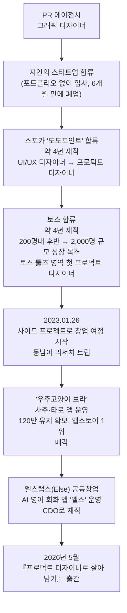
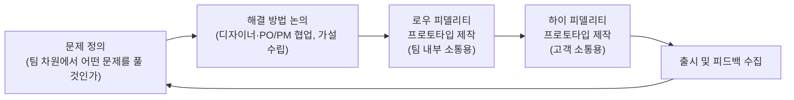

## — 강영화, 『프로덕트 디자이너로 살아남기』 저자 인터뷰(EO Korea, 이오서재) 정리

---

## 1. 이 문서에 대하여

이 글은 유튜브 채널 EO Korea가 진행한 북 팟캐스트 '이오서재'의 첫 번째 에피소드, [「토스 출신, 120만 유저 앱 매각한 디자이너가 알려주는 생존법 | 프로덕트 디자이너로 살아남기, 강영화 저자」](https://www.youtube.com/watch?v=fEm_gWO-6jk) 편의 내용을 서술형으로 정리한 것이다. 진행자는 이호 서재의 진행자(이하 '진행자')이며, 게스트는 13년차 프로덕트 디자이너이자 창업가인 강영화 저자다. 영상은 2026년 7월 9일 공개되었고, 총 러닝타임은 약 1시간 13분이다.

정리에 앞서 인터뷰 발화 내용 외에 언급된 저자의 커리어, 소속 회사, 저서 정보 등은 별도로 언론 보도와 저자 본인의 채널을 통해 사실관계를 확인했으며, 확인이 필요한 부분은 본문에 출처를 함께 표기했다. 인터뷰 중 저자가 개인적 견해나 경험으로 밝힌 부분(예: 특정 연구 결과 인용, 팀 내 도구 활용 사례)은 저자의 발언으로서 소개하되, 별도 검증이 되지 않은 내용이라는 점을 함께 밝혀 둔다.

---

## 2. 강영화는 누구인가

강영화는 13년 차 프로덕트 디자이너이자 4년 차 창업자다. 그래픽 디자이너로 커리어를 시작해 스포카의 '도도포인트'와 '토스'의 성장기를 최전방에서 경험한 뒤 직접 창업에 뛰어든 인물로 소개된다(머니투데이, 2026.05.31 보도). 인터뷰에서 본인이 직접 밝힌 이력은 다음과 같다.

- PR 에이전시에서 그래픽 디자이너로 커리어 시작 (2014~2015년 무렵)
- 지인이 창업한 스타트업에 포트폴리오 없이 합류했으나 6개월 만에 회사가 폐업
- 스포카에 합류해 약 4년간 재직. 입사 당시 직함은 UI/UX 디자이너였으나, 재직 중 '프로덕트 디자이너'라는 직무명이 새롭게 정립되는 과정을 함께 겪음
- 토스에 합류해 4년간 재직. 본인이 표현한 바에 따르면 입사 당시 회사 규모는 200명대 후반이었고, 퇴사 시점에는 2,000명 규모까지 성장. 별도 보도에 따르면 강영화는 토스 툴즈(Tools) 영역의 첫 프로덕트 디자이너로 사내 도구 영역을 담당했다(테크42/다음뉴스, 2026.07.10 보도)
- 2023년 1월 26일, 토스 재직 중 사이드 프로젝트로 창업 여정을 시작. 이후 약 6개월간 토스 동료였던 현재의 공동창업자와 함께 여러 제품을 실험(테크42 보도)
- 사주·타로 앱 '우주고양이 보라'를 운영해 앱스토어 1위를 기록했고, 이후 매각을 경험
- 현재는 AI 영어 회화 앱 '엘스(Else)'를 운영하는 엘스랩스의 공동창업자 겸 CDO(Chief Design Officer)로 재직 중이며, 대표는 토스 동료였던 이현수다. 이현수는 크래프톤에 인수된 '띵스플로우' 출신으로 소개된다(테크42 보도)

2026년 5월, 그간의 경험을 담은 저서 『프로덕트 디자이너로 살아남기』를 출간했다. 언론 보도에 따르면 이 책은 생성형 AI의 등장으로 프로덕트 디자이너·엔지니어·기획자의 경계가 빠르게 허물어지는 격변기 속에서, '바이브 코딩'이 확산되는 2026년 디자이너에게 실제로 필요한 역량이 무엇인지를 짚는 실전 지침서를 지향한다(머니투데이·유니콘팩토리, 2026.05.31 보도). 저자는 책에서 디자이너가 화면을 예쁘게 그리는 '기술자(Tooler)'의 역할에서 벗어나, 비즈니스 맥락을 읽고 팀의 목표 달성에 기여하는 '문제 해결사'로 거듭나야 한다고 강조하며, 책의 내용은 기본기·성장·문제 해결·AI 트렌드라는 네 가지 축으로 구성되어 있다. 책에는 단 3일 만에 100만 명 이상의 신규 유입을 끌어낸 '송편지원금' 프로젝트의 비하인드 스토리와, 20개가 넘는 사이드 프로젝트 및 창업 경험에서 얻은 비즈니스 감각이 담겨 있다(같은 보도).

아래는 인터뷰에서 드러난 강영화의 커리어 흐름을 시각화한 것이다.

---

## 3. 시각 디자이너에서 프로덕트 디자이너로: 커리어의 전환점

강영화는 학창 시절부터 시각 디자인을 전공했고, 편집 디자인과 브랜드 디자인에 강점을 갖고 있었다. 첫 직장이었던 PR 에이전시에서도 이 강점을 살려 그래픽 디자이너로 일을 시작했다. 그러나 1년이 채 되지 않아 "정적"이라고 느꼈고, 마침 배달의민족 등 스타트업이라는 이름의 회사들이 막 태동하던 2014~2015년경, 좀 더 동적인 일을 해보고 싶다는 생각에 이직을 결심했다.

첫 이직처는 지인의 스타트업이었고 포트폴리오 없이 합류했지만, 그 회사는 6개월 만에 폐업했다. 이 시기 강영화는 병행하던 아르바이트를 계기로 정규직 전환 기회를 얻었는데, 그 회사가 바로 스포카였다. 스포카에서는 다양한 프로젝트를 거치며 자연스럽게 프로덕트 디자이너라는 직무를 처음 경험하게 되었다. 입사 당시 직함은 UI/UX 디자이너였지만, 화면 설계뿐 아니라 브랜딩, 제품에 들어가는 각종 에셋까지 폭넓게 다루는 업무 범위가 확대되면서 팀 내부에서 "이 역할은 이름이 바뀌어야 하지 않을까"라는 논의가 있었고, 마침 '프로덕트 디자이너'라는 직업명이 업계에서 다시 부상하던 시기와 맞물려 자연스럽게 직무명이 바뀌어 갔다고 회상했다.

이후 합류한 토스는 이전 회사들과는 일하는 방식이 크게 달랐다고 밝혔다. 토스는 정보 공유가 투명하게 이루어지는 조직이었고, 디자이너에게도 미적 완성도뿐 아니라 비즈니스 성과에 기여할 수 있는 역량, 즉 데이터를 해석하고 그 해석을 바탕으로 디자인 의사결정을 내릴 수 있는 능력을 요구했다. 강영화는 초기에는 이 방식에 적응하는 데 어려움을 겪었다고 털어놓았다. 아름다움을 추구하기보다 사용성과 비즈니스 임팩트를 우선하는 사고방식으로 전환해야 했고, 회사가 빠르게 성장하는 만큼 본인도 그 속도에 맞춰 성장할 수밖에 없었다는 것이다. 이 경험은 훗날 창업으로 이어지는 중요한 토대가 되었다고 그는 설명했다.

---

## 4. 창업으로 이어진 여정: 말레이시아에서 얻은 확신

강영화는 토스 재직 중에도 다수의 사이드 프로젝트를 병행했다. 창업의 직접적인 계기는 토스 입사 3년 차에 주어진 한 달간의 안식월이었다. 동생이 거주하던 말레이시아 페낭에 놀러 갔다가 그 지역에는 마음에 드는 포토부스가 없다는 점을 발견했고, "이걸 내가 시작해보면 어떨까"라는 생각을 하게 됐다고 한다.

토스에서 익힌 유저 리서치 습관대로, 그는 곧바로 실행에 나서기보다 리서치부터 시작했다. 비슷한 도시에서는 이 사업이 어떻게 운영되고 있는지, 자신이 시작한다면 어떻게 다르게 할 수 있을지를 상상하며 페낭에서 치앙마이, 방콕, 싱가포르, 쿠알라룸푸르를 거쳐 다시 페낭으로 돌아오는 약 2주간의 리서치 여행을 떠났다. 이 여정을 통해 "이거 정말 할 수 있을 것 같다"는 확신을 얻었고, 개발 역량이 없던 그는 현재의 공동창업자와 이 시기에 연이 닿아 함께 창업을 진행하게 되었다. 이 사이드 프로젝트가 시작된 날짜는 2023년 1월 26일로, 본인도 정확히 기억하고 있는 날짜라고 밝혔다.

다만 강영화는 이 여정이 애초의 계획대로 흘러간 적은 단 한 번도 없었다고 회고했다. 실제로 초기에 구상했던 포토부스 사업 대신, 여러 시행착오를 거쳐 최종적으로 자리 잡은 것은 사주·타로 앱 '우주고양이 보라'였다.

---

## 5. 120만 유저를 모은 사주 앱, '우주고양이 보라'의 성공 비결

'우주고양이 보라'는 강영화와 공동창업자가 함께 만든 사주·운세·타로 앱으로, 앱스토어 라이프스타일 카테고리에서 1위를 기록했으며 누적 120만 명이 가입한 서비스로 성장했다. 한 매체와의 인터뷰에서 강영화는 유료 상품을 출시한 지 하루 만에 매출이 발생하면서 "이 시장은 돈이 되는 시장"이라는 확신을 얻었다고 밝혔고, 2024년 초 매출이 본격적으로 늘어나면서 공동창업자들이 함께 퇴사해 이 사업에 전념하기로 결정했다고 전해진다. 지난해 기준 연매출은 약 20억 원 규모였던 것으로 보도되었다(그로스스크랩, 2026.06.03 보도).

이번 인터뷰에서 강영화는 이 서비스가 잘된 이유를 두 사람이 여러 차례의 회고를 거쳐 되짚어본 결과로 설명했다. 핵심은 크게 두 가지다.

첫째는 디자인 완성도 자체다. 강영화는 "디자인이 좋아서 잘 된 것 같다"고 담백하게 말했다. 캐릭터가 귀엽게 설계된 것도 사용자들이 앱을 좋아하게 된 이유 중 하나로 꼽았다.

둘째는 기존 사주 앱들과는 다른 언어를 사용했다는 점이다. 기존 사주 앱들이 "이 사주가 잘 맞는다", "이 운세가 당신의 미래를 보여줄 것"이라는 식으로 예측과 적중을 강조했다면, '우주고양이 보라'는 사람들이 운세를 보는 근본적인 이유를 '외로움'과 '불안'에서 찾고, 이에 맞춰 위로에 초점을 맞춘 경험을 설계했다. 사용자에게 위로가 되는 마음의 편지를 보내주고, 이에 답장할 수 있는 장치를 마련하는 식으로 위로와 마음 챙김의 경험을 함께 제공한 것이 차별점이었다는 설명이다. 강영화는 이를 두고 "사용자에게 어떤 경험을 하게 할 것인가"에 집중하는 것이 곧 디자인의 영역이라고 정리했다.

---

## 6. 비타민에서 페인킬러로: 영어 교육 앱 '엘스'가 어려운 이유

'우주고양이 보라'를 매각한 이후, 강영화는 글로벌 서비스를 만들고 싶다는 목표 아래 영어 공부를 이어가다 기존 영어 학습 서비스들만으로는 원하는 학습 경험을 채우기 어렵다고 느꼈고, AI 영어 회화 앱 '엘스'를 공동창업자 이현수와 함께 만들게 되었다(그로스스크랩 보도). 강영화는 이 두 제품의 시장 성격이 근본적으로 다르다는 점을 인터뷰에서 강조했다.

그는 사주 앱을 '비타민'에, 영어 학습 앱을 '페인킬러'에 비유했다. 비타민은 기분을 좋게 하기 위해 먹는 제품이기 때문에 대략적으로 잘 뭉쳐서 제공해도 사용자들이 재미있게 받아들이지만, 페인킬러는 실제로 존재하는 어려움을 해결해줘야 하는 제품이기 때문에 사용성보다 유용성이 훨씬 더 중요해진다는 것이다. 그만큼 마음에 들지 않는 지점이 있을 때 사용자들이 훨씬 크게 불편함을 느끼기 때문에, 하나하나의 기능을 세밀하게 설계해야 실제로 사용자들이 이탈 없이 계속 사용한다고 설명했다. 동시에 그는 영어 교육 앱은 사람들의 삶에 실질적인 변화를 가져다준다는 점에서, 마음을 챙겨주는 서비스와는 또 다른 방식으로 매력적인 가치를 지닌다고 덧붙였다.

아래는 두 제품의 성격을 인터뷰 내용을 바탕으로 정리한 비교표다.

| 구분 | 우주고양이 보라 (사주·타로) | 엘스 (AI 영어 회화) |
|---|---|---|
| 제품 성격 | 비타민형 — 기분 전환, 재미 목적 | 페인킬러형 — 실제 문제 해결 목적 |
| 핵심 가치 | 위로, 공감, 마음 챙김 | 유용성, 실질적 학습 성과 |
| 사용자 반응 방식 | 다소 뭉뚱그려 제공해도 즐겁게 수용 | 하나의 설계 오류에도 민감하게 반응 |
| 강영화가 꼽은 성공 요인 | 완성도 높은 디자인, 기존 앱과 차별화된 위로의 언어 | 정교한 기능 설계, 문제 해결 중심 사고 |

---

## 7. 디자이너의 일이 화면 너머로 확장된 이유

강영화는 디자인을 화면 설계에 국한된 작업으로 여기던 관점에서 벗어나야 한다고 강조했다. 그는 사업이 지속되어야 디자인도 존재할 수 있다는 전제 아래, 회사가 처한 단계에 따라 디자이너의 우선순위도 달라져야 한다고 말했다. 자신이 몸담은 엘스는 아직 PMF(Product-Market Fit, 제품이 시장에 적합해 사용자들의 리텐션이 안정적으로 확보되는 단계)를 찾는 과정에 있기 때문에, 미적 완성도보다 생존과 수익화에 기여하는 다양한 장치들을 우선적으로 고민하게 된다는 것이다.

다만 이는 창업가에게만 해당하는 이야기가 아니라고 그는 짚었다. 회사에 소속된 디자이너라 하더라도 비즈니스적 사고를 갖추면 더 나은 의사결정을 내릴 수 있다는 것이다. 직장인이 이러한 감각을 유지하기 위한 구체적 방법으로 그는 두 가지를 제안했다.

첫째, 리더에게 적극적으로 질문하라는 것이다. 실무자는 자신이 수행하는 과제가 어떤 임팩트를 갖는지 스스로 판단하기 어려운 경우가 많은데, 이럴 때는 리더에게 해당 과제가 성공했을 때의 아웃컴이 무엇인지 설명해달라고 직접 요구하는 것이 좋다고 조언했다. 이는 특히 정보가 원활히 흐르지 않는 조직이나 주니어 구성원에게 유용한 방법이며, 이러한 대화를 통해 자신감과 동기부여를 함께 얻을 수 있다고 덧붙였다.

둘째, 상상력을 활용해 스스로 시뮬레이션해보라는 것이다. 내가 맡은 일이 회사에 어떤 영향을 미치고, 회사의 성과가 다시 산업 전체에 어떤 영향을 주는지를 머릿속으로 그려보는 방식이다. 그는 이를 "가시성 있게 생각하며 일하는 것"이라 표현하며, 이러한 감각을 기르기 위해서는 취업 준비 시절처럼 시장 분석과 경쟁사 분석을 회사에 다니면서도 지속해야 한다고 강조했다. 회사가 다니는 것만으로 안전하다는 보장은 없기 때문에, 자신이 속한 조직이 시장에서 어떤 위치에 있는지를 객관적으로 파악하는 습관이 특히 스타트업 재직자에게 중요하다고 말했다.

---

## 8. 경계 없이 일하는 AI 시대

강영화는 최근 몇 년 사이 디자이너와 기획자가 개발을 하고, 개발자가 디자인 영역까지 넘나드는 경계 없는 협업 방식이 자연스러워지고 있다고 전했다. 그는 이러한 변화를 창업 팀을 운영하는 입장에서 오히려 자연스럽게 받아들이고 있다고 밝혔다. 규모가 큰 기존 조직들은 여전히 많은 인원과 기존 방식을 유지해야 하는 구조적 제약이 있지만, 창업 팀에서는 굳이 많은 인원이 필요하지 않으며, 오히려 다재다능하고 재미있게 접근하는 소수의 인원으로 팀을 꾸리는 방식이 '뉴노멀'이 되어가고 있다는 것이다.

이러한 변화가 기회이자 동시에 도전이 될 수 있다는 진행자의 질문에, 강영화는 기회의 측면을 먼저 짚었다. 디자이너와 기획자가 직접 개발까지 할 수 있게 되면서 이전에는 시도할 수 없었던 다양한 종류의 실험이 가능해졌다는 것이다. 특히 그는 AI가 자신과는 전혀 다른 방식으로 사고하며 결과물을 만들어낸다는 점에 주목했다. 사람은 자신이 가진 정보와 익숙한 사고방식을 벗어나기 어렵지만, AI가 생성한 결과물은 그와는 완전히 다른 발상에서 출발하는 경우가 많아 랜딩페이지나 그래픽 디자인 작업에서 사고의 틀이 깨지는 경험을 여러 차례 했다고 밝혔다. 이러한 경험은 제품과 디자인을 한 단계 더 앞으로 나아가게 만드는 동력이 된다는 것이 그의 설명이다. 그는 자신의 역할을 지휘자에 비유하며, AI가 만들어낸 결과물을 보고 방향을 조정해나가는 방식으로 일하고 있다고 설명했다.

---

## 9. "내가 디자이너가 맞을까": 정체성 혼란에 대한 강영화의 시각

디자이너가 비즈니스, 데이터, 유저 리서치, 문제 해결까지 모두 다뤄야 하는 상황이 겹치면서 번아웃이나 정체성 혼란을 겪는 경우가 많다는 진행자의 질문에, 강영화는 실제로 상담을 요청하는 이들 대부분이 이러한 고민을 안고 온다고 답했다. 그는 이 현상을 비유적으로, 원래 바이올린을 연주하던 사람이 갑자기 지휘를 맡게 된 상황에 빗대었다. 연주만 하던 사람이 갑자기 전체 사운드를 조율하고 방향을 결정하며 심지어 티켓 판매까지 해야 하는 상황에 놓이게 되니 혼란스러운 것이 당연하다는 것이다.

그가 이러한 고민을 가진 이들에게 건네는 조언은 명확했다. "꼭 디자이너로 일하지 않아도 된다"는 것이다. 그는 '디자이너'라는 직함의 껍데기에 얽매이기보다, 자신이 가진 강점이 어디에서 비롯되었고 무엇으로 이어질 수 있는지에 집중하는 편이 낫다고 말했다. 이는 AI 시대이기 이전부터 그가 회사 안에서 인정받았던 방식이기도 했다고 밝혔다. '디자이너니까 이 일은 하지 않는다'는 태도 대신, 필요하다면 개발도, CS도, 다양한 업무도 직접 경험하며 인풋을 늘려가는 방식이 더 큰 배움으로 이어진다는 것이다. 그는 이러한 흐름이 AI 등장으로 더욱 극대화되었으며, 결과적으로 제너럴리스트가 더 유리해지는 시대가 되고 있다고 진단했다. 그러면서 평생 일해야 하는 시대인 만큼, 지금은 경계를 미리 정해두기보다 다양한 시도를 해볼 좋은 시기라고 덧붙였다.

---

## 10. 그럼에도 놓치지 말아야 할 본질: 문제 해결력

역할과 경계가 계속 바뀌는 상황에서도 반드시 붙잡고 있어야 할 한 가지가 무엇이냐는 질문에, 강영화는 "문제를 어떻게 해결할 것인가"에 대한 집중이라고 답했다. 서비스 기획이나 제품 개발 과정뿐 아니라 모든 업무 과정에서 문제 해결력은 발휘될 수 있으며, 시대가 빠르게 바뀌는 만큼 결국 스스로 무엇을 하고 싶은지, 그리고 그것을 어떻게 풀어낼 것인지에 대한 사고는 피할 수 없는 본질이라는 설명이다. 그는 문제 자체가 유저의 문제인 경우가 많기 때문에, 이러한 관점에서 볼 때 오히려 디자이너에게 좋은 시기라고 덧붙였다.

---

## 11. AI 시대, 왜 디자이너에게 기회인가

강영화는 AI 에이전트가 디자인 업무를 처음부터 끝까지 완전히 대체하는 것은 아직 불가능하다는 점을 근거로, 디자이너에게는 여전히 기회가 있다고 진단했다. 문제 정의부터 시작해 해결 방향을 설계하고, 실제 결과물을 만들고, 이를 다시 팔로업하는 전체 과정은 구조화되어 있지만, 이 모든 과정을 엔드투엔드로 처리하는 에이전트는 존재하지 않으며 이를 만드는 것 자체가 매우 어려운 일이라는 것이 그의 견해다.

특히 그는 디자이너가 가진 핵심 강점으로 '유저의 문제에 공감하는 능력'을 꼽았다. 사람들이 무엇을 불편하게 느끼는지를 빠르게 감지하고, 이를 어떻게 해결할 수 있을지 관점을 제시하는 역할은 여전히 사람의 몫이라는 것이다. 그는 이러한 역할을 수행하는 사람이라면 직함이 '디자이너'가 아니더라도 본질적으로는 디자이너의 역할을 하고 있는 것이라 볼 수 있다고 덧붙였다.

---

## 12. AI를 잘 쓰려면 AI를 알아야 한다

책에서도 강조된 대목이라며 진행자가 질문한 부분으로, 강영화는 AI를 잘 활용하기 위해서는 기술적 이해가 선행되어야 한다고 말했다. 그가 짚은 핵심은 LLM(거대언어모델)의 본질이 '결정적이지 않은 결과를 내놓는다'는 점이다. 기존 소프트웨어 개발에서는 특정 입력값을 넣으면 항상 동일한 결과가 나오는 것이 당연했지만, LLM 기반 제품에서는 동일한 입력을 넣어도 다른 결과가 나올 수 있다는 것이다. 이러한 비결정성에 대한 이해가 없다면 그에 맞는 디자인과 도구 선택 자체가 어려워진다는 설명이다.

그는 이 맥락에서 카네기멜론 대학교의 한 실험을 언급했다. AI 관련 제품을 만드는 실험에서, 한 그룹은 유저의 문제와 스토리를 먼저 정의한 뒤 접근했고, 다른 그룹은 AI가 무엇을 할 수 있는지 그 가능성에서 출발해 접근했는데, 후자의 그룹이 더 좋은 결과물을 만들어냈다는 연구 결과가 있었다는 것이다. (해당 연구는 인터뷰에서 저자가 구두로 소개한 내용으로, 이 문서에서 별도의 원문 자료를 통해 출처를 재확인하지는 못했다는 점을 밝혀둔다.) 강영화는 이 사례를 들어, AI를 활용해 디자인하든 AI를 위해 디자인하든, 기술에 대한 이해를 바탕으로 접근할 때 결과물의 질이 확연히 달라진다고 강조했다.

---

## 13. AI가 잘하는 디자인, AI가 헤매는 디자인

강영화는 AI가 좋은 결과를 내는 조건을 비교적 명확하게 설명했다. 요구사항이 구체적으로 문서화되어 있고, 한 번에 다루는 화면 수가 지나치게 많지 않을 때 AI는 좋은 성과를 낸다는 것이다. 실제로 엘스에서 워킹홀리데이 사용자를 위한 롤플레잉 시뮬레이션 기능을 만들 때, 구체적인 시나리오를 상세하게 입력하자 다양한 결과물을 실제로 사용해보며 비교 검토할 수 있었고, 한 화면에 여러 결과물을 나란히 놓고 비교하는 방식으로 좋은 성과를 얻었다고 소개했다.

반면 AI가 헤매는 경우는 대체로 한 가지 원인에서 비롯된다고 그는 진단했다. 디자이너, 혹은 디자인을 하려는 사람의 머릿속에 사용자가 이를 통해 무엇을 얻을 것인지에 대한 구체적인 상이 부족한 경우다. 이 상이 명확할수록 결과물의 초안도 더 정교하게 나오고, 반대로 조금이라도 모호하면 사람과 AI가 함께 방향을 잃게 된다는 것이다. 그는 이를 해결하기 위한 방법으로, 자신의 업무 전체 워크플로를 잘게 쪼개어 어떤 부분은 AI가 잘 처리할 수 있고 어떤 부분은 사람이 직접 해야 하는지를 명확히 구분한 뒤 각각을 적재적소에 배분하는 접근을 제안했다. 결국 자신이 어떤 방식으로 일하는지를 스스로 잘 정리하는 것이 AI와 협업하는 핵심이라는 설명이다.

또한 강영화는 AI 도구마다 특성이 다르다는 점도 짚었다. 어떤 도구는 MCP(Model Context Protocol) 연동을 통해 외부 데이터와 소통할 때 더 뛰어난 성능을 보이는 반면, 피그마 파일을 직접 입력했을 때는 상대적으로 성능이 떨어지는 경우가 있고, 반대의 특성을 가진 도구도 있다는 것이다. 이 때문에 각 도구의 특성을 이해하고 여러 실험을 거쳐 자신과 팀에게 맞는 최적의 워크플로를 구축하는 과정이 필요하다고 강조했다.

강영화가 이끄는 엘스 팀은 모든 팀원이 엔지니어링 역량을 갖추고 있으며, 필요한 도구는 직접 만들어 사용하는 문화를 갖고 있다. 팀 내부에는 슬랙에 연동된 자체 AI 에이전트가 있어, MCP 등으로 연결된 여러 데이터를 조회하고 정리해주는 역할을 하고 있다고 소개했다. (다만 이 에이전트의 구체적인 기술 구성이나 명칭은 팀 내부에서 사용하는 애칭 수준으로 언급된 것으로, 특정 상용 제품명을 지칭하는 것은 아닌 것으로 보인다.)

---

## 14. 디자인 프로세스를 익히는 실전 노하우

디자인 도구나 AI 활용법 이전에, 강영화는 IT 제품이 전통적으로 어떻게 만들어지는지에 대한 전체 프로세스를 먼저 이해하는 것이 중요하다고 강조했다. 그가 설명한 전통적인 프로세스는 다음과 같은 흐름을 갖는다.

이러한 전체 그림을 이해하고 있어야, AI 에이전트가 이 과정의 어느 단계에 개입하고 있는지, 그리고 그 단계를 얼마나 신뢰할 수 있는지를 판단할 수 있다는 것이 그의 설명이다. 처음부터 모든 것을 완벽히 다루려 하기보다는, 전체 방법론을 먼저 파악한 뒤 자신에게 부족한 부분을 목록화하고 하나씩 작게 학습해나가는 방식이 훨씬 유리하다고 조언했다.

한편 디자인의 '노하우(How)' 영역은 결국 경험의 축적이 필요한 영역이라고도 짚었다. 어떤 방식으로 사용자에게 결과물을 전달해야 하는지에 대한 감각은 실제 경험이 쌓여야 얻어지는데, 이 경험은 실무자와의 교류, AI와의 대화를 통한 학습, 그리고 스스로 실험한 내용을 자신의 언어로 정리하고 이후 의사결정에 반영하는 회고의 반복을 통해 형성된다고 설명했다. 그는 특히 이미 세상에 존재하는 다양한 참고 사례를 읽고 자신의 방식으로 재해석해 적용하는 능력을 강조했는데, 실제 사례로 엘스 개발 과정에서 AI 세션을 시작하는 화면을 만들 때 음악 스트리밍 앱의 '재생 중' 화면 구조를 참고했고, 카드 형태의 콘텐츠를 구성할 때는 정보를 정확하고 매력적으로 보여줘야 하는 데이팅 앱의 스와이프 컴포넌트를 참고했다고 소개했다.

---

## 15. 주니어를 위한 문제 해결력 훈련법

주니어 입장에서는 인공지능이 실무 경험을 통해 감각을 쌓아가는 과정 자체를 어렵게 만들 수 있다는 진행자의 질문에, 강영화는 세 가지 실천 방법을 제안했다.

첫째는 문제를 잘게 쪼개서 바라볼 수 있는 구조와 프레임워크를 익히는 것이다. 그는 MECE, ICE 프레임워크, 실험 설계 명세 등 이미 만들어진 다양한 사고 도구를 언급하며, 이러한 프레임워크를 배우는 과정에서는 LLM과 능동적으로 대화하며 학습하는 방식도 충분히 도움이 된다고 말했다.

둘째는 자신만의 업무 기록을 남기는 것이다. 업무 일지와 일기를 꾸준히 작성해, 어떤 일이 있었고 어떤 참고 자료를 살펴봤으며 어떤 의사결정을 내렸는지, 그리고 그 결과가 어땠는지를 기록하는 습관이다. 이러한 기록이 쌓여야 스스로 피드백을 받을 수 있는 근거가 마련된다는 설명이다.

셋째는 사람과의 연결이다. 그는 특히 주니어 디자이너들에게 같은 직무를 가진 동료들과 적극적으로 교류할 것을 권했다. 이러한 교류를 통해 아이디어가 증폭되고, 자신이 틀렸다고 생각하는 지점을 객관적으로 되돌아볼 수 있는 시야가 생긴다는 것이다. 강영화 본인도 서로 알지 못하던 주니어 디자이너들을 소개해주는 활동을 꾸준히 해왔으며, 이렇게 연결된 그룹 중에는 서로 의지하는 관계로 발전하거나 아예 자체적인 디자인 커뮤니티를 결성한 사례도 있었다고 전했다. 그는 AI를 활용하는 방법은 다양한 경로로 배울 수 있지만, 결국 잘 쓰는 방법과 좋은 디자인을 만드는 방법은 사람을 통해 전수되는 경우가 많기 때문에, 이러한 경험 공유의 가치가 오히려 더 커지고 있다고 강조했다.

---

## 16. 시니어 디자이너를 위한 조언

역할이 서로 겹치는 상황에서 시니어 디자이너, 엔지니어, 기획자 모두가 비슷한 혼란을 겪고 있다는 점을 언급하며, 강영화는 결국 스스로 진짜 하고 싶은 것을 찾아가는 과정이 중요하다고 답했다. 그는 오랜 기간 실무를 쌓아온 시니어들은 이미 자신만의 강점과 노하우, 그리고 나름의 '성공 방정식'을 갖고 있다고 보았고, 다만 스스로에 대한 확신을 갖고 다양한 실험에 적극적으로 참여해볼 것을 권했다. 이를 위해 거창한 시간 투자가 필요한 것은 아니며, 하루 20분 정도의 작은 시도만으로도 변화에 유연하게 대응할 수 있는 감각을 기를 수 있다고 조언했다. 그는 이 시기가 모두에게 혼란스러운 만큼, 지나치게 부담을 갖기보다는 재미있게 즐기려는 태도가 오히려 더 필요하다고 덧붙였다.

---

## 17. 창업을 고민하는 이들에게

창업을 고려하는 이들을 향한 조언을 요청받은 강영화는 "창업하지 말라고 말할 수는 없다"면서도, 창업이 실제로 매우 힘든 여정이라는 점을 솔직하게 전했다. 그는 창업 과정에서 인생 처음으로 경험하는 낯선 문제들(예: 인수합병 과정에서의 LOI 작성 등)을 끊임없이 마주해야 했으며, 하나의 문제를 해결하면 곧 더 어려운 다음 문제가 등장하는 연속이었다고 밝혔다. 그럼에도 그는 이 여정 자체가 좋고, 자신의 길을 스스로 만들어간다는 자유로움이 크다고 말하며, 창업은 힘들지만 좋은 일이라는 자신의 관점을 전했다.

그는 창업을 하고 싶다는 마음이 든다면 그 자체가 창업을 해봐야 하는 신호라고 말했다. 대부분의 사람들은 애초에 창업을 하고 싶다는 생각 자체를 하지 않기 때문에, 그런 마음이 든다면 한 번쯤 시도해보고, 설령 실패하더라도 그 경험 자체가 자산이 될 것이라 확신한다고 덧붙였다.

마지막으로 그는 AI 시대에는 자신이 좋아하는 것과 잘하는 것에 더욱 집중해야 한다고 강조했다. AI가 잘하지 못하는, 즉 사람이 더 잘할 수 있고 더 오래 지속할 수 있는 영역을 찾아야 하는데, 이를 위해서는 결국 자기 자신을 깊이 이해하는 과정이 선행되어야 한다는 것이다. 그는 AI로 인해 이전에는 불가능했던 실행이 가능해지면서 사람의 창의성이 오히려 더 강하게 요구되는 시기가 되었다고 진단하며, "AI가 창업가들을 끝까지 밀어붙이는" 시대라고 표현했다.

---

## 18. 엘스 팀과 강영화의 앞으로의 목표

인터뷰 말미에 강영화는 엘스 팀이 아직 자생 가능한 매출 구조를 만들어가는 과정에 있다고 밝히며, 이를 팀의 당면 목표로 제시했다. 특히 워킹홀리데이를 준비하는 사용자를 위한 기능을 실험적으로 선보였는데, 이를 실제로 좋아하는 사용자들이 많았다고 전하며 관련 사용자들에게 서비스 이용을 권했다.

개인적인 목표에 대해서는 다소 솔직한 답변을 내놓았다. 그는 최근 상반기 동안 번아웃과 함께 공황을 여러 차례 겪을 만큼 힘든 시기를 보냈다고 밝히며, 하반기에는 자기 자신을 돌보고 장기적으로 20년, 30년 일할 수 있는 구조를 만드는 데 집중하고 싶다는 뜻을 전했다.

---

## 19. 정리하며

이번 인터뷰를 관통하는 메시지는 크게 세 가지로 요약할 수 있다.

첫째, 디자이너의 업무 범위는 화면을 넘어 비즈니스 전반으로 이미 확장되었으며, 이는 AI로 인해 가속화되고 있을 뿐 이전부터 진행되어온 흐름이라는 점이다.

둘째, AI가 디자인 업무의 상당 부분을 대체하고 있지만, 문제를 정의하고 사용자의 불편에 공감하며 전체 과정을 엔드투엔드로 조율하는 역할은 여전히 사람의 몫으로 남아 있다는 점이다.

셋째, 이러한 변화 속에서 살아남는 방법은 특정 툴을 잘 다루는 기술이 아니라, 스스로의 강점과 워크플로를 명확히 이해하고, 이를 바탕으로 문제 해결의 본질에 집중하는 태도라는 점이다.

---

## 20. 참고 자료 및 출처

- EO Korea, 「토스 출신, 120만 유저 앱 매각한 디자이너가 알려주는 생존법 | 프로덕트 디자이너로 살아남기, 강영화 저자 | 이오서재」, 유튜브, 2026.07.09
- 머니투데이, 「바이브 코딩 시대, 디자이너의 생존 조건은?…IT인재 실전서 출간」, 2026.05.31
- 유니콘팩토리, 「바이브 코딩 시대, 디자이너의 생존 조건은?…IT인재 실전서 출간」, 2026.05.31
- 테크42(다음뉴스 게재), 「[인터뷰] 이현수·강영화 엘스랩스 공동창업자, "'사람보다 내 맥락을 더 잘 아는 AI 선생님'을 개발하며 두 번째 도전 중입니다"」, 2026.07.10
- 그로스스크랩, 「디자이너 출신 창업가는 왜 AI 서비스를 만들었을까 | 엘스 Co-Founder 강영화」, 2026.06.03
- 강영화 개인 블로그(youngkang.design)

---

*작성일자: 2026년 7월 18일*
