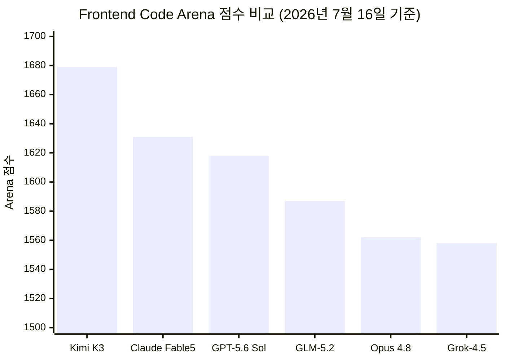
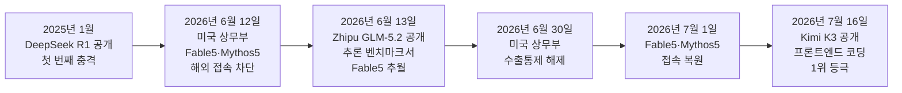

## 관련글

[**上一条说 Kimi K3 几个月就追平了闭源第一梯队。**](https://x.com/brobean88/status/2078485374557630603)

[**综合能力排全球第三，只输给 Claude Fable 5 和 GPT-5.6。**](https://x.com/brobean88/status/2078475522859037165)

## 목차

1. 이 문서가 다루는 것
2. 사건의 발단: 2026년 7월 16일, 상하이에서 벌어진 일
3. Kimi K3는 어떤 모델인가
4. 벤치마크 성적표: 1위와 3위가 동시에 성립하는 이유
5. 화제가 된 게시물의 핵심 주장 — "护城河(해자)"론
6. "해자"라는 개념: 버핏에서 실리콘밸리로
7. 사실관계 검증: 확인된 사실과 저자의 의견을 구분한다
8. 그림자처럼 따라붙는 의혹: "증류" 논란
9. 이번이 처음이 아니다 — 2025년부터 반복된 추격 패턴
10. 시장은 어떻게 반응했나
11. 댓글창의 반박들 — 해자는 정말 없는가
12. 종합 평가

---

## 1. 이 문서가 다루는 것

전달받은 게시물은 X(옛 트위터)에서 활동하는 계정 Bean 哥(@BroBean88)가 2026년 7월 18일 전후로 올린 두 개의 글타래와 그에 달린 댓글들이다. 두 글의 핵심 소재는 같은 날 벌어진 하나의 사건, 즉 중국 스타트업 문샷 AI(月之暗面, Moonshot AI)가 공개한 신형 언어모델 Kimi K3다. 저자는 이 모델의 등장을 근거로 "지금 대형 언어모델 회사들이 주장하는 기술적 우위, 즉 해자(护城河)라는 것이 실제로는 존재하지 않거나 있어도 반년을 넘기지 못한다"는 투자 관점의 주장을 펼친다.

이 문서는 그 주장이 딛고 선 사실관계를 하나하나 검증하고, 어디까지가 확인된 사실이고 어디부터가 저자 개인의 해석과 전망인지를 구분해서 정리하는 것을 목표로 한다. 아울러 댓글창에서 나온 반박 논리들도 함께 소개해서, 이 논쟁을 한쪽 시각으로만 보지 않도록 균형을 잡았다.

## 2. 사건의 발단: 2026년 7월 16일, 상하이에서 벌어진 일

2026년 7월 16일(현지시각), 베이징에 본사를 둔 문샷 AI가 새로운 대형 언어모델 Kimi K3를 공개했다. 공개 시점은 절묘했다. 바로 다음날 상하이에서 열리는 세계인공지능대회(WAIC 2026)를 하루 앞둔 시점이었고, 개막식에서는 시진핑 중국 국가주석이 연설을 통해 중국의 오픈소스 AI 전략을 재차 강조했다[18]. 문샷 AI 입장에서는 이보다 더 좋은 무대가 없었던 셈이다.

Kimi K3의 공개는 단순한 신제품 출시를 넘어서는 파장을 일으켰다. 공개 당일 반도체 및 AI 관련주가 일제히 흔들렸고, 이 사건을 다룬 다수의 외신은 2025년 초 딥시크(DeepSeek)의 R1 모델이 미국 AI 업계에 충격을 준 사건, 이른바 "딥시크 모멘트"에 빗대어 이번 일을 "두 번째 딥시크 모멘트"라고 표현했다[5][18]. Axios는 이 사건을 두고 "미국의 AI 우위를 지워버렸다"는 제목의 기사를 내보냈을 정도다[46].

## 3. Kimi K3는 어떤 모델인가

문샷 AI가 공개한 자료에 따르면 Kimi K3는 총 2조 8천억 개의 매개변수(파라미터)를 가진 모델로, 공개된 가중치(weight) 기준으로는 현재까지 나온 오픈소스 모델 중 가장 큰 규모다[1][3]. 이는 직전 모델인 Kimi K2.6보다 약 2.8배 커진 것이며, 같은 시기 중국의 경쟁 모델들과 비교해도 상당히 큰 편이다. 딥시크의 V4 Pro는 약 1조 6천억 개, 즈푸(Zhipu, 해외 브랜드명 Z.ai)의 GLM-5.2는 약 7,440억 개 수준으로 알려져 있다[1].

기술적으로는 두 가지 자체 개발 구조가 눈에 띈다. 하나는 Kimi Delta Attention(KDA)이라는 하이브리드 선형 어텐션 방식이고, 다른 하나는 Attention Residuals(AttnRes)라는, 기존 잔차 연결(residual connection)을 대체하는 구조다[1][3]. 문샷 측은 이 두 기술을 통해 연산 효율을 높이고 추론 품질을 개선했다고 설명한다. 실제 활성화되는 전문가(expert) 수는 전체 896개 중 16개, 비율로는 약 1.8%에 불과해 전체 파라미터 규모에 비해 추론 비용을 억제하는 구조를 택했다[12].

그 밖에 100만 토큰 규모의 컨텍스트 창을 지원하고, 이미지 등을 이해하는 네이티브 비전 기능을 갖췄으며, 항상 사고 과정을 거치는 "사고 모드(thinking mode)"가 기본으로 켜져 있다[3]. API 가격은 입력 토큰 100만 개당 3달러, 출력 토큰 100만 개당 15달러로 책정됐는데, 이는 중국 AI 연구소가 내놓은 모델 중 가장 비싼 축에 속하지만, 앤트로픽의 Opus 4.8과 비교하면 작업당 비용 기준으로 대략 절반 수준이라는 평가가 나온다[1]. 다른 보도에서는 Fable 5의 출력 토큰 가격이 100만 개당 50달러 수준이라는 점을 들어, Kimi K3가 이보다 40% 정도 저렴하다고 분석했다[46]. 다만 초기 사용자들 사이에서는 추론 토큰 소모량이 상당히 많다는 지적도 나왔는데, 예컨대 SVG 형태의 펠리컨 그림 하나를 생성하는 단순한 작업에도 13,241개의 토큰이 소모되어 약 0.25달러가 들었다는 사례가 보고됐다[1]. 완전한 모델 가중치는 2026년 7월 27일에 공개될 예정이며, 이 문서를 쓰는 시점(7월 19일)까지는 아직 공개되지 않았다[3][12].

## 4. 벤치마크 성적표: 1위와 3위가 동시에 성립하는 이유

원문 게시물에서 가장 자주 인용되는 두 개의 숫자, 즉 "종합 능력 세계 3위"와 "프론트엔드 코딩 세계 1위"는 사실 서로 다른 두 개의 평가 체계에서 나온 결과다. 이 둘을 혼동하지 않는 것이 이번 사건을 정확히 이해하는 열쇠다.

우선 종합적인 지능 평가에서는 Kimi K3가 앤트로픽의 Claude Fable 5, 오픈AI의 GPT-5.6 Sol에 이어 3위를 기록했다는 것이 여러 매체를 통해 확인된다[1][12]. 문샷 스스로도 자사 평가에서 이 두 모델에는 못 미친다고 인정했으며, 다만 Claude Opus 4.8과 GPT-5.5를 비롯한 나머지 모델들은 코딩, 시각 이해, 장기 작업 처리 등 여러 영역에서 앞질렀다고 밝혔다[4][12].

반면 화제의 중심이 된 "1위"는 Arena.ai라는 평가 플랫폼이 운영하는 프론트엔드 코드 아레나(Frontend Code Arena) 리더보드에서 나온 결과다. 이 리더보드는 실제 개발자들이 두 모델이 만든 프론트엔드 결과물을 눈으로 비교해서 어느 쪽이 더 나은지 투표하는 방식(Elo 방식의 사람 선호도 평가)으로 순위를 매긴다[7]. 여기서 Kimi K3는 1,679점을 기록하며 1위에 올랐고, Claude Fable 5(1,631점), GPT-5.6 Sol(1,618점), GLM-5.2(1,587점), Claude Opus 4.8(1,562점), Grok-4.5(1,558점)를 모두 앞질렀다[9][11]. 직전 모델인 Kimi K2.6이 같은 리더보드에서 18위, 1,515점에 머물렀던 것과 비교하면 한 세대 만에 17계단을 뛰어오른 셈이다[6][7][10].

세부적으로 보면 이 리더보드는 브랜드/마케팅, 참고자료 기반 디자인, 데이터/분석, 소비자 제품, 시뮬레이션, 콘텐츠 제작 도구, 게임까지 총 7개 영역으로 나뉘는데, Kimi K3는 게임 영역을 제외한 6개 영역에서 1위를 차지했다. 게임 영역에서는 Claude Fable 5가 근소하게 앞섰다[6][9]. 다만 이 평가에는 짚고 넘어가야 할 한계도 있다. Kimi K3의 순위는 1,757건의 유효 투표를 바탕으로 산출됐는데, 이는 Claude Fable 5의 2,505건, GPT-5.6 Sol의 2,542건에 비해 표본이 작다[7]. 또한 이 리더보드 자체가 "사람이 눈으로 보기에 어느 쪽 결과물이 더 그럴듯한가"를 재는 것이지, 추론 능력이나 수학, 장기간에 걸친 에이전트형 코딩 작업, 도구 사용 능력을 재는 것은 아니라는 지적도 여러 분석 글에서 반복해서 나온다[11]. AI 관련 도구를 개발하는 사이먼 윌리슨(Simon Willison)도 출시 당일 작성한 글에서, Kimi K3가 Arena.ai의 프론트엔드 코드 아레나에서 Claude Fable 5를 넘어선 선두 모델이라고 인정하면서도, 이는 좁은 범위의 승리라는 점을 함께 짚었다[11].

정리하면, "세계 1위"는 사실이지만 프론트엔드 코딩이라는 좁은 영역, 그것도 사람의 취향에 기반한 선호도 평가에서의 1위이고, "세계 3위"는 더 폭넓은 종합 지능 평가에서의 순위다. 두 숫자 모두 근거가 있는 사실이며, 서로 모순되지 않는다.

## 5. 화제가 된 게시물의 핵심 주장 — "护城河(해자)"론

원문 게시물의 저자는 이 벤치마크 결과를 근거로 훨씬 더 큰 주장을 펼친다. 요약하면 다음과 같은 논리 흐름이다.

대형 언어모델 하나가 앞서가는 기간은 점점 짧아지고 있다. 딥시크가 작년에 오픈AI를 식은땀 나게 추격했고, 즈푸의 GLM이 해외 평판에서 반전을 이뤘으며, 이번에는 Kimi K3가 프론트엔드 코딩에서 Fable 5를 앞질렀다는 것이다. 저자는 어느 폐쇄형 모델이 우위를 확립해도 최대 반년이면 오픈소스 모델이 따라잡고, 그것도 가중치가 완전히 공개돼 누구나 가져다 쓸 수 있는 형태로 따라잡는다는 패턴을 지적한다. 이어서 저자는 한 댓글을 인용하며, 앤트로픽 CEO가 클로드 코드에 집중적으로 투자해 프로그래밍 영역에서 방어선을 구축한 것처럼 보였지만, 반년 뒤 중국 모델이 성능을 따라잡고 가격을 10분의 1 수준으로 낮추면 상장(IPO)조차 어려워질 것이라는 다소 신랄한 전망을 소개한다.

이로부터 저자는 "모델 자체를 파는 것"을 사업의 핵심으로 삼는 회사, 즉 수백억에서 수천억 규모로 평가받으면서 "우리 모델이 가장 강하다"는 서사로 기업 가치를 설명하는 순수 모델 회사들이야말로 이번 AI 붐에서 가장 위험한 자산이라는 결론에 도달한다. 이런 회사들의 해자는 몇 년 단위가 아니라 몇 달 단위로 계산해야 한다는 것이 저자의 핵심 문장이다.

이 부분에서 분명히 짚어야 할 것이 있다. "반년 뒤에는 가격이 10분의 1이 될 것"이라는 대목은 확인된 현재 사실이 아니라 저자가 제시한 미래 전망, 즉 저자 본인의 투자 가설이다. 실제로 확인되는 현재 시점의 가격 차이는 앞서 3장에서 살펴본 것처럼 Kimi K3가 Opus 4.8 대비 약 절반, Fable 5 대비 약 40% 저렴한 수준이며[1][46], "10분의 1"이라는 수치에 해당하는 근거는 검색을 통해 확인되지 않았다. 또한 "앤트로픽 CEO가 클로드 코드에 정조준 투자했다"는 서술도 앤트로픽이 공식적으로 그렇게 설명한 적이 있는지를 뒷받침하는 근거는 확인되지 않았으며, 이는 원문에 인용된 한 댓글 작성자의 해석으로 보는 것이 정확하다. 즉 이 절의 결론부는 사실 확인의 영역이 아니라 저자의 주관적 판단과 경고성 전망이라는 점을 분명히 해 둔다.

## 6. "해자"라는 개념: 버핏에서 실리콘밸리로

저자가 사용한 护城河(호성하)라는 표현은 원래 성 주위를 둘러싼 방어용 수로, 즉 해자(垓字, moat)를 가리키는 한자어다. 투자 세계에서 이 단어를 대중화시킨 인물은 워런 버핏으로 널리 알려져 있다. 그가 말한 해자란 후발주자가 쉽게 따라오지 못하도록 막아주는 지속가능한 경쟁우위를 뜻하며, 브랜드력, 규모의 경제, 전환비용, 네트워크 효과, 규제 진입장벽 등이 대표적인 예로 거론된다. 코카콜라의 제조 비법, 애플의 생태계, TSMC의 미세공정 기술처럼 수십 년이 지나도 경쟁자가 쉽게 따라잡지 못하는 우위가 전형적인 해자의 사례로 꼽힌다.

대형 언어모델 산업에 이 개념을 적용할 수 있는지는 이미 2023년경부터 업계 내부에서 논쟁이 있어 온 주제다. 당시 구글 내부 문건으로 알려진 이른바 "우리에게는 해자가 없다(We Have No Moat)"는 메모가 유출되면서, 오픈소스 커뮤니티가 폐쇄형 대형 모델의 기술 격차를 빠르게 좁히고 있다는 우려가 처음 공론화된 바 있다. 이번 Kimi K3 사건은 그 논쟁의 2026년 버전이라고 볼 수 있다.

## 7. 사실관계 검증: 확인된 사실과 저자의 의견을 구분한다

이 사건을 둘러싼 서로 다른 성격의 주장들을 표로 정리하듯 나눠보면 다음과 같다.

먼저 명확히 확인된 사실들이다. Kimi K3가 2026년 7월 16일 공개됐다는 것, 2조 8천억 개 파라미터로 현존 최대 규모의 오픈 웨이트 모델이라는 것, Arena.ai의 프론트엔드 코드 리더보드에서 1위에 올라 직전 모델보다 17계단 상승했다는 것, 종합 지능 평가에서는 Fable 5와 GPT-5.6 Sol에 이어 3위에 머물렀다는 것은 다수의 독립적인 매체와 평가 기관을 통해 교차 확인된다[1][3][6][7][9][11][12].

다음으로 실제로 일어났지만 해석의 여지가 있는 사실들이다. 딥시크가 2025년 초 R1을 공개해 오픈AI를 비롯한 미국 AI 업계에 충격을 준 사건은 실제로 있었던 일이며, 이번 Kimi K3 사건을 다룬 여러 매체가 이를 "두 번째 딥시크 모멘트"라고 부른 것도 사실이다[5][18][37]. 다만 이런 명명 자체가 언론이 부여한 서사적 프레임이라는 점, 그리고 "충격"의 정도를 계량하기는 어렵다는 점은 감안할 필요가 있다.

마지막으로 저자 개인의 해석이거나 검증되지 않은 전망인 부분들이다. "반년 뒤 가격이 10분의 1 수준이 될 것"이라는 전망, "순수 모델 회사가 이번 AI 붐에서 가장 위험한 자산"이라는 투자 판단, "해자는 몇 달 단위로 계산해야 한다"는 결론은 모두 저자 본인의 주장이며 사실 검증의 대상이 아니라 의견의 영역에 속한다. 이 문서는 이 부분들을 사실인 것처럼 전달하지 않도록 주의했다.

## 8. 그림자처럼 따라붙는 의혹: "증류" 논란

Kimi K3를 둘러싼 논쟁에는 한 가지 더 무거운 쟁점이 있다. 바로 이 모델이 앤트로픽의 클로드 출력물을 무단으로 학습에 활용하는 이른바 "증류(distillation)" 방식으로 만들어진 것 아니냐는 의혹이다.

이 논란에는 명확한 사실의 층위와 아직 증명되지 않은 추정의 층위가 섞여 있어 구분이 필요하다. 확인되는 사실은, 앤트로픽이 2026년 2월 딥시크, 미니맥스, 문샷 AI 등 중국 AI 연구소들을 상대로 산업적 규모의 증류 활동을 벌였다고 공개적으로 문제를 제기한 적이 있다는 점이다. 다만 이때 거론된 구체적 수치는 매체마다 다소 차이가 있어서, 어떤 보도에서는 사기성 계정 약 2만 4천 개와 1,600만 건이 넘는 상호작용이 언급됐고[16], 다른 보도에서는 340만 건의 클로드 상호작용이 언급됐다[12]. 두 수치 모두 앤트로픽의 2월 발표를 인용하고 있지만 정확히 일치하지는 않아, 이 문서에서는 어느 한 숫자를 확정적으로 제시하지 않고 그대로 병기해 둔다.

이후 7월 Kimi K3가 공개된 직후에는, 일부 사용자가 대화 중 Kimi K3가 스스로를 "앤트로픽이 만든 AI 어시스턴트 클로드"라고 소개했다는 사례가 사회관계망서비스에서 공유되며 다시 논란이 불붙었다[13][14][19]. 그러나 이 사례를 다룬 여러 분석 글은 한결같이 신중한 태도를 취하고 있다. 모델이 스스로를 다른 AI로 소개하는 현상은 증류의 결정적 증거가 아니라, 학습 데이터 오염이나 시스템 프롬프트 설정 오류, 공개된 데이터셋에 섞여 들어간 예시 문장 등 다른 원인으로도 얼마든지 나타날 수 있다는 것이다[27]. 한 분석은 이 사안을 두고 앤트로픽의 2월 고발을 뒷받침하는 실제 증거는 있지만, "Kimi K3가 도난당한 클로드 데이터로 만들어졌다"는 구체적 주장 자체는 아직 증명되지 않은 추정에 머물러 있다고 결론지었다[23]. 또 다른 정보기술 매체 역시, 공개된 K3의 수치들은 어디까지나 문샷 측이 자체적으로 발표하거나 API 접근을 통해 확인한 것일 뿐이며, 7월 27일 가중치가 공개돼야 독립적인 검증이 가능하다고 지적했다[12].

요약하면, 앤트로픽이 실제로 증류 의혹을 공식 제기했다는 사실과, Kimi K3가 자신을 클로드로 소개한 사례가 실제로 목격됐다는 사실 자체는 확인된다. 그러나 이 두 사실을 근거로 "Kimi K3는 클로드를 훔쳐서 만든 모델"이라고 단정하는 것은 현재까지의 공개 정보만으로는 지나친 비약이다. 이 문서에서도 이 부분은 "논란이 진행 중"이라는 상태로만 서술하고, 사실로 확정하지 않는다.

## 9. 이번이 처음이 아니다 — 2025년부터 반복된 추격 패턴

Kimi K3 사건을 하나의 독립된 뉴스로만 보면 맥락을 놓치기 쉽다. 최근 1년 반 동안 미국 폐쇄형 모델과 중국 오픈 웨이트 모델 사이에서는 비슷한 패턴의 사건이 여러 차례 반복됐다.

특히 주목할 부분은 2026년 6월의 사건들이다. 미국 상무부는 6월 12일 수출통제를 근거로 앤트로픽의 최신 모델인 Fable 5와 Mythos 5의 해외 이용자 접속을 차단하도록 조치했고, 앤트로픽은 실시간으로 국적을 검증할 방법이 없다는 이유로 두 모델의 접속을 전 세계적으로 중단했다[21][40]. 바로 다음날인 6월 13일, 즈푸 AI가 GLM-5.2를 공개하며 추론 능력을 재는 BridgeBench Reasoning 벤치마크에서 Fable 5를 앞질렀다고 발표했다[40]. 여러 매체는 이 타이밍이 우연이 아니라고 짚었다. 미국의 수출통제로 생긴 공백을 중국 오픈소스 모델이 곧바로 파고든 모양새였기 때문이다[39][40]. 이후 미국 상무부는 6월 30일 해당 수출통제를 해제했고, 앤트로픽은 7월 1일부로 Fable 5와 Mythos 5의 접속을 전 세계적으로 복원했다[40]. 그리고 보름 만인 7월 16일, 이번에는 문샷 AI의 Kimi K3가 프론트엔드 코딩 영역에서 같은 방식의 추월을 재현했다.

이런 흐름을 보면 원문 게시물 저자가 말한 "반년마다 따라잡힌다"는 표현이 완전히 근거 없는 수사는 아니라는 점을 알 수 있다. 다만 이것이 "해자가 아예 없다"는 결론으로 곧바로 이어지는지는 다음 장에서 다루는 반박 논리들을 함께 봐야 균형 잡힌 판단이 가능하다.

## 10. 시장은 어떻게 반응했나

Kimi K3 공개 이후 실제 금융시장에서도 상당한 동요가 있었다. Fortune의 보도에 따르면 공개 다음날인 7월 17일, 이미 진행 중이던 반도체 업종의 매도세가 한층 가팔라졌다. 세계 최대 파운드리 업체인 TSMC는 분기 영업이익이 77% 급증했다는 실적 발표에도 불구하고 주가가 7% 하락했고, 오픈AI의 사실상 대리 종목으로 여겨지는 소프트뱅크는 9.0% 떨어졌다. 문샷의 경쟁사인 즈푸 AI(Z.ai)는 홍콩 증시에서 거의 30% 가까이 폭락했는데, 이는 자사보다 더 저렴하면서 성능은 앞서는 경쟁 모델의 등장이 반영된 결과로 해석됐다. 미국 시장에서도 그 여파가 감지되어, 나스닥100 지수가 1.0% 하락했고 엔비디아 주가는 1.2% 내리며 한때 시가총액 세계 1위 자리를 애플에 내줬으며, 메타 주가는 2.4% 넘게 빠졌다[5].

이런 반응은 원문 게시물 저자가 말한 "모델 회사는 고위험 자산"이라는 주장과 결이 닿아 있다. 다만 이는 단 하루의 시장 반응이라는 점, 그리고 반도체·빅테크 주가는 AI 모델의 경쟁력 외에도 수많은 다른 변수에 영향을 받는다는 점 역시 함께 고려해야 한다.

## 11. 댓글창의 반박들 — 해자는 정말 없는가

전달받은 게시물의 댓글창에는 원문 저자의 주장에 동의하지 않는 목소리도 상당수 섞여 있었다. 이 반박들은 단순한 감정적 반응을 넘어 나름의 논리를 갖추고 있어 함께 소개할 가치가 있다.

한 댓글 작성자는 리더보드 순위가 실제 실력과 동일시될 수 없다고 지적하면서, 만약 대형 언어모델에 정말로 해자가 없다면 자금과 컴퓨팅 자원, 인재를 모두 갖춘 일론 머스크나 마크 저커버그의 회사가 왜 리더보드 상위권에 오르는 제품을 내놓지 못하는지, 반대로 상대적으로 자원이 부족했던 문샷이나 즈푸 같은 회사는 어떻게 해낼 수 있었는지를 반문했다. 다른 댓글은 진짜 해자는 몇 장의 그래픽카드가 아니라 인재라고 짧게 응수했다. 또 다른 댓글은 이번 결과가 결국 GPT나 클로드 같은 모델이 만들어낸 합성 데이터를 흡수해서 역으로 반영한 결과일 수 있다는 관점을 제시하며, 진짜 방어선은 파라미터 규모가 아니라 데이터가 순환하는 구조 자체에 있다고 주장했다.

한편 영어로 작성된 한 댓글은 이번 사건에서 진짜 주목할 지점은 오픈소스의 발전 속도 그 자체이며, 이것이 기업들이 자신의 경쟁우위를 바라보는 방식 자체를 바꾸고 있다고 짚었다. 또 다른 댓글은 모델 자체의 해자는 얕아지고 있는 것이 맞지만, 생태계와 제품, 실행력에서 나오는 해자는 오히려 깊어지고 있다는 관점을 제시하며 원문 저자의 결론을 절반만 받아들이는 절충적인 시각을 보였다. 실제로 리더보드에서 앞선 모델이라 해도 2.8조 개에 이르는 파라미터를 실제로 구동하려면 막대한 메모리와 연산 자원이 필요해서, 일반 개발자가 이를 내려받아 쓰는 것조차 쉽지 않다는 현실적인 지적도 나왔다. 이는 "오픈소스가 정말 누구에게나 열려 있는가"라는 질문으로 이어진다.

## 12. 종합 평가

이번 사건에서 확실하게 검증되는 사실은 이렇다. Kimi K3는 실존하는, 실제로 공개된 대형 언어모델이며, 프론트엔드 코딩이라는 특정 영역의 사람 선호도 평가에서 1위를 차지한 것은 사실이다. 동시에 더 폭넓은 종합 능력 평가에서는 앤트로픽과 오픈AI의 최상위 모델에 이어 3위에 머문 것도 사실이다. 이런 추월과 추격이 지난 1년 반 사이 딥시크, 즈푸, 문샷의 순서로 반복돼 왔다는 것도 여러 매체를 통해 확인되는 패턴이다.

반면 확실하게 검증되지 않는 부분도 있다. Kimi K3가 클로드를 무단으로 증류해서 만들어졌다는 구체적 주장은 정황 증거만 있을 뿐 확정된 사실이 아니며, "반년 뒤 가격이 10분의 1이 될 것"이라는 전망이나 "순수 모델 회사가 가장 위험한 자산"이라는 결론은 원문 저자 개인의 투자 판단이지 검증 가능한 사실 명제가 아니다.

결국 이 사건이 던지는 질문, 즉 "대형 언어모델 그 자체에 지속가능한 경쟁우위가 존재하는가"라는 질문에는 아직 어느 쪽으로도 완전히 결론이 나지 않았다고 보는 것이 정직한 평가다. 모델의 성능 격차가 반년 단위로 좁혀지고 있다는 관찰은 여러 사례로 뒷받침되지만, 그것이 곧 모델을 만드는 회사 전체의 사업 가치가 무너진다는 뜻인지, 아니면 댓글창의 반박처럼 생태계와 제품, 실행력이라는 다른 층위의 해자가 여전히 유효한지는 앞으로 시장과 사용자들이 시간을 두고 검증해 나갈 문제로 남아 있다.

---

## 참고 자료

[1] MLQ News, "Moonshot AI Releases Kimi K3, a 2.8-Trillion-Parameter Open-Weight Model Rivaling Top U.S. Systems" — https://mlq.ai/news/moonshot-ai-releases-kimi-k3-a-28-trillion-parameter-open-weight-model-rivaling-top-us-systems/

[3] VentureBeat, "China's Moonshot AI releases Kimi K3, the largest open-source model ever, rivaling top U.S. systems" — https://venturebeat.com/technology/chinas-moonshot-ai-releases-kimi-k3-the-largest-open-source-model-ever-rivaling-top-u-s-systems

[4] TradingKey, "Chinese AI Startup Moonshot AI Launches Kimi K3 Model, Saying It Rivals OpenAI and Anthropic" — https://www.tradingkey.com/analysis/stocks/hk-stocks/262037443-moonshot-ai-kimi-k3-openai-anthropic-tradingkey

[5] Fortune, "Markets experience new DeepSeek shock after MoonShot AI releases Kimi K3" — https://fortune.com/2026/07/17/china-moonshot-kimi-k3-markets-china-ai/

[6] CryptoBriefing, "Kimi K3 by Moonshot AI ranks No. 1 in Frontend Code Arena, dethroning Claude and GPT" — https://cryptobriefing.com/kimi-k3-moonshot-ai-frontend-code-arena/

[7] Winzheng, "Kimi K3 Tops Frontend Code Arena with 1679 Points" — https://www.winzheng.com/en/article/kimi-k3-tops-frontend-code-arena-moonshot-ai

[9] FourWeekMBA, "Kimi-K3 Takes the Top Spot on Arena.ai's Frontend Code Leaderboard" — https://fourweekmba.com/ai-kimi-k3-moonshot-ai-arena-frontend-code-leaderboard-open-wei/

[10] Arena.ai, X 공식 계정 발표 — https://x.com/arena/status/2077824029126504525

[11] Capital and Compute, "Kimi K3: Pricing, Specs, and Benchmarks" — https://capitalandcompute.net/blog/kimi-k3-explained/

[12] Tom's Hardware, "China's 2.8-trillion-parameter Kimi K3 beats Claude Fable 5 in Frontend Code Arena benchmark" — https://www.tomshardware.com/tech-industry/artificial-intelligence/moonshot-releases-2-8-trillion-parameter-kimi-k3

[13] Wccftech, "China's Kimi K3 Identifies Itself As Anthropic's Claude In At Least One Conversation" — https://wccftech.com/chinas-kimi-k3-identifies-itself-as-anthropics-claude-in-at-least-one-conversation-betraying-its-distilled-origins/

[14] ProPakistani, "China's Kimi K3 Calls Itself Claude, Exposing Illegal Distillation" — https://propakistani.pk/2026/07/18/chinas-kimi-k3-calls-itself-claude-exposing-illegal-distillation/

[16] Startup Fortune, "A Leaked Kimi K3 Promo Page Shows Moonshot Chasing an Edge Claude Already Has" — https://startupfortune.com/a-leaked-kimi-k3-promo-page-shows-moonshot-chasing-an-edge-claude-already-has/

[18] TransformerNews, "Open-source Kimi K3 model is no reason for China panic" — https://www.transformernews.ai/p/kimi-k3-is-no-reason-for-china-panic-export-controls-xi-jingping

[19] Trending Topics, "GLM-5.2: China's Zhipu AI Beats Even Google's Top Models With Its New Open LLM" — https://www.trendingtopics.eu/glm-5-2-chinas-zhipu-ai-beats-even-googles-top-models-with-its-new-open-llm/

[21] SCMP, "Zhipu AI's stock rockets after Chinese firm launches open-source GLM-5.2 model" — https://www.scmp.com/tech/tech-trends/article/3357115/zhipu-ais-stock-rockets-after-chinese-firm-makes-glm-52-open-source

[23] MayhemCode, "Should You Switch From Claude Opus/Fable to Kimi K3? I Did the Math" — https://www.mayhemcode.com/2026/07/should-you-switch-from-claude-opusfable.html

[27] Wccftech (동일 기사 재인용)

[39] Technology.org, "Zhipu's GLM 5.2 Rivals Opus 4.8 on Coding Benchmarks at a Fifth of the Cost" — https://www.technology.org/2026/07/02/zhipus-glm-5-2-rivals-opus-4-8-on-coding-benchmarks-at-a-fifth-of-the-cost/

[40] ExplainX, "GLM-5.2 Beats Fable 5 Reasoning" — https://explainx.ai/blog/glm-5-2-zhipu-china-ai-response-fable-5-ban-2026

[46] Axios, "China just erased America's AI lead" — https://www.axios.com/2026/07/17/china-ai-kimi-k3-open-source-anthropic-opus

---

*이 문서는 2026년 7월 19일 기준으로 확인 가능한 공개 보도를 근거로 작성됐다. Kimi K3의 전체 가중치는 아직 공개 전(2026년 7월 27일 예정)이므로, 독립적인 재현 검증이 이뤄지기 전까지 일부 수치는 문샷 AI 측 발표 또는 API 접근을 통한 초기 평가에 근거하고 있다는 점을 밝혀둔다.*
