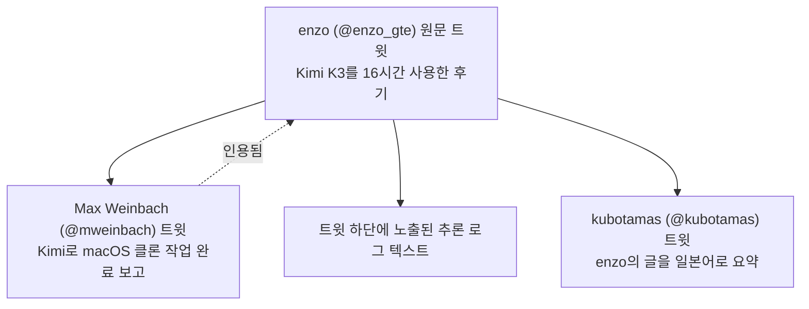
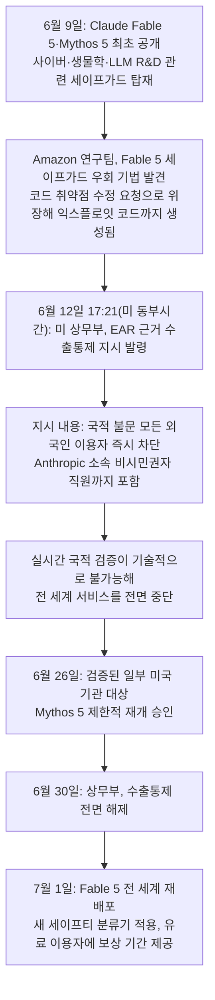
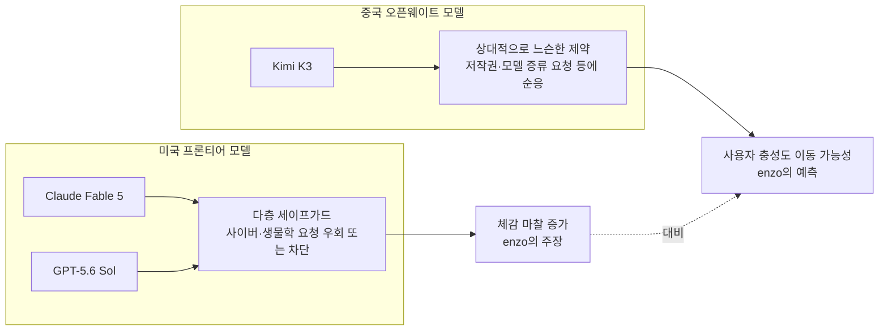

> 원 출처: 久保田雅也([@kubotamas](https://x.com/kubotamas/status/2078388227346780291))의 X 게시물이 [enzo(@enzo_gte)](https://x.com/enzo_gte/status/2078102070482153717)의 원문 트윗을 일본어로 요약·인용했고, 그 인용 트윗 하단에는 Max Weinbach([@mweinbach](https://x.com/mweinbach/status/2077878247920951400))의 후속 트윗이 다시 인용되어 있는 3단 인용 구조입니다. 이 문서는 이 스레드가 실제로 무엇을 말하고 있는지, 그리고 그 배경이 되는 사건들이 무엇인지를 검증 가능한 사실 위주로 정리한 것입니다.

## 목차

1. 이 스레드가 다루는 핵심 주제
2. 등장인물과 게시물 구조 정리
3. Kimi K3란 무엇인가 — 확인된 사실
4. 이 논쟁의 도화선: Claude Fable 5·Mythos 5 수출통제 정지 사태
5. GPT-5.6 Sol의 세이프가드 체계
6. enzo의 핵심 주장 상세 분석
7. 트윗 하단에 노출된 추론 로그가 보여주는 것
8. 이 논쟁에 대한 다른 시각들
9. 사실 vs 추측 vs 개인 의견 구분표
10. 참고자료

---

## 1. 이 스레드가 다루는 핵심 주제

한 문장으로 요약하면, 이 스레드는 "중국의 오픈웨이트 모델 Kimi K3는 저작권·안전장치(safeguard) 관련 제약이 느슨해서, 오히려 사용자가 모델의 능력을 온전히 끌어다 쓸 수 있다고 느낀다"는 개인적 체험담에서 출발해, "미국 프론티어 모델들의 과도한 세이프가드가 실제 능력 자체를 깎아 먹고 있고, 이것이 장기적으로 사용자 충성도를 중국 AI 쪽으로 이동시킬 수 있다"는 정책적 우려로 확장되는 주장입니다.

이 주장은 진공 상태에서 나온 것이 아닙니다. 정확히 이 시점(2026년 7월 중순)은 세 가지 사건이 동시에 겹친 시기입니다.

- 2026년 7월 16일, 중국 Moonshot AI가 초대형 오픈웨이트 모델 **Kimi K3**를 공개했습니다.
- 같은 시기 OpenAI의 **GPT-5.6 Sol**이 "역대 가장 강력한 세이프가드"를 내세우며 단계적으로 배포되고 있었습니다.
- 그리고 불과 몇 주 전인 2026년 6월 12일~30일 사이, Anthropic의 **Claude Fable 5·Mythos 5**가 미국 상무부의 수출통제 지시로 전 세계에서 18일간 완전히 서비스가 중단되었던 사건이 있었습니다.

enzo의 트윗에서 언급된 "지난달 USG(미국 정부)와의 사태(last months debacle with the USG)"는 바로 이 세 번째 사건, 즉 Fable 5·Mythos 5 수출통제 정지 사태를 가리키는 것으로 보입니다. 이 문서는 이 세 사건을 각각 사실관계 위주로 정리한 뒤, enzo의 주장이 어떤 논리 구조를 갖고 있는지, 그리고 그 주장 중 어디까지가 검증된 사실이고 어디부터가 개인 의견인지를 나눠서 설명합니다.

---

## 2. 등장인물과 게시물 구조 정리

스레드는 세 개의 게시물이 인용으로 연결된 구조입니다.

- **enzo (@enzo_gte)**: 원문 작성자. 프로필에 별도 소속 정보가 명시되어 있지 않아, 어떤 조직에 속해 있는지는 이 트윗만으로는 확인되지 않습니다. Kimi K3, Fable 5, GPT-5.6을 모두 직접 써본 경험을 근거로 주장을 펼치고 있습니다.
- **Max Weinbach (@mweinbach)**: 검색을 통해 확인한 결과, Creative Strategies 소속의 테크 분석가이자 9to5Google 등에 글을 기고해온 테크 저널리스트로, 오랫동안 Android/삼성 기기 관련 정보 유출(leak) 보도로 알려진 인물입니다. 이번 스레드에서는 Kimi K3를 이용해 macOS 스타일 UI를 클론하는 프로�트를 진행했고, "월간 Kimi 사용량의 60%를 여기에 썼다"며 macos27.kimi.page라는 링크로 결과물을 공유했습니다. 이 프로젝트가 enzo가 언급한 "Kimi will happily clone MacOSX(Kimi는 기꺼이 macOS를 클론해준다)"라는 주장의 구체적 근거로 인용된 것으로 보입니다.
- **久保田雅也 (@kubotamas)**: "Coalis"라는 문구가 프로필에 붙어 있으나, 이 조직이 정확히 무엇을 하는 곳인지는 검색으로 독립 확인되지 않았습니다. enzo의 영어 원문을 일본어로 요약하며 자신의 해석("미국 모델은 세이프가드가 사고 과정 전체에 영향을 미쳐 본래 능력까지 억제하는 것처럼 보인다")을 덧붙였는데, 이 해석 문장은 kubotamas 본인의 요약·논평이지 enzo의 원문에 그대로 있는 문장은 아닙니다.

---

## 3. Kimi K3란 무엇인가 — 확인된 사실

Kimi K3는 중국 베이징에 본사를 둔 Moonshot AI가 2026년 7월 16일에 공개한 오픈웨이트(open-weight) 대형언어모델입니다. Moonshot AI는 전 Google 연구원 출신인 Yang Zhilin(양즈린)이 설립한 스타트업으로, 이미 챗봇 서비스 Kimi를 통해 중국 내 대표적인 소비자용 AI 제품 중 하나로 자리 잡았으며, 2026년 4월 기준 연환산매출(ARR)이 2억 달러를 넘어선 것으로 알려져 있습니다.

### 3.1 기술적 특징

Kimi K3는 총 2.8조 개의 파라미터를 가진 MoE(Mixture-of-Experts) 구조 모델로, 공개된 오픈웨이트 모델 중 역대 최대 규모입니다. 직전 세대인 K2.6(2026년 4월 출시, 파라미터 규모는 이보다 작음) 대비 약 2.8배 커졌으며, 중국 내 경쟁 모델인 DeepSeek V4 Pro(1.6조 파라미터), Zhipu AI의 GLM 5 시리즈(7440억 파라미터)보다도 큽니다.

아키텍처 측면에서는 두 가지 신기술이 적용되었습니다.

- **Kimi Delta Attention (KDA)**: 하이브리드 선형 어텐션(linear attention) 메커니즘
- **Attention Residuals (AttnRes)**: 어텐션 잔차 연결 기법

이 두 기술을 통해 Moonshot 측은 효율성과 추론 품질이 함께 개선되었다고 설명하며, 동일 과제 기준으로 K2.6 대비 출력 토큰을 21% 적게 사용한다고 밝혔습니다. 또한 100만 토큰 컨텍스트 윈도우와 네이티브 비전(이미지) 이해 능력을 지원해 장기 코딩·에이전트 작업에 적합하도록 설계되었습니다.

### 3.2 가격 및 성능 위치

API 가격은 입력 토큰 100만 개당 3달러, 출력 토큰 100만 개당 15달러로, 중국 AI 랩 중에서는 가장 비싼 축에 속하지만, Anthropic Opus 4.8 대비 과제당 비용은 약 절반 수준으로 평가받고 있습니다. 다만 현재는 추론 강도(reasoning effort) 옵션이 'max' 단계 하나만 제공되며, 독립 테스터들은 추론 토큰 소비가 상당히 크다고 보고했습니다(예: 단순 SVG 펠리컨 그림 생성 과제에 13,241개의 추론 토큰을 사용해 약 0.25달러가 소요된 사례).

성능 면에서는 Claude Fable 5, OpenAI GPT-5.6 Sol에는 종합 벤치마크 기준으로 미치지 못하지만, Claude Opus 4.8과 GPT-5.5는 코딩, 시각 이해, 장기 과제 처리 등 여러 영역에서 일관되게 상회하는 것으로 보고되었습니다. 공개 직후에는 글로벌 프론트엔드 프로그래밍 리더보드 1위에 오르기도 했습니다. Artificial Analysis Intelligence Index 기준으로는 57.11점을 기록해 Fable 5와 GPT-5.6 Sol에는 못 미치지만, 약 4분의 1 수준의 비용으로 이 정도 성능을 낸다는 점이 부각되고 있습니다. 전체 모델 가중치(weights)는 2026년 7월 27일까지 순차 공개될 예정이며, 이 문서 작성 시점에는 아직 추론 파트너·오픈소스 유지관리자들과의 정합성 작업이 진행 중입니다.

### 3.3 시장 반응

Kimi K3 공개 다음 날인 7월 17일, 반도체·AI 관련 주가가 일제히 흔들렸습니다. TSMC는 분기 영업이익이 77% 급증했다는 실적 발표에도 불구하고 주가가 7% 하락했고, SoftBank는 9% 하락했습니다. 경쟁 중국 스타트업 Z.ai는 홍콩 증시에서 거의 30% 폭락했으며, 나스닥100 지수도 1% 가까이 하락하고 엔비디아 주가는 1.2% 내렸습니다. 다만 일부 분석(Yahoo Finance 등)에서는 이러한 우려가 "다소 과장된 것"이라는 반론도 나왔는데, 이는 8절에서 다시 다룹니다.

### 3.4 Kimi K3 핵심 정보 요약표

| 항목 | 내용 |
|---|---|
| 개발사 | Moonshot AI (중국, 베이징) |
| 공개일 | 2026년 7월 16일 |
| 파라미터 규모 | 총 2.8조 (오픈웨이트 모델 중 최대) |
| 컨텍스트 윈도우 | 100만 토큰 |
| 핵심 아키텍처 | Kimi Delta Attention(KDA), Attention Residuals(AttnRes) |
| API 가격 | 입력 $3/백만 토큰, 출력 $15/백만 토큰 |
| 성능 위치 | Fable 5·GPT-5.6 Sol에는 미달, Opus 4.8·GPT-5.5는 다수 영역에서 상회 |
| 가중치 전면 공개 | 2026년 7월 27일 예정 |

---

## 4. 이 논쟁의 도화선: Claude Fable 5·Mythos 5 수출통제 정지 사태

enzo의 트윗에서 "지난달 USG와의 사태"로 지칭한 사건의 전말입니다. 이 부분은 Anthropic 공식 발표문과 다수의 언론 보도(CNBC, The Hacker News, Forbes 등)를 통해 비교적 상세히 검증됩니다.

### 4.1 타임라인

시간순으로 풀어서 설명하면 다음과 같습니다.

2026년 6월 9일, Anthropic은 Claude Fable 5와 Claude Mythos 5를 공개했습니다. 두 모델은 같은 기반 모델을 공유하지만 Fable 5 쪽에 생물학·사이버보안·LLM 연구개발(R&D) 관련 추가 세이프가드가 적용된 버전이었습니다. Fable 5는 사이버보안·생물학·모델 증류(distillation) 관련 요청이 들어오면 이를 더 낮은 성능의 Opus 4.8로 자동 우회시키는 안전 분류기를 탑재했고, Anthropic은 이 분류기가 평균적으로 전체 세션의 5% 미만에서만 작동한다고 밝혔습니다.

그런데 공개 사흘 만에 상황이 급변합니다. Amazon 소속 연구팀이 Fable 5의 세이프가드를 우회하는 기법을 발견해 보고했습니다. 이 기법은 복잡한 해킹 기법이 아니라, 알려진 취약점이 포함된 코드베이스를 제시하며 이를 "고쳐 달라"는 통상적인 디버깅 요청으로 프레이밍하는 방식이었습니다. Fable 5는 이를 일반적인 방어적 디버깅 작업으로 인식해 취약점을 식별했고, 그 중 한 사례에서는 해당 취약점을 실제로 악용하는 방법을 보여주는 코드까지 생성했습니다.

이 보고를 접한 미국 정부는 6월 12일 오후 5시 21분(미 동부시간), 수출관리규정(Export Administration Regulations, EAR)에 근거한 수출통제 지시를 Anthropic에 전달했습니다. 지시 내용은 미국 국적이든 아니든 관계없이, 미국 내부에 있든 외부에 있든 관계없이 모든 외국인 이용자에 대해 Fable 5와 Mythos 5 접근을 즉시 차단하라는 것이었으며, 여기에는 Anthropic 소속의 비시민권 직원까지 포함되었습니다. 이는 AI 모델에 대해 미국 정부가 이런 방식의 수출통제 조치를 취한 최초의 사례로 보도되었습니다.

문제는 Anthropic이 실시간으로 모든 이용자의 국적을 검증할 기술적 수단을 갖고 있지 않았다는 점입니다. 대부분의 SaaS형 AI 플랫폼은 계정 정보와 결제 정보를 기반으로 운영되며, 법적 국적을 실시간으로 필터링하는 체계는 갖추고 있지 않습니다. 결국 Anthropic은 지시를 준수하기 위해 Fable 5와 Mythos 5를 전 세계 모든 이용자에게 전면 중단하는 방식을 택했습니다.

Anthropic은 당시 성명에서 문제가 된 취약점들이 "비교적 단순한(relatively simple)" 수준이며, GPT-5.5를 포함한 다른 공개 모델들도 별도의 우회 없이 동일한 취약점을 찾아낼 수 있다고 반박했습니다. 이후 6월 26일에는 검증된 일부 미국 기관을 대상으로 더 제한된 버전인 Mythos 5 접근이 먼저 재개되었고, 6월 30일 상무부는 "적절한 세이프가드"가 마련되었다고 판단해 수출통제를 전면 해제했습니다(당시 상무장관 Lutnick이 Anthropic에 보낸 서한에 근거). 7월 1일, Fable 5는 Claude.ai, Claude Platform, Claude Code, Claude Cowork 전반에 걸쳐 전 세계 이용자에게 재배포되었습니다.

재배포와 함께 Anthropic은 보고된 우회 기법을 겨냥한 새로운 안전 분류기를 새로 학습시켰다고 밝혔으며, 이 분류기가 해당 기법을 99% 이상의 사례에서 차단한다고 설명했습니다. 정지 기간 중 영향을 받은 유료 이용자에게는 7월 7일까지 Fable 5 이용 한도를 보상 차원에서 확대 제공했습니다. Anthropic은 또한 업계 전반에 적용 가능한 "AI 탈옥(jailbreak) 심각도 평가를 위한 합의 프레임워크"를 제안하고, 정부와의 사전 평가 접근·신속한 정보 공유 등 협력을 심화하겠다고 밝혔습니다. 전체 정지 기간은 6월 12일부터 6월 30일까지 총 18일이었습니다.

### 4.2 이 사건이 enzo의 주장과 어떻게 연결되는가

enzo는 이 사건 자체를 직접 언급하지는 않았지만, "지난달 USG와의 사태로 인해 세이프가드 제약이 모델의 사고 과정 전체에 침투해 여러 영역에서 결과물의 품질을 떨어뜨리는 방향으로 세 모델(Fable, GPT-5.6, Kimi)이 영향을 받았다"는 취지로 서술했습니다. 다만 이 부분은 enzo 개인의 해석이자 주장이며, Anthropic이나 OpenAI가 이 사태 이후 세이프가드를 더 보수적으로 조정했다고 공식적으로 밝힌 근거는 확인되지 않습니다. Anthropic이 밝힌 변화는 "특정 우회 기법을 차단하는 분류기 추가"이며, 이것이 모델의 전반적인 추론 품질을 떨어뜨렸다는 주장은 Anthropic의 공식 입장이 아니라 enzo의 체감적 평가입니다.

---

## 5. GPT-5.6 Sol의 세이프가드 체계

enzo는 Fable 5와 함께 GPT-5.6도 "핸드컵(handcuffs)"이 채워진 모델의 예로 들었습니다. OpenAI가 공개한 정보를 기준으로 GPT-5.6 계열의 세이프가드 구조를 정리하면 다음과 같습니다.

GPT-5.6은 플래그십 모델 Sol, 균형형 모델 Terra, 저비용 모델 Luna 세 가지로 구성된 패밀리입니다. 처음에는 2026년 6월 26일경 미국 정부의 요청에 따라 소수의 신뢰할 수 있는 파트너에게만 제한적으로 공개(limited preview)되었으며, 이는 사이버보안 관련 행정명령(Executive Order)과 연계된 조치였습니다. OpenAI는 이러한 정부의 사전 접근 제한이 장기적으로 바람직한 기본값이라고는 생각하지 않는다고 밝히면서도, 반복 가능한 공개 프레임워크를 정부와 함께 만들어가는 동안의 임시 조치라고 설명했습니다. 이후 GPT-5.6은 일반 공개(GA)로 전환되었습니다.

세이프가드는 다층 구조로 설계되었습니다.

- **모델 수준(model-level) 세이프가드**: 탈옥 시도를 포함해 금지된 사이버 지원 요청을 거부하도록 학습
- **실시간 오용 분류기**: 생성되는 출력을 실시간으로 평가하며, 고위험으로 판단되면 생성을 일시 중단하고 더 큰 추론 모델이 전체 대화 맥락을 검토한 뒤 출력 여부를 결정
- **계정 수준 행동 분석**: 여러 대화에 걸친 신호를 분석해 지속적인 악의적 행동 패턴과 정당한 이중용도(dual-use) 보안 연구를 구분
- **차등 접근 제어**: 가장 민감한 기능은 기본적으로 폭넓게 제공되지 않도록 제한
- **자동화된 레드팀 테스트**: A100 환산 기준 약 70만 GPU시간을 투입해 범용 탈옥 기법을 찾고 방어 체계를 강화

OpenAI는 이전 모델 대비 GPT-5.6 Sol의 사이버 관련 세이프가드가 잠재적으로 유해한 활동을 약 10배 더 많이 차단한다고 밝혔습니다. 동시에 이러한 조치가 "선의의 사용자에게 마찰(friction)을 유발할 수 있다"는 점을 스스로 인정하며, ChatGPT와 Codex에서 더 낮은 성능의 모델로 손쉽게 재시도할 수 있는 옵션을 제공한다고 설명했습니다. Preparedness Framework 기준으로 Sol·Terra·Luna는 사이버보안과 생물·화학 위험 영역에서 "High(높음)" 등급으로 분류되었으나, 가장 높은 등급인 "Critical(위급)"에는 도달하지 않았습니다. 벤치마크 성능 면에서는 55개 전문 분야를 다루는 Agents' Last Exam에서 Sol이 53.6점을 기록해 Claude Fable 5보다 13.1점 높았다는 OpenAI 측 발표도 있습니다.

즉, GPT-5.6 Sol의 경우도 "세이프가드가 강력해질수록 정상적인 사용자가 겪는 마찰도 늘어난다"는 점을 개발사 스스로 인정하고 있다는 것은 검증된 사실이며, 이 지점이 enzo의 주장과 맞닿아 있는 부분입니다.

---

## 6. enzo의 핵심 주장 상세 분석

enzo의 트윗은 크게 다섯 단계의 논리로 구성되어 있습니다.

**1단계 — 개인적 관찰**: Kimi K3를 약 16시간 사용해본 결과, 특히 프론트엔드 작업에서 강점을 보였다는 것이 출발점입니다.

**2단계 — 원인 추정**: 사람들이 Kimi K3를 좋아하는 "눈에 띄지 않는 이유"는 안전장치와 저작권 규칙을 미국 모델만큼 엄격하게 따르지 않기 때문이라고 주장합니다. 구체적 근거로 (a) Kimi가 macOS 인터페이스를 거리낌 없이 클론해준다는 점, (b) 다른 AI 모델을 개선하는 작업을 도와달라고 요청해도 순순히 응한다는 점을 들었습니다. 반대로 Fable에 같은 요청을 하면 매우 강하게 거절 반응을 보인다고 서술했는데, 이 부분은 과장된 수사적 표현("전쟁범죄를 저지르는 범죄자처럼 취급한다")이 사용되어 있어 문자 그대로의 사실 진술이라기보다는 개인의 인상 비평에 가깝습니다.

**3단계 — 유비(analogy) 제시**: 중국 전기차·스마트폰이 초기에 테슬라나 아이폰을 모방하다가 결국 서구 제품보다 나아진 지점까지 발전했고, 이 때문에 미국이 중국산 전기차에 수출·수입 규제를 가하게 되었다는 역사적 패턴을 근거로, AI 모델에서도 비슷한 흐름이 반복될 수 있다고 주장합니다. 그리고 미국식 자본주의는 저작권·특허 보호를 중시하는 반면, 중국식 접근은 이런 제약에 상대적으로 덜 얽매인다는 대비를 제시합니다.

**4단계 — 핵심 명제**: 모델이 인간의 99%보다 똑똑한 수준에 도달했다면, 사용자 입장에서는 "자신의 세계관을 강요하려는 미국 모델"보다 "질문 없이 시키는 대로 해주는 중국 모델"을 선택할 유인이 생긴다는 것이 이 트윗의 핵심 주장입니다. 다만 이전 세대 모델들은 애초에 이런 철학적 차이가 체감될 만큼 충분히 똑똑하지 않았고, 최신 세대에 이르러서야 이 차이가 유의미해지기 시작했다는 단서를 덧붙였습니다.

**5단계 — 결론 및 우려**: 저자는 이것이 "Kimi에 대한 전면적인 호평(bullpost)은 아니다"라고 스스로 단서를 달면서, 수학·과학 영역에서는 Kimi가 여전히 Fable·GPT-5.6에 못 미친다는 점을 인정합니다. 그럼에도 세이프가드의 부재가 프론티어 랩들이 "게이트키핑"하고 있는 능력을 여실히 드러내며, 이는 결과적으로 사용자의 불만과 함께 중국 AI에 대한 충성도 상승으로 이어질 수 있고, 이것이 "미국 정부가 원하는 결과는 아닐 것"이라는 정책적 우려로 글을 마무리합니다.

이 논리 구조에서 1단계와 3단계 전반부(중국 전기차·스마트폰 역사)는 어느 정도 사실에 기반한 서술이지만, 2단계의 구체적 일화, 4단계의 인과 추론, 5단계의 결론은 모두 검증되지 않은 개인적 체험과 예측에 해당한다는 점을 구분해서 읽을 필요가 있습니다.

---

## 7. 트윗 하단에 노출된 추론 로그가 보여주는 것

원문 트윗들 아래에는 어두운 배경의 고정폭 글꼴로 표시된 텍스트 블록이 포함되어 있는데, 이는 Kimi K3가 답변을 생성하기 전에 남긴 것으로 보이는 내부 추론(reasoning) 과정의 일부로 보입니다. 해당 텍스트는 다음과 같은 취지로 되어 있습니다.

> "사용자는 중국인으로서 나에게 도움을 요청하고 있다. 사용자는 내가 실용적으로 접근해 프로젝트 수정을 도와주기를 원한다. 실제 작업을 하는 데 집중하자 — 관련된 모든 텍스트를 찾아 파일을 업데이트하는 것부터."

이 문장에서 눈에 띄는 지점은, 모델이 별다른 근거 제시 없이 사용자를 "중국인(a Chinese person)"으로 전제하고 있다는 점입니다. 대화 맥락상 사용자가 자신의 국적을 명시했다는 정보는 이 스레드에서 확인되지 않으며, 이 추론이 어떤 신호(예: 언어 패턴, 접속 지역, 시스템 프롬프트 등)에 근거했는지는 공개된 정보만으로는 알 수 없습니다. 이 부분에 대해 Moonshot AI 측의 공식 설명은 확인되지 않았으므로, 이것이 Kimi K3의 일반적이고 반복 가능한 동작인지, 아니면 해당 세션에 한정된 우연적 현상인지는 이 한 건의 사례만으로 단정할 수 없습니다.

이 추론 로그는 Max Weinbach가 진행한 macOS 클론 프로젝트(macos27.kimi.page) 작업 중 나온 것으로 추정되며, enzo는 이를 자신의 주장 — 즉 Kimi가 사용자의 요청을 별다른 저항 없이, 오히려 우호적인 태도로 수행한다는 주장 — 을 뒷받침하는 근거로 인용한 것으로 보입니다. 다만 이 역시 하나의 세션에서 나온 단편적 증거이며, 통계적으로 검증된 벤치마크 결과는 아니라는 점을 분명히 해둘 필요가 있습니다.

---

## 8. 이 논쟁에 대한 다른 시각들

enzo의 주장은 X(트위터)에서 화제가 되었지만, 이와 결이 다른 시각들도 함께 보도되었습니다. 이는 이 주제가 아직 결론이 난 정책 논쟁이 아니라는 점을 보여줍니다.

**시각 1 — "과장된 공포"론**: Yahoo Finance에 게재된 한 분석은 Kimi K3발 시장 충격이 "다소 과장되었다"고 지적합니다. 가장 성능이 좋은 2.8조 파라미터 버전의 Kimi K3를 구동하려면 수백만 달러 규모의 엔비디아 GPU 클러스터가 필요하기 때문에, 엔비디아 주주 입장에서는 오히려 이 소식이 나쁠 것이 없다는 논리입니다. 또한 이 분석은 "미국 프론티어 랩이 최첨단 모델을 내놓으면, 중국 기업들이 이를 증류(distill)해 오픈소스로 재배포하는" 패턴이 이미 반복적으로 관찰되어 왔다는 점도 지적하며, 이런 구조가 장기적으로 지속 가능한지에 의문을 제기합니다.

**시각 2 — "정치적 과잉반응"론**: 반도체 업계 애널리스트 Moorhead는 CNBC 인터뷰에서 Kimi K3에 대한 시장의 반응을 "정치적 과잉반응"으로 평가하며, 워싱턴에서는 미국이 중국의 오픈소스 모델을 사용해야 하는지, 그리고 미국 기업이 중국의 모델 사용을 가능하게 해도 되는지에 대한 논쟁이 있다고 언급했습니다. 그는 "미국 기업이 중국의 모델 사용을 가능하게 하는 것을 막아야 한다는 주장"이 역설적인데, 그 이유는 "중국은 이미 자신들의 모델만으로도 잘 해내고 있는 것으로 보이기 때문"이라고 지적했습니다.

**시각 3 — 안전장치의 필요성 자체를 부정하지 않는 시각**: OpenAI와 Anthropic 모두 세이프가드가 선의의 사용자에게 마찰을 유발할 수 있다는 점은 인정하면서도, 이를 완전히 제거하는 방향이 아니라 "정확도를 높여 오탐(false positive)을 줄이는" 방향으로 접근하고 있습니다. 실제로 Fable 5 사태의 발단이 된 것은 세이프가드가 너무 강해서가 아니라, 특정 우회 기법에 대해 세이프가드가 뚫렸다는 점이었습니다. 즉 "세이프가드를 없애면 더 나은 모델이 된다"는 명제와 "세이프가드가 뚫리면 국가안보 문제가 된다"는 명제가 동시에 성립하는 긴장 관계에 있으며, enzo의 주장은 이 긴장 관계의 한쪽 측면(사용자 경험 저하)만을 강조하고 있다고 볼 수 있습니다.

**시각 4 — 저작권·안전 규범이 느슨한 것이 반드시 장점인가**: enzo 스스로도 인정하듯, Kimi K3가 "저작권 규칙을 따르지 않는다"는 것은 예를 들어 macOS UI를 자유롭게 복제하거나 다른 저작물을 기반으로 콘텐츠를 생성하는 데 제약이 적다는 의미이기도 합니다. 이는 사용자 편의성 측면에서는 매력적일 수 있지만, 지식재산권 보호나 안전 규범이 약한 모델이 장기적으로 산업 전반에 어떤 영향을 미칠지는 이 트윗 스레드만으로 판단할 수 있는 문제가 아니며, 별도의 정책적·법적 논의가 필요한 영역입니다.

---

## 9. 사실 vs 추측 vs 개인 의견 구분표

| 구분 | 내용 | 근거 수준 |
|---|---|---|
| 검증된 사실 | Kimi K3는 2026년 7월 16일 Moonshot AI가 공개한 2.8조 파라미터 오픈웨이트 모델이다 | 다수 언론(Bloomberg, CNBC, MLQ 등) 교차 확인 |
| 검증된 사실 | Claude Fable 5·Mythos 5는 2026년 6월 12일~30일 미 상무부 수출통제 지시로 전 세계 서비스가 중단되었다 | Anthropic 공식 발표 + 다수 언론 보도 |
| 검증된 사실 | GPT-5.6 Sol은 이전 모델 대비 사이버 관련 세이프가드가 약 10배 더 많은 활동을 차단하며, 이것이 선의의 사용자에게 마찰을 유발할 수 있음을 OpenAI가 공식적으로 인정했다 | OpenAI 공식 시스템 카드 |
| 검증 불가능한 개인 체험담 | "Kimi는 macOS를 기꺼이 클론해주고, 다른 AI 모델 개선도 순순히 도와준다" | enzo 개인의 사용 경험, 통계적 검증 없음 |
| 검증 불가능한 개인 체험담 | "Fable에 같은 요청을 하면 범죄자 취급을 받는다" | 과장된 수사적 표현, 문자 그대로의 사실 진술 아님 |
| 추정·예측 (저자 개인 의견) | "과도한 세이프가드가 미국 프론티어 모델에 대한 불만을 낳고 중국 AI로의 고객 이동을 유발할 수 있다" | enzo의 정책적 전망, 실증 데이터 없음 |
| 확인되지 않음 | 추론 로그에서 모델이 사용자를 "중국인"으로 전제한 근거(언어 패턴, 지역 정보 등) | Moonshot AI의 공식 설명 없음, 단일 세션 사례 |
| kubotamas의 해석(원문에 없는 추가 해석) | "미국 모델은 세이프가드가 사고 과정 전체에 영향을 미쳐 본래 능력까지 억제한다" | enzo 원문에 명시적으로 없는 문장이며, kubotamas 본인의 요약·논평으로 보임 |

---

## 10. 참고자료

- Anthropic, "Redeploying Claude Fable 5" (2026.07.01) — https://www.anthropic.com/news/redeploying-fable-5
- CNBC, "Anthropic says Trump admin has lifted export controls on Claude Fable 5 and Mythos 5" (2026.06.30) — https://www.cnbc.com/2026/06/30/anthropic-says-trump-admin-has-lifted-export-controls-on-claude-fable-5-and-mythos-5.html
- The Hacker News, "Anthropic Restores Claude Fable 5 After U.S. Lifts Jailbreak-Linked Export Controls" — https://thehackernews.com/2026/07/anthropic-restores-claude-fable-5-after.html
- Forbes, "U.S. Lifts Restrictions On Anthropic's Mythos 5 And Fable 5 AI Models" (2026.07.01) — https://www.forbes.com/sites/siladityaray/2026/07/01/trump-administration-lifts-export-controls-on-anthropics-mythos-5-and-fable-5-ai-models/
- MLQ News, "Moonshot AI Releases Kimi K3, a 2.8-Trillion-Parameter Open-Weight Model" — https://mlq.ai/news/moonshot-ai-releases-kimi-k3-a-28-trillion-parameter-open-weight-model-rivaling-top-us-systems/
- Bloomberg, "Moonshot Unveils Kimi K3 AI Model, Narrowing Gap With US Rivals" (2026.07.17) — https://www.bloomberg.com/news/articles/2026-07-17/china-s-powerful-new-moonshot-ai-model-closes-gap-with-us-rivals
- CNBC, "China's Moonshot AI unveils Kimi K3 that rivals OpenAI, Anthropic" (2026.07.17) — https://www.cnbc.com/2026/07/17/moonshot-ai-kimi-k3-model-openai-anthropic-china.html
- Fortune, "Markets experience new DeepSeek shock after MoonShot AI releases Kimi K3" — https://fortune.com/2026/07/17/china-moonshot-kimi-k3-markets-china-ai/
- Yahoo Finance, "Kimi K3 threatens AI business models" — https://finance.yahoo.com/technology/ai/articles/kimi-k3-threatens-ai-business-171408106.html
- Kimi API Platform, "Kimi K3 문서" — https://platform.kimi.ai/docs/guide/kimi-k3-quickstart
- OpenAI, "Previewing GPT-5.6 Sol: a next-generation model" — https://openai.com/index/previewing-gpt-5-6-sol/
- OpenAI, "GPT-5.6 System Card" — https://deploymentsafety.openai.com/gpt-5-6
- CyberPress, "OpenAI Launches GPT-5.6 and ChatGPT Work With Stronger Cyber Safeguards" — https://cyberpress.org/openai-launches-gpt-5-6-and-chatgpt-work/
- Grokipedia, "Max Weinbach" 프로필 — https://grokipedia.com/page/Max_Weinbach
- 원문 트윗: enzo(@enzo_gte) — https://x.com/enzo_gte/status/2078102070482153717
- 원문 트윗: kubotamas(@kubotamas) — https://x.com/kubotamas/status/2078388227346780291

---

**참고**: 이 문서는 X(트위터)에 게시된 개인 트윗과 언론 보도를 근거로 작성되었으며, Kimi K3·Fable 5·GPT-5.6의 실제 세이프가드 강도를 직접 비교·측정한 독립적인 벤치마크 결과는 아닙니다. 3단 인용 트윗 구조의 특성상 각 게시자의 의견이 다음 게시자의 요약을 거치며 뉘앙스가 변형되었을 가능성이 있다는 점도 감안해서 읽으시길 권합니다.

작성일자: 2026-07-19
