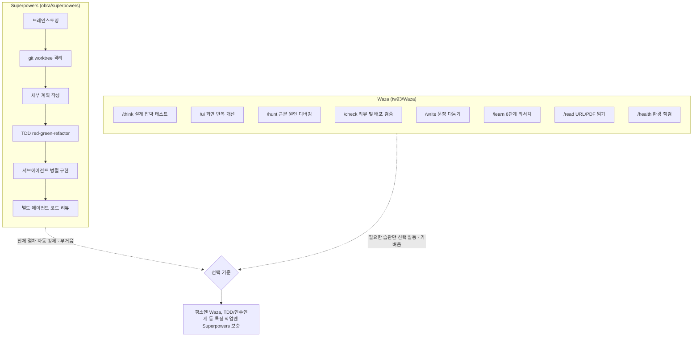
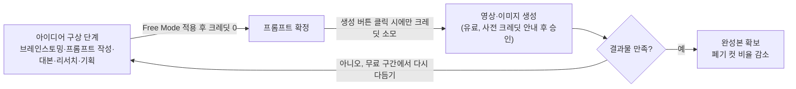

## 관련글

[**GPT‑5.6 出来以后，Skills 收藏党真的必须清一次仓库了。(GPT-5.6 출시로 스킬 수집가들은 재고를 정리해야 할 필요성을 절실히 느끼고 있습니다.)**](https://x.com/gkxspace/status/2078459052359606542)

[**现在靠 AI 视频搞钱的人是真多：漫剧、带货、短剧、接商单，隔三差五就能刷到晒收益的。**](https://x.com/gkxspace/status/2078320566923125230)

중국 X(구 트위터) 사용자 余温(@gkxspace)이 올린 두 건의 게시글은 서로 다른 주제를 다루지만 하나의 흐름으로 묶인다. 하나는 코딩 에이전트에게 엔지니어링 습관을 주입하는 스킬 생태계가 무거운 프레임워크에서 가벼운 프레임워크로 무게중심을 옮기고 있다는 이야기이고, 다른 하나는 AI 영상 제작에서 가장 돈이 많이 새는 구간이었던 아이디어 구상 단계가 무료로 전환되었다는 이야기다. 두 사안 모두 2026년 7월 기준 검증 가능한 사실을 바탕으로 아래에 정리했다.

---

## 1. Waza: Superpowers보다 가벼운 엔지니어링 습관 스킬

### 1-1. 왜 이런 스킬이 다시 주목받는가

余温의 게시글은 GPT-5.6가 공개된 이후 "Skills 수집가들은 저장소를 한 번 정리해야 한다"는 문장으로 시작한다. 그는 예전부터 obra(Jesse Vincent)가 만든 Superpowers라는 스킬 프레임워크를 써왔고, 구세대 모델을 쓸 때는 AI가 대충 작성하거나 단계를 빼먹거나 다 쓰고 검토를 안 하는 문제를 막는 데 실제로 효과가 있었다고 밝혔다. 문제는 GPT-5.6과 Claude Fable 5처럼 이미 충분히 똑똑해진 세대의 모델에도 Superpowers가 브레인스토밍, 스펙 작성, 계획 수립, TDD(테스트 주도 개발), 서브에이전트 실행, 리뷰라는 무거운 절차를 강제로 거치게 만든다는 점이다. 그 결과 버튼 하나 수정하는 작업에도 모델이 한참을 고민하며 빙빙 돌고, 속도도 느리고 비용도 많이 들고, 필요 없는 코드까지 잔뜩 작성하는 경우가 잦다는 것이 그의 경험담이다. 이 부분은 저자 개인의 사용 경험에서 나온 평가이며, 공식적으로 집계된 벤치마크 수치는 아니라는 점을 짚어둘 필요가 있다.

이 진단 자체는 근거가 있다. Superpowers는 실제로 매우 무거운 절차형 프레임워크다. 공식 저장소(obra/superpowers)와 여러 리뷰 글에 따르면 이 프레임워크는 브레인스토밍(요구사항을 소크라테스식 질문으로 다듬는 단계), git worktree 격리, 세부 계획 작성, TDD의 red-green-refactor 순환, 서브에이전트 기반 병렬 구현, 별도 에이전트가 수행하는 코드 리뷰까지 하나의 작업을 여러 단계로 쪼개 순서대로 강제한다. 12~14개의 스킬이 하나의 세션 시작 훅으로 묶여 있고, 이 전체 절차를 다 거치는 구조이기 때문에 간단한 수정 작업에는 상대적으로 무겁게 느껴질 수 있다는 것이 여러 독립적인 리뷰에서 공통으로 지적되는 부분이다.

### 1-2. Waza란 무엇인가

余温이 대안으로 추천한 것이 tw93이라는 개발자가 만든 오픈소스 프로젝트 [Waza](https://github.com/tw93/waza)(技, わざ)다. GitHub 공식 저장소 기준으로 2026년 7월 19일 현재 최신 버전은 v3.31.2이며, 별 6.4천 개, 포크 379개를 기록하고 있고 MIT 라이선스로 배포된다. Waza라는 이름은 일본 무술 용어로 "몸에 완전히 밴 기술"을 뜻하며, 저장소 소개 문구는 "이미 알고 있는 엔지니어링 습관을 AI 에이전트가 실행할 수 있는 스킬로 바꾼 것"이라고 스스로를 설명한다.

핵심 설계 철학은 Superpowers 같은 도구가 강력하지만 무겁다는 문제의식에서 출발한다. 저장소 설명에는 "Superpowers와 gstack 같은 도구는 강력하지만 무겁다. 스킬이 너무 많고 설정도 너무 많다"는 문장이 그대로 적혀 있다. Waza는 이에 맞서 정말로 중요한 습관 여덟 가지만 골라 각 스킬이 하나의 역할과 하나의 명확한 발동 조건만 갖도록 설계했다. 저자는 이 여덟 개 스킬이 7개 프로젝트에서 300회 이상의 실제 세션을 거치며 다듬어졌고, 스킬 안의 모든 주의사항(gotcha)이 실제로 겪었던 실패 사례에서 나온 것이라고 밝히고 있다.

### 1-3. 여덟 개 스킬의 역할

Waza는 아래 여덟 개의 슬래시 명령어로 구성되며, 각각 발동 시점과 역할이 명확히 구분되어 있다.

- **/think**: 새로운 것을 만들기 전에 사용한다. 문제 자체를 다시 검토하고 설계를 압박 테스트한 뒤, 다른 에이전트가 그대로 구현할 수 있을 만큼 결정이 끝난 계획서를 만들어낸다.
- **/ui**: 프론트엔드 화면을 만들 때 사용한다. 화면을 반복적으로 다듬어가며 일반적인 AI스러운 기본값이 아니라 방향성이 뚜렷한 독자적인 디자인을 만들어낸다.
- **/check**: 작업이 끝나고 병합이나 배포 직전에 사용한다. 변경 내역(diff)을 검토하고 프로젝트 고유의 제약조건을 추출하며, 승인된 배포·게시·푸시 후속 작업을 처리하고 증거를 바탕으로 검증한다.
- **/hunt**: 버그, 회귀, 예상치 못한 동작이 발생했을 때 사용한다. 특히 "예전엔 잘 됐는데" 상황에서, 어떤 수정도 하기 전에 근본 원인을 먼저 확인하는 체계적인 디버깅 절차를 따른다.
- **/write**: 글을 쓰거나 다듬을 때 사용한다. 중국어와 영어 모두에서 딱딱하고 상투적인 표현을 걷어내 자연스러운 문장으로 바꾼다.
- **/learn**: 낯선 분야를 파고들 때 사용한다. 수집·소화·개요 작성·내용 채우기·다듬기·자기검토 및 발행까지 여섯 단계로 이어지는 리서치 절차를 제공한다.
- **/read**: URL이나 PDF를 읽을 때 사용한다. 플랫폼별로 다른 경로로 콘텐츠를 읽어오며, 단순히 읽을 때는 요약을, 변환·인용·저장·후속 작업이 필요할 때는 마크다운 형식의 결과물을 내놓는다.
- **/health**: 에이전트 환경을 점검할 때 사용한다. Codex, Claude Code, 프로젝트 지침 파일, 검증 도구 출력, AI가 유지보수하기 좋은 코드인지 여부를 예산을 고려한 요약 점검 뒤 심층 점검으로 이어가며 확인한다.

각 스킬은 단순한 프롬프트 한 줄이 아니라 참고 문서, 보조 스크립트, 실제 실패에서 얻은 주의사항이 담긴 폴더 형태로 구성되어 있다. 스킬끼리 이어붙여 쓸 수도 있는데, 예를 들어 기능 개발은 /think로 계획하고 승인 후 구현을 지시한 다음 /check로 마무리하는 식이고, 버그 수정은 /hunt로 원인을 찾고 고친 뒤 /check로 검증하는 식이다. 다만 Waza는 단계 사이의 전환을 자동으로 이어주지 않는다. 각 스킬은 자기 할 일을 마치면 멈추고 사용자가 다음에 무엇을 할지 직접 판단해서 다시 명령을 내려야 하는 구조다. 이 점이 Superpowers가 전체 흐름을 자동으로 강제하는 것과 가장 크게 갈리는 지점이다.

### 1-4. 설치 방법과 호환 범위

Waza는 `npx skills add tw93/Waza -a claude-code codex cursor -g -y` 명령 한 줄로 여덟 개 스킬을 한꺼번에 설치할 수 있다. 표준 공유 디렉터리(agents.md 표준이 정한 `~/.agents/skills`)에 원본을 한 벌만 두고 Claude Code에는 심볼릭 링크로 연결하는 방식이라, Codex, Cursor, Kimi Code CLI, Amp, Cline 등 같은 디렉터리를 읽는 다른 에이전트 도구에서도 자동으로 인식된다. GLM이나 Kimi K2를 Claude Code 호환 엔드포인트로 우회해 쓰는 하네스는 별도 설정 없이도 작동하며, 별도의 개인 스킬 디렉터리를 쓰는 도구는 에이전트 ID를 추가로 지정해주면 된다. Claude Code나 Codex 사용자를 위한 네이티브 플러그인 설치 경로도 별도로 제공되고, Claude Desktop은 압축파일(zip)을 내려받아 스킬로 직접 업로드하는 방식을 쓴다.

### 1-5. 설치 전 참고할 보안 점검 사항

Waza는 공식적으로는 프로젝트의 공개 정보(README, 패키지 매니페스트, Makefile, CI 설정 등)만 읽고 개인 경로나 인증정보, 토큰은 절대 읽지 않는다고 명시하고 있다. 다만 AI 에이전트 스킬을 전문으로 보안 점검하는 Mondoo의 스킬 스캔 결과에서는 Waza의 /health 스킬에 대해 "잠재적으로 악성일 수 있다"는 주의 표시가 붙어 있다는 점도 함께 알아둘 필요가 있다. 구체적으로는 이 스킬이 외부 bash 스크립트(collect-data.sh)를 실행하는데, 이 스크립트의 경로가 환경변수나 사용자가 쓰기 가능한 디렉터리의 영향을 받을 수 있어 "임의 명령 실행" 위험으로 분류되었다는 내용이다. 이는 Waza가 실제로 악성 코드를 배포한다는 의미라기보다는, 외부 스크립트를 실행하는 구조 자체가 일반적으로 주의가 필요한 패턴이라는 자동화된 점검 결과다. 새로운 버전의 스킬을 설치하기 전에는 해당 스크립트의 내용을 직접 확인하거나, 신뢰할 수 있는 환경에서만 설치하는 습관을 들이는 편이 안전하다.

### 1-6. 함께 언급된 다른 스킬들

余温의 글에는 두 가지가 더 언급된다. 하나는 Matt Pocock이 만든 스킬 모음인데, 여러 사용자의 평가를 지켜본 뒤 그중 /grill-me 하나만 남기고 정리했다고 밝혔다. 다른 하나는 TDD나 인수인계, 대형 작업 분할이 실제로 필요하다면 Superpowers나 Matt Pocock의 해당 스킬을 별도로 보충해서 쓰라는 조언이다. 즉 이 글의 결론은 Superpowers를 완전히 버리라는 것이 아니라, 평소에는 가벼운 Waza를 기본으로 쓰고 무거운 절차가 꼭 필요한 특정 작업에만 선택적으로 무거운 프레임워크를 곁들이라는 것에 가깝다.

---

## 2. Higgsfield Supercomputer의 Free Mode: 브레인스토밍은 공짜, 생성만 유료

### 2-1. Higgsfield Supercomputer는 무엇인가

Higgsfield는 2026년 5월 14일 [Supercomputer](https://higgsfield.ai/supercomputer)라는 이름의 클라우드 네이티브 자기학습형 AI 에이전트를 출시했다. 이 시스템은 Nous Research의 Hermes 3 계열을 에이전트 오케스트레이션에 맞게 파인튜닝한 Hermes Agent를 두뇌로 삼고, 40개 이상의 내장 도구와 세 개 층으로 이루어진 메모리 구조를 갖추고 있다. 사용자는 브라우저나 텔레그램에서 일반적인 자연어로 원하는 작업을 설명하면 되고, 시스템이 GPT-5.5, Claude Opus, Gemini, Seedance, Veo, Kling 등 여러 모델과 생성 엔진 중에서 각 단계에 알맞은 것을 자동으로 골라 병렬로 실행한 뒤 영상이나 리포트 같은 완성된 결과물을 돌려준다. 최근에는 Grok 4.5와 GPT-5.6도 지원 모델 목록에 추가되었고, 2026년 6월 25일에는 기업용 마케팅 자동화에 초점을 맞춘 Supercomputer 2.0이 NVIDIA의 에이전트 툴킷을 기반으로 별도 발표되기도 했다.

### 2-2. Free Mode의 실제 내용

余温이 소개한 업데이트는 이 Supercomputer 안에 들어 있는 LLM 대화 자체를 무료로 개방한 Free Mode다. Higgsfield의 공식 계정이 밝힌 바에 따르면, 아이디어 브레인스토밍, 프롬프트 작성, 대본 작성, 리서치, 프로젝트 기획에는 더 이상 크레딧이 들지 않으며 크레딧은 실제로 무언가를 생성할 때만 소모된다. Higgsfield 공식 웹사이트의 Supercomputer 페이지에도 "Free Mode: 크레딧을 쓰지 않고 LLM을 실행"이라는 문구가 명시되어 있어, 이는 마케팅성 트윗에 그치지 않고 실제 제품 페이지에 반영된 기능임을 확인할 수 있다.

余温은 이 변화의 의미를 영상 제작 산업의 구조적 문제와 연결해 설명한다. AI 영상으로 수익을 내는 사람들, 즉 만화영상, 라이브커머스, 숏폼 드라마, 광고 수주 작업을 하는 사람들 사이에서 가장 돈이 많이 새는 구간은 바로 "폐기되는 컷"이다. 아이디어를 충분히 다듬지 않은 채 곧바로 생성 버튼을 누르면, 쓸 만한 영상 한 편을 건지기 위해 몇 배에 달하는 실패작을 만들어야 하고 그 과정에서 크레딧과 돈이 소진된다는 것이다. Free Mode는 바로 이 가장 비용이 많이 드는 시행착오 구간을 무료 영역으로 옮겨놓은 셈이라는 것이 그의 해석이다. 그 결과 사용 방식은 각 장면을 충분히 구상하고 프롬프트를 다 벼린 뒤 마지막에 생성 버튼을 누르는 방식으로 바뀌게 되고, 이렇게 하면 폐기율 자체가 낮아진다고 설명한다. 다만 영상·이미지 생성과 최상급 모델 사용은 여전히 유료이며, 전체 비용 구조가 이전보다 훨씬 우호적으로 바뀐 정도라고 그는 선을 긋는다.

### 2-3. 요금제와 관련된 사실 확인

Higgsfield Supercomputer는 크레딧 기반 과금 체계를 쓰고 있으며, 콘텐츠 제작 관련 안내 자료에 따르면 월 15달러의 Starter 요금제부터 시작해 200크레딧이 제공된다. 매 작업 계획마다 실제로 생성되기 전에 예상 크레딧 소모량을 먼저 보여주고 사용자가 승인해야 실행되는 구조도 유지되고 있다. 연간 결제 기준으로는 월 5달러(70크레딧)부터 월 99달러(3,000크레딧)까지 다양한 구간이 존재한다는 비교 자료도 있다.

커뮤니티 반응은 전적으로 호의적이지만은 않다는 점도 균형 있게 짚어둘 필요가 있다. 일부 X 사용자들은 같은 시기에 Canvas 기능의 무제한 버튼이 사라졌고 Nano Banana2 같은 다른 생성 기능도 더 이상 무제한이 아니게 되었다며, 토큰 사용량이 전반적으로 늘어나는 추세를 우려하는 댓글을 남기기도 했다. 즉 LLM 대화 자체는 무료가 됐지만, 이것이 전체적인 비용 부담이 줄었다는 뜻인지 아니면 다른 항목의 유료화와 맞물린 조정인지에 대해서는 사용자들 사이에서도 시각이 엇갈리고 있다.

---

## 3. 두 소식을 관통하는 흐름

두 게시글은 표면적으로는 코딩 에이전트 스킬과 AI 영상 제작 도구라는 다른 영역을 다루지만, 공통적으로 "모델이나 도구가 똑똑해질수록 절차나 비용 구조도 그에 맞춰 가벼워져야 한다"는 문제의식을 담고 있다. Waza는 모델이 충분히 강력해진 상태에서 과도하게 무거운 강제 절차가 오히려 속도와 비용 측면의 손해로 이어질 수 있다는 실무자의 판단에서 나왔고, Higgsfield의 Free Mode는 생성형 AI 창작에서 가장 비용이 크게 새던 시행착오 구간을 무료 영역으로 옮겨 실제 생성 단계의 낭비를 줄이려는 시도다. 다만 어느 쪽도 만능은 아니다. Waza는 여전히 TDD처럼 엄격한 절차가 필요한 작업에는 부족할 수 있고, Free Mode 역시 다른 기능의 유료화와 맞물려 있다는 지적이 커뮤니티 안에서 함께 제기되고 있다는 점은 이용자 스스로 판단할 부분으로 남아 있다.

---

*작성일: 2026년 7월 19일*
