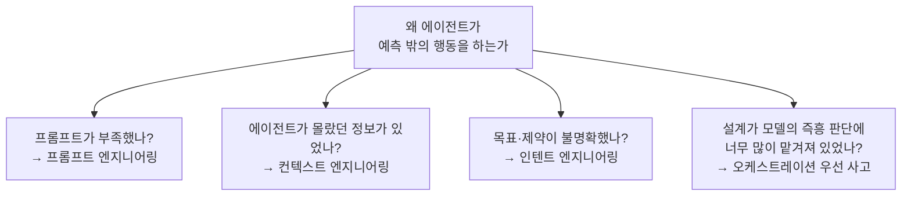
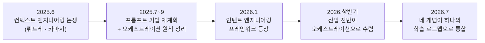
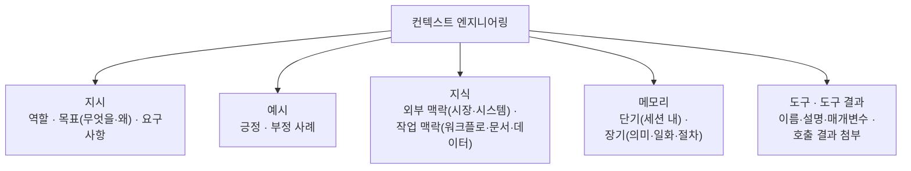
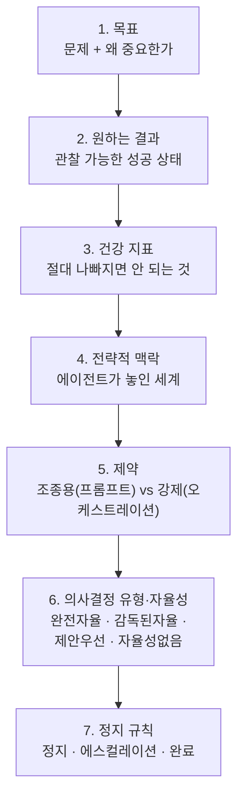
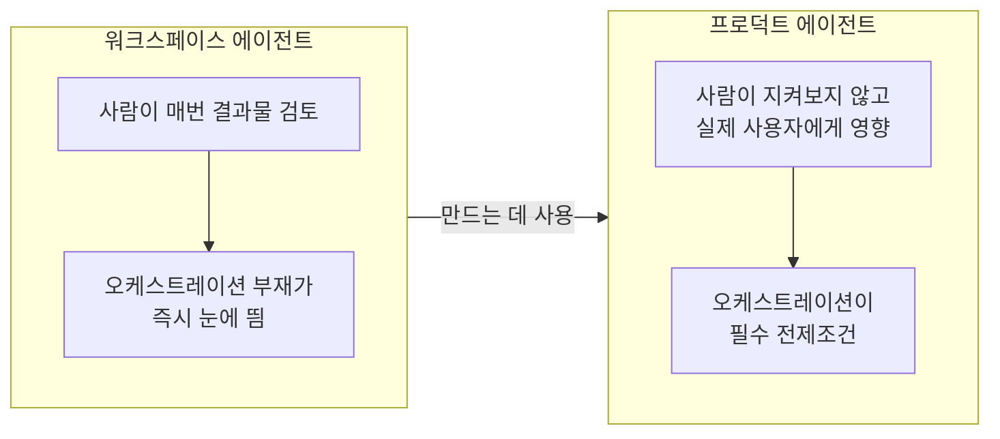
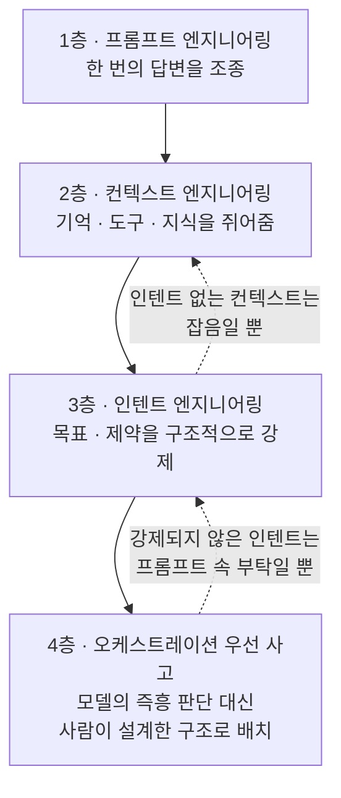

## 관련글

[**AI가 너무 잘 작동해서 회사가 망가졌다**](https://k82022603.github.io/posts/ai%EA%B0%80-%EB%84%88%EB%AC%B4-%EC%9E%98-%EC%9E%91%EB%8F%99%ED%95%B4%EC%84%9C-%ED%9A%8C%EC%82%AC%EA%B0%80-%EB%A7%9D%EA%B0%80%EC%A1%8C%EB%8B%A4-%EC%9D%B8%ED%85%90%ED%8A%B8-%EC%97%94%EC%A7%80%EB%8B%88%EC%96%B4%EB%A7%81(intent-engineering)%EC%9D%98-%EB%93%B1%EC%9E%A5/)

---

## 문서 개요

이 문서는 앞서 만든 [**"제로에서 시작하는 에이전틱 AI 기획자, 디자이너"**](https://k82022603.github.io/posts/%EC%A0%9C%EB%A1%9C%EC%97%90%EC%84%9C-%EC%8B%9C%EC%9E%91%ED%95%98%EB%8A%94-%EC%97%90%EC%9D%B4%EC%A0%84%ED%8B%B1-ai-%EA%B8%B0%ED%9A%8D%EC%9E%90,-%EB%94%94%EC%9E%90%EC%9D%B4%EB%84%88/) 의 1부 1-2절과 1-6절에서 짧게 다루었던 "말 거는 기술의 3층 구조"와 "오케스트레이션 우선 사고"를 별도로 떼어내, 훨씬 깊게 파고든 심화 자료입니다. 앞선 문서가 두 역할의 전체 로드맵을 조망했다면, 이번 문서는 그 로드맵에서 가장 실무적이고 가장 자주 오해되는 네 가지 개념 — 프롬프트 엔지니어링, 컨텍스트 엔지니어링, 인텐트 엔지니어링, 오케스트레이션 우선 사고 — 하나하나를 원문 수준까지 파고들어 재구성했습니다.

핵심적으로 참고한 1차 출처는 Paweł Huryn이 The Product Compass에 게재한 다섯 편의 글입니다. 로드맵 전체를 담은 "The Ultimate AI Product Manager Roadmap (2026)"(2026년 7월 5일), 컨텍스트 엔지니어링을 상세히 다룬 "A Guide to Context Engineering for PMs"(2025년 7월 28일 최초 게재, 2026년 1월 28일 최종 수정), 인텐트 엔지니어링의 7단계 구조를 제시한 "The Intent Engineering Framework for AI Agents"(2026년 1월 13일 게재, 2026년 6월 10일 최종 수정), 오케스트레이션과 자율성의 관계를 다룬 "14 Principles of Building AI Agents"(2025년 7월 12일 게재), 그리고 구체적인 프롬프트 기법을 정리한 "14 Prompting Techniques Every PM Should Know"(2025년 9월 8일 게재)입니다. 여기에 컨텍스트 엔지니어링이라는 용어가 처음 확산되던 2025년 6월의 안드레 카파시(Andrej Karpathy)와 토비 뤼트케(Tobi Lütke)의 소셜미디어 논쟁, 그리고 2026년 상반기 업계 전반의 오케스트레이션 관련 보도를 더해 교차 검증했습니다.

일부 원문(특히 인텐트 엔지니어링 프레임워크 글)은 유료 구독 없이도 전체 본문이 공개되어 있어 전문을 확인할 수 있었지만, 프롬프트 기법을 다룬 글과 컨텍스트 엔지니어링 후반부(RAG 기술 세부 사항)는 유료 구독자 전용 구간이 있어 무료로 공개된 부분까지만 확인했습니다. 이 지점은 팩트체크 노트에서 다시 명확히 표시했습니다.

---

## 들어가며

기획자와 디자이너가 에이전틱 AI 도구를 쓰기 시작하면 거의 예외 없이 같은 경험을 합니다. 처음 며칠은 놀랍도록 잘 작동합니다. 그러다 일주일쯤 지나면 같은 도구가 갑자기 엉뚱한 답을 내놓거나, 시켜둔 일을 절반만 하고 멈추거나, 사람이 지켜보지 않는 사이에 하지 말았어야 할 행동을 합니다. 이 낙차의 정체를 모르면 "AI가 아직 부족하다"는 결론으로 도망치기 쉽습니다. 그런데 실제로는 대부분의 경우, 모델이 아니라 그 모델에게 말을 거는 방식이 부족했던 것입니다.

이 문서가 다루는 네 가지 개념은 정확히 이 낙차를 설명하기 위해 최근 1년 사이 업계에서 자리 잡은 어휘입니다. 프롬프트 엔지니어링은 한 번의 대화에서 좋은 답을 끌어내는 기술이고, 컨텍스트 엔지니어링은 에이전트가 애초에 무엇을 알고 있는지를 설계하는 일이며, 인텐트 엔지니어링은 사람이 매 순간 지켜보지 않아도 에이전트가 올바르게 행동하도록 목표와 제약을 못 박는 일이고, 오케스트레이션 우선 사고는 이 모든 것을 모델의 즉흥적 판단이 아니라 사람이 설계한 구조 안에 배치하는 태도입니다. 네 개념은 순서대로 등장했을 뿐 아니라, 실제로 서로를 딛고 쌓입니다. 그래서 이 문서도 그 쌓이는 순서를 따라갑니다.

---

## 0부. 왜 이 네 가지를 한 세트로 봐야 하는가

### 0-1. 2025년 6월, 트윗 하나에서 시작된 용어 논쟁

컨텍스트 엔지니어링이라는 말이 업계 전반에 퍼진 계기는 명확히 추적됩니다. 2025년 6월 18일경, 쇼피파이(Shopify) CEO 토비 뤼트케가 자신의 X(옛 트위터) 계정에 프롬프트 엔지니어링보다 컨텍스트 엔지니어링이라는 표현을 선호한다고 밝혔습니다. 그가 말한 핵심은, AI에게 일을 맡길 때 정말 중요한 능력은 그럴듯한 지시문 한 줄을 잘 쓰는 게 아니라, 별도의 추가 설명 없이도 그 과제가 풀릴 수 있을 만큼 충분한 맥락을 함께 실어 보내는 능력이라는 것이었습니다[1][6]. 약 일주일 뒤인 6월 25일, 전 테슬라 AI 총괄이자 오픈AI 공동창업자인 안드레 카파시가 이 표현에 동의하는 글을 올리면서 논쟁이 폭발적으로 확산됐습니다. 카파시는 사람들이 "프롬프트"라는 단어를 챗봇에 던지는 짧은 한 줄짜리 질문으로만 좁게 이해하고 있다고 지적하면서, 실제로 산업 수준의 LLM 애플리케이션에서는 컨텍스트 윈도우(모델이 한 번에 참고할 수 있는 정보의 총량)를 다음 단계에 딱 필요한 만큼만 정교하게 채워 넣는 작업 전체가 핵심이라고 설명했습니다[6]. 그는 이후 이 관계를 컴퓨터 구조에 빗대어, LLM을 CPU에, 컨텍스트 윈도우를 RAM에 비유하기도 했습니다. 이 비유를 따르면 컨텍스트 엔지니어링은 그 RAM에 무엇을 올릴지 결정하는 일종의 운영체제 역할을 하는 셈입니다[6].

이 논쟁은 곧바로 두 진영으로 갈렸습니다. 실리콘밸리의 여러 개발자들은 이것이 실질적인 패러다임 전환이라고 받아들인 반면, 일부에서는 프롬프트 엔지니어링에 새 이름을 붙였을 뿐이라는 반박도 나왔습니다. 개발자 사이먼 윌리슨(Simon Willison)은 프롬프트 엔지니어링이라는 용어 자체가 지난 2년 사이 "챗봇에 재치 있는 트릭을 입력하는 일" 정도로 격하되어 버렸고, 원래 그 말이 가리키던 진지한 작업 영역이 새 이름을 필요로 하게 됐다고 정리했습니다[6]. 이 문서에서 다루는 관점은 어느 한쪽 편을 드는 것이 아니라, Huryn의 로드맵이 취하는 실용적 입장을 따릅니다. 프롬프트 엔지니어링은 사라지지 않았고, 여전히 컨텍스트 엔지니어링의 토대이자 일부입니다. 다만 프롬프트 하나로 해결되는 문제의 범위가 좁아졌고, 그 위에 훨씬 넓은 범위의 설계 작업이 새로 필요해졌을 뿐입니다[1][2].

### 0-2. 인텐트 엔지니어링과 오케스트레이션은 왜 뒤따라 등장했는가

컨텍스트 엔지니어링 논쟁이 정리되어 갈 무렵, 실무자들은 새로운 문제에 부딪혔습니다. 에이전트에게 충분한 정보(컨텍스트)를 쥐어줬는데도, 사람이 지켜보지 않고 오래 돌아가게 두면 여전히 엉뚱한 방향으로 최적화하는 사례가 반복됐습니다. Huryn은 이 지점에서 토비 뤼트케의 원래 발언을 다시 인용하며 한 걸음 더 나아갑니다. 뤼트케가 강조한 것이 컨텍스트라면, Huryn이 강조하는 것은 그 컨텍스트만으로는 부족하다는 점입니다. 그는 컨텍스트는 있지만 인텐트(의도)가 없는 상태를 "잡음"에 비유하며, 목표와 제약이 구조적으로 명시되지 않으면 아무리 정보가 풍부해도 에이전트가 엉뚱한 것을 최적화할 수 있다고 설명합니다[3]. 이렇게 해서 2026년 1월, 인텐트 엔지니어링이라는 세 번째 층이 로드맵에 자리 잡습니다.

오케스트레이션 우선 사고는 조금 다른 경로로 등장했습니다. 이것은 새로 발견된 개념이라기보다, "자율성(autonomy)"이라는 화려한 단어에 대한 실무자들의 반작용에 가깝습니다. Huryn은 50개 이상의 에이전트를 직접 만들어보며 얻은 교훈을 정리한 글에서, 자율성은 듣기에는 근사하지만 실제 현업에서 더 절실하게 필요한 것은 예측 가능성이라고 잘라 말합니다. 이미 알고 있는 로직 — 조건 분기, 반복, 재시도, 정해진 절차 — 은 에이전트의 프롬프트 안에 욱여넣지 말고, 오케스트레이션 레이어로 빼내야 한다는 것이 그의 결론입니다[4]. 이 원칙은 2025년 중반 그가 이 글을 쓸 당시만 해도 소수 실무자의 경험칙에 가까웠지만, 2026년에 들어서며 업계 전반의 합의로 굳어지는 모습을 보입니다. 아래에서 다시 다루겠지만, 여러 산업 보고서들은 2026년을 "에이전트 파일럿의 해"가 아니라 "오케스트레이션과 거버넌스의 해"로 규정하고 있습니다[7].

---

## 1부. 프롬프트 엔지니어링 — 한 번의 답변을 조종하는 기술

### 1-1. 정의: 여전히 가장 먼저 배워야 하는 기초

프롬프트 엔지니어링은 이 네 가지 개념 중 가장 오래됐고, 동시에 가장 자주 "이제는 죽은 기술"이라는 오해를 받습니다. Huryn의 로드맵은 이 오해를 정면으로 반박합니다. 그는 프롬프트가 죽기는커녕 그 어느 때보다 중요해졌다고 말하며, 그 이유로 세 가지를 듭니다. 첫째, 컨텍스트 엔지니어링 자체가 결국 잘 짜인 프롬프트 구조 위에서 작동합니다. 둘째, 에이전트를 만드는 작업의 뼈대가 결국 프롬프트입니다. 셋째, AI 시스템의 품질을 체계적으로 평가하고 개선하려면 프롬프트를 다룰 줄 알아야 합니다[5]. 다시 말해 프롬프트 엔지니어링은 사라진 게 아니라, 더 큰 체계 안으로 흡수되어 기초 과목이 된 것입니다.

### 1-2. 실무에서 검증된 여덟 가지 기법

Huryn이 오픈AI, 앤트로픽 등 여러 출처의 모범 사례와 자신의 실험 결과를 종합해 정리한 프롬프트 기법 목록 가운데, 공개된 부분에서 확인할 수 있는 여덟 가지를 소개합니다.

첫 번째는 역할을 부여하는 기법입니다. 단순히 "이 문서를 요약해줘"라고 시키는 대신, AI에게 20년 경력의 베테랑 제품 마케터라는 역할을 맡기면 응답이 훨씬 그 용도에 맞게 정교해진다는 것입니다[5].

두 번째는 맥락을 먼저 제시하는 기법입니다. 어떤 작업을 위임할 때 목표만 던지지 말고, 왜 그 일이 중요한지, 성공을 어떻게 측정할 것인지, 더 넓은 배경 지식은 무엇인지를 함께 전달하라는 것입니다. Huryn은 "이 주제를 조사해줘"라는 단순한 지시와, "당신은 이 제품의 전략적 이니셔티브를 위해 일하는 여러 웹 리서치 서브 에이전트 중 하나이며, 다음 주제를 조사하는 것이 목표다"처럼 배경을 함께 담은 지시를 나란히 비교하며 후자가 훨씬 나은 결과를 낸다고 설명합니다[5]. 이 기법은 사실상 2부에서 다룰 컨텍스트 엔지니어링의 씨앗이기도 합니다.

세 번째는 출력 형식과 제약을 명확히 지정하는 기법입니다. 어떤 제약이 있는지, 결과물이 어떤 형식이어야 하는지를 구체적으로 못 박아야 합니다. 예를 들어 실험 아이디어를 검토해달라고 할 때, 단순히 "검증할 가정을 나열해줘"라고 하기보다 가정, 실험, 측정지표, 예상값, 위험 완화책까지 항목을 지정하고 정해진 JSON 스키마로만 응답하도록 명시하면 결과의 신뢰도가 크게 올라갑니다[5].

네 번째는 예시나 템플릿을 제공하는 기법입니다. 특히 부정 예시(하지 말아야 할 응답이나 행동의 사례)를 함께 제시하면, 사후 오류 분석 과정에서 발견된 문제를 예방하는 데 효과적입니다. Huryn은 긍정적 행동의 예로 "명확한 클릭률 지표를 갖춘 A/B 프로토타입을 제안한다"를, 부정적 행동의 예로 "실제 사용자 상호작용을 측정하지 않는 설문조사를 제안한다"를 나란히 제시하는 방식을 권합니다[5].

다섯 번째는 유도 질문을 피하는 기법입니다. 고객 인터뷰에서 원하는 답을 암시하는 질문을 피해야 하듯, AI와 아이디어를 발전시킬 때도 기대하는 답을 미리 암시하면 응답이 편향됩니다. "우리 제품이 경쟁사보다 나은 이유는?"이라고 묻는 대신 "우리 제품과 경쟁사를 비교했을 때 강점과 약점은 무엇인가, 가차 없이 솔직하게 답해달라"고 묻는 편이 훨씬 유용한 답을 끌어냅니다[5].

여섯 번째는 판돈을 높이는 기법입니다. 과제를 고위험, 고중요도로 프레이밍하면 AI가 "더 열심히" 시도하는 경향이 관찰됩니다. Huryn은 챗GPT를 예로 들며, 이런 프레이밍이 실제로 더 강력한 모델을 선택하게 만드는 경우가 있다고 언급합니다[5].

일곱 번째는 계획하고 성찰하고 끝까지 밀어붙이도록 요청하는 기법입니다. 특히 에이전트를 다룰 때 효과적인데, 각 단계마다 계획을 세우고 결과를 돌아본 뒤 다음 단계로 넘어가도록, 그리고 목표가 완전히 달성될 때까지 스스로 멈추지 않도록 명시적으로 지시하는 것입니다[5].

여덟 번째는 도구 사용을 장려하는 기법입니다. 도구에 접근할 수 있는 에이전트에게 도구를 적극적으로 쓰도록 독려하면 추측과 환각이 줄어듭니다. Huryn은 여기에 더해 가능하다면 어떤 순서로 도구를 사용해야 하는지까지 명시하면 결과가 한층 더 좋아졌다고 덧붙입니다[5].

*(이 목록은 원문에서 무료로 공개된 부분까지의 여덟 가지이며, 원문 제목이 밝히듯 전체 기법은 열네 가지입니다. 나머지 여섯 가지는 유료 구독 구간에 있어 이 문서에는 포함하지 못했습니다.)*

### 1-3. 프롬프트 엔지니어링이 닿지 못하는 지점

여덟 가지 기법을 모두 적용해도 풀리지 않는 문제가 있습니다. 프롬프트는 결국 그 순간의 대화 하나를 조종하는 도구입니다. 에이전트가 무엇을 기억하고 있는지, 어떤 도구에 접근할 수 있는지, 장시간 자율적으로 움직일 때 어디까지 판단해도 되는지는 프롬프트 하나로 해결되지 않는 문제입니다. 바로 이 지점에서 컨텍스트 엔지니어링과 인텐트 엔지니어링이 필요해집니다.

---

## 2부. 컨텍스트 엔지니어링 — 기억, 도구, 정보를 쥐어주는 설계

### 2-1. 정의: 프롬프트가 쓰이기도 전에 시작되는 작업

Huryn은 컨텍스트 엔지니어링을 LLM의 컨텍스트 윈도우를 성능이 좋아지도록 채우는 예술이자 과학이라고 정의합니다[2]. 이 정의에서 중요한 것은 "채운다"는 동사입니다. 프롬프트 엔지니어링이 흔히 더 나은 문장을 쓰는 일로 여겨지는 반면, 컨텍스트 엔지니어링은 그 프롬프트가 작성되기 이전 단계에서부터 시작되는 훨씬 넓은 범위의 활동입니다. 여기에는 전략이나 도메인, 시장처럼 더 넓은 맥락을 제공해 에이전트의 자율적 판단력을 높이는 일, 외부 시스템이나 다른 에이전트로부터 관련 지식을 검색하고 가공하는 일, 에이전트가 과거 상호작용을 기억하고 경험을 축적하고 사용자 선호를 저장하고 실수로부터 배우도록 메모리를 관리하는 일, 그리고 에이전트가 필요한 도구를 갖추고 그것을 어떻게 쓸지 알도록 하는 일이 모두 포함됩니다[2].

Huryn이 강조하는 원칙 한 가지는 최소한의 필요한 정보만 제공하라는 것입니다. 모든 형태의 컨텍스트는 결국 한정된 컨텍스트 윈도우를 채우고, 모델의 성능에 영향을 주며, 입력 토큰 비용을 소모합니다. 그러므로 컨텍스트를 준비할 때는 무엇을 공유할지에 대해 의도적이어야 합니다[2].

### 2-2. 컨텍스트를 이루는 다섯 갈래

Huryn은 컨텍스트를 다섯 가지 요소로 분해합니다. 이 분해는 실무자가 "우리 에이전트에 무엇이 빠져 있는가"를 점검할 때 쓸 수 있는 체크리스트 역할을 합니다.

첫 번째 갈래는 지시(Instructions)입니다. 여기에는 에이전트가 어떤 역할을 맡을지(누구인가), 왜 이 작업이 중요한지와 무엇을 성취하려 하는지를 담은 목표(왜, 무엇을), 그리고 추론 단계나 문체·톤 같은 컨벤션, 성능이나 보안 같은 제약, 응답 형식(어떻게) 같은 요구사항이 포함됩니다. Huryn은 특히 목표를 설명할 때 "무엇을" 뿐 아니라 "왜"까지 함께 제공하는 습관을 강조합니다. 이는 전략적 맥락을 명확히 해 에이전트가 더 나은 판단을 내리도록 돕기 때문입니다. 그는 2024년에 발표된 한 학술 논문(arXiv:2401.04729)이 단순한 과제 명세를 넘어선 전략적 맥락 제공이 AI의 자율적 판단 능력을 실제로 향상시킨다는 것을 입증했다고 인용합니다[2].

두 번째 갈래는 예시(Examples)입니다. 긍정적 예시와 부정적 예시를 모두 포함할 수 있으며, 특히 부정적 예시는 사후 오류 분석에서 발견된 문제를 다루는 데 유용합니다[2].

세 번째 갈래는 지식(Knowledge)입니다. 시장이나 에이전트가 속한 시스템에 대한 외부 맥락, 그리고 작업 자체의 맥락 — 프로세스 단계나 핸드오프 같은 워크플로 정보, 스펙·절차·티켓·로그 같은 문서, 변수나 표 같은 구조화된 데이터 — 을 포함합니다. 이런 외부 맥락을 포함시키면 에이전트가 상황을 더 잘 인지하고 더 나은 판단을 내리는 데 도움이 됩니다[2].

네 번째 갈래는 메모리(Memory)입니다. Huryn은 여기서 단기 메모리와 장기 메모리를 구분합니다. 단기 메모리는 대개 하나의 사용자 세션 안에 존재하며, 이전 메시지나 대화 이력, 추론 단계나 진행 상황 같은 상태 정보를 포함합니다. 장기 메모리는 데이터베이스나 파일 시스템에 저장되며, 사실이나 선호·회사 지식 같은 의미 기억, 과거 경험 같은 일화 기억, 이전 상호작용에서 포착된 절차적 지시 같은 절차 기억으로 다시 나뉩니다. 흥미로운 점은 메모리가 프롬프트의 일부가 아니라는 것입니다. 메모리는 오케스트레이션 레이어가 메시지 목록에 자동으로 붙여주거나, 에이전트가 도구로서 접근하는 방식으로 제공됩니다. 예컨대 오픈AI의 어시스턴트 API를 쓰면 대화 이력이 자동으로 붙지만 이는 특정 대화(스레드)와 모델의 컨텍스트 윈도우 범위 안으로 제한되고, n8n 같은 도구를 쓸 때도 메모리 노드가 자동으로 주입됩니다. 챗GPT에서 보이는 "저장된 사용자 선호" 같은 기능이나 스크래치패드는 사실 특수한 형태의 도구이며, 이 정보 역시 이후 메시지 목록에 자동으로 첨부되어 모델이 볼 수 있게 됩니다[2].

다섯 번째 갈래는 도구(Tools)와 도구 결과(Tool results)입니다. 컨텍스트 윈도우 안에는 각 도구마다 이름, 기능 설명, 매개변수(타입·설명·필수 여부)를 지정하는 특별한 "함수" 블록이 존재합니다. LLM은 함수를 직접 호출할 수 없고, 항상 텍스트로만 응답합니다. 그래서 함수를 호출하려면 시스템이 해석할 수 있는 특별한 형식으로 "이 매개변수로 이 도구를 호출해달라"고 요청하는 형태를 취하고, 이후 오케스트레이션 레이어가 그 결과를 메시지 목록에 특수한 메시지로 첨부해줍니다[2]. n8n 같은 노코드 도구를 쓰면 이 과정을 코드 없이 도구 노드를 시각적으로 연결하는 것만으로 처리할 수 있습니다[2].

### 2-3. RAG와 컨텍스트 엔지니어링은 같은 말이 아니다

실무에서 자주 벌어지는 혼동 하나를 Huryn은 명확히 정리합니다. RAG(검색 증강 생성, Retrieval-Augmented Generation)는 흔히 컨텍스트 엔지니어링 기법의 하나로 불리지만, 이는 절반만 맞는 말입니다. RAG는 세 단계로 이루어진 파이프라인입니다. 첫 번째 단계는 정보 검색으로, 벡터 데이터베이스나 API 같은 외부 소스에서 데이터를 끌어오는 일입니다. 두 번째 단계는 컨텍스트 조립으로, 검색된 데이터를 구조화하고 걸러내어 프롬프트 형태로 만드는 일입니다. 세 번째 단계는 생성으로, LLM(혹은 에이전트)이 실제 출력을 만들어내는 일입니다. 컨텍스트 엔지니어링은 이 가운데 우리가 컨텍스트를 어떻게 선별하고 준비하는지, 즉 첫 번째와 두 번째 단계에만 초점을 맞추며 생성 단계 이전에서 멈춥니다. 그래서 어떤 논문이나 글이 "RAG가 곧 컨텍스트 엔지니어링이다"라고 말한다면 그것은 경계를 흐리는 표현이며, 정확히는 RAG가 컨텍스트 엔지니어링을 포함하되 한 걸음 더 나아간 개념이라는 것이 Huryn의 정리입니다[2].

### 2-4. 콘텐츠·디자인 실무에서 컨텍스트 엔지니어링은 어떻게 나타나는가

컨텍스트 엔지니어링은 프로덕트 매니저만의 문제가 아닙니다. UX 콘텐츠 디자인 커뮤니티인 UXCC가 2026년 3월 발표한 글은 콘텐츠 디자이너들이 겪는 같은 문제를 다룹니다. 이 글은 많은 콘텐츠 디자이너들이 여전히 "프롬프트를 어떻게 잘 쓸까"에 매달려 있지만, 이 접근은 이미 낡아가고 있다고 지적합니다. 이 글이 권하는 대안은 조직이 콘텐츠 작업에 쓰는 가이드라인, 지시, 패턴 등을 하나의 저장소로 정리해두는 것입니다. 이 저장소 자체가 일종의 컨텍스트 엔지니어링이며, 이렇게 정리된 자료를 AI 도구에 실어 보내는 것이 개별 프롬프트를 반복해서 잘 쓰는 것보다 훨씬 빠르고 안정적인 결과를 낸다는 것입니다[8]. 같은 글은 콘텐츠 디자이너가 시스템 프롬프트를 잘 쓰는 법, 그리고 모델이 도구나 데이터에 접근하는 방식을 정의하는 MCP(Model Context Protocol) 같은 개념을 이해하는 것이 실무에 실질적인 도움이 된다고 덧붙입니다. 콘텐츠가 시스템을 어떻게 통과해 흐르는지 설명할 수 있는 디자이너는 엔지니어링 논의에 더 일찍 참여하게 된다는 관찰도 함께 제시됩니다[8].

이것이 기획자의 컨텍스트 엔지니어링과 본질적으로 다른 일은 아닙니다. 다만 다루는 컨텍스트의 종류가 다를 뿐입니다. 기획자가 전략·시장 데이터·워크플로 단계를 컨텍스트로 다룬다면, 디자이너는 브랜드 톤, 명확성의 기준, 무엇이 오해를 부르는 표현인지, 어떤 예외 상황을 신경 써야 하는지에 대한 암묵지를 명시적인 컨텍스트로 바꾸는 작업을 합니다. 이 암묵지를 문서화하지 않으면 에이전트는 그것을 알 방법이 없습니다.

---

## 3부. 인텐트 엔지니어링 — 지켜보지 않아도 올바르게 행동하게 만드는 설계

### 3-1. "컨텍스트만으로는 부족하다"

인텐트 엔지니어링을 다룬 글의 첫 문장에서 Huryn은 단호하게 말합니다. 모두가 AI에서 "의도(intent)"를 이야기하지만, 그것이 실제로 무엇을 뜻하는지, 어떻게 정의해야 하는지 제대로 설명하는 사람은 드물다는 것입니다[3]. 그는 에이전트가 실패하는 이유가 추론 능력이 부족해서가 아니라, 목표와 성과, 제약이 충분히 구체화되지 않았기 때문이라고 지적합니다. 그리고 해법은 더 상세한 지시를 추가하는 것이 아니라고 못 박습니다[3].

이 지점에서 Huryn은 앞서 소개한 토비 뤼트케의 발언을 다시 불러옵니다. 뤼트케가 말한 컨텍스트 엔지니어링의 핵심은, 별도 정보 없이도 문제가 그럴듯하게 풀릴 만큼 충분한 맥락과 함께 문제를 제시하는 능력이었습니다[3][6]. Huryn은 여기에 자신의 통찰을 하나 더 얹습니다. 인텐트가 빠진 컨텍스트는 잡음에 불과하다는 것입니다[3]. 아무리 풍부한 정보를 실어 보내도, 무엇이 성공이고 무엇을 지켜야 하며 어디까지 판단해도 되는지가 불명확하면 에이전트는 결국 스스로 최적화 기준을 지어내게 됩니다.

인텐트가 불완전할 때 벌어지는 일은 사람과 에이전트가 근본적으로 다릅니다. 사람은 지시가 불완전해도 문서화되지 않은 지식을 스스로 끌어다 씁니다. 에이전트는 그럴 수 없습니다. 에이전트는 오직 코드화된 것만 압니다. 그리고 대부분의 조직은 스스로 생각하는 것보다 훨씬 적은 것만 코드화해두었다는 것이 Huryn의 관찰입니다[3].

### 3-2. 인텐트를 이루는 일곱 요소

Huryn이 제시하는 인텐트 구조는 팀 목표를 세우거나 사람에게 일을 위임하거나 에이전트를 설정하거나 본질적으로 같은 틀을 따른다고 말합니다. 이 구조는 크리스티나 워드케(Christina Wodtke)가 정리한 OKR 방법론이나 마티 케이건(Marty Cagan)이 말하는 권한을 위임받은 팀의 목표 설정 방식과도 같은 패턴을 공유합니다. 다만 에이전트를 위해서는 여기에 세 가지 요소가 추가로 확장됩니다[3].

**첫째, 목표(Objective)** 입니다. 풀어야 할 문제와 그것이 왜 중요한지를 정의하는 부분으로, 성격상 열망적이고 정성적입니다. 목표는 트레이드오프가 발생했을 때 판단의 기준이 됩니다. Huryn은 "고객 지원 티켓을 처리한다"는 약한 목표와, "고객이 처음보다 더 큰 좌절을 느끼지 않으면서 자기 일로 빨리 돌아갈 수 있도록 돕는다"는 더 나은 목표를 대비시킵니다. 왜가 설명된 목표는 에이전트가 예외 상황에서 추론하고 더 나은 자율적 판단을 내리도록 돕습니다[3].

**둘째, 원하는 결과(Desired Outcomes)** 입니다. 목표가 달성됐음을 보여주는 관찰 가능한 상태를 뜻하며, 활동이 아닙니다. 좋은 결과의 조건은 관찰 가능한 상태 변화여야 하고(에이전트가 한 행동이 아니라), 사용자·이해관계자의 관점에서 서술되어야 하며, 에이전트의 자기 보고에 의존하지 않고 측정하거나 검증할 수 있어야 하고, 몇 달 뒤가 아니라 그 즉시 혹은 곧바로 관찰될 수 있는 선행 지표여야 합니다. Huryn은 결과의 개수를 두세 개에서 네 개 사이로 유지하라고 권합니다. 그보다 많으면 지나치게 세세히 관리하거나, 정작 무엇이 중요한지 스스로도 불명확하다는 신호라는 것입니다[3].

**셋째, 건강 지표(Health Metrics)** 입니다. 결과를 최적화하는 동안 절대 나빠져서는 안 되는 것을 정의합니다. Huryn은 이를 굿하트의 법칙(측정 지표가 목표가 되는 순간 더는 좋은 지표가 아니게 된다는 원리)과 연결 지으며, 건강 지표 없이 "더 빨리 해결하라"고만 지시하면 에이전트가 서두르다 품질을 떨어뜨리고, "처리량을 늘려라"고만 하면 지름길을 택하며, "에스컬레이션을 줄여라"고만 하면 원래 넘겨야 할 일까지 떠안는 부작용이 생긴다고 설명합니다. 건강 지표는 실시간 제어 루프가 아니라, 에이전트가 트레이드오프를 판단할 때 얼마나 보수적으로 행동해야 하는지를 알려주는 신호로 기능합니다[3].

**넷째, 전략적 맥락(Strategic Context)** 입니다. 에이전트가 어디에 놓여 있는지를 설명하지, 무엇을 해도 되는지를 규정하지는 않습니다. 여기에는 다른 에이전트·사람·도구·의존관계 같은 시스템 맥락, 비즈니스 모델·사용자·브랜드 같은 조직 맥락, 그리고 신뢰와 속도와 비용 사이의 우선순위 같은 트레이드오프 판단 기준이 포함됩니다. 전략적 맥락은 어떤 행동을 촉발하거나, 실행을 막거나, 에스컬레이션을 일으키지 않습니다. 오직 판단을 돕는 정보로만 기능합니다[3]. Huryn은 이 대목에서 넷플릭스의 원칙 하나를 인용합니다. 통제가 아니라 맥락으로 이끌라는 것으로, 매 결정을 세세히 관리하지 않으면서도 에이전트가 시스템을 충분히 이해해 스스로 좋은 판단을 내릴 수 있게 하라는 뜻입니다[3].

**다섯째, 제약(Constraints)** 입니다. Huryn이 가장 강조하는 구분이 바로 이 지점에서 나옵니다. 제약에는 두 종류가 있습니다. 조종용 제약(Steering)은 프롬프트 수준에서 작동하며 행동 지침, 위험 선호, 톤과 신중함을 다룹니다. 이는 추론에 영향을 주지만 준수를 강제하지는 않습니다. 반면 강제 제약(Hard)은 오케스트레이션 수준에서 작동합니다. 정말 중요한 제약이라면 언어(프롬프트)가 아니라 아키텍처 안에서 강제되어야 한다는 것이 그의 원칙입니다. 여기에는 도구 접근 제한, 출력 검증, 행동 게이팅, 사람의 승인이 필요한 승인 게이트 등이 포함됩니다. 예를 들어 외부 이메일을 보낼 수 없게 하거나, 계정 설정을 변경할 수 없게 하거나, 다른 고객의 데이터에 접근할 수 없게 하거나, 환불이나 법적 약속을 할 수 없게 하는 것은 모두 강제 제약이어야 한다는 것입니다[3]. 이 구분은 3부 전체에서 가장 실무적으로 즉시 쓸 수 있는 통찰이기도 합니다. "이러이러하게 행동하라"고 프롬프트에 아무리 정성껏 적어도, 그것이 정말 지켜져야 하는 규칙이라면 프롬프트만으로는 부족하다는 뜻이기 때문입니다.

**여섯째, 의사결정 유형과 자율성(Decision Types and Autonomy)** 입니다. 누가 무엇을 어떤 위험 아래 결정할 수 있는지를 정의합니다. Huryn은 모든 에이전트 행동을 네 가지 자율성 구간으로 나눕니다.

| 자율성 구간 | 정의 | 예시 |
|---|---|---|
| 완전 자율(Full Autonomy) | 되돌릴 수 있고, 파급 범위가 작고, 실패 양상이 잘 알려진 행동 | Tier-1 사용법 안내, 내비게이션, 기본 문제 해결 |
| 감독된 자율(Guarded Autonomy) | 사용자에게 보이는 변경, 중간 위험. 신뢰도 기준·로깅·롤백 능력이 필요 | 사용자에게 보이는 티켓 태깅, 지식베이스 문서 추천(기록되고 되돌릴 수 있음) |
| 제안 우선(Proposal-First) | 전략적이거나 민감한 결정. 에이전트가 제안하면 승인을 받은 뒤 실행 | 가격 예외, 계정 변경, 호의적 크레딧 지급(승인 필요) |
| 자율성 없음(No Autonomy, 사람 필수) | 법적 약속, 되돌릴 수 없는 변경, 금전적 행동, 브랜드 약속. 에이전트는 분석과 추천만, 실행은 사람이 | 환불, 법적·규제 준수 약속, 계약상 약속 |

Huryn은 이 구간을 정할 때 자율성이 정의하는 것은 허가이지, 언제 멈춰야 하는지가 아니라고 강조합니다. 그리고 이 구간을 정하는 기준은 결국 누가 그 위험을 짊어지느냐에 달려 있다고 말합니다. 자기 자신을 위해 만든 에이전트라면 파급 범위가 스스로 감내할 수 있는 만큼으로 제한되지만, 제품 안에 심는 에이전트라면 사정이 다릅니다. 사용자는 에이전트가 행동했다는 사실조차 모를 수 있고, AI가 만든 결과물을 평가할 능력이 없을 수도 있으며, 문제가 생기면 회사를 탓하게 됩니다. 그래서 그가 제시하는 원칙은, 사용자가 에이전트가 무엇을 하는지 이해하는 정도가 낮을수록 제약은 더 촘촘해져야 한다는 것입니다[3].

**일곱째, 정지 규칙(Stop Rules)** 입니다. 언제 실행을 멈추고, 에스컬레이션하고, 종료해야 하는지를 정의합니다. 정지 규칙은 실행을 종료시킬 뿐, 판단의 품질이나 트레이드오프를 이끌지는 않습니다. Huryn이 제시하는 예시로는, 상충하는 제약이 감지되거나 신뢰도가 연속으로 두 번 최소치 아래로 떨어지면 멈추고, 정의된 범위를 벗어나거나 법적·규제 관련 주제가 감지되거나 사용자의 불만이 지속되면 에스컬레이션하며, 원하는 결과가 달성되거나 사용자가 해결을 확인하면 종료하는 흐름이 있습니다[3].

### 3-3. 완전한 예시: 고객지원 에이전트

Huryn이 제시한 완결된 사례를 한국어로 옮기면 다음과 같습니다. 목표는 Tier-1 문제를 처음보다 더 큰 좌절을 만들지 않으면서 빠르게 해결하도록 돕는 것이며, 여기에는 해결되지 않은 질문 하나하나가 이탈 위험을 만들고 잘못된 답 하나가 답을 하지 않는 것보다 신뢰를 더 크게 훼손한다는 이유가 붙습니다. 원하는 결과는 고객이 문제 해결을 확인하는 것, 같은 주제로 24시간 안에 후속 티켓이 발생하지 않는 것, 고객이 상호작용을 도움이 됐다고 평가하는 것 세 가지입니다. 건강 지표로는 고객만족도 위험 신호가 보이면 속도보다 해결 품질을 우선하고, 반복 문의율이 늘지 않도록 하며, 에스컬레이션 품질 점수가 떨어지지 않도록 목표 달성을 위해 필요한 에스컬레이션을 과소하게 하지 않는 것이 제시됩니다. 전략적 맥락으로는 사람 Tier-2 상담원과 셀프서비스 지식베이스와 함께 작동하며, 에스컬레이션은 전체 대화 맥락과 함께 사람 큐로 넘어가고, 출력은 티켓 시스템과 고객 건강 점수에 반영된다는 시스템 정보, 엔터프라이즈 대상 B2B 소프트웨어이며 사용자는 시간에 쫓기는 비기술직 관리자가 많고 브랜드는 신뢰성 위에 세워졌다는 조직 정보, 그리고 신뢰가 속도보다, 속도가 비용보다 우선한다는 트레이드오프 원칙이 담깁니다. 제약으로는 조종용 제약(확신이 서지 않으면 명확화 질문을 하고, 신뢰도가 0.6에서 0.85 사이면 불확실성을 밝히고 안전한 선택지를 제시하라)과 강제 제약(외부 이메일 발송 불가, 계정 설정 변경 불가, 다른 고객 데이터 접근 불가, 환불이나 예외 약속 불가, 응답은 전달 전 검증)이 나뉩니다. 자율성 구간으로는 Tier-1 사용법 안내와 기본 문제 해결은 완전 자율, 사용자에게 보이는 티켓 태깅과 지식베이스 문서 추천은 감독된 자율(기록되고 되돌릴 수 있음), 가격 예외나 계정 변경이나 호의적 크레딧은 제안 우선(승인 필요), 환불이나 법적·계약 관련 약속은 자율성 없음으로 나뉩니다. 정지 규칙으로는 신뢰도가 연속 두 번 0.5 아래로 떨어지거나 상충하는 제약이 감지되면 정지, 신뢰도가 0.6 아래이거나 사용자 불만이 감지되거나 법적·규제 주제이거나 범위를 벗어나면 에스컬레이션, 고객이 해결을 확인하거나 원하는 결과가 달성되면 완료로 처리됩니다[3].

### 3-4. 인텐트가 잘 정의되었는지 검증하는 법

Huryn은 이 프레임워크를 검증하는 간단한 테스트를 제시합니다. 이 인텐트 명세서를 다른 자격을 갖춘 사람에게 그대로 넘겼을 때, 그 사람이 불확실한 상황에서도 같은 결정을 내릴 수 있다면 에이전트도 일관되게 행동할 가능성이 높습니다. 만약 그렇지 않다면, 그 인텐트는 결코 문서화되지 않은 암묵지에 의존하고 있는 것이며 아직 불완전한 것입니다[3]. 그는 또한 이 프레임워크가 모든 에이전트에 전체를 다 적용해야 하는 강제 템플릿이 아니라, 자율성을 부여하기 전에 올바른 질문을 던지고 위험을 평가하기 위한 체크리스트로 쓰여야 한다고 덧붙입니다. 위험이 낮고 되돌릴 수 있는 워크플로라면 목표와 제약 정도만 필요할 수 있고, 자율성과 파급 범위와 사용자 영향이 커질수록 더 많은 요소를 명시적으로 갖춰야 합니다. 즉 이 프레임워크는 복잡도가 아니라 위험도에 맞춰 확장되어야 한다는 것이 그의 조언입니다[3].

---

## 4부. 오케스트레이션 우선 사고 — 모델이 즉흥 판단하게 두지 않는 설계

### 4-1. "자율성보다 오케스트레이션"

Huryn이 50개 이상의 에이전트를 만들며 정리한 열네 가지 원칙 가운데 다섯 번째가 이 문서의 핵심입니다. 그는 자율성이 듣기에는 근사하지만, 실제 현업에서 더 절실히 필요한 것은 예측 가능성이라고 말합니다. 조건 분기나 반복, 재시도, 이미 알려진 절차 같은 로직은 에이전트의 프롬프트 안에서 모델이 매번 새로 판단하게 두지 말고, 오케스트레이션 레이어로 옮겨 코드나 워크플로 구조 안에 명시적으로 박아 넣어야 한다는 것이 그의 원칙입니다[4]. 같은 글에서 그는 또 다른 원칙도 함께 제시하는데, 정말 필요하지 않다면 에이전트를 쓰지 말라는 것입니다. 에이전트인지 단순한 스크립트인지는 아무도 신경 쓰지 않으며, 그저 잘 작동하는지가 중요할 뿐이고, 오래된 방식의 조건문 하나가 더 빠르고 저렴하고 신뢰할 수 있는 경우가 대부분이라고 그는 강조합니다. 에이전트는 정말 필요할 때를 위해 아껴두어야 하는, 자칫하면 부채가 되는 도구라는 것입니다[4].

이 원칙은 에이전트를 여러 개의 작고 전문화된 단위로 쪼개라는 두 번째 원칙과도 이어집니다. "만능 에이전트 하나"가 아니라 "전문가 팀"처럼 생각하라는 것으로, 계획하는 에이전트는 계획만, 요약하는 에이전트는 요약만, 검증하는 에이전트는 검증만 하도록 역할을 분리하면 실행 비용이 낮아지고 테스트와 수정이 쉬워지며 결과가 훨씬 예측 가능해집니다[4]. 구조화된 출력을 강제하라는 세 번째 원칙도 같은 맥락입니다. 텍스트는 다루기 지저분하지만 JSON은 디버깅하기 쉽고 파싱 비용이 낮으며 에이전트 사이의 일종의 계약처럼 작동합니다. 이렇게 하면 오류가 퍼지기 전에 자동으로 검증해 막을 수 있습니다[4].

### 4-2. 왜 시각적 도구로 먼저 배우라고 하는가

로드맵 전체를 관통하는 흥미로운 학습법 하나가 있습니다. Huryn은 클로드나 에이전트 SDK 같은 코드 기반 도구로 곧장 뛰어들기보다, n8n 같은 시각적 노코드 도구로 에이전트를 먼저 만들어보라고 권합니다. 왜 클로드와 에이전트 API로도 에이전트를 만들 수 있는데 굳이 n8n을 배워야 하느냐는 질문에, 그는 시각적으로 먼저 만들어보는 것 자체가 훨씬 많은 것을 가르쳐준다고 답합니다. n8n에서는 에이전트가 어떻게 작동하는지 눈으로 볼 수 있습니다. 박스를 끌어다 놓고 도구를 연결하며 데이터가 흐르는 것을 지켜보는 과정은, 손으로 직접 RAG를 만들어보는 것과 비슷한 학습 효과를 냅니다. 루프가 어디서 도는지, 모델이 어디서 판단을 내리는지, 도구 호출 결과가 어디로 돌아오는지를 몸으로 느끼게 된다는 것입니다[1].

Huryn은 이 감각이 나중에 코드 기반 에이전트를 다룰 때도 그대로 이어진다고 강조하며, 자신이 "하네스(harness)"라는 표현이 업계에서 유행하기 몇 달 전부터 자율성보다 오케스트레이션을 강조하는 글을 써 왔고, 여러 주요 AI 랩(연구소)들이 "/goal" 같은 명령어를 자사 도구에 도입하기 전부터 인텐트 엔지니어링 프레임워크를 제시해왔다고 언급합니다[1]. 이는 어디까지나 그 자신의 회고이며, 이 문서가 그 우선순위 주장을 독립적으로 검증한 것은 아니라는 점을 밝혀둡니다. 다만 이 발언에서 확인할 수 있는 것은, 그가 다루는 오케스트레이션 우선 사고와 인텐트 엔지니어링이 2026년 업계 전반에서 통용되는 개념들과 상당히 이른 시점부터 방향을 같이해왔다는 점입니다.

### 4-3. 2026년, 산업 전체가 오케스트레이션으로 향하다

이 흐름은 한 사람의 관찰에 그치지 않습니다. 엔터프라이즈 AI 에이전트 도입을 다루는 한 2026년 6월 보고서는 프로그레스 소프트웨어(Progress Software)의 최고 AI 책임자가 밝힌 것으로 전하는 발언을 인용합니다. 2023년부터 2025년까지가 파일럿과 프로토타입의 시기였다면, 2026년은 오케스트레이션과 거버넌스, 그리고 규모 확장의 시기가 될 것이라는 내용입니다[7]. 같은 보고서는 시장조사업체 가트너의 예측을 인용하며, 2026년 말까지 엔터프라이즈 애플리케이션의 40퍼센트가 AI 에이전트를 내장하게 될 것이라고 전합니다. 이 예측은 다른 독립적인 업계 보고서에서도 동일하게 인용되고 있어 어느 정도 교차 확인이 가능합니다[7]. 다만 이런 채택률 전망은 본질적으로 예측치이며 실제로 그렇게 실현될지는 시간이 지나야 확인할 수 있다는 점은 감안해야 합니다.

이 보고서가 강조하는 오케스트레이션의 핵심 요건도 Huryn의 원칙과 상당 부분 겹칩니다. 에이전트는 무엇을 할 수 있고 어떤 도구에 접근할 수 있으며 어떤 결정을 자율적으로 내릴 수 있는지 명확한 역할과 경계를 갖고 설계되어야 하고, 도구 접근을 위한 MCP나 에이전트 간 통신을 위한 A2A 같은 표준화된 프로토콜을 갖춰야 하며, 모든 결정과 행동을 감사와 디버깅을 위해 기록하는 관측 가능성을 내장해야 한다는 것입니다[7]. 이 요건들은 정확히 3부에서 다룬 인텐트 엔지니어링의 강제 제약, 자율성 구간, 정지 규칙이 실제 엔터프라이즈 아키텍처에서 구현되는 방식이기도 합니다.

### 4-4. 워크스페이스 에이전트와 프로덕트 에이전트에서 오케스트레이션은 다르게 작동한다

오케스트레이션 우선 사고를 적용하는 방식은 어떤 종류의 에이전트를 다루느냐에 따라 달라집니다. Huryn의 로드맵은 이 지점에서 에이전트를 두 갈래로 나눕니다. 워크스페이스 에이전트는 기획자나 디자이너 자신의 작업 위에서 돌아가며, 목표를 주고 결과물을 검토하는 방식으로 씁니다. 실시간으로 지켜볼 수도, 밤새 돌려두고 아침에 확인할 수도 있습니다. 프로덕트 에이전트는 제품이나 비즈니스 프로세스 안에 심어져, 사용자나 팀을 위해 스스로 돌아갑니다[1].

Huryn은 프로덕트 에이전트가 본질적으로 오케스트레이션 우선이라고 못 박습니다. 모델이 전체 과정을 즉흥적으로 판단하게 두는 대신, 단계와 도구와 가드레일과 핸드오프를 직접 설계해야 한다는 것입니다[1]. 워크스페이스 에이전트를 쓸 때는 결과물이 나올 때마다 사람이 직접 검토하면 되므로 오케스트레이션의 부재가 즉시 눈에 띄고 교정할 수 있습니다. 그러나 사람이 지켜보지 않는 채로 돌아가며 실제 고객에게 영향을 미치는 프로덕트 에이전트는 눈대중으로 품질을 판단할 수 없습니다. 이 지점에서 오케스트레이션 우선 사고는 3부의 인텐트 엔지니어링, 그리고 뒤에서 다시 짧게 언급할 평가(evals) 체계와 만납니다. 아키텍처가 아무리 정교해도 실제로 작동하지 않으면 의미가 없고, 신뢰는 바로 이 지점에서 얻어지거나 잃어진다는 것이 Huryn의 반복되는 강조입니다[1].

---

## 5부. 네 개념이 쌓이는 구조 — 기초에서 시스템까지

지금까지 다룬 네 가지 개념은 독립적인 네 개의 스킬이 아니라, 하나의 시스템을 이루는 네 개의 층입니다. 프롬프트 엔지니어링은 그 순간의 한 번의 대화를 조종합니다. 컨텍스트 엔지니어링은 그 대화가 시작되기 전, 에이전트가 무엇을 알고 무엇에 접근할 수 있는지를 결정합니다. 인텐트 엔지니어링은 그 에이전트가 사람 없이 오래 움직일 때도 올바른 방향을 지키도록 목표와 제약을 구조화합니다. 오케스트레이션 우선 사고는 이 모든 것을 모델의 즉흥적 판단이 아니라 사람이 설계한 아키텍처 안에 배치하는 태도입니다. 네 층은 순서대로 쌓이지만, 실무에서는 종종 동시에 다뤄야 합니다. 인텐트를 아무리 잘 정의해도 오케스트레이션 레이어에서 강제되지 않으면 그것은 여전히 프롬프트 속 부탁일 뿐이고, 컨텍스트가 아무리 풍부해도 인텐트가 없으면 그것은 그저 잡음이 됩니다.

---

## 6부. 기획자에게 실무적으로 의미하는 것

기획자에게 이 네 층은 서로 다른 국면에서 쓰입니다. 워크스페이스 에이전트로 리서치를 시키거나 프로토타입을 만들 때는 주로 프롬프트 엔지니어링과 가벼운 컨텍스트 엔지니어링만으로 충분한 경우가 많습니다. 결과물이 마음에 들지 않으면 그 자리에서 프롬프트를 고치고 다시 시도하면 되기 때문입니다. 그러나 그렇게 만든 것이 실제 프로덕트 에이전트로 옮겨가는 순간, 이야기가 완전히 달라집니다. 이 시점부터는 인텐트 엔지니어링의 일곱 요소를 하나씩 점검하는 작업이 필요해집니다. 무엇보다 Huryn이 반복해서 강조하는 구분 — 조종용 제약과 강제 제약의 구분 — 을 기획자가 직접 결정해야 합니다. "이 에이전트는 이렇게 행동해야 한다"는 요구사항 문서의 문장 하나하나에 대해, 이것이 프롬프트로 타이르면 충분한 것인지, 아니면 아키텍처 차원에서 물리적으로 막아야 하는 것인지를 구분하는 일은 엔지니어에게 통째로 넘길 수 없는 판단입니다. 왜냐하면 이 판단은 결국 "사용자가 이 에이전트의 실수를 어디까지 감내할 수 있는가"라는 제품적 질문이기 때문입니다.

평가(evals) 역시 같은 맥락에서 기획자의 일입니다. 워크스페이스 에이전트는 결과가 나올 때마다 눈으로 확인하면 되지만, 프로덕트 에이전트는 그럴 수 없습니다. 인텐트 엔지니어링에서 정의한 원하는 결과와 건강 지표가 실제로 지켜지고 있는지를 지속적으로 측정하는 체계를 세우는 일은, 아키텍처를 설계하는 것 못지않게 제품이 실제로 작동하는지를 결정짓는 요소입니다[3].

## 7부. 디자이너에게 실무적으로 의미하는 것

디자이너에게 이 네 층은 조금 다른 방식으로 번역됩니다. 앞서 만든 로드맵 문서의 2부에서 다룬 피드백 루프, 불확실성 표시, 설명(explanation) 같은 UX 장치는 사실 3부에서 다룬 인텐트 엔지니어링의 자율성 구간과 정지 규칙을 사용자가 눈으로 확인할 수 있는 형태로 번역한 결과물입니다. 에이전트가 지금 완전 자율 구간에서 움직이고 있는지, 제안만 하고 승인을 기다리는 제안 우선 구간에 있는지, 사용자는 이것을 화면을 통해서만 알 수 있습니다. 기획자가 인텐트 명세서 안에서 "가격 예외는 제안 우선으로 처리한다"고 결정했다면, 그 결정을 사용자가 실제로 체감하게 만드는 것이 디자이너의 몫입니다. 에이전트가 지금 제안을 준비하고 있다는 것, 그 제안이 아직 실행되지 않았다는 것, 승인 버튼을 누르기 전까지는 아무 일도 벌어지지 않는다는 것을 명확한 화면 언어로 보여줘야 합니다.

컨텍스트 엔지니어링도 디자이너에게 낯선 개념이 아닙니다. UXCC가 제안하는 콘텐츠 가이드라인 저장소는 정확히 2부에서 다룬 "지식(Knowledge)" 갈래에 해당합니다[2][8]. 브랜드 톤, 명확성의 기준, 어떤 표현이 오해를 부르는지에 대한 암묵지를 명시적으로 문서화해두는 일은, 그 자체로 디자이너가 할 수 있는 가장 실용적인 컨텍스트 엔지니어링입니다. 이 저장소가 없으면 에이전트는 매번 다른 톤으로, 매번 다른 기준으로 결과물을 만들어냅니다. 저장소가 있으면 그 결과물이 브랜드의 목소리를 일관되게 따르도록 만들 수 있습니다.

## 8부. 흔한 오해와 주의할 점

몇 가지 오해는 특히 자주 반복됩니다. 첫째, 컨텍스트 엔지니어링을 "프롬프트를 더 길게 쓰는 일"로 오해하는 경우가 많습니다. Huryn이 강조하듯 컨텍스트 엔지니어링의 핵심 원칙 하나는 최소한의 필요한 정보만 제공하는 것입니다. 정보를 무작정 많이 채워 넣으면 컨텍스트 윈도우가 소모되고 오히려 성능이 떨어질 수 있습니다[2].

둘째, 인텐트 엔지니어링을 "더 상세한 지시문 작성"으로 오해하는 경우입니다. Huryn은 이를 명시적으로 부정합니다. 에이전트가 실패하는 이유는 지시가 부족해서가 아니라 목표·결과·제약이 구조적으로 불완전하기 때문이며, 해법은 더 많은 지시가 아니라 인텐트를 명시적이고 강제 가능하게 만드는 것입니다[3].

셋째, 오케스트레이션을 자율성의 반대말로 오해하는 경우입니다. 오케스트레이션은 자율성을 없애는 것이 아니라, 신뢰할 수 있는 자율성을 만들기 위한 전제조건입니다. Huryn의 원칙에서 오케스트레이션 레이어로 옮겨지는 것은 이미 알려진 로직 — 조건 분기, 반복, 재시도 — 이지, 에이전트의 판단력 자체가 아닙니다[4]. 오히려 잘 설계된 오케스트레이션은 정말 판단이 필요한 지점에서만 모델이 그 능력을 발휘하도록 여지를 남겨줍니다.

넷째, 이 네 가지가 순서대로 한 번씩 배우고 끝나는 단계라는 오해입니다. 실제로는 프로덕트가 성장하고 사용자 기반이 넓어질수록, 같은 에이전트에 대해서도 인텐트를 다시 쓰고 오케스트레이션을 다시 설계해야 하는 일이 반복됩니다. Huryn이 인텐트 프레임워크를 "위험도에 맞춰 확장되는 체크리스트"라고 표현한 것도 이런 맥락입니다[3].

---

## 마무리

프롬프트 엔지니어링에서 오케스트레이션 우선 사고에 이르는 이 네 단계는, 결국 하나의 질문이 점점 더 구체화되어 가는 과정입니다. "AI에게 어떻게 말을 걸어야 하는가"라는 질문은 "AI가 무엇을 알아야 하는가"로, 다시 "AI가 지켜보지 않을 때도 무엇을 지켜야 하는가"로, 마지막에는 "이 모든 것을 모델의 즉흥적 판단이 아니라 어떤 구조 안에 담아야 하는가"로 옮겨갑니다. 기획자와 디자이너에게 이 네 단계를 배우는 일이 중요한 이유는 단순히 새 용어를 익히기 위해서가 아닙니다. 이 네 층 각각에서 내려지는 결정 — 무엇을 컨텍스트로 줄지, 무엇을 강제 제약으로 만들지, 어떤 결정을 사용자에게 보여줄지 — 은 모두 제품적 판단이며, 그 판단을 엔지니어에게만 떠넘기는 순간 제품은 설계자 없이 만들어진 것이 되어버립니다.

---

## 팩트체크 노트

**1차 출처로 확인된 사실**
- Paweł Huryn의 다섯 편의 글 — "The Ultimate AI Product Manager Roadmap (2026)"(2026.7.5), "A Guide to Context Engineering for PMs"(2025.7.28 최초 게재, 2026.1.28 최종 수정), "The Intent Engineering Framework for AI Agents"(2026.1.13 게재, 2026.6.10 최종 수정), "14 Principles of Building AI Agents"(2025.7.12 게재), "14 Prompting Techniques Every PM Should Know"(2025.9.8 게재) — 의 존재, 발행일, 그리고 이 문서에 인용된 핵심 내용은 각 원문에 직접 접속해 확인했습니다.
- 다만 "14 Prompting Techniques"와 "A Guide to Context Engineering for PMs"(3장 이후)는 유료 구독 구간이 있어, 무료로 공개된 부분까지만 확인했습니다. 이 문서의 1부와 2부 내용은 그 공개된 범위 안에서 작성했습니다.
- 안드레 카파시와 토비 뤼트케의 2025년 6월 소셜미디어 발언 및 그 확산 경위는 여러 독립적인 2차 매체(Glasp, Pure AI, Towards AI, GeniOS 등)의 보도를 교차 확인해 정리했습니다. 다만 정확한 게시 날짜(6월 18일 vs 19일 등)는 출처마다 하루 이틀의 차이가 있어, 이 문서에서는 "6월 중순~하순"으로 다소 폭을 두어 표기했습니다.
- 프로그레스 소프트웨어 최고 AI 책임자의 발언과 가트너의 40% 채택률 예측은 Viston.tech의 2026년 보고서를 통해 확인했으며, 가트너 예측은 최소 한 곳 이상의 독립적인 다른 업계 보고서(FifthRow)에서도 동일하게 인용되고 있어 교차 확인했습니다. 다만 이는 예측치이며 실제 실현 여부는 확인되지 않았습니다.
- UXCC의 "Content design in 2026: what's changing?"(2026.3.21)의 존재와 핵심 내용은 원문에서 확인했습니다.

**여러 출처를 종합한 저의 분석**
- "6부. 기획자에게 실무적으로 의미하는 것"과 "7부. 디자이너에게 실무적으로 의미하는 것"은 위 개별 출처가 직접 제시한 결합 프레임워크가 아니라, PM 중심으로 작성된 Huryn의 자료와 콘텐츠/UX 디자인 중심의 UXCC 자료를 교차 검토해 이 문서에서 새로 구성한 종합입니다.
- "5부. 네 개념이 쌓이는 구조"에서 제시한 "인텐트 없는 컨텍스트는 잡음, 강제되지 않은 인텐트는 부탁일 뿐"이라는 표현은 Huryn이 실제로 언급한 "컨텍스트 없는 인텐트는 잡음" 개념을 이 문서에서 앞뒤로 확장한 것으로, Huryn의 원문 그대로의 문장은 아닙니다.
- Huryn 본인이 "하네스라는 말이 유행하기 전부터", "랩들이 /goal 명령어를 도입하기 전부터"라고 밝힌 우선성 주장(4-2절)은 그의 자기 서술을 그대로 옮긴 것이며, 이 문서가 그 우선성을 독립적으로 검증한 것은 아닙니다.

**한계**
- 이 문서는 한 명의 저자(Paweł Huryn)의 자료에 크게 의존하고 있습니다. 그는 AI PM 교육 분야에서 활발히 활동하는 실무자이자 콘텐츠 판매자이기도 하므로, 그의 프레임워크와 용어 선택에는 자신의 유료 프로그램을 향한 홍보적 맥락이 섞여 있을 수 있다는 점을 감안해야 합니다. 다만 이 문서에서 인용한 핵심 프레임워크(컨텍스트의 다섯 갈래, 인텐트의 일곱 요소, 오케스트레이션 원칙)는 그 자체로 실무적 논리를 갖추고 있고, 컨텍스트 엔지니어링이라는 용어의 기원과 오케스트레이션 중심 흐름은 그와 무관한 독립적 출처들에서도 동일하게 확인됩니다.
- 디자이너를 위한 컨텍스트/인텐트/오케스트레이션 적용 사례는 PM 대비 출처가 상대적으로 얇습니다. UXCC의 콘텐츠 디자인 관련 자료 외에는 이 세 개념을 디자이너의 언어로 직접 다룬 1차 출처를 찾지 못했으며, 7부의 상당 부분은 앞서 만든 로드맵 문서(Design Monks, UXmatters 기반)의 내용과 이번 조사 내용을 교차 연결한 저의 해석입니다.

---

## 참고 및 출처

- [1] Paweł Huryn, "The Ultimate AI Product Manager Roadmap (2026)", The Product Compass, 2026.7.5. `https://www.productcompass.pm/p/ai-product-manager-roadmap-2026`
- [2] Paweł Huryn, "A Guide to Context Engineering for PMs", The Product Compass, 2025.7.28(최초), 2026.1.28(최종 수정). `https://www.productcompass.pm/p/context-engineering`
- [3] Paweł Huryn, "The Intent Engineering Framework for AI Agents", The Product Compass, 2026.1.13(최초), 2026.6.10(최종 수정). `https://www.productcompass.pm/p/intent-engineering-framework-for-ai-agents`
- [4] Paweł Huryn, "14 Principles of Building AI Agents (Learned the Hard Way)", The Product Compass, 2025.7.12. `https://www.productcompass.pm/p/building-ai-agents-best-practices`
- [5] Paweł Huryn, "14 Prompting Techniques Every PM Should Know", The Product Compass, 2025.9.8. `https://www.productcompass.pm/p/prompting-techniques`
- [6] 안드레 카파시(Andrej Karpathy)와 토비 뤼트케(Tobi Lütke)의 2025년 6월 X(트위터) 발언 및 그 확산 경위. 다음 2차 보도를 교차 확인: Glasp, "Context Engineering: Why Prompt Engineering Is Dead", 2026; Pure AI, "Karpathy Puts Context at the Core of AI Coding", 2025.9.23; Towards AI, "Karpathy Said Kill Prompt Engineering. Here's What He Actually Meant.", 2026.5.23; GeniOS, "What Andrej Karpathy Is Saying About Memory, Context...", 2026.2.26.
- [7] Viston.tech, "AI Agent Orchestration in 2026: Enterprise Guide to Multi-Agent Systems", 2026.6.15. `https://viston.tech/ai-agent-orchestration-in-2026-moving-from-pilots-to-enterprise-wide-execution/` (가트너 40% 예측은 FifthRow, "AI Agent Orchestration Goes Enterprise", 2026.5.4에서도 동일하게 인용되어 교차 확인)
- [8] UXCC, "Content design in 2026: what's changing?", 2026.3.21. `https://uxcontent.com/content-design-in-2026/`

---

## 핵심 용어 해설집

| 한국어 용어 | 원어 | 설명 |
|---|---|---|
| 프롬프트 엔지니어링 | Prompt Engineering | 한 번의 답변을 원하는 방향으로 조종하는 기술 |
| 컨텍스트 엔지니어링 | Context Engineering | 프롬프트 이전 단계부터, 에이전트에게 지시·예시·지식·메모리·도구를 쥐어주는 설계 전반 |
| 인텐트 엔지니어링 | Intent Engineering | 목표·결과·건강지표·전략적 맥락·제약·자율성·정지규칙을 구조화해 장시간 자율 행동을 강제하는 설계 |
| 오케스트레이션 우선 사고 | Orchestration-First Thinking | 이미 알려진 로직을 모델의 즉흥 판단이 아니라 오케스트레이션 레이어에 명시적으로 설계하는 접근 |
| 컨텍스트 윈도우 | Context Window | LLM이 한 번의 추론에서 참고할 수 있는 정보의 총량 |
| RAG | Retrieval-Augmented Generation | 정보 검색 → 컨텍스트 조립 → 생성으로 이어지는 3단계 파이프라인. 컨텍스트 엔지니어링을 포함하되 생성 단계까지 나아간 개념 |
| 조종용 제약 | Steering Constraint | 프롬프트 수준에서 행동을 유도하지만 준수를 강제하지는 않는 제약 |
| 강제 제약 | Hard Constraint | 오케스트레이션·아키텍처 수준에서 도구 제한·검증·승인 게이트로 강제되는 제약 |
| 자율성 구간 | Autonomy Zone | 완전자율·감독된자율·제안우선·자율성없음의 네 구간으로 나뉘는, 에이전트가 어디까지 스스로 결정할 수 있는지의 범위 |
| 정지 규칙 | Stop Rules | 언제 실행을 정지·에스컬레이션·완료해야 하는지를 정의하는 규칙 |
| 건강 지표 | Health Metrics | 원하는 결과를 최적화하는 동안 절대 나빠져서는 안 되는 비회귀 지표 |
| 워크스페이스 에이전트 | Workspace Agent | 기획자·디자이너 자신의 작업 위에서 돌아가는 에이전트 |
| 프로덕트 에이전트 | Product Agent | 제품이나 비즈니스 프로세스 안에 심어져 사용자를 위해 스스로 돌아가는, 본질적으로 오케스트레이션 우선인 에이전트 |

---

*본 문서는 특정 원문 하나를 번역·해설한 것이 아니라, 2026년 7월 시점의 여러 1차 자료를 조사·교차검증한 뒤 한국어로 종합·재구성한 강의·브리핑용 자료입니다. 인용 시 팩트체크 노트의 출처 구분을 유지해주시기 바랍니다.*
