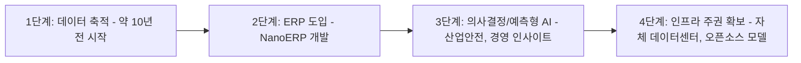
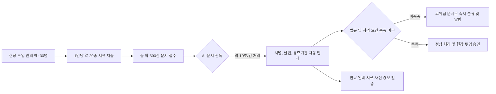
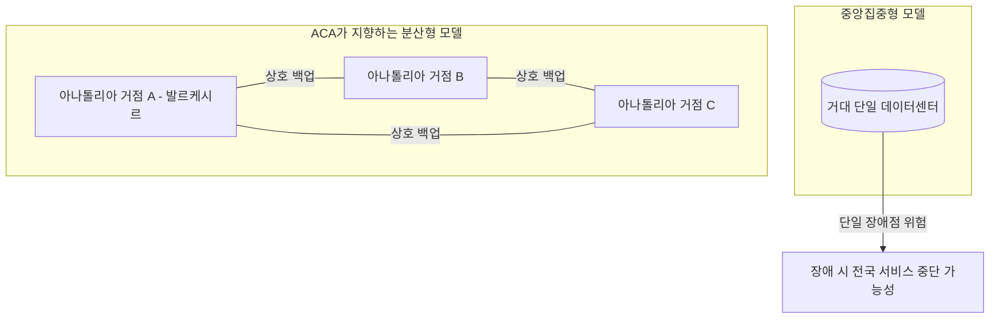

## 목차

1. 이 영상은 무엇에 관한 것인가
2. 등장인물: 하으크 바슈(진행자)와 아흐메트 아자로울라르으
3. ACA 그룹이라는 회사: 60년 건설업에서 AI 인프라 기업으로
4. 핵심 문제의식 — "현장의 먼지를 마신 사람"이 AI를 이끌어야 한다
5. 두 개의 고객군: 대기업과 아나톨리아 중소기업(코비)
6. 기술 진화의 10년 궤적: 데이터 축적 → ERP → 예측형 AI
7. 제품 포트폴리오 상세 — NanoERP, NanoİSG, 그리고 세 번째 플랫폼
8. 데이터 주권과 분산형(엣지) 데이터센터 철학
9. 셀축 바이락타르의 국가기술운동 비전과의 접점 — 검증된 사실
10. 사업 규모, 소속 단체, 그리고 최근 공개 행보
11. 채널 정보: ShiftDelete.Net
12. 검증된 사실과 영상 내에서만 언급된 주장 — 정리표
13. 참고자료

---

## 1. 이 영상은 무엇에 관한 것인가

이 영상은 튀르키예 최대 IT 전문 매체 중 하나인 ShiftDelete.Net의 유튜브 채널에 2026년 7월 18일 공개된 인터뷰 콘텐츠로, 진행자 하으크 바슈(Hakkı Baş)가 튀르키예 서부 발르케시르(Balıkesir)를 직접 방문해 ACA 그룹 이사회 의장 아흐메트 아자로울라르으(Ahmet Acaroğulları)와 나눈 약 24분 분량의 대화입니다. 주제는 한마디로 요약하면 "대도시가 아닌 아나톨리아 지방 도시에서 산업용 AI 전환이 실제로 어떻게 이루어지고 있는가"입니다.

영상은 추상적인 AI 담론이 아니라, 실제로 가동 중인 제품과 인프라를 중심으로 이야기를 전개합니다. 특히 건설·에너지·방위산업 분야의 전통적 기업이 어떻게 자체 데이터센터와 오픈소스 AI 모델, 그리고 산업안전관리 소프트웨어를 만들어냈는지를 다루며, 그 배경에는 "인간을 대체하지 않고 보조하는 AI"라는 일관된 철학이 자리하고 있습니다.

## 2. 등장인물: 하으크 바슈(진행자)와 아흐메트 아자로울라르으

하으크 바슈는 ShiftDelete.Net의 진행자로, 이번이 아자로울라르으와의 첫 만남이 아니라 3년 이상 이어진 친분을 바탕으로 대화를 이끌어갑니다. 그는 대화 중 두 사람이 미국 라스베이거스의 CES(소비자가전전시회)와 실리콘밸리 인근 행사에서 여러 차례 마주쳤다고 언급하며, 아자로울라르으를 오래전부터 지켜봐 온 인물로 소개합니다.

아흐메트 아자로울라르으는 ACA 그룹의 창업자이자 이사회 의장입니다. 그의 이력은 이번 영상뿐 아니라 튀르키예 주요 언론과 ACA 그룹 공식 웹사이트를 통해서도 확인됩니다. ACA 그룹 공식 사이트에 따르면 그는 미국 경제매체 포브스가 운영하는 기술 전문가 네트워크인 포브스 테크놀로지 카운슬(Forbes Technology Council)의 회원이며, 스탠퍼드 대학교의 AI 리더십 프로그램(AI-Driven Leadership Program)에도 참여한 이력이 있습니다. 또한 튀르키예 방위·항공 산업 클러스터인 SAHA İstanbul, 그리고 대외경제관계위원회(DEİK)의 활동에도 관여하고 있다고 소개되어 있습니다.

## 3. ACA 그룹이라는 회사: 60년 건설업에서 AI 인프라 기업으로

아자로울라르으는 인터뷰 초반에 자신의 회사를 이렇게 소개합니다. ACA 그룹은 60년 역사를 지닌 가족 기업으로, 주력 사업은 산업·방위·에너지 분야 시설의 설계부터 시공까지를 아우르는 EPC(Engineering, Procurement, Construction, 즉 엔지니어링·조달·시공 일괄수행) 서비스입니다. 실제로 ACA 그룹 공식 웹사이트를 확인해보면 이 회사는 튀르키예어로 "물리적 인프라에서 디지털 지능으로(From Physical Infrastructure to Digital Intelligence)"라는 슬로건을 내걸고 있으며, 사업 영역을 산업 엔지니어링·EPC, AI 및 전사 소프트웨어 솔루션, 사물인터넷(IoT) 기반 산업 모니터링, 디지털 트윈·시뮬레이션, 에너지 인프라·재생에너지, 클라우드 데이터센터의 여섯 갈래로 명시하고 있습니다.

회사 산하에는 건설 부문인 ACA 건설(acainsaat.com.tr), 소프트웨어 부문인 나노 테크놀로직(Nano Teknolojik, nanoteknolojik.com), 그리고 테크니카(Teknika)와 두마시스(Dumasis)라는 계열사가 존재합니다. 본사는 발르케시르 카레시(Karesi) 지구에 위치해 있으며, 이는 인터뷰가 실제로 발르케시르 현지에서 촬영되었다는 진행자의 설명과도 일치합니다.

아자로울라르으는 최근 몇 년 사이 이 회사가 현장에서 쌓은 경험을 신기술과 결합하는 다양한 투자를 진행해왔고, 그 대표 분야가 바로 데이터센터와 AI 기술이라고 밝힙니다. 즉 ACA 그룹의 서사는 "전통 제조·건설업체가 자체적으로 AI 인프라 사업자로 전환한 사례"로 요약할 수 있습니다.

## 4. 핵심 문제의식 — "현장의 먼지를 마신 사람"이 AI를 이끌어야 한다

영상 전체를 관통하는 표현은 튀르키예어 관용구인 "birlikten kuvvet doğar, bereket hasıl olur"(단결에서 힘이 나오고, 그로부터 풍요가 생긴다)와 "sahanın tozunu yutmuş kişi"(현장의 먼지를 마셔본 사람)입니다. 아자로울라르으는 이를 통해 자신들의 접근법을 설명합니다.

그의 논지는 이렇습니다. 오늘날 많은 경영자들이 챗GPT, 제미나이, 그록 같은 생성형 AI 도구를 시험해보지만, 실제로 "이걸 현장에 어떻게 적용할 것인가", "팀은 이걸 어떻게 신뢰하게 만들 것인가"라는 질문 앞에서 막힌다는 것입니다. 이 문제를 풀 수 있는 사람은 AI 전문가가 아니라, 반복되는 문제와 그 해결책을 몸으로 알고 있는 현장 숙련자라는 것이 그의 핵심 주장입니다. 그는 이런 현장 숙련자가 실질적으로 AI에게 "프롬프트"를 제공하고 콘텐츠를 제공하는 존재이며, 따라서 해법도 그 사람으로부터 나올 수 있다고 설명합니다.

이 철학은 "AI가 사람의 자리를 대체하는 것이 아니라, 사람을 돕고 삶을 편하게 만들며, 사람이 진짜 가치를 창출하는 자리에 있도록 돕는 도구여야 한다"는 문장으로 압축됩니다. 아자로울라르으는 흥미로운 사례를 하나 언급합니다. AI를 도입한 어느 경영자가 "우리는 여기서 일하는 인원을 줄이려는 게 아니라, 그들의 생산성을 높이고 가치를 더해주려는 것"이라고 말했다는 일화입니다. 그는 이를 인원 감축이 아니라 인력의 역량 강화를 지향하는 접근이라고 평가합니다. 다만 이 일화는 영상 속에서 아자로울라르으 개인이 전달한 이야기이며, 해당 경영자나 회사가 별도로 특정되지는 않았다는 점은 짚어둘 필요가 있습니다.

## 5. 두 개의 고객군: 대기업과 아나톨리아 중소기업(코비)

아자로울라르으는 산업 현장을 두 그룹으로 나눕니다. 하나는 직원 수 250명 이상의 대형 산업체, 다른 하나는 그 이하 규모의 아나톨리아 중소기업, 즉 튀르키예어로 "코비(KOBİ)"라 불리는 계층입니다. 그는 이 구분이 중요한 이유를 다음과 같이 설명합니다. AI에 대한 관심 자체는 이제 거의 모든 경영자에게 보편화되었지만, 실제로 250명 이상 규모의 기업들조차 "AI를 도입하고 싶다"는 열망과 "그것을 현장에 어떻게 이식할 것인가"라는 현실 사이에서 정체되어 있다는 것입니다.

그는 이 지점에서 ACA 그룹의 접근법을 "위험을 무릅쓰고 직접 실행에 뛰어드는 것(elini taşın altına koymak, 직역하면 '돌 밑에 손을 넣는 것')"이라고 표현합니다. 즉 이론이 아니라 실제 제품과 인프라로 증명하는 방식을 택했다는 뜻입니다. 그는 여기서 미국 빅테크 기업들이 만든 거대 언어모델을 활용하는 것 자체는 부정하지 않지만, 그 모델들이 미국 등 해외 인프라에서 구동되며, 튀르키예 기업들이 자사 데이터를 그 모델에 보내는 방식으로 결과적으로 해외 모델의 성능을 발전시켜주는 셈이 된다는 점을 지적합니다. 이에 대응해 ACA 그룹은 튀르키예 내 데이터센터와 튀르키예 내 GPU 인프라 위에서, 오픈소스 알고리즘을 통해 자사의 반복 업무를 자동화하는 방향을 택했다고 설명합니다.

## 6. 기술 진화의 10년 궤적: 데이터 축적 → ERP → 예측형 AI

아자로울라르으는 회사의 기술적 여정을 시간순으로 설명합니다. 약 10년 전 그들은 우선 데이터를 모으는 것부터 시작했습니다. 데이터가 중요하다는 것을 인식하고 축적을 시작했지만, 시간이 지나면서 데이터가 단순한 "데이터 더미"로 쌓이기만 할 뿐 그로부터 의미를 끌어내지 못한다는 문제에 부딪혔습니다. 이에 따라 전사적자원관리(ERP) 소프트웨어 개발에 착수했고, 이 단계에서는 축적된 데이터로부터 특정한 산출물(리포트, 지표 등)을 확인할 수 있게 되었습니다.

그러나 생성형 AI가 등장하면서 이러한 산출물만으로는 부족하다는 것을 깨달았고, 이를 의사결정과 예측의 영역으로 발전시키고자 했다는 것이 그의 설명입니다. 그는 오늘날의 AI 알고리즘이 잘 정돈된 데이터 위에서 훌륭한 산출물을 낼 수 있다는 점, 그리고 리스크를 전적으로 사람에게 지우기보다 리스크를 관리하는 사람을 돕는 소프트웨어와 화면을 제공하는 것이 큰 이점을 준다는 점을 강조합니다.

이 흐름을 정리하면 다음과 같은 구조로 요약할 수 있습니다.

## 7. 제품 포트폴리오 상세 — NanoERP, NanoİSG, 그리고 세 번째 플랫폼

영상 속에서 아자로울라르으가 소개하는 제품은 크게 세 가지입니다. 이 가운데 두 가지는 공식 웹사이트를 통해 명확히 확인되었고, 나머지 하나는 음성만으로 정확한 명칭을 확정하기 어려운 부분이 있어 별도로 표시했습니다.

### 7-1. NanoERP — 국산 전사자원관리 시스템

nanoyazilim.com.tr 산하 브랜드인 나노 테크놀로직이 운영하는 erpofthefuture.com(NanoERP 공식 사이트)에 따르면, NanoERP는 견적부터 납품까지, 재고부터 품질까지 전체 운영을 하나의 화면에 통합하는 것을 표방하는 국산 ERP 솔루션입니다. 공식 사이트가 밝힌 수치로는 누적 처리 거래액 2억 5천만 리라 이상, 500만 건 이상의 ERP 트랜잭션, 그리고 8주 이내의 실사용 전환(라이브 전환) 기간을 내세우고 있습니다. 제공 모듈은 생산계획 및 추적(MRP), 거래처(카리) 관리, 견적 관리, 구매·주문 관리, 문서 관리, 인사 관리 등입니다. 흥미로운 점은 이 사이트의 고객사 로고 목록에 ACA(Aca.png) 자체가 포함되어 있다는 것으로, 이는 ACA 그룹이 자사 소프트웨어를 스스로도 사용하고 있음을 시사합니다.

### 7-2. NanoİSG — AI 기반 산업안전관리(İSG) 플랫폼

nanoisg.com 공식 사이트를 확인한 결과, NanoİSG는 "위캇(Wix)" 플랫폼 위에 구축된 제품으로, 정식 명칭은 "나노 테크놀로직 주식회사(Nano Teknolojik A.Ş.)"의 등록상표입니다. 사이트 설명에 따르면 이 제품은 기업의 산업안전보건(İSG, 튀르키예어로 iş sağlığı ve güvenliği) 프로세스를 더 효율적으로 관리할 수 있도록 돕는 AI 보조 플랫폼으로, 원청·하청·협력업체 서류를 통합 관리하고 AI에게 법규 준수 여부를 질의할 수 있는 기능을 제공한다고 소개하고 있습니다.

공식 사이트가 밝힌 핵심 기능은 다음과 같습니다.

- 방문자 등록 관리(출입 게이트에서의 방문객 기록)
- 근태(출퇴근) 관리
- 협력업체·하청업체 관리
- 부적합 사항(위험 요소) 탐지 및 사진 기반 보고
- İSG 특화 AI 어시스턴트
- 문서(파일) 관리
- 인력 교육 이력 추적

사이트는 서류 관리 부담을 최대 60퍼센트 줄일 수 있다고 주장하며, 건설 현장, 제조 시설, 광산, 물류 현장, 에너지 시설, 조선소 등 업종별 적용 사례 페이지를 별도로 운영하고 있습니다. 데이터는 튀르키예 내에 저장되며 개인정보보호법(KVKK)을 준수한다고 명시되어 있습니다.

영상 속에서 아자로울라르으가 든 구체적 예시는 다음과 같습니다. 고위험 산업 현장(공장, 건설 현장 등)에 인력이 새로 투입될 때 1인당 평균 약 20종의 서류가 필요합니다. 만약 30명이 한 번에 투입된다면 총 600건의 서류가 발생하는 셈입니다. 이를 사람이 한 건당 1분씩 육안으로 검토한다면 총 600분이 소요되지만, AI를 활용하면 문서 한 건을 약 10초 만에 판독해 위험 요소가 있는 문서를 즉시 걸러낼 수 있다고 설명합니다. 나아가 이 시스템은 서류의 유효기간이 며칠 내로 만료될 예정이라는 사실을 담당자가 별도로 확인하지 않아도 사전에 알려주는 기능을 갖추고 있다고 소개합니다. 이 구체적인 수치(600건, 10초 등)는 아자로울라르으가 인터뷰에서 직접 언급한 것으로, 나노İSG 공식 사이트에 게시된 일반적 기능 소개와는 별개로 확인이 필요한 사례 설명이라는 점을 밝혀둡니다.

이 흐름을 도식화하면 다음과 같습니다.

### 7-3. 세 번째 플랫폼 — "ACA One"(음성 인식상 불확실)

영상 속에서 아자로울라르으는 앞의 두 제품 위에 "한 단계 더 얹고 싶은" 플랫폼을 언급합니다. 자막 및 음성 전사 기록에는 이 명칭이 "Acevan"으로 표기되어 있으나, 문맥과 발음, 그리고 뒤이어 진행자가 "ACA One"이라고 되풀이해 부르는 대목을 고려하면 실제로는 "ACA One"을 지칭했을 가능성이 높습니다. 다만 이번 조사 과정에서 ACA 그룹 공식 웹사이트나 외부 언론에서 "ACA One"이라는 독립 브랜드명을 명확히 확인하지는 못했습니다. 이 점은 확정된 사실이 아니라 음성 전사의 모호함에서 비롯된 추정임을 밝혀둡니다.

아자로울라르으의 설명에 따르면 이 플랫폼은 "고급 비즈니스 인텔리전스(ileri iş zekası)"로 정의되며, IT 부서 산하가 아니라 최고경영자(CEO)나 C레벨 임원에게 직접 서비스하는 형태로 포지셔닝되어 있다고 합니다. 즉 회사의 데이터 위에서 작동하되, 실무 부서보다는 경영진의 의사결정을 직접 지원하는 상위 계층의 분석 도구로 이해할 수 있습니다.

## 8. 데이터 주권과 분산형(엣지) 데이터센터 철학

영상에서 가장 두드러지는 대목 중 하나는 데이터센터 아키텍처에 대한 철학입니다. 진행자 하으크 바슈는 발르케시르 현지에 컨테이너 형태의 데이터센터가 구축되어 있으며, 이곳에서 엔비디아(Nvidia) AI 칩을 사용해 오픈소스 모델을 구동하고 있다는 사실에 놀라움을 표합니다. 그는 이것이 특정 기업의 제품을 홍보하려는 것이 아니라, 튀르키예 제조업이 반드시 겪어야 할 전환의 실제 사례로서 의미가 크다고 평가합니다.

아자로울라르으는 이러한 투자의 철학적 배경을 다음과 같이 설명합니다. 오늘날 전 세계적으로는 거대한 데이터센터와 그 안에 통합된 대규모 GPU 클러스터가 주류를 이루고 있지만, ACA 그룹이 주목하는 흐름은 이와 다릅니다. 그는 최근 발생한 이란·미국·이스라엘 간의 무력 충돌을 예시로 들며, 거대한 단일 데이터센터가 공격을 받는 순간 전체 인프라가 붕괴할 수 있다는 위험성을 지적합니다. 이 발언은 아자로울라르으 개인이 대화 중 든 비유이며, 본 문서는 해당 충돌의 세부 경과에 대한 사실관계를 판단하거나 검증하지 않습니다. 다만 2025~2026년 사이 이란과 이스라엘, 미국이 연루된 군사적 긴장이 실제로 국제적으로 보도된 사안이라는 점은 참고할 수 있습니다.

이에 대한 대안으로 아자로울라르으는 하나의 중앙이 아니라 튀르키예 여러 지점에서 동시에 작동하며 서로를 백업하는 분산형 구조, 즉 "부분들이 모여 전체를 이루는" 데이터센터 아키텍처에 투자하고 있다고 설명합니다. 그는 이를 "단결에서 힘이 나오고 풍요가 생긴다"는 아나톨리아의 전통적 지혜와 연결지어 표현합니다. 이러한 구조는 국산 인프라 위에서 튀르키예 내 개발자들이 오픈소스 알고리즘을 계속 발전시킬 수 있게 하며, 설령 일부 소규모 거점에 장애가 생기더라도 전체 시스템은 서로를 백업하며 가동을 지속할 수 있다는 것이 그의 주장입니다.

이를 도식으로 정리하면 다음과 같습니다.

## 9. 셀축 바이락타르의 국가기술운동 비전과의 접점 — 검증된 사실

영상 후반부에서 아자로울라르으는 튀르키예 방산기업 바이카르(Baykar)의 이사회 의장 셀축 바이락타르(Selçuk Bayraktar)가 한 AI 관련 행사에서 "거대 데이터센터보다 분산형 구조가 더 나을 수 있다"는 취지의 비전을 밝힌 바 있으며, 자신들의 투자 방향이 이와 궤를 같이한다고 언급합니다.

이 부분은 실제 뉴스 보도를 통해 교차 확인이 가능했습니다. 2026년 5월 이스탄불에서 열린 SAHA EXPO 2026 및 같은 해 6월 열린 튀르키예 인공지능 정상회의(Türkiye Yapay Zeka Zirvesi)에서 바이락타르는 실제로 거대 중앙집중형 클라우드 구조에 대한 의존을 줄이고, 병원·기관 등 각 조직 내부에 데이터를 남겨둔 채 알고리즘만 분산 네트워크 위에서 프라이버시를 훼손하지 않고 학습하도록 하는 방식, 그리고 거대한 중앙 클라우드 없이 기기 자체에서 작동하는 엣지 AI(Edge AI) 모델 개발이 필요하다는 취지의 발언을 한 것으로 다수의 튀르키예 매체(mynet, ShiftDelete.Net, haber7, 코룸 하키미예트 등)가 보도했습니다. 그는 이를 "기술적 연대 동맹(Teknolojik Dayanışma İttifakı)"이라는 표현으로 요약하며, 이러한 비전이 국가기술운동(Milli Teknoloji Hamlesi)의 정신적 핵심이라고 밝혔습니다.

즉, 영상 속 아자로울라르으의 발언은 개인적 견해에 그치는 것이 아니라, 같은 시기 튀르키예 방산·기술 업계에서 공개적으로 논의되던 흐름과 실제로 맞닿아 있는 것으로 확인됩니다. 다만 바이락타르 본인이 ACA 그룹이나 발르케시르의 특정 프로젝트를 직접 언급했다는 근거는 이번 조사에서 확인되지 않았으며, 이는 아자로울라르으가 같은 방향성을 공유한다고 스스로 평가한 것으로 이해하는 것이 정확합니다.

## 10. 사업 규모, 소속 단체, 그리고 최근 공개 행보

### 사업 규모

아자로울라르으는 인터뷰에서 지난 10년간 ACA 그룹이 1억 유로 이상 규모의 계약 이행을 완료했다고 밝히며, 그 대상에는 방위산업 시설, 풍력발전소, 각종 물류창고, 식품 생산시설, 화학 플랜트 등이 포함된다고 설명합니다. 이 구체적 금액과 프로젝트 구성은 영상 속 발언에 근거한 것으로, ACA 그룹 웹사이트에서는 총액 수치 자체를 명시적으로 재확인하지는 못했습니다. 다만 ACA 그룹 공식 사이트의 프로젝트 사례 목록에는 BEST 변압기 대형 제조시설, 튀르키예 북키프로스(KKTC) 해안 감시 레이더 시스템, 에네르지사(EnerjiSA) 산하 아르무트추크·으흘라무르·케스타네데레시 풍력발전소 초고압 변전 시설, 그리고 튀르키예 화장품 브랜드 에이유프 사브리 툰제르(Eyüp Sabri Tuncer)의 발르케시르 조직화산업단지 신공장 프로젝트 등이 실제로 게재되어 있어, 방산·에너지·제조 분야에서 실질적인 EPC 수행 실적이 존재함은 확인됩니다.

### 소속 단체 및 네트워크

ACA 그룹 공식 웹사이트에는 다음 네 개 단체의 로고가 "소속 단체(Üyesidir)" 항목으로 게시되어 있어, 영상 속 아자로울라르으의 발언과 대조해 확인할 수 있습니다.

| 영상 속 명칭(음성 전사) | 실제 확인된 단체명 | 성격 |
|---|---|---|
| Saha İstanbul | SAHA İstanbul | 튀르키예 방위·항공산업 클러스터 |
| Aıa(AI 정책 협회) | AIPA Türkiye(추정) | 인공지능 정책 관련 협회 |
| Bagi | BAGİAD(발르케시르 청년기업인협회) | 지역 청년 기업인 단체 |
| (영상에 미언급) | DEİK(대외경제관계위원회) | 대외 경제협력 위원회 |

이 가운데 "AIA"는 영상 속 음성 전사에서 정확한 발음이 다소 모호했던 부분으로, ACA 그룹 사이트에 게시된 로고 링크(aipaturkey.org)를 근거로 AIPA Türkiye로 추정했습니다. 이는 완전히 확정된 사실이라기보다 정황상 가장 가능성이 높은 추정임을 밝혀둡니다.

### 최근 공개 행보(2026년 상반기~중반)

이번 조사 과정에서 확인된 바에 따르면, 아자로울라르으는 이 영상이 공개되기 전후로 실제 여러 공개 행사에 참여하며 유사한 메시지를 반복해서 전달해 왔습니다.

- 2026년 6월, 앙카라에서 열린 "AI Tomorrow Summit"에서 튀르키예 뉴스통신사 아나돌루 아잔스(AA)와의 인터뷰를 통해, AI 전환이 기술기업뿐 아니라 제조 시설, 에너지 투자, 방위산업, 현장 운영 전반을 바꿀 것이며, 기업들이 대규모 예산의 프로젝트보다 작지만 정확한 걸음으로 시작해야 한다는 취지의 발언을 했습니다. 그는 오늘날 다수 기업의 AI 활용이 경영진 개인의 챗봇 경험 수준을 넘어서지 못하고 있다고 지적하며, AI의 실질적 경제 효과는 공장, 에너지 시설, 물류 현장, 생산 라인에서 나타날 것이라고 밝혔습니다. 같은 발언에서 그는 에너지·방위산업·제조업 같은 전략 분야일수록 데이터가 어디에 보관되는지, 모델이 어떤 인프라에서 구동되는지가 중요하며, 지역 데이터센터에서 작동하고 필요시 지역 모델로 뒷받침되는 AI 시스템이 튀르키예에 중요한 역량 영역이 될 것이라는 견해를 밝혔습니다.
- 이후(2026년 6월 하순~7월 초로 추정) 그는 독일 베를린에서 나토 동맹변혁사령부(ACT)가 주최한 "동맹 예측 회의 2026(Allied Futures Conference 2026)"에 산업계 대표로 참가했습니다. 이 자리에서 그는 AI, 자율 시스템, 미래 안보 기술이 다뤄진 국제회의에 대한 소감을 밝히며, AI가 에너지 인프라부터 산업 생산까지 핵심 시스템의 관리 방식 자체를 바꾸고 있다고 평가했습니다. 그는 앞으로의 진짜 가치는 미세한 이상 신호를 분석해 잠재적 위험을 사전에 포착하고, 생산의 연속성을 지원하며, 경영진이 더 정확한 의사결정을 내리도록 돕는 시스템에서 나올 것이라고 전망했습니다. 아울러 기술 이전이 더 이상 일방향이 아니며, 민간 부문에서 개발된 AI 기술이 안보·국방 분야에 새로운 응용을 만들어내고 있고, 반대로 국방 생태계에서 축적된 경험 역시 산업 전환에 기여하고 있다는 견해를 밝혔습니다.

이러한 행보는 영상 속 인터뷰가 일회성 이벤트가 아니라, 아자로울라르으가 2026년 내내 튀르키예 국내외 주요 AI·안보 행사에서 일관되게 "산업용 AI 주권"이라는 메시지를 전달해온 흐름의 연장선에 있다는 점을 뒷받침합니다.

## 11. 채널 정보: ShiftDelete.Net

이 영상을 게시한 ShiftDelete.Net은 스스로를 튀르키예 최대 기술 전문 웹사이트의 유튜브 채널이라고 소개하며, 기술 뉴스와 리뷰 영상을 주력 콘텐츠로 다룹니다. 해당 영상 설명란에는 ACA 그룹 산하 제품 사이트(nanoisg.com, erpofthefuture.com)와 ACA 그룹 공식 사이트(acagroup.com.tr) 링크가 함께 게시되어 있으며, 이는 이번 조사에서 실제로 접속해 내용을 확인한 사이트들과 일치합니다. 영상 설명에는 협업(#işbirliği) 태그가 붙어 있어, 이 콘텐츠가 ACA 그룹과의 협력을 통해 제작된 브랜디드 콘텐츠 성격을 지닌다는 점도 함께 밝혀둘 필요가 있습니다.

## 12. 검증된 사실과 영상 내에서만 언급된 주장 — 정리표

아래 표는 이 영상에서 다뤄진 주요 내용을 "외부 자료로 교차 확인된 사실"과 "영상 속 발언에만 근거한 주장(별도 검증 안 됨)"으로 구분한 것입니다.

| 구분 | 내용 | 근거 |
|---|---|---|
| 확인됨 | ACA 그룹은 건설·엔지니어링·소프트웨어를 아우르는 튀르키예 발르케시르 소재 그룹사이며, 산업 EPC와 AI 소프트웨어 사업을 함께 영위한다 | ACA 그룹 공식 사이트 |
| 확인됨 | 아흐메트 아자로울라르으는 ACA 그룹 창업자 겸 이사회 의장이며, 포브스 테크놀로지 카운슬 회원, 스탠퍼드 AI 리더십 프로그램 참가 이력이 있다 | ACA 그룹 공식 사이트 |
| 확인됨 | NanoERP와 NanoİSG는 나노 테크놀로직(ACA 그룹 산하)이 운영하는 실제 상용 제품이다 | erpofthefuture.com, nanoisg.com 직접 확인 |
| 확인됨 | 아자로울라르으는 2026년 6월 앙카라 AI Tomorrow Summit에서, 그리고 나토 ACT 주최 베를린 회의에서 유사한 취지의 AI 주권·산업전환 메시지를 실제로 공개 발언했다 | 아나돌루 아잔스(AA) 배포 기사 및 이를 인용한 다수 지역 언론 |
| 확인됨 | 셀축 바이락타르는 2026년 5~6월 SAHA EXPO 및 튀르키예 인공지능 정상회의에서 분산형·엣지 AI 인프라의 필요성을 공개적으로 주장했다 | mynet, ShiftDelete.Net, haber7 등 복수 매체 |
| 부분 확인 | ACA 그룹은 SAHA İstanbul, BAGİAD, DEİK 및 AI 정책 관련 협회의 회원사로 소개되고 있다 | ACA 그룹 공식 사이트 로고 게시 영역(단체명 일부는 음성 인식 기반 추정) |
| 미확인(영상 발언에만 근거) | 발르케시르 현지의 컨테이너형 데이터센터에서 엔비디아 칩과 오픈소스 모델이 구동되고 있다는 구체적 설명 | 영상 속 진행자·인터뷰이 발언, 외부 3자 자료로는 세부 사양까지 재확인되지 않음 |
| 미확인(영상 발언에만 근거) | 지난 10년간 1억 유로 이상 계약 이행, 30명 투입 시 600건 서류를 10초 단위로 처리한다는 구체적 수치 | 영상 속 아자로울라르으 발언 |
| 명칭 불확실 | "ACA One"(또는 음성 전사상 "Acevan")이라는 세 번째 플랫폼의 정확한 공식 명칭 | 음성 전사의 모호함, 외부 자료로 명칭 재확인 안 됨 |

## 13. 참고자료

- ShiftDelete.Net 유튜브 영상, "İnsan Odaklı Yapay Zeka Dönüşümü" (2026년 7월 18일 게시): https://www.youtube.com/watch?v=Q1_YYhov42c
- ShiftDelete.Net 기사, "İnsan odaklı yapay zeka dönüşümü": https://shiftdelete.net/insan-odakli-yapay-zeka-donusumu
- ACA 그룹 공식 사이트: https://www.acagroup.com.tr
- NanoERP(ERP of the Future) 공식 사이트: https://www.erpofthefuture.com
- NanoİSG 공식 사이트: https://www.nanoisg.com
- 아나돌루 아잔스(AA), "ACA Group Yönetim Kurulu Başkanı Acaroğulları'ndan yapay zeka dönüşümüne ilişkin değerlendirme": https://www.aa.com.tr/tr/isdunyasi/sirketler/aca-group-yonetim-kurulu-baskani-acarogullarindan-yapay-zeka-donusumune-iliskin-degerlendirme/702840
- Ereğli Önder Gazetesi, "ACA Group'tan yapay zeka değerlendirmesi"(나토 ACT 베를린 회의 관련): https://www.ereglionder.com.tr/aca-grouptan-yapay-zeka-degerlendirmesi
- ShiftDelete.Net, "Selçuk Bayraktar'dan Yapay Zekâda Dijital Egemenlik Vurgusu": https://shiftdelete.net/selcuk-bayraktardan-yapay-zekada-dijital-egemenlik-vurgusu
- mynet 하베르, "Bayraktar'dan SAHA 2026'da teknokapitalizm uyarısı ve milli yapay zeka manifestosu": https://haber.mynet.com/bayraktar-dan-saha-2026-da-teknokapitalizm-uyarisi-ve-milli-yapay-zeka-manifestosu-110107292723
- CNN Türk, "Baykar Yönetim Kurulu Başkanı Selçuk Bayraktar: Tekno-tekellerin işgali var, milli teknoloji mimarisi şart": https://www.cnnturk.com/turkiye/baykar-yonetim-kurulu-baskani-selcuk-bayraktardan-teknofest-kusagina-mesaj-2425588

---

