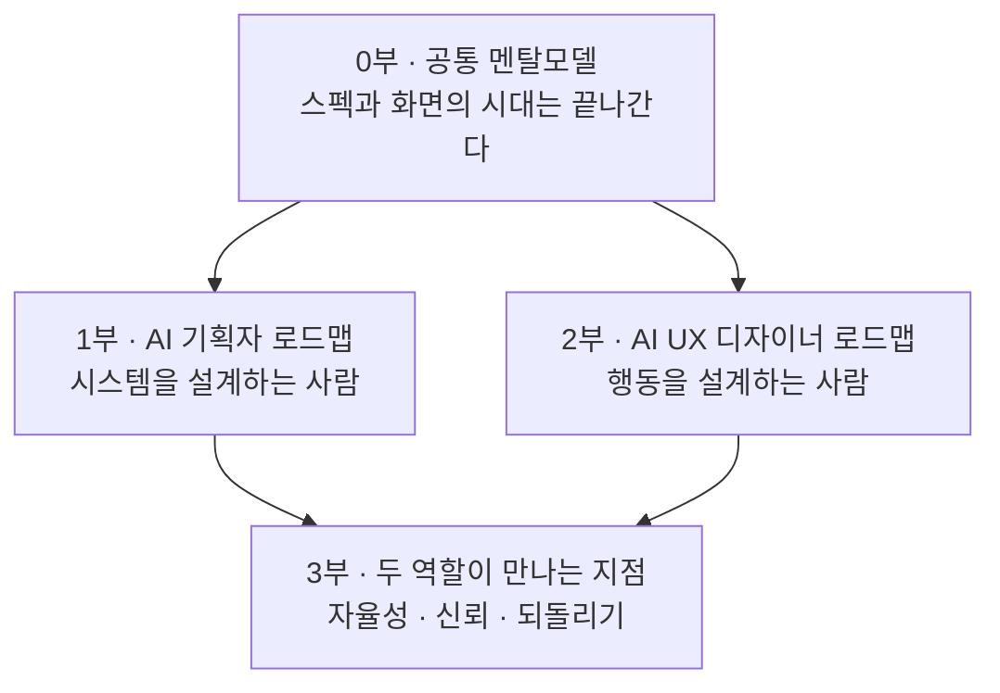
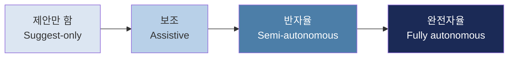
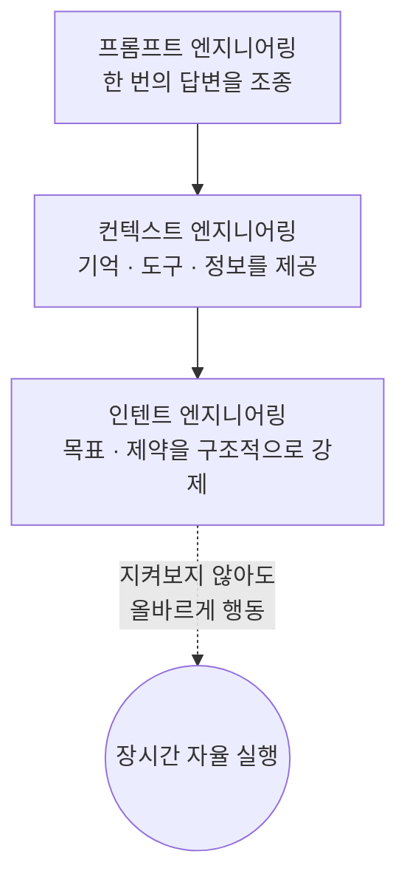
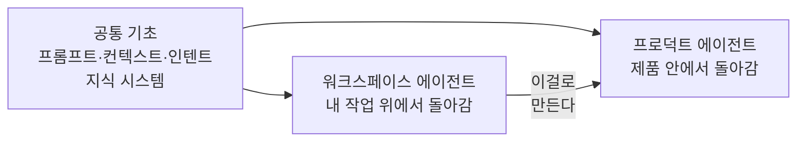
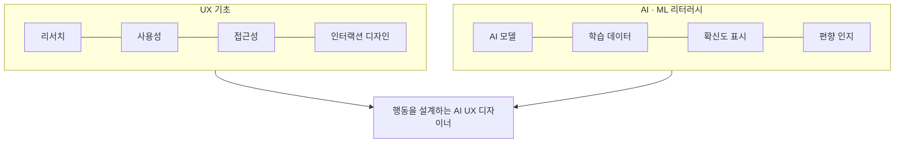
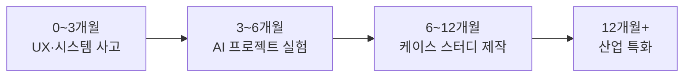
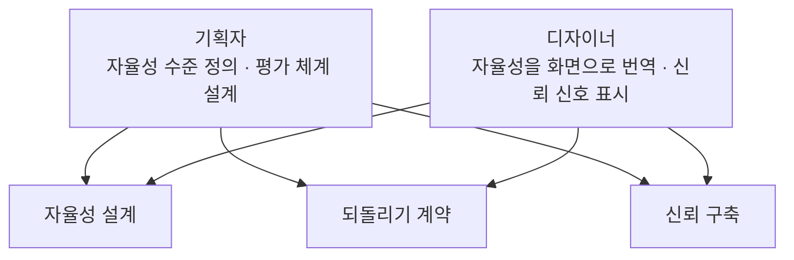

---

## 문서 개요

이 문서는 앞서 만든 [**"제로에서 시작하는 에이전틱 AI 엔지니어"**](https://k82022603.github.io/posts/%EC%A0%9C%EB%A1%9C%EC%97%90%EC%84%9C-%EC%8B%9C%EC%9E%91%ED%95%98%EB%8A%94-%EC%97%90%EC%9D%B4%EC%A0%84%ED%8B%B1-ai-%EC%97%94%EC%A7%80%EB%8B%88%EC%96%B4-14%EB%8B%A8%EA%B3%84-%EB%A1%9C%EB%93%9C%EB%A7%B5/) 의 자매편입니다. 다만 이번엔 참고할 특정 원문 아티클이 주어지지 않았습니다. 그래서 이번 문서는 번역·해설이 아니라, 2026년 7월 현재 시점에서 직접 조사한 최신 자료를 근거로 새로 종합·집필한 결과물입니다.

핵심적으로 참고한 1차 출처는 두 편입니다. 하나는 Paweł Huryn이 The Product Compass에 2026년 7월 5일 게재한 **"The Ultimate AI Product Manager Roadmap (2026)"** 으로, AI 프로덕트 매니저(기획자)에게 필요한 스킬을 체계적으로 정리한 최신 로드맵입니다. 다른 하나는 Abdullah Al Noman이 Design Monks에 2025년 12월 31일 게재한 **"Your 2026 Roadmap to Become an AI UX Designer"** 로, AI UX 디자이너를 위한 단계별 가이드입니다. 여기에 GitLab UX 리서치팀의 에이전트 신뢰 연구(2026년 1월), UXmatters의 에이전틱 UX 프로세스 분석(2026년 3월) 등을 더해 기획자와 디자이너가 공통으로 마주하는 지점까지 종합했습니다.

원문이 하나가 아니라 여러 개이고, 이 문서 자체가 종합·재구성의 결과물이므로, 문서 뒷부분의 "팩트체크 노트"에서 어떤 내용이 특정 출처에서 직접 확인되는 것인지, 어떤 내용이 여러 출처를 종합한 저의 분석인지를 명확히 구분해두었습니다.

---

## 들어가며: 왜 기획자와 디자이너도 이 전환을 알아야 하는가

앞선 엔지니어 로드맵에서 다룬 일의 대부분은 **실행 레이어**에 있었습니다. 프로세스를 실행하고, API를 호출하고, 권한을 강제하고, 로그를 남기는 일입니다. 이 레이어는 토큰 생성으로 흡수되지 않는, 구조적으로 사람(과 코드)이 설계해야 하는 영역입니다.

기획자와 디자이너의 일은 이보다 한 층 위, **판단 레이어**와 정면으로 마주합니다. 에이전트에게 어느 정도의 자율성을 허용할 것인가, 언제 사람이 개입해야 하는가, 사용자가 이 시스템을 신뢰하려면 무엇을 보여줘야 하는가 — 이런 결정은 모델 가중치가 대신 내려주지 않습니다. 모델은 점점 똑똑해지지만, "이 조직에서 이 자율성이 허용 가능한가"라는 질문에는 답하지 못합니다. 그 답을 설계하는 사람이 바로 기획자와 디자이너입니다.

두 역할은 각자 다른 각도에서 같은 문제에 접근합니다. 기획자는 "이 에이전트가 무엇을 해도 되는가, 어떤 지표로 그 성공을 측정할 것인가"를 결정합니다. 디자이너는 "이 에이전트가 지금 무엇을 하고 있는지, 사용자가 어떻게 이해하고 개입할 수 있는지"를 형태로 만듭니다. 이 문서는 두 역할을 각각의 로드맵으로 다룬 뒤, 마지막에 두 역할이 반드시 함께 풀어야 하는 지점을 별도로 다룹니다.

---

## 0부. 공통 멘탈모델 — 두 역할에게 동시에 일어나는 전환

### 0-1. 스펙을 쓰던 기획자, 화면을 그리던 디자이너

전통적인 기획자는 요구사항 문서(PRD)를 쓰고 우선순위를 정했습니다. 전통적인 UX 디자이너는 화면과 흐름을 설계했습니다. 둘 다 결과물이 정적이었습니다. 문서는 한번 승인되면 개발팀에 넘어갔고, 화면은 한번 확정되면 사용자는 예측 가능한 방식으로만 그 화면과 상호작용했습니다.

에이전틱 AI 제품은 이 전제를 깹니다. Design Monks의 2026년 AI UX 디자이너 로드맵은 이 차이를 정확히 짚습니다. 전통적인 UX 디자이너는 사용자 행동이 대체로 예측 가능한 제품을 다루지만, AI UX 디자이너는 데이터로부터 스스로 학습하고, 판단을 내리고, 때로는 스스로 행동에 나서는 시스템을 다룹니다. 그 결과 디자이너는 불확실성 자체를 위해 디자인해야 하고, AI의 판단을 쉬운 말로 설명해야 하며, 사용자가 안전하고 통제감 있게 느끼도록 만들어야 합니다.

기획자 쪽에서도 같은 전환이 일어납니다. The Product Compass의 Paweł Huryn은 이를 "모델을 구경하지 말고, 시스템을 설계하라"는 문장으로 요약합니다. 대부분의 기획자에게는 통계학이나 파이썬, 손실 함수를 깊이 팔 필요가 없습니다. 필요한 것은 모델이 무엇을 할 수 있고 무엇을 할 수 없는지를 이해하고, 그 위에 시스템을 설계하는 능력입니다.

### 0-2. 두 역할이 공유하는 질문: 자율성을 얼마나 허용할 것인가

에이전틱 제품을 다루는 순간, 기획자와 디자이너는 같은 질문 앞에 섭니다. 이 기능은 사용자에게 제안만 할 것인가, 사용자 승인을 받고 실행할 것인가, 아니면 스스로 실행하고 나중에 보고할 것인가. UXmatters가 2026년 3월 제시한 에이전틱 UX 프로세스 분석은 이를 자율성 매트릭스로 표현합니다. 유스케이스를 행으로, 자율성 수준(제안만 함 → 보조 → 반자율 → 완전자율)을 열로 놓고, 각 조합마다 시간 절감과 롤백률 같은 지표를 함께 정의하는 방식입니다. 이 매트릭스를 만드는 과정 자체가 UX·법무·머신러닝·프로덕트 팀이 가드레일에 합의하는 자리가 됩니다.

같은 자료는 "AURA" 흐름(자동화 Automate · UX · 리뷰 Review · 승인 Approve)이라는 표현으로, 에이전틱 제품에서 디자이너의 역할이 유일한 창작자에서 전략적 감독자로 바뀐다고 설명합니다. 기획자가 자율성 수준을 정의하면, 디자이너는 그 수준을 사용자가 실제로 느끼고 개입할 수 있는 인터페이스로 번역합니다.

### 0-3. 신뢰는 한 번에 오지 않는다

GitLab UX 리서치팀이 2026년 1월 발표한 연구는 실무에 바로 쓸 수 있는 통찰을 줍니다. 에이전틱 도구 사용자 13명을 심층 조사한 결과, 사람들은 하나의 극적인 "아하 모먼트"로 AI 에이전트를 신뢰하게 되지 않았습니다. 대신 에이전트가 맥락을 이해하고, 설정해둔 가드레일을 존중하고, 워크플로를 방해하지 않고 오히려 도와준다는 것을 보여주는 수많은 작은 상호작용 — 연구팀이 "마이크로 인플렉션 포인트"라고 부르는 것 — 이 누적되면서 신뢰가 쌓였습니다.

이 발견은 기획자와 디자이너 모두에게 실무적인 함의를 줍니다. "이 에이전트를 믿어도 됩니다"라는 한 줄짜리 온보딩 메시지로는 신뢰를 만들 수 없습니다. 낮은 위험의 상황에서부터 시작해, 에이전트가 반복적으로 맥락을 존중하는 모습을 보여주고, 사용자가 가드레일을 설정하고 그 가드레일이 실제로 지켜지는 것을 확인하게 하는 설계가 필요합니다. 이 원칙은 3부에서 다시 다룹니다.

---

## 1부. AI 기획자(프로덕트 매니저) 로드맵

### 1-1. AI PM은 전통적 PM과 어떻게 다른가

Huryn의 로드맵이 던지는 첫 질문은 이렇습니다. 이 에이전트는 당신의 일 위에서 돌아가는가, 아니면 제품 안에서 돌아가는가. 이 구분이 로드맵 전체를 관통합니다. Claude Code나 Cowork처럼 기획자 자신의 작업(리서치, 프로토타이핑, 문서 작성)을 대신하는 에이전트를 **워크스페이스 에이전트**라 부르고, n8n이나 Agent SDK로 만들어 제품이나 비즈니스 프로세스 안에 심어 넣는, 사용자나 팀을 위해 스스로 돌아가는 에이전트를 **프로덕트 에이전트**라 부릅니다. 두 종류는 경쟁 관계가 아니라, 전자로 후자를 만드는 관계입니다.

이 구분 위에 놓인 더 근본적인 마인드셋 전환이 있습니다. 모델과 도구는 매달 흥미로운 뉴스를 만들어내지만, 정작 가치를 만드는 것은 신뢰할 수 있는 시스템입니다. 그래서 AI PM에게 필요한 것은 최신 모델 이름을 외우는 일이 아니라, 모델의 한계를 이해하고 그 위에 시스템을 설계하는 능력입니다.

### 1-2. 한 번만 배우면 되는 기초: 프롬프트 → 컨텍스트 → 인텐트 엔지니어링

Huryn의 로드맵에서 가장 실용적인 대목은 세 층으로 쌓이는 "말 거는 기술"의 구조입니다. 이 세 가지는 워크스페이스 에이전트든 프로덕트 에이전트든 동일하게 적용되기 때문에 한 번만 배우면 어디에나 씁니다.

**프롬프트 엔지니어링**은 한 번의 답변을 조종하는 기술입니다. **컨텍스트 엔지니어링**은 에이전트에게 기억, 도구, 필요한 정보를 쥐어주는 일입니다. **인텐트 엔지니어링**은 오랫동안 스스로 행동하는 에이전트가 사람이 매 단계를 지켜보지 않아도 올바른 일을 하도록, 목표와 제약을 구조적으로 못 박아두는 일입니다.

세 층을 익히면 워크스페이스 에이전트든 프로덕트 에이전트든 어떤 에이전트와도 대화할 수 있다는 것이 이 로드맵의 핵심 주장입니다.

### 1-3. 에이전트가 아는 것: 지식 시스템

에이전트가 무엇을 답하는지는 결국 무엇을 검색해올 수 있는지에 달려 있습니다. Huryn의 로드맵은 이 지점에서 흥미로운 관찰을 제시합니다. Claude Code가 답하기 전에 읽는 마크다운 "세컨드 브레인"과, 프로덕트 에이전트가 검색하는 벡터 데이터베이스는 사실 같은 개념이 두 가지 옷을 입은 것뿐이라는 것입니다. 둘 다 "에이전트가 필요한 것을 어떻게 아는가"라는 같은 질문에 대한 답입니다. 기획자에게 권장되는 순서는 명확합니다. 먼저 마크다운과 벡터 검색을 배우고, 관계가 정말 복잡해질 때만 그래프 데이터베이스로 넘어가라는 것입니다.

### 1-4. 핵심 분기점: 워크스페이스 에이전트 vs 프로덕트 에이전트

기초를 다졌다면 이제 갈림길입니다.

워크스페이스 에이전트는 기획자 자신의 일 — 리서치, 프로토타이핑, 납품, 출시 — 전 과정에서 씁니다. 목표를 주고 결과물을 검토하는 방식이며, 실시간으로 지켜볼 수도, 밤새 돌려놓고 아침에 확인할 수도 있습니다. 프로덕트 에이전트는 제품이나 비즈니스 프로세스 안에 심어져, 사용자나 팀을 위해 스스로 돌아갑니다. 아키텍처를 설계하고, 도구를 연결하고, 가드레일을 설정하는 것은 기획자의 몫이며, 이걸 만드는 데 워크스페이스 에이전트를 사용하기 때문에 학습 순서상 워크스페이스가 먼저 옵니다.

### 1-5. 워크스페이스 에이전트로 하는 일: 디스커버리와 프로토타이핑

워크스페이스 에이전트가 주는 가장 큰 보상은 기획자가 이미 잘하는 일 — 제품 감각 — 에 실행력을 더해준다는 점입니다. 가설을 검증하고, 실제로 작동하는 프로토타입을 만들고, 사용자 앞에 내놓고, 배우고, 다시 반복하는 사이클을 몇 주가 아니라 몇 시간 만에 돌릴 수 있습니다. Huryn은 이를 통해 프로덕트 디스커버리의 속도가 바뀔 뿐, 발견의 논리 자체(가설 검증, 인터뷰, 우선순위화)는 그대로 유지된다고 강조합니다. AI가 바꾸는 것은 속도지 방법론이 아니라는 뜻입니다.

### 1-6. 프로덕트 에이전트 만들기: 오케스트레이션 우선 사고

프로덕트 에이전트는 모델이 전체 과정을 즉흥적으로 판단하게 두는 대신, 단계·도구·가드레일·핸드오프를 기획자가 직접 설계하는 "오케스트레이션 우선" 방식으로 접근합니다. Huryn이 강조하는 학습법이 독특한데, 코드보다 시각적 도구(n8n 같은)로 먼저 에이전트를 만들어보라는 것입니다. 박스를 끌어다 놓고 도구를 연결하면서 데이터가 흐르는 것을 직접 보면, 루프가 어디서 도는지, 모델이 어디서 판단하는지, 도구 결과가 어디로 돌아오는지가 몸에 익습니다. 이 감각은 나중에 코드 기반 에이전트를 다룰 때도 그대로 옮겨간다는 것이 그의 관찰입니다.

### 1-7. 신뢰의 문제: 평가와 관측성(Evals)

에이전트가 실제 작업이나 실제 사용자에게 닿는 순간, 질문은 하나로 좁혀집니다. 이 에이전트를 믿을 수 있는가. 워크스페이스 에이전트는 결과물이 나올 때마다 기획자가 직접 검토하면 되지만, 사람이 지켜보지 않는 채로 돌아가며 고객에게 영향을 미치는 에이전트는 눈대중으로 품질을 판단할 수 없습니다. 반드시 측정해야 합니다. Huryn은 이 평가(evals) 작업이 엔지니어만의 몫이 아니라 기획자의 일이라고 못 박습니다. 아키텍처가 아무리 정교해도 제품이 실제로 작동하지 않으면 의미가 없고, 신뢰는 바로 이 평가에서 얻어지거나 잃어집니다.

### 1-8. 출시와 강화, 그리고 전략으로 확장하기

워크스페이스 에이전트로 만든 것이 실제로 사람들이 의지하는 제품이 되는 순간, 질문은 "무엇을 만들 수 있는가"에서 "어떻게 프로덕션을 망가뜨리지 않는가"로 바뀝니다. 브랜칭으로 개발·테스트·운영 환경을 분리하고, 보안과 성능을 점검하는 일이 여기서부터 기획자의 책임 범위에 들어옵니다. 이 모든 도구와 기법 위에는 여전히 프로덕트 전략이 있습니다. 기능은 복제되고 모델은 상품화되지만, 유통(distribution)은 누적된다는 것이 Huryn이 강조하는 마지막 층입니다. 도구를 다루는 능력이 아무리 좋아져도, 무엇을 왜 만드는지에 대한 프로덕트적 사고를 대체하지는 못한다는 뜻입니다.

---

## 2부. AI UX 디자이너 로드맵

### 2-1. AI UX 디자이너는 전통적 UX 디자이너와 어떻게 다른가

Design Monks의 정의를 따르면, AI UX 디자이너는 스스로 행동하고 예측하는 AI 시스템을 다루면서, 그 시스템을 쓰기 쉽고 신뢰할 수 있고 사람들에게 실제로 도움이 되도록 만드는 UX 전문가입니다. 전통적인 UX 디자이너가 레이아웃, 버튼, 메뉴, 내비게이션처럼 예측 가능한 사용자 행동을 다뤘다면, AI UX 디자이너는 불확실성 자체를 위해 디자인하고, AI의 판단을 쉬운 말로 설명하고, 사용자가 안전하고 통제감 있게 느끼도록 만드는 새로운 과제를 마주합니다. 여기에 더해 전통적 UX 디자이너는 거의 다루지 않았던 편향(bias)과 공정성 문제까지 신경 써야 합니다.

### 2-2. 핵심 스킬 스택: UX 기초 + AI 리터러시

AI가 화면을 그리고 사용자를 안내할 수는 있지만, 여전히 방향을 잡아주는 사람이 필요합니다. Design Monks는 이 스킬 스택을 두 축으로 나눕니다.

**UX 기초**는 2026년에도 여전히 AI 디자인의 토대입니다. 리서치(사용자의 니즈와 어려움을 파악), 사용성(작업을 쉽고 빠르게 만들기), 접근성(장애가 있는 사람을 포함한 모두가 쓸 수 있게), 인터랙션 디자인(다음에 무엇을 해야 할지 사용자가 항상 알 수 있는 흐름 설계)이 핵심입니다.

**AI·머신러닝 리터러시**는 코드를 짤 필요는 없지만 반드시 이해해야 하는 개념들입니다. AI 모델이 무엇인지, 학습 데이터의 품질이 왜 결과의 공정성을 좌우하는지, AI가 얼마나 확신하는지를 사용자에게 어떻게 보여줄지, 편향을 어떻게 예상하고 완화할지, 그리고 예상치 못한 상황에서 시스템이 어떻게 반응하는지를 이해해야 합니다.

### 2-3. 인터페이스가 아니라 행동을 설계한다

전통적 UX가 화면과 버튼에 집중했다면, AI UX는 AI 시스템이 어떻게 행동하는지로 무게중심이 옮겨갑니다. 사용자가 AI의 행동을 이해하고, 신뢰하고, 방향을 잡아줄 수 있는 경험을 설계하는 일입니다.

핵심 도구는 **피드백 루프**입니다. AI가 지금 무엇을 하고 있는지를 실시간으로 보여주는 장치로, 예를 들어 AI가 어떤 제품을 추천했다면 왜 그 추천이 나왔는지 설명하는 식입니다. **불확실성 표시**도 함께 필요합니다. AI가 예측에 확신이 없을 때 이를 사용자에게 알려 혼란을 막고 정보에 기반한 판단을 돕습니다. 마지막으로 **설명**입니다. AI의 판단은 사용자에게 "블랙박스"처럼 보이기 쉽고, 명확하고 단순한 설명이 신뢰를 만듭니다. 사용자가 AI를 신뢰하게 되면, 그 제안에 기꺼이 의지하고 오류가 있을 때도 스스로 고쳐가며 씁니다.

### 2-4. 프롬프트, 평가, 휴먼인더루프 디자인

챗봇이나 추천 엔진, 가상 비서 같은 많은 AI 시스템은 프롬프트로 결과를 만들어냅니다. AI UX 디자인에서 프롬프트는 단순한 텍스트 지시가 아니라 인터랙션 디자인의 일부입니다. 디자이너는 AI의 출력이 명확하고 실행 가능하도록 프롬프트를 신중하게 설계해야 합니다.

휴먼인더루프 디자인도 핵심 개념입니다. 아무리 똑똑한 AI도 실수하거나 확신이 없을 수 있습니다. 의사결정 루프 안에 사람을 포함시키면, 필요할 때 사용자나 관리자가 AI를 이끌 수 있어 안전성과 신뢰성이 높아집니다. 여기에 평가와 테스트가 더해집니다. AI 출력이 명확하고 공정하고 쓸모 있는지 계속 점검하고, 프롬프트와 상호작용을 반복해서 개선하는 과정이 AI를 사용자 니즈에 계속 맞춰줍니다.

### 2-5. 단계별 로드맵

Design Monks는 실전 로드맵을 4단계로 제시합니다.

| 시기 | 단계 | 핵심 활동 |
|---|---|---|
| 0~3개월 | UX·시스템 사고 다지기 | 리서치·사용성·접근성·인터랙션 디자인 기초를 다지고, 여러 요소가 상호작용하는 방식을 보는 시스템 사고를 시작 |
| 3~6개월 | AI를 프로젝트에 도입 | 생성형 AI 콘텐츠 제안, 예측 추천, 자동 개인화 등을 실제 프로젝트에 적용해보며 AI가 어디서 가치를 더하고 어디서 혼란을 주는지 체감 |
| 6~12개월 | AI UX 케이스 스터디 제작 | 문제, AI 활용 방식, 내린 결정, 고려한 위험, 결과까지 설명하는 포트폴리오용 프로젝트 제작 |
| 12개월 이후 | 전문 분야 특화 | SaaS·헬스케어·핀테크·엔터프라이즈 등 산업을 정해 그 산업 특유의 문제에 맞춘 AI 솔루션 역량 심화 |

### 2-6. 알아야 할 도구들

Design Monks는 도구를 크게 네 갈래로 정리합니다. Figma·Sketch·Adobe XD 같은 **디자인·프로토타이핑 도구**, Adobe Firefly·Uizard AI처럼 디자인 제안과 콘텐츠 생성을 돕는 **AI 코파일럿·에이전트**, Maze·Lookback처럼 사용자 테스트와 분석을 간소화하는 **리서치 자동화 도구**, 그리고 Bubble·Thunkable처럼 코딩 없이 AI 기반 프로토타입을 만들 수 있는 **노코드·로우코드 빌더**입니다. 여기에 실전에서 빠르게 쓰이는 최신 도구로 구글의 Stitch도 참고할 만합니다. 텍스트·이미지·스케치·음성으로 고품질 UI를 생성하는 AI 네이티브 캔버스로, 2026년 3월 대규모 개편을 거쳐 전체 캔버스 맥락을 이해하고 화면 간 일관성을 유지하며 완전한 사용자 여정까지 생성하는 수준으로 발전했습니다.

### 2-7. 포트폴리오 만들기 & 흔한 실수들

AI UX 포트폴리오는 전통적 UX 포트폴리오와 다른 것을 보여줘야 합니다. 화면만 나열해서는 안 되고, 어떻게 생각하고 결정하고 AI로 문제를 풀었는지를 보여줘야 합니다. 채용 담당자는 결과물의 겉모습보다 의사결정 논리, 트레이드오프, 윤리적 고려, 사용자 중심 사고, 그리고 가능하다면 측정 가능한 성과를 봅니다. 실험적인 개인 프로젝트라도 좋으니, AI의 행동을 어떻게 유도했는지, 불확실성을 어떻게 다뤘는지, AI의 판단을 사용자가 이해할 수 있게 어떻게 풀어냈는지를 프로젝트마다 명확히 설명하는 것이 핵심입니다.

전통적 UX에서 AI UX로 넘어오는 디자이너들이 자주 저지르는 실수도 정리되어 있습니다. AI를 그냥 하나의 기능처럼 취급해 시각 요소만 만들고 행동은 설계하지 않는 것, 편향과 불확실성을 무시하는 것, 도구에 지나치게 의존해 사람의 판단을 생략하는 것, AI 기능에 대한 실제 사용자 테스트를 건너뛰는 것, 행동이 아니라 시각적 요소에만 집중하는 것입니다.

### 2-8. 커리어 경로

AI UX 디자이너, AI 시스템을 위한 프로덕트 디자이너, AI 인터랙션 디자이너 등 직함은 다양하지만 핵심은 같습니다. AI의 행동을 이끌고 사용자 친화적인 경험을 만드는 일입니다. 헬스케어(의료진을 위한 AI 도구), 핀테크(개인화된 AI 추천), 엔터프라이즈(복잡한 AI 워크플로) 같은 산업별 특화가 더 높은 수요와 고유한 과제로 이어진다는 것이 Design Monks의 관찰입니다.

---

## 3부. 두 역할이 만나는 지점

기획자와 디자이너의 로드맵은 각자 다른 도구와 스킬을 다루지만, 결국 같은 세 가지 문제에서 만납니다.

**자율성을 함께 설계한다.** 0부에서 다룬 자율성 매트릭스는 기획자 혼자도, 디자이너 혼자도 완성할 수 없습니다. 기획자가 "이 작업은 반자율까지만 허용한다"는 판단을 내리면, 디자이너는 그 판단을 사용자가 실제로 느낄 수 있는 화면 — 지금 무엇을 하고 있는지, 다음에 무엇을 할지, 어디서 멈춰서 승인을 구하는지 — 으로 번역합니다.

**되돌리기 계약을 함께 지킨다.** 2026년 2월 발표된 "The Agentic Shift" 연구는 에이전틱 시스템을 다루는 프레임워크로 되돌릴 수 있음(reversibility), 출처 표시(provenance), 점진적 정보 공개, 위험도에 따른 승인 단계, 에스컬레이션 경로 같은 설계 요소를 제시합니다. 이 중 되돌릴 수 있음과 출처 표시는 디자이너가 화면으로 구현하지만, 애초에 "무엇을 되돌릴 수 있게 만들 것인가"는 기획자가 아키텍처 단계에서 결정해야 하는 문제입니다.

**신뢰를 함께 쌓는다.** GitLab의 마이크로 인플렉션 포인트 연구가 보여주듯, 신뢰는 어느 한 팀의 책임이 아닙니다. 기획자는 에이전트가 실제로 가드레일을 지키도록 평가 체계를 만들고, 디자이너는 그 가드레일이 지켜지고 있다는 사실을 사용자가 눈으로 확인할 수 있도록 보여줍니다. 둘 중 하나만 있으면 신뢰는 쌓이지 않습니다.

---

## 마무리

엔지니어 로드맵의 결론이 "레버리지가 실행 시스템으로 이동했다"는 것이었다면, 이 문서의 결론은 조금 다릅니다. 기획자와 디자이너에게 에이전틱 AI가 바꾸는 것은 도구가 아니라 **질문의 종류**입니다. 예전에는 "이 기능을 어떻게 만들 것인가"를 물었다면, 이제는 "이 시스템에 얼마나 많은 판단을 맡길 것인가, 그리고 그 판단을 사람이 어떻게 감독할 것인가"를 묻습니다.

이 질문에 답하는 데는 파이썬도, 손실 함수도 필요하지 않습니다. 필요한 것은 모델의 한계에 대한 실무적 이해, 자율성과 신뢰를 설계하는 감각, 그리고 무엇보다 — 기획자든 디자이너든 — 이 판단을 절대 엔지니어에게만 떠넘기지 않겠다는 태도입니다.

---

## 팩트체크 노트

**1차 출처로 확인된 사실**
- Paweł Huryn, "The Ultimate AI Product Manager Roadmap (2026)"의 존재, 발행일(2026.7.5), 핵심 구조(워크스페이스 에이전트 vs 프로덕트 에이전트, 프롬프트·컨텍스트·인텐트 엔지니어링 3층 구조)는 원문을 직접 접속해 확인했습니다.
- Abdullah Al Noman, "Your 2026 Roadmap to Become an AI UX Designer"의 존재, 발행일(2025.12.31), 4단계 로드맵 구조와 핵심 스킬 스택 정의는 원문을 직접 접속해 확인했습니다.
- GitLab UX 리서치팀의 "마이크로 인플렉션 포인트" 연구(2026년 1월 발표, 에이전틱 도구 사용자 13명 심층 조사)는 GitLab 공식 블로그에서 확인했습니다.
- UXmatters의 자율성 매트릭스·AURA 프레임워크 설명(2026년 3월 게재)은 원문에서 확인했습니다.
- Google Stitch의 2026년 3월 대규모 개편(무한 캔버스, 맥락 인식 디자인 에이전트) 관련 내용은 별도 매체 보도를 통해 확인했습니다.
- "The Agentic Shift: A Structural Redesign of Human–Machine Experience" 프리프린트(2026.2.12)의 되돌리기 계약·출처 표시·에스컬레이션 경로 등 설계 요소는 논문 초록에서 확인했습니다. 다만 이는 동료 심사를 거치지 않은 프리프린트임을 밝혀둡니다.

**여러 출처를 종합한 저의 분석**
- "0부 공통 멘탈모델"과 "3부 두 역할이 만나는 지점"은 위 개별 출처들이 직접 제시한 결합 프레임워크가 아니라, 기획자 로드맵과 디자이너 로드맵 각각의 내용을 교차 검토해 이 문서에서 새로 구성한 종합입니다.
- "판단 레이어" 프레이밍은 이 문서 시리즈에서 사용해온 자체 분석 틀을 이번 주제에 적용한 것이며, 위 출처들이 직접 사용한 용어는 아닙니다.
- 산업계 일각에서 언급되는 HITL(Human-in-the-Loop) 외 HOTL·HIC 같은 세분화된 분류 체계는 출처의 신뢰도가 검증되지 않아 이 문서에는 포함하지 않았습니다.

**한계**
- 이 문서는 두 편의 영어 원문을 핵심 골격으로 삼아 한국어로 재구성·종합한 것으로, 원문 저자들이 실제로 "기획자와 디자이너"를 하나로 묶어 다룬 것은 아닙니다. 두 역할을 한 문서로 엮는 구성과 3부의 통합적 시각은 전적으로 이 문서 제작 과정에서 이루어진 편집·분석입니다.

---

## 핵심 용어 해설집

| 한국어 용어 | 원어 | 설명 |
|---|---|---|
| 워크스페이스 에이전트 | Workspace Agent | 기획자·디자이너 자신의 작업 위에서 돌아가는 에이전트(예: Claude Code, Cowork) |
| 프로덕트 에이전트 | Product Agent | 제품이나 비즈니스 프로세스 안에 심어져 사용자를 위해 스스로 돌아가는 에이전트 |
| 프롬프트 엔지니어링 | Prompt Engineering | 한 번의 답변을 원하는 방향으로 조종하는 기술 |
| 컨텍스트 엔지니어링 | Context Engineering | 에이전트에게 기억·도구·필요한 정보를 제공하는 설계 |
| 인텐트 엔지니어링 | Intent Engineering | 장시간 자율적으로 행동하는 에이전트의 목표와 제약을 구조적으로 강제하는 설계 |
| 오케스트레이션 우선 사고 | Orchestration-First Thinking | 모델이 전 과정을 즉흥 판단하게 두지 않고 단계·도구·가드레일을 미리 설계하는 접근 |
| 평가(에벌) | Evals | 사람이 매 실행을 검토하지 않아도 에이전트 출력의 품질을 측정하는 체계 |
| 자율성 매트릭스 | Autonomy Matrix | 유스케이스별로 허용할 자율성 수준(제안만/보조/반자율/완전자율)을 정의한 표 |
| 피드백 루프 | Feedback Loop | AI가 지금 무엇을 하고 있는지 실시간으로 보여주는 UX 장치 |
| 불확실성 표시 | Uncertainty Indicator | AI의 확신도가 낮을 때 이를 사용자에게 알리는 디자인 요소 |
| 휴먼인더루프 디자인 | Human-in-the-Loop Design | 의사결정 루프 안에 사람을 포함해 AI를 교정·승인할 수 있게 하는 설계 |
| 마이크로 인플렉션 포인트 | Micro-Inflection Point | 신뢰가 한 번에 오지 않고 누적되는, 작지만 반복적인 긍정적 상호작용 |
| 되돌리기 계약 | Undo Contract | 에이전트의 행동을 사용자가 되돌릴 수 있다는 것을 보장하는 설계 원칙 |

---

## 참고 및 출처

- Paweł Huryn, "The Ultimate AI Product Manager Roadmap (2026)", The Product Compass, 2026.7.5. `https://www.productcompass.pm/p/ai-product-manager-roadmap-2026`
- Abdullah Al Noman, "Your 2026 Roadmap to Become an AI UX Designer", Design Monks, 2025.12.31. `https://www.designmonks.co/blog/ai-ux-designer-roadmap-2026`
- GitLab UX Research, "Building trust in agentic tools: What we learned from our users", 2026.1.5. `https://about.gitlab.com/blog/building-trust-in-agentic-tools-what-we-learned-from-our-users/`
- UXmatters, "Next-Gen Agentic AI in UX Design: Evolving the Double-Diamond Process", 2026.3.9. `https://www.uxmatters.com/mt/archives/2026/03/next-gen-agentic-ai-in-ux-design-evolving-the-double-diamond-process.php`
- "The Agentic Shift: A Structural Redesign of Human–Machine Experience", 프리프린트, 2026.2.12. Zenodo.
- Toools.design, "9 Best AI Tools for UI/UX Designers in 2026: Deep Dive" (Google Stitch 2026.3 개편 관련), 2026.

---

*본 문서는 특정 원문 하나를 번역·해설한 것이 아니라, 2026년 7월 시점의 여러 1차 자료를 조사·교차검증한 뒤 한국어로 종합·재구성한 강의·브리핑용 자료입니다. 인용 시 팩트체크 노트의 출처 구분을 유지해주시기 바랍니다.*
