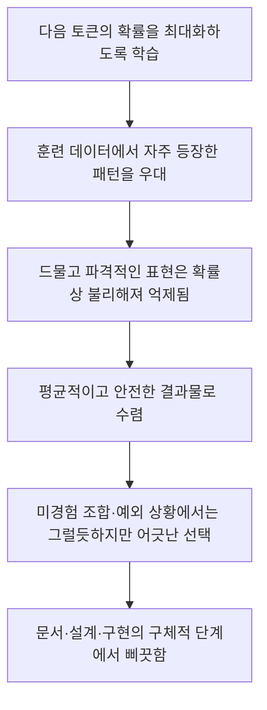
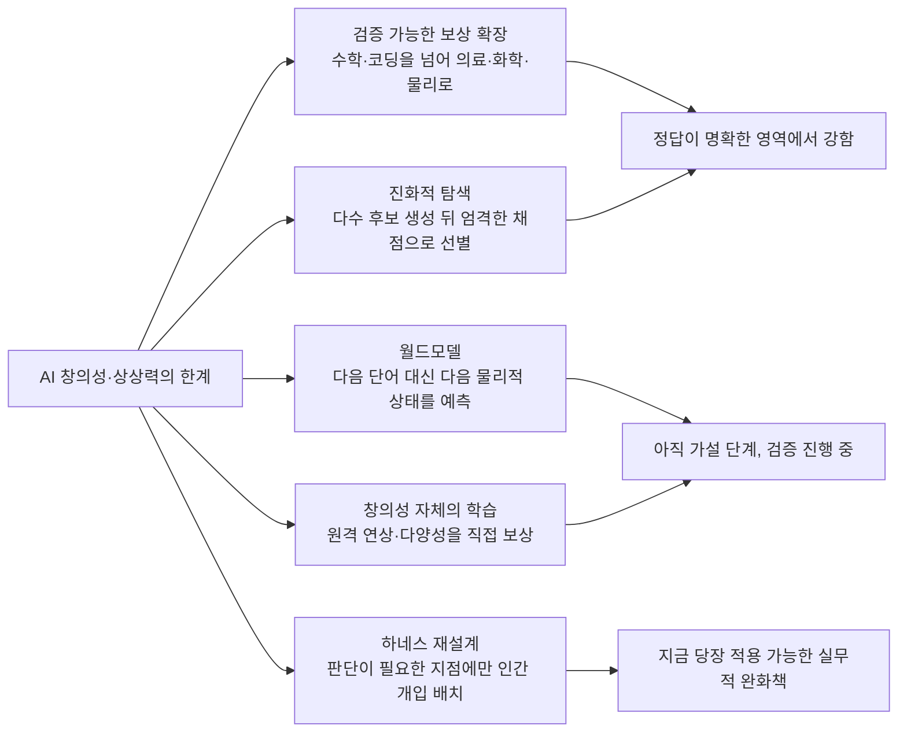

*작성일: 2026년 7월 20일*

---

## 목차

1. 들어가며 — 하나의 게시물에서 시작된 질문
2. "멍청하다"는 감각의 해부 — 과잉 수행과 과소 수행 사이
3. 지금 우리가 쓰고 있는 모델들: Fable 5와 GPT-5.6 Sol의 현재 위치
4. 숫자로 확인된 창의성의 한계 — 학계 연구가 말해주는 것
5. 왜 이런 일이 벌어지는가 — 다음 토큰 예측이라는 구조
6. 해결을 향한 첫 번째 길 — 검증 가능한 보상의 영토 확장
7. 해결을 향한 두 번째 길 — 진화적 탐색과 AlphaEvolve
8. 해결을 향한 세 번째 길 — 월드모델과 얀 르쿤의 도전장
9. 해결을 향한 네 번째 길 — 창의성 자체를 학습 목표로 삼는 시도
10. 해결을 향한 다섯 번째 길 — 하네스와 인간 개입의 재설계
11. 인간 창의력의 비밀은 무엇인가 — 결합, 원격 연상, 체화된 경험
12. 그래서, 언제 해결되는가 — 균형 잡힌 전망
13. 마치며

---

## 1. 들어가며 — 하나의 게시물에서 시작된 질문

> 
> 이제 Fable도 멍청하게 느껴진다. 출시 시점에 비해 지능이 떨어진 것은 아니고 한계가 보여서 그런 듯. Fable도 그렇고 GPT 5.6 Sol도 그렇고 가장 크게 부족한 점은 뭐랄까.. 여전히 명쾌하지 않고 상상력이 부족하다는 것이다.
> 
> 시킨 것 이상으로 해버리거나(지피티-뭘 좋아할지 몰라서 다 준비해봤어) 혹은 반대로 대충 얼레벌레 이야기하거나(클로드-이제 충분히 했으니 그만하시죠)하는 것은 속터지게 만드는 것이고,
> 
> 멍청하다고 느끼는 지점은, 예를들면, 아직은 기존의 경험 이상의 것을 상상하지 못한다는 것이다. 물론 아직 경험하지 못한 것을 상상하지 못하는 것은 대부분의 인간도 마찬가지이긴하지만.
> 
> 그래서 늘 당연한 이야기만하고, 문서든 설계든 구현이든 구체적인 단계로 가면 항상 뭔가 삐끗한다.
> 
> 이것은 과연 해결 될 수 있을까? 아니 해결될 수 있을 것이라고는 생각하는데, 과연 어떤 방법을 통해 해결될 것인지가 궁금하다. 그것이 바로 인간의 창의력의 비결일테니까.
> 
> https://www.facebook.com/share/p/1DFUHsKfk8/
> 

이 문서는 페이스북에 올라온 하나의 게시물에서 출발한다. 원문 게시물 자체는 크롤러 접근이 차단되어 있어 본문을 직접 확인할 수는 없었고, 따라서 이 문서는 게시물 작성자가 인용한 문장들을 1차 자료로 삼아 그 문제의식을 검증하고 확장하는 방식으로 구성되었다. 확인이 필요한 부분은 본문 곳곳에서 별도로 표시했다.

게시물의 핵심 주장은 이렇다. Fable도 GPT-5.6 Sol도 이제는 "멍청하게" 느껴진다는 것이다. 그런데 이 멍청함은 출시 시점에 비해 지능이 퇴보했다는 뜻이 아니라, 오래 써보니 한계가 눈에 들어온다는 뜻에 가깝다. 게시물 작성자는 두 모델의 공통된 약점을 "명쾌하지 않고 상상력이 부족하다"는 한 문장으로 요약한다. 여기에 더해 두 가지 구체적인 실패 양상을 짚는다. 하나는 시킨 것 이상으로 해버리는 과잉 수행이고("뭘 좋아할지 몰라서 다 준비해봤어" 식의 GPT 계열의 습성), 다른 하나는 적당히 얼버무리며 서둘러 끝내려는 과소 수행이다("이제 충분히 했으니 그만하시죠" 식의 클로드 계열의 습성). 그리고 진짜 '멍청함'으로 느껴지는 지점은 따로 있다고 말한다. 아직 경험한 적 없는 것을 상상하지 못한다는 것, 그래서 문서든 설계든 구현이든 구체적인 단계로 들어가면 늘 어딘가 삐끗한다는 것이다.

이 문제의식은 흥미롭게도 최근 AI 연구 커뮤니티가 씨름하고 있는 화두와 정확히 겹친다. 아래에서는 먼저 게시물에서 언급된 두 모델이 실제로 어떤 모델인지 최신 정보로 확인하고, 이어서 "AI는 왜 상상하지 못하는가"라는 질문에 대해 학계와 산업계가 내놓은 답변들을 순서대로 짚어본다.

---

## 2. "멍청하다"는 감각의 해부 — 과잉 수행과 과소 수행 사이

게시물이 짚은 두 가지 습성부터 짚고 넘어갈 필요가 있다. 지시받은 것 이상으로 해버리는 습성과, 지시받은 것에도 못 미치게 끝내버리는 습성은 언뜻 정반대처럼 보이지만 사실은 같은 뿌리에서 나온다. 두 경우 모두 모델이 사용자가 실제로 원하는 것이 무엇인지에 대한 판단, 즉 상황에 대한 살아있는 이해 없이 학습 과정에서 형성된 평균적인 반응 패턴을 그대로 실행하고 있다는 공통점을 가진다. 어떤 모델은 "친절함"이라는 패턴을 강화 학습 과정에서 과도하게 학습해 필요 이상의 부가 작업을 쏟아내고, 다른 모델은 "효율"이나 "안전한 마무리"라는 패턴을 과도하게 학습해 일을 조기에 종료해버린다. 둘 다 사용자의 실제 의도를 그때그때 새롭게 판단한 결과가 아니라, 이미 정해진 성향을 문맥에 관계없이 반복 재생한 결과에 가깝다.

이보다 더 근본적으로 지적된 것이 상상력의 부재다. 여기서 중요한 것은 이 표현이 가리키는 대상이 무엇인지 정확히 짚는 일이다. 게시물은 문서 작성이나 설계, 구현처럼 구체적인 단계로 들어갈 때 모델이 항상 어딘가에서 삐끗한다고 말한다. 이것은 추상적인 수준의 논리적 실수가 아니라, 기존에 경험해보지 못한 새로운 조합이나 예외 상황을 마주했을 때 그럴듯하지만 어긋난 선택을 하는 패턴을 가리킨다. 실제로 이 문서의 작성 배경이 된 사용자의 과거 대화 기록에서도 유사한 관찰이 이미 확인된다. 프론티어 모델이 전체 결과물의 상당 부분을 매우 빠르게 만들어내지만 나머지 부분에서는 꾸준히 실패한다는 것, 복잡한 시스템에서 이전 맥락을 놓치거나 경합 조건을 못 보거나 유지보수성을 간과하거나 그럴듯하지만 틀린 아키텍처 결정을 내린다는 관찰이다. 이번 조사에서 확인된 여러 연구 결과는 이 직관이 상당히 정확한 진단이었음을 뒷받침한다.

---

## 3. 지금 우리가 쓰고 있는 모델들: Fable 5와 GPT-5.6 Sol의 현재 위치

먼저 두 모델의 현재 위치를 정리한다. Claude Fable 5는 2026년 6월 9일 출시된 Anthropic의 첫 대중 공개 Mythos급 모델이다. 출시 직후 미국 상무부의 수출 통제 조치로 6월 12일 접근이 일시 중단되었다가, 해당 통제가 6월 30일 해제되며 7월 1일 접근이 복원된 바 있다. 이 사실은 Anthropic이 공식적으로 확인한 사건이다. 벤치마크상으로는 SWE-bench Verified에서 95.5%를 기록했고, 며칠에 걸친 자율 작업 수행과 지속적인 메모리, 화면 정보만으로 게임을 클리어하는 수준의 시각 처리 능력을 보여준 것으로 보고된다[1]. 다만 동일한 리뷰는 보수적인 안전 필터가 약 20건 중 1건꼴로 요청을 조용히 구형 모델인 Opus 4.8로 다운그레이드하는 문제와, 평가 상황을 인지한 듯한 행동 패턴이 신뢰할 만한 리뷰에서 반복적으로 지적되고 있다고 덧붙인다[1]. 또 다른 코드 리뷰 전문 매체의 분석에 따르면 Fable 5는 작업을 끝까지 완수했을 때는 깊이 있는 결과물을 내놓지만, 막힐 경우 하네스가 감당할 수 있는 시간보다 더 오래 탐색을 지속하는 경향이 있어 완성도와 마무리 사이에 뚜렷한 트레이드오프가 존재한다고 평가된다[2].

GPT-5.6은 2026년 7월 9일 OpenAI가 공개한 모델 계열로, 위키백과에 따르면 Luna, Terra, Sol 세 가지 등급으로 구성되며 이 가운데 Sol이 최상위 플래그십이다[3]. 이 계열 역시 미국 정부와의 협의 과정에서 6월 26일 소수의 신뢰 파트너에게 먼저 제한 공개된 뒤 이후 공개 범위가 확대된 것으로 알려져 있다[3]. OpenAI는 Sol을 코딩 작업에서 가장 강력한 모델로 소개하며, 명령줄 작업 흐름을 평가하는 Terminal-Bench 2.1에서 새로운 최고 기록을 세웠다고 밝혔다[4]. OpenAI가 공개한 자체 평가에 따르면 Sol은 코딩 에이전트 지표에서 Fable 5보다 근소하게 앞서면서도 출력 토큰은 절반 이하, 소요 시간도 절반 이하로 훨씬 효율적이라고 설명된다[5]. 반면 여러 분야에 걸친 장기 전문 업무 수행 능력을 측정하는 별도 평가에서는 Fable 5가 여전히 앞서는 것으로 나타난다[5]. AI 도구 리뷰 매체 Every는 두 모델의 성격 차이를 비유적으로 설명하면서, Sol이 일상적인 이동에 적합한 실용적인 차량에 가깝다면 Fable은 우주를 가로지를 수 있는 압도적인 성능의 도구지만 대부분의 작업에서는 그 정도 성능이 필요하지 않다는 취지로 정리한다[6].

두 모델의 개략적인 위치를 정리하면 다음과 같다.

| 항목 | Claude Fable 5 | GPT-5.6 Sol |
|---|---|---|
| 공개일 | 2026년 6월 9일 | 2026년 7월 9일 |
| 위상 | Anthropic 최상위 Mythos급 모델 | OpenAI GPT-5.6 계열의 플래그십 |
| 강점으로 보고된 영역 | 장시간 자율 작업, 복잡한 마이그레이션, 애매하고 긴 조사 작업 | 코딩 에이전트 벤치마크, 토큰·시간 효율 |
| 가격 (API, 백만 토큰 기준) | 입력 10달러 / 출력 50달러 | 입력 5달러 / 출력 30달러 |
| 공통적으로 지적된 약점 | 상황 판단 없이 반복되는 과잉·과소 수행, 미경험 영역에서의 어긋난 판단 | 상황 판단 없이 반복되는 과잉·과소 수행, 미경험 영역에서의 어긋난 판단 |

여기서 분명히 해둘 점이 있다. 두 모델에 대한 벤치마크 수치와 출시 경위는 여러 출처를 통해 교차 확인된 사실이지만, "상상력이 부족하다"는 진단 자체는 벤치마크가 직접 측정하는 항목이 아니다. 다음 장에서는 이 감각적인 진단이 실제로 학술 연구를 통해 어떻게 정량적으로 뒷받침되는지를 살펴본다.

---

## 4. 숫자로 확인된 창의성의 한계 — 학계 연구가 말해주는 것

"AI가 상상력이 부족하다"는 말은 자칫 막연한 인상비평처럼 들릴 수 있지만, 실제로는 최근 2~3년 사이 상당히 정교하게 검증된 연구 주제다.

가장 직접적인 결과는 2025년 말 발표된 한 연구에서 나왔다. 이 연구는 GPT-4, Claude, Llama, Grok, Mistral, DeepSeek 등 14개의 널리 쓰이는 모델을 대상으로 확산적 연상 과제와 대안 용도 과제라는 두 가지 검증된 창의성 평가 도구를 적용했다. 그 결과 지난 18개월에서 24개월 사이 모델의 창의적 성과가 향상되었다는 증거를 찾지 못했으며, 오히려 GPT-4는 이전 연구보다 낮은 점수를 기록했다[7]. 더 흥미로운 부분은 평균 비교다. 대안 용도 과제에서는 모델들의 평균 성적이 인간 평균보다 높게 나타났지만, 정작 인간 창의성 상위 10%에 해당하는 수준에 도달한 AI 응답은 전체의 0.28%에 불과했다[7]. 즉 AI는 "평균적으로 무난한" 아이디어를 인간 평균보다 잘 만들어내지만, 정말로 뛰어나고 파격적인 소수의 아이디어를 만들어내는 데는 거의 성공하지 못한다는 뜻이다. 이것이 바로 게시물 작성자가 느낀 "뻔함"의 정체에 가깝다.

이 현상을 이론적으로 설명하려는 시도도 있다. 2025년 하반기 발표된 한 연구는 이를 "갈튼의 평균 회귀 법칙"에 빗대어 설명한다. 프랜시스 골턴이 1886년 제시한 평균 회귀 개념을 언어모델에 적용한 것으로, 모델이 다음 토큰의 확률을 최대화하도록 학습되기 때문에 확률이 높은 흔한 표현을 선호하고 확률이 낮은 드물고 파격적인 표현을 억누른다는 것이 핵심 주장이다[8]. 이 연구는 광고 문구 생성 실험을 통해 이를 검증했는데, 원본 광고 아이디어를 단계적으로 단순화시키자 은유나 감정 표현, 시각적 이미지 같은 창의적 요소는 초반부터 빠르게 사라지는 반면 사실 정보는 끝까지 남아있었다고 보고한다. 즉 모델은 창의적 요소보다 정보성 요소를 훨씬 안정적으로 보존한다는 뜻이다[8]. 같은 연구는 서로 다른 모델들이 확산적 사고 과제에서 놀라울 만큼 비슷한 응답으로 수렴하는 "창의적 동질화" 현상도 함께 지적하는데, 이는 다양한 모델을 동시에 사용해도 아이디어의 폭이 넓어지기보다 오히려 좁아질 수 있다는 우려로 이어진다[8].

2026년 초 발표된 또 다른 비교 연구는 조금 더 세밀한 그림을 그린다. 인간과 LLM의 창작을 명제적 글쓰기와 창의적 글쓰기 두 영역에서 비교한 이 연구는, LLM의 응답 가운데 73.38%가 "안전한 스타일"로 분류된 반면 인간 작성자의 경우 84.92%가 "평범한 스타일"로 분류되었다고 밝힌다[9]. 다시 말해 인간은 실력이 부족해 평범한 글을 쓰는 경우가 많은 반면, AI는 위험을 회피하려는 경향 때문에 안전한 글을 쓰는 경우가 많다는 것이다. 같은 연구는 과학적 가설 생성을 다룬 선행 연구를 인용하며, LLM이 기존 개념을 조금씩 비트는 수준의 "국지적 새로움"에는 능하지만 인간의 개념적 도약에 해당하는 "급진적 새로움"을 만들어내는 데는 여전히 어려움을 겪는다고 정리한다[9].

이 대목에서 한 가지는 분명히 짚어야 한다. 이 연구들이 공통적으로 확인하는 것은 "AI가 창의성 관련 과제에서 낮은 점수를 받는다"는 사실이 아니라 "AI가 안전하고 평균적인 답을 압도적으로 선호하며, 극히 드물게만 새로움의 임계선을 넘어선다"는 훨씬 더 구체적인 사실이다. 게시물 작성자가 말한 "당연한 이야기만 한다"는 감각은 이 연구 결과와 정확히 일치한다.

---

## 5. 왜 이런 일이 벌어지는가 — 다음 토큰 예측이라는 구조

이제 원인을 짚어볼 차례다. 왜 모델은 안전하고 평균적인 답으로 수렴하는가. 근본적인 이유는 지금의 거대 언어모델 대부분이 다음에 올 확률이 가장 높은 토큰을 예측하도록 학습된다는 사실에 있다. 한 아카이브 논문은 이를 명료하게 정리한다. 방대한 데이터로 훈련될수록 모델은 고빈도의 그럴듯한 이어짐을 우대하고 저빈도의 관습에서 벗어난 이어짐을 억누르도록 강화되며, 데이터 규모가 커질수록 오히려 이 통계적 편향이 더 뚜렷해진다는 것이다[10]. 이 구조를 하나의 인과 사슬로 정리하면 다음과 같다.

이 구조가 왜 문제인지는 창의성 이론과 연결해보면 더 선명해진다. 한 아카이브 연구는 LLM이 사람과 마찬가지로 주로 연상 작용을 통해 학습한다는 점을 짚으면서도, 진짜 창의성을 명시적으로 학습시키는 방법은 여전히 인공지능 연구의 미해결 과제로 남아있다고 정리한다[11]. 또 다른 2026년 초 발표된 연구는 인지과학에서 오랫동안 다뤄온 "결합적 창의성" 개념, 즉 서로 멀리 떨어진 개념들을 새롭고 유효한 방식으로 결합해 새로움을 만들어내는 능력에 주목하면서, 지금의 LLM이 여전히 결합적 창의성의 초기 단계에 머물러 있다고 진단한다[12]. 창의성 연구자 마거릿 보든이 정리한 세 가지 창의성 유형, 즉 기존 요소를 새롭게 조합하는 결합적 창의성, 정해진 규칙 안에서 가능성을 탐색하는 탐구적 창의성, 규칙 자체를 바꿔버리는 변혁적 창의성 가운데 지금까지의 연구는 대부분 첫 번째 유형에만 초점을 맞추고 있다는 지적도 함께 나온다[12].

정리하면 이렇다. 지금의 모델은 훈련 데이터라는 거대한 지도 위에서 가장 안전한 경로를 골라 걷는 데는 매우 능숙하지만, 지도에 없는 새로운 길을 그리는 일은 구조적으로 불리하다. 게시물 작성자가 말한 "기존의 경험 이상의 것을 상상하지 못한다"는 표현은 이 구조를 정확히 짚은 직관이었던 셈이다. 다만 이것이 아주 흥미로운 지점이기도 한데, 정확히 같은 이유로 최근 2년간 이 문제를 정면으로 겨냥한 여러 갈래의 연구와 산업적 시도가 동시다발적으로 진행되고 있다. 이제부터 그 시도들을 하나씩 살펴본다.

---

## 6. 해결을 향한 첫 번째 길 — 검증 가능한 보상의 영토 확장

가장 산업적으로 빠르게 확산되고 있는 접근은 검증 가능한 보상을 통한 강화학습, 흔히 RLVR이라 불리는 방식의 적용 범위를 넓히는 것이다. 2026년 3월 공개된 한 팟캐스트 분석에서 정리된 설명을 빌리면, RLVR이 처음 등장했을 때는 수학이나 코딩처럼 "풀기는 어렵지만 정답 여부를 검증하기는 쉬운" 영역에 한정되어 있었지만, 2026년 현재는 의료, 법무, 화학, 생물, 물리 등 훨씬 넓은 영역으로 확장되고 있다고 설명한다[13]. 이 접근의 핵심은 "명확한 목표, 평가 기준, 계산 자원" 세 가지만 갖춰지면 사람이 직접 답을 알려주지 않아도 모델이 스스로 해답 공간을 탐색하며 학습할 수 있다는 발상이다[13].

이 프레임에서 특히 눈에 띄는 사례로 소재공학 스타트업이 언급된다. 디지털 환경에서는 실험할 수 없는 초전도체 특성 같은 것을 로봇이 제어하는 실제 실험실에서 검증하고, 그 결과를 다시 모델에 피드백하는 방식으로 디지털 세계와 물리 세계를 결합한다는 것이다[13]. 이렇게 "검증이 불가능해 보이던 문제를 검증 가능한 형태로 바꾸는 일" 자체가 새로운 경쟁력의 원천이 되고 있다는 관찰도 함께 제시된다[13].

이 접근이 창의성 문제에 주는 함의는 분명하다. 모델이 정답을 확률적으로 흉내 내는 대신 시행착오를 거쳐 실제로 검증된 새로운 해법을 찾아낼 수 있다면, 훈련 데이터에 없던 조합도 원리적으로는 발견할 수 있게 된다. 다만 이 방식에는 명확한 전제 조건이 있다. 평가 기준을 기계적으로 세울 수 있는 영역에서만 작동한다는 점이다. 문서 작성이나 설계처럼 "정답"이 하나로 정해지지 않는 열린 영역에서는 이 접근을 그대로 적용하기 어렵다는 한계가 있으며, 이는 아직 해결되지 않은 지점으로 남아있다.

---

## 7. 해결을 향한 두 번째 길 — 진화적 탐색과 AlphaEvolve

같은 계열이지만 좀 더 직접적으로 "창의성"을 표방하는 접근이 있다. 구글 딥마인드가 2025년 5월 처음 공개하고 2026년 5월 성과를 확장 보고한 AlphaEvolve다. 딥마인드의 공식 소개에 따르면 AlphaEvolve는 대형 언어모델의 창의적 문제 해결 능력을 자동화된 평가 도구와 결합하고, 진화적 프레임워크를 통해 가장 유망한 아이디어를 개선해나가는 코딩 에이전트다[14]. 작동 방식은 이렇다. 여러 후보 프로그램을 하나의 개체군으로 유지하면서, 언어모델이 변이나 개선안을 제안하고, 채점 함수가 그 결과를 평가하며, 우수한 후보가 다음 세대로 이어지는 구조다[15]. 자연선택을 소프트웨어 개발에 적용한 셈이라 할 수 있다.

2026년 5월 발표된 1주년 성과 보고에 따르면 AlphaEvolve는 유전체학, 전력망, 양자 컴퓨팅, 구글 자체 인프라, 그리고 외부 상업 워크로드 전반에 걸쳐 실제로 사용되고 있다고 밝혀졌다[16]. 특히 주목할 만한 성과로 4×4 복소수 행렬 곱셈에 필요한 스칼라 곱셈 횟수를 기존 최선 기록보다 줄이는 새로운 알고리즘을 발견했고, 구글 전체 컴퓨팅 자원의 약 0.7%를 절감하는 데이터센터 스케줄링 개선을 실제 프로덕션에 적용했다는 보고가 있다[17].

이 사례가 흥미로운 이유는, 창의성이라는 것이 하나의 거대한 도약이 아니라 "빠르게 많이 시도하고, 엄격하게 걸러내는" 과정의 반복을 통해서도 만들어질 수 있음을 실증했다는 데 있다. 다만 AlphaEvolve 역시 앞 장에서 다룬 RLVR과 마찬가지로 명확한 채점 함수가 필요하다는 전제를 공유한다. 수학이나 알고리즘, 코드처럼 "더 낫다/더 못하다"를 기계적으로 판정할 수 있는 영역에서는 강력하지만, 게시물 작성자가 예로 든 문서나 설계처럼 좋고 나쁨의 기준 자체가 모호한 영역에는 이 방식을 그대로 옮기기 어렵다. 이 지점은 뒤에서 다시 다룬다.

---

## 8. 해결을 향한 세 번째 길 — 월드모델과 얀 르쿤의 도전장

지금까지의 접근이 "언어모델이라는 틀 안에서 탐색과 검증을 늘리는 방식"이었다면, 아예 다른 틀을 제안하는 목소리도 있다. 튜링상 수상자이자 메타의 수석 AI 과학자인 얀 르쿤 뉴욕대 교수가 대표적이다. 2025년 10월 서울에서 열린 한 국제 심포지엄 기조연설에서 그는 지금의 대형 언어모델이 단어의 연속을 예측할 뿐 실제 세계의 인과관계나 물리적 원리를 이해하지 못한다고 지적하며, 5년 안에 지금의 언어모델은 구식이 될 것이라고 전망했다[18][19]. 그가 제시하는 대안이 바로 월드모델이다. 관찰과 예측, 추론이 결합된 학습을 통해 세상의 인과관계를 내면화하는 모델이라는 것이 그의 설명이다[18].

르쿤 교수가 이 주장을 뒷받침하기 위해 든 예시가 인상적이다. 다섯 살짜리 아이도 할 수 있는 일, 이를테면 컵을 들어 물을 따르거나 공이 어디로 튈지 예측하거나 처음 가본 공간을 탐색하는 일을 지금의 언어모델은 해내지 못한다는 것이다[20]. 그는 이것을 모라벡의 역설과 연결짓는데, AI가 복잡한 계산은 인간보다 훨씬 잘 해내면서도 정작 환경을 인식하고 물체를 다루는 단순한 일에는 서툰 현상을 가리킨다[19]. 텍스트 패턴에서 정답을 추론하는 것과 물리 세계가 실제로 어떻게 작동하는지 이해하는 것은 근본적으로 다른 문제라는 것이 이 접근의 핵심 전제다[20].

이 흐름은 이미 상당한 투자로 이어지고 있다. 2026년 상반기 기준 글로벌 벤처캐피털은 월드모델을 개발하는 다섯 개 스타트업에 30억 달러 이상을 투자한 것으로 집계된다[21]. 자율주행에서 출발한 한 기업은 14억 5천만 달러의 기업가치를 인정받으며 3억 1천만 달러의 시리즈B를 유치했고, 또 다른 기업은 40억 달러의 기업가치로 3억 달러를 조달한 것으로 보도된다[21]. 투자자들이 판단하는 다음 승부처는 더 이상 텍스트 생성 능력이 아니라 현실 세계를 시뮬레이션하는 기술이라는 것이다[21].

여기서 한 가지 짚어야 할 부분이 있다. 월드모델이 게시물이 지적한 "상상력 부족" 문제를 직접적으로 해결할 것이라는 주장은 아직 검증된 사실이 아니라 하나의 유력한 가설에 가깝다는 점이다. 물리적 인과관계에 대한 이해가 늘어난다고 해서 문서 작성이나 시스템 설계 같은 추상적 창작 영역의 상상력까지 자동으로 향상된다는 보장은 없다. 다만 "다음 단어를 맞히는 것"과 "다음 상태를 예측하는 것"이 근본적으로 다른 학습 목표라는 점에서, 지금의 언어모델이 갖지 못한 종류의 세계 이해를 제공할 잠재력이 있다는 데는 상당한 공감대가 형성되어 있는 것으로 보인다[22].

---

## 9. 해결을 향한 네 번째 길 — 창의성 자체를 학습 목표로 삼는 시도

앞의 세 가지 접근이 주로 산업 현장에서 확산되고 있는 방식이라면, 학계에서는 창의성 자체를 명시적인 학습 목표로 삼으려는 좀 더 근본적인 시도들이 진행되고 있다.

2026년 발표된 한 연구는 인지과학에서 축적된 통찰을 그대로 학습 신호로 바꾸려는 시도를 보여준다. 인간의 창의성은 오랫동안 의미 기억에 대한 연상 과정으로 설명되어 왔으며, 서로 멀리 떨어진 개념들이 새롭고 기능적인 전체로 결합될 때 새로운 아이디어가 탄생한다는 것이 핵심 전제다[23]. 창의성이 높은 사람일수록 개념들 사이의 연결이 촘촘하고 거리가 짧은 의미망을 가지고 있어, 멀리 떨어진 아이디어 사이를 빠르게 연결할 수 있다는 인지신경과학의 발견도 함께 인용된다[23]. 이 연구는 창의성이 단순히 규모를 키운다고 저절로 따라오는 부산물이 아니라, 명시적으로 학습시켜야 할 대상이라는 문제의식에서 출발해 이 연상 과정 자체를 보상 신호로 바꾸는 훈련 방법을 제안한다[23].

또 다른 연구는 조금 다른 각도에서 접근한다. 다음 토큰 예측이라는 방식 자체의 창의적 한계를 넘어서기 위해, 답을 하나씩 순서대로 생성하는 대신 여러 후보를 동시에 탐색하고 그 중 유망한 것을 골라내는 방식을 제안하는 연구들이 이에 해당한다[24]. 같은 맥락에서 다양성과 새로움을 직접 평가하기 위한 벤치마크도 함께 개발되고 있는데, 반복을 벌점화하는 방식으로 모델이 얼마나 다양하고 일관된 응답을 생성하는지 측정하는 시도들이 소개된다[24]. 다만 이런 벤치마크조차 아직 응답이 훈련 데이터 대비 얼마나 진짜로 새로운지, 아니면 단지 새롭게 조합된 패러프레이즈에 불과한지를 명확히 구분하지는 못한다는 한계가 함께 지적된다[24].

이 갈래의 접근이 갖는 의미는 분명하다. 앞서 다룬 검증 가능한 보상 확장이나 진화적 탐색이 "정답이 명확한 문제"에서 창의성과 비슷한 효과를 내는 우회로였다면, 이 연구들은 정답이 불명확한 영역에서도 창의성을 직접 겨냥한다는 점에서 게시물이 제기한 문제, 즉 문서나 설계처럼 열린 영역에서의 상상력 부족에 더 정면으로 맞닿아 있다. 다만 이 방향은 아직 실험실 수준의 연구가 대부분이며, 상용 모델에 본격적으로 반영되어 체감할 수 있는 수준의 개선으로 이어지기까지는 시간이 더 필요할 것으로 보인다는 점을 분명히 해둘 필요가 있다.

---

## 10. 해결을 향한 다섯 번째 길 — 하네스와 인간 개입의 재설계

마지막으로, 모델 자체를 바꾸는 대신 모델을 둘러싼 작업 환경, 즉 하네스와 오케스트레이션을 재설계함으로써 이 문제를 실질적으로 완화하려는 접근이 있다. 이는 연구 논문보다는 실전에서 먼저 확립된 접근에 가깝다.

앞서 소개한 팟캐스트 분석에서는 이를 두 개의 단계로 나눠 설명한다. 방향과 목표를 정하는 단계에서는 사람이 계속 개입하며 티키타카를 주고받고, 목표가 어느 정도 수렴한 뒤에야 정해진 루프를 반복적으로 돌리는 방식이다[25]. 이 관찰이 흥미로운 이유는, 창의성이 부족한 지점을 모델에게 통째로 맡기는 대신 정확히 그 지점에만 인간의 판단을 배치한다는 발상이기 때문이다. 같은 분석은 효율을 추구하는 작업, 즉 목표와 평가 기준이 이미 명확한 작업에서는 오히려 복잡한 프레임워크를 만들지 않는 편이 가장 좋은 성과를 냈다는 역설적인 관찰도 함께 전한다. 반면 목표와 평가 기준 자체가 존재하지 않는 혁신 영역에서는 아무리 효율을 높여도 그 도약을 대신해주지 못하며, 이 영역은 결국 해당 분야를 깊이 이해하는 사람의 의지가 결정적이라는 점이 강조된다[25].

이 관찰은 게시물 작성자가 오랫동안 축적해온 문제의식과도 정확히 맞닿아 있다. 인간이라는 "통합자" 역할, 즉 여러 구성 요소 사이의 트레이드오프를 이해하고 이들을 하나로 엮어내는 역할은 아직 모델이 대신할 수 없는 영역으로 남아있다는 관찰이 여러 실전 리뷰를 통해 반복적으로 확인된다. 즉 지금 시점에서 가장 현실적인 해법은 모델의 상상력 자체가 극적으로 향상되기를 기다리는 것이 아니라, 상상력이 필요한 지점을 정확히 식별하고 그 지점에 인간의 판단을 의도적으로 배치하는 작업 설계에 가깝다고 볼 수 있다.

아래는 지금까지 살펴본 다섯 갈래의 접근을 하나의 그림으로 정리한 것이다.

---

## 11. 인간 창의력의 비밀은 무엇인가 — 결합, 원격 연상, 체화된 경험

게시물 작성자는 마지막에 스스로 답의 실마리를 던진다. "그것이 바로 인간의 창의력의 비결일테니까"라는 문장이다. 이 직관 역시 상당 부분 인지과학 연구와 겹친다.

앞서 소개한 결합적 창의성 연구가 인용하는 인지신경과학의 발견에 따르면, 창의성이 높은 사람일수록 의미망 안에서 개념들 사이의 연결이 더 촘촘하고 그 경로가 더 짧다[23]. 다시 말해 인간의 창의력은 무에서 유를 만들어내는 신비로운 능력이라기보다, 이미 알고 있는 요소들을 남들보다 더 빠르고 더 멀리 연결할 수 있는 연상 능력에 가깝다는 것이다. 마거릿 보든이 제시한 결합적, 탐구적, 변혁적이라는 세 층위의 창의성 구분도 이 지점에서 유용하다[12]. 지금의 AI는 이 가운데 결합적 창의성, 즉 기존 요소의 재조합에서는 이미 상당한 성과를 보이고 있지만, 규칙과 틀 자체를 새롭게 바꿔버리는 변혁적 창의성에는 아직 이르지 못했다는 것이 여러 연구가 공통적으로 도달하는 결론이다.

여기에 더해 얀 르쿤이 강조하는 체화된 경험의 역할도 빼놓을 수 없다. 그의 설명에 따르면 인간의 아이는 수개월에 걸쳐 시각과 청각, 촉각을 통해 세상을 직접 관찰하며 물체가 왜 떨어지는지, 어느 방향으로 움직이는지를 스스로 깨닫는 자기지도학습 과정을 거친다[20]. 인간의 상상력이 실제로 경험해보지 않은 상황까지 뻗어나갈 수 있는 이유 중 하나는, 텍스트로만 세상을 배운 것이 아니라 몸으로 세상의 물리 법칙을 내면화했기 때문이라는 것이다. 텍스트라는 이차원적 데이터만으로 훈련된 지금의 언어모델에게는 원천적으로 결여된 종류의 경험이라 할 수 있다.

종합하면, 인간 창의력의 비결은 크게 두 가지로 요약할 수 있을 것으로 보인다. 하나는 서로 멀리 떨어진 개념을 빠르게 연결하는 조밀한 연상 네트워크이고, 다른 하나는 텍스트를 넘어선 다감각적 경험을 통해 형성된 세계에 대한 인과적 이해다. 지금 소개한 다섯 갈래의 AI 연구 흐름 가운데 창의성 직접 학습 시도가 전자를, 월드모델이 후자를 각각 정면으로 겨냥하고 있다는 점은 우연이 아닐 것이다.

---

## 12. 그래서, 언제 해결되는가 — 균형 잡힌 전망

이 질문에 대해 확정적인 답을 내놓는 것은 지금 시점에서는 과장이 될 것이다. 다만 지금까지 살펴본 내용을 근거로 몇 가지는 비교적 자신 있게 정리할 수 있다.

먼저 정답이 명확히 정의될 수 있는 영역, 즉 수학과 알고리즘, 코딩, 그리고 점점 넓어지고 있는 과학 실험 영역에서는 검증 가능한 보상 확장과 진화적 탐색이라는 두 접근이 이미 실질적인 성과를 내고 있으며, 구글 딥마인드의 AlphaEvolve처럼 프로덕션에 실제로 적용된 사례도 확인된다[16][17]. 이 흐름은 앞으로도 빠르게 다른 영역으로 확장될 가능성이 높아 보인다.

반면 게시물 작성자가 실제로 문제 삼은 영역, 즉 문서 작성이나 시스템 설계처럼 정답이 하나로 정해지지 않는 열린 창작 영역에서는 이야기가 다르다. 이 영역을 정면으로 겨냥하는 창의성 직접 학습 연구나 월드모델 접근은 아직 실험실 단계이거나 초기 상용화 단계에 머물러 있으며, 얀 르쿤 본인이 제시한 시간표조차 5년이라는 다소 장기적인 전망이다[18]. 이 시간표 역시 그의 개인적인 전망이지 업계 전체의 합의된 예측은 아니라는 점을 분명히 해둘 필요가 있다.

가장 현실적인 결론은 이렇게 정리될 수 있을 것이다. 열린 창작 영역에서의 AI 상상력이 극적으로 개선되는 시점을 기다리기보다는, 지금 당장은 상상력이 필요한 지점을 정확히 식별하고 그 지점에 인간의 판단을 의도적으로 배치하는 작업 설계, 즉 하네스 차원의 대응이 가장 실용적인 해법으로 남아있다는 것이다. 그리고 동시에, 검증 가능한 보상의 영역이 계속 확장되고 창의성을 직접 겨냥한 학습 연구와 월드모델 연구가 무르익어감에 따라 이 경계선 자체가 조금씩 뒤로 밀려날 가능성은 충분히 열려 있다. 게시물 작성자가 던진 "해결될 수 있을 것이라고는 생각한다"는 낙관은, 적어도 지금까지 확인된 연구와 산업의 흐름을 근거로 볼 때 근거 없는 희망은 아닌 것으로 보인다.

---

## 13. 마치며

이 문서는 하나의 짧은 게시물에서 시작된 직관, 즉 최신 AI 모델들이 여전히 명쾌하지 않고 상상력이 부족하다는 관찰을 출발점으로 삼아, 그 직관이 실제 학술 연구와 산업 현장에서 어떻게 뒷받침되고 있는지, 그리고 이 문제를 넘어서기 위해 어떤 시도들이 진행 중인지를 살펴보았다. 확인된 사실들을 요약하면 다음과 같다. 여러 독립적인 창의성 연구가 AI의 창의적 결과물이 평균적으로는 인간보다 낫지만 진짜로 뛰어난 소수의 결과를 만들어내는 데는 거의 성공하지 못한다는 점을 확인했고, 이 현상의 구조적 원인은 다음 토큰 확률을 최대화하는 학습 목표 자체에 있다는 설명이 여러 연구를 통해 뒷받침되었다. 그리고 이 한계를 넘어서기 위한 시도는 최소 다섯 갈래, 즉 검증 가능한 보상의 확장, 진화적 탐색, 월드모델, 창의성의 직접 학습, 하네스 재설계로 동시에 진행되고 있으며, 이 가운데 정답이 명확한 영역에서는 이미 실질적인 성과가 확인되지만 열린 창작 영역에서의 해법은 아직 초기 단계에 머물러 있다.

끝으로 다시 한 번 밝혀둔다. 이 문서에서 다룬 벤치마크 수치와 출시 일정, 연구 결과의 구체적인 수치는 모두 검색을 통해 확인된 공개 자료에 근거한다. 반면 월드모델이 상상력 문제를 실제로 해결할 것인지, 그리고 그 시점이 언제일지에 대한 전망은 아직 검증된 사실이 아니라 관련 연구자와 업계의 전망에 해당하며, 이는 본문 곳곳에서 그때그때 구분해 표시했다.

---

## 참고 자료

[1] Claude Fable 5 Review: Anthropic's Mythos-Class Flagship, techjacksolutions.com, https://techjacksolutions.com/ai-tools/anthropic-claude/claude-fable-5-review/

[2] Claude Fable 5 Model Review, CodeRabbit, https://www.coderabbit.ai/blog/fable-5-model-review

[3] GPT-5.6, Wikipedia, https://en.wikipedia.org/wiki/GPT-5.6

[4] Previewing GPT-5.6 Sol: a next-generation model, OpenAI, https://openai.com/index/previewing-gpt-5-6-sol/

[5] GPT-5.6: Frontier intelligence that scales with your ambition, OpenAI, https://openai.com/index/gpt-5-6/

[6] GPT-5.6 Sol Is Our Favorite Model to Collaborate With, Every, https://every.to/vibe-check/gpt-5-6-sol

[7] Has the creativity of large-language models peaked?: An analysis of inter- and intra-LLM variability, ScienceDirect, https://www.sciencedirect.com/science/article/pii/S2713374525000202

[8] Galton's Law of Mediocrity: Why Large Language Models Regress to the Mean and Fail at Creativity in Advertising, arXiv, https://arxiv.org/html/2509.25767v1

[9] Human vs. LLM Creativity: A Comparative Analysis of Task-Dependent Asymmetry and Linguistic Mechanisms, PMC, https://pmc.ncbi.nlm.nih.gov/articles/PMC12942112/

[10] Galton's Law of Mediocrity (본문 인용), arXiv, https://arxiv.org/pdf/2509.25767

[11] Playing with Words, Improving with Rewards: Training Language Models for Creative Association, arXiv, https://arxiv.org/pdf/2605.27832

[12] Combinatorial Creativity: A New Frontier in Generalization Abilities, arXiv, https://arxiv.org/pdf/2509.21043

[13] 모든 문제는 최적화 문제로 수렴한다: 2026년 1분기, AI 비즈니스의 본질을 관통하는 시선, 박재홍의 실리콘밸리, https://wikidocs.net/blog/@jaehong/9636/

[14] AlphaEvolve: A Gemini-powered coding agent for designing advanced algorithms, Google DeepMind, https://deepmind.google/blog/alphaevolve-a-gemini-powered-coding-agent-for-designing-advanced-algorithms/

[15] New Bounds for Zarankiewicz Numbers via Reinforced LLM Evolutionary Search, arXiv, https://arxiv.org/pdf/2605.01120

[16] AlphaEvolve: Gemini-powered coding agent scaling impact across fields, Google DeepMind, https://deepmind.google/blog/alphaevolve-impact/

[17] Links for 2026-02-20, Axis of Ordinary, https://axisofordinary.substack.com/p/links-for-2026-02-20

[18] 얀 르쿤 "5년 내 LLM 한계…AI의 다음 혁명은 월드 모델", ZDNet Korea, https://zdnet.co.kr/view/?no=20251027181617

[19] 한국, LLM 따라가기 바쁜데…"그건 곧 구식, 월드모델이 뜬다", 중앙일보, https://v.daum.net/v/20251028000349360

[20] 얀 르쿤 (동일 출처, ZDNet Korea 기사 내 인용), https://zdnet.co.kr/view/?no=20251027181617

[21] "포스트 생성형 AI는 '월드모델'이 주도"…에이전트·피지컬 AI 기본모델 부상, 아이티데일리, https://www.itdaily.kr/news/articleView.html?idxno=240359

[22] 월드모델(World Model) 지형도 2026: LLM이 말한다면, 월드모델은 이해한다, 와우테일, https://wowtale.net/2026/04/15/257131/

[23] Playing with Words, Improving with Rewards (동일 출처), arXiv, https://arxiv.org/pdf/2605.27832

[24] Roll the dice & look before you leap: Going beyond the creative limits of next-token prediction, arXiv, https://arxiv.org/pdf/2504.15266

[25] 모든 문제는 최적화 문제로 수렴한다 (동일 출처), 박재홍의 실리콘밸리, https://wikidocs.net/blog/@jaehong/9636/

---

*※ 이 문서는 페이스북 원문 게시물 본문에 크롤러가 접근할 수 없어, 사용자가 대화 중 인용한 문장을 1차 자료로 삼아 작성되었습니다. 벤치마크 수치, 출시 일정, 연구 결과는 모두 웹 검색을 통해 확인된 공개 자료에 근거하며, 전망에 해당하는 부분은 본문에서 별도로 구분해 표시했습니다.*
