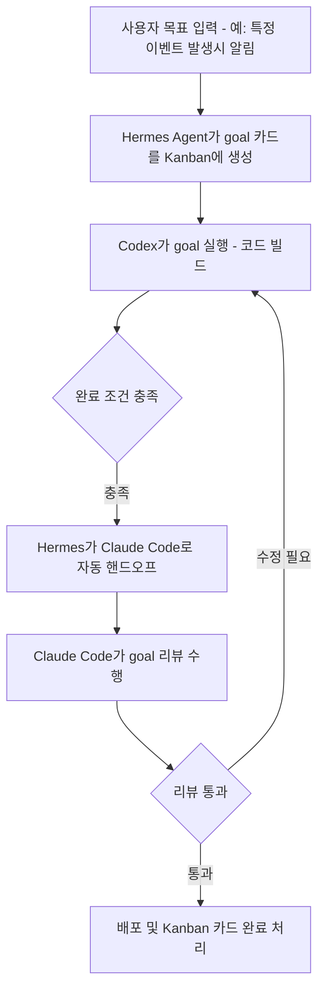
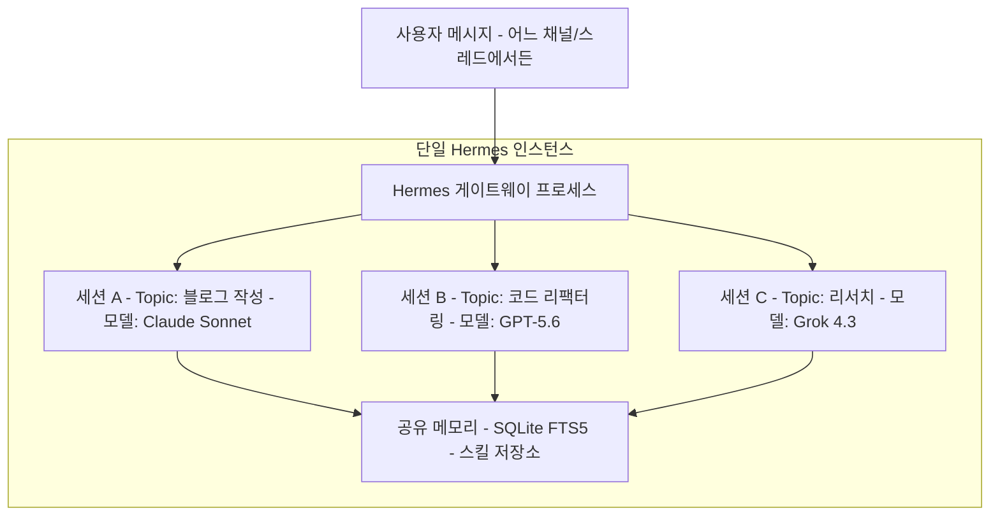

## 목차

1. 들어가며 — 두 게시물의 핵심 주장
2. 관점 1: "각자 잘하는 곳에 맡긴다" — 멀티 에이전트 병행 운용
3. 관점 2: "허브 하나로 다 된다" — Hermes 내부 세션·모델 라우팅
4. 두 철학의 구조적 비교
5. 어느 쪽이 맞는 선택인가 — 실무 판단 기준
6. 확인된 사실과 확인되지 않은 부분 구분
7. 참고 자료

---

## 1. 들어가며 — 두 게시물의 핵심 주장

공유해주신 두 개의 Threads 게시물은 같은 주제에 대해 서로 다른, 그러나 상호 보완적인 입장을 보여줍니다.

**첫 번째 게시물([@bitcoin_aii]( https://www.threads.com/@bitcoin_aii/post/Da_uUI8ExQW))** 의 요지는 이렇습니다. 지금 AI 에이전트를 정말 잘 다루는 사람들의 공통점은 Claude Code, Codex, Hermes 같은 도구를 하나만 파고드는 게 아니라 **동시에 여러 개를 켜두고**, 작업 성격에 따라 그때그때 가장 적합한 도구에 즉시 넘긴다는 것입니다. 한 도구에만 의존하면 결국 그 도구의 한계에 부딪히기 때문에, 여러 도구를 설치해두고 상황에 맞게 골라 쓰는 판단력 자체가 실력이라는 주장입니다.

**두 번째 게시물([@dayum_gud]( https://www.threads.com/@dayum_gud/post/Da_wXG_jxyJ))** 은 이에 대한 반론에 가깝습니다. 요지는, 여러 도구를 오갈 필요 없이 **Hermes Agent 하나 안에서** 스레드(thread) 모드를 켜고 주제(topic)별로 서로 다른 LLM을 지정해두면 사실상 같은 효과를 낼 수 있다는 것입니다. 즉 "여러 창을 띄우고 사람이 라우팅하는 방식" 대신 "하나의 허브 프로세스 안에서 세션별로 모델만 갈아 끼우는 방식"으로도 충분하다는 입장입니다.

두 게시물 모두 2026년 상반기 이후 AI 코딩 에이전트 생태계에서 실제로 벌어지고 있는 트렌드를 반영하고 있으며, 아래에서는 각 입장의 기술적 근거를 구체적으로 짚어보겠습니다.

---

## 2. 관점 1: "각자 잘하는 곳에 맡긴다" — 멀티 에이전트 병행 운용

### 2-1. 왜 세 도구를 동시에 쓰는가

Claude Code, Codex, Hermes Agent는 태생부터 설계 철학이 다릅니다.

- **Claude Code**는 Anthropic 모델에 최적화된 CLI 코딩 에이전트로, 단일 메인 루프와 명확한 제어 흐름을 특징으로 합니다. 세션을 열어야 동작하는 구조이며, 기존에 축적된 자동화·스킬 자산이 있는 사용자에게 유리합니다.
- **Codex**는 OpenAI 계열 모델을 중심으로 한 코딩 에이전트로, 코드 수정과 토큰 효율성 면에서 강점이 있다는 평가가 실사용 후기에서 반복적으로 나타납니다.
- **Hermes Agent**는 Nous Research가 만든 오픈소스 자기개선형 에이전트로, 특정 벤더에 고정되지 않고 20종 이상의 LLM 프로바이더와 연동되며, Telegram·Discord·Slack 등 메신저 게이트웨이로 상시 대기하는 것이 핵심 차별점입니다. Claude Code나 Codex는 "세션을 열어야 움직이는" 구조인 반면, Hermes는 크론 스케줄링과 상시 수신 구조를 갖춰 24시간 운영, 장기 기억, 반복 업무의 절차 자동 습득(스킬 생성) 같은 영역을 담당합니다.

이 세 도구를 병행 운용하는 실제 사례는 확인 가능합니다. LinkedIn에 공유된 한 사례에서는 다음과 같은 흐름이 소개되었습니다. Codex에 `/goal` 기능이 먼저 도입되어 이를 Hermes Agent에 연결한 뒤, 목표를 문자로 보내면 Hermes가 이를 칸반 보드의 카드로 등록하고 Codex가 실행을 맡습니다. 이후 Claude Code에도 동일한 `/goal` 기능이 나오자, Hermes의 `/goal` 로직을 수정해 Codex와 Claude Code를 "같은 루프 안에서 교체 가능한 워커"로 취급하도록 만들었습니다. 결과적으로 Codex가 빌드를 마치면 Hermes가 자동으로 Claude Code에 리뷰를 넘기고, Claude Code가 수정을 요청하면 다시 Codex로 돌아가는 순환 구조가 만들어졌습니다.

이와 별개로 국내 실사용 후기(gpters.org)에서도 유사한 패턴이 확인됩니다. 한 사용자는 Claude, Codex, Hermes를 동시에 쓰다가 각 도구에 흩어진 스킬·에이전트·파이프라인 설정 버전이 서로 어긋나는 문제를 겪었고, 이를 해결하기 위해 세 도구가 공통으로 참조하는 "공용 런타임 소스 폴더"를 만들어 Hermes는 자동화 운영(텔레그램, 크론) 전담, Codex와 Claude는 직접 호출 및 개발 보조로 역할을 나눴다고 밝혔습니다. 다만 이 방식은 초기 설정 정리에 시간이 오래 걸리고, 공용 소스에 오류가 생기면 세 도구가 동시에 영향을 받으며, symlink와 보안 정책을 맞추는 과정에서 크론·자동화 시스템이 이를 "외부 경로 실행"으로 오인할 수 있다는 단점도 함께 보고되었습니다.

### 2-2. `/goal` 기능이 병행 운용을 가능하게 만든 배경

이 병행 전략이 최근 특히 힘을 받게 된 기술적 배경 중 하나는 `/goal` 명령의 등장입니다. Anthropic은 2026년 5월 12일 Claude Code 2.1.139 버전에서 `/goal` 명령을 도입했는데, 이는 완료 조건을 지정하면 별도의 경량 검증 모델이 매 이터레이션마다 조건 충족 여부를 판단하면서 에이전트가 사람 개입 없이 여러 턴에 걸쳐 자율적으로 작업을 이어가는 기능입니다. Reddit에 보고된 한 사례에서는 9시간짜리 자율 `/goal` 세션이 45개의 커밋을 만들고 416만 건의 데이터를 처리했다고 합니다(이는 개인 사용자의 자체 보고 사례로, 공식 벤치마크가 아니라는 점은 감안해야 합니다). OpenAI의 Codex CLI 역시 실험적 기능으로 `/goal`을 먼저 선보였고, 이후 Anthropic이 뒤따라 출시한 순서로 알려져 있습니다. 두 도구가 같은 개념(자율 목표 실행)을 각자 구현하면서, Hermes 같은 오케스트레이션 레이어가 이 둘을 "동일한 인터페이스를 가진 교체 가능 워커"로 묶어 자동 라우팅하는 것이 기술적으로 자연스러워진 셈입니다.

또한 Claude Code 자체도 완전히 폐쇄적이지는 않습니다. Claude Code Router 같은 커뮤니티 프로젝트는 OpenRouter를 경유해 Claude Code 안에서 Anthropic, OpenAI, Kimi 등 다양한 모델을 상황별로 섞어 쓸 수 있게 해주는데, 예를 들어 plan 모드는 특정 추론 모델로, 백그라운드 작업은 경량 모델로, 웹서치는 또 다른 모델로 지정하는 식의 세분화된 라우팅도 가능합니다. 즉 "도구를 여러 개 켜서 병행한다"는 전략 안에도 이미 부분적인 멀티모델 라우팅이 섞여 들어가 있는 것이 현재 생태계의 실제 모습입니다.

### 2-3. 이 방식의 장단점

이 병행 운용 방식의 장점은 각 도구의 최전선 기능을 가장 빠르게 받아볼 수 있다는 점입니다. Claude Code에서만 되는 기능, Codex에서만 되는 기능, Hermes에서만 되는 상시 운영 기능을 모두 온전히 활용할 수 있습니다. 반면 단점은 앞서 국내 사례에서 드러났듯 설정과 컨텍스트가 도구별로 분산되어 유지보수 부담이 커진다는 점, 그리고 도구 사이를 오가는 과정 자체가 사람의 판단(라우팅)에 의존한다는 점입니다.

---

## 3. 관점 2: "허브 하나로 다 된다" — Hermes 내부 세션·모델 라우팅

### 3-1. Hermes Agent의 구조적 특징

두 번째 게시물의 주장을 이해하려면 Hermes Agent의 세션 구조를 먼저 짚어야 합니다. Hermes는 2026년 2월경 오픈소스로 공개된 이후 빠르게 성장해, GitHub 스타 수가 공개 후 약 10주 만에 10만 개를 돌파했고, 이후에도 성장세가 이어져 최근 집계로는 20만 개를 넘어섰습니다(성장 속도가 매우 빨라 시점마다 보고되는 수치가 다르므로 특정 시점의 스냅샷으로 이해하는 것이 정확합니다 — 2026년 5월 초 약 10만, 6월 초 약 18.8만~19.2만, 최근 시점 기준 21.5만 이상으로 각 매체에서 보고됨).

Hermes의 핵심은 **하나의 게이트웨이 프로세스가 여러 메시징 플랫폼(Telegram, Discord, Slack, WhatsApp, Signal, Email 등)과 CLI/TUI를 동시에 서비스**하면서, 각 대화방·스레드·사용자별로 독립된 세션을 관리한다는 점입니다. 공식 설정 문서에 따르면 메신저에서 스레드는 부모 채널과 격리되며, 옵션을 켜면 스레드 참여자마다 별도의 세션까지 만들어집니다.

### 3-2. "topic마다 LLM 설정"의 실제 근거

첫째, **세션 단위 모델 오버라이드**입니다. 새 세션(새 스레드, 새 채널, 새 CLI 실행)은 `config.yaml`의 기본 모델을 따르지만, 세션 안에서 `/model <이름>` 명령으로 그 세션만 즉시 다른 모델로 전환할 수 있고, 이 전환은 기존 세션에는 영향을 주지 않습니다. 공식 FAQ 문서는 이 방식이 위임 작업(subagent)에도 적용되어, 메인 대화는 GPT 계열을 유지한 채 "이 작업만 Gemini로 위임해줘"처럼 작업 단위로 모델을 바꿀 수 있다고 설명합니다.

둘째, **API 서버 단의 클라이언트별 라우팅**입니다. Hermes를 API 서버로 띄우면, 클라이언트가 요청 시 지정한 모델 문자열에 따라 서로 다른 백엔드 모델로 자동 분기시키는 설정이 가능합니다. 이는 "토픽마다 다른 모델"을 요청 단위로 매핑하는 구조에 가깝습니다.

셋째, **Kanban/작업 단위 모델 오버라이드**입니다. 2026년 6월 이후 릴리스(v0.18.0 등)에서는 Hermes의 Kanban 기능이 멀티 에이전트 플랫폼으로 확장되어, 오케스트레이터 자동 분해, 스웜 토폴로지, 작업별(worktree-per-task) 격리와 함께 "작업별 모델 오버라이드(per-task model overrides)"가 정식 기능으로 추가되었습니다. 즉 하나의 목표를 여러 하위 작업으로 쪼갤 때, 하위 작업마다 다른 모델을 지정하는 것이 Hermes 내부에서 표준 기능으로 지원됩니다.

다만 정확성을 위해 짚어야 할 부분이 있습니다. Hermes GitHub 저장소의 이슈 트래커(#29914, 2026년 5월 21일 등록)를 보면, 개발팀 스스로도 현재의 모델 오버라이드 경로가 `/model`(세션 단위), 대시보드/글로벌 설정, `image_generate` 등 기능별 개별 처리로 나뉘어 있어 "하나의 통일된 런타임 오버라이드 체계"가 아직 완성되지 않았다고 인정하고 있습니다. 즉 "토픽별 모델 설정"은 실제로 가능하지만, 사용자가 기대하는 만큼 매끄러운 단일 인터페이스라기보다는 세션/작업/API 라우팅이라는 서로 다른 세 갈래의 메커니즘이 조합되어 만들어내는 결과에 가깝습니다. 이 점은 게시물의 주장이 "완전히 통합된 원클릭 기능"이라기보다 "여러 오버라이드 메커니즘을 조합하면 사실상 같은 효과를 낼 수 있다"는 의미로 이해하는 것이 정확합니다.

### 3-3. 이 방식의 장단점

허브형 접근의 장점은 메모리와 스킬이 하나의 저장소로 통합된다는 점입니다. Hermes는 SQLite FTS5 기반으로 과거 대화를 검색하고, 복잡한 작업을 완료하면 절차를 스킬로 자동 저장해 다음번에 재사용하는 폐루프(closed loop) 학습 구조를 갖고 있는데, 도구를 여러 개로 쪼개면 이 학습 효과가 도구별로 단절됩니다. 허브 하나로 모으면 어떤 모델을 썼든 경험이 한곳에 축적됩니다. 반면 단점은 위에서 확인했듯 아직 오버라이드 체계가 완전히 통일되어 있지 않아 세션·작업·API 세 가지 설정 방식을 사용자가 직접 파악하고 있어야 한다는 점, 그리고 Hermes라는 단일 프로세스에 장애가 생기면 모든 토픽이 동시에 영향을 받는다는 점입니다.

---

## 4. 두 철학의 구조적 비교

| 구분 | 관점 1: 멀티 에이전트 병행 | 관점 2: Hermes 허브 통합 |
|---|---|---|
| 라우팅 주체 | 사람이 상황 판단 후 도구 선택 (또는 Hermes `/goal`이 도구 간 핸드오프) | Hermes 내부에서 세션/작업/API 단위로 모델만 교체 |
| 운영 단위 | Claude Code, Codex, Hermes가 각각 독립 프로세스 | Hermes 단일 프로세스, 모델만 다수 |
| 메모리·스킬 축적 | 도구별로 분산되기 쉬움 (실사용자는 공용 폴더로 별도 통합 시도) | 단일 SQLite/스킬 저장소로 자동 통합 |
| 상시 운영(24시간) | Hermes가 이 역할을 전담(다른 두 도구는 세션 기반) | Hermes가 처음부터 담당 |
| 강점 활용 | 각 벤더 전용 기능(Claude Code 고유 기능, Codex 고유 기능)을 최전선으로 활용 | 모델 교체가 설정 수준이라 관리 포인트가 적음 |
| 알려진 약점 | 설정 분산, 공용 소스 오류 시 전체 영향, symlink/보안 정책 충돌 사례 보고됨 | 모델 오버라이드 체계가 세션/작업/API로 파편화되어 아직 통일 인터페이스가 아님(GitHub 이슈로 공식 확인) |
| 단일 장애점 | 상대적으로 분산(한 도구가 죽어도 나머지는 동작) | Hermes 게이트웨이 자체가 단일 장애점 |

---

## 5. 어느 쪽이 맞는 선택인가 — 실무 판단 기준

두 관점은 사실 배타적이지 않습니다. 실제로 위에서 인용한 LinkedIn 사례와 gpters.org 사례 모두, 완전히 하나만 선택하지 않고 **Hermes를 오케스트레이션/상시운영 허브로 두고, 그 안에서 Codex와 Claude Code를 워커로 호출**하는 절충 구조를 취하고 있습니다. 이는 관점 1(여러 도구 병행)과 관점 2(허브 중심)의 중간 지점으로, 다음과 같은 기준으로 정리할 수 있습니다.

- **벤더 고유 기능이 꼭 필요한 작업**(예: Claude Code의 특정 서브에이전트 구조, Codex CLI 고유의 툴 조합)이라면 해당 CLI를 직접 여는 것이 맞습니다. Hermes 안에서 모델만 바꾼다고 해서 그 CLI 고유의 하네스(harness)까지 재현되는 것은 아니기 때문입니다.
- **상시 대기, 메신저 연동, 장기 기억이 필요한 작업**(고객 응대, 크론 기반 모니터링, 몇 달 전 맥락을 기억해야 하는 작업)이라면 애초에 세션 기반으로 설계된 Claude Code나 Codex보다 Hermes가 구조적으로 더 적합합니다.
- **비용/모델 성능을 작업 성격별로 세분화하고 싶다면** Hermes의 세션별·작업별 모델 오버라이드가 도구를 여러 개 켜두는 것보다 관리 포인트가 적습니다.

결국 "여러 도구를 설치해두고 상황 보고 고르는 것이 실력"이라는 첫 게시물의 주장과 "허브 하나로도 충분하다"는 두 번째 게시물의 주장은, 실무에서는 "Hermes를 상시 허브로 깔아두되, 그 허브가 필요할 때 Claude Code/Codex 같은 벤더별 CLI를 도구로 호출하는" 형태로 수렴하고 있는 것이 현재까지 확인되는 실제 사용 패턴에 가깝습니다.

---

## 6. 확인된 사실과 확인되지 않은 부분 구분

문서의 신뢰도를 위해 명확히 구분합니다.

**검색으로 확인된 사실**
- Claude Code `/goal` 명령: 2026년 5월 12일, 버전 2.1.139에서 도입
- Codex `/goal` 기능이 Claude Code보다 먼저 출시되었고, 이후 Hermes가 두 도구를 동일 인터페이스로 취급하도록 개조한 실제 사례가 LinkedIn에 공개됨
- Hermes의 세션별 `/model` 전환, API 서버의 클라이언트별 모델 라우팅, Kanban의 작업별 모델 오버라이드 기능은 공식 문서 및 릴리스 노트로 확인됨
- Hermes 모델 오버라이드 체계가 아직 완전히 통일되지 않았다는 점은 Hermes 개발팀이 직접 등록한 GitHub 이슈로 확인됨
- Hermes GitHub 스타 수는 시점별로 크게 변동(5월 초 약 10만 → 6월 중순 약 19만대 → 최근 21만대 이상 보고)

**확인되지 않았거나 개인 후기 수준인 내용**
- Reddit에 보고된 "9시간 자율 세션, 45개 커밋" 사례는 개별 사용자의 자체 보고이며 공식 벤치마크가 아님
- gpters.org의 "공용 런타임 폴더" 통합 사례는 특정 개인의 운영 경험담으로, 일반화된 베스트 프랙티스로 공식 검증된 것은 아님
- 원본 Threads 게시물 두 건 자체는 자동 접근이 차단되어 있어(로봇 배제 정책) 본문 전체가 아닌 검색 스니펫 및 관련 인용을 통해 취지를 재구성했습니다. 게시물 원문의 정확한 문장이 아니라 취지를 문단으로 풀어쓴 것이라는 점을 밝힙니다.

---

## 7. 참고 자료

- Shubham Saboo, LinkedIn 게시물 (Codex/Claude Code/Hermes `/goal` 연동 워크플로우): https://www.linkedin.com/posts/shubhamsaboo_this-is-wild-codex-builds-claude-code-reviews-activity-7460153734082338816-gNBx
- gpters.org, "Claude, Codex, Hermes를 같이 쓰다가 세팅이 꼬여서, 모두 한군데서 총괄하는 삼 체+'본 체'를 만들었다": https://www.gpters.org/nocode/post/using-claude-codex-hermes-cDxO3YAn17kiuO6
- gpters.org, "Claude Code에서 Hermes Agent로 하루 루틴 스킬 옮기기": https://www.gpters.org/nocode/post/transferring-daily-routine-skills-3VhTYiyU6JRVUIb
- explainx.ai, "Claude Code 2.1.139 adds /goal command": https://explainx.ai/blog/claude-code-goal-command-long-running-agents-2026
- The Tool Nerd, "Claude Code Commands Every Developer Should Know in 2026": https://www.thetoolnerd.com/p/claude-code-commands-developer-2026
- Hermes Agent 공식 문서 — Configuring Models: https://hermes-agent.nousresearch.com/docs/user-guide/configuring-models
- Hermes Agent 공식 문서 — Configuration (스레드/세션 격리): https://hermes-agent.nousresearch.com/docs/user-guide/configuration/
- Hermes Agent 공식 문서 — FAQ & Troubleshooting: https://hermes-agent.nousresearch.com/docs/reference/faq
- NousResearch/hermes-agent, GitHub 이슈 #29914 (모델 오버라이드 체계 통합 제안): https://github.com/NousResearch/hermes-agent/issues/29914
- NousResearch/hermes-agent, cli-config.yaml.example (API 서버 클라이언트별 라우팅): https://github.com/NousResearch/hermes-agent/blob/main/cli-config.yaml.example
- NousResearch/hermes-agent, Releases (v0.18.0 등, Kanban 작업별 모델 오버라이드): https://github.com/NousResearch/hermes-agent/releases
- 0xNyk/awesome-hermes-agent, GitHub (스타 수 최신 스냅샷): https://github.com/0xNyk/awesome-hermes-agent
- Dealroom.co, "Hermes Agent hits ~99K GitHub stars in 8 weeks": https://app.dealroom.co/news/note/hermes-agent-hits-99k-github-stars-in-8-weeks-fastest-growing-open-source-agent-framework-of-2026
- The Agent Report, "The Hermes Agent Ecosystem in 2026: 22 Releases, 188K Stars": https://the-agent-report.com/2026/06/hermes-agent-ecosystem-2026-pillar/
- PyTorchKR, "자기 개선형 AI 에이전트인 Hermes Agent의 실무자 가이드": https://discuss.pytorch.kr/t/ai-hermes-agent-feat-blake-crosley/10335
- 원본 Threads 게시물(자동 접근 차단, 검색 스니펫 기반):
  - https://www.threads.com/@bitcoin_aii/post/Da_uUI8ExQW
  - https://www.threads.com/@dayum_gud/post/Da_wXG_jxyJ

---

작성일자: 2026-07-20
