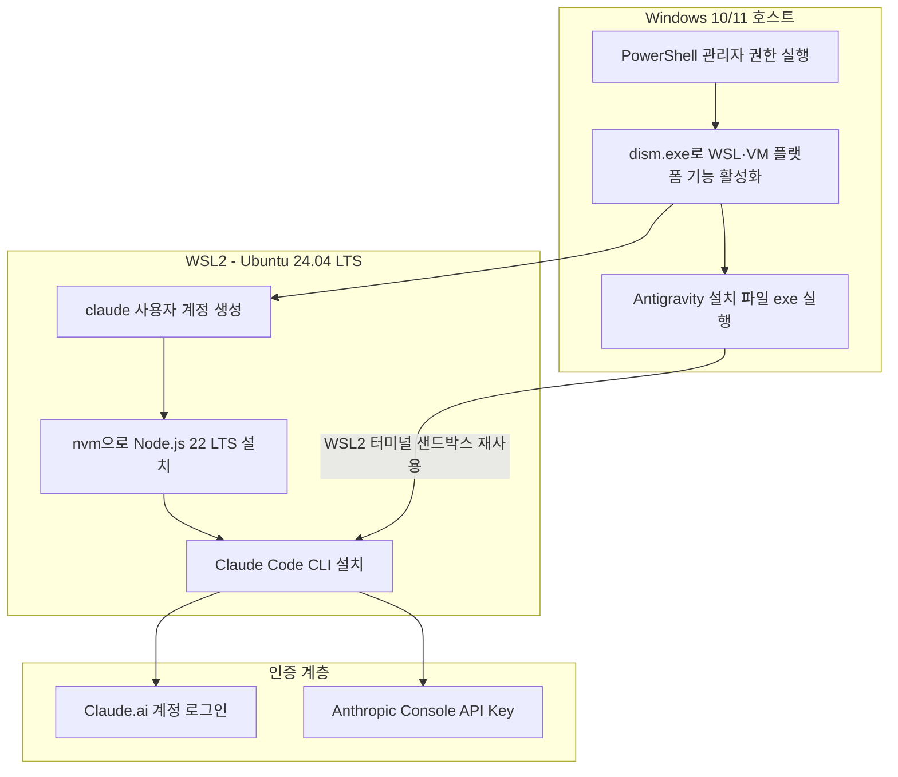
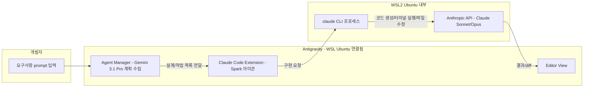
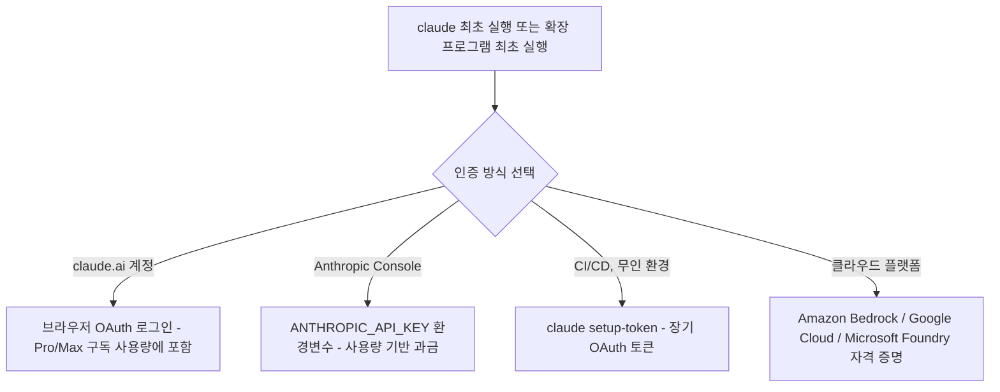
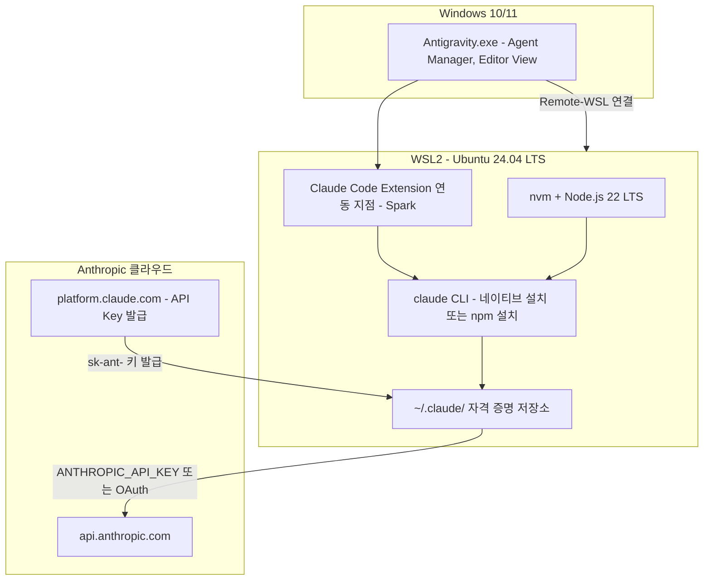

작성 목적: 첨부된 강의 자료(WSL2·Claude Code 설치 실습 페이지)의 내용을 기준으로, 여기에 (1) Google Antigravity와 Claude Code를 WSL 기반으로 연동하는 절차와 (2) API Key 기반 Claude Code 인증 절차를 최신 공식 문서 및 취재 자료로 검증·보강하여 정리한 문서입니다. 강의 자료에 나온 npm 기반 설치 방식은 여전히 동작하지만, 2026년 7월 기준 Anthropic 공식 문서(code.claude.com)는 Node.js가 필요 없는 네이티브 설치 스크립트를 1순위로 권장하고 있습니다. 이 차이를 포함해 어디까지가 확인된 사실이고 어디부터가 강의 자료 시점의 방식인지 구분해서 서술했습니다.

---

## 목차

1. 문서 개요와 전체 구조
2. Part 1 — WSL2 기반으로 Windows에 Claude Code 설치하기
3. Part 2 — Google Antigravity와 Claude Code 연동(WSL 기반, 확장 프로그램 설치)
4. Part 3 — API Key 기반 Claude Code 인증 구성
5. 전체 아키텍처 요약
6. 자주 발생하는 문제와 대응
7. 참고자료 및 작성일자

---

## 1. 문서 개요와 전체 구조

이 문서는 세 개의 축으로 구성되어 있습니다. 첫째는 Windows 머신 위에 WSL2(Windows Subsystem for Linux 2)를 올리고, 그 위에 Claude Code CLI를 설치하는 과정입니다. 강의 자료의 그림 1-3부터 1-7까지가 정확히 이 과정을 보여주고 있으며, dism.exe로 Windows 기능을 켜는 단계부터 Ubuntu 배포판 설치, nvm을 통한 Node.js 설치, 마지막으로 `npm install -g @anthropic-ai/claude-code`로 Claude Code를 설치하는 흐름입니다. 둘째는 Google이 2025년 11월에 공개한 에이전트 우선(agent-first) IDE인 Antigravity를 Windows에 설치하고, 그 안에서 Claude Code를 확장 프로그램(extension) 형태로 연동하는 과정입니다. 이때도 Antigravity는 내부적으로 WSL2 터미널 샌드박스를 사용하기 때문에, Part 1에서 구성한 WSL2 환경이 그대로 재사용됩니다. 셋째는 Claude Code에 로그인할 때 Claude.ai 계정(Pro/Max 구독) 대신 Anthropic Console에서 발급한 API Key로 인증하는 방법입니다. 이 방식은 회사 업무나 자동화 파이프라인에서 개인 계정을 쓰지 않고 사용량 기반 과금(pay-as-you-go)으로 운영하고 싶을 때 흔히 선택하는 경로입니다.

세 파트는 서로 독립적이지 않습니다. WSL2라는 하나의 기반 위에 Claude Code CLI가 설치되고, 그 위에 Antigravity라는 IDE 껍데기가 씌워지며, 인증은 어느 경로로 Claude Code를 켜든 공통으로 거쳐야 하는 관문입니다. 아래 그림은 이 세 층의 관계를 정리한 것입니다.



---

## 2. Part 1 — WSL2 기반으로 Windows에 Claude Code 설치하기

### 2.1 왜 WSL2인가

Claude Code는 원래 macOS와 Linux를 우선 대상으로 설계된 터미널 기반 에이전트이기 때문에, 파일 시스템 권한 처리, 셸 스크립트 실행, 백그라운드 프로세스 관리 같은 부분이 Linux 환경에서 가장 안정적으로 동작합니다. Windows에서도 네이티브로 직접 실행할 수는 있지만, WSL2를 쓰면 Linux 툴체인(git, bash, 각종 CLI)을 그대로 쓸 수 있고, 무엇보다 Claude Code의 샌드박스 실행 기능(허가 없이 실행해도 되는 명령을 격리된 환경에서 돌리는 기능)이 WSL2 위에서만 지원됩니다. 공식 문서 기준으로 Native Windows 설치는 이 샌드박스 기능을 지원하지 않고, WSL2 설치만 지원합니다. 따라서 파일 접근 권한을 세밀하게 통제하고 싶거나, Antigravity처럼 에이전트가 터미널 명령을 자동 실행하는 도구와 함께 쓸 계획이라면 WSL2 경로가 사실상 표준 선택지입니다.

### 2.2 사전 준비 — Windows 기능 활성화

강의 자료 그림 1-1, 1-2에 나온 절차가 정확히 이 단계입니다. PowerShell을 **관리자 권한**으로 실행한 뒤(시작 메뉴에서 Windows PowerShell 우클릭 → "관리자 권한으로 실행"), 아래 두 기능을 켭니다.

```powershell
dism.exe /online /enable-feature /featurename:Microsoft-Windows-Subsystem-Linux /all /norestart
dism.exe /online /enable-feature /featurename:VirtualMachinePlatform /all /norestart
```

첫 번째 명령은 WSL 자체를 켜는 것이고, 두 번째 명령은 WSL2가 내부적으로 사용하는 경량 가상 머신 플랫폼을 켜는 것입니다. 강의 자료에 있던 것처럼 두 기능 모두 이미지 버전 10.0.26100.x 계열 이미지를 사용합니다. 두 명령을 실행한 뒤에는 반드시 재부팅해야 합니다.

```powershell
Restart-Computer
```

재부팅 후에도 CPU 가상화 기능(BIOS/UEFI의 Intel VT-x 또는 AMD-V)이 꺼져 있으면 WSL2가 동작하지 않습니다. 대부분의 최신 PC는 기본적으로 켜져 있지만, 회사 지급 PC나 오래된 BIOS 설정을 쓰는 경우 수동으로 켜야 할 수 있습니다.

요즘 Windows 10(버전 2004 이상)이나 Windows 11에서는 위 두 단계를 생략하고 관리자 PowerShell에서 `wsl --install` 한 줄만 실행해도 필요한 기능이 자동으로 켜지고 재부팅까지 안내해 줍니다. 강의 자료가 dism.exe를 따로 다루는 이유는 기업 이미지처럼 WSL 기능이 그룹 정책으로 잠겨 있거나, `wsl --install`이 실패하는 구형 환경까지 대비하기 위한 것으로 보입니다.

### 2.3 WSL2 업데이트와 기본 버전 설정

재부팅 후에는 WSL 자체 런타임을 최신 상태로 갱신하고, 새로 설치할 배포판이 WSL2로 뜨도록 기본 버전을 지정합니다.

```powershell
wsl --update
wsl --set-default-version 2
```

`wsl --update`는 Linux 커널과 WSL 플랫폼(사용자 모드 구성 요소)을 갱신합니다. 강의 자료에는 커널 버전과 WSL 사용자 모드 구성 요소 버전이 각각 10.0.26100.1150, 10.0.26100.4770 계열로 나와 있는데, 이는 Microsoft Store를 통해 배포되는 WSL 패키지의 특정 시점 버전이므로 실습 시점에 따라 숫자는 달라질 수 있습니다. 버전 숫자 자체보다는 "wsl --update가 정상적으로 완료되고 오류가 없는지"가 확인해야 할 핵심입니다.

### 2.4 배포판 목록 확인과 Ubuntu 24.04 설치

설치 가능한 배포판 목록은 다음 명령으로 확인합니다.

```powershell
wsl --list --online
```

강의 자료 그림 1-3에 나온 것처럼 이 목록에는 Ubuntu, Ubuntu-24.04, Debian, AlmaLinux, SUSE, Fedora, Kali Linux, Arch Linux 등 다양한 배포판이 나열됩니다. Claude Code 실습 및 Antigravity 연동을 기준으로는 **Ubuntu-24.04 LTS**를 권장합니다. LTS(Long Term Support) 배포판이라 패키지 호환성이 가장 안정적이고, Antigravity·Claude Code 관련 커뮤니티 문서 대부분이 Ubuntu 기준으로 작성되어 있기 때문입니다.

```powershell
wsl --install Ubuntu-24.04
```

설치가 끝나면 자동으로 Ubuntu 셸이 열리면서 Linux 쪽 사용자 계정을 만들라는 안내가 나옵니다. 강의 자료에서는 사용자 이름을 `claude`로, 비밀번호도 `claude`로 설정하는 예시를 보여주고 있는데, 이는 어디까지나 학습용 예시 값입니다. 이 비밀번호는 WSL 안에서 `sudo` 명령을 쓸 때마다 요구되므로, 실습이 끝나면 자기만 아는 값으로 바꾸는 것이 안전합니다.

```
Provisioning the new WSL instance Ubuntu-24.04
Create a default Unix user account: claude
New password: ********
Retype new password: ********
passwd: password updated successfully
```

설치가 끝난 뒤 현재 설치된 배포판과 기본 배포판을 확인·전환하려면 다음을 사용합니다.

```powershell
wsl --list --online          # 설치 가능한 배포판
wsl -l -v                    # 설치된 배포판과 WSL 버전(1/2) 확인
wsl --set-default Ubuntu-24.04
```

### 2.5 WSL2 안에서 Node.js 설치 — nvm 경로

Claude Code를 npm으로 설치하는 방식(다음 절)을 쓰려면 WSL2 Ubuntu 안에 Node.js가 있어야 합니다. 강의 자료는 nvm(Node Version Manager)을 통한 설치를 보여주고 있으며, 이는 여전히 널리 쓰이는 안정적인 방법입니다. WSL2 터미널에서 아래 스크립트를 실행합니다.

```bash
curl -o- https://raw.githubusercontent.com/nvm-sh/nvm/v0.40.3/install.sh | bash
```

이 스크립트는 `~/.nvm` 디렉터리에 nvm을 내려받아 설치하고, `~/.bashrc`에 nvm을 자동으로 불러오는 구문을 추가합니다. 설치가 끝나면 터미널을 닫았다 다시 열거나 `source ~/.bashrc`를 실행해 nvm 명령을 쓸 수 있게 합니다. 그 다음 Node.js 22 LTS를 설치합니다.

```bash
nvm install 22
node -v   # v22.18.0 계열이 출력되면 정상
npm -v    # 10.9.3 계열이 출력되면 정상
```

강의 자료에 나온 출력값(v22.18.0, npm 10.9.3)은 실습 시점의 Node.js 22 LTS 패치 버전이며, Node.js 22 라인 안에서는 시점에 따라 패치 버전 숫자가 조금씩 바뀔 수 있습니다. 핵심은 **메이저 버전이 22 이상**이라는 점입니다. Anthropic 공식 문서 기준으로, 2026년 7월 현재 Claude Code npm 패키지(v2.1.198 이후)는 Node.js 22 이상을 요구합니다. 그보다 오래된 Node.js를 쓰면 설치 중 `EBADENGINE` 경고가 뜨지만 설치 자체는 대체로 끝까지 진행되며, `claude` 실행 파일은 Node.js 런타임이 아니라 별도로 내려받는 네이티브 바이너리를 사용하기 때문에 실행에는 문제가 없는 경우가 많습니다. 다만 경고 없이 깔끔하게 설치하려면 Node.js 22 이상을 맞추는 편이 좋습니다.

### 2.6 Claude Code 설치 — 두 가지 방법 비교

여기서부터가 강의 자료와 2026년 7월 현재 공식 권장 방식이 갈리는 지점입니다. 아래 표로 정리했습니다.

| 구분 | npm 설치 (강의 자료 방식) | 네이티브 설치 스크립트 (현재 1순위 권장) |
|---|---|---|
| 사전 조건 | Node.js 22+ 필요 | 불필요 (자체 바이너리 다운로드) |
| 설치 명령(WSL/Linux) | `npm install -g @anthropic-ai/claude-code` | `curl -fsSL https://claude.ai/install.sh \| bash` |
| 자동 업데이트 | 수동으로 `npm install -g @anthropic-ai/claude-code@latest` | 백그라운드에서 자동 업데이트 |
| Anthropic 공식 위치 | "고급 설치 옵션"으로 여전히 지원 | "Native Install (Recommended)"로 최상단 안내 |
| 권장 대상 | 이미 Node.js/nvm 생태계를 쓰는 팀, 기존 npm 기반 파이프라인 | 신규 설치자 전반 |

강의 자료 그림 1-6, 1-7이 보여주는 흐름은 왼쪽 열입니다.

```bash
npm install -g @anthropic-ai/claude-code
claude -v          # 예: 1.0.83 (Claude Code)
```

이 방식은 지금도 정상적으로 동작하며, Anthropic 문서에도 "npm으로 설치"라는 절이 별도로 남아 있습니다. 다만 2026년 7월 시점 공식 문서(code.claude.com/docs/en/setup)는 Node.js 설치 없이 바로 실행 파일을 받는 네이티브 설치 스크립트를 첫 번째 탭으로 안내하고 있고, 이 방식이 백그라운드 자동 업데이트까지 지원하기 때문에 신규로 구성한다면 오른쪽 방식을 권합니다.

```bash
# macOS / Linux / WSL 공통
curl -fsSL https://claude.ai/install.sh | bash
```

두 방법 중 어느 쪽을 쓰든 설치가 끝나면 버전 확인은 동일합니다.

```bash
claude --version
```

정상 설치라면 `2.1.211 (Claude Code)`처럼 "숫자.숫자.숫자 (Claude Code)" 형태의 문자열이 출력됩니다(정확한 패치 버전은 계속 올라가므로 숫자 자체보다 형식이 맞는지가 중요합니다). 강의 자료의 `1.0.83`은 그 강의가 촬영된 시점의 버전이며, Claude Code는 릴리스 주기가 매우 빨라 지금은 2.x대로 넘어와 있습니다. 설치 상태를 더 자세히 점검하고 싶다면 다음 명령이 유용합니다.

```bash
claude doctor
```

이 명령은 세션을 시작하지 않고 설치 상태, 설정 파일 유효성, 경고 사항만 읽기 전용으로 보여줍니다.

### 2.7 참고 — Windows 네이티브 설치라는 대안

WSL2 없이 Windows PowerShell이나 CMD에서 곧바로 Claude Code를 설치하는 것도 가능합니다.

```powershell
# PowerShell
irm https://claude.ai/install.ps1 | iex
```

```cmd
:: CMD
curl -fsSL https://claude.ai/install.cmd -o install.cmd && install.cmd && del install.cmd
```

이 경로는 별도의 Linux 환경 없이 바로 시작할 수 있다는 장점이 있지만, 앞서 언급한 샌드박스 실행 기능을 지원하지 않고, Bash 도구를 쓰려면 Git for Windows를 추가로 설치해야 합니다(설치하지 않으면 PowerShell 도구로 대체 동작). Antigravity와 함께 쓰거나, Linux 기반 개발 도구 체인을 그대로 쓰고 싶다면 이 문서가 다루는 WSL2 경로가 더 적합합니다.

---

## 3. Part 2 — Google Antigravity와 Claude Code 연동(WSL 기반, 확장 프로그램 설치)

### 3.1 Antigravity란 무엇인가

Antigravity는 Google이 2025년 11월 18일 Gemini 3와 함께 공개한 "에이전트 우선(agent-first)" 개발 플랫폼입니다. Visual Studio Code를 깊이 포크한 구조 위에 세 개의 화면을 얹은 형태로, 일반적인 코드 자동완성 툴과 달리 계획 수립부터 코드 작성, 웹 탐색, 검증까지 자율적으로 수행하는 에이전트를 관리하는 "미션 컨트롤(Agent Manager)"을 제공합니다. 이 부분은 VS Code에 익숙한 사용자라면 확장 프로그램, 키바인딩, 테마를 그대로 가져와 쓸 수 있을 만큼 익숙한 편집기 화면(Editor View)이고, 여기에 Agent Manager와 브라우저 서브에이전트(Chrome 확장을 통해 에이전트가 실제로 웹페이지를 조작·검증하는 기능)가 추가된 구조입니다. 2026년 2월 19일에는 Gemini 3.1 Pro로 기본 모델이 교체되면서 버전 1.18.3이 배포되었고, 이 시점부터 모델 선택 목록에 Gemini 3.1 Pro, Gemini 3 Flash, Gemini 3 Deep Think와 함께 **Claude Sonnet 4.5, Claude Opus 4.5**, GPT-OSS-120B가 나란히 올라와 있습니다. 즉 Antigravity는 처음부터 Claude 계열 모델을 자체 지원하지만, 이 문서가 다루는 것은 그와 별개로 **Claude Code CLI를 확장 프로그램 형태로 Antigravity 안에 심어서, Claude Code 고유의 터미널·MCP 생태계까지 함께 쓰는 방식**입니다. 실무에서 자주 쓰이는 조합은 계획·설계는 Antigravity의 Gemini가 맡고, 실제 구현과 반복 수정은 Claude Code가 맡는 역할 분담입니다.

### 3.2 Windows에 Antigravity 설치하기 (WSL2 필수)

Antigravity는 Windows 10/11(64비트)의 x64·ARM64 아키텍처를 지원하지만, 공식 안내상 **WSL2가 사실상 필수 전제조건**입니다. 터미널 명령을 격리된 샌드박스 안에서 실행하는 구조가 WSL2에 의존하기 때문입니다. 따라서 Part 1에서 이미 WSL2와 Ubuntu-24.04를 설치했다면 이 조건은 충족된 상태입니다. 아직이라면 관리자 PowerShell에서 아래로 상태부터 확인합니다.

```powershell
wsl --status
```

설치가 안 되어 있다면 `wsl --install`을 실행하고 재부팅합니다. 그다음 절차는 다음과 같습니다.

1. `antigravity.google/download`에서 Windows용 설치 파일(.exe)을 내려받습니다. Windows Defender SmartScreen 경고가 뜨면 게시자가 **"Google LLC"** 로 표시되는지 확인한 뒤 진행합니다.
2. 설치 파일을 실행합니다. 관리자 권한을 요청하며, 기본 설치 경로는 `C:\Program Files\Google\Antigravity`이고 설치는 보통 3~5분 걸립니다.
3. 방화벽이 `*.google.com`, `*.googleapis.com`으로의 아웃바운드 연결 허용을 요청하면 승인합니다.
4. 최초 실행 시 설정 마법사가 뜹니다. VS Code·Cursor·Windsurf 설정 가져오기 여부, 테마, 개발 모드(Agent-Driven / Agent-Assisted / Review-Driven 중 선택, 처음에는 사람이 검토하는 Agent-Assisted 또는 Review-Driven을 권장), 그리고 **개인 Gmail 계정**으로 Google 로그인을 진행합니다. 공개 프리뷰 기간 동안 Google Workspace(회사) 계정은 지원되지 않고 개인 Gmail 계정만 허용됩니다.

### 3.3 Antigravity를 WSL과 연결하기

Antigravity는 기본적으로 터미널 명령을 WSL2 통합을 통해 실행하도록 설계되어 있습니다. 특정 작업 영역(workspace)을 WSL에 명시적으로 연결하려면 `Ctrl+Shift+P`로 명령 팔레트를 연 뒤 "wsl"을 입력하고 **"Remote-WSL: Connect to WSL"** 을 선택합니다. 이 기능은 VS Code의 Remote-WSL 확장과 동등한 기능이 Antigravity에 내장되어 있어서, 별도의 확장 프로그램을 추가로 설치할 필요가 없습니다. 연결이 되면 좌측 하단 상태 표시줄에 `[WSL: Ubuntu]`가 나타나며, 이때 작업 폴더 경로는 Windows 쪽에서 접근하는 `\\wsl.localhost\...` 형태가 아니라 WSL 내부 홈 디렉터리를 기준으로 한 Linux 스타일 경로(`/home/사용자명/...`)로 보여야 정상입니다.

Windows에서 브라우저 서브에이전트(에이전트가 실제로 웹페이지를 열어 결과를 검증하는 기능)를 쓰려면 한 가지 네트워킹 이슈를 짚어야 합니다. WSL2는 가상화된 네트워크 위에서 동작하고 Chrome은 Windows 쪽에서 실행되기 때문에 기본 상태로는 localhost를 통한 통신이 막힙니다. Windows 11이라면 `%USERPROFILE%\.wslconfig` 파일에 다음을 추가하고 WSL을 재시작하면 해결됩니다.

```ini
[wsl2]
networkingMode=mirrored
```

```powershell
wsl --shutdown
```

Windows 10에서는 mirrored networking mode를 지원하지 않으므로 `socat`과 `netsh interface portproxy`를 이용한 포트 포워딩 설정이 필요합니다. 이 부분은 Claude Code 확장 프로그램 동작 자체와는 무관하고, Antigravity의 자체 브라우저 검증 기능에만 영향을 주는 부분이라는 점을 참고하시기 바랍니다.

### 3.4 필요한 확장 프로그램 설치 — Claude Code Extension

Antigravity는 VS Code 포크이기 때문에 VS Code 확장 마켓플레이스 호환 확장 프로그램을 그대로 설치할 수 있습니다. Claude Code를 Antigravity 안에서 쓰기 위한 절차는 다음과 같습니다.

1. Antigravity를 열고 `Ctrl+Shift+X`(또는 `Cmd+Shift+X`)로 Extensions 패널을 엽니다.
2. 검색창에 **"Claude Code"** 를 입력해 Anthropic 공식 확장 프로그램(Claude Code for VS Code)을 찾아 설치합니다.
3. 설치가 끝나면 사이드바에 **Spark 아이콘**이 나타나며, 이를 클릭하면 Claude Code 패널이 열립니다.
4. WSL에 연결된 작업 영역이라면 이 확장 프로그램도 자동으로 WSL 쪽 Claude Code CLI(Part 1에서 설치한 바로 그 `claude` 실행 파일)와 연결됩니다. 아직 WSL 쪽에 Claude Code CLI가 없다면 확장 프로그램이 자동으로 설치를 안내하는 경우도 있지만, 안정적으로 쓰려면 Part 1의 절차로 미리 WSL 안에 `claude` 명령을 설치해두는 편을 권장합니다.



### 3.5 Claude Code 확장 프로그램에서 로그인하기

확장 프로그램을 처음 열면 로그인이 필요합니다. Spark 패널 안에서 `/login` 명령(문서에 따라 `/log`로 축약 표기되기도 합니다)을 입력하면 두 가지 경로 중 하나를 선택하게 됩니다.

- **Claude 계정으로 로그인**: Claude Pro/Max 구독이 있다면 이 방식이 가장 간단합니다. 브라우저가 열리고 claude.ai 로그인 화면에서 인증한 뒤 터미널(또는 확장 프로그램)로 돌아오면 연결이 완료됩니다.
- **API Key로 로그인**: Anthropic Console에서 발급한 API Key를 붙여넣는 방식입니다. 이 경로는 Part 3에서 상세히 다룹니다.

로그인이 끝난 뒤에는 `Ctrl+N`(또는 `Cmd+N`)으로 새 채팅을 열어 간단한 프롬프트를 보내 연결이 정상인지 확인하는 것이 좋습니다. 필요하다면 `/mcp` 명령으로 GitHub, Supabase 같은 MCP(Model Context Protocol) 서버를 추가로 연결할 수 있지만, 이는 이 문서의 범위를 벗어나는 선택 사항입니다.

### 3.6 Antigravity + Claude Code 실제 작업 흐름 예시

전형적인 협업 패턴은 다음과 같습니다. 먼저 Antigravity의 Agent Manager(Gemini)에게 상위 수준 요구사항을 프롬프트로 전달하면, Gemini가 아키텍처와 작업 목록을 정리한 계획 아티팩트(plan artifact)를 만듭니다. 이 계획을 검토·수정한 뒤, Claude Code(Spark) 패널로 넘어가 "위에서 합의한 계획대로 구현해줘"라는 식으로 구현을 요청하면, Claude Code가 실제 코드 작성, 의존성 설치, 터미널 명령 실행, 개발 서버 구동까지 처리합니다. 이렇게 역할을 나누는 이유는 계획 수립 단계에서 Claude Code의 토큰을 아끼고, 구현 단계에서는 Claude 계열 모델이 가진 안정적인 코드 품질과 긴 컨텍스트 추론 능력을 활용하기 위해서입니다. Gemini 쪽 요청 한도(rate limit)에 걸렸을 때 Claude Code로 전환해 작업을 이어갈 수 있다는 점도 실무에서 자주 언급되는 장점입니다.

---

## 4. Part 3 — API Key 기반 Claude Code 인증 구성

### 4.1 Claude Code가 지원하는 인증 방식

Claude Code는 2026년 7월 현재 공식 문서 기준으로 아래 네 가지 인증 경로를 지원합니다.



이 중 이 문서가 다루는 것은 두 번째 경로, 즉 Anthropic Console에서 발급한 API Key를 쓰는 방식입니다. Claude Code는 Pro, Max, Team, Enterprise, Console(API Key) 계정 중 하나가 반드시 있어야 하며, claude.ai의 무료 플랜만으로는 Claude Code를 쓸 수 없다는 점이 공식 문서에 명시되어 있습니다.

### 4.2 Anthropic Console에서 API Key 발급받기

API Key는 Claude.ai 채팅용 계정과는 별개로 관리되는 개발자용 콘솔에서 발급합니다. 이 콘솔은 원래 `console.anthropic.com`이라는 주소로 알려져 있었지만, 현재는 `platform.claude.com`으로 이전되었고 `console.anthropic.com`으로 접속해도 자동으로 새 주소로 리디렉션됩니다. 두 주소는 같은 서비스를 가리킵니다.

1. `platform.claude.com`(또는 `console.anthropic.com`)에 접속해 이메일, Google 계정, 또는 SSO로 가입·로그인합니다. claude.ai에서 이미 Pro/Max를 쓰고 있더라도 API 콘솔 계정은 별도로 만들어야 하며, 로그인 자격 증명은 공유되지만 제품 자체는 다릅니다.
2. 좌측 메뉴에서 **Settings → API Keys**로 이동합니다.
3. **Create Key**를 클릭하고 이름(예: `claude-code-windows-wsl`)을 지정합니다. 여러 워크스페이스를 쓰고 있다면 어느 워크스페이스에 귀속시킬지도 선택합니다. 최근 콘솔에서는 키 생성 시 만료 기한(3시간, 1일, 7일, 30일, 사용자 지정, 또는 만료 없음)도 함께 지정할 수 있습니다. 로컬 개발용으로 계속 쓸 키라면 "만료 없음"으로 두되, 정기적으로 직접 로테이션하는 것을 권장합니다.
4. 생성된 키는 `sk-ant-`로 시작하는 문자열이며, **이 화면을 벗어나면 다시 볼 수 없습니다.** 반드시 이 시점에 안전한 곳(비밀번호 관리자 등)에 복사해 둡니다.
5. API Key는 그 자체로는 무료로 발급되지만, 실제로 Claude Code를 통해 요청을 보내려면 콘솔에 결제 수단을 등록하고 최소한의 크레딧(일반적으로 5달러 내외부터 충전 가능)을 충전해야 합니다. 크레딧이 없으면 키가 유효해도 요청이 거부됩니다.

### 4.3 WSL2(Ubuntu) 환경에 API Key 적용하기

Part 1에서 구성한 WSL2 Ubuntu 터미널에서, API Key를 환경 변수 `ANTHROPIC_API_KEY`로 등록합니다. 가장 널리 쓰이는 방법은 셸 설정 파일에 영구적으로 추가하는 것입니다.

```bash
echo 'export ANTHROPIC_API_KEY="sk-ant-여기에-실제-키-값"' >> ~/.bashrc
source ~/.bashrc
echo $ANTHROPIC_API_KEY   # 값이 제대로 출력되는지 확인
```

이 상태에서 `claude` 명령을 처음 실행하면, 브라우저 로그인 창이 뜨는 대신 "이 API Key를 사용하시겠습니까?"라는 확인 메시지가 한 번 뜨고, 이후로는 그 선택이 기억됩니다. 이 설정을 나중에 바꾸고 싶다면 Claude Code 안에서 `/config` 명령을 실행해 "Use custom API key" 토글을 켜거나 끌 수 있습니다(이 토글은 `ANTHROPIC_API_KEY` 환경 변수가 설정되어 있을 때만 나타납니다).

세션마다 매번 환경 변수를 export하지 않고 프로젝트 단위로 고정하고 싶다면, Claude Code 설정 파일에 직접 넣는 방법도 있습니다.

```bash
mkdir -p ~/.claude
cat >> ~/.claude/settings.json << 'EOF'
{
  "env": {
    "ANTHROPIC_API_KEY": "sk-ant-여기에-실제-키-값"
  }
}
EOF
```

다만 이 방식은 API Key 평문이 설정 파일에 그대로 남기 때문에, 여러 사람이 같은 머신을 쓰거나 이 설정 파일을 git으로 관리하는 환경에서는 권장하지 않습니다. 대부분의 개인 개발 환경에서는 `~/.bashrc`에 export 하는 방식으로 충분합니다.

### 4.4 Antigravity 확장 프로그램에서 API Key로 로그인하기

Antigravity의 Spark 패널(Claude Code 확장 프로그램)에서도 WSL 쪽 환경 변수를 그대로 상속받아 인식하는 경우가 많지만, 확장 프로그램이 자체적으로 로그인 절차를 요구할 수도 있습니다. 이 경우 `/login`을 실행한 뒤 "Anthropic Console" 또는 "API Key" 항목을 선택하고, 4.2에서 발급받은 `sk-ant-`로 시작하는 키를 붙여넣습니다. WSL에 연결된 작업 영역이라면 이 로그인 정보는 WSL 쪽 `~/.claude/` 디렉터리에 저장되며, 같은 WSL Ubuntu 안에서 터미널로 직접 실행하는 `claude` 명령과 자격 증명을 공유합니다. 즉, 4.3에서 이미 `ANTHROPIC_API_KEY`를 설정해 두었다면 Antigravity 확장 프로그램에서 별도로 다시 입력하지 않아도 되는 경우가 대부분입니다.

### 4.5 보안 주의사항

API Key는 비밀번호와 동일한 수준으로 다뤄야 하는 자격 증명입니다. 몇 가지 원칙을 정리합니다.

- API Key를 public 저장소에 커밋하지 않습니다. `.gitignore`에 `.env`, `.claude/settings.json`(개인 키를 담고 있다면)을 포함시킵니다.
- 업무용 키와 개인 실험용 키를 분리해서 발급하고, 이름을 명확히 지어 콘솔에서 사용량을 추적하기 쉽게 합니다.
- 유출이 의심되면 즉시 콘솔에서 해당 키를 폐기(revoke)하고 새로 발급합니다.
- 여러 명이 같은 WSL 이미지나 Antigravity 설치본을 공유하는 조직 환경이라면, Antigravity 공식 안내에도 나와 있듯 WSL2 인스턴스 자체에 운영 자격 증명이나 민감한 데이터를 두지 않는 것이 원칙입니다. 개발용 WSL 인스턴스를 별도로 분리해 운영하는 것을 권장합니다.

---

## 5. 전체 아키텍처 요약

세 파트를 하나로 합치면 아래와 같은 계층 구조가 됩니다. Windows 호스트 위에 WSL2라는 Linux 실행 계층이 있고, 그 위에 Claude Code CLI가 직접 설치되어 있으며, Antigravity는 이 WSL2 계층을 재사용하면서 Claude Code를 확장 프로그램(Spark)으로 얹은 형태입니다. 인증은 CLI로 직접 쓰든 Antigravity 확장으로 쓰든 동일한 `~/.claude/` 자격 증명을 공유합니다.



---

## 6. 자주 발생하는 문제와 대응

WSL2 관련해서는 CPU 가상화가 BIOS에서 꺼져 있는 경우가 가장 흔한 실패 원인이며, `wsl --status` 실행 시 오류 메시지에 가상화 관련 문구가 있는지부터 확인하는 것이 좋습니다. `wsl --install` 이후에도 배포판이 뜨지 않는다면 Microsoft Store 접근이 회사 정책으로 막혀 있는 환경일 수 있으며, 이 경우 GitHub의 WSL 릴리스 페이지에서 `.msi` 패키지를 수동으로 내려받는 방법이 대안입니다.

Antigravity의 OAuth 로그인이 반복적으로 실패한다면, 노트북이 절전 모드에서 깨어난 직후 WSL2의 시스템 시계가 Windows 호스트와 어긋나 있는 경우가 흔한 원인으로 보고되고 있습니다. 이때는 WSL 터미널에서 시간을 강제로 동기화합니다.

```bash
sudo apt install util-linux-extra
sudo hwclock -s
```

Claude Code 쪽에서 `command not found` 오류가 난다면 설치 방법을 npm과 네이티브 스크립트로 중복 설치했을 가능성이 있습니다. `which claude`로 실제 실행되는 경로를 확인하고, `claude doctor`로 충돌하는 설치본이 있는지 점검하는 것이 가장 빠른 진단 방법입니다.

---

## 7. 참고자료 및 작성일자

이 문서에서 사실관계를 확인한 주요 출처는 다음과 같습니다. 각 자료의 게재·수정 시점이 다르므로, 특히 버전 번호나 가격, 요율 관련 수치는 확인 시점 기준이며 이후 변경될 수 있습니다.

- Anthropic 공식 문서, "Advanced setup" (설치 방법, 시스템 요구사항, 인증 방식) — https://code.claude.com/docs/en/setup
- Anthropic 공식 문서, "Authentication" (ANTHROPIC_API_KEY, OAuth, apiKeyHelper 등 인증 경로) — https://code.claude.com/docs/en/authentication
- Google Codelabs, "Google Antigravity 시작하기" — https://codelabs.developers.google.com/getting-started-google-antigravity?hl=ko
- ITECS, "How to Set Up Google Antigravity on macOS & Windows (2026)", 2026년 2월 23일 갱신 — https://itecsonline.com/post/antigravity-setup-guide
- Scuti Ai, "Antigravity + Claude Code Integration: Overview, Setup and Sample App", 2026년 1월 27일 — https://scuti.asia/antigravity-claude-code-integration-overview-setup-and-sample-app/
- Google Developers Blog, "Build with Google Antigravity" (Antigravity 최초 발표, 2025년 11월 18일) — https://developers.googleblog.com/build-with-google-antigravity-our-new-agentic-development-platform/

이 문서의 첨부 이미지(강의 자료 그림 1-1 ~ 1-7)는 WSL2 설치 및 npm 기반 Claude Code 설치 실습의 원본 근거로 사용했으며, 문서 내에서 실습 시점 값(패키지 이미지 버전, Claude Code 버전 1.0.83 등)과 2026년 7월 현재 공식 문서 기준 값이 다른 경우 본문에서 명시적으로 구분해 표기했습니다. Antigravity 관련 서술 중 향후 정책이 바뀔 수 있는 부분(요금제, 무료 티어 한도, 회사용 Workspace 계정 지원 여부 등)은 확정된 사실이 아니라 확인 시점의 공개 프리뷰 상태를 반영한 것임을 밝힙니다.

작성일자: 2026-07-20
