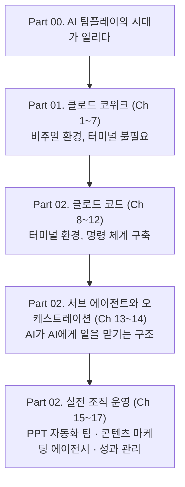

> 
> **[《클로드 에이전트 협업의 기술》](https://www.hanbit.co.kr/books/%ED%81%B4%EB%A1%9C%EB%93%9C-%EC%97%90%EC%9D%B4%EC%A0%84%ED%8A%B8-%ED%98%91%EC%97%85%EC%9D%98-%EA%B8%B0%EC%88%A0?code=B7162093936)** - 클로드 코워크와 코드로 구축하는 멀티 에이전트 시스템
> 
> 단순한 도구를 넘어 시스템으로,
> 
> 나를 대신해 스스로 일하는 AI 팀 만들기
> 
> 챗GPT와 클로드에게 질문을 던지고 답변을 기다리던 단순한 질문의 시대는 끝났다. 이제는 AI가 스스로 외부 도구를 사용하고, 맥락 속에서 스스로 판단하며, 다른 AI 서브 에이전트에게 업무를 할당하는 '멀티 에이전트'의 시대다.
> 
> 이 책은 비주얼 환경인 클로드 코워크부터 터미널 환경인 클로드 코드까지, MCP 연동과 서브 에이전트 지휘 체계를 활용해 멀티 에이전트 팀을 구축하는 방법을 다룬다. 이제부터는 '오케스트레이터'가 되어 직접 설계한 AI 팀이 스스로 성과를 내는 업무 자동화를 경험해 볼 차례다.
> 

저자 조쉬가 쓴 이 책은 한 문장으로 요약하면 "AI에게 질문만 던지던 사람이, AI 팀을 지휘하는 사람으로 바뀌는 과정을 담은 실습서"다. 부제 그대로 클로드 코워크(Claude Cowork)와 클로드 코드(Claude Code) 두 가지 도구를 순서대로 다루면서, 궁극적으로는 여러 개의 에이전트가 역할을 나눠 맡아 스스로 협업하는 멀티 에이전트 시스템을 독자가 직접 설계할 수 있도록 이끈다. 이 문서는 해당 책의 목차와 소개글, 그리고 책이 다루는 핵심 기술인 클로드 코워크·클로드 코드의 현재 상태를 함께 정리해, 책의 내용을 처음 접하는 사람도 전체 그림을 이해할 수 있도록 서술형으로 풀어썼다.

---

## 1. 이 책이 출발하는 지점: 질문의 시대에서 에이전트의 시대로

책의 도입부는 두 개의 시대를 나란히 놓고 시작한다. 하나는 "질문의 시대"다. 이 시기의 사람들은 AI와 도구 사이를 직접 오가며 일한다. 챗봇에 질문을 던지고, 돌아온 답변을 복사하고, 다시 다른 프로그램에 붙여넣는다. 맥락을 전달하는 것도, 결과를 정리하는 것도 결국 사람의 몫이다. 반대편에는 "에이전트의 시대"가 있다. 이 시기의 AI는 스스로 도구를 사용하고 판단하며, 필요하다면 또 다른 서브 에이전트에게 업무를 할당한다. 사람은 역할을 나누고 결과를 검토하는 자리로 물러난다.

책은 이 격차가 실제로는 매우 빠르게 벌어지고 있다는 문제의식에서 출발한다. 좋은 질문을 고민하던 시대는 지나갔고, 이제는 판단과 실행까지 통째로 위임하는 시대가 시작됐다는 것이다. 문제는 이 흐름에 올라타는 방법을 모른다는 데 있다. 어디서부터 시작해야 하는지, 자신의 업무에 어떻게 적용해야 하는지 막막한 독자들을 위해, 저자는 복잡한 개념 설명보다 실제로 따라 하면 손안에 AI 팀이 생기는 실습을 앞세운다. 저자 스스로가 클로드에 업무를 나눠 맡기며 다듬어 온 방법을 한 권에 담았다고 소개한다.

이 실습 여정은 네 단계로 요약된다. 터미널 없이 시작하는 5분짜리 코워크 세팅이 첫 단계이고, 지메일·노션·구글 드라이브 같은 업무 도구를 연결하는 것이 두 번째, 스킬과 플러그인·예약 작업으로 전문성을 장착하는 것이 세 번째, 마지막으로 서브 에이전트와 오케스트레이션을 실전에 적용해 하나의 조직으로 운영하는 것이 네 번째다.

---

## 2. 책 전체 지도

책은 크게 두 개의 파트로 나뉜다. Part 01은 비주얼 환경인 클로드 코워크를 다루고, Part 02는 터미널 환경인 클로드 코드를 다룬다. 저자가 이 두 도구를 나란히 배치한 이유는 명확하다. 코워크가 터미널 없이 누구나 5분 만에 시작할 수 있는 입문 통로라면, 코드는 명령어와 설정 파일을 통해 훨씬 정교하고 강력한 지휘 체계를 구축할 수 있는 심화 통로이기 때문이다. 실제로 코워크와 코드는 같은 에이전트 아키텍처를 기반으로 만들어졌기 때문에, 코워크에서 익힌 개념—파일을 직접 다루고, 여러 작업을 병렬로 처리하고, 서브 에이전트가 일을 나눠 맡는 방식—이 코드에서도 그대로 확장되어 나타난다.

전체 17개 장은 결국 하나의 흐름으로 이어진다. 처음에는 AI에게 파일 하나를 맡기는 것부터 시작해서, 마지막에는 여러 에이전트로 이루어진 팀 전체를 설계하고 운영하는 "팀장"의 자리에 서게 되는 구조다.

---

## 3. Part 01 — 클로드 코워크: 나의 첫 번째 에이전트 팀

### 3.1 시작하기와 첫 업무 위임 (1~2장)

첫 장은 설치와 실행, 화면 구성을 익히는 데서 출발한다. 저자는 코워크의 화면이 단순한 채팅창이 아니라 하나의 "작업 공간"이라는 점을 강조하며, 이미 클로드 코드를 써본 사람이 주의해야 할 차이점도 짚어준다. 이어지는 2장에서는 에이전트에게 첫 번째 일을 맡기는 경험을 다룬다. 바탕화면을 AI가 정리해주는 것부터, 긴 보고서를 세 줄로 요약받는 것, 여러 파일의 이름을 한 번에 바꾸고 포맷을 변환하는 것까지 — 복사와 붙여넣기를 반복하던 습관에서 벗어나는 첫 성공 경험을 만드는 구간이다.

이 구간에서 다루는 코워크의 실제 동작 방식은 현재 공식적으로도 확인된다. 코워크는 요청을 분석해 계획을 세우고, 필요하면 복잡한 작업을 하위 작업으로 쪼개며, 여러 작업 흐름을 상황에 따라 병렬로 조율한다. 이 과정에서 실제 수식이 살아 있는 엑셀 파일이나 파워포인트, 정돈된 문서처럼 곧바로 쓸 수 있는 완성된 결과물을 만들어낸다는 점이 코워크의 핵심 특징으로 소개된다.

### 3.2 멀티 파일 처리로 능력을 확장하다 (3장)

세 번째 장은 파일 하나가 아니라 여러 파일을 한꺼번에 다루는 단계로 넘어간다. 영수증 사진 10장을 던져주면 엑셀 정산표로 정리하는 실습, 웹에서 자료를 조사해 보고서를 자동으로 만들어내는 실습, 여러 개의 엑셀 파일을 하나로 병합하고 분석하는 실습이 이어진다. 코워크는 사용자가 지정한 폴더에 직접 접근해 파일을 읽고 수정하고 새로 만들 수 있기 때문에, 파일을 일일이 업로드하고 다운로드하는 절차 없이 컴퓨터 안의 자료를 그대로 다룬다는 점이 이 장의 실질적인 기반이 된다.

### 3.3 커넥터: 손과 발 달아주기 (4장)

네 번째 장은 코워크를 외부 서비스와 연결하는 "커넥터" 개념을 다룬다. 지메일과 연동해 이메일을 관리하는 비서 에이전트, 캔바와 연동해 디자인을 만드는 에이전트, 노션과 연동해 기록을 남기는 에이전트, 회의록 서비스인 Fireflies와 연동해 회의 내용을 정리하는 에이전트까지, 하나의 AI가 여러 업무 도구에 손을 뻗는 구조를 실습을 통해 익힌다.

### 3.4 스킬과 플러그인: 전문성과 업무 묶음 (5~6장)

다섯 번째 장은 에이전트에게 특정 분야의 전문성을 부여하는 "스킬"을 다룬다. 스킬을 직접 만들어보는 실전 과정과, 직장인이 실무에서 바로 쓸 수 있는 스킬 시나리오, 그리고 하나의 에이전트에 여러 스킬을 동시에 장착하는 조합의 기술까지 포함한다. 여섯 번째 장은 이렇게 만든 스킬들을 하나의 업무 묶음으로 엮는 "플러그인" 개념으로 넘어간다. 에이전트 팀을 어떻게 설계할지 사고하는 방법, 플러그인을 실제로 만드는 과정, 그리고 직장인을 위한 세 가지 에이전트 팀 레시피가 이 장의 뼈대를 이룬다.

### 3.5 예약 작업으로 완전 자동화하기 (7장)

Part 01의 마지막 장은 매일 아침 반복하던 같은 작업을 예약 작업으로 완전히 자동화하는 방법을 다룬다. 예약 작업을 설정하는 방법, 실무에서 쓸 수 있는 세 가지 활용 시나리오, 예약 작업을 관리하는 법, 그리고 반드시 알아야 할 한계점 세 가지와 좋은 프롬프트를 쓰는 네 가지 원칙까지 촘촘하게 다룬다. 마지막에는 예약 작업을 커넥터·스킬과 조합해 한 단계 더 나아가는 실습으로 Part 01을 마무리한다.

---

## 4. Part 02 — 클로드 코드: 에이전트 군단을 지휘하라

### 4.1 터미널이라는 낯선 문턱 넘기 (8~9장)

Part 02는 왜 코워크에서 코드로 넘어가야 하는지 설명하는 데서 시작한다. 코드를 설치하고, "터미널은 사실 검은 화면의 채팅창일 뿐"이라는 관점으로 낯섦을 낮춘 뒤, 첫 명령어를 입력하며 작동 원리를 살펴본다. 9장에서는 슬래시 명령어 전체를 정리하고, 속도를 바꿔주는 플래그와 옵션, 권한 설정, 비용을 관리하는 `/cost` 명령어와 모델 선택법, 그리고 자주 쓰는 명령어 조합을 치트시트 형태로 제공한다.

### 4.2 CLAUDE.md와 커스텀 명령어로 업무 매뉴얼 만들기 (10~11장)

10장은 이 책에서 가장 실용적인 장 중 하나로 꼽힌다. `CLAUDE.md`는 에이전트가 매 세션마다 참고하는 일종의 업무 매뉴얼로, 좋은 작성법과 직장인을 위한 다섯 가지 템플릿, 프로젝트별 관리법을 실습을 통해 다룬다. 11장은 파일 하나가 곧 명령어 하나가 되는 커스텀 명령어 개념으로 이어진다. 주간 보고서를 원클릭으로 생성하는 `/weekly-report`, 이메일 초안을 자동으로 작성하는 `/email-draft`, 회의록을 정리하는 `/meeting-summary`, 경쟁사를 모니터링하는 `/competitor-scan`까지 네 가지 실습을 통해 반복 업무를 하나의 명령어로 압축하는 방법을 보여준다. `$ARGUMENTS`를 활용한 유연한 명령어 설계와 프로젝트 명령어·개인 명령어의 차이도 함께 다룬다.

### 4.3 MCP: 활동 반경 넓히기 (12장)

12장은 클로드 코드를 외부 세계와 연결하는 MCP(Model Context Protocol) 서버를 다룬다. MCP가 무엇인지 개념을 잡고, 서버를 연결하는 실습을 거쳐, 직장인에게 유용한 MCP 서버 상위 7가지를 소개한다. 구글 드라이브를 연결해 문서를 자동으로 관리하는 실습, 슬랙을 연결해 채널을 자동으로 요약하는 실습이 이어지며, 코워크의 커넥터로는 할 수 없는 MCP만의 활용처도 별도로 정리한다.

### 4.4 서브 에이전트와 멀티 에이전트 오케스트레이션 (13~14장)

13장은 책 제목이기도 한 "에이전트 협업"의 핵심에 해당한다. 서브 에이전트는 지휘관 역할을 하는 메인 에이전트가 특정 작업을 독립된 실행자에게 맡기는 구조다. 실제로 클로드 코드의 서브 에이전트는 메인 대화와는 별도의 컨텍스트 창을 가진 채로 작업을 처리한 뒤 결과만 돌려주는 방식으로 동작한다. 이 장은 100개 파일을 동시에 분석하는 실습, 10개 경쟁사 웹사이트를 크롤링해 비교표를 만드는 실습, 서브 에이전트로 파일 분석 파이프라인을 구성하는 실습을 통해 이 구조를 몸으로 익히게 한다.

14장은 한 걸음 더 나아가 여러 에이전트가 하나의 조직처럼 움직이는 멀티 에이전트 오케스트레이션을 다룬다. 왜 한 명의 천재보다 역할이 나뉜 팀이 강한지에 대한 원칙, 에이전트 역할을 설계하는 방법, 직장인을 위한 조직도 설계 실습, 에이전트 간 커뮤니케이션 설계, 그리고 콘텐츠 팀 에이전트 조직을 실제로 구축해보는 과정이 이어진다. 참고로 클로드 코드 생태계에는 이런 협업 구조를 한층 확장한 "에이전트 팀" 기능도 별도로 등장해 있는데, 이는 여러 클로드 코드 인스턴스가 공유 작업 목록을 보면서 서로 직접 메시지를 주고받는 방식으로 동작한다. 지휘관과 실행자 관계였던 서브 에이전트 구조와 달리, 동료들이 나란히 협업하는 방식에 가깝다는 차이가 있다.

### 4.5 실전 프로젝트 두 편: PPT 자동화 팀과 콘텐츠 마케팅 에이전시 (15~16장)

15장은 지금까지 배운 것을 하나의 결과물로 응축하는 첫 번째 실전 프로젝트다. PPT 제작에 왜 멀티 에이전트가 필요한지 짚은 뒤, 서브 에이전트와 스킬을 각각 "정규직"과 "프리랜서"에 비유해 역할을 구분하고, 기획 팀·디자인 팀·개발 팀으로 나뉜 PPT 에이전트 팀을 실제로 구축해 결과물을 완성하고 리뷰까지 진행한다.

16장은 두 번째 실전 프로젝트로, 영상 하나로 여러 형태의 마케팅 콘텐츠를 뽑아내는 "원소스 멀티유즈" 개념을 다룬다. 지휘자·텍스트 마케팅·비주얼 마케팅·영상 제작으로 이루어진 네 개 팀 조직도를 설계하고, 유튜브 URL 하나만 넣으면 콘텐츠 에이전시 전체가 가동되는 실습을 진행한다. 비주얼 마케팅 파트에서는 이미지 생성 도구를 활용해 카드뉴스와 섬네일을 자동으로 만드는 과정도 포함되며, 마지막으로 이렇게 만든 에이전트 팀을 프롬프트 파일과 공식 문서를 활용해 자신의 것으로 다듬는 방법을 안내한다.

### 4.6 에이전트 조직을 운영하는 기술 (17장)

책의 마지막 장은 에이전트 팀을 "한 번 만들고 끝"이 아니라 지속적으로 운영하는 관점에서 다룬다. 에이전트 팀의 하루를 아침 브리핑부터 퇴근 보고까지 그려보고, `CLAUDE.md`를 버전 관리하며 에이전트를 온보딩시키는 방법, 결과물 품질을 점검하는 성과 관리 루틴을 소개한다. 비용 최적화 측면에서는 상위 모델인 Opus는 팀장 역할에, 상대적으로 가벼운 Sonnet은 실무자 역할에 배치하는 식의 원칙을 제시하며, 조직이 커지고 리모델링될 때의 확장 전략과 에이전트가 기대와 다르게 움직일 때의 트러블슈팅으로 책을 마무리한다.

---

## 5. 설명보다 먼저, 바로 써먹는 실습 네 가지

책이 특히 강조하는 것은 개념 설명보다 실습이 앞선다는 점이다. 소개 자료에서도 이 점을 다음 네 가지 실습으로 요약해 보여준다.

| 구분 | 실습 내용 | 핵심 포인트 |
|---|---|---|
| FILES | 100개 파일 동시 분석하기 | 서브 에이전트가 역할을 나눠 대량 파일을 처리하는 파이프라인 구성 |
| REPORT | 주간 보고서 원클릭 생성 | 커스텀 명령어로 반복 보고 업무를 하나의 지휘 체계로 압축 |
| PPT | PPT 자동화 에이전트 팀 | 기획·디자인·개발 팀을 나눠 결과물을 완성하는 협업 실전 |
| MARKETING | AI 콘텐츠 마케팅 에이전시 | 유튜브 URL 하나로 텍스트·비주얼·영상 콘텐츠까지 확장하기 |

이 네 가지는 각각 Part 01과 Part 02 후반부의 실전 장(13, 11, 15, 16장)과 그대로 맞물려 있어서, 독자가 책을 순서대로 따라가기만 해도 자연스럽게 이 네 가지 결과물을 직접 만들어보게 되는 구조다.

---

## 6. 어떤 사람에게 맞는 책인가

책이 소개하는 대상 독자는 크게 세 부류로 나뉜다. 첫째는 AI 챗봇을 자주 쓰지만 결국 복사와 붙여넣기 같은 단순 반복 업무에 발이 묶여 있다고 느끼는 직장인이다. 둘째는 지메일, 노션, 구글 드라이브처럼 매일 쓰는 도구를 AI와 연결해서 실제로 업무를 자동화하고 싶은 실무자다. 셋째는 명령어 한 줄로 수많은 파일을 동시에 처리하는 강력한 AI 팀을 직접 운영해보고 싶은 사람이다. 마케팅, 영업, 기획 등 혼자서 여러 역할을 감당해야 하는 1인 실무자를 위한 맞춤형 조직도와 템플릿을 제공한다는 점도 책의 실용적인 지향점을 보여준다.

---

## 7. 정리하며

이 책의 뼈대를 한 문장으로 요약하면, "누구나 5분 만에 시작할 수 있는 코워크로 AI와 협업하는 감각을 먼저 익히고, 이어서 클로드 코드의 명령 체계·CLAUDE.md·MCP·서브 에이전트를 통해 점점 더 정교한 지휘 체계를 쌓아 올린 뒤, 마지막에는 PPT 자동화 팀과 콘텐츠 마케팅 에이전시라는 실제 결과물로 그 지휘 체계를 증명해 보이는" 구조다. 책이 반복해서 강조하는 메시지는 하나다. AI에게 매번 묻는 사람으로 남을 것인가, 아니면 자신만의 AI 팀을 설계하고 지휘하는 사람이 될 것인가. 이 질문에 대한 실습 중심의 답을 17개 장에 걸쳐 차근차근 제시하는 책이라고 정리할 수 있다.

---

작성일: 2026년 7월 20일
