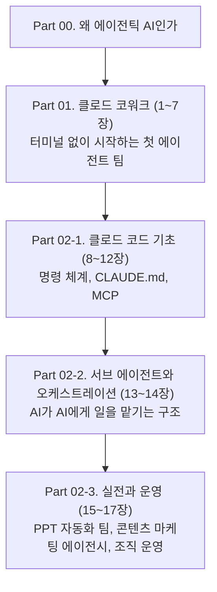
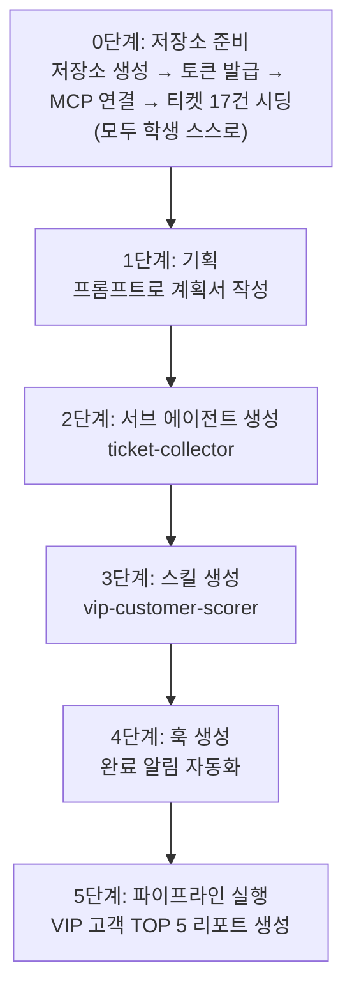

이 가이드는 코딩 경험이 전혀 없는 사람도 클로드(Claude)를 활용해 실제로 일을 대신 처리하는 "에이전트"를 다뤄볼 수 있도록 처음부터 끝까지 안내하는 문서다. [앞서 정리했던 책](https://k82022603.github.io/posts/%ED%81%B4%EB%A1%9C%EB%93%9C-%EC%97%90%EC%9D%B4%EC%A0%84%ED%8A%B8-%ED%98%91%EC%97%85%EC%9D%98-%EA%B8%B0%EC%88%A0-%ED%81%B4%EB%A1%9C%EB%93%9C-%EC%BD%94%EC%9B%8C%ED%81%AC%EC%99%80-%EC%BD%94%EB%93%9C%EB%A1%9C-%EA%B5%AC%EC%B6%95%ED%95%98%EB%8A%94-%EB%A9%80%ED%8B%B0-%EC%97%90%EC%9D%B4%EC%A0%84%ED%8A%B8-%EC%8B%9C%EC%8A%A4%ED%85%9C/)의 목차 구조를 거의 그대로 따라가되, 이번에는 책을 소개하는 글이 아니라 독자가 바로 따라 할 수 있는 실전 가이드로 풀어썼다. 터미널이 필요 없는 클로드 코워크(Claude Cowork)에서 시작해, 더 정교한 지휘 체계를 세울 수 있는 클로드 코드(Claude Code)까지 순서대로 다룬다.

---

## Part 00. 왜 지금 에이전틱 AI인가

지금까지 대부분의 사람들이 AI를 쓰는 방식은 "질문하고 답을 받는" 것이었다. 챗봇에 물어보고, 돌아온 답을 복사해서 엑셀이나 워드에 붙여넣는 식이다. 에이전틱 AI는 이 과정을 뒤집는다. AI가 스스로 계획을 세우고, 파일을 직접 열어 수정하고, 필요하면 또 다른 AI에게 일부 작업을 맡긴 뒤 결과를 종합해서 돌려준다. 사람은 매번 지시를 내리는 대신, 방향을 정하고 결과를 검토하는 역할로 옮겨간다.

이 변화가 실감 나는 이유는 코워크와 코드가 같은 에이전트 아키텍처를 공유하기 때문이다. 코워크는 클로드 코드와 동일한 구조를 쓰면서도 터미널을 열지 않고 데스크톱 안에서 바로 실행할 수 있도록 만들어졌다. 즉 코워크에서 익힌 감각—파일을 직접 맡기고, 복잡한 작업을 하위 작업으로 쪼개고, 여러 흐름을 동시에 처리하는 방식—이 코드로 넘어가서도 그대로 확장된다.



두 도구의 성격 차이를 미리 짚어두면 이후 내용을 이해하기 쉽다.

| 구분 | 클로드 코워크 | 클로드 코드 |
|---|---|---|
| 실행 환경 | 데스크톱 앱, 터미널 불필요 | 터미널(CLI), 데스크톱 앱, 웹, IDE 등 |
| 대상 | 코딩 경험이 없는 일반 실무자 | 개발자를 포함한 정교한 제어를 원하는 사용자 |
| 요금제 | 유료 요금제(Pro, Max, Team, Enterprise)에서 제공 | Pro, Max, Team, Enterprise 또는 콘솔 계정 |
| 확장 방식 | 커넥터·스킬·플러그인·예약 작업 | MCP·서브 에이전트·CLAUDE.md·커스텀 명령어 |
| 현재 상태 | 연구 프리뷰(Research Preview) 단계로 운영 | 정식 서비스로 폭넓게 사용 |

코워크는 유료 요금제 이용자에게 제공되며, 컴퓨터 안의 로컬 파일에 접근하려면 데스크톱 앱이 켜져 있어야 한다는 점이 특징이다. 아직은 연구 프리뷰 단계의 이른 버전으로 운영되고 있기 때문에, 실습을 진행하면서 예상과 다르게 동작하는 부분이 있더라도 놀랄 필요는 없다.

---

## Part 01. 클로드 코워크: 나의 첫 번째 에이전트 팀

### 1장. 시작하기: 설치와 화면 이해

코워크를 쓰려면 먼저 클로드 데스크톱 앱을 macOS 또는 Windows에 설치하고, 유료 요금제로 로그인한 뒤 코워크 탭을 연다. 화면은 익숙한 채팅창처럼 보이지만 실제로는 "작업 공간"에 가깝다. 요청을 입력하면 클로드는 곧바로 답을 내놓는 대신 요청을 분석해 계획을 세우고, 필요하면 복잡한 작업을 여러 하위 작업으로 나누고, 상황에 따라 여러 작업 흐름을 병렬로 조율한 뒤, 완성된 결과물을 세션에 전달해 미리 보고 내려받을 수 있게 한다. 이 과정 내내 클로드가 지금 무엇을 계획하고 실행하는지 계속 볼 수 있어서, 중요한 순간에는 직접 방향을 조정하고 그렇지 않은 부분은 맡겨둘 수 있다.

이미 클로드 코드를 써본 사람이라면 코워크가 같은 엔진 위에 올라간 다른 얼굴이라는 점만 기억하면 된다. 명령어를 외울 필요 없이, 하고 싶은 일을 문장으로 설명하는 것으로 충분하다.

### 2장. 에이전트에게 첫 번째 일 맡기기

첫 실습으로는 다음과 같은 가벼운 작업이 적당하다.

- 어수선한 바탕화면 폴더를 스크린샷, 문서, 프로젝트 파일별로 자동 정리해달라고 요청하기
- 긴 보고서 파일을 세 줄로 요약해달라고 요청하기
- 폴더 안 파일들의 이름을 규칙에 맞게 한꺼번에 바꾸고 포맷을 변환해달라고 요청하기

코워크는 데스크톱 환경에서 사용자가 지정한 폴더에 직접 접근해 로컬 파일을 업로드나 다운로드 절차 없이 그대로 읽고 쓸 수 있다. 이 첫 경험에서 중요한 것은 결과물의 완성도다. 코워크는 실제 수식이 살아 있는 엑셀 파일, 파워포인트, 정돈된 문서처럼 곧바로 쓸 수 있는 형태의 결과물을 만들어내는 것을 목표로 설계되어 있다.

### 3장. 멀티 파일 처리로 능력 확장하기

한 걸음 더 나아가 여러 파일을 한꺼번에 다루는 작업을 시도해본다. 영수증 사진 10장을 폴더에 넣고 "이 영수증들을 항목별로 정리해서 정산 엑셀표로 만들어줘"라고 요청하면, 클로드는 사진 각각을 읽어 금액과 항목을 추출하고 하나의 표로 합친다. 웹 조사가 필요한 보고서라면 조사와 초안 작성을 함께 요청할 수 있고, 여러 개의 엑셀 파일을 하나로 병합하고 분석하는 작업도 같은 방식으로 처리된다. 파일 수가 많아질수록 클로드는 작업을 하위 작업으로 나누어 병렬로 처리하는 서브 에이전트 조율 방식을 활용하게 된다.

### 4장. 커넥터: 에이전트에게 손과 발 달아주기

커넥터는 코워크를 지메일, 구글 드라이브, 노션, 슬랙, 캘린더, 피그마, 도큐사인 같은 실제로 매일 쓰는 서비스와 연결해주는 기능이다. 연결이 끝나면 클로드는 이메일을 읽고 초안을 작성하거나, 노션 페이지에 기록을 남기거나, 캘린더 일정을 확인하는 식으로 그 서비스 안에서 직접 작업할 수 있게 된다. 커넥터는 플러그인 없이도 개인 설정에서 독립적으로 추가할 수 있어서, 여러 업무에 공통으로 쓰이는 도구부터 연결해두는 것이 효율적이다.

### 5장. 스킬: 에이전트에 전문성 부여하기

스킬은 특정 업무를 반복적으로 처리하기 위한 재사용 가능한 절차다. 이름을 직접 불러 `/스킬이름`처럼 호출할 수도 있고, 그냥 하고 싶은 일을 자연어로 설명하면 클로드가 알아서 관련 스킬을 인식해 적용하기도 한다. 스킬을 처음부터 손으로 만들 필요는 없다. 평소 하던 업무 흐름을 코워크에서 그대로 진행한 뒤 "방금 한 작업을 스킬로 만들어줘"라고 요청하면, 내장된 스킬 생성 기능이 그 과정의 단계와 참고 자료를 정리해 다음번에는 한 번의 요청으로 실행할 수 있는 스킬로 패키징해준다.

### 6장. 플러그인: 에이전트 업무의 묶음 만들기

플러그인은 스킬, 커넥터, 서브 에이전트를 하나의 패키지로 묶은 단위다. 플러그인 하나를 설치하면 그 안에 포함된 스킬과 연결된 도구, 전용 서브 에이전트까지 한꺼번에 갖춰진 상태로 업무를 시작할 수 있다. 예를 들어 영업 담당자를 위한 플러그인은 세일즈포스와 아웃룩을 연결하고, 미팅 준비·후속 조치 기록·파이프라인 검토 같은 스킬을 함께 제공하는 식이다. 플러그인은 자신의 컴퓨터에 저장되는 방식이라 다른 기기와 자동으로 동기화되지는 않지만, 압축 파일로 공유하거나 깃허브에 올려 팀원들과 함께 쓸 수 있다.

### 7장. 예약 작업으로 완전 자동화 에이전트 만들기

매일 아침 반복하던 업무는 예약 작업으로 넘길 수 있다. 코워크 작업 중에 `/schedule`을 입력하거나 왼쪽 사이드바의 "Scheduled" 메뉴에서 새 예약 작업을 만들면 된다. 예약 작업은 매번 새로운 코워크 세션으로 실행되기 때문에, 그때그때 연결된 파일과 도구, 설치된 스킬과 플러그인을 동일하게 활용할 수 있다. 흔히 쓰이는 예로는 지난 24시간의 슬랙 메시지·이메일·캘린더 일정을 정리해주는 일일 브리핑이 있다. 다만 로컬 파일에 접근해야 하는 예약 작업은 데스크톱 앱이 켜져 있어야 실행되고, 그렇지 않고 연결된 서비스나 클라우드 자원만 다루는 작업은 컴퓨터가 꺼져 있어도 앤트로픽 서버에서 계속 진행된다는 차이를 알아두면 좋다.

좋은 예약 작업 프롬프트를 쓰는 요령은 결과물의 형식을 구체적으로 지정하는 것이다. "이메일 확인해줘" 대신 "지난 7일간의 이메일을 긴급·회신 필요·참고용으로 분류하고, 각 항목에 발신자·제목·분류·권장 조치를 담은 표를 만들어줘"처럼 산출물의 모양을 미리 그려주면 매번 일관된 결과를 받을 수 있다.

---

## Part 02. 클로드 코드: 에이전트 군단을 지휘하라

### 8장. 클로드 코드 시작하기

클로드 코드는 터미널에서 실행되는 도구이지만, 저자들이 공통으로 강조하듯 터미널은 그저 "검은 화면의 채팅창"일 뿐이다. 설치는 운영체제에 따라 다음 중 한 가지 방법을 쓰면 된다.

```bash
# macOS, Linux, WSL
curl -fsSL https://claude.ai/install.sh | bash
```

```powershell
# Windows PowerShell
irm https://claude.ai/install.ps1 | iex
```

Homebrew나 WinGet으로도 설치할 수 있으며, `claude --version` 명령으로 설치가 잘 됐는지 확인한다. 이후 프로젝트 폴더에서 `claude`를 입력하면 처음 한 번은 브라우저를 통한 로그인 절차를 거치고, 그다음부터는 자격 증명이 저장되어 다시 로그인할 필요가 없다.

첫 세션에서는 "이 프로젝트가 뭘 하는 프로젝트야?"처럼 가벼운 질문으로 시작해 클로드가 코드베이스를 어떻게 파악하는지 감을 잡는 것이 좋다. 실제로 파일을 고치는 단계로 넘어가면 권한 모드에 따라 동작이 달라진다. 기본 모드는 파일을 바꾸기 전에 매번 승인을 구하고, `Shift+Tab`을 눌러 모드를 전환하면 편집을 자동으로 승인하는 모드나 실행 없이 계획만 세우는 모드로 바꿀 수 있다.

### 9장. 명령어 체계: 에이전트에게 지시하는 언어

세션 안에서 자주 쓰는 명령어를 정리하면 다음과 같다.

| 명령어 | 역할 |
|---|---|
| `/clear` | 대화 기록을 초기화한다 |
| `/help` | 사용 가능한 명령어를 보여준다 |
| `/model` | 사용할 모델을 바꾼다 |
| `/cost` | 현재 세션의 비용을 확인한다 |
| `/mcp` | 연결된 MCP 서버 상태를 확인하고 관리한다 |
| `/memory` | CLAUDE.md 같은 메모리 파일을 편집기로 연다 |
| `/init` | 프로젝트를 분석해 CLAUDE.md 초안을 자동으로 만든다 |
| `/exit` | 세션을 종료한다 |

셸에서 바로 쓰는 명령도 알아두면 편하다. `claude`는 대화형 세션을 시작하고, `claude "작업 내용"`은 일회성 작업을 곧바로 실행하며, `claude -c`는 같은 폴더에서 가장 최근 대화를 이어간다. `Shift+Tab`으로 권한 모드를 순환하고, 위쪽 화살표로 이전 입력 기록을 불러오는 것도 자주 쓰는 단축 조작이다.

### 10장. CLAUDE.md: 에이전트의 업무 매뉴얼

`CLAUDE.md`는 클로드가 세션을 시작할 때마다 자동으로 읽어들이는 프로젝트 메모리 파일이다. 자주 쓰는 빌드·테스트·린트 명령, 코드 스타일 규칙, 프로젝트 구조에 대한 설명을 여기에 적어두면 매번 같은 설명을 반복하지 않아도 된다. 새 프로젝트에서는 `/init` 명령으로 클로드가 직접 프로젝트를 훑어보고 초안을 만들게 하는 것이 빠르다. 세션 도중 떠오른 규칙 하나를 빠르게 추가하고 싶다면 입력창에 `#`으로 시작하는 문장을 입력하면 되고, 더 폭넓게 정리하고 싶을 때는 `/memory` 명령으로 파일을 열어 직접 편집할 수 있다. 하위 폴더에 별도의 `CLAUDE.md`를 두면 그 폴더 안의 파일을 다룰 때만 해당 내용이 불러와지므로, 프로젝트가 커질수록 폴더 단위로 매뉴얼을 나누어 관리하는 것이 유리하다.

### 11장. 커스텀 명령어: 나만의 지휘 체계 만들기

반복되는 업무는 파일 하나로 명령어 하나를 만들어 압축할 수 있다. 예를 들어 `.claude/commands/weekly-report.md`라는 파일에 원하는 보고서 형식을 적어두면 `/weekly-report`라는 명령으로 곧바로 실행된다. 최근 클로드 코드에서는 이 커스텀 명령어 개념이 스킬(Skill) 체계와 하나로 합쳐졌다는 점을 알아두면 좋다. `.claude/commands/`에 만든 파일과 `.claude/skills/이름/SKILL.md` 형태로 만든 스킬은 똑같이 `/명령어이름`으로 호출되며 동일하게 동작한다. 다만 스킬 쪽이 더 다양한 기능을 지원한다. 템플릿이나 예시 같은 참고 파일을 함께 담을 수 있고, 사용자가 직접 호출하지 못하도록 제한하거나 특정 도구만 쓰도록 제어하는 설정도 가능하다. 그래서 새로 만드는 명령어는 스킬 형태로 만드는 것이 권장된다.

이메일 초안을 작성하는 `/email-draft`, 회의록을 정리하는 `/meeting-summary`, 경쟁사를 모니터링하는 `/competitor-scan` 같은 명령어를 이런 방식으로 만들어두면, 매번 프롬프트를 새로 입력하지 않고도 반복 업무를 한 줄로 압축할 수 있다. `$ARGUMENTS`를 사용하면 "/close-package 북미"처럼 명령어에 인자를 붙여 같은 절차를 다른 대상에 적용하는 유연한 명령어도 만들 수 있다. 개인적으로만 쓰고 싶은 명령어는 사용자 홈 폴더의 `~/.claude/commands/`에, 팀 전체와 공유하고 싶은 명령어는 프로젝트 폴더의 `.claude/commands/`에 두면 된다.

### 12장. MCP 서버: 에이전트의 활동 반경 넓히기

MCP(Model Context Protocol)는 클로드 코드를 외부 도구나 데이터 소스와 연결하는 개방형 표준이다. 터미널에서 다음과 같이 서버를 등록할 수 있다.

```bash
claude mcp add --transport http 서버이름 https://서버주소
```

이 명령은 서버 정보를 설정 파일에 기록하는데, 기본값인 로컬 범위는 현재 프로젝트에서 나만 쓸 수 있고, `--scope project`를 붙이면 같은 프로젝트를 쓰는 팀원과 공유되며, `--scope user`를 붙이면 모든 프로젝트에서 쓸 수 있게 등록된다. 세션 안에서는 `/mcp` 명령으로 연결 상태를 확인하고 관리할 수 있다. 연결된 서버가 늘어날수록 그 서버가 제공하는 도구 이름과 안내문이 매 세션의 맥락에 함께 실리므로, 더 이상 쓰지 않는 서버는 정리해주는 것이 좋다.

구글 드라이브를 연결해 문서를 자동으로 관리하거나, 슬랙을 연결해 채널 내용을 요약하는 식의 실습이 이 장에서 다루는 대표적인 예다. 코워크의 커넥터가 미리 준비된 서비스 목록 안에서 클릭 몇 번으로 연결하는 방식이라면, MCP는 원하는 어떤 서버든 직접 등록할 수 있다는 점에서 더 넓은 활동 반경을 제공한다.

### 13장. 서브 에이전트: AI가 AI를 부린다

서브 에이전트는 메인 대화와는 별도의 독립된 맥락 창을 가진 채로 특정 작업을 넘겨받아 처리한 뒤, 결과만 메인 에이전트에게 돌려주는 구조다. `.claude/agents/` 폴더에 이름, 설명, 사용할 도구, 모델을 지정한 마크다운 파일을 만들어두면 되고, 굳이 직접 만들지 않아도 "보안 취약점을 검토하는 서브 에이전트를 만들어줘"라고 요청하면 클로드가 알아서 적절한 설정으로 파일을 작성해준다. 설명 필드에 "PROACTIVELY"라는 표현을 넣어두면 사람이 따로 호출하지 않아도 관련된 상황이 오면 클로드가 먼저 그 서브 에이전트를 불러 쓰기도 한다.

100개 파일을 동시에 분석하는 작업이나 10개 경쟁사 웹사이트를 조사해 비교표를 만드는 작업처럼 범위가 넓은 작업일수록 서브 에이전트의 효과가 크다. 메인 세션의 맥락 창에 방대한 조사 내용이 그대로 쌓이는 대신, 각 서브 에이전트가 자신의 몫만 처리하고 요약된 결과만 돌려주기 때문에 메인 대화의 맥락이 깨끗하게 유지된다.

### 14장. 멀티 에이전트 오케스트레이션: 나만의 AI 조직도 구축하기

서브 에이전트가 "지휘관과 실행자" 관계라면, 여러 에이전트가 대등하게 협업하는 방식도 있다. 여러 클로드 코드 인스턴스가 하나의 팀으로 움직이며 공유된 작업 목록을 함께 보고, 서로 직접 메시지를 주고받으며 일을 조율하는 방식이다. 예를 들어 "이 모듈들을 UX 관점, 기술 아키텍처 관점, 비판적 검토 관점에서 각각 살펴보는 팀을 만들어줘"라고 요청하면, 클로드는 공유 작업 목록을 만들고 역할에 맞는 팀원을 구성한 뒤 작업을 시작한다. 팀원마다 독립된 맥락 창을 가지면서도 서로의 발견을 실시간으로 공유할 수 있다는 점이, 결과만 보고받는 서브 에이전트 구조와의 근본적인 차이다.

멀티 에이전트 오케스트레이션을 설계할 때는 한 명의 만능 에이전트를 만드는 대신 역할을 분명히 나누는 것이 핵심이다. 콘텐츠 팀이라면 리서치 담당, 초안 작성 담당, 검수 담당처럼 실제 조직의 역할 분담을 그대로 옮겨오는 방식이 잘 작동한다.

### 15장. 실전 I: PPT 자동화 에이전트 팀 만들기

지금까지 익힌 것을 하나의 결과물로 응축하는 첫 실전 프로젝트다. 서브 에이전트를 "정규직", 스킬을 "프리랜서"에 비유하면 역할 구분이 쉬워진다. 자주 반복되는 절차는 스킬로 만들어 필요할 때 불러 쓰고, 매번 독립적인 판단과 작업량이 필요한 역할은 서브 에이전트로 구성한다. 기획 팀은 주제와 목차를 설계하고, 디자인 팀은 슬라이드 구성과 색상·폰트를 정하고, 개발 팀은 실제 파일을 만드는 식으로 역할을 나누면, 하나의 요청만으로 리서치부터 완성된 파워포인트 파일까지 이어지는 파이프라인이 만들어진다.

### 16장. 실전 II: AI 콘텐츠 마케팅 에이전시 만들기

두 번째 실전 프로젝트는 영상 하나로 여러 형태의 콘텐츠를 뽑아내는 "원소스 멀티유즈"를 다룬다. 지휘자 역할의 에이전트가 전체 흐름을 조율하고, 텍스트 마케팅 팀은 카피와 게시물을 쓰고, 비주얼 마케팅 팀은 카드뉴스와 섬네일을 만들고, 영상 제작 팀은 짧은 클립을 뽑아내는 식으로 네 개 팀 조직도를 구성한다. 유튜브 URL 하나만 입력하면 조사부터 콘텐츠 제작까지 팀 전체가 가동되도록 만드는 것이 목표다. 이렇게 완성한 에이전트 팀은 공식 문서와 프롬프트 파일을 참고해 자신의 업무 스타일에 맞게 계속 다듬어 나가는 것이 좋다.

### 17장. 에이전트 조직 운영의 기술

에이전트 팀은 한 번 만들고 끝나는 것이 아니라 지속적으로 관리해야 하는 대상이다. `CLAUDE.md`를 버전 관리하면서 새로운 규칙이 생길 때마다 업데이트하는 것이 온보딩에 해당하고, 결과물의 품질을 주기적으로 점검하는 루틴이 성과 관리에 해당한다. 비용 측면에서는 판단과 지휘가 중요한 역할에는 상위 모델을, 반복적이고 명확한 실행 작업에는 가벼운 모델을 배치하는 식으로 비용과 성능의 균형을 맞추는 것이 일반적인 원칙이다. 에이전트가 기대와 다르게 움직일 때는 먼저 `CLAUDE.md`와 서브 에이전트 설정에 모호한 지시가 없는지 점검하고, 필요하다면 규칙을 한 번에 너무 많이 넣기보다 실제로 반복되는 실패 패턴이 관찰될 때마다 하나씩 추가하는 방식이 장기적으로 더 안정적이다.

---

## 실습 로드맵 한눈에 보기

책의 실전 장과 이 가이드의 실습을 짝지어 정리하면 다음과 같다.

| 단계 | 실습 내용 | 관련 장 |
|---|---|---|
| 입문 | 폴더 정리, 보고서 요약 등 첫 업무 위임 | Part 01, 2장 |
| 확장 | 100개 파일 동시 분석 파이프라인 구성 | Part 02, 13장 |
| 압축 | 커스텀 명령어로 주간 보고서 원클릭 생성 | Part 02, 11장 |
| 협업 | 기획·디자인·개발 팀으로 나눈 PPT 자동화 팀 | Part 02, 15장 |
| 확산 | 유튜브 URL 하나로 가동되는 콘텐츠 마케팅 에이전시 | Part 02, 16장 |

이 순서를 따라가면 파일 하나를 맡기는 감각에서 시작해, 마지막에는 여러 에이전트로 이루어진 팀 전체를 설계하고 운영하는 지점까지 자연스럽게 이어진다.

---

## 정리하며

에이전틱 AI를 제로에서 시작하는 길은 생각보다 단순하다. 터미널 없이 5분 만에 시작할 수 있는 코워크로 AI에게 실제 업무를 맡겨보는 감각을 먼저 익히고, 그다음 클로드 코드의 명령 체계와 `CLAUDE.md`, MCP, 서브 에이전트를 하나씩 쌓아 올리면서 점점 더 정교한 지휘 체계를 만들어가면 된다. 중요한 것은 처음부터 완벽한 조직도를 그리려 하지 않는 것이다. 작은 작업 하나를 맡기는 것에서 시작해, 반복되는 패턴이 보일 때마다 스킬로, 서브 에이전트로, 팀으로 조금씩 확장해 나가는 편이 훨씬 안정적으로 자리 잡는다.

---

# 별첨. 클로드 코드 미니 프로젝트 — 가상 고객 지원 티켓에서 VIP 고객 찾기 [#](https://claude.ai/public/artifacts/f294962f-dbf8-45ce-b1a6-61ad7d858342)

이 문서는 《제로에서 시작하는 에이전틱 AI — 클로드 코워크와 코드로 만드는 나만의 AI 팀》의 별첨 실습이다. 클로드 코드의 네 가지 핵심 확장 기능인 MCP, 스킬, 서브 에이전트, 훅을 하나의 미니 프로젝트 안에서 체험하도록 설계했다.

이번 버전은 준비 단계까지 포함해 처음부터 끝까지 학생 혼자 완주하도록 만들었다. 강사가 미리 저장소를 만들어두거나 데이터를 심어둘 필요가 없다. 대신 GitHub 저장소의 이슈를 "고객 지원 티켓"으로 재해석하고, 이슈 본문 안에 요청자 이름을 텍스트로 적어 넣는 방식을 쓴다. 그러면 학생 한 명이 자기 GitHub 계정 하나만으로도 여러 "가상 고객"이 남긴 활동 데이터를 스스로 만들어낼 수 있다.

## 1. 시나리오 설계의 핵심

이 실습에서 "사람"은 GitHub 계정이 아니라, 이슈 본문 안에 적힌 "요청자" 필드다. 이렇게 설계하면 다음이 모두 해결된다.

| 문제 | 실제 저장소를 그대로 쓸 때 | 가상 티켓 시나리오 |
|---|---|---|
| 여러 사람 데이터 확보 | 저장소마다 다르고 보장 안 됨 | 학생이 원하는 만큼 직접 설계 |
| 계정 여러 개 필요 여부 | 필요 없음 | 필요 없음 (자기 계정 1개로 충분) |
| 결과 재현성 | 매번 데이터가 바뀜 | 고정된 17건으로 항상 동일 |
| 준비 부담 | 없음 | 학생이 프롬프트 몇 번으로 직접 완료 |
| MCP·스킬·서브 에이전트·훅 학습 | 동일 | 동일 |

## 2. 전체 그림



| 기능 | 이 프로젝트에서의 역할 |
|---|---|
| MCP | 학생 본인의 실습용 저장소에 있는 이슈(티켓)를 읽고 쓰는 통로 |
| 서브 에이전트 | 티켓 데이터 수집만 전담하는 독립된 일꾼 |
| 스킬 | 티켓 본문에서 요청자·우선순위를 뽑아 점수를 매기는 재사용 절차 |
| 훅 | 리포트 파일이 만들어지면 자동으로 완료를 기록 |

## 3. 0단계: 저장소 만들기부터 시딩까지, 학생이 직접 끝내기

### 3.1 실습용 저장소 만들기

GitHub 웹사이트에서 새 공개 저장소를 하나 만든다. 이름은 자유롭게 정하되 실습 목적이 드러나는 이름이 좋다(예: `my-agentic-ai-practice`). README 하나만 있는 빈 저장소로 충분하다.

### 3.2 토큰 발급

GitHub Settings → Developer settings → Personal access tokens에서 세분화된 토큰(fine-grained token)을 발급한다. 방금 만든 저장소 하나만 골라서 Issues 권한을 "읽기 및 쓰기"로 지정한다. 자기 소유 저장소이기 때문에 토큰 하나로 시딩과 이후의 데이터 조회를 모두 처리할 수 있다. 실습이 끝난 뒤에는 토큰을 폐기하거나 권한을 읽기 전용으로 낮춰두면 된다.

### 3.3 로컬 폴더 준비와 모델 고정

터미널에서 실습용 폴더를 하나 만들고 그 안에서 클로드 코드를 시작한다.

```bash
mkdir vip-ticket-practice && cd vip-ticket-practice
claude
```

세션이 열리면 가장 먼저 모델을 고정한다.

```text
/model sonnet
```

### 3.4 프롬프트로 MCP 연결하기

`claude mcp add`는 터미널에서 직접 치는 CLI 명령이라 세션 안에서 클로드에게 대신 실행시키는 방식은 적절하지 않다. 대신 클로드 코드가 프로젝트 폴더에서 자동으로 읽어들이는 `.mcp.json` 설정 파일을 클로드에게 직접 만들어달라고 요청한다. 이 파일은 스킬이나 서브 에이전트 파일과 마찬가지로 클로드의 Write 도구로 만드는 평범한 파일이다.

```text
이 프로젝트 폴더에 .mcp.json 파일을 만들어서 GitHub MCP 서버를 등록해줘.
내용은 다음과 같아.

{
  "mcpServers": {
    "github": {
      "type": "http",
      "url": "https://api.githubcopilot.com/mcp",
      "headers": {
        "Authorization": "Bearer <내 토큰을 여기 붙여넣기>"
      }
    }
  }
}

파일을 만든 다음 .gitignore에도 .mcp.json을 추가해줘.
```

파일이 만들어지면 `/exit`로 세션을 한 번 종료했다가 `claude`로 다시 연다. 프로젝트 범위 MCP 서버는 처음 사용할 때 한 번 승인하라는 안내가 뜨는데, 그때 승인하면 된다. 이어서 다음처럼 연결 상태를 확인한다.

```text
/mcp
```

GitHub 서버가 연결된 것으로 표시되면 준비가 끝난 것이다.

### 3.5 프롬프트로 티켓 17건 심기

아래 표가 이번 실습의 고정 데이터셋이다. 등록일은 티켓 본문에 참고용으로만 들어가고 점수 계산에는 쓰이지 않으므로, 실습을 언제 진행하든 상관없다.

| # | 요청자 | 문의 유형 | 우선순위 | 등록일 | 제목 |
|---|---|---|---|---|---|
| 1 | 김민지 | 버그 | 긴급 | 2026-05-02 | 결제 후 주문내역이 안 보여요 |
| 2 | 김민지 | 사용문의 | 보통 | 2026-05-20 | 쿠폰 적용 방법 문의 |
| 3 | 김민지 | 기능요청 | 보통 | 2026-06-10 | 다크모드 지원 요청 |
| 4 | 김민지 | 사용문의 | 낮음 | 2026-07-01 | 비밀번호 재설정 안내 요청 |
| 5 | 박서준 | 버그 | 긴급 | 2026-04-25 | 앱이 계속 강제 종료됩니다 |
| 6 | 박서준 | 버그 | 긴급 | 2026-06-02 | 결제 이중 청구 발생 |
| 7 | 박서준 | 기능요청 | 보통 | 2026-07-05 | 다국어 지원 요청 |
| 8 | 이하은 | 기능요청 | 보통 | 2026-05-15 | 알림 설정 세분화 요청 |
| 9 | 이하은 | 사용문의 | 보통 | 2026-06-20 | 환불 절차 문의 |
| 10 | 이하은 | 사용문의 | 보통 | 2026-07-10 | 회원 등급 혜택 문의 |
| 11 | 최도윤 | 버그 | 긴급 | 2026-05-28 | 로그인 후 화면 무한 로딩 |
| 12 | 최도윤 | 사용문의 | 낮음 | 2026-06-15 | 이메일 수신 거부 방법 |
| 13 | 정유나 | 사용문의 | 보통 | 2026-05-10 | 배송 조회 오류 |
| 14 | 정유나 | 사용문의 | 낮음 | 2026-06-25 | 포인트 적립 문의 |
| 15 | 강태양 | 버그 | 긴급 | 2026-07-12 | 검색 결과가 표시되지 않음 |
| 16 | 오수빈 | 사용문의 | 보통 | 2026-04-30 | 계정 이메일 변경 문의 |
| 17 | 한지호 | 사용문의 | 낮음 | 2026-05-08 | 구독 해지 방법 |

각 티켓은 다음 형식으로 이슈 본문에 들어간다.

```text
## 문의 정보
- 요청자: 김민지
- 문의 유형: 버그
- 우선순위: 긴급
- 등록일: 2026-05-02

## 문의 내용
결제 후 주문내역이 안 보여요. 확인 부탁드립니다.
```

다음 프롬프트에 위 표를 그대로 붙여넣어 한 번에 심는다.

```text
아래 표의 각 행을 이 저장소에 이슈로 하나씩 만들어줘.
- 이슈 제목: "[문의유형] 제목" 형식으로
- 이슈 본문: 다음 형식을 그대로 채워서
  ## 문의 정보
  - 요청자: {요청자}
  - 문의 유형: {문의유형}
  - 우선순위: {우선순위}
  - 등록일: {등록일}

  ## 문의 내용
  {제목}을 조금 더 자연스러운 문장으로 풀어서 1~2줄로 써줘.
- 라벨: 우선순위 값을 그대로 라벨로 달아줘 (긴급/보통/낮음)

[여기에 위 표를 그대로 붙여넣기]
```

클로드는 GitHub MCP의 이슈 생성 도구를 17번 호출해서 표에 있는 티켓을 그대로 만들어낸다. 다 끝나면 저장소의 Issues 탭에서 17개가 잘 만들어졌는지 눈으로 한 번 확인한다.

## 4. 1단계: 기획 — 프롬프트만으로 계획서 만들기

```text
이 저장소의 이슈를 고객 지원 티켓으로 취급해서, 가장 비중 있게
문의를 남긴 상위 5명을 "VIP 고객"으로 뽑는 미니 파이프라인을
만들 거야.

다음을 포함한 계획서를 PLAN.md 파일로 정리해줘.
1. 각 티켓 본문에서 뽑아야 할 항목 (요청자, 문의 유형, 우선순위)
2. VIP 점수 계산 기준 초안
3. 전체 작업 단계와 각 단계에서 쓸 도구(MCP, 서브 에이전트, 스킬, 훅)
4. 최종 산출물의 형태 (report.md에 담길 표 구성)
```

## 5. 2단계: 서브 에이전트 만들기 — ticket-collector

```text
ticket-collector라는 이름의 서브 에이전트를 만들어줘.
역할: GitHub MCP 도구를 사용해서 이 저장소의 이슈(티켓)를 전부
가져와 raw-tickets.json으로 저장한다. 이슈 제목, 본문 전체, 라벨을
포함해야 한다.
모델은 sonnet으로 고정해줘.
사용할 도구는 GitHub MCP 도구와 파일 쓰기(Write) 도구만 허용하고,
Bash나 파일 편집(Edit) 도구는 주지 마.
설명(description) 필드에는 "고객 티켓 데이터 수집이 필요할 때 사용"이라고 적어줘.
```

이슈만 다루면 되므로 PR 관련 도구는 필요 없다. 도구 권한을 좁혀두면 이 서브 에이전트가 실수로 다른 작업을 하지 못하도록 막는 동시에, 불필요한 도구 호출로 비용이 새는 것도 막아준다.

## 6. 3단계: 스킬 만들기 — vip-customer-scorer

```text
vip-customer-scorer라는 스킬을 만들어줘.
입력: raw-tickets.json (이슈 제목, 본문, 라벨 목록)
처리 방법:
1. 각 티켓 본문에서 "요청자:", "우선순위:" 뒤에 오는 값을 읽는다.
2. 티켓 1건당 기본 1점, 우선순위에 따라 긴급은 +3점, 보통은 +1점,
   낮음은 +0점을 더한다.
3. 요청자별로 점수를 합산하고 점수가 높은 순서로 정렬해서 상위 5명을 뽑는다.
출력: report.md 파일에 순위, 요청자, 총점, 티켓 건수, 대표 문의 제목
1~2개를 표 형태로 정리한다. 표 아래에는 어떤 기준으로 VIP를 선정했는지
3줄 이내로 설명을 덧붙인다.
```

이 스킬은 이후 다른 저장소나 다른 데이터셋에도 "vip-customer-scorer 스킬로 다시 뽑아줘"라는 한마디로 재사용할 수 있다.

### 검증용 정답표

3.5의 표를 그대로 심었다면, 계산 결과는 다음과 같아야 한다. 학생이 만든 파이프라인이 이 결과와 같은지 비교하면 채점이나 자가 점검에 바로 쓸 수 있다.

| 순위 | 요청자 | 총점 | 계산 근거 |
|---|---|---|---|
| 1 | 박서준 | 10점 | 긴급 2건(4+4) + 보통 1건(2) |
| 2 | 김민지 | 9점 | 긴급 1건(4) + 보통 2건(2+2) + 낮음 1건(1) |
| 3 | 이하은 | 6점 | 보통 3건(2+2+2) |
| 4 | 최도윤 | 5점 | 긴급 1건(4) + 낮음 1건(1) |
| 5 | 강태양 | 4점 | 긴급 1건(4) |

박서준이 김민지보다 티켓 수는 적지만(3건 대 4건) 긴급 문의 비중이 높아 1위가 된다는 점이, 단순히 "문의를 많이 남긴 사람"이 아니라 "비중 있는 문의를 남긴 사람"을 VIP로 뽑는다는 이번 스코어링 기준을 잘 보여준다.

날짜를 기준으로 최근 활동만 걸러내는 필터는 이번 실습에는 넣지 않았다. 데이터가 17건으로 이미 작아서 걸러낼 만큼의 규모가 아니고, 날짜 조건을 넣으면 오늘이 언제인지에 따라 결과가 달라져 정답표가 흔들리기 때문이다. 날짜 필터링 자체를 연습해보고 싶다면, 스킬 4단계 뒤에 "등록일이 최근 30일 이내인 티켓만 남긴다" 같은 조건을 심화 과제로 추가해보는 정도가 적당하다.

## 7. 4단계: 훅 만들기 — 리포트 완성 자동 기록

```text
report.md 파일이 새로 쓰일 때마다 자동으로 실행되는 훅을 만들어줘.
이벤트: PostToolUse, 대상 도구: Write
matcher는 파일 경로에 report.md가 포함될 때만 걸리도록 해줘.
훅이 하는 일: activity-log.txt 파일 맨 아래에
"[현재 시각] VIP 고객 리포트 생성 완료" 한 줄을 추가하고,
터미널에도 같은 메시지를 출력해줘.
.claude/settings.json에 등록해줘.
```

훅은 모델을 다시 호출하지 않는 단순한 셸 로직이기 때문에, 파이프라인을 몇 번을 돌리든 이 부분에서는 추가 비용이 발생하지 않는다.

## 8. 5단계: 전체 파이프라인 한 번에 실행하기

```text
ticket-collector 서브 에이전트를 사용해서 이 저장소의 이슈를
raw-tickets.json으로 모아줘.
그다음 vip-customer-scorer 스킬로 점수를 매겨서 상위 5명 VIP 고객을
report.md로 정리해줘.
```

클로드는 ticket-collector 서브 에이전트로 GitHub MCP를 통해 티켓 데이터를 모으고, vip-customer-scorer 스킬로 점수를 매겨 `report.md`를 작성한다. 파일이 저장되는 순간 훅이 자동으로 실행되어 `activity-log.txt`에 완료 기록이 남는다. 결과가 앞서 정리한 검증용 정답표와 같다면 파이프라인이 올바르게 동작한 것이다.

## 9. 비용을 최소한으로 유지하는 다섯 가지 원칙

| 원칙 | 구체적인 방법 |
|---|---|
| 모델을 하나로 고정 | `/model sonnet`, 서브 에이전트 frontmatter에도 `model: sonnet` 명시 |
| 데이터 규모를 고정 | 학생이 직접 심은 17건뿐이라 저장소 크기가 절대 커지지 않음 |
| 도구 권한을 최소로 | 서브 에이전트에는 GitHub MCP와 Write 도구만 허용, PR 관련 도구는 배제 |
| 확정 로직은 훅으로 | 완료 기록처럼 매번 반복되는 단순 작업은 모델 호출 없는 훅으로 처리 |
| 결과를 미리 알고 있음 | 정답표가 있어 잘못된 방향으로 여러 번 재시도하며 비용을 낭비할 필요가 없음 |

## 10. 정리하며

이번 버전은 저장소 생성, 토큰 발급, MCP 연결, 데이터 시딩까지 전 과정을 학생 혼자 자기 계정으로 끝낼 수 있도록 설계했다. 강사가 따로 준비할 것이 없고, 학생마다 자기 소유의 실습용 저장소가 하나씩 생긴다. 그러면서도 심는 데이터는 고정된 표를 그대로 따르기 때문에, 누가 언제 실습하든 같은 정답표로 결과를 확인할 수 있다. 날짜 기반 필터처럼 실습 시점에 따라 결과가 흔들릴 수 있는 조건은 걷어내, 작은 데이터셋 안에서 MCP·서브 에이전트·스킬·훅이 맞물려 돌아가는 감각을 익히는 데만 집중하도록 했다.

---

작성일: 2026년 7월 20일


