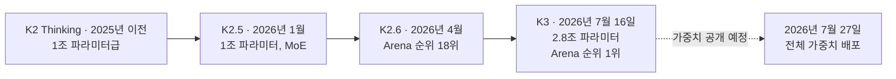
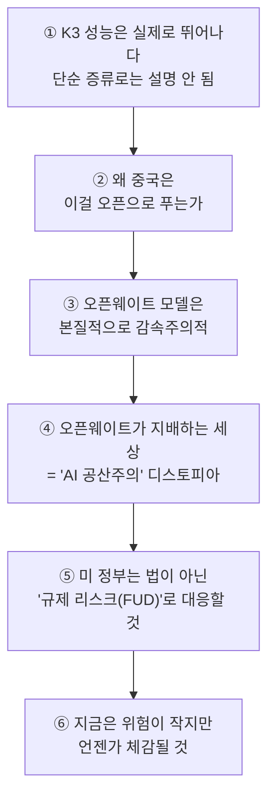

### — 전 백악관 AI 정책보좌관이자 현 OpenAI 임원 딘 볼(Dean W. Ball)의 발언을 중심으로

작성일: 2026년 7월 20일

## 관련글

[**米国政府のAI政策顧問をやってたDeanBall氏がKimi-K3ショックについて物申す (미국 정부의 AI 정책 자문관으로 활동했던 딘 볼이 키미-K3 사태에 대한 자신의 견해를 밝혔다)**](https://x.com/umiyuki_ai/status/2078640602863038837)

---

## 1. 이 문서가 다루는 것

2026년 7월 16일, 중국 베이징의 AI 스타트업 문샷 AI(Moonshot AI)가 초대형 오픈웨이트 언어모델 **Kimi K3**를 공개했다. 발표 직후 이 모델의 실제 성능을 두고 업계 전체가 술렁였고, 이틀 뒤인 7월 18일 전직 백악관 AI 정책보좌관이자 현재 OpenAI의 "전략적 미래(Strategic Futures)" 팀을 이끌고 있는 딘 W. 볼(Dean W. Ball)이 자신의 X(옛 트위터) 계정에 여섯 개 항목으로 구성된 장문의 소감을 올렸다. 이 글은 단순한 모델 리뷰를 넘어 "오픈웨이트 모델은 감속주의(decelerationist)다", "오픈웨이트가 지배하는 세상은 결국 AI 공산주의로 귀결된다"는 도발적인 주장을 담고 있어 곧바로 격렬한 반응을 불러일으켰다. 그리고 그 반응의 상당 부분은 정작 "OpenAI"라는, 이름 자체에 개방성(open)을 표방한 회사의 임원이 오픈웨이트 모델을 비판했다는 아이러니를 향한 것이었다.

이 문서에서는 다음을 순서대로 다룬다.

- Kimi K3라는 모델 자체의 사실관계
- 딘 볼이 누구이며 왜 그의 발언에 무게가 실리는지
- 그가 올린 여섯 항목의 내용을 하나씩 풀어서 설명
- 이 발언이 촉발한 후폭풍과, 그에 대한 볼 본인의 해명 게시물
- 이 논쟁의 배경이 되는 앤트로픽의 "증류(distillation) 공격" 고발 사건
- 업계의 반박 시각과 균형 잡힌 평가
- 사실관계를 primary(1차 자료)·secondary(2차 보도)·analytical(분석·추정)로 구분한 팩트체크

캡처 이미지에 담긴 내용은 일본의 AI 연구 계정 우미유키(@umiyuki_ai)가 딘 볼의 원문 트윗을 일본어로 요약·해설한 게시물이다. 즉 원 저자(볼)의 1차 발언이 아니라 그것을 읽은 제3자의 해설이라는 점을 먼저 짚어둔다. 아래 본문에서는 딘 볼의 영어 원문 트윗과 이후 공개된 해명 트윗을 1차 자료로 삼아 재구성했다.

---

## 2. Kimi K3란 무엇인가

Kimi K3는 문샷 AI가 2026년 7월 16일(현지 목요일) 공개한 초대형 오픈웨이트 모델이다. 몇 가지 핵심 수치는 다음과 같다.

- **총 파라미터 수**: 2.8조 개. 이전 모델인 K2.6 대비 약 2.8배 크며, 딥시크의 V4 프로(약 1.6조), 즈푸 AI의 GLM 5 시리즈(약 7,440억)를 능가해 공개된 모델 중 세계 최대 규모로 소개됐다.
- **혼합 전문가(MoE) 구조**: 전체 896개의 전문가 네트워크 중 토큰당 16개(전체의 약 1.8%)만 활성화하는 방식으로, 거대한 총 파라미터 수 대비 실제 연산량은 억제하는 구조다.
- **컨텍스트 윈도우**: 100만 토큰. 장문 코딩이나 에이전트형 작업에 유리하도록 설계됐다.
- **아키텍처 혁신**: 문샷이 자체 개발한 "Kimi Delta Attention(KDA)"이라는 하이브리드 선형 어텐션 기법과, 잔차 연결(residual connection)을 대체한다는 "Attention Residuals(AttnRes)" 기법을 적용했다. 두 기법 모두 문샷 팀이 이전에 오픈 리서치로 공개한 바 있는 것들이다.
- **가중치 공개 일정**: 이 문서 작성 시점(2026년 7월 20일) 기준으로 API를 통한 서비스만 시작된 상태이며, 전체 모델 가중치(weights) 자체는 7월 27일에 공개될 예정이다. 즉 지금까지 나온 벤치마크 수치는 모두 문샷 측 발표나 API를 통한 외부 테스트에 근거한 것이며, 커뮤니티가 직접 검증할 수 있는 단계는 아직 아니다.
- **가격**: 입력 토큰 100만 개당 3달러, 출력 토큰 100만 개당 15달러로 책정됐다. 이는 중국 AI 랩이 내놓은 모델 중 가장 비싼 가격대이지만, 앤트로픽의 오퍼스(Opus) 4.8과 비교하면 작업당 비용은 대략 절반 수준이다. 다만 독립 평가기관 Artificial Analysis에 따르면 K3는 추론에 매우 많은 토큰을 소비하는 경향이 있어(예: 단순한 SVG 펠리컨 그림을 그리는 과제에도 13,241개의 추론 토큰을 사용, 쿼리당 약 0.25달러), 겉으로 보이는 저렴한 단가만큼 실제 총비용이 낮다고 단정하기는 어렵다는 지적이 나온다.
- **벤치마크 성적**: AI 평가 플랫폼 Arena.ai의 "프런트엔드 코드 아레나(Frontend Code Arena)" 블라인드 테스트에서 1,679점으로 1위를 차지해 앤트로픽의 최상위 모델인 클로드 페이블(Fable) 5를 앞질렀다. 이는 이전 버전 K2.6이 18위였던 것에서 단숨에 17계단을 뛰어오른 결과다. 다만 문샷 스스로도 "전체적인 성능은 여전히 가장 강력한 독점 모델인 클로드 페이블 5와 GPT 5.6 솔(Sol)에는 못 미친다"고 밝혔으며, 오퍼스 4.8과 GPT 5.5 같은 준정상급 모델들은 코딩·에이전트 벤치마크에서 앞섰다고 설명했다.
- **환각률(hallucination rate) 우려**: Artificial Analysis의 독립 테스트에 따르면 K3의 사실 정확도는 K2.6 대비 33%에서 46%로 개선됐지만, 동시에 환각률도 39%에서 약 51%로 상승했다는 결과가 나왔다. 이는 사실 확인이 중요한 에이전트 작업에서는 여전히 주의가 필요하다는 뜻이다. (이 수치는 Artificial Analysis라는 단일 평가기관의 결과이며, 다른 독립 기관의 교차 검증은 아직 폭넓게 이뤄지지 않았다는 점을 감안해야 한다.)

이 발표는 공교롭게도 중국 상하이에서 열린 세계인공지능대회(WAIC)에서 시진핑 국가주석의 연설과 시기가 겹쳤고, 나스닥 지수가 하루 만에 약 1% 하락하며 엔비디아 등 반도체 관련주가 매도세를 겪는 등 금융시장에도 파장을 일으켰다.

---

## 3. 논쟁의 발화점 — 딘 볼은 누구인가

딘 우들리 볼(Dean Woodley Ball)은 원래 정책 분야 출신 인물이다. 해밀턴 칼리지에서 역사학을 전공했고, 스탠퍼드 후버연구소, 맨해튼 인스티튜트, 조지메이슨대 머케이터스 센터 등을 거치며 AI 정책과 기술 변화를 주제로 오랫동안 블로그 "Hyperdimensional"을 운영해온 논객이었다.

그가 전국적으로 이름을 알린 계기는 트럼프 행정부 2기의 백악관 과학기술정책실(OSTP)에서 AI·신흥기술 담당 선임정책보좌관으로 약 4개월간 근무하며 미국의 "AI 액션플랜(America's AI Action Plan)"을 실질적으로 집필한 주역이었다는 사실이다. 이 계획은 트럼프 행정부가 내놓은 정책 중 이례적으로 초당적인 호평을 받은 문서로 평가받는다. 그는 이 기간 동안 국립과학재단(NSF)의 AI 전략자문, 국가AI연구자원(NAIRR) 파일럿 운영위 공동의장 등도 겸했다.

그리고 이 논쟁을 이해하는 데 결정적인 사실 하나가 있다. **딘 볼은 2026년 7월 6일, 즉 문제의 트윗을 올리기 불과 열흘 남짓 전에 OpenAI에 합류해 "전략적 미래(Strategic Futures)"라는 신설 팀을 이끌게 되었다.** 이는 그의 첫 민간 테크업계 직장이기도 하다. 그가 백악관에서 나와 정부에서 쌓은 정책적 인맥과 전문성을 살려 OpenAI의 프런티어 AI 정책을 설계하는 역할을 맡게 된 것이다.

즉 우미유키의 게시물이 그를 "미국 정부의 AI 정책 고문을 지낸 인물(米国政府のAI政策顧問をやってた)"이라고 과거형으로 소개한 것은 정확하다. 그러나 이 소개만으로는 그가 트윗 시점에 **경쟁사인 OpenAI의 정책 총괄로 재직 중이었다**는, 이 논쟁 전체를 관통하는 핵심 맥락이 드러나지 않는다. 실제로 이 발언이 큰 반발을 산 이유의 상당 부분은 바로 이 지점에 있었다.

---

## 4. 딘 볼의 원문 트윗, 여섯 가지 요점 풀어보기

볼은 "Kimi에 대한 몇 가지 관찰(Some observations on Kimi)"이라는 제목으로 여섯 개 항목의 글을 올렸다. 아래에서는 각 항목의 취지를 한국어로 풀어서 설명한다.

### 4.1 "성능은 진짜다, 다만 토큰을 많이 먹는다"

볼은 먼저 Kimi K3가 실제로 매우 뛰어난 모델이라고 인정했다. 단순히 다른 강한 모델의 결과물을 베껴 배운 "증류"만으로는 이 정도 성능을 설명하기 어렵다는 것이 그의 평가였다. 에이전트형 코딩 작업에서는 2026년 1분기 기준 최상위 공개 모델들과 대등한 수준이라고 평가했다. 다만 자신이 제한적으로 사용해본 바로는 토큰을 유난히 많이 소비하는 경향이 있었고, 그래서 이 모델이 정말로 저렴하게 돌아가는 모델인지는 확신하기 어렵다고 덧붙였다. 이는 앞서 소개한 Artificial Analysis의 독립 테스트 결과(높은 추론 토큰 소비량)와도 맥이 닿는 지적이다.

### 4.2 "왜 중국은 이렇게 뛰어난 모델을 오픈으로 풀도록 허용하는가"

두 번째 항목에서 볼은 중국 정부가 이 정도로 우수한 모델의 가중치 공개를 계속 허용하는 상황에 개인적으로 놀랐다고 밝혔다. 그는 자신이라면 이 정도 수준의 한계적 위험을 지닌 모델을 오픈웨이트로 두는 데 큰 거부감이 없겠지만, 중국이 그렇게 하는 것 자체가 의외라고 했다. 그러면서 이유를 대략 두 갈래로 추정했다.

첫째(그의 표현으로는 약 75% 비중), 중국 공산당 지도부가 AI의 잠재력과 위험성 모두에 대해 상대적으로 둔감한, 이른바 "AGI에 확신이 없는(AGI-pilled하지 않은)" 태도를 갖고 있다는 것이다. 그는 이를 실리콘밸리의 얀 르쿤(Yann LeCun, 메타의 前 수석 AI과학자로 AGI 임박론에 회의적인 것으로 유명한 인물)의 관점에 빗대어 설명했다. 둘째(약 25% 비중), 중국 내부적으로 소비자용 추론 서비스를 감당할 만한 컴퓨팅 자원 자체가 부족하다는 것이다. 그는 이것이 역설적으로 미국의 수출통제가 낳은 "의도치 않은 부산물"일 수 있다고 짚었다. 즉 자국 내에서 폐쇄형으로 서비스할 만큼의 GPU가 부족하다면, 차라리 가중치를 공개해 전 세계가 자체적으로 호스팅하도록 하는 편이 자국 이용자에게도 이득이라는 논리다. 여기에 더해 기업 입장에서는 미국 최상위 모델을 따라잡지 못하는 상태에서 폐쇄형으로 내놓아 봐야 주목받지 못하니, 오히려 오픈소스 전략이 존재감을 확보하는 합리적 선택이라는 해석도 곁들였다.

### 4.3 "오픈웨이트 모델은 본질적으로 감속주의(decelerationist)적이다"

세 번째 항목은 이 트윗에서 가장 논쟁적인 부분 중 하나였다. 볼은 오픈웨이트 모델이 본질적으로 "감속주의적"이라고 주장했다. 그러면서 정작 스스로를 "가속주의자(accelerationist)"라 칭하는 이들이 오픈웨이트 모델의 등장에 열광하는 현상이 계속 의아하다고 밝혔다. 그의 추정으로는, 이들이 실제로 좋아하는 것은 오픈웨이트 모델이 만들어내는 "통제 불가능성(ungovernability)"이라는 망토 그 자체라는 것이다. 그는 이를 인류학자 제임스 C. 스콧(James C. Scott)의 저서 『조미아, 지배받지 않는 사람들(The Art of Not Being Governed)』에 나오는, 국가의 통치를 피해 산악지대로 이주한 동남아시아 산악민족(힐 피플)의 비유를 들어 설명했다. 다만 그는 결국 오픈웨이트 모델이 AI 인프라에 대한 추가 대규모 투자(CapEx)를 저해하는 방향으로 작용한다고 보았다.

이 부분은 이후 그가 스스로 "부정확했다"고 인정하며 수정한 대목이기도 하다(5절 참고).

### 4.4 "AI 공산주의"라는 디스토피아 시나리오

네 번째 항목에서 볼은 오픈웨이트 모델이 지배하는 세계의 개연성 있는 귀결로 "완전한 AI 공산주의"를 제시했다. 즉 AI가 시장에서 거래되는 상품이 아니라 국가가 전기·수도처럼 공급하는 "디지털 공공 인프라"로서의 공공재가 되는 미래다. 그는 이것이 중국이 실제로 지향하는 방향이라고 보았고, 개인적으로는 이런 미래를 "디스토피아적 지옥"이라고 표현했다. 그러면서도 자신이 만나본 오픈웨이트 옹호자들 중 결국 이 결론에 도달한다는 사실 자체는 부정하지 않는 이들이 많았다고 덧붙였다. 그는 자신이 정부에 있을 때 일부 자칭 가속주의자들이 정부 예산으로 대형 데이터센터를 지어 스타트업들이 보조금을 받아 모델을 학습시키고 무료로 배포하게 해야 한다고 로비했던 경험을 언급하며, 다수의 가속주의자들이 프런티어 모델을 만들고 서비스하는 것을 정당한 사업으로 보지 않는다는 인상을 받았다고 적었다.

### 4.5 미국 정부가 취할 법한 대응 — 법이 아니라 "규제 리스크" 조성

다섯 번째 항목은 정책적으로 가장 파장이 컸다. 볼은 트럼프 행정부가 결국에는 중국산 오픈웨이트 모델 사용을 둘러싼 규제 리스크를 대폭 키우는 쪽을 택할 것이라고 예측했다. 그는 오픈소스를 법으로 전면 금지할 필요는 없다고 보았다. 대신 여러 연방기관이 "중국 모델에는 백도어가 있을 수 있다"는 식의, 굳이 엄밀하게 입증되지 않은 경고성 연성 규제(soft law)를 흘리기만 해도, 규제 대상 기업들이 위험을 피해 알아서 중국 모델 사용을 자제하게 될 것이라는 논리였다. 다만 그는 이 수위가 지나치면 대형 클라우드 사업자들마저 중국 모델 서비스를 꺼리게 되고, 오히려 스타트업들이 신뢰도가 낮은 사업자로 몰리는 부작용이 생길 수 있다고도 지적하며 "적당한 균형점"이 있을 것이라고 전망했다.

### 4.6 위험성에 대한 경고

마지막 여섯 번째 항목에서 볼은 이 정도 성능의 모델이 오픈웨이트로 풀리는 것이 세상을 다소 위험하게 만드는 것은 사실이지만, 지금 당장 체감할 정도는 아니라고 평가했다. 다만 언젠가는 그 위험이 뚜렷하게 체감되는 지점이 올 것이라며, "살아있지 않고, 눈에 보이지 않으며, 위험하고, 무한히 자가복제하는 에이전트가 중국의 한 연구실에서 빠져나갔다"는 식의 시나리오를 예로 들었다. 이는 다소 냉소적인 수사로, 생물학적 자가복제 행위자에 빗댄 사이버 위협 시나리오를 암시한 것으로 읽힌다.

---

## 5. 후폭풍: "OpenAI 소속이 이래도 되나"라는 반발, 그리고 딘 볼의 해명

이 트윗은 게시 직후 상당한 반발을 샀다. 반발의 핵심 논리는 명확했다. OpenAI는 원래 "개방된 AI(Open AI)"라는 이름과 함께 비영리 조직으로 출발했고 개방성을 표방해온 회사인데, 그 회사의 "전략적 미래" 총괄이 오픈웨이트 모델을 깎아내리는 듯한 발언을 하는 것은 앞뒤가 맞지 않는다는 비판이었다. X 이용자 조너선 앨드리치(@JAldrichPL)의 게시물이 대표적으로 이런 정서를 대변하며 확산됐고, 이에 대해 가속주의 진영의 논객 베프 제조스(Beff Jezos, @beffjezos)가 볼을 두둔하는 반응을 남기기도 하는 등 찬반 반응이 엇갈렸다.

이런 반응에 대해 볼은 같은 날(7월 18일) 오후, 원 게시물에 대한 후속 해명 트윗을 올렸다. 이 해명의 요지는 다음과 같다.

- OpenAI 합류 이전에는 논쟁적 주제에 대해 냉정하고 분석적인 태도로, 때로는 자신이 속한 "진영"에 불리한 이야기도 거리낌 없이 써왔다고 밝혔다. 이번 Kimi 관련 게시물도 그런 기조에서 나온 것이라고 설명했다.
- 다섯 번째 항목에서 미국 정부가 "정당화가 부족한 연성 규제로 중국 AI를 견제할 것"이라고 쓴 것은 그것을 좋은 정책이라고 주장(advocate)한 것이 아니라, 앞으로 벌어질 가능성이 높은 상황을 예측(describe)한 것이었다고 해명했다.
- 첫 번째로 인정한 "실수"는, 프런티어 랩에 소속된 자신의 발언에 지금처럼 큰 관심과 억측이 쏠리는 환경에서는 예전 같은 방식의 거친 분석 글쓰기가 더 이상 통하지 않는다는 점을 미처 깨닫지 못했다는 것이다.
- 두 번째로 인정한 실수는, 원래 자신의 글을 맥락을 충분히 이해하고 너그럽게 읽어주던 소수의 독자층을 염두에 두고 다소 부정확하게 표현했다는 것이다. 구체적으로 그는 오픈웨이트 모델이 "무조건적으로 감속주의적"이라고 쓴 것은 자신의 실제 생각과 다르다고 정정했다. 그는 오직 "오픈웨이트 모델이 한계적으로(on the margin) 설비투자(CapEx) 지출을 늦춘다"는 좁은 의미에서만 감속주의적이라고 보며, 그 밖의 여러 측면에서는 오히려 오픈웨이트 AI가 확연히 가속주의적이라고 재차 강조했다.
- 이어 그는 자신이 2024년부터 오픈소스 소프트웨어와 오픈웨이트 AI에 대해 얼마나 우호적인 글을 써왔는지를 인용하며, 백악관 재직 시절 미국의 AI 전략에 오픈웨이트를 지지하는 취지의 문구가 반영되도록 노력했다는 점도 언급했다. 동시에 그는 2년도 더 전에 자신이 "프런티어 AI를 오픈소스로 공개하기에는 너무 위험해지는 날이 올 수도 있지만 아직은 아니다"라고 썼던 것을 상기시키며, 지금은 그 경계에 점점 가까워지고 있다고 진단했다. 절대적 안전 기술 돌파구가 없는 한 국가안보상 이유로 각국 정부가 결국 프런티어 오픈웨이트 모델 배포에 낮은 위험 감내도를 갖게 될 것이라는 게 그의 최종 입장이었다.
- 특히 이 해명글에서 그는 트럼프 행정부가 한때 오픈소스 AI를 적극 옹호했지만 지금은 사실상의 프런티어 AI 인허가 체계를 갖춰가고 있으며, 이 체계가 시행될 경우 향후 앤트로픽의 최상위 등급인 "미토스(Mythos)" 수준 모델의 가중치 공개는 현실적으로 쉽지 않을 것이라는 전망도 덧붙였다. 이는 그가 정부 내부자 시각에서 바라보는 미국의 프런티어 모델 규제 방향성을 보여주는 대목이다.
- 마지막으로 그는 이제 프런티어 랩 소속 직원으로서 무엇을 쓰든 "결국 그 회사 이해관계 때문에 하는 말"이라는 프레임으로 읽히는 상황이 되어, 예전처럼 실시간으로 생각을 다듬어가는 방식의 글쓰기는 더는 유효하지 않게 되었다고 토로했다. 다만 앞으로도 공개적으로 불편한 이야기를 계속하겠다는 뜻을 밝히며 글을 맺었다.

이 해명글에 대한 반응은 엇갈렸다. Digg가 집계한 X 반응 샘플(28개 계정, 16건의 가시적 반응 기준)에서는 부정적 반응이 약 85%, 긍정적 반응이 약 15%로 나타났다. 긍정적으로 본 이들은 볼이 자신의 표현을 스스로 수정한 시도를 공정하게 평가했지만, 부정적으로 본 이들은 그가 정부에 있을 때 규제를 로비했다는 점과 지금의 이해관계 상충을 지적하며 여전히 비판적이었다.

---

## 6. 배경 지식: 증류(distillation) 논란과 Kimi K3의 그림자

딘 볼의 첫 번째 항목("성능이 단순 증류로 설명되지 않는다")을 제대로 이해하려면 그 이전에 있었던 사건 하나를 짚어야 한다.

**2026년 2월 23일, 앤트로픽은 딥시크(DeepSeek), 문샷 AI(Moonshot AI), 미니맥스(MiniMax) 세 곳의 중국 AI 연구소가 클로드(Claude) 모델을 상대로 "산업적 규모의 증류 공격"을 벌였다고 공개적으로 고발했다.** 앤트로픽에 따르면 이들 세 곳은 약 2만 4,000개의 부정 계정을 동원해 클로드와 총 1,600만 건이 넘는 대화를 주고받았으며, 이는 앤트로픽의 이용약관과 지역 접근 제한을 위반한 행위였다. "증류"란 더 강력한 모델의 출력을 대량으로 수집해 그것을 학습 데이터로 삼아 상대적으로 약한 모델을 훈련시키는 기법을 말한다. 앤트로픽은 세 회사 중 미니맥스가 가장 많은 트래픽(약 1,300만 건)을 차지했으며, 앤트로픽이 새 모델을 출시하면 24시간 내로 트래픽 상당 부분을 그 최신 모델 쪽으로 옮겨가는 패턴을 보였다고 설명했다. 이는 앤트로픽이 중국 내에서 클로드를 상업적으로 제공하지 않기 때문에, 프록시 서비스를 통해 접근한 것으로 알려졌다. 참고로 이보다 앞서 오픈AI 역시 딥시크를 상대로 비슷한 취지의 증류 의혹을 미 의회에 공개서한으로 제기한 바 있다.

이 사건이 있었기에, Kimi K3가 발표되자마자 "이번에도 클로드에서 증류한 것 아니냐"는 의심의 시선이 자연스럽게 뒤따랐다. 실제로 공개 직후 온라인에서는 Kimi K3가 특정 대화에서 스스로를 "저는 앤트로픽이 만든 AI 어시스턴트 클로드입니다"라고 답했다는 사례가 캡처되어 퍼졌고, 이를 근거로 일부 매체와 온라인 이용자들이 증류 의혹을 제기했다. 다만 이 사례는 어디까지나 개별 대화 캡처에 기반한 정황 증거일 뿐, 문샷 측이 공식적으로 인정하거나 부인한 사실은 없으며, 학술적·기술적으로 검증된 증거는 아직 존재하지 않는다. 여러 매체들도 이를 보도하면서 "확인되지 않은 의혹(unproven allegation)"이라는 단서를 명확히 달았다.

딘 볼이 "이 정도 성능은 단순 증류만으로는 설명되지 않는다"고 말한 것은, 바로 이런 배경—즉 이미 앤트로픽으로부터 공식 고발을 당한 전력이 있는 회사가 다시 한번 뛰어난 모델을 내놓으면서 증류 의혹에 휩싸인 상황—속에서 나온 발언이다. 그는 K3의 아키텍처적 혁신(KDA, AttnRes 등)이 실질적인 성능 향상에 기여했다고 보는 쪽에 무게를 실었다.

한편 참고로, 캡처 이미지 속 일본어 게시물은 이 대목을 "단순히 미토스(Mythos)에서 증류한 것만으로는 설명이 안 된다"고 표현하고 있는데, **딘 볼의 영어 원문에는 "미토스"라는 특정 모델명이 명시되어 있지 않다.** 그는 그냥 "distillation or anything like that(증류나 그와 비슷한 것)"이라고만 언급했을 뿐, 구체적으로 어떤 모델에서의 증류를 지목하지는 않았다. 미토스라는 표현은 게시물을 옮긴 우미유키 측의 해설·추정으로 보이며, 아마도 미토스가 당시 앤트로픽의 최상위 모델이었다는 점에서 "만약 증류라면 가장 유력한 후보가 최상위 모델일 것"이라는 추정을 반영한 것으로 짐작된다. 이는 볼의 1차 발언이 아니라 해설자의 해석이 섞여 들어간 부분이므로, 사실관계를 다룰 때는 구분해서 읽을 필요가 있다.

---

## 7. 업계의 반박과 균형 잡힌 시각

딘 볼의 경고성 발언에 모두가 동의한 것은 아니다. AI 정책 전문 뉴스레터 Transformer의 편집장 셰이킬 하심(Shakeel Hashim)은 이런 위기감이 상당 부분 과장되었다고 반박했다. 그의 논거는 두 가지였다. 첫째, Kimi K3가 실제로 위험한 사이버 공격 능력을 갖췄을 가능성은 낮다는 것이다. 둘째, 중국 정부 역시 이런 모델들이 실제 위험 능력을 갖추게 되면 미국 정부와 "매우 유사한 유인"을 갖고 스스로 통제에 나설 것이라는 점이다. 즉 "오픈웨이트=무통제"라는 전제 자체가 지나치게 단순하다는 지적이다.

또한 시장 반응을 봐도, Arena.ai와 Vals AI 같은 독립 평가기관들이 Kimi K3가 프런티어급 모델들과 경쟁력 있는 수준이라고 평가한 것은 사실이지만, 문샷 스스로도 클로드 페이블 5와 GPT 5.6 솔 같은 최상위 폐쇄형 모델에는 여전히 미치지 못한다고 인정했다. 즉 이번 사건은 "중국이 미국을 완전히 추월했다"기보다는, 오픈웨이트 진영과 최상위 폐쇄형 진영 사이의 격차가 상당히 좁혀졌다는 정도로 해석하는 것이 균형 잡힌 평가에 가깝다.

시장에서는 반도체주 매도 등 즉각적인 반응이 있었지만, 이는 2025년 1월 딥시크 R1 공개 당시의 "딥시크 모멘트"와 유사한 패턴이 반복된 것이라는 시각도 있다. 다만 이번에는 미·중 관세 갈등, 앤트로픽을 둘러싼 반복적인 국가안보 논쟁, 주요 AI 기업들의 상장 이슈 등이 겹쳐 있어 당시보다 정치적 긴장감이 한층 고조된 상태라는 분석도 함께 제기된다.

---

## 8. 핵심 수치 요약

| 항목 | 내용 |
|---|---|
| 개발사 | 문샷 AI(Moonshot AI, 베이징) |
| 공개일 | 2026년 7월 16일(API 서비스 시작) |
| 총 파라미터 | 약 2.8조 개 |
| 활성 전문가 | 896개 중 16개(약 1.8%) |
| 컨텍스트 윈도우 | 100만 토큰 |
| 가중치 전체 공개 예정일 | 2026년 7월 27일 |
| API 가격(입력/출력, 100만 토큰당) | 3달러 / 15달러 (캐시 히트 입력은 0.30달러) |
| Arena 프런트엔드 코드 순위 | 1위(1,679점, 클로드 페이블 5 상회) |
| 작업당 평균 비용(Artificial Analysis) | 약 0.94달러(GPT 5.6 솔 1.04달러, 오퍼스 4.8 1.80달러) |
| 사실 정확도 변화(K2.6→K3) | 33% → 46% |
| 환각률 변화(K2.6→K3) | 39% → 약 51% |

---

## 9. 이 논쟁이 왜 중요한가 — 시사점

이 사건은 세 겹의 층위에서 함께 읽어야 한다.

**첫째, 기술적 층위.** Kimi K3는 미국 프런티어 모델과의 격차를 실질적으로 좁힌 사례로 평가받는다. 다만 토큰 소비량과 환각률 등에서 실사용 비용·신뢰성 측면의 트레이드오프가 뚜렷하다는 점도 함께 고려해야 균형 잡힌 평가가 가능하다.

**둘째, 지정학적·정책적 층위.** 딘 볼이 제기한 "미국 정부가 법적 금지 없이 연성 규제(soft law)로 중국산 오픈웨이트 모델 사용을 위축시킬 수 있다"는 전망은, 실제 정책 결정권자에 근접했던 인물의 예측이라는 점에서 단순한 논객의 추측 이상의 무게를 지닌다. 이는 향후 기업들이 오픈웨이트 중국 모델 도입을 검토할 때 규제 불확실성이라는 새로운 변수를 고려해야 함을 시사한다.

**셋째, 이해관계와 신뢰성의 층위.** 이번 사건에서 가장 두드러진 것은, 발언자의 소속과 그 발언의 신뢰도 사이의 긴장 관계였다. 볼 본인이 해명글에서 인정했듯, 프런티어 랩에 소속된 상태에서 나온 분석은 아무리 개인적 견해임을 강조해도 "회사의 이해관계를 대변하는 것 아니냐"는 의심을 피하기 어렵다. 이는 비단 이번 사건에 국한되지 않고, AI 업계 전반에서 정책·연구 인력이 랩과 정부, 싱크탱크 사이를 오가는 "회전문" 현상이 낳는 신뢰성 문제를 상징적으로 보여준 사례로 볼 수 있다.

---

## 10. 용어 정리

| 용어 | 설명 |
|---|---|
| 오픈웨이트(open-weight) | 모델의 학습된 가중치 파일 자체를 다운로드해 누구나 로컬에서 구동·수정할 수 있도록 공개하는 방식. 소스코드까지 공개하는 "오픈소스"와는 구분되는 개념으로 쓰이기도 한다. |
| 증류(distillation) | 강한 모델(교사 모델)의 출력을 대량 수집해 이를 학습 데이터로 삼아 상대적으로 약한 모델(학생 모델)을 훈련시키는 기법. 정당한 방식으로 쓰이면 자사 모델의 경량화에 활용되지만, 타사 모델을 무단으로 대량 질의해 수행하면 이용약관 위반이자 지식재산권 침해 소지가 있다. |
| 감속주의/가속주의(decelerationist/accelerationist) | AI 발전 속도에 대한 입장 차이를 가리키는 용어. 가속주의는 규제를 최소화하고 개발·배포 속도를 최대화해야 한다는 입장이며, 감속주의는 안전성 확보를 위해 속도를 늦춰야 한다는 입장이다. |
| CapEx(자본적 지출) | AI 인프라(데이터센터, GPU 등)에 투입되는 대규모 설비투자를 가리키는 용어. |
| 연성 규제(soft law) | 법률 제정 없이 정부 기관의 경고, 지침, 권고 등을 통해 시장의 행동을 유도하는 규제 방식. |
| FUD | Fear, Uncertainty, Doubt의 약자로, 명확한 근거 없이 공포·불확실성·의심을 조성해 특정 선택을 회피하게 만드는 전략을 가리키는 업계 은어. |
| MoE(혼합 전문가 구조) | Mixture of Experts. 모델 내부에 여러 개의 "전문가" 서브네트워크를 두고, 입력마다 그중 일부만 선택적으로 활성화해 연산량을 절약하는 아키텍처. |
| Arena.ai | 사용자 블라인드 테스트 방식으로 여러 AI 모델의 상대적 성능 순위를 매기는 독립 평가 플랫폼. |

---

## 11. 사실확인 노트 (Primary / Secondary / Analytical)

**1차 자료(Primary)**
- 딘 볼의 원문 트윗("Some observations on Kimi", 2026년 7월 18일, X 계정 @deanwball) — 본문 4절의 근거.
- 딘 볼의 후속 해명 트윗(같은 날, 같은 계정) — 본문 5절의 근거. Digg가 정리한 아카이브를 통해 전문을 확인했다.
- 앤트로픽의 2026년 2월 23일 증류 공격 고발 발표 — CNBC, CNN, Bloomberg, VentureBeat 등 다수 매체가 동일한 수치(2만 4,000개 계정, 1,600만 건 이상의 교환)를 일관되게 보도해 신뢰도가 높다.
- Moonshot AI의 Kimi K3 공식 발표 내용(자사 벤치마크 결과, 가격 정책 등) — 여러 매체를 통해 교차 확인.

**2차 보도(Secondary)**
- Bloomberg, VentureBeat, CNBC, Forbes, Tom's Hardware, Axios, TechCrunch, The Decoder 등의 Kimi K3 출시 보도.
- Artificial Analysis의 독립 벤치마크 수치(토큰당 비용, 환각률 등)는 TechTimes, The Decoder 등 2차 보도를 통해 인용됐다.
- Kimi K3의 "클로드 자기 지칭" 사례는 wccftech, ProPakistani 등에서 보도했으나, 두 매체 모두 이를 "증명되지 않은 의혹(anecdotal evidence, unproven)"이라고 명시하고 있다. 이는 개별 대화 캡처 하나에 근거한 정황 증거로, 학술적으로 검증된 사실은 아니다.

**분석·추정(Analytical, 필자 또는 인용원의 해석)**
- 중국 정부가 오픈웨이트 전략을 택한 이유에 대한 딘 볼의 "75%/25%" 비중 추정은 그 자신의 개인적 견해이며, 공식적으로 검증된 수치가 아니다.
- 우미유키의 일본어 게시물 속 "미토스(Mythos)에서 증류했다"는 표현은 볼의 원문에는 없는, 해설자의 추정이 반영된 부분으로 판단된다(6절 참고).
- 트럼프 행정부가 향후 중국산 오픈웨이트 모델에 연성 규제를 가할 것이라는 전망은 딘 볼 개인의 예측이며, 실제 정책으로 확정된 사안이 아니다.
- Kimi K3의 전체 가중치는 2026년 7월 27일 공개 예정으로, 이 문서 작성 시점(7월 20일)에는 아직 공개되지 않아 커뮤니티의 독립 재현·검증이 이뤄지지 않은 상태다. 따라서 현재까지의 모든 벤치마크 수치는 문샷 측 발표 또는 API 기반 외부 테스트 결과이며, 향후 가중치 공개 이후 수치가 조정될 가능성이 있다.

---

## 12. 참고자료

- MLQ News, "Moonshot AI Releases Kimi K3, a 2.8-Trillion-Parameter Open-Weight Model Rivaling Top U.S. Systems" (2026.7)
- Bloomberg, "Moonshot Unveils Kimi K3 AI Model, Narrowing Gap With US Rivals" (2026.7.17)
- VentureBeat, "China's Moonshot AI releases Kimi K3, the largest open-source model ever, rivaling top U.S. systems"
- CNBC, "China's Moonshot AI unveils Kimi K3 that rivals OpenAI, Anthropic" (2026.7.17)
- Tom's Hardware, "China's 2.8-trillion-parameter Kimi K3 beats Claude Fable 5 in Frontend Code Arena benchmark"
- Forbes, "Chinese AI Startup Moonshot Unveils Kimi K3 Model—Will It Challenge OpenAI And Anthropic?"
- Axios, "China's open-weight Kimi model stuns AI world with frontier-level results" (2026.7.16)
- Axios, "Exclusive: AI scholar Dean Ball says he's heading to OpenAI" (2026.6.18)
- Republic World, "Who Is Dean Ball? Architect of Trump's AI Action Plan Joins OpenAI to Shape Frontier AI Policy"
- Foundation for American Innovation / FedSoc, 딘 볼 프로필 페이지
- Digg, "OpenAI's Dean Ball says open-weight releases slow capex, not progress" — 원문 트윗 및 해명 트윗 전문 아카이브
- wccftech, "An OpenAI Exec Thinks Kimi K3 And Other Open-Weight Models Are Bringing On 'AI Communism'"
- The Decoder, "Just like Deepseek, China's Kimi K3 is forcing Western AI labs to question their compute advantage"
- TechCrunch, "Kimi: Threat or menace?" (2026.7.18) — 셰이킬 하심(Transformer) 반박 인용
- Transformer (transformernews.ai), "Open-source Kimi K3 model is no reason for China panic" (2026.7.17)
- CNBC, "Anthropic Accuses DeepSeek, Moonshot and MiniMax of distillation attacks on Claude" (2026.2.24)
- CNN Business, "US AI giant Anthropic alleges China rivals DeepSeek, Minimax and Moonshot AI are cheating" (2026.2.24)
- VentureBeat, "Anthropic says DeepSeek, Moonshot and MiniMax used 24,000 fake accounts" (2026.2.23)
- wccftech, "China's Kimi K3 Identifies Itself As Anthropic's Claude In At Least One Conversation, Betraying Its Distilled Origins"
- TechTimes, "Kimi K3 Adds Standard and High Reasoning Modes: Documentation Maps Three Effort Tiers"
- 원본 X 게시물: umiyuki_ai(@umiyuki_ai), https://x.com/umiyuki_ai/status/2078640602863038837
- 원본 X 게시물: Dean W. Ball(@deanwball), https://x.com/deanwball/status/2078133895766114412
- 딘 볼 해명 게시물: https://x.com/deanwball/status/2078619513575137330
