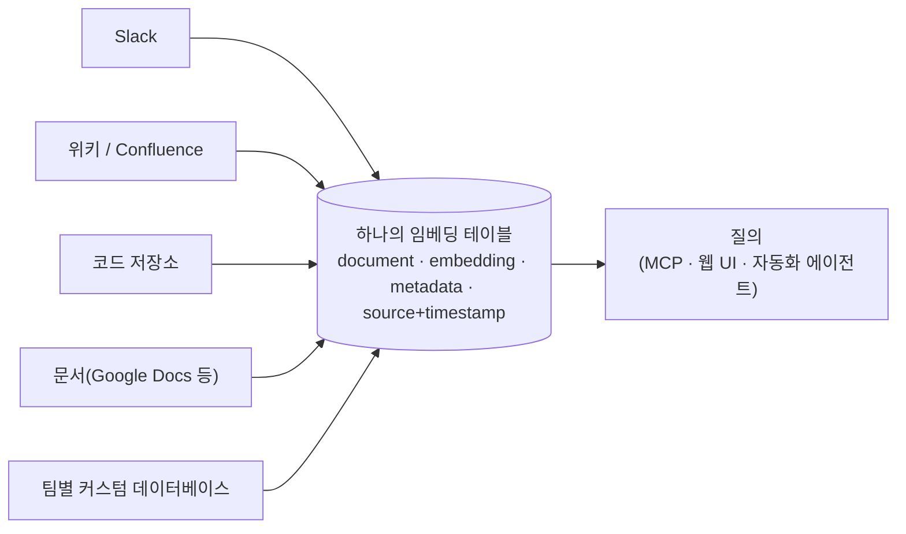
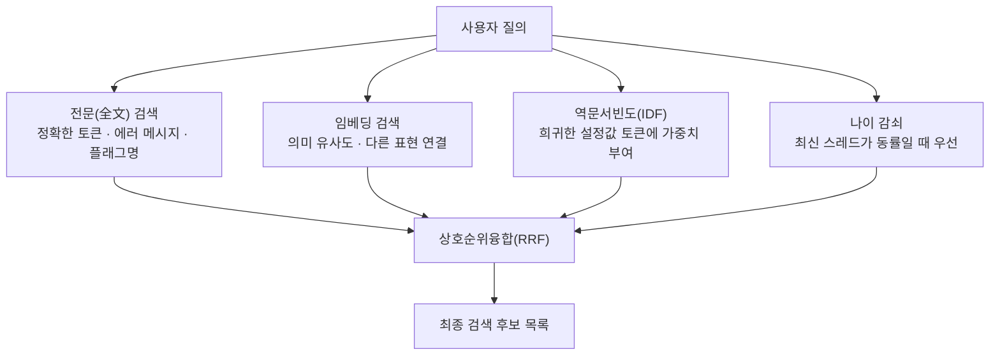
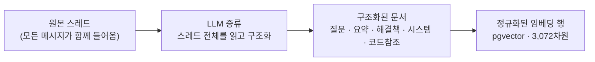
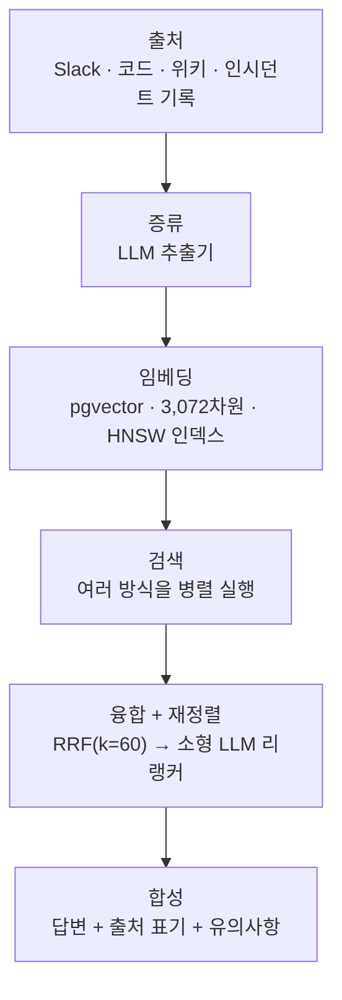
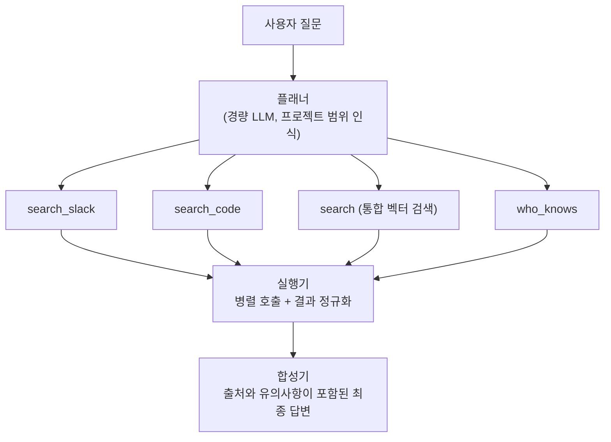
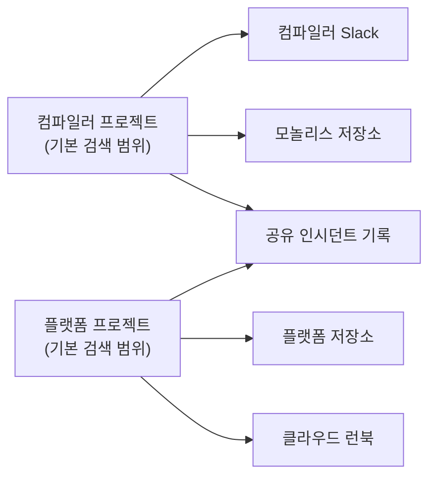
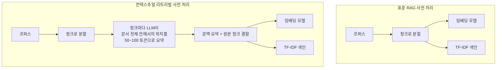

# 관련글

[**AI 경쟁의 다음 전장은 모델이 아니라 회사의 기억입니다.**](https://www.threads.com/@choi.openai/post/Da9o6Tsj2yZ)

> 이 문서는 Threads 사용자 @choi.openai가 정리한 스레드와 Cerebras Systems가 2026년 7월 중순 공개한 기술 블로그 "How We Built Our Knowledge Base"를 원 출처로 삼아, 관련 내용을 다시 검색하고 교차 검증한 뒤 재구성한 것입니다. 원문 스레드는 요약과 해석이 포함되어 있으므로, 이 문서는 가능한 한 1차 자료(Cerebras 공식 블로그, 이를 정리한 기술 매체, 각 기업의 공식 발표 자료)를 다시 확인하여 사실관계를 보강했습니다. 다만 Cerebras의 공식 블로그 페이지 자체는 작성 시점에 서버 오류로 직접 접속이 되지 않아, 해당 블로그를 상세히 요약한 두 개의 독립 매체(Mervin Praison, Dealroom)의 정리본을 교차 대조하여 인용했습니다. 특정 수치나 인용구 중 추가 검증이 어려웠던 부분은 본문에 "검증되지 않음"으로 명시했습니다.

---

## 목차

1. 들어가며 — 왜 이 이야기가 지금 중요한가
2. Cerebras Knowledge란 무엇인가
3. 설계 철학 — "데이터는 흩어져 있는 게 정상이다"
4. 통합 데이터 모델 — 하나의 임베딩 테이블
5. Slack이라는 난제 — 왜 벡터 검색만으로는 부족한가
6. 실시간 수집과 스레드 증류
7. 버스팅 — 긴 대화 속에 파묻힌 답을 찾는 법
8. 코드 저장소 임베딩 — CocoIndex와 40기가바이트의 문제
9. 질의 파이프라인 — 검색에서 답변까지
10. 두 개의 인터페이스 — MCP와 웹 UI
11. 프로젝트 단위 검색 범위 — "모든 곳에서 검색"의 한계
12. 왜 지금인가 — RAG에서 컨텍스트 엔지니어링으로
13. 시장의 검증 — 기업들은 이미 지갑을 열고 있다
14. 용어의 수렴 — 온톨로지, 지식베이스, 컴퍼니 브레인, 컨텍스트 레이어
15. LLM이 만든 위키의 구조적 약점
16. 진짜 어려운 문제 — 저장이 아니라 유지
17. 이 사례가 우리에게 주는 시사점
18. 마치며
부록 A. 용어 정리
부록 B. 참고 자료

---

## 1. 들어가며 — 왜 이 이야기가 지금 중요한가

2026년 7월 중순, 반도체 및 AI 추론 기업 Cerebras Systems는 사내에서 3개월 전부터 운영해 온 지식베이스 시스템 "Cerebras Knowledge"의 설계 과정을 상세한 기술 블로그로 공개했습니다[1][2]. 이 글은 공개 직후 여러 개발자와 인프라 스타트업 대표들 사이에서 빠르게 공유되었는데, 그 이유는 단순합니다. 지금까지 "사내 챗봇을 만들었다"는 발표는 흔했지만, 데이터 수집부터 검색 알고리즘의 세부 가중치, 코드 임베딩 갱신 전략, 프로젝트 단위 권한 분리까지 실제 프로덕션 시스템의 내부 설계를 이 정도로 투명하게 공개한 사례는 드물었기 때문입니다.

이 문서가 다루는 핵심 질문은 이렇습니다. 회사 안에 흩어진 지식 — Slack 대화, 코드 저장소, 위키 문서, 이슈 트래커 — 을 사람과 자동화 스크립트와 AI 에이전트가 동시에 신뢰할 수 있는 형태로 검색하게 만들려면 무엇이 필요한가. 그리고 왜 2026년 들어 이 문제가 갑자기 업계 전체의 화두가 되었는가. 뒤에서 살펴보겠지만, 이는 단순한 사내 도구 하나의 이야기가 아니라 검색 증강 생성(RAG)이라는 기술이 "검색해서 프롬프트에 붙이는" 단순한 패턴에서 "무엇을 언제 누구에게 보여줄지 설계하는" 컨텍스트 엔지니어링으로 넘어가는 업계 전반의 흐름과 맞닿아 있습니다.

---

## 2. Cerebras Knowledge란 무엇인가

Cerebras Knowledge는 사내 직원, 자동화 스크립트, AI 에이전트가 공통으로 사용하는 검색 증강 생성(RAG) 시스템입니다. 출시 3개월 만에 하루 1만 5천 건이 넘는 질문을 처리하며 사내에서 가장 널리 쓰이는 도구 중 하나로 자리 잡았습니다[1][2][3]. 여기서 눈여겨볼 점은 사용 주체가 사람에 국한되지 않는다는 사실입니다. 사람뿐 아니라 자동화 스크립트와 에이전트도 같은 인터페이스로 질문을 던집니다. 이는 이 시스템이 단순한 "사내용 챗GPT"가 아니라, 사람과 기계가 공유하는 조직 지식의 공통 접점으로 설계되었다는 뜻입니다.

Cerebras는 데이터센터 운영, 칩 설계, 하드웨어, 학습, 추론, 클라우드 플랫폼까지 여러 팀으로 조직이 흩어져 있고, 이 때문에 "이거 어디 있나요", "이건 누가 제일 잘 아나요", "X가 뭔가요" 같은 질문이 팀을 넘나들며 끊임없이 반복되었다고 설명합니다[2]. 새로 합류한 직원이 어느 채널과 저장소를 봐야 하는지 파악하기까지 걸리는 시간, 같은 질문에 매번 다른 사람이 답해야 하는 비효율이 이 프로젝트를 시작한 직접적인 동기였습니다.

---

## 3. 설계 철학 — "데이터는 흩어져 있는 게 정상이다"

Cerebras 팀이 세운 첫 번째 원칙은 역설적으로 "통합하지 않는다"는 것이었습니다. 많은 조직에서 분기마다 한 번씩 "모든 정보를 하나의 플랫폼에 모으자"는 제안이 나오지만, 이런 단일 진실 공급원(single source of truth) 구상은 현실에서 거의 작동하지 않는다고 이들은 판단했습니다[2].

이유는 단순합니다. 정보는 사람들이 이미 익숙하고 편한 도구에서 자연스럽게 생성됩니다. 코드 리뷰 논의는 GitHub의 풀 리퀘스트에서, 실시간 문제 해결은 Slack 스레드에서, 공식 절차는 위키 문서에서, 작업 상태는 이슈 트래커에서 각각 가장 잘 이루어집니다. GitHub에서 벌어지는 코드 리뷰 논의를 억지로 구글 문서로 옮겨 적게 한다면 오히려 팀의 작업 방식을 해치는 결과를 낳을 것입니다. 그래서 Cerebras는 데이터를 한곳으로 옮기는 대신, 각 플랫폼에 있는 데이터를 있는 그대로 추출해 오는 방식을 택했습니다. 기존 업무 습관은 거의 바꾸지 않으면서, 검색이라는 계층만 별도로 그 위에 얹은 것입니다.

이 설계는 세 개의 층으로 나뉩니다. 첫째는 수집 계층으로, Slack과 코드 저장소와 위키와 커스텀 데이터베이스에서 데이터를 끌어와 하나의 Postgres 임베딩 테이블에 적재합니다. 둘째는 질의 계층으로, 하이브리드 검색과 플래너-실행기 구조, 출처를 포함한 답변 합성을 담당합니다. 셋째는 인증과 감사 계층으로, 모든 질의에 대한 권한 확인과 로그를 남깁니다[2].

---

## 4. 통합 데이터 모델 — 하나의 임베딩 테이블

Slack 스레드든, 코드 조각이든, 위키 섹션이든, 커스텀 데이터베이스의 한 행이든, 모든 출처의 데이터는 결국 하나의 공통 스키마를 가진 임베딩 테이블에 도착합니다. 이 테이블은 문서 원문, 임베딩 벡터, 메타데이터, 출처와 타임스탬프라는 네 가지 핵심 필드로 구성됩니다. 새로운 팀이 새로운 데이터 출처를 추가하고 싶다면 커넥터 코드를 풀 리퀘스트로 제출하기만 하면 되고, 일단 테이블에 들어간 데이터는 즉시 같은 인터페이스로 검색 가능해집니다[2][3].

이 구조의 장점은 확장성에 있습니다. 출처마다 완전히 다른 검색 로직을 새로 만들 필요 없이, 스키마만 맞추면 기존 검색·랭킹·권한 파이프라인을 그대로 재사용할 수 있습니다. 실제로 자체 데이터베이스를 가진 팀은 그 데이터베이스에서 임베딩 스키마에 맞는 행을 내보내는 작은 파이썬 플러그인만 제출하면, 별도의 특별 처리 없이 Slack이나 코드 검색 결과와 나란히 노출됩니다[2].

---

## 5. Slack이라는 난제 — 왜 벡터 검색만으로는 부족한가

Cerebras가 부딪힌 가장 까다로운 문제는 벡터 임베딩 검색만으로는 Slack 데이터를 제대로 다룰 수 없다는 것이었습니다. Slack 메시지는 정보 밀도가 극단적으로 들쭉날쭉합니다. "네, 그렇게 하죠 마이크"라는 짧은 한 줄과, 커널 동작 방식을 상세히 설명하는 긴 메시지가 벡터 공간에서는 똑같이 "하나의 문서"로 취급됩니다. 게다가 코사인 유사도 계산에서는 오히려 짧고 의미 없는 메시지가 긴 설명보다 질의와 더 가깝게 나오는 경우가 잦습니다[2].

이 문제를 풀기 위해 Cerebras는 네 가지 신호를 겹쳐 사용합니다.

전문 검색은 정확한 에러 코드나 호스트명, 설정 플래그처럼 임베딩이 잘 구분하지 못하는 희귀 토큰을 잡아냅니다. 임베딩 검색은 "복원이 멈춘다"와 "체크포인트가 NFS 마운트에서 멈춘다"처럼 표현은 다르지만 의미가 같은 문장을 연결합니다. 역문서빈도는 흔한 설정 플래그 같은 희귀 토큰에 신호 가중치를 주어, "네, 감사합니다"처럼 여러 질문에 두루 걸리지만 실제로는 의미가 없는 메시지가 상위에 오르는 것을 막습니다. 나이 감쇠는 6개월 전 스레드가 이미 사라진 인프라를 설명하고 있을 가능성을 고려해, 최신 답변에 가산점을 줍니다[2]. 이 네 가지 결과는 상호순위융합(Reciprocal Rank Fusion, RRF)이라는 방식으로 하나의 순위로 합쳐집니다.

---

## 6. 실시간 수집과 스레드 증류

Cerebras는 Slack 봇을 소켓 모드(Socket Mode)로 연결해 두었습니다. 이는 주기적으로 데이터를 요청하러 가는 폴링 방식이 아니라, Slack이 이벤트를 웹소켓으로 실시간 전송하는 방식입니다. 이렇게 하면 API 호출 한도를 낭비하지 않으면서도 새 메시지가 올라오는 즉시 반영할 수 있습니다. 답글이 하나 달릴 때마다 시스템은 그 스레드의 부모 메시지와 형제 메시지 전체를 다시 가져와 하나의 행으로 저장하며, 인시던트 대응 채널처럼 활동이 잦은 채널은 더 자주 갱신되도록 채널별로 갱신 주기를 다르게 설정했습니다[2].

여기서 중요한 설계 결정 하나가 있습니다. Cerebras는 Slack 원문을 그대로 임베딩하지 않습니다. 대신 LLM이 스레드 하나를 통째로 읽고 "검색 가능한 한 줄 질문", "요약", "해결책", "관련 시스템", "코드 참조"라는 다섯 개 필드로 구조화한 뒤, 이 정규화된 문서를 임베딩합니다(3,072차원 벡터)[2][3]. Cerebras는 원문 그대로 임베딩할 때보다 이 방식이 정확도를 상당히 끌어올렸다고 보고합니다.

예를 들어 "복원이 매니페스트 로드 후 멈춘다"는 질문으로 시작해 여러 사람이 대화를 주고받다가 마지막에 "CKPT_PREFETCH=4로 설정하면 해결된다"는 결론에 도달한 스레드가 있다면, 이 전체 대화는 하나의 질문-요약-해결책 문서로 압축되어 저장됩니다. 이렇게 하면 검색 엔진이 "질문이 뭐였고 답이 뭐였는지"를 직접 이해하게 되어, 대화 중간에 있던 잡담이나 곁가지 논의에 흔들리지 않습니다.

---

## 7. 버스팅 — 긴 대화 속에 파묻힌 답을 찾는 법

스레드 전체를 하나로 압축하는 방식에는 약점이 있습니다. 아주 긴 스레드에서는 정작 중요한 답변이 스레드 요약 안에 묻혀버릴 수 있습니다. 이를 보완하기 위해 Cerebras는 "버스팅(bursting)"이라는 기법을 함께 사용합니다. 한 사람이 연속으로 남긴 메시지 묶음을 별도로 뽑아내어, 그 앞에 스레드 주제를 붙인 뒤 독립적으로 임베딩하는 방식입니다. 다만 모든 메시지 묶음을 다 뽑는 것은 아니고, 역문서빈도가 4.0 이상이거나, 묶음의 길이가 200자 이상이거나, Slack 반응(이모지)이 달렸다는 품질 기준을 통과한 묶음만 별도로 임베딩합니다[2]. 이렇게 하면 긴 논의 스레드 안에 묻힌 핵심 답변도 독립적인 검색 단위로 떠오를 수 있습니다.

---

## 8. 코드 저장소 임베딩 — CocoIndex와 40기가바이트의 문제

Cerebras는 코드를 임베딩할지 말지를 두고 오래 고민했다고 밝혔습니다. Claude Code 같은 코딩 에이전트 도구가 보편화되면서 "결국 ripgrep 같은 문자열 검색이면 충분하지 않냐"는 회의적인 시각이 있었기 때문입니다[2](원문 스레드). 최종 결론은 "둘 다"였습니다. 저장소를 직접 훑는 ripgrep 기반 검색은 임베딩 검색과 나란히 남았고, 두 방식은 서로 다른 상황에서 강점을 보입니다. 정확한 함수명이나 변수명을 찾을 때는 문자열 검색이 빠르고 정확하지만, "이 기능은 어디서 처리하지?"처럼 개념적인 질문에는 임베딩 검색이 더 유용합니다.

코드 임베딩에는 오픈소스 프레임워크인 CocoIndex를 사용합니다. 40기가바이트가 넘는 대형 저장소도 다룰 수 있으며, 파일을 언어 인식 방식으로 클래스 단위, 메서드 단위, 더 작은 블록 단위로 순차적으로 쪼개어 임베딩합니다[3]. 여기서 핵심은 증분 갱신입니다. 커밋이 하나 발생할 때마다 저장소 전체를 다시 임베딩하는 것이 아니라, 바뀐 조각만 다시 임베딩하고 그 상태를 같은 Postgres 데이터베이스에 기록합니다.

이 지점에서 Cerebras가 언급한 가장 눈에 띄는 위험 요인은, 커밋이 수백 번 쌓이는 사이 상당수의 벡터가 이미 삭제된 코드를 가리키게 되는데도 아무도 이를 알아채지 못하는 순간이라는 점입니다(원문 스레드 인용, 검증되지 않음이나 CocoIndex의 증분 갱신 구조상 충분히 개연성 있는 설명). 이는 벡터 데이터베이스를 운영해 본 사람이라면 누구나 공감할 문제로, 저장 자체보다 "저장된 것이 여전히 진실인가"를 계속 확인하는 유지보수 작업이 훨씬 어렵다는 이 시스템 전체의 핵심 교훈과 정확히 맞닿아 있습니다.

---

## 9. 질의 파이프라인 — 검색에서 답변까지

사용자가 질문을 던지면 Cerebras Knowledge는 여러 단계를 거쳐 답을 만듭니다. 먼저 여러 검색 방식이 병렬로 실행됩니다. 그 결과는 상호순위융합(RRF, k=60이라는 감쇠 상수 사용)으로 하나의 순위로 합쳐지고, 중복되는 청크는 원본 출처 단위로 다시 하나로 묶이며, 파일 하나가 상위 결과를 지나치게 많이 차지하지 못하도록 상한을 둡니다. 이렇게 다양성을 확보한 상위 20개 후보는 작은 리랭커 모델에 전달되어 0점에서 10점 사이로 재채점되고, 그중 상위 10개만 최종 후보로 남습니다[1](Cerebras 블로그 원문 인용).

순위가 확정된 뒤에는 한 가지 단계가 더 있습니다. 예를 들어 위키의 한 섹션이 매칭되었다면, 청크 분할 과정에서 잘려나간 제목이나 전제 조건, 주의사항을 놓치지 않도록 앞뒤 이웃 섹션을 함께 가져옵니다. 그 결과 사용자는 맥락이 빠진 외로운 문단 하나가 아니라, 완결된 정보 묶음을 받게 됩니다[1](Cerebras 블로그 원문 인용).

실제로 호출되는 검색 도구들은 각각 하나의 단일한 역할만 맡도록 설계되어 있습니다. 문서 요약을 담당하는 도구, 전체 소스에 걸친 통합 벡터 검색을 담당하는 도구, Slack 하이브리드 검색만 전담하는 도구, 저장소를 훑는 ripgrep 검색 도구, 최근 풀 리퀘스트를 찾는 도구, 그리고 특정 주제에 정통한 사람을 찾아주는 "who_knows" 도구가 각각 독립적으로 존재합니다[2]. 이 도구들은 의도적으로 단순하고 LLM에 의존하지 않도록 만들어져 있는데, 이는 어떤 클라이언트에서든 빠르고 저렴하게 호출할 수 있도록 하기 위해서입니다[1](Cerebras 블로그 원문 인용).

---

## 10. 두 개의 인터페이스 — MCP와 웹 UI

Cerebras Knowledge는 두 가지 방식으로 접근할 수 있으며, 이 둘은 철학이 다릅니다.

MCP 연동에서는 검색의 기본 구성 요소들을 "이 질문에 답해줘" 하나의 엔드포인트 뒤에 숨기지 않고, search_slack, search_code, search, who_knows 같은 개별 도구로 그대로 노출합니다. 이 방식에서는 Claude Code나 다른 MCP 호환 에이전트가 오케스트레이션 엔진 역할을 맡습니다. 어떤 도구를 어떤 순서로 호출하고 결과를 어떻게 조합해 최종 답변이나 코드 수정으로 이어갈지는 에이전트가 결정하며, 검색 계층 자체는 이런 LLM의 판단에 의존하지 않고도 요청을 처리할 수 있습니다[1](Cerebras 블로그 원문 인용).

반면 웹 UI에서는 같은 도구들이 존재하지만, 매 사용자 질문마다 처음부터 끝까지 실행되는 완결된 질의 파이프라인에 연결되어 있습니다. 가벼운 LLM 패스가 질문과 현재 활성화된 프로젝트를 살펴보고 어떤 검색 도구를 호출할지 결정하는 플래너 역할을 하고, 그다음 이 도구 호출들을 병렬로 실행하고 결과를 점수·최신성·출처 힌트가 포함된 공통 스키마로 정규화하는 실행기가 이어받습니다. 마지막으로 최종 LLM 패스가 이 정형화된 증거 묶음과 원래 질문을 받아 출처와 유의사항, 여러 출처를 종합한 답변을 만들어 화면에 보여줍니다[1](Cerebras 블로그 원문 인용).

사용자 입장에서 웹 UI는 그냥 "질문하면 답이 나오는" 단순한 경험이지만, 그 아래에서는 MCP 클라이언트가 명시적으로 재현할 수 있는 것과 동일한 플래너-실행기-합성기 패턴이 돌아가고 있습니다[1](Cerebras 블로그 원문 인용).

---

## 11. 프로젝트 단위 검색 범위 — "모든 곳에서 검색"의 한계

지식베이스가 커지면서 전역 검색은 점점 쓸모가 없어졌습니다. 회사가 커질수록 "모든 것을 모든 곳에서 검색"하는 방식은 오히려 관련 없는 결과에 파묻히는 결과를 낳았기 때문입니다. Cerebras는 이를 "프로젝트"라는 단위로 해결했습니다. 프로젝트는 팀별로 Slack 채널, 코드 저장소, 문서 공간을 하나로 묶은 단위입니다. 예를 들어 컴파일러 팀 프로젝트는 컴파일러 전용 Slack 채널과 모놀리스 저장소, 그리고 여러 팀이 함께 참고하는 공유 인시던트 기록을 기본 검색 범위로 갖습니다. 같은 채널이 여러 프로젝트에 동시에 속할 수도 있습니다[2].

새로 입사한 직원은 온보딩 과정에서 자신의 업무에 맞는 기본 프로젝트를 하나 선택합니다. 이 선택은 프로필에 저장되어 이후의 모든 질의 범위를 자동으로 좁혀줍니다. 그 결과 신입 직원은 어느 채널과 저장소가 중요한지 스스로 배우기도 전에, 바로 신호 대비 잡음 비율이 높은 답을 얻을 수 있습니다.

---

## 12. 왜 지금인가 — RAG에서 컨텍스트 엔지니어링으로

Cerebras의 사례가 단순한 사내 도구 하나의 성공기를 넘어 업계 전체의 관심을 끈 배경에는 검색 증강 생성이라는 기술 자체의 무게중심 이동이 있습니다. 기존의 RAG는 "질문과 관련된 문서를 찾아서 프롬프트에 붙인다"는 비교적 단순한 패턴이었습니다. 그러나 에이전트가 스스로 여러 단계를 거쳐 작업을 수행하는 시대가 되면서, 무엇을 언제 어떤 형태로 모델에 보여줄지를 설계하는 일 — 검색뿐 아니라 메모리, 도구, 상태, 권한까지 아우르는 "컨텍스트 엔지니어링" — 이 훨씬 중요한 설계 영역으로 떠올랐습니다.

이유는 명확합니다. 에이전트가 작업을 반복하는 구조에서는 검색이 한 번 어긋나면 에이전트가 같은 정보를 다시 찾기 위해 추론을 한 바퀴 더 돌게 되고, 이는 곧바로 시간과 비용의 손실로 이어집니다. 검색 정확도가 품질의 문제일 뿐 아니라 직접적인 비용의 문제가 되는 것입니다.

이 흐름을 가장 구체적으로 보여주는 사례가 Anthropic이 2024년 9월 공개하고 2026년 현재까지도 업계에서 자주 인용되는 "컨텍스추얼 리트리벌(Contextual Retrieval)" 기법입니다[9]. 표준적인 RAG 사전 처리에서는 문서를 청크로 쪼갠 뒤 그대로 임베딩 모델과 TF-IDF 색인에 넣습니다. 이 경우 청크 하나만 떼어놓고 보면 "이 회사의 매출은 지난 분기 대비 3퍼센트 늘었다"는 문장이 어느 회사, 어느 분기 이야기인지 알 수 없는 문제가 자주 발생합니다. 앞뒤 맥락이 청크 분할 과정에서 잘려나갔기 때문입니다.

Anthropic의 실험 결과를 보면 이 차이가 실제로 얼마나 큰지 드러납니다. 표준 임베딩 검색의 상위 20개 청크 기준 검색 실패율은 5.7퍼센트였는데, 여기에 컨텍스추얼 임베딩만 적용하면 3.7퍼센트로(35퍼센트 개선), 컨텍스추얼 임베딩과 컨텍스추얼 BM25를 함께 적용하면 2.9퍼센트로(49퍼센트 개선), 마지막으로 리랭킹까지 추가하면 1.9퍼센트로(67퍼센트 개선) 낮아졌습니다[9].

| 구성 | 검색 실패율 | 기준 대비 개선폭 |
|---|---|---|
| 표준 임베딩 검색 | 5.7% | — |
| 컨텍스추얼 임베딩 | 3.7% | 35% 감소 |
| 컨텍스추얼 임베딩 + 컨텍스추얼 BM25 | 2.9% | 49% 감소 |
| 위 구성 + 리랭킹 | 1.9% | 67% 감소 |

Cerebras가 Slack 스레드를 원문 그대로 임베딩하지 않고 LLM으로 "이 스레드가 무엇에 관한 것인지"를 먼저 증류한 뒤 임베딩하는 방식은, 이 컨텍스추얼 리트리벌과 근본적으로 같은 문제의식에서 나온 설계라고 볼 수 있습니다. 청크(혹은 스레드) 하나만 떼어놓고는 알 수 없는 맥락을, 검색되기 전에 미리 채워 넣는다는 점에서 두 접근은 같은 원리를 공유합니다.

기업들의 실제 투자 움직임도 이 흐름을 뒷받침합니다. VentureBeat가 2026년 1분기 동안 매달 진행한 설문에 따르면, 하이브리드 검색을 도입하겠다는 기업의 응답 비율은 1월 10.3퍼센트에서 3월 33.3퍼센트로 한 분기 만에 세 배 넘게 뛰었습니다. 같은 기간 투자 우선순위 조사에서는 평가·연관성 테스트에 대한 투자 의향이 1월 32.8퍼센트에서 3월 15.6퍼센트로 줄어든 반면, 검색 최적화에 대한 투자 의향은 1월 19.0퍼센트에서 3월 28.9퍼센트로 늘어나면서 처음으로 평가 관련 투자를 앞질렀습니다[10]. 다만 이 조사는 매달 45~58개 기업을 대상으로 한 표본 조사이므로, 절대적인 수치보다는 방향성을 보여주는 자료로 해석하는 것이 적절합니다.

한 가지 덧붙이자면, 원문 스레드에는 "엔비디아가 임베딩 모델을 내놓으며 '가장 싼 토큰은 아예 만들지 않는 토큰이다'라고 말했다"는 내용이 있었습니다. 이 문구가 실제로 엔비디아의 공식 발표에서 나온 것인지는 여러 차례 검색했으나 명확히 확인하지 못했습니다. 따라서 이 인용구는 검증되지 않은 내용으로 표시해 둡니다. 다만 "검색 실패는 곧 재추론 비용"이라는 그 취지 자체는 위에서 살펴본 검색 실패율 통계나 기업들의 투자 우선순위 변화와 방향이 일치합니다.

---

## 13. 시장의 검증 — 기업들은 이미 지갑을 열고 있다

이 흐름에 가장 큰 규모로 베팅한 곳은 상업용 기업 검색 플랫폼 Glean입니다. Glean은 2025년 6월 웰링턴 매니지먼트가 주도한 1억 5천만 달러 규모의 시리즈 F 투자를 유치하며 기업가치 72억 달러를 인정받았습니다[4][5]. 이 회사는 2019년 창업 이후 여섯 차례에 걸쳐 총 7억 6천5백만 달러를 조달했습니다[8].

매출 성장세는 더욱 가파릅니다. Glean은 2025년 초 연간반복매출(ARR) 1억 달러를 넘어선 뒤, 2025년 말 2억 8백만 달러, 그리고 2026년 5월 말 3억 달러를 돌파했습니다. 이는 전년 동기 대비 약 89퍼센트 성장한 수치이자, 15개월 만에 매출이 세 배로 뛴 것입니다[6][7]. Glean은 스스로를 "조직 지능을 위한 컨텍스트 시스템"이라 부르며, 자사 플랫폼을 통한 에이전트 실행 건수가 연간 1억 건을 넘어섰다고 밝혔습니다[4].

시장 조사 기관들이 집계하는 인접 시장의 규모는 조사 기관과 정의에 따라 상당히 차이가 큽니다. 예를 들어 기업 검색(enterprise search) 시장만 놓고 보면 2025년 기준 약 68억 달러 규모로 추산한 자료가 있고, 2030년까지 111억 5천만 달러로 성장할 것이라는 전망이 있습니다[11]. 반면 더 넓은 범주인 "AI 지식관리(AI knowledge management)" 시장은 조사 기관에 따라 2026년 기준 약 77억 달러에서 184억 달러까지 편차가 크게 나타났습니다. 이는 어느 기관도 틀렸다기보다, "AI 지식관리"라는 범주 자체를 어디까지 포함시키느냐에 대한 정의가 아직 업계 전반에서 통일되어 있지 않기 때문으로 보입니다. 따라서 이 영역의 시장 규모를 인용할 때는 특정 숫자 하나를 단정적으로 받아들이기보다, 여러 조사 기관이 공통적으로 확인하는 방향성 — 빠른 성장, 그리고 RAG와 하이브리드 검색이 핵심 성장 동력이라는 점 — 에 무게를 두는 편이 안전합니다.

이 "컨텍스트 레이어"를 다른 회사가 바로 가져다 쓸 수 있는 형태로 판매하는 스타트업들도 등장했습니다. 기업용 통합 API 플랫폼 Merge는 자사 최고기술책임자 길 페이그(Gil Feig)의 글을 통해, 진짜 의미 있는 컨텍스트 그래프란 한 번 그려두는 다이어그램이 아니라 요청이 들어올 때마다 어떤 시스템에 접속할지, API를 호출할지 캐시된 데이터를 쓸지, 호출자가 그 결과를 볼 권한이 있는지, 결과를 어떻게 모델이 쓸 수 있는 형태로 엮어낼지를 실시간으로 결정하는 런타임 시스템이라고 설명합니다[13]. 이 관점은 Cerebras가 실제로 구현한 플래너-실행기-합성기 구조와 정확히 맞아떨어집니다. 이 밖에 Hyperspell 같은 스타트업도 "회사가 스스로 컴퍼니 브레인을 만들 수 있는 인프라"를 표방하며 유사한 방향으로 움직이고 있습니다.

---

## 14. 용어의 수렴 — 온톨로지, 지식베이스, 컴퍼니 브레인, 컨텍스트 레이어

흥미로운 점은 업계에서 이 개념을 부르는 이름이 여러 갈래로 나뉘어 있다가 점차 하나로 수렴하고 있다는 사실입니다. Cerebras의 글이 공유된 이후, Vercel의 개발자 드류 브레드빅(Drew Bredvick)은 자신의 게시물에서 온톨로지, 지식베이스, 컴퍼니 브레인이 결국 같은 대상을 가리키는 다른 이름일 뿐이라고 정리했습니다[3]. 앞서 살펴본 Merge의 길 페이그 역시 컨텍스트 레이어, 컨텍스트 그래프, 컴퍼니 브레인이라는 표현을 사실상 같은 개념으로 사용합니다[13].

한편 문서 검색 프레임워크 LlamaIndex의 창업자 제리 리우(Jerry Liu)는 한 팟캐스트에서 "AI 프레임워크의 시대는 끝났다, 이제 중요한 것은 컨텍스트라는 해자다(The AI Framework Era Is Over: Why Context Is the Moat)"라는 제목으로 자신의 견해를 밝혔습니다[12]. 정형화된 스캐폴딩(뼈대 코드)을 만드는 경쟁은 이제 큰 의미가 없고, 진짜 경쟁 우위는 각 조직이 가진 고유한 컨텍스트를 얼마나 잘 정리하고 실시간으로 제공할 수 있느냐에 달려 있다는 취지입니다. 이는 이 문서가 다루는 여러 사례 — Cerebras의 사내 지식베이스, Glean의 기업 검색 플랫폼, Merge의 컨텍스트 그래프 — 를 관통하는 하나의 공통된 시대 인식이라 할 수 있습니다.

---

## 15. LLM이 만든 위키의 구조적 약점

원문 스레드는 LLM이 자동으로 만들어내는 위키 형태의 지식 정리 방식에 다섯 가지 구조적 약점이 있다고 지적합니다. 첫째는 출처가 없어 검증이 불가능하다는 점, 둘째는 스키마가 없어 구조를 갖추기 어렵다는 점, 셋째는 서로 모순되는 내용이 쌓여도 스스로 이를 잡아내지 못한다는 점, 넷째는 한 번 생성된 이후 최신성이 정지된다는 점, 다섯째는 "모른다"는 상태를 표현할 방법이 없다는 점입니다. 이 다섯 가지 항목 자체는 별도의 공식 발표문이나 논문에서 유래한 것이라기보다, 원문 게시자가 이 논의를 정리하며 제시한 프레임으로 보이며 독립적으로 확인하지는 못했습니다. 다만 이 지적들이 지금까지 살펴본 Cerebras의 설계와 정확히 대응된다는 점은 짚어둘 만합니다.

Cerebras가 모든 검색 결과에 출처와 타임스탬프를 남기는 것은 첫 번째 약점(출처 부재)에 대한 대응이고, 통합 임베딩 테이블에 문서·요약·시스템·코드참조라는 공통 필드를 강제한 것은 두 번째 약점(스키마 부재)에 대한 대응이며, 나이 감쇠로 오래된 답변의 가중치를 낮추는 것은 네 번째 약점(최신성 정지)에 대한 대응입니다. 세 번째(모순 자동 감지)와 다섯 번째(모른다는 표현) 문제는 상대적으로 덜 다루어졌는데, 이는 현재 이 분야 전체가 아직 완전히 풀지 못한 과제로 보입니다.

이런 맥락에서 원문 스레드가 요약한 2026년 현재의 업계 정설은, LLM이 후보 지식을 제안하고, 별도의 검증 층이 이를 걸러내며, 최종적으로 신뢰도가 낮은 꼬리 부분은 사람이 직접 처리하는 통제된 파이프라인입니다. 다시 말해, LLM 혼자서 처음부터 끝까지 지식을 정리하고 유지하도록 맡기는 것이 아니라, 제안-검증-예외처리를 분리된 단계로 설계하는 방향이 현재 가장 널리 받아들여지는 접근이라는 뜻입니다.

---

## 16. 진짜 어려운 문제 — 저장이 아니라 유지

이 문서 전체를 관통하는 가장 중요한 통찰은 아마 이것일 것입니다. 전통적인 위키는 "쓰인 날의 진실"을 저장합니다. 누군가 2023년에 작성한 문서는 2023년 시점의 사실을 담고 있고, 그 이후 바뀐 내용은 별도로 누군가 수정하지 않는 한 반영되지 않습니다. 반면 컴퍼니 브레인은 "지금의 진실"을 계속 갱신해야 합니다. 이 차이가 두 시스템을 근본적으로 다른 종류의 유지보수 문제로 만듭니다.

Cerebras는 Slack의 답변에 유효기간이 있다고 명시적으로 전제합니다. 6개월 전 스레드는 이제 존재하지 않는 인프라를 설명하고 있을 수 있고, 이 때문에 나이 감쇠 메커니즘으로 새 답변에 자연스럽게 가중치를 더 줍니다. 저장할 때도 원문을 그대로 넣는 대신 질문 한 줄과 요약, 해결책, 관련 시스템으로 정규화하여 임베딩하는 것도 결국 같은 문제의식의 연장선입니다. 코드의 경우도 마찬가지입니다. 40기가바이트가 넘는 저장소에서 커밋마다 바뀐 조각만 다시 임베딩하는 증분 갱신 방식을 쓰지만, 커밋이 수백 번 쌓이는 사이 상당수 벡터가 이미 삭제된 코드를 가리키게 되는 순간이 가장 눈에 띄지 않는 위험 요인으로 지적됩니다.

이 문제는 벡터 데이터베이스나 임베딩 검색을 실제로 운영해 본 사람이라면 낯설지 않을 것입니다. 시스템을 처음 구축하는 일보다, 시간이 지나며 조용히 낡아가는 지식을 계속 걸러내고 갱신하는 일이 훨씬 어렵고 지속적인 노력을 요구합니다. Cerebras의 결론은 명확합니다. 컴퍼니 브레인은 한 번 만들어두면 끝나는 저장고가 아니라, 계속 손을 대야 살아있는 유지 시스템으로 봐야 한다는 것입니다.

---

## 17. 이 사례가 우리에게 주는 시사점

이 사례를 한국 조직의 맥락에서 곱씹어 볼 필요가 있습니다. 국내에서 흔히 관찰되는 "각자도생 AI" 패턴 — 팀마다 서로 다른 AI 도구를 개별적으로 도입하면서 조직 차원의 지식 축적이 흩어지는 현상 — 은 Cerebras가 첫 번째 원칙으로 못 박은 "데이터는 흩어져 있는 게 정상"이라는 전제와 언뜻 비슷해 보이지만 실은 다른 문제입니다. Cerebras의 설계는 데이터가 흩어진 채로 있어도 되지만 검색 계층만큼은 반드시 통합되어야 한다는 것이었습니다. 반면 각자도생 AI는 데이터도 검색도 도구도 팀마다 따로 노는 상태를 가리킵니다. 즉 Cerebras 사례가 실제로 보여주는 것은 "통합하지 말라"는 조언이 아니라, "데이터의 물리적 위치는 그대로 두되 그 위에 얹는 검색·권한·최신성 관리 계층만은 하나로 통일하라"는 훨씬 정교한 조언입니다.

또한 "AI 미결 증후군" — AI가 생성한 초안은 넘쳐나지만 이를 마무리 짓고 책임지는 구조가 없어 방치되는 현상 — 의 관점에서 보면, 이 사례에서 배울 만한 부분은 신뢰도가 낮은 정보를 어떻게 걸러내고 사람이 확인해야 할 지점을 어떻게 표시하느냐에 있습니다. Cerebras가 리랭커로 상위 후보를 다시 채점하고, 컨텍스트 확장으로 잘려나간 전제 조건을 다시 채워 넣는 것은 결국 "이 정보를 얼마나 믿을 수 있는가"를 구조적으로 계속 검증하는 장치입니다. AI가 만든 초안이 쌓이기만 하고 아무도 검증하지 않는 구조와, Cerebras처럼 제안-검증-예외처리가 파이프라인으로 분리된 구조 사이의 차이는 결국 이 검증 계층을 시스템 설계 단계에서부터 명시적으로 만들어 두었는가에 달려 있습니다.

마지막으로 하네스 엔지니어링과 루프 엔지니어링이라는 관점에서 보면, Cerebras의 MCP 도구 설계 — 검색 기본 요소를 LLM에 의존하지 않는 단순하고 안정적인 도구로 쪼개어 노출하고, 오케스트레이션은 에이전트에게 맡기는 방식 — 는 에이전트 성능의 병목이 모델 자체보다 인터페이스 설계에 있다는 그간의 여러 연구 결과와 정확히 같은 방향을 가리킵니다. 검색 계층을 LLM 판단에 의존하지 않는 순수한 검색 기본 요소로 유지한 것은, 에이전트 하네스가 복잡해질수록 오히려 그 아래 단의 도구는 예측 가능하고 단순하게 유지해야 전체 시스템이 안정적으로 작동한다는 원칙을 잘 보여주는 실제 사례입니다.

---

## 18. 마치며

원문 스레드는 마지막으로 다음과 같은 질문을 던집니다. 당신의 조직이 가진 지식은 흩어진 채로도 검색 가능한 상태인가, 아니면 한곳에 모으려다 오히려 다시 낡아가고 있는가.

이 문서에서 살펴본 Cerebras의 사례가 주는 답은 명확합니다. 지식을 한곳에 모으는 것 자체는 목표가 될 수 없습니다. 데이터는 원래 있던 자리에 그대로 두어도 괜찮습니다. 대신 그 위에 얹는 검색과 권한과 최신성 관리라는 계층을 얼마나 정교하게 설계하느냐, 그리고 그 계층을 시간이 지나도 계속 손보며 살아있게 유지할 수 있느냐가 진짜 승부처입니다. 컴퍼니 브레인을 처음 만드는 것은 상대적으로 쉬운 일입니다. 어려운 것은 그것을 계속 살아있게 만드는 일입니다.

---

## 부록 A. 용어 정리

**RAG(검색 증강 생성, Retrieval-Augmented Generation)**: 언어모델이 답을 생성하기 전에 관련 문서를 먼저 검색해 그 내용을 참고하도록 하는 기법. 모델이 학습하지 않은 최신 정보나 사내 정보를 다룰 때 널리 쓰인다.

**임베딩(embedding)**: 텍스트를 의미를 반영한 숫자 벡터로 변환한 것. 의미가 비슷한 문장은 벡터 공간에서도 가까운 위치에 놓이므로, 벡터 간 거리를 계산해 의미적으로 유사한 문서를 찾을 수 있다.

**벡터 데이터베이스**: 임베딩 벡터를 대량으로 저장하고 유사도 검색을 빠르게 수행하도록 설계된 데이터베이스. 이 문서에서 다룬 pgvector는 일반적인 관계형 데이터베이스인 Postgres에 벡터 검색 기능을 추가한 확장 기능이다.

**HNSW(Hierarchical Navigable Small World)**: 대규모 벡터 집합에서 근사 최근접 이웃을 빠르게 찾기 위한 그래프 기반 인덱싱 기법. 벡터들을 여러 층으로 된 그래프로 연결해 두고, 위쪽 층에서 대략적인 위치를 빠르게 좁힌 뒤 아래쪽 층으로 내려가며 정밀하게 탐색하는 방식으로 작동한다.

**BM25 / TF-IDF**: 특정 단어가 문서에서 얼마나 자주 등장하는지, 그리고 그 단어가 전체 문서 집합에서 얼마나 희귀한지를 계산해 문서의 관련성을 매기는 전통적인 키워드 검색 기법. 임베딩 검색과 달리 정확한 단어 일치에 강하다.

**상호순위융합(RRF, Reciprocal Rank Fusion)**: 서로 다른 검색 방식이 각각 매긴 순위를 하나의 통합 순위로 합치는 기법. 특정 문서가 여러 검색 방식에서 공통으로 상위에 오를수록 최종 점수가 높아지도록 설계되어 있다.

**리랭커(reranker)**: 1차로 추려낸 검색 후보들을 원래 질문과 다시 비교해 더 정밀하게 순위를 재조정하는 작은 모델. 1차 검색이 놓칠 수 있는 미묘한 관련성을 잡아낸다.

**MCP(Model Context Protocol)**: AI 모델이 외부 도구나 데이터 소스에 표준화된 방식으로 접근할 수 있도록 하는 프로토콜. 이 문서에서는 Cerebras Knowledge의 검색 기능을 Claude Code 같은 외부 에이전트가 직접 호출할 수 있도록 노출하는 통로로 쓰였다.

**컨텍스트 엔지니어링(context engineering)**: 언어모델에게 무엇을, 언제, 어떤 형태로 보여줄지를 설계하는 작업 전반을 가리키는 개념. 단순 검색뿐 아니라 메모리 관리, 도구 노출, 상태 관리, 권한 처리까지 포괄한다.

---

## 부록 B. 참고 자료

[1] Cerebras Systems, "How We Built Our Knowledge Base," cerebras.ai/blog/how-we-built-our-knowledge-base (2026년 7월, 사용자가 직접 인용한 본문 및 재검색 결과 기준. 문서 작성 시점에 원문 페이지 직접 접속은 서버 오류로 실패하여 [2][3]의 재정리본으로 교차 확인)

[2] Mervin Praison, "How Cerebras Built a 15K-Query/Day Internal Knowledge Base," mer.vin, 2026년 7월 17일

[3] Dealroom.co, "Inside Cerebras Knowledge: how Cerebras built its enterprise knowledge base," app.dealroom.co

[4] Glean, "Glean Raises $150M Series F at $7.2B Valuation," glean.com/press, 2025년 6월 10일

[5] TechCrunch, "Enterprise AI startup Glean lands a $7.2B valuation," 2025년 6월 10일

[6] TechCrunch, "Glean's top line crosses $300M as AI budget cutting becomes its major selling point," 2026년 5월 28일

[7] Sacra, "Glean revenue, funding & news," sacra.com/c/glean

[8] Tracxn, "Glean — 2026 Funding Rounds & List of Investors," tracxn.com

[9] Anthropic, "Introducing Contextual Retrieval," anthropic.com/engineering/contextual-retrieval, 2024년 9월(2026년 현재까지 지속적으로 인용되는 원본 벤치마크)

[10] VentureBeat, "The retrieval rebuild: why hybrid retrieval intent tripled as enterprise RAG programs hit the scale wall," 2026년 5월 18일

[11] Mordor Intelligence / Conductor, "State of Enterprise Search 2026," 시장 규모 추정치(2025년 68.3억 달러 → 2030년 111.5억 달러 전망)

[12] Jerry Liu(LlamaIndex), "The AI Framework Era Is Over: Why Context Is the Moat," Chain of Thought 팟캐스트

[13] Gil Feig(Merge), "What everyone is getting wrong about context graphs," merge.dev/blog

[14] Threads, @choi.openai, 2026년 7월(이 문서의 1차 출발점이 된 원문 스레드)
