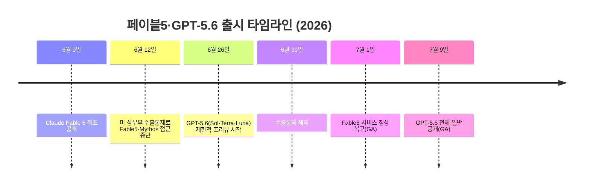
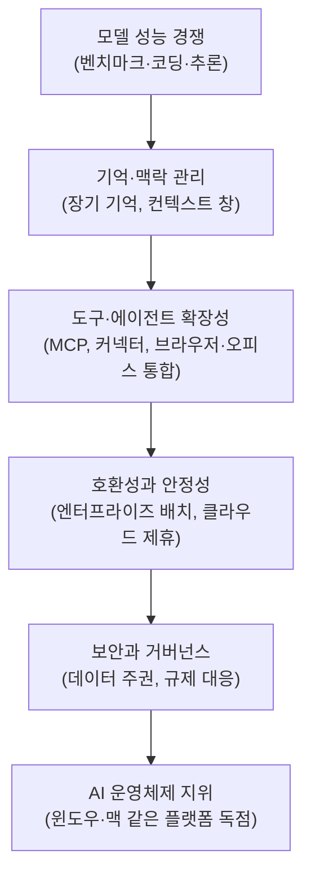
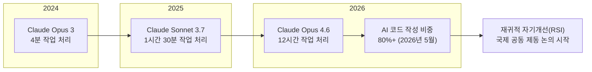

> 
> [**페이블5와 지피티5.6을 바라보며.**](https://www.facebook.com/share/p/192Nid8R7D/)
> 
> 최고 성능의 모델이라지만, 그 정체는 결국 수학과 코딩 특화의 브레이크 없는 슈퍼카들의 레이싱을 보는 느낌이다. 수익성은 없고, 결국 서로를 모방하며 기묘한 성능 평준화를 시키고 있고, 주변 생태계가 무너지는것을 더 이상 신경쓰지 않으며 마치 대기업이 골목 슈퍼마켓 상권까지 잡아먹으려 하는 모양새로 할 수 있는 모든 것을 자체 서비스로 업데이트 중이다. 큰 흐름은 돈만 구할 수 있다면 정경유착도 가능하다는 방향.
> 
> 기억과 맥락, 도구 사용의 확장성, 호환성, 안정성, 그리고 보안, 마지막으로 거버넌스에 대한 필연으로 모델의 성능을 지나 운영체제의 독과점을 지향하고 있다. 불패의 성과 같은 윈도우즈와 맥 위에 AI OS 자리를 누가 차지할것인가의 싸움.
> 
> 그러나 AI의 특성상 점점 로컬 AI OS 를 지향하는것은 필연이 되어가고 있다. 시장의 많은 소비자들은 대형 모델의 끝 없는 발전 속도 보다 지금 내 현실에 직접적인 도움이 되는 AI에 정착하거나, 그것을 개별적으로 시스템화 시키고 구축하는 진짜 네이티브와 트랜스포메이션에 자연스럽게 합류하는 중.
> 
> AI가 차세대 AI를 만들고 있다는 현실은 인간이 거기서 어떤 기준으로 무엇을 통제하고 속도를 제어해야 하는가에 대한 질문을 더 깊게 하도록 만든다. 더 비싸고 파괴력 강한 무기를 가진쪽이 승자가 아니라 무기를 다루는 활용능력의 실전성이 더 중요하다는게 러우전쟁의 상황에만 존재하는 것은 아니다.
> 
> 하고싶은 말은...
> 
> AI 모델의 발전은 그 뛰어난 모델이 이끄는대로 끌려다니는 그룹과, 그 뛰어남이 가진 건방진 폭주를 잘 제어하는 그룹과, 가장 통제하기 쉬운 수준의 모델로 더 뛰어난 성과를 내는 그룹... 그리고 그 어디에도 포함되지 않는 그룹으로 사용자들을 나뉘게 하고 있다는 것.
> 
> 현재까지 진행되어온 대기업들의 독주는 이제 거의 끝지점에 도달한 상황이라고 생각한다. 이것이 LLM 기반 성능 지향의 한계점이고.
> 
> 공부하고, 연구하고, 뭔가를 해 볼수록 
> 이 분야에 대해 어떤면에서는 덧없음을 많이 느끼게 된다.
> 
> 마치 몇 백년 역사의 압축판을 짧은 시간내에 경험하는 느낌이랄까?
> 
> 한치의 오차도 없이 똑같은 흐름이다.
> 
> 그냥 결국 계급놀이.
> 
> 다만 한가지 분명한 차이점은, 그 계급놀이가 이제 소수의 주도만으로 이루어지는건 어렵게 되었다는 것. 
> 
> 아이러니하게도 국경 없이 어디든 다닐 수 있게 되었지만, 또 한편으로 바라보면, 세상이 다시 작은 공동체 중심이 되어가는 모양새니까.
> 
> 뭔말이래... ^^
> 

## 이 문서에 대하여

이 문서는 페이스북에 게시된 한 편의 짧은 단상(斷想)을 항목별로 풀어 설명한 것이다. 원문은 2026년 7월 현재 동시에 시장에 나와 있는 두 개의 최상위 AI 모델, 즉 앤스로픽의 Claude Fable 5와 오픈AI의 GPT-5.6 Sol을 소재로 삼아, 모델 성능 경쟁의 이면에 있는 산업 구조, AI 운영체제화 경쟁, 로컬 AI로의 회귀, 그리고 AI가 AI를 만드는 시대의 통제 문제까지 네 가지 논점을 제시하고, 마지막으로 이 모든 흐름을 인간 사회의 오래된 패턴과 겹쳐 보는 개인적 성찰로 마무리하는 글이다. 아래에서는 각 논점이 가리키는 구체적인 배경 사실을 최신 자료로 확인하면서 하나씩 풀어본다.

---

## 1. 배경: 왜 하필 지금 페이블5와 GPT-5.6인가

원문의 출발점을 이해하려면 먼저 두 모델이 어떤 상황에서 나왔는지를 짚어야 한다. 이 시기는 두 회사가 거의 동시에 신형 모델을 내놓으면서 미국 정부의 수출 통제까지 얽혀 들어간, AI 업계에서도 이례적으로 어수선한 시기였다.

Claude Fable 5는 2026년 6월 9일 공개되었다. 그런데 사흘 뒤인 6월 12일, 미국 상무부의 수출 통제 조치로 접근이 일시 중단되었고, 이 조치는 6월 30일 해제되어 앤스로픽이 7월 1일 서비스를 복구했다. 거의 같은 시기 오픈AI도 비슷한 처지에 놓였는데, GPT-5.6 계열(플래그십 Sol, 중간 등급 Terra, 경량 Luna)은 트럼프 행정부의 요청에 따라 6월 26일 "신뢰할 수 있는 소수 파트너"에게만 공개하는 제한적 프리뷰로 먼저 나왔고, 이후 7월 9일이 되어서야 일반 공개(GA)로 전환되었다. 결과적으로 두 회사의 최상위 모델이 정부발 접근 제한이라는 동일한 진통을 겪은 뒤 거의 같은 시점에 나란히 세상에 풀려난 셈이다. 원문이 "레이싱"이라는 표현을 쓴 것은 단순한 비유가 아니라, 실제로 두 모델이 같은 시간대에 출시 일정과 벤치마크 우위를 놓고 다투는 모습을 정확히 짚은 것이다.

---

## 2. 첫 번째 논점 — "브레이크 없는 슈퍼카 레이싱"

원문은 두 모델의 경쟁을 두고 "수학과 코딩 특화의 브레이크 없는 슈퍼카들의 레이싱"이라고 표현했다. 실제 벤치마크를 놓고 보면 이 비유는 상당히 정확하다. GPT-5.6 Sol은 커맨드라인 에이전트 코딩 능력을 재는 Terminal-Bench 2.1에서 기본 모드 88.8%, 고성능 울트라 모드에서는 91.9%를 기록해 이 지표에서는 최상위권에 올랐다. 반면 Claude Fable 5는 소프트웨어 엔지니어링 벤치마크인 SWE-bench Pro에서 80% 안팎의 점수로 GPT-5.6 Sol의 추정치보다 15%포인트가량 앞서는 것으로 여러 독립 비교 사이트에서 공통적으로 보고되었다. 독립 평가기관인 Artificial Analysis의 종합 지능 지수에서도 Fable 5가 60점, Sol이 59점으로 근소하게 앞선다는 집계가 있다. 즉 어느 한쪽이 일방적으로 압도하는 구도가 아니라, 벤치마크 종류에 따라 승자가 엇갈리는 "국지전"의 연속이라는 뜻이다. 가격 면에서는 GPT-5.6 Sol이 입력 100만 토큰당 5달러, 출력 30달러로, Fable 5의 입력 10달러·출력 50달러보다 절반 수준이어서, 오픈AI는 성능 대신 가격 경쟁력을 앞세우는 모양새다.

원문이 지적한 "수익성은 없고 서로를 모방하며 평준화된다"는 대목은 실제 재무 데이터로 보면 다소 결이 다르게 나타난다는 점을 짚어둘 필요가 있다. 오픈AI는 2026년 한 해 전체로 약 140억 달러의 손실을 예상하고 있으며, 1분기 조정영업이익률이 매출 1달러당 1.22달러의 손실을 내는 마이너스 122% 수준으로 보도되었다. 반면 앤스로픽은 2026년 2분기(4~6월) 잠정 매출이 109억 달러에 달할 것으로 알려졌고, 같은 분기 약 5억 5,900만 달러의 영업이익을 내며 창사 이래 첫 분기 흑자 전환을 눈앞에 둔 것으로 파이낸셜타임스 등이 보도했다. 다시 말해 "업계 전체가 수익성이 없다"는 진단은 오픈AI에는 정확히 들어맞지만, 앤스로픽에는 최근 들어 오히려 반대 방향으로 흐름이 바뀌고 있다. 다만 두 회사 모두 지금의 매출 성장이 막대한 학습·추론 비용을 계속 밀어붙이며 얻어낸 결과라는 점에서, "브레이크 없이 질주한다"는 원문의 정서적 진단 자체는 여전히 유효하다고 볼 수 있다.

"주변 생태계를 잡아먹는 대기업"이라는 표현도 근거가 있다. 오픈AI는 2024년부터 2026년 사이 코딩 IDE 스타트업 윈드서프(Windsurf)를 30억 달러에 인수했고, 자체 브라우저·데스크톱 앱을 ChatGPT·Codex와 통합한 "슈퍼앱" 전략을 발표했으며, 컨설팅형 배치 조직인 Deployment Company를 세워 개별 기업에 엔지니어를 직접 투입하는 방식으로 영역을 넓히고 있다. 앤스로픽 역시 인수합병 대신 자체 개발로 개발자 생태계의 표준을 만들어가는 전략을 택했는데, Claude Code가 터미널 기반 코딩의 사실상 표준이 되면서 마이크로소프트와 구글이 뒤늦게 자체 코딩 도구로 맞서는 형국이 되었다. 블랙스톤, 헬먼앤프리드먼, 골드만삭스 얼터너티브 등 사모펀드와의 제휴를 통해 포트폴리오 기업 전체에 Claude를 심는 방식도 병행하고 있다. 두 회사 모두 "모델을 파는 소프트웨어 기업"에서 "기업의 구매·운영·인력 배치까지 관통하는 인프라 레이어"로 스스로를 재정의하고 있다는 평가가 나오는데, 이는 원문이 말한 "골목 슈퍼마켓 상권까지 잡아먹는 대기업"이라는 은유와 상당히 겹친다.

| 구분 | Claude Fable 5 | GPT-5.6 Sol |
|---|---|---|
| 공개일 | 2026년 6월 9일(수출통제로 6.12~6.30 중단, 7.1 복구) | 6월 26일 제한 프리뷰 → 7월 9일 정식 GA |
| 대표 코딩 벤치마크 | SWE-bench Pro 약 80% | Terminal-Bench 2.1 88.8%(울트라 91.9%) |
| 가격(100만 토큰) | 입력 $10 / 출력 $50 | 입력 $5 / 출력 $30 |
| 컨텍스트 창 | 약 100만 토큰 | 약 105만 토큰(27.2만 토큰 초과 시 요율 인상) |
| 2026년 재무 흐름 | 2분기 첫 분기 흑자 전환 전망(매출 109억 달러) | 연간 약 140억 달러 손실 전망 |

---

## 3. 두 번째 논점 — AI 운영체제 자리를 향한 경쟁

원문은 "기억과 맥락, 도구 사용의 확장성, 호환성, 안정성, 보안, 거버넌스"를 언급하며 이것이 결국 "운영체제의 독과점"을 지향한다고 짚었다. 이는 업계 분석에서도 반복적으로 확인되는 흐름이다. 한 산업 분석은 2026년의 오픈AI와 앤스로픽이 더 이상 "어느 챗봇이 똑똑한가"를 놓고 경쟁하는 소프트웨어 벤더가 아니라, 클라우드 제휴·컨설팅형 배치 조직·사모펀드 유통망·마켓플레이스·네이티브 소프트웨어 통합을 총동원해 자사 모델을 기업의 "피할 수 없는 하부 인프라"로 만들려 한다고 진단했다. 이 분석은 이러한 움직임을 "에브리웨어 에코시스템(Everywhere Ecosystem)"이라 부르며, 두 회사가 실제로는 소프트웨어를 파는 것이 아니라 소프트웨어·서비스·자본·기업 워크플로우가 통과하는 층위 그 자체가 되려 한다고 지적했다.

마이크로소프트는 130억 달러 이상을 오픈AI에 투자한 대가로 Azure OpenAI 서비스를 Microsoft 365, Power Platform, GitHub Copilot 깊숙이 엮어 넣어 윈도우 기반 기업 환경의 기본값으로 만들려 하고 있고, 앤스로픽은 이에 맞서는 멀티클라우드 대안으로 자리를 잡아가고 있다는 평가도 있다. 코딩 도구를 둘러싼 경쟁도 같은 맥락에서 읽힌다. CNBC 보도에 따르면 한 애널리스트는 마이크로소프트와 구글이 코딩 도구를 상대적으로 싸게 내놓는 이유에 대해, 일단 자사 생태계 안에 들어오면 결국 그 회사의 메모리 기능과 통합 기능에 비용을 지불하게 되기 때문이라고 설명했다. 즉 코딩 도구 자체보다, 그 위에서 작동하는 기억·맥락·통합 계층을 장악하는 것이 진짜 승부처라는 뜻이다. 이는 원문이 말한 "기억과 맥락, 도구 사용의 확장성"이 곧 운영체제 경쟁의 핵심이라는 지적과 정확히 일치한다.

---

## 4. 세 번째 논점 — 로컬 AI OS로의 회귀는 필연인가

원문의 세 번째 지점은 앞선 두 논점과 방향이 정반대다. 대형 모델들이 운영체제급 독점을 향해 달려가는 동안, 정작 시장의 많은 소비자와 실무자들은 "끝없는 발전 속도"보다 "지금 당장 내 현실에 도움이 되는 AI"에 정착하는 흐름을 보이고 있다는 진단인데, 이 역시 2026년 상반기 이후 뚜렷하게 관측되는 현상이다.

애플은 2026년 WWDC에서 온디바이스 처리와 프라이빗 클라우드 컴�트를 결합한 구조를 제시하며 "모델은 빌려 쓰되 데이터는 기기 안에 가둔다"는 전략을 공식화했다. 이는 구글 제미나이를 라이선스로 들여오면서도 개인 데이터의 통제권은 넘기지 않는 방식으로, 업계에서는 이를 "주권형 AI 인프라"의 대표 사례로 해석하고 있다. 퀄컴의 스냅드래곤 X 엘리트는 인터넷 연결 없이도 노트북에서 130억 파라미터급 모델을 구동하며, 엔비디아는 최대 1페타플롭스의 AI 연산과 128GB 통합 메모리를 갖춘 RTX 스파크 PC를 통해 개인용 에이전트를 기기 안에서 직접 돌리는 방향을 밀고 있다. 시장 전망 자료에서는 온디바이스 AI 시장이 2025년 106억 달러에서 2033년 577억 달러 규모로, 연평균 25.2%씩 성장할 것으로 추산된다.

이런 흐름을 뒷받침하는 것은 단순한 기술적 취향이 아니라 제도적 압력이기도 하다. 2026년 8월 전면 시행되는 유럽연합 AI법과 GDPR의 데이터 최소화 원칙이 맞물리면서, 개인정보를 아예 서버로 보내지 않는 것이 가장 확실한 규제 준수 방법이 되고 있고, 2026년 기준 전 세계 75개국 이상이 어떤 형태로든 데이터 현지화 또는 데이터 주권 관련 법을 시행 중인 것으로 집계된다. 국가 단위에서도 비슷한 흐름이 나타나는데, 중견 경제권들이 해외 초강대국의 수출 통제에 발목 잡히지 않기 위해 지역 단위로 GPU 클러스터를 함께 구축하는 이른바 "컴퓨트 동맹" 현상이 관찰되고 있다. 다만 온디바이스 흐름을 다루는 여러 분석은 공통적으로 "완전한 로컬"과 "완전한 클라우드" 중 어느 한쪽만 살아남는 것이 아니라, 상황에 따라 로컬과 클라우드를 오가는 하이브리드 구조가 실제 승자가 될 것이라는 점을 함께 지적하고 있다. 즉 로컬 AI로의 회귀가 대형 모델의 완전한 대체를 뜻한다기보다는, 대형 모델의 운영체제화 시도에 대한 균형추 역할을 하는 흐름으로 보는 편이 더 정확하다.

---

## 5. 네 번째 논점 — AI가 AI를 만드는 시대의 통제 문제

원문의 네 번째 지점, "AI가 차세대 AI를 만들고 있다"는 진단은 비유가 아니라 2026년 6월 앤스로픽이 직접 공개한 사실이다. 앤스로픽 산하 연구조직인 앤스로픽 인스티튜트는 2026년 6월 4일 "AI가 스스로를 만들 때(When AI builds itself)"라는 보고서를 내고, AI 개발이라는 작업 자체를 AI가 점점 더 많이 떠맡는 재귀적 자기개선(recursive self-improvement, RSI) 현상이 이미 개발 속도를 끌어올리고 있다고 밝혔다. 보고서에 담긴 수치가 특히 인상적인데, 2026년 5월 기준 앤스로픽 코드 저장소에 들어가는 코드의 80% 이상을 클로드가 직접 작성하고 있으며, 스크립트와 실험용 코드까지 포함하면 90%를 넘는 것으로 추정된다는 것이다. 이 비율은 코딩 도구 클로드 코드가 연구용으로 처음 나온 2025년 2월만 해도 한 자릿수 초반에 불과했으니, 불과 1년 4개월 사이에 벌어진 변화다. 작업 처리 능력의 증가 속도도 함께 제시되었는데, 2024년 3월 나온 클로드 오퍼스 3 모델이 사람이 4분 걸릴 소프트웨어 작업을 처리하는 수준이었다면, 이후 약 1년 만에 나온 소넷 3.7은 1시간 30분짜리 작업을, 다시 그 이후 나온 오퍼스 4.6은 12시간짜리 작업을 처리할 수 있는 수준까지 올라왔다는 것이 서울경제 등의 보도로 확인된다.

앤스로픽은 이 보고서에서 재귀적 자기개선을 통제하지 못하면 사회에 큰 혼란이 올 수 있다며, 개발 속도를 늦추거나 필요하면 일시 중단할 수 있는 선택권을 담은 국제적 합의를 제안했다. 다만 한 회사만 속도를 늦추면 그 틈을 타 경쟁사가 앞서갈 수 있기 때문에, 진짜 관건은 전 세계가 "서로 정말 멈췄는지 확인할 수 있는 방식으로" 함께 멈추는 것이라는 점을 강조했고, 이런 종류의 공동 제동장치를 만드는 일이 핵무기 통제보다 오히려 더 어렵다고 진단했다. 딥러닝 분야 최상위 학회 중 하나인 ICLR도 2026년 4월 처음으로 재귀적 자기개선을 주제로 한 워크숍을 열었을 만큼, 이는 더 이상 한 회사만의 이야기가 아니라 학계 전체가 주목하는 의제가 되었다. 구글 딥마인드 연구원은 이미 거의 모든 주요 AI 연구소에서 재귀적 자기개선이 조용히 진행되고 있다고 밝혔고, 메타는 오히려 자체 재귀적 자기개선 연구인 "하이퍼에이전트"를 공개하며 위험보다 활용 가치를 강조하는 상반된 입장을 취했다. 오픈AI 역시 AI가 인간의 의도를 계속 따르도록 해야 한다는 원칙론을 밝혔지만, 앤스로픽처럼 구체적인 개발 중단 옵션을 제안하지는 않았다. 이런 온도차를 두고 일각에서는 특정 기업이 자사의 지배력을 지키기 위해 위기감을 조성하는 것 아니냐는 비판도 함께 제기되고 있다는 점을 서울경제는 함께 전했다.

원문이 "더 비싸고 파괴력 강한 무기를 가진 쪽이 승자가 아니라, 무기를 다루는 활용 능력의 실전성이 더 중요하다"고 짚은 대목은 이런 배경 위에서 읽으면 의미가 더 분명해진다. 모델 자체의 원시 성능이 기하급수적으로 올라가는 국면에서는, 그 힘을 실제로 안전하게 다루고 조율하는 능력, 즉 하네스와 거버넌스 설계 역량이 모델 성능 그 자체보다 실질적인 승부처가 된다는 진단으로 볼 수 있다.

---

## 6. 글쓴이의 결론적 성찰 해설

원문은 사실관계 설명을 마친 뒤, 이 모든 흐름이 사용자를 네 부류로 나눈다고 말한다. 뛰어난 모델이 이끄는 대로 끌려다니는 그룹, 그 뛰어남이 지닌 폭주를 잘 제어하는 그룹, 가장 통제하기 쉬운 수준의 모델로 오히려 더 뛰어난 성과를 내는 그룹, 그리고 이 셋 중 어디에도 속하지 않는 그룹이다. 이는 앞서 살펴본 사실들과 맞물려 있는 진단으로 읽을 수 있다. 첫 번째 그룹은 GPT-5.6이나 Fable 5처럼 매달 갱신되는 최상위 모델의 벤치마크 우위를 좇아 도구를 옮겨 다니는 이들이고, 두 번째 그룹은 강력하지만 다루기 까다로운 모델을 하네스와 운영 규칙으로 길들여 실전에 쓰는 이들이며, 세 번째 그룹은 온디바이스·경량 모델처럼 통제 가능성이 높은 도구로 오히려 안정적인 성과를 내는 이들이다. 이 구분은 원문 스스로도 완결된 결론이라기보다는 관찰에 가깝다고 밝히고 있으므로, 이 문서에서도 이를 검증 가능한 사실이 아니라 글쓴이의 해석으로 다룬다.

글쓴이는 이어 대기업들의 독주가 "거의 끝지점에 도달했다"고 진단하며, 이것이 LLM 기반 성능 지향 경쟁의 한계라고 본다. 앞서 살펴본 벤치마크 비교에서 확인했듯, 실제로 GPT-5.6 Sol과 Fable 5는 어느 한쪽이 전 영역에서 압도하지 못하고 벤치마크별로 승부가 엇갈리는 상황이며, 두 회사 모두 아직 상대를 결정적으로 따돌리지 못한 채 가격과 세부 기능으로 차별화를 시도하고 있다는 점에서, 이런 정체 국면에 대한 체감이 근거 없는 것은 아니다. 다만 이것이 실제로 "한계점"인지, 아니면 다음 세대 모델이 나오기 전 일시적인 소강 상태인지는 아직 확정할 수 있는 사실이 아니라는 점도 함께 짚어둘 필요가 있다.

마지막 대목에서 글쓴이는 이 모든 과정이 "몇백 년 역사의 압축판"처럼 느껴진다고 말하며, 결국 "계급놀이"라는 표현으로 정리한다. 다만 그 계급놀이가 이제 소수의 주도만으로는 이루어지기 어렵게 되었다는 점, 그리고 국경 없이 어디든 다닐 수 있게 된 동시에 세상이 다시 작은 공동체 중심으로 돌아가는 듯한 모순적 인상을 받는다는 점으로 글을 맺는다. 이 부분은 사실관계를 검증할 수 있는 주장이라기보다 글쓴이 개인의 정서적·철학적 소회이므로, 이 문서는 이를 하나의 관점으로만 소개하고 별도로 사실 여부를 판정하지 않는다. 다만 이 소회를 뒷받침할 수 있는 정황은 앞서 3번 논점에서 살펴본 로컬 AI·주권형 AI로의 흐름, 즉 소수의 초대형 모델 사업자에게 전적으로 의존하지 않으려는 개인·기업·국가 단위의 움직임과 자연스럽게 연결된다.

---

## 7. 원문 주장과 확인된 사실 대조표

아래 표는 원문에서 다소 단정적으로 표현된 대목을 실제 검증된 사실과 나란히 놓아본 것이다. 원문의 정서적 진단이 크게 틀리지 않은 부분과, 실제로는 결이 다르게 나타난 부분을 함께 보여준다.

| 원문의 진단 | 확인된 사실 |
|---|---|
| "수익성은 없고" | 오픈AI는 2026년 약 140억 달러 손실이 예상되는 반면, 앤스로픽은 2026년 2분기 창사 첫 분기 흑자 전환이 전망됨. 업계 전체가 아니라 회사별로 온도차가 뚜렷함 |
| "서로를 모방하며 성능이 평준화" | Terminal-Bench 2.1은 Sol이, SWE-bench Pro는 Fable 5가 앞서는 등 벤치마크별로 승자가 엇갈리는 상태이며, Artificial Analysis 종합 지수는 60 대 59로 사실상 초박빙 |
| "주변 생태계를 잡아먹는 대기업" | 오픈AI의 윈드서프 인수·슈퍼앱 통합, 앤스로픽의 사모펀드 채널·Claude Code 표준화 등 실제 엔터프라이즈 영역 확장 사례가 다수 확인됨 |
| "AI 운영체제 독과점 지향" | 마이크로소프트·오픈AI의 Azure 통합, 앤스로픽의 멀티클라우드 대안화 등 플랫폼 종속을 노린 전략이 업계 분석에서 반복적으로 지적됨 |
| "로컬 AI OS로 가는 것이 필연" | 애플 WWDC 2026의 온디바이스 전략, 온디바이스 AI 시장의 높은 성장 전망, 75개국 이상의 데이터 주권 법제 등이 이 흐름을 뒷받침함 |
| "AI가 차세대 AI를 만든다" | 앤스로픽이 2026년 6월 4일 직접 공개한 사실이며, 클로드 코드 저장소 코드의 80% 이상을 AI가 작성하고 있다는 구체적 수치까지 확인됨 |

---

## 8. 정리

이 게시물은 두 개의 최상위 모델이 거의 동시에 시장에 나온 특정 시점을 계기로, AI 산업이 성능 경쟁을 넘어 플랫폼·운영체제 경쟁으로, 그리고 다시 그 반작용으로 로컬·주권형 AI 경쟁으로 넘어가는 큰 흐름을 압축해서 짚은 글이다. 여기에 최근 공식적으로 확인된 재귀적 자기개선 논의까지 얹으면서, 결국 기술 발전 속도 자체보다 그 힘을 누가 어떻게 통제하고 활용하느냐가 더 중요해지는 국면으로 접어들고 있다는 진단으로 이어진다. 글쓴이는 이 모든 것을 관찰한 뒤, 결국 인간 사회의 오래된 계급 형성 패턴이 AI라는 새로운 무대에서 압축적으로 반복되고 있다는 개인적 소회로 글을 맺는데, 이 부분은 검증 가능한 사실이라기보다 글쓴이 고유의 해석이라는 점을 다시 한번 밝혀둔다.

---

