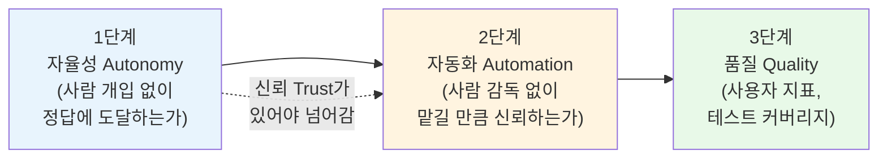
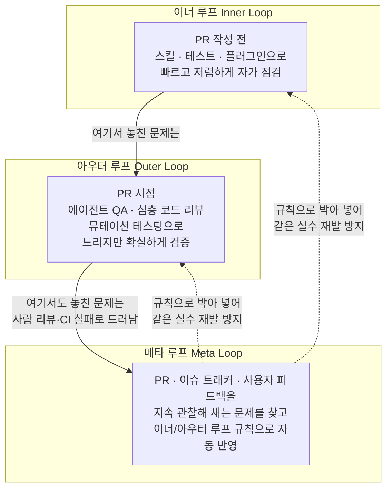
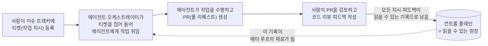
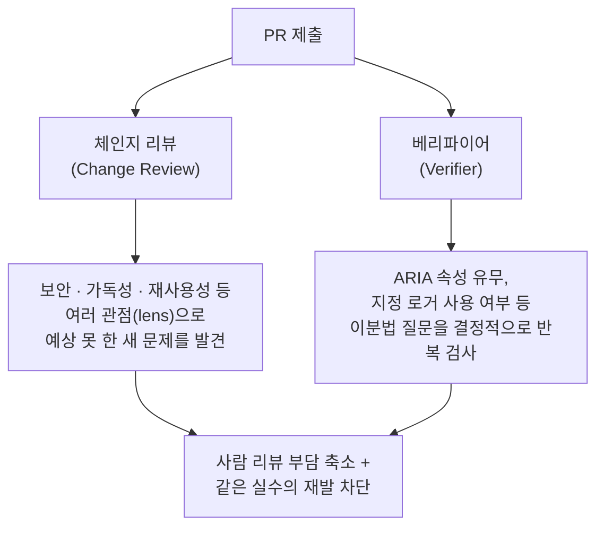

## 관련글

[**하니스 엔지니어링: 에이전트가 코드를 짜고, 개발자는 공장을 만든다**](https://wikidocs.net/blog/@jaehong/23991/)

## 이 문서에 대하여

이 문서는 Tessl의 제품·디자인 총괄 드루 녹스(Dru Knox)가 2026년 6월 29일부터 7월 2일까지 미국 샌프란시스코에서 열린 AI Engineer World's Fair 2026에서 발표한 내용을 다룬 한국어 해설 기사(박재홍의 실리콘밸리, 위키독스 블로그, 2026년 7월 15일 게재)를 원본으로 삼아, 그 내용을 문단별로 풀어 설명하고 최신 웹 검색으로 확인 가능한 배경 정보를 덧붙인 학습용 자료다. 원본 기사 자체가 이미 발표 내용을 충실히 정리한 2차 자료이며, 이 문서는 그 2차 자료를 다시 한번 상세하게 서술형으로 풀어내면서, 발표가 실제로 있었던 행사인지, 발표자와 소속 회사의 정보가 정확한지를 별도로 검색해 교차 확인한 결과를 함께 담았다. 확인 결과와 출처 구분은 문서 맨 뒤의 "팩트체크 노트"에 정리해 두었다.

핵심 주제 하나를 먼저 요약하면 이렇다. AI 코딩 에이전트에게 일감을 맡기는 개발자가 점점 늘어나면서, 이제 개발팀의 진짜 일은 "코드를 직접 짜는 것"이 아니라 "코드를 짜내는 시스템을 만들고 그 시스템의 품질을 계속 끌어올리는 것"으로 옮겨가고 있다는 것이다. 이 새로운 작업 방식에 Tessl은 하네스 엔지니어링(harness engineering), 또는 루프 엔지니어링(loop engineering)이라는 이름을 붙였고, 그 결과물을 소프트웨어 팩토리(software factory)라고 부른다.

---

## 1. 배경: 이 이야기가 나온 자리

### 1.1 AI Engineer World's Fair 2026

이 발표가 나온 자리는 2026년 6월 29일부터 7월 2일까지 나흘간 샌프란시스코에서 열린 AI Engineer World's Fair 2026이다. 6천 명 이상의 엔지니어와 300여 명의 발표자, 29개의 트랙, 100여 개의 전시 파트너가 참여한 것으로 보도된, AI 엔지니어링 분야에서 가장 큰 연례 행사 중 하나다. 이 행사에는 "하네스 엔지니어링(Harness Engineering)"이라는 이름의 트랙이 별도로 존재했고, 나흘째인 마지막 날의 기조연설 주제 자체가 하네스 엔지니어링이었다는 점이 여러 참가 후기와 콘퍼런스 공식 자료를 통해 확인된다. 즉 이 글이 다루는 "하네스 엔지니어링"이라는 용어는 Tessl 혼자 만든 마케팅 용어가 아니라, 2026년 중반 AI 엔지니어링 업계 전반이 공통으로 주목하던 주제였다.

행사를 취재한 여러 매체의 정리에 따르면, 행사 첫날의 화두는 "루프(loop)"였고—AI Engineer 컨퍼런스의 공동 창립자로 알려진 인물이 "루프의 기술(Loopcraft)"이라는 제목으로 개회 발표를 열었다는 보도가 있다—중반부의 화두는 "검증(verification)"이었으며, 마지막 날의 화두가 "하네스(harness)"였다는 정리가 있다. 실제로 한 코드 리뷰 서비스 업체가 발표한 수치로, 병합된 풀 리퀘스트(merge된 PR) 중 AI가 생성한 코드의 비중이 27.6%까지 올라왔고, 그중 사람이 명시적으로 검토하는 비율은 약 48% 수준에 그친다는 통계가 콘퍼런스에서 공유되었다는 보도도 있다. 이런 숫자들은 "에이전트가 만들어내는 코드의 양이 사람이 검토할 수 있는 속도를 이미 넘어섰다"는 문제의식을 뒷받침하며, 왜 하네스—즉 에이전트를 둘러싼 검증·기록·통제 체계—가 갑자기 업계의 중심 화두로 떠올랐는지를 설명해 준다. 다만 이 통계들은 콘퍼런스 취재 매체가 재인용한 수치이며, 필자가 원 발표 자료를 직접 확인한 것은 아니라는 점을 밝혀둔다.

### 1.2 발표자와 회사: 드루 녹스와 Tessl

드루 녹스는 Tessl의 제품·디자인 총괄(Head of Product & Design)이다. 구글과 에어테이블(Airtable)에서 개발자 대상 기술 제품을 다뤘고, 이후 그래멀리(Grammarly)에서 리서치 사이언티스트로 일하며 머신러닝과 생성형 AI 관련 업무를 맡았으며, 자신의 스타트업과 AI 네이티브 소셜 네트워크 칸티나(Cantina)를 거쳐 현재 Tessl에 합류해 있다. Tessl은 개발자에게 구조화되고 버전 관리되는 컨텍스트를 제공해 코딩 에이전트가 실제 코드베이스에서도 안정적으로 작동하도록 돕는 것을 표방하는 회사로, 창업자 겸 CEO는 보안 기업 스니크(Snyk)를 창업했던 가이 포드자니(Guy Podjarny)로 확인된다. 즉 이 발표는 "AI 네이티브 개발 도구를 파는 회사의 임원이 자사 경험을 바탕으로 발표한 내용"이라는 성격을 갖는다는 점을 염두에 두고 읽을 필요가 있다. 발표에 등장하는 구체적 사례(사내 오케스트레이터를 만들다 겪은 해프닝 등)는 Tessl이라는 한 회사의 1인칭 경험담이며, 모든 개발팀에 그대로 적용되는 보편 법칙이라기보다는 하나의 실전 사례로 받아들이는 편이 안전하다.

---

## 2. 소프트웨어 팩토리란 무엇인가

녹스가 제시하는 소프트웨어 팩토리의 정의는 이렇다. 사용자에게 실제로 출시되는 제품의 결과물을 전부 에이전트가 만들어내고, 소프트웨어 엔지니어링 팀은 그 결과물을 찍어내는 시스템 자체를 만드는 데 집중하는 상태를 말한다. 이 상태에서 팀원들은 더 이상 "제품을 만드는 사람"이 아니라 "제품을 만들어내는 시스템을 만드는 사람", 즉 사내 도구 제작자(internal tool builder)가 된다.

여기서 짚고 넘어갈 부분이 있다. 소프트웨어 팩토리는 "AI 네이티브가 되면 어느 순간 도달하는 완결된 최종 상태"가 아니라는 점이다. 오히려 그 반대로, 에이전트에게 코딩 작업을 조금이라도 위임하기 시작한 사람이라면 이미 이 여정 위에 서 있다는 것이 발표의 핵심 주장이다. 여러 개의 에이전트 세션을 동시에 돌리고 있다거나, 쉬운 작업은 한 번의 지시로 끝내고 있다거나, 중간 난도의 작업까지도 사람 개입 없이 마무리 짓기 시작했다면, 그 팀은 이미 소프트웨어 팩토리로 가는 초입에 들어선 셈이다. 그러니 "우리 조직은 아직 준비가 안 됐다"며 시작을 미룰 이유가 없다는 것이 이 발표가 청중에게 던지는 첫 번째 메시지다. 팩토리로의 전환은 거창한 도약이 아니라, 에이전트에게 맡기는 위임의 폭을 한 겹씩 넓혀가는 점진적 과정이라는 뜻이다.

---

## 3. 성숙도를 재는 세 가지 지표: 자율성, 자동화, 품질

소프트웨어 팩토리가 얼마나 성숙했는지는 세 가지 지표로 측정한다고 녹스는 설명한다. 이 세 지표는 순서가 있다는 점이 중요하다.

**자율성(autonomy)** 은 에이전트가 정답에 도달하기까지 사람이 얼마나 개입해야 하는지를 가리킨다. 코드를 몇 번이나 고쳐줘야 하는지, 방향을 몇 번이나 다시 잡아줘야 하는지가 여기 해당한다. 자율성이 높다는 것은, Claude Code나 Codex 같은 코딩 에이전트에게 지시 하나를 던져두면 30분에서 40분가량 혼자 작업을 진행한 뒤 손댈 필요가 거의 없는 결과물을 내놓는다는 뜻이다. 대부분의 사람들이 AI 코딩 에이전트의 생산성을 처음으로 체감하는 지점이 바로 이 자율성이 올라가는 순간이라고 녹스는 말한다.

**자동화(automation)** 는 이름이 자율성과 비슷해서 헷갈리기 쉽지만 실제로는 완전히 다른 축이다. 자동화는 "사람의 감독 없이 에이전트가 얼마나 많은 것을 만들도록 허용하느냐"를 가리킨다. 여기서 핵심 단어는 신뢰(trust)다. 자율성은 높은데 자동화는 낮은 상태가 얼마든지 가능하다. 예를 들어 에이전트가 문제를 척척 한 번에 풀어내는데도(높은 자율성), 그 결과물을 믿지 못해 사람이 코드를 한 줄 한 줄 검토하고 손으로 검증하고 있다면(낮은 자동화) 이런 상태에 해당한다. 자율성을 먼저 쌓아 올린 뒤에야 비로소 자동화로 넘어갈 수 있다는 것이 이 발표의 순서 감각이다.

**품질(quality)** 은 셋 중 가장 직관적인 지표로, 사용자 지표나 테스트 품질, 테스트 커버리지 같은 것들을 포함한다. 팩토리를 지어가는 동안 지켜야 할 원칙은, 자율성을 먼저 끌어올리고 그다음 자동화를 끌어올리되, 그 과정 동안 품질은 일정하게 유지하는 것이다. 품질을 실제로 끌어올리는 일은 자율성과 자동화가 어느 정도 자리 잡은 뒤에 따라오는 보상이라고 설명한다.

---

## 4. 하네스 엔지니어링의 핵심 도구: 세 개의 루프

그렇다면 에이전트에 대한 신뢰는 어떻게 쌓아 올릴 수 있을까. 이 질문에 대한 답으로 등장하는 것이 하네스 엔지니어링의 핵심 도구인 '루프(loop)'다. 발표에서는 이 루프를 세 종류로 구분한다.

### 4.1 이너 루프 (inner loop)

이너 루프는 코딩 에이전트가 풀 리퀘스트(PR, Pull Request—코드 변경을 저장소의 메인 코드에 합쳐달라고 요청하는 절차)를 올리기 전, 작업을 진행하는 동안 스스로 돌려보며 반복하는 점검 장치들을 말한다. 에이전트가 접근할 수 있는 플러그인, 스킬(skill—에이전트가 특정 상황에서 참고하도록 미리 준비해 둔 절차서 같은 것), 테스트 스위트가 여기 포함된다. 이너 루프는 빠르고 저렴해야 한다. 에이전트가 작업 도중 수시로, 여러 번 돌릴 것을 전제로 설계되기 때문이다. 이너 루프가 잘 갖춰질수록 에이전트는 사람의 개입 없이도 스스로 옳은 답에 착지하게 되므로, 이너 루프를 개선하는 일은 앞서 말한 자율성을 끌어올리는 일과 직결된다. 이 루프는 개발자와 에이전트가 로컬(개발자의 작업 환경) 안에서 밀착해 함께 돌리는 성격을 갖는다.

### 4.2 아우터 루프 (outer loop)

아우터 루프는 PR이 올라온 경계 지점에서 작동하는 점검 장치들이다. 이너 루프보다 더 느리고 더 비용이 많이 드는, 그래서 에이전트가 작업 도중 무한정 돌리게 하고 싶지는 않은 검사들을 여기에 배치한다. 대신 사람이 직접 해야 했을 검증 작업을 대신 수행해 주므로 그만한 비용을 들일 값어치가 있다고 본다. 여기에는 에이전트 QA(에이전트가 미리 준비된 테스트 시나리오를 따라 실제로 제품을 조작해 보며 시험하는 것), 더 깊은 수준의 코드 리뷰, 뮤테이션 테스팅(mutation testing—코드를 일부러 조금씩 변형시켜서 테스트가 그 변형을 잡아내는지를 보고 테스트 자체의 품질을 측정하는 기법) 같은 것들이 들어간다. 대개는 CI(Continuous Integration—코드가 합쳐질 때마다 자동으로 빌드와 테스트를 돌리는 체계)의 훅(hook)으로 별도 프로세스에서 실행한다. 아우터 루프의 목표는 사람이 리뷰에 쓰던 시간을 대신 가져오는 것이며, 이상적으로는 PR이 올라온 순간부터 모든 검사가 통과(초록불) 상태이기를 기대하며 설계한다. 이것이 바로 "PR을 굳이 직접 내려받아 손으로 검증하거나 한 줄씩 다 읽지 않아도 된다"는 확신을 주는 장치라고 설명한다.

### 4.3 메타 루프 (meta loop)

메타 루프는 앞의 두 루프를 통째로 감싸는 상위 개념으로, 지속적 학습(continuous learning)을 담당한다. 이너 루프와 아우터 루프가 완벽할 수는 없으므로 그 틈으로 문제가 새어 나가기 마련이고, 사람은 여전히 코드 리뷰를 하고 코멘트를 남기며, CI가 실패하는 경우도 생긴다. 메타 루프는 이 과정을 배경에서 관찰한다. PR, 이슈 트래커, 사용자 피드백을 살펴보며 파이프라인을 빠져나간 실수를 찾아내고, 그 실수를 이너 루프나 아우터 루프 어딘가에 규칙으로 반영하도록 자동으로 제안하는 역할을 한다.

이 대목에서 녹스가 못 박은 원칙이 인상적으로 소개된다. "에이전트에게 어떤 일을 하는 법을 두 번 이상 알려주지 마라. 한 번 알려줬으면 그 즉시 이너 루프나 아우터 루프 어딘가에 규칙으로 박아 넣어라." 즉 똑같은 실수는 딱 한 번만 하도록 만드는 것이 목표다.

여기서 중요한 함의가 하나 따라 나온다. 대부분의 팀에서 이 메타 루프는 처음엔 사람이 손으로 돌리게 마련이고, 바로 그 때문에 로컬 맥시마(local maxima—더 나은 답이 분명 존재하는데도 근처의 낮은 봉우리에 갇혀 벗어나지 못하는 상태)에 머무르게 된다. 이 루프를 점점 자동화할수록 에이전트가 스스로 해낼 수 있는 작업의 범위가 기하급수적으로 늘어난다는 것이 발표의 주장이다. "9시간짜리 작업을 던져도 끝까지 완주하는" 것 같은 극단적인 성과는, 품질을 조금씩이라도 계속 끌어올리는 메타 루프 없이는 도달할 수 없다고 강조한다.

이와 함께 언급되는 실무 규칙 하나가 있다. Tessl은 사내에서 로컬 설정(local configuration), 즉 개인 컴퓨터에만 저장되는 설정을 아예 금지했다고 한다. 모든 것을 저장소(repo)에 커밋하도록 강제하는데, 그 이유는 누군가 한 명이 개선을 만들면 팀 전원에게 즉시 반영되어 개선이 복리로 쌓이기 때문이다. 저장소 안에서는 거의 모든 것을 공유하지만, 조직이나 여러 저장소를 가로지르는 상위 층위에서는 특정 기능 전용 워크플로처럼 굳이 안 나눠도 되는 것도 있는 반면, 스타일 가이드나 디자인 시스템, 보안 정책 같은 것은 반드시 공유하고 강제한다고 설명한다.

---

## 5. 이 일이 유독 어려운 이유

발표는 하네스 엔지니어링이, 특히 별다른 도움 없이 맨손으로 시도하면 상당히 어렵다는 점을 솔직하게 인정한다. 그리고 그 어려움의 원인이 대부분 기술적인 문제가 아니라 인간 심리에 있다고 짚는다.

첫 번째 이유는 이 분야가 너무 새롭고 너무 빠르게 변한다는 점이다. 이 영역에 발을 들이면 사실상 AI 연구자처럼 살아야 한다. 논문을 읽고 블로그를 좇으며 모범 사례를 정리해도, 그 내용이 다음 주면 이미 낡은 것이 되고 2주 뒤에는 오히려 피해야 할 안티패턴(anti-pattern)이 되어 있는 경우가 흔하다. 지식을 계속 갱신하는 데만도 상당한 시간과 에너지가 든다는 것이다.

두 번째 이유는 이 작업이 본질적으로 계획할 수 없는 성격을 갖는다는 점이다. 기능 하나를 만들기 시작할 때, 에이전트가 어디서 어떻게 실패할지, 그것을 고치는 데 시간이 얼마나 걸릴지 미리 예측할 방법이 없다. 게다가 에이전트를 개선하는 데 들이는 노력은 정작 기능을 실제로 출시하는 일과 시간을 두고 정면으로 경쟁한다. 그래서 팀은 늘 같은 딜레마에 빠진다. 개선을 미루면 에이전트가 영영 나아지지 않는 로컬 맥시마에 갇히고, 개선에 시간을 쏟으면 눈앞의 마감을 놓치게 된다. 그 결과 많은 팀에서 이 개선 작업 자체가 아무도 손대지 않는 일이 되어버린다는 것이다.

세 번째 이유는 개선의 실마리가 될 신호들이 정작 손에 잡히는 곳에 있지 않다는 점이다. 그 신호들은 개별 개발자의 로컬 코딩 에이전트 로그 속에, 누군가의 노트북 안에, 또는 누군가의 머릿속에 흩어져 있다. 그래서 이런 워크플로를 모든 정보가 저장되고 나중에 최적화 루프가 들여다볼 수 있는, 누구나 접근 가능한 열린 표면으로 옮기는 작업이 가장 먼저 필요하다는 결론으로 이어진다. 이 지점이 다음 절에서 다루는 컨트롤 플레인 이야기로 연결된다.

---

## 6. 어디서부터 시작하는가: 컨트롤 플레인이 먼저다

Tessl은 자기 회사를 소프트웨어 팩토리로 바꾸어 가면서 겪은 순서를 제품 설계에 그대로 반영했다고 설명하며, 대부분의 팀이 겪는 "고통의 순서"도 대체로 비슷하다고 말한다. 그 첫 단계가 바로 컨트롤 플레인(control plane)을 제대로 잡는 일이다.

컨트롤 플레인이란, 에이전트를 개선하는 데 필요한 모든 신호가 사람이든 시스템이든 "읽을 수 있는(legible)" 자리에 남도록 만드는 토대를 말한다. 피드백이 여기저기 불투명하게 흩어져 있으면 앞서 말한 메타 루프 자체가 작동할 수 없기 때문이다.

Tessl이 세운 두 가지 파격적인 사내 규칙이 이 컨트롤 플레인의 핵심을 보여준다. 첫째, 사람이 더 이상 손으로 코드를 직접 짜지 않는다. 둘째, 더 이상 대화형 코딩 세션을 쓰지 않는다. 발표 당시 청중이 탄식했다고 전해지는 것이 바로 이 두 번째 규칙인데, 개발자에게서 Claude Code나 Codex 같은 대화형 도구를 사실상 빼앗는 것처럼 들리기 때문이다.

다만 실제로는 생각만큼 극단적인 이야기가 아니라고 발표는 설명한다. 이미 여러 개의 에이전트 세션을 동시에 돌리며 간단하거나 중간 난도의 작업을 자주 한 번의 지시로 끝내고 있는 사람이라면, 이런 흐름이 그리 낯설지 않을 것이라는 것이다. Tessl의 경우 이슈 트래커로 리니어(Linear)를 사용한다. 사람이 리니어에 작업 티켓을 하나 올리면, 에이전트가 그 티켓을 집어 들어 PR까지 만들어 온다. 그러면 사람은 그 PR을 놓고 코드 리뷰를 진행한다. 사실 이미 많은 개발자들이 이런 방식으로 일하고 있다고 지적한다. 에이전트에게 무언가를 시켜놓고 다른 작업으로 넘어가 감독 없이 작업이 끝날 때까지 기다렸다가, 완성된 코드를 검토하고 채팅 창에서 리뷰 피드백을 주는 방식 말이다. 이런 흐름을 정식 절차로 못 박아 두면, 모든 과정이 견고한 원장(ledger)의 형태로 남는다. 이슈에는 최초 지시 내용이, PR에는 그 이후의 모든 피드백이 담기고, 이 모든 것이 오픈 도구로 손쉽게 내려받아 확인할 수 있는 자리에 위치하게 된다. 지속적 개선 루프의 밑바탕이 여기서 마련되는 셈이다.

이 흐름을 실제로 굴리려면 에이전트 오케스트레이터(orchestrator—이슈를 받아 에이전트 작업을 지휘하고 연결하는 조율 장치)가 필요하다. 녹스의 조언은 "오케스트레이터는 생각보다 만들기 어렵지 않으니 직접 소유하라"는 것이다. 그리고 이를 뒷받침하는 일화 하나를 소개한다. Tessl의 리서치 팀원 한 명(발표에서 마리아라는 이름으로 소개됨)이 오케스트레이터의 첫 버전을 만들었는데, 자기 개인 깃허브(GitHub) 자격증명을 그대로 사용했다. 그 결과 몇 주 동안 모든 PR과 후속 코멘트가 그 팀원의 이름으로 올라가면서, 그가 기여자 순위 1위로 치솟는 웃지 못할 상황이 벌어졌다고 한다. 겉으로는 생산성이 폭발한 것처럼 보였겠지만, 정작 그 팀원의 알림함은 감당하기 힘든 상태였을 것이라는 농담 섞인 회고다. 이 일화가 알려주는 실질적인 교훈은, 이슈 트래커 앱과 깃허브 앱을 만들어 서로 연결하고 이슈를 위임하고 PR을 올리게 하려면 반드시 신원(identity), 웹훅(webhook), PR 코멘트에 반응하는 로직 같은 문제들을 직접 마주하게 된다는 것이다. 이런 방식으로 일하려는 팀이라면 누구나 비슷한 문제에 부딪히게 된다는 설명이다.

왜 오케스트레이터를 직접 소유해야 하는가에 대해서도 이유를 제시한다. 기성품(off-the-shelf) 도구는 0에서 0.5까지 데려다주는 데는 훌륭하지만, 실제 프로덕션 환경에서 상시로 쓰려고 하면 팀이나 회사마다의 자잘한 특성 앞에서 삐걱거리기 쉽다는 것이다. 블랙박스 형태의 도구가 소프트웨어 개발 생애주기(SDLC, Software Development Life Cycle) 전체를 통째로 틀어쥐면 금세 거슬리는 지점이 생긴다. 그래서 Tessl은 열려 있고 모듈식(modular)이어야 한다는 원칙을 초기에 세웠다고 밝힌다. 좋은 기본값(default)은 제공하되, 마음에 들지 않으면 언제든 그 부분만 빼내어 직접 만든 것이나 다른 도구로 갈아 끼울 수 있어야 한다는 것이다. 개발 생애주기의 모든 단계에서 한 회사가 전부 최고일 수는 없다는 이유에서다.

에이전트를 실제로 돌릴 실행 장소도 필요하다. Tessl도 처음에는 깃허브 액션스(GitHub Actions)에서 시작했지만 곧 한계에 부딪혔다고 설명한다. 가장 저렴한 선택지가 아니었고, 여러 시간에 걸친 장시간 작업에 맞게 설계된 것도 아니었으며, 깃허브 토큰을 계속 갱신해 줄 별도의 사이드카(sidecar) 프로세스를 붙여야 했고, 권한 문제로 인해 후속 CI/CD 작업을 트리거하지 못하는 경우도 잦았다는 것이다. 그래서 Tessl은 자체적으로 "Tessl Launch"라는 작은 CLI 명령을 만들었다고 소개한다. 워크플로를 스킬 형태로 코드화한 뒤, 장시간 작업에 적합하게 설계된 Tessl의 호스팅 클라우드 컨테이너로 작업을 던져 넣는 방식이며, 올바른 신원과 깃허브 자격증명을 갖춘 채로 PR을 올리고 코멘트에 답하도록 만들어졌다고 한다.

이 절 전체를 관통하는 하나의 태도가 있다. 처음부터 완벽한 도구를 고르려는 분석 마비(analysis paralysis)에 빠지지 말라는 것이다. 가구를 어디에 놓을지 정하려면 먼저 그 집에서 실제로 살아봐야 하듯, 일단 무언가로 시작해서 무엇이 되고 무엇이 안 되는지를 직접 겪어보는 편이 낫다는 비유를 든다. 팩토리로의 전환을 한 번의 거대한 이동으로 밀어붙이면 실패하기 쉬운데, 산업 자체가 워낙 빠르게 변하기 때문에 3개월짜리 구축 계획을 세워도 3개월 뒤에는 이미 상황이 딴판이 되어 있기 십상이라는 것이다. 대신 모두가 동의할 수 있는 워크플로 하나를 찾아 그것부터 상자를 씌우듯 정리하고 자동화하라고 권한다. 기능을 만드는 절차서(플레이북)를 스킬 몇 개로 추가하고, 새 기능을 시작할 때 이슈에 라벨을 붙여 해당 스킬을 쓰도록 하는 식이다. 이런 식으로 한 겹씩 쌓다 보면 몇 달 뒤에는 "우리가 하는 일의 60%가 자동화됐고 사람 검토가 필요 없어졌다"는 순간이 온다는 것이다. 큰 논쟁이나 전 팀의 합의 없이도 말이다. 한 조각이 팀에 맞지 않으면 그것만 걷어내고 다른 방식을 시도하면 된다는 유연한 접근을 강조한다.

---

## 7. 코드 리뷰를 다시 짜다: 체인지 리뷰와 베리파이어

컨트롤 플레인이 갖춰지면 곧바로 다음 병목이 찾아온다. 쏟아지는 PR을 어떻게 효율적으로 리뷰할 것인가 하는 문제다. 사실 이슈-투-PR(issue-to-PR) 방식으로 넘어가기 이전부터도, 리뷰에 파묻히는 것이 가장 흔한 고통이라고 설명한다. Tessl은 이 과정에서 반복적으로 필요한 요소 세 가지를 발견했다고 하는데, 그중 특히 실용적인 두 가지를 자세히 소개한다.

### 7.1 체인지 리뷰 (Change Review)

첫 번째는 일반적인 에이전트 리뷰로, Tessl은 이를 체인지 리뷰(Change Review)라고 부른다. 사람이 아닌 별도의 에이전트가 미리 정해둔 규칙 세트를 가지고 변경분(diff)과 나머지 코드베이스를 훑으며 한 번 점검하고, 눈에 띄는 손쉬운 문제들(low-hanging fruit)을 걷어내는 방식이다. 여기에는 여러 관점(lens)이 미리 내장되어 있는데, 보안 문제, 가독성이 떨어지는 지점, 이미 존재하는 플랫폼 조각을 재사용하지 않고 새로 만든 곳 등을 살핀다. 대표적인 예로 회사 전용 로거(logger)를 써야 하는 상황에서 표준 로거를 그냥 사용해 버린 경우를 든다. 이런 관점들은 스킬의 형태로 구동되기 때문에, 접근성이나 시각 디자인처럼 팀 고유의 관심사도 스킬로 추가해 리뷰 과정에 포함시킬 수 있다.

여기서 눈여겨볼 만한 통찰이 하나 제시된다. 모델의 성능이 강해지면서, 좋은 결과를 얻기 위해 팀 전체가 코드 리뷰 가이드라인을 붙들고 정교한 프롬프트 엔지니어링에 매달릴 필요가 크게 줄었다는 것이다. 오히려 더 중요한 것은 "건전한 엔지니어링 원칙을 에이전트에게 평이한 말로 전달하는 것"이라고 강조한다. Tessl 내부에서 기본으로 제공되는 5개의 리뷰 관점 플러그인을 처음 돌렸을 때, 한 팀원이 그 리뷰가 짚어낸 지적들이 얼마나 유용한지에 대해 상당히 반색했다는 일화도 소개된다. 예전보다 자기 팀만의 코드 리뷰 기준을 직접 소유하고 다듬기가 훨씬 쉬워졌다는 취지다.

### 7.2 베리파이어 (Verifier)

두 번째는 더 흥미로운 요소로 소개되는 베리파이어(Verifier)다. 이를 쉽게 표현하면 "아주 작고 빠르고 저렴한, LLM으로 구동되는 린트(lint) 규칙"이라 할 수 있다. 문제의식은 이렇다. 에이전트에게 시켜둔 긴 지시 목록 중 일부는 잊히기 마련이다. 95%는 잘 지키더라도 5%에서는 놓치는 일이 생긴다. 사람보다는 나은 비율이지만, 원하는 것은 100%라는 것이다. 그렇다고 일반적인 코드 리뷰 과정을 "모든 프런트엔드 요소에 ARIA 속성(스크린 리더 등 접근성 보조 기술이 화면 요소를 이해할 수 있도록 붙이는 표시)이 있는지 확인하라", "모든 디자인이 지정된 초록색 헥스값을 쓰는지 확인하라" 같은 세세한 잔소리 목록으로 채우고 싶지도 않다는 것이 딜레마다.

그래서 베리파이어는 다음과 같이 작동한다. 먼저 반드시 지키고 싶은 불변식(invariant)을 정의한다. "모든 프런트엔드 컴포넌트는 ARIA 속성을 가져야 한다", "우리 디자인에 쓸 수 있는 색은 이것들뿐이다", "모든 로깅은 사내 전용 로거를 써야 한다" 같은 규칙들이다. 그러면 대상 파일을 좁히는 글롭 패턴(glob pattern—파일 경로를 `*` 같은 기호로 묶어 지정하는 방식)과 함께, 초점이 아주 좁은 개별 LLM 검사들을 만들어낸다. 각 검사는 "이 파일에 ARIA 속성이 없는 프런트엔드 요소가 있는가?", "이 파일에 지정된 로거가 아닌 다른 로거 호출이 있는가?"처럼 예 또는 아니오로만 답하는 이분법적 질문으로 구성된다.

핵심은, 검사 범위를 아주 작고 흑백이 분명하게 좁혀두면 정답률이 사실상 100%에 가까워진다는 점이다. 요즘 모델에게 "이 JSX 요소에 ARIA 속성이 붙어 있는가?"처럼 좁은 질문을 던지면 거의 틀리지 않는다는 것이다. 1년 전만 해도 LLM이 이런 단순한 판단조차 틀릴 수 있다는 것이 상식이었지만, 지금은 질문을 충분히 좁혀두면 그런 오류가 거의 발생하지 않는다고 설명한다. 이 검사들은 병렬로 빠르고 저렴하게 실행할 수 있어서, Tessl은 이를 아예 린팅·테스트 규칙에 포함시켜 에이전트가 PR을 올릴 때마다 "스킬에 적어둔 모든 것, 지금까지 에이전트가 저질렀던 모든 실수가 이번에는 일어나지 않았다"는 초록불이 뜨도록 만들었다고 한다.

이 두 도구의 역할 분담은 이렇게 정리할 수 있다. 체인지 리뷰는 미처 예상하지 못했던 새로운 문제를 잡아내고, 베리파이어는 지금까지 이미 겪었던 모든 문제가 다시는 재발하지 않도록 막는다. 앞서 메타 루프에서 강조했던 "실수는 딱 한 번만"이라는 원칙이 여기서 실제로 완성되는 셈이다. 게다가 스킬은 에이전트가 상황에 맞춰 해당 스킬을 스스로 '활성화(activate)'해야 작동한다는 불확실성이 있는 반면, 베리파이어는 결정적(deterministic)으로 작동한다. 활성화 여부에 운을 걸지 않고 매번 빠짐없이 실행된다는 점이 실무에서 결정적인 차이를 만든다고 설명한다.

참고로 Tessl은 이 밖에도 몇 가지 부가 기능을 함께 제공한다고 소개한다. 스킬 레지스트리(버전 관리와 보안·품질 리뷰 같은 거버넌스 기능을 갖춘 워크플로 저장소), Tessl Agent를 통한 개선 루프 자동 구축(반복되는 작업을 찾아 스킬로 정리하고 깃허브 액션스에 얹는 기능, 예를 들어 매주 사람이 손으로 하던 불안정 테스트(flaky test) 사냥을 자동화하는 것), 아키텍처 품질·코드 중복·테스트 스위트 품질·보안 취약점을 매주 훑는 즉시 설치형 유지보수 작업, 그리고 Codex·Claude Code·Gemini 등 원하는 코딩 에이전트를 골라 샌드박스 환경에서 장시간 돌릴 수 있게 하는 Tessl Launch가 그것이다. Tessl Agent와 스킬 레지스트리 같은 제품은 별도의 공개 자료(팟캐스트, 회사 블로그)에서도 반복적으로 언급되어 실제로 존재하는 제품임이 확인된다. 다만 녹스는 발표 내내 이 모든 기법이 특정 제품에 종속된 것이 아니라 어떤 개발 스택에서도 통하는 일반적인 기법이며, Tessl은 그것을 더 쉽게 만들어 주는 도구일 뿐이라는 점을 거듭 강조했다고 한다.

---

## 8. "슬롭 공장"이라는 오해, 그리고 그에 대한 반박

이 발표에서 가장 반직관적이면서도 핵심적인 대목이 바로 이 부분이다. 많은 사람이 소프트웨어 팩토리를 "약간의 슬롭(slop—대충 만들어진 저품질 결과물)을 감수하는 대가로 훨씬 많은 기능을 빠르게 출시하는" 거래로 이해한다. 다시 말해 품질을 팔아 처리 속도를 사는 것이라는 시각이다. 녹스는 이것이 단기적인 착시에 불과하다고 잘라 말한다.

그 근거로 제시하는 것이 백로그(backlog—언젠가 하려고 미뤄둔 밀린 작업)의 소멸이다. 어느 팀에나 하고는 싶었지만 시간이 없어 계속 미뤄둔 버그 수정, 개선, 탐색 작업이 산더미처럼 쌓여 있기 마련이다. 소프트웨어 팩토리에서는 이 백로그라는 개념 자체가 사라진다는 것이 핵심 주장이다. 에이전트에게는 수용 능력(capacity)의 한계가 사실상 존재하지 않기 때문에, 남는 여력을 테스트 품질 개선이나 아키텍처 리팩터링 같은 곳에 쏟을 수 있다는 논리다.

이를 뒷받침하는 Tessl 내부 일화가 소개된다. 앞서 언급한 5개의 리뷰 관점을 사람이 작성한 PR에 적용했더니, 엔지니어들이 불평하기 시작했다는 것이다. "피드백이 너무 많다, 다 고칠 시간이 없다, 사소하고 지엽적인 지적이다, 나중에 규모가 커지면 몰라도 지금은 그럴 여력이 없다"는 반응이었다. 그 지적들 자체는 코드 품질을 실제로 높여줄 만한 진짜 문제들이었는데도, 정작 사람에게는 그것들을 전부 처리할 여력이 없었다는 것이다. 그런데 리뷰 대상이 사람이 아니라 에이전트로 바뀌면 상황이 달라진다고 한다. 에이전트는 "좋은 지적이야, 전부 고칠게"라고 답하고 실제로 그 지적을 전부 반영한다. 백로그라는 개념 자체가 없으므로, 문제가 식별되는 즉시 고쳐진다는 것이다. 그래서 녹스는 중장기적으로 볼 때 에이전트가 짠 코드의 품질이 낮아지는 것이 아니라 오히려 높아진다고 주장하며, 이 과정이 더 빠르면서도 더 즐거운 방식으로 이루어진다고 덧붙인다.

한편 이 전환이 얼마나 진척되었는지를 재는 지표도 명확하게 제시된다. 사람이 수동으로 개입해 작업을 넘겨받는 횟수(manual takeover)를 줄이는 것, 사람이 PR에 남기는 코멘트의 수를 줄이는 것, 그리고 사람의 입력 없이 시작된 PR의 비율을 늘리는 것이다. 그리고 이 과정에서 품질은 처음엔 일정하게 유지하다가 그 이후 단계에서 끌어올리는 것이 순서라고 다시 한번 강조한다.

---

## 9. 핵심 통찰: 도구가 아니라 역할의 재정의

이 이야기 전체의 진짜 무게중심은 특정 '도구'가 아니라 '역할의 재정의'에 있다고 정리할 수 있다. 개발자가 손으로 코드를 짜는 존재에서, 코드를 짜내는 시스템을 짜는 존재로 옮겨가는 것이 이 논의의 본질이라는 것이다. 그런데 이 이행을 가로막는 것은 기술적 난이도가 아니라 심리적 저항이라는 점이 이 발표가 반복해서 강조하는 부분이다. 계획할 수 없고, 눈앞의 출시 일정과 경쟁하며, 개선의 실마리가 되는 신호가 흩어져 있어서 아무도 선뜻 손대지 못하는 이 '메타 루프'를 얼마나 자동화하느냐가 결국 팀의 성장 곡선을 가른다는 것이다.

그래서 시작하는 방식 자체가 성패를 좌우한다고 결론짓는다. 완벽한 청사진을 그리려고 멈춰 서 있지 말고, 모두가 동의하는 워크플로 하나에 상자를 씌우듯 정리해 자동화하고, 맞지 않으면 걷어내면서 한 겹씩 쌓아 올리는 것이 권장되는 접근이다. 백로그가 사라진 세계에서는 "언젠가 고치자"가 "지금 고치자"로 바뀌고, 이 작은 차이가 몇 달 뒤에는 품질과 속도를 동시에 끌어올리는 결과로 이어진다는 것이, 이 발표가 전하는 가장 핵심적인 메시지다.

---

## 10. 용어 해설

| 한국어 표현 | 원어 | 의미 |
|---|---|---|
| 하네스 엔지니어링 | harness engineering | 에이전트가 코드를 짜는 시대에, 에이전트를 둘러싼 검증·기록·통제 체계를 설계하고 유지하는 새로운 엔지니어링 규율 |
| 루프 엔지니어링 | loop engineering | 하네스 엔지니어링과 같은 의미로 최근 통용되는 표현. 에이전트를 둘러싼 피드백 루프를 설계하는 작업 |
| 소프트웨어 팩토리 | software factory | 최종 제품을 에이전트가 만들고 사람은 그 제작 시스템을 개선하는 데 집중하는 개발 체계 |
| 자율성 | autonomy | 에이전트가 사람 개입 없이 정답에 도달하는 정도 |
| 자동화 | automation | 사람의 감독 없이 에이전트에게 맡겨도 될 만큼 신뢰하는 정도 |
| 이너 루프 | inner loop | PR 제출 전, 에이전트가 스스로 빠르게 반복하는 스킬·테스트 기반 자가 점검 |
| 아우터 루프 | outer loop | PR 시점에 한 번 도는 느리고 비용이 큰 검증(에이전트 QA, 뮤테이션 테스팅 등) |
| 메타 루프 | meta loop | 이너·아우터 루프를 관찰하며 반복되는 실수를 찾아 자동으로 규칙화하는 지속적 학습 루프 |
| 컨트롤 플레인 | control plane | 에이전트 개선에 필요한 모든 신호가 읽을 수 있는 형태로 남도록 만드는 토대(이슈 트래커, PR, 로그 등) |
| 체인지 리뷰 | Change Review | 보안·가독성 등 여러 관점으로 변경분을 훑어 예상치 못한 문제를 걸러내는 일반 에이전트 리뷰 |
| 베리파이어 | Verifier | 좁은 이분법 질문을 결정적으로 반복 실행하는 소형·저비용 LLM 린트 규칙 |
| 로컬 맥시마 | local maxima | 더 나은 결과가 존재함에도 근처의 낮은 개선 수준에 머물러 벗어나지 못하는 상태 |
| 뮤테이션 테스팅 | mutation testing | 코드를 의도적으로 조금씩 변형시켜, 테스트가 그 변형을 잡아내는지로 테스트 자체의 품질을 측정하는 기법 |
| 오케스트레이터 | orchestrator | 이슈 트래커에서 작업을 받아 에이전트에게 위임하고 PR까지 연결하는 조율 시스템 |
| 슬롭 | slop | 충분한 검토 없이 대충 만들어진 저품질 산출물을 가리키는 속어 |
| 백로그 | backlog | 시간이 없어 나중으로 미뤄둔 작업의 목록 |
| 글롭 패턴 | glob pattern | `*` 등의 기호로 여러 파일 경로를 한 번에 지정하는 방식 |
| ARIA 속성 | ARIA attribute | 스크린 리더 등 접근성 보조 기술이 화면 요소를 이해할 수 있도록 붙이는 표시 |

---

## 11. 팩트체크 노트: 출처 구분

이 문서를 교육·브리핑 자료로 활용할 때 참고할 수 있도록, 내용의 출처를 세 층위로 나누어 밝힌다.

**1차 확인 사실 (원 발표·공식 자료로 뒷받침됨)**
- 드루 녹스가 Tessl의 제품·디자인 총괄(Head of Product & Design)이며, 구글·에어테이블·그래멀리·자신의 스타트업·칸티나를 거쳤다는 이력은 Tessl이 주최한 별도 행사(Steve Yegge와의 파이어사이드 대담)의 공식 소개 자료로 확인된다.
- Tessl의 창업자 겸 CEO가 스니크(Snyk)를 창업했던 가이 포드자니라는 점은 Tessl 관련 공개 행사 자료로 확인된다.
- AI Engineer World's Fair 2026이 2026년 6월 29일부터 7월 2일까지 샌프란시스코에서 열렸고, "하네스 엔지니어링"이 별도 트랙이자 마지막 날 기조연설 주제였다는 점은 콘퍼런스 공식 홈페이지 및 다수의 참가 후기로 확인된다.
- 한 참가자가 정리한 콘퍼런스 세션 노트에는 "Dru Knox · Tessl" 세션에서 "소프트웨어 팩토리의 핵심 지표: 자동화·자율성·품질", "세 개의 루프(이너→아우터→메타)", "하네스 엔지니어링이 어려운 이유(새로운 분야, 빠른 변화, 계획 불가능한 실패, 정보가 개인 로컬에 흩어져 있음)"라는 내용이 실제로 기록되어 있어, 이 글이 다루는 발표 내용과 구조적으로 일치한다. 이는 발표 내용이 실제로 존재했고 정확히 요약되었음을 뒷받침하는 독립적 2차 정황 증거다.
- Tessl Agent(에이전트를 통한 개선 루프 자동화)와 스킬 레지스트리는 Tessl의 공식 팟캐스트, 커뮤니티 페이지 등 여러 공개 자료에서 반복적으로 소개되는 실제 제품으로 확인된다.

**2차 정황 (취재·보도에 근거하되 원 발표 자료를 직접 확인하지는 못함)**
- 콘퍼런스에서 "AI가 생성한 코드가 병합 PR의 27.6%를 차지하고 그중 약 48%만 명시적으로 검토된다"는 통계가 공유되었다는 내용은 별도 업체(TrueFoundry)의 콘퍼런스 후기 글이 다른 매체의 보도를 재인용한 것으로, 원 발표 자료나 원 통계 출처를 직접 확인하지는 못했다. 업계 분위기를 보여주는 정황으로만 참고할 것을 권한다.
- "Tessl Launch"라는 CLI 명령의 존재는 원 한국어 기사(2차 자료)의 서술에 근거하며, 별도의 독립적인 영어권 1차 자료로 명칭까지 교차 확인하지는 못했다. Tessl이 클라우드 컨테이너 기반 실행 환경을 제공한다는 방향성 자체는 Tessl Agent 관련 자료들과 일치하지만, 정확한 제품명은 추가 확인이 필요하다.
- Tessl 사내 오케스트레이터 개발 일화(팀원의 개인 자격증명 사용으로 기여자 순위가 치솟은 사례) 등 발표 중 언급된 구체적 일화는 발표자의 1인칭 진술에 의존하며, 별도의 독립적 자료로 교차 검증되지는 않았다.

**분석 종합 (원 기사 및 이 문서 저자의 해설)**
- "자율성 → 자동화 → 품질" 순서로 성숙도를 쌓아야 한다는 원칙, "체인지 리뷰-베리파이어" 역할 분담, "백로그 소멸이 품질을 오히려 높인다"는 주장 등은 모두 발표자 개인 및 Tessl이라는 한 회사의 경험에 기반한 견해로, 업계 전반에 보편타당하게 검증된 법칙이라기보다는 하나의 실전 프레임워크로 이해하는 것이 정확하다.
- 이 문서의 각 절 구성과 용어 해설, 팩트체크 구분은 원 한국어 기사의 내용을 상세히 풀어 쓰면서 추가 검색으로 확인 가능한 배경(콘퍼런스 개요, 발표자·회사 정보)을 덧붙인 것이며, 원 기사에 없던 새로운 주장을 추가하지 않았다.

---

## 12. 참고 자료

- 박재홍의 실리콘밸리, "하네스 엔지니어링: 에이전트가 코드를 짜고, 개발자는 공장을 만든다" (2026.7.15, 위키독스 블로그): https://wikidocs.net/blog/@jaehong/23991/
- 원 발표 영상 (유튜브 임베드, 박재홍의 실리콘밸리 블로그 게재): https://youtu.be/D_cw-k0F1DM
- AI Engineer World's Fair 2026 공식 페이지: https://www.ai.engineer/worldsfair/2026
- Tessl × Steve Yegge 파이어사이드 대담 행사 소개 (드루 녹스 이력 확인): https://luma.com/7f31tcht
- Tessl 커뮤니티/팟캐스트 페이지 (Tessl Agent 소개): https://tessl.io/community/ , https://tessl.io/podcast/112/
- Tessl 블로그, "See You at AI Engineering World's Fair 2026": https://tessl.io/blog/see-you-at-ai-engineering-worlds-fair-2026/
- TrueFoundry, "Loops, Harnesses, and 6,000 Engineers — AI Engineer World's Fair 2026 Recap" (콘퍼런스 통계 재인용 출처): https://www.truefoundry.com/blog/aiewf-2026-loops-harness-engineering
- Google Cloud 행사 페이지, "The Founder's Story" (Tessl CEO 가이 포드자니 소개): https://cloud.google.com/events/the-founders-story/tessl-ai

*이 문서는 2026년 7월 20일 기준으로 확인 가능한 공개 자료를 바탕으로 작성되었다. 이후 Tessl의 제품명이나 조직 정보가 변경될 수 있으므로, 강의·브리핑에 활용할 때는 최신 공식 자료로 한 번 더 확인하는 것을 권장한다.*
