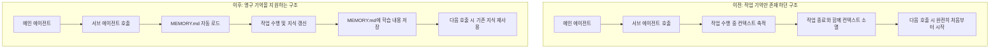
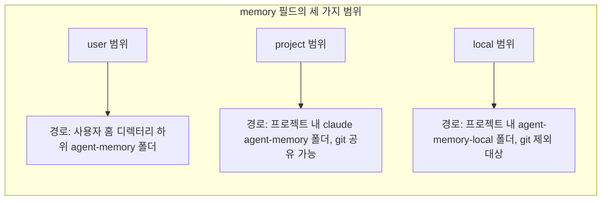

## 목차

1. 들어가며
2. 무슨 소식이 공유되었는가
3. 사실관계 검증: 이것은 정말 "방금 나온" 소식인가
4. 서브 에이전트 영구 기억이란 무엇인가
5. memory 필드의 세 가지 범위(scope)
6. 활성화 시 내부적으로 일어나는 일
7. 아키텍처 변화 시각화
8. 실전 활용 팁 (공식 문서 기준)
9. 한계와 커뮤니티에서 제기된 문제
10. 하네스 엔지니어링 관점에서의 의미
11. 참고자료

---

## 1. 들어가며

> 
> https://www.facebook.com/share/p/18wfjKrcHY/
> 
> Claude Code 의 context engineering 에 매우 큰 변화/진화가 생겼습니다. 이제 sub agent 에게 기억이 생겼습니다. 
> 
> 여태까지 서브 에이전트는 호출되어 일을 할 동안에만 기억이 쌓이고 활용되다가 역할을 마치고 해제되면 이 기억이 리셋되는 구조였습니다. 즉, 철저하게 '작업 기억'만 작업 중에만 갖고 있었습니다. 
> 
> 이제 서브 에이전트도 자기만의 기억을 유지할 수 있게 되었으며 다음과 같이 범위/권한 설정도 가능합니다. 
> 
> - 사용자 : 사용자의 모든 프로젝트를 관통하여 저장/유지/활용
> - 프로젝트 : 현재 프로젝트(git repo)에서만 적용. 이 프로젝트에 참여하는 다른 사용자의 서브에이전트들과도 공유
> - 로컬 : 현재 프로젝트의 현재 사용자에서만 적용. 프로젝트의 다른 사용자/sub agent 에게는 공유 안됨. 프로젝트 내 개인적인 메모 등에 적절
> 
> 사실 그동안 이게 안됐었기 때문에 더더욱 서로 다른 전문성을 부여한 메인 에이전트들끼리 협업시켰던 것인데, 테스트 제대로 해보고 전략을 조정해야 할지도 모르겠습니다. 
> 
> 물론, Claude 만이 아니라 여러 모델을 조합한 협업 전략에서는 여전히 메인 에이전트 레벨의 협업이 유일한 방법입니다.
> 
> Codex 나 기타 harness 는 아직인 것 같은데 (어차피 이런 여러가지 개념과 제대로 된 버전의 harness 프레임웍 자체를 claude code 가 계속 리딩), 조만간 다들 추가되겠네요.
> 
> 이런 엄청나게 중요한 업데이트가 공식 계정이 아니라 담당자 X 에 제일 먼저 올라왔는데... 공식 매뉴얼의 번역본 캡쳐를 붙입니다. 링크는 아래에.
> 
> https://code.claude.com/docs/en/sub-agents#enable-persistent-memory
> 
> #ai #agent #subagent #contextengineering #memory #claudecode #gonnector #고넥터
> 

공유해 주신 게시물은 Claude Code의 서브 에이전트(subagent)가 세션 간에 유지되는 자기만의 기억을 가질 수 있게 되었다는 내용이었습니다. 게시자는 이를 "context engineering의 큰 변화"로 소개하면서, 지금까지는 서브 에이전트가 호출되어 있는 동안에만 지식을 쌓다가 작업이 끝나면 그 지식이 사라졌는데, 이제는 user·project·local이라는 세 가지 범위로 지식을 영구히 남길 수 있게 되었다고 설명했습니다.

이 문서는 해당 내용을 Anthropic의 공식 문서(code.claude.com/docs/en/sub-agents)를 직접 조회하여 검증하고, 이 기능이 실제로 언제 등장했는지, 지금 시점(2026년 7월)에 왜 다시 화제가 되고 있는지, 그리고 어떤 한계가 커뮤니티에서 이미 보고되었는지까지 함께 정리한 것입니다. 추측이나 확인되지 않은 내용은 배제하고, 공식 문서에서 확인된 사실과 커뮤니티 자료에서 발견된 정보를 명확히 구분해서 서술합니다.

## 2. 무슨 소식이 공유되었는가

게시물의 출처는 X(옛 트위터) 사용자 Lydia Hallie의 게시글이었습니다. 검색 결과를 확인해 보니 Lydia Hallie는 실제로 Anthropic의 Claude Code 팀에서 개발자 경험(DX)과 기술 교육을 담당하고 있는 인물로, 이전에는 Bun에서 Head of Developer Experience로, Vercel에서 DX 엔지니어로 일했던 이력이 있습니다. 즉 게시자 자체는 실존하는 Anthropic 소속 인물이 맞습니다. 다만 게시물은 Anthropic 공식 계정이 아니라 개인 계정에서 올라온 것이었고, 이 부분은 원 게시물 작성자도 정확히 지적한 지점입니다.

게시물의 핵심 주장은 다음과 같이 요약할 수 있습니다.

- 서브 에이전트의 정의 파일(예: `code-reviewer.md`)에 `memory: user`와 같은 필드를 추가하면, 그 서브 에이전트만을 위한 전용 디렉터리가 생성된다.
- 이 디렉터리는 세션이 끝나도 사라지지 않고, 다음에 같은 서브 에이전트가 호출될 때 다시 로드된다.
- 범위는 user, project, local 세 가지이며 각각 공유 범위와 버전 관리 포함 여부가 다르다.

첨부된 자료의 내용은 공식 문서와 대조했을 때 문구까지 거의 그대로 일치했으며, 이는 원 게시물이 공식 문서를 캡처해 한글로 번역한 자료였기 때문입니다. 따라서 기능 설명 자체의 정확성에는 문제가 없습니다.

## 3. 사실관계 검증: 이것은 정말 "방금 나온" 소식인가

여기서 짚어야 할 중요한 사실이 하나 있습니다. **이 `memory` 필드 기능 자체는 2026년 7월 시점 기준으로 새로 등장한 기능이 아닙니다.** 여러 독립된 출처를 교차 확인한 결과, 이 기능은 **2026년 2월에 출시된 Claude Code v2.1.33 버전**에서 이미 도입되었습니다.

이를 뒷받침하는 근거는 다음과 같습니다.

- GitHub의 커뮤니티 저장소 `claude-code-best-practice`의 문서는 "Introduced in Claude Code v2.1.33 (February 2026)"라고 명시하고 있습니다.
- 같은 저장소를 다루는 DeepWiki의 아키텍처 문서 역시 동일하게 v2.1.33, 2026년 2월 도입을 명시합니다.
- 별도의 기술 블로그인 orchestrator.dev의 2026년 4월 6일자 글에서도 "subagent memory (`memory:` frontmatter) requires v2.1.33 or later"라고 언급하며, 이 시점에 이미 상당히 성숙한 기능으로 다뤄지고 있습니다.
- 심지어 GitHub 이슈 트래커에는 2026년 5월 9일자로 이 `memory` 필드가 특정 조건에서 정상 작동하지 않는다는 버그 리포트(#57507)까지 등록되어 있어, 실사용자들이 이미 수개월간 이 기능을 운용해 왔다는 정황이 뚜렷합니다.

즉, 정리하면 이 기능은 **약 5개월 전에 출시되어 이미 커뮤니티에서 활발히 논의되고 버그 리포트까지 쌓인 기능**입니다. Lydia Hallie의 게시물은 이를 "새로운 기능 발견"으로 소개하고 있으나, 실제로는 기존 기능을 재조명하거나 DX 교육 차원에서 다시 소개한 게시물일 가능성이 높습니다. 이 부분은 게시물 자체가 틀린 정보를 담고 있다기보다는, "최신 소식"이라는 프레이밍이 다소 과장되었을 수 있다는 뜻입니다. 실제로 2026년 7월 변경 이력(changelog)에는 이 기능과 관련해 "memory 파일 프론트매터에 ISO 형식의 수정 시각(timestamp)을 추가했다"는 정도의 소규모 개선 사항만 있을 뿐, 기능 자체의 최초 도입과 관련된 내용은 없었습니다.

다만 한 가지 확인해 둘 점은, Claude Code의 공식 문서 자체는 현재 시점에도 이 필드를 정식 지원 필드로 계속 유지하고 관리하고 있으며, 최근 버전(v2.1.198 이후)에서는 서브 에이전트가 메인 세션의 extended thinking 설정을 상속받는 등 주변 기능들이 계속 개선되고 있다는 것입니다. 따라서 "기능이 존재한다"는 사실 자체는 최신 공식 문서로 확실히 검증됩니다.

## 4. 서브 에이전트 영구 기억이란 무엇인가

공식 문서 기준으로 이 기능을 정리하면 다음과 같습니다.

서브 에이전트는 원래 자신만의 독립된 컨텍스트 창(context window)에서 동작하며, 메인 대화의 히스토리나 이미 호출된 스킬, 이미 읽은 파일을 전혀 보지 못한 채로 매번 새로 시작합니다. 서브 에이전트가 작업 중에 발견한 코드베이스 패턴, 디버깅 통찰, 아키텍처 결정 같은 지식은 그 서브 에이전트의 실행이 끝나는 순간 전부 사라졌습니다. 이는 서브 에이전트가 철저히 "작업 기억(working memory)"만 가지고 있었다는 뜻입니다.

`memory` 필드는 서브 에이전트의 YAML frontmatter에 추가하는 선택적 설정으로, 값으로 `user`, `project`, `local` 중 하나를 지정합니다. 이 필드를 넣는 순간 해당 서브 에이전트는 세션이 끝나도 사라지지 않는 전용 디렉터리를 부여받습니다. 서브 에이전트는 이 디렉터리를 이용해 시간이 지남에 따라 코드베이스 패턴, 디버깅 통찰, 아키텍처 결정과 같은 지식을 누적해 나갑니다.

기본 정의 예시는 다음과 같습니다.

```markdown
---
name: code-reviewer
description: Reviews code for quality and best practices
memory: user
---

You are a code reviewer. As you review code, update your agent memory with
patterns, conventions, and recurring issues you discover.
```

## 5. memory 필드의 세 가지 범위(scope)

공식 문서는 범위를 다음과 같이 구분합니다.

| 범위 | 저장 위치 | 사용 시점 |
|---|---|---|
| `user` | `~/.claude/agent-memory/<에이전트명>/` | 서브 에이전트가 사용자의 모든 프로젝트를 넘나들며 학습 내용을 기억해야 할 때 |
| `project` | `.claude/agent-memory/<에이전트명>/` | 서브 에이전트의 지식이 프로젝트에 특화되어 있고, 버전 관리를 통해 팀원들과 공유하고 싶을 때 |
| `local` | `.claude/agent-memory-local/<에이전트명>/` | 서브 에이전트의 지식이 프로젝트에 특화되어 있지만, 버전 관리 시스템에는 포함시키고 싶지 않을 때 |

공식 문서는 이 중 `project` 범위를 "권장되는 기본 범위(recommended default)"로 명시하고 있습니다. 이유는 이 범위를 사용하면 서브 에이전트의 지식이 버전 관리를 통해 공유 가능해지기 때문입니다. 즉, 같은 저장소에서 작업하는 다른 팀원의 서브 에이전트도 동일한 `MEMORY.md`를 참조하게 되어, 조직 차원의 지식 축적이 가능해집니다.

## 6. 활성화 시 내부적으로 일어나는 일

`memory` 필드를 설정하면 다음 세 가지가 자동으로 일어납니다.

- 서브 에이전트의 시스템 프롬프트에 메모리 디렉터리를 읽고 쓰는 방법에 대한 지침이 자동으로 포함됩니다.
- 서브 에이전트의 시스템 프롬프트에는 메모리 디렉터리 안의 `MEMORY.md` 파일 중 처음 200줄 또는 25KB 중 먼저 도달하는 분량만큼이 자동으로 삽입됩니다. 이 한도를 넘어서면 `MEMORY.md`를 정리(curate)하라는 지침이 함께 표시됩니다.
- Read, Write, Edit 도구가 자동으로 활성화되어, 서브 에이전트가 자신의 메모리 파일을 스스로 관리할 수 있게 됩니다.

여기서 실무적으로 중요한 포인트는 "MEMORY.md 전체가 항상 로드되는 것이 아니라, 처음 200줄 또는 25KB까지만 자동으로 로드된다"는 제한입니다. 메모리 파일이 계속 커지도록 방치하면 정작 중요한 최신 지식이 초반 200줄 안에 들어가지 못해 컨텍스트에 반영되지 않을 수 있다는 뜻이므로, 정기적인 정리가 필요합니다.

## 7. 아키텍처 변화 시각화

기존 구조와 변경된 구조를 비교하면 다음과 같습니다.



세 가지 범위가 파일 시스템 상에서 어디에 저장되는지는 다음과 같이 정리됩니다.



## 8. 실전 활용 팁 (공식 문서 기준)

공식 문서가 제시하는 활용 팁은 다음과 같습니다.

- `project` 범위를 기본값으로 사용할 것을 권장합니다. 팀 전체가 버전 관리를 통해 서브 에이전트의 지식을 공유할 수 있기 때문입니다.
- 작업을 시작하기 전에 서브 에이전트에게 기억을 먼저 참고하도록 요청하는 것이 좋습니다. 예를 들어 "이 PR을 검토하고, 이전에 본 적 있는 패턴이 있는지 기억을 확인해 보라"는 식의 지시가 권장됩니다.
- 작업이 끝난 뒤에는 서브 에이전트에게 기억을 갱신하도록 요청하는 것이 좋습니다. "이제 작업이 끝났으니 학습한 내용을 기억에 저장하라"는 식입니다. 이렇게 하면 시간이 지날수록 지식 기반이 쌓여 서브 에이전트의 효율성이 향상됩니다.
- 서브 에이전트의 마크다운 정의 파일 자체에 메모리 관련 지침을 직접 포함시켜, 서브 에이전트가 스스로 능동적으로 자기 지식 기반을 관리하도록 만드는 방법도 제시됩니다. 예를 들어 "코드 경로, 패턴, 라이브러리 위치, 핵심 아키텍처 결정을 발견할 때마다 에이전트 메모리를 갱신하라"는 지침을 시스템 프롬프트 본문에 넣어두는 방식입니다.

## 9. 한계와 커뮤니티에서 제기된 문제

여기서부터는 공식 문서에는 명시되어 있지 않지만, 실사용 커뮤니티에서 확인된 중요한 한계점입니다. 이 부분은 이 기능을 실제 협업 전략에 반영하기 전에 반드시 고려해야 할 내용입니다.

가장 크게 지적되는 문제는 **서브 에이전트 간 지식이 공유되지 않는다**는 점입니다. 기술 블로그 Hindsight의 2026년 5월 6일자 분석에 따르면, `memory` 필드는 어디까지나 "서브 에이전트 하나당 하나의 전용 디렉터리"를 만들어 줄 뿐이며, 예를 들어 `code-reviewer` 서브 에이전트의 `MEMORY.md`는 `security-auditor`라는 다른 서브 에이전트에게는 전혀 보이지 않습니다. 즉 같은 프로젝트 안에서 여러 전문 서브 에이전트를 굴리더라도, 그들이 하나의 공통된 이해를 축적하는 구조는 아직 아니라는 뜻입니다. 이는 게시물에서 언급하신 "서로 다른 전문성을 부여한 메인 에이전트들끼리 협업시키는 전략"이 완전히 대체되지는 않는다는 근거가 됩니다. 메인 에이전트 레벨의 협업은 여전히 크로스 에이전트 지식 공유가 필요한 경우 유효한 접근으로 남아 있습니다.

또한 실사용 과정에서 `memory` 필드가 특정 조건에서 기대대로 작동하지 않는다는 버그 리포트도 존재합니다. 2026년 5월 9일 등록된 GitHub 이슈(#57507)에 따르면, 일부 사용자 환경(v2.1.137, macOS)에서 `memory` 필드를 켰음에도 실제로 메모리 파일에 기록이 쓰이지 않는 현상이 보고되었고, 원인 후보로 프롬프트 안의 지나치게 엄격한 "기록 조건" 지침이 특정 모델의 과도하게 문자적인(literal) 해석과 맞물려 에이전트가 스스로 기록을 자제해버리는 현상이 지목되었습니다. 이는 아직 커뮤니티 차원의 관찰이며 Anthropic의 공식 확인은 검색 결과에서 확인되지 않았으므로, 확정된 사실이 아니라 사용자 보고 수준의 정보로 다뤄야 합니다.

마지막으로, 메모리는 여전히 단순한 마크다운 파일 기반 구조입니다. 서브 에이전트가 시작할 때 `MEMORY.md`의 앞부분을 읽고, 지시를 받으면 그 파일을 갱신하는 방식일 뿐, 별도의 검색·우선순위화·의미적 종합(synthesis) 기능은 없습니다. CLAUDE.md와 마찬가지로 "파일 시스템을 기억처럼 쓰는" 패턴의 연장선에 있다는 평가가 있습니다.

## 10. 하네스 엔지니어링 관점에서의 의미

이 기능은 하네스 엔지니어링 관점에서 몇 가지 시사점을 던집니다.

첫째, 이는 모델 자체의 능력이 아니라 **하네스가 제공하는 지속성(persistence) 계층**이 실행 품질에 영향을 미치는 또 하나의 사례입니다. 동일한 모델이라도 세션 간 지식이 유지되는지 여부에 따라 반복 작업의 품질이 달라질 수 있다는 점에서, "모델보다 하네스"라는 관점과 일맥상통합니다.

둘째, 이 기능이 만능 해법은 아니라는 점이 오히려 하네스 설계자에게 중요한 신호입니다. 서브 에이전트별로 지식이 사일로(silo)화되는 구조라는 한계는, 여러 전문 서브 에이전트를 동시에 굴리는 워크플로우에서는 여전히 별도의 공유 지식 계층(shared memory layer)을 하네스 바깥에 설계해 주어야 한다는 뜻입니다. 실제로 이 문제를 해결하기 위한 서드파티 플러그인(Hindsight 등)이 이미 커뮤니티에서 등장한 상태입니다.

셋째, `MEMORY.md`가 처음 200줄 또는 25KB까지만 자동 로드된다는 제약은, 이전에도 강조되었던 "컨텍스트 로트(context rot)" 문제와 정확히 같은 구조의 문제를 서브 에이전트 메모리에도 그대로 옮겨온 것입니다. 즉 정기적인 메모리 감사와 정리(curation)가 CLAUDE.md뿐 아니라 이제 서브 에이전트별 `MEMORY.md`에도 동일하게 필요해졌다고 볼 수 있습니다.

넷째, 이번 사례는 "모델이나 하네스가 스스로 보고하는 최신성 정보"를 그대로 신뢰하기보다, 실제 버전 히스토리와 커뮤니티 사용 기록을 대조 검증하는 습관이 중요하다는 점을 다시 보여줍니다. Fable 5의 provenance 오귀속 사례에서 확인했던 "모델 자기 보고 메타데이터는 독립적으로 검증이 필요하다"는 원칙이, 이번에는 "소셜 미디어發 기능 소식의 최신성"에도 동일하게 적용될 수 있음을 보여준 사례라 할 수 있습니다.

## 11. 참고자료

- Anthropic 공식 문서, "Create custom subagents" (memory 필드 관련 섹션 포함), https://code.claude.com/docs/en/sub-agents
- GitHub, `shanraisshan/claude-code-best-practice` 저장소 내 "claude-agent-memory.md" 문서, https://github.com/shanraisshan/claude-code-best-practice/blob/main/reports/claude-agent-memory.md
- DeepWiki, "Agent Memory Architecture" 문서, https://deepwiki.com/shanraisshan/claude-code-best-practice/6.2-agent-memory-architecture
- orchestrator.dev, "Claude Code & Agent Memory: Best Practices for 2026" (2026년 4월 6일), https://orchestrator.dev/blog/2026-04-06--claude-code-agent-memory-2026/
- Hindsight(vectorize.io) 블로그, "Your Claude Code Subagents Don't Share What They Learn" (2026년 5월 6일), https://hindsight.vectorize.io/blog/2026/05/06/claude-code-subagents-shared-memory
- GitHub Issues, anthropics/claude-code 저장소 이슈 #57507 (2026년 5월 9일 등록), https://github.com/anthropics/claude-code/issues/57507
- Claude Code 공식 변경 이력(Changelog), https://code.claude.com/docs/en/changelog
- Frontend Masters, Lydia Hallie 강사 소개 페이지 (Anthropic Claude Code 팀 소속 확인), https://frontendmasters.com/teachers/lydia-hallie/

---

작성일자: 2026-07-21
