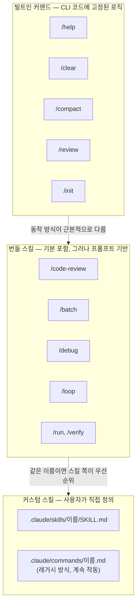
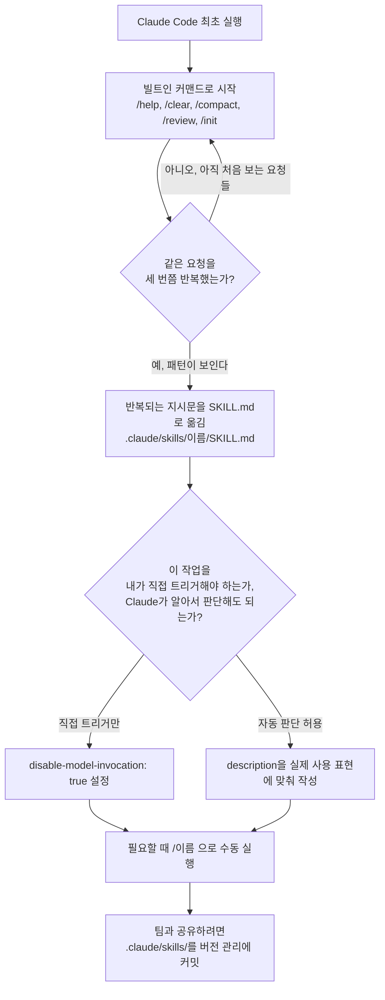

이 문서는 Threads 사용자 crash._.log가 게시한 글(https://www.threads.com/@crash._.log/post/DbDeR1knSoR)을 출발점으로 삼아, Claude Code의 슬래시 커맨드(slash command)와 스킬(skill) 구조를 공식 문서 기준으로 검증하고 정리한 자료다. 원문은 짧은 실전 조언이지만, 그 조언이 성립하는 이유를 제대로 이해하려면 Claude Code 내부에서 "빌트인 커맨드"와 "커스텀 커맨드", "스킬"이 각각 무엇을 의미하는지, 그리고 이 세 가지가 왜 요즘 자꾸 헷갈리는 개념이 되었는지부터 짚어야 한다. 아래 내용은 2026년 7월 기준 Anthropic 공식 문서(code.claude.com/docs)를 직접 확인해 작성했으며, 확정되지 않은 부분은 별도로 표시해두었다.

---

## 1. 원문이 말하는 것

> 
> https://www.threads.com/@crash._.log/post/DbDeR1knSoR
> 
> Claude Code 처음 켰으면 커스텀 slash command부터 안 깔아도 됨.
> 
> 공식 문서 기준으로 기본 /help /clear /compact /review /init 같은 built-in slash command는 바로 있음.
> 
> 근데 써본 사람들 말로는 여기서 바로 커스텀 명령이랑 skills까지 얹으면 편한 사람도 있고, 뭐가 command고 뭐가 skill인지부터 헷갈린다는 사람도 많았음.
> 
> 내 결론은 이거였음.
> 
> 주니어는 기본 slash command 몇 개로 먼저 손에 익히는 쪽이 빠름.
> 
> 반복 패턴이 3번쯤 생겼을 때 그때 skills나 커스텀화 붙이는 게 덜 꼬였음.
> 

원문 작성자는 Claude Code를 처음 켠 사람들에게, 커스텀 슬래시 커맨드부터 서둘러 설치할 필요가 없다고 말한다. 공식 문서 기준으로 봐도 /help, /clear, /compact, /review, /init 같은 기본 제공 슬래시 커맨드는 별도 설치 없이 바로 쓸 수 있는 상태로 존재한다. 문제는 그다음이다. 실제로 Claude Code를 써본 사람들 사이에서는 이 기본 명령어 위에 곧바로 커스텀 커맨드와 스킬까지 얹어서 쓰는 게 편하다는 의견도 있고, 반대로 무엇이 커맨드고 무엇이 스킬인지부터 헷갈린다는 의견도 상당히 많다는 것이다.

이에 대한 작성자의 결론은 명확하다. 처음 배우는 사람(주니어)은 기본 슬래시 커맨드 몇 개로 먼저 손에 익히는 편이 빠르고, 같은 반복 패턴이 세 번쯤 나타났을 때 그제야 스킬이나 커스텀화를 붙이는 편이 덜 꼬인다는 것이다. 이는 개인적인 사용 경험에서 나온 실전 휴리스틱이며, 아래에서 이 판단이 Anthropic의 공식 가이드라인과 실제로 얼마나 맞아떨어지는지 검증한다.

---

## 2. 빌트인 슬래시 커맨드란 정확히 무엇인가

Claude Code 공식 문서는 커맨드를 크게 두 갈래로 나눈다. 하나는 "빌트인 커맨드"로, 동작 방식이 Claude Code 프로그램 자체에 코드로 고정되어 있다. 다른 하나는 "스킬"로, Claude에게 주어지는 프롬프트 형태의 지시문이며 Claude가 상황에 맞춰 스스로 실행 여부를 판단할 수 있다는 점에서 근본적으로 다르다. 겉으로는 둘 다 슬래시(/)로 시작하는 명령어처럼 보이기 때문에, 처음 쓰는 사람 입장에서는 이 구분이 잘 보이지 않는다.

공식 커맨드 레퍼런스에 등재된 빌트인 커맨드 중 원문에서 언급한 다섯 가지를 포함해 자주 쓰이는 것들을 정리하면 다음과 같다.

| 커맨드 | 기능 |
|---|---|
| `/help` | 사용 가능한 명령어와 도움말 표시 |
| `/clear` | 대화 기록 전체 삭제 (컨텍스트 초기화) |
| `/compact [지시문]` | 대화 내용을 요약해 압축하되, 지금까지 있었던 일은 계속 기억하게 함 |
| `/review` | 코드 리뷰 요청 |
| `/init` | 프로젝트를 분석해 CLAUDE.md 가이드 파일 생성 |
| `/model` | 사용할 AI 모델 선택 또는 변경 |
| `/cost` | 토큰 사용량 통계 표시 |
| `/permissions` | 권한 설정 확인 및 변경 |
| `/memory` | CLAUDE.md 메모리 파일 편집 |
| `/mcp` | MCP 서버 연결 및 OAuth 인증 관리 |
| `/config` | 설정 확인 및 수정 |
| `/agents` | 서브에이전트 관리 |
| `/status` | 계정 및 시스템 상태 확인 |
| `/login` / `/logout` | 계정 전환 및 로그아웃 |

이 표에 있는 명령어들은 세션을 시작하자마자, 아무 것도 설치하지 않은 상태에서 바로 사용할 수 있다. 원문에서 "공식 문서 기준으로 기본 built-in slash command는 바로 있다"고 한 부분은 정확한 서술이다.

여기서 흥미로운 지점은 /clear와 /compact의 차이다. 겉보기에는 둘 다 "대화를 정리한다"는 느낌을 주지만 실제로는 완전히 다른 동작을 한다. /compact는 지금까지의 대화를 요약해서 컨텍스트 용량을 확보하되, Claude는 여전히 이전에 무슨 일이 있었는지 기억한 채로 작업을 이어간다. 반면 /clear는 대화 기록을 통째로 지운다. 다만 세션 중에 이미 수정된 파일 자체는 디스크에 그대로 남아 있으므로, "대화의 기억"과 "실제로 변경된 결과물"은 서로 다른 층위라는 점을 이해해두면 헷갈릴 일이 줄어든다. 완전히 새로운 작업으로 넘어갈 때는 /clear를, 같은 작업을 이어가면서 컨텍스트만 가볍게 하고 싶을 때는 /compact를 쓰는 것이 공식적으로 권장되는 사용법이다.

---

## 3. 커스텀 커맨드와 스킬: 원래 다른 개념이었다가 하나로 합쳐진 이야기

원문에서 "뭐가 command고 뭐가 skill인지부터 헷갈린다"는 반응이 많았다고 했는데, 이 혼란에는 구조적인 이유가 있다. Claude Code는 원래 "커스텀 슬래시 커맨드"와 "스킬"을 서로 다른 두 가지 시스템으로 운영했다. 커스텀 커맨드는 `.claude/commands/` 폴더 안에 마크다운 파일 하나를 넣어두면, 그 파일 이름이 그대로 슬래시 명령어가 되는 단순한 구조였다. 스킬은 `SKILL.md`라는 파일과 부가 자료(스크립트, 예시, 참고 문서 등)를 폴더 단위로 묶어서 관리하는, 조금 더 무거운 구조였다.

그런데 지금은 이 둘이 하나의 체계로 합쳐졌다. Anthropic 공식 문서는 이렇게 설명한다. `.claude/commands/deploy.md`라는 파일과 `.claude/skills/deploy/SKILL.md`라는 스킬은 결과적으로 똑같이 `/deploy`라는 명령어를 만들어내고 동일하게 작동한다. 기존에 `.claude/commands/`에 만들어둔 파일은 여전히 그대로 작동하지만, 공식적으로 권장하는 새 방식은 `.claude/skills/<이름>/SKILL.md` 형태다. 스킬 쪽이 부가 파일을 폴더에 함께 담을 수 있고, 프런트매터(frontmatter)로 "누가 이 명령을 호출할 수 있는지"를 세밀하게 통제할 수 있으며, Claude가 대화 맥락에 맞춰 스스로 판단해 자동으로 실행할 수도 있다는 점에서 기능이 더 많다.

같은 이름의 커맨드와 스킬이 동시에 존재하면 항상 스킬 쪽이 우선한다. 예를 들어 `.claude/commands/review.md`와 `.claude/skills/review/SKILL.md`가 둘 다 있으면, `/review`를 입력했을 때 실행되는 것은 스킬 버전이다.

여기에 더해 혼란을 키우는 또 다른 요소가 "번들 스킬(bundled skills)"이다. Claude Code에는 `/code-review`, `/batch`, `/debug`, `/loop`, `/claude-api`, `/run`, `/verify`처럼 별도 설치 없이 세션에 기본으로 포함되어 있는 스킬들이 있다. 이것들은 겉으로 보면 빌트인 커맨드와 똑같이 아무 설치 과정 없이 존재하지만, 실제 작동 원리는 빌트인 커맨드와 다르다. 빌트인 커맨드는 정해진 로직이 프로그램 코드로 고정되어 실행되는 반면, 번들 스킬은 Claude에게 전달되는 상세한 프롬프트이고 Claude가 도구를 사용해 그 작업을 알아서 수행한다. 즉 "설치돼 있는가"와 "고정 로직인가 프롬프트인가"는 서로 다른 축이며, 이 두 축이 뒤섞여 보이는 것이 초보자들이 커맨드와 스킬을 구분하지 못하는 핵심 이유다.

참고로 흥미로운 사례가 하나 있다. `/doctor`는 원래 순수한 빌트인 커맨드였지만, 이후 버전에서 번들 스킬로 성격이 바뀌었다. 이는 "무엇이 빌트인이고 무엇이 스킬인가"의 경계 자체가 Claude Code 버전이 올라가면서 계속 재조정되고 있다는 뜻이기도 하다. 그러니 초보자가 이 구분을 완벽하게 외우려 하기보다는, 우선 "명령어를 입력해서 원하는 결과가 나오는지"에 집중하는 것이 훨씬 실용적인 접근이라 할 수 있다.

---

## 4. 개념 관계도

아래는 지금까지 설명한 세 층위(빌트인 커맨드, 번들 스킬, 커스텀 스킬)의 관계를 도식화한 것이다.



---

## 5. 왜 "3번 반복" 시점에 커스텀화하라는 조언이 합리적인가

원문 필자의 결론, 즉 반복 패턴이 세 번쯤 생겼을 때 스킬을 붙이라는 조언은 개인적인 경험칙처럼 보이지만, 실제로 Anthropic 공식 문서의 스킬 작성 가이드와도 정확히 맞아떨어진다. 공식 문서는 스킬을 언제 만들어야 하는지에 대해, 같은 지시문이나 체크리스트, 여러 단계짜리 절차를 계속 반복해서 채팅창에 붙여넣고 있다면 그때가 스킬을 만들어야 할 시점이라고 설명한다. 또한 CLAUDE.md 안의 어떤 항목이 단순한 사실 나열이 아니라 하나의 절차로 자라났을 때도 스킬로 분리하기를 권한다.

여기에는 구조적인 이유도 있다. 스킬의 본문 내용은 실제로 호출되기 전까지는 컨텍스트에 로드되지 않는다. 다시 말해 스킬을 미리 여러 개 만들어놓아도 평소에는 이름과 설명 정도만 가볍게 메모리에 올라가 있을 뿐이고, 실제로 그 스킬이 필요한 순간에만 전체 내용이 불려온다. 이 특성 때문에 "당장 쓸모가 확실하지 않은 스킬을 미리 여러 개 만들어두는 것" 자체가 큰 비용은 아니지만, 반대로 생각하면 아직 반복 패턴이 확인되지 않은 단계에서 스킬을 만드는 것은 애초에 그 스킬이 어떤 상황에서 자동으로 호출되어야 하는지를 정의하는 "description(설명)" 문구를 정교하게 다듬기 어렵다는 실질적인 문제로 이어진다. 스킬이 제대로 자동 호출되게 하려면 그 설명 문구가 사용자가 실제로 쓸 법한 표현과 겹쳐야 하는데, 이는 실제로 그 작업을 몇 번 반복해봐야 어떤 표현으로 요청하게 되는지 감이 잡히는 부분이다.

정리하면, 주니어가 기본 슬래시 커맨드 몇 개로 먼저 손에 익히는 편이 나은 이유는 다음과 같이 설명할 수 있다.

- 빌트인 커맨드는 동작이 고정되어 있어서 예측 가능성이 높고, 무엇을 배우고 있는지가 명확하다.
- 스킬의 가치는 "반복"에서 나온다. 반복이 없는 상태에서 스킬부터 만들면, 정작 그 스킬이 언제 자동으로 실행되어야 하는지에 대한 감각(설명 문구를 잘 쓰는 능력)이 없는 상태에서 설계하게 된다.
- 커맨드와 스킬이 통합된 지금 구조에서는, 나중에 스킬로 전환하더라도 기존에 반복했던 프롬프트를 거의 그대로 SKILL.md에 옮기기만 하면 되므로 순서를 늦춘다고 손해볼 것이 없다.

즉 원문의 조언은 개인 취향의 문제가 아니라, Claude Code의 스킬 로딩 구조와 스킬 자동 호출이 설명 문구 품질에 크게 좌우된다는 두 가지 기술적 사실에서 자연스럽게 도출되는 결론이라 할 수 있다.

아래는 이 흐름을 학습 곡선 관점에서 정리한 순서도다.



---

## 6. 스킬을 만들 때 실무적으로 알아두면 좋은 것들

원문의 논지를 넘어서, 이후에 실제로 스킬을 만들게 될 때 참고할 만한 공식 문서상의 핵심 설정값들을 정리한다. 이는 SKILL.md 상단의 프런트매터(YAML 형식)에 넣는 항목들이다.

| 필드 | 역할 |
|---|---|
| `description` | 이 스킬이 무엇을 하는지 설명. Claude가 자동 호출 여부를 판단하는 근거가 됨 |
| `disable-model-invocation` | true로 설정하면 사용자만 수동으로 호출 가능. 배포, 커밋처럼 부작용이 있는 작업에 권장 |
| `user-invocable` | false로 설정하면 사용자는 직접 호출할 수 없고 Claude만 필요할 때 참고하는 배경 지식으로 사용 |
| `allowed-tools` | 이 스킬이 실행되는 턴 동안 별도 승인 없이 쓸 수 있는 도구 목록 |
| `context: fork` | 별도의 서브에이전트(subagent) 맥락에서 이 스킬을 실행 (기존 대화 맥락과 분리) |
| `argument-hint` | 자동완성 시 어떤 인자를 받는지 힌트로 표시 |

이 표에서 특히 중요한 것은 `disable-model-invocation`이다. 배포나 실제 커밋처럼 "Claude가 알아서 판단해서 실행하면 곤란한" 작업에는 이 옵션을 켜서, 오직 사람이 직접 `/명령어`를 입력했을 때만 실행되도록 막아두는 것이 공식적으로 권장된다. 반대로 코드 컨벤션 안내처럼 배경 지식에 가까운 내용은 `user-invocable: false`로 설정해, 사람이 굳이 직접 호출할 필요는 없지만 Claude가 관련 상황에서 알아서 참고하도록 만들 수 있다.

---

## 7. 팩트체크 노트

이 문서를 작성하면서 확인한 사실과, 아직 공식적으로 확정되지 않아 별도 표시가 필요한 부분을 구분해둔다.

**공식 문서(1차 출처, code.claude.com/docs)로 확인된 사실**

- /help, /clear, /compact, /review, /init을 포함한 목록은 현재 공식 커맨드 레퍼런스에 "빌트인 커맨드"로 등재되어 있으며, 별도 설치 없이 세션 시작과 동시에 사용 가능하다.
- 커스텀 슬래시 커맨드(.claude/commands/)와 스킬(.claude/skills/) 시스템은 현재 통합되어 있으며, 같은 이름일 경우 스킬이 우선한다. 기존 .claude/commands/ 파일은 계속 작동한다.
- 번들 스킬(/code-review, /batch, /debug, /loop, /claude-api, /run, /verify 등)은 프롬프트 기반으로 동작하며, 빌트인 커맨드처럼 고정 로직으로 실행되는 것이 아니라 Claude가 도구를 사용해 수행한다.
- /doctor는 과거에는 순수 빌트인 커맨드였으나 이후 번들 스킬로 성격이 바뀌었다(공식 문서에 v2.1.205 이전/이후 구분이 명시되어 있음).
- 스킬을 언제 만들어야 하는지에 대한 공식 권고("같은 지시문을 반복해서 붙여넣고 있다면 스킬을 만들 시점")는 원문 필자의 "3번 반복" 휴리스틱과 방향이 일치한다. 다만 공식 문서에 "정확히 몇 번"이라는 숫자는 명시되어 있지 않으며, 이는 원문 필자 개인의 경험적 기준이다.

**2차 출처(커뮤니티 보고, 확정되지 않은 정보)**

- 커스텀 커맨드와 스킬이 통합된 시점을 v2.1.3이라고 언급하는 커뮤니티 자료(개발자 블로그, GitHub 이슈 등)가 여러 건 있었다. 다만 이 버전 번호는 Anthropic 공식 문서 본문에서 직접 확인되지는 않았으므로, 참고 정보로만 취급하고 확정된 사실로 서술하지 않았다.
- 원문 게시물 자체(Threads, crash._.log)는 로봇 배제 정책으로 인해 본 조사 과정에서 직접 열람하지 못했으며, 이 문서는 사용자가 제공한 게시물 인용 부분을 근거로 작성했다.

---

## 8. 용어 정리

| 한국어 표현 | 원어 | 설명 |
|---|---|---|
| 슬래시 커맨드 | Slash command | `/`로 시작해 세션 안에서 즉시 실행되는 명령어 |
| 빌트인 커맨드 | Built-in command | 동작 로직이 Claude Code 프로그램 자체에 고정되어 있는 명령어 |
| 커스텀 커맨드 | Custom command | `.claude/commands/`에 마크다운 파일로 정의하는 레거시 방식의 사용자 정의 명령어 |
| 스킬 | Skill | `SKILL.md`와 부가 파일로 구성되는, 프롬프트 기반의 사용자 정의 확장 기능. Claude가 자동으로 호출하거나 사람이 직접 호출할 수 있음 |
| 번들 스킬 | Bundled skill | Claude Code에 기본 포함되어 별도 설치 없이 쓸 수 있는 스킬 |
| 프런트매터 | Frontmatter | SKILL.md 상단에 YAML 형식으로 적는 설정 영역 |
| 자동 호출 | Model invocation | Claude가 대화 맥락을 보고 스스로 스킬을 실행하는 방식 |
| 수동 호출 | User invocation | 사람이 직접 `/이름`을 입력해 실행하는 방식 |
| 서브에이전트 | Subagent | 기존 대화 맥락과 분리된 별도 실행 환경에서 작업을 수행하는 에이전트 |
| 컨텍스트 포크 | context: fork | 스킬을 별도의 서브에이전트 맥락에서 실행하도록 지정하는 설정 |

---

## 9. 참고자료

**1차 출처 (Anthropic 공식 문서)**
- Extend Claude with skills — https://code.claude.com/docs/en/slash-commands
- Skills — https://code.claude.com/docs/en/skills
- Commands (전체 커맨드 레퍼런스) — https://code.claude.com/docs/en/commands
- Slash Commands in the SDK — https://code.claude.com/docs/en/agent-sdk/slash-commands

**2차 출처 (참고용, 공식 확인 전)**
- claude-howto (GitHub, luongnv89) — https://github.com/luongnv89/claude-howto
- Build This Now, "Slash Commands Are Now Skills" — https://www.buildthisnow.com/blog/tools/hooks/claude-code-commands-to-skills
- anthropics/claude-code GitHub 이슈 #17578, #66377 — https://github.com/anthropics/claude-code/issues

**원문**
- Threads, @crash._.log — https://www.threads.com/@crash._.log/post/DbDeR1knSoR (로봇 배제 정책으로 직접 열람 불가, 사용자 제공 인용 기준으로 서술)


# 별첨 

## [RummiArena](https://github.com/k82022603/RummiArena/tree/main)/[.claude](https://github.com/k82022603/RummiArena/tree/main/.claude)/[skills](https://github.com/k82022603/RummiArena/tree/main/.claude/skills)/[commit-push](https://github.com/k82022603/RummiArena/tree/main/.claude/skills/commit-push)
/SKILL.md

~~~markdown
---
name: commit-push
description: 커밋+푸시 표준 절차. origin(GitHub) + gitlab 양쪽 push 의무화. feature branch + PR 정식 프로세스 강제. 데일리 마감/세션 중 모든 커밋에 적용.
---

# Commit & Push 표준 절차

> "origin(GitHub)이 main이고, GitLab은 GitHub을 따라간다."
> — 애벌레 (2026-04-26)

## Purpose

모든 커밋+푸시에 일관된 정책을 적용한다. 오늘(2026-04-26) 세션에서 발견된 두 가지 위반을 구조적으로 방지:
1. **GitLab push 누락** — origin만 push하고 gitlab 빠뜨림
2. **main 직접 커밋** — feature branch + PR 프로세스 미준수

---

## Trigger

모든 `git commit` + `git push` 시점에 적용. 특히:
- 코드/문서 수정 후 커밋 시
- 일일마감(`daily-close`) 6단계
- 세션 중 중간 커밋 시
- E2E 이터레이션 수정 후 커밋 시

---

## 리모트 구조

```
origin  = https://github.com/k82022603/RummiArena.git   ← main (SSOT)
gitlab  = https://gitlab.com/k82022603/rummiarena.git    ← GitHub 미러
```

**GitHub(origin)이 단일 기준(SSOT)**. GitLab은 CI/CD용 미러.

---

## Phase 1: 커밋 전 점검

### 1.1 브랜치 확인
```bash
git branch --show-current
```
- **코드/문서 변경**: feature branch 사용 (`feat/`, `fix/`, `docs/`, `test/`)
- **일일마감/로그**: main 직접 커밋 허용 (예외)
- **긴급 핫픽스**: main 직접 허용, 사후 보고 필수

### 1.2 변경 내용 확인
```bash
git status --short
git diff --stat HEAD
```
- 시크릿 파일(.env, *.pem) 포함 여부 확인
- test-results/ 포함 여부 확인 (CLAUDE.md 정책: 포함)

---

## Phase 2: 커밋

### 2.1 커밋 메시지 규칙
```
<type>(<scope>): <한글 요약>

<상세 설명>

룰 ID: <관련 룰 ID>

Co-Authored-By: Claude Opus 4.6 (1M context) <noreply@anthropic.com>
```

**type**: feat / fix / docs / test / chore / refactor
**scope**: frontend / game-server / ai-adapter / e2e / skill / session 등

### 2.2 커밋 실행
```bash
git add <specific files>   # git add -A 금지
git commit -m "$(cat <<'EOF'
<message>

Co-Authored-By: Claude Opus 4.6 (1M context) <noreply@anthropic.com>
EOF
)"
```

---

## Phase 3: 푸시 (양쪽 필수)

### 3.1 GitHub (origin) — 필수
```bash
git push origin <branch>
```

### 3.2 GitLab — 필수
```bash
git push gitlab <branch>
```

**GitLab push 실패 시 대응:**
- `non-fast-forward` → `git push gitlab <branch> --force` (GitHub이 SSOT이므로 force 허용)
- `protected branch` → GitLab Settings에서 force push 허용 필요 (사용자 조치)
- 네트워크 오류 → 재시도 1회, 실패 시 사용자에게 보고

### 3.3 양쪽 push 확인
```bash
echo "=== origin ===" && git log origin/<branch> --oneline -1
echo "=== gitlab ===" && git log gitlab/<branch> --oneline -1
```

두 SHA가 일치해야 한다.

---

## 예외 규칙

| 상황 | branch | main 직접 | origin push | gitlab push |
|------|--------|----------|------------|-------------|
| 코드 수정 | feature branch | ❌ 금지 | ✅ 필수 | ✅ 필수 |
| 일일마감 | main | ✅ 허용 | ✅ 필수 | ✅ 필수 |
| 세션 로그 | main | ✅ 허용 | ✅ 필수 | ✅ 필수 |
| 긴급 핫픽스 | main | ✅ 허용 (사후 보고) | ✅ 필수 | ✅ 필수 |

---

## 금지 사항

1. **origin만 push하고 gitlab 빠뜨리기 금지** (2026-04-26 교훈)
2. **main 직접 코드 커밋 금지** (일일마감/로그 예외)
3. **git add -A / git add .** 금지 — 파일 명시적 지정
4. **--no-verify** 금지
5. **main force push** 금지 (GitLab은 허용 — GitHub 미러이므로)

---

## 변경 이력

- **2026-04-26 v1.0**: 신설. origin+gitlab 양쪽 push 누락 + main 직접 커밋 위반 경험 기반.


~~~

## [RummiArena](https://github.com/k82022603/RummiArena/tree/main)/[.claude](https://github.com/k82022603/RummiArena/tree/main/.claude)/[skills](https://github.com/k82022603/RummiArena/tree/main/.claude/skills)/[code-modification](https://github.com/k82022603/RummiArena/tree/main/.claude/skills/code-modification)
/SKILL.md

~~~markdown
---
name: code-modification
description: Dev 에이전트 코드 수정 표준. 영향 분석(Phase 1)→수정(Phase 2)→검증(Phase 3)→티어링 판단(Phase 4). 타임아웃 체인/프롬프트 variant/게임룰 등 SSOT 특수 케이스 포함.
---

# Code Modification Standard (코드 수정 표준 절차)

> "생각 없이 고치면, 고친 것이 아니라 옮긴 것이다."

## Purpose

코드 수정 시 **분석 → 계획 → 구현 → 검증** 4단계를 반드시 거치게 하여,
맥락 없는 복붙 코딩을 방지하고 수정의 품질을 보장한다.

**적용 대상**: 모든 Dev 에이전트 (go-dev, node-dev, frontend-dev, ai-engineer, devops)

---

## Phase 1: 분석 (Analyze)

코드를 한 줄이라도 수정하기 **전에** 반드시 수행한다.

### 1.1 수정 대상 파악
- 수정할 파일과 함수를 **Read**로 전체 읽기 (해당 라인만 보지 말 것)
- 파일의 전체 구조와 수정 대상의 역할을 이해

### 1.2 파급 영향 분석
- 수정 대상을 **호출하는 쪽(caller)** 을 Grep으로 전수 검색
- 수정 대상이 **호출하는 쪽(callee)** 도 확인
- 인터페이스/타입 변경 시 구현체와 소비자 모두 확인
- 설정값 변경 시 환경변수, ConfigMap, Helm values까지 추적

### 1.3 기존 테스트 확인
- 수정 대상에 대한 기존 테스트가 있는지 Glob/Grep으로 탐색
- 테스트가 있으면 먼저 실행하여 현재 통과 상태 확인
- 테스트가 없으면 **반드시** 최소 1개 (happy path + 1개 엣지) 를 Phase 3 구현과 함께 추가한다.
  Phase 4 에서 새 테스트가 실제로 수정 대상을 커버하는지 `go test -run <이름>` / `jest -t "<이름>"` 등으로
  이름 지정 실행하여 확인한다. SonarQube 연결: 새 함수 커버리지가 60% 미만이면 Phase 4 FAIL.
- 신규 기능(= 기존 테스트가 전혀 없음)은 "추가 여부" 가 아니라 **추가 필수** — 테스트 없이 Phase 3 를 끝내지 않는다.

### 분석 결과 형식 (내부 정리용)
```
[수정 대상] 파일:함수 — 현재 동작
[호출자] N개소 — 파일:라인 목록
[피호출] 의존하는 함수/타입
[기존 테스트] 있음/없음 (파일명)
[파급 영향] 변경 시 영향받는 범위 요약
```

---

## Phase 2: 계획 (Plan)

분석 결과를 바탕으로 **수정 계획을 먼저 정리**한다. 코드 작성 전에 방향을 확정.

### 2.1 수정 계획 작성
- **무엇을** 변경하는가 (구체적 변경 내용)
- **왜** 변경하는가 (근본 원인, 요구사항)
- **어디까지** 변경하는가 (파급 범위 내 수정 목록)
- **어디는 건드리지 않는가** (의도적으로 변경하지 않는 것과 그 이유)

### 2.2 위험 체크
- [ ] 이 변경이 기존 API 계약을 깨는가?
- [ ] 이 변경이 다른 서비스(game-server ↔ ai-adapter ↔ frontend)에 영향을 주는가?
- [ ] 이 변경이 데이터 마이그레이션을 필요로 하는가?
- [ ] 이 변경이 환경변수/설정 변경을 동반하는가?

위험이 있으면 수정 범위에 포함하거나, 명시적으로 "이건 별도 처리 필요"라고 표기.

---

## Phase 3: 구현 (Implement)

계획에 따라 코드를 수정한다.

### 3.1 구현 원칙
- **계획에 있는 것만 수정** — 범위 밖 개선은 하지 않는다
- **한 파일씩 순서대로** — 의존 관계 순서를 따른다 (피호출 → 호출자)
- **타입/인터페이스 변경 시** — 구현체와 소비자를 반드시 동시에 수정
- **import 정리** — 추가한 import가 정확한지, 불필요한 import는 없는지 확인

### 3.2 동반 수정 체크
- 에러 코드/상태 코드 변경 → 프론트엔드 핸들러도 확인
- DTO/응답 형식 변경 → 소비자(caller) 파싱 로직도 확인
- 환경변수 추가/변경 → Helm values, ConfigMap, .env.example 동시 수정
- 테스트 spec에서 mock/assertion이 변경 내용과 불일치하면 수정

---

## Phase 4: 검증 (Verify)

구현 완료 후 반드시 수행한다. **빌드 통과만으로는 부족하다.**

### 4.1 빌드 확인
```bash
# Go
cd src/game-server && go build ./... && go vet ./...

# NestJS
cd src/ai-adapter && npm run build

# Frontend
cd src/frontend && npm run build
```

### 4.2 관련 테스트 실행

**테스트 범위 3단계 분류**

| 단계 | 범위 | 담당 | 언제 |
|------|------|------|------|
| ① 수정 파일 단위 | 변경한 함수/파일 직접 커버 테스트 | Dev (본 Phase 2/4 안) | **필수** — 매 수정마다 |
| ② 연결 경계 패키지 | caller/callee 가 속한 패키지 전체 | Dev (본 Phase 4) | **필수** — 아키텍트가 Phase 1 계획서에 지정 |
| ③ 전체 suite | 서비스 전체 테스트 + CI | QA (code-fix Phase 3) | 최종 회귀 |

- Go 는 전체 suite 가 30초 내에 끝나므로 code-fix Phase 3 에서 **항상 전체 실행** 한다.
- NestJS 는 80초 내에 끝나므로 동일하게 **항상 전체 실행** 한다.
- Frontend Playwright E2E 는 시간이 오래 걸리므로 `--grep` 으로 영향 범위만 먼저, 전체는 CI 위임.

- 수정한 파일의 테스트를 **반드시** 실행
- 테스트 실행 명령 예시:
```bash
# Go — 특정 패키지
cd src/game-server && go test ./internal/service/... -v -count=1

# NestJS — 특정 파일
cd src/ai-adapter && npx jest --testPathPattern="cost-limit" --no-cache

# Frontend — 특정 파일
cd src/frontend && npx jest --testPathPattern="api" --no-cache
```
- **테스트 실패 시 구현으로 돌아가서 수정** — 실패를 무시하고 넘어가지 않는다

### 4.3 셀프 리뷰
- 변경된 파일 목록 확인: `git diff --stat`
- 의도하지 않은 변경이 포함되지 않았는지 확인
- Phase 2의 계획과 실제 변경이 일치하는지 대조

### 4.4 롤백 준비

**적용 대상**: 설정/배포/DB 마이그레이션 변경. 단순 코드 수정은 `git revert <commit>` 한 줄만 명시하면 충분.

모든 수정 계획서(code-fix Phase 1 산출물) 및 구현 결과에는 다음 3가지가 명시되어야 한다:

1. **이전 상태 스냅샷 명령** — 변경 직전의 상태를 복구 가능하도록 저장
   ```bash
   # 예: ConfigMap
   kubectl get cm game-server-config -n rummikub -o yaml > /tmp/pre-change-game-server-config.yaml

   # 예: Helm values
   helm get values game-server -n rummikub > /tmp/pre-change-game-server-values.yaml

   # 예: DB 스키마
   pg_dump -s -t games rummikub > /tmp/pre-change-games-schema.sql
   ```

2. **원복 명령** — 문제가 발생했을 때 즉시 이전 상태로 되돌리는 명령
   ```bash
   # 예: ConfigMap 원복
   kubectl apply -f /tmp/pre-change-game-server-config.yaml

   # 예: 코드 원복
   git revert <commit-sha>

   # 예: Helm 롤백
   helm rollback game-server <previous-revision> -n rummikub
   ```

3. **롤백 실행 기준** — 어떤 지표/상황에서 롤백을 발동하는지 명시
   ```
   예: "대전 smoke test (30턴 N=1) 에서 fallback > 0 이면 즉시 원복"
   예: "배포 5분 내 P99 latency > 2x 이면 즉시 원복"
   예: "OAuth 로그인 실패율 > 1% 면 즉시 원복"
   ```

### Phase 4 티어링 (긴급도별 검증 범위)

상황에 따라 Phase 4 범위를 다음 3 티어로 조절할 수 있다:

| 티어 | 범위 | 언제 |
|------|------|------|
| **핫픽스 최소** | 수정 파일 빌드 + 수정 함수 단위 테스트 1개 + `git diff --stat` | 프로덕션 긴급 장애 (§예외 "긴급 핫픽스") |
| **표준** | 위 + 수정 패키지 전체 테스트 (§4.2 ② 연결 경계) | 기본값 — 모든 일반 수정 |
| **릴리스** | 위 + 전체 suite + CI 통과 + SonarQube + Trivy | 스프린트 마감, production 릴리스, 스키마 변경 |

"긴급 핫픽스" 로 핫픽스 최소 티어를 적용한 경우에도 **사후 24시간 내에 표준 티어로 재검증** 해야 한다.

---

## 위반 시 처리

이 절차를 건너뛰면 다음 문제가 발생한다:
- **분석 건너뛰기** → 참조자를 놓쳐 다른 곳에서 런타임 에러
- **계획 건너뛰기** → 범위를 넘는 불필요한 수정, 또는 범위 부족
- **검증 건너뛰기** → 빌드는 되지만 테스트 실패, 프로덕션 장애
- **롤백 준비 건너뛰기** → 사고 발생 시 원복 명령을 즉흥 작성 → 2차 장애

---

## 예외

다음 경우에는 절차를 축약할 수 있다 ("간소화" 의 정확한 정의는 `code-fix/SKILL.md` §스킵 가능 조건 참조):
- **오타/주석 수정**: Phase 1의 파급 영향 분석 생략 가능. 단, 주석이 API 계약/공개 문서라면 생략 금지.
- **설정값 변경**: Phase 1 **필수**. 단일 값처럼 보여도 SSOT 지점인지 먼저 확인
  (code-fix/SKILL.md §SSOT 매핑 참조). 타임아웃/프롬프트/모델/에이전트 모델은 전용 체크리스트로 즉시 라우팅.
  위 4종에 해당하지 않을 때에 한해 Phase 2 를 "수정 내용 + 이유 + 롤백 명령 3 줄" 로 축약 가능.
- **긴급 핫픽스**: Phase 1~2를 구두로 축약하되 SSOT 매핑은 생략 금지.
  Phase 4(검증)는 §Phase 4 티어링 "핫픽스 최소" 티어 적용, 사후 24h 내 표준 재검증.

### 특수 케이스: 메타 설정 변경 (4-Phase 와 별도 절차)

코드가 아닌 **에이전트 메타 설정** 을 바꾸는 경우, 본 SKILL 의 4-Phase 가 아닌
해당 영역 전용 체크리스트를 따른다. 해당 체크리스트는 소스코드 수정이 아니라
**SSOT 동기화** 에 초점을 둔다.

| 변경 대상 | 전용 체크리스트 |
|----------|----------------|
| 에이전트 모델 (`.claude/agents/*-agent.md` `model:` + `CLAUDE.md` §Agent Model Policy) | [`agent-model-change-checklist.md`](./agent-model-change-checklist.md) |
| 타임아웃 체인 (10개 지점) | `docs/02-design/41-timeout-chain-breakdown.md` §5 체크리스트 |
| 프롬프트 variant 환경변수 | `docs/02-design/42-prompt-variant-standard.md` §5 체크리스트 |
| 프롬프트 텍스트 (variant 내용) | `docs/02-design/42-prompt-variant-standard.md` 표 B + **empirical A/B smoke test ≥ 30턴 N=1 선행** |
| 게임 룰/엔진 로직 | `docs/02-design/31-game-rule-traceability.md` 추적성 매트릭스 |
| 에러 코드/메시지 | `docs/02-design/30-error-management-policy.md` |

> **프롬프트 텍스트 행 배경 (2026-04-16 Day 5 근거)**: v4 prompt 변경이 reasoning_tokens 을 −25% 감소시키는 설계였으나
> 실제로는 tiles_placed 까지 동반 감소하는 regression 이 발생. 설계 시점에 예측 불가능한 행동 변화를
> A/B smoke (30턴 N=1) 로 조기 감지한다.

---

## 개정 이력

- **2026-04-17**: P0/P1/P2 15건 일괄 개정 (리뷰어: architect + qa, 반영: architect).
  SSOT 매핑 / 롤백 준비 / SKILL 진화 트리거 / 테스트 3단계 / 설정값 스킵 제거 /
  재수정 루프 상한 / Mermaid 분기 확장 / Sonnet Dev 자기이해도 / 계획서 승인 체크 /
  신규 기능 테스트 / 프롬프트 텍스트 변경 / batch-battle 교차 / CI 경계 / QA 피드백 경로 / Phase 4 티어링.
  본 파일에는 이 중 §1.3 (신규 기능 테스트), §4.2 (테스트 3단계), §4.4 (롤백 준비),
  §Phase 4 티어링, §예외 (설정값 스킵 제거, 프롬프트 텍스트 행 추가, 게임룰/에러코드 행 추가),
  §위반 시 처리 (롤백 건너뛰기 추가) 가 반영됐다. 나머지 프로세스 항목은 `code-fix/SKILL.md` 에 있음.
~~~