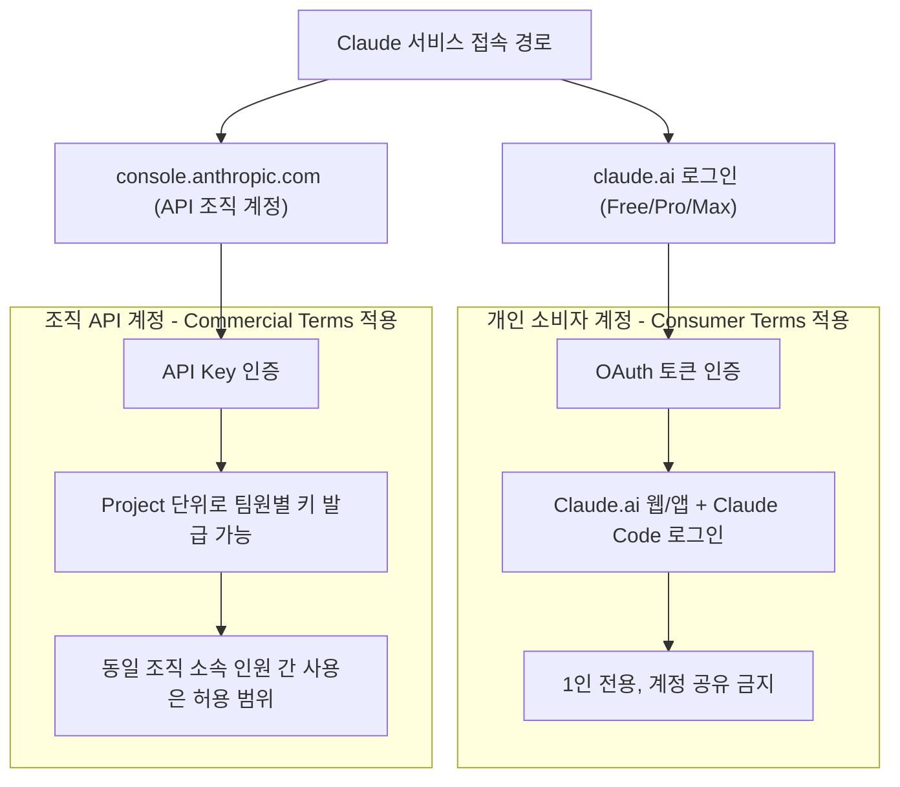
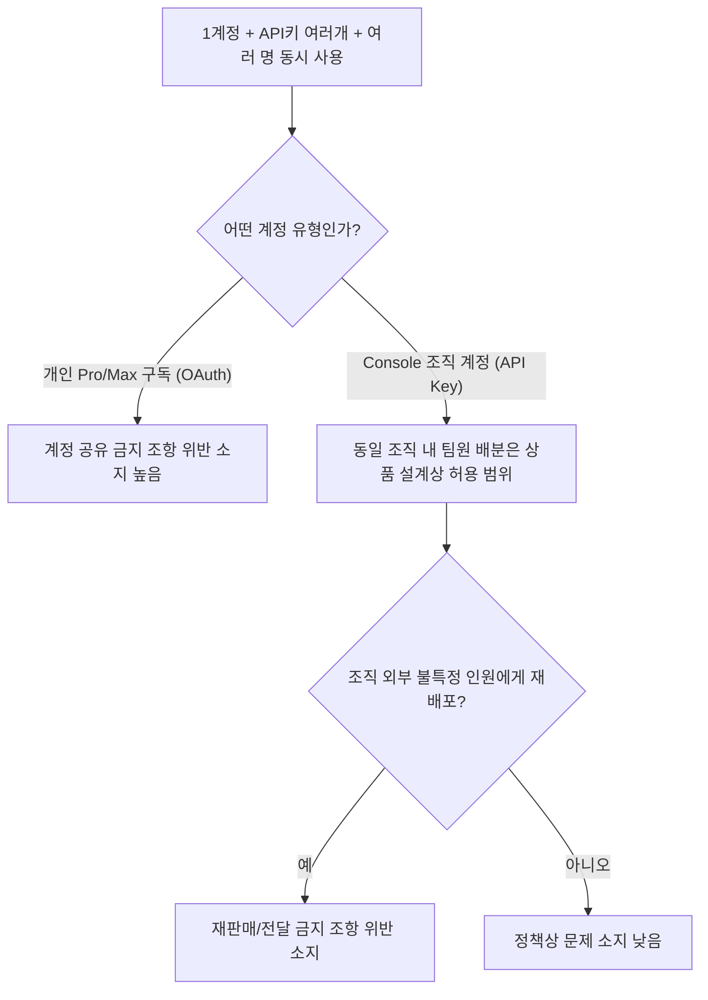

```
https://www.threads.com/@yyn.star/post/DbCEjLRgaqH

뭐가 의심스러운지 말도 안해주고
계정 활성화 하고 블락 먹이고
이의제기도 안받아주고
환불도 안해주고.
생각해보니 화나네.
한정으로 열겠다 해서 계정 4개 한도 차면 결제하고 결제하고 카드 돌려막기도 안한 내가
계정 돌려막기를 다해봤는데..
횡포 대단하다. ㅜㅠ
```


## 들어가며

공유해주신 화면은 Anthropic이 사용 정책(Usage Policy) 위반이 확인된 계정에 보내는 정지 통보문입니다. "귀하의 계정과 관련된 의심스러운 징후에 대한 내부 조사 결과, 사용 정책 위반이 확인되었습니다"라는 문구는 구체적인 위반 사유를 적시하지 않은 정형화된 템플릿 문구이며, 이는 이 통보에만 국한된 것이 아니라 Anthropic이 정책 위반으로 계정을 제한할 때 공통적으로 사용하는 방식입니다. 아래에서는 이 통보문이 가리키는 "계정"의 정확한 범위, 어떤 행위가 정지 사유가 되는지, 그리고 질문하신 "계정 1개에 API 키를 여러 개 발급해서 Claude Code로 여러 명이 동시에 접속하는 경우"가 정책 위반에 해당하는지를 Anthropic의 공식 문서(Consumer Terms of Service, Usage Policy, Safeguards Warnings and Appeals)를 근거로 정리했습니다. 이어서 함께 캡처해주신 Threads 스레드에서 논의되던 "계정 돌려막기" 이슈에 대해서도 공식 정책과 커뮤니티에서 보고되는 사례를 구분해서 설명드립니다.

먼저 결론부터 말씀드리면, 이 통보문에서 말하는 "계정"은 **claude.ai에 로그인하는 개인 소비자 계정(Free/Pro/Max)** 을 가리키며, 질문하신 "계정 1개 + API 키 여러 개 + 여러 명 동시 사용" 구조는 **원칙적으로 계정 공유 금지 조항에 해당해 정책 위반으로 간주될 가능성이 높습니다.** 다만 어떤 방식으로 API 키를 발급받았는지(개인 Pro/Max 구독 vs. Anthropic Console 조직 계정)에 따라 사정이 달라지므로, 아래에서 구분해서 설명드리겠습니다.

---

## 1. 이 통보문이 말하는 "계정"은 정확히 무엇인가

Anthropic은 두 가지 근본적으로 다른 계약 체계를 운영하고 있습니다.

- **Consumer 계정(소비자 계정)**: claude.ai에서 로그인해서 쓰는 Free, Pro, Max 플랜. 이 계정은 **Consumer Terms of Service**의 적용을 받습니다. Claude Code를 Pro/Max 구독으로 로그인해서 쓰는 경우도 여기 포함됩니다. 인증 방식은 OAuth 토큰입니다.
- **Console(개발자/조직) 계정**: console.anthropic.com에서 결제 수단을 등록하고 API 키를 발급받아 토큰 단위로 과금되는 계정. 이 계정은 **Commercial Terms of Service**의 적용을 받습니다.

캡처하신 통보문의 문구("Claude에 대한 귀하의 액세스를 취소했습니다")와 배경 스타일은 claude.ai 로그인 시 표시되는 소비자용 정지 화면과 일치합니다. 즉 이 통보는 **개인이 로그인하는 claude.ai/Claude Pro/Max 계정**에 대한 것이며, 회사 단위의 Console 조직 계정과는 별개의 시스템입니다. 실제로 Anthropic 고객센터 문서에서도 소비자 계정이 정지되어도 별도의 API Console 계정 접근에는 영향을 주지 않는다고 설명하고 있어, 이 두 체계가 서로 독립적으로 운영된다는 점이 확인됩니다.



캡처하신 정지 통보문은 위 그림에서 왼쪽(CONSUMER) 경로, 즉 claude.ai 로그인 계정에 해당하는 안내문입니다.

---

## 2. 공식적으로 밝힌 계정 정지(ban)의 세 가지 사유

Anthropic의 공식 고객센터 문서인 "Safeguards warnings and appeals"에는 계정을 정지시키는 사유를 다음 세 가지 범주로 명시하고 있습니다.

- 사용 정책(Usage Policy)의 반복적 위반
- 지원되지 않는 지역(unsupported location)에서의 계정 생성
- 서비스 약관(Terms of Service) 위반

이 문서는 정지된 계정으로 claude.ai에 로그인하면 이의제기 양식(appeal form)에 접근할 수 있으며, 계정이 정지된 상태에서도 본인 데이터 내보내기(export)와 계정 삭제는 별도 문의 없이 스스로 처리할 수 있다고 안내합니다. 다만 어떤 정책을 위반했는지에 대한 세부 사유는 정지 화면이나 이메일에 구체적으로 명시되지 않는 것이 일반적인 운영 방식이며, 이는 어뷰징 탐지 로직이 노출되어 우회되는 것을 막기 위한 조치로 보입니다. 이의가 있는 경우 이의제기 양식을 제출하거나, 경고(warning) 관련 사안이라면 usersafety@anthropic.com으로 상황을 설명하는 이메일을 보내도록 안내되어 있습니다.

---

## 3. Usage Policy 중 "플랫폼 어뷰징 금지" 조항의 구체적 내용

Anthropic의 Usage Policy에는 "Do Not Abuse our Platform(플랫폼을 어뷰징하지 말 것)"이라는 항목이 별도로 존재하며, 여기에 계정 관련 금지행위가 구체적으로 나열되어 있습니다. 주요 항목을 그대로 옮기면 다음과 같습니다.

- 탐지를 피하거나 제품 보호장치를 우회하기 위해 여러 계정에 걸쳐 악의적 활동을 조율하는 행위, 또는 정책을 위반하는 동일하거나 유사한 입력을 반복 생성하는 행위
- 계정 생성 자동화 또는 스팸성 행위에 자동화를 이용하는 행위
- 새 계정 생성, 기존 계정 사용, 혹은 이전에 정지된 사람이나 단체에 접근권을 제공하는 방식으로 **정지(ban)를 우회**하는 행위
- 지원 지역 정책(Supported Regions Policy)을 위반하여 계정 또는 API 접근을 제공하거나 이를 돕는 행위
- 사전 승인 없이 가드레일을 우회해 유해한 출력을 생성하도록 지시하는 행위(예: 탈옥, 프롬프트 인젝션)

여기서 핵심은 "여러 계정을 보유하는 것 자체"가 금지 대상이 아니라 **탐지를 피하기 위해 여러 계정을 조율하는 행위**와 **정지를 우회하기 위해 다른 계정을 이용하는 행위**가 명시적으로 금지되어 있다는 점입니다. 즉 Anthropic이 실제로 문제 삼는 것은 계정의 "개수"가 아니라 계정 간 상호작용의 "패턴"입니다.

---

## 4. 질문하신 "계정 1개 + API 키 여러 개 + Claude Code 동시 접속" 사례

```
여기서 “계정”이라 말하는 것은 정확히 뭐야? 어떤 경우 막히는거야? 1계정에 api key 여러개
발급해 Claude Code 여러명이 각각의 api key 이용해서 동시에 접속해 사용하는 것도 해당하는거야? 
```

이 부분이 실무적으로 가장 중요한 질문이라 정확히 짚어드리겠습니다. Consumer Terms of Service 제2조(Account creation and access)에는 다음과 같이 명시되어 있습니다.

계정 로그인 정보나 Anthropic API 키, 계정 자격증명을 다른 사람과 공유해서는 안 되며, 본인의 계정을 다른 누구도 사용할 수 있게 해서는 안 된다는 내용이 원문에 담겨 있습니다. 그리고 계정 하에서 발생하는 모든 활동에 대한 책임은 계정 소유자 본인에게 있다고 규정하고 있습니다.

이 조항을 질문하신 시나리오에 대입하면 다음과 같이 정리됩니다.

- **하나의 개인 Pro/Max 구독(claude.ai 계정)에서 발급된 인증 정보를 여러 사람이 나눠 쓰는 경우**: 이는 "계정을 다른 사람이 이용 가능하게 만드는 행위"에 정확히 해당해 **계정 공유 금지 조항 위반**입니다. Pro/Max 플랜은 OAuth 토큰 기반 인증을 쓰는데, 이 토큰은 원래 계정 소유자 개인이 Claude.ai와 Claude Code에서만 쓰도록 설계된 것이지, 제3자에게 로그인을 제공하거나 다른 사람의 요청을 대신 처리해주는 용도로는 허용되지 않습니다. "API 키를 여러 개 만들었다"는 사실 자체가 면죄부가 되지 않습니다. 핵심은 키의 개수가 아니라 **한 계정을 실제로 사용하는 사람이 여러 명인지 여부**입니다.
- **Anthropic Console(조직 API 계정)에서 프로젝트별로 팀원에게 개별 API 키를 발급하는 경우**: 이는 성격이 다릅니다. Console은 원래 한 조직이 여러 개발자에게 프로젝트 단위로 키를 나눠주고, 키별로 사용량과 비용을 추적하도록 설계된 상품입니다. 이 경우는 Commercial Terms of Service의 적용을 받으며, 같은 고객(조직) 소속 인원들이 API 키를 나눠 쓰는 것은 상품 설계상 예정된 사용 방식입니다. 다만 이 구조에서도 "그 조직에 속하지 않은 외부의 불특정 최종 사용자에게 재판매하듯 접근권을 넘기는 것"은 별도로 금지되어 있어, 무제한으로 허용되는 것은 아닙니다.

정리하면, **질문하신 상황이 개인 Pro/Max 구독 하나를 여러 명이 Claude Code로 동시 접속해 나눠 쓰는 구조라면, API 키 개수와 무관하게 계정 공유 금지 조항 위반 소지가 있다**는 것이 공식 약관에 근거한 정확한 답변입니다. 반대로 회사 명의 Console 계정에서 팀원들에게 프로젝트별 키를 나눠준 것이라면, 이는 상품이 원래 지원하는 사용 방식에 해당합니다.



---

## 5. 환불이 되지 않는 이유

Consumer Terms of Service 제6조(Subscriptions, fees and payment)에는 법으로 요구되거나 약관에 명시적으로 규정된 경우를 제외하고는 모든 결제가 환불되지 않는다는 원칙이 규정되어 있습니다. 그리고 제12조(General terms)의 계약 해지(Termination) 조항에는, 약관 위반을 이유로 서비스 접근이 종료되고 구독 중이었던 경우 환불을 받을 권리가 없다는 점이 별도로 명시되어 있습니다. 반대로 Anthropic이 위반과 무관한 다른 사유로 구독을 임의 종료하는 경우에는 남은 기간에 대해 일할 계산으로 환불한다고 규정되어 있어, "위반으로 인한 정지"와 "회사 사정에 의한 임의 해지"를 다르게 취급하고 있습니다.

다만 한국 거주자에게는 별도의 보호 장치가 있습니다. 같은 약관에는 브라질, 멕시코, 한국, 대만 거주자의 경우 구독 개시 후 7일 이내에는 사유를 밝히지 않고 철회할 수 있는 법적 권리가 있다고 명시되어 있습니다. 다만 이 7일 철회권은 "새로 구독을 시작한 시점"을 기준으로 한 소비자 보호 규정이며, 정책 위반으로 이미 정지된 계정에 소급 적용되는 조항은 아닙니다. 즉 정지 이후의 환불 거부는 안타깝지만 약관상 명시된 대로 처리된 것으로 보이며, 다만 정지 사유 자체가 잘못 판단된 것이라고 생각되신다면 이의제기 절차를 통해 다투는 것이 유일한 공식 경로입니다.

---

## 6. Threads 스레드에서 논의된 "계정 돌려막기" 이슈에 대한 사실관계 정리

공유해주신 스레드에서는 "한정 수량으로 계정을 풀었는데 그 한도를 넘겨 여러 계정을 만들어 돌려썼더니 어뷰징으로 간주되어 정지당했다"는 취지의 경험담과, "1인 1계정 초과가 곧 어뷰징이냐"는 논쟁이 오가고 있었습니다. 이 부분은 공식 문서에 명시된 내용과 커뮤니티에서 보고되는 실제 경험 사이에 간극이 있어 구분해서 설명드리는 것이 정확합니다.

**공식 정책에 명시된 부분**: 위 3번 항목에서 인용한 대로, Usage Policy는 "여러 계정을 보유하는 것" 자체를 금지 행위로 규정하지 않았습니다. 명시적으로 금지된 것은 (1) 탐지 회피를 위해 여러 계정을 조율하는 행위와 (2) 이미 정지된 계정을 우회하기 위해 다른 계정을 만들거나 이용하는 행위입니다. 즉 "다계정 보유"와 "다계정을 이용한 어뷰징"은 정책상 구분되는 개념입니다.

**커뮤니티에서 보고되는 부분(공식 확인 자료는 아니며 사용자 후기·업계 블로그 기반 추정)**: 2026년 상반기 이후 여러 사용자 커뮤니티에서, 동일 기기·동일 IP·유사한 결제 수단으로 여러 개의 유료 구독 계정을 운영하던 사용자들이 자동화된 이상행위 탐지 시스템에 의해 함께 정지되는 사례가 다수 보고되었습니다. 이런 분석 글들은 공식 정책상 다계정 자체는 문제가 아니라고 명시되어 있음에도, 자동 탐지 시스템이 "같은 기기에서 여러 계정이 비슷한 패턴으로 동시에 쓰이는 신호"를 재판매·어뷰징 패턴과 구분하지 못해 정상적인 다계정 사용자까지 함께 걸러내는 경우가 있다고 지적합니다. 다만 이 내용은 Anthropic이 공식적으로 발표한 자료가 아니라 제3자 블로그와 커뮤니티 경험담을 취합한 추정이므로, 스레드에 등장한 "IP·카드·기기를 전부 바꿔야 한다"거나 "한 번이라도 걸친 이력이 있으면 영구 차단된다"는 식의 구체적 주장은 Anthropic이 공식적으로 확인해준 사실이 아니라 사용자들의 경험적 추측에 가깝다는 점을 유념하실 필요가 있습니다.

정리하면, "먼저 경고를 받은 상태에서 이를 우회하려고 여러 계정을 돌려썼다"는 스레드 속 상황은 Usage Policy가 명시적으로 금지하는 "정지 우회 행위"에 해당할 소지가 커 보이며, 이 경우 커뮤니티에서 "계정 돌려막기가 어뷰징이다"라고 판단하는 근거도 이 조항에서 나온 것으로 보입니다. 반면 애초에 아무런 경고 이력 없이 순수하게 여러 계정을 각각 정상 결제해서 쓰는 것 자체는 공식 정책상 금지 행위로 명시되어 있지 않습니다.

---

## 7. 이의제기 시 실무적으로 확인해야 할 것

- claude.ai에 정지된 계정으로 로그인하면 자동으로 이의제기 양식이 있는 화면으로 연결됩니다. 로그인이 되어야만 접근할 수 있는 구조입니다.
- 이의제기 화면에서는 계정 삭제와 본인 데이터 내보내기도 별도 문의 없이 셀프서비스로 가능합니다. 다만 위반 사유에 따라 내보낼 수 있는 데이터 범위가 제한될 수 있다고 안내되어 있습니다.
- 경고(warning) 자체에 이의가 있는 경우는 이의제기 양식이 아니라 usersafety@anthropic.com으로 이메일을 보내는 별도 경로가 안내되어 있습니다.
- 처리 기간은 공식적으로 안내된 바가 없으며, 최근 문의량 증가로 응답이 평소보다 지연되고 있다는 안내가 고객센터 페이지에 게시되어 있습니다.

---

## 마무리

정리하면, 이 통보문은 claude.ai 소비자 계정에 대한 정형화된 정지 통보이며, 세부 사유가 명시되지 않는 것은 이례적인 일이 아니라 Anthropic의 일반적인 운영 방식입니다. 질문하신 "계정 1개, API 키 다수 발급, 여러 명 동시 사용" 구조는 개인 Pro/Max 구독이라면 계정 공유 금지 조항에 저촉될 소지가 있고, 조직 명의의 Console 계정이라면 사정이 다릅니다. 환불이 되지 않는 것은 약관상 예정된 결과이며, 한국 거주자의 7일 철회권은 신규 구독 초기에만 적용되는 별개의 권리입니다. 답답하고 억울하게 느껴지는 지점, 특히 사유를 구체적으로 알려주지 않는 부분과 사람이 개입하는 상담 창구가 사실상 사라진 부분은 실제로 많은 사용자들이 공통적으로 지적하는 불편함이며, 이 감정 자체는 충분히 타당합니다. 다만 정지 사유가 오판이라고 판단되신다면, 감정적으로 소진되기보다는 이의제기 양식을 통해 구체적인 사용 경위(어떤 기기, 어떤 방식으로 계정을 이용했는지)를 최대한 상세히 설명하는 것이 현재로서는 가장 실질적인 대응 경로입니다.

---

## 참고 문헌 (공식 출처)

- Anthropic, "Safeguards warnings and appeals", support.claude.com, https://support.claude.com/en/articles/8241253-safeguards-warnings-and-appeals
- Anthropic, "Consumer Terms of Service" (2025년 10월 8일 발효), https://www.anthropic.com/legal/consumer-terms
- Anthropic, "Usage Policy" (2025년 9월 15일 발효), https://www.anthropic.com/legal/aup
- Anthropic, "Commercial Terms of Service", https://www.anthropic.com/legal/commercial-terms
- 커뮤니티/제3자 분석 자료(공식 확인 자료 아님, 정황 참고용): 2026년 2월 이후 다계정 사용자 정지 관련 사용자 커뮤니티 보고 및 업계 블로그 분석 글

---

작성일자: 2026-07-21
