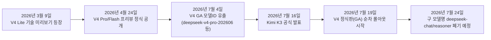
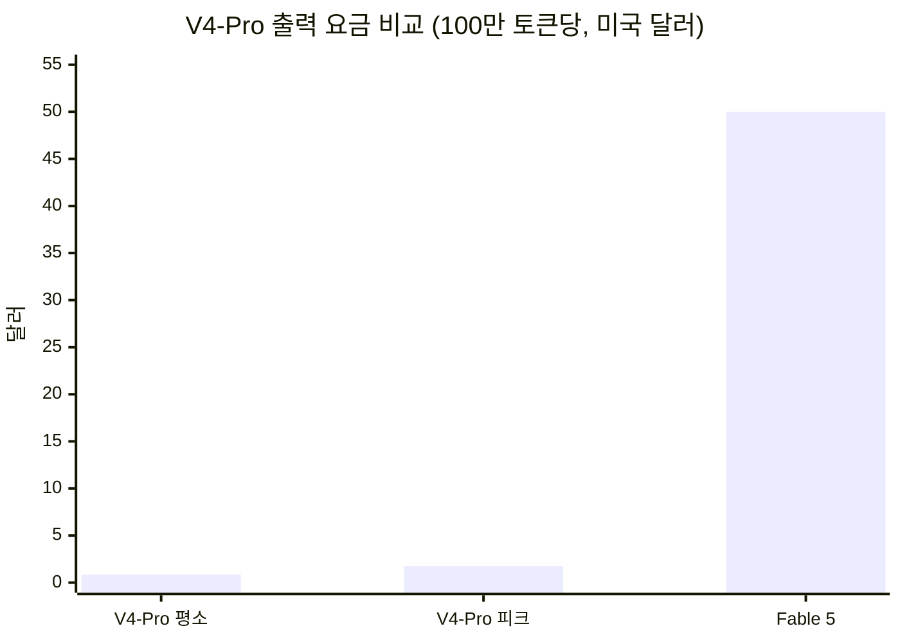
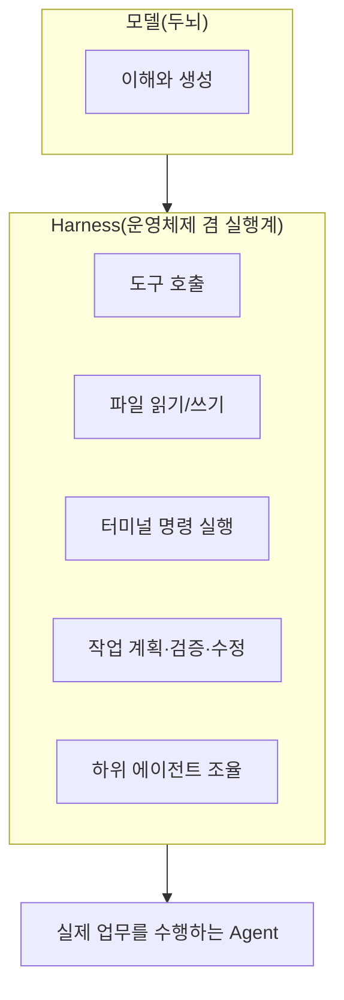
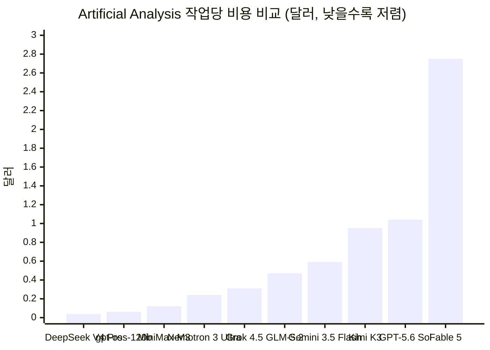

## 관련글

[**딥시크 V4 정식판 출시 임박, 'Harness' 품은 DeepCode로 Claude Code 정조준**](https://www.facebook.com/share/p/1BjJvraugf/)

## 목차

1. 들어가며 — 사흘 간격으로 벌어진 두 사건
2. Kimi K3가 먼저 쏘아 올린 신호탄
3. DeepSeek V4, 프리뷰에서 정식판까지 걸어온 길
4. V4 정식판의 몸통 — 아키텍처와 두 가지 모델
5. 벤치마크로 본 V4의 진짜 위치
6. 피크-밸리 요금제, 발상의 전환
7. 유출된 데모가 보여준 것 — 3D와 게임 코드 생성
8. Harness란 무엇인가 — "Model + Harness = Agent"
9. DeepCode와 추이티엔이라는 인물
10. 왜 지금인가 — Claude Code, Codex, 그리고 시장의 크기
11. 냉정하게 본 V4의 한계
12. 전망 — 모델 전쟁에서 에이전트 전쟁으로
13. 2026년 7월 21일 현재 상황 정리
14. 참고자료

---

## 1. 들어가며 — 사흘 간격으로 벌어진 두 사건

2026년 7월 16일, 문샷AI(Moonshot AI)가 2조 8천억 파라미터 규모의 오픈 웨이트 모델 Kimi K3를 공개하면서 전 세계 AI 커뮤니티가 술렁였다[1]. 그리고 그로부터 사흘 뒤인 7월 19일, DeepSeek가 4월에 내놓았던 V4 프리뷰의 완결판, 이른바 "만혈판(滿血版, full-power version)"의 정식 출시(GA, General Availability)를 시작했다[8]. 두 사건 사이의 간격이 나흘이 아니라 사흘이라는 점은 사소해 보이지만, 이는 DeepSeek가 K3가 만든 화제성이 가라앉기 전에 정확히 그 파도 위에 올라타는 전략을 선택했음을 보여주는 세부 증거다. 중국 매체들 역시 이 타이밍을 두고 "K3 열기가 채 가시기도 전에 DeepSeek가 카드를 꺼내 들었다"고 평가했다[10][12].

더 중요한 것은 V4 정식판과 함께 거론되고 있는 또 다른 제품이다. 내부 코드명 "DeepCode"로 불리는 이 제품은 앤트로픽의 Claude Code를 정면으로 겨냥한 코드 에이전트, 즉 Harness 제품이다. 이 문서는 두 축 — 모델 자체인 V4 정식판과, 그 위에 얹힐 실행 계층인 DeepCode — 을 모두 다루되, 확인된 사실과 아직 소문 단계에 머물러 있는 내용을 분명히 구분하며 서술한다.

## 2. Kimi K3가 먼저 쏘아 올린 신호탄

Kimi K3는 2026년 7월 16일(한국 시간 17일 새벽) 공식 발표되었다[1][2]. 2조 8천억 개의 파라미터를 지닌, 당시 기준 세계 최대의 오픈 웨이트 모델이었으며, 100만 토큰의 컨텍스트 윈도우와 네이티브 비전 이해 능력을 갖췄다[2][3]. 아키텍처 측면에서는 Kimi Delta Attention(KDA)과 Attention Residuals(AttnRes)라는 새로운 하이브리드 선형 어텐션 메커니즘을 도입했으며, 혼합 전문가(Mixture of Experts) 구조 안에 896개의 전문가 모듈을 두고 매 연산마다 그중 16개만 활성화하는 방식으로 총 지식 용량과 연산 비용을 분리했다[4].

다만 한 가지 짚어야 할 부분이 있다. 발표 당시 공개된 것은 웹과 API를 통한 접근권이었을 뿐, 전체 가중치는 아니었다. 문샷AI는 가중치 전체 공개 시점을 7월 27일로 예고했고, 이 글을 쓰는 시점(7월 21일)까지도 가중치와 정식 기술 보고서, 라이선스는 공개되지 않은 상태다[1]. 성능 면에서는 출시 당시 Artificial Analysis 리더보드에서 Claude Fable 5와 GPT-5.6 Sol에 이어 종합 3위로 데뷔했지만, 일부 실용적인 코딩 테스트에서는 오히려 1위를 차지하기도 했다[3]. DeepSeek 입장에서 K3는 두 가지를 동시에 증명한 사건이었다. 하나는 중국 오픈소스 모델이 미국 프론티어 랩과 벤치마크상 근접할 수 있다는 것, 다른 하나는 이런 뉴스가 터졌을 때 시장의 관심이 얼마나 빠르게 집중되는가였다.

## 3. DeepSeek V4, 프리뷰에서 정식판까지 걸어온 길

DeepSeek V4의 역사는 생각보다 길다. 2026년 3월 9일 "V4 Lite"라는 이름의 초기 기술 미리보기가 공식 홈페이지에 잠시 등장했고[해당 등장은 여러 매체가 언급하나 DeepSeek 공식 발표는 아니었다], 이어 4월 24일 V4 Pro와 V4 Flash 두 모델이 "프리뷰" 버전으로 정식 공개되며 API와 오픈 웨이트가 동시에 풀렸다[9]. DeepSeek는 이 4월 버전을 스스로 "프리뷰"라고 못박았는데, 이는 실사용 피드백을 모아 완결판을 다듬겠다는 뜻이었다[6].

이후 석 달 가까이 이어진 대기 끝에, 2026년 7월 중순 정식판(GA) 출시가 예고되었고[6], 실제로는 7월 19일부터 순차적으로 롤아웃이 시작된 것으로 다수의 매체가 보도했다[8][10][13]. 이 시점은 4월 24일 프리뷰 공개로부터 약 3개월이 지난 시점으로, 원 자료에서 언급한 "3개월 만의 완결판"이라는 표현과 정확히 들어맞는다. DeepSeek는 이와 함께 기존 API 모델명인 `deepseek-chat`과 `deepseek-reasoner`를 2026년 7월 24일부로 완전히 폐기하고, 이후 요청을 모두 `deepseek-v4-flash` 계열로 라우팅하겠다고 공지했다[9][12]. 다만 한 가지 분명히 해둘 부분이 있다. 이 글을 작성하는 7월 21일 기준으로 V4 GA 자체는 여러 매체를 통해 "출시 시작"이 보도되고 있지만, DeepSeek 공식 계정을 통한 완전한 정식 발표문과 최종 벤치마크 표는 아직 확인되지 않고 있으며, 일부 수치는 개별 개발자의 그레이 테스트(제한적 사전 접근) 경험담에 의존하고 있다는 점이다[10][12]. 즉 "출시되고 있는 중"이라는 서술이 "이미 모든 것이 공식적으로 확정되었다"는 의미는 아니다.

## 4. V4 정식판의 몸통 — 아키텍처와 두 가지 모델

V4는 플래그십 Pro와 경량 Flash 두 축으로 구성된다. V4-Pro는 총 파라미터 1.6조 개, 활성 파라미터는 약 490억 개이며, V4-Flash는 총 파라미터 2,840억 개에 활성 파라미터 약 130억 개다[9][20]. 두 모델 모두 전문가 혼합(MoE) 구조를 채택했고, 압축 희소 어텐션(Compressed Sparse Attention, CSA)과 고도 압축 어텐션(Heavily Compressed Attention, HCA)을 결합한 하이브리드 어텐션을 통해 100만 토큰이라는 긴 컨텍스트에서도 연산 비용을 크게 낮췄다. 구체적으로 100만 토큰 환경에서 V4-Pro는 V3.2 대비 토큰당 추론 연산량(FLOPs)을 27%로, KV 캐시 사용량을 10% 수준으로 줄였다고 공개되어 있다[20][9].

이 밖에도 트릴리언 파라미터급 모델을 안정적으로 학습시키기 위한 다양체 제약 하이퍼커넥션(Manifold-Constrained Hyper-Connections, mHC), AdamW를 대체하는 Muon 옵티마이저, MoE 전문가 가중치에 대한 FP4 양자화 인식 학습(quantization-aware training) 등이 함께 적용되었다. 학습에 사용된 토큰 수는 33조 개 안팎으로, 이전 V3 계열의 14.8조 토큰 대비 두 배 이상 늘어났다[22-공개된 매체 기준].

## 5. 벤치마크로 본 V4의 진짜 위치

여기서 반드시 바로잡아야 할 숫자가 하나 있다. 원 자료에서는 V4-Pro의 SWE-bench Verified 80.6%를 "Claude Opus 4.8의 87.6%"와 비교했는데, 확인 결과 87.6%는 Opus 4.8이 아니라 그 이전 모델인 Claude Opus 4.7의 점수였다. 앤트로픽이 2026년 5월 28일 공식 출시한 Opus 4.8의 SWE-bench Verified 점수는 88.6%다[23][24][25]. 즉 V4-Pro(80.6%)와 Opus 4.8(88.6%) 사이의 격차는 "한 자릿수 차이"라기보다는 8점 정도로, 원 자료가 인용한 수치보다 격차가 조금 더 크다. 다만 V4-Pro가 발표 당시 비교 대상으로 삼았던 것이 Opus 4.6(80.8%)이었다는 정황도 있어[21][22], 어느 시점의 Claude 모델과 비교하느냐에 따라 "근소한 차이"와 "뚜렷한 차이"라는 서로 다른 인상이 만들어질 수 있다는 점은 짚어둘 필요가 있다.

나머지 벤치마크에서는 원 자료의 수치가 여러 독립 매체를 통해 대체로 일관되게 확인된다. LiveCodeBench에서 V4-Pro는 93.5%를 기록해 Claude(88.8%)를 앞섰고, Codeforces Elo 레이팅은 3,206점으로 인간 대회 참가자 중 약 23위에 해당하는 수준이다[20][21][22]. Terminal-Bench 2.0에서도 V4-Pro가 67.9%로 Opus 4.6의 65.4%를 웃돈다는 보고가 있다[20][22]. 반대로 V4가 뒤처지는 영역도 분명하다. Humanity's Last Exam(HLE)에서는 37.7%로 Opus 4.6의 40.0%에 못 미치고[20], 롱컨텍스트 검색 능력을 보는 MRCR(100만 토큰) 벤치마크에서는 83.5점으로 Opus 4.6의 92.9점과 상당한 차이를 보인다[22]. 특히 눈여겨볼 부분은 SWE-bench Pro라는, 오염(contamination) 가능성을 낮추기 위해 새로 설계된 더 어려운 벤치마크에서의 성적이다. V4-Pro는 여기서 55.4%에 그쳐, Opus 4.6(53.4~54.2%대)과는 비슷하지만 Opus 4.7(64.3%)이나 Opus 4.8(69.2%)에는 뚜렷이 못 미친다[21][23][24]. 정리하면, V4는 "표준" SWE-bench Verified나 LiveCodeBench 같은 이미 포화 상태에 가까운 벤치마크에서는 최상위권과 근접하지만, 더 어렵고 새로 설계된 장기 과제형 벤치마크로 갈수록 격차가 다시 벌어지는 패턴을 보인다.

## 6. 피크-밸리 요금제, 발상의 전환

V4 정식판이 던진 가장 파격적인 변화는 성능이 아니라 가격 정책 그 자체다. DeepSeek는 이번에 업계 최초로 시간대별 차등 요금, 이른바 피크-밸리(peak-valley) 요금제를 도입했다[5][6]. 피크 시간은 베이징 시간 기준 평일 오전 9시부터 낮 12시까지, 오후 2시부터 저녁 6시까지 총 7시간이며, 이 구간의 API 요금은 평소의 두 배로 책정된다[5][6]. 반대로 평일 야간(저녁 6시부터 다음 날 오전 9시까지)과 주말 전체는 오프피크 구간으로, 평소 대비 60% 저렴한 요금이 적용된다[5].

구체적인 숫자로 보면, V4-Pro의 출력 요금은 평소 100만 토큰당 0.87달러, 피크 시간에는 1.74달러다. V4-Flash는 평소 0.28달러, 피크 시간에는 0.56달러다[5][12]. 이 수치는 2026년 5월 22일에 영구 조정된 요금(원래 75% 할인 프로모션이 상시 요금으로 전환된 결과)과 동일한 기준선 위에서 시간대 배율만 얹은 것으로, DeepSeek 스스로도 이를 "전면 인상이 아니라 실제 연산 부하에 따른 차등 청구"라고 설명하고 있다[5]. 앤트로픽의 Claude Fable 5가 100만 출력 토큰당 50달러로 책정되어 있다는 점과 비교하면[33][34], V4-Pro의 평소 요금은 Fable 5 대비 약 57분의 1(50 ÷ 0.87 ≈ 57.5), V4-Flash는 약 178분의 1(50 ÷ 0.28 ≈ 178.6) 수준이다. 원 자료가 제시한 두 배율은 이 계산과 정확히 일치한다.

이 요금 구조의 실질적 효과를 보여주는 사례도 있다. 한 개발자는 《오징어 게임》을 소재로 한 미니 게임을 V4로 코딩하면서 약 3,000줄의 코드를 생성했는데, 총비용이 0.12달러에 불과했다고 밝혔다[10][11]. Artificial Analysis가 집계하는 "작업당 비용(Cost per Task)" 지표에서도 DeepSeek V4 Pro(max)는 작업당 0.04달러로 나타나, GPT-5.5(xhigh)의 0.99달러 대비 20배 이상, Claude Opus 4.8(max)의 1.78달러 대비 40배 이상 저렴한 것으로 보고된 바 있다[26][27]. 다만 이 수치는 Artificial Analysis가 지속적으로 업데이트하는 지표이므로, 측정 시점에 따라 소폭 달라질 수 있다는 점은 감안해야 한다.

## 7. 유출된 데모가 보여준 것 — 3D와 게임 코드 생성

V4 정식판 그레이 테스트(제한적 사전 접근) 참여자들이 공유한 데모 영상들은 성능 못지않게 화제를 모았다. 유출된 자료에 따르면 V4 Pro는 공성 노포(crossbow) 형태의 차량을 조작해 표적을 맞히는 3D 모의 사격 게임을 생성했고, 《마인크래프트》와 《노 맨즈 스카이》를 뒤섞은 듯한 HTML 기반 하이브리드 게임, 그리고 클래식 게임 《밧줄 자르기(Cut the Rope)》를 단 한 번의 실행으로 만들어냈다[10][11]. 이 밖에도 Xbox 컨트롤러를 표현한 SVG 테스트 등 다양한 시각적 결과물이 공유되었다[11].

테스트에 참여한 개발자 중 한 명인 Pankaj Kumar는 V4의 전반적인 성능이 Opus 4.8 수준에 근접했고, 코딩 능력은 GPT-5.6 Sol에 직접 맞설 만하다고 평가했다[11]. 특히 3D 생성 능력에 대해서는 V4가 Opus 4.8을 압도한다는 평가가 중국 매체들 사이에서 반복적으로 등장한다[10][11]. 다만 이런 평가는 어디까지나 개별 사용자의 그레이 테스트 체험담이며, DeepSeek가 3D 생성이나 게임 코드 생성에 특화된 공식 벤치마크 점수를 발표한 것은 아니라는 점을 분명히 해둘 필요가 있다. 일부 테스터는 한발 더 나아가 특정 게임 코드 생성 테스트에서는 V4 정식판이 Fable 5와 GPT-5.6을 능가했다는 더 과감한 주장을 내놓기도 했지만[10][11], 이 역시 체계적으로 재현 가능한 벤치마크라기보다는 개인 체감에 가까운 평가로 받아들이는 것이 안전하다. 흥미롭게도 일부 테스터는 V4의 사고 과정(Chain of Thought)이 예전보다 Claude 특유의 스타일에 가까워졌다고 지적하기도 했다. 코드를 통째로 나열하기보다 "핵심 기능 작성", "주요 장면 코드 작성" 같은 요약적 단계로 사고를 전개하는 방식이 이전 버전보다 두드러졌다는 것이다[10].

## 8. Harness란 무엇인가 — "Model + Harness = Agent"

이제 이 문서의 두 번째 축인 DeepCode로 넘어가기 전에, Harness라는 개념 자체를 짚어야 한다. AI 업계에서는 최근 "Agent = Model + Harness"라는 공식이 널리 통용되고 있다. 모델이 "생각하는 두뇌"라면, Harness는 그 두뇌를 실제 작업 현장과 연결하는 몸이자 운영체제에 해당한다. 도구 호출, 파일 읽기와 쓰기, 터미널 명령 실행, 작업 계획 수립과 검증, 여러 하위 에이전트 간의 조율 등, 모델 자체가 직접 처리하지 않는 모든 공학적 작업이 여기에 포함된다. DeepSeek가 채용 공고에 직접 적어놓은 표현을 빌리면, "모델 본체를 제외한 나머지 모든 작업이 Harness의 영역"이다[14][16].

2025년 말부터 2026년 초 사이 앤트로픽이 이 개념을 자사 Claude Code 전략의 핵심으로 부각시킨 이후, OpenAI와 구글, 아마존 등도 잇따라 Harness를 에이전트 전략의 중심에 두기 시작했다. 지나치게 단순화하자면, 모델의 절대 성능만으로 승부하던 국면에서 "그 모델을 실제 업무 환경에 어떻게 배치하고, 얼마나 안정적으로 검증·수정할 수 있는가"로 경쟁의 축이 옮겨간 것이다[17].

## 9. DeepCode와 추이티엔이라는 인물

DeepSeek가 이 흐름에 뒤처지지 않기 위해 움직인 시점은 생각보다 이르다. 2026년 5월 15일과 18일, DeepSeek는 채용 플랫폼 모카(Moka)에 "Agent Harness 제품 매니저"와 "Agent Harness 연구개발 엔지니어" 두 직무를 베이징 근무 조건으로 공고했다[14][16]. 이는 DeepSeek가 공식 채용 정보에 "에이전트 제품화"를 별도 팀의 핵심 과제로 명시한 첫 사례였다[14]. DeepSeek의 수석 연구원 천더리(陈德里)는 이 시기 소셜미디어를 통해 이 움직임을 직접 확인하며, "간단히 말하면 Claude Code를 벤치마킹해 DeepSeek Code Harness를 만드는 것"이라고 밝혔다[14][15][16].

이 팀의 핵심 인물로 지목되는 사람이 추이티엔이(崔添翼)다. 공개된 정보에 따르면 그는 저장대학교(浙江大学) 컴퓨터공학과 출신으로, 정보학 경시대회 성적으로 특례 입학했으며 ACM 아시아 지역예선에서 여섯 차례 금메달을 수상한 경력이 있다[18]. 이후 글로벌 퀀트 트레이딩 회사 Jane Street에서 9년간 근무했고, 이후 TSY Capital을 공동 창업했다[17][18]. (원 자료는 그를 "ACM-ICPC 골드메달리스트"로 표현했으나, 확인된 자료를 기준으로 하면 정확히는 ACM 아시아 지역예선 금메달 6회 수상 경력이며, 세계 결승 ICPC 골드와는 구분해서 이해하는 편이 정확하다.) 퀀트 트레이딩 시스템이 요구하는 저지연성, 안정성, 자동화된 실행과 리스크 관리 경험이 코드 에이전트 Harness 설계와 상당 부분 통하는 지점이 있다는 것이 그의 영입을 주목하는 이유로 꼽힌다[17][18].

이 Harness 팀이 만들고 있는 제품의 코드명이 바로 "DeepCode"다[19]. 다만 반드시 구분해야 할 지점이 있다. DeepSeek 생태계에는 이미 커뮤니티가 만든 deepseek-harness라는 어댑터와, 터미널 기반 오픈소스 코딩 도구인 "DeepSeek-TUI" 또는 "Deep Code"라 불리는 프로젝트가 존재한다[15]. 이들은 외부 개발자들이 만든 비공식 도구다. 반면 이번에 다루는 DeepCode는 DeepSeek가 직접 개발하는 공식 Harness로, V4 모델과의 완전한 통합을 목표로 한다는 점에서 성격이 다르다[19].

## 10. 왜 지금인가 — Claude Code, Codex, 그리고 시장의 크기

DeepSeek가 굳이 지금 이 시장에 뛰어드는 이유는 숫자로 설명된다. 2026년 2월 로이터 보도에 따르면 Claude Code의 연환산 매출(run-rate revenue)은 이미 25억 달러를 돌파했다[29][30]. 이는 2025년 11월 10억 달러를 넘긴 지 불과 석 달 만에 두 배 이상 늘어난 수치로, 이후에도 성장세가 이어져 일부 추정치는 2026년 5월 기준 약 80억 달러 수준까지 성장했을 가능성을 제기한다[30]. 다만 이 80억 달러 수치는 공식 발표가 아니라 외부 분석 기관의 추정에 가까우므로 참고용으로만 받아들여야 한다.

경쟁사인 OpenAI의 Codex 역시 빠르게 성장했다. 2026년 1월 주간 활성 개발자 수가 약 60만 명이었던 것이, 4월 초 300만 명을 넘어섰고, 4월 21일 기준으로는 400만 명을 넘어섰다는 것이 확인된 수치다[31][32]. 원 자료가 언급한 "15일 만에 300만에서 400만으로"라는 서술은 정확히는 4월 초부터 4월 21일까지 약 3주 안팎에 걸쳐 일어난 변화에 더 가깝다. ChatGPT Business·Enterprise 안의 코덱스 사용자 역시 1월 대비 6배 성장했다고 OpenAI가 밝힌 바 있다[31].

즉 AI 코딩 에이전트 시장은 이미 조 단위 매출이 오가는 거대 시장으로 성장했고, DeepSeek는 이 시장에 기능적 우위가 아니라 압도적인 가격 우위로 진입하겠다는 전략을 세운 셈이다. DeepSeek 내부에서도 이런 시각이 감지된다. 지식인 매체 자쯔광녠(甲子光年)이 인용한 관계자는 "GitHub Copilot이 마이크로소프트 생태계로 기업 시장을 잡고, Cursor가 체험 우선 전략으로 독립 개발자를 잡고, Claude Code가 강력한 추론 능력과 에이전트 깊이로 존재감을 굳힌 지금, DeepSeek가 모델의 우위를 진짜 Harness 공학 능력으로 전환할 수 있다면 이 경쟁의 결과는 지금보다 훨씬 예측하기 어려워질 것"이라고 평가했다[16].

## 11. 냉정하게 본 V4의 한계

지금까지의 강점 나열과 별개로, 여러 독립 매체가 공통적으로 짚는 V4의 약점도 존재한다. 첫째, 동일한 작업을 수행할 때 Fable 5 대비 더 많은 반복(iteration) 횟수가 필요하다는 지적이 있다. 둘째, 롱컨텍스트 검색이나 전문적인 소프트웨어 엔지니어링, 특히 새로 설계되어 오염 가능성이 낮은 SWE-bench Pro 같은 벤치마크에서는 여전히 Opus 계열 모델이 우위에 있다[21]. 셋째, V4는 순수 절대 성능 면에서는 같은 시기 출시된 Kimi K3에도 다소 못 미친다는 평가가 나온다[10][12]. 넷째, 멀티모달(이미지·오디오·비디오) 능력이 아직 제한적이어서, 이 영역에서는 GPT 계열이 앞선다는 평가도 있다[22].

또한 V4의 코딩 스타일과 사고 과정이 Claude의 그것과 유사해졌다는 관찰에 대해, 일부 테스터들은 이를 두고 "Fable의 코딩 스타일과 반복 행동을 상당 부분 증류(distillation)한 것이 아니냐"는 추측을 내놓기도 했다[10]. 이는 어디까지나 정황적 추측이며 DeepSeek가 공식적으로 인정하거나 부인한 사안이 아니라는 점을 분명히 해둔다.

## 12. 전망 — 모델 전쟁에서 에이전트 전쟁으로

DeepSeek V4 정식판과 Harness 제품 DeepCode가 같은 시기에 거론되고 있다는 사실 자체가 하나의 신호다. 경쟁의 무게중심이 "누구의 모델이 더 똑똑한가"에서 "누구의 시스템이 그 모델을 실제 업무에 더 안정적으로 투입할 수 있는가"로 옮겨가고 있다는 것이다. DeepSeek는 R1 출시 이후로도 화려한 마케팅보다는 조용히 준비하다가 갑작스러운 출시와 함께 파격적인 가격을 제시하는 전략을 반복해왔다. 이번 V4 정식판과 피크-밸리 요금제, 그리고 아직은 베일에 싸인 DeepCode까지, 그 패턴은 이번에도 크게 다르지 않아 보인다.

다만 이 시나리오가 실제로 "DeepSeek 모먼트 2.0"이라 불릴 만한 파장을 일으킬지는 세 가지 조건에 달려 있다. 첫째, V4 정식판의 벤치마크가 공식적으로 확정되어 그레이 테스트 단계의 호평이 실제 수치로 뒷받침되는가. 둘째, DeepCode가 실제로 출시되어 Claude Code에 준하는 사용자 경험을 제공하는가. 셋째, 그 모든 것이 지금 알려진 파격적인 가격을 유지한 채로 이루어지는가이다. 이 세 조건이 동시에 충족된다면, Kimi K3가 만든 화제성을 훨씬 뛰어넘는 파장이 만들어질 가능성은 충분하다.

## 13. 2026년 7월 21일 현재 상황 정리

이 문서를 작성하는 시점(2026년 7월 21일)을 기준으로 확인 가능한 사실과 아직 확정되지 않은 부분을 구분해 정리하면 다음과 같다.

확인된 사실: Kimi K3는 7월 16일 공식 발표되었고, 전체 가중치는 7월 27일 공개 예정이다[1]. DeepSeek V4 정식판(GA)은 7월 19일부터 순차 롤아웃이 보도되었으며, 두 모델(Pro·Flash) 모두 100만 토큰 컨텍스트를 지원하고, 피크-밸리 요금제가 적용되고 있다[5][8][12]. 기존 모델명 `deepseek-chat`, `deepseek-reasoner`는 7월 24일 폐기 예정이다[9]. DeepSeek는 2026년 5월부터 Harness 전담 팀을 공식적으로 구성해왔으며, 그 목표를 Claude Code 벤치마킹으로 명시한 바 있다[14][15][16].

아직 확정되지 않은 부분: DeepCode라는 이름의 Harness 제품이 V4 GA와 정확히 같은 날 동시 출시되는지는 이 시점까지 공식 확인되지 않았다. 여러 매체는 "시장이 최종 출시 임박 단계로 추측하고 있다"는 수준으로 서술하고 있을 뿐, DeepSeek 공식 채널의 출시 발표는 확인되지 않는다[19]. 또한 V4의 3D 생성 능력이나 특정 게임 코드 생성에서 Fable 5·GPT-5.6을 능가했다는 평가 역시 개별 그레이 테스터의 체감 평가이며, 공식 벤치마크로 뒷받침되지는 않는다.

아래는 Artificial Analysis가 집계한 최근 시점의 작업당 비용(Cost per Task) 비교로, DeepSeek V4 Pro(max)가 프론티어 모델들 가운데 압도적으로 낮은 비용 구조를 보여주는 대목을 확인할 수 있다. 다만 이 수치는 측정 시점에 따라 계속 갱신되는 값이라는 점을 다시 한번 밝혀둔다.

결국 이 사안을 지켜보는 가장 균형 잡힌 태도는, DeepSeek가 가격과 오픈소스 전략에서는 이미 검증된 실력자라는 점을 인정하면서도, DeepCode라는 실행계층 제품이 실제로 얼마나 안정적이고 완성도 있게 나오는지는 별개의 문제로 남겨두는 것이다. 모델의 벤치마크 점수와 Harness의 실전 완성도는 종종 서로 다른 속도로 성숙하기 때문이다.

---

## 14. 참고자료

[1] Kimi K3 공식 발표: 2.8조·100만 토큰, 그런데 가중치는 아직 안 풀렸다 — 오픈위키 (2026.7)

[2] Kimi — 나무위키

[3] Kimi K3: Moonshot AI의 2.8T 오픈 웨이트 모델 — Eigent (2026.7.29 갱신본 기준)

[4] 2.8조 개 파라미터는 시작일 뿐 — PANews (2026.7)

[5] DeepSeek V4 정식 출시 7월 15일! 피크-밸리 요금으로 AI 연산을 전기처럼 — deepseek.day

[6] '초저가 AI' 딥시크의 변심? V4 정식 출시와 함께 7월 중순부터 피크 요금 2배 — 오픈위키 (2026.7.4)

[7] DeepSeek V4 Release: Leaks, Preview, and GA Signals — kie.ai

[8] DeepSeek V4 GA Is Here: Near-Opus Performance at 1/57th the Price of Fable 5 — Wan 2.7 (wan27.org)

[9] DeepSeek V4 Preview Release — DeepSeek API Docs (2026.4.24)

[10] DeepSeek V4正式版实测曝光，有望下周发布 — 新浪科技

[11] DeepSeek V4 Full-Power Version Exposed: Scheduled for Release as Early as Tomorrow — 36kr(eu.36kr.com)

[12] 消息称DeepSeek V4"满血版"今日发布 能超越Kimi K3吗？ — 腾讯新闻

[13] DeepSeek V4"满血版"曝光了，最快明天发布 — 36氪

[14] DeepSeek版Claude Code要来了！ — 智东西

[15] 知情人士：DeepSeek正在组建Harness团队，对标Claude Code — 21经济网(甲子光年)

[16] DeepSeek组建Harness团队，亲自下场挑战Claude Code — 搜狐

[17] 如何看待 DeepSeek 组建 Harness 团队对标 Claude Code？ — 知乎

[18] DeepSeek 要用蜜雪冰城的打法，做中国版 Claude Code — 36氪

[19] DeepSeek首款代码智能体Harness即将上线，对标Claude Code，或随V4同步发布 — 80aj.com

[20] DeepSeek V4-Pro Review: Benchmarks, Pricing & Architecture — buildfastwithai.com

[21] DeepSeek V4: 1.6T MoE, 1M Context, $0.87/M Output — morphllm.com

[22] Claude Opus 4.7 Benchmarks Explained — Vellum

[23] Claude Opus 4.8 Benchmarks Explained — Vellum

[24] Claude Opus 4.8 Launch Guide: Benchmarks & Pricing 2026 — codersera.com

[25] Claude Opus 4.8 Release, Benchmarks And More — llm-stats.com

[26] Artificial Analysis Intelligence Index v4.1: a shift toward agentic workloads — artificialanalysis.ai

[27] Artificial Analysis 공식 계정 (X)

[28] Kimi K3 vs DeepSeek V4 Pro vs GLM-5.2 — MarkTechPost

[29][30] Claude AI/Code Statistics 2026 — getpanto.ai, serpsculpt.com

[31][32] 클로드 코드 VS 코덱스 비교 — 인프런; 오픈AI '코덱스' 월 100달러 요금제 신설 — 디일렉

[33][34] Claude Fable — Anthropic 공식 페이지; Claude Fable 5 Pricing: The Full Cost Breakdown — apidog.com

