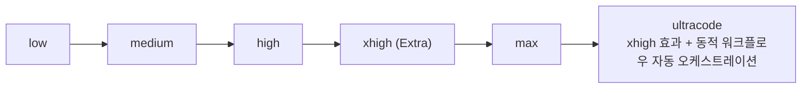
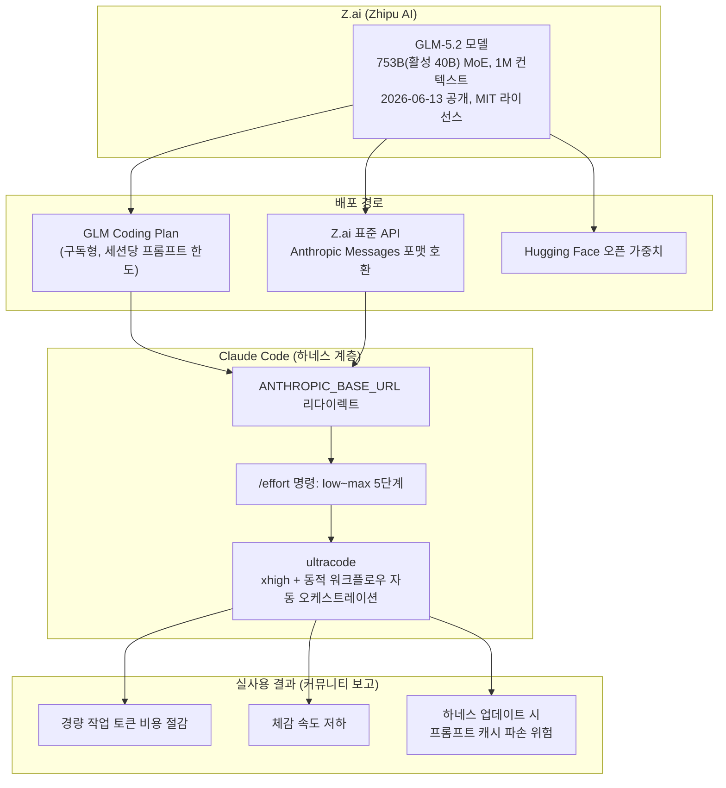

작성일자: 2026-07-21

---

## 목차

1. 이 글의 배경 — Threads에 올라온 게시물이 담고 있는 내용
2. Claude Code 화면 속 정보 읽기: v2.1.185, ultracode, xhigh
3. GLM-5.2란 무엇인가 — 출시 배경과 기본 사양
4. Claude Code에서 GLM-5.2를 쓴다는 것의 실제 의미
5. Ultracode와 effort 체계 전체 구조
6. 벤치마크 수치 상세 해설 — FrontierSWE / PostTrainBench / SWE-Marathon
7. 실사용자 반응이 말해주는 것 — 속도, 캐시, 비용
8. 지정학적 맥락 — 왜 하필 이 시점에 오픈소스로 나왔는가
9. 하네스 엔지니어링 관점에서 본 함의
10. 구조도(Mermaid)
11. 확인된 사실과 미확인 주장의 구분
12. 참고 자료

---

## 1. 이 글의 배경 — Threads에 올라온 게시물이 담고 있는 내용

> 
> https://www.threads.com/@voidlight00/post/DZ14bNcD18l
> 
> ClaudeCode 에서 기존에 4.7 쓰다가 이번에 GLM 5.2로 업데이트!! 했습니다 
> 
> 으흐흐 울트라코드로 웬만한 작업 야무지게 가성비 챙깁니다~~
> 
>--- 
> https://www.threads.com/@voidlight00/post/DZ14bJ2j-Np
> 
> GLM-5.2는 허깅페이스 기준 753B 파라미터의 MoE 구조이고, 컨텍스트 윈도우가 1M 토큰입니다. 직전 GLM-5.1이 200K 수준이었으니 5배 확장입니다.
> 
> 추론 강도를 High와 Max 두 단계로 고를 수 있는 것도 새로 들어왔습니다.
> 
> High는 성능과 토큰 효율의 균형을 잡고, Max는 어려운 작업에 연산을 더 쏟습니다.
> 
> 그리고 이 모든 게 GLM-5.1과 동일한 API 가격으로 나왔습니다.
> 
> 컨텍스트는 5배로 늘었는데 단가는 그대로입니다
> 

공유해주신 두 건의 Threads 게시물(voidlight00 계정)과 첨부된 세 장의 화면은 하나의 흐름으로 연결되어 있습니다. 첫 번째 게시물은 Claude Code라는 도구에서 기존에 쓰던 Claude Opus 4.7 대신 중국 Z.ai(구 Zhipu AI)의 GLM-5.2 모델로 백엔드를 바꿔서 "울트라코드(ultracode)"라는 최고 효율 모드로 코딩 작업을 돌리고 있다는 실사용 후기이고, 여기에 달린 댓글들은 속도 저하, 캐시 파손, 비용 절감 효과 등 실무자들의 현실적인 반응을 담고 있습니다. 두 번째 게시물은 GLM-5.2의 기술 사양 — 753B 파라미터 MoE 구조, 1M 토큰 컨텍스트, High/Max 두 단계 추론 강도, GLM-5.1과 동일한 API 가격 — 을 정리한 내용입니다. 첨부된 벤치마크 차트는 Opus 4.8, GLM-5.2, GPT-5.5, Opus 4.7, Gemini 3.1 Pro 다섯 모델을 FrontierSWE, PostTrainBench, SWE-Marathon 세 가지 장시간 과제 벤치마크로 비교한 결과입니다.

아래에서는 이 세 가지 요소 — Claude Code의 도구적 맥락, GLM-5.2라는 모델 자체, 그리고 벤치마크 수치 — 를 각각 검증된 정보를 바탕으로 상세히 풀어드립니다.

---

## 2. Claude Code 화면 속 정보 읽기: v2.1.185, ultracode, xhigh

첨부된 첫 번째 화면은 Claude Code 버전 2.1.185가 실행 중인 터미널 인터페이스로, 상단에 "glm-5.2 with xhigh effort"라는 표시와 함께 `/Users/voidlight`라는 작업 경로가 나타나 있습니다. 하단에는 모델 표기가 `[M] glm-5.2`로, 브랜치 정보가 `[D] voidlight git:(main)`으로 표시되어 있고, `bypass permissions on`이라는 문구도 확인됩니다. 이는 Claude Code가 Anthropic 자사 모델뿐 아니라 호환 API를 제공하는 제3자 모델도 백엔드로 연결해서 쓸 수 있다는 것을 보여주는 장면입니다. 화면에 표시된 `/effort` 명령어는 "Set effort level to ultracode"라는 안내문과 함께 나타나 있어, 사용자가 효과(effort) 단계를 최상위인 ultracode로 설정하려는 시점임을 알 수 있습니다. 두 번째 화면은 단순히 "ultracode"라는 단어 자체를 강조해서 보여주는 장면입니다.

이 두 장면이 의미하는 바는, Claude Code가 `ANTHROPIC_BASE_URL`, `ANTHROPIC_AUTH_TOKEN` 같은 환경변수를 통해 백엔드 모델 제공자를 Anthropic 공식 API가 아닌 Z.ai의 호환 엔드포인트로 리다이렉트하고 있다는 것입니다. Claude Code 자체는 `sonnet`, `opus`, `haiku`라는 세 가지 모델 이름을 내부적으로 하드코딩해 두고 있는데, `ANTHROPIC_MODEL`과 `ANTHROPIC_SMALL_FAST_MODEL` 같은 환경변수로 이 이름들을 실제로는 GLM-5.2 같은 다른 모델 ID로 리매핑하는 방식이 커뮤니티에서 널리 쓰이고 있습니다. Z.ai는 자사 API가 Anthropic Messages 포맷을 그대로 지원하도록 만들어 두었기 때문에, 별도의 프록시 서버 없이도 Claude Code나 Cline 같은 도구에 설정 변경만으로 바로 연결됩니다.

한 가지 짚어드릴 부분은, Claude Code 공식 문서상 ultracode라는 이름 자체는 API가 받는 정식 effort 값이 아니라는 점입니다. Claude Code 문서는 ultracode를 "xhigh 효과 단계에 멀티에이전트 워크플로우를 자동으로 실행할 수 있는 상시 권한을 결합한 것"이라고 정의하고 있으며, API 차원에서는 low, medium, high, xhigh, max 다섯 단계만 존재합니다. 즉 화면에 보이는 "glm-5.2 with xhigh effort"라는 표시는, 모델이 실제로 받는 effort 파라미터는 xhigh이고, ultracode는 그 위에 얹힌 Claude Code 자체의 세션 설정(자동 워크플로우 오케스트레이션)이라는 의미로 해석하는 것이 정확합니다.

---

## 3. GLM-5.2란 무엇인가 — 출시 배경과 기본 사양

GLM-5.2는 중국 베이징 소재 Z.ai(옛 이름 Zhipu AI, 홍콩 증시 상장명 Knowledge Atlas Technology)가 2026년 6월 13일 자사 GLM Coding Plan 구독자들에게 먼저 공개하고, 이후 6월 16~17일경 Hugging Face에 오픈 가중치를 공개한 모델입니다. MIT 라이선스로 배포되어 지역 제한 없이 누구나 내려받아 상업적으로 활용할 수 있습니다.

모델 구조는 Mixture-of-Experts(MoE) 방식으로, 총 파라미터 수는 출처에 따라 744B 또는 753B로 표기되는데 이는 반올림 방식의 차이로 보이며, 실제로 활성화되는 파라미터는 토큰당 약 40B 수준으로 GLM-5.1과 동일합니다. 가장 큰 변화는 컨텍스트 윈도우로, GLM-5.1이 약 20만(200K) 토큰이었던 데 비해 GLM-5.2는 100만(1M) 토큰으로 다섯 배 확장되었고, 최대 출력 토큰은 128K 수준입니다. 추론 강도는 High와 Max(=xhigh) 두 단계로 선택할 수 있어, High는 성능과 토큰 효율의 균형을, Max는 어려운 과제에 더 많은 연산을 투입하는 방식으로 동작합니다.

가격 정책 면에서는 Z.ai의 공식 API 기준 입력 1M 토큰당 약 1.40달러, 출력 1M 토큰당 약 4.40달러로, 이는 GLM-5.1과 동일한 단가입니다. 즉 컨텍스트 용량은 다섯 배 늘었는데 단가는 그대로 유지된 셈이며, 이는 원게시물에서 언급한 내용과 정확히 일치합니다. 참고로 이 가격은 Anthropic의 Claude 계열 모델 대비 상당히 저렴한 편으로, 여러 매체에서 3배에서 7배가량 저렴하다고 분석하고 있습니다.

GLM-5.2 공개 시점은 공교롭게도 미국 상무부가 수출통제 차원에서 Anthropic의 Fable 5·Mythos 5 모델에 대한 해외 접근을 일시 중단시킨 시점과 겹쳤습니다(이 접근 중단은 2026년 6월 30일 수출통제가 해제되면서 7월 1일 복원되었습니다). 이 때문에 일부 실리콘밸리 관계자들 사이에서는 GLM-5.2의 등장이 "또 하나의 딥시크(DeepSeek) 모먼트"로 불리기도 했습니다. 실제로 전직 메타·구글 딥마인드 부사장 출신인 Matt Velloso는 X(트위터)에서 GLM-5.2를 종일 사용해본 뒤 "일상적으로 쓸 만한 수준을 처음으로 통과한 오픈 모델"이라고 평가했다고 South China Morning Post가 보도했습니다.

---

## 4. Claude Code에서 GLM-5.2를 쓴다는 것의 실제 의미

Claude Code는 원래 Anthropic 자사 모델을 위해 설계된 도구이지만, Bedrock·Vertex AI 등 호환 제공자를 통한 연결을 공식적으로 지원하는 구조를 갖고 있어, 이 구조를 활용하면 Z.ai처럼 Anthropic Messages 포맷과 호환되는 API를 제공하는 제3자 모델도 백엔드로 붙일 수 있습니다. 파일 읽기, 코드 편집, bash 실행, 멀티턴 대화 등 대부분의 핵심 기능은 정상 작동하지만, Claude 아키텍처에 종속된 일부 확장 사고(extended thinking) 방식 등은 그대로 재현되지 않을 수 있다는 점이 여러 가이드 문서에서 공통적으로 언급됩니다.

원게시물 작성자가 밝힌 것처럼 이 사용 방식은 "Proxy server, API로 호출"하는 형태이며, 이는 GLM Coding Plan을 구독하거나 Z.ai API 키를 발급받아 `ANTHROPIC_BASE_URL`을 Z.ai 엔드포인트로 돌리는 전형적인 패턴입니다. 댓글에서 언급된 "클로드코드 업데이트되면 캐시 깨져서 GLM 토큰 녹는" 현상은, Claude Code가 버전업될 때 프롬프트 캐시 관련 내부 구조가 바뀌면서 제3자 백엔드와의 캐시 정합성이 깨지고, 그 결과 캐시 할인 없이 풀토큰 단가로 과금되는 상황을 가리키는 것으로 이해하는 것이 합리적입니다. 이는 공식적으로 문서화된 동작이라기보다는 실사용자들 사이에서 공유되는 경험적 트러블슈팅 지식에 가깝습니다.

---

## 5. Ultracode와 effort 체계 전체 구조

Claude Code의 effort 체계는 `/effort` 명령으로 조절하며, API 차원에서는 low → medium → high → xhigh → max의 다섯 단계로 구성되어 있고, 기본값은 high입니다. 이 다섯 단계는 하나의 컨텍스트 윈도우 안에서 추론을 얼마나 깊게 하느냐만 조절하는 것으로, 확장 사고(extended thinking)의 깊이와 도구 호출의 정교함, 텍스트 설명의 상세도에 함께 영향을 줍니다.

Ultracode는 이 다섯 단계 위에 별도로 얹힌 Claude Code 전용 세션 설정입니다. Anthropic의 공식 Effort 문서는 "Ultracode는 xhigh 효과 단계와, 멀티에이전트 워크플로우를 실행할 수 있는 상시 권한을 결합한 것"이라고 설명하고 있으며, API가 받아들이는 정식 effort 값 목록에는 포함되지 않는다고 명시하고 있습니다. 즉 ultracode를 켜면 (1) 모든 메시지에 xhigh 추론 강도가 적용되고, (2) 평소에는 프롬프트에 "workflow"라는 단어를 넣어야 트리거되던 동적 워크플로우 오케스트레이션(여러 서브에이전트를 병렬로 fan-out하는 구조)이 세션 내 모든 실질적인 작업에서 자동으로 발동합니다. 하나의 ultracode 세션이 수백 개의 서브에이전트를 생성할 수 있다는 설명도 있어, 속도보다 철저함과 정확도를 최우선하는 모드로 이해하시면 됩니다.

이 설정은 세션에 한정되며 세션을 재시작하면 초기화됩니다. 또한 xhigh 효과 단계 자체는 Opus 4.8처럼 xhigh를 지원하는 모델에서만 정식으로 동작하며, 이를 지원하지 않는 구형 모델에서 ultracode를 설정하면 조용히 high로 대체(fallback)된다는 점도 여러 문서에서 공통적으로 확인됩니다. 원게시물 화면에서는 이 ultracode 설정을 GLM-5.2라는 제3자 모델에 적용하려는 상황이 포착된 것으로, Claude Code라는 하네스의 effort/오케스트레이션 로직이 백엔드 모델과 독립적으로 작동한다는 점을 보여주는 흥미로운 사례입니다.

---

## 6. 벤치마크 수치 상세 해설 — FrontierSWE / PostTrainBench / SWE-Marathon

첨부된 벤치마크 차트는 Z.ai가 GLM-5.2를 공개하며 자사 Hugging Face 블로그에 게재한 "Long-Horizon Task Evaluation" 결과와 정확히 일치합니다. 세 벤치마크 모두 1M 컨텍스트, max 효과 단계, 128K 최대 출력 토큰 조건에서 평가되었다고 Z.ai는 명시하고 있으며, 평가는 각각 외부 벤치마크 운영 기관(FrontierSWE는 Proximal, PostTrainBench는 PostTrainBench 팀, SWE-Marathon은 Abundant AI)이 수행한 것으로 표기되어 있습니다.

**FrontierSWE**는 시스템 최적화, 대규모 코드 구축, 응용 ML 연구 등 수 시간에서 수십 시간 규모의 개방형 기술 프로젝트를 에이전트가 얼마나 잘 완수하는지를 "우세 확률(dominance)" 방식으로 측정하는 벤치마크입니다.

| 모델 | FrontierSWE (%) |
|---|---|
| Opus 4.8 | 75.1 |
| GLM-5.2 | 74.4 |
| GPT-5.5 | 72.6 |
| Opus 4.7 | 63.0 |
| Gemini 3.1 Pro | 39.6 |

GLM-5.2는 Opus 4.8에 단 0.7%p 뒤처지고, GPT-5.5보다는 앞서며 Opus 4.7보다 11.4%p 높은 점수를 기록했습니다.

**PostTrainBench**는 각 에이전트에게 H100 GPU 한 장을 주고 소형 모델을 얼마나 잘 사후학습(post-training)으로 개선하는지를 겨루는, 실험적 ML 엔지니어링 역량을 재는 벤치마크입니다.

| 모델 | PostTrainBench (%) |
|---|---|
| Opus 4.8 | 37.2 |
| GLM-5.2 | 34.3 |
| Opus 4.7 | 28.6 |
| GPT-5.5 | 25.0 |
| Gemini 3.1 Pro | 21.6 |

여기서는 GLM-5.2가 Opus 4.7과 GPT-5.5를 모두 앞지르고 Opus 4.8에만 뒤이어 2위를 기록했습니다.

**SWE-Marathon**은 컴파일러 제작, 커널 최적화, 프로덕션급 서비스 개발 등 수 시간에서 수십 시간에 걸친 초장시간 소프트웨어 엔지니어링 과제 20개로 구성된 벤치마크로, 관련 논문(arXiv 2606.07682)에 따르면 로그된 에이전트 시도들의 평균 토큰 사용량이 2,720만 토큰에 달할 만큼 기존의 SWE-bench류 벤치마크보다 훨씬 긴 호흡을 요구합니다.

| 모델 | SWE-Marathon (%) |
|---|---|
| Opus 4.8 | 26.0 |
| Opus 4.7 | 16.0 |
| GLM-5.2 | 13.0 |
| GPT-5.5 | 12.0 |
| Gemini 3.1 Pro | 4.0 |

이 벤치마크에서는 GLM-5.2가 GPT-5.5는 근소하게 앞섰지만 Opus 계열(4.8, 4.7 모두)에는 상당한 격차로 뒤처집니다. Opus 4.8과의 격차가 13%p로 세 벤치마크 중 가장 큰 폭입니다.

세 벤치마크를 종합하면, GLM-5.2는 과제의 지속 시간이 길어질수록(FrontierSWE → PostTrainBench → SWE-Marathon 순으로 평균 소요 시간이 늘어남) Opus 4.8과의 격차가 벌어지는 경향을 보입니다. 참고로 GLM-5.2는 이 밖에도 SWE-bench Pro에서 62.1점(GPT-5.5의 58.6점을 상회), Terminal-Bench 2.1에서 81.0점을 기록했다고 알려져 있으며, Artificial Analysis Intelligence Index v4.1에서는 51점으로 오픈웨이트 모델 중 1위를 차지했다고 여러 매체가 보도했습니다.

---

## 7. 실사용자 반응이 말해주는 것 — 속도, 캐시, 비용

원게시물에 달린 댓글들을 정리하면 다음과 같은 세 갈래의 현실적 반응이 확인됩니다.

첫째, **속도 이슈**입니다. "다 좋은데 느려서 미치겠다"는 댓글이 있었는데, 이는 ultracode 모드가 xhigh 추론 강도와 멀티에이전트 오케스트레이션을 동시에 발동시키는 구조이기 때문에 구조적으로 지연시간이 늘어날 수밖에 없다는 점과 부합합니다. Ultracode는 애초에 "속도나 비용을 전혀 최적화하지 않고, 가장 철저하고 정확한 답을 최우선"하도록 설계된 모드이기 때문에, 체감 속도 저하는 사양이지 결함이 아니라고 보는 편이 정확합니다.

둘째, **캐시 파손 이슈**입니다. "클코 업데이트되면 캐시 깨져서 GLM 토큰 녹는다"는 경고는, Claude Code라는 하네스가 자체 업데이트될 때 프롬프트 구조나 시스템 프롬프트가 미세하게 바뀌면서 제3자 백엔드(GLM)의 프롬프트 캐시가 무효화되고, 그 결과 캐시 할인 없이 전체 토큰이 과금되는 상황을 가리킵니다. 이는 하네스와 모델 백엔드가 분리된 구조에서 발생하는 전형적인 정합성 문제로, 하네스 엔지니어링 논의와 직접 맞닿아 있는 지점입니다.

셋째, **비용 절감 관점**입니다. "GPT-5.5, Opus 4.8을 월 100억 토큰 쓰는 헤비 유저 입장에서는 큰 체감이라기보다 간단한 작업의 토큰 비용 절감이 1순위"라는 댓글은, 이번 GLM-5.2 도입이 최상위 난이도 작업의 품질을 끌어올리기 위한 선택이라기보다, 일상적인 소규모 개발 작업에서 기존에 Opus급 모델을 써야 했던 부분을 더 저렴한 모델로 대체하려는 비용 최적화 전략에 가깝다는 점을 보여줍니다. 이는 앞서 정리한 벤치마크에서도 뒷받침되는데, GLM-5.2는 상대적으로 짧은 과제(FrontierSWE)에서는 Opus 4.8과 거의 대등하지만 초장시간 과제(SWE-Marathon)에서는 격차가 커지므로, "가벼운 작업은 GLM, 무거운 작업은 Opus"라는 라우팅 전략이 합리적인 근거를 갖습니다.

---

## 8. 지정학적 맥락 — 왜 하필 이 시점에 오픈소스로 나왔는가

GLM-5.2의 오픈소스 공개 시점은 미국의 대중국 AI 수출통제 흐름과 맞물려 여러 매체에서 정치적 의미로도 조명되었습니다. 미 상무부 산하 CAISI(Center for AI Standards and Innovation)는 2026년 7월 8일 GLM-5.2에 대한 평가를 완료했는데, 이 평가에 따르면 GLM-5.2는 공개 당시 가장 역량이 뛰어난 오픈웨이트 모델이었을 가능성이 높고, 전반적 역량은 2025년 12월 출시된 GPT-5.2와 유사하며, 사이버 역량은 2026년 2월 출시된 Opus 4.6과 유사한 수준으로 평가되었습니다. 다만 안전장치(safeguard) 측면에서는 GLM-5.2가 에이전트형 사이버 공격 도구 개발 지원을 허용하는 등 혼재된 평가를 받았고, 생물학 관련 민감 질문에 대한 차단 수준도 미국 기준 모델들보다 낮았다는 것이 CAISI의 결론입니다. 이 부분은 모델을 실무에 도입할 때 반드시 별도의 안전성 검토가 필요하다는 점을 시사합니다.

또한 로이터 보도에 따르면 Z.ai는 2026년 1월 홍콩 증시에 상장한 이후 GLM-5.2 출시를 전후해 시가총액이 2,000% 넘게 급등해 약 1,280억 달러(1조 홍콩달러 이상) 규모에 도달했으며, 상하이 이중 상장 계획도 발표한 상태입니다. 아울러 GLM-5.2는 화웨이 어센드(Ascend), T-Head, Moore Threads, Cambricon 등 중국 국산 칩에서의 구동을 출시 첫날부터 지원한다고 밝혀, 반도체 수출통제 국면에서 자국산 하드웨어 생태계를 키우려는 전략적 의도도 함께 읽힙니다.

---

## 9. 하네스 엔지니어링 관점에서 본 함의

이번 사례는 "하네스가 모델보다 중요하다"는 논지를 뒷받침하는 흥미로운 사례로 볼 수 있습니다. 첫째, Claude Code라는 하네스의 effort/오케스트레이션 로직(ultracode)이 백엔드 모델(GLM-5.2)과 완전히 분리된 계층에서 작동한다는 점이 화면상으로 확인되는데, 이는 하네스 계층의 스케줄링·오케스트레이션 기능이 특정 모델에 종속되지 않고 이식 가능하다는 것을 시사합니다. 둘째, 댓글에서 지적된 캐시 파손 문제는 하네스(Claude Code)와 백엔드(GLM-5.2 프록시) 사이의 암묵적 계약이 하네스 업데이트만으로도 깨질 수 있다는 것을 보여주는 실전 사례로, 하네스 감사(harness audit)와 버전 간 호환성 검증이 왜 지속적으로 필요한지에 대한 근거가 됩니다. 셋째, 벤치마크상 GLM-5.2가 과제 길이가 길어질수록 Opus 4.8과의 격차가 벌어지는 패턴은, "어떤 모델을 쓸 것인가"보다 "어떤 작업 유형에 어떤 모델을 라우팅할 것인가"라는 하네스 설계 문제로 이어집니다. 실제로 댓글에서 나온 "간단한 작업은 저렴한 모델로, 복잡한 오케스트레이션은 상위 모델로"라는 전략은 GPT-5.6 계열(Luna/Terra/Sol)에서 이미 적용하고 계신 라우팅 전략과 구조적으로 동일한 패턴입니다.

---

## 10. 구조도(Mermaid)

---

## 11. 확인된 사실과 미확인 주장의 구분

- **확인된 사실(복수의 독립적 출처로 교차 검증됨)**: GLM-5.2의 2026년 6월 13일 GLM Coding Plan 출시 및 6월 16~17일경 MIT 오픈 가중치 공개, 753B(또는 744B) 총 파라미터/약 40B 활성 MoE 구조, 200K에서 1M으로의 컨텍스트 확장, High/Max 추론 모드, GLM-5.1과 동일한 API 단가($1.40/$4.40 per M 토큰), FrontierSWE·PostTrainBench·SWE-Marathon 세 벤치마크 수치(Z.ai 공식 Hugging Face 블로그 게시 및 다수의 2차 매체 재확인), Claude Code의 ultracode/effort 체계(Anthropic 공식 문서 확인).
- **정부 기관의 독립 평가**: CAISI(미 상무부 산하)가 2026년 7월 8일 공개한 평가 결과로, 벤더 자체 발표가 아닌 제3자 검증 성격을 가집니다.
- **커뮤니티/실사용자 보고 수준의 정보(벤더 공식 문서화는 아님)**: "Claude Code 업데이트 시 캐시가 깨진다"는 현상, ultracode 사용 시 체감 속도 저하 정도, 특정 개인의 토큰 사용량("월 100억 토큰")과 같은 개별 사용자 진술은 원게시물 작성자 본인의 경험담으로, 일반화된 공식 수치가 아니라는 점을 유의해서 참고하시기 바랍니다.
- **표기 차이**: 총 파라미터 수가 744B로 표기된 자료와 753B로 표기된 자료가 공존하는데, 이는 반올림 기준 차이로 보이며 어느 쪽이 틀렸다고 단정할 근거는 확인되지 않았습니다.

---

## 12. 참고 자료

- Z.ai 공식 GLM-5.2 블로그(벤치마크 원본 수치): https://huggingface.co/blog/zai-org/glm-52-blog
- GLM-5.2 모델 카드: https://huggingface.co/zai-org/GLM-5.2-FP8
- NIST CAISI GLM-5.2 평가: https://www.nist.gov/news-events/news/2026/07/caisi-assessment-zais-glm-52
- South China Morning Post, "Zhipu AI releases harness for GLM-5.2 model as Chinese firm takes aim at Anthropic": https://www.scmp.com/tech/tech-trends/article/3359170/zhipu-ai-releases-harness-glm-52-model-chinese-firm-takes-aim-anthropic
- South China Morning Post, "China's Zhipu AI sparks new 'DeepSeek moment'": https://www.scmp.com/tech/big-tech/article/3358434/chinas-zhipu-ai-sparks-new-deepseek-moment-cost-effective-coding-model
- CGTN, "Chinese AI steps onto global stage as GLM-5.2 narrows frontier gap": https://news.cgtn.com/news/2026-06-30/Chinese-AI-steps-onto-global-stage-as-GLM-5-2-narrows-frontier-gap-1OoU38NBLHO/p.html
- SWE-Marathon 논문(arXiv 2606.07682): https://arxiv.org/html/2606.07682
- Anthropic Claude Platform Docs, "Effort": https://platform.claude.com/docs/en/build-with-claude/effort
- Claude Code Docs, "Model configuration": https://code.claude.com/docs/en/model-config
- OpenRouter GLM-5.2 모델 페이지(가격·컨텍스트 사양): https://openrouter.ai/z-ai/glm-5.2
- Morph, "Use a Different LLM (Custom Model) with Claude Code": https://www.morphllm.com/use-different-llm-claude-code
- 원본 Threads 게시물: https://www.threads.com/@voidlight00/post/DZ14bNcD18l , https://www.threads.com/@voidlight00/post/DZ14bJ2j-Np
