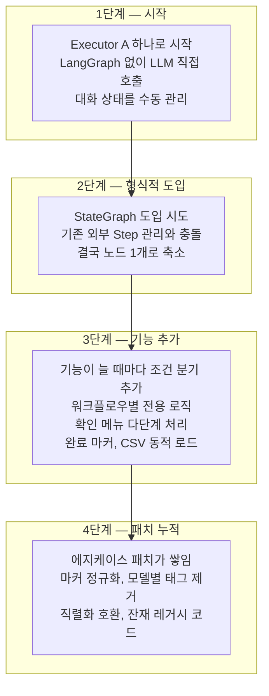
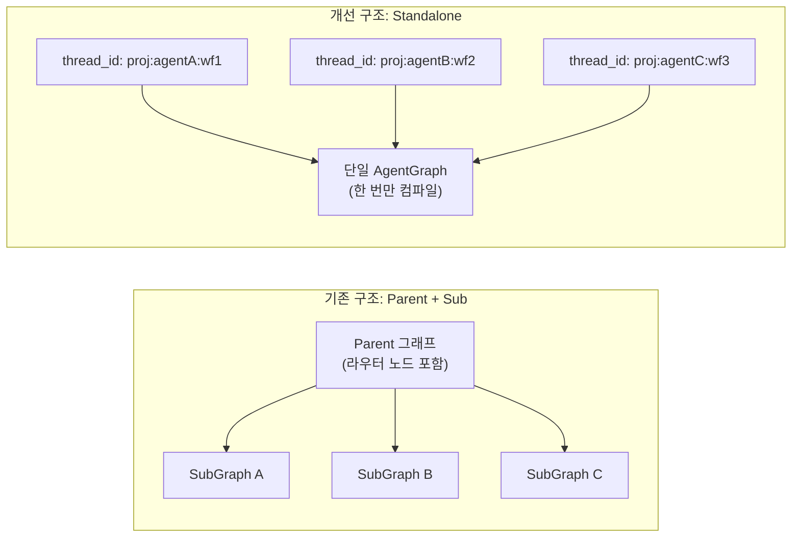
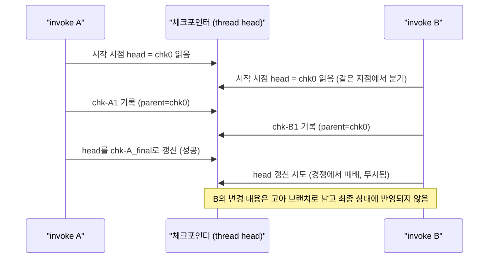
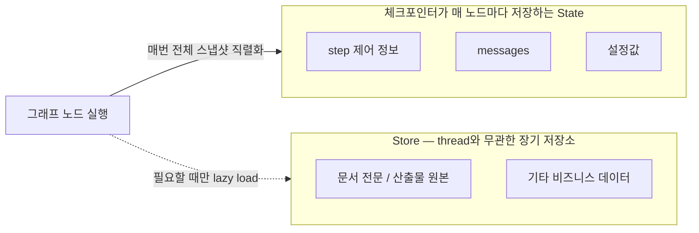
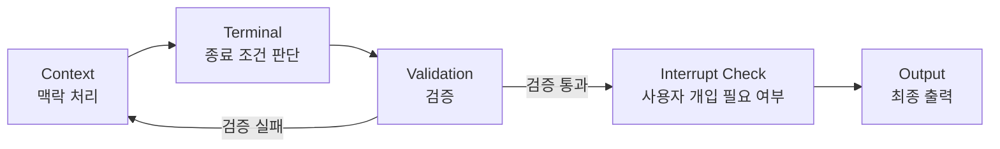

- 원문: neocode24, "왜 LangGraph 도입 후 스파게티가 되었나: 실패에서 배운 구조화" (2026년 7월 15일 발행)
- 원문 주소: https://neocode24.com/blog/langgraph-spaghetti-lessons-from-failure/
- 이 글은 해당 원문을 바탕으로, LangGraph의 공식 개념 정의와 대조 검증한 뒤 초심자도 이해할 수 있도록 상세하게 풀어 쓴 해설 문서다.

---

## 목차

1. 들어가며 — 이 글이 특별한 이유
2. 사건의 배경 — 무엇을 만들었고, 무엇을 기대했는가
3. 진단 — 도입은 했는데 왜 더 나빠졌는가
4. 스파게티의 세 가지 얼굴
5. 복잡성은 어떻게 자라났는가
6. 실패가 가르쳐 준 다섯 가지 구조화 원칙
7. 회고 — 한 줄로 남기는 교훈
8. 더 근본적인 질문 — 왜 이렇게까지 됐는가
9. 배경지식 보충 — LangGraph 핵심 개념 정리
10. 이 사례가 바이브 코딩 실무자에게 주는 시사점
11. 출처 및 참고자료

---

## 1. 들어가며 — 이 글이 특별한 이유

LangGraph를 다루는 대부분의 글은 "이렇게 쓰면 좋다"는 성공담이다. 반면 이번에 다룰 원문은 정반대의 자리에 서 있다. 글쓴이는 자신이 직접 만든 시스템이 LangGraph를 도입했음에도 불구하고 오히려 스파게티 코드가 되어버린 과정을 가감 없이 해부한다. 실패를 감추지 않고 원인을 추적한 뒤, 그 실패에서 다섯 가지 구조화 원칙을 뽑아낸다는 점에서 이 글은 단순한 튜토리얼보다 훨씬 실전적인 가치를 지닌다.

이 글은 neocode24라는 블로그가 연재해 온 "LangGraph Best Practices" 시리즈의 네 번째 글이다. 앞선 세 편이 각각 LangGraph 핵심 컴포넌트의 존재 이유, 프로덕션 설계 패턴, Deep Agents의 Skill 실행 체계를 다뤘다면, 이번 글은 그 이론을 실제로 적용했을 때 무엇이 잘못될 수 있는지를 보여주는 반면교사에 해당한다[1]. 특히 마지막 장에서 글쓴이가 던지는 질문 — 이 실패가 바이브 코딩 때문이었는가, 아니었는가 — 은 AI 코딩 도구를 실무에 쓰는 모든 사람에게 곱씹을 만한 화두를 남긴다.

본문에 들어가기 전에 먼저 짚어야 할 전제가 있다. 이 사례는 어디까지나 글쓴이 한 사람의 개인 프로젝트에서 있었던 일이며, LangGraph라는 프레임워크 자체의 결함을 고발하는 글이 아니다. 오히려 결론에서 분명히 하듯, 문제는 프레임워크가 아니라 프레임워크를 쓰는 방식에 있었다. 이 구분을 염두에 두고 읽어야 원문의 논지를 오해하지 않는다.

---

## 2. 사건의 배경 — 무엇을 만들었고, 무엇을 기대했는가

글쓴이가 만든 것은 AI 기반 문서 설계 웹 도구였다. 백엔드는 NestJS로 구성되어 있었고, 사용자와 AI가 여러 턴에 걸쳐 대화하며 문서를 완성해 가는 워크플로우 엔진이 핵심이었다. 이 워크플로우 엔진을 구현하기 위해 TypeScript 기반의 `@langchain/langgraph` 패키지를 도입했다.

도입의 동기는 단순했다. "LangGraph를 쓰면 상태 관리와 흐름 제어가 깔끔해지겠지"라는 기대였다. 이는 합리적인 기대다. LangGraph는 원래 복잡한 다단계 대화, 조건에 따른 분기, 중간에 사용자 개입이 필요한 워크플로우를 그래프 구조로 선언적으로 표현하기 위해 설계된 프레임워크이기 때문이다. 그런데 결과는 정반대였다고 글쓴이는 고백한다. 다음 장부터 그 이유를 하나씩 따라가 본다.

---

## 3. 진단 — 도입은 했는데 왜 더 나빠졌는가

리팩터링에 나서기 전, 글쓴이는 먼저 현재 상태를 진단했다. 워크플로우 실행을 담당하는 Executor 계층 세 개의 코드 규모를 측정한 결과는 다음과 같았다.

| Executor | 코드 줄 수 | LangGraph 사용 여부 |
|---|---|---|
| Executor A | 4,094줄 | 미사용 (LLM 직접 호출) |
| Executor B | 2,602줄 | 형식적으로만 사용 |
| Executor C | 1,595줄 | 형식적으로만 사용 |
| 공통 베이스 | 401줄 | — |
| **합계** | **8,692줄** | |

세 Executor 가운데 하나는 애초에 LangGraph를 쓰지 않고 LLM을 직접 호출하고 있었고, 나머지 둘은 LangGraph를 "쓰고는 있었지만" 형식적인 수준에 그쳤다. 여기서 중요한 숫자는 실질적인 핵심 로직의 비중이다. 글쓴이의 표현을 빌리면 진짜 필요한 코드는 "LLM 호출 한 줄과 프롬프트 조립 100여 줄"이 전부였고, 나머지 90퍼센트는 상태 관리와 조건 분기, 그리고 에지케이스를 막기 위한 패치 코드였다. 프레임워크를 도입하면 원래 줄어들어야 할 보일러플레이트가 오히려 폭증한 셈이다.

LangGraph를 "형식적으로" 도입한 두 Executor의 그래프 구조를 코드로 보면 문제가 더 명확해진다.

```typescript
// "LangGraph를 쓴다"던 코드의 실체
const graph = new StateGraph<WorkflowState>({ channels: { /* 14개 */ } });

graph.addNode('current_step', (state) =>
  this.executeDialogueNode(state, step, currentStep)  // 내부에서 llm.invoke() 직접 호출
);
graph.addEdge('current_step', END);   // 노드 → 바로 END
graph.setEntryPoint('current_step');

const compiled = graph.compile({ checkpointer: this.checkpointer });
const result = await graph.invoke(initialState, config);
```

여기서 그래프에 존재하는 노드는 단 하나, `current_step`뿐이다. 이 노드는 곧바로 `END`로 이어진다. 조건에 따라 다른 노드로 갈라지는 조건부 엣지도 없고, 여러 작업을 동시에 처리하는 병렬 실행도 없다. 이 상태에서 `graph.invoke()`를 호출하는 것은 `executeDialogueNode()` 함수를 그냥 직접 호출하는 것과 결과적으로 완전히 동일하다. LangGraph라는 이름의 껍데기만 씌워 놓았을 뿐, 실제로는 아무 일도 하지 않는 통과 장치였던 셈이다.

이 대목에서 짚고 넘어갈 만한 개념이 있다. LangGraph의 `StateGraph`는 원래 여러 개의 노드를 엣지로 연결하고, 그 사이를 조건에 따라 분기시키는 것이 핵심 존재 이유다. 노드가 하나뿐이고 무조건 종료로 이어지는 구조라면, 그래프라는 이름을 붙일 이유 자체가 없다. 뒤에서 다시 다루겠지만, 이것이 바로 이 사례 전체를 관통하는 핵심 문제의 축소판이다.

---

## 4. 스파게티의 세 가지 얼굴

글쓴이는 문제를 세 갈래로 나누어 설명한다.

### 4.1 LangGraph의 기능을 하나도 쓰지 않았다

LangGraph가 존재하는 이유는 크게 세 가지로 요약된다. 조건에 따라 실행 경로가 동적으로 바뀌는 조건부 엣지, 그래프의 실행 상태를 특정 시점마다 저장해 두는 내장 체크포인터, 그리고 중간에 사람의 판단을 기다렸다가 다시 이어서 실행하는 human-in-the-loop 기능(`interrupt`와 `resume`)이다. 그런데 글쓴이의 구현에서는 이 세 가지 기능이 전부 그래프 바깥에서 처리되고 있었다.

가장 대표적인 사례가 단계 전환이었다. 사용자가 다음 단계로 넘어갈 준비가 되었는지를 판단하는 로직이 그래프 안의 조건부 엣지가 아니라, 서비스 계층의 일반 코드로 짜여 있었다.

```
현재 (스파게티):
  WorkflowService.chatInCurrentStep()
    └─ executor.executeTurn(currentStep)   ← 외부에서 Step 번호 결정
    └─ result.nextStep 확인
    └─ executor.executeTurn(nextStep)      ← 외부에서 다시 호출

이상적:
  LangGraph 내부에서
    Step0 →[조건]→ Step1 →[조건]→ Step2 → ... → Complete
    (그래프가 Step 전환을 스스로 처리)
```

이 구조를 자세히 들여다보면 일종의 닭과 달걀 문제가 숨어 있다. 그래프가 "지금 이 순간의 Step 하나"만을 표현하고 있으니, 자연히 다음 Step으로의 전환은 그래프 밖에서 관리할 수밖에 없다. 그런데 전환을 그래프 밖에서 관리하다 보니, 애초에 그래프를 조건부 엣지로 확장할 이유 자체가 사라져 버린다. 도입 그 자체가 스스로와 모순되는 구조였던 것이다.

### 4.2 이중 체크포인팅

두 번째 문제는 같은 세션의 상태를 두 개의 서로 다른 시스템이 동시에 저장하고 있었다는 점이다.

```
1. LangGraph MemorySaver (Executor 내부, 인메모리, 프로세스 재시작 시 소멸)
2. 자체 CheckpointerService (WorkflowService, PostgreSQL, 영구 저장)

→ 동일 세션을 2번 저장하고, 2번 복원한다
→ MemorySaver가 들고 있는 state와 PostgreSQL에 저장된 state가 서로 어긋날 수 있다
→ 둘 중 어느 쪽을 신뢰해야 하는지 아무도 확신할 수 없는 상태가 된다
```

여기서 끝이 아니었다. 인메모리로 관리되는 `sessionCache`, 함수 파라미터로 전달되는 `stepData`, 그리고 그 안에 다시 중첩된 `dialogueState`까지 더하면, 워크플로우의 상태는 실제로 다섯 군데에 흩어져 있었다. 버그 하나를 재현하려면 이 다섯 곳의 상태를 동시에 머릿속에 그려야 했다는 것이 글쓴이의 회고다. 상태가 한 곳에 있어야 한다는 원칙, 이른바 단일 진실 공급원(single source of truth)이 지켜지지 않을 때 벌어지는 전형적인 상황이라 할 수 있다.

### 4.3 같은 로직을 세 번 구현

세 번째 얼굴은 중복이다. 세 개의 Executor는 프롬프트를 조립하는 로직, 사용자 확인 메뉴를 처리하는 로직, 완료를 알리는 마커(`---CONTENT_START---`)를 추출하는 로직, 모델 응답에서 `<think>` 태그를 제거하는 로직을 각자 다른 방식으로 다시 구현하고 있었다. 글쓴이가 추정한 중복률은 40퍼센트에서 60퍼센트에 달했다.

결과는 예측 가능했다. 한 Executor에서 버그를 발견해 고쳐도 나머지 두 곳에는 반영되지 않았다. 실제로 어떤 이슈는 Executor C에서만 패치되고 Executor B에서는 그대로 남아있는 사고가 반복해서 발생했다고 한다.

---

## 5. 복잡성은 어떻게 자라났는가

스파게티 코드는 어느 날 갑자기 만들어지지 않는다. 글쓴이는 이 시스템이 복잡해진 과정을 네 단계로 되짚는다.



이 네 단계를 관통하는 근본 원인은 하나로 수렴한다. 프레임워크의 핵심 기능을 실제로 활용하지 못한 채 도입만 했다는 점이다. LangGraph를 껍데기로만 남겨두니, 원래 LangGraph가 대신 해줬어야 할 일 — 단계 전환, 상태 저장, 사용자 응답 대기 — 을 전부 손으로 다시 구현해야 했고, 그렇게 손으로 구현한 코드는 새 기능이 추가될 때마다 조건 분기로 계속 불어났다. 프레임워크를 "쓰긴 썼는데 실제로는 안 쓴" 상태가 가장 나쁜 조합이었다고 글쓴이는 정리한다.

---

## 6. 실패가 가르쳐 준 다섯 가지 구조화 원칙

해부가 끝나자 나아갈 방향은 오히려 선명해졌다. 이 장에서 정리하는 다섯 가지는 이론으로 먼저 알고 있던 내용이 아니라, 실패를 통해 검증한 뒤 실제로 채택한 결정들이라는 점에서 무게가 다르다.

### 원칙 1 — Standalone 토폴로지: 쓰지 않을 라우터는 두지 마라

처음에 글쓴이는 상위 그래프(Parent)가 라우터 역할을 맡아 하위 그래프(SubGraph)로 분기하는 2계층 구조를 선택했다. 그런데 이 라우터 노드의 실제 내용물을 들여다보니 `Command({ goto: state.agentId })` 한 줄이 전부였다. 다음에 어떤 에이전트로 넘어갈지는 이미 서비스 계층에서 결정되어 그래프로 들어오고 있었으므로, 라우터는 이미 내려진 결정을 그래프 안에서 그대로 한 번 더 반복하고 있을 뿐이었다.

여기서 얻은 교훈은 명확하다. 라우터를 그래프 안에 둘지 말지는 "LLM이 실행 중에 다음 노드를 동적으로 결정하는가"라는 질문으로 판단해야 한다. 만약 다음 노드가 이미 외부에서 결정되어 들어온다면 그 라우터는 잉여에 가깝다. 이 판단에 따라 글쓴이는 Parent 계층을 아예 없애고, 단일한 AgentGraph를 `thread_id`만으로 서로 격리하는 Standalone 토폴로지로 전환했다.

| 항목 | Parent+Sub 구조 | Standalone 구조 |
|---|---|---|
| 체크포인트 계층 | 2계층 | 단일 계층 |
| 라우터 노드 | 필요 | 제거 |
| 공유 State 정의 | 필요 | 불필요 |
| 그래프 인스턴스 | 프로젝트별로 캐시 | 한 번 컴파일해 전 에이전트가 공유 |

그래프의 구조 자체가 모든 에이전트에 동일하다면, 에이전트 사이의 차이는 그래프 구조가 아니라 State에 담긴 값 — 프롬프트 내용이나 워크플로우 정의 — 에서 갈리게 된다. 그래서 서버가 부팅될 때 그래프를 한 번만 컴파일해 두고, 이후에는 `thread_id`만 바꿔가며 모든 에이전트가 같은 컴파일된 그래프 인스턴스를 재사용하는 방식으로 바뀌었다.

```typescript
// 부트 시 1회 컴파일
this.compiledGraph = buildAgentGraph(...).compile({ checkpointer: postgresSaver });

// 모든 invoke에서 동일 인스턴스 재사용, thread_id만 다르게
await this.compiledGraph.invoke(state, {
  configurable: { thread_id: `${projectId}:${agentId}:${workflowId}` },
});
```

아래 도식은 두 토폴로지의 구조적 차이를 보여준다.



### 원칙 2 — 동시성은 락이 아니라 thread 분리로 푼다

글쓴이가 이 프로젝트에서 가장 크게 데였다고 표현하는 지점이 바로 이 원칙이다. 직관적으로 생각하면 같은 thread에 두 개의 요청이 동시에 들어올 경우 나중 요청이 앞선 요청을 덮어쓸 것 같지만, 실제로 벌어지는 일은 "덮어쓰기"가 아니라 "브랜치 경쟁"이다. 이는 Git에서 detached HEAD 상태로 두 개의 커밋이 동시에 만들어지는 상황과 정확히 같은 원리다.

```
t0: invoke A 시작 (head = chk0)
t0: invoke B 시작 (head = chk0, 같은 head에서 분기)
t1: A → chk-A1 기록 (parent = chk0)
t1: B → chk-B1 기록 (parent = chk0)
t2: A 완료 → head를 chk-A_final로 갱신
t2: B 완료 → head 갱신 시도 → 패배 (이미 A가 head를 가져감)

결과: B에서 이루어진 모든 state 변경이 head에서 사라진다. B는 고아 브랜치로 전락한다.
```

시간 순서로 다시 표현하면 다음과 같다.



이 문제를 락(lock)으로 "완화"하는 방법도 물론 가능하다. 그러나 글쓴이가 채택한 방법은 더 근본적이다. 워크플로우 단위로 `thread_id`를 아예 분리하면(`${projectId}:${agentId}:${workflowId}` 형태로), 서로 다른 워크플로우끼리는 애초에 같은 head를 두고 경쟁할 일 자체가 구조적으로 발생하지 않는다. 이는 문제를 완화하는 것이 아니라, 문제가 일어날 조건 자체를 원천적으로 차단하는 접근이다.

### 원칙 3 — State는 가볍게, 본문은 Store로

LangGraph의 체크포인터는 변경분(diff)만을 저장하는 것이 아니라, 매 노드가 실행될 때마다 그래프 상태 전체를 스냅샷으로 다시 직렬화해서 저장한다. 이는 뒤에서 다시 설명하겠지만 LangGraph의 공식 개념 정의와도 일치하는 동작 방식이다. 문제는 이 State 안에 문서 전문이나 산출물 원본 같은 무거운 본문 데이터를 통째로 넣어두면, 노드가 실행될 때마다 그 크기만큼 데이터베이스 쓰기 작업이 반복해서 발생한다는 점이다.

| State 구성 방식 | 노드 1회당 크기 | 30턴 대화 누적 크기 |
|---|---|---|
| 메타데이터만 포함 | 약 5KB | 약 750KB |
| 본문까지 포함 | 약 260KB | 약 39MB |

같은 대화라도 어떻게 설계하느냐에 따라 누적 저장량이 50배까지 벌어질 수 있다는 뜻이다. 원칙은 명확하다. State에는 단계 제어 정보와 메시지, 그리고 설정값만 남기고, 실제 비즈니스 데이터는 전부 Store라는 별도의 장기 저장소로 옮겨야 한다. Store는 thread와는 무관한 별도의 네임스페이스(예를 들어 `['projects', projectId, 'artifact', ...]` 같은 형태)에 독립적으로 저장되며, 필요할 때만 지연 로딩(lazy load) 방식으로 불러온다. 이 분리 하나만으로 체크포인트의 무게가 극적으로 가벼워진다.



### 원칙 4 — 문자열 정규식 파싱을 tool_use로 대체

초기 구현에서는 LLM이 응답 안에 `{"skill": "..."}` 형태의 JSON 문자열을 출력하면, 이를 정규식으로 파싱해서 사용하는 방식을 썼다. 그런데 LLM은 종종 환각을 일으키거나 형식을 살짝 벗어난 텍스트를 출력하기 때문에 이 파싱 로직은 끊임없이 깨졌다. 이를 LangChain이 네이티브로 지원하는 `bindTools`와 `tool_use` 방식으로 교체하자 이 문제는 통째로 사라졌다고 한다. 구조화된 출력이 필요한 경우에는 `withStructuredOutput`과 Zod 스키마를 함께 써서 출력 형식을 강제하는 방식을 택했다. 핵심 교훈은 "LLM의 출력을 문자열로 긁어서 파싱하지 말고, 프레임워크가 이미 제공하는 도구 호출 규약을 활용하라"는 것이다.

### 원칙 5 — 단일 노드를 역할별로 쪼갠다

기존 코드에서는 하나의 노드 안에 여덟 단계에 걸친 로직이 전부 뭉쳐 있었다. 이를 역할에 따라 다섯 개의 노드(맥락 처리를 담당하는 Context, 종료 조건을 판단하는 Terminal, 검증을 담당하는 Validation, 사용자 개입 필요 여부를 확인하는 Interrupt Check, 최종 출력을 만드는 Output)로 분리했다.



이 분리를 통해 얻은 이점은 크게 네 가지다. 첫째, 노드 단위로 독립적인 단위 테스트가 가능해졌다. 둘째, "검증에 실패하면 다시 실행한다"는 재시도 로직을 엣지 하나로 선언적으로 표현할 수 있게 되었다. 셋째, 체크포인트가 세분화되어 어느 노드에서 실행이 멈췄는지 정확히 파악할 수 있게 되었다. 넷째, 각 노드에 진입하는 이벤트를 그대로 사용자에게 보여주는 진행 상황 메시지로 활용할 수 있게 되었다. 노드가 하나뿐이던 그래프가 사실상 "LangGraph를 쓰지 않는 것"과 다름없었다면, 역할별로 노드를 분리한 이 지점이야말로 그래프가 비로소 그래프답게 일하기 시작한 순간이었다고 글쓴이는 평가한다.

---

## 7. 회고 — 한 줄로 남기는 교훈

원문은 지금까지의 내용을 아래와 같이 요약한다.

| 영역 | 핵심 교훈 |
|---|---|
| 도입 판단 | 프레임워크의 핵심 기능을 쓸 게 아니라면 도입하지 않는 편이 낫다. 껍데기만 도입하는 것이 가장 나쁘다 |
| State | 매 노드마다 전체 스냅샷을 직렬화한다는 점을 기억하고, 가볍게 유지하며 본문은 Store로 분리한다 |
| 체크포인터 | 하나만 두어야 한다. 이중 체크포인팅은 상태 불일치로 가는 지름길이다 |
| 동시성 | 같은 thread에 대한 동시 호출은 브랜치 경쟁을 일으킨다. thread 분리가 가장 확실한 해법이다 |
| 라우터 | 이미 외부에서 결정된 라우팅을 그래프 안에서 반복하는 라우터는 잉여다. Standalone 구조를 검토하라 |
| Tool Use | 정규식으로 LLM 출력을 파싱하지 말고 `bindTools`와 `tool_use`를 쓴다 |
| 노드 | 단일 거대 노드 대신 역할별로 분리하면 테스트, 재시도, 관측성이 모두 좋아진다 |

글쓴이는 이 표를 관통하는 결론을 이렇게 정리한다. 스파게티의 원인은 LangGraph 자체가 아니었다. 프레임워크가 대신 처리해 줬어야 할 일을 손으로 다시 구현하고, 그 수동 구현이 기능이 추가될 때마다 조건 분기로 계속 불어난 것이 원인이었다. 프레임워크는 단순히 "도입했다"는 사실만으로는 값을 하지 못하며, "그 설계 의도대로 썼다"는 조건이 충족될 때에만 값을 한다. 8,692줄의 코드가 결국 가르쳐 준 것은 이 한 문장이었다.

---

## 8. 더 근본적인 질문 — 왜 이렇게까지 됐는가

기술적 진단이 여기까지라면, 글쓴이는 한 층 더 내려가 훨씬 불편한 질문을 스스로에게 던진다. 왜 애초에 이런 구조가 만들어졌는가.

글쓴이는 이 시스템이 대부분 바이브 코딩으로 만들어졌다는 사실을 솔직하게 인정한다. 내부 코드를 깊이 들여다보지 않고, 아키텍처나 설계 원칙을 명시적으로 정해두지 않은 채, 매번 요구사항과 의도만 정리해서 구현을 이어가는 방식이었다. 그렇다면 "바이브 코딩 자체가 원인이었는가"라는 질문이 자연스럽게 따라온다. 그러나 글쓴이는 이렇게 단정하는 것은 정확하지 않다고 못박는다.

진짜 문제는 바이브 코딩 그 자체가 아니라, 검증 없는 바이브 코딩이었다는 것이 글쓴이의 판단이다. AI가 작성한 코드든 사람이 작성한 코드든, 설계 철학에 맞는지를 검증하는 과정이 빠지면 복잡성은 더 빠른 속도로 쌓인다. 여기에 더해 글쓴이는 AI 코딩 도구의 성격에 관한 관찰 하나를 덧붙인다. AI는 전면적인 리팩터링보다 기존 코드 위에 기능을 얹는 증분 개발에 강하다는 것이다. 그래서 초반에는 시스템이 멀쩡히 돌아가는 것처럼 보이지만, 요구사항이 계속 얹히다 보면 AI는 눈앞의 기능만을 국소적으로 최적화할 뿐, 시스템 전체의 책임 경계까지 지켜주지는 않는다. 이중 체크포인팅도, 다섯 군데로 흩어진 상태도, 세 번 중복 구현된 로직도 모두 이런 국소 최적화가 누적된 결과였다는 것이다.

그렇다고 해서 "이 프로젝트에 설계자가 없었다"고 말하는 것 역시 정확하지 않다고 글쓴이는 지적한다. 설계자는 분명히 있었다. 다만 프레임워크가 정확히 무엇을 책임지도록 설계되었는지를 충분히 이해하지 못한 채, 그 위에서 지시만 내리는 역할에 머물렀다. LangGraph를 신뢰하고 체크포인팅과 흐름 제어를 그대로 맡겼어야 했는데, 충분히 신뢰하지 못했기 때문에 그 위에 또 하나의 워크플로우 엔진을 손으로 얹어버린 셈이다. 그래서 글쓴이는 "설계자 부재"라는 표현보다 "프레임워크에 책임을 넘기지 못한 상태"라는 표현이 더 정확하다고 정리한다.

이 경험에서 글쓴이가 가장 크게 얻었다고 말하는 교훈은 다음과 같다. 프레임워크를 쓴다는 것은 그 API를 안다는 뜻이 아니라, 그 프레임워크가 무엇을 책임지도록 설계되었는지를 이해한다는 뜻이다. AI는 구현 자체는 잘 해내지만, 아키텍처의 책임 경계까지 자동으로 지켜주지는 않는다. 중요한 프레임워크일수록, 그 설계 철학을 이해한 사람이 먼저 무엇을 프레임워크에 맡기고 무엇을 애플리케이션이 직접 책임질지를 결정해야 한다.

글쓴이는 이 교훈이 LangGraph에만 국한된 이야기가 아니라고 강조한다. Spring, Kubernetes, Terraform처럼 이미 널리 쓰이는 프레임워크들도 마찬가지다. 무엇을 프레임워크에 맡기고 무엇을 직접 책임질지를 사람이 먼저 명확하게 긋지 못하면, 어떤 도구를 쓰더라도 같은 방식으로 스파게티가 될 수 있다는 것이다.

그렇다면 실전에서는 이 문제를 어떻게 막을 수 있을까. 글쓴이는 흥미로운 현실적 관찰을 하나 덧붙인다. AI의 빠른 개발 속도를 체감하기 시작하면, 사람은 자연스럽게 다음 기능으로 넘어가고 싶어지고, 아키텍처를 되짚어보는 느린 흐름은 자꾸 뒤로 밀리게 된다는 것이다. 그래서 글쓴이는 이 문제를 개인의 의지 문제라기보다 프로세스의 문제로 바라본다. 기능 구현이나 테스트, 버그 수정처럼 국소적인 최적화는 빠른 AI 루프에 맡기되, "이 책임을 누가 져야 하는가"와 같은 전역적인 최적화는 별도의 느린 아키텍처 루프로 분리해서 돌려야 한다는 것이다.

그리고 이 느린 루프조차 AI에게 리뷰어 역할로 맡길 수 있다고 글쓴이는 제안한다. 예를 들어 2주에 한 번, 혹은 CI 파이프라인에서 주기적으로 "새로운 중복 코드가 생기지 않았는지", "상태 관리가 여러 곳으로 다시 퍼지고 있지는 않은지", "설계 철학에 어긋난 부분은 없는지"를 AI에게 되묻는 방식이다. 즉 AI에게 코드를 쓰게 하는 데서 그치지 않고, AI에게 코드를 비판하게 하는 역할까지 맡기자는 제안이다.

글쓴이는 이 글을 단순한 실패담으로 남기지 않고, AI 시대에 왜 아키텍트라는 역할이 사라지지 않는지를 보여주는 한 사례로 마무리한다.

---

## 9. 배경지식 보충 — LangGraph 핵심 개념 정리

여기서부터는 원문에는 없지만, 이 글을 이해하는 데 필요한 LangGraph의 핵심 개념을 공식 문서와 공개된 기술 자료를 바탕으로 보충 설명하는 부분이다. 이미 LangGraph에 익숙한 독자는 건너뛰어도 무방하다.

### 9.1 StateGraph와 노드, 엣지

LangGraph의 `StateGraph`는 워크플로우를 하나의 그래프로 표현하는 자료구조다. 노드(node)는 실행되는 작업 단위이고, 엣지(edge)는 노드와 노드 사이의 실행 순서를 정의한다. 엣지에는 무조건 다음 노드로 넘어가는 일반 엣지와, 실행 시점의 상태에 따라 다음 노드가 달라지는 조건부 엣지(conditional edge)가 있다. 원문 사례에서 문제가 된 지점은 바로 이 조건부 엣지를 전혀 쓰지 않고, 노드 하나가 곧바로 종료(`END`)로 이어지는 가장 단순한 형태만 남아 있었다는 것이었다.

### 9.2 체크포인터(Checkpointer)와 thread

체크포인터는 그래프의 실행 상태를 저장하는 영속성 계층이다. 공식 문서에 따르면 체크포인터를 사용하는 그래프는 각 슈퍼스텝(superstep, 노드가 실행되는 한 단위)마다 그래프 상태의 스냅샷을 저장하며, 이 덕분에 human-in-the-loop 기능이나 대화 간의 "기억" 유지 같은 기능이 가능해진다. 체크포인트는 특정 시점의 그래프 상태 전체를 담은 스냅샷이며, thread는 하나의 체크포인터가 저장하는 일련의 체크포인트 묶음에 부여되는 고유 식별자다. 여러 세션이나 여러 사용자를 서로 다른 thread로 분리해 관리할 수 있도록 설계되어 있다는 점이 핵심이다. 이는 원문에서 다룬 "thread 분리를 통한 동시성 해결"이라는 원칙이 임의로 고안된 것이 아니라, LangGraph의 설계 사상 자체에 부합하는 접근이라는 점을 뒷받침한다[2].

체크포인터의 구현체로는 프로세스 메모리에만 저장하고 재시작 시 사라지는 `MemorySaver`, PostgreSQL에 영속적으로 저장하는 `PostgresSaver`(및 그 비동기 버전) 등이 공식적으로 제공된다. 원문 사례에서 문제가 되었던 "이중 체크포인팅"은 바로 이 `MemorySaver`와 별도로 구현한 PostgreSQL 기반 자체 체크포인팅 서비스를 동시에 쓴 데서 비롯되었다.

또한 체크포인터의 직렬화 방식에 관해서도 짚어둘 필요가 있다. 공식 문서에 따르면 LangGraph는 기본적으로 `JsonPlusSerializer`라는 직렬화기를 사용해 체크포인트 데이터를 저장하며, 노드가 중간에 실패하더라도 이미 성공적으로 끝난 다른 노드의 결과는 다시 실행하지 않도록 대기 중인 쓰기 작업(pending writes)까지 함께 저장한다[3]. 이는 원문에서 언급한 "체크포인터는 diff가 아니라 매 노드마다 전체 스냅샷을 직렬화한다"는 설명과 맥락이 일치한다. 스냅샷 전체를 저장하는 방식이기 때문에, State 안에 담기는 데이터의 크기가 곧바로 저장 비용으로 직결된다는 원문의 원칙 3이 성립하는 것이다.

### 9.3 Store — 장기 기억을 위한 별도 저장소

Store는 체크포인터와는 별개로 설계된 장기 기억 저장소다. 공식 문서는 장기 기억이 특정 thread에 종속되지 않고 여러 대화 스레드에 걸쳐 공유되며, thread ID가 아닌 임의의 네임스페이스로 데이터를 구분해 저장하고 언제든 다시 불러올 수 있다고 설명한다[4]. Store는 네임스페이스(폴더와 비슷한 개념)와 키(파일 이름과 비슷한 개념)의 조합으로 데이터를 JSON 문서 형태로 저장한다. 이는 원문의 원칙 3에서 설명한 "State는 가볍게, 본문은 Store로"라는 원칙이 LangGraph가 원래 의도한 역할 분담과 정확히 일치한다는 것을 보여준다. 체크포인터는 실행 흐름을 재개하기 위한 짧고 빈번한 스냅샷을 담당하고, Store는 크고 오래 남아야 하는 데이터를 담당하도록 애초에 나뉘어 설계된 것이다.

### 9.4 Command와 멀티 에이전트 핸드오프

`Command`는 LangGraph가 멀티 에이전트 구조에서 노드 간 제어 흐름과 상태 갱신을 하나의 반환값으로 동시에 표현할 수 있도록 도입한 타입이다. 공식 발표 자료에 따르면 `Command`를 사용하면 노드가 다음에 실행될 노드(`goto`)와 상태 갱신 내용(`update`)을 함께 지정할 수 있으며, 이는 특히 동적인 멀티 에이전트 아키텍처에서 한 에이전트가 다른 에이전트에게 제어권을 넘기는 "핸드오프"를 구현하는 데 쓰인다[5]. 하위 그래프(subgraph)에서 상위 그래프(parent graph)로 핸드오프해야 하는 경우에는 `Command`에 `graph: Command.PARENT`를 지정해 상위 그래프로 실행을 넘길 수 있다[6]. 원문에서 "라우터 노드의 실체는 `Command({ goto: state.agentId })` 한 줄이었다"고 표현한 부분은 바로 이 기능을 가리킨다. 다만 원문 사례에서는 다음 에이전트가 이미 외부(서비스 계층)에서 결정되어 그래프로 전달되고 있었기 때문에, 그래프 안에서 `Command`로 라우팅을 반복하는 것이 불필요한 중복이었다는 것이 핵심 지적이다.

### 9.5 tool_use / bindTools / withStructuredOutput

LLM이 특정 도구를 호출하도록 요청하고, 그 결과를 구조화된 형태로 돌려받는 기능을 LangChain 생태계에서는 흔히 도구 호출(tool calling)이라고 부른다. `bindTools`는 모델에게 사용할 수 있는 도구 목록과 각 도구의 입력 스키마를 미리 알려주는 함수이며, 모델이 이 도구를 쓰기로 판단하면 자유 형식 텍스트가 아니라 정해진 스키마를 따르는 도구 호출(tool_use) 형태로 응답한다. `withStructuredOutput`은 여기서 한 걸음 더 나아가, 모델의 출력 자체를 정해진 스키마(예를 들어 Zod 스키마)에 맞춰 강제로 구조화하는 기능이다. 원문에서 지적한 것처럼, 모델이 자유 형식으로 뱉어낸 JSON 문자열을 정규식으로 다시 파싱하는 방식은 모델의 출력이 형식을 조금이라도 벗어나면 곧바로 깨지기 쉽다는 근본적인 취약점을 안고 있다. 반면 도구 호출 규약을 쓰면 이 파싱 실패 가능성 자체를 프레임워크 차원에서 줄일 수 있다.

---

## 10. 이 사례가 바이브 코딩 실무자에게 주는 시사점

이 사례는 몇 가지 지점에서 곱씹어볼 가치가 있다.

첫째, 프레임워크를 도입하는 행위 자체가 좋은 설계를 보장하지 않는다는 점이다. 이 원문의 핵심 반전은 "LangGraph를 안 써서" 문제가 생긴 것이 아니라 "LangGraph를 형식적으로만 써서" 문제가 생겼다는 데 있다. 도구를 들여오는 것과 도구가 설계한 책임 분담을 실제로 따르는 것은 전혀 다른 일이라는 사실을 이 사례는 8,692줄의 실물 코드로 보여준다.

둘째, AI를 활용한 증분 개발과 아키텍처 검증은 서로 다른 속도로 굴러가야 한다는 제안이다. 글쓴이가 제시한 "빠른 AI 루프"와 "느린 아키텍처 루프"의 이원화, 그리고 그 느린 루프조차 AI에게 비판자 역할로 맡기자는 발상은, 바이브 코딩을 실무에 쓰는 사람이라면 자신의 작업 프로세스에 그대로 적용해 볼 만한 실천적 제안이다.

셋째, 이 사례에서 드러난 다섯 가지 원칙 — Standalone 토폴로지, thread 분리를 통한 동시성 해결, State와 Store의 역할 분담, 도구 호출 규약 활용, 역할별 노드 분리 — 은 비단 LangGraph에만 국한되지 않는다. 상태를 어디에 둘 것인가, 동시성 충돌을 어떻게 원천 차단할 것인가, 책임을 프레임워크와 애플리케이션 사이에 어떻게 나눌 것인가 하는 질문은 어떤 오케스트레이션 도구를 쓰든 반복해서 마주치게 되는 설계 결정이다.

---

## 11. 출처 및 참고자료

[1] neocode24, "왜 LangGraph 도입 후 스파게티가 되었나: 실패에서 배운 구조화" (2026년 7월 15일), https://neocode24.com/blog/langgraph-spaghetti-lessons-from-failure/ — 이 문서가 해설하는 원문. 같은 시리즈의 앞선 세 편은 다음과 같다.
　1편. "LangGraph 핵심 컴포넌트 가이드: StateGraph부터 Checkpointer까지" — https://neocode24.com/blog/langgraph-ecosystem-core-components
　2편. "LangGraph 설계 패턴과 프로덕션 전략: 노드 설계부터 멀티 에이전트까지" — https://neocode24.com/blog/langgraph-design-patterns-production
　3편. "Deep Agents: Skill 실행 체계가 웹으로 내려온 순간" — https://neocode24.com/blog/deepagents-skill-based-execution-on-web

[2] LangGraph 공식 체크포인트 개념 문서 — 체크포인트는 특정 시점의 그래프 상태 스냅샷이며, thread는 여러 실행(run)을 구분하기 위한 고유 식별자로 멀티테넌트 환경에서 서로 다른 상태를 분리 관리하는 데 필수적이라고 설명한다. (LangChain Reference, langgraph.checkpoint 문서)

[3] `@langchain/langgraph-checkpoint` 패키지 문서 — 체크포인터는 매 슈퍼스텝마다 상태의 스냅샷을 저장하며, 실패한 노드가 있어도 이미 성공한 노드의 결과는 재실행하지 않도록 대기 중인 쓰기 작업을 함께 저장한다고 설명한다. (npm/LangChain Reference)

[4] LangGraph 장기 기억(Store) 공식 문서 — 장기 기억은 개별 thread에 국한되지 않고 여러 대화 스레드에 걸쳐 공유되며, 임의의 네임스페이스로 데이터를 구분해 언제든 다시 불러올 수 있다고 설명한다. (docs.langchain.com, long-term-memory)

[5] LangChain 공식 블로그, "Command: A new tool for building multi-agent architectures in LangGraph" — Command는 노드가 상태 갱신과 다음 실행 노드 지정을 하나의 반환값으로 동시에 표현할 수 있게 해주는 타입이며, 동적인 멀티 에이전트 핸드오프를 구현하는 데 쓰인다고 설명한다.

[6] LangGraph 공식 하우투 문서, "How to implement handoffs between agents" — 하위 그래프에서 상위 그래프로 핸드오프할 때는 Command에 graph: Command.PARENT를 지정해 상위 그래프로 실행을 넘긴다고 설명한다.

---

### 문서 안의 사실 확인 구분에 대한 안내

이 문서의 1장부터 8장까지는 원문 필자가 자신의 개인 프로젝트에서 겪은 경험을 서술한 내용을 그대로 정리한 것이며, 코드 규모나 성능 수치(8,692줄, 50배 차이 등)는 원문 필자 개인이 자신의 프로젝트를 측정해 제시한 값으로, 외부에서 별도로 검증 가능한 공개 벤치마크가 아니라는 점을 밝혀둔다. 반면 9장에서 다룬 LangGraph의 체크포인터, Store, Command, 도구 호출 관련 개념 설명은 LangChain의 공식 문서 및 공개된 기술 자료를 조회해 원문의 서술과 대조한 뒤 정리한 내용이다.
