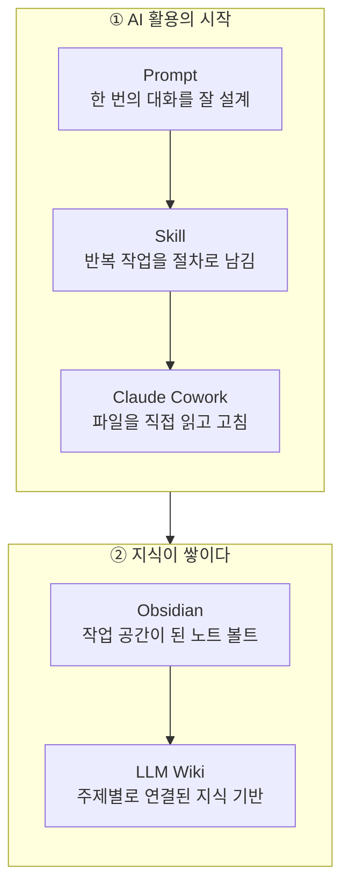
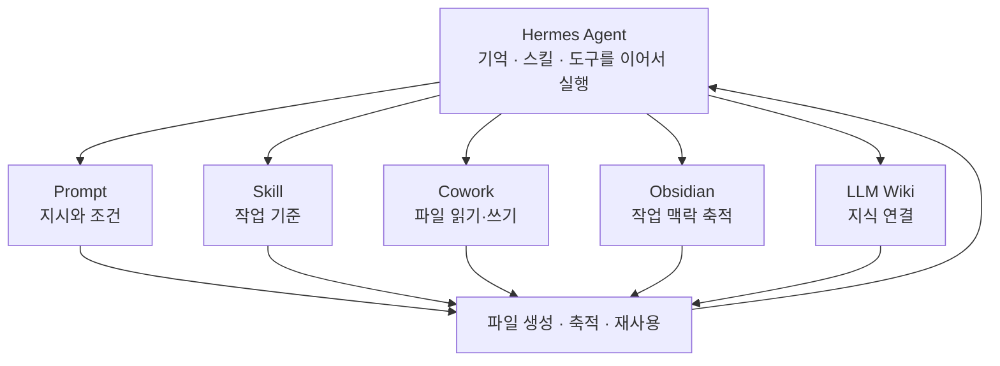
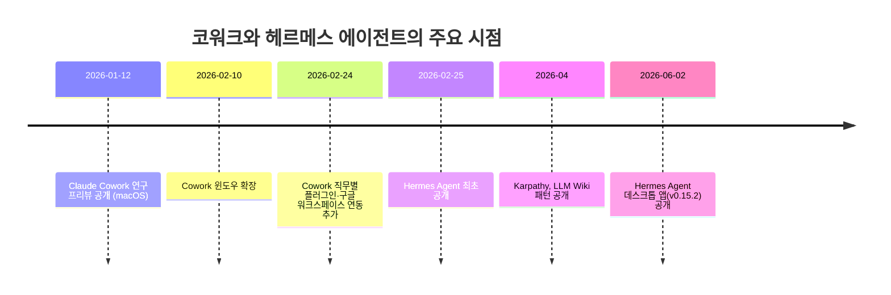

## 관련글

[**프롬프트에서 헤르메스까지, 따로 배운 것을 함께 쓰기까지**](https://www.facebook.com/share/p/1DduftBERp/)

## 들어가며

이 글은 한 실무자가 지난 몇 달간 AI를 다루는 방식이 어떻게 바뀌어 왔는지를 정리한 기록을 바탕으로 한다. 핵심은 하나의 도구가 이전 도구를 대체했다는 이야기가 아니라, 프롬프트 작성부터 스킬 설계, 클로드 코워크(Claude Cowork)를 통한 파일 작업, 옵시디언(Obsidian)에 쌓은 지식, LLM 위키(LLM Wiki) 구조, 그리고 최근의 헤르메스 에이전트(Hermes Agent)까지 각 단계에서 익힌 방법이 서로 이어지며 하나의 작업 흐름으로 통합되었다는 점이다. 아래에서는 이 변화를 단계별로 풀어서 설명하고, 각 도구에 대해 현재 확인 가능한 사실을 함께 짚는다.

---

## 1단계 — 프롬프트를 잘 쓰는 것이 실력이던 시기

AI 활용의 출발점은 프롬프트였다. 질문의 목적과 조건을 최대한 구체적으로 적고, 원하는 결과가 나올 때까지 문장을 고쳐 쓰는 과정이 반복되었다. 이 시기에는 AI와 나누는 한 번의 대화를 얼마나 정교하게 설계하는지가 결과물의 품질을 좌우했다. 같은 질문이라도 조건을 어떻게 배열하는지, 어떤 예시를 함께 주는지에 따라 결과가 크게 달라졌기 때문에, 좋은 질문을 만드는 능력 자체가 하나의 기술로 여겨졌다.

다만 이 방식에는 한계가 있었다. 매번 새로운 대화창에서 처음부터 조건을 설명해야 했고, 어제 잘 작동했던 프롬프트를 오늘 다시 쓰려면 대화 기록을 뒤져 복사해 와야 했다. 대화가 끝나면 그 안에 쌓인 맥락도 함께 사라졌다.

## 2단계 — 반복되는 작업을 스킬로 남기기

프롬프트를 매번 새로 입력하는 대신, 반복해서 사용하는 작업 순서와 판단 기준을 하나의 스킬로 정리하는 방식으로 넘어갔다. 글쓰기, 리서치, 강의안 제작처럼 자주 하는 일을 정해진 절차로 다시 실행할 수 있게 만든 것이다. 이 전환은 단순한 효율화 이상의 의미가 있었다. 관심의 중심이 좋은 질문을 만드는 일에서, AI가 매번 같은 기준으로 일하도록 규칙을 설계하는 쪽으로 옮겨갔기 때문이다. 프롬프트가 한 번의 대화를 위한 도구였다면, 스킬은 여러 번의 대화에 걸쳐 재사용되는 작업 표준에 가까웠다.

## 3단계 — 클로드 코워크와 파일 중심 작업

올해 상반기부터는 클로드 코워크를 중심으로 작업 방식이 바뀌었다. 코워크는 앤트로픽이 2026년 1월 12일 연구 프리뷰(Research Preview)로 처음 공개한 기능으로, macOS에서 시작해 같은 해 2월 10일 윈도우로 확장되었고, 2월 24일에는 직무별 플러그인과 구글 워크스페이스 연동이 추가되었다. 코워크는 클로드 코드(Claude Code)가 가진 에이전트 능력을 터미널 없이 그래픽 인터페이스에서 쓸 수 있게 만든 기능으로 클로드 데스크톱 앱을 통해 macOS, 윈도우, 리눅스(베타)에서 유료 요금제 전반에 제공되며, 터미널을 쓰지 않고도 여러 단계로 이루어진 복잡한 작업을 맡길 수 있게 한다. 코드는 로컬 컴퓨터에 격리된 가상 머신 안에서 실행되며, 파일을 읽고 쓰는 범위는 사용자가 연결해 둔 폴더로 제한된다.

이전까지는 대화창에 파일을 하나씩 올려야 했다면, 코워크가 도입된 뒤로는 데스크톱에 설치된 프로그램이 컴퓨터의 폴더와 문서를 직접 읽고 고치는 방식으로 바뀌었다. AI가 답변만 내놓는 데서 멈추지 않고, 실제 작업 결과물이 파일 형태로 컴퓨터에 남기 시작한 것이다. 최근에는 코워크의 적용 범위도 넓어졌다. 코워크 작업이 앤트로픽의 서버에서 격리된 환경으로 원격 실행되는 방식도 베타로 제공되기 시작했으며, 이 경우 세션과 파일은 사용자의 클로드 계정에 저장되어 노트북을 닫아도 작업이 이어지고 다른 기기에서 같은 세션을 다시 열 수 있다. 데스크톱에서는 로컬 파일과 브라우저까지 함께 쓸 수 있는 완전한 형태의 코워크를 이용할 수 있다.

## 옵시디언의 역할이 바뀌다

코워크를 쓰기 시작하면서 옵시디언의 쓰임새도 달라졌다. 이전까지 옵시디언은 직접 작성한 노트를 보관하고 서로 연결해 두는 개인 저장 공간에 가까웠다. 코워크를 사용한 뒤로는 AI가 직접 읽고 쓰는 작업 공간으로 바뀌었다. 글쓰기 기준, 강의 자료, 프로젝트 기록, 작업 결과물이 같은 볼트 안에 쌓이기 시작했고, 다음 작업은 그 자료를 다시 불러오는 데서 출발했다. 대화가 끝나면 맥락도 함께 사라지던 이전 방식에서 벗어나기 시작한 지점이 바로 여기다.

## LLM 위키 — 쌓인 자료를 다시 쓸 수 있는 지식으로

옵시디언에 자료가 늘어나면서, 단순히 노트를 모아 두는 것만으로는 다음 글이나 강의에 바로 활용하기 어렵다는 문제가 드러났다. 흩어진 리서치와 경험을 주제별 지식으로 정리하고 서로 연결해야 했다. 이때 참고한 구조가 LLM 위키다. LLM 위키는 AI 연구자 안드레이 카파시(Andrej Karpathy)가 2026년 4월 깃허브 젠(Gist)을 통해 제안한 패턴으로, 소스를 추가할 때마다 지식이 새로 쌓이는 구조화된 지식 기반을 뜻한다. 기존의 RAG(검색 증강 생성) 방식이 질문할 때마다 원본 문서를 다시 뒤져 답을 만드는 것과 달리, LLM 위키는 원본 자료를 큐레이션하는 raw 폴더, LLM이 직접 작성하는 wiki 폴더, 그리고 LLM의 작동 방식을 정의하는 스키마 파일 세 층으로 구성된다. 새로운 자료가 raw 폴더에 들어오면 LLM이 그 내용을 읽고 관련된 여러 위키 문서를 함께 갱신하며, 하나의 자료를 반영하는 과정에서 보통 10개에서 15개 정도의 위키 문서가 함께 손질된다. 이렇게 쌓인 위키는 질문을 받을 때마다 원본을 다시 검색하는 대신, 이미 정리된 지식을 바탕으로 답을 내놓는다.

이 구조를 참고해 만든 개인용 LLM 위키는 저장된 자료를 AI가 다시 찾고 비교하며 새로운 결과물에 사용하도록 만드는 지식 기반 역할을 했다. 이 단계에서부터는 AI에게 일을 맡기는 것뿐 아니라, 어떤 자료를 근거로 판단하게 할지를 함께 관리하는 작업이 더해졌다.

## 헤르메스 에이전트 — 지금까지 익힌 방식을 하나로 잇다

가장 최근에는 헤르메스 에이전트를 사용하면서, 그동안 따로 익혀 온 방식들을 함께 활용하고 있다. 헤르메스 에이전트는 누스 리서치(Nous Research)가 2026년 2월에 공개한 오픈소스 자율 에이전트로, 특정 개발 환경에 묶인 코딩 보조 도구나 단일 API를 감싼 챗봇이 아니라 서버 위에서 계속 실행되며 배운 것을 기억하고 오래 돌아갈수록 더 능숙해지는 성격의 도구다. 지속적으로 실행되며 세션을 넘어 기억을 유지하고, 경험에서 재사용 가능한 스킬을 스스로 만들어 내는 것이 이 에이전트의 핵심 특징으로 소개된다.

작동 방식을 조금 더 들여다보면, 헤르메스는 작업을 하나 마칠 때마다 평가 단계를 거쳐 그 결과가 성공적이었는지 판단하고, 재사용 가능한 추론 패턴을 추출해 마크다운 형태의 스킬 파일로 저장한다. 다음에 비슷한 작업을 만나면 처음부터 다시 추론하는 대신 관련된 스킬을 불러와 사용한다. 누스 리서치는 이를 “닫힌 학습 루프”라고 부르며, 이 구조는 SQLite 전문 검색과 LLM 요약을 기반으로 만들어졌다. 다만 여기서 제시되는 성능 수치, 즉 스스로 만든 스킬을 20개 이상 보유한 에이전트가 비슷한 작업을 이전보다 40퍼센트 더 빠르게 마친다는 수치는 결과물의 품질이 아니라 토큰 사용량과 처리 시간을 기준으로 한 것이라는 점은 구분해서 볼 필요가 있다.

헤르메스는 하나의 채팅 인터페이스에 머무르지 않는다. 텔레그램, 디스코드, 슬랙, 왓츠앱, 시그널, 이메일, 명령줄 등 여러 플랫폼에서 하나의 에이전트와 하나의 기억을 이어서 쓸 수 있도록 설계되어 있으며, 에이전트스킬스닷아이오(agentskills.io)와 호환되는 개방형 스킬 구조를 지원해 스킬을 다른 사용자와 주고받을 수 있고, 모델 컨텍스트 프로토콜(MCP) 서버에 연결해 도구 범위를 확장할 수 있으며, 자연어로 예약 작업을 등록해 보고서나 백업, 브리핑을 무인으로 실행할 수 있다. 또한 하위 작업을 짧게 실행되고 격리된 서브 에이전트로 분리해 처리하는 구조를 갖추고 있어, 각 서브 에이전트가 좁은 맥락과 한정된 도구만 가지고 작업하도록 만들어 전체 작업이 흐트러지지 않게 하고 로컬 모델에서도 작은 컨텍스트 창으로 운용할 수 있게 한다. 특정 제공사에 묶이지 않고 여러 모델 제공사와 호환되도록 설계되어 있으며, 상시 로컬 실행에 최적화되어 있다는 점도 특징으로 꼽힌다.

공개 이후의 확산 속도도 빠른 편이다. 공개 3개월 만에 깃허브 스타 14만 개를 넘겼고, 오픈라우터(OpenRouter) 기준으로 가장 많이 쓰이는 에이전트로 집계되었으며, 이후 2026년 6월 2일에는 macOS, 윈도우, 리눅스용 네이티브 데스크톱 앱이 v0.15.2 퍼블릭 프리뷰로 공개되면서 터미널 사용이 부담스러웠던 사용자층까지 진입 장벽이 낮아졌다. 이 시점을 기준으로는 깃허브 스타가 4개월 만에 18만 개를 넘어섰다는 집계도 확인된다.

지금은 이 헤르메스 에이전트 안에서, 프롬프트로 지시하는 법, 스킬에 작업 기준을 남기는 법, 코워크로 파일을 다루는 법, 옵시디언에 작업 맥락을 쌓는 법, LLM 위키로 지식을 연결하는 법이 함께 이어지고 있다. 필요한 자료를 찾고, 알맞은 스킬을 불러오고, 결과를 파일로 남기며, 다음 작업에서 그 기록을 다시 사용하는 흐름이 하나의 에이전트 안에서 처리되는 셈이다.

---

## 흐름을 그림으로 정리하면

아래 그림은 지금까지 설명한 세 단계의 변화를 순서대로 보여 준다.

세 번째 그림은 헤르메스 에이전트가 이 모든 흐름을 어떻게 이어 주는지를 나타낸다. 각각을 따로 쓸 때는 사람이 단계마다 직접 연결해야 했지만, 지금은 하나의 에이전트가 그 사이를 이어서 처리한다.

두 도구가 공개되고 확장되어 온 시점을 시간순으로 정리하면 다음과 같다.

---

## 단계별로 무엇이 달라졌는가

| 단계 | 도구 | 무엇이 바뀌었나 | 남는 것 |
|---|---|---|---|
| 1 | Prompt | 대화 한 번을 정교하게 설계 | 대화가 끝나면 맥락도 사라짐 |
| 2 | Skill | 반복 작업의 절차와 기준을 고정 | 재사용 가능한 작업 지침 |
| 3 | Claude Cowork | 컴퓨터의 파일을 직접 읽고 수정 | 실제 파일 형태의 결과물 |
| 4 | Obsidian | 노트 저장소가 AI의 작업 공간으로 전환 | 누적되는 작업 맥락 |
| 5 | LLM Wiki | 흩어진 자료가 연결된 지식으로 재구성 | 다시 찾아 쓸 수 있는 지식 기반 |
| 6 | Hermes Agent | 위 다섯 가지를 하나의 실행 흐름으로 통합 | 기억·스킬·자료가 이어지는 작업 루프 |

---

## 마무리

이 변화를 관통하는 흐름은 도구를 하나씩 바꿔 온 것이 아니라, 각 단계에서 익힌 방법을 다음 단계로 계속 옮겨 담아 온 과정이라는 점이다. 프롬프트에서 시작해 스킬, 코워크, 옵시디언, LLM 위키까지 순서대로 쌓아 온 방식들은 헤르메스 에이전트 안에서 하나의 작업 흐름으로 통합되었다. 몇 달 전에는 AI에게 무엇을 물어볼지를 고민하는 것이 중심이었다면, 지금은 어떤 기준과 자료를 주고, 어디까지 일을 맡기며, 결과를 어디에 남길지를 먼저 생각하는 방식으로 무게 중심이 옮겨간 셈이다.

다만 헤르메스 에이전트가 제시하는 성과 지표나 확산 속도에 대한 수치는 대부분 개발사와 협력 기업이 발표한 자료에 근거한 것으로, 독립적인 재현이나 장기적인 검증이 충분히 이루어졌다고 보기는 아직 이르다. 새로운 도구를 실제 업무에 들여올 때는 이런 수치를 그대로 받아들이기보다, 자신의 작업 환경에서 직접 확인해 보는 과정이 필요하다.

---

## 참고 출처

- Claude Cowork 관련: Anthropic 지원 센터(support.claude.com) "Claude Cowork 시작하기", "웹, 데스크톱, 모바일에서 Claude Cowork 사용하기", "Claude Desktop 설치" 문서
- Hermes Agent 관련: Nous Research 공식 문서(hermes-agent.nousresearch.com), GitHub(NousResearch/hermes-agent), OpenRouter 앱 소개 페이지, NVIDIA 블로그(2026년 5월 13일), Medium "Hermes Agent Desktop App"(2026년 6월)
- LLM Wiki 관련: Andrej Karpathy GitHub Gist(2026년 4월), 관련 해설 아티클(starmorph.com, nandigamharikrishna.substack.com, datasciencedojo.com)

---

작성일: 2026년 7월 21일
