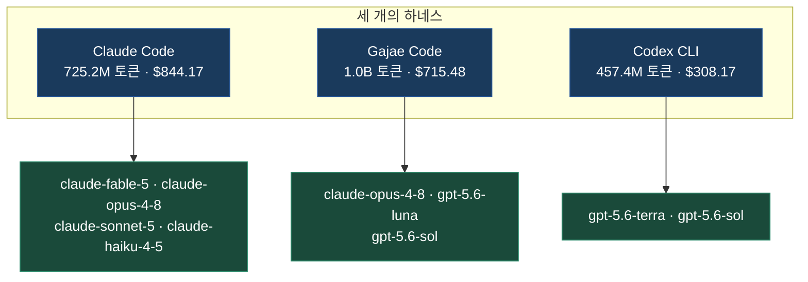
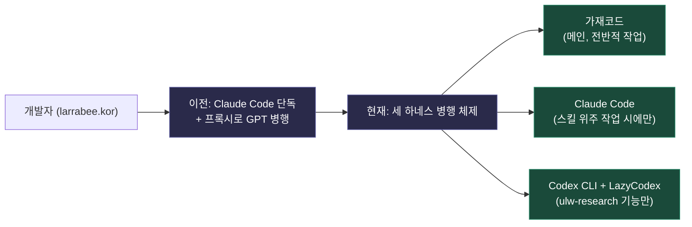

## 목차

1. 이 글에서 다루는 두 가지 자료
2. 첨부해주신 사용량 현황판, TokScale이란 무엇인가
3. 사용량 데이터 한 줄 한 줄 풀어보기
4. 첫 번째 게시물 — larrabee.kor님의 하네스 전환기
5. 하네스란 무엇이고, 왜 지금 논쟁의 한복판에 있는가
6. 두 번째 게시물 — speciai.kr님이 던진 세 가지 가설
7. 두 게시물을 겹쳐서 읽으면 보이는 그림
8. 표로 정리하는 2026년 상반기 하네스 생태계
9. 참고 자료

---

## 1. 이 글에서 다루는 두 가지 자료

이번 글은 세 가지 원본 자료를 근거로 작성되었다. 첫째는 TokScale이라는 도구가 만들어주는 토큰 사용량 현황판이고, 둘째는 개발자 larrabee.kor님이 Threads에 올린 게시물로, 자신이 왜 Claude Code 단독 체제에서 벗어나 가재코드(Gajae Code)를 메인으로 쓰게 되었는지를 설명하는 글이다. 셋째는 speciai.kr님이 올린 게시물로, 요즘 개발자 커뮤니티에서 반복적으로 등장하는 "하네스 논쟁"이 왜 발생하는지에 대한 세 가지 가설을 제시하는 짧은 글이다. 이 세 자료는 서로 다른 층위에 있다. 현황판은 한 사람의 실제 소비 데이터이고, 첫 번째 글은 그 데이터의 배경이 되는 실전 워크플로우이며, 두 번째 글은 그 워크플로우를 둘러싼 커뮤니티 차원의 논쟁을 메타적으로 짚는다. 세 가지를 순서대로 따라가면, 왜 지금 한국의 AI 코딩 커뮤니티가 "어떤 모델을 쓸 것인가"보다 "어떤 하네스를 쓸 것인가"를 더 많이 이야기하고 있는지가 자연스럽게 이해된다.

---

## 2. 첨부해주신 사용량 현황판, TokScale이란 무엇인가


먼저 첨부해주신 자료부터 짚고 넘어가야 한다. 상단에 "TOK$CALE"이라는 로고가 보이는 이 도구는 실제로 존재하는 오픈소스 프로젝트다. 개발자 junhoyeo가 만든 TokScale은 OpenCode, Claude Code, Codex CLI, Cursor IDE, Gemini CLI, Amp, Droid, Hermes Agent 등 20종 이상의 AI 코딩 에이전트로부터 로컬에 남아있는 사용 기록을 스캔해 토큰 소비량과 비용을 하나의 화면에 모아 보여주는 CLI 도구이자 시각화 대시보드다[1][2]. 각 클라이언트가 로컬에 남기는 세션 로그, 데이터베이스 파일 등을 직접 읽어들이는 방식으로 작동하며, 비용 계산에는 LiteLLM의 가격 데이터를 사용해 구간별 요금제와 캐시 토큰 할인까지 반영한다[1].

이 프로젝트의 이름 자체가 재미있는 은유에서 나왔다. 천체물리학자 니콜라이 카르다쇼프가 제안한 카르다쇼프 척도는 한 문명이 얼마나 많은 에너지를 다룰 수 있는지로 그 문명의 기술 수준을 분류하는 척도다. TokScale 개발자는 AI 보조 개발의 시대에는 토큰이 새로운 에너지라고 보고, 카르다쇼프 척도가 우주적 규모의 에너지 소비를 추적하듯 TokScale은 개발자가 AI 증강 개발의 사다리를 오르며 소비하는 토큰을 측정하고 시각화한다는 설계 철학을 밝히고 있다[1][4]. 가볍게 쓰는 사용자든 하루에 수백만 토큰을 소비하는 파워 유저든 "내가 어디에서 무엇을 얼마나 쓰고 있는지"를 한눈에 보여주는 것이 이 도구의 존재 이유다.

TokScale은 로컬 CLI 도구로 끝나지 않고, `tokscale submit` 명령으로 사용량 데이터를 글로벌 리더보드에 제출하고 공개 프로필을 만들 수 있는 소셜 기능까지 갖추고 있다[1][3]. GitHub 계정으로 로그인해 다른 개발자들과 토큰 소비량을 비교하거나, 연말에는 한 해의 사용 이력을 요약해주는 "Wrapped" 기능으로 자신의 개발 패턴을 되돌아볼 수도 있다[4]. 첨부해주신 화면은 바로 이 대시보드가 로컬 사용 기록을 집계해 보여주는 개요 화면으로 보이며, Claude Code, Gajae Code, Codex CLI라는 세 개의 서로 다른 하네스에서 소비한 토큰과 비용을 각각 하위 모델별로 쪼개서 보여주고 있다.

---

## 3. 사용량 데이터 한 줄 한 줄 풀어보기

숫자 자체를 그냥 지나치기보다, 각 항목이 무엇을 의미하는지 짚어보는 것이 데이터를 제대로 읽는 방법이다. 세 개의 하네스 각각에 대해 토큰 구성과 비용 구성을 살펴보자.

### 3.1 Claude Code 섹션 — 725.2M 토큰, $844.17

Claude Code 섹션에는 네 개의 실제 모델과 하나의 `<synthetic>` 항목이 있다. `<synthetic>`은 실제 모델 호출이 아니라 Claude Code 내부에서 시스템이 생성하는 합성 메시지(예: 요약이나 압축 처리)로 추정되며, 토큰과 비용이 0으로 표시된 것도 이 때문이다.

가장 큰 비용을 차지하는 것은 claude-fable-5로, $502.68을 차지하며 524개의 메시지로 이 정도 비용이 발생했다. 메시지 수 대비 비용이 유독 높다는 점이 눈에 띄는데, 이는 Fable 5가 이 네 모델 중 가장 비싼 가격대의 모델이거나, 메시지당 처리하는 컨텍스트(특히 출력 59만 토큰, 캐시 읽기 1억 1,100만 토큰)가 매우 크다는 뜻이다. 참고로 Claude Fable 5는 Anthropic이 2026년 6월 9일 Claude Mythos 5와 함께 처음 출시한 최신 세대 모델이다. 이 두 모델은 출시 사흘 만인 6월 12일 미국 상무부의 수출통제 조치로 인해 접근이 일시 중단되었다가, 상무부가 6월 30일 해당 통제를 해제하면서 Anthropic이 7월 1일 접근을 복원한 이력이 있다(공식 공지: anthropic.com/news/fable-mythos-access). 이 데이터가 언제 수집되었는지는 알 수 없지만, 만약 6월 12일 이전이나 7월 1일 이후 구간을 포함한다면 이 이력이 사용 패턴에 영향을 주었을 가능성이 있다.

claude-opus-4-8은 $235.49로 두 번째로 큰 비중을 차지하며, 637개의 메시지가 발생했다. 캐시 읽기가 2억 800만 토큰에 달해 입력(33만 토큰)보다 압도적으로 많은데, 이는 반복적으로 동일한 대화 맥락을 캐시에서 불러와 재사용하는 장시간 에이전트 세션의 전형적인 패턴이다.

claude-sonnet-5는 $105.67로 세 번째지만, 메시지 수는 1,560개로 오히려 Claude Code 섹션 전체에서 가장 많다. 토큰 총량(3억 5,630만)도 가장 크다. 메시지당 비용이 상대적으로 낮다는 것은 Sonnet 5가 더 저렴한 요금 체계를 가진 모델이며, 가볍고 반복적인 작업에 주로 투입되고 있다는 뜻으로 해석할 수 있다.

claude-haiku-4-5는 $0.32에 불과하며 15개의 메시지만 발생했다. 가장 가벼운 모델답게 아주 제한적으로만 호출되었다.

### 3.2 Gajae Code 섹션 — 1.0B 토큰, $715.48

가재코드 섹션에서는 패턴이 완전히 달라진다. claude-opus-4-8 하나가 $589.63으로 이 섹션 비용의 82% 이상을 차지하며, 토큰량도 7억 7,260만으로 압도적이다. 특히 출력 토큰이 300만, 캐시 읽기가 7억 4,690만에 달한다는 점이 인상적인데, 이는 Opus 4.8이 가재코드 안에서 단순 보조 역할이 아니라 핵심 실행 또는 검증 역할을 오래 지속되는 세션 형태로 맡고 있다는 뜻으로 읽힌다. 1,912개의 메시지는 이 표 전체에서 가장 많은 메시지 수이기도 하다.

반면 gpt-5.6-luna는 $64.39에 2,136개의 메시지가 발생해, 메시지 수는 가장 많지만 비용은 훨씬 낮다. 이는 Luna가 GPT-5.6 제품군 중 가장 가볍고 저렴한 등급의 모델이기 때문이다. gpt-5.6-sol은 $61.46에 302개의 메시지로, 메시지당 비용이 luna보다 훨씬 높다. Sol은 GPT-5.6 제품군의 최상위 플래그십 모델이므로, 적은 횟수만 호출되어도 비용이 비슷한 수준까지 올라간다.

`eu.anthropic.claude-fable-5`라는 항목도 눈에 띈다. 접두어 `eu.`는 유럽 리전을 통한 API 라우팅을 의미하는 것으로 보이며, 토큰 0, 비용 $0.00에 메시지 1개만 기록되어 있어 실제로는 연결 테스트 정도의 호출이었을 가능성이 크다.

### 3.3 Codex CLI 섹션 — 457.4M 토큰, $308.17

Codex CLI 섹션에는 gpt-5.6-terra와 gpt-5.6-sol 두 모델만 등장한다. gpt-5.6-terra가 $192.95로 이 섹션의 대부분을 차지하며 3,804개의 메시지로 세 섹션을 통틀어 가장 많은 메시지 수를 기록했다. Terra는 GPT-5.6 제품군의 중간 등급 모델로, 이전 세대 플래그십과 맞먹는 성능을 절반 가격대에 제공하도록 설계된 모델이다[5][7]. 대량의 메시지를 소화하면서도 비용을 적정 수준으로 유지할 수 있는 것은 이런 가격 설계 덕분으로 보인다.

여기서 유일하게 "Reasoning" 토큰이라는 항목이 등장한다는 점도 주목할 만하다. gpt-5.6-terra는 180만, gpt-5.6-sol은 23만 7,600 토�큰의 추론(reasoning) 토큰을 소비했다. 이는 GPT-5.6 계열이 응답을 생성하기 전에 내부적으로 사고 과정을 거치는 추론 모델이기 때문이며, Claude Code나 가재코드 섹션에는 이 항목이 없다는 점에서 추론 토큰 과금이 OpenAI 계열 모델에 특화된 항목이라는 것을 알 수 있다.

### 3.4 세 하네스를 동시에 쓰는 이유

세 섹션을 합치면 총 토큰량은 약 21억 8천만, 총 비용은 $1,867.82에 달한다. 하나의 코딩 작업에 Claude Code, 가재코드, Codex CLI라는 세 개의 서로 다른 하네스를 동시에 운영하고 있다는 것 자체가 이례적으로 보일 수 있지만, 다음 장에서 다룰 larrabee.kor님의 게시물을 읽으면 이 조합이 왜 합리적인 선택인지 이해할 수 있다.



---

## 4. 첫 번째 게시물 — larrabee.kor님의 하네스 전환기

```
https://www.threads.com/@larrabee.kor/post/DbDfVi0k5PA

하네스 논쟁 왜 나오는걸까요 (진짜모름)
그냥 본인한테 맞는거 쓰시면 됩니다

저는 원래 claude code 만을 이용하는 사람이었고, 여기에 프록시로 gpt 붙이고 뭐 이렇게도 썼습니다.
근데 fable 나오고 도저히 token 사용량 감당안되서 gjc(gajae-code)를 메인으로 쓰고, 스킬위주로 작업할거있으면 클코 켜고, codex는 lazycodex 붙여서 ulw-research만 씁니다.
그냥, 이렇게 원하시는거 쓰시면 됩니다.

gjc는 클코와 거의 같은 사용경험을 주면서 라이트해서 좋습니다. 사실 gjc는 claudecode, codex같은거라서 하네스라고 하긴 애매합니다만 여튼 그렇습니다.
lazycodex는 ulw-research 하나만으로도 쓸 가치 있다고 생각합니다. 
claude code 하네스 하나만 쓴다면 moai adk가 가장 좋다고 생각하구요.
omc omx는 깔았다 지웠습니다.

이렇게 써보고 안좋다 느껴지시면 빼고 쓰시면 됩니다.
```

larrabee.kor님의 게시물은 개인적인 사용 경험을 담담하게 서술한 글이지만, 그 안에 앞서 본 사용량 데이터를 설명해줄 수 있는 단서가 그대로 들어있다. 글쓴이는 원래 Claude Code만 쓰던 사람이었고, 여기에 프록시로 GPT를 붙여 함께 쓰기도 했다고 밝힌다. 그런데 Fable이 나온 이후 토큰 사용량을 도저히 감당할 수 없어서, 가재코드(gjc)를 메인으로 쓰고, 스킬 위주 작업이 필요할 때만 Claude Code를 켜고, Codex는 lazycodex를 붙여 ulw-research 기능만 쓰는 방식으로 재편했다고 설명한다.

이 서술은 앞서 본 데이터의 배경을 정확히 설명해준다. Claude Code 섹션에서 claude-fable-5가 메시지 수(524개) 대비 비용($502.68)이 유독 큰 이유, 그리고 정작 메인 워크로드가 가재코드 섹션(1.0B 토큰)에 몰려 있는 이유가 이 게시물 하나로 설명된다. Fable 5의 토큰 소비가 부담스러워 가재코드를 메인으로 옮겼다는 진술과, 실제 데이터에서 가재코드가 가장 많은 토큰을 소비하고 있다는 사실이 정확히 들어맞는다.

글쓴이는 이어서 자신이 실제로 사용해본 도구들에 대한 짧은 평가도 남긴다. 가재코드는 Claude Code와 거의 같은 사용 경험을 주면서도 더 가볍다는 것이 장점이라고 말하며, 사실 가재코드는 Claude Code나 Codex처럼 그 자체로 하나의 코딩 에이전트에 가까워서 "하네스"라고 부르기는 다소 애매하다는 인식도 함께 밝힌다. lazycodex는 그 안의 ulw-research 기능 하나만으로도 쓸 가치가 있다고 평가하며, Claude Code 하네스를 하나만 골라야 한다면 moai adk가 가장 낫다고 판단한다고 밝힌다. 반면 omc와 omx는 설치했다가 지웠다고 짧게 언급한다.

이 평가들이 각각 어떤 도구를 가리키는지 하나씩 정리해보면 다음과 같다.

**가재코드(Gajae Code, gjc)** 는 한국 개발자 Yeachan-Heo가 만든 프로젝트로, 공식 문서에서 스스로를 "외부 코딩 에이전트 하네스"로 정의한다[8][9]. 여기서 핵심은 "외부"라는 단어다. Claude Code 플러그인으로 그 내부에서 동작하는 도구나, Codex CLI 플러그인으로 그 내부에서 동작하는 도구와 달리, 가재코드는 독립된 프로세스로 실행되면서 Claude Code, Codex, OpenCode 등 어떤 코딩 에이전트와도 나란히 병행해서 쓸 수 있도록 설계되었다[9]. 저장소 루트나 워크트리에서 `gjc`를 실행하면 deep-interview(의도 명확화 인터뷰) → ralplan(계획 수립과 비평) → ultragoal(목표 생성과 완료까지의 실행)이라는 워크플로우가 진행되며, 모든 목표와 수정 사항, 검증 결과는 `.gjc/` 디렉토리에 내구성 있는 증거로 기록된다[8][10]. 이름의 유래는 갑각류로, 기본 테마가 어두운 배경의 red-claw와 밝은 배경의 blue-crab으로 구성되어 있어 붙여졌다는 설명이 공식 문서에 있다[10]. 특정 모델에 종속되지 않아 Claude, Codex, GPT-5.5, Gemini, OpenCode 등 다양한 백엔드를 자유롭게 교체하며 쓸 수 있다는 점도 특징이다[10]. 글쓴이가 "Claude Code, Codex 같은 것이라 하네스라고 하기 애매하다"고 평가한 것은, 가재코드가 단순히 기존 에이전트를 감싸는 얇은 껍질이 아니라 그 자체로 완결된 에이전트 런타임을 갖추고 있기 때문으로 볼 수 있다.

**LazyCodex**는 code-yeongyu라는 개발자가 만든 프로젝트로, 내부 엔진은 OmO(oh-my-openagent)라 불린다[10]. "tokenmaxxers를 위한 코딩 에이전트"라는 표현이 저장소 설명에 등장할 만큼, 컨텍스트 토큰을 최대한 효율적으로 쓰는 데 초점을 맞춘 설계다. 흥미로운 점은 OmO 저장소 설명에 "우리는 Anthropic 모델을 너무 사랑한 나머지 차단당했다. 이제는 Codex를 지원한다"는 문구가 있다는 것인데, 이는 원래 Claude Code를 대상으로 개발되다가 Anthropic 쪽과의 관계가 틀어지면서 Codex 중심으로 방향을 전환했음을 시사한다[10]. LazyCodex가 제공하는 스킬 명령 중 하나가 바로 글쓴이가 언급한 **ulw-research**이며, 이는 Ultrawork Loop(ulw) 계열 명령 중 리서치에 특화된 기능으로, 모호한 작업을 실행 결정이 끝난 계획으로 바꿔주는 `$ulw-plan`과 함께 이 하네스의 핵심 워크플로우를 구성한다[10]. LazyCodex의 실용적 장점은 터미널을 열지 않아도 Codex의 PC 앱 안에서 플러그인 형태로 그대로 동작한다는 점이며, 이 PC 앱이 다시 ChatGPT 모바일 앱과 연동되므로 결과적으로 스마트폰에서도 진행 상황을 확인하고 승인할 수 있다[10].

**MoAI-ADK**는 한국의 "모두의AI(MoAI)" 팀이 만든 Claude Code 전용 개발 키트로, 공식 저장소는 "Tokenomics(토큰 경제학)"를 북극성 지표로 삼는다고 밝히고 있다. 같은 코드 품질을 더 적은 토큰으로, 혹은 같은 토큰으로 더 높은 품질을 뽑아내는 것을 목표로 삼으며, 작업 단계와 SPEC 규모에 따라 모델과 추론 강도를 정책적으로 배정하는 구조를 갖추고 있다[11]. 24개의 AI 에이전트와 52개의 스킬, TDD·DDD 품질 게이트를 갖춘 이 도구는 `/moai project` 명령 하나로 프로젝트 문서와 하네스를 함께 자동 구성해주며, Go 언어 기반 CLI로 재작성되어 별도 의존성 없이 실행된다는 점이 강점으로 꼽힌다[11]. 글쓴이가 "Claude Code 하네스 하나만 쓴다면 moai adk"라고 평가한 배경에는, 이처럼 하네스 구성 자체를 자동화해주는 완결성이 있는 것으로 보인다.

**OMC(oh-my-claudecode)** 와 **OMX(oh-my-codex)** 는 가재코드를 만든 것과 동일한 개발자 Yeachan-Heo가 만든 프로젝트로, 각각 Claude Code와 Codex CLI 내부에서 동작하는 플러그인형 오케스트레이션 레이어다. "Codex 사용자라면 OMX를, Claude Code 사용자라면 OMC를 쓰라"는 것이 공식 문서의 설명이며, `$deep-interview`, `$ralplan`, `$ralph`, `$team`이라는 네 가지 스킬 명령으로 구성된 워크플로우를 제공한다[10]. OMC에는 디버깅 경험에서 재사용 가능한 패턴을 자동으로 스킬 파일로 추출해주는 `/skillify` 기능이 있어 "한 번 배우면 영원히 재사용한다"는 철학을 구현하고 있다[10]. 글쓴이가 이 두 도구를 "설치했다가 지웠다"고 짧게만 언급한 것으로 보아, 자신의 워크플로우에는 맞지 않았거나 가재코드와 기능이 겹친다고 판단했을 가능성이 있다. 다만 이 부분은 글쓴이의 명시적인 이유 설명이 없으므로 추측의 영역임을 밝혀둔다.



---

## 5. 하네스란 무엇이고, 왜 지금 논쟁의 한복판에 있는가

두 번째 게시물을 이해하려면 먼저 "하네스"라는 단어 자체가 왜 이렇게 자주 등장하는지를 짚어야 한다. 하네스라는 말은 원래 말에게 채우는 마구, 즉 고삐와 안장을 뜻한다. 아무리 강한 말이 있어도 고삐와 안장이 없으면 원하는 방향으로 달리게 할 수 없다는 것이 이 용어가 AI 에이전트 분야로 옮겨온 핵심 직관이다. AI 에이전트 맥락에서 하네스는 모델을 감싸는 시스템 전체, 즉 규칙, 도구, 스킬, 메모리, 피드백 루프를 설계하는 기술을 가리킨다.

이 개념에 소프트웨어 설계 언어로서의 지위를 부여한 인물로 자주 언급되는 사람은 HashiCorp의 공동창립자 Mitchell Hashimoto다. 그는 2026년 2월 초 자신의 블로그에서 하네스 엔지니어링을 "에이전트가 실수할 때마다, 그 실수가 다시는 발생하지 않도록 엔지니어링하는 것"이라고 정의했다[13]. 비슷한 시기 Martin Fowler 역시 하네스 엔지니어링을 체계적으로 분류하는 글을 발표했고, LangChain은 "에이전트 하네스"라는 개념을 전면에 내세운 Deep Agents를 공개했다[10].

이 개념이 단순한 유행어가 아니라는 근거로 자주 인용되는 것이 LangChain의 코딩 에이전트 벤치마크 Terminal Bench 2.0 결과다. 동일한 모델을 그대로 사용하면서 하네스만 개선했을 때, 순위가 30위권 밖에서 상위 5위권으로 뛰어올랐고 점수는 52.8에서 66.5로 상승했다는 결과가 공개되었다[10][13]. 국내에서도 비슷한 실증 사례가 있다. 카카오 AI Native 전략팀의 한 리더가 15가지 소프트웨어 엔지니어링 과제로 실험한 결과, 하네스 없이 작업했을 때 평균 품질 점수는 49.5였지만 하네스를 적용하자 79.3으로 올라, 15개 과제 전부에서 하네스를 쓴 쪽이 이겼다는 결과를 발표하기도 했다[16]. Stanford, MIT, University of Wisconsin-Madison 공동 연구팀이 2026년 3월 30일 발표한 논문 역시 동일한 모델이라도 주변 시스템을 어떻게 설계하느냐에 따라 성능이 최대 6배까지 달라질 수 있다는 것을 수치로 보여주었다[15]. 업계 동향도 이 흐름을 뒷받침한다. DeepSeek은 2026년 6월 하네스 전담 팀을 신설했고, 채용 공고에 "모델+하네스=에이전트"라는 공식을 명시했다는 보도가 있다[10].

그런데 바로 이 지점에서 정반대의 목소리도 커지고 있다. 2026년 7월 3일 서울에서 열린 '글로벌 AI 프론티어 심포지엄 2026'에서 OpenAI의 리서치 부사장 노엄 브라운은 국제머신러닝학회(ICML) 참가 중 하네스는 가능한 단순하게 유지해야 한다고 조언하며, 몇 달 안에 등장할 차세대 모델이 현재 쓰이는 하네스 대부분을 쓸모없게 만들 가능성이 높다고 밝혔다[12]. 이 발언은 이미 구글 쪽에서 나온 비슷한 전망에 뒤이은 것으로 보도되었으며, 기사 제목 자체가 "구글 이어 오픈AI도 '하네스 무용론'"이었다[12]. 실제로 OpenAI는 2023년 개발자 행사 이후로도 모델 자체에 계속 새로운 기능을 추가해왔고, 이 때문에 새로운 모델이 나올 때마다 그 모델 위에 얹혀 있던 스타트업들의 영역을 모델 회사가 흡수해버린다는 이른바 '스타트업 멸종' 논란이 반복되어 왔다[12]. Anthropic 역시 다양한 업무 기능을 모델 자체에 직접 추가하며 애플리케이션 영역을 넓히고 있다는 점이 함께 언급된다[12].

정리하면, 지금 하네스를 둘러싼 논쟁은 이렇게 요약할 수 있다. 한쪽에서는 벤치마크 수치와 실증 실험으로 "모델이 아니라 하네스가 진짜 레버"라고 주장하고, 다른 한쪽에서는 모델을 만드는 회사들 스스로가 "곧 하네스가 필요 없어질 것"이라고 말하고 있다. 이 두 흐름이 같은 시기에 공존하고 있다는 사실 자체가, 왜 커뮤니티에서 "하네스 논쟁"이라는 표현이 반복해서 등장하는지를 설명해준다.

---

## 6. 두 번째 게시물 — speciai.kr님이 던진 세 가지 가설

```
https://www.threads.com/@speciai.kr/post/DbDf0E2lB6k

하네스 논쟁 나오는 이유
1. 오픈소스 기여자 잘 나가서 질투?
2. 근본 코드 시장 오픈소스 생태계에서 점점 sns식 마케팅이 활발해지는 부분에 대한 반발
3. 기존 AI들이 발전하면서 하네스 불필요 논쟁?
```

speciai.kr님의 게시물은 바로 이 논쟁이 왜 발생하는지에 대해 세 가지 가설을 짧게 나열한다. 하나씩 짚어보자.

**가설 1: 오픈소스 기여자가 잘 나가서 생기는 질투**라는 가설은, 가재코드나 LazyCodex, OMC/OMX 같은 도구를 만든 한국인 개발자들(Yeachan-Heo, code-yeongyu 등)이 커뮤니티 안에서 빠르게 유명해지고 영향력을 얻는 과정에서, 이를 곱게 보지 않는 시선이 논쟁의 일부 동력이 되고 있다는 해석이다. 다만 이 부분은 글쓴이 본인의 주관적인 해석으로 제시된 것이며, 별도로 검색해본 결과 이런 질투 정서를 구체적으로 뒷받침하거나 반박하는 독립적인 보도나 자료는 찾지 못했다. 따라서 이 가설은 사실 확인이 된 내용이 아니라 커뮤니티 안에서 나올 수 있는 하나의 심리적 해석 정도로 받아들이는 것이 정확하다.

**가설 2: 오픈소스 코드 시장에서 SNS식 마케팅이 점점 활발해지는 것에 대한 반발**이라는 가설도 비슷한 성격이다. 실제로 가재코드, LazyCodex, OMC/OMX 같은 도구들은 Threads나 GitHub를 통해 활발하게 홍보되고, 스타 수나 사용 후기가 빠르게 공유되는 방식으로 확산되고 있는 것은 사실이다. 이런 확산 방식 자체가 전통적인 오픈소스 커뮤니티의 문화, 즉 조용히 코드로 말하는 문화와는 결이 다르다고 느끼는 사람들이 있을 수 있다는 것이 이 가설의 요지로 보인다. 그러나 이 역시 특정 사건이나 논쟁을 특정해서 확인할 수 있는 자료는 찾지 못했으며, 글쓴이의 관찰에 기반한 해석으로 이해하는 것이 맞다.

**가설 3: 기존 AI들이 발전하면서 하네스 자체가 불필요해지는 것 아니냐는 논쟁**은 앞서 5장에서 다룬 내용과 정확히 일치한다. 이 가설만큼은 독립적인 근거로 확인이 된다. 구글에 이어 OpenAI의 노엄 브라운 리서치 부사장이 공개 석상에서 "몇 달 안에 등장할 차세대 모델이 현재 쓰이는 하네스 대부분을 쓸모없게 만들 가능성이 높다"고 발언한 것이 2026년 7월 초에 보도되었고[12], 이는 하네스 엔지니어링이 실제로 효과가 있다는 벤치마크 결과들[10][13][15][16]과 정면으로 배치되는 주장이다. 즉 세 번째 가설은 추측이 아니라, 실제로 업계에서 진행 중인 논쟁의 정확한 요약이라고 볼 수 있다.

세 가설을 종합하면, speciai.kr님은 하네스 논쟁의 원인을 사람들 사이의 감정적 요인(질투, 마케팅에 대한 피로감)과 기술적·구조적 요인(모델 발전에 따른 하네스 무용론)으로 나누어 제시하고 있는 셈이다. 확인 가능한 근거로 뒷받침되는 것은 세 번째뿐이지만, 첫 번째와 두 번째 가설이 완전히 근거 없는 이야기라고 단정할 수도 없다. 다만 이 글에서는 검증되지 않은 부분을 검증된 것처럼 서술하지 않기 위해, 첫 번째와 두 번째는 어디까지나 게시물 작성자 개인의 해석임을 분명히 해둔다.

---

## 7. 두 게시물을 겹쳐서 읽으면 보이는 그림

두 게시물을 나란히 놓고 보면 흥미로운 대비가 드러난다. larrabee.kor님의 글은 하네스 논쟁의 "실전 답안"에 가깝다. 그는 하네스가 필요하냐 필요 없냐를 논쟁하는 대신, 자신에게 맞는 조합을 실제로 찾아서 쓰고 있다고 말한다. 글의 첫 문장에서부터 "하네스 논쟁 왜 나오는걸까요 (진짜모름)"라고 솔직하게 밝히면서도, "그냥 본인한테 맞는거 쓰시면 됩니다"라는 실용적인 결론으로 곧장 넘어간다. 반면 speciai.kr님의 글은 그 논쟁 자체를 한 발 떨어져서 관찰하며 왜 이런 논쟁이 반복되는지를 분석하려는 시도다.

이 둘을 합쳐서 보면, 지금 하네스 생태계에서 벌어지고 있는 일은 이렇게 정리할 수 있다. 모델을 만드는 회사들(OpenAI, 구글)은 "곧 하네스가 필요 없어질 것"이라고 말하고 있지만, 실제로 매일 코드를 짜는 개발자들은 여전히 가재코드, LazyCodex, MoAI-ADK 같은 도구를 조합해서 쓰며 토큰 수천만 개를 소비하고 있다. 이 간극이 바로 논쟁의 실체다. 모델 회사의 예측이 아직 현실이 되지 않았기 때문에, 지금 이 순간에는 하네스를 잘 고르고 조합하는 능력이 여전히 실질적인 차이를 만들어내고 있는 것으로 보인다. 첨부해주신 사용량 데이터에서 세 개의 하네스에 걸쳐 21억 토큰, $1,867.82가 소비되고 있다는 사실 자체가, "하네스가 곧 필요 없어질 것"이라는 예측과는 별개로 지금 당장은 하네스 조합이 실제 워크플로우의 중심에 있다는 것을 보여주는 방증이라 할 수 있다.

---

## 8. 표로 정리하는 2026년 상반기 하네스 생태계

| 도구 | 만든 사람 | 기반 관계 | 핵심 워크플로우 | 첨부 자료·게시물과의 연결 |
|---|---|---|---|---|
| 가재코드 (gjc) | Yeachan-Heo | Claude Code·Codex·OpenCode와 병행하는 독립 외부 하네스 | deep-interview → ralplan → ultragoal | 데이터상 가장 큰 토큰 소비처(1.0B), larrabee.kor님의 메인 도구 |
| LazyCodex (OmO 엔진) | code-yeongyu | Codex CLI·PC 앱 위에서 동작하는 경량 배포판 | $init-deep → $ulw-plan → $ulw-loop (ulw-research 포함) | larrabee.kor님이 ulw-research 기능만 사용 중 |
| MoAI-ADK | 모두의AI(MoAI) | Claude Code 전용, 프로젝트 문서와 하네스를 함께 자동 구성 | `/moai project`, 3티어 모델 라우팅 | larrabee.kor님이 "Claude Code 하네스 하나만 쓴다면" 최우선으로 꼽음 |
| OMC / OMX | Yeachan-Heo | 각각 Claude Code / Codex CLI 내부 플러그인형 오케스트레이션 | $deep-interview, $ralplan, $ralph, $team | larrabee.kor님이 "설치했다가 지웠다"고 언급 |

---

## 9. 참고 자료

[1] tokscale-improved README (code-yeongyu) — https://github.com/code-yeongyu/tokscale-improved

[2] tokscale (junhoyeo) GitHub 저장소 — https://github.com/junhoyeo/tokscale

[3] Tokscale 공식 사이트 및 리더보드 — https://tokscale.ai/

[4] EveryDev.ai의 Tokscale 소개 — https://www.everydev.ai/tools/tokscale

[5] GPT-5.6 위키백과(영문) — https://en.wikipedia.org/wiki/GPT-5.6

[6] GPT-5.6 출시 보도(vietnam.vn) — https://www.vietnam.vn/ko/openai-ra-mat-gpt-5-6

[7] GPT-5.6 출시일 정리(FindSkill.ai) — https://findskill.ai/ko/blog/gpt-5-6-chulsiil-eonje/

[8] Gajae Code 공식 GitHub 저장소 — https://github.com/Yeachan-Heo/gajae-code

[9] Gajae Code 공식 사이트 — https://gajae-code.com/

[10] AI 코딩 에이전트 하네스 생태계(BLUEBUG'S BLOG) — https://k82022603.github.io/posts/ai-코딩-에이전트-하네스-생태계/

[11] MoAI-ADK GitHub 저장소 — https://github.com/modu-ai/moai-adk

[12] AI타임스 "구글 이어 오픈AI도 '하네스 무용론'" — https://www.aitimes.com/news/articleView.html?idxno=212582

[13] 박재홍의 실리콘밸리, 하네스 엔지니어링 해설 — https://wikidocs.net/blog/@jaehong/9481/

[14] "모델이 아니라 하네스" (브런치) — https://brunch.co.kr/@shha1113/191

[15] "같은 AI인데 성능이 6배 차이" 하네스 논문 해설 — https://shuntailor.net/ko/ai-6/

[16] unclejobs.ai의 하네스 설명 게시물 — https://www.threads.com/@unclejobs.ai/post/DWlbbkPCfL-

[원본 1] larrabee.kor님 게시물 — https://www.threads.com/@larrabee.kor/post/DbDfVi0k5PA

[원본 2] speciai.kr님 게시물 — https://www.threads.com/@speciai.kr/post/DbDf0E2lB6k

*참고: Threads의 두 원본 게시물은 자동 크롤링 접근이 차단되어 있어, 사용자께서 직접 인용해주신 본문 텍스트를 원본 그대로의 근거 자료로 삼아 분석했다.*
